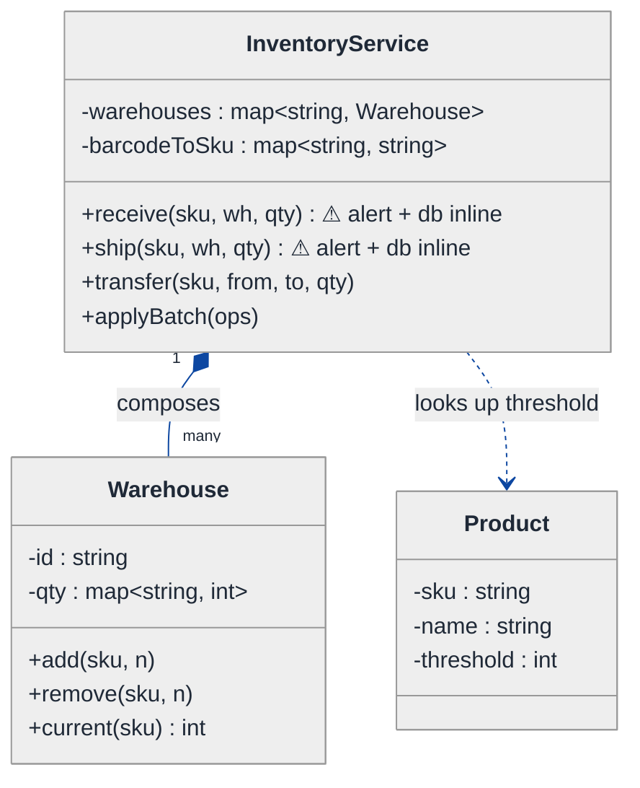
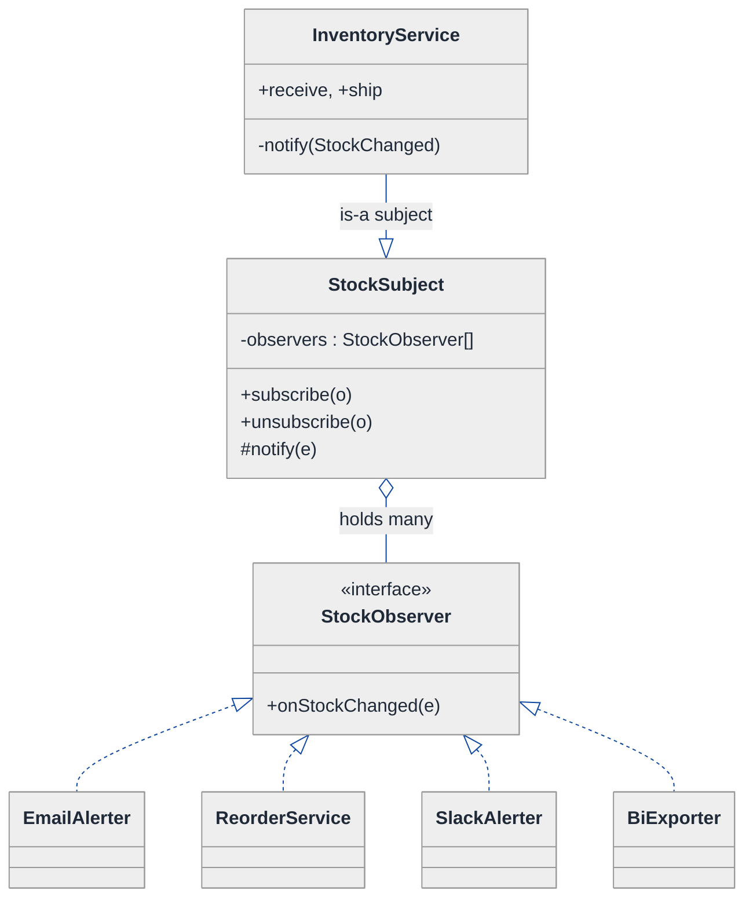
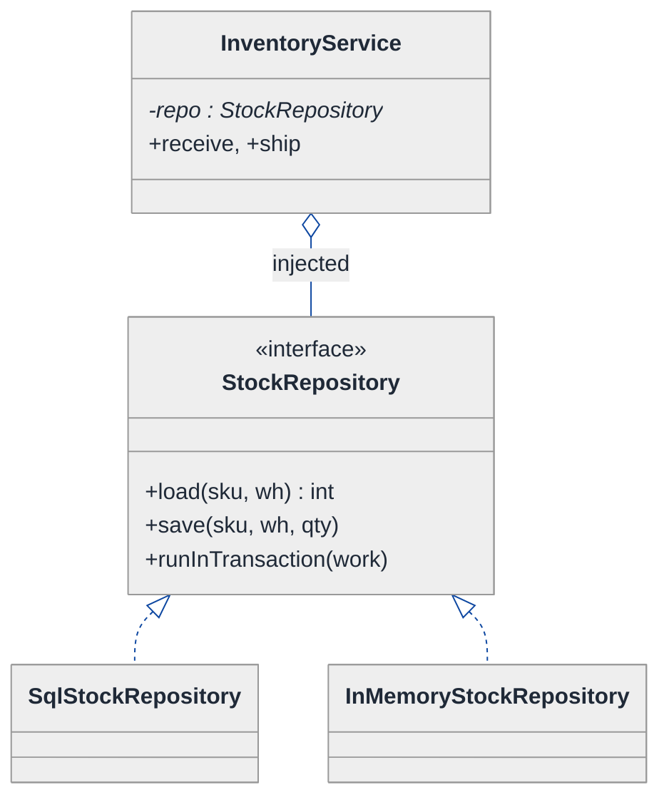
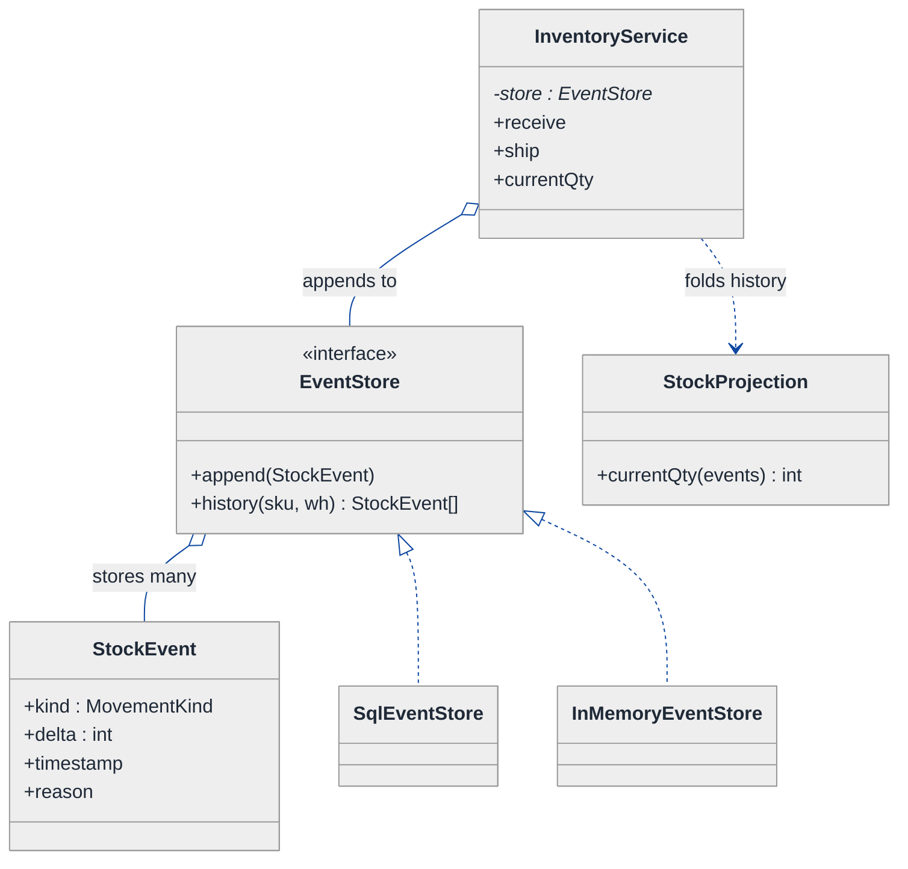
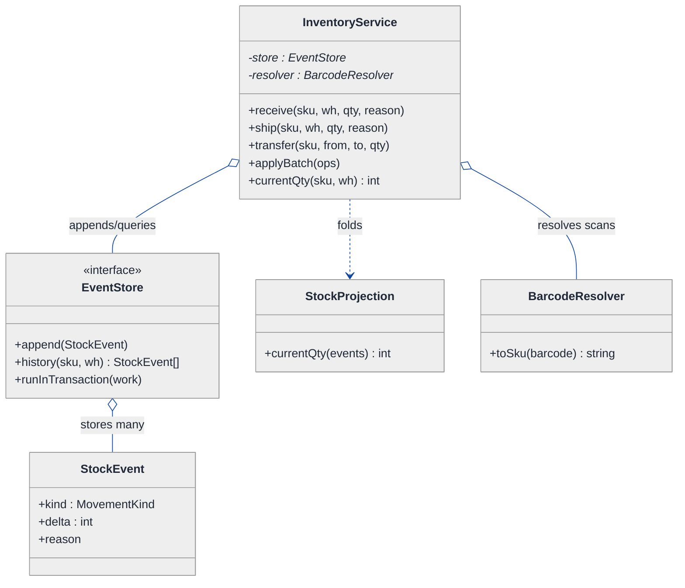
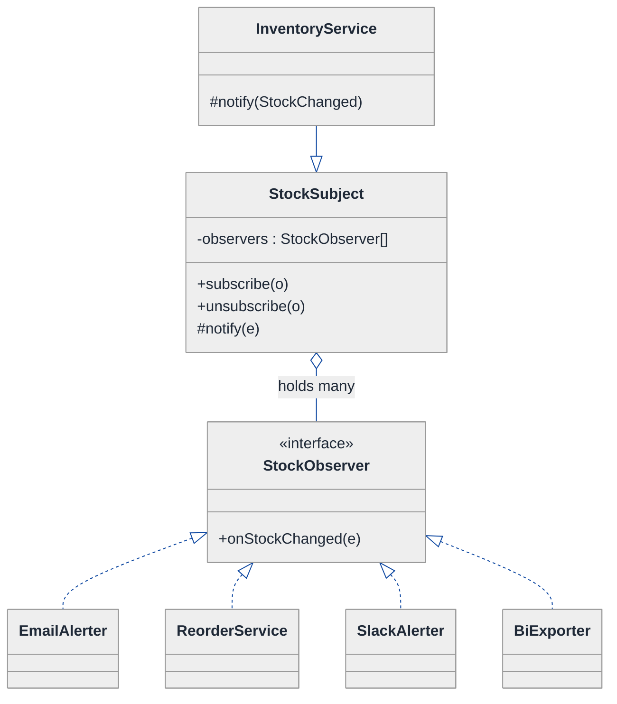
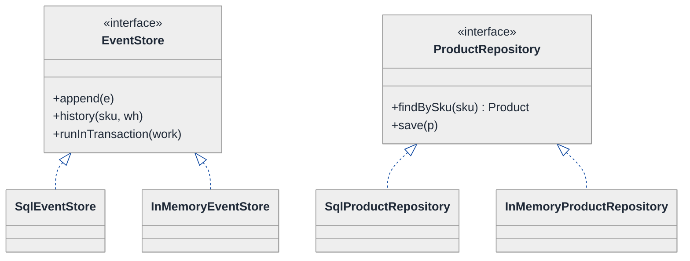
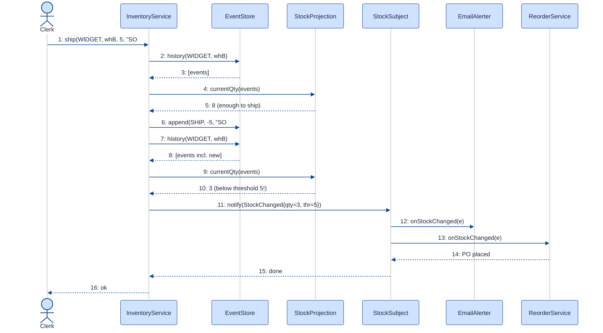

# Inventory Management System — LLD Walkthrough

> **Difficulty:** Medium · **Time:** ~35 min · **Pattern focus:** Observer (stock alerts) + Repository (persistence boundary) + Event Sourcing (auditable stock changes)
>
> **Problem source(s):** GID OB5, bucket `Observer_Pattern`. Representative of multiple LeetLens rows in [`./EXTRACTED_QUESTIONS.md`](./EXTRACTED_QUESTIONS.md).
>
> **Diagrams:** inline mermaid (renders natively in GitHub / VS Code). Theme block copied verbatim from `CONTINUATION.md` §3.

---

## How to use this file

Paced for a candidate seeing the inventory problem for the first time. Reading time: ~35 minutes if you sketch each iteration by hand. **The lesson: don't reach for design patterns up front — DERIVE them. Build the naive design first, watch it break under three or four hypothetical changes, then reach for ONE pattern per painful axis: Observer for "who reacts when stock changes," Repository for "where the data lives," Event Sourcing for "how did we get to this quantity."**

**Map of this file (15 sections):**

1. Problem statement + clarifying questions
2. Plain-English restatement
3. Why this matters
4. Mental model
5. Try it yourself first
6. Entity & verb extraction
7. **Iteration 1: the naive design** — what we'd write first
8. **Where the naive design hurts** — four future requirements, one painful diff each
9. **Pivot 1: Observer for stock alerts** — the most painful axis first
10. **Pivot 2: Repository for persistence** — decouple the domain from storage
11. **Pivot 3: Event Sourcing for stock changes** — the log IS the truth
12. Final UML class diagram
13. Skeleton code (C++)
14. Key flow — sequence diagram
15. Extensibility re-check + anti-patterns + how to think aloud + self-check

---

## 1. Problem statement + clarifying questions

**Prompt (typical phrasing):** "Design an inventory management system for a warehouse with product tracking, stock level alerts, batch operations, multi-warehouse transfer, and barcode/SKU management."

**Clarifying questions to ask BEFORE drawing anything:**

1. **One warehouse or many?** Is stock tracked per-(product, warehouse) pair, or one global quantity? (Multi-warehouse transfer implies per-warehouse.)
2. **What triggers an alert?** A fixed reorder threshold per product? Per warehouse? Multiple thresholds (low-stock, out-of-stock, overstock)?
3. **Who consumes alerts?** Just an email to a buyer, or also a reorder service, a dashboard, an analytics sink? (Determines how many independent reactors there are.)
4. **Do we need an audit trail?** Can someone ask "why is the quantity 7 — show me every change"? Are corrections/reversals required for compliance?
5. **Batch operations atomicity?** If a batch of 500 receipts fails halfway, do we roll back, or is partial application acceptable?
6. **Barcode vs SKU?** Is a SKU the internal identifier and a barcode an external scan code that maps to it? One-to-one or one-to-many (multiple barcodes per SKU)?
7. **Concurrency?** Can two clerks decrement the same product at once? Do we need the final quantity to be correct under races?

**Assumptions if interviewer dodges:** multiple warehouses with per-(SKU, warehouse) quantities; per-product reorder thresholds; multiple independent alert consumers; a full audit trail is required (compliance); batch operations are all-or-nothing; barcode maps many-to-one onto SKU; single-threaded core for now (concurrency discussed in §15).

---

## 2. Plain-English restatement

We're building the software that runs a warehouse's stock book. The system must: identify products by SKU and resolve scanned barcodes to SKUs, track how many units of each product sit in each warehouse, apply receipts and shipments (one at a time or in batches), move stock between warehouses, and **notify interested parties the moment a product crosses a reorder threshold**. On top of that, the business wants to answer "how did this quantity get here" — every change must be auditable and, ideally, replayable. The design must let us add new alert consumers, swap the storage backend, and reconstruct history **without rewriting the core stock-mutation flow**.

---

## 3. Why this matters

This question looks like CRUD but is really a test of three separations. (1) Do you couple the thing that CHANGES stock to the things that REACT to stock, or do you decouple them (Observer)? (2) Do you scatter `INSERT`/`SELECT` through your domain objects, or do you put a persistence boundary in front (Repository)? (3) Do you store only the CURRENT quantity (CRUD — lossy) or the SEQUENCE of changes (Event Sourcing — auditable, replayable)? Most candidates write a class that does all three inline. The senior bar is in DERIVING why each concern wants its own seam.

---

## 4. Mental model

A warehouse inventory is a **ledger plus a switchboard**. The ledger records every stock movement (received 100, shipped 30, transferred 20 out). The switchboard fans each movement out to everyone who cares — the reorder service, the email alerter, the dashboard — without the ledger knowing who is listening.

```
Real-world sketch (NOT a UML diagram yet):

   barcode scan ──► [SKU resolver] ──► SKU "WIDGET-RED"
                                          │
                          ┌───────────────┴───────────────┐
                          ▼                                ▼
                  Warehouse A (qty 12)             Warehouse B (qty 3)  ◄─ below threshold!
                          │                                │
                          └──────────  movement  ──────────┘
                                          │
                                  emits StockChanged
                                          │
            ┌─────────────────┬───────────┴───────────┬─────────────────┐
            ▼                 ▼                        ▼                 ▼
       EmailAlerter      ReorderService          Dashboard         AuditLog (the ledger itself)
```

The KEY insight from this picture: the movement is the *event*; the warehouse quantity is just a *running total* you could recompute from the events; and the alerters are *subscribers* who must not be hardwired into the mutation code. Event / total / subscribers — that is the seam structure we will bake into the design.

---

## 5. Try it yourself first

> **Predict before reading on:**
>
> 1. List 5 nouns you'd promote to a class. List 3 nouns you'd leave as fields.
> 2. **If the business says "next quarter we'll add a Slack alert, a reorder webhook, and a BI export — all triggered by low stock," what would change about how you write the method that decrements stock?**
> 3. If an auditor asks "prove the quantity 7 is correct," where does that proof come from in your design?

---

## 6. Entity & verb extraction

> **Mini-refresher: noun → class, but not every noun.**
>
> Naive OOD promotes every noun to a class. Senior OOD promotes a noun only if it has both BEHAVIOR and STATE that need to live together. "Barcode" is usually just a string field; "Product" becomes a class because it carries identity + reorder policy.

**Nouns from the prompt:**

| Noun | Decision | Why |
|---|---|---|
| InventoryService | Class (top-level coordinator) | Orchestrates receive/ship/transfer |
| Product | Class | Has SKU identity + reorder threshold |
| Warehouse | Class | Holds per-SKU quantities, reports stock |
| StockLevel | Class / value | The (SKU, warehouse) → quantity cell |
| Barcode | Field (`std::string`) + a resolver map | No behavior of its own; maps to a SKU |
| SKU | Field on Product (`std::string`) | An identifier, not a class |
| Alert | Event/message, not a long-lived class | Produced when a threshold is crossed |
| Batch | A list + a transaction boundary | Operation grouping, not domain state |
| Transfer | A method (decrement A, increment B) | An operation across two warehouses |
| Threshold | Field on Product (`int`) | A number, not a class |

**Verbs (and the class they live on):**

| Verb | Owner class (naive answer — we'll re-examine) |
|---|---|
| receive(sku, wh, qty) | InventoryService → Warehouse |
| ship(sku, wh, qty) | InventoryService → Warehouse |
| transfer(sku, from, to, qty) | InventoryService |
| applyBatch(ops) | InventoryService |
| resolveBarcode(code) | InventoryService |
| checkThreshold(...) / alert(...) | Warehouse (naive) |
| currentQty(sku) | Warehouse |

**We have NOT introduced any design patterns yet.** Pure nouns + verbs.

---

## 7. <a id="iter-1"></a>Iteration 1: the naive design

Let's write the simplest thing that could possibly work. No design patterns — just classes with methods that mutate a quantity and check a threshold inline.



**Reader's tour (read top to bottom; ~60 seconds).**

1. **At the top — `InventoryService` is the root.** It holds two maps (warehouses, barcode→SKU) and exposes four mutation methods. Notice: NO observers, NO repository, NO event log. Every concern lives inside these methods.

2. **The composition spine.** The filled diamond (`*--`) marks composition — InventoryService owns its warehouses; they share its lifetime.

3. **The two warning markers (⚠) on `receive` and `ship`.** Each of those methods does THREE unrelated things inline: mutate the quantity, decide whether to fire an alert (and how — email, hardcoded), and persist to the database (hardcoded SQL). That fusion is the smell §8 will exploit.

4. **`Product` is a thin record** — SKU, name, threshold. No behavior yet. The threshold is read by `InventoryService` when it decides whether to alert.

5. **No history anywhere.** `Warehouse::qty` is a single `int` per SKU. When it changes, the old value is GONE. There is no way to answer "how did this become 7."

Skeleton code for the naive design (C++):

```cpp
#include <map>
#include <string>
#include <vector>
#include <stdexcept>
#include <iostream>

struct Product { std::string sku, name; int threshold; };

class Warehouse {
public:
    explicit Warehouse(std::string id) : id_(std::move(id)) {}
    void add(const std::string& sku, int n)    { qty_[sku] += n; }
    void remove(const std::string& sku, int n) {
        if (qty_[sku] < n) throw std::runtime_error("Insufficient stock");
        qty_[sku] -= n;
    }
    int  current(const std::string& sku) const {
        auto it = qty_.find(sku);
        return it == qty_.end() ? 0 : it->second;
    }
    const std::string& id() const { return id_; }
private:
    std::string              id_;
    std::map<std::string,int> qty_;   // ⚠ only the running total — no history
};

class InventoryService {
public:
    void receive(const std::string& sku, const std::string& wh, int qty) {
        auto& w = warehouses_.at(wh);
        w.add(sku, qty);
        db_.execute("UPDATE stock SET qty=? WHERE ...");          // ⚠ persistence inline
        if (w.current(sku) <= products_.at(sku).threshold)        // ⚠ alert decision inline
            sendEmail("buyer@corp", "Low stock: " + sku);         // ⚠ alert delivery hardcoded
    }
    void ship(const std::string& sku, const std::string& wh, int qty) {
        auto& w = warehouses_.at(wh);
        w.remove(sku, qty);
        db_.execute("UPDATE stock SET qty=? WHERE ...");          // ⚠ duplicated
        if (w.current(sku) <= products_.at(sku).threshold)        // ⚠ duplicated
            sendEmail("buyer@corp", "Low stock: " + sku);         // ⚠ duplicated
    }
    void transfer(const std::string& sku, const std::string& from,
                  const std::string& to, int qty) {
        ship(sku, from, qty);
        receive(sku, to, qty);
    }
    std::string resolveBarcode(const std::string& code) { return barcodeToSku_.at(code); }
private:
    void sendEmail(const std::string&, const std::string&) { /* SMTP */ }
    struct Db { void execute(const std::string&) {} } db_;
    std::map<std::string, Warehouse> warehouses_;
    std::map<std::string, Product>   products_;
    std::map<std::string, std::string> barcodeToSku_;
};
```

**This works.** It has zero design patterns. We can receive, ship, transfer, and fire a low-stock email. So what's wrong with it?

---

## 8. <a id="naive-pain"></a>Where the naive design hurts

The interviewer slides a piece of paper across the desk: "Here are four new requirements coming next quarter. Walk me through what changes."

### Change A: "Add a Slack alert, a reorder webhook, and a BI export — all on low stock"

In the naive design:
- `receive()` currently calls `sendEmail(...)` directly. Now it must also call `postSlack(...)`, `callWebhook(...)`, `exportToBI(...)`.
- And `ship()` must do the same — the alert block is DUPLICATED in both methods, so every new consumer is edited in two (soon many) places.
- **The change touches `receive` AND `ship`, and grows them by four lines each, every time a new consumer is added.** The mutation code now knows about Slack, webhooks, and BI. Tight coupling.

### Change B: "Swap the database from MySQL to Postgres, and unit-test without a DB"

In the naive design:
- `db_.execute("UPDATE stock ...")` with raw SQL is wired straight into `receive`/`ship`.
- To test the alert logic you must stand up a real database. To switch vendors you must rewrite the SQL strings inside the domain methods.
- **The change touches every method that persists, and there's no seam to inject a fake.** The domain logic and the storage technology are fused.

### Change C: "Auditor asks: show every change that produced the current quantity, with reversals for mistakes"

In the naive design:
- `Warehouse::qty_` is a single `int`. The previous values are overwritten and lost.
- There is NO record of who changed what, when, or why. A "reversal" cannot be expressed — you can only overwrite again, which is itself unauditable.
- **There is nowhere to add this. The data model is lossy by construction.** This is not a one-method edit; it's a data-model defect.

### Change D: "Batch of 500 operations must be all-or-nothing"

In the naive design:
- `applyBatch(ops)` would loop and call `receive`/`ship`. If op #251 throws, ops 1-250 are already applied AND have already fired alerts and DB writes.
- **No transaction boundary exists; alerts have already gone out for a batch that should have rolled back.** Side effects (emails) are entangled with the mutation, so they can't be deferred until commit.

### The pattern of pain

| Change | Files / methods touched | Smell |
|---|---|---|
| A. More alert consumers | `receive` + `ship` (duplicated block grows) | "Mutation code hardcodes every reactor." |
| B. Swap DB / testability | every persisting method | "Domain logic fused to storage technology." |
| C. Audit trail + reversals | the data model itself | "Only the running total is stored; history is lost." |
| D. Atomic batches | `applyBatch` + entangled side effects | "No transaction boundary; alerts fire before commit." |

**Three axes of pain dominate:** *who reacts* to a change (A), *where data lives* (B), and *how change is recorded* (C, D — both are really "we store totals, not events").

> **Pivot question:** "What pattern lets one producer notify many reactors without knowing who they are? What pattern puts a swappable seam between the domain and storage? What model stores the SEQUENCE of changes instead of just the latest total?"
>
> The answers are Observer, Repository, and Event Sourcing. Let's introduce them one at a time, starting with the most painful axis: alert fan-out.

---

## 9. <a id="pivot-1"></a>Pivot 1: Observer for stock alerts

> **Mini-refresher: Observer pattern.**
>
> A *subject* maintains a list of *observers* and notifies all of them when its state changes — without knowing their concrete types. Observers `subscribe()` to the subject; the subject calls `update(event)` on each. The subject depends only on an abstract observer interface, so new observers are added with zero edits to the subject.
>
> Quick example: a spreadsheet cell (subject) notifies every chart (observer) that references it when its value changes. Add a new chart → it subscribes; the cell's code never changes.

**Why Observer fits stock alerts.** "When stock crosses a threshold, N independent parties must react" is the textbook Observer setup. The producer (the stock-mutation code) should not name Slack, email, webhooks, or BI. It should emit ONE event ("stock changed for SKU X in warehouse Y, new qty Z") and let subscribers decide what to do.

**The refactor (just the alert slice):**

```cpp
struct StockChanged {
    std::string sku;
    std::string warehouse;
    int         newQty;
    int         threshold;
};

class StockObserver {                          // the abstract observer
public:
    virtual ~StockObserver() = default;
    virtual void onStockChanged(const StockChanged& e) = 0;
};

class EmailAlerter : public StockObserver {    // one concrete observer
public:
    void onStockChanged(const StockChanged& e) override {
        if (e.newQty <= e.threshold)
            /* SMTP */ ;
    }
};

class ReorderService : public StockObserver {  // another concrete observer
public:
    void onStockChanged(const StockChanged& e) override {
        if (e.newQty <= e.threshold)
            /* place purchase order */ ;
    }
};
// SlackAlerter, BiExporter elided — each is just one more class

class StockSubject {                           // the subject mix-in
public:
    void subscribe(StockObserver* o)   { observers_.push_back(o); }
    void unsubscribe(StockObserver* o) { /* erase-remove, elided */ }
protected:
    void notify(const StockChanged& e) const {
        for (auto* o : observers_) o->onStockChanged(e);   // fan-out; subject knows no concrete type
    }
private:
    std::vector<StockObserver*> observers_;    // non-owning back-refs (see §15 on weak_ptr)
};
```

`InventoryService` now `notify(...)`s after a mutation instead of calling `sendEmail` inline. The threshold check moves INTO each observer (each decides its own trigger), and adding a consumer is one new `StockObserver` subclass plus one `subscribe()` call.

**What changed — visualized.** Just the alert slice:



**Tour of the after-state.**

1. **`StockSubject` is the new mix-in.** It holds a list of `StockObserver*` and exposes `subscribe`/`unsubscribe` plus a protected `notify`. `InventoryService` inherits it ("is-a subject").
2. **The `<<interface>>` box is the seam.** `StockObserver` has ONE method, `onStockChanged(e)`. The subject depends only on this — never on `EmailAlerter` or `SlackAlerter`.
3. **The open diamond (`o--`) marks aggregation.** The subject holds non-owning back-references to observers; it does not control their lifetime (the wiring code does). That distinction matters for dangling pointers — see §15.
4. **Bottom row: four concrete observers.** Each is independent and self-contained; each decides its own trigger condition. Change A from §8 — add Slack/webhook/BI — is now *three new classes and three `subscribe()` calls*, with ZERO edits to `receive`/`ship`.

**Change A now lands cleanly.** The mutation code emits one event; consumers multiply freely.

**Pattern-discrimination cheatsheet — Observer vs Mediator.**
- *Observer:* one subject broadcasts to many observers; observers don't talk back through the subject. Fan-out is the shape.
- *Mediator:* a hub coordinates many-to-many communication between colleagues; it knows everyone and routes between them.
- *Rule of thumb:* if it's "one thing changed, notify everyone who cares" → Observer. If it's "these N components must coordinate complex interactions through a central broker" → Mediator.

We chose Observer because the relationship is one-directional broadcast (stock changed → reactors), not bidirectional coordination.

---

## 10. <a id="pivot-2"></a>Pivot 2: Repository for persistence

Change B from §8 is still painful — raw SQL is fused into the domain methods, and you can't unit-test without a database. Observer didn't touch this; the variability here is not "who reacts" but "where data lives and how we reach it."

> **Mini-refresher: Repository pattern.**
>
> A repository is an interface that looks like an in-memory collection of domain objects (`get`, `save`, `findBy...`) but hides the actual storage behind it. The domain talks to the interface; a concrete implementation (SQL, in-memory, file) is injected. This is the **Dependency Inversion** part of SOLID in action.

> **Mini-refresher: Dependency Inversion (the "D" in SOLID).**
>
> High-level policy (the inventory domain) should not depend on low-level detail (MySQL). Both should depend on an abstraction (the repository interface). You "invert" the arrow: instead of domain → MySQL, you get domain → interface ← MySQL.

**Why Repository fits persistence.** Storage is a detail that varies (MySQL today, Postgres tomorrow, an in-memory fake in tests). The domain shouldn't know which. Put an interface in front and inject the concrete store.

**The refactor (just the persistence slice):**

```cpp
class StockRepository {                        // the abstraction
public:
    virtual ~StockRepository() = default;
    virtual int  load(const std::string& sku, const std::string& wh) const = 0;
    virtual void save(const std::string& sku, const std::string& wh, int qty) = 0;
    virtual void runInTransaction(const std::function<void()>& work) = 0;  // for batches (§ change D)
};

class SqlStockRepository : public StockRepository {   // production impl
public:
    int  load(const std::string& sku, const std::string& wh) const override { /* SELECT */ return 0; }
    void save(const std::string& sku, const std::string& wh, int qty) override { /* UPSERT */ }
    void runInTransaction(const std::function<void()>& work) override {
        /* BEGIN */ work(); /* COMMIT, or ROLLBACK on throw */
    }
};

class InMemoryStockRepository : public StockRepository {   // test impl — no DB needed
    std::map<std::pair<std::string,std::string>, int> store_;
public:
    int  load(const std::string& sku, const std::string& wh) const override { /* map lookup */ return 0; }
    void save(const std::string& sku, const std::string& wh, int qty) override { store_[{sku,wh}] = qty; }
    void runInTransaction(const std::function<void()>& work) override { work(); }  // trivial
};

class InventoryService {
public:
    InventoryService(std::unique_ptr<StockRepository> repo) : repo_(std::move(repo)) {}  // injected
    // receive()/ship() now call repo_->save(...) instead of raw SQL
private:
    std::unique_ptr<StockRepository> repo_;
};
```

**What changed — visualized.** Just the persistence slice:



**Tour of the after-state.**

1. **`InventoryService` now holds a `StockRepository*`, injected at construction.** It no longer contains a single line of SQL. The open diamond marks aggregation — the service uses the repo (and owns it via `unique_ptr`, but the *type* it depends on is the interface).
2. **The `<<interface>>` declares a collection-like contract:** `load`, `save`, and `runInTransaction`. That last method is the transaction boundary that Change D needs — a batch wraps its operations in one `runInTransaction(...)`, so all-or-nothing comes for free.
3. **Two implementations.** `SqlStockRepository` for production; `InMemoryStockRepository` for tests. Change B from §8 — swap MySQL→Postgres or test without a DB — is now *one new implementation class*, injected at the composition root. The domain doesn't change.

**Pattern-discrimination cheatsheet — Repository vs DAO.**
- *Repository:* presents a *collection of domain objects* abstraction (`findActiveProducts()`), often spanning multiple tables; lives in the domain layer's vocabulary.
- *DAO (Data Access Object):* a thinner, table-oriented CRUD wrapper (`insertRow`, `updateRow`), one per table; speaks the database's vocabulary.
- *Rule of thumb:* if the interface reads like your domain ("save this stock level") → Repository. If it reads like SQL operations on a table → DAO.

We chose Repository because the seam should speak the domain's language and hide whether stock lives in one table or many.

---

## 11. <a id="pivot-3"></a>Pivot 3: Event Sourcing for stock changes

Change C from §8 is still unsolved, and Change D is only half-solved (transactions exist, but side effects still fire mid-batch). The root cause is the same: we store the *running total*, not the *sequence of changes*. The variability here is temporal — "how did we get here" — and no amount of Observer or Repository fixes a lossy data model.

> **Mini-refresher: Event Sourcing.**
>
> Instead of storing the current state and overwriting it, you store an append-only LOG of immutable events (`Received 100`, `Shipped 30`, `TransferredOut 20`). The current state is a *projection* — a fold over the event log. To know the quantity, you replay the events. Corrections are new events (a `Reversal`), never edits to old ones, so the history is complete and tamper-evident.

> **Mini-refresher: Open/Closed Principle (the "O" in SOLID).**
>
> Software entities should be open for extension, closed for modification. A new kind of stock movement should be a new event TYPE, not a new branch inside an existing method.

**Why Event Sourcing fits the audit + batch requirements.** "Show every change that produced quantity 7" is literally "print the event log for this (SKU, warehouse)." "Reversal for a mistake" is a new event, not a destructive edit. And because the current quantity is derived, the side-effecting alerts can be deferred until AFTER the batch's events are committed — fixing Change D's premature-alert problem.

**The refactor (the event model):**

```cpp
enum class MovementKind { RECEIVE, SHIP, TRANSFER_OUT, TRANSFER_IN, ADJUST, REVERSAL };

struct StockEvent {                         // immutable — append only
    std::string  sku;
    std::string  warehouse;
    MovementKind kind;
    int          delta;                     // +received, -shipped
    std::int64_t timestamp;
    std::string  reason;                    // audit: who/why
};

class EventStore {                          // the append-only log (a Repository over events)
public:
    virtual ~EventStore() = default;
    virtual void append(const StockEvent& e) = 0;
    virtual std::vector<StockEvent> history(const std::string& sku,
                                            const std::string& wh) const = 0;
};

// The projection: fold the log into the current quantity.
class StockProjection {
public:
    static int currentQty(const std::vector<StockEvent>& events) {
        int q = 0;
        for (const auto& e : events) q += e.delta;   // pure fold; no branching on kind
        return q;
    }
};
```

Now `receive(sku, wh, 100)` becomes `store_->append({sku, wh, RECEIVE, +100, now(), "PO#123"})`. The quantity is `StockProjection::currentQty(store_->history(sku, wh))`. A reversal is just `append({..., REVERSAL, -100, ...})`.

**What changed — visualized.** The event model and its projection:



**Tour of the after-state.**

1. **`Warehouse::qty` (the lossy `int`) is gone.** Quantity is no longer stored; it is DERIVED by `StockProjection::currentQty(history)`, a pure fold over the event list.
2. **`StockEvent` is immutable.** Once appended it's never edited. A mistake is corrected with a `REVERSAL` event — the log only grows.
3. **`EventStore` is itself a Repository** (append + query). It has SQL and in-memory implementations, reusing the seam from Pivot 2. Change C — "show every change" — is `store_->history(sku, wh)`. The audit trail is the data model, not an add-on.
4. **Batches become safe.** All events for a batch are appended inside `repo->runInTransaction(...)`; observers are notified only after commit succeeds — so Change D's premature-alert bug disappears.

**Pattern-discrimination cheatsheet — Event Sourcing vs CRUD-with-audit-table.**
- *CRUD + audit table:* you store current state AND separately log changes; the two can drift, and the "truth" is the mutable state row.
- *Event Sourcing:* the log IS the truth; current state is always re-derivable, so they cannot drift.
- *Rule of thumb:* if losing the audit log would corrupt your answer to "what's the quantity now" → Event Sourcing. If the log is merely a nice-to-have alongside an authoritative state table → CRUD + audit.

We chose Event Sourcing because the audit trail and the quantity are the SAME data viewed two ways — and compliance makes the log authoritative.

> **Mini-refresher: why a snapshot is the standard optimization.**
>
> Folding millions of events on every read is slow. The fix is a *snapshot*: periodically store the projected quantity as-of event N, then replay only events after N. The snapshot is a cache of the fold, never the source of truth. Worth mentioning aloud; implementation elided here.

---

## 12. <a id="fig-class-diagram"></a>Final class diagram

Showing the entire final design in one diagram becomes a wall of boxes. Instead, here are **three focused sub-views**, each addressing one of the three patterns. Read them in order; the structural insight at the end ties them together.

### 12.1 The command side — service + event store + projection



**Tour of 12.1.** `InventoryService` is the orchestrator. It writes movements as `StockEvent`s through the `EventStore` (a Repository over events), derives quantities via the `StockProjection` fold, and turns scanned barcodes into SKUs through the `BarcodeResolver`. There is no stored `qty` field anywhere — that is the Event Sourcing decision made visible.

### 12.2 The notification side — Observer fan-out



**Tour of 12.2.** After a movement commits, `InventoryService` (which IS-A `StockSubject`) calls `notify(StockChanged{...})`. Every subscribed `StockObserver` reacts independently. The subject knows none of the concrete observer types — adding a reactor never touches the mutation code.

### 12.3 The storage side — Repository implementations



**Tour of 12.3.** Two repository interfaces — one for the append-only event log, one for product metadata (SKU, name, threshold). Each has a SQL implementation for production and an in-memory implementation for tests. Swapping vendors or testing without a DB is a new implementation class, injected at the composition root.

### Structural insight (ties 12.1 + 12.2 + 12.3 together)

| Concern | Pattern used | Why |
|---|---|---|
| **Who reacts** to stock changes | Observer, subject = InventoryService | One producer, many independent reactors; producer must not name them |
| **Where data lives** | Repository (EventStore + ProductRepository), INJECTED | Storage is a swappable detail; domain depends on an interface |
| **How change is recorded** | Event Sourcing | Audit + replay + reversals require the SEQUENCE, not just the total |

The big lesson: these three patterns are *orthogonal* — each owns a different seam. Observer decouples the producer from reactors; Repository decouples the domain from storage; Event Sourcing decouples current state from how it was reached. Bolting all three onto one inline method (the naive design) is exactly the coupling we removed.

---

## 13. Skeleton code (C++)

> Show the SHAPES, not the full impl. ~130 lines.

```cpp
#include <cstdint>
#include <functional>
#include <map>
#include <memory>
#include <string>
#include <vector>
#include <stdexcept>
#include <algorithm>

// ── Domain value types ──────────────────────────────────────────────
enum class MovementKind { RECEIVE, SHIP, TRANSFER_OUT, TRANSFER_IN, ADJUST, REVERSAL };

struct StockEvent {                       // immutable, append-only
    std::string  sku, warehouse, reason;
    MovementKind kind;
    int          delta;                   // signed: +in, -out
    std::int64_t timestamp;
};

struct StockChanged { std::string sku, warehouse; int newQty; int threshold; };

struct Product { std::string sku, name; int threshold; };

// ── Repository seam (Pivot 2) ───────────────────────────────────────
class EventStore {
public:
    virtual ~EventStore() = default;
    virtual void append(const StockEvent& e) = 0;
    virtual std::vector<StockEvent> history(const std::string& sku,
                                            const std::string& wh) const = 0;
    virtual void runInTransaction(const std::function<void()>& work) = 0;
};
class InMemoryEventStore : public EventStore {
    std::vector<StockEvent> log_;
public:
    void append(const StockEvent& e) override { log_.push_back(e); }
    std::vector<StockEvent> history(const std::string& sku, const std::string& wh) const override {
        std::vector<StockEvent> out;
        for (const auto& e : log_) if (e.sku == sku && e.warehouse == wh) out.push_back(e);
        return out;
    }
    void runInTransaction(const std::function<void()>& work) override { work(); }
};
// class SqlEventStore : public EventStore { /* BEGIN/COMMIT/ROLLBACK + SQL */ };  // elided

class ProductRepository {
public:
    virtual ~ProductRepository() = default;
    virtual Product findBySku(const std::string& sku) const = 0;
};
// concrete product repos elided

// ── Projection (Pivot 3) ────────────────────────────────────────────
struct StockProjection {
    static int currentQty(const std::vector<StockEvent>& es) {
        int q = 0; for (const auto& e : es) q += e.delta; return q;   // pure fold
    }
};

// ── Barcode/SKU management ──────────────────────────────────────────
class BarcodeResolver {                   // many barcodes → one SKU
    std::map<std::string, std::string> map_;
public:
    void link(const std::string& barcode, const std::string& sku) { map_[barcode] = sku; }
    std::string toSku(const std::string& barcode) const { return map_.at(barcode); }
};

// ── Observer seam (Pivot 1) ─────────────────────────────────────────
class StockObserver {
public:
    virtual ~StockObserver() = default;
    virtual void onStockChanged(const StockChanged& e) = 0;
};
class EmailAlerter : public StockObserver {
public:
    void onStockChanged(const StockChanged& e) override {
        if (e.newQty <= e.threshold) { /* SMTP send */ }
    }
};
// ReorderService, SlackAlerter, BiExporter elided — one class each

class StockSubject {
    std::vector<StockObserver*> observers_;     // non-owning back-refs
public:
    void subscribe(StockObserver* o)   { observers_.push_back(o); }
    void unsubscribe(StockObserver* o) {
        observers_.erase(std::remove(observers_.begin(), observers_.end(), o), observers_.end());
    }
protected:
    void notify(const StockChanged& e) const { for (auto* o : observers_) o->onStockChanged(e); }
};

// ── The coordinator: composes all three patterns ────────────────────
class InventoryService : public StockSubject {
public:
    InventoryService(std::unique_ptr<EventStore> store,
                     std::unique_ptr<ProductRepository> products,
                     BarcodeResolver resolver)
        : store_(std::move(store)), products_(std::move(products)),
          resolver_(std::move(resolver)) {}

    void receive(const std::string& sku, const std::string& wh, int qty, const std::string& reason) {
        record(sku, wh, MovementKind::RECEIVE, +qty, reason);
    }
    void ship(const std::string& sku, const std::string& wh, int qty, const std::string& reason) {
        if (currentQty(sku, wh) < qty) throw std::runtime_error("Insufficient stock");
        record(sku, wh, MovementKind::SHIP, -qty, reason);
    }
    void transfer(const std::string& sku, const std::string& from,
                  const std::string& to, int qty) {
        store_->runInTransaction([&] {                         // atomic across two warehouses
            record(sku, from, MovementKind::TRANSFER_OUT, -qty, "xfer", /*defer*/true);
            record(sku, to,   MovementKind::TRANSFER_IN,  +qty, "xfer", /*defer*/true);
        });
        emitFor(sku, from); emitFor(sku, to);                  // notify only AFTER commit
    }
    void applyBatch(const std::vector<StockEvent>& ops) {      // all-or-nothing (Change D)
        store_->runInTransaction([&] { for (const auto& e : ops) store_->append(e); });
        for (const auto& e : ops) emitFor(e.sku, e.warehouse);
    }
    int currentQty(const std::string& sku, const std::string& wh) const {
        return StockProjection::currentQty(store_->history(sku, wh));
    }
    std::string skuForScan(const std::string& barcode) const { return resolver_.toSku(barcode); }

private:
    void record(const std::string& sku, const std::string& wh, MovementKind k,
                int delta, const std::string& reason, bool defer = false) {
        store_->append({sku, wh, reason, k, delta, /*ts*/0});
        if (!defer) emitFor(sku, wh);
    }
    void emitFor(const std::string& sku, const std::string& wh) {
        notify({sku, wh, currentQty(sku, wh), products_->findBySku(sku).threshold});
    }
    std::unique_ptr<EventStore>        store_;
    std::unique_ptr<ProductRepository> products_;
    BarcodeResolver                    resolver_;
};
```

---

## 14. <a id="fig-sequence"></a>Key flow — sequence diagram

The flow worth tracing is **ship a unit that crosses the reorder threshold**: it touches all three patterns. Watch what the patterns HIDE from the caller — no SQL, no `if (observer == email)`, no stored quantity.



**Tour of the flow. Read it slowly — it's the moment all three patterns cooperate.**

1. **Clerk calls `ship(...)`.** The caller passes a SKU, warehouse, quantity, and a `reason` for the audit trail. No SQL, no observer list — just intent.
2. **Steps 2-5: the current quantity is DERIVED, not read.** The service asks the `EventStore` for the history and folds it via `StockProjection`. This is Event Sourcing — there is no `qty` column to `SELECT`.
3. **Step 6: the movement is recorded as an immutable event.** `append(SHIP, -5, ...)`. Nothing is overwritten; the log grows. An auditor can later replay exactly this.
4. **Steps 7-10: re-project to get the new quantity.** It's now 3, below the threshold of 5. Notice the *service* doesn't decide who to alert — it just builds a `StockChanged` event.
5. **Step 11: fan-out.** `notify(StockChanged{...})` hands the event to the subject. The service named NO concrete observer.
6. **Steps 12-14: each observer reacts independently.** `EmailAlerter` sends mail; `ReorderService` places a purchase order. Adding a Slack alert tomorrow inserts a step 12.5 with zero edits here.

### The coupling that's NOT shown — and why it matters

You don't see a `SELECT`/`UPDATE`, an `if (method == EMAIL)`, or a stored `qty` field anywhere in this diagram. That's the point of the three seams: **storage is behind the Repository, reactors are behind the Observer interface, and quantity is behind the projection.** The service orchestrates intent; the patterns hide the detail.

---

## 15. Extensibility re-check + anti-patterns + how to think aloud + self-check

### Extensibility re-check

Revisit the four changes from [§8](#naive-pain). For each, name the SINGLE seam that absorbs it.

| Change | Naive design impact | Final design impact |
|---|---|---|
| A. More alert consumers | `receive` + `ship` edited repeatedly | New `StockObserver` subclass + one `subscribe()`. Done. |
| B. Swap DB / testability | every persisting method | New `EventStore` / `ProductRepository` impl, injected. Done. |
| C. Audit trail + reversals | impossible (lossy model) | `store_->history(...)`; a reversal is one new event. Done. |
| D. Atomic batches | premature alerts mid-batch | Wrap in `runInTransaction`; notify after commit. Done. |

Every change is exactly one new class or one method call in the final design. That's open/closed in practice.

If a future requirement makes you change `InventoryService`, the `EventStore`, AND the observers together — go back to §6 and re-identify the seams; you fused two concerns.

### Common confusion + traps

1. **"Should each observer get the full event or just a signal?"** Push the event (the `StockChanged` payload) so observers don't call back into the subject to fetch state — that's the push model, and it avoids re-entrancy. Pull is fine when the payload would be huge.
2. **"Why non-owning observer pointers (or `weak_ptr`)?"** The subject must NOT own observer lifetimes — observers usually outlive or are owned elsewhere. Raw back-refs risk dangling if an observer dies while subscribed; in production prefer `std::weak_ptr<StockObserver>` and skip expired ones during `notify`.
3. **"Isn't re-projecting on every read slow?"** Yes at scale — add a snapshot (cache the fold as-of event N, replay the tail). The snapshot is never the source of truth.
4. **"Why not store the quantity AND the events?"** That's CRUD-with-audit; the two can drift and you must keep them in sync. Event Sourcing makes quantity a pure function of the log, so drift is impossible.
5. **"Where does barcode→SKU live?"** In a small `BarcodeResolver` (many-to-one map), injected into the service. It is lookup, not lifecycle, so it's not an event-sourced aggregate.

### Anti-patterns

- **"God service"** — `InventoryService` doing mutation + alerting + SQL + history inline (the naive design). Split each into a seam.
- **"Observer notified inside the transaction"** — firing alerts before commit, so a rollback leaves emails already sent. Notify after commit.
- **"Leaky Repository"** — a repo interface that returns raw SQL rows or a `ResultSet`. Return domain objects; hide the storage vocabulary.
- **"Event soup"** — events so fine-grained (one per field) or so coarse (one per batch) that projections become unreadable. Model events at the business-movement grain.
- **"Mutable events"** — editing an old event to 'fix' history. Append a reversal instead; events are immutable.
- **"Subject owns observers"** — `unique_ptr<StockObserver>` inside the subject, coupling lifetimes. Use non-owning back-refs / `weak_ptr`.

### How to think aloud

> "Inventory system. Let me clarify scope. [Asks the §1 questions — multi-warehouse? alert consumers? audit trail? batch atomicity?] Got it: per-(SKU, warehouse) quantities, multiple alert consumers, compliance audit trail, atomic batches.
>
> Nouns: InventoryService, Product, Warehouse, StockLevel. Verbs: receive, ship, transfer, applyBatch, resolveBarcode, alert. Barcode is a field that maps to a SKU.
>
> I'll write the NAIVE design first — no patterns. `receive`/`ship` mutate a quantity int, run inline SQL, and send a low-stock email inline.
>
> Now I stress-test it. Change A: add Slack/webhook/BI alerts — the mutation methods hardcode every reactor, duplicated across receive and ship. Change B: swap the DB or unit-test — SQL is fused into the domain. Change C: auditor wants every change with reversals — but I only store the running total; history is gone. Change D: atomic batch — no transaction boundary, and alerts fire mid-batch.
>
> Three axes: who reacts, where data lives, how change is recorded. Observer, Repository, Event Sourcing.
>
> Pivot 1: alerts become an Observer fan-out. InventoryService is a StockSubject; EmailAlerter, ReorderService, SlackAlerter subscribe. Mutation code emits one StockChanged event and never names a reactor.
>
> Pivot 2: persistence goes behind a Repository interface — SqlEventStore in prod, InMemory in tests, injected. The interface also gives me runInTransaction for atomic batches.
>
> Pivot 3: I stop storing the quantity. Each movement is an immutable StockEvent appended to an EventStore; the quantity is a fold over the log. Audit is history(); a reversal is a new event; batch alerts fire only after commit.
>
> Final design: InventoryService orchestrates; Observer for reactors, Repository for storage, Event Sourcing for the ledger. All four future changes become one new class or one call each. Open/closed."

### Self-check

> **Self-check — the question to ask next time.**
>
> When you see "design a system that tracks X and notifies/alerts when X changes," before writing the mutation method, ask three questions in order:
>
> > **"WHO needs to react when state changes (Observer)? WHERE does the state live, and can I swap it (Repository)? Do I need to store the SEQUENCE of changes or just the latest value (Event Sourcing)?"**
>
> One reactor that's fixed forever → maybe no Observer. One storage backend forever, fully testable → maybe no Repository. Latest value is all anyone ever asks for → maybe no Event Sourcing. But the moment any of those three answers is "it varies / we must prove history," you've found the seam — and the class diagram falls out for free.

---

## Cross-references

- **Parent topic manifest:** [`./EXTRACTED_QUESTIONS.md`](./EXTRACTED_QUESTIONS.md)
- **Vertical overview:** [`../../LEARNING.md`](../../LEARNING.md)
- **Template:** [`../../TEMPLATE-v2.md`](../../TEMPLATE-v2.md)
- **Canonical exemplar:** [`../Object_Oriented_Design/Parking_Lot.md`](../Object_Oriented_Design/Parking_Lot.md)
- **Related v2 walkthroughs (future):**
  - Repository Pattern deep-dive (in `../Repository_Pattern/`)
  - Event Sourcing deep-dive (in `../Event_Sourcing/`)
  - Command Pattern (undo/redo for batch reversals) (in `../Command_Pattern/`)
- **Further reading:**
  - <a href="https://martinfowler.com/eaaDev/EventSourcing.html" target="_blank" rel="noopener noreferrer">Martin Fowler — Event Sourcing</a>
  - <a href="https://refactoring.guru/design-patterns/observer" target="_blank" rel="noopener noreferrer">Refactoring Guru — Observer</a>
  - <a href="https://martinfowler.com/eaaCatalog/repository.html" target="_blank" rel="noopener noreferrer">Martin Fowler — Repository</a>
