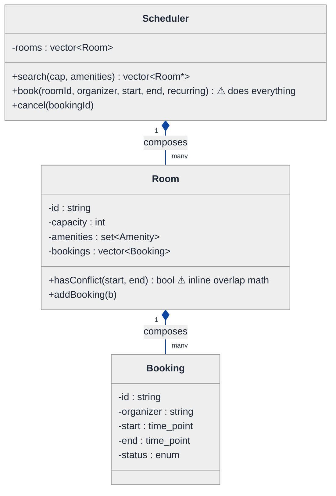
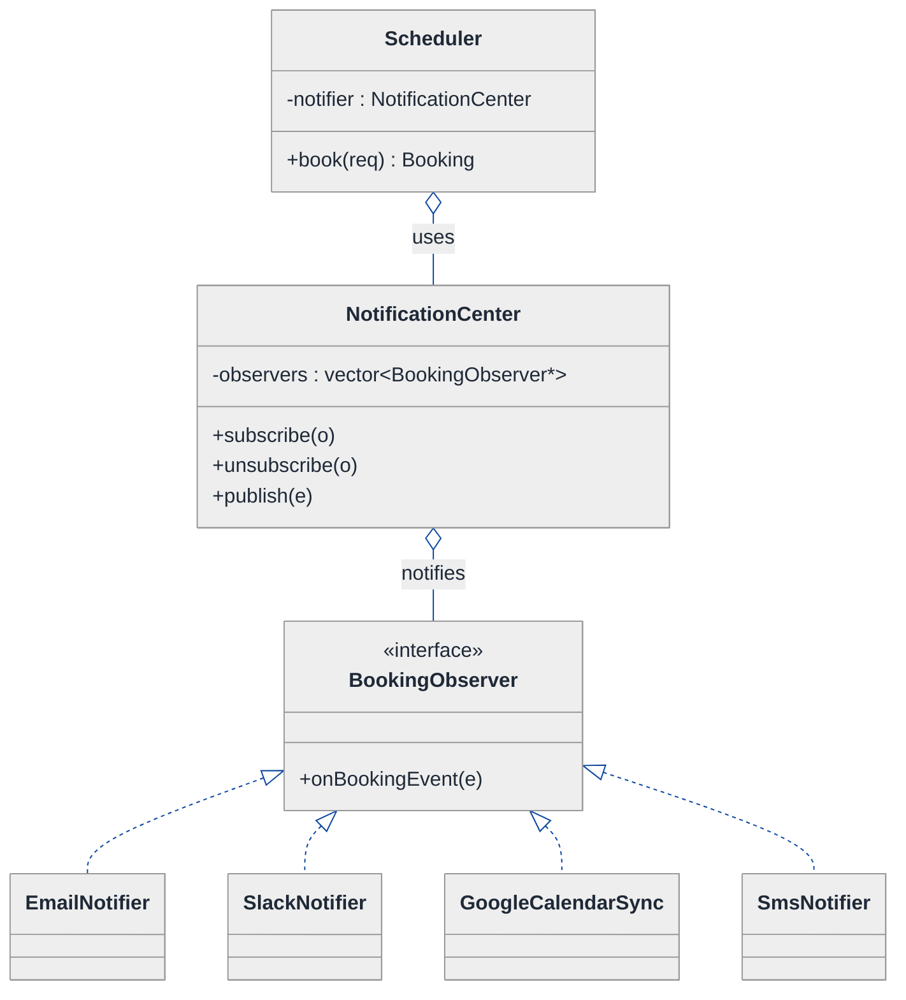
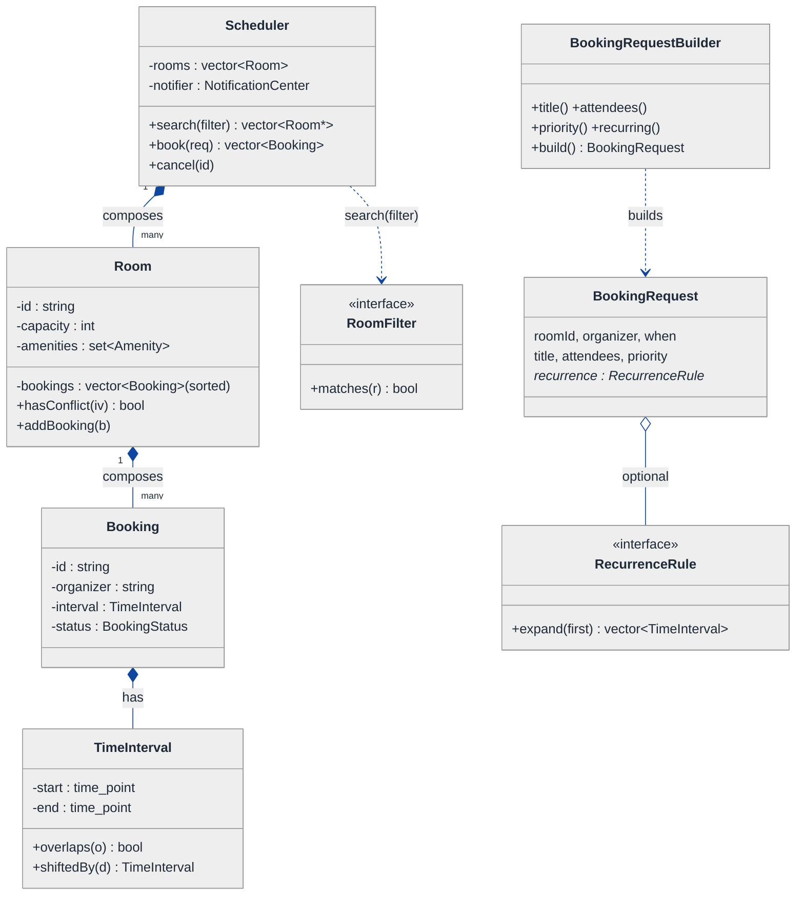
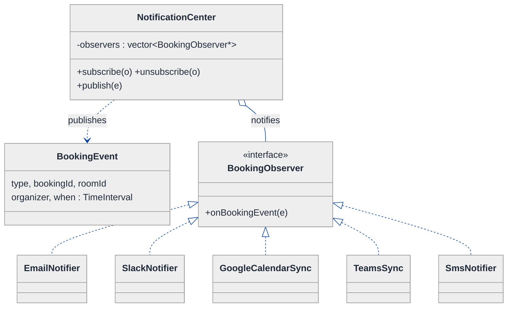
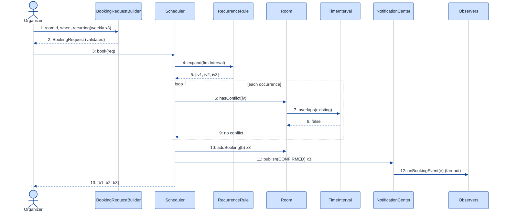

# Meeting Room Scheduler — LLD Walkthrough

> **Difficulty:** Medium · **Time:** ~30 min · **Pattern focus:** Observer (calendar notifications) + Builder (booking request) + interval logic (conflict detection)
>
> **Problem source(s):** GID **OB6**, bucket `Observer_Pattern` — representative of "design a scheduler / booking system with notifications" LeetLens rows. See [`./EXTRACTED_QUESTIONS.md`](./EXTRACTED_QUESTIONS.md).
>
> **Diagrams:** inline mermaid (renders natively in GitHub / VS Code). No external sources.

---

## How to use this file

Paced for a candidate seeing the meeting-room scheduler for the first time. Reading time: ~30 minutes if you sketch each iteration by hand. **The lesson: don't reach for design patterns up front — DERIVE them. Build the naive design first, watch it break under three or four hypothetical changes, then reach for ONE pattern at a time to fix the most painful axis.**

**Map of this file (15 sections):**

1. Problem statement + clarifying questions
2. Plain-English restatement
3. Why this matters
4. Mental model
5. Try it yourself first
6. Entity & verb extraction
7. **Iteration 1: the naive design** — what we'd write first
8. **Where the naive design hurts** — four future requirements, one painful diff each
9. **Pivot 1: interval logic for conflict detection** — the correctness axis first
10. **Pivot 2: Observer for calendar notifications** — fan-out without coupling
11. **Pivot 3: Builder for the booking request** (+ Strategy for recurrence & search)
12. Final UML class diagram
13. Skeleton code (C++)
14. Key flow — sequence diagram
15. Extensibility re-check + anti-patterns + how to think aloud + self-check

---

## 1. Problem statement + clarifying questions

**Prompt (typical phrasing):** "Design a meeting room scheduler for an office building. Support room search by capacity and amenities, booking with conflict detection, recurring meetings, and integration with calendar notifications."

**Clarifying questions to ask BEFORE drawing anything:**

1. **Scope of the building?** One building, many floors, many rooms? Are rooms grouped by floor / wing, and does search span the whole building or one floor?
2. **Amenities?** Fixed catalog (projector, whiteboard, VC, phone) or free-form tags? Does search require ALL requested amenities or ANY?
3. **Conflict rule?** Hard block on any time overlap, or do we allow back-to-back (10:00–11:00 then 11:00–12:00 is fine)? Half-open intervals `[start, end)`?
4. **Recurring meetings?** What recurrence kinds — daily, weekly-on-days, every-N-weeks, "last Friday of month"? Is there an end date or an occurrence count? What happens when ONE occurrence conflicts — reject the whole series or skip that one?
5. **Notifications?** Who gets told and on which channel — email, Slack, push, the organizer's calendar? Synchronous (block the booking) or fire-and-forget?
6. **Cancellation / reschedule?** Can a booking be cancelled or moved? Does that re-notify everyone?
7. **Concurrency?** Two people booking the same room at the same instant — must not double-book.
8. **Time zones?** Single building TZ, or attendees across zones?

**Assumptions if the interviewer dodges:** one building with many rooms; a fixed amenity catalog with "must have ALL"; half-open `[start, end)` intervals so back-to-back is allowed; recurrence = daily / weekly-on-days with an end date, reject the whole series if any occurrence conflicts; notifications fan out to multiple channels fire-and-forget; cancellation re-notifies; single-threaded for now (concurrency discussed in §15).

---

## 2. Plain-English restatement

We're building the software that runs the meeting rooms in an office building. The system must: let a user search for rooms by capacity and amenities, book a room for a time window while rejecting any window that overlaps an existing booking, expand a recurring request into many bookings, and — once a booking is confirmed — tell a bunch of interested parties (email, Slack, the organizer's calendar) that it happened. The design must accommodate **new notification channels, new recurrence rules, and new search filters without rewriting the core booking flow.**

---

## 3. Why this matters

This question probes whether you can keep three independent concerns from collapsing into one method: **correctness** (interval overlap math), **fan-out** (telling N listeners without the booker knowing who they are), and **request construction** (a booking has many optional fields). Most candidates jam all three into a single `book()` method with a list of email sends at the bottom and an `if (recurring)` branch in the middle. The senior bar is recognizing that "who gets notified" is an Observer axis, "how a request is assembled" is a Builder axis, and "do these intervals overlap" is a correctness primitive that should live in one tested place. The same shape reappears in calendar apps, CI schedulers, and reservation systems.

---

## 4. Mental model

A scheduler is a **set of rooms**, each holding a **sorted timeline of booked intervals**, plus a **broadcast bus** that announces every confirmed change. Booking is "find a gap in the timeline and claim it." Notification is "shout into the bus; whoever subscribed hears it."

```
Real-world sketch (NOT a UML diagram yet):

   Room "Olympus" (cap 12, [projector, VC])
   timeline:  ──[09:00–10:00]──[11:00–11:30]────────────[14:00–15:00]──►
                                       ▲
                              new request 11:15–12:00  ✗ overlaps 11:00–11:30

   On CONFIRM, fire an event into the bus:
        BookingConfirmed(room=Olympus, 14:00–15:00, organizer=Maya)
                 │
        ┌────────┼─────────────┬───────────────┐
        ▼        ▼             ▼               ▼
     Email    Slack       Google Cal      Audit log
   (each one SUBSCRIBED; the booker never named them)
```

The KEY insight from this picture: **the timeline is the source of truth for conflicts; the bus is the source of truth for "who cares."** Keep them separate. The booker talks to the timeline; the bus talks to the listeners.

---

## 5. Try it yourself first

> **Predict before reading on:**
>
> 1. List 5 nouns you'd promote to a class. List 3 nouns you'd leave as fields.
> 2. **If I told you a new "Microsoft Teams calendar" notification target lands next sprint, and an "SMS" one the sprint after — what would change about how `book()` confirms a booking?**
> 3. Two requested intervals are `[11:00, 11:30)` and `[11:30, 12:00)`. Do they conflict? What's the single comparison that decides it?

---

## 6. Entity & verb extraction

> **Mini-refresher: noun → class, but not every noun.**
>
> Naive OOD promotes every noun to a class. Senior OOD promotes a noun only if it has both BEHAVIOR and STATE that need to live together. "Capacity" stays a field; "booking" becomes a class because it has identity and a lifecycle.

**Nouns from the prompt:**

| Noun | Decision | Why |
|---|---|---|
| Scheduler | Class (top-level coordinator) | Owns rooms, orchestrates search/book |
| Room | Class | Has capacity, amenities, a timeline of bookings |
| Booking | Class | Identity, organizer, interval, lifecycle |
| TimeInterval | Class (value object) | Owns the overlap math — one tested place |
| Amenity | `enum class` field on Room | No behavior of its own |
| Capacity | Field on Room (`int`) | A number |
| RecurrenceRule | Class (abstract) — added in Pivot 3 | Expands into many intervals; varies |
| Notification target (email/Slack/cal) | Class (observer) — added in Pivot 2 | Reacts to events; the set varies |
| User / Organizer | Field on Booking (`std::string` id) | No domain behavior here |

**Verbs (and the class they live on):**

| Verb | Owner class (naive answer — we'll re-examine) |
|---|---|
| search(capacity, amenities) | Scheduler |
| book(request) | Scheduler |
| overlaps(other) | TimeInterval |
| addBooking(interval) | Room |
| hasConflict(interval) | Room |
| notify(event) | Scheduler (naive — we'll move this) |
| cancel(bookingId) | Scheduler |

**We have NOT introduced any design patterns yet.** Pure nouns + verbs.

---

## 7. <a id="iter-1"></a>Iteration 1: the naive design

Let's write the simplest thing that could possibly work. No design patterns — just classes with methods.



**Reader's tour (read top to bottom; ~60 seconds).**

1. **At the top — `Scheduler` is the root.** It holds ONE field (`rooms`) and exposes three public methods. Notice the warning marker on `book(...)`: in the naive design, this single method does the conflict check, creates the booking, expands recurrence inline, AND fires off the notifications. Everything funnels through it.

2. **The composition spine.** The filled diamonds (`◆`) mark composition — strong ownership / same lifetime. Scheduler composes `Room[]`; each Room composes `Booking[]`. If the scheduler dies, every room and booking dies with it.

3. **`Room::hasConflict(start, end)` — trouble zone #1.** The overlap math is written INLINE inside Room, comparing raw `time_point` pairs. That logic (the half-open `[start, end)` overlap test) is easy to get subtly wrong, and it lives nowhere reusable — recurrence expansion will want the same test and will re-implement it.

4. **`Booking` is a data bag with a status enum.** Fine for now; it has no behavior yet.

5. **What's deliberately missing.** No `TimeInterval` value object — the overlap test is loose inside Room. No notification abstraction — the sends are hardcoded at the bottom of `book()`. No `RecurrenceRule` — recurrence is an `if (recurring)` branch. No request object — `book()` has a telescoping parameter list. The naive design doesn't even *acknowledge* these are axes of variation. That's what we'll expose, and fix, over the next four sections.

Skeleton code for the naive design (C++):

```cpp
#include <chrono>
#include <set>
#include <stdexcept>
#include <string>
#include <vector>

using TimePoint = std::chrono::system_clock::time_point;

enum class Amenity       { PROJECTOR, WHITEBOARD, VIDEO_CONF, PHONE };
enum class BookingStatus { CONFIRMED, CANCELLED };

struct Booking {
    std::string  id;
    std::string  organizer;
    TimePoint    start;
    TimePoint    end;
    BookingStatus status = BookingStatus::CONFIRMED;
};

class Room {
public:
    Room(std::string id, int cap, std::set<Amenity> am)
        : id_(std::move(id)), capacity_(cap), amenities_(std::move(am)) {}

    int capacity() const { return capacity_; }
    bool hasAmenities(const std::set<Amenity>& need) const {
        for (auto a : need) if (!amenities_.count(a)) return false;
        return true;
    }
    bool hasConflict(TimePoint s, TimePoint e) const {   // inline overlap — will hurt
        for (const auto& b : bookings_) {
            if (b.status == BookingStatus::CANCELLED) continue;
            if (s < b.end && b.start < e) return true;     // half-open overlap, hand-rolled
        }
        return false;
    }
    void addBooking(const Booking& b) { bookings_.push_back(b); }
private:
    std::string       id_;
    int               capacity_;
    std::set<Amenity> amenities_;
    std::vector<Booking> bookings_;
};

class Scheduler {
public:
    explicit Scheduler(std::vector<Room> rooms) : rooms_(std::move(rooms)) {}

    std::vector<Room*> search(int cap, const std::set<Amenity>& need) {
        std::vector<Room*> out;
        for (auto& r : rooms_)
            if (r.capacity() >= cap && r.hasAmenities(need)) out.push_back(&r);
        return out;
    }

    // does EVERYTHING — conflict check, create, recurrence, notify
    Booking book(Room& room, const std::string& organizer,
                 TimePoint s, TimePoint e, bool recurringWeekly, int weeks) {
        if (recurringWeekly) {                              // recurrence inline — will hurt
            for (int w = 0; w < weeks; ++w) {
                auto ws = s + std::chrono::hours(24 * 7 * w);
                auto we = e + std::chrono::hours(24 * 7 * w);
                if (room.hasConflict(ws, we))
                    throw std::runtime_error("Series conflict");
            }
        }
        if (room.hasConflict(s, e)) throw std::runtime_error("Conflict");
        Booking b{ "bk-...", organizer, s, e };
        room.addBooking(b);

        // notifications hardcoded at the bottom — will hurt
        sendEmail(organizer, b);
        postSlack(b);
        pushToGoogleCalendar(b);
        return b;
    }
private:
    void sendEmail(const std::string&, const Booking&) { /* SMTP */ }
    void postSlack(const Booking&)                      { /* Slack webhook */ }
    void pushToGoogleCalendar(const Booking&)           { /* GCal API */ }
    std::vector<Room> rooms_;
};
```

**This works.** It has zero design patterns. We can search, book, reject conflicts, and notify. So what's wrong with it?

---

## 8. <a id="naive-pain"></a>Where the naive design hurts

Now the interviewer slides a piece of paper across the desk: "Here are four new requirements coming next quarter. Walk me through what changes."

### Change A: "Add Microsoft Teams calendar + SMS as notification targets"

In the naive design:
- `Scheduler::book()` ends with three hardcoded calls. Add `pushToTeams(b)` and `sendSms(b)` → two more lines + two more private methods.
- `cancel()` ALSO needs to notify — so the same five sends get duplicated there.
- **Every new channel is surgery in `book()` AND `cancel()`, and `Scheduler` now depends on SMTP, Slack, GCal, Teams, and SMS SDKs all at once.** It knows too much.

### Change B: "More recurrence kinds — every weekday, every 2 weeks, monthly-by-day"

In the naive design:
- The `if (recurringWeekly)` branch becomes a parameter zoo: `bool recurringWeekly, bool recurringDaily, int everyNWeeks, ...`.
- Expansion logic balloons inside `book()`. Each new kind is another branch.
- **`book()` accretes every recurrence rule; the parameter list is unreadable.**

### Change C: "Search also by floor, by building wing, by 'is accessible', and combinations"

In the naive design:
- `search(int cap, set<Amenity>)` gains parameters: `int floor, string wing, bool accessible, ...`.
- The filter predicate inside becomes a long `&&` chain. Some callers want capacity-only; they pass dummy values.
- **Telescoping parameters + a hardcoded `&&` chain that can't be composed at runtime.**

### Change D: "A booking request now carries title, attendee list, agenda, priority, and 'allow back-to-back override'"

In the naive design:
- `book()` already takes 6 parameters. Add five more → an 11-parameter call no human can read positionally (`book(room, "maya", s, e, false, 0, "Q3 review", attendees, agenda, HIGH, true)`).
- **Telescoping constructor / method explosion — the classic argument-ordering bug factory.**

### The pattern of pain

| Change | Files / methods touched | Smell |
|---|---|---|
| A. New channels | `book()` + `cancel()` + new private methods | "Booker hardcodes its listeners; notification logic duplicated." |
| B. Recurrence kinds | `book()` branch explosion | "One method accretes every expansion rule." |
| C. Search filters | `search()` param zoo + `&&` chain | "Filters can't be composed; telescoping params." |
| D. Rich request | `book()` 11-param signature | "Telescoping arguments; positional-order bugs." |

**Three axes of pain dominate:** (1) correctness math is loose and duplicated (the overlap test), (2) fan-out is hardcoded into the booker (notifications), and (3) request/rule construction is unstructured (recurrence, search filters, the request object).

> **Pivot question:** "What gives the overlap test ONE tested home? What lets a confirmed booking tell N listeners WITHOUT the booker naming them? What assembles a many-field request without an 11-argument call?"
>
> The answers are a value object + Observer + Builder. Let's introduce them one at a time, starting with the axis that, if wrong, silently double-books a room: conflict detection.

---

## 9. <a id="pivot-1"></a>Pivot 1: interval logic for conflict detection

The most dangerous bug here isn't an ugly method — it's a **wrong** one. A botched overlap comparison double-books a room and two teams walk into the same meeting. Before we touch patterns, the overlap test needs ONE tested home.

> **Mini-refresher: value object.**
>
> A small immutable type defined entirely by its values (not its identity), whose job is to own a piece of domain logic correctly. Think `Money`, `DateRange`, `Point`. `TimeInterval` is one: two intervals with the same start/end ARE the same interval, and the overlap rule lives on the type — not scattered across callers.

**The overlap rule, stated once.** Two half-open intervals `[s1, e1)` and `[s2, e2)` overlap iff `s1 < e2 AND s2 < e1`. Back-to-back (`e1 == s2`) does NOT overlap — which is exactly the behavior we want for 11:00–11:30 followed by 11:30–12:00. Getting this one line right, in one place, is the whole point.

**The refactor (just the affected slice):**

```cpp
class TimeInterval {
public:
    TimeInterval(TimePoint start, TimePoint end) : start_(start), end_(end) {
        if (!(start < end)) throw std::invalid_argument("end must be after start");
    }
    TimePoint start() const { return start_; }
    TimePoint end()   const { return end_; }

    // THE overlap rule — half-open, lives in exactly one place
    bool overlaps(const TimeInterval& o) const {
        return start_ < o.end_ && o.start_ < end_;
    }
    TimeInterval shiftedBy(std::chrono::seconds d) const {
        return TimeInterval(start_ + d, end_ + d);
    }
private:
    TimePoint start_;
    TimePoint end_;
};

class Room {
public:
    // bookings_ kept sorted by start; conflict check is now a delegation, not hand-rolled math
    bool hasConflict(const TimeInterval& want) const {
        for (const auto& b : bookings_) {
            if (b->cancelled()) continue;
            if (b->interval().overlaps(want)) return true;  // delegate to the value object
        }
        return false;
    }
    void addBooking(std::shared_ptr<Booking> b) { /* insert keeping sorted */ bookings_.push_back(std::move(b)); }
private:
    std::vector<std::shared_ptr<Booking>> bookings_;  // sorted by interval().start()
};
```

**Why this is worth a pivot, not just a refactor.** Recurrence expansion (Pivot 3) needs the SAME overlap test for every occurrence. Cancellation re-check needs it. Search-for-free-slot (a likely follow-up) needs it. If the rule lives inline in `Room::hasConflict`, every one of those re-implements it and they drift. The value object makes the rule **borrow-once, test-once.** With bookings kept sorted by start, you can also stop the scan early or binary-search to the candidate window — an O(log n) lookup instead of O(n) — but the correctness lives in `overlaps()` regardless of how you find candidates.

> **Mini-refresher: why not a heavyweight "interval tree" here?**
>
> An interval tree (augmented BST) answers "which stored intervals overlap X?" in O(log n + k). It's the right tool when one room holds thousands of bookings. For an interview, a sorted `vector<Booking>` + the `overlaps()` value object is the honest first answer; mention the interval tree as the scale-up. The PATTERN (one tested overlap primitive) is identical either way.

**Pattern-discrimination cheatsheet — value object vs entity.**
- *Value object (`TimeInterval`):* no identity; equal-by-value; immutable; owns a rule.
- *Entity (`Booking`):* has an identity (`id`) that persists through field changes; mutable lifecycle.
- *Rule of thumb:* "are two of these with identical fields interchangeable?" Yes → value object. No (it has its own id) → entity. We made `TimeInterval` a value object and kept `Booking` an entity.

---

## 10. <a id="pivot-2"></a>Pivot 2: Observer for calendar notifications

Change A from §8 is the worst smell: the booker hardcodes who it tells, the same sends are duplicated in `cancel()`, and `Scheduler` drags in five external SDKs. The variability here is not an algorithm — it's **the SET of listeners**, which changes over time and shouldn't be known to the thing producing the event.

> **Mini-refresher: Observer pattern.**
>
> A **subject** keeps a list of **observers** and notifies them when something happens — without knowing what any of them does. Observers `subscribe`/`unsubscribe` themselves. The subject just calls `observer.onEvent(e)` for each. The producer is decoupled from the consumers: adding a listener never touches the subject's code.
>
> Quick example: a spreadsheet cell (subject) notifies every chart (observer) that references it when its value changes. The cell doesn't know what a chart is.

**Why Observer fits notifications.** A confirmed booking is an EVENT. Email, Slack, Google Calendar, Teams, SMS, an audit log — these are all parties that want to REACT to that event. The producer (the scheduler) should fire one event and move on; it must not enumerate its listeners. That's textbook Observer.

**Push vs pull, and why we push here.** "Push" = the subject hands the observer the event data (`onBookingConfirmed(BookingEvent)`). "Pull" = the subject says "something changed" and observers call back to read state. We **push** a small immutable `BookingEvent` because every channel needs the same handful of fields (room, interval, organizer) and a snapshot avoids dangling reads after the booking mutates.

**The refactor (just the notification slice):**

```cpp
enum class BookingEventType { CONFIRMED, CANCELLED, RESCHEDULED };

struct BookingEvent {                  // immutable snapshot pushed to observers
    BookingEventType type;
    std::string      bookingId;
    std::string      roomId;
    std::string      organizer;
    TimeInterval     when;
};

class BookingObserver {                // the Observer interface
public:
    virtual ~BookingObserver() = default;
    virtual void onBookingEvent(const BookingEvent& e) = 0;
};

class EmailNotifier : public BookingObserver {
public:
    void onBookingEvent(const BookingEvent& e) override {
        // compose + send via SMTP; elided
    }
};

class SlackNotifier : public BookingObserver {
public:
    void onBookingEvent(const BookingEvent& e) override { /* webhook; elided */ }
};
// GoogleCalendarSync, TeamsSync, SmsNotifier, AuditLog ... all : BookingObserver  // elided

// The SUBJECT: owns the observer list and the notify loop, nothing channel-specific.
class NotificationCenter {
public:
    void subscribe(std::shared_ptr<BookingObserver> o) { observers_.push_back(std::move(o)); }
    void unsubscribe(const BookingObserver* o) {
        observers_.erase(std::remove_if(observers_.begin(), observers_.end(),
            [o](const auto& sp){ return sp.get() == o; }), observers_.end());
    }
    void publish(const BookingEvent& e) const {
        for (const auto& o : observers_) o->onBookingEvent(e);  // fan-out; subject knows nothing about channels
    }
private:
    std::vector<std::shared_ptr<BookingObserver>> observers_;
};
```

**What changed — visualized.** Just the notification slice:



**Tour of the after-state.**

1. **`Scheduler` no longer knows about email, Slack, or calendars.** It holds ONE collaborator — a `NotificationCenter` — and on a confirmed booking it calls `notifier_.publish(event)`. That's it. The five SDK dependencies are gone from `Scheduler`.

2. **`NotificationCenter` is the SUBJECT.** It owns the observer list and the fan-out loop. It still knows nothing channel-specific — it just walks the list and calls `onBookingEvent`. The open diamonds (`◇`) mark aggregation: the center references observers it doesn't necessarily own for life.

3. **`BookingObserver` is the interface.** One method, `onBookingEvent(const BookingEvent&)`. Every channel implements it.

4. **The concrete observers self-register.** At startup you do `center.subscribe(make_shared<EmailNotifier>())`, etc. Adding Teams or SMS (Change A) is: write one new `: BookingObserver` class, `subscribe` it once. **Zero edits to `Scheduler`, `NotificationCenter`, or `book()`.** And because `cancel()` also publishes a `CANCELLED` event through the same center, the duplication is gone too.

**Pattern-discrimination cheatsheet — Observer vs Mediator.**
- *Observer:* one subject broadcasts to many listeners; listeners don't talk back through it; relationships are one-to-many.
- *Mediator:* a hub that coordinates many-to-many talk between colleagues, often with logic about *who should react to what*.
- *Rule of thumb:* "fan out one event to anyone who cares, no routing logic" → Observer. "Encapsulate complex inter-object protocols" → Mediator. We have pure fan-out, so Observer.

> **Note on lifetime — `weak_ptr` for back-references.** If an observer needed to hold a pointer back to the subject (e.g., to unsubscribe itself in its destructor), store that back-ref as a `std::weak_ptr` to avoid a reference cycle that leaks both objects. Here observers don't reference the center, so plain ownership is fine — but flag it: it's the classic Observer gotcha.

---

## 11. <a id="pivot-3"></a>Pivot 3: Builder for the booking request (+ Strategy for recurrence & search)

Changes B, C, and D remain. They share a flavor — **construction is unstructured** — but split into two patterns.

### 11a. Builder — for the rich booking request (Change D)

> **Mini-refresher: Builder pattern.**
>
> Assembles a complex object step by step through a fluent API, so the caller sets only the fields it cares about and the final `build()` validates invariants. It replaces the telescoping constructor (a method with a long, error-prone positional parameter list) and lets optional fields default cleanly.

**Why Builder fits the request.** A `BookingRequest` has a few required fields (room, organizer, interval) and many optional ones (title, attendees, agenda, priority, allow-back-to-back). An 11-parameter `book()` is a positional-bug factory. Builder makes each field a named, chainable setter.

```cpp
enum class Priority { LOW, NORMAL, HIGH };

struct BookingRequest {                   // the product — a plain, validated value
    std::string            roomId;
    std::string            organizer;
    TimeInterval           when;
    std::string            title;
    std::vector<std::string> attendees;
    Priority               priority = Priority::NORMAL;
    bool                   allowBackToBack = true;
    std::shared_ptr<RecurrenceRule> recurrence;  // null => single booking (see 11b)
};

class BookingRequestBuilder {
public:
    BookingRequestBuilder(std::string roomId, std::string organizer, TimeInterval when)
        : req_{ std::move(roomId), std::move(organizer), when } {}      // required up front

    BookingRequestBuilder& title(std::string t)        { req_.title = std::move(t); return *this; }
    BookingRequestBuilder& attendees(std::vector<std::string> a) { req_.attendees = std::move(a); return *this; }
    BookingRequestBuilder& priority(Priority p)        { req_.priority = p; return *this; }
    BookingRequestBuilder& recurring(std::shared_ptr<RecurrenceRule> r) { req_.recurrence = std::move(r); return *this; }

    BookingRequest build() {                            // validate invariants HERE
        if (req_.organizer.empty()) throw std::invalid_argument("organizer required");
        return req_;
    }
private:
    BookingRequest req_;
};
// usage: auto req = BookingRequestBuilder("Olympus","maya", when).title("Q3 review").priority(Priority::HIGH).build();
```

**Pattern-discrimination cheatsheet — Builder vs Factory.**
- *Builder:* assembles ONE complex object field-by-field; you control the steps; great for many optional fields.
- *Factory:* picks and returns WHICH concrete subtype to create based on input; you don't see the steps.
- *Rule of thumb:* "lots of optional fields, one resulting type" → Builder. "one input decides which of several types I get back" → Factory. The request has one type with many fields → Builder.

### 11b. Strategy — for recurrence rules (Change B) and search filters (Change C)

> **Mini-refresher: Strategy pattern.**
>
> Encapsulates an algorithm behind an interface so it can be swapped at runtime. The CALLER picks the strategy; the strategy doesn't know its peers. (Different from Builder, which constructs an object rather than running an algorithm.)

**Recurrence is an algorithm:** "given a first interval, produce the list of occurrence intervals." That varies (daily, weekly-on-days, every-N-weeks, monthly). Strategy.

```cpp
class RecurrenceRule {
public:
    virtual ~RecurrenceRule() = default;
    virtual std::vector<TimeInterval> expand(const TimeInterval& first) const = 0;
};
class NoRecurrence : public RecurrenceRule {
public:
    std::vector<TimeInterval> expand(const TimeInterval& f) const override { return { f }; }
};
class WeeklyRecurrence : public RecurrenceRule {
public:
    WeeklyRecurrence(int weeks) : weeks_(weeks) {}
    std::vector<TimeInterval> expand(const TimeInterval& f) const override {
        std::vector<TimeInterval> out;
        for (int w = 0; w < weeks_; ++w) out.push_back(f.shiftedBy(std::chrono::hours(24 * 7 * w)));
        return out;
    }
private:
    int weeks_;
};
// DailyRecurrence, EveryNWeeks, MonthlyByDay ... : RecurrenceRule  // elided
```

**Search filters are also an algorithm** ("does this room pass?"), and they need to **compose** (capacity AND amenities AND accessible). So: a `RoomFilter` Strategy interface plus a `CompositeFilter` that ANDs a list — the same composite trick that keeps `search()` from growing a parameter zoo.

```cpp
class RoomFilter {
public:
    virtual ~RoomFilter() = default;
    virtual bool matches(const Room& r) const = 0;
};
class CapacityFilter  : public RoomFilter { /* r.capacity() >= n */ };
class AmenityFilter   : public RoomFilter { /* r.hasAmenities(need) */ };
class CompositeFilter : public RoomFilter {
public:
    explicit CompositeFilter(std::vector<std::unique_ptr<RoomFilter>> fs) : filters_(std::move(fs)) {}
    bool matches(const Room& r) const override {
        for (const auto& f : filters_) if (!f->matches(r)) return false;
        return true;
    }
private:
    std::vector<std::unique_ptr<RoomFilter>> filters_;
};
```

**The lesson.** Once you name the axis, the pattern is mechanical: *construction with many fields* → Builder; *swappable algorithm* (recurrence, filtering) → Strategy; *composable list of swappable algorithms* → Strategy + Composite. Changes B, C, D each become "one new class," never surgery in `book()` or `search()`.

> **Mini-refresher: why three different interfaces, not one `Strategy<T>`?** Strategy is a *role*, not a type. `RecurrenceRule` (interval → intervals) and `RoomFilter` (room → bool) share nothing at the type level. Don't unify them under a template — that's premature genericism.

---

## 12. <a id="fig-class-diagram"></a>Final class diagram

Showing the whole design in one diagram becomes a wall of boxes. Here are **two focused sub-views** — booking/inventory core, then the notification fan-out — followed by the structural insight that ties them together.

### 12.1 The booking core — inventory, interval, request construction



**Tour of 12.1.**

1. **The composition spine is unchanged from the naive design.** Scheduler composes `Room[]`; Room composes `Booking[]` (now kept sorted by start). Inventory didn't need a pattern — it's genuine ownership.

2. **`TimeInterval` is the value object** every conflict and recurrence calculation borrows. `Booking` HAS one (filled diamond); recurrence rules return lists of them.

3. **`BookingRequestBuilder` builds a `BookingRequest`** (dashed "builds" arrow — a dependency, not ownership). The request optionally holds a `RecurrenceRule*` (Strategy); `null`/`NoRecurrence` means a single booking.

4. **`RoomFilter` hangs off `search`** as a dependency — the caller composes a `CompositeFilter` and passes it in. `search()` never grows parameters again.

### 12.2 The notification fan-out — the Observer slice



**Tour of 12.2.**

1. **`NotificationCenter` is the subject** — owns the observer list and the `publish` fan-out loop, knows nothing channel-specific. Aggregation diamond (`◇`): it references observers, it doesn't dictate their lifetime.

2. **`BookingEvent` is the pushed snapshot** — an immutable bundle (room, interval, organizer, type). `publish` hands the same event to every observer; nobody reads back into a mutating booking.

3. **Five concrete observers**, each one new class implementing `onBookingEvent`. The fifth and beyond (Teams, SMS) are exactly the Change-A additions — they slot in with one `subscribe` call and zero edits elsewhere.

### Structural insight (ties 12.1 + 12.2 together)

| Concern | Pattern used | Why |
|---|---|---|
| **Correctness** (do intervals overlap?) | `TimeInterval` value object | One immutable, tested home for the half-open overlap rule |
| **Fan-out** (who hears a confirmed booking?) | Observer, subject = NotificationCenter | Producer fires one event; listener set varies independently |
| **Request construction** (many optional fields) | Builder | Replace telescoping params; validate in `build()` |
| **Recurrence + search** (swappable algorithms) | Strategy (+ Composite for filters) | Caller picks the variant; filters compose |

The big lesson: **the booker (`Scheduler`) shrinks to an orchestrator.** It asks `TimeInterval` whether things overlap, asks the `RecurrenceRule` to expand, and tells the `NotificationCenter` to publish. It does not know how many notification channels exist, how recurrence is computed, or how the request was assembled. *Correctness in a value object, fan-out behind Observer, construction behind Builder/Strategy* — that separation is what makes the design extensible.

---

## 13. Skeleton code (C++)

> Show the SHAPES, not the full impl. ~120 lines.

```cpp
#include <algorithm>
#include <chrono>
#include <memory>
#include <set>
#include <stdexcept>
#include <string>
#include <vector>

using TimePoint = std::chrono::system_clock::time_point;
enum class Amenity       { PROJECTOR, WHITEBOARD, VIDEO_CONF, PHONE };
enum class BookingStatus { CONFIRMED, CANCELLED };
enum class Priority      { LOW, NORMAL, HIGH };

// ── Value object: the overlap rule lives here, once ─────────────────
class TimeInterval {
public:
    TimeInterval(TimePoint s, TimePoint e) : start_(s), end_(e) {
        if (!(s < e)) throw std::invalid_argument("end must be after start");
    }
    TimePoint start() const { return start_; }
    TimePoint end()   const { return end_; }
    bool overlaps(const TimeInterval& o) const { return start_ < o.end_ && o.start_ < end_; }
    TimeInterval shiftedBy(std::chrono::seconds d) const { return { start_ + d, end_ + d }; }
private:
    TimePoint start_, end_;
};

// ── Entity: Booking ─────────────────────────────────────────────────
class Booking {
public:
    Booking(std::string id, std::string organizer, TimeInterval iv)
        : id_(std::move(id)), organizer_(std::move(organizer)), interval_(iv) {}
    const std::string& id() const { return id_; }
    const TimeInterval& interval() const { return interval_; }
    bool cancelled() const { return status_ == BookingStatus::CANCELLED; }
    void cancel() { status_ = BookingStatus::CANCELLED; }
private:
    std::string   id_, organizer_;
    TimeInterval  interval_;
    BookingStatus status_ = BookingStatus::CONFIRMED;
};

// ── Inventory: Room ─────────────────────────────────────────────────
class Room {
public:
    Room(std::string id, int cap, std::set<Amenity> am)
        : id_(std::move(id)), capacity_(cap), amenities_(std::move(am)) {}
    int capacity() const { return capacity_; }
    bool hasAmenities(const std::set<Amenity>& need) const {
        return std::all_of(need.begin(), need.end(), [&](Amenity a){ return amenities_.count(a); });
    }
    bool hasConflict(const TimeInterval& want) const {
        for (const auto& b : bookings_)
            if (!b->cancelled() && b->interval().overlaps(want)) return true;
        return false;
    }
    void addBooking(std::shared_ptr<Booking> b) { bookings_.push_back(std::move(b)); }  // keep sorted; elided
private:
    std::string id_;
    int capacity_;
    std::set<Amenity> amenities_;
    std::vector<std::shared_ptr<Booking>> bookings_;
};

// ── Strategy: recurrence (one per kind) ─────────────────────────────
class RecurrenceRule {
public:
    virtual ~RecurrenceRule() = default;
    virtual std::vector<TimeInterval> expand(const TimeInterval& first) const = 0;
};
class NoRecurrence : public RecurrenceRule {
public:
    std::vector<TimeInterval> expand(const TimeInterval& f) const override { return { f }; }
};
// WeeklyRecurrence, DailyRecurrence, MonthlyByDay : RecurrenceRule  // elided (see Pivot 3)

// ── Strategy: search filter (+ composite) ───────────────────────────
class RoomFilter {
public:
    virtual ~RoomFilter() = default;
    virtual bool matches(const Room& r) const = 0;
};
// CapacityFilter, AmenityFilter, CompositeFilter : RoomFilter  // elided (see Pivot 3)

// ── Builder: BookingRequest ─────────────────────────────────────────
struct BookingRequest {
    std::string roomId, organizer;
    TimeInterval when;
    std::string title;
    std::vector<std::string> attendees;
    Priority priority = Priority::NORMAL;
    std::shared_ptr<RecurrenceRule> recurrence = std::make_shared<NoRecurrence>();
};
class BookingRequestBuilder {
public:
    BookingRequestBuilder(std::string roomId, std::string org, TimeInterval w)
        : req_{ std::move(roomId), std::move(org), w } {}
    BookingRequestBuilder& priority(Priority p) { req_.priority = p; return *this; }
    BookingRequestBuilder& recurring(std::shared_ptr<RecurrenceRule> r) { req_.recurrence = std::move(r); return *this; }
    // title(), attendees() ... elided
    BookingRequest build() {
        if (req_.organizer.empty()) throw std::invalid_argument("organizer required");
        return req_;
    }
private:
    BookingRequest req_;
};

// ── Observer: events, interface, subject ────────────────────────────
enum class BookingEventType { CONFIRMED, CANCELLED, RESCHEDULED };
struct BookingEvent { BookingEventType type; std::string bookingId, roomId, organizer; TimeInterval when; };

class BookingObserver {
public:
    virtual ~BookingObserver() = default;
    virtual void onBookingEvent(const BookingEvent& e) = 0;
};
class EmailNotifier : public BookingObserver {
public:
    void onBookingEvent(const BookingEvent&) override { /* SMTP; elided */ }
};
// SlackNotifier, GoogleCalendarSync, TeamsSync, SmsNotifier : BookingObserver  // elided

class NotificationCenter {
public:
    void subscribe(std::shared_ptr<BookingObserver> o) { observers_.push_back(std::move(o)); }
    void unsubscribe(const BookingObserver* o) {
        observers_.erase(std::remove_if(observers_.begin(), observers_.end(),
            [o](const auto& sp){ return sp.get() == o; }), observers_.end());
    }
    void publish(const BookingEvent& e) const { for (const auto& o : observers_) o->onBookingEvent(e); }
private:
    std::vector<std::shared_ptr<BookingObserver>> observers_;
};

// ── Orchestrator: Scheduler ─────────────────────────────────────────
class Scheduler {
public:
    Scheduler(std::vector<Room> rooms, NotificationCenter& nc)
        : rooms_(std::move(rooms)), notifier_(nc) {}

    std::vector<Room*> search(const RoomFilter& f) {
        std::vector<Room*> out;
        for (auto& r : rooms_) if (f.matches(r)) out.push_back(&r);
        return out;
    }

    std::vector<std::shared_ptr<Booking>> book(const BookingRequest& req) {
        Room& room = findRoom(req.roomId);
        auto intervals = req.recurrence->expand(req.when);    // Strategy expands recurrence
        for (const auto& iv : intervals)                      // validate WHOLE series first
            if (room.hasConflict(iv)) throw std::runtime_error("Series conflict");

        std::vector<std::shared_ptr<Booking>> made;
        for (const auto& iv : intervals) {
            auto b = std::make_shared<Booking>(nextId(), req.organizer, iv);
            room.addBooking(b);
            notifier_.publish({ BookingEventType::CONFIRMED, b->id(), req.roomId, req.organizer, iv });
            made.push_back(std::move(b));
        }
        return made;
    }

    void cancel(Room& room, std::shared_ptr<Booking> b) {
        b->cancel();
        notifier_.publish({ BookingEventType::CANCELLED, b->id(), /*roomId*/ "", /*org*/ "", b->interval() });
    }
private:
    Room& findRoom(const std::string&) { return rooms_.front(); /* lookup elided */ }
    std::string nextId() { return "bk-..."; }
    std::vector<Room>  rooms_;
    NotificationCenter& notifier_;   // injected — Scheduler doesn't own the channels
};
```

---

## 14. <a id="fig-sequence"></a>Key flow — sequence diagram

This is the moment of truth — read across the participants to see how the three patterns COOPERATE on a single recurring booking.



**Tour of the flow. Read it slowly — the three patterns all show up.**

1. **The Organizer assembles the request via the Builder (steps 1–2).** Required fields go in the constructor; `recurring(weekly x3)` attaches a `RecurrenceRule` strategy. `build()` validates and hands back a plain `BookingRequest`. **Builder in play** — no 11-argument call.

2. **`book(req)` asks the RecurrenceRule to expand (steps 4–5).** The Scheduler doesn't know HOW weekly recurrence works — it calls `expand()` and gets back three intervals. **Strategy in play.** Swap in a `DailyRecurrence` and this seat looks identical.

3. **Conflict check loops over every occurrence (steps 6–9).** Crucially, `Room::hasConflict` delegates to `TimeInterval::overlaps` — the one tested overlap rule. **Value object in play.** The whole series is validated BEFORE anything is written, honoring "reject the series if any occurrence conflicts."

4. **On success, bookings are added and events published (steps 10–12).** The Scheduler calls `notifier_.publish(CONFIRMED)` once per occurrence. `NotificationCenter` fans out to every subscribed observer. **Observer in play** — the Scheduler never names email, Slack, or calendar.

### The coupling that's NOT shown — and why it matters

You don't see `Scheduler` call `EmailNotifier` or `SlackNotifier` anywhere. That's the point of Observer: the producer fires one event into the `NotificationCenter` and is done. **Adding a Teams sync or an SMS notifier adds zero lines to this diagram** — the new observer just shows up inside the "Observers" box at step 12. The booker stays ignorant of the listener set; that ignorance is the feature.

---

## 15. Extensibility re-check + anti-patterns + how to think aloud + self-check

### Extensibility re-check

Revisit the four changes from [§8](#naive-pain). For each, name the SINGLE class that changes.

| Change | Naive design impact | Final design impact |
|---|---|---|
| A. New channels (Teams, SMS) | `book()` + `cancel()` + private methods | New `: BookingObserver` class, `subscribe` once. Done. |
| B. New recurrence kinds | `book()` branch explosion | New `: RecurrenceRule` class. Done. |
| C. New search filters | `search()` param zoo + `&&` chain | New `: RoomFilter` class; compose via `CompositeFilter`. Done. |
| D. Rich request fields | `book()` 11-param signature | New chained setter on the Builder. Done. |

Every change is exactly ONE new class (or one setter) in the final design. That's the open/closed principle in practice.

If a future requirement makes you change `TimeInterval`, the Observer interface, AND the Builder together — go back to §6 and re-identify variability points; you missed one.

### Common confusion + traps

1. **"Should notifications block the booking until they succeed?"** Usually no — fan-out is fire-and-forget. If a channel MUST confirm (e.g., legal hold), make that observer throw and let the center decide policy; don't bake it into the booker.

2. **"Why a value object for the interval — isn't a `pair<TimePoint,TimePoint>` enough?"** A pair has no `overlaps()` and no invariant (`start < end`). The bug you're preventing is an inverted or off-by-one overlap test re-implemented in three places. The value object is the fix.

3. **"Why not put `notify()` directly on `Booking`?"** Then Booking would need to know about the observer list and every channel — exactly the coupling we removed. Bookings are entities with a lifecycle; broadcasting is a separate concern owned by the subject.

4. **"Concurrency — two people booking the same slot?"** The conflict check + add must be atomic per room. Guard each room with a mutex (or a per-room serialized queue) so the `hasConflict → addBooking` pair can't interleave. The interval logic is unchanged; only the entry to `book()` needs the lock.

5. **"Push or pull for Observer?"** We push an immutable `BookingEvent` snapshot so observers can't read a half-mutated booking and don't all call back. Pull makes sense only when the event payload would be huge or observers need very different slices.

### Anti-patterns

- **"God method `book()`"** — conflict + create + recurrence + notify in one place. Split each into a collaborator.
- **"Hardcoded listener list"** — `sendEmail(); postSlack(); pushGCal();` at the bottom of `book()`. Use Observer.
- **"Telescoping parameters"** — `book(room, org, s, e, recurring, weeks, title, attendees, ...)`. Use Builder.
- **"Duplicated overlap math"** — re-implementing the `[start,end)` test in Room, recurrence, and search. One value object.
- **"Tag-driven recurrence"** — `if (recurringWeekly) ... else if (recurringDaily) ...`. Use a Strategy hierarchy.
- **"Reference cycle in Observer"** — observer holds an owning pointer back to the subject. Use `weak_ptr` for back-refs.

### How to think aloud

> "OK, meeting-room scheduler. Let me clarify scope. [Asks 4–6 questions from §1.] Half-open intervals, fixed amenity catalog, multi-channel notifications, reject-the-series-on-conflict. Got it.
>
> Nouns: Scheduler, Room, Booking, TimeInterval. Verbs: search, book, hasConflict, notify. I'll write the NAIVE design — Scheduler::book() does the conflict check with inline overlap math, an `if (recurring)` branch, and hardcoded email/Slack/calendar sends at the bottom.
>
> Now I'll stress-test it. Change A: add Teams + SMS — touches book() AND cancel(), drags five SDKs into Scheduler. Change B: more recurrence kinds — branch explosion. Change C: more search filters — parameter zoo. Change D: rich request — 11-argument method.
>
> Three axes: correctness math is loose, fan-out is hardcoded, construction is unstructured. Pivot 1: pull the overlap rule into a `TimeInterval` value object — one tested home. Pivot 2: notifications become Observer — Scheduler fires a `BookingEvent` into a `NotificationCenter`; channels are observers that subscribe themselves; adding one is a new class, zero edits to the booker. Pivot 3: the request becomes a Builder; recurrence and search filters become Strategy (filters compose via a CompositeFilter).
>
> Final design: Scheduler shrinks to an orchestrator — asks the interval if it overlaps, asks the rule to expand, tells the center to publish. All four future changes land as one new class each. That's open/closed."

### Self-check

> **Self-check — the question to ask next time.**
>
> When you see "do something, then tell a bunch of things about it," before hardcoding the sends, ask:
>
> > **"Does the producer need to KNOW its listeners, or just announce that something happened?"**
>
> Just announce → Observer (subject + observer interface; listeners subscribe themselves). And when you see "an object with many optional fields," ask **"telescoping constructor?"** → Builder. When you see "a calculation that varies," ask **"swappable algorithm?"** → Strategy. Three different smells, three different patterns — name the smell first and the pattern falls out.

---

## Cross-references

- **Parent topic manifest:** [`./EXTRACTED_QUESTIONS.md`](./EXTRACTED_QUESTIONS.md)
- **Vertical overview:** [`../../LEARNING.md`](../../LEARNING.md)
- **Template:** [`../../TEMPLATE-v2.md`](../../TEMPLATE-v2.md)
- **Canonical exemplar:** [`../Object_Oriented_Design/Parking_Lot.md`](../Object_Oriented_Design/Parking_Lot.md)
- **Related v2 walkthroughs (future):**
  - Strategy Pattern deep-dive (in `../Strategy_Pattern/`)
  - Builder Pattern deep-dive (in `../Builder_Pattern/`)
  - Other Observer-bucket walkthroughs (notification system, pub/sub) in this folder
- **Further reading:** <a href="https://refactoring.guru/design-patterns/observer" target="_blank" rel="noopener noreferrer">Observer pattern (Refactoring.Guru)</a> · <a href="https://refactoring.guru/design-patterns/builder" target="_blank" rel="noopener noreferrer">Builder pattern (Refactoring.Guru)</a>
