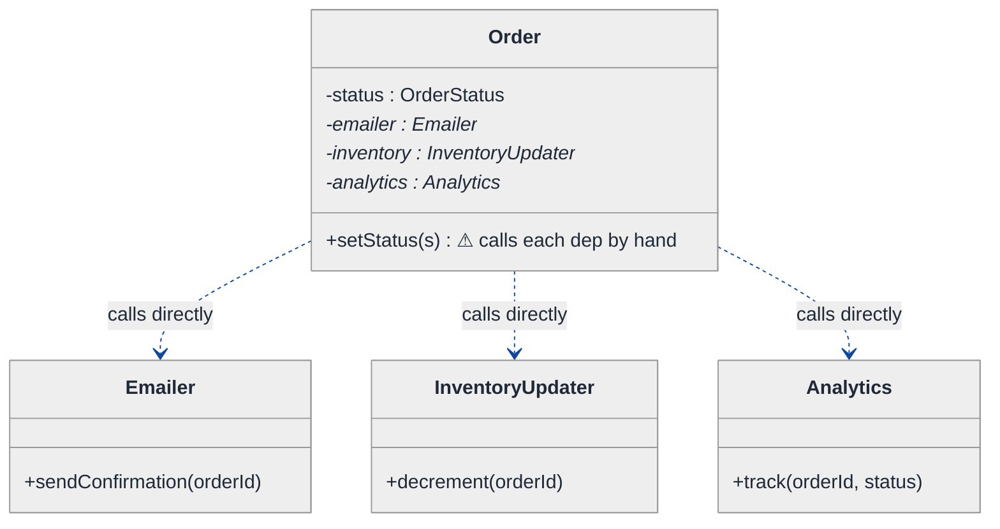
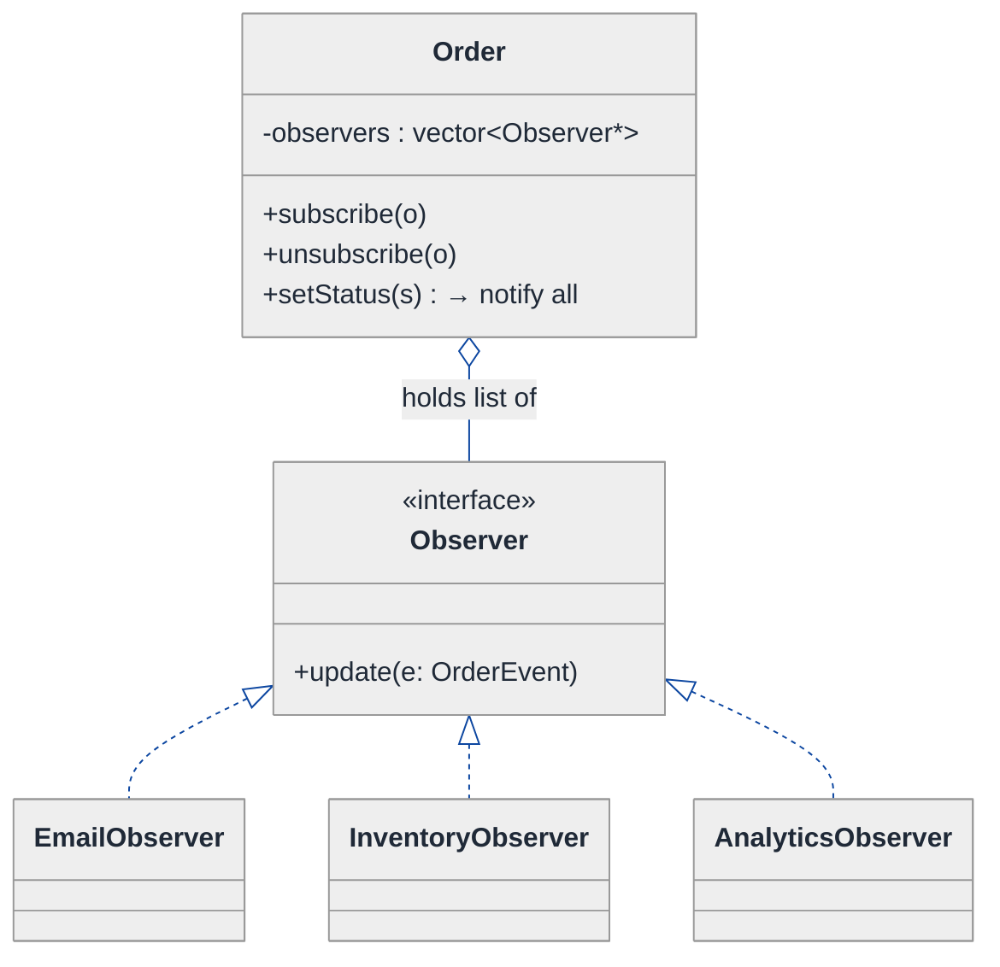
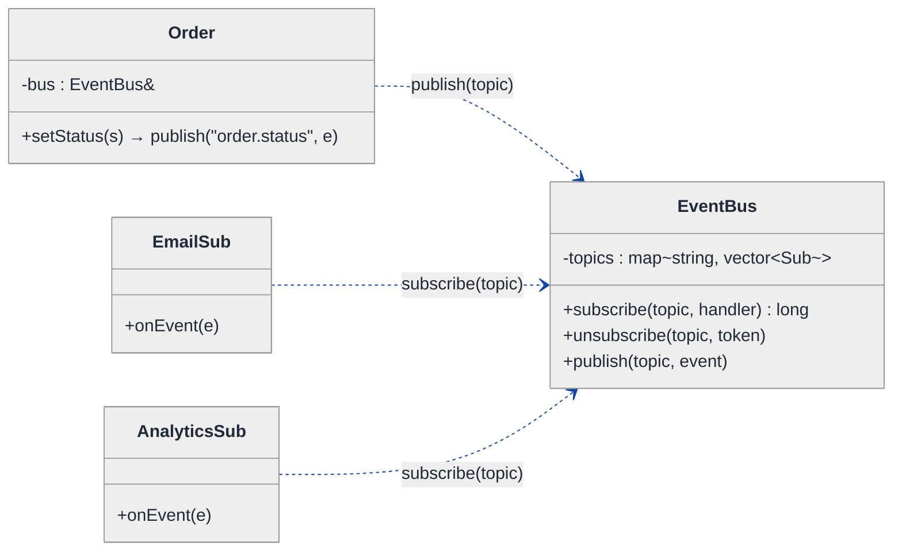
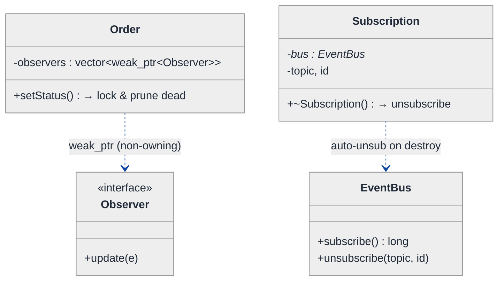
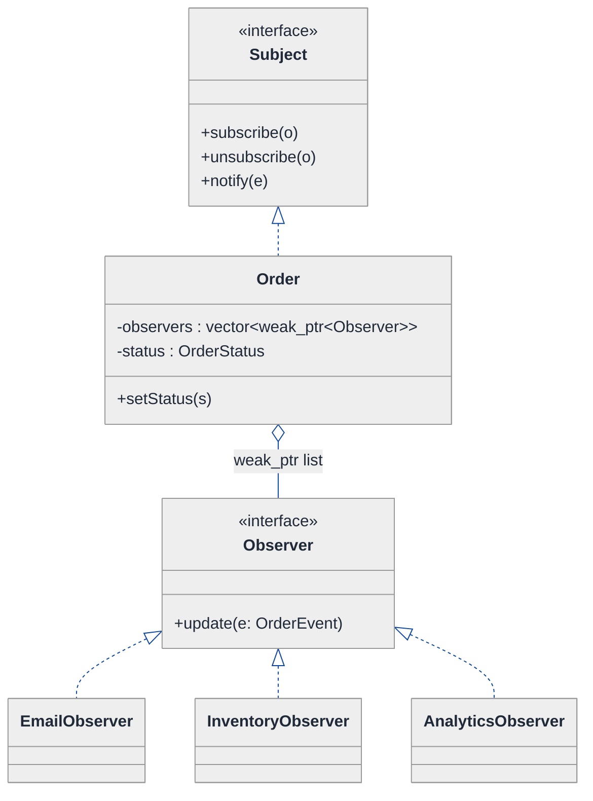
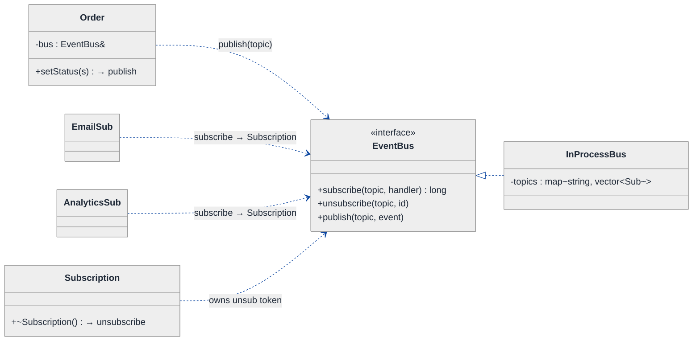
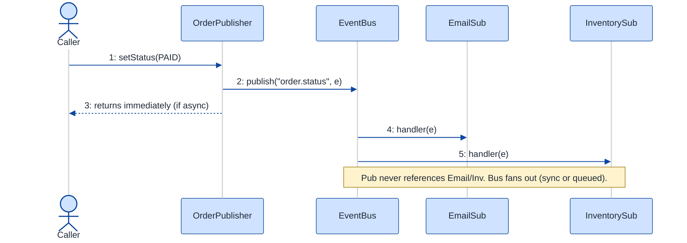

# Observer vs Pub/Sub — LLD Walkthrough

> **Difficulty:** Medium · **Time:** ~30 min · **Pattern focus:** Observer vs Pub/Sub coupling (with a side of memory-leak risk on listeners)
>
> **Problem source(s):** GID OB8, bucket `Observer_Pattern`. Representative of "explain Observer vs Pub/Sub, when to use each, coupling implications, and the listener memory-leak trap."
>
> **Diagrams:** inline mermaid (renders natively in GitHub / VS Code). No external sources.

---

## How to use this file

Paced for a candidate who knows basic OOP but has never been forced to articulate *why* Observer and Pub/Sub are different patterns and not just two words for the same thing. Reading time: ~30 minutes if you sketch each iteration by hand. **The lesson: you DERIVE the broker/event-bus by first writing the naive direct-call notifier, watching it break under three or four hypothetical changes, then reaching for ONE decoupling mechanism at a time — and along the way you learn exactly which kind of coupling each one removes, and which leak each one introduces.**

**Map of this file (15 sections):**

1. Problem statement + clarifying questions
2. Plain-English restatement
3. Why this matters
4. Mental model
5. Try it yourself first
6. Entity & verb extraction
7. **Iteration 1: the naive design** — direct method calls, no patterns
8. **Where the naive design hurts** — four future requirements, one painful diff each
9. **Pivot 1: Observer** — decouple the subject from concrete subscribers
10. **Pivot 2: Pub/Sub** — decouple the publisher from the subscriber entirely
11. **Pivot 3: lifecycle safety** — `weak_ptr`, unsubscribe tokens, the listener leak
12. Final class diagram
13. Skeleton code (C++)
14. Key flow — sequence diagram
15. Extensibility re-check + anti-patterns + how to think aloud + self-check

---

## 1. Problem statement + clarifying questions

**Prompt (typical phrasing):** "Explain the Observer pattern vs the Pub/Sub pattern with concrete examples. When would you use each? What are the coupling implications? Implement both and discuss memory-leak risks with event listeners."

**Clarifying questions to ask BEFORE drawing anything:**

1. **Same process or across a network?** Observer is almost always in-process (objects holding references); Pub/Sub frequently spans process or machine boundaries via a message broker. Which one is the interviewer probing?
2. **Synchronous or asynchronous delivery?** Should `notify()` block until every subscriber finishes, or fire-and-forget onto a queue? This changes whether a slow subscriber can stall the publisher.
3. **Delivery guarantees?** At-most-once (fine to drop), at-least-once (retries, possible dupes), or exactly-once? This determines whether we need an event store, acks, or idempotency keys.
4. **Do subscribers come and go at runtime?** If subscriptions are static (fixed at construction) the leak risk is low; if they churn (UI widgets, request handlers) we MUST think about unsubscribe + ownership.
5. **Ordering?** Must subscriber A always be notified before subscriber B, or is order irrelevant?
6. **One event type or many?** A single "state changed" ping, or a typed taxonomy of events (`OrderPlaced`, `OrderShipped`) that different subscribers care about selectively?

**Assumptions if interviewer dodges:** in-process system, synchronous notification by default (we'll discuss async), at-most-once delivery, subscribers churn at runtime (so leaks matter), order not guaranteed, and multiple typed event channels. We model an order-processing domain: an `Order` changes state and several components want to react.

---

## 2. Plain-English restatement

We have a thing that changes — call it the **subject** (an `Order`). Several other things care when it changes — an email sender, an inventory updater, an analytics logger. The naive way is to have the order call each of them directly. That hard-wires the order to know about every interested party. We want to flip it so the interested parties REGISTER themselves and the order just announces "I changed" without naming names. Observer does that while keeping a direct object reference between the two. Pub/Sub goes one step further: it inserts a **broker** in the middle so the publisher and subscriber never even hold a reference to each other. The catch in both: whoever holds a reference to a listener can keep it alive forever — a classic memory leak — so we have to design the unregister path deliberately.

---

## 3. Why this matters

Almost every non-trivial system has "X happened, several unrelated components must react." Get the coupling wrong and you end up with a god-object that imports half the codebase, or an event bus so loose that nobody can trace who reacts to what. The interviewer is probing whether you understand that Observer and Pub/Sub sit at *different points on the coupling spectrum* — and that the looser coupling of Pub/Sub is not free: you pay in traceability, delivery guarantees, and lifecycle bugs (the leaking listener). This reasoning reappears in UI frameworks (React effects, DOM `addEventListener`), domain events, message queues (Kafka, RabbitMQ), and reactive streams.

---

## 4. Mental model

Two real-world pictures, because the whole point is that they're *different*:

```
OBSERVER — a magazine subscription you arranged by phone:
   you call the publisher directly, give your address.
   They hold your address. They mail YOU each issue.
   The publisher KNOWS each subscriber (holds a list of them).

         ┌────────────┐  observers: [A, B, C]
         │  Subject   │ ──notify()──► A.update()
         │  (Order)   │ ──notify()──► B.update()
         └────────────┘ ──notify()──► C.update()
            ▲ subscribe(A) / unsubscribe(A)


PUB/SUB — a radio station and a topic dial:
   the station broadcasts on a FREQUENCY (topic).
   it has NO idea who's listening.
   listeners tune the BROKER to a topic; the broker fans out.

   ┌──────────┐  publish("OrderPlaced", e)   ┌──────────┐  ┌──────────┐
   │Publisher │ ───────────────────────────► │  Broker  │─►│Sub A     │
   └──────────┘                              │ (topics) │─►│Sub B     │
       (knows the broker + a topic string)   └──────────┘  └──────────┘
                                              (knows nobody by type)
```

The KEY insight: in Observer the subject holds a list of subscriber *references* — it is coupled to the Observer *interface*. In Pub/Sub the broker sits between them, so publisher and subscriber are coupled only to the broker and a *topic name* — they never reference each other at all. That difference in coupling is the entire answer to "when would you use each."

---

## 5. Try it yourself first

> **Predict before reading on:**
>
> 1. If `Order` calls `emailer.send()` and `inventory.update()` directly, what has to change when marketing adds a fourth reactor next sprint?
> 2. **In the Observer version, the subject holds a `vector` of observer pointers. If a UI widget subscribes and is then destroyed without unsubscribing, what happens on the next `notify()`?**
> 3. Pub/Sub removes the direct reference. Name one thing you LOSE by inserting a broker.

---

## 6. Entity & verb extraction

> **Mini-refresher: noun → class, but not every noun.**
>
> Promote a noun to a class only if it has BEHAVIOR and STATE that belong together. "Topic" is just a string key into a map; "Broker" earns a class because it owns the subscription table and the fan-out behavior.

**Nouns from the prompt:**

| Noun | Decision | Why |
|---|---|---|
| Order (subject) | Class | Has state + lifecycle; announces changes |
| Observer | Interface (abstract base) + concrete impls | A contract: "I can be told about a change" |
| Emailer / InventoryUpdater / Analytics | Concrete classes | Each reacts to a change differently |
| Event | Class / struct | The payload describing what happened |
| Broker / EventBus | Class (Pub/Sub only) | Owns the topic→subscriber table, fans out |
| Topic | Field (`std::string` key) | No behavior of its own |
| Subscription / token | Class (small handle) | Owns the right to unsubscribe — lifecycle behavior |

**Verbs (and the class they live on):**

| Verb | Owner class (naive answer — we'll re-examine) |
|---|---|
| subscribe(observer) | Subject (Observer) / Broker (Pub/Sub) |
| unsubscribe(observer/token) | Subject / Broker |
| notify() / publish(topic, event) | Subject / Publisher |
| update(event) / onEvent(event) | Observer / Subscriber |

**We have NOT introduced any design patterns yet.** Pure nouns + verbs.

---

## 7. <a id="iter-1"></a>Iteration 1: the naive design

Simplest thing that could possibly work: when the order changes, it calls each interested component directly.



**Reader's tour (top to bottom; ~45 seconds).**

1. **`Order` is the subject.** It holds THREE concrete pointers — `emailer`, `inventory`, `analytics` — and one warning marker on `setStatus`.
2. **`setStatus` is the trouble zone.** When the status flips, this method calls each dependency by name: `emailer_->sendConfirmation(...)`, `inventory_->decrement(...)`, `analytics_->track(...)`.
3. **The dependency arrows all point OUT of Order.** `Order ..> Emailer`, `..> InventoryUpdater`, `..> Analytics`. The order `#include`s and KNOWS the concrete type of every reactor. That's the coupling we're going to attack.

Skeleton code for the naive design (C++):

```cpp
#include <string>
#include <iostream>

enum class OrderStatus { CREATED, PAID, SHIPPED, DELIVERED };

class Emailer          { public: void sendConfirmation(const std::string& id) { /* SMTP */ } };
class InventoryUpdater { public: void decrement(const std::string& id)        { /* DB   */ } };
class Analytics        { public: void track(const std::string& id, OrderStatus s) { /* log */ } };

class Order {
public:
    Order(std::string id, Emailer* e, InventoryUpdater* i, Analytics* a)
        : id_(std::move(id)), emailer_(e), inventory_(i), analytics_(a) {}

    void setStatus(OrderStatus s) {        // hand-wired fan-out — will hurt
        status_ = s;
        emailer_->sendConfirmation(id_);   // knows Emailer
        inventory_->decrement(id_);        // knows InventoryUpdater
        analytics_->track(id_, s);         // knows Analytics
    }
private:
    std::string       id_;
    OrderStatus       status_ = OrderStatus::CREATED;
    Emailer*          emailer_;
    InventoryUpdater* inventory_;
    Analytics*        analytics_;
};
```

**This works.** It has zero design patterns. The order changes status and three things react. So what's wrong with it?

---

## 8. <a id="naive-pain"></a>Where the naive design hurts

The interviewer slides four upcoming requirements across the desk: "Walk me through what changes."

### Change A: "Add a fourth reactor — a fraud-check service"

In the naive design:
- Add a `FraudChecker* fraud_` field to `Order`.
- Add it to the constructor signature (every call site that builds an `Order` now changes).
- Add `fraud_->scan(id_)` inside `setStatus`.
- **`setStatus` AND the constructor AND every construction site change.** The subject grows a field per reactor forever.

### Change B: "The analytics team's module lives in another library that must not be linked into the order core"

In the naive design:
- `Order` `#include`s `Analytics`. The order core now has a compile-time and link-time dependency on the analytics library.
- **You cannot ship the order core without dragging analytics along.** The dependency direction is backwards: the stable thing (Order) depends on the volatile thing (a reactor).

### Change C: "A UI widget wants to react while it's on screen and stop when it's closed"

In the naive design:
- There is no subscribe/unsubscribe at all — reactors are baked in at construction.
- **A reactor that comes and goes at runtime simply doesn't fit.** You'd have to add null-checks and setters, and now `setStatus` is a minefield of `if (widget_) widget_->...`.

### Change D: "Some reactions should run on a background thread / survive a process restart"

In the naive design:
- `setStatus` calls everything synchronously and in-process. A slow `emailer_->sendConfirmation` (SMTP timeout) stalls the whole status change.
- **There's no seam to insert async dispatch, retries, or durability.** The fan-out is hard-coded into a single method.

### The pattern of pain

| Change | Files touched | Smell |
|---|---|---|
| A. New reactor | `Order` field + ctor + `setStatus` + all call sites | "Subject grows a field per reactor; open/closed violation." |
| B. Unlinkable module | `Order` `#include`s a volatile lib | "Stable core depends on volatile reactor — backwards dependency." |
| C. Runtime widget | no subscribe/unsubscribe seam exists | "Reactors are static; can't churn at runtime." |
| D. Async / durable | fan-out hard-coded in one method | "No seam for async, retry, or cross-process delivery." |

**Two axes of pain dominate.** (1) The subject is coupled to the *concrete types* of its reactors and to their *count* (Changes A, B). (2) There is no decoupled, possibly-out-of-process delivery channel (Changes C, D).

> **Pivot question:** "What pattern lets a subject announce a change to an open-ended set of reactors WITHOUT naming their concrete types? And when even that direct reference is too much coupling, what sits BETWEEN them?"
>
> The answers are Observer (Changes A, B, C) and Pub/Sub (Change D, plus looser coupling). Let's introduce Observer first — it fixes the most painful axis with the least machinery.

---

## 9. <a id="pivot-1"></a>Pivot 1: Observer — decouple the subject from concrete subscribers

> **Mini-refresher: Observer pattern.**
>
> A **Subject** keeps a list of **Observers** that implement a small interface (`update(event)`). When the subject's state changes it walks the list and calls `update()` on each — it knows the OBSERVER INTERFACE but not the concrete classes. Observers `subscribe`/`unsubscribe` themselves at runtime. Direct in-process reference; synchronous by default.
>
> Quick example: a spreadsheet cell is a subject; a bar-chart and a pie-chart are observers. Edit the cell and both charts redraw — the cell never names "BarChart."

**Why Observer fits.** The subject must notify an open-ended set of reactors. Observer inverts the dependency: instead of `Order ..> Analytics`, we get `Analytics ..|> Observer <.. Order`. The order depends only on the abstract `Observer` interface; concrete reactors depend on that same interface. Change A (new reactor) becomes "write a class, call `order.subscribe(...)`." Change B (unlinkable module) is solved because the order core no longer `#include`s any concrete reactor. Change C (runtime widget) is solved because subscribe/unsubscribe now exist.

> **Mini-refresher: Dependency Inversion Principle (the "D" in SOLID).**
>
> High-level modules should not depend on low-level modules; both should depend on an abstraction. Here the stable `Order` (high-level) stops depending on volatile `Analytics` (low-level); both now depend on the `Observer` interface. The dependency arrow has been *inverted* to point at the abstraction.

**The refactor (just the affected slice):**

```cpp
struct OrderEvent { std::string orderId; OrderStatus status; };

class Observer {
public:
    virtual ~Observer() = default;
    virtual void update(const OrderEvent& e) = 0;   // the only contract
};

class EmailObserver : public Observer {
public:
    void update(const OrderEvent& e) override { /* send confirmation for e.orderId */ }
};
class InventoryObserver : public Observer {
public:
    void update(const OrderEvent& e) override { /* decrement stock for e.orderId */ }
};
// AnalyticsObserver, FraudObserver, ... elided — each is one new class

class Order {  // now a Subject
public:
    void subscribe(Observer* o)   { observers_.push_back(o); }
    void unsubscribe(Observer* o) {
        observers_.erase(std::remove(observers_.begin(), observers_.end(), o),
                         observers_.end());
    }
    void setStatus(OrderStatus s) {
        status_ = s;
        OrderEvent e{ id_, s };
        for (auto* o : observers_) o->update(e);   // knows ONLY the interface
    }
private:
    std::string            id_;
    OrderStatus            status_ = OrderStatus::CREATED;
    std::vector<Observer*> observers_;   // ⚠ raw pointers — leak risk, see Pivot 3
};
```

**What changed — visualized.** Just the observer slice:



**Tour of the after-state.**

1. **`Order` now holds `vector<Observer*>` instead of three named fields.** The open diamond (`◇`) is aggregation — the order references observers but does not own their lifetime (a fact that becomes important in Pivot 3).
2. **The `<<interface>>` box is the only thing `Order` depends on.** `update(OrderEvent)` is the entire contract. The order has no idea `EmailObserver` exists.
3. **Concrete reactors hang off the interface.** Adding a fraud checker is one new `class FraudObserver : public Observer` plus `order.subscribe(&fraud)`. Change A is now additive, not surgical.
4. **The dependency arrow flipped.** Before: `Order ..> Analytics`. Now: `AnalyticsObserver ..|> Observer`. The analytics library depends on the order's interface, not the reverse — Change B solved.

**Coupling implication (state this in the interview).** Observer is *loosely coupled by type* — the subject knows only the `Observer` interface — but *still tightly coupled by reference and lifetime*: the subject holds a live pointer to each observer, in the same process, and notifies synchronously. That residual reference is exactly what creates the leak in Pivot 3.

**Pattern-discrimination cheatsheet — Observer vs Mediator.**
- *Observer:* one subject broadcasts to many observers; the relationship is one-directional (subject → observers).
- *Mediator:* a central hub coordinates many-to-many interactions between colleagues that would otherwise reference each other directly.
- *Rule of thumb:* "one source of truth changes, many react" → Observer. "N components all talk to each other and you want to centralize that mesh" → Mediator.

We chose Observer because there is a clear single subject (the order) broadcasting outward — not a mesh of peers needing a coordinator.

---

## 10. <a id="pivot-2"></a>Pivot 2: Pub/Sub — decouple the publisher from the subscriber entirely

Change D from §8 is still painful. Observer left the subject holding a *direct reference* to each observer, in-process, synchronous. We want a reactor that can live on another thread, in another module, maybe another process — and a publisher that doesn't even hold a reference to it.

> **Mini-refresher: Publish/Subscribe pattern.**
>
> A **Broker** (event bus / message queue) sits between publishers and subscribers. Publishers `publish(topic, event)`; subscribers `subscribe(topic, handler)`. The broker owns the topic→handlers table and fans out. The publisher and subscriber NEVER reference each other — both reference only the broker and a topic string. Delivery can be sync or async, in-process or across the network.

**Why Pub/Sub (not just more Observer).** In Observer the subject IS the registry — it holds the observer list. That means the publisher must exist and be reachable for a subscriber to register, and the reference is direct. Pub/Sub lifts the registry OUT into a broker. Now:
- The publisher only needs the broker + a topic name; it has zero knowledge of subscribers (looser than Observer, which knows the `Observer` interface and holds references).
- The broker is the natural seam for async dispatch, retries, durability, and cross-process transport — Change D.
- Subscribers can register for a topic before any publisher exists.

**The refactor (just the broker slice):**

```cpp
#include <functional>
#include <unordered_map>
#include <vector>

using Handler = std::function<void(const OrderEvent&)>;

class EventBus {                       // the Broker
public:
    // returns a token used to unsubscribe (see Pivot 3 for why this matters)
    long subscribe(const std::string& topic, Handler h) {
        long id = nextId_++;
        topics_[topic].push_back({ id, std::move(h) });
        return id;
    }
    void unsubscribe(const std::string& topic, long id) {
        auto& v = topics_[topic];
        v.erase(std::remove_if(v.begin(), v.end(),
                               [&](const Sub& s){ return s.id == id; }), v.end());
    }
    void publish(const std::string& topic, const OrderEvent& e) {
        auto it = topics_.find(topic);
        if (it == topics_.end()) return;          // no subscribers — fine
        for (const auto& s : it->second) s.handler(e);  // sync here; async = post to queue
    }
private:
    struct Sub { long id; Handler handler; };
    std::unordered_map<std::string, std::vector<Sub>> topics_;
    long nextId_ = 1;
};

class Order {  // now a Publisher — holds the bus, NOT the subscribers
public:
    Order(std::string id, EventBus& bus) : id_(std::move(id)), bus_(bus) {}
    void setStatus(OrderStatus s) {
        status_ = s;
        bus_.publish("order.status", OrderEvent{ id_, s });  // knows topic string only
    }
private:
    std::string id_;
    OrderStatus status_ = OrderStatus::CREATED;
    EventBus&   bus_;
};
```

**What changed — visualized.** The broker slice:



**Tour of the after-state.**

1. **No arrow between `Order` and the subscribers.** That absence is the whole point. The publisher points at the bus; the subscribers point at the bus; neither points at the other.
2. **`EventBus` owns the `topics` table.** A `map<string, vector<Sub>>`. The publisher hands it a topic string and a payload; the bus does the fan-out.
3. **`subscribe` returns a `long` token, not void.** The subscriber keeps that token to unsubscribe later — a deliberate lifecycle hook we lean on in Pivot 3.
4. **The bus is the async/durability seam.** Today `publish` calls handlers synchronously; swap the loop for "post each event to a thread-pool queue" or "write to Kafka" and the publisher code doesn't change a line. Change D solved.

**Coupling implication (the heart of the answer).**

| Aspect | Observer | Pub/Sub |
|---|---|---|
| Who knows whom | Subject knows the `Observer` interface + holds references | Publisher & subscriber know only the broker + a topic string |
| Reference between the two | Direct (subject → observer) | None (broker in the middle) |
| Process boundary | In-process only | In-process OR across network |
| Delivery | Synchronous by default | Sync or async; can add retries/durability |
| Traceability | Easy — grep the subscribe calls on the subject | Hard — who reacts to a topic is spread out / dynamic |

**Pattern-discrimination cheatsheet — Observer vs Pub/Sub.**
- *Observer:* subject holds the subscriber list itself; direct reference; in-process; sync. Use when reactors are in the same process and you want simple, traceable, immediate notification.
- *Pub/Sub:* a broker holds the list; publisher and subscriber are reference-decoupled via a topic. Use when reactors may be remote/async/durable, or when you want publisher and subscriber to evolve independently.
- *Rule of thumb:* if the thing that changes can hold a pointer to everything that reacts and you're happy with that → Observer. If you want them to NOT know about each other (different teams, processes, or lifecycles) → Pub/Sub.

---

## 11. <a id="pivot-3"></a>Pivot 3: lifecycle safety — the listener memory leak

Both pivots left a landmine. In Observer, `Order` holds `vector<Observer*>`. In Pub/Sub, `EventBus` holds handlers (often closures capturing `this`). **Whoever holds the listener can keep it alive — or worse, dereference it after it's dead.** This is the single most common production bug with event systems, and the interviewer explicitly asked about it.

**The two failure modes:**

1. **Dangling pointer (use-after-free).** A `UiWidget` subscribes, then is destroyed *without* unsubscribing. The subject's `vector<Observer*>` still holds the now-dangling pointer. Next `notify()` calls `update()` on freed memory → crash or corruption.
2. **Leak (lapsed-listener).** The subject keeps the observer alive forever because it holds a reference (or the broker's closure captured a `shared_ptr`). The widget is "closed" but never collected because the bus still references it. In a long-running server, listeners accumulate until you run out of memory.

> **Mini-refresher: `weak_ptr` for back-references / observer lists.**
>
> A `std::shared_ptr` keeps an object alive (it's a strong, owning reference). A `std::weak_ptr` observes the same object WITHOUT keeping it alive. You call `.lock()` to get a temporary `shared_ptr`; if the object is already gone, `.lock()` returns null and you skip it. Storing observers as `weak_ptr` means the subject never prolongs an observer's life and can detect-and-drop dead ones.

**Fix A — store observers as `weak_ptr` (Observer).** The subject does not own observers; it observes them. On notify, `.lock()` each; drop the ones that fail.

```cpp
class Order {
public:
    void subscribe(const std::shared_ptr<Observer>& o) { observers_.push_back(o); }
    void setStatus(OrderStatus s) {
        status_ = s;
        OrderEvent e{ id_, s };
        // notify the living, prune the dead in one pass
        for (auto it = observers_.begin(); it != observers_.end(); ) {
            if (auto sp = it->lock()) { sp->update(e); ++it; }
            else                      { it = observers_.erase(it); }  // observer died → drop
        }
    }
private:
    std::string                          id_;
    OrderStatus                          status_ = OrderStatus::CREATED;
    std::vector<std::weak_ptr<Observer>> observers_;   // NON-owning — no leak, no dangling
};
```

**Fix B — RAII subscription token (Pub/Sub).** `subscribe` returns a token whose *destructor* unsubscribes. Bind the token's lifetime to the subscriber; when the subscriber dies, the token dies, and the bus entry is removed automatically. This is the "scoped subscription" you see in modern frameworks.

```cpp
class Subscription {           // RAII unsubscribe handle
public:
    Subscription(EventBus& bus, std::string topic, long id)
        : bus_(&bus), topic_(std::move(topic)), id_(id) {}
    ~Subscription() { if (bus_) bus_->unsubscribe(topic_, id_); }  // auto-unsub on scope exit
    Subscription(Subscription&& o) noexcept                        // movable, non-copyable
        : bus_(o.bus_), topic_(std::move(o.topic_)), id_(o.id_) { o.bus_ = nullptr; }
    Subscription(const Subscription&) = delete;
private:
    EventBus*   bus_;
    std::string topic_;
    long        id_;
};

// usage: as long as `sub` is alive the widget receives events; when it goes out of
// scope (widget destroyed) the destructor calls bus.unsubscribe — no lapsed listener.
class UiWidget {
    std::shared_ptr<UiWidget> self_;
    Subscription sub_;
public:
    UiWidget(EventBus& bus)
        : sub_(bus, "order.status",
               bus.subscribe("order.status",
                             [this](const OrderEvent& e){ /* careful: capture-by-this */ })) {}
};
```

> **Trap — capturing `this` in a broker handler.** A lambda that captures `this` and is held by the bus outlives the object if you forget to unsubscribe → use-after-free. The `Subscription` destructor is what guarantees the handler is removed before `this` dies. (In JS the same trap is `element.addEventListener(fn)` without a matching `removeEventListener` — the DOM node and its closure leak together. In React you return a cleanup function from `useEffect` for exactly this reason.)



**Tour.** Left side is the Observer fix — `weak_ptr` means the subject never keeps an observer alive and prunes dead ones during notify. Right side is the Pub/Sub fix — a `Subscription` RAII handle whose destructor calls `unsubscribe`, so a subscriber going out of scope removes its bus entry automatically. Both attack the same root cause: **a reference held by the notifier outliving the listener.**

**Pattern-discrimination cheatsheet — `weak_ptr` list vs RAII token.**
- *`weak_ptr` list:* the notifier tolerates dead listeners and prunes them lazily. Good when listeners are heap objects you already manage with `shared_ptr`.
- *RAII subscription token:* the listener proactively removes itself on destruction. Good when registration returns a handle (typical for brokers/closures, where there's no observer object to `weak_ptr`).
- *Rule of thumb:* object-based observers → `weak_ptr`; closure/handler-based subscriptions → RAII token. Either way, never store a bare owning/raw reference to a listener that can outlive it.

---

## 12. <a id="fig-class-diagram"></a>Final class diagram

Two focused sub-views, because Observer and Pub/Sub are deliberately different shapes. Read both; the comparison at the end is the payload.

### 12.1 Observer — subject owns the (weak) list



**Tour of 12.1.** `Order` implements a `Subject` interface (`subscribe`/`unsubscribe`/`notify`) and holds a non-owning `weak_ptr` list of `Observer`. Reactors implement `Observer::update`. The only coupling crossing the gap is the `Observer` interface — concrete reactors are invisible to the order.

### 12.2 Pub/Sub — broker in the middle



**Tour of 12.2.** `EventBus` is an interface so the transport can be swapped (in-process today, Kafka adapter tomorrow). `Order` depends only on `EventBus` + a topic string; subscribers depend only on `EventBus`. Each `subscribe` yields a `Subscription` RAII token that unsubscribes on destruction. There is no edge between `Order` and any subscriber — that gap IS the decoupling.

### Structural insight (ties 12.1 + 12.2 together)

| Concern | Observer | Pub/Sub |
|---|---|---|
| Registry location | On the subject itself | Externalized into the broker |
| Coupling | Type-decoupled (interface), reference-coupled | Fully decoupled via topic string |
| Best for | Same-process, immediate, traceable reactions | Cross-module/process/async, independent evolution |
| Leak guard | `weak_ptr` observer list | RAII `Subscription` token |

The big lesson: **both patterns invert the "subject calls reactors by name" coupling — they differ in HOW FAR they push the decoupling.** Observer keeps a direct (but interface-typed) reference; Pub/Sub inserts a broker so there's no reference at all. Looser coupling buys independence and async/remote delivery; it costs traceability and forces you to think hard about delivery guarantees and listener lifetime.

---

## 13. Skeleton code (C++)

> Show the SHAPES, not the full impl. ~120 lines. Both patterns side by side so the contrast is concrete.

```cpp
#include <algorithm>
#include <functional>
#include <memory>
#include <string>
#include <unordered_map>
#include <vector>

enum class OrderStatus { CREATED, PAID, SHIPPED, DELIVERED };
struct OrderEvent { std::string orderId; OrderStatus status; };

// ════════════════════════════════════════════════════════════════════
// PART 1 — OBSERVER  (subject owns a non-owning weak_ptr list)
// ════════════════════════════════════════════════════════════════════
class Observer {
public:
    virtual ~Observer() = default;
    virtual void update(const OrderEvent& e) = 0;
};

class Subject {                              // the abstract subject role
public:
    virtual ~Subject() = default;
    void subscribe(const std::shared_ptr<Observer>& o) { observers_.push_back(o); }
    void notify(const OrderEvent& e) {
        for (auto it = observers_.begin(); it != observers_.end(); ) {
            if (auto sp = it->lock()) { sp->update(e); ++it; }   // alive → deliver
            else                      { it = observers_.erase(it); }  // dead → prune (no leak)
        }
    }
private:
    std::vector<std::weak_ptr<Observer>> observers_;   // NON-owning by design
};

class Order : public Subject {
public:
    explicit Order(std::string id) : id_(std::move(id)) {}
    void setStatus(OrderStatus s) { status_ = s; notify({ id_, s }); }  // knows only Observer
private:
    std::string id_;
    OrderStatus status_ = OrderStatus::CREATED;
};

class EmailObserver : public Observer {
public:
    void update(const OrderEvent& e) override { /* send confirmation for e.orderId */ }
};
// InventoryObserver, AnalyticsObserver, FraudObserver ... elided — each is one new class

// ════════════════════════════════════════════════════════════════════
// PART 2 — PUB/SUB  (broker in the middle; RAII subscription token)
// ════════════════════════════════════════════════════════════════════
using Handler = std::function<void(const OrderEvent&)>;

class EventBus {                             // interface — swap transport later
public:
    virtual ~EventBus() = default;
    virtual long subscribe(const std::string& topic, Handler h) = 0;
    virtual void unsubscribe(const std::string& topic, long id) = 0;
    virtual void publish(const std::string& topic, const OrderEvent& e) = 0;
};

class InProcessBus : public EventBus {
public:
    long subscribe(const std::string& topic, Handler h) override {
        long id = nextId_++;
        topics_[topic].push_back({ id, std::move(h) });
        return id;
    }
    void unsubscribe(const std::string& topic, long id) override {
        auto& v = topics_[topic];
        v.erase(std::remove_if(v.begin(), v.end(),
                               [&](const Sub& s){ return s.id == id; }), v.end());
    }
    void publish(const std::string& topic, const OrderEvent& e) override {
        auto it = topics_.find(topic);
        if (it == topics_.end()) return;
        for (const auto& s : it->second) s.handler(e);   // sync; swap for queue = async
    }
private:
    struct Sub { long id; Handler handler; };
    std::unordered_map<std::string, std::vector<Sub>> topics_;
    long nextId_ = 1;
};
// KafkaBus : public EventBus { ... } elided — cross-process transport, same interface

class Subscription {                         // RAII auto-unsubscribe (leak guard)
public:
    Subscription(EventBus& bus, std::string topic, long id)
        : bus_(&bus), topic_(std::move(topic)), id_(id) {}
    ~Subscription() { if (bus_) bus_->unsubscribe(topic_, id_); }
    Subscription(Subscription&& o) noexcept
        : bus_(o.bus_), topic_(std::move(o.topic_)), id_(o.id_) { o.bus_ = nullptr; }
    Subscription(const Subscription&)            = delete;
    Subscription& operator=(const Subscription&) = delete;
private:
    EventBus*   bus_;
    std::string topic_;
    long        id_;
};

class OrderPublisher {                       // publisher knows ONLY bus + topic
public:
    OrderPublisher(std::string id, EventBus& bus) : id_(std::move(id)), bus_(bus) {}
    void setStatus(OrderStatus s) { status_ = s; bus_.publish("order.status", { id_, s }); }
private:
    std::string id_;
    OrderStatus status_ = OrderStatus::CREATED;
    EventBus&   bus_;
};
```

---

## 14. <a id="fig-sequence"></a>Key flow — sequence diagram

Two short flows, one per pattern, so you can SEE the broker change the message path.

### Phase 1 — Observer (direct, synchronous)

```mermaid
---
config:
  theme: neutral
  themeVariables:
    background: '#ffffff'
    primaryColor: '#cfe2ff'
    primaryTextColor: '#1f2937'
    primaryBorderColor: '#084298'
    secondaryColor: '#fff3cd'
    secondaryTextColor: '#1f2937'
    secondaryBorderColor: '#664d03'
    tertiaryColor: '#d1e7dd'
    tertiaryTextColor: '#1f2937'
    tertiaryBorderColor: '#0a3622'
    lineColor: '#0d47a1'
    textColor: '#1f2937'
    noteBkgColor: '#fff3cd'
    noteTextColor: '#1f2937'
    noteBorderColor: '#997404'
    actorBkg: '#cfe2ff'
    actorBorder: '#084298'
    actorTextColor: '#1f2937'
    signalColor: '#0d47a1'
    signalTextColor: '#1f2937'
    labelBoxBkgColor: '#ffffff'
    labelBoxBorderColor: '#d3d3d3'
    labelTextColor: '#1f2937'
    edgeLabelBackground: '#ffffff'
    labelBackground: '#ffffff'
    classText: '#1f2937'
    fontFamily: 'system-ui, -apple-system, Segoe UI, Helvetica, Arial, sans-serif'
  themeCSS: |
    .messageText, .labelText, .sequenceNumber {
      paint-order: stroke fill;
      stroke: #ffffff;
      stroke-width: 5px;
      stroke-linejoin: round;
      stroke-linecap: round;
    }
    .edgePath path,
    .flowchart-link,
    .messageLine0,
    .messageLine1,
    .relation,
    .composition,
    .aggregation,
    .extension,
    .dependency {
      stroke-width: 2.5px !important;
    }
    marker path {
      stroke-width: 1.5px !important;
    }
---
sequenceDiagram
  actor Caller
  participant Order
  participant Email as EmailObserver
  participant Inv as InventoryObserver
  Caller->>Order: 1: setStatus(PAID)
  Order->>Order: 2: notify(event)
  Order->>Email: 3: update(event)
  Email-->>Order: 4: (returns; blocks here)
  Order->>Inv: 5: update(event)
  Inv-->>Order: 6: (returns)
  Order-->>Caller: 7: setStatus returns
```

**Tour of Phase 1.** The order walks its own observer list and calls `update` on each — synchronously. Note step 4: if `EmailObserver` is slow (SMTP timeout), the order BLOCKS until it returns before notifying inventory. The order holds the references directly; there's no middleman. Traceable, immediate, but a slow observer stalls everyone.

### Phase 2 — Pub/Sub (decoupled via broker)



**Tour of Phase 2.** The publisher calls `publish` on the bus and is done (step 3 — it can return immediately if delivery is async). The bus fans out to whoever subscribed to `"order.status"`. The publisher never appears in a message to Email or Inv — there is no arrow between them. **What Pub/Sub HIDES from the publisher: who reacts, how many, on which thread, and whether they even succeeded.** That's the decoupling — and also why traceability and delivery guarantees become the broker's job, not something you get for free.

### The thing that's NOT shown — and why it matters

In Phase 1 you can read the order's observer list to know exactly who reacts. In Phase 2 there is NO such list on the publisher — the subscriptions live in the bus and may change at runtime. **Loose coupling moved the "who reacts to this" knowledge out of the code and into runtime configuration.** Great for independence, harder for a new engineer to trace. Naming that tradeoff out loud is the senior signal.

---

## 15. Extensibility re-check + anti-patterns + how to think aloud + self-check

### Extensibility re-check

Revisit the four changes from [§8](#naive-pain). For each, name the SINGLE thing that changes.

| Change | Naive design impact | Observer | Pub/Sub |
|---|---|---|---|
| A. New reactor | `Order` field + ctor + every call site | New `class : Observer` + one `subscribe` call | New subscriber + one `subscribe(topic, h)` |
| B. Unlinkable module | `Order` `#include`s the lib | Reactor depends on the `Observer` interface; core clean | Subscriber depends on `EventBus` only; core clean |
| C. Runtime widget | no seam exists | subscribe/unsubscribe + `weak_ptr` | subscribe → RAII `Subscription` token |
| D. Async / durable | hard-coded sync fan-out | (still sync — Observer's limit) | swap `InProcessBus` → `KafkaBus`; publisher untouched |

Every change is additive in at least one of the two patterns. Change D is the line that separates them: Observer can't do async/remote without becoming a broker — at which point you've reinvented Pub/Sub.

### Common confusion + traps

1. **"Aren't Observer and Pub/Sub the same thing?"** No. Observer = subject holds direct references to observers (coupled by reference, decoupled by type). Pub/Sub = a broker sits between, so publisher and subscriber don't reference each other at all. The broker is the distinguishing entity.
2. **"Why `weak_ptr` and not `shared_ptr` for the observer list?"** A `shared_ptr` list would keep observers alive forever (the lapsed-listener leak). `weak_ptr` observes without owning, and lets the subject prune dead entries on notify.
3. **"The subscription returns void in my code."** Then you have no handle to unsubscribe → guaranteed leak when subscribers churn. Return a token (RAII `Subscription`) or an id.
4. **"Capturing `this` in a bus handler is fine, right?"** Only if the handler is removed before `this` dies. Otherwise the bus calls a method on freed memory. Bind the `Subscription` lifetime to the object.
5. **"Pub/Sub is strictly better because it's looser."** No — looser coupling costs traceability, demands you choose delivery semantics (at-most/at-least/exactly-once), and adds the broker as a moving part. Use Observer when in-process direct notification is enough.

### Anti-patterns

- **"God subject"** — the subject `#include`s and calls every reactor by name (the naive design). Invert with Observer.
- **"Lapsed listener"** — subscribers never unsubscribe; the notifier holds them alive forever. The canonical event-system leak. Fix with `weak_ptr` or RAII tokens.
- **"Dangling observer"** — raw `Observer*` in the subject's list outlives the observer → use-after-free on next notify. Store `weak_ptr`.
- **"Event soup"** — everything publishes everything to a single bus with stringly-typed topics nobody documents. Traceability dies. Use typed events and a documented topic taxonomy.
- **"Reentrant notify"** — an observer's `update()` subscribes/unsubscribes during the notify loop, invalidating the iterator. Snapshot the list before iterating, or defer mutations.
- **"Synchronous everything"** — a slow observer stalls the publisher. If reactions can be slow, move to async dispatch (and you're now in Pub/Sub territory).

### How to think aloud

> "Two reactors today, but the prompt says marketing keeps adding them. The naive design has `Order` call each reactor by name — every new one touches the subject's fields, constructor, and call sites, and the core ends up depending on volatile libraries. That's a Dependency Inversion violation.
>
> First pivot: Observer. `Order` holds a list of `Observer` and just calls `update`. It knows the interface, not the concrete classes. New reactor = one class + one subscribe. But note the residual coupling: the subject holds a direct reference, same process, synchronous.
>
> If reactors must be remote, async, or durable — or I want publisher and subscriber to not know each other at all — I insert a broker: Pub/Sub. Publisher publishes to a topic; the bus fans out. Now there's zero reference between them, and the bus is the seam for async/retry/durability. The cost is traceability and delivery guarantees.
>
> Both patterns share one trap: whoever holds the listener can leak it or dangle it. In Observer I store `weak_ptr` and prune dead observers on notify. In Pub/Sub `subscribe` returns an RAII `Subscription` whose destructor unsubscribes — so a widget going out of scope cleans itself up. Same root cause — a reference outliving the listener — two idiomatic fixes."

### Self-check

> **Self-check — the question to ask next time.**
>
> When you see "X happens and several things must react," before wiring direct calls, ask:
>
> > **"Does the thing that changes need to HOLD A REFERENCE to its reactors (Observer), or should a broker sit between so they never know each other (Pub/Sub)? And in either case — when a listener dies, what removes it from the list?"**
>
> Same process + immediate + traceable → Observer (with `weak_ptr`). Remote/async/independent → Pub/Sub (with an unsubscribe token). The leak answer is not optional in either.

---

## Cross-references

- **Parent topic manifest:** [`./EXTRACTED_QUESTIONS.md`](./EXTRACTED_QUESTIONS.md)
- **Vertical overview:** [`../../LEARNING.md`](../../LEARNING.md)
- **Template:** [`../../TEMPLATE-v2.md`](../../TEMPLATE-v2.md)
- **Canonical exemplar:** [`../Object_Oriented_Design/Parking_Lot.md`](../Object_Oriented_Design/Parking_Lot.md)
- **Related v2 walkthroughs (future):**
  - Mediator Pattern — centralizing many-to-many interactions (in `../Mediator_Pattern/`)
  - Command Pattern — events as first-class objects with undo/redo (in `../Command_Pattern/`)
  - Event Sourcing — the event log as source of truth (in `../Event_Sourcing/`)
- **External references:**
  - <a href="https://refactoring.guru/design-patterns/observer" target="_blank" rel="noopener noreferrer">Observer pattern (refactoring.guru)</a>
  - <a href="https://learn.microsoft.com/en-us/azure/architecture/patterns/publisher-subscriber" target="_blank" rel="noopener noreferrer">Publisher/Subscriber pattern (Microsoft Azure Architecture)</a>
  - <a href="https://en.cppreference.com/w/cpp/memory/weak_ptr" target="_blank" rel="noopener noreferrer">std::weak_ptr (cppreference)</a>
