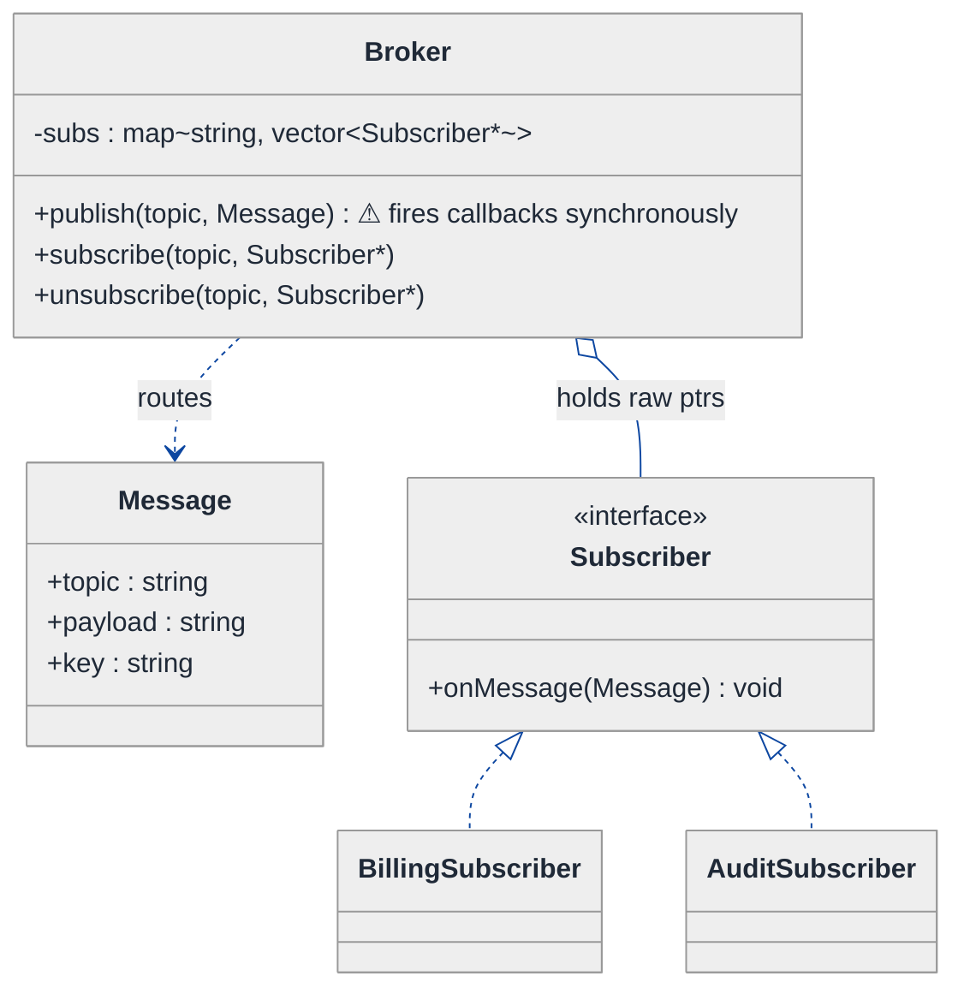
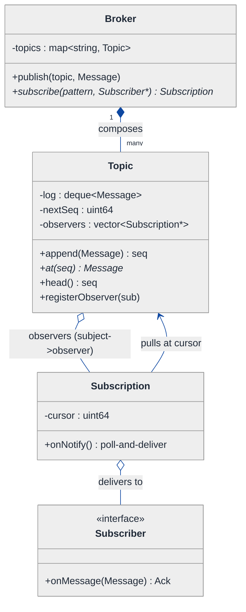
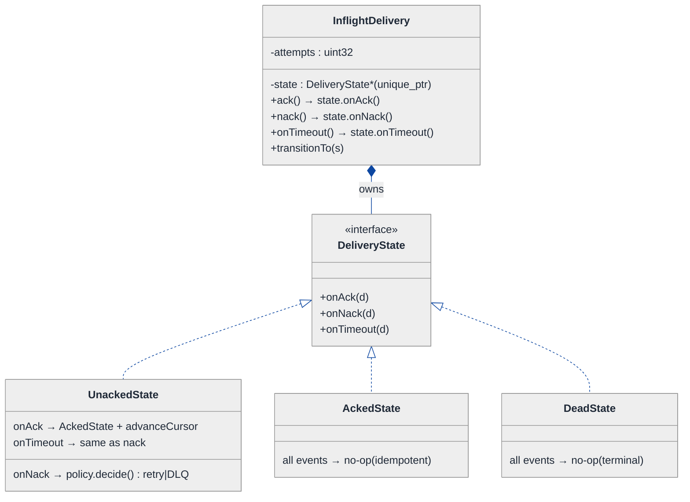
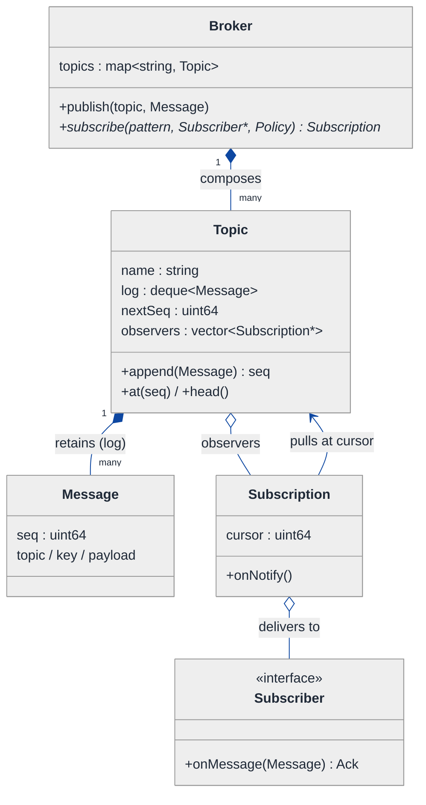
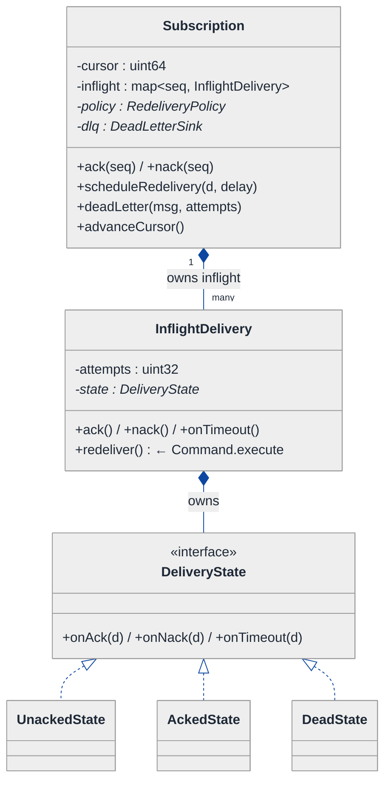
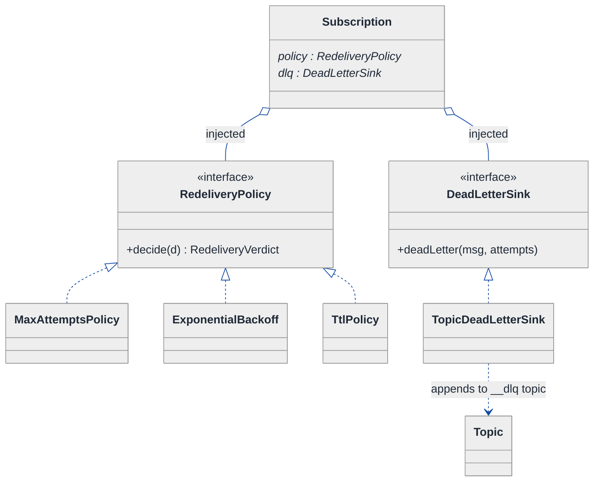
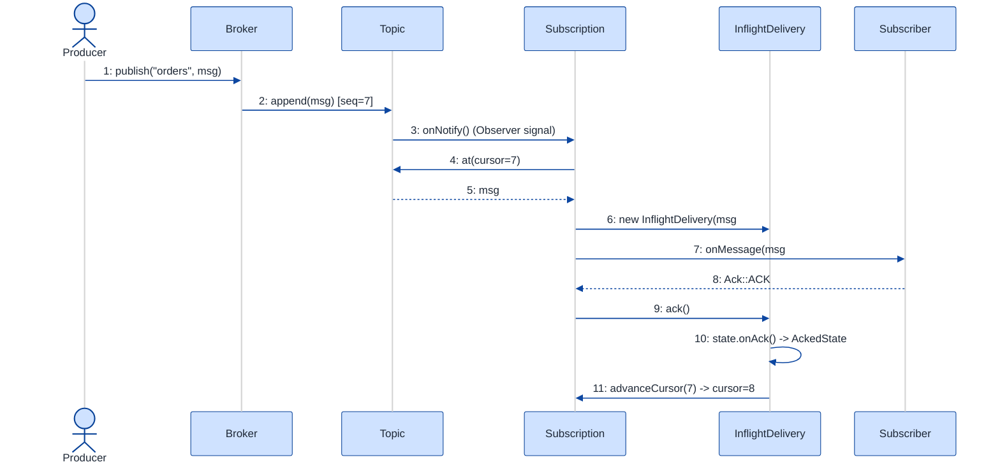
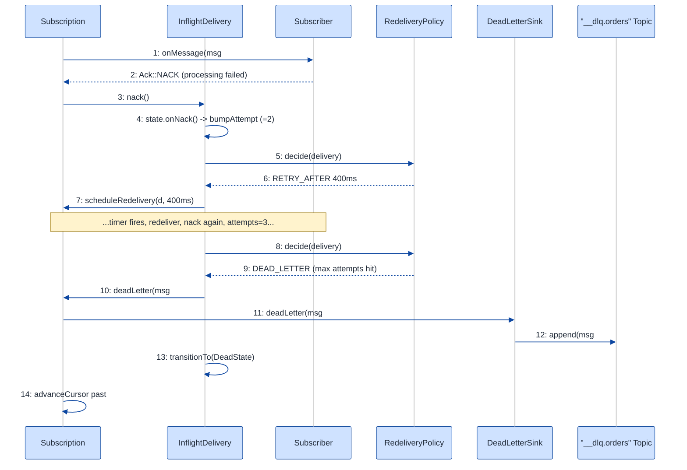

# Publish-Subscribe Messaging System — LLD Walkthrough

> **Difficulty:** Hard · **Time:** ~45 min · **Pattern focus:** Observer (subject ↔ subscriber notification) + Message Queue (durable, ordered, ack'd delivery)
>
> **Problem source(s):** GID **OB11**, bucket `Observer_Pattern`. Representative of the "design a pub-sub / message broker" family of LLD questions.
>
> **Diagrams:** inline mermaid (renders natively in GitHub / VS Code). The canonical theme block is copied verbatim at the top of every diagram.

---

## How to use this file

Paced for a candidate who has seen the Observer pattern once but has never built a broker. Reading time: ~45 minutes if you sketch each iteration by hand. **The lesson: a pub-sub system is the Observer pattern with the volume turned up — and every "enterprise" feature (durability, ordering, acknowledgment, dead-letter) is a separate axis of variability that wants its own collaborator. Don't bake them into the broker. Derive them.**

Do NOT reach for patterns up front. We build the naive broker first, watch it shatter under five concrete feature requests, and pull in ONE collaborator per painful axis.

**Map of this file (15 sections):**

1. Problem statement + clarifying questions
2. Plain-English restatement
3. Why this matters
4. Mental model
5. Try it yourself first
6. Entity & verb extraction
7. **Iteration 1: the naive broker** — what we'd write first
8. **Where the naive design hurts** — five future requirements, one painful diff each
9. **Pivot 1: Observer for topic routing** — the most painful axis first
10. **Pivot 2: durable per-subscription cursors + ack/nack lifecycle (State)** — ordering and at-least-once
11. **Pivot 3: Strategy for retry/redelivery + Dead-Letter routing** — and Command for the delivery unit
12. Final UML class diagram (3 sub-views)
13. Skeleton code (C++)
14. Key flow — sequence diagram
15. Extensibility re-check + anti-patterns + how to think aloud + self-check

---

## 1. Problem statement + clarifying questions

**Prompt (typical phrasing):** "Design a publish-subscribe messaging system with topic-based routing, durable subscriptions, message ordering guarantees, acknowledgment, and dead letter queue support."

**Clarifying questions to ask BEFORE drawing anything:**

1. **Routing granularity?** Exact topic-name match only, or hierarchical/wildcard topics (`orders.*`, `orders.#`)? Content-based filtering on message attributes?
2. **Fan-out semantics?** Does every subscriber to a topic get every message (broadcast / "fan-out"), or do subscribers in the same group share the load (competing consumers, like a Kafka consumer group)?
3. **Ordering guarantee — at what scope?** Global total order across the whole topic? Per-partition? Per-key (all messages with the same key ordered)? "No ordering" is also a valid answer that simplifies a lot.
4. **Delivery guarantee?** At-most-once (fire and forget), at-least-once (redeliver until ack — duplicates possible), or exactly-once (dedup + idempotency)?
5. **Durability?** Must a subscriber that was offline still receive messages published while it was down (durable subscription), or only live messages (transient)? How long do we retain?
6. **Acknowledgment model?** Auto-ack on delivery, or explicit client ack? What happens on nack or on ack-timeout — redeliver?
7. **Dead-letter trigger?** After N failed deliveries? After a TTL expiry? Both? Is the DLQ itself a topic you can subscribe to?
8. **Concurrency / threading?** Single broker process, many publisher/subscriber threads? Do we need thread-safe enqueue/dequeue? (We'll design the shapes single-threaded and note the locking seams in §15.)

**Assumptions if the interviewer dodges:** hierarchical topic match, **fan-out broadcast** to all subscriptions on a topic, **per-subscription ordering** (each subscription consumes the topic log in order), **at-least-once** delivery with **explicit client ack**, **durable** subscriptions backed by a per-subscription cursor over a retained topic log, **dead-letter after N redelivery attempts**, single broker process with the locking seams called out but not implemented.

---

## 2. Plain-English restatement

We are building the engine that sits between programs that *produce* messages and programs that *consume* them, so that neither side has to know the other exists. A producer publishes to a named **topic**; the broker fans the message out to every **subscription** registered on that topic. Each subscription remembers how far it has read (its **cursor**), so a subscriber that reconnects after a crash resumes where it left off — that is durability. The broker hands a message to a subscriber and waits for an **acknowledgment**; if the ack never comes, it redelivers; after too many failures, the message is shunted to a **dead-letter queue** so one poison message can't block the line. The whole thing must let us add new topics, new subscribers, new retry policies, and new routing rules **without rewriting the broker's core loop.**

---

## 3. Why this matters

This is the canonical Observer-at-scale question, and it is a brutal separator. The naive candidate writes a `std::map<topic, vector<callback>>` and calls it pub-sub — that is Observer, but it answers ZERO of the five hard requirements (durability, ordering, ack, redelivery, dead-letter). The senior candidate recognizes that "pub-sub" is Observer for the *routing* axis only, and that durability, ack lifecycle, redelivery policy, and dead-letter routing are four *additional* axes that each deserve their own collaborator. The skill being probed: can you keep the Observer core clean while layering broker semantics on top via composition? This exact shape reappears in event buses, webhook dispatchers, notification services, and CQRS read-model updaters.

---

## 4. Mental model

A broker is a **post office with mailboxes**. The topic is the address on the envelope. The broker doesn't deliver into the subscriber's hands — it drops the letter into a per-subscriber mailbox (the subscription's log/cursor) and the subscriber picks it up when ready. The subscriber signs for it (ack). Unsigned letters get redelivered; letters that bounce too many times go to the "undeliverable" bin (dead-letter).

```
Real-world sketch (NOT a UML diagram yet):

   Publisher P1 ──publish("orders", msg#7)──┐
   Publisher P2 ──publish("orders", msg#8)──┤
                                            ▼
                          ┌──────────────────────────────────┐
                          │   Topic "orders"  (append log)    │
                          │   [ #5 #6 #7 #8 ]  retained       │
                          └───────┬───────────────┬───────────┘
                       fan-out ▼               fan-out ▼
              ┌───────────────────────┐  ┌───────────────────────┐
              │ Subscription "billing"│  │ Subscription "audit"  │
              │ cursor → #6 (read 5)  │  │ cursor → #8 (caught up)│
              │ inflight: {#6: try 2} │  │ inflight: {}          │
              └──────────┬────────────┘  └───────────┬───────────┘
                  deliver/ack/nack             deliver/ack
                         ▼                            ▼
                   Subscriber A                 Subscriber B
                 (may crash & resume)
                         │
              after N nacks on #6
                         ▼
                  ┌──────────────┐
                  │ Dead-Letter  │  poison message parked here
                  └──────────────┘
```

The KEY insight from this picture: **the topic log is shared and append-only; each subscription has its OWN cursor and OWN inflight/redelivery bookkeeping.** Routing (who gets it) is one concern; per-subscriber progress (how far, retried how often, dead-lettered) is a completely separate concern. That separation is what we will bake into the class structure.

---

## 5. Try it yourself first

> **Predict before reading on:**
>
> 1. List 5 nouns you'd promote to a class. List 3 nouns you'd leave as fields.
> 2. **If two subscriptions read the same topic at different speeds, where does the "how far have I read" number live — on the topic, on the message, or on the subscription? Why does that choice decide whether durability is even possible?**
> 3. A subscriber keeps failing to process message #6. Where do you put the "retry 3 times then dead-letter" logic so that adding a 4th policy later doesn't touch the delivery loop?

---

## 6. Entity & verb extraction

> **Mini-refresher: noun → class, but not every noun.**
>
> Naive OOD promotes every noun to a class. Senior OOD promotes a noun only if it has both BEHAVIOR and STATE that need to live together. "Topic name" stays a `std::string` key; "Subscription" becomes a class because it carries a cursor, inflight bookkeeping, and lifecycle behavior.

**Nouns from the prompt:**

| Noun | Decision | Why |
|---|---|---|
| Broker | Class (top-level coordinator) | Owns topics, registers subscriptions, runs publish/poll |
| Topic | Class | Holds the retained append-only log + the list of subscriptions |
| Message | Class | Payload + key + sequence number + headers; immutable once published |
| Subscription | Class | Per-subscriber cursor + inflight map + delivery state; the heart of durability |
| Subscriber | Interface (the Observer) | Receives delivered messages; client-supplied |
| DeadLetterQueue | Class (a special Topic, or a sink) | Where poison messages land |
| Cursor / offset | Field on Subscription (`uint64_t`) | No behavior of its own |
| Topic name | Map key (`std::string`) | Not a class |
| Ack / Nack | Method calls + an inflight-entry state | Not standalone classes |
| Timestamp / TTL | Library type (`std::chrono`) | No domain behavior |

**Verbs (and the class they live on):**

| Verb | Owner class (naive answer — we'll re-examine) |
|---|---|
| publish(topic, msg) | Broker → Topic |
| subscribe(topic, subscriber) | Broker → Topic |
| deliver(msg) | Subscription → Subscriber |
| ack(msgSeq) / nack(msgSeq) | Subscription |
| advanceCursor() | Subscription |
| shouldRedeliver(attempt) | (naive: inline if/else; later: a policy object) |
| deadLetter(msg) | Subscription → DeadLetterQueue |

**We have NOT introduced any design patterns yet.** Pure nouns + verbs.

---

## 7. <a id="iter-1"></a>Iteration 1: the naive broker

Let's write the simplest thing that could possibly work. No design patterns beyond a callback list — just a map of topic → subscriber callbacks, fired synchronously on publish.



**Reader's tour (read top to bottom; ~60 seconds).**

1. **At the top — `Broker` is the root.** It holds ONE field: a `map<string, vector<Subscriber*>>` (topic name → list of subscriber pointers). Three public methods: `publish`, `subscribe`, `unsubscribe`. Every decision lives inside `publish`.

2. **`publish` fires callbacks synchronously (⚠).** When a producer publishes, the broker loops the topic's subscriber vector and calls `onMessage(msg)` on each — *right now, on the publisher's thread*. There is no log, no cursor, no buffer. The message exists only for the duration of that loop.

3. **`Subscriber` is the Observer interface.** A single virtual method `onMessage(Message)`. `BillingSubscriber` and `AuditSubscriber` implement it. This IS the Observer pattern in its barest form — and it's the one part of the naive design we'll keep.

4. **`Message` is a dumb data bag.** Topic, payload, key. No sequence number, no headers, no identity. Fine for now.

5. **The trouble is invisible in the diagram — it's in what's MISSING.** No `Topic` class owning a retained log. No `Subscription` with a cursor. No ack. No retry. No dead-letter. The naive broker doesn't even *acknowledge* that durability, ordering, ack, and DLQ are concerns — it assumes "publish == every live subscriber gets it instantly, and we forget it ever happened."

Skeleton code for the naive design (C++):

```cpp
#include <functional>
#include <stdexcept>
#include <string>
#include <unordered_map>
#include <vector>

struct Message {
    std::string topic;
    std::string payload;
    std::string key;
};

class Subscriber {
public:
    virtual ~Subscriber() = default;
    virtual void onMessage(const Message& m) = 0;   // the Observer hook
};

class Broker {
public:
    void subscribe(const std::string& topic, Subscriber* s) {
        subs_[topic].push_back(s);                  // raw pointer, no ownership
    }
    void unsubscribe(const std::string& topic, Subscriber* s) {
        auto& v = subs_[topic];
        v.erase(std::remove(v.begin(), v.end(), s), v.end());
    }
    void publish(const Message& m) {                // ⚠ everything happens here, synchronously
        auto it = subs_.find(m.topic);
        if (it == subs_.end()) return;              // no subscribers? message vanishes
        for (Subscriber* s : it->second) {
            s->onMessage(m);                        // fire callback on publisher's thread
            // no ack, no retry, no record that this happened
        }
    }
private:
    std::unordered_map<std::string, std::vector<Subscriber*>> subs_;
};

class BillingSubscriber : public Subscriber {
public:
    void onMessage(const Message& m) override {
        // process billing... what if this throws? what if we were offline?
    }
};
// AuditSubscriber elided — same shape
```

**This works.** It's the textbook Observer pattern. We can publish and every live subscriber's `onMessage` fires. So what's wrong with it?

---

## 8. <a id="naive-pain"></a>Where the naive design hurts

The interviewer slides five requirements across the desk: "Here's what ships next quarter. Walk me through what changes."

### Change A: "Durable subscriptions — a subscriber that was offline must still get messages published while it was down."

In the naive design:
- `publish()` calls `onMessage` immediately and discards the message. If a subscriber isn't in the vector at publish time (offline, crashed, not yet connected), **the message is gone forever.**
- There is no retained log to replay from, and no per-subscriber "how far have I read" marker.
- **Fix would require:** introducing a stored log per topic AND a cursor per subscriber. That's two new concepts the naive design has no home for. Touches `publish` and the entire `subs_` data model.

### Change B: "Ordering guarantee — subscriber must see messages in publish order, even across reconnects."

In the naive design:
- Ordering is *accidentally* preserved only because we loop synchronously. The moment we buffer, go async, or redeliver, order is lost.
- There's no sequence number on `Message`, so we can't even *detect* reordering, let alone enforce it.
- **Fix would require:** a monotonic sequence number stamped at publish, plus a per-subscriber cursor that advances strictly in order. Touches `Message`, `publish`, and the data model again.

### Change C: "Acknowledgment + at-least-once — redeliver until the subscriber confirms it processed the message."

In the naive design:
- `onMessage` returns `void`. There is no way for a subscriber to say "got it" or "failed, retry." Fire-and-forget is the ONLY mode.
- If `onMessage` throws, the message is lost (or crashes the publisher's thread).
- **Fix would require:** an inflight registry per subscriber (msg → attempt count + state), an `ack(seq)` / `nack(seq)` API, and a redelivery path. The synchronous `for` loop in `publish` cannot express any of this.

### Change D: "Dead-letter — after 3 failed deliveries, park the poison message somewhere instead of retrying forever."

In the naive design:
- There's no attempt counter, so "after 3 fails" is unrepresentable.
- There's no place to put a parked message.
- **Fix would require:** an attempt count on each inflight entry, a threshold check, and a DLQ sink. If we shove the threshold check into `publish`, the next policy ("dead-letter after TTL", "dead-letter immediately for topic X") means another `if` in the same loop.

### Change E: "Wildcard topics — `orders.*` should match `orders.created` and `orders.shipped`."

In the naive design:
- `subs_.find(m.topic)` is an EXACT map lookup. `orders.*` would never match `orders.created`.
- **Fix would require:** replacing the flat map lookup with a matching pass over registered patterns. Touches `publish` and `subscribe`.

### The pattern of pain

| Change | Files / methods touched | Smell |
|---|---|---|
| A. Durable subs | `publish` + `subs_` data model | "No retained log, no per-subscriber cursor — message is ephemeral." |
| B. Ordering | `Message` + `publish` + data model | "No sequence number; order is an accident of synchronous looping." |
| C. Ack / at-least-once | `publish` loop + `Subscriber` interface | "No delivery confirmation; void callback can't express retry." |
| D. Dead-letter | `publish` loop (more `if`s) | "Attempt count + threshold check has no home; every policy is another branch." |
| E. Wildcards | `publish` + `subscribe` | "Exact map lookup can't express pattern routing." |

**Three axes of pain dominate:**
1. **Routing + fan-out + durable progress** — *who* gets a message and *how far* each consumer has read. (A, B, E)
2. **Delivery lifecycle** — a single message-to-one-subscriber attempt moves through *delivered → ack'd / nack'd / dead-lettered*. (C, D)
3. **Redelivery / dead-letter policy** — the *rule* deciding retry-vs-dead-letter, which we must be able to swap. (D)

> **Pivot question:** "What pattern handles 'one source notifies many registered listeners' (the routing/fan-out axis)? What pattern handles 'one delivery attempt that transitions through a lifecycle' (ack/nack/dead-letter)? What pattern handles 'a redelivery rule we must swap without touching the loop'?"
>
> The answers are **Observer** (we keep and enrich it), **State** (delivery lifecycle), and **Strategy** (redelivery policy). We introduce them one at a time, starting with the most painful axis: turning the bare callback list into a durable, ordered, observed topic log.

---

## 9. <a id="pivot-1"></a>Pivot 1: Observer for topic routing — but with a durable log and per-subscription cursor

> **Mini-refresher: Observer pattern.**
>
> A *subject* maintains a list of *observers* and notifies each when its state changes. Observers register/unregister at runtime; the subject doesn't know their concrete types, only the observer interface. Two flavors: **push** (subject hands the new data to each observer) and **pull** (subject signals "something changed," observers fetch what they need).
>
> Quick example: a spreadsheet *cell* (subject) notifies every *chart* (observer) that references it when its value changes. The cell doesn't know what a chart is — only that observers expose `update()`.
>
> **Push vs pull matters here:** a naive broadcast is *push*. A durable broker is closer to *pull* — the subject (topic) appends to a log, and each observer (subscription) pulls from its own cursor at its own pace. That decoupling of *publish rate* from *consume rate* is exactly what makes durability and per-subscriber ordering possible.

**Why Observer fits — but the naive flavor is wrong.** The routing concern ("topic notifies its subscribers") is textbook Observer. But the naive *push* flavor couples publish to consume on the same thread, which is precisely why durability (A), ordering (B), and ack (C) were impossible. The fix: keep Observer for *registration*, but make the subject a **durable append-only log** and give each observer its **own cursor**. The subject pushes a lightweight "you have mail" signal; each subscription pulls in order from where it left off.

This single change unlocks A, B, and E:
- **Durability (A):** the log retains messages; an offline subscription's cursor simply hasn't advanced, so on reconnect it pulls the backlog.
- **Ordering (B):** publish stamps a monotonic `seq`; the cursor advances strictly in `seq` order → per-subscription total order.
- **Wildcards (E):** `subscribe` registers a *pattern*; the broker matches patterns to a topic name once at subscribe-time and wires the subscription to every matching topic's observer list.

**The refactor (just the routing + log slice):**

```cpp
#include <cstdint>
#include <deque>
#include <memory>
#include <string>
#include <vector>

struct Message {
    std::uint64_t  seq{0};          // stamped by Topic at publish — enables ordering + dedup
    std::string    topic;
    std::string    key;             // ordering scope: same key => same order
    std::string    payload;
};

class Subscription;   // forward — the Observer; defined in Pivot 2

// SUBJECT: a topic is a durable append-only log + an observer registry.
class Topic {
public:
    explicit Topic(std::string name) : name_(std::move(name)) {}

    std::uint64_t append(Message m) {               // publisher side
        m.seq = nextSeq_++;
        log_.push_back(std::move(m));
        notifyObservers();                          // Observer: "you have mail"
        return log_.back().seq;
    }
    void registerObserver(Subscription* s)   { observers_.push_back(s); }
    void unregisterObserver(Subscription* s) { /* erase-remove, elided */ }

    // PULL side: a subscription fetches the message at its cursor (nullptr if caught up).
    const Message* at(std::uint64_t seq) const {
        if (seq < base_ || seq >= base_ + log_.size()) return nullptr;
        return &log_[seq - base_];
    }
    std::uint64_t  head() const { return base_ + log_.size(); }   // one past last
    const std::string& name() const { return name_; }

private:
    void notifyObservers();                          // signals each Subscription to poll; defined w/ Subscription
    std::string                  name_;
    std::deque<Message>          log_;               // retained; base_ trims on retention policy
    std::uint64_t                base_{0};           // seq of log_[0] after trimming
    std::uint64_t                nextSeq_{0};
    std::vector<Subscription*>   observers_;         // the registered subscriptions
};
```

**What changed — visualized.** Just the routing slice:



**Tour of the after-state.**

1. **Top: `Broker` now composes `Topic` objects** (filled diamond — strong ownership; topics die with the broker). It no longer holds a flat callback map. `subscribe` returns a `Subscription*` so the caller can later ack/nack through it.

2. **Middle: `Topic` is the SUBJECT.** It owns the retained `log` (a deque so we can trim the front under a retention policy) and a `nextSeq` counter that stamps monotonic sequence numbers. It holds `observers` — the registered subscriptions. `append` is the publish path: stamp seq, store, notify.

3. **`Topic` exposes a PULL API: `at(seq)` and `head()`.** This is the crucial decoupling. Instead of pushing the payload into observers, the topic says "poll me," and each subscription reads from its own `cursor` up to `head()`. Publish rate and consume rate are now independent.

4. **`Subscription` is the OBSERVER.** It holds a `cursor` (how far it has read) — this single `uint64_t` is what makes durability and ordering possible. On `onNotify`, it polls the topic from `cursor` and delivers in order.

5. **`Subscriber` interface survived from the naive design** — it's the client's processing hook. Note its signature is about to change in Pivot 2 (it returns an `Ack`, not `void`).

**Changes A, B, E from §8 now land cleanly.** Durability = the log + cursor. Ordering = monotonic seq + in-order cursor advance. Wildcards = match patterns to topic names at subscribe-time and register the subscription on each matching topic.

**Pattern-discrimination cheatsheet — Observer vs Mediator.**
- *Observer:* one subject broadcasts to many observers that registered with it; observers don't talk to each other; the dependency is one-way (observer → subject for registration, subject → observer for notification).
- *Mediator:* a central hub coordinates many-to-many interaction between colleagues that would otherwise reference each other directly; it encapsulates *how* a set of objects interact.
- *Rule of thumb:* if it's "one source, many passive listeners, fan-out" → Observer. If it's "many peers needing to coordinate, routed through a hub that knows the protocol" → Mediator. A topic fanning out to subscriptions is pure Observer; the *Broker* coordinating publishers-to-topics-to-subscriptions has a whiff of Mediator, but each Topic→Subscription edge is plain Observer, so we model it that way.

**Why not just keep push-Observer?** Push couples publish to consume on one thread (the naive bug). Pull-Observer (subject notifies "changed," observer fetches at its own cursor) is what every real broker — Kafka, JMS durable subscriptions — actually does, because it's the only flavor that survives an offline consumer.

---

## 10. <a id="pivot-2"></a>Pivot 2: State for the per-message delivery lifecycle (ack / nack / at-least-once)

Changes C from §8 is still painful — `onMessage` returns `void`, there's no ack, no redelivery, no inflight tracking. The Observer/log work from Pivot 1 routes the message and orders it, but says nothing about *what happens to a single delivery attempt.*

Here's the key realization: **one (message, subscription) pair is not a value — it's a little lifecycle.** It starts UNACKED (delivered, waiting), then becomes ACKED (cursor advances), or NACKED (schedule redelivery, bump attempt), or — eventually — DEAD (give up, route to DLQ). The valid operations depend on which phase it's in. That's not an algorithm the caller picks; it's a lifecycle the delivery object transitions through based on events (ack arrived, nack arrived, timeout fired). That's the State pattern.

> **Mini-refresher: State pattern.**
>
> Each lifecycle state is its own class. The context object delegates an event call (`ack()`, `nack()`, `onTimeout()`) to its current state, and THE STATE decides what the next state is. Transitions are INTERNAL, driven by events the context receives — not chosen by an outside caller.

**Why State (not Strategy) for the delivery lifecycle.** The next state isn't picked by client code — it's driven by what the delivery has been through. An UNACKED delivery can be `ack`'d (→ done) or `nack`'d (→ pending-retry). An ACKED delivery can do nothing — calling `nack` on it is meaningless and should be rejected, not silently swallowed. The transition rules ARE the at-least-once guarantee. Putting them in a switch scattered across the broker loop is exactly the smell §8.D warned about.

**The refactor (just the delivery-lifecycle slice):**

```cpp
#include <cstdint>
#include <memory>

class InflightDelivery;          // forward — the State context
class RedeliveryPolicy;          // forward — added in Pivot 3
class DeadLetterSink;            // forward — added in Pivot 3

enum class Ack { ACK, NACK };    // what a Subscriber returns from onMessage

// STATE interface: a delivery attempt's lifecycle.
class DeliveryState {
public:
    virtual ~DeliveryState() = default;
    virtual void onAck (InflightDelivery& d) = 0;
    virtual void onNack(InflightDelivery& d) = 0;
    virtual void onTimeout(InflightDelivery& d) = 0;   // ack-timeout == implicit nack
};

class UnackedState : public DeliveryState {
public:
    void onAck (InflightDelivery& d) override;          // -> AckedState, advance cursor
    void onNack(InflightDelivery& d) override;          // -> ask policy: retry or DLQ
    void onTimeout(InflightDelivery& d) override;       // same path as nack
};

class AckedState : public DeliveryState {               // terminal-success
public:
    void onAck (InflightDelivery&) override {}                        // idempotent: already acked
    void onNack(InflightDelivery&) override {}                        // too late, ignore
    void onTimeout(InflightDelivery&) override {}                     // no-op
};

class DeadState : public DeliveryState {                // terminal-failure (dead-lettered)
public:
    void onAck (InflightDelivery&) override {}
    void onNack(InflightDelivery&) override {}
    void onTimeout(InflightDelivery&) override {}
};

// CONTEXT: one in-flight (message, subscription) attempt.
class InflightDelivery {
public:
    InflightDelivery(const Message& m, Subscription& owner)
        : msg_(m), owner_(owner), state_(std::make_unique<UnackedState>()) {}

    void ack()       { state_->onAck(*this);  }
    void nack()      { state_->onNack(*this); }
    void onTimeout() { state_->onTimeout(*this); }
    void transitionTo(std::unique_ptr<DeliveryState> s) { state_ = std::move(s); }

    std::uint32_t  attempts() const { return attempts_; }
    void           bumpAttempt()    { ++attempts_; }
    const Message& message()  const { return msg_; }
    Subscription&  owner()          { return owner_; }
private:
    const Message&                  msg_;
    Subscription&                   owner_;
    std::uint32_t                   attempts_{1};
    std::unique_ptr<DeliveryState>  state_;
};
```

**What changed — visualized.** Just the delivery-lifecycle slice:



**Tour of the after-state.**

1. **`InflightDelivery` is the context** — it represents ONE message handed to ONE subscription, awaiting resolution. It owns a `DeliveryState` via `unique_ptr` and tracks `attempts`.

2. **The three event methods are one-liners that delegate.** `ack()` → `state_->onAck(*this)`, and so on. **No `if (status == UNACKED)` anywhere.** The class hierarchy IS the validation: a double-ack just hits `AckedState::onAck` which is a no-op (idempotent — important, because at-least-once means duplicate acks happen).

3. **`UnackedState` is the meaty one.** `onAck` advances the subscription's cursor (the durable progress marker) and transitions to `AckedState`. `onNack` and `onTimeout` are where redelivery-vs-dead-letter is decided — but **the State doesn't hardcode the rule**; it asks a policy (Pivot 3). `onTimeout` == implicit nack, so ack-timeouts feed the same path.

4. **`AckedState` and `DeadState` are terminal and idempotent.** Every event is a safe no-op. This is what makes at-least-once correct under retries: re-acking an already-acked message can't corrupt the cursor.

5. **Why this is State, not an enum.** With an enum + switch, every new behavior ("paused" state, "scheduled-retry" state) means editing the switch in every event handler — `onAck`, `onNack`, `onTimeout` — across the broker. Three switches, N states = a maintenance bomb. With State, a new phase is one new class.

**Pattern-discrimination cheatsheet — State vs Strategy.**
- *State:* the OBJECT picks its next state internally via transitions; states know each other (each can `transitionTo` another); driven by events.
- *Strategy:* the CALLER picks which algorithm to use; strategies are mutually unaware; driven by configuration.
- *Rule of thumb:* if `delivery.nack()` causes an *internal* flip to a new phase → State. If `broker.setRetryPolicy(x)` is called *externally* to swap an algorithm → Strategy.
- **In THIS design we use both:** the delivery *lifecycle* is State; the *retry-vs-dead-letter rule* it consults is Strategy (next section). The State asks the Strategy.

---

## 11. <a id="pivot-3"></a>Pivot 3: Strategy for redelivery/dead-letter policy — plus Command for the delivery unit

Change D from §8 (dead-letter after 3 fails) is the last gap, and §8 explicitly warned: if we hardcode "after 3" inside `UnackedState::onNack`, the next requirement — "dead-letter after TTL", "dead-letter immediately for topic X", "exponential backoff with jitter" — means surgery in the state class. The *rule* varies; the lifecycle does not. That's the boundary between State and Strategy.

> **Mini-refresher: Strategy pattern.**
>
> Encapsulates an algorithm behind an interface so it can be swapped at runtime. The CALLER (here, the subscription's configuration) decides which strategy to use; the strategy doesn't know about its peers.

**The redelivery decision as a Strategy.** Given an `InflightDelivery` (which knows its attempt count and message age), a policy returns one of: *retry now*, *retry after delay D*, or *dead-letter*. That's a pure function of delivery state → decision. Swappable per subscription.

```cpp
#include <chrono>
#include <memory>

enum class Decision { RETRY_NOW, RETRY_AFTER, DEAD_LETTER };

struct RedeliveryVerdict {
    Decision                  decision;
    std::chrono::milliseconds delay{0};      // meaningful only for RETRY_AFTER
};

// STRATEGY interface.
class RedeliveryPolicy {
public:
    virtual ~RedeliveryPolicy() = default;
    virtual RedeliveryVerdict decide(const InflightDelivery& d) const = 0;
};

class MaxAttemptsPolicy : public RedeliveryPolicy {     // "retry up to N, then DLQ"
public:
    explicit MaxAttemptsPolicy(std::uint32_t maxAttempts) : max_(maxAttempts) {}
    RedeliveryVerdict decide(const InflightDelivery& d) const override {
        if (d.attempts() >= max_) return { Decision::DEAD_LETTER, {} };
        return { Decision::RETRY_NOW, {} };
    }
private:
    std::uint32_t max_;
};

class ExponentialBackoff : public RedeliveryPolicy {    // 2^attempt * base, then DLQ at cap
public:
    ExponentialBackoff(std::uint32_t maxAttempts, std::chrono::milliseconds base)
        : max_(maxAttempts), base_(base) {}
    RedeliveryVerdict decide(const InflightDelivery& d) const override {
        if (d.attempts() >= max_) return { Decision::DEAD_LETTER, {} };
        auto delay = base_ * (1u << (d.attempts() - 1));     // jitter elided
        return { Decision::RETRY_AFTER, delay };
    }
private:
    std::uint32_t             max_;
    std::chrono::milliseconds base_;
};
// TtlPolicy, ImmediateDlqPolicy, CompositePolicy ... elided — same shape
```

**Why is the delivery unit also a Command?** Look back at `InflightDelivery`: it bundles *what to do* (deliver this message to this subscriber) with *the data needed to do it* (the message + owner + attempt count), and it can be *re-executed later* (redelivery after a delay) and *parked on a queue* (the retry queue, then the DLQ). An object that packages "an action + its args" so it can be queued, deferred, retried, and logged — that's the Command pattern.

> **Mini-refresher: Command pattern.**
>
> Encapsulates a request as an object, so you can parameterize, queue, delay, retry, log, or undo it. The invoker holds Commands without knowing what they do; the Command holds the receiver and the args.
>
> Quick example: a job queue stores `Command` objects; a worker pops one and calls `execute()`. The worker doesn't know if it's resizing an image or sending an email.

`InflightDelivery` is our Command: the broker's redelivery scheduler holds a queue of them and calls `redeliver()` when the backoff timer fires, without caring what's inside.

**The dead-letter sink.** When the policy says `DEAD_LETTER`, the delivery routes the message to a `DeadLetterSink`. The cleanest implementation: **the DLQ is itself a Topic.** Dead-lettered messages get appended to a `__dlq.<topic>` topic that operators can subscribe to like any other — reusing the entire Pivot-1 machinery. That's a one-line `Topic::append` call, not a new subsystem.

```cpp
class DeadLetterSink {
public:
    virtual ~DeadLetterSink() = default;
    virtual void deadLetter(const Message& m, std::uint32_t attempts) = 0;
};

class TopicDeadLetterSink : public DeadLetterSink {     // DLQ is just another Topic
public:
    explicit TopicDeadLetterSink(Topic& dlqTopic) : dlq_(dlqTopic) {}
    void deadLetter(const Message& m, std::uint32_t attempts) override {
        Message dead = m;
        dead.topic   = dlq_.name();
        // headers["x-death-attempts"] = attempts ... (headers elided)
        dlq_.append(std::move(dead));                    // reuse Pivot-1 fan-out!
    }
private:
    Topic& dlq_;
};
```

Now `UnackedState::onNack` consults the Strategy and acts:

```cpp
inline void UnackedState::onNack(InflightDelivery& d) {
    d.bumpAttempt();
    auto verdict = d.owner().policy().decide(d);
    switch (verdict.decision) {
        case Decision::RETRY_NOW:
            d.owner().scheduleRedelivery(d, std::chrono::milliseconds{0}); break;
        case Decision::RETRY_AFTER:
            d.owner().scheduleRedelivery(d, verdict.delay);                break;
        case Decision::DEAD_LETTER:
            d.owner().deadLetter(d.message(), d.attempts());
            d.transitionTo(std::make_unique<DeadState>());                 break;
    }
}
```

**The lesson.** Once we separated the *lifecycle* (State, Pivot 2) from the *rule the lifecycle consults* (Strategy, here), Change D and every future redelivery policy becomes ONE new `RedeliveryPolicy` subclass. The State class never changes. The broker loop never changes.

> **Mini-refresher: why State, Strategy, and Command don't collapse into one hierarchy.**
>
> They answer different questions. State = "what phase is this delivery in, and what's legal now?" Strategy = "what's the retry *rule*?" Command = "how do I package this delivery so a scheduler can re-run it later?" Same object (`InflightDelivery`) plays the State *context* AND the Command, while *holding a pointer* to a Strategy. That's normal — patterns describe roles, not exclusive class identities.

**Pattern-discrimination cheatsheet — Command vs Strategy.**
- *Command:* encapsulates an *action to perform later* (with its receiver + args); the focus is *deferral / queuing / retry / undo*. Has an `execute()`.
- *Strategy:* encapsulates an *algorithm to choose among*; the focus is *swapping behavior*. Has a `compute()/decide()`.
- *Rule of thumb:* "I want to queue/delay/retry this operation" → Command. "I want to swap how this one decision is made" → Strategy. `InflightDelivery` is queued and retried → Command. `RedeliveryPolicy` is a swappable decision → Strategy.

---

## 12. <a id="fig-class-diagram"></a>Final class diagram

One mega-diagram would be a wall of boxes. Here are **three focused sub-views**, each addressing one concern. Read them in order; the structural insight at the end ties them together.

### 12.1 The routing spine — Observer (what the broker OWNS and fans out)



**Tour of 12.1.** `Broker` composes `Topic`s (filled diamond — same lifetime). Each `Topic` is the SUBJECT: it retains the `Message` log and stamps `seq`, and holds its `observers` (the subscriptions). Each `Subscription` is an OBSERVER that *pulls* at its own `cursor` and delivers to its client `Subscriber`. The Observer relationship is the open diamond `Topic o-- Subscription`; the cursor-pull is the `Subscription --> Topic` dependency. This sub-view alone delivers durability (retained log), ordering (seq + cursor), and wildcards (pattern→topic match at subscribe-time).

### 12.2 The delivery lifecycle — State (what happens to ONE attempt)



**Tour of 12.2.** `Subscription` owns a map of `InflightDelivery` keyed by seq — the messages it has handed out but not yet resolved. Each `InflightDelivery` is the State *context* AND the Command (`redeliver()` is its `execute`). It owns a `DeliveryState` (`unique_ptr`); `UnackedState` is non-terminal, `AckedState`/`DeadState` are terminal and idempotent. `Subscription::ack(seq)` finds the inflight entry and calls `delivery.ack()`, which delegates to the state. **No status enum, no switch** — the hierarchy enforces what's legal in each phase, which is the at-least-once guarantee in code.

### 12.3 The policy injection — Strategy (the swappable retry/DLQ rule)



**Tour of 12.3.** `Subscription` aggregates (open diamond — injected, not owned-by-value) two interfaces: a `RedeliveryPolicy` (the retry-vs-DLQ rule) and a `DeadLetterSink`. `MaxAttemptsPolicy`, `ExponentialBackoff`, `TtlPolicy` are interchangeable Strategy impls — each subscription picks one at construction. `TopicDeadLetterSink` is the elegant bit: the DLQ is *just another Topic*, so dead-lettered messages flow through the exact same Observer/log/cursor machinery from 12.1. Adding a new retry rule = one new `RedeliveryPolicy` subclass; nothing in 12.1 or 12.2 changes.

### Structural insight (ties 12.1 + 12.2 + 12.3 together)

| Concern | Pattern used | Why |
|---|---|---|
| **Routing / fan-out / durability / ordering** | Observer (pull flavor) + retained log + per-sub cursor | Topic is the subject; subscriptions register and pull at their own cursor. Cursor = durability + ordering. |
| **Per-attempt delivery lifecycle** (unacked → acked / dead) | State, OWNED by InflightDelivery | The object transitions on ack/nack/timeout events; states validate what's legal. The hierarchy IS the at-least-once guarantee. |
| **The redelivery unit itself** (queue / delay / retry) | Command (`InflightDelivery::redeliver`) | A deferred, re-runnable action the scheduler holds without knowing its contents. |
| **Retry-vs-dead-letter rule** | Strategy, INJECTED into Subscription | Caller/config picks the policy; swappable per subscription without touching the State. |
| **Dead-letter destination** | Reuse Topic as a DLQ sink | A DLQ is a topic operators can subscribe to — no new subsystem. |

The big lesson: **"pub-sub" is Observer for routing only.** Durability, ordering, ack, redelivery, and dead-letter are *four more axes*, and each got its own collaborator (cursor, State, Strategy, Command, DLQ-as-Topic) instead of being crammed into the broker's publish loop. *Observer for fan-out, State for lifecycle, Strategy for the swappable rule, Command for the deferred unit.* That separation is what makes the broker extensible.

---

## 13. Skeleton code (C++)

> Show the SHAPES, not the full impl. ~140 lines.

```cpp
#include <chrono>
#include <cstdint>
#include <deque>
#include <memory>
#include <stdexcept>
#include <string>
#include <unordered_map>
#include <utility>
#include <vector>

// ── Forward declarations ────────────────────────────────────────────
class Subscription;          // the Observer + ack/nack owner
class InflightDelivery;      // State context + Command
class Topic;

// ── Message (immutable once appended) ───────────────────────────────
struct Message {
    std::uint64_t seq{0};
    std::string   topic;
    std::string   key;
    std::string   payload;
};

enum class Ack { ACK, NACK };

// ── Subscriber: the client-supplied Observer hook ───────────────────
class Subscriber {
public:
    virtual ~Subscriber() = default;
    virtual Ack onMessage(const Message& m) = 0;   // returns ACK/NACK (was void in naive design)
};

// ── Topic: SUBJECT (durable log) + observer registry ────────────────
class Topic {
public:
    explicit Topic(std::string name) : name_(std::move(name)) {}
    std::uint64_t append(Message m) {
        m.seq = nextSeq_++;
        log_.push_back(std::move(m));
        notifyObservers();                          // Observer push-signal: "poll me"
        return log_.back().seq;
    }
    void registerObserver(Subscription* s)   { observers_.push_back(s); }
    void unregisterObserver(Subscription* s);       // erase-remove, elided
    const Message* at(std::uint64_t seq) const {
        if (seq < base_ || seq >= base_ + log_.size()) return nullptr;
        return &log_[seq - base_];
    }
    std::uint64_t      head() const { return base_ + log_.size(); }
    const std::string& name() const { return name_; }
private:
    void notifyObservers();                          // calls Subscription::onNotify on each
    std::string                name_;
    std::deque<Message>        log_;
    std::uint64_t              base_{0}, nextSeq_{0};
    std::vector<Subscription*> observers_;
};

// ── Strategy: redelivery policy ─────────────────────────────────────
enum class Decision { RETRY_NOW, RETRY_AFTER, DEAD_LETTER };
struct RedeliveryVerdict { Decision decision; std::chrono::milliseconds delay{0}; };

class RedeliveryPolicy {
public:
    virtual ~RedeliveryPolicy() = default;
    virtual RedeliveryVerdict decide(const InflightDelivery& d) const = 0;
};
// MaxAttemptsPolicy, ExponentialBackoff, TtlPolicy elided — see §11

// ── Dead-letter sink (DLQ is just another Topic) ────────────────────
class DeadLetterSink {
public:
    virtual ~DeadLetterSink() = default;
    virtual void deadLetter(const Message& m, std::uint32_t attempts) = 0;
};
// TopicDeadLetterSink elided — see §11

// ── State: per-delivery lifecycle ───────────────────────────────────
class DeliveryState {
public:
    virtual ~DeliveryState() = default;
    virtual void onAck(InflightDelivery& d)     = 0;
    virtual void onNack(InflightDelivery& d)    = 0;
    virtual void onTimeout(InflightDelivery& d) = 0;
};
class UnackedState : public DeliveryState {
public:
    void onAck(InflightDelivery& d) override;       // -> AckedState + advanceCursor
    void onNack(InflightDelivery& d) override;      // consults RedeliveryPolicy
    void onTimeout(InflightDelivery& d) override;   // == nack
};
class AckedState : public DeliveryState {           // terminal, idempotent
public:
    void onAck(InflightDelivery&)     override {}
    void onNack(InflightDelivery&)    override {}
    void onTimeout(InflightDelivery&) override {}
};
class DeadState : public DeliveryState {            // terminal, idempotent
public:
    void onAck(InflightDelivery&)     override {}
    void onNack(InflightDelivery&)    override {}
    void onTimeout(InflightDelivery&) override {}
};

// ── InflightDelivery: State context + Command ───────────────────────
class InflightDelivery {
public:
    InflightDelivery(const Message& m, Subscription& owner)
        : msg_(m), owner_(owner), state_(std::make_unique<UnackedState>()) {}
    void ack()       { state_->onAck(*this); }
    void nack()      { state_->onNack(*this); }
    void onTimeout() { state_->onTimeout(*this); }
    void redeliver();                                // Command::execute — re-hands to Subscriber
    void transitionTo(std::unique_ptr<DeliveryState> s) { state_ = std::move(s); }
    std::uint32_t  attempts() const { return attempts_; }
    void           bumpAttempt()    { ++attempts_; }
    const Message& message()  const { return msg_; }
    Subscription&  owner()          { return owner_; }
private:
    const Message&                 msg_;
    Subscription&                  owner_;
    std::uint32_t                  attempts_{1};
    std::unique_ptr<DeliveryState> state_;
};

// ── Subscription: the Observer; owns cursor + inflight + policy ─────
class Subscription {
public:
    Subscription(Topic& t, Subscriber* sub,
                 std::unique_ptr<RedeliveryPolicy> policy,
                 DeadLetterSink* dlq)
        : topic_(t), subscriber_(sub), policy_(std::move(policy)), dlq_(dlq) {}

    void onNotify() {                                // Observer callback: pull and deliver in order
        while (cursor_ < topic_.head()) {
            const Message* m = topic_.at(cursor_);
            if (!m) break;
            auto [it, _] = inflight_.try_emplace(m->seq, *m, *this);
            Ack a = subscriber_->onMessage(*m);      // client processes; returns ACK/NACK
            (a == Ack::ACK) ? it->second.ack() : it->second.nack();
            if (!inflight_.count(m->seq)) ++cursor_; // advanced only on terminal-ack (see advanceCursor)
            else break;                              // stuck on an unacked message: stop (ordering!)
        }
    }
    void ack(std::uint64_t seq)  { if (auto it = inflight_.find(seq); it != inflight_.end()) it->second.ack(); }
    void nack(std::uint64_t seq) { if (auto it = inflight_.find(seq); it != inflight_.end()) it->second.nack(); }

    void advanceCursor(std::uint64_t seq) { inflight_.erase(seq); if (seq == cursor_) ++cursor_; }
    void scheduleRedelivery(InflightDelivery& d, std::chrono::milliseconds delay); // timer-queue, elided
    void deadLetter(const Message& m, std::uint32_t attempts) { if (dlq_) dlq_->deadLetter(m, attempts); }
    RedeliveryPolicy& policy() { return *policy_; }
private:
    Topic&                                              topic_;
    Subscriber*                                         subscriber_;
    std::uint64_t                                       cursor_{0};
    std::unordered_map<std::uint64_t, InflightDelivery> inflight_;
    std::unique_ptr<RedeliveryPolicy>                   policy_;
    DeadLetterSink*                                     dlq_;
};

// ── Broker: top-level coordinator ───────────────────────────────────
class Broker {
public:
    void publish(const std::string& topic, Message m) {
        m.topic = topic;
        topicFor(topic).append(std::move(m));        // append + fan-out via Observer
    }
    Subscription* subscribe(const std::string& pattern, Subscriber* sub,
                            std::unique_ptr<RedeliveryPolicy> policy,
                            DeadLetterSink* dlq) {
        // match pattern -> topic names (wildcards), register an observer on each (elided to one topic)
        Topic& t = topicFor(pattern);
        auto s = std::make_unique<Subscription>(t, sub, std::move(policy), dlq);
        Subscription* raw = s.get();
        t.registerObserver(raw);
        subscriptions_.push_back(std::move(s));
        return raw;
    }
private:
    Topic& topicFor(const std::string& name) {
        auto it = topics_.find(name);
        if (it == topics_.end()) it = topics_.emplace(name, std::make_unique<Topic>(name)).first;
        return *it->second;
    }
    std::unordered_map<std::string, std::unique_ptr<Topic>> topics_;
    std::vector<std::unique_ptr<Subscription>>              subscriptions_;
};

// ── Deferred state-transition bodies (need full Subscription/Inflight) ──
inline void UnackedState::onAck(InflightDelivery& d) {
    std::uint64_t seq = d.message().seq;
    d.transitionTo(std::make_unique<AckedState>());
    d.owner().advanceCursor(seq);                    // durable progress moves forward
}
inline void UnackedState::onTimeout(InflightDelivery& d) { onNack(d); }
inline void UnackedState::onNack(InflightDelivery& d) {
    d.bumpAttempt();
    auto v = d.owner().policy().decide(d);
    switch (v.decision) {
        case Decision::RETRY_NOW:   d.owner().scheduleRedelivery(d, std::chrono::milliseconds{0}); break;
        case Decision::RETRY_AFTER: d.owner().scheduleRedelivery(d, v.delay);                      break;
        case Decision::DEAD_LETTER: d.owner().deadLetter(d.message(), d.attempts());
                                    d.transitionTo(std::make_unique<DeadState>());                 break;
    }
}
```

---

## 14. <a id="fig-sequence"></a>Key flow — sequence diagram

This is the moment of truth — read across the swimlanes to see how Observer, State, and Strategy COOPERATE.

### Phase 1 — publish + fan-out + successful ack



**Tour of Phase 1 (happy path).**

1. **Producer publishes to the broker**, which routes to the right `Topic` (step 2). `append` stamps `seq=7` and stores the message in the retained log — durability begins the instant it's stored, before anyone consumes it.

2. **Topic signals its observers (step 3).** This is the Observer push-signal — but it carries no payload, it just says "poll me." That keeps publish fast and decoupled from consume speed.

3. **Subscription pulls at its cursor (steps 4-5).** It fetches `at(7)` — exactly where its cursor sits. A *different* subscription with a lagging cursor would fetch its own older message. Per-subscriber progress, per-subscriber ordering.

4. **An InflightDelivery is created in UnackedState (step 6).** The State pattern enters: the delivery is BORN unacked. Until it resolves, the cursor will NOT advance past it — that's the ordering guarantee.

5. **Client processes and returns ACK (steps 7-8).** The `Subscriber` hook now returns `Ack`, not `void` — the difference from the naive design that makes at-least-once possible.

6. **ack() delegates to the state (steps 9-10).** `UnackedState::onAck` transitions to `AckedState` and tells the subscription to advance the cursor (step 11). Cursor 7 → 8; message #7 is now durably consumed and removed from inflight. Next poll handles #8.

### Phase 2 — failure, redelivery via Strategy, then dead-letter



**Tour of Phase 2 (the hard path). Read slowly — this is where State + Strategy + Command cooperate.**

1. **Client nacks msg#6 (steps 1-3).** Processing failed. The Subscriber returns `NACK`; the subscription routes it to the inflight delivery's `nack()`.

2. **State handles the nack (step 4).** `UnackedState::onNack` bumps the attempt counter. **Crucially, it does NOT decide retry-vs-DLQ itself** — that would hardcode the rule §8.D warned about.

3. **State consults the Strategy (steps 5-6).** It asks the injected `RedeliveryPolicy::decide(delivery)`. An `ExponentialBackoff` returns `RETRY_AFTER 400ms`. The State acts on the verdict but doesn't own the rule.

4. **Redelivery is scheduled (step 7).** Here `InflightDelivery` acts as a **Command** — it's parked on a timer queue and re-executed when the delay elapses, without the scheduler knowing what's inside it.

5. **The cycle repeats until the cap (the `Note`, then steps 8-9).** After attempt 3, the same `decide` call now returns `DEAD_LETTER` — same Strategy object, different verdict because the delivery's attempt count changed. The decision is data-driven, not branch-driven.

6. **Dead-letter routing (steps 10-12).** The State tells the subscription to dead-letter; the subscription delegates to its `DeadLetterSink`; the `TopicDeadLetterSink` **appends to `__dlq.orders`, which is just another Topic.** Operators subscribed to that topic get the poison message through the identical Observer machinery.

7. **The delivery goes terminal and the line unblocks (steps 13-14).** `transitionTo(DeadState)` — now ack/nack/timeout are all no-ops. The subscription advances its cursor past #6 so one poison message can't stall #7, #8, forever. **That is the whole point of a DLQ: forward progress.**

### The validation that's NOT shown — and why it matters

You don't see `if (attempt >= 3)` or `if (status == ACKED)` anywhere in these diagrams. The attempt threshold lives in the **Strategy** (`decide`), and the legal-operations check lives in the **State** hierarchy (`AckedState::onNack` is a no-op). A double-ack from a flaky client hits `AckedState::onAck` — a safe no-op — instead of double-advancing the cursor and skipping a message. **The class hierarchy IS the at-least-once guarantee; the Strategy IS the retry policy.** No scattered `if` ladders.

---

## 15. Extensibility re-check + anti-patterns + how to think aloud + self-check

### Extensibility re-check

Revisit the five changes from [§8](#naive-pain). For each, name the SINGLE class (or zero classes) that changes.

| Change | Naive design impact | Final design impact |
|---|---|---|
| A. Durable subscriptions | `publish` + data model rewrite | Already inherent — Topic retains the log, Subscription owns a cursor. Zero new classes. |
| B. Ordering guarantee | `Message` + `publish` + data model | Already inherent — monotonic `seq` + in-order cursor advance. Zero new classes. |
| C. Ack / at-least-once | `publish` loop + `Subscriber` iface | Already inherent — `Subscriber::onMessage` returns `Ack`; `InflightDelivery` State drives it. |
| D. Dead-letter after N | More `if`s in `publish` | New `MaxAttemptsPolicy : RedeliveryPolicy`. Done. (TTL trigger → new `TtlPolicy`.) |
| E. Wildcard topics | `publish` + `subscribe` rewrite | Pattern-match at `subscribe`-time, register observer on each match. Localized to `Broker::subscribe`. |

New requirements that now land as ONE new class each:
- **"Competing consumers (shared subscription / consumer group)"** → a `SharedSubscription` that owns one cursor but round-robins delivery across N subscribers. New class; Topic unchanged.
- **"Content-based routing (filter on headers)"** → a `MessageFilter` Strategy consulted in `onNotify` before delivery. New interface + impls.
- **"Exactly-once"** → a dedup set keyed by `(producerId, seq)` checked before append. Localized.
- **"Exponential backoff with jitter"** → already shown — one `RedeliveryPolicy` subclass.

If a future requirement makes you change `Topic`, `Subscription`, `DeliveryState`, AND `RedeliveryPolicy` together — go back to §6 and re-identify variability points; you've conflated routing, lifecycle, and policy again.

### Common confusion + traps

1. **"Should the cursor live on the Topic or the Subscription?"** On the Subscription, always. If it lived on the Topic there'd be one shared read position — fan-out and durable independent consumers become impossible. The shared log is the Topic's; the *progress* is each subscriber's.

2. **"Why not push the message payload to observers (true push Observer)?"** Push couples publish rate to the slowest consumer and loses messages for offline subscribers. Pull (notify "changed," fetch at cursor) is the only flavor that survives a crashed/lagging consumer. Every durable broker uses pull.

3. **"Why is the delivery lifecycle State and not just a status enum?"** An enum needs a switch in every event handler (`onAck`, `onNack`, `onTimeout`). Add a state → edit three switches across the broker. State pattern: add a phase → one new class. The idempotent terminal states (`AckedState`, `DeadState`) also make duplicate acks safe for free.

4. **"Why is the retry rule Strategy and not baked into the State?"** Because the *lifecycle* (unacked → acked/dead) is stable, but the *rule* (3 tries? TTL? backoff?) varies per subscription and per quarter. Mixing them means every policy change edits `UnackedState`. State asks; Strategy decides.

5. **"Why is the DLQ a Topic instead of a separate queue class?"** Reuse. A DLQ that operators must inspect, replay, and alert on needs exactly the Observer/log/cursor machinery a Topic already has. Making it a special Topic gives you subscribe-to-the-DLQ for free.

### Anti-patterns

- **"God Broker"** — the broker owning routing AND cursors AND retry AND dead-letter in one `publish` method (the naive design). Push each concern into a collaborator (Topic, Subscription, Policy, Sink).
- **"Void callback"** — `onMessage` returning `void`, making ack/at-least-once impossible. Return an `Ack`.
- **"Shared cursor"** — one read position on the Topic. Kills durable independent consumers.
- **"Tag-driven retry"** — `if (attempt < 3) retry; else dlq;` inside the delivery loop. Use a `RedeliveryPolicy` Strategy.
- **"Status enum + switch lifecycle"** — `if (status == UNACKED)` ladders scattered across handlers. Use the State pattern.
- **"Infinite redelivery / no DLQ"** — a poison message blocking the partition forever. The DLQ exists precisely to guarantee forward progress.
- **"Raw owning pointers"** — `new`ing states/policies and storing `T*`. Use `unique_ptr` for exclusive ownership; raw pointers only for non-owning observer back-references.

### How to think aloud

> "OK, pub-sub messaging. Let me clarify scope. [Asks the §1 questions: routing granularity, fan-out vs competing consumers, ordering scope, delivery guarantee, durability, ack model, DLQ trigger, concurrency.] Got it: hierarchical topics, fan-out, per-subscription ordering, at-least-once with explicit ack, durable, DLQ after N attempts.
>
> Nouns: Broker, Topic, Message, Subscription, Subscriber, DeadLetterQueue. Verbs: publish, subscribe, deliver, ack, nack, dead-letter.
>
> I'll start NAIVE — no patterns beyond a callback list. Broker holds `map<topic, vector<Subscriber*>>`; publish fires `onMessage` synchronously. That's bare Observer.
>
> Now stress-test. Durable subs: a message published while offline is lost — no log, no cursor. Ordering: only accidental from synchronous looping. Ack: `onMessage` is void, can't retry. Dead-letter: no attempt count, no sink. Wildcards: exact map lookup can't match `orders.*`.
>
> Three axes of pain: routing+durability+ordering, the per-delivery lifecycle, and the retry/DLQ rule.
>
> Pivot 1: keep Observer but make the subject a durable append-only log and give each subscription its own cursor. Pull, not push. That alone gives durability, ordering (monotonic seq), and wildcards. Topic is the subject; Subscription the observer.
>
> Pivot 2: one (message, subscription) attempt is a lifecycle — unacked → acked / dead. That's State. InflightDelivery is the context; UnackedState/AckedState/DeadState. ack/nack/timeout delegate; terminal states are idempotent no-ops, which makes duplicate acks safe. The hierarchy IS at-least-once.
>
> Pivot 3: the retry-vs-DLQ rule varies, so it's a Strategy — RedeliveryPolicy injected per subscription; MaxAttempts, ExponentialBackoff, Ttl. The State asks the Strategy. The delivery unit is also a Command — queued and re-executed on a backoff timer. And the DLQ is just another Topic, so it reuses all the Pivot-1 machinery.
>
> Final: Broker composes Topics (Observer subjects). Subscriptions are observers with cursors + inflight maps + injected policy + DLQ sink. Each future requirement — new retry rule, competing consumers, content filter — lands as one new class. Open/closed."

### Self-check

> **Self-check — the question to ask next time.**
>
> When you see "design a pub-sub / event bus / message broker," before writing `map<topic, vector<callback>>`, ask:
>
> > **"Which of these five is a SEPARATE axis that deserves its own collaborator — routing (Observer), durable progress (per-subscriber cursor over a retained log), the per-delivery lifecycle (State), the retry/DLQ rule (Strategy), and the deferred delivery unit (Command)?"**
>
> Routing is Observer. Everything the word "pub-sub" hides — durability, ordering, ack, redelivery, dead-letter — is a different axis. Give each its own home. If you're cramming all five into the broker's publish loop, you've built the naive design.

---

## Cross-references

- **Parent topic manifest:** [`./EXTRACTED_QUESTIONS.md`](./EXTRACTED_QUESTIONS.md)
- **Vertical overview:** [`../../LEARNING.md`](../../LEARNING.md)
- **Template:** [`../../TEMPLATE-v2.md`](../../TEMPLATE-v2.md)
- **Canonical exemplar:** [`../Object_Oriented_Design/Parking_Lot.md`](../Object_Oriented_Design/Parking_Lot.md)
- **Diagram convention (copy-verbatim theme block):** [`../../../CONTINUATION.md`](../../../CONTINUATION.md) §3
- **Related v2 walkthroughs:**
  - State Pattern deep-dive (in `../State_Pattern/`) — the delivery lifecycle here is a worked example
  - Strategy Pattern deep-dive (in `../Strategy_Pattern/`) — the redelivery policy here is a worked example
  - Command Pattern deep-dive (in `../Command_Pattern/`) — the deferred/re-runnable delivery unit
  - Retry Pattern (in `../../Topics/Retry_Pattern/`) — exponential backoff with jitter + circuit breaker
- **External references:**
  - <a href="https://kafka.apache.org/documentation/#design" target="_blank" rel="noopener noreferrer">Apache Kafka design docs</a> — the retained-log + consumer-offset model this walkthrough mirrors
  - <a href="https://www.enterpriseintegrationpatterns.com/patterns/messaging/DeadLetterChannel.html" target="_blank" rel="noopener noreferrer">Enterprise Integration Patterns — Dead Letter Channel</a>
  - <a href="https://refactoring.guru/design-patterns/observer" target="_blank" rel="noopener noreferrer">Refactoring Guru — Observer pattern</a>
