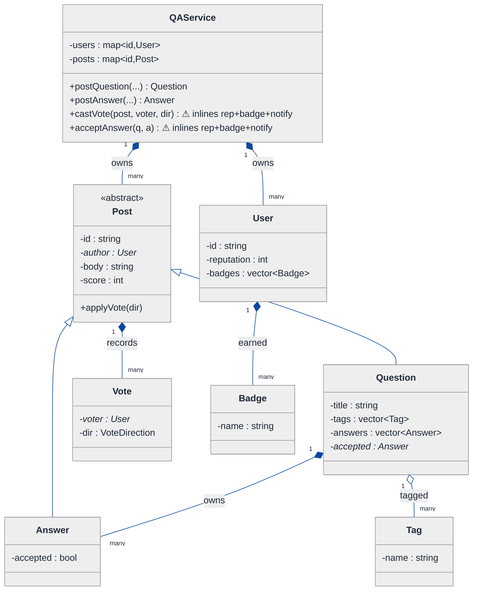
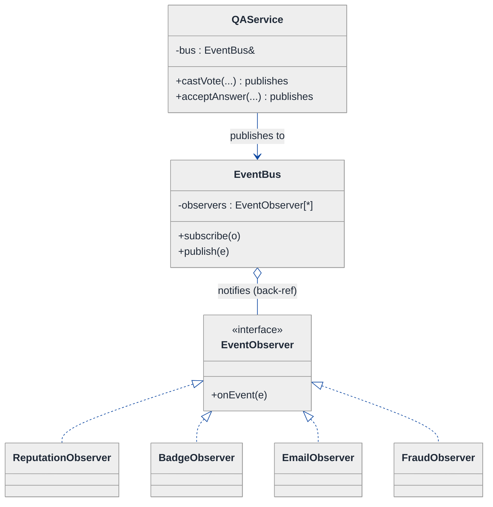
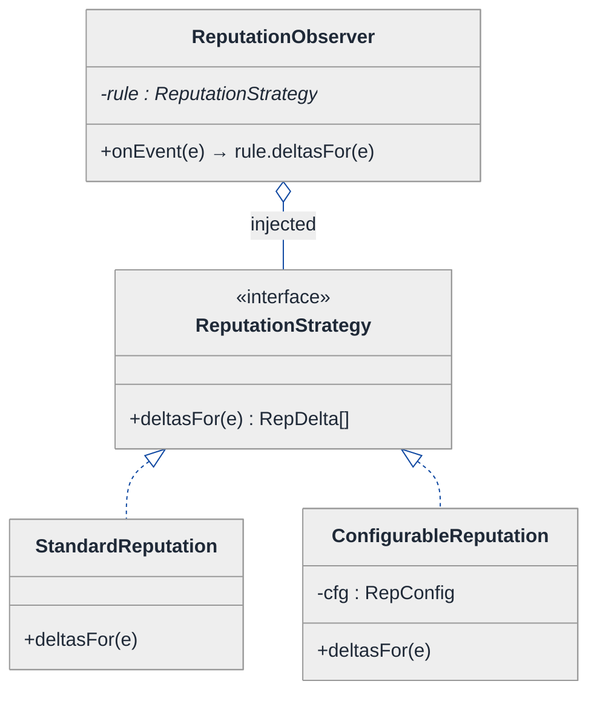
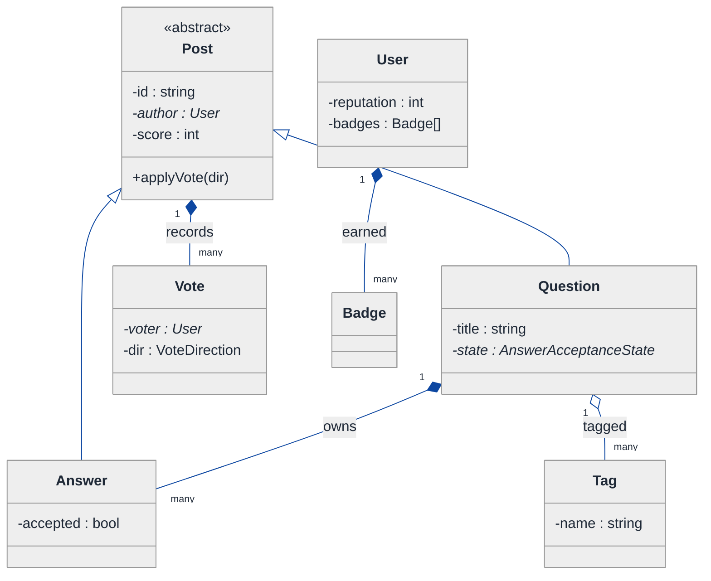
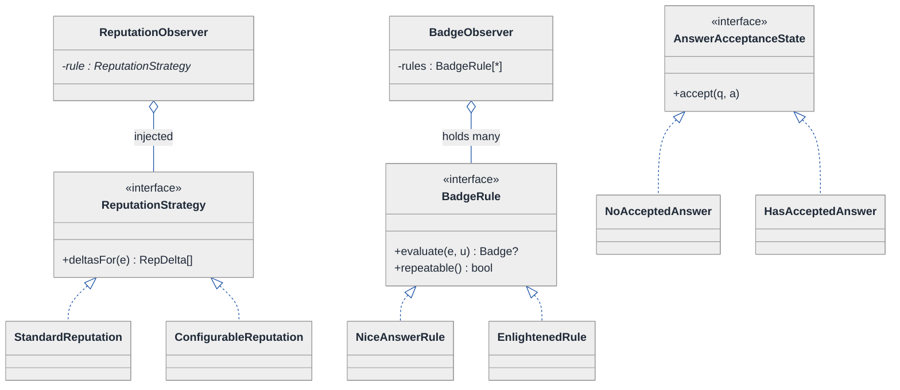
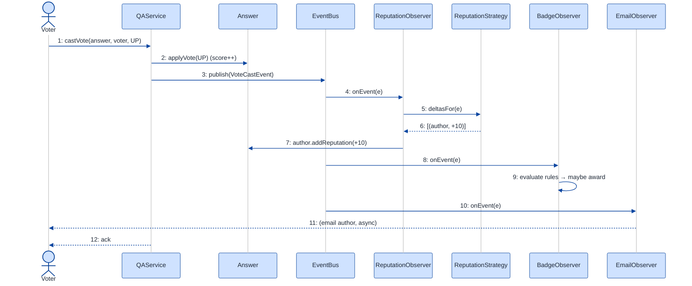

# Q&A Platform (Stack Overflow-like) — LLD Walkthrough

> **Difficulty:** Medium · **Time:** ~30 min · **Pattern focus:** Observer (reputation / badges react to events) + Strategy (reputation rules)
>
> **Problem source(s):** GID `OB3`, bucket `Observer_Pattern`. See [`./EXTRACTED_QUESTIONS.md`](./EXTRACTED_QUESTIONS.md).
>
> **Diagrams:** inline mermaid (renders natively in GitHub / VS Code). Canonical theme block copied verbatim into every diagram.

---

## How to use this file

Paced for a candidate seeing "design Stack Overflow at the class level" for the first time. Reading time: ~30 minutes if you sketch each iteration by hand. **The lesson: when a feature reads as "every time X happens, also do Y and Z and W," that is not a reason to grow the method that does X — it's the signal for the Observer pattern. And when the "how much" of each reaction varies, that's Strategy.**

**Map of this file (15 sections):**

1. Problem statement + clarifying questions
2. Plain-English restatement
3. Why this matters
4. Mental model
5. Try it yourself first
6. Entity & verb extraction
7. **Iteration 1: the naive design** — what we'd write first
8. **Where the naive design hurts** — future requirements, one painful diff each
9. **Pivot 1: Observer** for "react to a vote/answer event" — the most painful axis first
10. **Pivot 2: Strategy** for the reputation rule-book
11. **Pivot 3: remaining variability** — accepted-answer marking via State, badge rules as Strategy
12. Final UML class diagram (three sub-views)
13. Skeleton code (C++17)
14. Key flow — sequence diagram
15. Extensibility re-check + anti-patterns + how to think aloud + self-check

---

## 1. Problem statement + clarifying questions

**Prompt (typical phrasing):** "Design a Stack Overflow-like Q&A platform at the class level. Users post questions, post answers, upvote/downvote, the asker can mark an accepted answer, posts carry tags, users earn reputation, and the system awards badges."

**Clarifying questions to ask BEFORE drawing anything:**

1. **What earns/loses reputation, and by how much?** Upvote on an answer = +10? Downvote = -2 to the author and -1 to the voter? Accepted answer = +15? Are these numbers fixed forever or per-community-configurable (the way Stack Exchange sites differ)?
2. **Badges — what triggers them, and are they one-shot or repeatable?** "First upvote" (one-time) vs "answer scoring 10+" (repeatable per answer)? Bronze/silver/gold tiers? Do we evaluate badges synchronously on every event or in a batch job?
3. **Can a user vote on their own post?** Can they vote twice? Can they retract a vote (toggle)? This decides whether `Vote` is a value or has identity.
4. **Tagging rules?** Free-form tags vs a curated tag set? Min/max tags per question? Do tags themselves track stats (e.g., "score in [c++]")?
5. **Accepted answer — can it change?** Can the asker un-accept and re-accept a different answer? Only one accepted answer per question?
6. **Notifications?** When my answer is upvoted or accepted, do I get notified? Is the reputation engine the only consumer of vote events, or are there others (email, activity feed, anti-fraud)?
7. **Concurrency / scale?** Single-process domain model for the interview, or do we need to discuss eventual consistency on reputation counters? (We'll model single-process and call out the seams in §15.)

**Assumptions if interviewer dodges:** reputation deltas are configurable rules (not hardcoded constants); badges are evaluated on every relevant event and can be one-shot or repeatable; a user cannot vote on their own post and a vote can be toggled off; one accepted answer per question, changeable by the asker; **multiple independent subsystems react to the same vote/accept event** (reputation, badges, and at least a notifier); single-process for now.

That last assumption — "multiple independent subsystems react to the same event" — is the one the interviewer is fishing for. It is the whole reason this problem lives in the `Observer_Pattern` bucket.

---

## 2. Plain-English restatement

We're building the domain model behind a Q&A site. People post questions and answers, vote on them, accept answers, and tag questions. Off the back of those actions, the system maintains a **reputation score** per user and **awards badges**. The catch: the set of things that should happen "when a vote lands" or "when an answer is accepted" keeps growing — reputation today, badges tomorrow, an activity feed and anti-fraud check next quarter — and we must add each new reaction **without editing the voting code**.

---

## 3. Why this matters

This question probes whether you can spot a one-to-many event-notification relationship and reach for Observer instead of stuffing every side-effect into the method that fires the event. Candidates who haven't internalized Observer write a `castVote()` that grows a new line for every feature — a textbook open/closed violation. The same instinct (recognize the variability axis, lift it behind an interface) then reappears for the reputation rule-book (Strategy) and badge rules. It's the canonical "event happened → many reactions, each independently extensible" shape that shows up in order systems, game engines, CI pipelines, and editor frameworks.

---

## 4. Mental model

A Q&A platform is a **content graph** (users own posts, posts own votes and tags) wrapped in an **event bus**. Every meaningful action — a vote cast, an answer accepted, a question posted — is an *event*. Some subsystems care about each event and some don't. The content graph is data; the reactions are policy; the connection between them is a subscription, not a hardcoded call.

```
Real-world sketch (NOT a UML diagram yet):

   User "alice"  ──posts──►  Question ──has──► [Answer] [Answer] [Answer]
                                  │                          ▲
                                  └── tags: [c++] [lld]      │ accepted ✓

   When something happens to a post, it BROADCASTS:

        Answer upvoted ──┐
                         ├──►  (event)  ──►  ┌─ ReputationEngine  (+10 to author)
        Answer accepted ─┘                  ├─ BadgeEngine       ("Nice Answer"?)
                                            ├─ Notifier          (email author)
                                            └─ ... future listeners
```

The KEY insight from this picture: the post that gets upvoted should NOT know that reputation, badges, and email all care. It should announce "I was upvoted" and let whoever subscribed deal with it. **Announce, don't call.** That separation — *subject vs. observers* — is what we'll bake into the design.

---

## 5. Try it yourself first

> **Predict before reading on:**
>
> 1. List 5 nouns you'd promote to a class. List 3 nouns you'd leave as plain fields.
> 2. **If I told you that next quarter you must (a) email an author when their answer is accepted and (b) flag suspicious vote rings — without touching the voting code — where would you put the seam today?**
> 3. The reputation numbers differ per community (the C++ site gives +10 per upvote, a private internal site gives +5). Where does that number live so a config change doesn't recompile the voting logic?

---

## 6. Entity & verb extraction

> **Mini-refresher: noun → class, but not every noun.**
>
> Naive OOD promotes every noun to a class. Senior OOD promotes a noun only if it has both BEHAVIOR and STATE that need to live together. "Tag name" is usually a field/value; "Answer" becomes a class because it has score, acceptance state, and an author.

**Nouns from the prompt:**

| Noun | Decision | Why |
|---|---|---|
| User | Class | Has reputation, badge collection, identity |
| Question | Class (a kind of Post) | Has title/body, tags, answers, an accepted-answer pointer |
| Answer | Class (a kind of Post) | Has body, score, acceptance state, an author |
| Post | Abstract base of Question/Answer | Both are votable, authored content — genuine "is-a" |
| Vote | Class (small) | Has direction + voter; needed to prevent double-voting and to toggle |
| Tag | Class (light) or value | Has a name; may track per-tag stats later |
| Reputation | Field on User (`int`) + an engine that mutates it | Number is a field; the *rules* are behavior elsewhere |
| Badge | Class | Has name + tier; awarded to users |
| VoteDirection | `enum class` | UP / DOWN — pure tag, no behavior |

**Verbs (and the class they live on — naive answer, we'll re-examine):**

| Verb | Owner class (naive) |
|---|---|
| postQuestion(title, body, tags) | QAService / User |
| postAnswer(question, body) | QAService / User |
| castVote(post, voter, dir) | Post (or QAService) |
| acceptAnswer(question, answer) | Question |
| awardReputation(user, delta) | ReputationEngine |
| awardBadge(user, badge) | BadgeEngine |
| addTag(question, tag) | Question |

**We have NOT introduced any design patterns yet.** Pure nouns + verbs.

---

## 7. <a id="iter-1"></a>Iteration 1: the naive design

Let's write the simplest thing that could possibly work. No design patterns — one service class that does everything, posts that hold a raw score, and a vote method that inlines every consequence.



**Reader's tour (read top to bottom; ~60 seconds).**

1. **At the top — `QAService` is the god object.** It owns the user table and post table and exposes the action methods. Crucially, `castVote` and `acceptAnswer` carry warning markers (⚠): they don't just record the vote / acceptance, they ALSO inline the reputation math, the badge checks, and (soon) notifications. Every consequence of an event is hardcoded into the method that fires the event.

2. **The Post hierarchy (middle).** `Post` is an abstract base; `Question` and `Answer` inherit from it. This is a genuine "is-a" relationship — both are authored, votable content with a score. **This inheritance is NOT the smell.**

3. **Composition spine.** `QAService` composes `User[]` and `Post[]` (filled diamonds = strong ownership). `Question` composes its `Answer[]`. `Post` records its `Vote[]` so we can detect double-votes. `User` composes the `Badge[]` it has earned.

4. **Tag is aggregated, not composed (open diamond).** A `Tag` like `[c++]` is shared across many questions; it doesn't die when one question is deleted. Worth noticing even in the naive draft.

5. **The trouble zone is invisible in the boxes — it's in the method bodies.** The diagram can't show it, but `castVote()` is where reputation, badges, and notifications all get welded together. That's the pain §8 makes concrete.

Skeleton code for the naive design (C++):

```cpp
#include <map>
#include <string>
#include <vector>

enum class VoteDirection { UP, DOWN };

class Badge { public: std::string name; };

class User {
public:
    std::string id;
    int reputation = 0;
    std::vector<Badge> badges;
};

class Post {                       // abstract base
public:
    virtual ~Post() = default;
    std::string id;
    User*       author = nullptr;
    int         score  = 0;
};
class Question : public Post { public: std::string title; std::vector<std::string> tags; std::vector<class Answer*> answers; };
class Answer   : public Post { public: bool accepted = false; };

class QAService {
public:
    std::map<std::string, User> users;
    std::map<std::string, Post*> posts;

    void castVote(Post& post, User& voter, VoteDirection dir) {
        // 1. record the vote on the post
        post.score += (dir == VoteDirection::UP ? +1 : -1);

        // 2. reputation math — HARDCODED right here
        if (dir == VoteDirection::UP)   post.author->reputation += 10;
        else { post.author->reputation -= 2; voter.reputation -= 1; }

        // 3. badge check — HARDCODED right here
        if (post.score == 10) post.author->badges.push_back({ "Nice Answer" });
        if (post.author->reputation >= 1000)
            post.author->badges.push_back({ "Civic Duty" });

        // 4. (next quarter: email the author... and anti-fraud check... here too)
    }

    void acceptAnswer(Question& q, Answer& a) {
        a.accepted = true;
        a.author->reputation += 15;       // reputation math AGAIN
        q.author->reputation += 2;
        if (/* author's first accept */ true)
            a.author->badges.push_back({ "Enlightened" });   // badge check AGAIN
        // (next quarter: notify... here too)
    }
};
```

**This works.** It has zero design patterns. We can post, vote, accept, and reputation/badges update. So what's wrong with it?

---

## 8. <a id="naive-pain"></a>Where the naive design hurts

The interviewer slides a sheet across the desk: "Here are four things coming next quarter. Walk me through what changes."

### Change A: "Email the author when their answer is upvoted or accepted"

In the naive design:
- Add an SMTP/notification call inside `castVote()` AND inside `acceptAnswer()` — two sites, because both fire reactions.
- `QAService` now depends on an email client. A class about Q&A logic now drags in networking. **The voting method grows a third concern.**

### Change B: "Add an anti-fraud check that flags vote rings"

In the naive design:
- Another block inside `castVote()`. Now the method does: record + reputation + badges + email + fraud. Five concerns, one function.
- The order matters and is now implicit. **Every new reaction is surgery in the hottest method in the system.**

### Change C: "Reputation numbers are per-community configurable"

In the naive design:
- The constants `+10`, `-2`, `-1`, `+15`, `+2` are scattered across `castVote()` and `acceptAnswer()`.
- A new community with different numbers means either a forest of `if (community == X)` or recompiling. **The rule-book is welded into the event handlers.**

### Change D: "Repeatable badges + tiered badges (bronze/silver/gold), evaluated for many trigger types"

In the naive design:
- Badge `if`-ladder lives inside both `castVote()` and `acceptAnswer()`. Each new badge adds branches in multiple methods.
- One-shot vs repeatable logic gets tangled with the trigger detection. **No single place owns "the badge rules."**

### The pattern of pain

| Change | Files / methods touched | Smell |
|---|---|---|
| A. Email author | `castVote` + `acceptAnswer` | "Side-effects hardcoded into the event firer." |
| B. Anti-fraud | `castVote` (again) | "Open/closed violation — new reaction = edit the same method." |
| C. Configurable rep | constants across two methods | "Policy (how much) is hardwired into mechanism (what happened)." |
| D. Badge rules | `if`-ladders in two methods | "No object owns the rule-book; rules are scattered." |

**Two axes of pain dominate.** First: *many independent reactions to one event* (reputation, badges, email, fraud) — changes A, B, D all add reactions. Second: *the rule-book varies* (how much reputation, which badge) — change C, and the "how much" inside D.

> **Pivot question:** "What pattern lets me add a new reaction to an event WITHOUT touching the code that fires the event? And separately — what pattern lets me swap the 'how much reputation' rule at runtime?"
>
> The answers are **Observer** (for the one-to-many event broadcast) and **Strategy** (for the swappable rule-book). Let's introduce them one at a time, starting with the most painful axis: the exploding event handler.

---

## 9. <a id="pivot-1"></a>Pivot 1: Observer for "react to an event"

> **Mini-refresher: Observer pattern.**
>
> A *subject* maintains a list of *observers* and notifies all of them when something happens — without knowing what any observer actually does. Observers subscribe/unsubscribe at runtime. The subject only knows the observer INTERFACE (e.g., `onEvent(e)`), never the concrete reactors.
>
> Quick example: a spreadsheet `Cell` is a subject; charts and formula cells are observers. Change the cell → it calls `notify()` → every chart redraws itself. The cell never names a chart.

> **Push vs. pull (a detail interviewers probe).**
> - *Push:* the subject sends the full event payload to observers (`onEvent(VoteCastEvent e)`). Observers get everything; simpler when payloads are small.
> - *Pull:* the subject sends a thin signal; observers call back to read what they need. Better when observers want different slices.
> - We use **push** here — the event carries the post, voter, and direction, which is all any current observer needs.

**Why Observer fits.** "When a vote lands, also update reputation, also check badges, also email, also run fraud" is the literal definition of a one-to-many notification. The subject (the post / the service that fires the event) should announce the event; each reaction is an observer that subscribed. Adding a reaction = adding an observer = ZERO edits to `castVote`.

**The refactor (just the affected slice).** We define a domain `Event`, an `EventObserver` interface, and an `EventBus` (the subject). `QAService` publishes; nobody downstream is named in `castVote`.

```cpp
#include <memory>
#include <variant>
#include <vector>

// A small, typed event hierarchy (push payloads).
struct VoteCastEvent   { Post* post; User* voter; VoteDirection dir; };
struct AnswerAcceptedEvent { Question* q; Answer* a; };
using DomainEvent = std::variant<VoteCastEvent, AnswerAcceptedEvent>;

class EventObserver {                       // the observer interface
public:
    virtual ~EventObserver() = default;
    virtual void onEvent(const DomainEvent& e) = 0;
};

class EventBus {                            // the subject
public:
    void subscribe(EventObserver* obs) { observers_.push_back(obs); }   // raw, non-owning
    void publish(const DomainEvent& e) {
        for (auto* obs : observers_) obs->onEvent(e);   // notify all; bus names none
    }
private:
    std::vector<EventObserver*> observers_;             // back-references, not owned
};

class QAService {
public:
    explicit QAService(EventBus& bus) : bus_(bus) {}
    void castVote(Post& post, User& voter, VoteDirection dir) {
        post.score += (dir == VoteDirection::UP ? +1 : -1);   // mechanism only
        bus_.publish(VoteCastEvent{ &post, &voter, dir });    // announce — don't call
    }
private:
    EventBus& bus_;
};

// One concrete observer (others elided). Reputation is just a listener now.
class ReputationObserver : public EventObserver {
public:
    void onEvent(const DomainEvent& e) override {
        if (auto* v = std::get_if<VoteCastEvent>(&e)) {
            v->post->author->reputation += (v->dir == VoteDirection::UP ? 10 : -2);
            // (the "10 / -2" still hardcoded — Pivot 2 fixes that)
        }
    }
};
// class BadgeObserver, EmailObserver, FraudObserver : public EventObserver { ... }  // elided
```

> **Mini-refresher: open/closed principle (the "O" in SOLID).**
>
> Software entities should be OPEN for extension but CLOSED for modification. You add new behavior by adding new code (a new class), not by editing existing, tested code. Observer is one of the cleanest ways to honor it: a new reaction is a new observer class + one `subscribe()` line at wiring time.

> **Mini-refresher: smart pointers and back-references.**
>
> The `EventBus` holds `EventObserver*` (raw, non-owning) — the observers are owned elsewhere (by the composition root / DI container). This is the classic Observer ownership rule: the subject keeps **back-references**, never owns its observers. In a real system prefer `std::weak_ptr` so a dead observer doesn't dangle; we use raw pointers here for skeleton clarity.

**What changed — visualized (the event slice):**



**Tour of the after-state.**

1. **`QAService::castVote` shrank to two lines** — update the score (mechanism) and `publish` the event (announcement). It no longer names reputation, badges, email, or fraud.

2. **`EventBus` is the subject.** It holds a list of `EventObserver*` (back-references, open diamond = aggregation, not owned) and `publish()` loops over them. It names NO concrete observer.

3. **Four concrete observers hang off the interface.** Reputation, Badge, Email, Fraud — each implements `onEvent`. Changes A, B, D from §8 are now "write one observer class and `subscribe` it." `castVote` never changes again.

4. **The seam is the interface.** New reaction → new class implementing `EventObserver`. That's open/closed in one move.

**Changes A and B from §8 now land cleanly.** Email author → `EmailObserver`. Anti-fraud → `FraudObserver`. Both subscribe at wiring time; `castVote` is untouched.

**Pattern-discrimination cheatsheet — Observer vs Mediator.**
- *Observer:* one subject broadcasts to many observers; observers don't talk back through the subject; the flow is one-directional (event out).
- *Mediator:* a hub coordinates many colleagues that need to talk to EACH OTHER; it centralizes N-to-N communication and may call colleagues in a specific orchestrated order.
- *Rule of thumb:* "one thing happened, many independent reactors" → Observer. "many components must coordinate with one another" → Mediator. Reputation doesn't need to talk to Email; they just both react to the same vote → Observer.

---

## 10. <a id="pivot-2"></a>Pivot 2: Strategy for the reputation rule-book

Change C from §8 is still painful. We moved reputation into a `ReputationObserver`, but the numbers (`+10`, `-2`, `+15`) are still hardcoded inside it. A per-community configuration means swapping those numbers at runtime. Observer doesn't help — the variability isn't "who reacts," it's "what the reputation algorithm computes."

> **Mini-refresher: Strategy pattern.**
>
> Encapsulates an algorithm behind an interface so it can be swapped at runtime. The CALLER decides which strategy to use; the strategy doesn't know about its peers.
>
> Quick example: a `Sorter` takes a `CompareStrategy*`. Pass `Ascending` or `Descending` — the sorter doesn't care which.

**Why Strategy fits the rule-book.** "Given an event, return a list of (user, reputation-delta)" is an algorithm. It varies per community (different numbers) and per rule type (upvote vs downvote vs accept). The choice is made externally — by config / community setup — not by the observer itself. Textbook Strategy.

**The refactor (just the reputation slice).** The `ReputationObserver` keeps the *plumbing* (subscribe, receive events, apply deltas) but delegates the *policy* to an injected `ReputationStrategy`.

```cpp
struct RepDelta { User* user; int amount; };

class ReputationStrategy {                       // the swappable rule-book
public:
    virtual ~ReputationStrategy() = default;
    virtual std::vector<RepDelta> deltasFor(const DomainEvent& e) const = 0;
};

class StandardReputation : public ReputationStrategy {   // Stack Overflow defaults
public:
    std::vector<RepDelta> deltasFor(const DomainEvent& e) const override {
        if (auto* v = std::get_if<VoteCastEvent>(&e)) {
            if (v->dir == VoteDirection::UP)
                return { { v->post->author, +10 } };
            return { { v->post->author, -2 }, { v->voter, -1 } };
        }
        if (auto* a = std::get_if<AnswerAcceptedEvent>(&e))
            return { { a->a->author, +15 }, { a->q->author, +2 } };
        return {};
    }
};

class ConfigurableReputation : public ReputationStrategy {  // per-community numbers
public:
    explicit ConfigurableReputation(RepConfig cfg) : cfg_(std::move(cfg)) {}
    std::vector<RepDelta> deltasFor(const DomainEvent& e) const override; // reads cfg_
private:
    RepConfig cfg_;
};

class ReputationObserver : public EventObserver {
public:
    explicit ReputationObserver(std::unique_ptr<ReputationStrategy> rule)
        : rule_(std::move(rule)) {}                  // strategy injected
    void onEvent(const DomainEvent& e) override {
        for (const auto& d : rule_->deltasFor(e))    // policy is delegated
            d.user->reputation += d.amount;          // mechanism stays here
    }
private:
    std::unique_ptr<ReputationStrategy> rule_;       // exclusive ownership
};
```

> **Mini-refresher: dependency injection.**
>
> Instead of `new`-ing its collaborator, a class receives it through the constructor. `ReputationObserver` doesn't pick its rule-book; whoever wires the system passes one in. This is what makes the strategy swappable (and the observer testable — inject a fake strategy in a unit test).

**What changed — visualized (the reputation slice):**



**Tour of the after-state.**

1. **`ReputationObserver` kept the plumbing, lost the policy.** Its `onEvent` is now: ask the strategy for the deltas, apply them. The numbers are GONE from the observer.

2. **`ReputationStrategy` is the swappable rule-book.** One method: `deltasFor(event) → list of (user, delta)`. The observer holds it via `unique_ptr` (open diamond / injected, exclusive ownership).

3. **Two concrete strategies.** `StandardReputation` (the SO defaults) and `ConfigurableReputation` (reads a per-community config). Change C from §8 is now: pick a different strategy at wiring time. No recompile of the observer or the voting code.

**Pattern-discrimination cheatsheet — Strategy vs Observer (they're easy to confuse here because both live behind the same event).**
- *Observer:* answers "WHO reacts to this event?" — a list of independent reactors. Adding a reactor = adding to the list.
- *Strategy:* answers "HOW does this ONE reactor compute its result?" — a single swappable algorithm inside one reactor.
- *Rule of thumb:* if you're varying the SET of reactions → Observer. If you're varying the COMPUTATION inside one reaction → Strategy. We use both: Observer says "reputation cares about votes," Strategy says "and here's the formula it uses."

---

## 11. <a id="pivot-3"></a>Pivot 3: remaining variability — accepted-answer State + badge rules as Strategy

Two axes remain: the **accepted-answer lifecycle** (change/re-accept rules) and the **badge rule-book** (change D's "which badge, one-shot vs repeatable, tiered").

### 11a. Accepted-answer marking — a tiny State machine

An answer's acceptance has lifecycle rules: only the asker can accept; an accepted answer can be un-accepted; accepting a new answer must un-accept the old one. Stuffing `if (a.accepted) ... else ...` into `acceptAnswer` repeats the §8 enum-pain at small scale.

> **Mini-refresher: State pattern.**
>
> Each lifecycle state is its own class. The context delegates an action to its current state, and THE STATE decides the next state. Transitions are internal, driven by events the context receives — not picked by the caller.

We model acceptance on the `Question` (it owns the "one accepted answer" invariant), with two states:

```cpp
class AnswerAcceptanceState {
public:
    virtual ~AnswerAcceptanceState() = default;
    virtual void accept(Question& q, Answer& a) = 0;   // each state knows what's legal
};

class NoAcceptedAnswer : public AnswerAcceptanceState {
public:
    void accept(Question& q, Answer& a) override;       // mark a; → HasAcceptedAnswer
};

class HasAcceptedAnswer : public AnswerAcceptanceState {
public:
    explicit HasAcceptedAnswer(Answer* current) : current_(current) {}
    void accept(Question& q, Answer& a) override;       // un-accept current, accept a
private:
    Answer* current_;
};
// Question::acceptAnswer(a) just delegates: state_->accept(*this, a);
// On success it publishes AnswerAcceptedEvent so the SAME observers fire.
```

**Why State, not Strategy, here.** The caller doesn't pick "no-accepted" vs "has-accepted" — the question's history decides it. That's the State tell: internal transitions driven by events, not external selection (contrast the cheatsheet in §10).

### 11b. Badge rules — Strategy (a collection of rules), one observer

Change D wants many badge rules, one-shot or repeatable, evaluated on several event types. Same shape as reputation: the `BadgeObserver` keeps the plumbing; a list of `BadgeRule` strategies owns the policy.

```cpp
class BadgeRule {                                  // Strategy (one rule)
public:
    virtual ~BadgeRule() = default;
    virtual std::optional<Badge> evaluate(const DomainEvent& e, const User& u) const = 0;
    virtual bool repeatable() const = 0;           // one-shot vs repeatable
};
class NiceAnswerRule : public BadgeRule { /* score >= 10 → bronze "Nice Answer" */ };
class EnlightenedRule : public BadgeRule { /* first accepted answer → silver */ };
// ... more rules elided

class BadgeObserver : public EventObserver {
public:
    explicit BadgeObserver(std::vector<std::unique_ptr<BadgeRule>> rules)
        : rules_(std::move(rules)) {}
    void onEvent(const DomainEvent& e) override {
        // for each rule, evaluate against the affected user; award if earned & allowed
    }
private:
    std::vector<std::unique_ptr<BadgeRule>> rules_;   // the swappable rule-book
};
```

> **Mini-refresher: why reputation rules and badge rules don't share one interface.**
>
> Strategy is a *role*, not a type. `ReputationStrategy` returns deltas; `BadgeRule` returns an optional badge. Different inputs/outputs — don't force them under one `Strategy<T>` template. That's premature genericism (and an interface-segregation, the "I" in SOLID, violation waiting to happen).

**The lesson.** Once Pivot 1 established "reactions are observers" and Pivot 2 established "rule-books are injected strategies," badges fall out by analogy and the acceptance lifecycle is a tiny State machine. Pattern recognition makes subsequent design cheap.

---

## 12. <a id="fig-class-diagram"></a>Final class diagram

One diagram for everything is a wall of boxes. Here are **three focused sub-views**; the structural insight at the end ties them together.

### 12.1 The content graph — what the system OWNS



**Tour of 12.1.** The content graph is unchanged from the naive design — that's the point. `Post` is the abstract base; `Question`/`Answer` inherit (genuine "is-a"). Filled diamonds = composition (a question owns its answers, a post owns its votes). `Tag` is aggregated (open diamond) because it's shared. The ONE addition vs naive: `Question` now holds an `AnswerAcceptanceState*` (the State machine from §11a). Inventory didn't need to change shape; the reactions moved out — see 12.2.

### 12.2 The event bus — Observer wiring


**Tour of 12.2.** `QAService` is now thin — its action methods update content state and `publish` an event to the `EventBus` (the subject). The bus holds back-references to `EventObserver`s (open diamond = doesn't own them) and notifies all on `publish`. Four observers hang off the interface; each new reaction is a fifth box with one `subscribe` line. The voting code names none of them.

### 12.3 The rule-books — Strategy inside the observers



**Tour of 12.3.** Each observer that has variable policy delegates to an injected Strategy. `ReputationObserver` holds ONE `ReputationStrategy` (the formula); `BadgeObserver` holds MANY `BadgeRule`s (a rule-book). Off to the side, `Question`'s acceptance lifecycle is the State machine (`NoAcceptedAnswer` / `HasAcceptedAnswer`). Notice the two roles never share an interface — reputation returns deltas, badges return an optional badge, acceptance returns nothing. Three independent hierarchies, one per axis of variation.

### Structural insight (ties 12.1 + 12.2 + 12.3 together)

| Concern | Pattern used | Why |
|---|---|---|
| **Content** (Post, Question, Answer, Vote, Tag, User) | Plain ownership + minimal inheritance | Question/Answer are genuine "is-a" Posts; the rest is data |
| **Event fan-out** (reputation, badges, email, fraud) | Observer, via an EventBus | One event, many independent reactors; add a reactor = add a class |
| **Reputation rule-book** ("how much") | Strategy, injected into the observer | Numbers vary per community; swap at runtime |
| **Badge rule-book** ("which badge") | Strategy (a collection), in the observer | Many rules, one-shot/repeatable; add a rule = add a class |
| **Accepted-answer lifecycle** | State, owned by Question | History decides the next state, not the caller |

The big lesson: **inheritance is used only for Post types and the pattern class families** — every "varies independently" axis became composition behind an interface. *Observer separates WHO reacts; Strategy separates HOW each reaction computes.* That separation is what makes this extensible.

---

## 13. Skeleton code (C++17)

> Show the SHAPES, not the full impl. Abstract bases + 1-2 concrete classes per pattern; the rest `// elided`.

```cpp
#include <map>
#include <memory>
#include <optional>
#include <string>
#include <variant>
#include <vector>

// ── Enums ───────────────────────────────────────────────────────────
enum class VoteDirection { UP, DOWN };
enum class BadgeTier     { BRONZE, SILVER, GOLD };

// ── Forward declarations ────────────────────────────────────────────
class User; class Post; class Question; class Answer;

// ── Content graph ───────────────────────────────────────────────────
struct Badge { std::string name; BadgeTier tier; };

class User {
public:
    explicit User(std::string id) : id_(std::move(id)) {}
    const std::string& id() const { return id_; }
    int  reputation() const { return reputation_; }
    void addReputation(int d) { reputation_ += d; }
    void award(const Badge& b) { badges_.push_back(b); }
    bool hasBadge(const std::string& n) const; // elided
private:
    std::string id_;
    int reputation_ = 0;
    std::vector<Badge> badges_;
};

struct Vote { User* voter; VoteDirection dir; };

class Post {                                   // abstract base — genuine "is-a"
public:
    virtual ~Post() = default;
    User* author() const { return author_; }
    int   score()  const { return score_; }
    void  applyVote(VoteDirection d) { score_ += (d == VoteDirection::UP ? +1 : -1); }
protected:
    std::string         id_;
    User*               author_ = nullptr;
    int                 score_  = 0;
    std::vector<Vote>   votes_;
};

class Answer : public Post {
public:
    bool accepted() const { return accepted_; }
    void setAccepted(bool v) { accepted_ = v; }
private:
    bool accepted_ = false;
};

// ── Accepted-answer State machine (Pivot 3a) ────────────────────────
class AnswerAcceptanceState {
public:
    virtual ~AnswerAcceptanceState() = default;
    virtual void accept(Question& q, Answer& a) = 0;
};

class Question : public Post {
public:
    Question();                                       // starts in NoAcceptedAnswer
    void acceptAnswer(Answer& a) { state_->accept(*this, a); }   // delegates to state
    void transitionTo(std::unique_ptr<AnswerAcceptanceState> s) { state_ = std::move(s); }
    std::vector<Answer*>& answers() { return answers_; }
private:
    std::string                            title_;
    std::vector<std::string>               tags_;
    std::vector<Answer*>                   answers_;
    std::unique_ptr<AnswerAcceptanceState> state_;
};
// NoAcceptedAnswer / HasAcceptedAnswer impls elided (mark a; transition; publish event)

// ── Observer infrastructure (Pivot 1) ───────────────────────────────
struct VoteCastEvent       { Post* post; User* voter; VoteDirection dir; };
struct AnswerAcceptedEvent { Question* q; Answer* a; };
using DomainEvent = std::variant<VoteCastEvent, AnswerAcceptedEvent>;

class EventObserver {                          // observer interface
public:
    virtual ~EventObserver() = default;
    virtual void onEvent(const DomainEvent& e) = 0;
};

class EventBus {                               // subject
public:
    void subscribe(EventObserver* o) { observers_.push_back(o); }   // non-owning back-ref
    void publish(const DomainEvent& e) { for (auto* o : observers_) o->onEvent(e); }
private:
    std::vector<EventObserver*> observers_;
};

// ── Reputation: Observer + injected Strategy (Pivot 2) ──────────────
struct RepDelta { User* user; int amount; };

class ReputationStrategy {
public:
    virtual ~ReputationStrategy() = default;
    virtual std::vector<RepDelta> deltasFor(const DomainEvent& e) const = 0;
};
class StandardReputation : public ReputationStrategy {
public:
    std::vector<RepDelta> deltasFor(const DomainEvent& e) const override {
        if (auto* v = std::get_if<VoteCastEvent>(&e))
            return v->dir == VoteDirection::UP
                ? std::vector<RepDelta>{ { v->post->author(), +10 } }
                : std::vector<RepDelta>{ { v->post->author(), -2 }, { v->voter, -1 } };
        if (auto* a = std::get_if<AnswerAcceptedEvent>(&e))
            return { { a->a->author(), +15 }, { a->q->author(), +2 } };
        return {};
    }
};
// class ConfigurableReputation : public ReputationStrategy { ... }   // elided

class ReputationObserver : public EventObserver {
public:
    explicit ReputationObserver(std::unique_ptr<ReputationStrategy> rule)
        : rule_(std::move(rule)) {}
    void onEvent(const DomainEvent& e) override {
        for (const auto& d : rule_->deltasFor(e)) d.user->addReputation(d.amount);
    }
private:
    std::unique_ptr<ReputationStrategy> rule_;
};

// ── Badges: Observer + collection of Strategy rules (Pivot 3b) ──────
class BadgeRule {
public:
    virtual ~BadgeRule() = default;
    virtual std::optional<Badge> evaluate(const DomainEvent& e, const User& u) const = 0;
    virtual bool repeatable() const = 0;
};
// class NiceAnswerRule, EnlightenedRule : public BadgeRule { ... }    // elided

class BadgeObserver : public EventObserver {
public:
    explicit BadgeObserver(std::vector<std::unique_ptr<BadgeRule>> rules)
        : rules_(std::move(rules)) {}
    void onEvent(const DomainEvent& e) override;   // evaluate each rule, award if earned — elided
private:
    std::vector<std::unique_ptr<BadgeRule>> rules_;
};
// class EmailObserver, FraudObserver : public EventObserver { ... }   // elided

// ── The thin service: announces, doesn't call ──────────────────────
class QAService {
public:
    explicit QAService(EventBus& bus) : bus_(bus) {}
    void castVote(Post& post, User& voter, VoteDirection dir) {
        if (post.author() == &voter) throw std::runtime_error("Cannot vote on own post");
        post.applyVote(dir);                                  // mechanism
        bus_.publish(VoteCastEvent{ &post, &voter, dir });    // announcement
    }
    void acceptAnswer(Question& q, Answer& a) {
        q.acceptAnswer(a);                                    // State decides legality
        bus_.publish(AnswerAcceptedEvent{ &q, &a });          // announcement
    }
private:
    EventBus& bus_;
};

// ── Composition root (wiring — DI happens here, ONCE) ───────────────
// EventBus bus;
// ReputationObserver rep(std::make_unique<StandardReputation>());
// BadgeObserver      badges(makeBadgeRules());
// bus.subscribe(&rep); bus.subscribe(&badges); bus.subscribe(&emailObs); // + more
// QAService service(bus);
```

---

## 14. <a id="fig-sequence"></a>Key flow — sequence diagram

The flow worth tracing is "an answer gets upvoted." Watch how the vote handler names NOBODY downstream — the bus fans the event out to whichever observers happen to be subscribed.



**Tour of the upvote flow. Read it slowly — this is where Observer and Strategy cooperate.**

1. **Voter calls `castVote(answer, voter, UP)`.** The service is the boundary.
2. **`QAService` updates the score on the Answer** — that's the only mechanism it performs.
3. **`QAService` publishes a `VoteCastEvent` to the bus.** This is the Observer hinge: the service hands off and is DONE thinking about consequences. It does not know reputation, badges, or email exist.
4–7. **The bus notifies `ReputationObserver`, which delegates to its injected `ReputationStrategy`** for the deltas (`+10` to the author), then applies them. **Observer (who) + Strategy (how) in two steps.** Swap the strategy and step 6 returns different numbers; the rest is identical.
8–9. **The bus notifies `BadgeObserver`,** which runs its rule-book and may award a badge.
10–11. **The bus notifies `EmailObserver`,** which emails the author (in reality async / queued).
12. **Ack returns to the voter.**

### The coupling that's NOT shown — and why it matters

You don't see `QAService` calling `ReputationObserver`, `BadgeObserver`, or `EmailObserver` by name anywhere. That's the entire payoff of Observer: **the firer is decoupled from the reactors.** Adding `FraudObserver` adds a step 11.5 to this diagram and exactly ZERO lines to `castVote`. The list of arrows out of `Bus` is open-ended by construction.

---

## 15. Extensibility re-check + anti-patterns + how to think aloud + self-check

### Extensibility re-check

Revisit the four changes from [§8](#naive-pain). For each, name the SINGLE thing that changes.

| Change | Naive design impact | Final design impact |
|---|---|---|
| A. Email author | edit `castVote` + `acceptAnswer` | New `EmailObserver : EventObserver` + one `subscribe()`. Done. |
| B. Anti-fraud | edit `castVote` again | New `FraudObserver : EventObserver` + one `subscribe()`. Done. |
| C. Configurable reputation | constants across two methods | New `ConfigurableReputation : ReputationStrategy`, injected at wiring. Done. |
| D. Repeatable/tiered badges | `if`-ladders in two methods | New `BadgeRule` subclass per badge, added to the rule list. Done. |

Every change is ONE new class plus, at most, a wiring line. That's the open/closed principle in practice.

If a future requirement makes you edit `QAService::castVote` AND a strategy AND an observer all at once — go back to §6, you missed a variability axis.

### Common confusion + traps

1. **"Why not just call `reputation.update()` directly in `castVote`?"** Works for one consumer. The moment a SECOND consumer appears (badges), and a third (email), you're editing `castVote` every time. Observer pays for itself at consumer #2.
2. **"Should the `EventBus` own its observers?"** No — it holds back-references. Observers are owned by the composition root. Owning them would invert lifetime (a logging bus shouldn't keep your email service alive). Prefer `weak_ptr` in production to avoid dangling.
3. **"Why is reputation Strategy but the fan-out is Observer? Aren't both 'behind the event'?"** Different questions. Observer = the SET of reactors. Strategy = the COMPUTATION inside one reactor. See the §10 cheatsheet.
4. **"Accepted-answer — why State and not a bool?"** A bool works until "can't accept your own answer," "re-accepting un-accepts the old one," and "only the asker can accept" pile up. Then the bool is surrounded by an `if`-ladder that the State pattern dissolves.
5. **"Synchronous notify — won't a slow `EmailObserver` block the vote?"** Yes. In production the bus would hand events to a queue and observers run async. The pattern is identical; only `publish` changes from a loop to an enqueue. Call this out — it's the seam to scale.

### Anti-patterns

- **"God service"** — `QAService` doing reputation + badges + email + fraud inline. Fan out via Observer.
- **"Tag-driven reputation"** — `if (dir == UP) rep += 10 else ...` scattered everywhere. Lift into a `ReputationStrategy`.
- **"Anemic Question"** — a data bag where `acceptAnswer` lives in the service as an `if`-ladder. Put the acceptance lifecycle on the Question via State.
- **"Subject owns observers"** — `EventBus` holding `unique_ptr<EventObserver>`. Back-references only; observers are owned elsewhere.
- **"One mega-Strategy interface"** — forcing reputation rules and badge rules under a single `Strategy<T>`. They're different roles; keep them separate (interface segregation).
- **"Notify in undefined order then depend on it"** — if badges depend on reputation being applied first, make ordering explicit (priorities on `subscribe`), don't rely on insertion luck.

### How to think aloud

> "Q&A platform. Let me clarify: what earns reputation and is it configurable; are badges one-shot or repeatable; can you vote on your own post; can acceptance change; and — important — is reputation the ONLY thing that reacts to a vote, or will there be email, fraud, feeds? [Asks §1.] Got it.
>
> Nouns: User, Post (abstract) → Question/Answer, Vote, Tag, Badge. Verbs: post, vote, accept, award reputation, award badge.
>
> Naive design first, no patterns: one `QAService` with `castVote` that inlines the score update, the reputation math, and the badge checks. It works.
>
> Now stress it. Add email-on-upvote → edit castVote. Add anti-fraud → edit castVote again. Make reputation per-community → constants scattered across two methods. Add tiered badges → if-ladders everywhere. Two axes of pain: many reactions to one event, and a varying rule-book.
>
> Pivot 1: the 'many reactions to one event' axis is Observer. Define an EventBus subject and an EventObserver interface; castVote publishes a VoteCastEvent and names nobody. Reputation, badges, email, fraud each become observers. Adding a reaction is now one class.
>
> Pivot 2: the 'how much reputation' axis is Strategy — inject a ReputationStrategy into the ReputationObserver. StandardReputation vs ConfigurableReputation; swap at wiring.
>
> Pivot 3: badges are the same shape — a list of BadgeRule strategies in a BadgeObserver. Accepted-answer marking is a tiny State machine on Question (NoAccepted/HasAccepted) because history, not the caller, picks the next state.
>
> Final: a content graph that barely changed, an EventBus fanning out to observers, and Strategy rule-books inside the observers. Every future requirement is one new class. Open/closed."

### Self-check

> **Self-check — the question to ask next time.**
>
> When you see "when X happens, also do A, B, and C — and we'll add D and E later," before growing the method that does X, ask:
>
> > **"Is the variation WHO reacts to this event (Observer) or HOW one reactor computes its result (Strategy)?"**
>
> Many independent reactions to one event → Observer. A swappable algorithm inside one reaction → Strategy. If a reactor's lifecycle has rules about what's legal next → State. Most real systems, like this one, use all three — and the class diagram falls out for free.

---

## Cross-references

- **Parent topic manifest:** [`./EXTRACTED_QUESTIONS.md`](./EXTRACTED_QUESTIONS.md)
- **Vertical overview:** [`../../LEARNING.md`](../../LEARNING.md)
- **Template:** [`../../TEMPLATE-v2.md`](../../TEMPLATE-v2.md)
- **Canonical exemplar:** [`../Object_Oriented_Design/Parking_Lot.md`](../Object_Oriented_Design/Parking_Lot.md)
- **Related v2 walkthroughs:**
  - [`./Config_Hot_Reload.md`](./Config_Hot_Reload.md) — Observer for config-change fan-out (sibling in this bucket)
  - Strategy Pattern deep-dive (in `../Strategy_Pattern/`)
  - State Pattern deep-dive (in `../State_Pattern/`)
- **Further reading:** <a href="https://refactoring.guru/design-patterns/observer" target="_blank" rel="noopener noreferrer">Observer pattern (refactoring.guru)</a> · <a href="https://refactoring.guru/design-patterns/strategy" target="_blank" rel="noopener noreferrer">Strategy pattern (refactoring.guru)</a>
