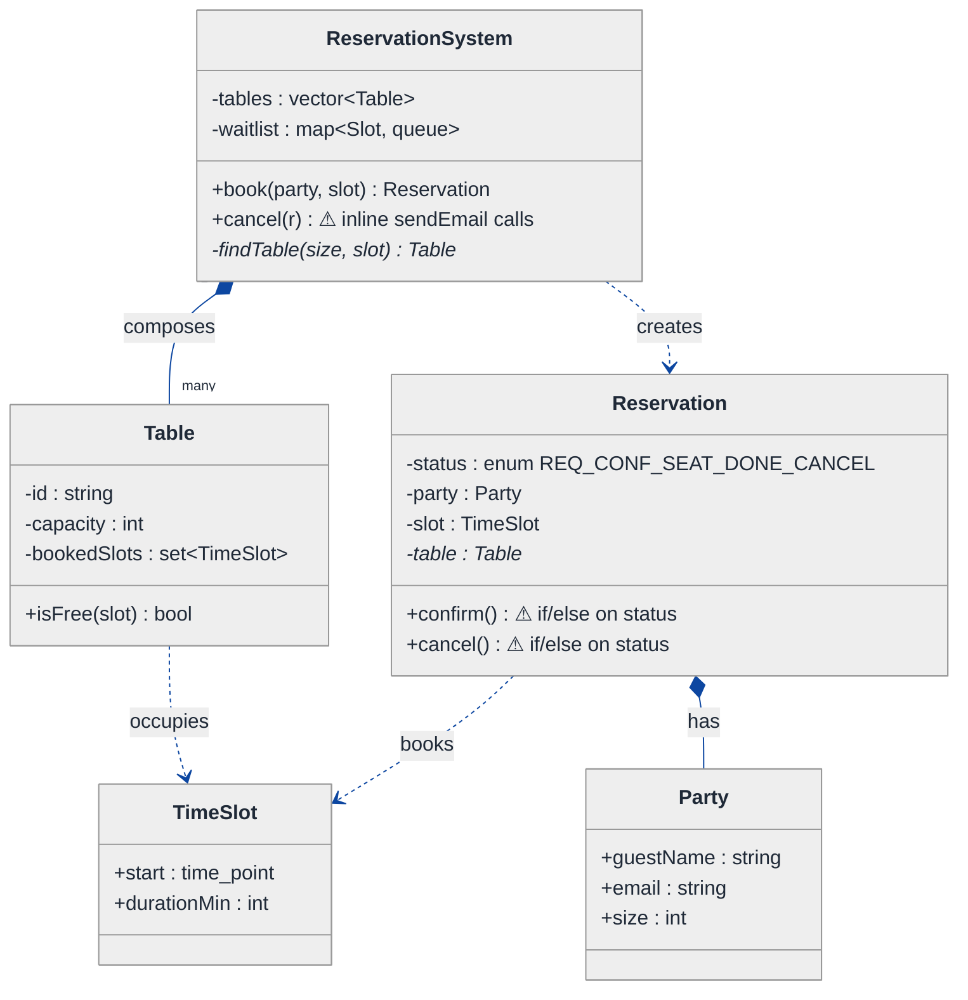
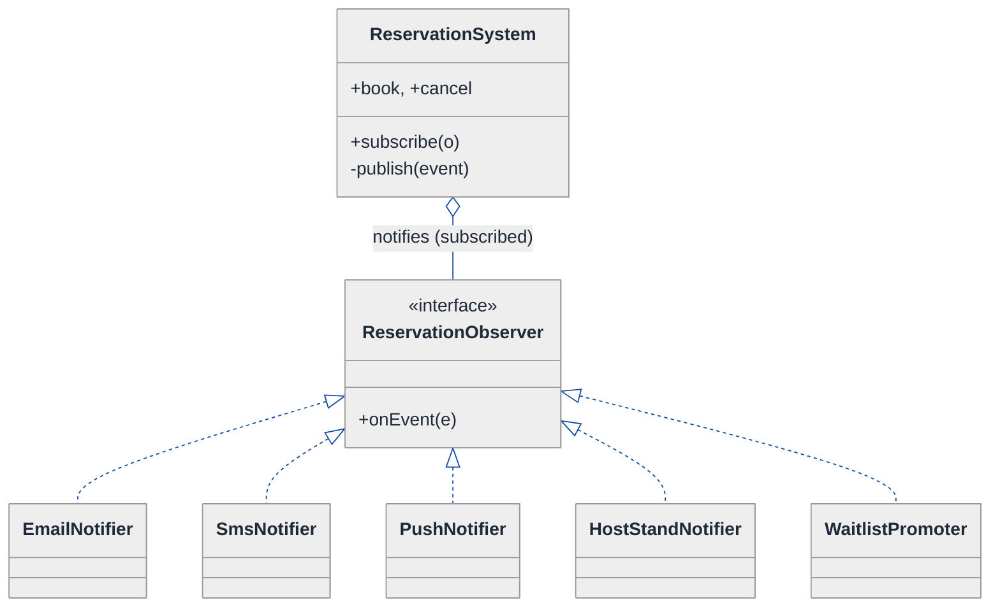
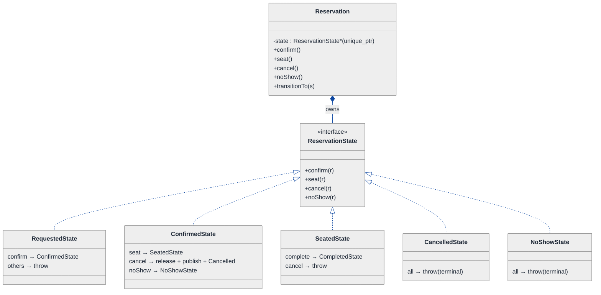
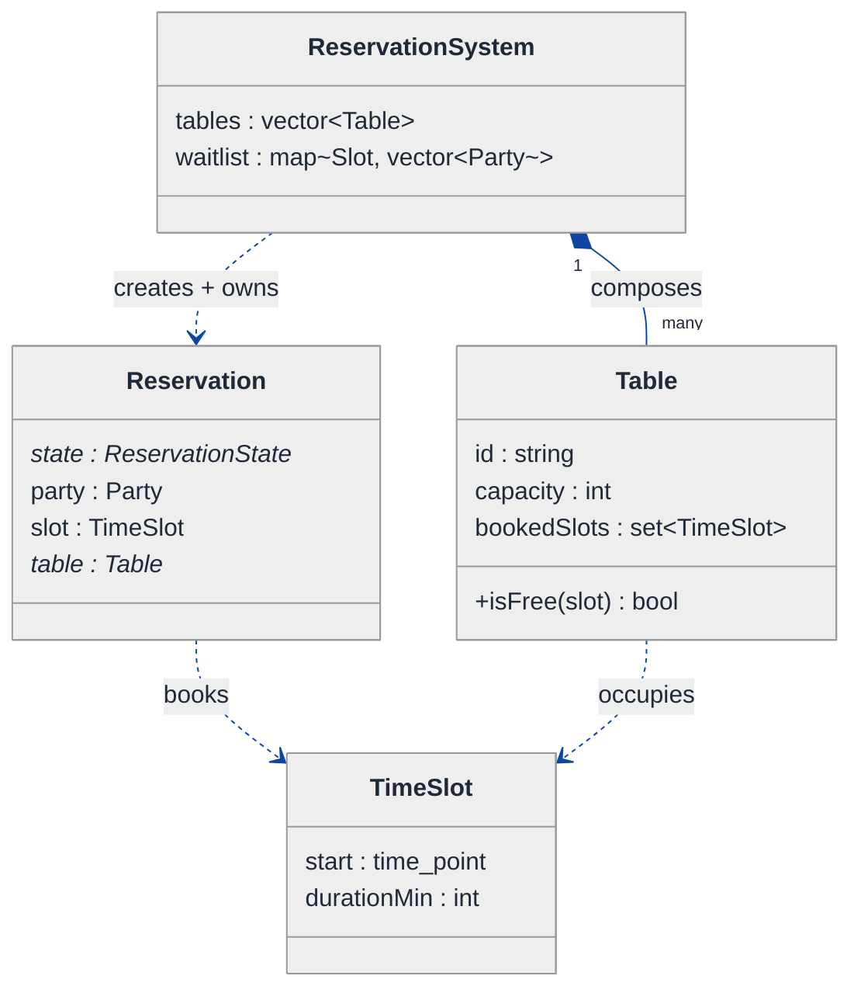
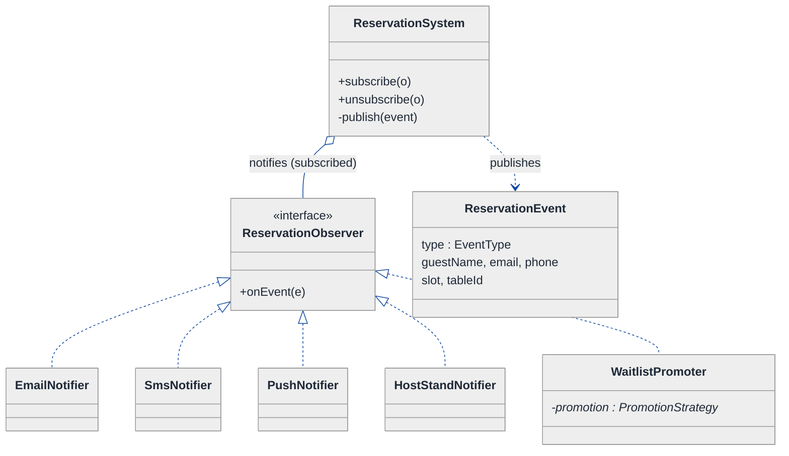
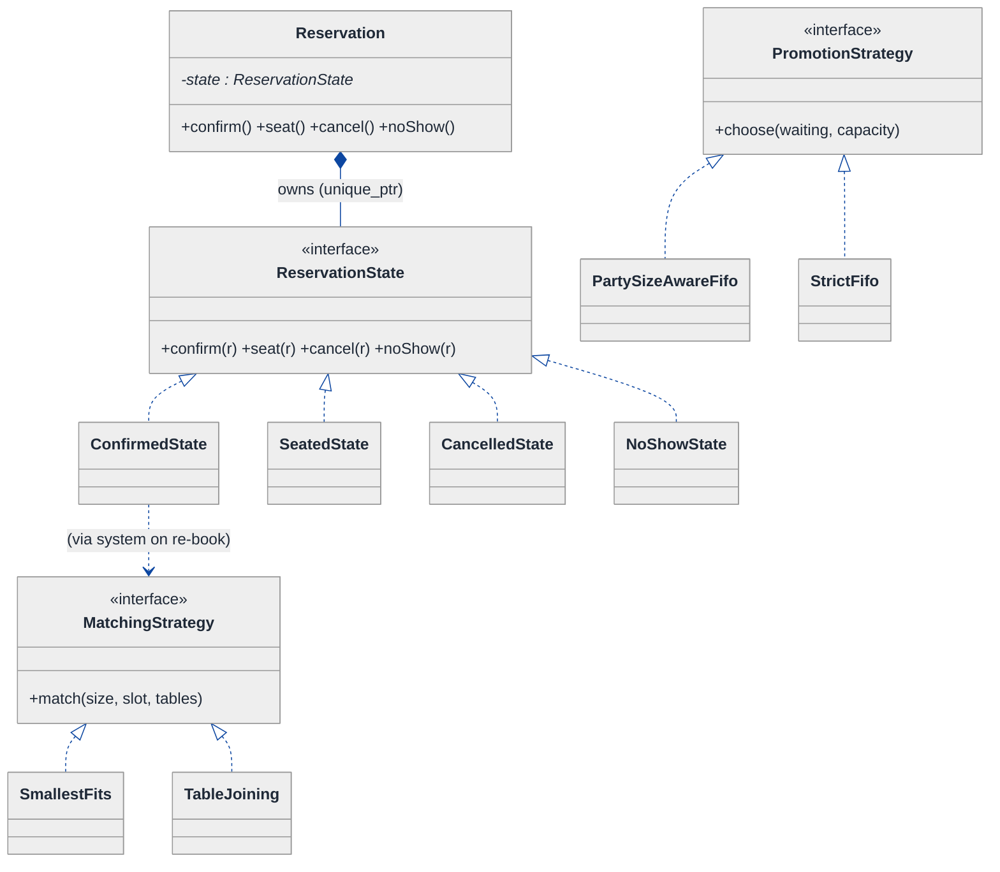
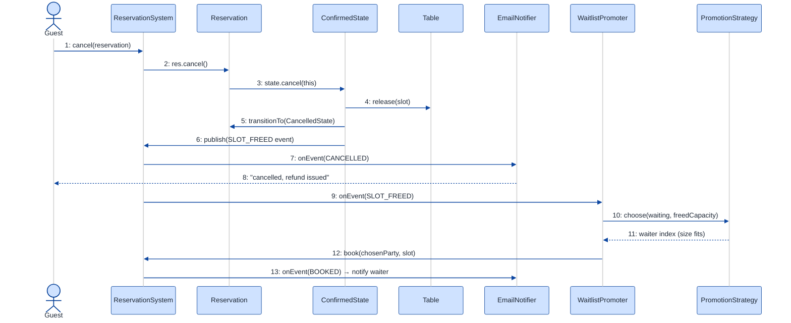

# Restaurant Reservation System — LLD Walkthrough

> **Difficulty:** Medium · **Time:** ~30 min · **Pattern focus:** Observer (notifications) + State (reservation lifecycle) + scheduling (time-slot allocation)
>
> **Problem source(s):** GID OB9, bucket `Observer_Pattern`. Representative of multiple LeetLens rows in [`./EXTRACTED_QUESTIONS.md`](./EXTRACTED_QUESTIONS.md).
>
> **Diagrams:** inline mermaid (renders natively in GitHub / VS Code).

---

## How to use this file

Paced for a candidate seeing the reservation problem for the first time. Reading time: ~30 minutes if you sketch each iteration by hand. **The lesson: don't sprinkle `if (cancelled) sendEmail(...)` calls all over the booking code — DERIVE the notification mechanism (Observer) and the lifecycle mechanism (State) by building the naive design first, watching it break under three concrete future requirements, then reaching for ONE pattern per painful axis.**

**Map of this file (15 sections):**

1. Problem statement + clarifying questions
2. Plain-English restatement
3. Why this matters
4. Mental model
5. Try it yourself first
6. Entity & verb extraction
7. **Iteration 1: the naive design** — what we'd write first
8. **Where the naive design hurts** — three future requirements, one painful diff each
9. **Pivot 1: Observer for notifications** — the most painful axis first
10. **Pivot 2: State for the reservation lifecycle** — internal transitions, not external swaps
11. **Pivot 3: a scheduling Strategy + waitlist promotion** — the remaining axis
12. Final class diagram (three sub-views)
13. Skeleton code (C++)
14. Key flow — sequence diagram
15. Extensibility re-check + anti-patterns + how to think aloud + self-check

---

## 1. Problem statement + clarifying questions

**Prompt (typical phrasing):** "Design a restaurant reservation system with table management, time-slot booking, party-size matching, waitlist management, and cancellation with notification."

**Clarifying questions to ask BEFORE drawing anything:**

1. **Time-slot model?** Fixed slots (7:00, 7:30, 8:00) or arbitrary start times? Fixed dining duration (90 min) or variable?
2. **Table-to-party matching?** Exact capacity, smallest-fits, or can we seat a party of 2 at a 4-top when nothing smaller is free? Can two small tables be joined for a large party?
3. **Waitlist semantics?** When a slot frees up, who gets it — strict FIFO, or party-size-aware (only notify parties that actually fit)? How long do they have to confirm before we move on?
4. **Notification channels?** Email only, or SMS + push + in-app? Who needs to be told about a cancellation — just the guest, or also the host stand / kitchen / a freed waitlister?
5. **Cancellation policy?** Free cancel any time, or a cutoff (no-show fee within 2 hours)? Does a no-show differ from a cancellation?
6. **Concurrency?** Two guests racing for the last 7:30 four-top — must only one win?
7. **Overbooking?** Do we allow a small intentional overbook (restaurants do), or hard-cap at physical table count?

**Assumptions if the interviewer dodges:** fixed 30-minute slots with a 90-minute dining block, smallest-table-that-fits matching, party-size-aware FIFO waitlist with a confirmation window, multi-channel notification (email + SMS + push), free cancellation with a separate no-show state, single-threaded for now (concurrency discussed in §15).

---

## 2. Plain-English restatement

We're building the software that runs a restaurant's "book a table" flow. The system must: hold an inventory of tables (each with a capacity), accept a booking request for a party of N at a given time slot, find a table that fits, create a reservation, and walk that reservation through its life (requested → confirmed → seated → completed, or cancelled / no-show). When a slot is full, the guest joins a **waitlist**; when a table frees (a cancellation), the system must **notify** the right people — the guest, and any waitlisted party that now fits. The design must accommodate adding new notification channels, new lifecycle states, and new matching rules **without rewriting the booking core**.

---

## 3. Why this matters

This is the canonical "side-effects on a state change" interview question. The skill being probed: when one event (a cancellation) must fan out to many interested parties (guest, waitlister, host stand, analytics), do you hardcode each `sendX()` call inside the cancel method — coupling the booking engine to every channel — or do you decouple the *event* from the *reactions* via Observer? The same shape reappears in order systems, stock tickers, CI pipelines, and pub/sub. Getting the Observer/State split right here is exactly what a senior reviewer is listening for.

---

## 4. Mental model

A reservation system is a **calendar of finite table-slots** + a **rule-book** + a **broadcast bus**. The calendar is a grid (table × time-slot). The rule-book decides which table fits which party. The broadcast bus is the part most candidates miss: a cancellation isn't a single action, it's an *event* that several independent listeners care about.

```
Real-world sketch (NOT a UML diagram yet):

   Time →     7:00   7:30   8:00   8:30
   T1 (2) :   [G.A]  [G.A]  [ ]    [ ]      G.x = guest, [ ] free
   T2 (4) :   [ ]    [G.B]  [G.B]  [G.B]
   T3 (6) :   [G.C]  [G.C]  [ ]    [ ]

   Waitlist (7:30): party D (size 3) → party E (size 2)

   G.B cancels 7:30 ─────► EVENT "slot T2@7:30 freed"
                             │  ├─► tell guest B "cancelled, refund"
                             │  ├─► tell waitlister D (size 3 ≤ 4) "your turn!"
                             │  └─► tell analytics / host stand
```

The KEY insight from this picture: a cancellation produces ONE event with MANY reactions, and the set of reactions grows over time. Inventory (tables/slots) vs. orchestration (booking engine) vs. reactions (notifiers) is the separation we'll bake into the design.

---

## 5. Try it yourself first

> **Predict before reading on:**
>
> 1. List 5 nouns you'd promote to a class. List 3 nouns you'd leave as fields.
> 2. **If I told you the restaurant will add SMS this month and WhatsApp next month, what would change about how you write the `cancel()` method?**
> 3. A reservation can be requested, confirmed, seated, completed, cancelled, or no-show. Where do you put the rule "you can't seat a cancelled reservation"?

---

## 6. Entity & verb extraction

> **Mini-refresher: noun → class, but not every noun.**
>
> Naive OOD promotes every noun to a class. Senior OOD promotes a noun only if it has both BEHAVIOR and STATE that need to live together. "Capacity" stays a field on Table; "Reservation" becomes a class because it has lifecycle behavior.

**Nouns from the prompt:**

| Noun | Decision | Why |
|---|---|---|
| ReservationSystem | Class (top-level coordinator) | Owns tables, slots, waitlist; orchestrates book/cancel |
| Table | Class | Has capacity + a per-slot occupancy map |
| TimeSlot | Value type (start time + duration) | No behavior of its own; a key |
| Reservation | Class | Lifecycle behavior + notification target |
| Party | Field bundle on Reservation (`guest`, `size`) | Size is data; guest is contact info |
| Waitlist | Class | FIFO + party-size-aware promotion logic |
| Guest | Field on Reservation (name + contact channels) | No domain behavior |
| Notification | Crosses into a *channel* hierarchy (§9) | The fan-out is the interesting part |

**Verbs (and the class they live on):**

| Verb | Owner class (naive answer — we'll re-examine) |
|---|---|
| book(party, slot) | ReservationSystem |
| findTable(size, slot) | ReservationSystem |
| confirm() / seat() / complete() | Reservation |
| cancel() | Reservation (and ReservationSystem cleanup) |
| joinWaitlist(party, slot) | Waitlist |
| promoteNext(slot) | Waitlist |
| notify(message) | ReservationSystem (naive) — this is the smell |

**We have NOT introduced any design patterns yet.** Pure nouns + verbs.

---

## 7. <a id="iter-1"></a>Iteration 1: the naive design

Let's write the simplest thing that could possibly work. No design patterns — just classes with methods, an enum for status, and direct `sendEmail(...)` calls.



**Reader's tour (read top to bottom; ~60 seconds).**

1. **At the top — `ReservationSystem` is the root.** It holds the table inventory and a per-slot waitlist, and exposes `book` / `cancel`. Notice: NO injected notifier, NO policy objects. Every decision lives inside these methods.

2. **The composition spine.** `ReservationSystem` composes `Table[]` (filled diamond = strong ownership / same lifetime). Each `Table` tracks which `TimeSlot`s it has booked in a set.

3. **`Reservation` is the trouble zone.** Two warning markers (⚠):
   - `status` is an enum, and `confirm()` / `cancel()` branch on it with if/else. Fine for 4 states; brittle when we add `NO_SHOW` and `WAITLISTED`.
   - `cancel()` will also need to *tell people*. In the naive design those `sendEmail(...)` calls go straight inside `ReservationSystem::cancel` — that's the coupling we'll expose in §8.

4. **`Party` is correctly NOT a class with behavior** — it's a data bundle (guest name, email, size). Good instinct; we keep it.

**What's deliberately missing.** No `Observer` / `ReservationListener`. No `ReservationState`. No `MatchingStrategy`. The naive design doesn't even *acknowledge* that "who reacts to a cancellation" and "what's a legal next step" are axes of variation — it bakes a hardcoded answer for each into the methods.

Skeleton code for the naive design (C++):

```cpp
#include <chrono>
#include <queue>
#include <set>
#include <stdexcept>
#include <string>
#include <unordered_map>
#include <vector>

enum class Status { REQUESTED, CONFIRMED, SEATED, COMPLETED, CANCELLED };

struct TimeSlot {                       // value type, used as a map key
    std::chrono::system_clock::time_point start;
    int durationMin = 90;
    bool operator<(const TimeSlot& o) const { return start < o.start; }
};

struct Party { std::string guestName; std::string email; int size; };

class Table {
public:
    Table(std::string id, int cap) : id_(std::move(id)), capacity_(cap) {}
    int  capacity() const { return capacity_; }
    bool isFree(const TimeSlot& s) const { return booked_.count(s) == 0; }
    void book(const TimeSlot& s)   { booked_.insert(s); }
    void release(const TimeSlot& s){ booked_.erase(s); }
    const std::string& id() const { return id_; }
private:
    std::string        id_;
    int                capacity_;
    std::set<TimeSlot> booked_;
};

class Reservation {
public:
    Status      status = Status::REQUESTED;
    Party       party;
    TimeSlot    slot;
    Table*      table = nullptr;
    std::string id;
};

class ReservationSystem {
public:
    explicit ReservationSystem(std::vector<Table> tables) : tables_(std::move(tables)) {}

    Reservation* book(const Party& p, const TimeSlot& slot) {
        Table* t = findTable(p.size, slot);          // smallest-fits, inline
        if (!t) { waitlist_[slot].push(p); return nullptr; }   // join waitlist
        t->book(slot);
        auto r = std::make_unique<Reservation>();
        r->party = p; r->slot = slot; r->table = t;
        r->status = Status::CONFIRMED;
        sendEmail(p.email, "Booked!");               // ⚠ hardcoded notification
        auto* raw = r.get(); store_.push_back(std::move(r));
        return raw;
    }

    void cancel(Reservation& r) {
        if (r.status == Status::CANCELLED) throw std::runtime_error("Already cancelled");
        r.status = Status::CANCELLED;
        r.table->release(r.slot);
        sendEmail(r.party.email, "Cancelled, refund issued");   // ⚠ hardcoded
        // ⚠ and now the waitlist... promote next, and email THEM too:
        auto& q = waitlist_[r.slot];
        if (!q.empty()) {
            Party next = q.front(); q.pop();
            sendEmail(next.email, "A table opened up!");        // ⚠ hardcoded again
        }
        // ⚠ and tell the host stand? and analytics? more sendX() calls here...
    }
private:
    Table* findTable(int size, const TimeSlot& slot) {
        Table* best = nullptr;
        for (auto& t : tables_)                       // smallest capacity that fits + free
            if (t.capacity() >= size && t.isFree(slot))
                if (!best || t.capacity() < best->capacity()) best = &t;
        return best;
    }
    std::vector<Table>                              tables_;
    std::unordered_map<TimeSlot, std::queue<Party>, /*hash*/ struct SlotHash> waitlist_;
    std::vector<std::unique_ptr<Reservation>>       store_;
    void sendEmail(const std::string&, const std::string&) { /* SMTP */ }
};
```

**This works.** It has zero design patterns. We can book, cancel, promote the waitlist, send emails. So what's wrong with it?

---

## 8. <a id="naive-pain"></a>Where the naive design hurts

Now the interviewer slides a piece of paper across the desk: "Here are three new requirements coming next quarter. Walk me through what changes."

### Change A: "Add SMS and push notifications, and tell the host stand on every cancellation"

In the naive design:
- `cancel()` already has three `sendEmail(...)` calls. Now each becomes `sendEmail(...); sendSms(...); sendPush(...); notifyHostStand(...)`.
- `book()` grows the same way.
- **The `ReservationSystem` now `#include`s the SMTP client, the SMS gateway, the push SDK, and the host-stand API.** It is coupled to every delivery channel. Adding WhatsApp next month means editing `book`, `cancel`, and every other method that touches a guest. The smell: **one class knows about every reaction to an event.**

### Change B: "Add a NO_SHOW state and a WAITLISTED state with their own rules"

In the naive design:
- `Status` enum doesn't cover `NO_SHOW` or `WAITLISTED`.
- `confirm()`, `seat()`, `cancel()` each branch `if (status == ...)`. Adding two states means revisiting every one of those `if` ladders — and the rule "you can't `seat()` a `NO_SHOW`" has to be added in three places.
- **The transition matrix is now 6 states × 4 events = 24 cells scattered across if/else blocks in different methods.** Miss one and you allow an illegal transition (e.g., seating a cancelled party).

### Change C: "Waitlist promotion must be party-size-aware, and we want to A/B test FIFO vs. soonest-arrival matching"

In the naive design:
- `cancel()` does `q.front()` — strict FIFO, ignoring size. A party of 6 at the front of the queue blocks a freed 2-top that a party of 2 behind them could use.
- `findTable()` hardcodes smallest-fits. To A/B test "join two 2-tops for a party of 4," you edit `findTable` directly.
- **Both matching policies are baked into method bodies.** Trying a new one means a code change + redeploy, not a config swap.

### The pattern of pain

| Change | Files / methods touched | Smell |
|---|---|---|
| A. Multi-channel notify | `book` + `cancel` + every guest-touching method | "One class coupled to every notification channel; fan-out hardcoded." |
| B. New lifecycle states | `confirm` + `seat` + `cancel` if-ladders | "Status enum + scattered switches can't express new states safely." |
| C. Matching / waitlist policy | `findTable` + `cancel` (the `q.front()` line) | "Algorithm baked into a method; can't swap or A/B test." |

**Three axes of pain dominate:** *reaction fan-out* (notifications), *lifecycle variability* (reservation states), and *algorithm variability* (matching + promotion).

> **Pivot question:** "What pattern lets one event notify many interested parties without the event source knowing who they are? What pattern handles 'lifecycle with state-specific behavior'? What pattern swaps an algorithm picked by config?"
>
> The answers are Observer, State, and Strategy. Let's introduce them one at a time, starting with the most painful axis: the notification fan-out.

---

## 9. <a id="pivot-1"></a>Pivot 1: Observer for notifications

> **Mini-refresher: Observer pattern.**
>
> A *Subject* maintains a list of *Observers* and broadcasts events to all of them via a common interface (`onEvent(...)`). The subject does NOT know the concrete observer types — it just iterates and calls. Observers `subscribe` / `unsubscribe` at runtime. This decouples "something happened" from "who cares."
>
> Quick example: a `Stock` (subject) notifies registered `PriceDisplay`, `AlertEngine`, and `Logger` observers when its price changes. The stock has no idea those classes exist by name.

**Why Observer fits notifications.** A cancellation is one event with a *growing, runtime-configurable* set of reactions (email, SMS, push, host stand, analytics, waitlist promotion). The event source (`ReservationSystem`) should not know which channels exist. That's textbook Observer: the system is the Subject, each notifier is an Observer.

**Push vs. pull (a real Observer decision).** Do we push the full event payload into `onEvent(event)` (push), or pass a thin handle and let observers query back (pull)? Here we **push** a small `ReservationEvent` struct — observers rarely need to call back into the system, and push avoids a back-reference cycle.

**The refactor (just the affected part):**

```cpp
// The event payload pushed to every observer.
enum class EventType { BOOKED, CONFIRMED, CANCELLED, SLOT_FREED, NO_SHOW };
struct ReservationEvent {
    EventType    type;
    std::string  guestName;
    std::string  email;
    std::string  phone;
    TimeSlot     slot;
    std::string  tableId;
};

// The Observer interface — one virtual method.
class ReservationObserver {
public:
    virtual ~ReservationObserver() = default;
    virtual void onEvent(const ReservationEvent& e) = 0;
};

// Concrete observers — each owns ONE delivery concern.
class EmailNotifier : public ReservationObserver {
public:
    void onEvent(const ReservationEvent& e) override {
        if (e.email.empty()) return;
        // SMTP send templated on e.type ... (elided)
    }
};

class SmsNotifier : public ReservationObserver {       // added in Change A — ZERO edits elsewhere
public:
    void onEvent(const ReservationEvent& e) override {
        if (e.phone.empty()) return;
        // SMS gateway send ... (elided)
    }
};
// PushNotifier, HostStandNotifier, AnalyticsSink ... elided — each is one new class

// The Subject side, mixed into ReservationSystem.
class Subject {
public:
    void subscribe(ReservationObserver* o)   { observers_.push_back(o); }   // raw* — see ownership note
    void unsubscribe(ReservationObserver* o) { /* erase-remove, elided */ }
protected:
    void publish(const ReservationEvent& e) {
        for (auto* o : observers_) o->onEvent(e);     // broadcast; subject is blind to concrete types
    }
private:
    std::vector<ReservationObserver*> observers_;
};
```

> **Ownership note (`weak_ptr` vs raw pointer for back-refs).** Observers usually outlive individual events but the Subject does NOT own them — they're registered from outside. Store them as non-owning `ReservationObserver*` (or `weak_ptr` if lifetimes are uncertain), and require `unsubscribe()` before an observer dies. Never store owning `unique_ptr` for things you didn't create — that's a lifetime bug waiting to happen.

**What changed — visualized.** Just the notification slice:



**Tour of the after-state.**

1. **`ReservationSystem` gained `subscribe()` / `publish()` and LOST every `sendX()` call.** Where `cancel()` used to call email + SMS + push by hand, it now calls `publish(event)` ONCE. The open diamond (`◇`) marks aggregation — the system holds non-owning references to observers registered from outside.

2. **The `<<interface>>` box is the contract.** Single virtual method `onEvent(ReservationEvent&)`. Every concrete notifier implements just this.

3. **The bottom row is the set of reactions** — `EmailNotifier`, `SmsNotifier`, `PushNotifier`, `HostStandNotifier`. Change A from §8 ("add SMS + host stand") is now **two new classes and two `subscribe()` calls at wiring time** — zero edits to `book` / `cancel`.

4. **`WaitlistPromoter` is an observer too.** This is the elegant bit: promoting the waitlist on a freed slot is just *another reaction* to the `SLOT_FREED` event. It subscribes like any notifier, checks party-size fit, and re-books. The cancel method doesn't special-case the waitlist anymore.

**Pattern-discrimination cheatsheet — Observer vs Mediator.**
- *Observer:* one Subject broadcasts to many independent observers; observers don't talk to each other. One-to-many, fire-and-forget.
- *Mediator:* a central hub coordinates two-way conversations *between* colleagues that would otherwise be tangled (e.g., a chat room routing messages among users).
- *Rule of thumb:* if it's "broadcast an event, listeners react independently" → Observer. If it's "objects must coordinate with each other through a hub" → Mediator.

We chose Observer because the notifiers are independent and never coordinate — they each just react to the broadcast.

---

## 10. <a id="pivot-2"></a>Pivot 2: State for the reservation lifecycle

Change B from §8 is still painful — `NO_SHOW`, `WAITLISTED`, and the 24-cell transition matrix scattered across if-ladders. Observer doesn't help: the variability isn't "who reacts," it's "what's a legal next step and what does it do."

> **Mini-refresher: State pattern.**
>
> Each lifecycle state is its own class implementing a common interface. The context object delegates each event (`confirm()`, `seat()`, `cancel()`) to its CURRENT state, and THE STATE decides what happens and what the next state is. Transitions are INTERNAL, driven by events the context receives — illegal transitions become a one-line `throw` in the state that forbids them.

**Why State (not Strategy).** The choice of state is NOT picked by the caller — it's driven by what the reservation has been through. A `Confirmed` reservation can `seat()`. A `Seated` one can `complete()`. A `Cancelled` one can do nothing. Calling `seat()` on a `Cancelled` reservation isn't meaningful — it should fail. The lifecycle is the OBJECT'S concern, not the caller's.

**The refactor (just the lifecycle part):**

```cpp
class Reservation;  // forward

class ReservationState {
public:
    virtual ~ReservationState() = default;
    virtual void confirm(Reservation& r) = 0;
    virtual void seat(Reservation& r)    = 0;
    virtual void cancel(Reservation& r)  = 0;
    virtual void noShow(Reservation& r)  = 0;
    virtual const char* name() const = 0;
};

class ConfirmedState : public ReservationState {
public:
    void confirm(Reservation&) override { /* idempotent or throw */ }
    void seat(Reservation& r) override;                 // → SeatedState
    void cancel(Reservation& r) override;               // release table + publish CANCELLED → SlotFreed
    void noShow(Reservation& r) override;               // → NoShowState (publish NO_SHOW)
    const char* name() const override { return "CONFIRMED"; }
};

class SeatedState : public ReservationState {
public:
    void confirm(Reservation&) override { throw std::runtime_error("Already seated"); }
    void seat(Reservation&)    override { throw std::runtime_error("Already seated"); }
    void cancel(Reservation&)  override { throw std::runtime_error("Cannot cancel a seated party"); }
    void noShow(Reservation&)  override { throw std::runtime_error("Party is present, not a no-show"); }
    void complete(Reservation& r);                      // → CompletedState (declared on subclass)
    const char* name() const override { return "SEATED"; }
};

// CancelledState + CompletedState + NoShowState are terminal — every event throws. (elided)

class Reservation {
public:
    void transitionTo(std::unique_ptr<ReservationState> s) { state_ = std::move(s); }
    void confirm() { state_->confirm(*this); }
    void seat()    { state_->seat(*this); }
    void cancel()  { state_->cancel(*this); }
    void noShow()  { state_->noShow(*this); }
    // getters: party(), slot(), table(), system() ... (elided)
private:
    std::unique_ptr<ReservationState> state_;   // exclusive ownership of current state
    // party_, slot_, table_, system_& ...
};
```

**What changed — visualized.** Just the lifecycle slice:



**Tour of the after-state.**

1. **The `Status` enum is gone.** Replaced by a `state` field of type `ReservationState*` (a `unique_ptr` — exclusive ownership). The reservation OWNS its current state and swaps it on transition.

2. **`confirm()` / `seat()` / `cancel()` / `noShow()` became one-liners that delegate.** Each just calls `state_->theEvent(*this)`. **No `if (status == X)` branching anywhere on Reservation.**

3. **Five concrete states, each self-contained.** `RequestedState` only allows `confirm`. `ConfirmedState` allows `seat`, `cancel`, `noShow`. `SeatedState` allows `complete` (and forbids cancel — you can't cancel a party already eating). `CancelledState` and `NoShowState` are terminal — every event throws.

4. **Where the transitions happen.** Each state calls `r.transitionTo(...)` when its work is done. The transition logic lives WITH the state, not in `Reservation` and not in `ReservationSystem`. **The class hierarchy IS the transition matrix** — and adding `NO_SHOW` (Change B) is one new `NoShowState` class plus a `noShow()` edge from `ConfirmedState`. No edits to the other states.

5. **State meets Observer here.** Look at `ConfirmedState::cancel` — it releases the table and then `publish(SLOT_FREED event)`. The State pattern triggers the Observer broadcast. The two patterns cooperate: State decides *that* a cancellation is legal and *what* it changes; Observer fans out *who hears about it*.

**Pattern-discrimination cheatsheet — Strategy vs State.**
- *Strategy:* the CALLER picks which one to use; strategies are usually unaware of each other.
- *State:* the OBJECT picks its next state internally; states know about each other (each state can `transitionTo` another).
- *Rule of thumb:* swap happens because external code says `setX(...)` → Strategy. Swap happens because of an internal event flow → State.

---

## 11. <a id="pivot-3"></a>Pivot 3: a scheduling Strategy + waitlist promotion

Changes A and B are solved. Change C — party-size-aware promotion and A/B-testable matching — is the remaining axis. The variability is in an ALGORITHM picked by config, which is textbook Strategy (same shape as the parking-lot pricing example).

> **Mini-refresher: Strategy pattern (quick recap).**
>
> Encapsulates an algorithm behind an interface so it can be swapped at runtime. The CALLER (here, the system's configuration) decides which strategy to use; the strategy doesn't know about its peers.

**The remaining axes:**

| Axis | Pattern | One sentence why |
|---|---|---|
| Table-to-party matching | Strategy | Smallest-fits vs table-joining vs zone-preference — picked by config |
| Waitlist promotion order | Strategy | FIFO vs party-size-aware vs soonest-arrival — A/B testable |

```cpp
// Matching: given a party size + slot, pick a table (or none).
class MatchingStrategy {
public:
    virtual ~MatchingStrategy() = default;
    virtual Table* match(int partySize, const TimeSlot& slot,
                         std::vector<Table>& tables) const = 0;
};
class SmallestFits : public MatchingStrategy {        // current behavior, isolated
public:
    Table* match(int size, const TimeSlot& slot, std::vector<Table>& tables) const override {
        Table* best = nullptr;
        for (auto& t : tables)
            if (t.capacity() >= size && t.isFree(slot))
                if (!best || t.capacity() < best->capacity()) best = &t;
        return best;
    }
};
// TableJoining, ZonePreference ... elided — each one new class

// Waitlist promotion: which waiting party gets a freed slot?
class PromotionStrategy {
public:
    virtual ~PromotionStrategy() = default;
    // returns index of the chosen waiter, or -1 if none fits the freed table
    virtual int choose(const std::vector<Party>& waiting, int freedCapacity) const = 0;
};
class PartySizeAwareFifo : public PromotionStrategy {  // first waiter that actually FITS
public:
    int choose(const std::vector<Party>& waiting, int freedCapacity) const override {
        for (int i = 0; i < (int)waiting.size(); ++i)
            if (waiting[i].size <= freedCapacity) return i;
        return -1;
    }
};
// StrictFifo, SoonestArrival ... elided
```

The `WaitlistPromoter` observer from Pivot 1 now delegates to a `PromotionStrategy` instead of hardcoding `q.front()` — so the size-aware fix and the A/B test are both config swaps, not code surgery.

> **Mini-refresher: why three independent Strategy/Observer hierarchies don't share one interface.**
>
> `MatchingStrategy`, `PromotionStrategy`, and `ReservationObserver` are *roles*, not a common type. They take different inputs and return different things. Don't try to unify them under one generic `Handler<T>` — that's premature genericism.

**The lesson.** Once we recognized "algorithm picked by config" for matching, the same shape applies to promotion. **Pattern recognition makes subsequent design cheap.**

---

## 12. <a id="fig-class-diagram"></a>Final class diagram

Showing the entire final design in one diagram becomes a wall of boxes. Instead, three focused sub-views, read in order; the structural insight at the end ties them together.

### 12.1 The inventory + orchestration spine — what the system OWNS



**Tour of 12.1.** The filled diamond (`◆`) marks composition — the system OWNS its tables (same lifetime). Reservations are created and owned by the system; each points at a `Table` and books a `TimeSlot`. Inventory hasn't changed shape from the naive design — what we ADDED lives in 12.2 and 12.3.

### 12.2 The reaction fan-out — Observer (what the system NOTIFIES)



**Tour of 12.2.**

1. **One Subject, many observers.** The open diamond (`◇`) marks aggregation — the system holds non-owning references to observers registered from outside via `subscribe()`. It iterates and calls `onEvent`; it never names a concrete notifier.

2. **`ReservationEvent` is the push payload.** A small struct carrying everything an observer might need, so observers don't call back into the system.

3. **`WaitlistPromoter` is an observer with a `PromotionStrategy` field** — the bridge to 12.3. When it hears `SLOT_FREED`, it asks its strategy which waiting party gets the table, then re-books them. Promotion is just another reaction.

### 12.3 The lifecycle + scheduling — State + Strategy



**Tour of 12.3.**

1. **Reservation holds ONE `ReservationState`** (filled diamond / `unique_ptr` — it owns its current state and swaps it on transition).

2. **`confirm/seat/cancel/noShow` are one-liner delegations.** No status-switch anywhere.

3. **Two Strategy interfaces handle scheduling.** `MatchingStrategy` (smallest-fits, table-joining) is picked by the system at booking time; `PromotionStrategy` (size-aware FIFO, strict FIFO) is held by `WaitlistPromoter`. Both are injected, both A/B-testable.

### Structural insight (ties 12.1 + 12.2 + 12.3 together)

| Concern | Pattern used | Why |
|---|---|---|
| **Inventory** (Table, TimeSlot, Party) | Plain ownership + data fields | Tables/slots are just data; no behavior variation |
| **Reactions** (email, SMS, push, host stand, waitlist) | Observer, SUBSCRIBED to the system | One event, many independent listeners; set grows over time |
| **Lifecycle** (Requested → Confirmed → Seated → Completed / Cancelled / NoShow) | State, OWNED by Reservation | Reservation controls transitions; states validate what's legal next |
| **Scheduling** (matching + promotion) | Strategy, INJECTED / config-picked | Algorithm chosen by config; A/B testable |

The big lesson: **inheritance is used only for the state/observer/strategy class families** — every "varies independently" axis becomes composition over an interface. The cancellation flow now reads: `state.cancel()` (State decides it's legal + releases the table) → `publish(SLOT_FREED)` (Observer fans out) → `WaitlistPromoter` reacts via its `PromotionStrategy`. Three patterns, one clean flow.

---

## 13. Skeleton code (C++)

> Show the SHAPES, not the full impl. ~130 lines.

```cpp
#include <chrono>
#include <memory>
#include <stdexcept>
#include <string>
#include <unordered_map>
#include <vector>

// ── Forward declarations ────────────────────────────────────────────
class Reservation;
class ReservationSystem;

// ── Value types ─────────────────────────────────────────────────────
struct TimeSlot {
    std::chrono::system_clock::time_point start;
    int durationMin = 90;
    bool operator==(const TimeSlot& o) const { return start == o.start; }
};
struct Party { std::string guestName; std::string email; std::string phone; int size; };

enum class EventType { BOOKED, CONFIRMED, CANCELLED, SLOT_FREED, NO_SHOW };
struct ReservationEvent {
    EventType type; std::string guestName, email, phone;
    TimeSlot slot;  std::string tableId; int freedCapacity = 0;
};

// ── Table (inventory) ───────────────────────────────────────────────
class Table {
public:
    Table(std::string id, int cap) : id_(std::move(id)), capacity_(cap) {}
    int  capacity() const { return capacity_; }
    bool isFree(const TimeSlot& s) const { /* lookup in booked_ */ return true; }
    void book(const TimeSlot& s)    { /* insert */ }
    void release(const TimeSlot& s) { /* erase */ }
    const std::string& id() const { return id_; }
private:
    std::string id_; int capacity_;
    std::vector<TimeSlot> booked_;
};

// ── Observer (Pivot 1) ──────────────────────────────────────────────
class ReservationObserver {
public:
    virtual ~ReservationObserver() = default;
    virtual void onEvent(const ReservationEvent& e) = 0;
};
class EmailNotifier : public ReservationObserver {
public:
    void onEvent(const ReservationEvent& e) override { /* SMTP, gated on e.email */ }
};
// SmsNotifier, PushNotifier, HostStandNotifier ... elided (one class each)

// ── Strategy (Pivot 3) ──────────────────────────────────────────────
class MatchingStrategy {
public:
    virtual ~MatchingStrategy() = default;
    virtual Table* match(int size, const TimeSlot& slot, std::vector<Table>& tables) const = 0;
};
class SmallestFits : public MatchingStrategy {
public:
    Table* match(int size, const TimeSlot& slot, std::vector<Table>& tables) const override {
        Table* best = nullptr;
        for (auto& t : tables)
            if (t.capacity() >= size && t.isFree(slot))
                if (!best || t.capacity() < best->capacity()) best = &t;
        return best;
    }
};
class PromotionStrategy {
public:
    virtual ~PromotionStrategy() = default;
    virtual int choose(const std::vector<Party>& waiting, int freedCapacity) const = 0;
};
// PartySizeAwareFifo, StrictFifo ... elided

// ── State (Pivot 2) ─────────────────────────────────────────────────
class ReservationState {
public:
    virtual ~ReservationState() = default;
    virtual void confirm(Reservation& r) = 0;
    virtual void seat(Reservation& r)    = 0;
    virtual void cancel(Reservation& r)  = 0;
    virtual void noShow(Reservation& r)  = 0;
};
class ConfirmedState : public ReservationState {
public:
    void confirm(Reservation&) override {}
    void seat(Reservation& r) override;     // → SeatedState (elided)
    void cancel(Reservation& r) override;   // release table + publish SLOT_FREED → CancelledState
    void noShow(Reservation& r) override;   // publish NO_SHOW → NoShowState
};
// SeatedState, CancelledState, NoShowState ... elided (terminal states throw)

// ── Reservation (State context) ─────────────────────────────────────
class Reservation {
public:
    Reservation(ReservationSystem& sys, Party p, TimeSlot slot, Table* t)
        : system_(sys), party_(std::move(p)), slot_(slot), table_(t),
          state_(std::make_unique<ConfirmedState>()) {}
    void transitionTo(std::unique_ptr<ReservationState> s) { state_ = std::move(s); }
    void cancel() { state_->cancel(*this); }
    void seat()   { state_->seat(*this); }
    void noShow() { state_->noShow(*this); }
    ReservationSystem& system() { return system_; }
    const Party&    party() const { return party_; }
    const TimeSlot& slot()  const { return slot_; }
    Table*          table() const { return table_; }
private:
    ReservationSystem&                system_;
    Party                             party_;
    TimeSlot                          slot_;
    Table*                            table_;
    std::unique_ptr<ReservationState> state_;
};

// ── ReservationSystem (root + Subject) ──────────────────────────────
class ReservationSystem {
public:
    ReservationSystem(std::vector<Table> tables, std::unique_ptr<MatchingStrategy> m)
        : tables_(std::move(tables)), matching_(std::move(m)) {}

    void subscribe(ReservationObserver* o)   { observers_.push_back(o); }   // non-owning
    void unsubscribe(ReservationObserver* o) { /* erase-remove, elided */ }
    void publish(const ReservationEvent& e)  { for (auto* o : observers_) o->onEvent(e); }

    Reservation* book(const Party& p, const TimeSlot& slot) {
        Table* t = matching_->match(p.size, slot, tables_);   // Strategy
        if (!t) { waitlist_[/*key*/0].push_back(p); return nullptr; }
        t->book(slot);
        auto r = std::make_unique<Reservation>(*this, p, slot, t);
        publish({EventType::BOOKED, p.guestName, p.email, p.phone, slot, t->id()});  // Observer
        auto* raw = r.get(); store_.push_back(std::move(r));
        return raw;
    }
    std::vector<Table>& tables() { return tables_; }
private:
    std::vector<Table>                              tables_;
    std::unique_ptr<MatchingStrategy>               matching_;
    std::vector<ReservationObserver*>               observers_;     // Subject's observer list
    std::unordered_map<int, std::vector<Party>>     waitlist_;
    std::vector<std::unique_ptr<Reservation>>       store_;
};
```

---

## 14. <a id="fig-sequence"></a>Key flow — sequence diagram

The most instructive flow is **cancellation with waitlist promotion** — it's where all three patterns cooperate.



**Tour of the cancellation flow. Read slowly — this is the moment all three patterns cooperate.**

1. **Guest requests cancel; the system delegates to the Reservation, which delegates to its current state.** Steps 1-3. **If the state were `SeatedState`, step 3 would throw "Cannot cancel a seated party"** — no `if` ladder, the State hierarchy IS the validation.

2. **`ConfirmedState::cancel` does the real work (steps 4-6):** releases the table's slot, transitions the reservation to `CancelledState`, then `publish(SLOT_FREED)`. **State decides *that* it's legal and *what* changes; it triggers the broadcast but doesn't know who listens.**

3. **The Subject fans out (steps 7-9).** `publish` loops its observer list. `EmailNotifier` tells the guest about the refund. `WaitlistPromoter` hears the same event. **The system named neither class — it just iterated.** Adding an `SmsNotifier` here is one `subscribe()` call.

4. **`WaitlistPromoter` consults its `PromotionStrategy` (steps 10-11)** to pick a waiting party that actually FITS the freed table (size-aware FIFO), then re-books them (step 12), which fires another `BOOKED` event that notifies the lucky waiter (step 13).

### The validation that's NOT shown — and why it matters

You don't see `if (status == CONFIRMED)` anywhere. That's the point of the State pattern: **invalid operations are made impossible by polymorphism**, not by runtime checks scattered through the code. And you don't see `sendSms(...)` / `sendPush(...)` inside `cancel` — that's the point of Observer: **the event source is blind to its reactions.**

---

## 15. Extensibility re-check + anti-patterns + how to think aloud + self-check

### Extensibility re-check

Revisit the three changes from [§8](#naive-pain). For each, name the SINGLE class that changes.

| Change | Naive design impact | Final design impact |
|---|---|---|
| A. SMS + push + host stand | `book` + `cancel` + every guest method | New `SmsNotifier` / `HostStandNotifier : ReservationObserver` + one `subscribe()` each. Done. |
| B. NO_SHOW + WAITLISTED states | `confirm` + `seat` + `cancel` if-ladders | New `NoShowState : ReservationState` + an edge from `ConfirmedState`. Done. |
| C. Size-aware / A/B matching | `findTable` + `cancel`'s `q.front()` line | New `PromotionStrategy` / `MatchingStrategy` impl, injected by config. Done. |

Every change is exactly ONE new class (plus wiring) in the final design. That's the open/closed principle in practice.

> **Mini-refresher: Open/Closed Principle (the "O" in SOLID).**
>
> Software entities should be OPEN for extension but CLOSED for modification. You add behavior by writing new classes, not by editing existing ones. Observer, State, and Strategy all serve this: a new channel / state / algorithm is a new class, never a new branch in an old method.

### Common confusion + traps

1. **"Should the Reservation itself hold the observer list?"** No. The *event source* is the system (it owns the cancel orchestration). Per-reservation observers would duplicate the list N times. The Subject is the system.

2. **"Why push the whole `ReservationEvent` instead of passing the Reservation?"** Push a thin, immutable payload so observers can't mutate the reservation or trigger re-entrant transitions mid-broadcast. Pull (passing the live object) invites those bugs.

3. **"Why not enum + switch instead of State?"** Works for 3 states. Falls apart at 6 because the transition matrix becomes N² switches scattered across `confirm`/`seat`/`cancel`.

4. **"Is the waitlist promotion an Observer or part of cancel?"** Make it an Observer (`WaitlistPromoter`). Then a freed slot from *any* cause (cancel, no-show, table re-config) promotes the waitlist uniformly — the trigger isn't special-cased to `cancel()`.

5. **Concurrency.** Two guests racing for the last 7:30 four-top: `book()` must take a per-slot lock (or a CAS on the table's slot set) so only one wins; the loser joins the waitlist. The Observer broadcast should happen AFTER the table mutation commits, ideally async, so a slow SMS gateway doesn't block the booking.

### Anti-patterns

- **"God class ReservationSystem"** — owning notification delivery, lifecycle rules, AND matching. Pull each into Observer / State / Strategy collaborators.
- **"Notification spaghetti"** — `sendEmail(); sendSms(); sendPush();` repeated in every method. Replace with one `publish(event)`.
- **"Status enum + if-ladder"** — the transition matrix scattered across methods. Use the State pattern; let polymorphism enforce legality.
- **"Synchronous broadcast on the hot path"** — a slow channel blocks booking. Decouple delivery (queue/async) once correctness is established.
- **"Owning observers"** — storing observers as `unique_ptr` you didn't create. Use non-owning `T*` / `weak_ptr` and require `unsubscribe()`.
- **"Anemic Reservation"** — a data bag with only getters. Reservations have lifecycle BEHAVIOR; put it on the class via State.

### How to think aloud

> "Reservation system. Let me clarify scope. [Asks 4-6 questions from §1.] Got it — fixed 30-min slots, smallest-fits matching, size-aware waitlist, multi-channel notify.
>
> Nouns: ReservationSystem, Table, TimeSlot, Reservation, Party, Waitlist. Party is just data. Reservation has lifecycle behavior.
>
> I'll write the NAIVE design first — no patterns. `book()` finds a table and emails the guest; `cancel()` releases the table, emails the guest, pops the waitlist, emails them too.
>
> Now stress-test it. Change A: add SMS + push + host stand → every method grows more `sendX()` calls; the system couples to every channel. Change B: add NO_SHOW + WAITLISTED → the status enum and the scattered if-ladders can't express it safely. Change C: size-aware / A/B-testable matching → algorithm baked into method bodies.
>
> Three axes: reaction fan-out, lifecycle, and algorithm. Observer, State, Strategy.
>
> Pivot 1: notifications become Observer. The system is the Subject; EmailNotifier / SmsNotifier / WaitlistPromoter are observers. `cancel()` calls `publish(event)` ONCE. New channel = new class + subscribe.
>
> Pivot 2: lifecycle becomes State. ConfirmedState / SeatedState / CancelledState / NoShowState. Each validates legal events; cancelling a seated party throws. State triggers the Observer broadcast.
>
> Pivot 3: matching and waitlist promotion become Strategy interfaces, injected by config — A/B testable.
>
> Final: system composes Tables, is a Subject for observers, owns Reservations whose lifecycle is State, and delegates scheduling to Strategy. All three future requirements land as ONE new class each. Open/closed."

### Self-check

> **Self-check — the question to ask next time.**
>
> When you see "do X, then notify / trigger side-effects," before hardcoding the `sendY()` calls, ask:
>
> > **"Is this ONE event with MANY independent reactions whose set will grow (Observer)? Is the 'what's legal next' a lifecycle the OBJECT owns (State)? Is the 'how' an algorithm the CALLER/config picks (Strategy)?"**
>
> Fan-out → Observer. Lifecycle → State. Swappable algorithm → Strategy. A cancellation-with-notification flow is usually all three at once — and the class diagram falls out for free.

---

## Cross-references

- **Parent topic manifest:** [`./EXTRACTED_QUESTIONS.md`](./EXTRACTED_QUESTIONS.md)
- **Vertical overview:** [`../../LEARNING.md`](../../LEARNING.md)
- **Template:** [`../../TEMPLATE-v2.md`](../../TEMPLATE-v2.md)
- **Canonical exemplar:** [`../Object_Oriented_Design/Parking_Lot.md`](../Object_Oriented_Design/Parking_Lot.md) — the gold-standard LLD walkthrough (Strategy + State).
- **Related v2 walkthroughs (sibling Observer-pattern questions):**
  - [`./Config_Hot_Reload.md`](./Config_Hot_Reload.md) — Observer for config change fan-out
  - [`./Auction_Countdown_Timer.md`](./Auction_Countdown_Timer.md) — Observer + scheduling under time pressure
  - [`./Meeting_Room_Scheduler.md`](./Meeting_Room_Scheduler.md) — closest cousin: slot allocation + notification
  - [`./Inventory_Management.md`](./Inventory_Management.md) — Observer for stock-level alerts
- **Related patterns:** State Pattern deep-dive (`../State_Pattern/`), Strategy Pattern deep-dive (`../Strategy_Pattern/`).
