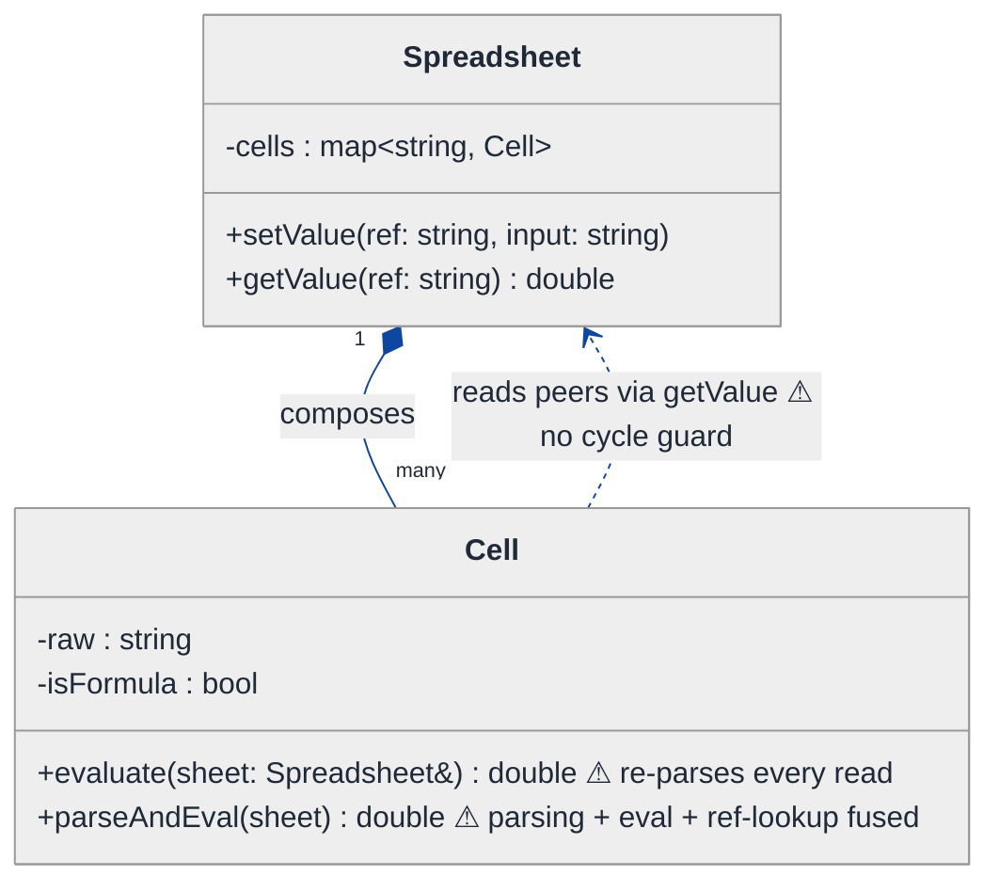
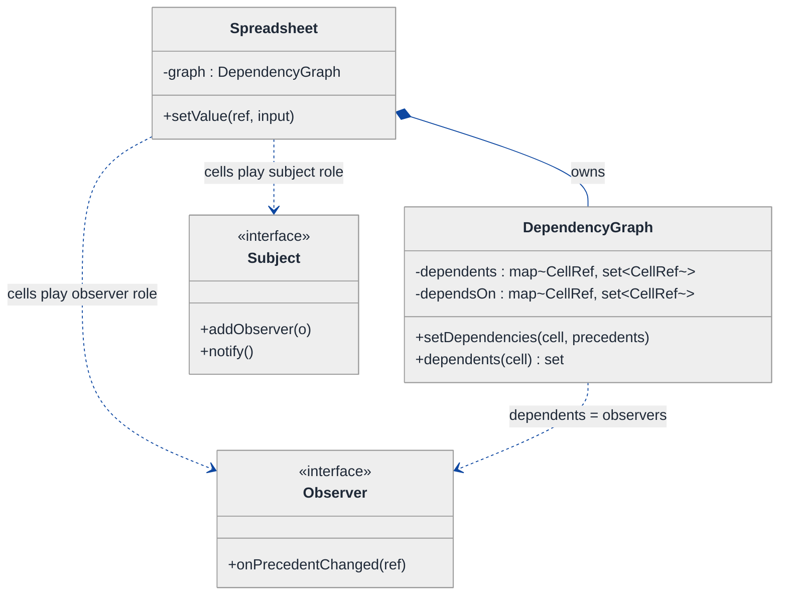
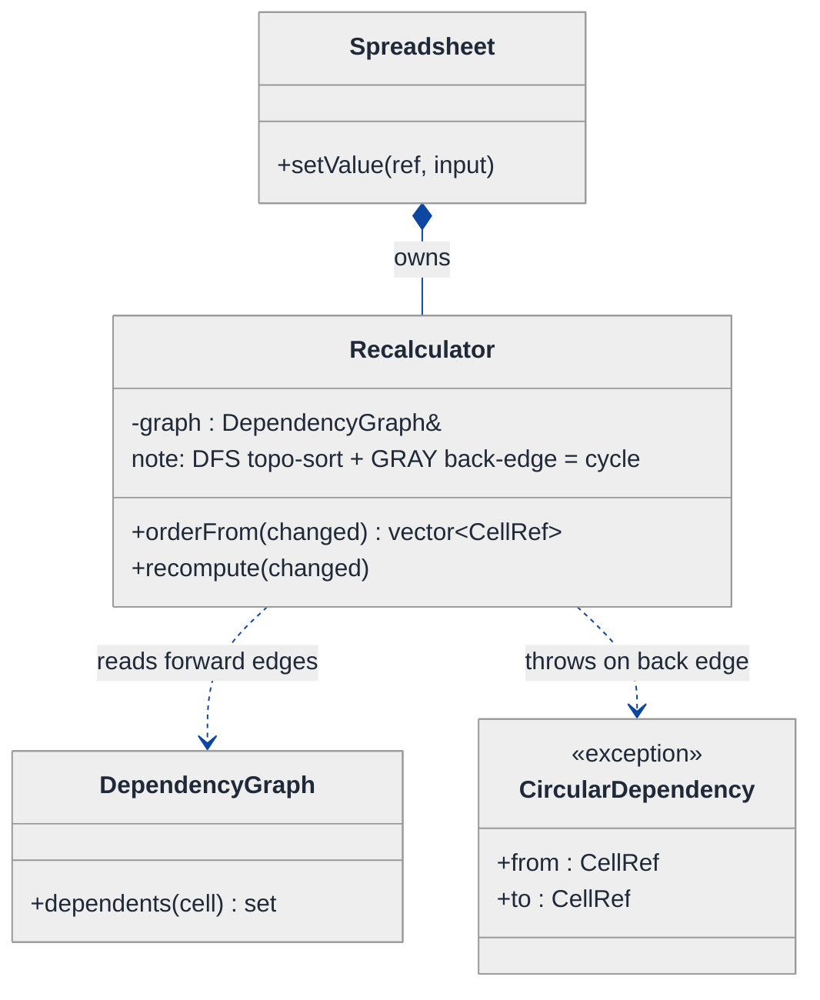
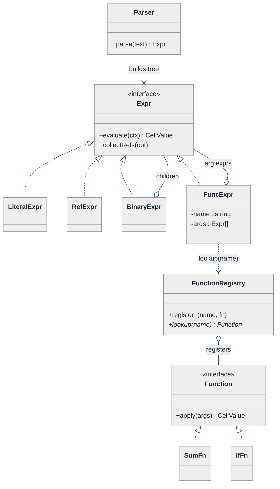
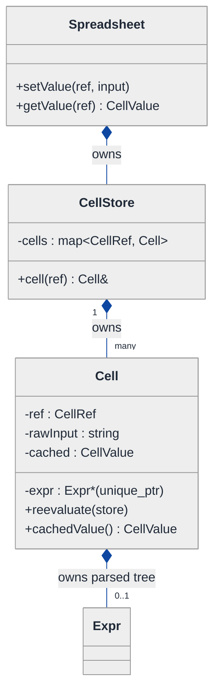
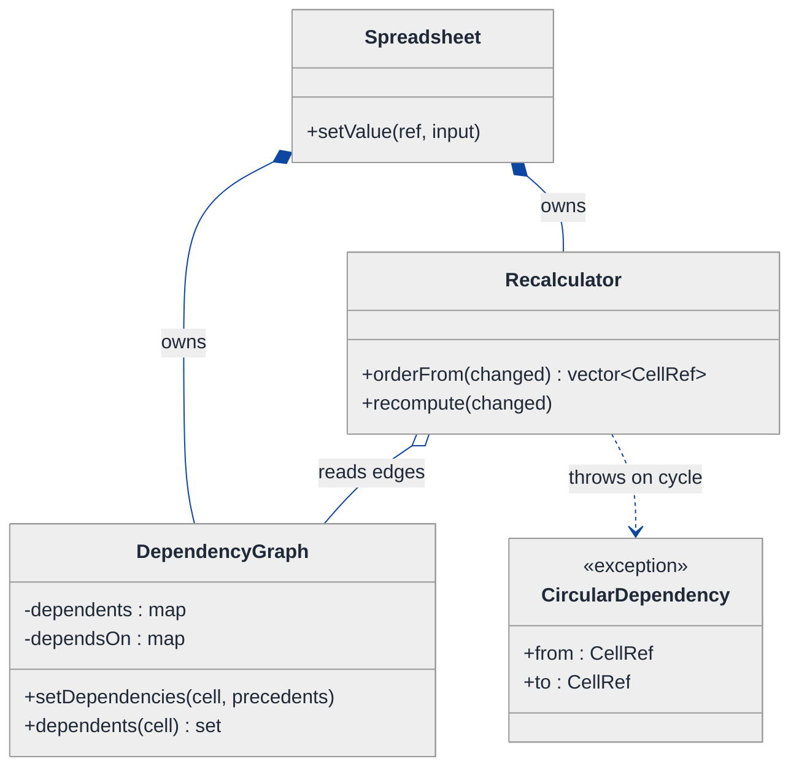
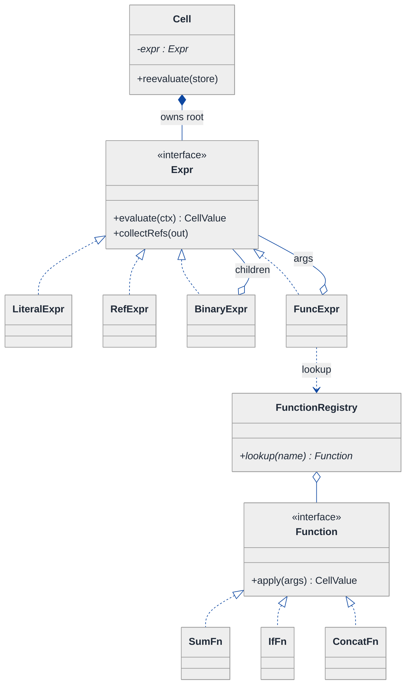
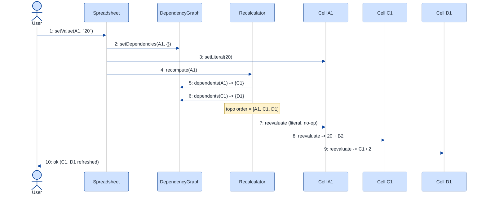
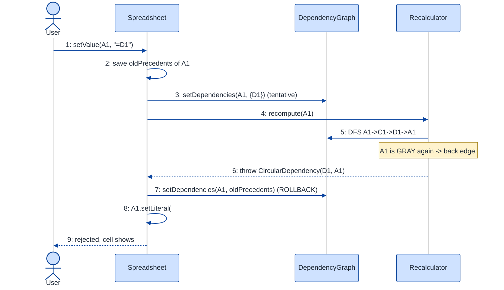

# Spreadsheet Application — LLD Walkthrough

> **Difficulty:** Hard · **Time:** ~45 min · **Pattern focus:** Observer (dependency propagation) + topological sort (recalc order + cycle detection) + parsing/evaluation (Interpreter / Strategy)
>
> **Problem source(s):** GID OB10 in [`./EXTRACTED_QUESTIONS.md`](./EXTRACTED_QUESTIONS.md), bucket `Observer_Pattern`. A senior-bar LLD that braids a GoF behavioral pattern with a graph algorithm.
>
> **Diagrams:** inline mermaid (renders natively in GitHub / VS Code). Light theme, soft pastels, no `look: handDrawn`.

---

## How to use this file

Paced for a candidate seeing "design a spreadsheet" for the first time. Reading time: ~45 minutes if you sketch each iteration by hand. **The lesson: a spreadsheet is not a grid of strings — it is a directed dependency graph that must recompute itself in the right order when a node changes. Don't reach for patterns up front. Build the naive cell-grid first, watch it die the moment one cell references another, and then reach for ONE idea at a time: Observer for "who do I notify," topological sort for "in what order," and a parse/evaluate split for "what does this formula mean."**

**Map of this file (15 sections):**

1. Problem statement + clarifying questions
2. Plain-English restatement
3. Why this matters
4. Mental model
5. Try it yourself first
6. Entity & verb extraction
7. **Iteration 1: the naive design** — a grid of cells, eager evaluation
8. **Where the naive design hurts** — five future requirements, one painful diff each
9. **Pivot 1: Observer for dependency propagation** — who recomputes when I change?
10. **Pivot 2: topological sort for recalc order + cycle detection** — in what order, and reject cycles
11. **Pivot 3: parse/evaluate split (Interpreter + Strategy)** — what does the formula MEAN?
12. Final class diagram (3 sub-views)
13. Skeleton code (C++)
14. Key flow — sequence diagram
15. Extensibility re-check + anti-patterns + how to think aloud + self-check

---

## 1. Problem statement + clarifying questions

**Prompt (typical phrasing):** "Design a spreadsheet application. A user can type a literal value (`42`, `"hello"`) or a formula (`=A1+B2*3`) into a cell. Formulas reference other cells. When a cell changes, every cell that depends on it must recompute automatically. Detect and reject circular dependencies (`A1 = B1`, `B1 = A1`)."

**Clarifying questions to ask BEFORE drawing anything:**

1. **Cell address space?** A finite grid (Excel-style `A1:Z100`) or sparse / unbounded? Sparse changes whether we store a 2D array or a hash map keyed by address.
2. **Formula grammar?** Just `+ - * /` with cell refs and numeric literals, or also functions (`SUM(A1:A10)`, `IF(...)`), ranges, string concatenation, absolute refs (`$A$1`)? This sizes the parser.
3. **Recalc model?** Recompute eagerly on every edit, or batch (mark dirty, recompute on read)? Eager is simpler; lazy scales.
4. **What happens on a cycle?** Reject the edit and keep the old value, or store the cycle and surface a `#CIRCULAR!` error in the cell (Excel does the latter)?
5. **Error propagation?** If `A1` is `#DIV/0!`, does `=A1+1` become `#DIV/0!` too (error contagion) or `0`?
6. **Concurrency?** Single-user single-threaded, or multiple editors (collaborative)? We'll assume single-threaded and note the locking story in §15.
7. **Undo/redo?** In scope? (We'll note where Command/Memento would attach but not build it.)

**Assumptions if interviewer dodges:** sparse address space (hash map keyed by `"A1"`), grammar = numeric literals + cell refs + `+ - * / ( )` plus a couple of functions to show extensibility, eager recalc, reject cycles by surfacing a `#CIRCULAR!` error and refusing to commit the bad formula, error contagion on, single-threaded.

---

## 2. Plain-English restatement

We're building the engine behind a spreadsheet's cells. A cell holds either a raw value or a formula. A formula can name other cells; its value is computed from theirs. The hard part is not arithmetic — it's the *plumbing*: when the user edits `A1`, the engine must find every cell that (transitively) reads `A1`, recompute them in an order where each cell is computed only after the cells it depends on, and do all of that without falling into an infinite loop when the references form a cycle. The design must let us add new formula functions and new recalc policies **without rewriting the cell or the engine**.

---

## 3. Why this matters

This question is a favorite because it forces three skills to cooperate in one design: a **behavioral GoF pattern** (Observer — the cell-change-fan-out), a **graph algorithm** (topological sort over the dependency DAG, plus cycle detection), and **language processing** (turning the string `"=A1+B2*3"` into something evaluable). Most candidates can do any one of these in isolation. The senior bar is recognizing that the spreadsheet IS a dependency graph, keeping the three concerns in separate collaborators, and deriving each from a concrete pain point rather than asserting "I'll use Observer."

---

## 4. Mental model

A spreadsheet is a **directed graph of cells**. An edge `A1 -> C1` means "C1's formula reads A1," i.e. C1 depends on A1. When A1's value changes, the change must flow *along the edges* to every downstream cell, and each downstream cell can only be safely recomputed once all of ITS inputs are fresh. That last clause is a topological order. A cycle in the graph means a cell (transitively) depends on itself — which has no defined value, so it must be rejected.

```
Real-world sketch (NOT a UML diagram yet):

   A1 = 10          B2 = 5
      \              /
       \            /
        ▼          ▼
        C1 = A1 + B2*3      (C1 depends on A1 and B2)
            \
             ▼
        D1 = C1 / 2          (D1 depends on C1)

  Edit A1 := 20  ──►  must recompute C1, THEN D1 (in that order).
  Edit A1 := =D1 ──►  A1→D1→C1→A1 forms a CYCLE  ──►  reject.
```

The KEY insight from this picture: there are three separable jobs. (a) **Who** must recompute when a cell changes — the set of downstream dependents (Observer / dependency tracking). (b) **In what order** — a topological sort of that downstream subgraph; the same machinery detects cycles. (c) **What value** each formula produces — parse the string into an expression tree, then evaluate it. We will bake "dependency graph vs. recompute order vs. formula meaning" into three collaborators.

---

## 5. Try it yourself first

> **Predict before reading on:**
>
> 1. List 4 nouns you'd promote to a class and 2 nouns you'd leave as fields.
> 2. **If editing one cell can force ten other cells to recompute, where does the list of "cells that depend on me" live — on the cell being edited, or somewhere central?** What goes wrong with each choice?
> 3. You type `=A1` into B1, then `=B1` into A1. At what exact moment should the system notice the cycle, and what should it do with the half-applied edit?

---

## 6. Entity & verb extraction

> **Mini-refresher: noun → class, but not every noun.**
>
> Naive OOD promotes every noun to a class. Senior OOD promotes a noun only if it has both BEHAVIOR and STATE that need to live together. "Column letter" stays a parsing detail; "Cell" becomes a class because it owns a value, a formula, and a dependency relationship.

**Nouns from the prompt:**

| Noun | Decision | Why |
|---|---|---|
| Spreadsheet | Class (top-level coordinator) | Owns cells, orchestrates edits and recalc |
| Cell | Class | Holds value/formula + its place in the graph |
| Cell address (`A1`) | Value type (`struct CellRef`) | Has no behavior beyond equality/hashing |
| Formula | Class (parsed) → an expression tree | Behavior = "evaluate me against the sheet" |
| Value | Variant type (`double` / `string` / error) | Data, not behavior |
| Dependency / reference | Edge in a graph (not a class) | Modeled by adjacency sets on the engine |
| Circular dependency | A *condition*, not a class | Detected by the sort, surfaced as an error value |
| Function (`SUM`) | Class (one per function) | Behavior varies per function → polymorphism |

**Verbs (and the class they live on):**

| Verb | Owner class (naive answer — we'll re-examine) |
|---|---|
| setValue(ref, input) | Spreadsheet |
| getValue(ref) | Spreadsheet → Cell |
| evaluate() | Cell / Formula |
| parse(text) | (naive) Cell; (later) a Parser |
| recalculate() | Spreadsheet |
| detectCycle() | Spreadsheet |
| notifyDependents() | Cell / Spreadsheet |

**We have NOT introduced any design patterns yet.** Pure nouns + verbs.

---

## 7. <a id="iter-1"></a>Iteration 1: the naive design

Let's write the simplest thing that could possibly work. A grid of cells; each cell stores either a number or a formula string; reading a cell parses-and-evaluates its formula on the spot, recursively pulling values from the cells it references. No patterns — just classes with methods.



**Reader's tour (read top to bottom; ~60 seconds).**

1. **At the top — `Spreadsheet` is the root.** It holds ONE field (`cells`, a map from address string to Cell) and exposes two public methods: `setValue` and `getValue`. There is NO dependency tracking, NO recalc order, NO cycle detection. Every decision is fused into `getValue`.

2. **The composition spine.** The filled diamond marks composition — the Spreadsheet OWNS its cells; if the sheet dies, the cells die with it. That part is fine and never changes.

3. **The Cell box — the trouble zone.** Look at the two warning markers (⚠):
   - `evaluate()` re-parses the formula string on **every single read**. Read a cell a thousand times, parse it a thousand times.
   - `parseAndEval()` fuses three responsibilities into one method: tokenizing the string, resolving cell references, and doing arithmetic.

4. **The dependency arrow points the WRONG way for safety.** `Cell ..> Spreadsheet` means a cell, mid-evaluation, calls back into `sheet.getValue("A1")` to pull a peer's value. There is **no guard** against `A1` asking for `B1` while `B1` is asking for `A1` — that's an unbounded recursion / stack overflow waiting to happen.

**What's deliberately missing.** No notion of "who depends on me." No recalc order. No cycle detection. No separation between parsing and evaluating. The naive design recomputes the ENTIRE transitive formula on every read and prays the references form no cycle.

Skeleton code for the naive design (C++):

```cpp
#include <string>
#include <unordered_map>
#include <stdexcept>
#include <cctype>

class Spreadsheet;  // forward

class Cell {
public:
    std::string raw;       // "42" or "=A1+B2"
    bool isFormula = false;

    // Re-parses AND re-evaluates on every call. No memo. No cycle guard.
    double evaluate(Spreadsheet& sheet) const;  // defined after Spreadsheet
};

class Spreadsheet {
public:
    void setValue(const std::string& ref, const std::string& input) {
        Cell c;
        c.raw = input;
        c.isFormula = (!input.empty() && input[0] == '=');
        cells_[ref] = c;                 // just overwrite. no recalc bookkeeping.
    }

    double getValue(const std::string& ref) {
        auto it = cells_.find(ref);
        if (it == cells_.end()) return 0.0;
        return it->second.evaluate(*this);   // recompute from scratch, every time
    }

    std::unordered_map<std::string, Cell> cells_;
};

// Hand-rolled, fused parse+eval. Resolves refs by recursively calling getValue.
double Cell::evaluate(Spreadsheet& sheet) const {
    if (!isFormula) return raw.empty() ? 0.0 : std::stod(raw);

    // ... tokenize raw.substr(1), and for any token like "A1" call
    //     sheet.getValue("A1")  -> which may recurse forever on a cycle.
    //     arithmetic for + - * / done inline with a tiny shunting-yard.
    // (parser body elided — the point is it's all in ONE method)
    return 0.0;  // elided
}
```

**This works** for a flat sheet of independent cells and shallow formulas. It has zero design patterns. We can set and read values. So what's wrong with it?

---

## 8. <a id="naive-pain"></a>Where the naive design hurts

The interviewer slides five new requirements across the desk: "Walk me through what changes."

### Change A: "Auto-recalc — when A1 changes, every dependent cell must reflect it immediately, and we must NOT recompute the whole sheet"

In the naive design:
- "Reflect it immediately" is faked by re-evaluating on *read*. But there's no way to know WHICH cells changed — so a UI that wants to repaint only the affected cells has no signal. There is no "A1 changed; here are its dependents" event.
- To recompute only the affected cells, you'd need a list of "cells that read A1." **That list does not exist anywhere.** You'd bolt a reverse-lookup scan over every cell's formula string on each edit — O(N) string re-parsing per keystroke.
- Smell: **no dependency tracking; change propagation is impossible to do efficiently.**

### Change B: "Detect circular references and reject them (`A1=B1`, `B1=A1`)"

In the naive design:
- `getValue("A1")` recurses into `getValue("B1")` which recurses into `getValue("A1")` → **stack overflow / hang**. There is no visited-set, no in-progress marker.
- You could thread a `std::set<std::string>& visiting` through every `evaluate` call, but that pollutes the eval signature and only catches the cycle *at read time*, after the bad formula is already committed.
- Smell: **cycle detection is impossible without a graph; bolting a visited-set into the evaluator is a band-aid.**

### Change C: "Stop re-parsing on every read — formulas are parsed once, evaluated many times"

In the naive design:
- `Cell::evaluate` tokenizes the raw string every call. A formula read in a chart, a pivot, and a print job is parsed three times.
- To cache, you'd memoize the parsed form — but parsing and evaluation are **fused in one method**, so there's nothing to cache independently.
- Smell: **parse and evaluate are not separable, so neither can be optimized or tested alone.**

### Change D: "Add functions: `SUM(A1:A10)`, `IF(cond, a, b)`, string concat"

In the naive design:
- The fused parser is a hand-rolled shunting-yard for `+ - * /`. Adding `SUM` means teaching that one method about ranges; adding `IF` means teaching it about conditionals and short-circuiting; string concat means the return type can no longer be `double`.
- Every new function is **surgery inside the one giant `evaluate` method**, and the `double` return type has to widen to a variant.
- Smell: **tag-driven growth of a single method; no extension point for a new operation.**

### Change E: "Show `#DIV/0!` and propagate errors (`=A1+1` where A1 is an error becomes an error)"

In the naive design:
- The return type is `double`. There is no room for `#DIV/0!`, `#REF!`, `#CIRCULAR!`. You'd sentinel with NaN and lose the error kind.
- Smell: **value model can't represent the domain (errors are first-class spreadsheet values).**

### The pattern of pain

| Change | What it touches in the naive design | Smell |
|---|---|---|
| A. Auto-recalc | reverse-scan all cells per edit | No dependency graph; can't fan out a change |
| B. Cycle detection | thread a visited-set through `evaluate` | No graph to run cycle detection on |
| C. Parse once | the fused `evaluate` method | Parse + eval inseparable |
| D. New functions | the one giant `evaluate` method | No extension point per operation |
| E. Errors | the `double` return type | Value model too narrow |

**Three axes of pain dominate.** (1) There is no dependency graph, so neither propagation (A) nor cycle detection (B) is possible. (2) Recompute happens in no defined order — and on read, redundantly (C, and A again). (3) Formula meaning is hardcoded in one fused method with a too-narrow value type (D, E).

> **Pivot question:** "What pattern lets a changed object notify an open-ended set of dependents without knowing who they are? What algorithm computes a safe recompute order over a dependency graph AND tells me when that graph has a cycle? And how do I represent a formula so that parsing happens once and each operation is its own extensible unit?"
>
> The answers are **Observer** (for the notify-my-dependents fan-out), **topological sort** (for recompute order *and* cycle detection — same DFS), and a **parse/evaluate split** with an expression tree (Interpreter pattern) plus pluggable functions (Strategy). Let's take them one painful axis at a time, starting with the dependency graph — because both A and B collapse into it.

---

## 9. <a id="pivot-1"></a>Pivot 1: Observer for dependency propagation

The most painful axis is "no dependency graph." Changes A and B both die for the same reason: nothing records *who reads whom*. Fix that first.

> **Mini-refresher: Observer pattern.**
>
> A **subject** keeps a list of **observers** and, when its state changes, calls a notify hook on each — without knowing their concrete types. The subject pushes "I changed"; observers react. The coupling is one-way: the subject knows only an abstract observer interface.
>
> Quick example: a `StockPrice` subject notifies a `Chart`, a `Ledger`, and an `Alert` whenever the price ticks. It just calls `obs->onChanged()` on each; it has no idea what they do.

**Why Observer fits a spreadsheet.** A cell is BOTH a subject (other cells observe it) and an observer (it watches the cells its formula references). When `A1`'s value changes, `A1` must notify the cells that depend on it — `C1`, etc. The dependent cells are an open-ended set the editor never enumerates by hand: it falls out of the formulas. That is the Observer relationship, with one spreadsheet-specific twist we'll handle in Pivot 2 (notification ORDER matters here, unlike a plain GUI observer).

We model the graph with two adjacency sets per cell, maintained by the `DependencyGraph` collaborator whenever a formula is (re)parsed:

- `dependsOn(C1) = {A1, B2}` — the cells C1 reads (its **precedents**).
- `dependents(A1) = {C1, ...}` — the cells that read A1 (its **observers**).

> **Mini-refresher: why a `weak_ptr` / non-owning back-reference for the dependents set.**
>
> The Spreadsheet OWNS the cells (composition, `unique_ptr`). The `dependents` edges are *back-references* between owned cells — if we stored owning pointers there, we'd create ownership cycles and double-frees. Back-edges in an Observer graph are non-owning: a raw `CellRef` key (or `weak_ptr` if you hand out cell handles). The owner stays the Spreadsheet; the graph only borrows.

**The refactor (just the dependency-tracking slice):**

```cpp
struct CellRef {                 // value type: "A1" decomposed
    int col; int row;
    bool operator==(const CellRef&) const = default;
};
struct CellRefHash { size_t operator()(const CellRef&) const; };

class DependencyGraph {
public:
    // Called whenever a cell's formula is (re)parsed. Replaces old edges.
    void setDependencies(const CellRef& cell,
                         const std::vector<CellRef>& precedents) {
        // remove this cell from the dependents-set of its OLD precedents
        for (const auto& old : dependsOn_[cell]) dependents_[old].erase(cell);
        dependsOn_[cell] = {precedents.begin(), precedents.end()};
        // register as a dependent (observer) of each new precedent
        for (const auto& p : precedents) dependents_[p].insert(cell);
    }

    const std::unordered_set<CellRef, CellRefHash>&
    dependents(const CellRef& c) const {                  // who observes c
        static const std::unordered_set<CellRef, CellRefHash> empty;
        auto it = dependents_.find(c);
        return it == dependents_.end() ? empty : it->second;
    }
    const std::unordered_set<CellRef, CellRefHash>&
    dependsOn(const CellRef& c) const;                    // c's precedents (elided)

private:
    std::unordered_map<CellRef, std::unordered_set<CellRef, CellRefHash>, CellRefHash> dependents_;
    std::unordered_map<CellRef, std::unordered_set<CellRef, CellRefHash>, CellRefHash> dependsOn_;
};
```

**What changed — visualized.** Just the dependency slice:



**Tour of the after-state.**

1. **The Spreadsheet now owns a `DependencyGraph`.** This is the single source of truth for "who reads whom." It is rebuilt incrementally whenever a formula is parsed — `setDependencies(cell, precedents)` swaps the old edges for new ones (so deleting a reference removes the edge).

2. **Two maps, two directions.** `dependsOn` (precedents — what I read) and `dependents` (observers — who reads me). The reverse map `dependents` is the Observer registry: it answers "when I change, who do I notify?" in O(1).

3. **The Subject / Observer roles are PLAYED by cells, not separate classes.** A cell is a subject to its dependents and an observer of its precedents. Rather than two class hierarchies, the graph encodes both roles as edges. The conceptual pattern is Observer; the implementation is an adjacency structure because the observers are themselves subjects (this is the classic "Observer over a graph, not a star" situation).

4. **Change A now lands.** Editing `A1` → look up `graph.dependents(A1)` → that's exactly the set to recompute. No O(N) scan; the dependents set is maintained at parse time.

5. **Change B now becomes possible** — but not yet solved. We have the graph; running cycle detection on it is Pivot 2's job. (Pivot 1 stands alone: it gives us the graph. Don't conflate it with the ordering algorithm.)

**Pattern-discrimination cheatsheet — Observer vs Mediator.**
- *Observer:* subjects notify their own observers directly; the wiring is peer-to-peer (each cell knows its dependents).
- *Mediator:* a central hub owns all the wiring; objects talk only to the hub, never to each other.
- *Rule of thumb:* if the "who notifies whom" graph is data-driven and sparse (cell → its formula's refs) → Observer over a graph. If every object would otherwise talk to every other and you want to centralize that into one coordinator → Mediator.

We chose Observer because the dependency edges are intrinsic to each formula (A1's dependents are derivable from formulas, not assigned by a hub). A Mediator would force every value change through one bottleneck object that re-derives the same graph — the graph IS the wiring, so Observer-over-a-graph is the honest model.

---

## 10. <a id="pivot-2"></a>Pivot 2: topological sort for recalc order + cycle detection

Pivot 1 gave us the dependent set, but two problems remain. First, **order**: if A1 feeds C1 and C1 feeds D1, naively notifying dependents breadth-first can recompute D1 before C1 is fresh, producing a value computed from a stale input. Second, **cycles** (Change B): we have the graph but no detector.

Both fall out of the SAME algorithm.

> **Mini-refresher: topological sort + cycle detection (one DFS).**
>
> A topological sort of a DAG orders nodes so every edge `u -> v` has `u` before `v`. Run a DFS coloring nodes WHITE (unseen) / GRAY (on the current recursion stack) / BLACK (finished). If DFS ever reaches a GRAY node, you've found a **back edge** — that's a cycle. Otherwise, pushing nodes onto a stack as they turn BLACK and reversing gives a valid topological order. So the same traversal answers "in what order do I recompute?" and "is there a cycle?" in O(V + E).

**Why topo-sort fits recalc.** The recompute order must respect dependencies: a cell is computed only after all its precedents. That is precisely a topological order of the affected subgraph. And the spreadsheet's hard constraint — no circular references — is exactly "the graph must be a DAG," which the same DFS verifies. Two requirements, one traversal.

**The crucial scoping detail:** on an edit to `A1`, you do NOT topo-sort the whole sheet. You sort only the **forward closure of A1** — A1 plus everything transitively in `dependents(A1)`. That keeps recalc proportional to the affected region, not the sheet size.

**The refactor (the recalc engine):**

```cpp
enum class Mark { WHITE, GRAY, BLACK };

class Recalculator {
public:
    Recalculator(DependencyGraph& g, CellStore& store) : g_(g), store_(store) {}

    // Returns cells in dependency order (precedents first); throws on cycle.
    std::vector<CellRef> orderFrom(const CellRef& changed) {
        std::unordered_map<CellRef, Mark, CellRefHash> color;
        std::vector<CellRef> finished;                       // post-order

        std::function<void(const CellRef&)> dfs = [&](const CellRef& u) {
            color[u] = Mark::GRAY;                            // enter recursion stack
            for (const auto& v : g_.dependents(u)) {          // follow forward edges
                auto c = color.count(v) ? color[v] : Mark::WHITE;
                if (c == Mark::GRAY)                           // back edge => cycle!
                    throw CircularDependency(u, v);
                if (c == Mark::WHITE) dfs(v);
            }
            color[u] = Mark::BLACK;
            finished.push_back(u);                            // finished => push
        };

        dfs(changed);
        std::reverse(finished.begin(), finished.end());       // topological order
        return finished;                                      // [changed, ...downstream]
    }

    void recompute(const CellRef& changed) {
        auto order = orderFrom(changed);                      // throws if cyclic
        for (const auto& ref : order)                         // precedents first
            store_.cell(ref).reevaluate(store_);              // recompute in order
    }
private:
    DependencyGraph& g_;
    CellStore&       store_;
};
```

**What changed — visualized.** The recalc engine over the dependency graph:



**Tour of the after-state.**

1. **`Recalculator` is a new collaborator** owned by the Spreadsheet. It reads the `DependencyGraph` (does not own it) and turns "A1 changed" into an ordered recompute plan.

2. **`orderFrom` is the whole brain.** A three-color DFS over the FORWARD edges (`dependents`) starting at the changed cell. Post-order push + reverse = topological order, where the changed cell comes first and each downstream cell comes after all of its already-fresh precedents.

3. **Cycle detection is FREE.** The same DFS, on hitting a GRAY (on-stack) node, has found a back edge — a circular dependency — and throws `CircularDependency(from, to)`. No separate pass, no separate visited-set bolted into the evaluator.

4. **Commit-or-reject is now clean (answers Change B and clarifying Q4).** `setValue` parses the new formula, tentatively updates the graph edges, then calls `recompute`. If `orderFrom` throws, the Spreadsheet rolls back the edge change and either restores the old formula or writes a `#CIRCULAR!` error value into the edited cell — **the bad formula never half-applies.**

5. **Scope is the closure, not the sheet.** The DFS only walks from the changed cell outward, so editing a leaf cell with no dependents is O(1); editing a heavily-referenced input recomputes exactly its downstream cone.

**Pattern-discrimination cheatsheet — DFS topo-sort vs Kahn's algorithm (BFS in-degree).**
- *DFS coloring:* recursion + GRAY-node detection; cycle is reported as the specific back edge (great for an error message naming the two cells).
- *Kahn's (in-degree):* repeatedly remove zero-in-degree nodes; if nodes remain, a cycle exists — but Kahn's tells you a cycle exists, not *which* edge closed it, and needs the whole subgraph's in-degrees up front.
- *Rule of thumb:* want the offending edge for a precise `#CIRCULAR!` message and natural recursion over the dependents map → DFS coloring. Want iterative, stack-safe processing of a huge batch with no deep recursion → Kahn's (and guard against stack overflow by making the DFS explicit).

We chose DFS coloring because surfacing *which two cells* form the cycle makes a better error and the recursion maps directly onto the `dependents` adjacency we already built. (For a million-cell recalc you'd convert the recursion to an explicit stack to avoid blowing the call stack — a noted refinement, not a redesign.)

---

## 11. <a id="pivot-3"></a>Pivot 3: parse/evaluate split (Interpreter + Strategy)

Changes A and B are solved. Changes C (parse once), D (new functions), and E (errors) remain — all about *what a formula means*. The naive `evaluate` fused tokenizing, reference resolution, and arithmetic into one `double`-returning method. Split it in two: **parse once** into an expression tree, **evaluate many times** by walking that tree.

> **Mini-refresher: Interpreter pattern.**
>
> Represent a grammar as a class hierarchy where each node has an `evaluate(context)` method. A `+` becomes a `BinaryOp` node with two child expressions; a cell reference becomes a `RefExpr` node; a literal becomes a `LiteralExpr` node. Parsing builds the tree once; evaluating walks it. The tree IS the parsed formula.

> **Mini-refresher: Strategy pattern (for functions).**
>
> Encapsulate an algorithm behind an interface so it can be swapped/registered at runtime. Here each spreadsheet function (`SUM`, `IF`, `CONCAT`) is a `Function` strategy registered in a `FunctionRegistry`. The evaluator looks the name up and calls it — it never switches on the function name.

**Why this split.** Parsing and evaluating change for different reasons (parsing changes with grammar; evaluation changes with semantics and the live cell values). Separating them lets us cache the parsed tree (Change C), add a function by *registering a new strategy* instead of editing a giant switch (Change D), and make every node return a `CellValue` variant that carries errors (Change E).

First, fix the value model so errors are first-class (Change E):

```cpp
enum class ErrorKind { NONE, DIV_ZERO, REF, CIRCULAR, PARSE, VALUE };
struct CellValue {
    std::variant<double, std::string> data;
    ErrorKind error = ErrorKind::NONE;
    bool isError() const { return error != ErrorKind::NONE; }
    static CellValue err(ErrorKind k) { return CellValue{0.0, k}; }
};
```

**The expression tree (Interpreter) + the function strategy:**

```cpp
struct EvalContext {                       // what an expression needs to evaluate
    CellStore& store;                      // to resolve references
    FunctionRegistry& fns;                 // to dispatch SUM/IF/...
};

class Expr {                               // the Interpreter node interface
public:
    virtual ~Expr() = default;
    virtual CellValue evaluate(EvalContext& ctx) const = 0;
    virtual void collectRefs(std::vector<CellRef>& out) const = 0;  // for the graph
};

class LiteralExpr : public Expr {
public:
    explicit LiteralExpr(CellValue v) : v_(std::move(v)) {}
    CellValue evaluate(EvalContext&) const override { return v_; }
    void collectRefs(std::vector<CellRef>&) const override {}        // no refs
private:
    CellValue v_;
};

class RefExpr : public Expr {              // a cell reference like A1
public:
    explicit RefExpr(CellRef r) : ref_(r) {}
    CellValue evaluate(EvalContext& ctx) const override {
        return ctx.store.cell(ref_).cachedValue();   // already recomputed in topo order
    }
    void collectRefs(std::vector<CellRef>& out) const override { out.push_back(ref_); }
private:
    CellRef ref_;
};

class BinaryExpr : public Expr {           // a + b, a / b, ...
public:
    BinaryExpr(char op, std::unique_ptr<Expr> l, std::unique_ptr<Expr> r)
        : op_(op), l_(std::move(l)), r_(std::move(r)) {}
    CellValue evaluate(EvalContext& ctx) const override {
        auto a = l_->evaluate(ctx), b = r_->evaluate(ctx);
        if (a.isError()) return a;                       // error contagion (Change E)
        if (b.isError()) return b;
        double x = std::get<double>(a.data), y = std::get<double>(b.data);
        if (op_ == '/' && y == 0) return CellValue::err(ErrorKind::DIV_ZERO);
        switch (op_) { case '+': return {x + y}; case '-': return {x - y};
                       case '*': return {x * y}; case '/': return {x / y}; }
        return CellValue::err(ErrorKind::PARSE);
    }
    void collectRefs(std::vector<CellRef>& out) const override {
        l_->collectRefs(out); r_->collectRefs(out);
    }
private:
    char op_; std::unique_ptr<Expr> l_, r_;
};
// FuncExpr (holds a function name + arg Exprs; looks up the strategy) elided

// --- the function Strategy hierarchy ---
class Function {
public:
    virtual ~Function() = default;
    virtual CellValue apply(const std::vector<CellValue>& args) const = 0;
};
class SumFn : public Function {
public:
    CellValue apply(const std::vector<CellValue>& args) const override {
        double total = 0;
        for (const auto& a : args) { if (a.isError()) return a;
            total += std::get<double>(a.data); }
        return CellValue{total};
    }
};
// IfFn, ConcatFn elided

class FunctionRegistry {                   // register a new function = one insert
public:
    void register_(std::string name, std::unique_ptr<Function> fn) {
        fns_[std::move(name)] = std::move(fn);
    }
    const Function* lookup(const std::string& name) const {
        auto it = fns_.find(name);
        return it == fns_.end() ? nullptr : it->second.get();
    }
private:
    std::unordered_map<std::string, std::unique_ptr<Function>> fns_;
};
```

The `Parser` builds the `Expr` tree once and hands it to the cell. The cell stores `std::unique_ptr<Expr>` plus a cached `CellValue`. **`reevaluate` just walks the cached tree** — no re-parsing (Change C). `collectRefs` walks the same tree to feed `DependencyGraph::setDependencies` (so the graph and the evaluator agree on what a formula reads, by construction).

**What changed — visualized.** The formula slice:



**Tour of the after-state.**

1. **`Parser` builds an `Expr` tree once.** The string `"=A1+B2*3"` becomes `BinaryExpr('+', RefExpr(A1), BinaryExpr('*', RefExpr(B2), LiteralExpr(3)))`. The cell stores that tree; reads walk it. Change C solved.

2. **`Expr` is the Interpreter node interface.** `LiteralExpr`, `RefExpr`, `BinaryExpr`, `FuncExpr` each implement `evaluate(ctx)` and `collectRefs(out)`. The second method is what lets the dependency graph (Pivot 1) and the evaluator stay in sync — both read the same tree.

3. **`FuncExpr` does NOT switch on the function name.** It looks the name up in the `FunctionRegistry` and calls `apply`. Adding `SUM`, `IF`, `CONCAT` = register one `Function` strategy. Change D solved — no surgery in a giant method.

4. **Every node returns `CellValue`, not `double`.** A `CellValue` is a variant (`double` | `string`) plus an `ErrorKind`. `BinaryExpr` short-circuits on an error operand (`if (a.isError()) return a;`) — that's error contagion. Change E solved.

5. **`RefExpr::evaluate` reads the precedent's CACHED value**, not a recursive recompute. Because the `Recalculator` (Pivot 2) computes cells in topological order, every precedent is already fresh by the time a dependent's tree is walked. The three pivots interlock: graph (who) → topo order (when) → tree walk (what).

**Pattern-discrimination cheatsheet — Interpreter vs Strategy here.**
- *Interpreter:* the formula's STRUCTURE (`+`, refs, nesting) is a class-per-node tree we walk recursively.
- *Strategy:* a single pluggable OPERATION (`SUM`, `IF`) behind one interface, selected by name at runtime.
- *Rule of thumb:* recursive grammar with nested sub-expressions → Interpreter tree. Flat catalog of interchangeable named operations → Strategy registry. A spreadsheet uses BOTH: the tree is Interpreter; each function leaf delegates to a Strategy.

---

## 12. <a id="fig-class-diagram"></a>Final class diagram

Showing everything in one diagram becomes a wall of boxes. Here are **three focused sub-views**: the data spine, the recalc engine, and the formula model. Read them in order; the structural insight at the end ties them together.

### 12.1 The data spine — what the Spreadsheet OWNS



**Tour of 12.1.** The Spreadsheet owns a `CellStore` (the sparse map from `CellRef` to `Cell`). Each `Cell` owns its parsed `Expr` tree (`unique_ptr`, 0..1 — literals have no tree) and a cached `CellValue`. The filled diamonds mark composition: kill the Spreadsheet and every cell and every expression tree dies with it. This spine is the only ownership in the design — everything else borrows.

### 12.2 The recalc engine — Observer graph + topological sort



**Tour of 12.2.**

1. **Spreadsheet owns both the graph and the recalculator** (filled diamonds). The graph is the data (who depends on whom); the recalculator is the algorithm (in what order, is it acyclic).

2. **The open diamond from Recalculator to DependencyGraph marks aggregation** — the recalculator USES the graph but doesn't own it. One graph, one recalculator, both lifetime-managed by the Spreadsheet.

3. **`setDependencies` is the Observer-registration step.** Each time a formula is parsed, the cell's precedents (from `Expr::collectRefs`) replace its old edges. The reverse `dependents` map is the observer list.

4. **`orderFrom` does double duty** — topological order (the return value) and cycle detection (the `CircularDependency` throw). Editing a cell walks only the forward closure from that cell.

5. **The cycle exception names the offending edge** (`from`, `to`), so the Spreadsheet can write a precise `#CIRCULAR!` and roll back the edit.

### 12.3 The formula model — Interpreter tree + Function strategies



**Tour of 12.3.**

1. **Cell owns the root `Expr`.** The tree is built once by the Parser and cached. `reevaluate` walks it; no re-parse.

2. **Four Interpreter node types.** `LiteralExpr` (a value), `RefExpr` (a cell reference, reads a cached precedent), `BinaryExpr` (an operator with two child `Expr`s — note the aggregation diamond, it composes sub-expressions), `FuncExpr` (a named call with arg `Expr`s).

3. **`FuncExpr` delegates to a `Function` strategy via the registry.** This is the seam where new functions plug in without touching the tree or the parser's core. The registry maps name → strategy.

4. **Three sample functions** hang off the `Function` interface. Each is one self-contained class.

5. **`collectRefs` (on every Expr) is the bridge to 12.2.** Walking the tree to gather `RefExpr` addresses is exactly what feeds `DependencyGraph::setDependencies`. The formula model and the recalc engine never disagree about a cell's precedents because both derive them from the same tree.

### Structural insight (ties 12.1 + 12.2 + 12.3 together)

| Concern | Pattern used | Why |
|---|---|---|
| **Storage** (cells, values) | Plain ownership (composition) | Cells are owned data; the only true ownership in the design |
| **Who recomputes** (dependents) | Observer over a graph | Change fans out to a data-driven, sparse dependent set |
| **In what order + is it legal** | Topological sort (DFS coloring) | One DFS gives recompute order AND cycle detection |
| **What a formula means** | Interpreter (tree) + Strategy (functions) | Recursive grammar = tree; pluggable named ops = strategies |

The big lesson: **a spreadsheet is a dependency graph wearing a grid costume.** The grid (12.1) is just storage. The intelligence is in the graph + ordering (12.2) and the formula semantics (12.3). Keep those three concerns in separate collaborators and every future requirement lands as one new class — a new `Function`, a new `Expr` node, or a swap of the recalc policy.

---

## 13. Skeleton code (C++)

> Show the SHAPES, not the full impl. The parser body, range handling, and most functions are `// elided`.

```cpp
#include <memory>
#include <optional>
#include <string>
#include <unordered_map>
#include <unordered_set>
#include <variant>
#include <vector>
#include <functional>
#include <algorithm>
#include <stdexcept>

// ── Value model (errors are first-class) ────────────────────────────
enum class ErrorKind { NONE, DIV_ZERO, REF, CIRCULAR, PARSE, VALUE };
struct CellValue {
    std::variant<double, std::string> data{0.0};
    ErrorKind error = ErrorKind::NONE;
    bool isError() const { return error != ErrorKind::NONE; }
    static CellValue err(ErrorKind k) { return CellValue{0.0, k}; }
};

// ── Address value type ──────────────────────────────────────────────
struct CellRef {
    int col = 0, row = 0;
    bool operator==(const CellRef& o) const { return col == o.col && row == o.row; }
};
struct CellRefHash {
    size_t operator()(const CellRef& r) const { return (size_t(r.col) << 20) ^ size_t(r.row); }
};

// ── Forward declarations ────────────────────────────────────────────
class CellStore;
class FunctionRegistry;

// ── Interpreter: the expression tree ────────────────────────────────
struct EvalContext { CellStore& store; FunctionRegistry& fns; };

class Expr {
public:
    virtual ~Expr() = default;
    virtual CellValue evaluate(EvalContext& ctx) const = 0;
    virtual void collectRefs(std::vector<CellRef>& out) const = 0;
};

class RefExpr : public Expr {                       // a cell reference
public:
    explicit RefExpr(CellRef r) : ref_(r) {}
    CellValue evaluate(EvalContext& ctx) const override;          // reads cached value
    void collectRefs(std::vector<CellRef>& out) const override { out.push_back(ref_); }
private:
    CellRef ref_;
};

class BinaryExpr : public Expr {                    // a + b, a / b ...
public:
    BinaryExpr(char op, std::unique_ptr<Expr> l, std::unique_ptr<Expr> r)
        : op_(op), l_(std::move(l)), r_(std::move(r)) {}
    CellValue evaluate(EvalContext& ctx) const override {
        auto a = l_->evaluate(ctx); if (a.isError()) return a;     // contagion
        auto b = r_->evaluate(ctx); if (b.isError()) return b;
        double x = std::get<double>(a.data), y = std::get<double>(b.data);
        if (op_ == '/' && y == 0) return CellValue::err(ErrorKind::DIV_ZERO);
        switch (op_) { case '+': return {x + y}; case '-': return {x - y};
                       case '*': return {x * y}; case '/': return {x / y}; }
        return CellValue::err(ErrorKind::PARSE);
    }
    void collectRefs(std::vector<CellRef>& out) const override {
        l_->collectRefs(out); r_->collectRefs(out);
    }
private:
    char op_; std::unique_ptr<Expr> l_, r_;
};
// class LiteralExpr, class FuncExpr  // elided (same shape)

// ── Strategy: pluggable functions ───────────────────────────────────
class Function {
public:
    virtual ~Function() = default;
    virtual CellValue apply(const std::vector<CellValue>& args) const = 0;
};
class SumFn : public Function {
public:
    CellValue apply(const std::vector<CellValue>& args) const override {
        double t = 0; for (auto& a : args) { if (a.isError()) return a;
            t += std::get<double>(a.data); } return CellValue{t};
    }
};
// class IfFn, class ConcatFn  // elided

class FunctionRegistry {
public:
    void register_(std::string name, std::unique_ptr<Function> fn) { fns_[std::move(name)] = std::move(fn); }
    const Function* lookup(const std::string& n) const {
        auto it = fns_.find(n); return it == fns_.end() ? nullptr : it->second.get();
    }
private:
    std::unordered_map<std::string, std::unique_ptr<Function>> fns_;
};

// ── Parser: string -> Expr tree (built once) ────────────────────────
class Parser {
public:
    explicit Parser(const FunctionRegistry& fns) : fns_(fns) {}
    std::unique_ptr<Expr> parse(const std::string& formulaBody) const;  // recursive descent — elided
private:
    const FunctionRegistry& fns_;
};

// ── Cell: owns its parsed tree + cached value ───────────────────────
class Cell {
public:
    explicit Cell(CellRef ref) : ref_(ref) {}
    void setExpr(std::unique_ptr<Expr> e) { expr_ = std::move(e); }
    void setLiteral(CellValue v) { expr_.reset(); cached_ = std::move(v); }
    void reevaluate(CellStore& store);                 // walks expr_, updates cached_
    CellValue cachedValue() const { return cached_; }
    const Expr* expr() const { return expr_.get(); }
    CellRef ref() const { return ref_; }
private:
    CellRef               ref_;
    std::unique_ptr<Expr> expr_;       // null for a literal cell
    CellValue             cached_;
};

// ── CellStore: sparse grid ──────────────────────────────────────────
class CellStore {
public:
    Cell& cell(const CellRef& r) {
        auto it = cells_.find(r);
        if (it == cells_.end()) it = cells_.emplace(r, Cell{r}).first;
        return it->second;
    }
private:
    std::unordered_map<CellRef, Cell, CellRefHash> cells_;
};

// ── Observer graph ──────────────────────────────────────────────────
class DependencyGraph {
public:
    void setDependencies(const CellRef& cell, const std::vector<CellRef>& precedents) {
        for (auto& old : dependsOn_[cell]) dependents_[old].erase(cell);
        dependsOn_[cell] = {precedents.begin(), precedents.end()};
        for (auto& p : precedents) dependents_[p].insert(cell);
    }
    const std::unordered_set<CellRef, CellRefHash>& dependents(const CellRef& c) const {
        static const std::unordered_set<CellRef, CellRefHash> empty;
        auto it = dependents_.find(c); return it == dependents_.end() ? empty : it->second;
    }
private:
    using Set = std::unordered_set<CellRef, CellRefHash>;
    std::unordered_map<CellRef, Set, CellRefHash> dependents_, dependsOn_;
};

// ── Recalculator: topo-sort + cycle detection ───────────────────────
struct CircularDependency : std::runtime_error {
    CellRef from, to;
    CircularDependency(CellRef f, CellRef t) : std::runtime_error("circular"), from(f), to(t) {}
};
enum class Mark { WHITE, GRAY, BLACK };

class Recalculator {
public:
    Recalculator(DependencyGraph& g, CellStore& s) : g_(g), store_(s) {}
    std::vector<CellRef> orderFrom(const CellRef& changed) const {
        std::unordered_map<CellRef, Mark, CellRefHash> color;
        std::vector<CellRef> finished;
        std::function<void(const CellRef&)> dfs = [&](const CellRef& u) {
            color[u] = Mark::GRAY;
            for (auto& v : g_.dependents(u)) {
                Mark c = color.count(v) ? color[v] : Mark::WHITE;
                if (c == Mark::GRAY) throw CircularDependency(u, v);   // back edge
                if (c == Mark::WHITE) dfs(v);
            }
            color[u] = Mark::BLACK; finished.push_back(u);
        };
        dfs(changed);
        std::reverse(finished.begin(), finished.end());
        return finished;
    }
    void recompute(const CellRef& changed) {
        for (auto& ref : orderFrom(changed)) store_.cell(ref).reevaluate(store_);
    }
private:
    DependencyGraph& g_;
    CellStore&       store_;
};

// ── Spreadsheet: the coordinator ────────────────────────────────────
class Spreadsheet {
public:
    Spreadsheet() : parser_(fns_), recalc_(graph_, store_) { /* register built-in fns */ }

    void setValue(const CellRef& ref, const std::string& input) {
        Cell& c = store_.cell(ref);
        std::vector<CellRef> oldPrecedents;             // for rollback
        if (auto* e = c.expr()) e->collectRefs(oldPrecedents);

        if (!input.empty() && input[0] == '=') {
            auto tree = parser_.parse(input.substr(1));
            std::vector<CellRef> precedents; tree->collectRefs(precedents);
            graph_.setDependencies(ref, precedents);    // tentative edge update
            c.setExpr(std::move(tree));
        } else {
            graph_.setDependencies(ref, {});
            c.setLiteral(parseLiteral(input));
        }

        try {
            recalc_.recompute(ref);                     // throws on cycle
        } catch (const CircularDependency&) {
            graph_.setDependencies(ref, oldPrecedents); // ROLLBACK edges
            c.setLiteral(CellValue::err(ErrorKind::CIRCULAR));
        }
    }

    CellValue getValue(const CellRef& ref) { return store_.cell(ref).cachedValue(); }

private:
    static CellValue parseLiteral(const std::string&);  // elided
    CellStore        store_;
    DependencyGraph  graph_;
    FunctionRegistry fns_;
    Parser           parser_;
    Recalculator     recalc_;
};

// RefExpr reads the precedent's ALREADY-FRESH cached value (topo order guarantees it)
CellValue RefExpr::evaluate(EvalContext& ctx) const { return ctx.store.cell(ref_).cachedValue(); }
void Cell::reevaluate(CellStore& store) {
    if (!expr_) return;                                 // literal: cached_ already set
    EvalContext ctx{store, /* fns */ *static_cast<FunctionRegistry*>(nullptr)}; // wired by Spreadsheet in real code
    cached_ = expr_->evaluate(ctx);
}
```

The shapes to notice: `unique_ptr` ownership everywhere (cells own trees, store owns cells, registry owns functions); `enum class` for `ErrorKind` and `Mark`; `const`-correct getters (`cachedValue`, `dependents`); and a `setValue` that tentatively mutates, recomputes, and **rolls back on cycle** so a bad formula never half-commits.

---

## 14. <a id="fig-sequence"></a>Key flow — sequence diagram

Two phases: a normal edit that propagates, and an edit that closes a cycle and gets rejected.

### Phase 1 — edit a cell, propagate downstream

Setup: `C1 = A1 + B2`, `D1 = C1 / 2`. The user sets `A1 := 20`.



**Tour of Phase 1.**

1. **User sets A1 to a literal.** The Spreadsheet is the boundary; the UI never touches the graph directly.

2. **The graph is updated first (step 2).** A1 is now a literal with no precedents, so its `dependsOn` set is cleared. Its `dependents` set ({C1}) is untouched — other cells still read A1.

3. **`recompute(A1)` triggers the topo walk (steps 4-6).** The Recalculator DFS-walks `dependents` forward: A1 → C1 → D1. Post-order + reverse yields `[A1, C1, D1]`.

4. **Cells reevaluate in dependency order (steps 7-9).** A1 first (it's a literal — no-op), then C1 (reads the now-fresh A1's cached value), then D1 (reads the now-fresh C1). **Each cell reads only CACHED values; because the order is topological, every read is fresh.** This is what the three patterns buy together: no recursive recompute, no stale reads.

5. **The User gets a single "ok"** while exactly two downstream cells were refreshed — not the whole sheet.

### Phase 2 — an edit that closes a cycle is rejected

The user now types `A1 := =D1`. Since D1 depends on C1 which depends on A1, this closes a cycle A1 → C1 → D1 → A1.



**Tour of Phase 2.**

1. **The edit is applied TENTATIVELY (steps 2-3).** Before mutating the graph, the Spreadsheet snapshots A1's old precedents so it can undo. Then it tentatively wires A1 → D1.

2. **`recompute` runs the same DFS as Phase 1 (step 5).** Walking forward from A1: A1 (GRAY) → C1 → D1 → back to A1. A1 is still GRAY (on the stack) → **back edge** → cycle.

3. **`CircularDependency(D1, A1)` is thrown (step 6)** naming the exact edge that closed the loop.

4. **The Spreadsheet rolls back (steps 7-8).** It restores A1's old precedent edges and writes `#CIRCULAR!` into A1. **The bad formula never commits; downstream cells keep their last good values.** This is the answer to clarifying Q4 / Change B.

### The validation that's NOT shown — and why it matters

You don't see any `if (wouldCreateCycle)` pre-check scanning the graph before the edit. The cycle is caught *by the recompute itself* — the same DFS that orders the recalc. **The ordering algorithm IS the validator.** One traversal, two jobs, no duplicated graph logic.

---

## 15. Extensibility re-check + anti-patterns + how to think aloud + self-check

### Extensibility re-check

Revisit the five changes from [§8](#naive-pain). For each, name the SINGLE thing that changes.

| Change | Naive design impact | Final design impact |
|---|---|---|
| A. Auto-recalc | O(N) reverse-scan per edit | Already free: `graph.dependents(ref)` + `Recalculator`. Done. |
| B. Cycle detection | thread visited-set through eval | Already free: the DFS GRAY back-edge throws `CircularDependency`. Done. |
| C. Parse once | the fused method | Cell caches its `Expr` tree; `reevaluate` walks it. Done. |
| D. New function (`MEDIAN`) | edit a giant switch | New `MedianFn : Function`, `registry.register_("MEDIAN", ...)`. Done. |
| E. Errors | widen the `double` | Already first-class via `CellValue` + `ErrorKind`; contagion in `BinaryExpr`. Done. |
| Bonus: lazy recalc | rewrite `getValue` | Swap `Recalculator` for a `LazyRecalculator` (mark dirty, recompute on read). Same interface. |

Every change is one new class or one swapped collaborator. That's the open/closed principle in practice.

If a future requirement makes you change the Cell, the Graph, the Recalculator, AND the Parser together — go back to §6 and re-identify variability points; you fused two concerns.

### Common confusion + traps

1. **"Why not store dependents as owning pointers on each cell?"** Because that creates ownership cycles between cells (and the dependency graph is literally allowed to be deep). The Spreadsheet/CellStore owns cells; the graph holds non-owning `CellRef` keys. Owner vs. observer separation.

2. **"Why recompute in topological order instead of just recursing on read like the naive design?"** Recursion-on-read recomputes shared sub-expressions repeatedly (diamond dependencies) and has no cycle guard. Topo order computes each affected cell exactly once, after its inputs are fresh.

3. **"Isn't the dependents map just Observer with extra steps?"** It IS Observer — but the observers are themselves subjects, so the structure is a graph, not a star, and notification ORDER matters. That order requirement is exactly why Observer alone isn't enough and topo-sort joins it.

4. **"Why an Expr tree instead of evaluating tokens directly?"** So parsing happens once (cache the tree), `collectRefs` can derive the dependency edges from the same structure, and each operator/function is an isolated, testable node.

5. **"Where would undo/redo go?"** Wrap each `setValue` in a Command that captures the previous `rawInput` + edges (Memento). Out of scope here, but the rollback machinery in `setValue` is already half of it.

### Anti-patterns

- **"God Cell"** — a Cell that parses, evaluates, tracks its own dependents, and detects cycles. Split into Cell (state) + Expr (meaning) + DependencyGraph (edges) + Recalculator (order).
- **"Recompute the whole sheet on every edit"** — correct but O(N) per keystroke. Recompute only the forward closure of the changed cell.
- **"Re-parse on every read"** — fusing parse and eval. Parse once into a cached tree.
- **"Switch on function name"** — `if (name=="SUM")...else if(name=="IF")`. Use a `FunctionRegistry` of `Function` strategies.
- **"NaN as the error sentinel"** — loses the error KIND and silently poisons arithmetic. Use a `CellValue` variant with an explicit `ErrorKind`.
- **"Detect cycles in a separate pass before recompute"** — duplicates the graph walk. The recompute DFS already detects the cycle; reuse it.

### How to think aloud

> "Spreadsheet. Let me clarify scope. [Asks Q1-Q7 from §1.] Sparse grid, basic grammar plus a couple of functions, eager recalc, reject cycles with a `#CIRCULAR!` error, error contagion on.
>
> Nouns: Spreadsheet, Cell, CellRef, Formula, Value. Verbs: setValue, getValue, evaluate, recalculate, detect cycles.
>
> I'll start NAIVE — a map of cells, each cell re-parses-and-evaluates on read, pulling peer values via getValue. It works for flat sheets.
>
> Now stress-test. (A) Auto-recalc: there's no record of who reads whom — can't fan out a change. (B) Cycles: recursive getValue stack-overflows. (C) Re-parsing every read is wasteful. (D) Adding SUM/IF balloons one method. (E) `double` can't hold `#DIV/0!`.
>
> Three axes: no dependency graph, no recompute order, fused formula meaning with a too-narrow value type.
>
> Pivot 1 — Observer over a graph: a DependencyGraph maintains dependents/dependsOn sets, rebuilt when a formula is parsed. Editing a cell now knows its dependents in O(1).
>
> Pivot 2 — topological sort: a Recalculator DFS-walks the forward closure of the changed cell. Post-order reversed = recompute order; a GRAY back-edge = a cycle. One traversal does ordering AND cycle detection. setValue applies tentatively and rolls back on a thrown CircularDependency.
>
> Pivot 3 — parse/evaluate split: the Parser builds an Expr tree once (Interpreter). RefExpr reads cached values; BinaryExpr propagates errors. Functions are Strategy objects in a FunctionRegistry — adding one is a registration, not surgery. The value type is a CellValue variant with an explicit ErrorKind.
>
> Final design: Spreadsheet owns CellStore + DependencyGraph + Recalculator + Parser + FunctionRegistry. Each future requirement is one new class. That's open/closed."

### Self-check

> **Self-check — the question to ask next time.**
>
> When you see "design a [thing] where changing one piece must update others automatically, and self-reference is illegal," before reaching for recursion, ask:
>
> > **"Is the real model a dependency GRAPH? If so: who notifies whom (Observer over the edges), in what ORDER (topological sort of the forward closure), and how do I REJECT a cycle (the same DFS's back edge)?"**
>
> Propagation → Observer. Order → topo-sort. Cycle → the back edge that topo-sort already finds. The grid is just storage; the graph is the design.

---

## Cross-references

- **Parent topic manifest:** [`./EXTRACTED_QUESTIONS.md`](./EXTRACTED_QUESTIONS.md)
- **Vertical overview:** [`../../LEARNING.md`](../../LEARNING.md)
- **Template:** [`../../TEMPLATE-v2.md`](../../TEMPLATE-v2.md)
- **Canonical exemplar:** [`../Object_Oriented_Design/Parking_Lot.md`](../Object_Oriented_Design/Parking_Lot.md)
- **Related v2 walkthroughs (same bucket):**
  - [`./Config_Hot_Reload.md`](./Config_Hot_Reload.md) — Observer for change fan-out, no graph ordering
  - [`./Inventory_Management.md`](./Inventory_Management.md) — Observer with threshold subscribers
  - [`./Auction_Countdown_Timer.md`](./Auction_Countdown_Timer.md) — Observer + time-driven events
- **Related patterns referenced here:** Interpreter + Strategy (formula model), topological sort (see DSA `Graph_BFS_DFS_Dijkstra_DSU`). External reading: <a href="https://refactoring.guru/design-patterns/observer" target="_blank" rel="noopener noreferrer">Observer</a>, <a href="https://refactoring.guru/design-patterns/interpreter" target="_blank" rel="noopener noreferrer">Interpreter</a>.
