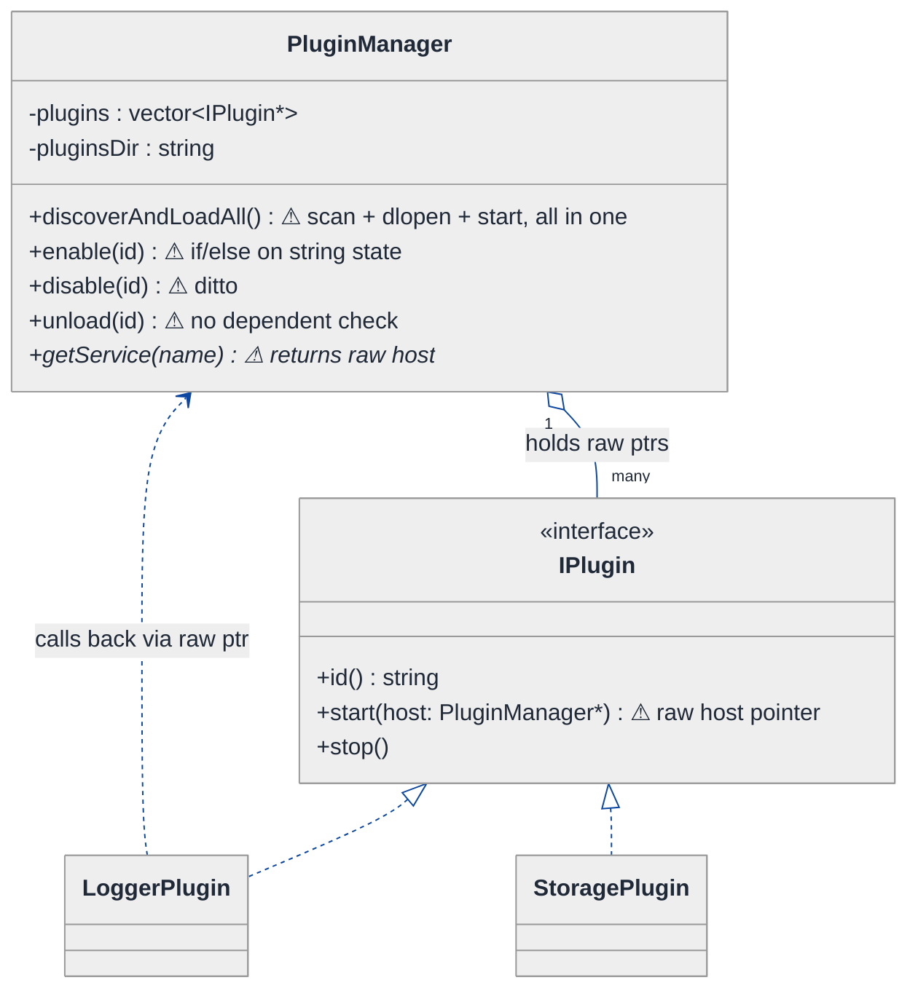
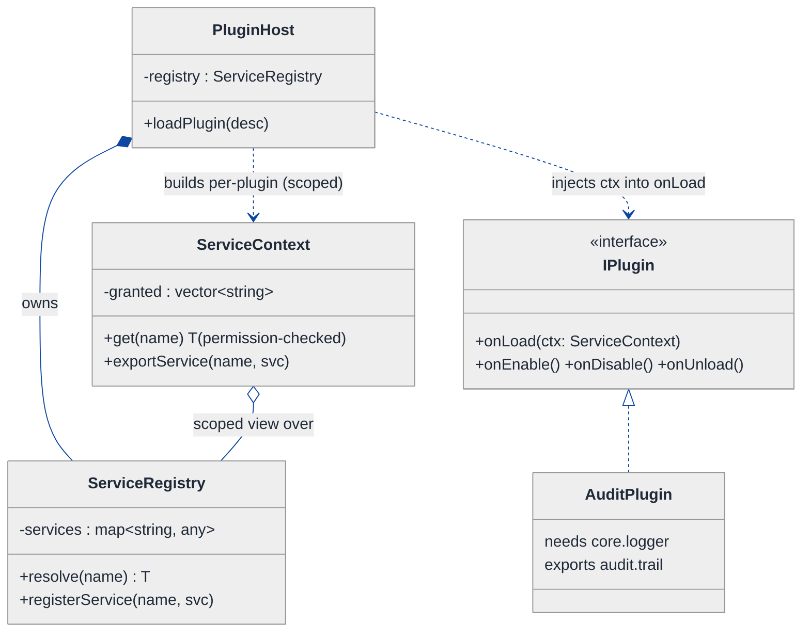
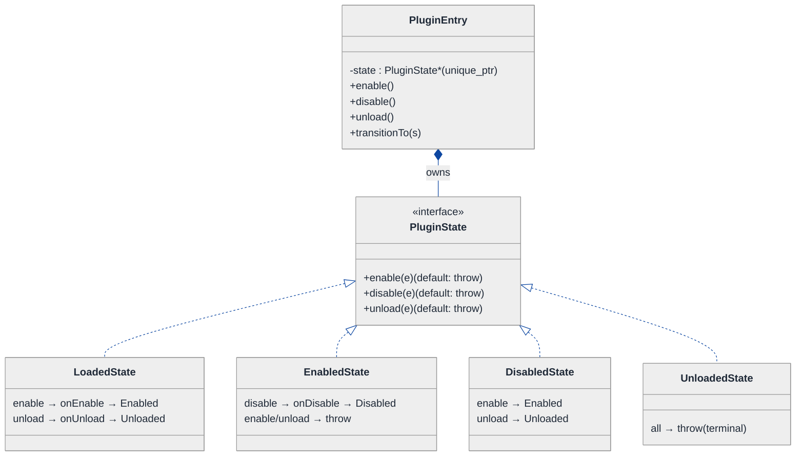
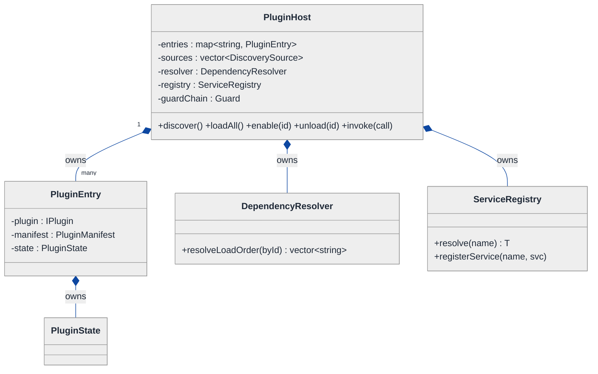
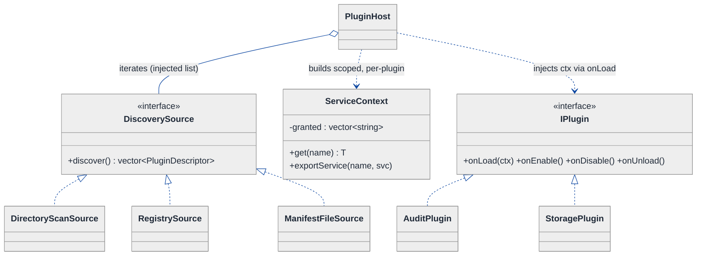
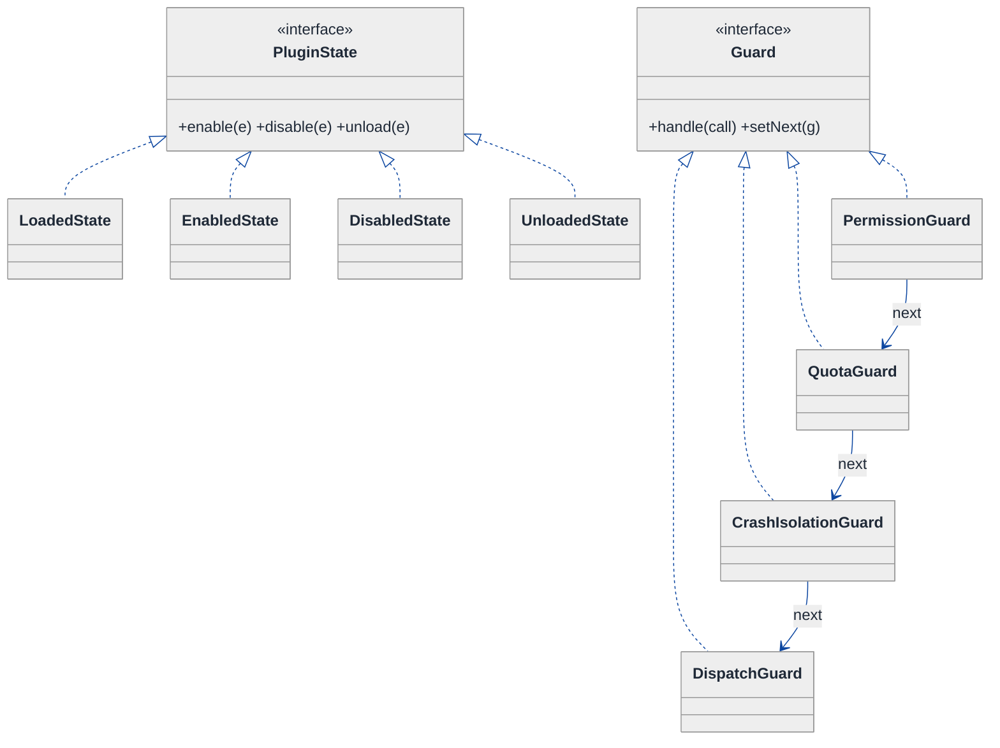
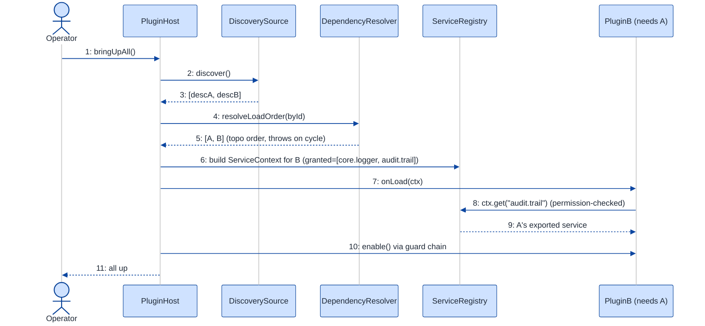
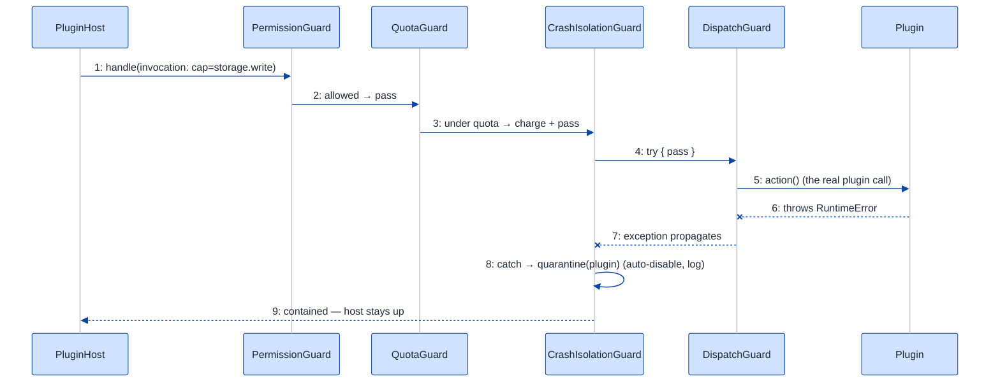

# Plugin Architecture — LLD Walkthrough

> **Difficulty:** Hard · **Time:** ~50 min · **Pattern focus:** Plugin host + Dependency Injection + Service Locator (with Factory for discovery, State for lifecycle, Chain of Responsibility for the sandbox)
>
> **Problem source(s):** GID PL1, bucket `Plugin_Architecture` — "Design a plugin architecture for an application where third-party developers can add features." Representative of multiple LeetLens rows in [`./EXTRACTED_QUESTIONS.md`](./EXTRACTED_QUESTIONS.md).
>
> **Diagrams:** inline mermaid (renders natively in GitHub / VS Code). Theme block copied verbatim from `CONTINUATION.md` §3 — light bg, soft pastels, navy arrows. No `look: handDrawn`.

---

## How to use this file

Paced for a candidate who has never designed a plugin host before. Reading time: ~50 minutes if you sketch each iteration by hand. **The lesson: a plugin host is NOT "load a class and call it." The hard part is the four axes that vary independently — discovery, lifecycle, dependency wiring, and isolation — and the senior move is to DERIVE one pattern per axis instead of cramming all four into one `PluginManager` god-class.**

**Map of this file (15 sections):**

1. Problem statement + clarifying questions
2. Plain-English restatement
3. Why this matters
4. Mental model
5. Try it yourself first
6. Entity & verb extraction
7. **Iteration 1: the naive design** — one `PluginManager` that does everything
8. **Where the naive design hurts** — five future requirements, one painful diff each
9. **Pivot 1: Plugin host + Service Locator + DI** — the most painful axis: dependency wiring
10. **Pivot 2: State for lifecycle** — load → enable → disable → unload as internal transitions
11. **Pivot 3: Factory for discovery + Chain of Responsibility for the sandbox** — the remaining axes
12. Final UML class diagram (three focused sub-views)
13. Skeleton code (C++)
14. Key flow — sequence diagrams (discover + enable, then a sandboxed call)
15. Extensibility re-check + anti-patterns + how to think aloud + self-check

---

## 1. Problem statement + clarifying questions

**Prompt (typical phrasing):** "Design a plugin architecture for an application where third-party developers can add features. Support plugin discovery, lifecycle management (load, enable, disable, unload), dependency resolution, and sandboxed execution."

**Clarifying questions to ask BEFORE drawing anything:**

1. **Where do plugins live and how are they delivered?** Shared libraries (`.so`/`.dll` loaded via `dlopen`), a directory of manifests, a registry/marketplace download, or in-process registration? This decides the *discovery* mechanism.
2. **What does a plugin get to TOUCH?** Does it call back into core services (logging, storage, the event bus), or is it purely a leaf feature? This decides whether we need *dependency injection* and a *service locator*.
3. **Can plugins depend on OTHER plugins?** If plugin B needs plugin A's API, we need *dependency resolution* with ordering and cycle detection. Versioned dependencies (`A >= 2.0`)?
4. **What does "sandboxed" mean here?** OS-level isolation (separate process, seccomp, WASM), or in-process capability restriction (a curated API surface + permission checks + resource quotas)? The interviewer almost always means the latter for an LLD round — true OS sandboxing is an HLD/infra concern.
5. **What is the lifecycle contract?** Is `disable` reversible (re-enable without reload)? Does `unload` require all dependents to be unloaded first? Can a plugin be enabled but its dependency is not?
6. **Trust model?** First-party only, or genuinely untrusted third-party code? Untrusted code raises the bar on the sandbox and on never letting a plugin crash the host.
7. **Concurrency?** Can two plugins be enabled simultaneously from different threads? Hot-reload while a call is in flight?

**Assumptions if the interviewer dodges:** in-process plugins delivered as shared libraries discovered from a plugins directory; each ships a manifest declaring id, version, and dependencies; plugins call core services through an injected, capability-restricted API surface (no raw access to the host); dependencies can be on other plugins with version constraints and must be acyclic; "sandboxed" means in-process capability + quota enforcement, not a separate OS process; single coordinator thread for lifecycle, but plugin calls may be concurrent. We will note where true OS isolation would change the design in §15.

---

## 2. Plain-English restatement

We are building the part of an application that lets *other people* add features without recompiling our app. Our code must: **find** candidate plugins, **load** their code, figure out the **order** to bring them up (a plugin that needs the database must come up after the database service exists, and after any plugin it depends on), **hand each plugin a safe handle** to the services it is allowed to use, and let an operator **enable / disable / unload** them at runtime. Throughout, a misbehaving or malicious plugin must not be able to reach into parts of the host it was never granted, exhaust resources, or take the whole app down. The design must accommodate new discovery sources, new lifecycle rules, and new sandbox policies **without rewriting the core host**.

---

## 3. Why this matters

This is a senior-bar LLD question because it has *four* axes of variation that beginners collapse into one class, and because it forces the two ideas interviewers most want to see: **inversion of control** (the host calls the plugin, the plugin never reaches for the host) and **least privilege** (a plugin gets exactly the capabilities it declared, nothing more). The same shape reappears everywhere — VS Code extensions, browser add-ons, Jenkins plugins, Kubernetes admission webhooks, database UDFs, payment-gateway adapters. If you can derive a clean plugin host, you can derive any extensible system.

---

## 4. Mental model

A plugin host is an **airport**, not a function call. Planes (plugins) arrive from many gates (discovery sources). Before any plane can taxi, **air-traffic control** (the dependency resolver) decides the order so nobody collides. Each plane gets a **restricted apron pass** (the service locator + capability surface) that opens exactly the doors it's cleared for — not the whole airport. And each plane moves through a fixed **lifecycle** (parked → boarding → in-service → grounded → gone) where only certain transitions are legal.

```
Real-world sketch (NOT a UML diagram yet):

   DISCOVERY                  HOST CORE                    PLUGINS
   ┌──────────┐         ┌───────────────────┐        ┌──────────────┐
   │ dir scan │──┐      │  resolve order     │   pass │  Plugin A    │
   │ registry │──┼────► │  (topo sort, DAG)  │ ─────► │  (logger)    │
   │ manifest │──┘      │                    │        ├──────────────┤
   └──────────┘         │  for each in order:│        │  Plugin B    │
                        │   give it a SAFE   │ ─────► │  needs A     │
                        │   ServiceContext   │        ├──────────────┤
                        │   (least privilege)│        │  Plugin C    │
                        └─────────┬──────────┘        └──────────────┘
                                  │  every call is GUARDED
                                  ▼  (permission + quota + crash-isolation)
                            ┌───────────┐
                            │  Sandbox  │
                            └───────────┘
```

The KEY insight from this picture: **discovery, ordering, wiring, lifecycle, and guarding are five different jobs.** The naive design fuses them into one `PluginManager`. The final design gives each its own collaborator.

---

## 5. Try it yourself first

> **Predict before reading on:**
>
> 1. List 5 nouns you'd promote to a class. Which one is the *interface third-party developers implement*?
> 2. **If plugin B depends on plugin A, and A depends on B, what should happen at load time — and where in your design does that check live?**
> 3. A plugin tries to call `host.deleteAllUsers()`. In a good design, why is that method *not even reachable* from the plugin's hands?

---

## 6. Entity & verb extraction

> **Mini-refresher: noun → class, but not every noun.**
>
> Naive OOD promotes every noun to a class. Senior OOD promotes a noun only if it has both BEHAVIOR and STATE that need to live together. "Version" is usually a value type; "Plugin lifecycle" becomes a class family because each phase has different legal operations.

**Nouns from the prompt:**

| Noun | Decision | Why |
|---|---|---|
| Plugin | **Interface** (`IPlugin`) third parties implement | The extension point; has lifecycle hooks |
| PluginHost | Class (top-level coordinator) | Orchestrates discover → resolve → load → enable |
| PluginManifest | Value class | id, version, declared deps, declared permissions |
| PluginDescriptor | Class | A discovered-but-not-loaded plugin (manifest + source handle) |
| ServiceRegistry / Locator | Class | Where core + plugin-exported services are looked up |
| ServiceContext | Class | The *capability-restricted* handle a plugin receives |
| DependencyResolver | Class | Topo-sort + cycle detection + version match |
| Lifecycle state | **Class family** (Discovered / Loaded / Enabled / Disabled / Unloaded) | Each state allows different operations |
| Discovery source | **Interface** (Factory) | dir scan vs registry vs manifest file vary |
| Permission / Quota | Value types + a guard | Drive the sandbox |
| Version | Value type (`semver`) | No behavior beyond compare; a field |

**Verbs (and the class they live on — naive answer, we'll re-examine):**

| Verb | Owner class (naive — revisited later) |
|---|---|
| discover() | PluginHost (naive) → DiscoverySource (final) |
| resolveOrder(descriptors) | PluginHost (naive) → DependencyResolver (final) |
| load(descriptor) | PluginHost / lifecycle state |
| enable() / disable() / unload() | PluginHost (naive) → PluginState (final) |
| getService(name) | ServiceContext / ServiceRegistry |
| invoke(call) | PluginHost (naive) → Sandbox chain (final) |

**We have NOT introduced any design patterns yet.** Pure nouns + verbs.

---

## 7. <a id="iter-1"></a>Iteration 1: the naive design

Let's write the simplest thing that could possibly work. One `PluginManager` that scans a directory, loads everything, calls `start()` on each, and exposes a raw pointer to itself so plugins can call back. No patterns.



**Reader's tour (read top to bottom; ~60 seconds).**

1. **At the top — `PluginManager` is a god-class.** It holds the plugins and exposes everything: discover+load, enable, disable, unload, and `getService`. Five jobs, one box. Every warning marker (⚠) is a future-pain entry point.

2. **`discoverAndLoadAll()` fuses three responsibilities** — scanning the directory, `dlopen`-ing the library, and calling `start()`. There is no notion of *ordering*; it loads in directory-listing order. If `StoragePlugin` needs `LoggerPlugin` and the filesystem lists storage first, it breaks.

3. **`enable`/`disable`/`unload` are string-keyed and stateless.** State lives as, at best, a `std::string` or a bool per plugin, validated with `if (state == "enabled")` ladders. `unload(id)` doesn't check whether anyone *depends* on that plugin.

4. **`IPlugin::start(PluginManager*)` hands the plugin a raw pointer to the entire manager.** This is the cardinal sin. The plugin can now call `manager->unload("some-other-plugin")` or reach any service. **There is no least-privilege boundary — the plugin has the keys to the whole building.**

5. **The two concrete plugins** inherit `IPlugin`. That part is genuinely fine — "is-a plugin" is a real relationship. The smell is everything the manager does *to* and *for* them.

**What's deliberately missing.** No `DiscoverySource`. No `DependencyResolver`. No `ServiceContext` capability surface. No lifecycle state machine. No sandbox guard. The naive design doesn't even *acknowledge* these as axes — it bakes a single hardcoded answer for each into `PluginManager`.

Skeleton code for the naive design (C++):

```cpp
#include <dlfcn.h>
#include <memory>
#include <stdexcept>
#include <string>
#include <unordered_map>
#include <vector>

class PluginManager;  // forward — plugins get a raw ptr to this (the smell)

class IPlugin {
public:
    virtual ~IPlugin() = default;
    virtual std::string id() const = 0;
    virtual void start(PluginManager* host) = 0;   // ⚠ full host access
    virtual void stop() = 0;
};

class PluginManager {
public:
    explicit PluginManager(std::string dir) : dir_(std::move(dir)) {}

    void discoverAndLoadAll() {                     // ⚠ scan + load + start fused
        for (const auto& path : scanDir(dir_)) {    // directory order — no dep order
            void* handle = dlopen(path.c_str(), RTLD_NOW);
            if (!handle) throw std::runtime_error("dlopen failed: " + path);
            auto* make = reinterpret_cast<IPlugin* (*)()>(dlsym(handle, "createPlugin"));
            IPlugin* p = make();
            plugins_.push_back(p);
            p->start(this);                          // ⚠ hands over the whole host
        }
    }

    void enable(const std::string& id)  { setState(id, "enabled");  }   // ⚠ string state
    void disable(const std::string& id) { setState(id, "disabled"); }
    void unload(const std::string& id)  {                                // ⚠ no dependent check
        if (state_[id] == "enabled") plugin(id)->stop();
        plugins_.erase(/* find id ... */ plugins_.begin());
    }

    void* getService(const std::string& name) {     // ⚠ returns whatever, no permission check
        return services_.count(name) ? services_[name] : nullptr;
    }

private:
    void setState(const std::string& id, const std::string& s) {
        if (state_[id] == s) throw std::runtime_error("already " + s);   // ⚠ if/else state
        state_[id] = s;
    }
    IPlugin* plugin(const std::string& id) { /* linear scan ... */ return plugins_.front(); }
    static std::vector<std::string> scanDir(const std::string&);          // elided

    std::string dir_;
    std::vector<IPlugin*> plugins_;                  // ⚠ raw owning ptrs, leaks on throw
    std::unordered_map<std::string, std::string> state_;
    std::unordered_map<std::string, void*> services_;
};
```

**This works** for three first-party plugins with no inter-dependencies. We can scan, load, enable, disable. So what's wrong with it?

---

## 8. <a id="naive-pain"></a>Where the naive design hurts

The interviewer slides a piece of paper across the desk: "Here are five requirements coming next quarter. Walk me through what changes."

### Change A: "Plugin B needs plugin A's service to exist before B starts"

In the naive design:
- `discoverAndLoadAll()` loads in *directory order*. There is no ordering knob.
- To fix, you'd add ad-hoc `if (id == "B") loadAfter("A")` logic inside the loop — and that breaks the moment there are three plugins in a chain.
- **The change touches the one fused load method and bakes in a hardcoded ordering rule.** There is no place for "compute a safe order" to live.

### Change B: "Reject a dependency cycle: A → B → A"

In the naive design:
- Nothing detects cycles. You'd `dlopen` both, call `start()` on B which blocks waiting for A, which is waiting for B. Deadlock or crash.
- **There is no resolver object to put cycle detection on.** You'd shove a visited-set into `PluginManager`, growing the god-class further.

### Change C: "A third-party plugin must NOT be able to call `unload()` on other plugins or reach the raw DB"

In the naive design:
- `IPlugin::start(PluginManager*)` already handed over the whole manager. The plugin can call *anything public*.
- To fix, you'd have to change the `start` signature, change every plugin, and invent a restricted handle — i.e., a redesign. **The capability boundary doesn't exist; bolting it on touches the interface every plugin implements.**

### Change D: "Add a second discovery source — download from a registry, not just scan a dir"

In the naive design:
- Discovery is hardcoded as `scanDir(dir_)` inside the fused method.
- **Adding a registry source means an `if (source == REGISTRY)` branch inside `discoverAndLoadAll`** — tag-driven, and it grows with every new source (manifest file, OCI image, marketplace).

### Change E: "A buggy plugin throws / loops forever / allocates 4 GB — don't take the host down, and don't let it exceed quota"

In the naive design:
- `p->start(this)` is a direct call. An exception propagates straight into the host loop; an infinite loop hangs the coordinator; there is no quota.
- **There is no single choke-point where every plugin call passes through**, so crash-isolation, timeouts, and quotas have nowhere to live.

### The pattern of pain

| Change | Files touched | Smell |
|---|---|---|
| A. Dep ordering | `discoverAndLoadAll` | "No place for ordering; loads in FS order." |
| B. Cycle detection | `PluginManager` (grows) | "Graph logic stuffed into the god-class." |
| C. Capability boundary | `IPlugin::start` + every plugin | "Plugin holds the whole host — no least privilege." |
| D. New discovery source | `discoverAndLoadAll` (tag switch) | "Discovery hardcoded; new source = new branch." |
| E. Crash / quota isolation | direct `start()` call | "No single guarded choke-point for plugin calls." |

**Three axes of pain dominate:** (1) *wiring* — who hands the plugin what it's allowed to touch, and in what order; (2) *lifecycle* — the legal-transition state machine; (3) *boundaries* — discovery sources and the execution sandbox.

> **Pivot question:** "What pattern lets the HOST decide what a plugin can reach (inversion of control) instead of the plugin grabbing it? What pattern expresses a lifecycle where only some transitions are legal? What pattern lets me add discovery sources and guard layers without touching the core?"
>
> The answers are Dependency Injection + Service Locator (wiring), State (lifecycle), and Factory + Chain of Responsibility (boundaries). Let's introduce them one at a time, starting with the most painful and most senior-signalling axis: wiring.

---

## 9. <a id="pivot-1"></a>Pivot 1: Plugin host + Service Locator + Dependency Injection

The deepest smell is Change C: the plugin holds the whole host. Fixing it forces us to invert control.

> **Mini-refresher: Dependency Injection (DI).**
>
> Instead of an object reaching out and constructing/looking up what it needs (`x = new Db()` or `host->getDb()`), the dependencies are *handed to it* from the outside — usually through its constructor or an init method. The object declares *what* it needs; the caller decides *which* concrete thing it gets. This is "inversion of control": the plugin no longer controls how it's wired.

> **Mini-refresher: Service Locator.**
>
> A central registry that maps a service name/type to an implementation: `registry.get<ILogger>()`. It's DI's lazier cousin — the object pulls from the locator instead of receiving everything up front. The key design choice is *which locator you hand the plugin*: a full one (can reach anything) versus a **scoped, capability-restricted** one (can reach only what it declared). We hand plugins a scoped one.

**Why this combination fits.** A plugin needs *some* host services (a logger, maybe storage, the event bus) and needs to *export* its own service for other plugins. The host must control exactly which of those a given plugin can see. So: the host owns a real `ServiceRegistry` (the locator). For each plugin, the host builds a `ServiceContext` — a thin, scoped view over the registry that only resolves the services the plugin's manifest *declared* and was *granted*. That context is **injected** into the plugin at load time. The plugin never sees `PluginHost` again.

**The refactor (just the wiring slice):**

```cpp
// What a plugin is allowed to RECEIVE and EXPORT — no host pointer anywhere.
class ServiceContext {
public:
    ServiceContext(ServiceRegistry& reg, std::vector<std::string> granted)
        : reg_(reg), granted_(std::move(granted)) {}

    // Scoped lookup: only resolves services this plugin DECLARED + was GRANTED.
    template <class T>
    std::shared_ptr<T> get(const std::string& name) {
        if (!isGranted(name)) throw PermissionError(name);   // least privilege
        return reg_.resolve<T>(name);
    }
    // A plugin may export its OWN service for dependents (namespaced by plugin id).
    template <class T>
    void exportService(const std::string& name, std::shared_ptr<T> svc) {
        reg_.registerService(name, std::move(svc));
    }
private:
    bool isGranted(const std::string& n) const {
        return std::find(granted_.begin(), granted_.end(), n) != granted_.end();
    }
    ServiceRegistry&          reg_;        // the real locator (not exposed to plugin)
    std::vector<std::string>  granted_;    // capability whitelist from the manifest
};

// The extension point third parties implement. It receives a CONTEXT, not the host.
class IPlugin {
public:
    virtual ~IPlugin() = default;
    virtual std::string id() const = 0;
    virtual void onLoad(ServiceContext& ctx) = 0;   // DI: deps handed in here
    virtual void onEnable() = 0;
    virtual void onDisable() = 0;
    virtual void onUnload() = 0;
};

// Example third-party plugin: declares it needs "core.logger", exports "audit.trail".
class AuditPlugin : public IPlugin {
public:
    std::string id() const override { return "com.acme.audit"; }
    void onLoad(ServiceContext& ctx) override {
        logger_ = ctx.get<ILogger>("core.logger");        // injected, permission-checked
        ctx.exportService<IAuditTrail>("audit.trail", std::make_shared<TrailImpl>());
    }
    void onEnable()  override { logger_->info("audit enabled"); }
    void onDisable() override { /* elided */ }
    void onUnload()  override { logger_.reset(); }
private:
    std::shared_ptr<ILogger> logger_;
};
// other plugins elided
```

**What changed — visualized.** Just the wiring slice:



**Tour of the after-state.**

1. **`PluginHost` OWNS the `ServiceRegistry`** (filled diamond / composition). The registry is the real service locator — it holds core services plus anything plugins export.

2. **The plugin never touches the registry directly.** For each plugin, the host *builds a `ServiceContext`* (dependency arrow — it's created per-plugin, not owned long-term). The context holds a `granted` whitelist drawn from the plugin's manifest and a *scoped view* over the registry.

3. **`IPlugin::onLoad(ServiceContext&)` is where injection happens.** The plugin reaches into the context to `get<ILogger>("core.logger")` — and that call is permission-checked. Ask for something you didn't declare → `PermissionError`. **The host decides what the plugin can reach; the plugin can only ask.**

4. **Plugins export services too.** `AuditPlugin` exports `"audit.trail"` so a dependent plugin can later `get<IAuditTrail>("audit.trail")`. That's how inter-plugin dependencies (Change A) become possible — through the same locator, never through direct plugin-to-plugin pointers.

5. **The raw `PluginManager*` is GONE from the plugin's world.** Change C from §8 is now structurally impossible: there is no `unload()` reachable from a plugin's hands. Least privilege by construction.

**Pattern-discrimination cheatsheet — Dependency Injection vs Service Locator.**
- *DI:* dependencies are PUSHED in from outside (constructor / `onLoad` parameter). The object can't function without them and can't reach for more.
- *Service Locator:* the object PULLS dependencies from a central registry on demand (`ctx.get(...)`).
- *Rule of thumb:* DI gives the strongest "you can only have what I gave you" guarantee; a locator is more flexible (lazy, dynamic names) but easier to abuse. We use **both, layered**: the host injects a *scoped locator* — flexible enough for dynamic service names, restricted enough to enforce least privilege.

---

## 10. <a id="pivot-2"></a>Pivot 2: State for the plugin lifecycle

Changes A's ordering aside, the lifecycle itself (load → enable → disable → unload) is still a `std::string` validated by `if/else` ladders in the god-class. That's the same enum-and-switch smell the Parking-Lot ticket had — and it's worse here because the *legal transitions* matter: you must not enable an Unloaded plugin, must not unload an Enabled plugin without disabling first, and must not enable a plugin whose dependency is not yet enabled.

> **Mini-refresher: State pattern.**
>
> Each lifecycle phase is its own class. The context object delegates an operation (`enable()`, `disable()`) to its current state object, and THE STATE decides what's legal and what the next state is. Transitions are INTERNAL. Calling an illegal operation isn't guarded by an `if` — the wrong state class simply throws or no-ops.

**Why State (not Strategy).** The phase is NOT picked by the caller — it's driven by what the plugin has been through. A `LoadedState` can `enable()`; an `EnabledState` can `disable()` but not `enable()` again; an `UnloadedState` is terminal. The legality of an operation depends on the object's history, not on a caller's choice. That's textbook State.

**The refactor (just the lifecycle slice):**

```cpp
class PluginEntry;  // forward — the host's per-plugin record (wraps IPlugin + manifest)

class PluginState {
public:
    virtual ~PluginState() = default;
    virtual const char* name() const = 0;
    virtual void enable(PluginEntry&)  { throw IllegalTransition("enable",  name()); }
    virtual void disable(PluginEntry&) { throw IllegalTransition("disable", name()); }
    virtual void unload(PluginEntry&)  { throw IllegalTransition("unload",  name()); }
};

class LoadedState : public PluginState {
public:
    const char* name() const override { return "Loaded"; }
    void enable(PluginEntry& e) override;                 // → EnabledState
    void unload(PluginEntry& e) override;                 // → UnloadedState (calls onUnload)
};

class EnabledState : public PluginState {
public:
    const char* name() const override { return "Enabled"; }
    void disable(PluginEntry& e) override;                // → DisabledState
    // enable() inherited → throws "already enabled"
    // unload() inherited → throws "disable before unload"
};

class DisabledState : public PluginState {
public:
    const char* name() const override { return "Disabled"; }
    void enable(PluginEntry& e) override;                 // re-enable → EnabledState
    void unload(PluginEntry& e) override;                 // → UnloadedState
};

class UnloadedState : public PluginState {                // terminal
public:
    const char* name() const override { return "Unloaded"; }
    // every transition inherited → throws
};

class PluginEntry {
public:
    void enable()  { state_->enable(*this); }
    void disable() { state_->disable(*this); }
    void unload()  { state_->unload(*this); }
    void transitionTo(std::unique_ptr<PluginState> s) { state_ = std::move(s); }
    IPlugin& plugin() { return *plugin_; }
    // ... getters: manifest(), dependents() ...
private:
    std::unique_ptr<IPlugin>     plugin_;
    PluginManifest               manifest_;
    std::unique_ptr<PluginState> state_ = std::make_unique<LoadedState>();
};

inline void LoadedState::enable(PluginEntry& e) {
    e.plugin().onEnable();
    e.transitionTo(std::make_unique<EnabledState>());
}
inline void EnabledState::disable(PluginEntry& e) {
    e.plugin().onDisable();
    e.transitionTo(std::make_unique<DisabledState>());
}
```

**What changed — visualized.** Just the lifecycle slice:



**Tour of the after-state.**

1. **The `std::string` state is gone**, replaced by a `unique_ptr<PluginState>` that the `PluginEntry` owns.

2. **`enable`/`disable`/`unload` on `PluginEntry` became one-liners** that delegate to the current state. **No `if (state == "enabled")` ladder anywhere.**

3. **The base `PluginState` defaults every transition to throw.** Each concrete state overrides ONLY the transitions that are legal for it. `EnabledState` doesn't override `enable`, so re-enabling throws automatically — the class hierarchy IS the validation.

4. **Transitions live with the state.** `LoadedState::enable` calls the plugin's `onEnable()` hook, then `transitionTo(EnabledState)`. The "what comes next" lives in the state, not in the host.

5. **`UnloadedState` is terminal** — it overrides nothing, so every transition throws. A plugin once unloaded must be re-discovered and re-loaded.

**Where does the dependency check go?** Not inside the state class — that would couple a state to the dependency graph. The host wraps `entry.enable()`: before calling it, the host asks the resolver "are all of this plugin's dependencies enabled?" and after `entry.unload()` it checks "does any *enabled* plugin still depend on this one?". The state owns the *intra-plugin* transition; the host owns the *inter-plugin* policy. (We'll see the resolver next.)

**Pattern-discrimination cheatsheet — State vs Strategy.**
- *State:* the OBJECT picks its next state internally via events; states know about each other (each can `transitionTo` another). Used here for the lifecycle.
- *Strategy:* the CALLER picks which algorithm to use; strategies are unaware of each other. Used in §9 for the service surface and in §11 for discovery/sandbox.
- *Rule of thumb:* swap happens because of an internal event flow → State. Swap happens because external config says so → Strategy.

---

## 11. <a id="pivot-3"></a>Pivot 3: Factory for discovery + Chain of Responsibility for the sandbox

Changes D (new discovery source) and E (crash/quota isolation) remain, plus B (cycle detection). These are the *boundary* axes — the edges of the host.

### 11a. Discovery — Factory / abstract source

> **Mini-refresher: Factory (and abstract source).**
>
> A Factory hides *which concrete object gets created* behind an interface, so the caller asks for "a thing" and the factory decides the concrete type. Here each `DiscoverySource` knows how to *produce `PluginDescriptor`s* from one kind of place — a directory, a registry, a manifest file. The host iterates over a list of sources and merges their output; adding a source is one new class.

```cpp
class PluginDescriptor {                  // discovered, not yet loaded
public:
    PluginManifest manifest;              // id, version, deps (with version ranges), permissions
    std::function<std::unique_ptr<IPlugin>()> factory;  // how to instantiate when we load
};

class DiscoverySource {
public:
    virtual ~DiscoverySource() = default;
    virtual std::vector<PluginDescriptor> discover() = 0;
};
class DirectoryScanSource : public DiscoverySource { /* dlopen each .so, read manifest */ };
class RegistrySource      : public DiscoverySource { /* HTTP pull from marketplace */ };
class ManifestFileSource  : public DiscoverySource { /* parse a plugins.json */ };
// other sources elided
```

Change D now lands as a new `DiscoverySource` subclass added to the host's source list — zero edits to the host loop.

### 11b. Ordering + cycle detection — DependencyResolver

The resolver is a plain collaborator (not a GoF pattern), but it's where the graph logic finally has a home — off the god-class.

```cpp
class DependencyResolver {
public:
    // Topological sort over the dependency DAG; throws on cycle or unsatisfiable version.
    std::vector<std::string> resolveLoadOrder(
        const std::unordered_map<std::string, PluginDescriptor>& byId) const {
        // Kahn's algorithm: build in-degree, peel zero-in-degree nodes.
        // If nodes remain when the queue empties → a cycle exists → throw CycleError.
        // For each edge "B depends A>=2.0", verify byId.at("A").manifest.version satisfies range.
        // ... elided ...
        return order_;
    }
private:
    std::vector<std::string> order_;
};
```

Changes A and B both land here: ordering is the topo-sort output; a cycle is detected when the sort can't complete.

### 11c. Sandboxed execution — Chain of Responsibility

> **Mini-refresher: Chain of Responsibility (CoR).**
>
> A request passes through a chain of handlers; each handler either handles/transforms it or passes it to the next. New cross-cutting concerns become new links — you don't touch the existing ones. Perfect for *layered guards*: permission check → quota check → timeout/crash isolation → the actual call.

> **Mini-refresher: Open/Closed Principle (the "O" in SOLID).**
>
> Software entities should be open for *extension* but closed for *modification*. A new sandbox guard (say, an audit-logging guard) should be addable as a new chain link without editing the host or the other guards. CoR makes this literal.

**Why CoR fits the sandbox.** Change E needs a *single choke-point* where every plugin call passes through, with independently-addable guards. A chain gives exactly that: each call to a plugin (an `onEnable`, an exported-service invocation) is wrapped as an `Invocation` and pushed through `Permission → Quota → CrashIsolation → Dispatch`.

```cpp
struct Invocation {
    std::string pluginId;
    std::string capability;          // what the call needs
    std::function<void()> action;    // the real plugin call
};

class Guard {
public:
    virtual ~Guard() = default;
    void setNext(std::shared_ptr<Guard> n) { next_ = std::move(n); }
    virtual void handle(Invocation& call) {
        if (next_) next_->handle(call);   // default: pass through
    }
protected:
    std::shared_ptr<Guard> next_;
};

class PermissionGuard : public Guard {
public:
    void handle(Invocation& call) override {
        if (!grants_.allows(call.pluginId, call.capability)) throw PermissionError(call.capability);
        Guard::handle(call);
    }
private: GrantTable grants_;  // elided
};

class QuotaGuard : public Guard {
public:
    void handle(Invocation& call) override {
        if (meter_.exceeded(call.pluginId)) throw QuotaExceeded(call.pluginId);
        meter_.charge(call.pluginId);
        Guard::handle(call);
    }
private: ResourceMeter meter_;  // elided
};

class CrashIsolationGuard : public Guard {     // the last guard before dispatch
public:
    void handle(Invocation& call) override {
        try { Guard::handle(call); }           // next is the Dispatch link
        catch (const std::exception& e) { quarantine(call.pluginId, e.what()); }
    }
private: void quarantine(const std::string&, const std::string&);  // disable + log, don't rethrow
};
// DispatchGuard (terminal link) simply runs call.action(); elided
```

Change E lands as: a buggy plugin's exception is caught by `CrashIsolationGuard` and the plugin is quarantined (auto-disabled) rather than crashing the host. A 4-GB allocation trips `QuotaGuard`. A new concern = a new guard inserted in the chain.

**The lesson.** Once we recognized "the host owns the boundary, the plugin only asks," Factory (discovery), the resolver (ordering), and CoR (sandbox) all fall out as *separate collaborators around the host* — none of them a god-class method. **Pattern recognition makes subsequent design cheap.**

> **Mini-refresher: why CoR here and not a single `validate()` method?**
>
> You could write one method that does permission + quota + isolation in sequence. CoR wins when the guard list itself must vary (per trust level: first-party plugins skip the quota guard; untrusted ones add a rate-limit guard) and when guards are independently testable. If the guard set were fixed forever, a single method would be fine — don't over-engineer.

---

## 12. <a id="fig-class-diagram"></a>Final class diagram

Showing the whole design in one diagram is a wall of boxes. Here are **three focused sub-views**; the structural insight at the end ties them together.

### 12.1 The host spine — what the host OWNS and COORDINATES



**Tour of 12.1.** `PluginHost` is the root coordinator, but it no longer *does* everything — it OWNS a set of `PluginEntry` records (each a plugin + manifest + lifecycle state) and three collaborators it delegates to: the `DependencyResolver` (ordering), the `ServiceRegistry` (the locator), and a `Guard` chain (the sandbox, shown in 12.3). The filled diamonds mark composition — these all share the host's lifetime. Compare with the naive design where every one of those responsibilities was a method on the god-class.

### 12.2 Discovery + wiring — what the host USES to bring plugins up



**Tour of 12.2.**

1. **`DiscoverySource` is a Factory interface with three concrete sources.** The host holds an injected *list* of them (aggregation / open diamond — it uses them, the caller supplies them) and merges their `PluginDescriptor` output. New source = new subclass, zero host edits (Change D).

2. **`ServiceContext` is built per-plugin and scoped.** The dependency arrow (`..>`) shows the host *creates* one per plugin, granting only declared capabilities. It is the least-privilege handle from Pivot 1.

3. **`IPlugin` is the extension point third parties implement.** Its four hooks (`onLoad`/`onEnable`/`onDisable`/`onUnload`) are called BY the host — inversion of control. The plugin never holds the host.

### 12.3 Lifecycle + sandbox — the State machine and the guard chain



**Tour of 12.3.**

1. **Left family — the lifecycle State machine.** Four states, each overriding only the transitions legal for it; the base throws by default. The host wraps `entry.enable()` with the inter-plugin dependency check.

2. **Right family — the sandbox as a Chain of Responsibility.** Each guard points to its `next`. A plugin call (`Invocation`) flows `Permission → Quota → CrashIsolation → Dispatch`. Permission enforces least privilege at call time (belt-and-suspenders with the scoped context); Quota meters resources; CrashIsolation catches exceptions and quarantines; Dispatch runs the real action.

3. **Both families are open/closed.** New lifecycle phase = new `PluginState` subclass. New sandbox concern = new `Guard` link. Neither touches the host.

### Structural insight (ties 12.1 + 12.2 + 12.3 together)

| Concern | Pattern used | Why |
|---|---|---|
| **Coordination** (the host) | Plain collaborator ownership | A coordinator that DELEGATES, not a god-class |
| **Wiring** (services in/out) | DI + Service Locator (scoped) | Host pushes a capability-restricted handle; plugin can only ask |
| **Discovery** (where plugins come from) | Factory / abstract source | Sources vary; new source = new subclass |
| **Ordering** (load sequence, cycles) | DependencyResolver (topo-sort) | Graph logic gets a home off the host |
| **Lifecycle** (load→enable→disable→unload) | State, owned by PluginEntry | Legal transitions encoded as classes, not `if` ladders |
| **Sandbox** (permission/quota/crash) | Chain of Responsibility | A single choke-point with independently-addable guards |

The big lesson: **inheritance is used only for the extension point (`IPlugin`) and the state/guard/source class families** — everything that "varies independently" became composition over an interface. *Inversion of control + least privilege* are the two ideas the whole design exists to enforce.

---

## 13. Skeleton code (C++)

> Show the SHAPES, not the full impl. ~140 lines.

```cpp
#include <algorithm>
#include <functional>
#include <memory>
#include <stdexcept>
#include <string>
#include <unordered_map>
#include <vector>

// ── Forward declarations ────────────────────────────────────────────
class PluginEntry;
class ServiceRegistry;

// ── Value types ─────────────────────────────────────────────────────
struct Version { int major, minor, patch; };           // compare elided
struct Dep      { std::string id; Version min; };
struct PluginManifest {
    std::string          id;
    Version              version;
    std::vector<Dep>     deps;          // inter-plugin dependencies
    std::vector<std::string> permissions;  // declared capabilities (the grant whitelist)
};

// ── The extension point third parties implement ────────────────────
class ServiceContext;  // forward
class IPlugin {
public:
    virtual ~IPlugin() = default;
    virtual std::string id() const = 0;
    virtual void onLoad(ServiceContext& ctx) = 0;   // DI happens here
    virtual void onEnable()  = 0;
    virtual void onDisable() = 0;
    virtual void onUnload()  = 0;
};

// ── Service Locator + scoped capability surface (Pivot 1) ───────────
class ServiceRegistry {
public:
    template <class T>
    std::shared_ptr<T> resolve(const std::string& name) const {
        auto it = services_.find(name);
        if (it == services_.end()) throw std::runtime_error("no service: " + name);
        return std::static_pointer_cast<T>(it->second);
    }
    void registerService(const std::string& name, std::shared_ptr<void> svc) {
        services_[name] = std::move(svc);
    }
private:
    std::unordered_map<std::string, std::shared_ptr<void>> services_;
};

class ServiceContext {          // the ONLY thing a plugin holds
public:
    ServiceContext(ServiceRegistry& reg, std::vector<std::string> granted)
        : reg_(reg), granted_(std::move(granted)) {}
    template <class T>
    std::shared_ptr<T> get(const std::string& name) {
        if (std::find(granted_.begin(), granted_.end(), name) == granted_.end())
            throw std::runtime_error("permission denied: " + name);
        return reg_.resolve<T>(name);
    }
    template <class T>
    void exportService(const std::string& name, std::shared_ptr<T> svc) {
        reg_.registerService(name, std::move(svc));
    }
private:
    ServiceRegistry&         reg_;
    std::vector<std::string> granted_;
};

// ── Discovery (Pivot 3a — Factory) ──────────────────────────────────
struct PluginDescriptor {
    PluginManifest manifest;
    std::function<std::unique_ptr<IPlugin>()> factory;
};
class DiscoverySource {
public:
    virtual ~DiscoverySource() = default;
    virtual std::vector<PluginDescriptor> discover() = 0;
};
class DirectoryScanSource : public DiscoverySource {
public:
    explicit DirectoryScanSource(std::string dir) : dir_(std::move(dir)) {}
    std::vector<PluginDescriptor> discover() override; // dlopen + read manifest; elided
private:
    std::string dir_;
};
// RegistrySource, ManifestFileSource elided

// ── Dependency resolution (Pivot 3b) ────────────────────────────────
class DependencyResolver {
public:
    std::vector<std::string> resolveLoadOrder(
        const std::unordered_map<std::string, PluginDescriptor>& byId) const; // Kahn topo-sort; throws on cycle/version-miss; elided
};

// ── Lifecycle State machine (Pivot 2) ───────────────────────────────
class PluginState {
public:
    virtual ~PluginState() = default;
    virtual const char* name() const = 0;
    virtual void enable(PluginEntry&)  { throw std::runtime_error("illegal: enable");  }
    virtual void disable(PluginEntry&) { throw std::runtime_error("illegal: disable"); }
    virtual void unload(PluginEntry&)  { throw std::runtime_error("illegal: unload");  }
};
class LoadedState   : public PluginState {
public: const char* name() const override { return "Loaded"; }
        void enable(PluginEntry& e) override; void unload(PluginEntry& e) override; };
class EnabledState  : public PluginState {
public: const char* name() const override { return "Enabled"; }
        void disable(PluginEntry& e) override; };
class DisabledState : public PluginState {
public: const char* name() const override { return "Disabled"; }
        void enable(PluginEntry& e) override; void unload(PluginEntry& e) override; };
class UnloadedState : public PluginState {                 // terminal — all inherited throws
public: const char* name() const override { return "Unloaded"; } };

class PluginEntry {
public:
    PluginEntry(std::unique_ptr<IPlugin> p, PluginManifest m)
        : plugin_(std::move(p)), manifest_(std::move(m)),
          state_(std::make_unique<LoadedState>()) {}
    void enable()  { state_->enable(*this); }
    void disable() { state_->disable(*this); }
    void unload()  { state_->unload(*this); }
    void transitionTo(std::unique_ptr<PluginState> s) { state_ = std::move(s); }
    IPlugin&              plugin()   { return *plugin_; }
    const PluginManifest& manifest() const { return manifest_; }
    const char*           stateName() const { return state_->name(); }
private:
    std::unique_ptr<IPlugin>     plugin_;
    PluginManifest               manifest_;
    std::unique_ptr<PluginState> state_;
};
inline void LoadedState::enable(PluginEntry& e) {
    e.plugin().onEnable();
    e.transitionTo(std::make_unique<EnabledState>());
}
inline void EnabledState::disable(PluginEntry& e) {
    e.plugin().onDisable();
    e.transitionTo(std::make_unique<DisabledState>());
}
// remaining transitions elided (DisabledState::enable/unload, LoadedState::unload)

// ── Sandbox (Pivot 3c — Chain of Responsibility) ────────────────────
struct Invocation { std::string pluginId, capability; std::function<void()> action; };
class Guard {
public:
    virtual ~Guard() = default;
    void setNext(std::shared_ptr<Guard> n) { next_ = std::move(n); }
    virtual void handle(Invocation& c) { if (next_) next_->handle(c); }
protected:
    std::shared_ptr<Guard> next_;
};
class CrashIsolationGuard : public Guard {
public:
    void handle(Invocation& c) override {
        try { Guard::handle(c); }
        catch (const std::exception& e) { /* quarantine(c.pluginId): auto-disable + log */ }
    }
};
// PermissionGuard, QuotaGuard, DispatchGuard elided

// ── The coordinator (Pivot 1 root) ──────────────────────────────────
class PluginHost {
public:
    void addSource(std::unique_ptr<DiscoverySource> s) { sources_.push_back(std::move(s)); }

    void bringUpAll() {
        std::unordered_map<std::string, PluginDescriptor> byId;
        for (auto& src : sources_)                      // Factory: merge all sources
            for (auto& d : src->discover()) byId[d.manifest.id] = std::move(d);

        auto order = resolver_.resolveLoadOrder(byId);  // topo-sort; throws on cycle

        for (const auto& id : order) {                  // load + inject in dependency order
            auto& d = byId.at(id);
            auto entry = std::make_unique<PluginEntry>(d.factory(), d.manifest);
            ServiceContext ctx(registry_, d.manifest.permissions);  // scoped, least-privilege
            guarded(id, "lifecycle.load", [&]{ entry->plugin().onLoad(ctx); });
            entries_[id] = std::move(entry);
        }
        for (const auto& id : order)                    // enable after deps are up
            guarded(id, "lifecycle.enable", [&]{ entries_.at(id)->enable(); });
    }

    void unload(const std::string& id) {
        if (hasEnabledDependents(id)) throw std::runtime_error("disable dependents first");
        entries_.at(id)->unload();
    }
private:
    void guarded(const std::string& id, std::string cap, std::function<void()> a) {
        Invocation call{id, std::move(cap), std::move(a)};
        guardChain_->handle(call);                      // through the sandbox chain
    }
    bool hasEnabledDependents(const std::string&) const; // elided

    std::vector<std::unique_ptr<DiscoverySource>>            sources_;
    std::unordered_map<std::string, std::unique_ptr<PluginEntry>> entries_;
    DependencyResolver                                       resolver_;
    ServiceRegistry                                          registry_;
    std::shared_ptr<Guard>                                   guardChain_;  // built at startup
};
```

---

## 14. <a id="fig-sequence"></a>Key flow — sequence diagrams

### Phase 1 — discover, resolve, load + inject, enable



**Tour of Phase 1.**

1. **Operator triggers `bringUpAll()`.** The operator is the boundary; the host orchestrates.
2. **Host asks each `DiscoverySource` to `discover()`** and merges descriptors. New sources plug in here without the host changing.
3. **Host asks the resolver for a load order.** This is where Change A (ordering) and Change B (cycle) are decided — if A→B→A, step 5 throws before anything loads.
4. **Host builds a scoped `ServiceContext` for B** with only the capabilities B declared, then calls `onLoad(ctx)` — **DI**. Notice the host pushes the context in; B never reached for it.
5. **B pulls A's exported service through the context** (`ctx.get`), which permission-checks against B's grant list. B never touches A directly or the host.
6. **Host enables in dependency order through the guard chain.** A is already up, so B's `onEnable` is legal.

### Phase 2 — a sandboxed plugin call



**Tour of Phase 2. Read slowly — this is the moment the sandbox earns its keep.**

1. **Every plugin-bound call is wrapped as an `Invocation` and pushed through the chain.** The host never calls the plugin directly.
2. **`PermissionGuard`** checks the capability (`storage.write`) against the grant table — belt-and-suspenders with the scoped context's earlier check.
3. **`QuotaGuard`** verifies the plugin is under its resource budget, charges it, and passes on. A 4-GB allocation attempt would stop here (Change E).
4. **`CrashIsolationGuard` wraps the dispatch in `try/catch`.** When the plugin throws (step 6), the exception is caught at step 8 — the plugin is *quarantined* (auto-disabled, logged) and the host stays up (step 9). **A buggy third-party plugin cannot take the application down.**

### The validation that's NOT shown — and why it matters

You won't find `if (plugin.canAccess("storage"))` scattered through the host. The permission check lives in exactly two places: the scoped `ServiceContext` (load-time wiring) and the `PermissionGuard` (call-time). And you won't find `try/catch` around individual plugin calls in the host — it lives in ONE place, the `CrashIsolationGuard`. **The structure IS the policy.**

---

## 15. Extensibility re-check + anti-patterns + how to think aloud + self-check

### Extensibility re-check

Revisit the five changes from [§8](#naive-pain). For each, name the SINGLE class that changes.

| Change | Naive design impact | Final design impact |
|---|---|---|
| A. Dep ordering | rewrite `discoverAndLoadAll` | `DependencyResolver` already topo-sorts. Zero new code. |
| B. Cycle detection | graph logic in god-class | Resolver throws `CycleError` when topo-sort can't complete. Done. |
| C. Capability boundary | change `start` + every plugin | Already enforced by scoped `ServiceContext` + `PermissionGuard`. Done. |
| D. New discovery source | `if` branch in fused method | New `DiscoverySource` subclass. Done. |
| E. Crash / quota | no choke-point | New / existing `Guard` link in the chain. Done. |

Every change is one new class (or already handled). That's the open/closed principle in practice.

If a future requirement makes you change `PluginHost`, `IPlugin`, the resolver, AND the state machine together — go back to §6 and re-identify variability points; you missed one.

### Common confusion + traps

1. **"Why give the plugin a `ServiceContext` instead of the `PluginHost`?"** Least privilege. The host has `unload()`, `disable()`, the raw registry — a plugin must reach none of those. The context exposes only `get` (scoped) and `exportService`.

2. **"Why is the permission checked twice (context + guard)?"** Defense in depth. The context check is at wiring time (fast-fail bad manifests); the guard check is at call time (handles dynamically-named lookups and runtime grant revocation).

3. **"Why State for lifecycle and not an enum?"** Five phases with asymmetric legal transitions. An enum forces an N×N `if` matrix scattered across `enable/disable/unload`; State puts each phase's rules in one class.

4. **"Why does the host (not the state) check inter-plugin dependencies?"** A state should know only its own intra-plugin transition. Cross-plugin policy (is my dependency enabled? do I have enabled dependents?) is the host's graph concern — keep the two from coupling.

5. **"Is this real sandboxing?"** In-process capability + quota + crash-isolation, yes. True isolation against malicious native code needs OS-level boundaries (separate process + IPC, seccomp, or a WASM runtime). Say so explicitly — it's an HLD/infra escalation, and the *interface* (`Invocation` through a guard chain) stays the same; only `DispatchGuard` changes to marshal across a process boundary.

### Anti-patterns

- **"God-class PluginManager"** — discover + resolve + load + enable + guard in one box. Split into collaborators.
- **"Plugin holds the host"** — passing a raw `PluginHost*` into `start()`. Inject a scoped `ServiceContext` instead.
- **"Service Locator as a global singleton"** — `Registry::instance().get(...)` reachable from anywhere defeats least privilege and hides dependencies. Inject a *scoped* locator.
- **"Tag-driven discovery"** — `if (source == DIR) ... else if (source == REGISTRY)`. Use the `DiscoverySource` Factory.
- **"Enum lifecycle with scattered `if`s"** — `if (state == ENABLED)` ladders. Use the State pattern.
- **"Trusting plugin exceptions"** — calling a plugin directly so its throw crashes the host. Wrap every call in the guard chain's `CrashIsolationGuard`.
- **"Unload without dependents check"** — yanking a plugin out from under its dependents. The host checks `hasEnabledDependents` first.

### How to think aloud

> "Plugin architecture. Let me clarify scope. [Asks the §1 questions — delivery mechanism, what plugins can touch, inter-plugin deps, what 'sandboxed' means, trust model.] Got it: in-process, manifest-declared deps, scoped service access, in-process capability sandbox.
>
> Nouns: PluginHost, IPlugin (the extension point), manifest, descriptor, service registry, resolver, lifecycle states, discovery sources, guards. The extension point third parties implement is `IPlugin`.
>
> I'll write the NAIVE design first — one `PluginManager` that scans a dir, dlopens everything, and hands each plugin a raw pointer to itself. It works for three first-party plugins.
>
> Now I stress-test. A: B needs A — no ordering knob. B: A→B→A cycle — no detection. C: plugin can call `unload()` on others — it holds the whole host. D: second discovery source — hardcoded scan. E: buggy plugin crashes the host — direct call, no choke-point.
>
> The pain clusters into three axes: wiring, lifecycle, boundaries.
>
> Pivot 1: invert control. Host owns a `ServiceRegistry` (locator); injects a scoped `ServiceContext` into each plugin's `onLoad`. Plugin can only ask for declared capabilities. The raw host pointer is gone — that's DI + a least-privilege Service Locator.
>
> Pivot 2: lifecycle becomes a State machine — Loaded/Enabled/Disabled/Unloaded, each a class, base throws by default. Illegal transitions throw without `if` ladders. The host wraps transitions with the inter-plugin dependency check.
>
> Pivot 3: discovery becomes a `DiscoverySource` Factory (new source = new subclass); ordering + cycle detection go to a `DependencyResolver` (Kahn topo-sort); the sandbox becomes a Chain of Responsibility — Permission → Quota → CrashIsolation → Dispatch — so a buggy plugin is quarantined instead of crashing the host.
>
> Final: `PluginHost` owns entries + resolver + registry + guard chain and DELEGATES. All five future requirements land as one new class each. That's open/closed, with inversion of control and least privilege as the through-lines."

### Self-check

> **Self-check — the question to ask next time.**
>
> When you see "design a [host] that runs third-party [extensions]," before writing a `Manager`, ask:
>
> > **"Who reaches for whom — does the extension grab the host (wrong), or does the host inject a scoped capability into the extension (right)? And which of discovery / ordering / lifecycle / sandbox is varying enough to deserve its own collaborator?"**
>
> Inversion of control + least privilege are the spine. Then: Factory for discovery, a resolver for ordering, State for lifecycle, Chain of Responsibility for the sandbox. The class diagram falls out for free.

---

## Cross-references

- **Parent topic manifest:** [`./EXTRACTED_QUESTIONS.md`](./EXTRACTED_QUESTIONS.md)
- **Vertical overview:** [`../../LEARNING.md`](../../LEARNING.md)
- **Template:** [`../../TEMPLATE-v2.md`](../../TEMPLATE-v2.md)
- **Canonical exemplar:** [`../Object_Oriented_Design/Parking_Lot.md`](../Object_Oriented_Design/Parking_Lot.md)
- **Authoring ledger:** [`../../AUTHORING_LEDGER.md`](../../AUTHORING_LEDGER.md)
- **Related v2 walkthroughs:**
  - State Pattern deep-dive (in `../State_Pattern/`) — the lifecycle machine here
  - Chain of Responsibility / Interceptor patterns (in `../Interceptor_Pattern/`) — the sandbox guard chain
  - Dependency Injection (in `../Dependency_Injection/`) — the wiring spine
  - Observer Pattern (in `../Observer_Pattern/`) — an event-bus service a plugin commonly consumes
  - Further reading: <a href="https://refactoring.guru/design-patterns/chain-of-responsibility" target="_blank" rel="noopener noreferrer">Chain of Responsibility (refactoring.guru)</a>, <a href="https://martinfowler.com/articles/injection.html" target="_blank" rel="noopener noreferrer">Inversion of Control Containers and the DI pattern (Fowler)</a>
