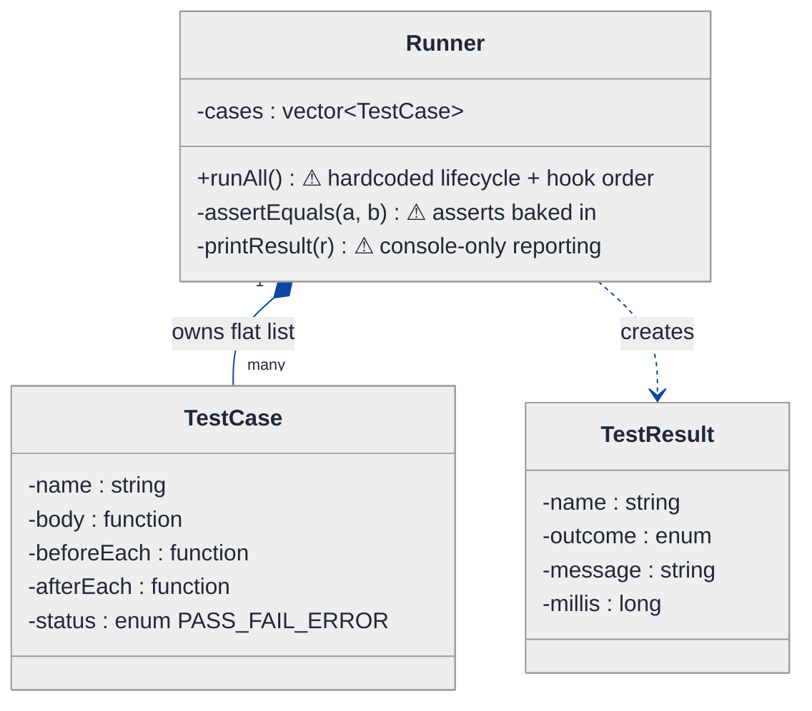
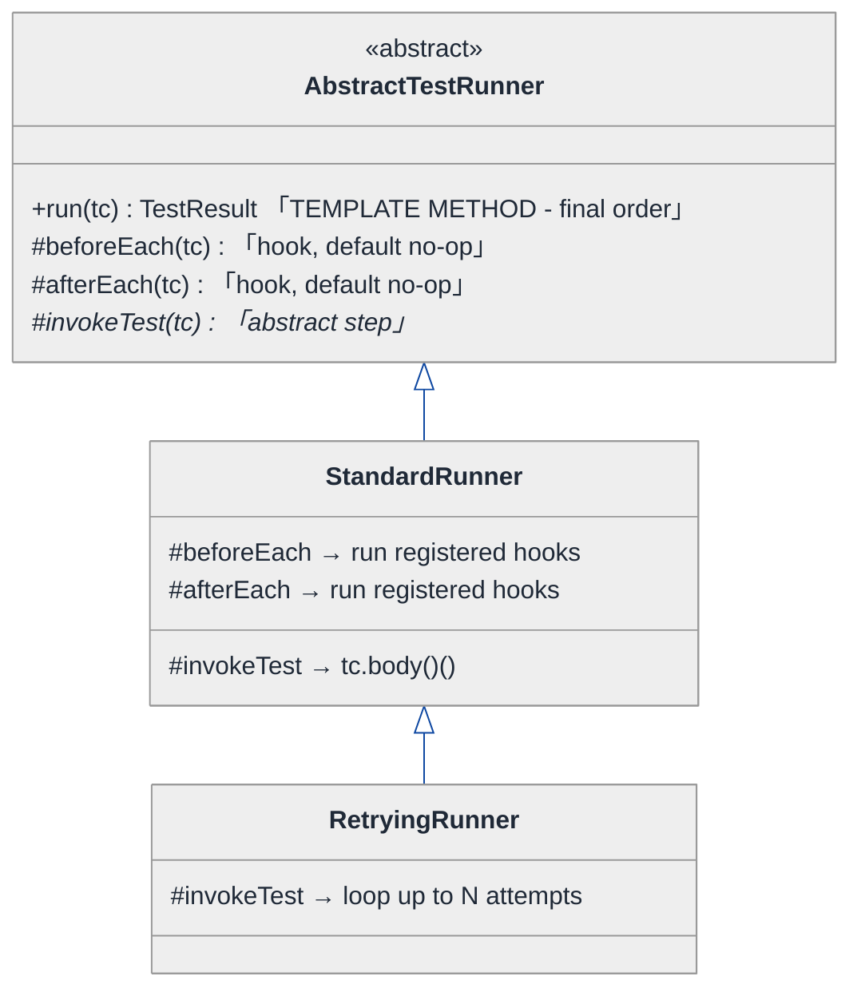
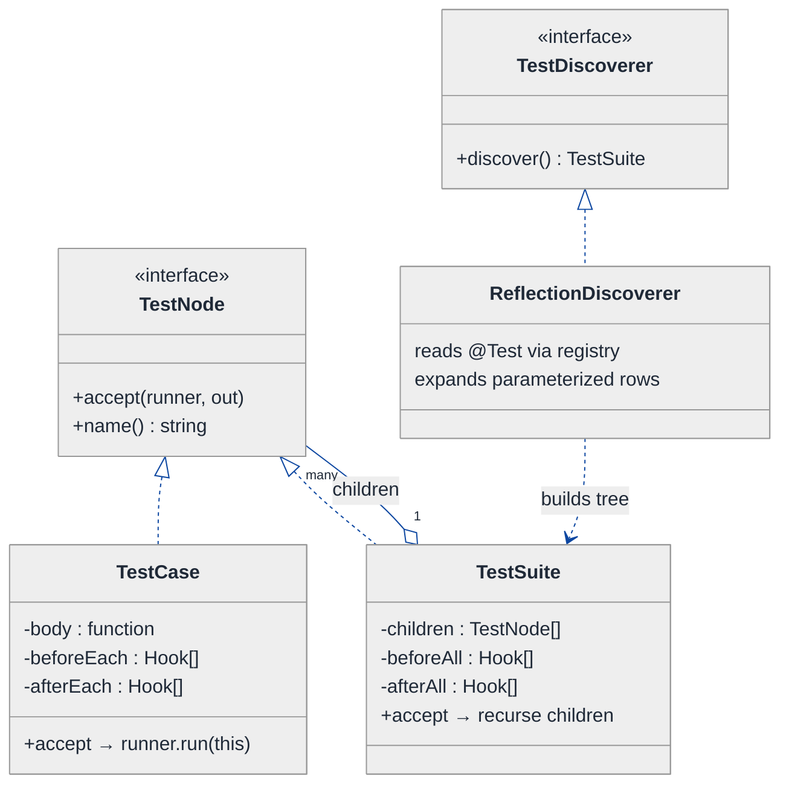
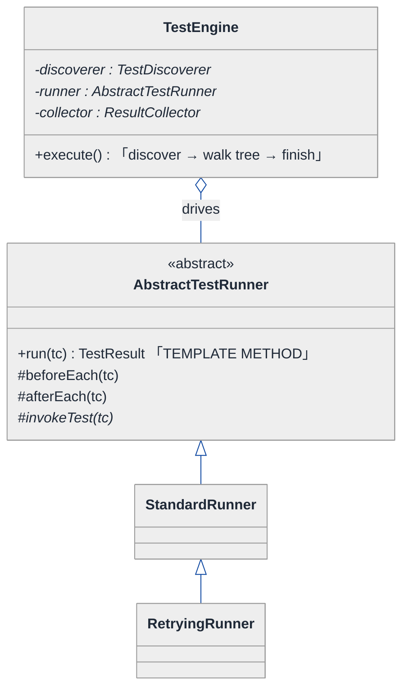
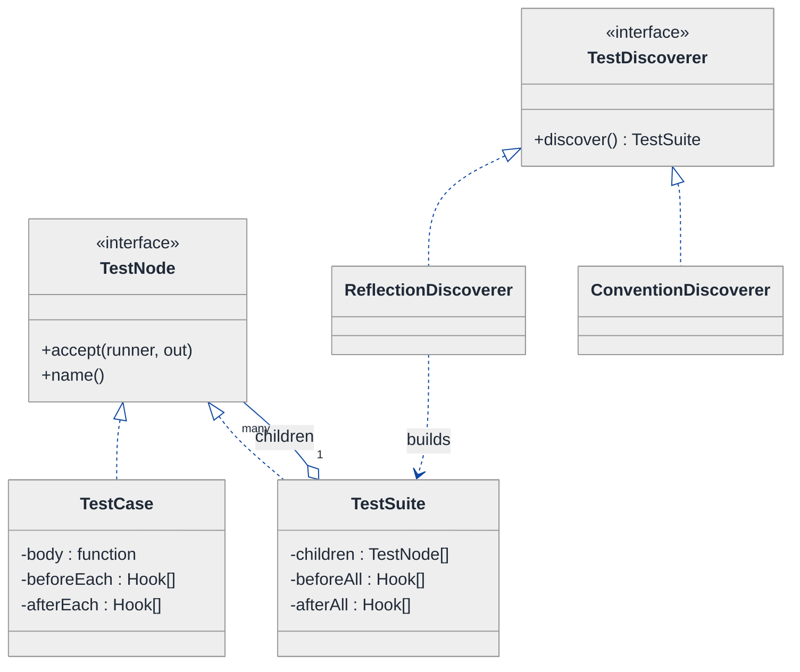
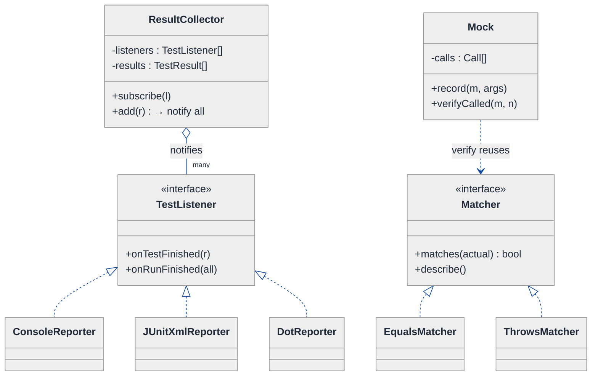
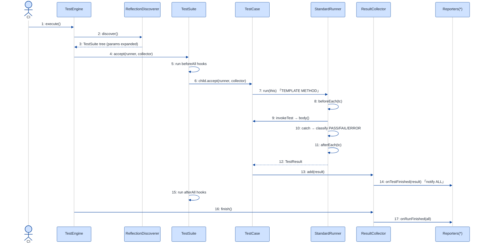

# Test Framework (JUnit / Jest clone) — LLD Walkthrough

> **Difficulty:** Hard · **Time:** ~45 min · **Pattern focus:** Template Method (the run lifecycle) + reflection-driven discovery — with a Composite, a Strategy, and an Observer riding along
>
> **Problem source(s):** GID PL2, bucket `Plugin_Architecture`. Representative of "design JUnit / Jest / pytest" LLD rows in [`./EXTRACTED_QUESTIONS.md`](./EXTRACTED_QUESTIONS.md).
>
> **Diagrams:** inline mermaid (renders natively in GitHub / VS Code). Light theme + soft pastels + navy arrows; no `look: handDrawn`.

---

## How to use this file

Paced for a candidate who has *used* JUnit or Jest but never built one. Reading time: ~45 minutes if you sketch each iteration by hand. **The lesson: a test framework's whole job is to run YOUR code inside a fixed, non-negotiable lifecycle — discover, setup, run, assert, teardown, report. The skeleton of that lifecycle never changes; only the steps you plug into it do. That is the literal definition of the Template Method pattern. We will DERIVE that, not assert it — starting from the naive "a giant runner function" design, watching it crack under five real feature requests, and reaching for one pattern per painful axis.**

**Map of this file (15 sections):**

1. Problem statement + clarifying questions
2. Plain-English restatement
3. Why this matters
4. Mental model
5. Try it yourself first
6. Entity & verb extraction
7. **Iteration 1: the naive design** — one big `runAll()` function
8. **Where the naive design hurts** — five future requirements, one painful diff each
9. **Pivot 1: Template Method for the run lifecycle** — the fixed skeleton, the variable hooks
10. **Pivot 2: Composite for suites + reflection for discovery** — the tree, and how tests get found
11. **Pivot 3: Strategy for assertions/mocks + Observer for reporting** — the remaining axes
12. Final UML class diagram
13. Skeleton code (C++)
14. Key flow — sequence diagram
15. Extensibility re-check + anti-patterns + how to think aloud + self-check

---

## 1. Problem statement + clarifying questions

**Prompt (typical phrasing):** "Design a test framework like JUnit or Jest. It should support test discovery, setup/teardown hooks (`beforeEach` / `afterEach` / `beforeAll` / `afterAll`), assertions, test suites, parameterized tests, mocking support, and test result reporting."

**Clarifying questions to ask BEFORE drawing anything:**

1. **How are tests discovered?** Annotations / attributes on methods (JUnit `@Test`), naming convention (`test_*`, files ending `.test.js`), or explicit registration (`it("...", fn)` like Jest/Mocha)? This single answer dictates whether we lean on reflection or on a registration API.
2. **Hook scope precedence?** When a suite nests inside a suite, do outer `beforeAll`/`beforeEach` run before inner ones? What's the exact ordering contract? (This is the part most candidates get wrong.)
3. **Isolation model?** Does each test get a fresh fixture instance (JUnit's default — new test-class instance per method) or a shared one? Does a failing test abort the suite or just that test?
4. **What counts as a result?** Pass / fail / error (assertion failed vs threw unexpectedly) / skipped? Do we need timing, and a structured report (TAP, JUnit-XML, JSON) or just console output?
5. **Parameterized tests** — supplied as a static data table, or a generator/provider function? One result row per parameter set, or one aggregate?
6. **Mocking depth** — stubs (canned returns) only, or full mocks with call-verification (`expect(mock).toHaveBeenCalledWith(...)`)? Auto-mocking of whole modules, or hand-built fakes?
7. **Concurrency** — tests run sequentially, or in parallel across a thread/process pool? Parallelism changes the reporting and the isolation story a lot.
8. **Language host** — are we cloning JUnit (compiled, annotation + reflection) or Jest (dynamic, registration callbacks)? I'll design the core to work for both and call out where they diverge.

**Assumptions if the interviewer dodges:** annotation/attribute-based discovery via reflection (the JUnit model, since the pattern focus is reflection); strict outer-before-inner hook ordering; fresh fixture per test; results are `{PASS, FAIL, ERROR, SKIPPED}` with timing; parameterized tests expand to one result row each; mocks support both stubbing and call-verification; sequential execution for the core design, with a note on parallelism in §15.

---

## 2. Plain-English restatement

We're building the engine that takes a pile of code somebody else wrote — their test methods, their `beforeEach` hooks, their assertions — and *runs it for them inside a rigid lifecycle*. The framework never knows what a specific test does; it only knows the **shape** of how every test must run: find the tests, build a fixture, run the "before" hooks, invoke the test body, catch failures, run the "after" hooks, record a result, and at the end hand a report to whoever's watching. The design must let users add new assertions, new report formats, new discovery rules, and new mock behaviors **without editing the runner's lifecycle**. The runner's lifecycle is sacred; everything plugged into it is open.

---

## 3. Why this matters

This is a *senior-bar* LLD question because it is the cleanest real-world example of the Template Method pattern you'll ever be handed: the run lifecycle is a fixed algorithm with variable steps. It also forces you to reason about **reflection** (how does code discover and invoke code it has never seen?), about **a tree of suites** (Composite), and about **inversion of control** (the framework calls your code, not the other way round — the "Hollywood Principle"). Interviewers love it because a junior writes one `runAll()` mega-function with the hook order hardcoded, while a senior separates the unchanging skeleton from the pluggable steps. The skill — *recognizing a fixed skeleton with variable steps* — reappears in HTTP middleware pipelines, build systems, game loops, ETL jobs, and request interceptors.

---

## 4. Mental model

A test framework is an **assembly line with fixed stations** that processes parts (tests) it has never seen the blueprint for. The conveyor belt order is bolted down: discover → setup → run → assert → teardown → report. At each station, a robot arm (a *hook*) does whatever the test author programmed — the belt doesn't care what. The framework owns the belt; the user owns the arms.

```
Real-world sketch (NOT a UML diagram yet):

   DISCOVERY                 EXECUTION (per suite, per test)              REPORTING
   ─────────                 ────────────────────────────────            ─────────
  scan classes        ┌──> beforeAll (once for the suite) ──┐
  find @Test    ──>    │     ┌── beforeEach ─────────┐       │   ──>   collect Result
  build a TREE         │     │   run test body       │       │          PASS/FAIL/ERR
  of Suites/Tests      │     │   (assert / mock)     │  x N  │          + timing
                       │     └── afterEach ──────────┘       │   ──>   notify listeners
                       └──> afterAll (once for the suite) ───┘          (console / XML / CI)

   The BELT ORDER is fixed.  The CONTENTS of each station are user-supplied.
```

The KEY insight from this picture: there are exactly two kinds of thing here — the **lifecycle** (fixed, owned by the framework) and the **plug-points** (variable, owned by the user). Almost every design decision below is just "which mechanism makes a plug-point swappable without touching the lifecycle." Lifecycle vs. plug-point is the separation we'll bake into the design.

---

## 5. Try it yourself first

> **Predict before reading on:**
>
> 1. List 5 nouns you'd promote to a class. Which one is the "belt" and which are the "arms"?
> 2. **If I told you that a suite can nest inside another suite, and the outer `beforeEach` must run before the inner `beforeEach`, how would you store the hooks so the runner gets the order right automatically?**
> 3. A parameterized test with 4 rows of data should show up as 4 lines in the report. Where does the "explosion from 1 declaration into 4 results" happen — at discovery time or at run time? What changes about your design depending on the answer?

---

## 6. Entity & verb extraction

> **Mini-refresher: noun → class, but not every noun.**
>
> Naive OOD promotes every noun to a class. Senior OOD promotes a noun only if it has both BEHAVIOR and STATE that need to live together. "Assertion message" stays a field; "TestCase" becomes a class because it bundles a body, hooks, and a result.

**Nouns from the prompt:**

| Noun | Decision | Why |
|---|---|---|
| TestFramework / Runner | Class (top-level coordinator) | Owns the lifecycle, drives everything |
| TestCase | Class | A test body + its identity + produces a Result |
| TestSuite | Class | A named group of cases AND/OR nested suites |
| Hook (before/after each/all) | Class / function object | Has a scope + a body; ordering matters |
| Assertion | Class (static façade) + strategy impls | Behavior: compare actual vs expected, throw on mismatch |
| Mock | Class | State (recorded calls) + behavior (stubbed returns + verify) |
| TestResult | Class | Outcome + timing + failure detail |
| Reporter / Listener | Class (abstract) + impls | Consumes results, emits a report |
| Discoverer | Class (abstract) + impls | Finds tests via reflection / convention / registration |
| `@Test` annotation / attribute | Metadata, read by reflection | Not a class of its own in our domain |
| Test name, file path, line number | Fields | No behavior of their own |

**Verbs (and the class they live on):**

| Verb | Owner class (naive answer — we'll re-examine) |
|---|---|
| discover() | Runner (later: a Discoverer strategy) |
| run() | Runner (later: split into a Template Method) |
| beforeEach() / afterEach() / beforeAll() / afterAll() | Suite / TestCase hooks |
| assertEquals(a, b) | Assertion façade (later: AssertionStrategy) |
| mock() / verify() | Mock |
| record(result) | Runner |
| onTestFinished(result) | Reporter / Listener |

**We have NOT introduced any design patterns yet.** Pure nouns + verbs.

---

## 7. <a id="iter-1"></a>Iteration 1: the naive design

Let's write the simplest thing that could possibly work. One `Runner` with one big `runAll()` method that does the whole lifecycle inline. No design patterns — just a class with a method and a `for` loop.



**Reader's tour (read top to bottom; ~60 seconds).**

1. **`Runner` is the root and does EVERYTHING.** It holds a flat `vector<TestCase>` and exposes one public method, `runAll()`. Notice: NO suite tree (the list is flat), NO reporter abstraction, NO assertion abstraction, NO discovery abstraction. Every decision lives inside `runAll()` and two private helpers.

2. **`TestCase` is an anemic data bag.** It carries a name, a `body` function, one `beforeEach` and one `afterEach` function, and a status enum. There's no `beforeAll`/`afterAll` here at all — and crucially, hooks are stored as single function pointers, so you can register exactly one of each. (Real frameworks let you register many. First crack.)

3. **`TestResult` is fine.** Outcome enum + message + timing. This little record is the one part of the naive design that survives to the end largely unchanged.

4. **The three warning markers (⚠) on `Runner`.**
   - `runAll()` hardcodes the lifecycle AND the hook order in one method body. Every ordering rule is an `if`/loop here.
   - `assertEquals` is a private method ON the runner — adding `assertThrows`, `assertContains` means editing the runner.
   - `printResult` writes to `std::cout` directly — there's no way to emit JUnit-XML for CI without rewriting it.

5. **Discovery doesn't exist yet.** In the naive design the user hand-builds the `vector<TestCase>` and passes it in. There's no scanning, no `@Test`, no convention. We'll confront that in §8 / §10.

**What's deliberately missing.** No `TestSuite` (so no nesting, no per-suite hooks). No `Reporter` interface. No `AssertionStrategy`. No `Discoverer`. No `Mock`. The naive design doesn't even *acknowledge* these as axes — it bakes a single hardcoded answer for each into `runAll()`. That's what the next section exposes.

Skeleton code for the naive design (C++):

```cpp
#include <chrono>
#include <functional>
#include <iostream>
#include <stdexcept>
#include <string>
#include <vector>

enum class Outcome { PASS, FAIL, ERROR };

struct TestResult {
    std::string name;
    Outcome     outcome = Outcome::PASS;
    std::string message;
    long        millis = 0;
};

struct TestCase {
    std::string           name;
    std::function<void()> body;
    std::function<void()> beforeEach;   // only ONE allowed — first crack
    std::function<void()> afterEach;
};

class Runner {
public:
    explicit Runner(std::vector<TestCase> cases) : cases_(std::move(cases)) {}

    void runAll() {                                   // the WHOLE lifecycle, hardcoded
        for (auto& tc : cases_) {
            TestResult r{tc.name};
            auto start = std::chrono::steady_clock::now();
            try {
                if (tc.beforeEach) tc.beforeEach();    // hook order baked in here
                tc.body();                             // run the test
                r.outcome = Outcome::PASS;
            } catch (const std::logic_error& e) {      // assertion failure
                r.outcome = Outcome::FAIL;  r.message = e.what();
            } catch (const std::exception& e) {        // unexpected throw
                r.outcome = Outcome::ERROR; r.message = e.what();
            }
            try { if (tc.afterEach) tc.afterEach(); } catch (...) {}  // teardown
            r.millis = std::chrono::duration_cast<std::chrono::milliseconds>(
                           std::chrono::steady_clock::now() - start).count();
            printResult(r);                            // console-only reporting
        }
    }

private:
    // assertions baked into the runner — adding one means editing this class
    static void assertEquals(int a, int b) {
        if (a != b) throw std::logic_error("expected " + std::to_string(b) +
                                           " but got " + std::to_string(a));
    }
    static void printResult(const TestResult& r) {     // cout-only
        std::cout << (r.outcome == Outcome::PASS ? "[PASS] " : "[FAIL] ")
                  << r.name << " (" << r.millis << "ms) " << r.message << "\n";
    }
    std::vector<TestCase> cases_;
};
```

**This works.** It has zero design patterns. We can register cases, run them, catch failures, print results. So what's wrong with it?

---

## 8. <a id="naive-pain"></a>Where the naive design hurts

The interviewer slides a piece of paper across the desk: "Here are five features users are asking for. Walk me through what changes."

### Change A: "Add `beforeAll` / `afterAll` and allow MULTIPLE `beforeEach` hooks"

In the naive design:
- `TestCase` stores a *single* `beforeEach` function. To allow many, change it to a `vector`.
- There's no per-suite scope at all, so `beforeAll` has nowhere to live — you'd bolt suite-level state onto the `Runner` with flags like `bool ranBeforeAll`.
- `runAll()` grows new branches: "if first case in suite, run beforeAll; if last, run afterAll." **The lifecycle method becomes the dumping ground for every ordering rule.**

### Change B: "Support test SUITES that NEST, with outer-before-inner hook ordering"

In the naive design:
- `Runner` owns a **flat** `vector<TestCase>`. There is no tree. Nesting is unrepresentable.
- To fake it you'd add a `suitePath` string field and sort/group inside `runAll()`, then compute hook order by string-prefix matching. **The ordering logic becomes a 40-line correctness minefield in one method.**
- This is the single ugliest diff. The naive shape (flat list + one mega-method) is fundamentally wrong for a recursive domain.

### Change C: "Parameterized tests — one `@Test` with a data table of N rows → N result lines"

In the naive design:
- A test is one `TestCase` with one `body`. There's no concept of "expand this declaration into N runnable instances."
- You'd special-case it inside `runAll()`: "if this case has params, loop the body N times and synthesize N names." **More branching in the mega-method; the loop body now has two modes.**

### Change D: "Pluggable assertions (`assertThrows`, `assertContains`) AND mocking with call-verification"

In the naive design:
- Assertions are private static methods on `Runner`. Each new assertion edits `Runner`.
- Mocking doesn't exist. A mock needs to record calls and later verify them — that's a stateful object the test holds, totally absent from this design. Bolting it on means... another helper on `Runner`? **Assertions and mocks are user-extensible axes wedged into the framework class.**

### Change E: "Emit JUnit-XML for CI in addition to console output; also a live progress dot per test"

In the naive design:
- `printResult` hardcodes `std::cout`. To add XML you add an `if (format == XML)` branch; to add live dots you add another. **Every output format is surgery in `printResult`, and you can't have console + XML + CI-webhook all at once.**

### The pattern of pain

| Change | Files / methods touched | Smell |
|---|---|---|
| A. before/afterAll, multi-hooks | `TestCase` fields + `runAll()` branches | "Lifecycle method accretes every ordering rule." |
| B. Nested suites | `Runner` data model + `runAll()` (rewrite) | "Flat list models a tree; ordering logic explodes." |
| C. Parameterized tests | `runAll()` gains a second mode | "One declaration must become N runnables; no expansion point." |
| D. Assertions + mocks | `Runner` private methods | "User-extensible behaviors trapped inside the framework class." |
| E. Multiple report formats | `printResult` switch | "Output destination hardcoded; can't fan out." |

**Three axes of pain dominate.** (1) The **lifecycle is fixed but its steps vary** (hooks, the run order) — Changes A, B, C all push on the run skeleton. (2) The **structure is a tree, and discovery is mechanical** — Change B needs a recursive container, and "where do cases come from" is its own concern. (3) **Several behaviors are user-pluggable** — assertions, mocks (Change D), report formats (Change E).

> **Pivot question:** "What pattern keeps an algorithm's SKELETON fixed while letting subclasses fill in the STEPS? What structure lets a suite contain suites uniformly? And what pattern lets results fan out to many independent consumers?"
>
> The answers are **Template Method** (the lifecycle skeleton), **Composite** (the suite tree) + **reflection** (discovery), and **Strategy + Observer** (assertions/mocks + reporting). Let's introduce them one at a time, starting with the most painful axis: the run lifecycle.

---

## 9. <a id="pivot-1"></a>Pivot 1: Template Method for the run lifecycle

Changes A, B and C all push on the SAME thing: the order and content of the run lifecycle. The lifecycle *shape* never changes — discover, beforeAll, (beforeEach, body, afterEach)×N, afterAll, report. What changes is what each step *does*. That is exactly what Template Method is for.

> **Mini-refresher: Template Method pattern.**
>
> Define the SKELETON of an algorithm in a base-class method (the "template method"), and defer specific STEPS to subclasses via overridable hook methods. The template method is usually `final` (non-overridable) — it locks the order; subclasses only fill the holes. It is the **inverse of Strategy**: Strategy varies the whole algorithm via *composition*; Template Method varies the *steps* via *inheritance*.
>
> Quick example: a `Game` base class has `final play() { initialize(); while(!over()) makeMove(); end(); }`. `Chess` and `Checkers` override `initialize()`, `makeMove()`, `over()` — but neither can change the play() order.

> **Mini-refresher: Inversion of Control / the Hollywood Principle.**
>
> "Don't call us, we'll call you." In a library, YOUR code calls the library. In a framework, the FRAMEWORK calls your code — your test bodies and hooks are plugged into a lifecycle the framework drives. Template Method is the classic mechanism: the framework owns the loop; you own the steps.

**Why Template Method fits the lifecycle.** The lifecycle is one fixed algorithm. Its variable parts (`setUp`, the test invocation, `tearDown`) are *steps within that algorithm*, not whole interchangeable algorithms. The order must be locked so users can't accidentally reorder teardown before the body. That's a skeleton-with-hooks, not a swap-the-whole-thing — so Template Method, not Strategy. (We'll contrast them explicitly below.)

**The refactor (just the lifecycle).** We introduce an abstract `AbstractTestRunner` whose `run(node)` is the locked template method; concrete runners override the hooks.

```cpp
class TestResult; class TestNode;          // forward

class AbstractTestRunner {
public:
    virtual ~AbstractTestRunner() = default;

    // THE TEMPLATE METHOD — the lifecycle skeleton. Non-virtual on purpose:
    // subclasses fill the hooks, they do NOT get to reorder the steps.
    TestResult run(TestCase& tc) {
        TestResult r{tc.name()};
        auto start = now();
        beforeEach(tc);                          // hook (overridable)
        try {
            invokeTest(tc);                      // hook (overridable)
            r.outcome = Outcome::PASS;
        } catch (const AssertionError& e) {      // hook decides how to classify
            r.outcome = Outcome::FAIL;  r.message = e.what();
        } catch (const std::exception& e) {
            r.outcome = Outcome::ERROR; r.message = e.what();
        }
        afterEach(tc);                           // hook — always runs (teardown)
        r.millis = elapsedMs(start);
        return r;
    }

protected:
    // overridable STEPS — defaults provided so simple runners stay tiny
    virtual void beforeEach(TestCase&) {}
    virtual void afterEach(TestCase&)  {}
    virtual void invokeTest(TestCase& tc) = 0;   // pure: the one step everyone must define

private:
    static long now();                           // elided
    static long elapsedMs(long start);           // elided
};

// A standard runner: fresh fixture per test, runs the registered hooks
class StandardRunner : public AbstractTestRunner {
protected:
    void beforeEach(TestCase& tc) override { for (auto& h : tc.beforeEachHooks()) h(); }
    void afterEach(TestCase& tc)  override { for (auto& h : tc.afterEachHooks())  h(); }
    void invokeTest(TestCase& tc) override { tc.body()(); }
};

// A retrying runner: SAME skeleton, different invoke step. Zero lifecycle edits.
class RetryingRunner : public StandardRunner {
public:
    explicit RetryingRunner(int maxAttempts) : max_(maxAttempts) {}
protected:
    void invokeTest(TestCase& tc) override {
        for (int i = 0; i < max_; ++i) {
            try { tc.body()(); return; }
            catch (const AssertionError&) { if (i == max_ - 1) throw; }
        }
    }
private:
    int max_;
};
// other runners (DryRunRunner, ParameterizedRunner) elided
```

**What changed — visualized.** Just the lifecycle slice:



**Tour of the after-state.**

1. **Top box: `AbstractTestRunner` with the template method `run()`.** Read the four members. `run()` is the skeleton — it owns the order (before → invoke → catch → after → time → result) and is *non-virtual* so nobody can reorder it. The other three are protected hooks.

2. **Two hooks have default no-op bodies.** `beforeEach`/`afterEach` default to doing nothing, so a trivial runner doesn't have to implement them. This is the "hook method" half of Template Method (optional override) versus the "abstract operation" half (mandatory override).

3. **`invokeTest` is pure-virtual (the `*`).** It's the one step EVERY runner must define — "how do I actually call the test body." That's the minimal contract.

4. **`StandardRunner` fills all three hooks** with the normal behavior: run the registered before/after hooks, call the body once.

5. **`RetryingRunner` overrides ONLY `invokeTest`** to retry flaky tests up to N times. **It inherited the entire lifecycle for free and changed exactly one step.** That is the payoff: a new run behavior is one overridden method, zero lifecycle edits — directly answering Change C's "second mode" smell from §8.

**Changes A and C now have a home.** Multiple `beforeEach` hooks → the `beforeEach()` hook loops a `vector` (we'll store those on the node in Pivot 2). Parameterized tests → a `ParameterizedRunner` that overrides `invokeTest` to loop the body over each data row, or — cleaner — expansion at discovery time (Pivot 2). Either way, **the skeleton in `run()` is never touched.**

**Pattern-discrimination cheatsheet — Template Method vs Strategy.**
- *Template Method:* fixed algorithm skeleton in a base class; subclasses fill STEPS via **inheritance**. The order is locked.
- *Strategy:* the WHOLE algorithm is one swappable object, chosen at runtime via **composition**. No fixed skeleton.
- *Rule of thumb:* "I want to vary a few steps inside an order I must protect" → Template Method. "I want to swap the entire behavior, maybe combine variants, at runtime" → Strategy.

We chose Template Method for the lifecycle because the *order is the product* — JUnit's contract is precisely "beforeEach runs before the body, afterEach always runs after." You cannot let a caller compose that away. (We'll use Strategy in Pivot 3 for assertions, where there is no order to protect.)

---

## 10. <a id="pivot-2"></a>Pivot 2: Composite for the suite tree + reflection for discovery

Change B from §8 is still unsolved — nested suites with outer-before-inner hook ordering — and we still have no answer for "where do the tests even come from." These are two faces of the same structural problem: the domain is a **recursive tree**, and something has to **populate** it.

### 10a. Composite — a suite IS-A test node, and so is a test

> **Mini-refresher: Composite pattern.**
>
> Compose objects into TREE structures and let clients treat individual objects (leaves) and groups of objects (composites) **uniformly** through one shared interface. A `Folder` and a `File` both implement `FileSystemNode::size()`; the folder's `size()` recurses over its children, the file's returns its own bytes — but the caller calls `size()` without caring which it holds.

**Why Composite fits suites.** A `TestSuite` can contain `TestCase`s AND other `TestSuite`s, arbitrarily deep — that's the textbook tree. If both implement a common `TestNode` interface with `accept(runner)` / `collectResults()`, the runner can walk the tree recursively without ever asking "are you a suite or a case?" And the outer-before-inner hook ordering falls out *for free* from the recursion: a suite runs its own `beforeAll`, then recurses into children (whose `beforeEach` therefore runs *inside* the parent's scope), then its `afterAll`. The minefield from §8 Change B becomes structural.

```cpp
class TestNode {
public:
    virtual ~TestNode() = default;
    virtual void accept(AbstractTestRunner& runner, ResultCollector& out) = 0;
    virtual const std::string& name() const = 0;
};

// LEAF
class TestCase : public TestNode {
public:
    void accept(AbstractTestRunner& runner, ResultCollector& out) override {
        out.add(runner.run(*this));            // one node → one (or N) results
    }
    const std::vector<Hook>& beforeEachHooks() const { return beforeEach_; }
    const std::vector<Hook>& afterEachHooks()  const { return afterEach_;  }
    const std::function<void()>& body() const { return body_; }
    const std::string& name() const override { return name_; }
private:
    std::string                  name_;
    std::function<void()>        body_;
    std::vector<Hook>            beforeEach_, afterEach_;
};

// COMPOSITE
class TestSuite : public TestNode {
public:
    void accept(AbstractTestRunner& runner, ResultCollector& out) override {
        for (auto& h : beforeAll_) h();                 // outer setup, once
        for (auto& child : children_) {                 // recurse — order is structural
            // (beforeEach of THIS suite is layered onto each leaf via the runner;
            //  nested suites recurse, so outer-before-inner is automatic)
            child->accept(runner, out);
        }
        for (auto& h : afterAll_) h();                  // outer teardown, once
    }
    void add(std::unique_ptr<TestNode> child) { children_.push_back(std::move(child)); }
    const std::string& name() const override { return name_; }
private:
    std::string                              name_;
    std::vector<std::unique_ptr<TestNode>>   children_;   // cases AND/OR sub-suites
    std::vector<Hook>                        beforeAll_, afterAll_, beforeEach_, afterEach_;
};
```

### 10b. Reflection — how tests get DISCOVERED into that tree

Now: who builds the tree? In JUnit you don't register tests by hand — you annotate methods `@Test` and the framework *finds them by reflection*. This is the heart of why the question lives in the `Plugin_Architecture` bucket and names reflection as the focus.

> **Mini-refresher: reflection (and how a compiled language fakes it).**
>
> Reflection = a program inspecting and invoking its own structure (types, methods, annotations) at runtime, by name, without compile-time knowledge of it. Java/C# have it built in: scan a class, find methods carrying `@Test`, invoke them via `Method.invoke()`. C++ has **no** native reflection, so frameworks emulate it with a **self-registration registry**: a macro (`TEST(SuiteName, TestName)`) expands to a static object whose constructor registers the test function into a global registry before `main()` runs. GoogleTest does exactly this. Either way, the *discovery mechanism is pluggable* — which is itself an axis of variation.

> **Mini-refresher: Strategy pattern.**
>
> Define a family of interchangeable algorithms, encapsulate each behind ONE shared interface, and let a *context* hold a pointer to the chosen one and delegate to it via **composition** — so the algorithm can be swapped at runtime with no `if`/`switch` in the context. Unlike Template Method, there is **no fixed skeleton or order to protect**: each strategy is a whole, independently-valid algorithm, and the caller (or wiring) picks which one to plug in.
>
> Quick example: a checkout `Cart` holds a `PaymentStrategy*`; `CreditCardPayment`, `PayPalPayment`, and `CryptoPayment` all implement `pay(amount)`, and the cart calls `strategy->pay(total)` without knowing or caring which it holds.

Because discovery varies (annotation scan vs. filename convention `*.test.js` vs. explicit `it(...)` registration), we put it behind a small **Strategy** interface — the framework doesn't bake in one discovery rule:

```cpp
class TestDiscoverer {                          // Strategy for "where tests come from"
public:
    virtual ~TestDiscoverer() = default;
    virtual std::unique_ptr<TestSuite> discover() = 0;   // builds the Composite tree
};

// JUnit-style: reflect over registered types, read @Test metadata
class ReflectionDiscoverer : public TestDiscoverer {
public:
    std::unique_ptr<TestSuite> discover() override {
        auto root = std::make_unique<TestSuite>();
        for (const auto& entry : TestRegistry::instance().all()) {   // self-registration
            // group by entry.suiteName, attach @BeforeEach/@AfterEach metadata, expand params
            // ... build leaves + sub-suites, parameterized rows expand to N TestCases here ...
        }
        return root;                            // a fully-built tree, ready to run
    }
};
// ConventionDiscoverer (scan *.test.* files), RegistrationDiscoverer (Jest it()) — elided
```

**Note where parameterized tests resolve.** `discover()` is the right place to expand "one `@Test` + a 4-row data table" into **four `TestCase` leaves**, each with its row baked into the body. That answers the §5 prediction-prompt #3: expansion at *discovery* time keeps the runner's lifecycle (Pivot 1) blissfully unaware that parameterization exists — it just sees four ordinary leaves.

**What changed — visualized.** The structure + discovery slice:



**Tour of the after-state.**

1. **`TestNode` is the uniform interface** with `accept(runner, out)`. Both a single test and a whole suite implement it — the caller treats them identically.

2. **`TestCase` is the LEAF.** Its `accept` does the simplest thing: ask the runner to `run(this)` and drop the result(s) into the collector.

3. **`TestSuite` is the COMPOSITE.** Look at its `children : TestNode[]` field with the open-diamond aggregation to `TestNode` — **a suite holds other nodes, which may themselves be suites.** Its `accept` runs `beforeAll`, recurses over children, runs `afterAll`. Because recursion nests, an outer suite's setup necessarily wraps an inner suite's — **outer-before-inner ordering is now a property of the tree walk, not a string-sorting hack.** That's the §8 Change B minefield, defused.

4. **`TestDiscoverer` + `ReflectionDiscoverer`** sit off to the side. The discoverer's whole job is to *produce* the `TestSuite` tree (note the `builds tree` dependency arrow). Reflection reads `@Test` metadata from the self-registration registry and, while it's at it, expands parameterized declarations into multiple leaves.

5. **Discovery is decoupled from execution.** The runner (Pivot 1) consumes a tree; the discoverer produces one. Swap `ReflectionDiscoverer` for `ConventionDiscoverer` and the runner doesn't blink.

**Pattern-discrimination cheatsheet — Composite vs Decorator.**
- *Composite:* a tree of MANY children behind one interface; operations recurse over the children. Goal: *uniformity across a hierarchy.*
- *Decorator:* a chain of ONE wrapped object behind the same interface; each layer adds behavior then delegates. Goal: *stacking responsibilities on one thing.*
- *Rule of thumb:* "a thing that contains a *list* of things of its own type" → Composite. "a wrapper that holds *one* inner thing and augments it" → Decorator.

We chose Composite because a suite genuinely contains *many* nodes and we walk all of them; we are not wrapping a single test to add behavior.

---

## 11. <a id="pivot-3"></a>Pivot 3: Strategy for assertions/mocks + Observer for reporting

Changes D and E remain. They're the "user-pluggable behavior" axis: assertions/mocks (D) and report fan-out (E). Two different patterns, because the requirements differ.

### 11a. Strategy for assertions and mocks

Assertions vary (`assertEquals`, `assertThrows`, `assertContains`, custom matchers) and the *caller* picks which to use. There is no fixed order to protect — so this is Strategy, not Template Method. In practice assertions are a thin façade over a matcher Strategy:

```cpp
class AssertionError : public std::logic_error {     // distinct type → runner classifies as FAIL
public: using std::logic_error::logic_error;
};

class Matcher {                                       // Strategy: actual → pass/fail + message
public:
    virtual ~Matcher() = default;
    virtual bool matches(const std::any& actual) const = 0;
    virtual std::string describe() const = 0;
};
class EqualsMatcher   : public Matcher { /* actual == expected_ */ };
class ThrowsMatcher   : public Matcher { /* invoking actual throws */ };
class ContainsMatcher : public Matcher { /* container holds element_ */ };

// thin façade the test author calls; throws AssertionError on miss
template <class T>
void expect(const T& actual, const Matcher& m) {
    if (!m.matches(actual)) throw AssertionError("expected " + m.describe());
}
```

Mocking is a small stateful object — it *records* calls (state) and later *verifies* them (behavior). The verify step reuses the same Matcher Strategy:

```cpp
class Mock {
public:
    void record(const std::string& method, std::vector<std::any> args) {
        calls_.push_back({method, std::move(args)});
    }
    template <class... A> void stub(const std::string& method, std::any ret) { /* canned return */ }
    void verifyCalled(const std::string& method, int times) const {
        if (countOf(method) != times)
            throw AssertionError(method + " called " + std::to_string(countOf(method)) +
                                 " times, expected " + std::to_string(times));
    }
private:
    struct Call { std::string method; std::vector<std::any> args; };
    int countOf(const std::string& m) const; // elided
    std::vector<Call> calls_;
};
```

### 11b. Observer for reporting

Change E wanted console + JUnit-XML + a live progress dot, possibly all at once. That's one event source ("a test finished") and many independent consumers — the textbook Observer setup.

> **Mini-refresher: Observer pattern.**
>
> A *subject* maintains a list of *observers* and notifies every one of them when an event occurs — `subject.notify(event)` loops and calls `observer.onEvent(event)`. Observers are decoupled from each other and from the subject's internals; you add a consumer by registering it, not by editing the subject. Push model (the subject hands the event over) vs. pull model (observers query the subject) — we use push here.

```cpp
class TestListener {                                  // Observer
public:
    virtual ~TestListener() = default;
    virtual void onTestFinished(const TestResult& r) {}
    virtual void onRunFinished(const std::vector<TestResult>& all) {}
};
class ConsoleReporter : public TestListener { /* prints [PASS]/[FAIL] per test */ };
class JUnitXmlReporter : public TestListener { /* buffers, writes <testsuite> XML at end */ };
class DotReporter      : public TestListener { /* prints '.' or 'F' per test, live */ };

// the ResultCollector is the SUBJECT — fans every result out to all listeners
class ResultCollector {
public:
    void subscribe(std::shared_ptr<TestListener> l) { listeners_.push_back(std::move(l)); }
    void add(const TestResult& r) {
        results_.push_back(r);
        for (auto& l : listeners_) l->onTestFinished(r);   // push to ALL observers
    }
    void finish() { for (auto& l : listeners_) l->onRunFinished(results_); }
private:
    std::vector<TestResult>                       results_;
    std::vector<std::shared_ptr<TestListener>>    listeners_;
};
```

**The lesson.** Once we recognized "pick which behavior, caller decides, no order to protect" for assertions, Strategy applied to mocks-verification too. And "one event, many consumers" mapped straight to Observer for reporting. **Pattern recognition makes the last two axes nearly free.**

> **Mini-refresher: why assertions are Strategy but the lifecycle is Template Method.**
>
> Both involve "pluggable behavior," so why different patterns? Because the lifecycle has an *order that is the product* (teardown MUST follow the body) — you protect it with a locked skeleton (Template Method). Assertions have *no order to protect* — any matcher is independently valid, and the caller picks per call site — so you swap whole matchers via composition (Strategy). The deciding question is always: *is there an order I must prevent the user from breaking?*

**Pattern-discrimination cheatsheet — Observer vs Strategy.**
- *Observer:* one-to-MANY notification; subject pushes an event to all registered listeners; listeners don't return a decision.
- *Strategy:* one-to-ONE delegation; the context calls the single chosen algorithm and uses its return value.
- *Rule of thumb:* "fan an event out to N consumers who each react independently" → Observer. "delegate one decision to one swappable algorithm and use the answer" → Strategy.

---

## 12. <a id="fig-class-diagram"></a>Final class diagram

One diagram of everything is a wall of boxes. Here are **three focused sub-views**, each a different concern. Read them in order; the structural insight at the end ties them together.

### 12.1 The lifecycle engine — Template Method (what the framework OWNS)



**Tour of 12.1.** `TestEngine` is the thin top-level coordinator: it holds a discoverer, a runner, and a collector (all injected). Its `execute()` is the outermost orchestration — get the tree from the discoverer, walk it with the runner, tell the collector to finish. The real lifecycle lock lives one level down in `AbstractTestRunner::run()` — the template method. Concrete runners (`StandardRunner`, `RetryingRunner`) fill the hooks; they cannot touch the order.

### 12.2 The structure + discovery — Composite + Strategy (what gets RUN, and where it comes from)



**Tour of 12.2.**

1. **`TestNode` is the uniform interface;** `TestCase` (leaf) and `TestSuite` (composite) both implement it. The self-referential `TestSuite o-- TestNode` (open diamond, "children") is the Composite recursion — a suite holds nodes that may be suites.

2. **Hooks live where they belong:** per-test `beforeEach`/`afterEach` on `TestCase`, suite-wide `beforeAll`/`afterAll` on `TestSuite`. Because execution recurses the tree, outer suite hooks naturally wrap inner ones — ordering is structural.

3. **`TestDiscoverer` is a Strategy** with two concrete impls — reflection (JUnit) and convention (Jest-style filename scan). The `builds` dependency shows discovery *produces* the tree the runner later *consumes*. Parameterized expansion happens inside `discover()`.

### 12.3 The pluggables — Strategy (assertions/mocks) + Observer (reporting)



**Tour of 12.3.**

1. **`ResultCollector` is the Observer SUBJECT.** It holds `listeners : TestListener[]` and, on every `add(result)`, pushes the result to all of them. Add a CI-webhook reporter by `subscribe()`-ing it — zero edits to the collector.

2. **Three reporters** implement `TestListener`. Console, JUnit-XML, and a live dot reporter can all run at once — Change E from §8, fully fanned out.

3. **`Matcher` is the assertion Strategy.** `EqualsMatcher`, `ThrowsMatcher`, etc. The `expect()` façade picks one per call site.

4. **`Mock` is a small stateful collaborator** that records calls and, in `verifyCalled`, *reuses the Matcher Strategy* (the `verify reuses` dependency) so verification failures look exactly like assertion failures to the runner.

### Structural insight (ties 12.1 + 12.2 + 12.3 together)

| Concern | Pattern used | Why |
|---|---|---|
| **Run lifecycle** (before → body → after → result) | Template Method, INHERITED | The order is the product; lock it in a skeleton, vary only steps |
| **Suite structure** (suites containing suites/cases) | Composite | Recursive tree; uniform `accept()`; outer-before-inner is free |
| **Discovery** (annotation / convention / registration) | Strategy + reflection | Where tests come from varies; reflection finds + expands them |
| **Assertions & mock-verify** (equals / throws / custom) | Strategy | Caller picks the matcher; no order to protect |
| **Reporting** (console / XML / dots / CI) | Observer | One "test finished" event, many independent consumers |

The big lesson: **inheritance appears in exactly one place — the runner's lifecycle — because that's the only spot with an order worth locking.** Every other "varies independently" axis is composition over an interface (Strategy, Composite, Observer). *Inheritance to protect an algorithm's order; composition for everything else.* That distinction is the whole answer.

---

## 13. Skeleton code (C++)

> Show the SHAPES, not the full impl. ~140 lines. The Template Method (`run`), the Composite (`accept`), and the Observer subject (`ResultCollector`) are the load-bearing pieces; the rest is `// elided`.

```cpp
#include <any>
#include <chrono>
#include <functional>
#include <memory>
#include <stdexcept>
#include <string>
#include <vector>

// ── Forward declarations ────────────────────────────────────────────
class TestCase;
class AbstractTestRunner;
class ResultCollector;

// ── Results ─────────────────────────────────────────────────────────
enum class Outcome { PASS, FAIL, ERROR, SKIPPED };

struct TestResult {
    std::string name;
    Outcome     outcome = Outcome::PASS;
    std::string message;
    long        millis = 0;
};

using Hook = std::function<void()>;

class AssertionError : public std::logic_error {     // distinct type → classified FAIL
public: using std::logic_error::logic_error;
};

// ── Composite: TestNode / TestCase (leaf) / TestSuite (composite) ────
class TestNode {
public:
    virtual ~TestNode() = default;
    virtual void accept(AbstractTestRunner& runner, ResultCollector& out) = 0;
    virtual const std::string& name() const = 0;
};

class TestCase : public TestNode {                   // LEAF
public:
    TestCase(std::string n, Hook body) : name_(std::move(n)), body_(std::move(body)) {}
    void accept(AbstractTestRunner& runner, ResultCollector& out) override;   // defined below
    const std::string& name() const override { return name_; }
    const Hook& body() const { return body_; }
    const std::vector<Hook>& beforeEachHooks() const { return beforeEach_; }
    const std::vector<Hook>& afterEachHooks()  const { return afterEach_;  }
    void addBeforeEach(Hook h) { beforeEach_.push_back(std::move(h)); }       // many allowed
    void addAfterEach(Hook h)  { afterEach_.push_back(std::move(h));  }
private:
    std::string       name_;
    Hook              body_;
    std::vector<Hook> beforeEach_, afterEach_;
};

class TestSuite : public TestNode {                  // COMPOSITE
public:
    explicit TestSuite(std::string n) : name_(std::move(n)) {}
    void accept(AbstractTestRunner& runner, ResultCollector& out) override {
        for (auto& h : beforeAll_) h();              // suite setup, once
        for (auto& child : children_) child->accept(runner, out);   // recurse — order is structural
        for (auto& h : afterAll_) h();               // suite teardown, once
    }
    const std::string& name() const override { return name_; }
    void add(std::unique_ptr<TestNode> c) { children_.push_back(std::move(c)); }
private:
    std::string                            name_;
    std::vector<std::unique_ptr<TestNode>> children_;          // cases AND/OR sub-suites
    std::vector<Hook>                      beforeAll_, afterAll_;
};

// ── Template Method: the run lifecycle ──────────────────────────────
class AbstractTestRunner {
public:
    virtual ~AbstractTestRunner() = default;

    // THE TEMPLATE METHOD — locked order; subclasses fill the hooks only.
    TestResult run(TestCase& tc) {
        TestResult r{tc.name()};
        auto start = std::chrono::steady_clock::now();
        beforeEach(tc);                               // hook
        try {
            invokeTest(tc);                           // hook (mandatory)
            r.outcome = Outcome::PASS;
        } catch (const AssertionError& e) {
            r.outcome = Outcome::FAIL;  r.message = e.what();
        } catch (const std::exception& e) {
            r.outcome = Outcome::ERROR; r.message = e.what();
        }
        afterEach(tc);                                // hook — always runs
        r.millis = std::chrono::duration_cast<std::chrono::milliseconds>(
                       std::chrono::steady_clock::now() - start).count();
        return r;
    }
protected:
    virtual void beforeEach(TestCase&) {}             // hook method (optional)
    virtual void afterEach(TestCase&)  {}
    virtual void invokeTest(TestCase& tc) = 0;        // abstract operation (mandatory)
};

class StandardRunner : public AbstractTestRunner {
protected:
    void beforeEach(TestCase& tc) override { for (auto& h : tc.beforeEachHooks()) h(); }
    void afterEach(TestCase& tc)  override { for (auto& h : tc.afterEachHooks())  h(); }
    void invokeTest(TestCase& tc) override { tc.body()(); }
};
// RetryingRunner, DryRunRunner — elided (each overrides ONE step)

// ── Observer: reporting ─────────────────────────────────────────────
class TestListener {                                 // observer
public:
    virtual ~TestListener() = default;
    virtual void onTestFinished(const TestResult&) {}
    virtual void onRunFinished(const std::vector<TestResult>&) {}
};
// ConsoleReporter, JUnitXmlReporter, DotReporter — elided

class ResultCollector {                              // subject
public:
    void subscribe(std::shared_ptr<TestListener> l) { listeners_.push_back(std::move(l)); }
    void add(const TestResult& r) {
        results_.push_back(r);
        for (auto& l : listeners_) l->onTestFinished(r);    // push to ALL
    }
    void finish() { for (auto& l : listeners_) l->onRunFinished(results_); }
private:
    std::vector<TestResult>                    results_;
    std::vector<std::shared_ptr<TestListener>> listeners_;
};

// leaf accept needs ResultCollector + runner complete:
inline void TestCase::accept(AbstractTestRunner& runner, ResultCollector& out) {
    out.add(runner.run(*this));
}

// ── Strategy: assertions ────────────────────────────────────────────
class Matcher {
public:
    virtual ~Matcher() = default;
    virtual bool matches(const std::any& actual) const = 0;
    virtual std::string describe() const = 0;
};
// EqualsMatcher, ThrowsMatcher, ContainsMatcher — elided

// ── Strategy: discovery (reflection / convention) ───────────────────
class TestDiscoverer {
public:
    virtual ~TestDiscoverer() = default;
    virtual std::unique_ptr<TestSuite> discover() = 0;   // builds the Composite tree
};
// ReflectionDiscoverer (reads @Test via a self-registration registry; expands params),
// ConventionDiscoverer (scans *.test.*) — elided

// ── Top-level coordinator ───────────────────────────────────────────
class TestEngine {
public:
    TestEngine(std::unique_ptr<TestDiscoverer> d,
               std::unique_ptr<AbstractTestRunner> r,
               std::unique_ptr<ResultCollector> c)
        : discoverer_(std::move(d)), runner_(std::move(r)), collector_(std::move(c)) {}

    void execute() {
        auto root = discoverer_->discover();          // reflection builds the tree
        root->accept(*runner_, *collector_);          // Composite walk + Template Method run
        collector_->finish();                         // Observer fan-out of the summary
    }
private:
    std::unique_ptr<TestDiscoverer>     discoverer_;
    std::unique_ptr<AbstractTestRunner> runner_;
    std::unique_ptr<ResultCollector>    collector_;
};
```

---

## 14. <a id="fig-sequence"></a>Key flow — sequence diagram

This is the moment of truth — read across the participants to see how the patterns COOPERATE in one `execute()`.



**Tour of the flow. Read it slowly — it's the moment all five patterns cooperate.**

1. **CI calls `Engine.execute()`.** The boundary is a CI server, a CLI, or a `main()`. It knows nothing about the lifecycle.

2. **Engine asks the discoverer for the tree (steps 2-3).** `ReflectionDiscoverer` reflects over `@Test` metadata and returns a fully-built `TestSuite` — *with parameterized tests already expanded into N leaves*. Discovery is done; the rest of the run never thinks about annotations again.

3. **Engine kicks off the Composite walk (step 4).** It calls `accept` on the root suite. From here the recursion is structural.

4. **Suite runs `beforeAll`, then recurses into children (steps 5-6).** Because this happens *around* the children's own execution, an outer suite's setup wraps any inner suite's — outer-before-inner ordering for free.

5. **The leaf hands itself to the runner's template method (step 7).** `runner.run(this)`. This is the Template Method moment — the runner owns the locked order.

6. **Inside `run()`, the fixed skeleton executes (steps 8-12):** `beforeEach` → `invokeTest` (the body) → catch-and-classify → `afterEach` (always) → return a `TestResult`. **No caller can reorder these. `afterEach` runs even if the body threw.**

7. **The leaf reports the result to the collector (step 13), which fans it out (step 14).** `ResultCollector.add()` is the Observer subject — it pushes `onTestFinished` to *every* registered reporter at once (console + XML + dots). None of them know about each other.

8. **Suite runs `afterAll` after all children finish (step 15).** Symmetric with step 5.

9. **Engine calls `finish()`; the collector fans out the run summary (steps 16-17).** Final reports (the JUnit-XML file, the pass/fail tally) get written here.

### The validation that's NOT shown — and why it matters

You don't see `if (isSuite)` or `if (status == X)` anywhere in this flow. The Composite makes "suite vs case" disappear behind `accept()`; the Template Method makes "did the body throw" a try/catch in ONE place, not scattered checks. **The class hierarchy IS the control flow** — the engine just calls `execute()` and the patterns route everything.

---

## 15. Extensibility re-check + anti-patterns + how to think aloud + self-check

### Extensibility re-check

Revisit the five changes from [§8](#naive-pain). For each, name the SINGLE class that changes.

| Change | Naive design impact | Final design impact |
|---|---|---|
| A. before/afterAll + multi-hooks | `TestCase` fields + `runAll()` branches | Hooks become `vector<Hook>` on `TestCase`/`TestSuite`; runner's `beforeEach` hook loops them. No lifecycle edit. |
| B. Nested suites | `Runner` data model rewrite | `TestSuite` already contains `TestNode[]`; nesting + ordering are free from the Composite recursion. |
| C. Parameterized tests | `runAll()` second mode | `ReflectionDiscoverer.discover()` expands one declaration into N `TestCase` leaves. Runner unaffected. |
| D. Assertions + mocks | `Runner` private methods | New `Matcher : Matcher` strategy class; `Mock` is a standalone collaborator. No framework edit. |
| E. Multiple report formats | `printResult` switch | New `TestListener` subclass + `collector.subscribe(it)`. Console + XML + dots run together. |

Every change is one new class (or a field-type widening). That's the open/closed principle in practice.

> **Mini-refresher: Open/Closed Principle (the "O" in SOLID).**
>
> Software entities should be OPEN for extension but CLOSED for modification. You add behavior by adding new code (a new subclass / strategy / listener), not by editing existing, tested code. Template Method, Strategy, Composite, and Observer are all mechanisms that buy you open/closed on a specific axis.

If a future requirement makes you edit `AbstractTestRunner::run()`, the suite tree, AND the reporters all at once — stop and re-read §6; you've found a variability axis you didn't model.

### Common confusion + traps

1. **"Why not put the lifecycle in `TestCase` itself?"** Because then every test class re-implements run-order, and you can't enforce "afterEach always runs." Centralize the order in the runner's template method; the case only supplies the body and hooks.

2. **"Reflection is Java/C# only — how do I do this in C++?"** Use a self-registration registry: a `TEST(Suite, Name)` macro expands to a static object whose constructor registers the function before `main()`. GoogleTest does exactly this. The *discovery interface* stays the same; only the impl differs.

3. **"Why Composite and not just a `vector<TestCase>` with a suite-name string?"** The string-grouping approach forces you to re-derive nesting and hook order by parsing names — fragile and O(n²). A real tree makes ordering structural.

4. **"Where do parameterized tests expand?"** At discovery, not at run. Expanding at run pollutes the lifecycle with a second mode (the §8 Change C smell). Expanding at discovery means the runner only ever sees ordinary leaves.

5. **"Why `shared_ptr` for listeners but `unique_ptr` for the runner/discoverer?"** A listener might be referenced by both the collector and the caller (who configured it); shared ownership is genuine. The engine exclusively owns its runner and discoverer, so `unique_ptr`.

### Anti-patterns

- **"God runner"** — one `runAll()` that discovers, runs, asserts, and prints. Split into Engine + Runner + Discoverer + Collector.
- **"Lifecycle as Strategy"** — making the whole run order a swappable strategy. Wrong: the order is the product; lock it with Template Method, vary only steps.
- **"Tag-driven node walk"** — `if (node.isSuite()) ... else ...` instead of polymorphic `accept()`. Use the Composite interface.
- **"Hardcoded reporter"** — printing to `cout` inside the runner. Fan out via Observer so CI/XML/console coexist.
- **"Assertions on the framework class"** — every new matcher edits the runner. Put matchers behind a Strategy interface.
- **"Anemic TestCase"** — a data bag the runner pokes at via getters. Give it `accept()` so it participates in the Composite.

### How to think aloud

> "Test framework. Let me clarify scope. [Asks discovery model, hook ordering, isolation, result shape, parameterization, mocking depth from §1.] Got it — JUnit-style, reflection discovery, strict outer-before-inner.
>
> Nouns: Engine, Runner, TestCase, TestSuite, Hook, Matcher, Mock, Result, Reporter, Discoverer. The Runner is the 'belt'; hooks and matchers are the 'arms.'
>
> Naive design first: one `Runner.runAll()` with the lifecycle and hook order hardcoded, assertions as private methods, `cout` printing, a flat case list.
>
> Stress-test it. (A) before/afterAll + many hooks → branches pile into runAll. (B) nested suites → flat list can't model a tree; ordering becomes a string-sort minefield. (C) parameterized → second mode in the loop. (D) pluggable asserts + mocks → trapped in the framework class. (E) multiple report formats → cout switch.
>
> The pain clusters into three axes: a fixed lifecycle with variable steps, a recursive structure that must be discovered, and several user-pluggable behaviors.
>
> Pivot 1: Template Method. `AbstractTestRunner.run()` is the locked skeleton; `beforeEach`/`afterEach`/`invokeTest` are hooks. RetryingRunner overrides one step, inherits the order. The order is the product, so inheritance, not Strategy.
>
> Pivot 2: Composite for suites — TestNode interface, TestCase leaf, TestSuite composite; outer-before-inner falls out of recursion. Plus a TestDiscoverer Strategy whose reflection impl reads `@Test` and expands parameterized rows into leaves.
>
> Pivot 3: Strategy for assertions/mocks (caller picks a matcher, no order to protect), Observer for reporting (one 'test finished' event, many reporters).
>
> Final: a thin TestEngine wires discoverer + runner + collector. Every one of the five requirements lands as one new class. Open/closed."

### Self-check

> **Self-check — the question to ask next time.**
>
> When you see "design a framework / engine / pipeline that runs OTHER people's code through a fixed sequence," before reaching for one big method, ask:
>
> > **"Is there an ORDER I must protect the user from breaking (→ Template Method, lock the skeleton, vary the steps), or am I swapping a whole independent behavior the caller picks (→ Strategy)? And is my structure a TREE (→ Composite) being fanned out to many consumers (→ Observer)?"**
>
> Fixed order → Template Method. Swappable whole → Strategy. Recursive containment → Composite. One event, many listeners → Observer. A test framework needs all four — which is exactly why interviewers ask it.

---

## Cross-references

- **Parent topic manifest:** [`./EXTRACTED_QUESTIONS.md`](./EXTRACTED_QUESTIONS.md)
- **Vertical overview:** [`../../LEARNING.md`](../../LEARNING.md)
- **Template:** [`../../TEMPLATE-v2.md`](../../TEMPLATE-v2.md)
- **Canonical exemplar:** [`../Object_Oriented_Design/Parking_Lot.md`](../Object_Oriented_Design/Parking_Lot.md)
- **Related v2 walkthroughs:**
  - Template Method deep-dive (in `../Template_Method/`)
  - Composite Pattern deep-dive (in `../Composite_Pattern/`)
  - Observer Pattern deep-dive (in `../Observer_Pattern/`) — e.g. `Event_Driven_Framework.md`, `PubSub_Messaging_System.md`
  - Strategy Pattern deep-dive (in `../Strategy_Pattern/`)
- **External references:**
  - <a href="https://junit.org/junit5/docs/current/user-guide/" target="_blank" rel="noopener noreferrer">JUnit 5 User Guide</a> (lifecycle + extension model)
  - <a href="https://jestjs.io/docs/setup-teardown" target="_blank" rel="noopener noreferrer">Jest — Setup & Teardown</a>
  - <a href="https://google.github.io/googletest/" target="_blank" rel="noopener noreferrer">GoogleTest</a> (C++ self-registration discovery)
  - <a href="https://refactoring.guru/design-patterns/template-method" target="_blank" rel="noopener noreferrer">Refactoring.Guru — Template Method</a>
