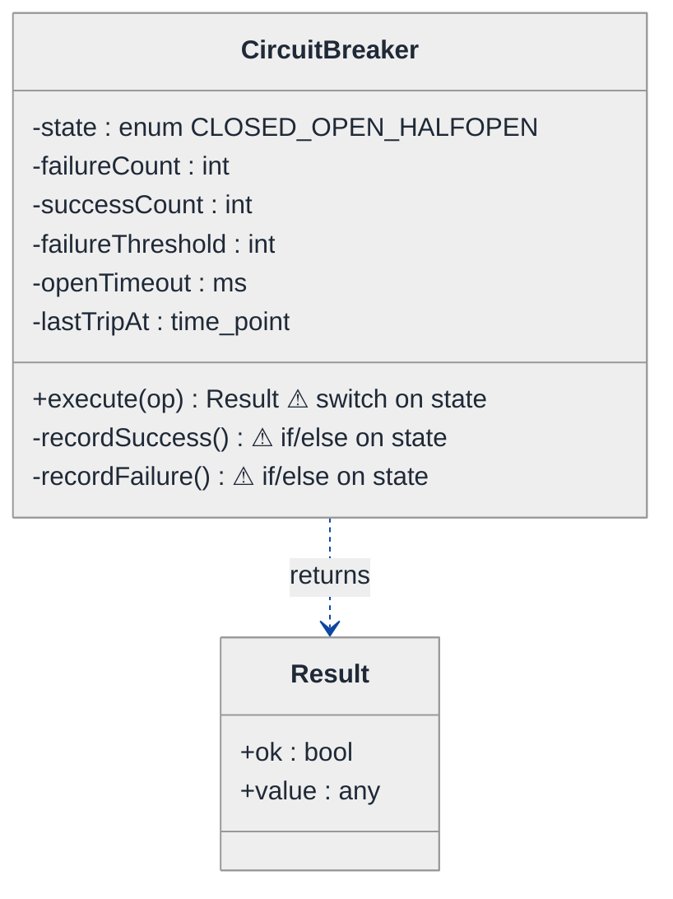
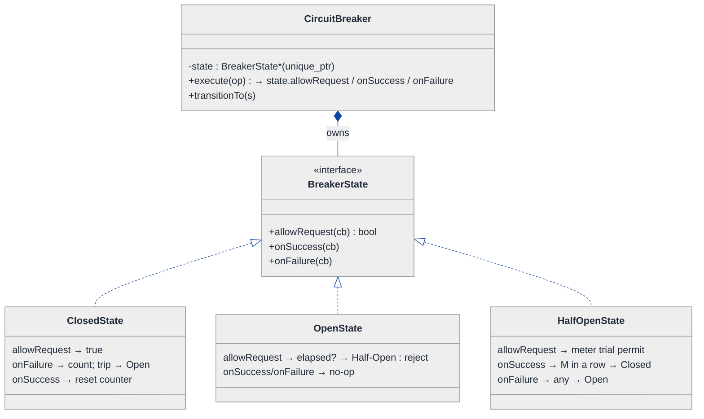
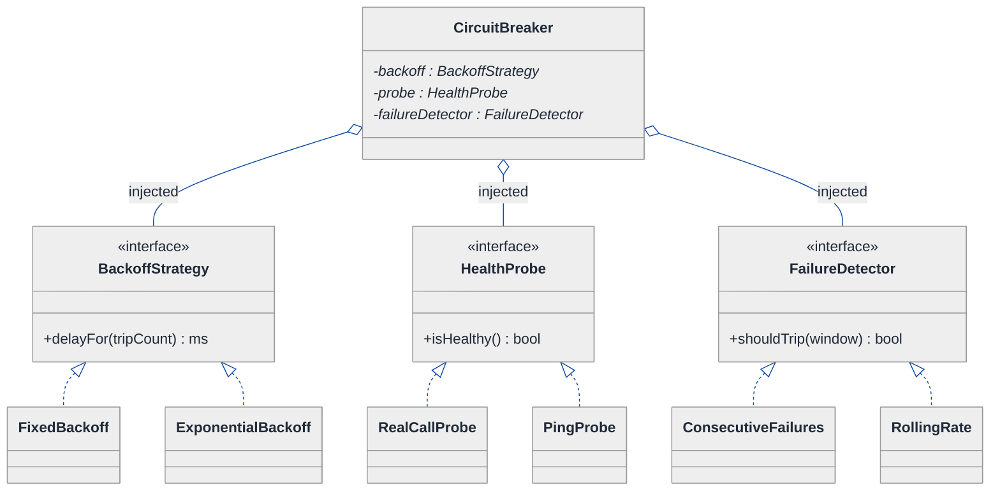
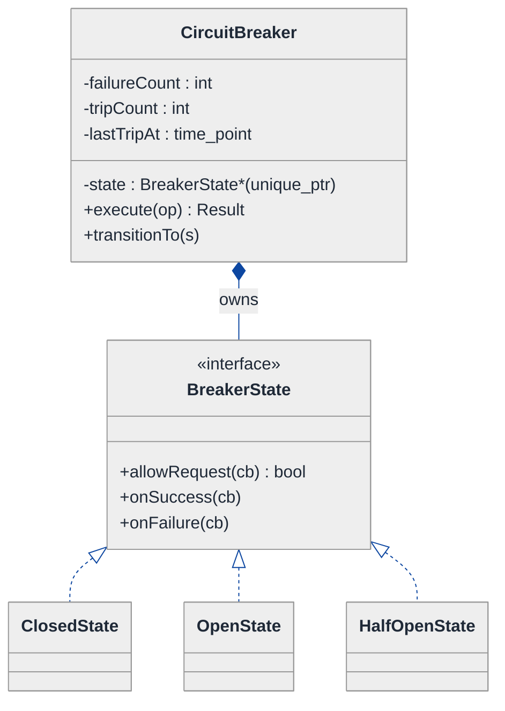
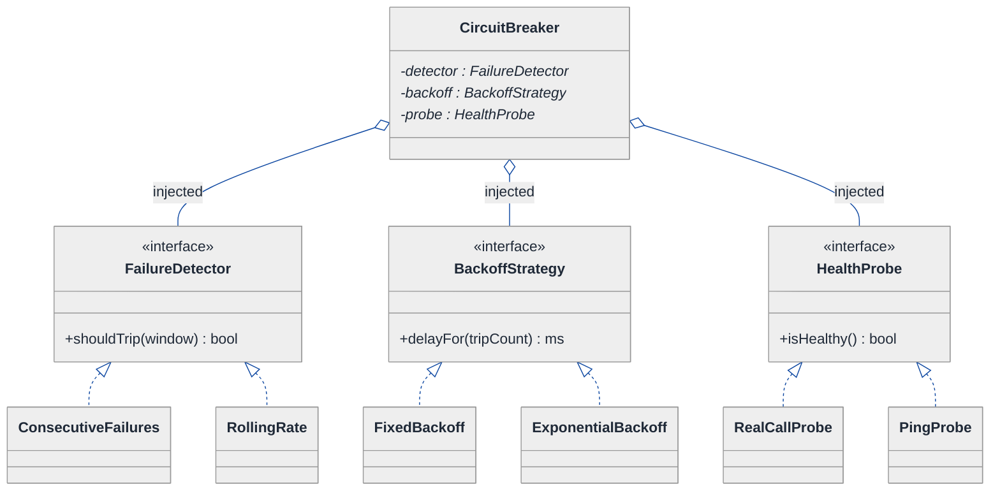
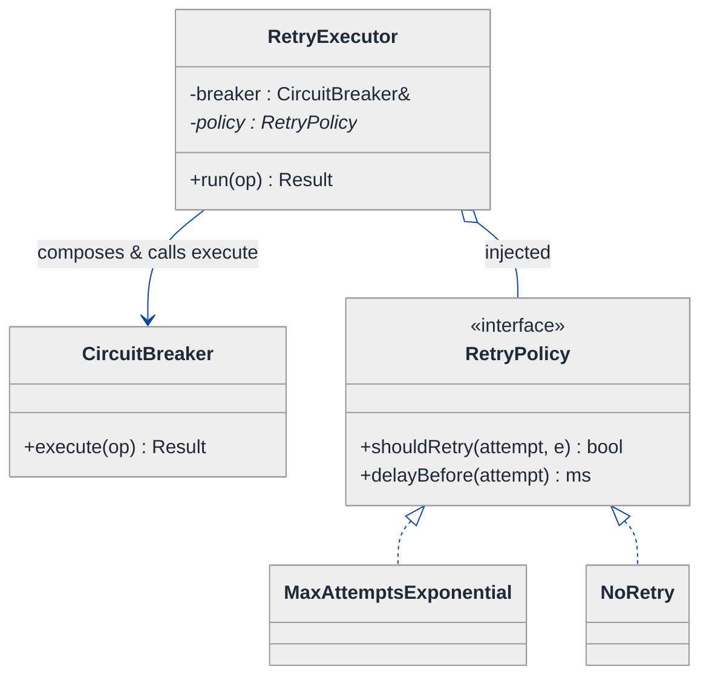
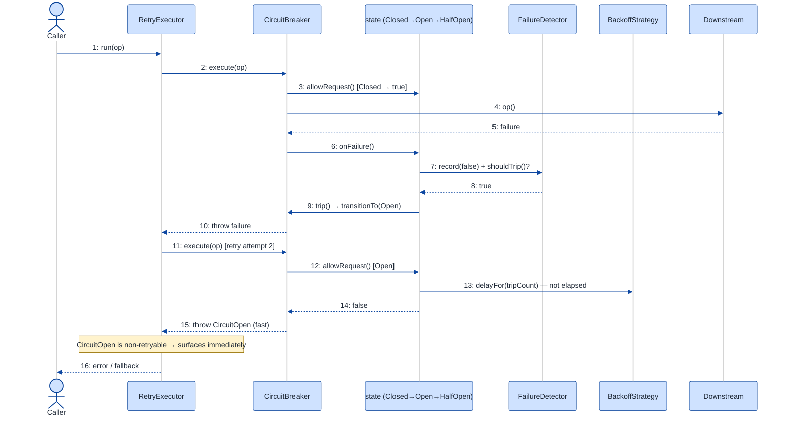

# Circuit Breaker — LLD Walkthrough

> **Difficulty:** Medium · **Time:** ~30 min · **Pattern focus:** State (closed / open / half-open) + Strategy (backoff / health-probe)
>
> **Problem source(s):** GID R2, bucket `Retry_Pattern`. "Design a circuit breaker supporting closed/open/half-open states, configurable failure thresholds, timeout duration, health-check probing, integrated with a retry mechanism."
>
> **Diagrams:** inline mermaid (renders natively in GitHub / VS Code). Theme block copied verbatim from the repo's canonical convention.

---

## How to use this file

Paced for a candidate who has used a circuit breaker library (Hystrix, resilience4j, Polly) but never built one. Reading time: ~30 minutes if you sketch each iteration by hand. **The lesson: a circuit breaker IS a state machine — but don't reach for the State pattern up front. DERIVE it: write the naive enum-and-if-ladder breaker first, watch it tangle under three or four hypothetical changes, then reach for ONE pattern at a time on the most painful axis.**

**Map of this file (15 sections):**

1. Problem statement + clarifying questions
2. Plain-English restatement
3. Why this matters
4. Mental model
5. Try it yourself first
6. Entity & verb extraction
7. **Iteration 1: the naive design** — enum + if/else
8. **Where the naive design hurts** — four future requirements, one painful diff each
9. **Pivot 1: State for the breaker lifecycle** — internal transitions, not external swaps
10. **Pivot 2: Strategy for backoff + health probing** — algorithm the caller configures
11. **Pivot 3: integrating the retry mechanism** — composition, not a fifth state
12. Final class diagram (three sub-views)
13. Skeleton code (C++)
14. Key flow — sequence diagram
15. Extensibility re-check + anti-patterns + how to think aloud + self-check

---

## 1. Problem statement + clarifying questions

**Prompt (typical phrasing):** "Design a circuit breaker. It wraps a call to a flaky downstream service. When failures cross a threshold it should stop calling (open), wait a timeout, then probe (half-open). Integrate it with a retry mechanism."

**Clarifying questions to ask BEFORE drawing anything:**

1. **What counts as a failure?** Any exception, only timeouts, only HTTP 5xx, or a caller-supplied predicate? (A 404 is usually NOT a circuit failure.)
2. **Threshold semantics?** N consecutive failures, or a failure RATE over a rolling window (e.g. 50% of the last 20 calls)? Minimum-volume guard before the rate is meaningful?
3. **Half-open probing policy?** Let exactly one trial call through, or a small quota of N concurrent trials? How many consecutive successes close it again?
4. **Open-timeout shape?** Fixed duration, or exponential backoff that grows each time a half-open probe fails?
5. **Concurrency?** Will many threads share one breaker instance? Do counters and the state transition need to be atomic?
6. **Retry relationship?** Does the retry loop sit OUTSIDE the breaker (retry calls execute, breaker may reject) or does the breaker drive retries itself?
7. **What does "rejected" look like to the caller?** Throw a `CircuitOpenException`, or return a fallback value?

**Assumptions if the interviewer dodges:** failure = a caller-supplied predicate over the result/exception; threshold = N consecutive failures with a rolling-window option discussed in §15; half-open lets ONE trial through and needs M consecutive successes to close; open-timeout is a configurable Strategy (fixed or exponential); single breaker shared across threads (we discuss the atomic transition in §10/§15); retry sits OUTSIDE and treats an open circuit as a non-retryable rejection.

---

## 2. Plain-English restatement

We're building the little guard object that sits between your code and a downstream service that sometimes falls over. While the downstream is healthy the guard is transparent — calls pass straight through (CLOSED). When failures pile up past a threshold, the guard trips and starts rejecting calls instantly without even trying (OPEN) — this stops you from hammering a dying service and lets it recover. After a cool-down timeout the guard cautiously lets a probe call through (HALF-OPEN); if the probe succeeds it closes again, if it fails it re-opens. A retry mechanism sits around the breaker and decides whether to re-attempt. The design must let us add new threshold rules, new backoff schedules, and new probe policies **without rewriting the core call path**.

---

## 3. Why this matters

This is the canonical "is it Strategy or State?" discrimination question wearing a distributed-systems costume. The breaker has an obvious lifecycle (closed → open → half-open → closed) so it screams State; but threshold counting and backoff timing are algorithms the operator tunes, which screams Strategy. A senior candidate separates the two cleanly: the OBJECT drives its own transitions (State), while the CALLER configures the pluggable policies (Strategy). Get that split right and the design is extensible; conflate them and you get a 200-line `execute()` method with a `switch (state)` that everyone is afraid to touch.

---

## 4. Mental model

A circuit breaker is the electrical breaker in your house, modeled in software. Current (calls) flows while the breaker is closed. Too much current (too many failures) and it physically trips open — now nothing flows, regardless of what you do. After you wait, you flip it to a tentative "let's see" position (half-open): one careful test. Pass → snap fully closed. Fail → trip open again.

```
Real-world sketch (NOT a UML diagram yet):

      calls in
         │
         ▼
   ┌───────────────┐      failures ≥ threshold
   │    CLOSED      │ ───────────────────────────►┐
   │ (pass through) │                              │
   └───────────────┘                               ▼
         ▲                                   ┌───────────────┐
  probe  │ success×M                         │     OPEN       │
  closes │                                   │ (reject fast)  │
         │                                   └───────────────┘
   ┌───────────────┐     after open-timeout       │
   │  HALF-OPEN     │◄─────────────────────────────┘
   │ (one trial)    │
   └───────────────┘
         │ probe fails
         └──────────────► back to OPEN (longer timeout)
```

The KEY insight from this picture: there are exactly three "modes" with completely different answers to the SAME question — "should I let this call through?" CLOSED says yes-and-count, OPEN says no-unless-timeout-elapsed, HALF-OPEN says only-one. Three different behaviors for one method. That is the shape the State pattern exists to hold. The threshold and timeout values, by contrast, are knobs — that is the shape of Strategy.

---

## 5. Try it yourself first

> **Predict before reading on:**
>
> 1. List the nouns you'd promote to classes. Which "state" noun do you think becomes a field vs. a class?
> 2. **If I told you the breaker must support BOTH "trip after 5 consecutive failures" AND "trip when 50% of the last 20 calls fail," what would change about how you write the failure-counting logic?**
> 3. The open-timeout should sometimes be a flat 30s and sometimes grow 1s → 2s → 4s on repeated trips. Where does that logic live so that swapping it doesn't touch the state transitions?

---

## 6. Entity & verb extraction

> **Mini-refresher: noun → class, but not every noun.**
>
> Naive OOD promotes every noun to a class. Senior OOD promotes a noun only if it has both BEHAVIOR and STATE that need to live together. "Threshold" is a number → field. "State" sounds like a field too — but if each state answers the SAME method DIFFERENTLY, the state is behavior and wants to be a class. Hold that thought; §9 cashes it in.

**Nouns from the prompt:**

| Noun | Decision | Why |
|---|---|---|
| CircuitBreaker | Class (top-level coordinator) | Wraps the call, holds state + counters, exposes `execute()` |
| State (closed/open/half-open) | Field at first; **class in §9** | Each mode answers `execute` differently — that's behavior |
| Failure threshold | Field / **Strategy in §10** | A count, but the COUNTING RULE varies (consecutive vs rate) |
| Timeout duration | Field / **Strategy in §10** | Fixed vs exponential backoff is an algorithm |
| Health check / probe | Method, then **Strategy in §10** | "Is the downstream alive?" can be the real call or a cheap ping |
| Retry mechanism | Separate Class (§11) | It has its own loop + backoff; composes the breaker |
| Call / operation | `std::function` parameter | The thing being guarded; no domain class needed |
| Failure count / success count | Fields on the breaker | Plain counters |
| Last-trip time | Field | A timestamp, no behavior |

**Verbs (and the class they live on):**

| Verb | Owner class (naive answer — we'll re-examine) |
|---|---|
| execute(operation) | CircuitBreaker |
| recordSuccess() | CircuitBreaker |
| recordFailure() | CircuitBreaker |
| shouldAttempt() / allowRequest() | CircuitBreaker |
| trip() / reset() | CircuitBreaker |
| probe() | CircuitBreaker |
| retry(operation) | RetryExecutor (introduced in §11) |

**We have NOT introduced any design patterns yet.** Pure nouns + verbs.

---

## 7. <a id="iter-1"></a>Iteration 1: the naive design

Let's write the simplest thing that could possibly work. No design patterns — one class, an enum, and an if/else ladder.



**Reader's tour (read top to bottom; ~60 seconds).**

1. **One box — `CircuitBreaker` is the whole world.** It holds a `state` enum, a couple of counters, the configuration numbers (threshold, timeout), and a last-trip timestamp. Everything lives here.

2. **The `execute()` method is the trouble zone.** It's marked with a warning (⚠) because it has to ask "what state am I in?" before doing anything. CLOSED → run the op. OPEN → check if the timeout elapsed, maybe flip to half-open, else reject. HALF-OPEN → allow one trial. That's a `switch (state)` with branching inside each case.

3. **`recordSuccess()` and `recordFailure()` ALSO branch on state.** A success in CLOSED resets the counter; a success in HALF-OPEN may close the circuit. A failure in CLOSED increments toward the threshold; a failure in HALF-OPEN immediately re-opens. So the state enum is consulted in THREE methods, each with different per-state logic.

4. **No probe abstraction, no backoff abstraction.** The timeout is a single `int`. The "health check" is just "did the next real call succeed?" The threshold is a single comparison `failureCount >= failureThreshold`.

**What's deliberately missing.** No `BreakerState` class. No `BackoffStrategy`. No `FailureDetector`. No retry object. The naive design doesn't even *acknowledge* that the per-state behavior, the counting rule, and the timeout schedule are independent axes — it bakes one hardcoded answer for each into the same three methods. That's what we'll expose, and fix.

Skeleton code for the naive design (C++):

```cpp
#include <chrono>
#include <functional>
#include <stdexcept>

enum class State { CLOSED, OPEN, HALF_OPEN };

struct CircuitOpen : std::runtime_error {
    CircuitOpen() : std::runtime_error("circuit open") {}
};

class CircuitBreaker {
public:
    CircuitBreaker(int threshold, std::chrono::milliseconds openTimeout)
        : failureThreshold_(threshold), openTimeout_(openTimeout) {}

    // Run op() if the breaker allows it; record the outcome.
    template <class Op>
    auto execute(Op&& op) {
        switch (state_) {                                   // ⚠ switch on state
            case State::OPEN:
                if (clock::now() - lastTripAt_ >= openTimeout_)
                    state_ = State::HALF_OPEN;              // timeout elapsed → probe
                else
                    throw CircuitOpen();                   // reject fast
                break;
            case State::HALF_OPEN:                          // allow ONE trial
            case State::CLOSED:
                break;
        }
        try {
            auto r = op();
            recordSuccess();
            return r;
        } catch (...) {
            recordFailure();
            throw;
        }
    }

private:
    using clock = std::chrono::steady_clock;

    void recordSuccess() {                                  // ⚠ if/else on state
        if (state_ == State::HALF_OPEN) {
            if (++successCount_ >= 1) { state_ = State::CLOSED; reset(); }
        } else {
            failureCount_ = 0;
        }
    }
    void recordFailure() {                                  // ⚠ if/else on state
        if (state_ == State::HALF_OPEN) {                   // probe failed → re-open
            trip();
        } else if (++failureCount_ >= failureThreshold_) {
            trip();
        }
    }
    void trip()  { state_ = State::OPEN; lastTripAt_ = clock::now(); successCount_ = 0; }
    void reset() { failureCount_ = 0; successCount_ = 0; }

    State state_ = State::CLOSED;
    int   failureCount_ = 0, successCount_ = 0;
    int   failureThreshold_;
    std::chrono::milliseconds openTimeout_;
    clock::time_point lastTripAt_{};
};
```

**This works.** It has zero design patterns. We can pass calls, trip, cool down, probe, close. So what's wrong with it?

---

## 8. <a id="naive-pain"></a>Where the naive design hurts

The interviewer slides a piece of paper across the desk: "Here are four changes coming next quarter. Walk me through what each touches."

### Change A: "Half-open should allow 3 concurrent trials, and close only after 3 consecutive successes"

In the naive design:
- `execute()`'s HALF_OPEN case must now track how many trials are in flight and reject the 4th.
- `recordSuccess()`'s `>= 1` becomes `>= 3` AND we need a separate in-flight counter that `execute()` increments and `recordSuccess`/`recordFailure` decrement.
- **The half-open logic is now smeared across `execute`, `recordSuccess`, and `recordFailure` — three methods, each with a HALF_OPEN branch that must stay in sync.** Miss one and the breaker leaks trial permits.

### Change B: "Open-timeout should grow exponentially: 1s, 2s, 4s, 8s on repeated trips"

In the naive design:
- `openTimeout_` is a single fixed value used in the OPEN case of `execute()`.
- We add a `tripCount_` field, and the OPEN-case comparison becomes `openTimeout_ * (1 << tripCount_)`.
- `trip()` must `++tripCount_`; `reset()` (on close) must zero it.
- **The backoff schedule is now hardcoded inside the state-transition methods.** Swapping to "full-jitter" backoff means editing `execute`, `trip`, and `reset`.

### Change C: "Trip on a failure RATE (50% of last 20 calls), not consecutive failures"

In the naive design:
- `recordFailure()`'s `++failureCount_ >= failureThreshold_` is the wrong shape entirely — we need a rolling window of the last 20 outcomes.
- We add a ring buffer, push every outcome in BOTH `recordSuccess` and `recordFailure`, and replace the threshold check with a rate computation plus a minimum-volume guard.
- **The counting rule is welded into `recordFailure`/`recordSuccess`, so two unrelated counting strategies can't coexist; you fork the method with an `if (mode == RATE)`.**

### Change D: "Half-open should probe with a cheap /health ping, not a real business call"

In the naive design:
- There is no probe abstraction — the "health check" IS the next real `op()`.
- To probe with a separate health endpoint we'd have to thread a second callable into `execute()` and branch: `if (state_ == HALF_OPEN) use healthPing else use op`.
- **Yet another HALF_OPEN branch in `execute()`**, and the breaker now needs to know about a health-check call shape it shouldn't own.

### The pattern of pain

| Change | Methods touched | Smell |
|---|---|---|
| A. Concurrent trials | `execute` + `recordSuccess` + `recordFailure` | "Per-state logic smeared across three methods; HALF_OPEN branches must stay in sync." |
| B. Exponential backoff | `execute` + `trip` + `reset` | "Timeout schedule hardcoded into transition methods." |
| C. Rate threshold | `recordFailure` + `recordSuccess` | "Counting rule welded in; two rules can't coexist." |
| D. Health probe | `execute` (another branch) | "No probe seam; breaker must know the health-call shape." |

**Two axes of pain dominate:** lifecycle variability (the per-state behavior of A and D, where the SAME method answers differently per state) and algorithm variability (the backoff schedule of B and the counting rule of C, which are knobs an operator tunes).

> **Pivot question:** "What pattern handles 'the same method behaves differently depending on which mode the object is in, with the object driving its own mode transitions'? And what pattern handles 'an algorithm the operator configures and swaps in'?"
>
> The answers are State and Strategy. Let's introduce them one at a time, starting with the most painful axis: the per-state behavior smeared across three methods.

---

## 9. <a id="pivot-1"></a>Pivot 1: State for the breaker lifecycle

> **Mini-refresher: State pattern.**
>
> Each lifecycle state is its own class implementing a shared interface. The context object (here `CircuitBreaker`) delegates the request to its CURRENT state object, and THE STATE decides both what to do and what the next state is. Transitions are INTERNAL — driven by events the context forwards (a success, a failure), not by an external setter.
>
> Quick example: a `Document` delegates `publish()` to its current state — `DraftState` moves to `ModerationState`, `PublishedState` throws. The document never says `if (status == ...)`.

**Why State fits the breaker.** The breaker answers ONE conceptual question — "given this call/outcome, what now?" — but the answer is completely different per mode, and the mode is chosen by the OBJECT'S own history (failures crossing a threshold), never by an external caller. A CLOSED breaker counts failures; an OPEN breaker rejects until the timeout; a HALF_OPEN breaker meters trials. That is textbook State: the `switch (state_)` in three methods collapses into three classes, each owning its slice.

**The refactor (just the affected part):**

```cpp
class CircuitBreaker;  // forward — the context

class BreakerState {
public:
    virtual ~BreakerState() = default;
    // May the breaker attempt the call right now?  Throws/returns false to reject.
    virtual bool allowRequest(CircuitBreaker& cb) = 0;
    virtual void onSuccess(CircuitBreaker& cb)    = 0;
    virtual void onFailure(CircuitBreaker& cb)    = 0;
    virtual State tag() const = 0;   // for metrics/inspection only
};

class ClosedState : public BreakerState {
public:
    bool allowRequest(CircuitBreaker&) override { return true; }     // always pass through
    void onSuccess(CircuitBreaker& cb) override;                     // reset failure counter
    void onFailure(CircuitBreaker& cb) override;                     // count; trip at threshold
    State tag() const override { return State::CLOSED; }
};

class OpenState : public BreakerState {
public:
    bool allowRequest(CircuitBreaker& cb) override;                  // elapsed? → HALF_OPEN, else reject
    void onSuccess(CircuitBreaker&) override {}                      // no calls happen while open
    void onFailure(CircuitBreaker&) override {}
    State tag() const override { return State::OPEN; }
};

class HalfOpenState : public BreakerState {
public:
    bool allowRequest(CircuitBreaker& cb) override;                  // meter trial permits
    void onSuccess(CircuitBreaker& cb) override;                     // M in a row → ClosedState
    void onFailure(CircuitBreaker& cb) override;                     // any failure → OpenState
    State tag() const override { return State::HALF_OPEN; }
};

// CircuitBreaker now delegates instead of switching:
class CircuitBreaker {
public:
    template <class Op>
    auto execute(Op&& op) {
        if (!state_->allowRequest(*this)) throw CircuitOpen();
        try { auto r = op(); state_->onSuccess(*this); return r; }
        catch (...) { state_->onFailure(*this); throw; }
    }
    void transitionTo(std::unique_ptr<BreakerState> s) { state_ = std::move(s); }
    // counters + getters elided
private:
    std::unique_ptr<BreakerState> state_;   // OWNS its current state
};
```

**What changed — visualized.** Just the lifecycle slice:



**Tour of the after-state.**

1. **The `State` enum is gone from the control flow.** It survives only as a `tag()` for metrics. The breaker holds a `std::unique_ptr<BreakerState>` — exclusive ownership of its current mode.

2. **`execute()` is now three delegations.** `state_->allowRequest(*this)`, then on the outcome `state_->onSuccess(*this)` or `state_->onFailure(*this)`. **NO `switch (state_)` anywhere.** The method reads like prose: ask the state if we may call, run it, tell the state what happened.

3. **Each state owns its slice.** `ClosedState::onFailure` counts and trips. `OpenState::allowRequest` checks elapsed time and either flips to half-open or rejects. `HalfOpenState` meters trial permits and decides when to close. The HALF_OPEN logic that was smeared across three naive methods now lives in ONE class.

4. **Transitions live WITH the state.** When `ClosedState::onFailure` sees the threshold crossed, it calls `cb.transitionTo(std::make_unique<OpenState>())`. The state knows what comes next; the breaker is just the holder. That's the whole point of State.

**Change A from §8 now lands cleanly.** "3 concurrent trials, close after 3 successes" is entirely inside `HalfOpenState` — add a trial-permit counter and a success-streak counter as fields on that one class. No edits to `ClosedState`, `OpenState`, or `CircuitBreaker`.

**Pattern-discrimination cheatsheet — State vs Strategy.**
- *State:* the OBJECT picks its next mode internally (via `transitionTo` from within a state); the states know about each other.
- *Strategy:* the CALLER picks which algorithm to use; the strategies are unaware of each other and don't change themselves.
- *Rule of thumb:* if `breaker.onFailure()` flips the mode from inside → State. If `breaker.setBackoff(x)` is called from outside → Strategy.

We chose State here because nobody calls `breaker.setState(OPEN)` — the breaker trips ITSELF based on its own failure history. The mode change is an internal consequence, not an external command.

---

## 10. <a id="pivot-2"></a>Pivot 2: Strategy for backoff + health probing

Changes B (exponential backoff) and D (cheap health probe) from §8 are still painful — and State doesn't help, because the variability here is NOT "which mode am I in." It's "what timeout schedule did the operator configure" and "how do I check health." Those are algorithms picked from OUTSIDE the breaker. Different pattern.

> **Mini-refresher: Strategy pattern.**
>
> Encapsulates an algorithm behind an interface so it can be swapped at construction or runtime. The CALLER decides which strategy to inject; the strategy doesn't know about the context's other collaborators. Classic example: a `Sorter` takes a `CompareStrategy*` — pass `Ascending` or `Descending` and the sorter doesn't care.

**Why Strategy fits backoff and probing.** A backoff schedule is a pure function: `tripCount → delay`. It varies (fixed, exponential, exponential-with-jitter) and the choice is made by config, not by the breaker's history. A health probe is `() → bool`: real-call vs cheap-ping, chosen by the operator. Both are textbook Strategy. Inject them; let `OpenState` ask the backoff for its delay and let `HalfOpenState` ask the probe whether the downstream is alive.

**The refactor (just the affected slices):**

```cpp
// ── Backoff: tripCount → how long to stay open ──────────────────────
class BackoffStrategy {
public:
    virtual ~BackoffStrategy() = default;
    virtual std::chrono::milliseconds delayFor(int tripCount) const = 0;
};

class FixedBackoff : public BackoffStrategy {
public:
    explicit FixedBackoff(std::chrono::milliseconds d) : d_(d) {}
    std::chrono::milliseconds delayFor(int) const override { return d_; }
private:
    std::chrono::milliseconds d_;
};

class ExponentialBackoff : public BackoffStrategy {
public:
    ExponentialBackoff(std::chrono::milliseconds base, std::chrono::milliseconds cap)
        : base_(base), cap_(cap) {}
    std::chrono::milliseconds delayFor(int tripCount) const override {
        auto raw = base_ * (1 << std::min(tripCount, 16));   // 1,2,4,8...
        return std::min(raw, cap_);
    }
private:
    std::chrono::milliseconds base_, cap_;
};
// JitterBackoff (full-jitter) elided — same shape

// ── HealthProbe: is the downstream alive? ───────────────────────────
class HealthProbe {
public:
    virtual ~HealthProbe() = default;
    virtual bool isHealthy() = 0;
};
class RealCallProbe : public HealthProbe { /* lets the next real op() be the probe */ };
class PingProbe     : public HealthProbe { /* hits a cheap /health endpoint */ };

// OpenState now asks the injected backoff instead of using a hardcoded timeout:
bool OpenState::allowRequest(CircuitBreaker& cb) {
    auto delay = cb.backoff().delayFor(cb.tripCount());
    if (cb.clockNow() - cb.lastTripAt() >= delay) {
        cb.transitionTo(std::make_unique<HalfOpenState>());
        return true;     // let the probe through
    }
    return false;        // still cooling down → reject fast
}
```

The breaker gains two injected, exclusively-owned fields:

```cpp
class CircuitBreaker {
    // ...
    const BackoffStrategy& backoff() const { return *backoff_; }
    HealthProbe&           probe()         { return *probe_; }
private:
    std::unique_ptr<BackoffStrategy> backoff_;   // injected
    std::unique_ptr<HealthProbe>     probe_;     // injected
};
```

**What changed — visualized.** The two new strategy seams hanging off the breaker:



**Tour of the after-state.**

1. **Three injected strategy interfaces, three families.** The open diamonds (`◇`) mark AGGREGATION — the breaker USES these but they're handed in at construction, not `new`ed internally. Compare with the filled diamond (`◆`) on `state_` in §9: the breaker OWNS its state's lifetime but merely USES its policies.

2. **`BackoffStrategy` answers `delayFor(tripCount)`.** `OpenState::allowRequest` calls it instead of reading a hardcoded `openTimeout_`. Change B ("exponential 1s/2s/4s") is now just injecting `ExponentialBackoff` — zero edits to any state class.

3. **`HealthProbe` answers `isHealthy()`.** `HalfOpenState` consults the probe to decide whether the trial counts as a real health signal. Change D ("cheap /health ping") is injecting `PingProbe`. The breaker never learns the shape of the health call — it's behind the interface.

4. **Bonus: `FailureDetector` absorbs Change C for free.** While we're lifting algorithms out, the counting rule (consecutive vs rolling-rate) is the SAME shape — an injected `FailureDetector` with `shouldTrip(window)`. `ConsecutiveFailures` and `RollingRate` are two implementations. Change C becomes one new class, no edits to `ClosedState` beyond "ask the detector."

5. **The breaker's CORE shrank to orchestration.** It owns its state (lifecycle) and holds three policy pointers (knobs). The variability that the naive design welded into `execute`/`trip`/`reset` is now lifted into type hierarchies.

**Pattern-discrimination cheatsheet — Strategy vs Template Method.**
- *Strategy:* the whole algorithm is one swappable object, injected via composition; you can stack or replace at runtime.
- *Template Method:* the skeleton lives in a base class; subclasses fill hooks via inheritance.
- *Rule of thumb:* operator picks among interchangeable variants at config time → Strategy. Fixed sequence with 2-3 stable variations on a hook → Template Method.

We chose Strategy because operators mix-and-match independently: exponential backoff with a ping probe with a rolling-rate detector — any combination. Inheritance can't express that cross-product; composition can.

---

## 11. <a id="pivot-3"></a>Pivot 3: integrating the retry mechanism

The breaker is now extensible. The prompt's last clause — "integrate with a retry mechanism" — remains. A tempting wrong turn: add a fourth state, `RetryingState`. Resist it. Retrying is NOT a mode of the breaker; it's a loop AROUND the breaker that decides whether to re-invoke `execute()` after a failure. They are different responsibilities and must not fuse.

> **Mini-refresher: composition over a fifth state.**
>
> When two concerns each have their own lifecycle/loop, model them as collaborators that one composes the other, not as states of a single machine. The retry executor owns "how many times and how long between attempts"; the breaker owns "is the downstream allowed to be called right now." Keeping them separate means each varies independently (Single Responsibility).

**Why the retry sits OUTSIDE the breaker.** The breaker's job is a binary gate plus bookkeeping. The retry's job is a loop with its own backoff and its own max-attempts. If we fused them, every retry-policy change would risk the state machine and vice versa. Instead, `RetryExecutor` wraps the breaker: it calls `breaker.execute(op)`, and on a *retryable* failure waits and tries again — but a `CircuitOpen` rejection is treated as **non-retryable** (no point retrying a call the breaker won't even attempt), so it surfaces or triggers a fallback immediately.

**The refactor (the new collaborator):**

```cpp
class RetryPolicy {                       // Strategy again — same shape as backoff
public:
    virtual ~RetryPolicy() = default;
    virtual bool   shouldRetry(int attempt, const std::exception& e) const = 0;
    virtual std::chrono::milliseconds delayBefore(int attempt) const = 0;
};
// MaxAttemptsExponential, NoRetry, etc. elided

class RetryExecutor {
public:
    RetryExecutor(CircuitBreaker& breaker, std::unique_ptr<RetryPolicy> policy)
        : breaker_(breaker), policy_(std::move(policy)) {}

    template <class Op>
    auto run(Op&& op) {
        for (int attempt = 1; ; ++attempt) {
            try {
                return breaker_.execute(op);              // breaker gates the call
            } catch (const CircuitOpen&) {
                throw;                                    // open circuit → NOT retryable
            } catch (const std::exception& e) {
                if (!policy_->shouldRetry(attempt, e)) throw;
                std::this_thread::sleep_for(policy_->delayBefore(attempt));
                // loop and try again
            }
        }
    }
private:
    CircuitBreaker&             breaker_;   // composes (does not own) the breaker
    std::unique_ptr<RetryPolicy> policy_;
};
```

**The lesson.** Once §9 separated lifecycle (State) from §10's knobs (Strategy), the retry mechanism slots in as a THIRD, clearly-bounded responsibility — a thin loop that composes the breaker. The integration is "retry calls `breaker.execute`, and respects `CircuitOpen` as a hard stop." No new breaker state, no edits to the state classes.

> **Mini-refresher: Single Responsibility Principle (SRP).**
>
> A class should have one reason to change. The breaker changes when the trip/probe rules change; the retry executor changes when the re-attempt policy changes. Fusing them gives a class with two reasons to change — and two ways to break each other.

**Pattern-discrimination cheatsheet — "is this a new State, or a new collaborator?"**
- *New State:* the SAME object would answer its existing methods differently in the new mode, and it reaches the mode by its own internal transition.
- *New Collaborator:* the behavior has its OWN loop/lifecycle and merely calls into the existing object.
- *Rule of thumb:* if you'd write `breaker.transitionTo(Retrying)` it's wrong — retry doesn't gate calls, it repeats them. That's a loop, so it's a collaborator.

---

## 12. <a id="fig-class-diagram"></a>Final class diagram

One giant diagram would be a wall of boxes. Here are **three focused sub-views**; the structural insight at the end ties them together.

### 12.1 The lifecycle spine — the State machine the breaker OWNS



**Tour of 12.1.** The filled diamond (`◆`) marks composition — the breaker OWNS its current `BreakerState` via `unique_ptr`; when it transitions, it replaces the pointer. Three concrete states, each self-contained: ClosedState counts and trips, OpenState gates on the timeout, HalfOpenState meters trials. The breaker's counters live on the breaker so any state can read/update them via the `cb` reference.

### 12.2 The policy injection — the Strategies the breaker USES



**Tour of 12.2.** Three injected interfaces, open diamonds (`◇` = aggregation, "I use but don't own the lifecycle"). `FailureDetector` decides WHEN to trip (consecutive vs rolling-rate), `BackoffStrategy` decides HOW LONG to stay open (fixed vs exponential), `HealthProbe` decides HOW to check recovery (real call vs cheap ping). Each axis varies independently; an operator wires any combination at construction. The states from 12.1 *call into* these — e.g. `ClosedState::onFailure` asks the detector, `OpenState::allowRequest` asks the backoff, `HalfOpenState` consults the probe.

### 12.3 The retry composition — the loop AROUND the breaker



**Tour of 12.3.** `RetryExecutor` holds a reference to the breaker (it composes, does not own — the breaker is shared and long-lived) and an injected `RetryPolicy`. Its `run(op)` loops: call `breaker.execute(op)`, and on a failure ask the policy whether to retry and how long to wait. The crucial edge — a `CircuitOpen` rejection is NOT retryable — keeps the retry loop from hammering an open circuit. Retry is a fourth responsibility, deliberately a collaborator, never a breaker state.

### Structural insight (ties 12.1 + 12.2 + 12.3 together)

| Concern | Pattern used | Why |
|---|---|---|
| **Lifecycle** (closed → open → half-open) | State, OWNED by the breaker | Same method answers differently per mode; the breaker transitions ITSELF |
| **Trip rule / timeout / probe** | Strategy, INJECTED into the breaker | Operator-tuned knobs; any combination; swapped at config time |
| **Re-attempt loop** | Plain composition + a RetryPolicy Strategy | Its own loop and lifecycle; a collaborator, not a state |

The big lesson: **State for the thing that transitions itself, Strategy for the knobs the operator turns, and a separate collaborator for the loop that wraps it all.** Conflating any two of these is the classic circuit-breaker design failure.

---

## 13. Skeleton code (C++)

> Show the SHAPES, not the full impl. ~130 lines.

```cpp
#include <chrono>
#include <functional>
#include <memory>
#include <stdexcept>
#include <thread>
#include <utility>

// ── Outcomes / errors ───────────────────────────────────────────────
enum class State { CLOSED, OPEN, HALF_OPEN };       // for metrics/inspection only
struct CircuitOpen : std::runtime_error { CircuitOpen() : std::runtime_error("circuit open") {} };

// ── Forward declaration: the context ────────────────────────────────
class CircuitBreaker;

// ── Strategy axis 1: when to trip ───────────────────────────────────
class FailureDetector {
public:
    virtual ~FailureDetector() = default;
    virtual void record(bool success) = 0;
    virtual bool shouldTrip() const   = 0;
    virtual void reset()              = 0;
};
class ConsecutiveFailures : public FailureDetector {
public:
    explicit ConsecutiveFailures(int n) : threshold_(n) {}
    void record(bool ok) override { ok ? count_ = 0 : ++count_; }
    bool shouldTrip() const override { return count_ >= threshold_; }
    void reset() override { count_ = 0; }
private:
    int threshold_, count_ = 0;
};
// RollingRate : public FailureDetector — ring buffer + min-volume guard, elided

// ── Strategy axis 2: how long to stay open ──────────────────────────
class BackoffStrategy {
public:
    virtual ~BackoffStrategy() = default;
    virtual std::chrono::milliseconds delayFor(int tripCount) const = 0;
};
class ExponentialBackoff : public BackoffStrategy {
public:
    ExponentialBackoff(std::chrono::milliseconds base, std::chrono::milliseconds cap)
        : base_(base), cap_(cap) {}
    std::chrono::milliseconds delayFor(int tc) const override {
        return std::min(base_ * (1 << std::min(tc, 16)), cap_);
    }
private:
    std::chrono::milliseconds base_, cap_;
};
// FixedBackoff, JitterBackoff — elided

// ── Strategy axis 3: how to probe health ────────────────────────────
class HealthProbe { public: virtual ~HealthProbe() = default; virtual bool isHealthy() = 0; };
// RealCallProbe, PingProbe — elided

// ── State pattern: the lifecycle ────────────────────────────────────
class BreakerState {
public:
    virtual ~BreakerState() = default;
    virtual bool  allowRequest(CircuitBreaker& cb) = 0;
    virtual void  onSuccess(CircuitBreaker& cb)    = 0;
    virtual void  onFailure(CircuitBreaker& cb)    = 0;
    virtual State tag() const = 0;
};

class ClosedState : public BreakerState {
public:
    bool  allowRequest(CircuitBreaker&) override { return true; }
    void  onSuccess(CircuitBreaker& cb) override;     // detector.record(true)
    void  onFailure(CircuitBreaker& cb) override;     // detector.record(false); trip if shouldTrip
    State tag() const override { return State::CLOSED; }
};
class OpenState : public BreakerState {
public:
    bool  allowRequest(CircuitBreaker& cb) override;  // elapsed? → HalfOpen+true : false
    void  onSuccess(CircuitBreaker&) override {}
    void  onFailure(CircuitBreaker&) override {}
    State tag() const override { return State::OPEN; }
};
class HalfOpenState : public BreakerState {
public:
    explicit HalfOpenState(int needed = 1) : needed_(needed) {}
    bool  allowRequest(CircuitBreaker&) override { return permits_-- > 0; }   // meter trials
    void  onSuccess(CircuitBreaker& cb) override;     // streak; close after needed_
    void  onFailure(CircuitBreaker& cb) override;     // any failure → re-open
    State tag() const override { return State::HALF_OPEN; }
private:
    int needed_, streak_ = 0, permits_ = 1;
};

// ── Context ─────────────────────────────────────────────────────────
class CircuitBreaker {
public:
    CircuitBreaker(std::unique_ptr<FailureDetector> det,
                   std::unique_ptr<BackoffStrategy>  backoff,
                   std::unique_ptr<HealthProbe>      probe)
        : detector_(std::move(det)), backoff_(std::move(backoff)),
          probe_(std::move(probe)), state_(std::make_unique<ClosedState>()) {}

    template <class Op>
    auto execute(Op&& op) {
        if (!state_->allowRequest(*this)) throw CircuitOpen();
        try { auto r = op(); state_->onSuccess(*this); return r; }
        catch (...) { state_->onFailure(*this); throw; }
    }

    // collaborators + bookkeeping the states use:
    void transitionTo(std::unique_ptr<BreakerState> s) { state_ = std::move(s); }
    void trip() { ++tripCount_; lastTripAt_ = clock::now();
                  transitionTo(std::make_unique<OpenState>()); }
    FailureDetector& detector()  { return *detector_; }
    const BackoffStrategy& backoff() const { return *backoff_; }
    HealthProbe&     probe()     { return *probe_; }
    int  tripCount() const { return tripCount_; }
    auto lastTripAt() const { return lastTripAt_; }
    auto clockNow() const { return clock::now(); }
    void clearTrips() { tripCount_ = 0; }

private:
    using clock = std::chrono::steady_clock;
    std::unique_ptr<FailureDetector> detector_;   // injected (aggregation)
    std::unique_ptr<BackoffStrategy>  backoff_;
    std::unique_ptr<HealthProbe>      probe_;
    std::unique_ptr<BreakerState>     state_;      // owned (composition)
    int  tripCount_ = 0;
    clock::time_point lastTripAt_{};
};

// ── State transition bodies (deferred until breaker is complete) ─────
inline void ClosedState::onSuccess(CircuitBreaker& cb) { cb.detector().record(true); }
inline void ClosedState::onFailure(CircuitBreaker& cb) {
    cb.detector().record(false);
    if (cb.detector().shouldTrip()) cb.trip();        // ClosedState → OpenState
}
inline bool OpenState::allowRequest(CircuitBreaker& cb) {
    if (cb.clockNow() - cb.lastTripAt() >= cb.backoff().delayFor(cb.tripCount())) {
        cb.transitionTo(std::make_unique<HalfOpenState>());
        return true;                                   // let the probe through
    }
    return false;                                      // still cooling down
}
inline void HalfOpenState::onSuccess(CircuitBreaker& cb) {
    if (++streak_ >= needed_) { cb.detector().reset(); cb.clearTrips();
                                cb.transitionTo(std::make_unique<ClosedState>()); }
}
inline void HalfOpenState::onFailure(CircuitBreaker& cb) { cb.trip(); } // probe failed → re-open

// ── Retry collaborator (wraps, does not own, the breaker) ───────────
class RetryPolicy {
public:
    virtual ~RetryPolicy() = default;
    virtual bool shouldRetry(int attempt, const std::exception& e) const = 0;
    virtual std::chrono::milliseconds delayBefore(int attempt) const = 0;
};
// MaxAttemptsExponential, NoRetry — elided

class RetryExecutor {
public:
    RetryExecutor(CircuitBreaker& b, std::unique_ptr<RetryPolicy> p)
        : breaker_(b), policy_(std::move(p)) {}
    template <class Op>
    auto run(Op&& op) {
        for (int attempt = 1; ; ++attempt) {
            try { return breaker_.execute(op); }
            catch (const CircuitOpen&) { throw; }                 // open → non-retryable
            catch (const std::exception& e) {
                if (!policy_->shouldRetry(attempt, e)) throw;
                std::this_thread::sleep_for(policy_->delayBefore(attempt));
            }
        }
    }
private:
    CircuitBreaker&              breaker_;   // composes (reference, not owned)
    std::unique_ptr<RetryPolicy> policy_;
};
```

---

## 14. <a id="fig-sequence"></a>Key flow — sequence diagram

This is the moment of truth: read across the swimlanes to see how State and Strategy COOPERATE through one full trip-and-recover cycle, driven by a retry loop.



**Tour of the flow. Read it slowly — State and Strategy meet here.**

1. **Caller asks the RetryExecutor to run the operation.** The caller never touches the breaker directly; the retry loop is the outermost boundary.

2. **RetryExecutor calls `breaker.execute(op)`.** Thin delegation — the executor's only job is the loop and the policy.

3. **The breaker asks its CURRENT state `allowRequest()`.** It's CLOSED, so the answer is `true`. **This is the State-pattern moment: the breaker doesn't `switch` — it delegates to whatever state object it holds.**

4. **The breaker invokes the real downstream `op()`.** It fails (step 5).

5. **The breaker tells the state `onFailure()`.** `ClosedState::onFailure` forwards to the injected `FailureDetector` — `record(false)` then `shouldTrip()`. **This is the Strategy-pattern moment: the COUNTING RULE is a pluggable object, not an if-ladder.** The detector says "trip."

6. **The state trips the breaker, transitioning to OpenState.** The transition is initiated FROM INSIDE the state (`cb.trip()`), not by external code. The failure still propagates to the caller as the original error.

7. **Retry attempt 2 calls `execute` again.** Now the state is OpenState. `OpenState::allowRequest` asks the `BackoffStrategy` for `delayFor(tripCount)` and compares against `lastTripAt`. Not elapsed → returns `false`. **The breaker throws `CircuitOpen` WITHOUT touching the downstream — fast rejection, the whole point of the pattern.**

8. **The RetryExecutor catches `CircuitOpen` and treats it as non-retryable.** No point retrying a call the breaker won't even attempt. It surfaces the error (or invokes a fallback) immediately, sparing the dying downstream.

### The validation that's NOT shown — and why it matters

You don't see `if (state == OPEN)` anywhere in `execute()`. That's the point of the State pattern: the breaker asks `state_->allowRequest(*this)` and trusts the answer. When the timeout DOES elapse on a later attempt, `OpenState::allowRequest` itself transitions to `HalfOpenState` and returns `true` — and the recover path (probe → success streak → ClosedState) runs entirely inside the state classes. **The class hierarchy IS the state machine; the counting and timing are pluggable strategies.**

---

## 15. Extensibility re-check + anti-patterns + how to think aloud + self-check

### Extensibility re-check

Revisit the four changes from [§8](#naive-pain). For each, name the SINGLE class that changes.

| Change | Naive design impact | Final design impact |
|---|---|---|
| A. 3 concurrent trials, close after 3 | `execute` + `recordSuccess` + `recordFailure` | Fields inside `HalfOpenState` (`permits_`, `needed_`). One class. |
| B. Exponential backoff | `execute` + `trip` + `reset` | Inject `ExponentialBackoff : BackoffStrategy`. Zero state edits. |
| C. Rolling-rate threshold | `recordFailure` + `recordSuccess` forked | Inject `RollingRate : FailureDetector`. One new class. |
| D. Cheap /health probe | another `execute` branch | Inject `PingProbe : HealthProbe`. One new class. |

Every change is exactly ONE new (or edited) class. That's the open/closed principle in practice.

> **Mini-refresher: Open/Closed Principle (OCP).**
>
> Software entities should be open for EXTENSION but closed for MODIFICATION. Adding a behavior should mean adding a class, not editing a working method. The State + Strategy split above is what buys this.

If a future requirement makes you change `ClosedState`, `OpenState`, `HalfOpenState`, AND the breaker together — go back to §6 and re-identify the variability axis you missed.

### Common confusion + traps

1. **"Why not a `RetryingState` as a fourth breaker state?"** Because retrying is a loop with its own lifecycle, not a gating mode. Fusing them violates SRP and entangles two reasons to change.
2. **"Why is the threshold a Strategy, not just an int?"** A single int can only express "consecutive failures." A `FailureDetector` lets consecutive-count and rolling-rate coexist and be swapped. If you'll only ever count consecutively, an int is fine — but the interviewer asked for "configurable," signalling variation.
3. **"Why is backoff a Strategy, not a method on OpenState?"** Putting it on OpenState welds the schedule to the state, so changing fixed → exponential edits the state class. Injected, it's swapped at construction.
4. **"Why does the half-open probe live behind a HealthProbe interface?"** So the breaker never learns the shape of the health call (real op vs /health ping). The seam keeps the breaker ignorant of downstream specifics.
5. **"unique_ptr for the state but unique_ptr for the strategies too?"** Both are exclusive ownership by the breaker. If multiple breakers SHARED one strategy instance → `shared_ptr`. They don't, so `unique_ptr` is correct.

### Anti-patterns

- **"God method `execute()`"** — a `switch (state)` with branching inside every case. Delegate to state objects.
- **"Enum + scattered if-ladders"** — works for 3 states; the transition matrix becomes N² checks across methods as states grow. Use the State pattern.
- **"Retry fused into the breaker"** — a `RetryingState` or a retry loop inside `execute`. Keep retry as an outer collaborator.
- **"Hardcoded timeout / threshold constants"** — magic numbers in the transition methods. Lift to injected Strategies.
- **"Thread-unsafe shared breaker"** — counters and transitions read/written from many threads without synchronization. Guard the transition + counters with a mutex (or use atomics + a compare-exchange on the state pointer); call it out as the concurrency boundary.
- **"Retrying through an open circuit"** — treating `CircuitOpen` as a retryable failure, defeating the breaker's purpose. Make it explicitly non-retryable.

### How to think aloud

> "Circuit breaker. Let me clarify scope. [Asks the §1 questions: what's a failure, threshold semantics, half-open policy, backoff shape, concurrency, retry relationship.] Got it.
>
> Nouns: CircuitBreaker, the three modes, threshold, timeout, probe, retry. The three modes look like a field, but each answers 'should I call?' differently — that's behavior, candidate for State.
>
> I'll write the NAIVE design first — one class, a `State` enum, and `execute`/`recordSuccess`/`recordFailure` that all `switch` on state. It works.
>
> Now stress-test. Change A: concurrent half-open trials — touches all three methods. Change B: exponential backoff — touches execute/trip/reset. Change C: rate-based threshold — forks recordFailure. Change D: cheap health probe — another execute branch.
>
> Two axes: per-state behavior (A, D) and operator-tuned algorithms (B, C). State for the first, Strategy for the second.
>
> Pivot 1: BreakerState interface with ClosedState/OpenState/HalfOpenState. `execute` delegates; states transition themselves. Change A is now one class.
>
> Pivot 2: BackoffStrategy, HealthProbe, FailureDetector — injected. Changes B, C, D each become one injected class.
>
> Pivot 3: retry is NOT a state — it's a RetryExecutor that wraps the breaker, loops with a RetryPolicy, and treats CircuitOpen as non-retryable.
>
> Final: breaker OWNS its State, USES three injected Strategies, and is COMPOSED by a RetryExecutor. Every future change is one class. Concurrency: guard the transition and counters with a mutex."

### Self-check

> **Self-check — the question to ask next time.**
>
> When you see "design a [thing] with multiple [modes] and configurable [policies]," before reaching for an enum-and-switch, ask:
>
> > **"Does the SAME method answer differently per mode, with the object flipping modes ITSELF (State) — or is this a knob the OPERATOR turns (Strategy) — or a loop that WRAPS the object (collaborator)?"**
>
> Modes the object flips itself → State. Operator-tuned algorithms → Strategy. A loop around it → a separate collaborator. A circuit breaker is all three at once — and keeping them separate is the entire skill being tested.

---

## Cross-references

- **Parent topic manifest:** [`./EXTRACTED_QUESTIONS.md`](./EXTRACTED_QUESTIONS.md)
- **Vertical overview:** [`../../LEARNING.md`](../../LEARNING.md)
- **Template:** [`../../TEMPLATE-v2.md`](../../TEMPLATE-v2.md)
- **Canonical exemplar:** [`../Object_Oriented_Design/Parking_Lot.md`](../Object_Oriented_Design/Parking_Lot.md)
- **Related v2 walkthroughs:**
  - State Pattern deep-dive (in `../State_Pattern/`)
  - Strategy Pattern deep-dive (in `../Strategy_Pattern/`)
  - Retry with exponential backoff + jitter (sibling in `../Retry_Pattern/`)
- **Further reading:** <a href="https://martinfowler.com/bliki/CircuitBreaker.html" target="_blank" rel="noopener noreferrer">Martin Fowler — CircuitBreaker</a>, <a href="https://learn.microsoft.com/en-us/azure/architecture/patterns/circuit-breaker" target="_blank" rel="noopener noreferrer">Azure Architecture Center — Circuit Breaker pattern</a>
