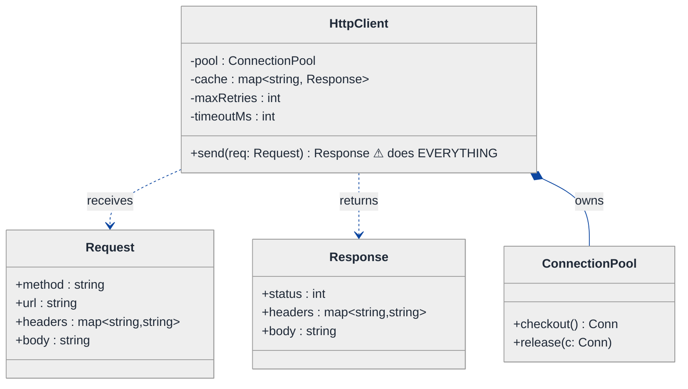
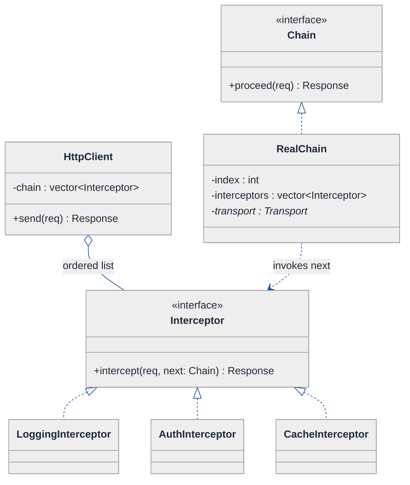
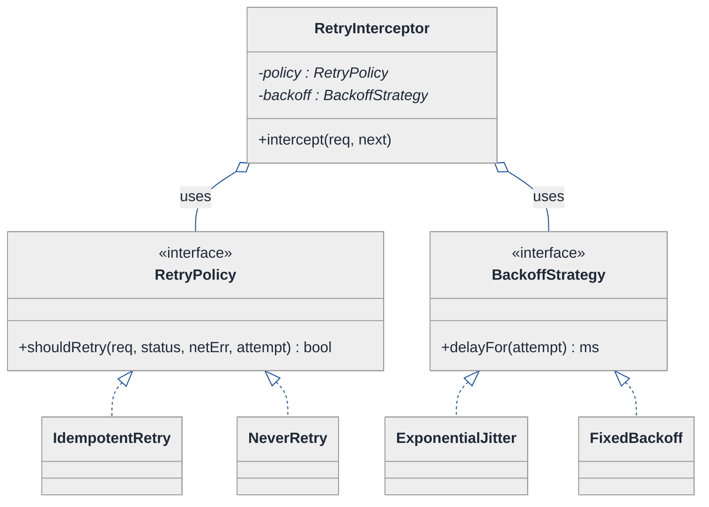
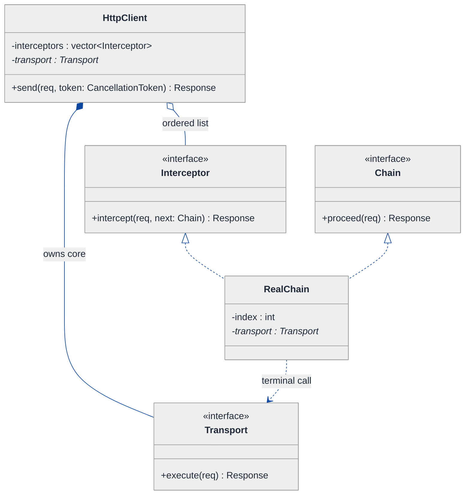
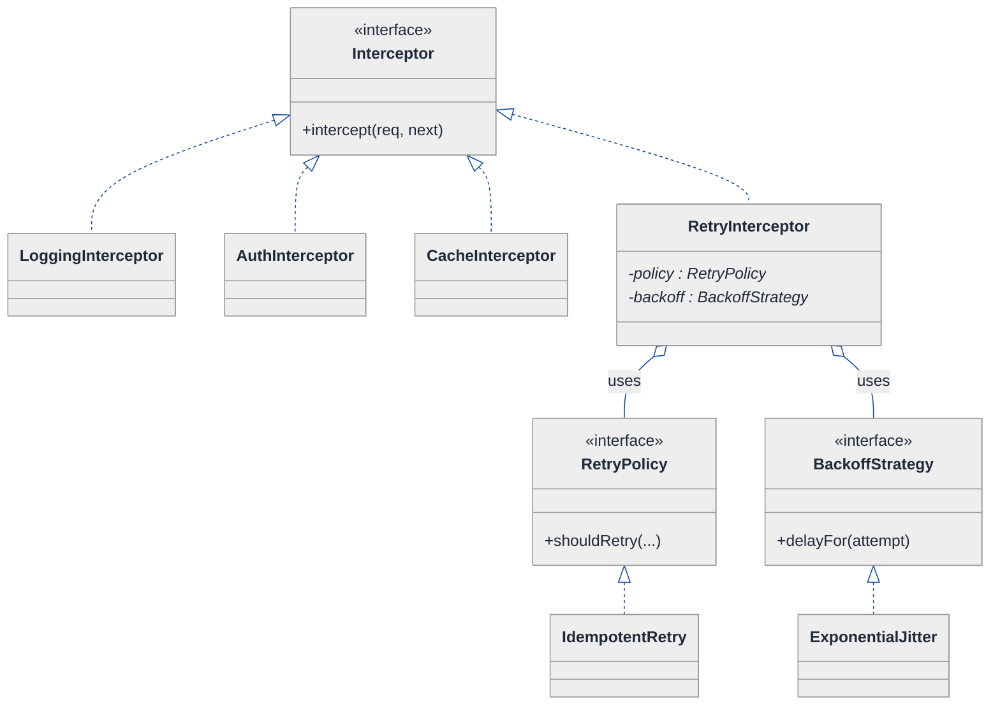
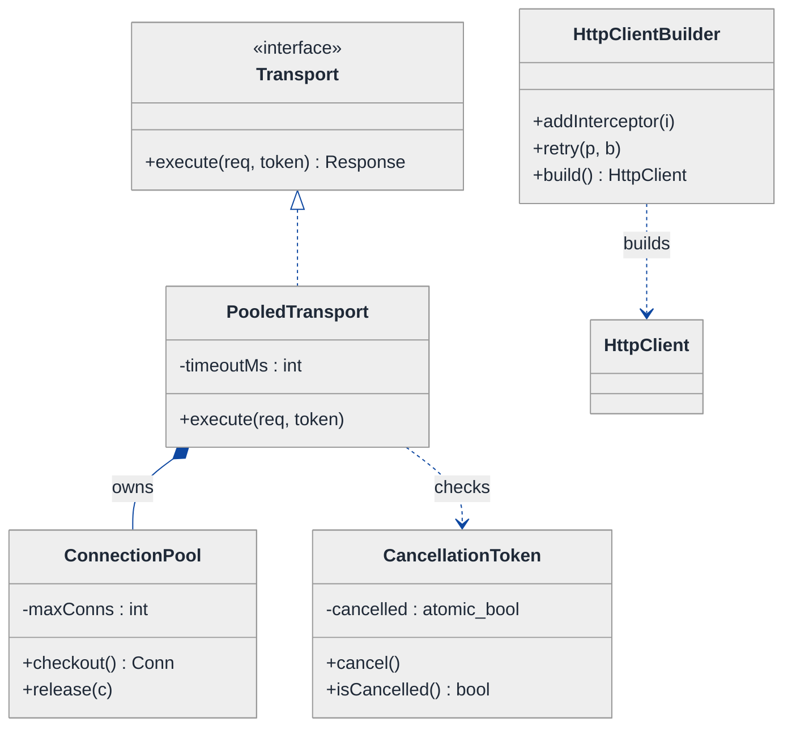
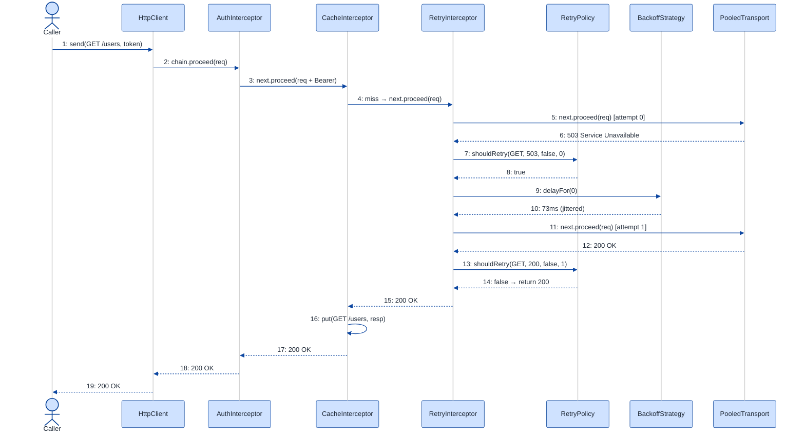

# HTTP Client Library — LLD Walkthrough

> **Difficulty:** Medium · **Time:** ~30 min · **Pattern focus:** Interceptor (Chain of Responsibility) + Builder + Strategy (retry / backoff)
>
> **Problem source(s):** GID R3, bucket `Retry_Pattern`. Representative of the "design a composable HTTP client" family in [`./EXTRACTED_QUESTIONS.md`](./EXTRACTED_QUESTIONS.md).
>
> **Diagrams:** inline mermaid (renders natively in GitHub / VS Code). Canonical theme block copied verbatim into every diagram.

---

## How to use this file

Paced for a candidate seeing "design an HTTP client with retries and interceptors" for the first time. Reading time: ~30 minutes if you sketch each iteration by hand. **The lesson: don't reach for a middleware framework up front — DERIVE it. Build the naive `send()` that does everything inline, watch it balloon under three or four cross-cutting requirements, then reach for ONE pattern at a time: an Interceptor chain for cross-cutting concerns, a Strategy for retry/backoff, and a Builder to assemble the whole thing without a 9-argument constructor.**

**Map of this file (15 sections):**

1. Problem statement + clarifying questions
2. Plain-English restatement
3. Why this matters
4. Mental model
5. Try it yourself first
6. Entity & verb extraction
7. **Iteration 1: the naive design** — one fat `send()`
8. **Where the naive design hurts** — four cross-cutting requirements, one painful diff each
9. **Pivot 1: Interceptor chain** — the most painful axis first (cross-cutting concerns)
10. **Pivot 2: Strategy for retry + backoff** — the algorithm the caller tunes
11. **Pivot 3: Builder to assemble the client** — kill the telescoping constructor
12. Final UML class diagram
13. Skeleton code (C++)
14. Key flow — sequence diagram
15. Extensibility re-check + anti-patterns + how to think aloud + self-check

---

## 1. Problem statement + clarifying questions

**Prompt (typical phrasing):** "Design an HTTP client library with request/response interceptors, automatic retry with backoff, timeout handling, connection pooling, request cancellation, and response caching. Make it composable via middleware."

**Clarifying questions to ask BEFORE drawing anything:**

1. **Sync or async?** Blocking `send()` that returns a `Response`, or a future / callback model? (Cancellation semantics differ wildly.)
2. **Which concerns are per-request vs per-client?** Auth headers are usually per-client; a one-off timeout override is per-request. Where does config live?
3. **Retry scope?** Retry on which conditions — connection errors only, or also 5xx / 429? Are non-idempotent verbs (POST) retried, or only GET/PUT/DELETE?
4. **Backoff policy?** Fixed delay, exponential, exponential-with-jitter? Is there a max-attempts and a max-elapsed cap?
5. **Cache semantics?** Honor HTTP `Cache-Control` / `ETag`, or a simpler TTL keyed on method+URL? Where does the cache check sit relative to retries?
6. **Cancellation granularity?** Cancel a single in-flight request, or a whole batch via one token?
7. **Ordering of cross-cutting concerns?** If both a logging interceptor and an auth interceptor exist, who runs first? Is the order caller-controlled?
8. **Thread safety / connection pool size?** Is the client shared across threads? Bounded pool with a checkout/return discipline?

**Assumptions if interviewer dodges:** synchronous `send()` returning a `Response`; per-client config with per-request override hooks; retry on connection errors + 5xx + 429 for idempotent verbs only; exponential backoff with full jitter and a max-attempts cap; TTL cache keyed on method+URL sitting in front of retries; per-request cancellation token; caller-ordered interceptor list; thread-safe client over a bounded connection pool.

---

## 2. Plain-English restatement

We're building the library other engineers call when they need to talk HTTP — like a hand-rolled `requests`, `axios`, or `OkHttp`. The core job is small: take a `Request`, get a `Response`. The *interesting* job is everything wrapped around that one line: log it, attach an auth token, check a cache, retry on failure with backoff, time it out, draw a connection from a pool, and let the caller cancel mid-flight. The design must let a user **add or reorder those wrapped behaviors without editing the core send loop**, and **assemble a configured client without a constructor that takes nine arguments**.

---

## 3. Why this matters

Every backend service is a *client* of three or four other services, so "wrap a network call with retries and logging" is the single most common real-world code you'll write. The interviewer is probing whether you recognize that retry, logging, auth, caching, and metrics are all the **same shape of problem** — cross-cutting concerns that wrap a core operation — and whether you reach for a composable chain instead of stacking `if` blocks inside one function. It also tests retry literacy: thundering-herd, jitter, idempotency, and the difference between "retry the algorithm" and "the thing being retried."

---

## 4. Mental model

An HTTP client is a **pipeline with a core in the middle**. The core is `transport.execute(request) -> response` — open a socket, write bytes, read bytes. Everything else is a **ring of wrappers** around that core, each adding one cross-cutting behavior on the way in and/or the way out.

```
Real-world sketch (NOT a UML diagram yet):

  caller.send(req)
      │
      ▼
  ┌─────────────────────────────────────────────┐
  │ Logging        (record start / end)          │  outer ring
  │  ┌──────────────────────────────────────┐    │
  │  │ Auth        (attach Bearer token)     │    │
  │  │  ┌────────────────────────────────┐   │    │
  │  │  │ Cache    (hit? short-circuit)   │   │    │
  │  │  │  ┌──────────────────────────┐   │   │    │
  │  │  │  │ Retry  (loop + backoff)   │   │   │    │
  │  │  │  │  ┌────────────────────┐   │   │   │    │
  │  │  │  │  │  TRANSPORT (core)  │   │   │   │    │  innermost
  │  │  │  │  │  pool + timeout    │   │   │   │    │
  │  │  │  │  └────────────────────┘   │   │   │    │
  │  │  │  └──────────────────────────┘   │   │    │
  │  │  └────────────────────────────────┘   │    │
  │  └──────────────────────────────────────┘    │
  └─────────────────────────────────────────────┘
```

The KEY insight from this picture: the *core* never changes; the *rings* are pluggable and ordered. Cross-cutting concerns are the rings (Interceptor chain), the retry loop is one ring whose loop policy is itself swappable (Strategy), and the whole onion is assembled by a Builder.

---

## 5. Try it yourself first

> **Predict before reading on:**
>
> 1. List 5 nouns you'd promote to a class. Which one is the "core" that the rest wrap?
> 2. **If I told you the client will need logging, auth, AND metrics within its first month, what would change about how you write `send()`?**
> 3. Retry needs a delay between attempts. Should "how long to wait" be a field on the retry code, or its own object — and why?

---

## 6. Entity & verb extraction

> **Mini-refresher: noun → class, but not every noun.**
>
> Naive OOD promotes every noun to a class. Senior OOD promotes a noun only if it has both BEHAVIOR and STATE that need to live together. "Header" stays a field on Request; "interceptor" becomes a class because it has wrapping behavior.

**Nouns from the prompt:**

| Noun | Decision | Why |
|---|---|---|
| HttpClient | Class (the façade) | Owns the assembled pipeline; exposes `send()` |
| Request / Response | Classes (data + small helpers) | Carry method, url, headers, body, status |
| Interceptor | Class (abstract) + concretes | The "rings" — each wraps the next; has behavior |
| Transport | Class (abstract) + concrete | The innermost core: socket I/O |
| RetryPolicy | Class (abstract) + concretes | Decides *whether* to retry |
| BackoffStrategy | Class (abstract) + concretes | Decides *how long* to wait |
| ConnectionPool | Class | Checkout / return discipline + bound |
| ResponseCache | Class | TTL lookup keyed on method+url |
| CancellationToken | Class | Shared flag the caller can flip |
| Header | Field on Request (`map<string,string>`) | No behavior of its own |
| Timeout | Field / config value (`milliseconds`) | A number, not a class |

**Verbs (and the class they live on):**

| Verb | Owner class (naive answer — we'll re-examine) |
|---|---|
| send(request) | HttpClient |
| execute(request) | Transport (the core network call) |
| intercept(request, next) | Interceptor |
| shouldRetry(response/error, attempt) | RetryPolicy |
| delayFor(attempt) | BackoffStrategy |
| checkout() / release(conn) | ConnectionPool |
| get(key) / put(key, resp) | ResponseCache |
| cancel() / isCancelled() | CancellationToken |

**We have NOT introduced any design patterns yet.** Pure nouns + verbs.

---

## 7. <a id="iter-1"></a>Iteration 1: the naive design

Let's write the simplest thing that could possibly work. No design patterns — one class, one big method, straight conditionals.



**Reader's tour (read top to bottom; ~60 seconds).**

1. **At the top — `HttpClient` is the whole show.** It holds the pool, a cache `map`, and two scalar config fields (`maxRetries`, `timeoutMs`). It exposes ONE public method, `send()`, and that method does *everything*: log, auth, cache lookup, retry loop, timeout, pool checkout, the actual network call, cache store.

2. **`Request` and `Response` are honest data carriers.** Method, URL, headers, body on the way in; status, headers, body on the way out. These are fine — they're genuinely just data and won't be the smell.

3. **`ConnectionPool` is composed by the client.** Filled-diamond ownership: the pool lives and dies with the client. Also fine in shape.

4. **The ⚠ on `send()` is the trouble zone.** Every cross-cutting concern is a hardcoded block *inside one method*. There is no `Interceptor`, no `RetryPolicy`, no `BackoffStrategy`, no `CancellationToken` — the naive design doesn't even acknowledge these are independent axes. It bakes one fixed answer for each into the body of `send()`.

Skeleton code for the naive design (C++):

```cpp
#include <chrono>
#include <map>
#include <stdexcept>
#include <string>
#include <thread>

struct Request  { std::string method, url, body; std::map<std::string,std::string> headers; };
struct Response { int status = 0; std::string body; std::map<std::string,std::string> headers; };

class ConnectionPool { public: void* checkout(); void release(void*); };

class HttpClient {
public:
    Response send(Request req) {                         // ⚠ one method does EVERYTHING
        // --- logging ---
        log("→ " + req.method + " " + req.url);

        // --- auth (hardcoded) ---
        req.headers["Authorization"] = "Bearer " + token_;

        // --- cache lookup (hardcoded TTL-less map) ---
        std::string key = req.method + " " + req.url;
        if (req.method == "GET" && cache_.count(key))
            return cache_[key];

        // --- retry loop with FIXED backoff baked in ---
        int attempt = 0;
        while (true) {
            try {
                auto* conn = pool_.checkout();              // pooling
                Response res = doNetwork(conn, req, timeoutMs_);  // timeout + I/O
                pool_.release(conn);

                if (res.status >= 500 && attempt < maxRetries_) {  // retry condition hardcoded
                    ++attempt;
                    std::this_thread::sleep_for(std::chrono::milliseconds(200 * attempt)); // backoff hardcoded
                    continue;
                }
                if (req.method == "GET") cache_[key] = res;        // cache store
                log("← " + std::to_string(res.status));
                return res;
            } catch (const std::exception& e) {
                if (attempt++ >= maxRetries_) throw;
                std::this_thread::sleep_for(std::chrono::milliseconds(200 * attempt));
            }
        }
    }
private:
    Response doNetwork(void* conn, const Request& req, int timeoutMs); // elided socket I/O
    void log(const std::string& s);                                    // elided
    ConnectionPool pool_;
    std::map<std::string, Response> cache_;
    std::string token_;
    int maxRetries_ = 3;
    int timeoutMs_  = 5000;
};
```

**This works.** It has zero design patterns. It logs, auths, caches, retries with backoff, times out, pools. So what's wrong with it?

---

## 8. <a id="naive-pain"></a>Where the naive design hurts

The interviewer slides a piece of paper across the desk: "Here are four things product wants next sprint. Walk me through what changes."

### Change A: "Add request-id + metrics + a circuit breaker around every call"

In the naive design:
- Each is another block wedged into `send()`. The metrics timer must wrap the network call; the request-id header goes near the auth block; the breaker check goes before the retry loop and the breaker record goes after.
- **`send()` grows from ~30 lines to ~80, and the *order* of those blocks is now load-bearing and invisible** — nothing documents that auth must run before caching, or that metrics must wrap retries not sit beside them.

### Change B: "Make retry exponential-with-jitter, and don't retry POST"

In the naive design:
- The hardcoded `sleep_for(200 * attempt)` becomes a branch on policy: fixed vs exponential vs jittered.
- The hardcoded `res.status >= 500` condition must now also exclude non-idempotent verbs and include `429`.
- **Both the "how long to wait" and the "should I retry at all" logic live tangled inside the same `while` loop.** Next backoff tweak → surgery in `send()` again.

### Change C: "Let callers add their OWN interceptor (e.g., a tenant-specific signing step) without forking the library"

In the naive design:
- Impossible without editing `send()`. A library *user* cannot inject a behavior between auth and cache; they'd have to subclass `HttpClient` and override the whole method, copy-pasting our 80 lines.
- **The naive design is closed for extension by anyone but us.** That's the open/closed violation in its purest form.

### Change D: "Constructor is unusable — we now configure pool size, timeout, retries, backoff, cache TTL, base URL, default headers, TLS verify…"

In the naive design:
- `HttpClient` gains a constructor with 8+ parameters, half of them optional, several the same type (`int timeout, int retries, int poolSize` — easy to pass in the wrong order).
- **Telescoping constructors multiply** (`HttpClient(a)`, `HttpClient(a,b)`, …). Callers can't tell `HttpClient(5000, 3)` from `HttpClient(3, 5000)`.

### The pattern of pain

| Change | Files / sites touched | Smell |
|---|---|---|
| A. id + metrics + breaker | `send()` body (3 new ordered blocks) | "Cross-cutting concerns crammed into one method; order is implicit." |
| B. exp backoff, skip POST | retry `while` loop in `send()` | "Two policies (whether + how-long) tangled in the loop." |
| C. user interceptor | `send()` (must fork/override) | "Closed for extension — only the library author can add behavior." |
| D. config explosion | `HttpClient` constructor | "Telescoping / same-type positional args; no readable assembly." |

**Two axes of pain dominate, plus an assembly problem:** (1) cross-cutting behavior that should be pluggable and ordered, (2) the retry algorithm that should be tunable, and (3) building a configured client without a monster constructor.

> **Pivot question:** "What pattern lets me wrap a core operation with an ORDERED, CALLER-EXTENSIBLE stack of behaviors? What pattern lets the caller swap the retry/backoff ALGORITHM? And what pattern assembles a many-knob object readably?"
>
> The answers are Interceptor (a Chain of Responsibility), Strategy, and Builder. Let's introduce them one at a time, starting with the most painful axis: the cross-cutting concerns.

---

## 9. <a id="pivot-1"></a>Pivot 1: Interceptor chain for cross-cutting concerns

> **Mini-refresher: Interceptor pattern (a flavor of Chain of Responsibility).**
>
> An interceptor wraps a call: it gets the request, may modify it, calls `next()` to pass control inward, gets the response back, may modify *that*, and returns it. Each interceptor holds a reference to "the rest of the chain." The CORE network call sits at the very bottom. Because every interceptor has the same `intercept(req, next)` signature, you can stack them in any order — and a caller can add their own.
>
> Quick example: Express/Koa `app.use(mw)`, OkHttp `Interceptor`, gRPC interceptors — all the same shape: `(request, next) -> response`.

**Why Interceptor fits the cross-cutting concerns.** Logging, auth, request-id, metrics, caching, and the breaker are all "do something on the way in and/or out, then delegate inward." They vary, they must be ordered, and *third parties* must be able to add their own. That's exactly what a chain of `intercept(req, next)` objects gives you. The core network call becomes the terminal link.

> **Mini-refresher: Open/Closed Principle (the "O" in SOLID).**
>
> Software should be OPEN for extension but CLOSED for modification. Adding behavior should mean adding a new class, not editing an existing one. The Interceptor chain achieves this: a new concern is a new `Interceptor` subclass added to the list — `HttpClient::send()` never changes.

**The refactor (just the affected slice):**

```cpp
class Response; class Request;

// The "rest of the chain" — calling it advances inward toward the transport.
class Chain {
public:
    virtual ~Chain() = default;
    virtual Response proceed(Request req) = 0;   // run the remaining interceptors + core
};

class Interceptor {
public:
    virtual ~Interceptor() = default;
    virtual Response intercept(Request req, Chain& next) = 0;
};

class LoggingInterceptor : public Interceptor {
public:
    Response intercept(Request req, Chain& next) override {
        log("→ " + req.method + " " + req.url);
        Response res = next.proceed(std::move(req));   // delegate inward
        log("← " + std::to_string(res.status));
        return res;                                    // post-process on the way out
    }
};

class AuthInterceptor : public Interceptor {
public:
    explicit AuthInterceptor(std::string token) : token_(std::move(token)) {}
    Response intercept(Request req, Chain& next) override {
        req.headers["Authorization"] = "Bearer " + token_;  // pre-process only
        return next.proceed(std::move(req));
    }
private:
    std::string token_;
};

class CacheInterceptor : public Interceptor {       // can SHORT-CIRCUIT: never calls next on a hit
public:
    Response intercept(Request req, Chain& next) override {
        auto key = req.method + " " + req.url;
        if (req.method == "GET") if (auto hit = cache_.get(key)) return *hit;
        Response res = next.proceed(req);
        if (req.method == "GET" && res.status == 200) cache_.put(key, res);
        return res;
    }
private:
    ResponseCache cache_;
};
// MetricsInterceptor, RequestIdInterceptor, CircuitBreakerInterceptor — elided, same shape
```

**What changed — visualized.** Just the cross-cutting slice:



**Tour of the after-state.**

1. **`HttpClient` now holds an ORDERED `vector<Interceptor>`** instead of a fat method. `send()` builds a `RealChain` over that list and calls `chain.proceed(req)`. The 80-line method collapses to ~3 lines.

2. **`Interceptor` is the interface** — one method, `intercept(req, next)`. Every concern implements it identically, which is exactly why they're stackable and reorderable.

3. **`Chain` is the "rest of the pipeline" handle.** `RealChain` remembers its position (`index`) in the interceptor list; each `proceed()` advances to the next interceptor, and when it runs off the end it calls the `Transport` core. This is the recursion that threads the whole onion.

4. **`CacheInterceptor` can SHORT-CIRCUIT.** On a cache hit it returns *without* calling `next.proceed()` — nothing inward (retries, transport) ever runs. That ability to stop the chain is the hallmark of Chain of Responsibility.

5. **A caller can add their own interceptor** by implementing the interface and inserting it into the list (we'll make that ergonomic with the Builder in Pivot 3). `send()` never changes. **Change A and Change C from §8 now land cleanly** — metrics/breaker/request-id/tenant-signing are each one new class added to the list.

**Pattern-discrimination cheatsheet — Interceptor (Chain of Responsibility) vs Decorator.**
- *Interceptor/CoR:* a uniform `intercept(req, next)` link list where any link may **short-circuit** (not call `next`); built/ordered dynamically; the chain decides whether to continue.
- *Decorator:* wraps an object to add behavior but is expected to **always delegate** to the wrapped object, exposing the same interface as what it wraps.
- *Rule of thumb:* if a wrapper may legitimately STOP the call (cache hit, breaker open) → Chain of Responsibility / Interceptor. If every wrapper just augments and always passes through → Decorator.

We chose Interceptor because caching and the circuit breaker *must* be able to short-circuit, and because the chain is assembled dynamically from a caller-supplied list.

---

## 10. <a id="pivot-2"></a>Pivot 2: Strategy for retry + backoff

Change B from §8 is still painful. The retry behavior is now *one* interceptor (`RetryInterceptor`), but inside it two decisions are still tangled: **whether** to retry (status/verb/attempt-count) and **how long** to wait (fixed/exponential/jittered). The Interceptor chain gave us a *slot* for retry; it didn't make the retry *algorithm* swappable.

> **Mini-refresher: Strategy pattern.**
>
> Encapsulates an algorithm behind an interface so it can be swapped at runtime. The CALLER decides which strategy to use; the strategy doesn't know about its peers.
>
> Quick example: a `Sorter` takes a `CompareStrategy*`. Pass `Ascending` or `Descending` — the sorter doesn't care which.

**Why two Strategies, not one.** "Should I retry?" and "how long do I wait?" vary *independently*. You might want exponential backoff with a retry-on-5xx policy today, and the same backoff with a retry-on-connection-error-only policy tomorrow. Two interfaces let you mix and match.

> **Mini-refresher: exponential backoff + jitter (the retry-specific bit).**
>
> Fixed delay → all failed clients retry in lockstep → thundering herd. Exponential (`base * 2^attempt`) spreads them out but still synchronizes peaks. **Full jitter** picks a random delay in `[0, base * 2^attempt]`, scattering retries so a recovering server isn't re-hammered. Always cap with `maxAttempts` and a `maxElapsed` ceiling.

**The refactor (just the retry slice):**

```cpp
// "Should I retry?" — independent of "how long do I wait?"
class RetryPolicy {
public:
    virtual ~RetryPolicy() = default;
    virtual bool shouldRetry(const Request& req, int status, bool networkError, int attempt) const = 0;
};

class IdempotentRetry : public RetryPolicy {            // GET/PUT/DELETE only, on 5xx/429/conn-err
public:
    explicit IdempotentRetry(int maxAttempts) : max_(maxAttempts) {}
    bool shouldRetry(const Request& req, int status, bool netErr, int attempt) const override {
        if (attempt >= max_) return false;
        if (req.method == "POST" || req.method == "PATCH") return false;   // not idempotent
        return netErr || status == 429 || (status >= 500 && status < 600);
    }
private:
    int max_;
};
// NeverRetry, RetryAll — elided

// "How long do I wait?" — pure function of attempt number.
class BackoffStrategy {
public:
    virtual ~BackoffStrategy() = default;
    virtual std::chrono::milliseconds delayFor(int attempt) const = 0;
};

class ExponentialJitter : public BackoffStrategy {
public:
    ExponentialJitter(std::chrono::milliseconds base, std::chrono::milliseconds cap)
        : base_(base), cap_(cap) {}
    std::chrono::milliseconds delayFor(int attempt) const override {
        auto raw  = base_.count() * (1LL << attempt);            // base * 2^attempt
        auto ceil = std::min<long long>(raw, cap_.count());
        return std::chrono::milliseconds(randIn(0, ceil));       // full jitter: [0, ceil]
    }
private:
    std::chrono::milliseconds base_, cap_;
    static long long randIn(long long lo, long long hi);          // elided
};
// FixedBackoff, ExponentialBackoff (no jitter) — elided

// The retry interceptor now OWNS two strategies and delegates both decisions.
class RetryInterceptor : public Interceptor {
public:
    RetryInterceptor(std::unique_ptr<RetryPolicy> policy, std::unique_ptr<BackoffStrategy> backoff)
        : policy_(std::move(policy)), backoff_(std::move(backoff)) {}
    Response intercept(Request req, Chain& next) override {
        for (int attempt = 0; ; ++attempt) {
            int status = 0; bool netErr = false; Response res;
            try { res = next.proceed(req); status = res.status; }
            catch (const std::exception&) { netErr = true; }
            if (!policy_->shouldRetry(req, status, netErr, attempt)) {
                if (netErr) throw;            // exhausted on a network error
                return res;
            }
            std::this_thread::sleep_for(backoff_->delayFor(attempt));   // ⚡ jittered wait
        }
    }
private:
    std::unique_ptr<RetryPolicy>     policy_;
    std::unique_ptr<BackoffStrategy> backoff_;
};
```

**What changed — visualized.** Just the retry slice:



**Tour of the after-state.**

1. **`RetryInterceptor` is one link in the chain** (Pivot 1) that now holds two injected strategies. Its `intercept()` is a clean loop: try → ask policy → wait per backoff → repeat.

2. **`RetryPolicy` answers ONLY "should I retry?"** — a boolean from `(req, status, networkError, attempt)`. `IdempotentRetry` encodes the verb + status + attempt-cap rules; `NeverRetry` is the disable switch. Change B's "don't retry POST" lives entirely here.

3. **`BackoffStrategy` answers ONLY "how long?"** — a duration from `attempt`. `ExponentialJitter` implements full jitter with a cap; `FixedBackoff` is the trivial case. Change B's "exponential with jitter" lives entirely here.

4. **The two axes are now orthogonal.** Swap the policy without touching the backoff, or vice versa. The naive design's single tangled `while` loop is gone.

**Pattern-discrimination cheatsheet — Strategy vs State.**
- *Strategy:* the CALLER picks which algorithm to use; it's set externally (here, the Builder injects `IdempotentRetry` + `ExponentialJitter`).
- *State:* the OBJECT picks its next behavior internally via transitions driven by events.
- *Rule of thumb:* if `ctx.setX(strategy)` is called externally → Strategy. If `ctx.handle(event)` flips behavior internally → State.

Retry/backoff are caller-tuned configuration → Strategy. (A *circuit breaker*, by contrast, IS a State machine — Closed → Open → HalfOpen — which is why it's a separate concern and a sibling walkthrough; see [`./Circuit_Breaker.md`](./Circuit_Breaker.md).)

---

## 11. <a id="pivot-3"></a>Pivot 3: Builder to assemble the client

Changes A, B, C are solved. Change D — the config explosion and the unreadable constructor — is not. We now have interceptors to order, two retry strategies to inject, a pool size, a transport, default headers, a base URL, a TLS-verify flag. A positional constructor for all of that is a trap.

> **Mini-refresher: Builder pattern.**
>
> Separates the *construction* of a complex object from its representation. Instead of a telescoping constructor, you chain readable setters (`.timeout(5s).retries(...)`) and call `.build()` at the end, which validates and produces the finished, immutable object. Each setter returns `*this` for fluent chaining.
>
> Quick example: `StringBuilder`, `OkHttpClient.Builder()`, `flatbuffers` builders — all turn "many optional knobs" into readable assembly.

**Why Builder (not a Factory, not a giant constructor).** We have many optional, same-typed knobs and an *ordered* interceptor list to accumulate. A Factory hides *which subclass* to create — that's not our problem; we always create an `HttpClient`. Our problem is *readable assembly of many parts*. That's textbook Builder.

> **Mini-refresher: Dependency Injection.**
>
> A class receives its collaborators from outside (constructor args) rather than `new`-ing them itself. The Builder is where we wire the graph — it injects the chosen `Transport`, the ordered interceptors (including the `RetryInterceptor` holding its strategies), and the pool. `HttpClient` depends on *interfaces*, never on concrete classes, so it's trivially testable with a fake transport.

**The refactor (just the assembly slice):**

```cpp
class HttpClientBuilder {
public:
    HttpClientBuilder& baseUrl(std::string url)          { baseUrl_ = std::move(url); return *this; }
    HttpClientBuilder& timeout(std::chrono::milliseconds t) { timeout_ = t;          return *this; }
    HttpClientBuilder& poolSize(int n)                   { poolSize_ = n;            return *this; }
    HttpClientBuilder& transport(std::unique_ptr<Transport> t) { transport_ = std::move(t); return *this; }
    HttpClientBuilder& addInterceptor(std::unique_ptr<Interceptor> i) {   // ORDER preserved
        interceptors_.push_back(std::move(i)); return *this;
    }
    HttpClientBuilder& retry(std::unique_ptr<RetryPolicy> p, std::unique_ptr<BackoffStrategy> b) {
        // sugar: appends a RetryInterceptor at the current position in the chain
        interceptors_.push_back(std::make_unique<RetryInterceptor>(std::move(p), std::move(b)));
        return *this;
    }
    std::unique_ptr<HttpClient> build() {                 // validates, then constructs once
        if (!transport_) transport_ = std::make_unique<PooledTransport>(poolSize_, timeout_);
        return std::make_unique<HttpClient>(std::move(interceptors_), std::move(transport_), baseUrl_);
    }
private:
    std::string baseUrl_;
    std::chrono::milliseconds timeout_{5000};
    int poolSize_ = 10;
    std::unique_ptr<Transport> transport_;
    std::vector<std::unique_ptr<Interceptor>> interceptors_;
};
```

Usage reads top-to-bottom in the exact order the chain runs:

```cpp
auto client = HttpClientBuilder{}
    .baseUrl("https://api.example.com")
    .timeout(std::chrono::seconds(3))
    .poolSize(20)
    .addInterceptor(std::make_unique<LoggingInterceptor>())          // outermost
    .addInterceptor(std::make_unique<AuthInterceptor>("tok123"))
    .addInterceptor(std::make_unique<CacheInterceptor>())
    .retry(std::make_unique<IdempotentRetry>(3),
           std::make_unique<ExponentialJitter>(100ms, 2000ms))       // innermost-but-one
    .build();
```

**Pattern-discrimination cheatsheet — Builder vs Factory.**
- *Builder:* assembles ONE complex object step by step; you always know the concrete type; the value is *readable, validated, multi-part construction*.
- *Factory (Method/Abstract):* chooses *which* concrete type to instantiate behind an interface; the value is *hiding the subclass decision*.
- *Rule of thumb:* "many knobs / parts to assemble" → Builder. "decide which subclass at runtime" → Factory.

We chose Builder because there's only one product type (`HttpClient`) but many ordered, optional parts. **Change D from §8 now lands cleanly** — a new knob is a new fluent setter, never a new constructor overload.

---

## 12. <a id="fig-class-diagram"></a>Final class diagram

Showing everything in one diagram becomes a wall of boxes. Here are **three focused sub-views**, each addressing a different concern; the structural insight at the end ties them together.

### 12.1 The chain spine — what `send()` orchestrates



**Tour of 12.1.** `HttpClient::send()` builds a `RealChain` over its ordered interceptor list and calls `proceed()`. Each `proceed()` advances `index`; when it runs past the last interceptor it invokes the `Transport` core (filled diamond = owned). The chain is the spine; the transport is the floor it bottoms out on.

### 12.2 The pluggable concerns — interceptors + retry strategies



**Tour of 12.2.** Every concern is an `Interceptor` (uniform interface = stackable). `RetryInterceptor` is special only in that it composes two Strategy interfaces — `RetryPolicy` (whether) and `BackoffStrategy` (how long), each with its own concrete family. Caching can short-circuit; auth/logging always delegate. A new concern is one new `Interceptor` subclass; a new retry rule is one new policy or backoff class.

### 12.3 The transport floor — pool, timeout, cancellation



**Tour of 12.3.** `PooledTransport` is the concrete core: it checks out a connection from a bounded `ConnectionPool`, applies the timeout, and polls the `CancellationToken` so an in-flight request can be aborted. The `HttpClientBuilder` (right) is the only thing that wires this graph — it injects the transport and the ordered interceptors into `HttpClient`, then disappears.

### Structural insight (ties 12.1 + 12.2 + 12.3 together)

| Concern | Pattern used | Why |
|---|---|---|
| Cross-cutting behaviors (log, auth, cache, metrics, breaker) | **Interceptor / Chain of Responsibility** | Ordered, pluggable, may short-circuit; third parties extend it |
| Retry decision + delay | **Strategy** (×2, orthogonal) | Caller tunes "whether" and "how long" independently |
| Assembling the client | **Builder** + Dependency Injection | Many ordered/optional parts; readable, validated construction |
| The network core | Plain interface (`Transport`) + composition | One genuine implementation; pool/timeout/cancel are its internals |

The big lesson: **the core operation never moved** — `Transport::execute` is the same one line it always was. Everything the prompt listed (interceptors, retry, backoff, timeout, pooling, cancellation, caching) is either a *ring* around that core (Interceptor), a *knob* on a ring (Strategy), or *assembly* of the whole (Builder). *Wrap the core, don't edit it.*

---

## 13. Skeleton code (C++)

> Show the SHAPES, not the full impl. ~130 lines.

```cpp
#include <atomic>
#include <chrono>
#include <map>
#include <memory>
#include <optional>
#include <stdexcept>
#include <string>
#include <thread>
#include <vector>

// ── Data carriers ───────────────────────────────────────────────────
struct Request  { std::string method, url, body; std::map<std::string,std::string> headers; };
struct Response { int status = 0; std::string body; std::map<std::string,std::string> headers; };

// ── Cancellation: a shared, thread-safe flag ────────────────────────
class CancellationToken {
public:
    void cancel()            { cancelled_.store(true); }
    bool isCancelled() const { return cancelled_.load(); }
private:
    std::atomic<bool> cancelled_{false};
};

// ── The core: Transport (innermost link) ────────────────────────────
class Transport {
public:
    virtual ~Transport() = default;
    virtual Response execute(const Request& req, CancellationToken& tok) = 0;
};

class ConnectionPool {                                  // bounded checkout/return
public:
    explicit ConnectionPool(int maxConns) : max_(maxConns) {}
    void* checkout();                                   // elided: block until a slot frees
    void  release(void* c);                             // elided
private:
    int max_;
};

class PooledTransport : public Transport {
public:
    PooledTransport(int poolSize, std::chrono::milliseconds timeout)
        : pool_(poolSize), timeout_(timeout) {}
    Response execute(const Request& req, CancellationToken& tok) override {
        if (tok.isCancelled()) throw std::runtime_error("cancelled");
        void* conn = pool_.checkout();
        try { Response r = doIO(conn, req, timeout_, tok); pool_.release(conn); return r; }
        catch (...) { pool_.release(conn); throw; }     // always return the connection
    }
private:
    Response doIO(void* c, const Request&, std::chrono::milliseconds, CancellationToken&); // elided
    ConnectionPool pool_;
    std::chrono::milliseconds timeout_;
};

// ── Interceptor chain ───────────────────────────────────────────────
class Chain {
public:
    virtual ~Chain() = default;
    virtual Response proceed(Request req) = 0;
};

class Interceptor {
public:
    virtual ~Interceptor() = default;
    virtual Response intercept(Request req, Chain& next) = 0;
};

// Threads the call inward; bottoms out at the transport.
class RealChain : public Chain {
public:
    RealChain(const std::vector<std::unique_ptr<Interceptor>>& chain,
              std::size_t index, Transport& transport, CancellationToken& tok)
        : chain_(chain), index_(index), transport_(transport), tok_(tok) {}
    Response proceed(Request req) override {
        if (index_ >= chain_.size()) return transport_.execute(req, tok_);   // terminal
        RealChain next(chain_, index_ + 1, transport_, tok_);
        return chain_[index_]->intercept(std::move(req), next);
    }
private:
    const std::vector<std::unique_ptr<Interceptor>>& chain_;
    std::size_t index_;
    Transport& transport_;
    CancellationToken& tok_;
};

class AuthInterceptor : public Interceptor {            // pre-process only
public:
    explicit AuthInterceptor(std::string token) : token_(std::move(token)) {}
    Response intercept(Request req, Chain& next) override {
        req.headers["Authorization"] = "Bearer " + token_;
        return next.proceed(std::move(req));
    }
private:
    std::string token_;
};
// LoggingInterceptor, CacheInterceptor (short-circuits), MetricsInterceptor — elided

// ── Retry: two orthogonal Strategies ────────────────────────────────
class RetryPolicy {
public:
    virtual ~RetryPolicy() = default;
    virtual bool shouldRetry(const Request& req, int status, bool netErr, int attempt) const = 0;
};
class BackoffStrategy {
public:
    virtual ~BackoffStrategy() = default;
    virtual std::chrono::milliseconds delayFor(int attempt) const = 0;
};
// IdempotentRetry, NeverRetry, ExponentialJitter, FixedBackoff — see Pivot 2

class RetryInterceptor : public Interceptor {
public:
    RetryInterceptor(std::unique_ptr<RetryPolicy> p, std::unique_ptr<BackoffStrategy> b)
        : policy_(std::move(p)), backoff_(std::move(b)) {}
    Response intercept(Request req, Chain& next) override {
        for (int attempt = 0; ; ++attempt) {
            int status = 0; bool netErr = false; Response res;
            try { res = next.proceed(req); status = res.status; }
            catch (const std::exception&) { netErr = true; }
            if (!policy_->shouldRetry(req, status, netErr, attempt)) {
                if (netErr) throw; else return res;
            }
            std::this_thread::sleep_for(backoff_->delayFor(attempt));
        }
    }
private:
    std::unique_ptr<RetryPolicy>     policy_;
    std::unique_ptr<BackoffStrategy> backoff_;
};

// ── Façade ──────────────────────────────────────────────────────────
class HttpClient {
public:
    HttpClient(std::vector<std::unique_ptr<Interceptor>> chain,
               std::unique_ptr<Transport> transport, std::string baseUrl)
        : chain_(std::move(chain)), transport_(std::move(transport)), baseUrl_(std::move(baseUrl)) {}
    Response send(Request req, CancellationToken& tok) {
        if (!req.url.rfind("http", 0) == 0) req.url = baseUrl_ + req.url;
        RealChain chain(chain_, 0, *transport_, tok);                 // build chain, fire
        return chain.proceed(std::move(req));
    }
private:
    std::vector<std::unique_ptr<Interceptor>> chain_;
    std::unique_ptr<Transport> transport_;
    std::string baseUrl_;
};
// HttpClientBuilder — see Pivot 3
```

---

## 14. <a id="fig-sequence"></a>Key flow — sequence diagram

The interesting case is a GET that misses the cache, fails once with a 503, backs off, retries, and succeeds. Read it slowly — it's where all three patterns cooperate.



**Tour of the flow. Read it slowly — this is the moment all three patterns cooperate.**

1. **Caller passes a `CancellationToken` into `send()`.** It rides along the whole chain; any transport-level wait polls it (step 5/11), so a caller calling `token.cancel()` from another thread aborts the in-flight request — without any interceptor knowing about cancellation.

2. **Steps 2-4 walk OUTSIDE-IN through the chain.** `HttpClient` fires the `RealChain`; Auth attaches the Bearer header and delegates inward; Cache looks up the key, misses, and delegates inward. **Cache could have short-circuited here** (a hit returns at step 4 and steps 5-12 never run) — that's the Chain-of-Responsibility power.

3. **Steps 5-12 are the retry LOOP, invisible to everyone above.** Attempt 0 gets a 503. `RetryInterceptor` asks its **RetryPolicy** "should I retry?" (Strategy #1, step 7) → true. It asks its **BackoffStrategy** "how long?" (Strategy #2, step 9) → 73ms of full jitter. It sleeps, then re-fires `next.proceed` for attempt 1, which returns 200.

4. **Step 13-14: the policy says STOP.** A 200 isn't retryable, so the loop returns. Notice the layers above (Cache, Auth, Caller) saw exactly ONE response — they have no idea a retry happened. **The retry loop is hidden by the interceptor boundary.**

5. **Steps 15-17: the response flows OUTSIDE-OUT.** On the way back, Cache stores the successful GET (post-processing), then Auth and Client pass it straight through. Same objects, reverse order — the onion unwinds.

### The validation that's NOT shown — and why it matters

You don't see an `if (status == 503)` or a `sleep(200 * attempt)` anywhere in `HttpClient` or in the other interceptors. Retry-ness is confined to `RetryInterceptor`; the *whether* and *how-long* are confined to two strategy objects. **The chain boundary IS the abstraction** — adding metrics tomorrow means inserting a `MetricsInterceptor` at step 2.5; it sees one logical request/response pair and never learns that a retry happened underneath it.

---

## 15. Extensibility re-check + anti-patterns + how to think aloud + self-check

### Extensibility re-check

Revisit the four changes from [§8](#naive-pain). For each, name the SINGLE thing that changes.

| Change | Naive design impact | Final design impact |
|---|---|---|
| A. id + metrics + breaker | 3 ordered blocks wedged into `send()` | 3 new `Interceptor` subclasses, added to the builder list. Done. |
| B. exp-jitter, skip POST | tangled `while` loop surgery | New `ExponentialJitter : BackoffStrategy` + `IdempotentRetry : RetryPolicy`. Inject them. Done. |
| C. user interceptor | fork / override `send()` | User implements `Interceptor`, calls `.addInterceptor(...)`. Zero library edits. Done. |
| D. config explosion | 8-arg telescoping constructor | New fluent setter on `HttpClientBuilder`. Done. |

Every change is one new class or one new setter. That's the open/closed principle in practice.

If a future requirement makes you change `HttpClient::send()`, `RetryInterceptor`, AND `Transport` together — go back to §6 and re-identify the variability points; you missed one.

### Common confusion + traps

1. **"Why not make each concern a Decorator instead of an Interceptor?"** Decorators are expected to always delegate. Caching and the circuit breaker must be able to *not* delegate (short-circuit). That capability is what makes this Chain of Responsibility, not Decorator.

2. **"Where should the cache sit — before or after retries?"** Before. A cache hit should skip the retry loop and the network entirely. Order is a caller decision the Builder makes explicit; the naive design buried it.

3. **"Should I retry POST?"** Only if it's idempotent (idempotency key) — otherwise you risk double-charging. That decision belongs in `RetryPolicy`, not scattered through `send()`.

4. **"Why two strategies for retry instead of one `RetryConfig`?"** Because "whether" and "how long" vary independently. Coupling them forces a combinatorial explosion of config classes; two interfaces let you mix any policy with any backoff.

5. **"Is the circuit breaker a Strategy too?"** No — a breaker is a State machine (Closed → Open → HalfOpen, driven by failure events). That's why it's a separate `Interceptor` backed by State, covered in [`./Circuit_Breaker.md`](./Circuit_Breaker.md). Retry is caller-configured (Strategy); the breaker transitions itself (State).

### Anti-patterns

- **"God method `send()`"** — every concern crammed into one function with implicit ordering. Lift each into an interceptor.
- **"Tag-driven backoff"** — `if (policy == EXP) ... else if (policy == FIXED)` inside the loop. Use the `BackoffStrategy` interface; let polymorphism dispatch.
- **"Telescoping constructor"** — `HttpClient(int,int,int,bool,string,...)`. Use a Builder.
- **"Retry storms / no jitter"** — fixed backoff synchronizes every client's retry → thundering herd on a recovering server. Always jitter.
- **"Retrying non-idempotent verbs blindly"** — duplicate side effects. Gate POST/PATCH in the policy.
- **"Leaking connections on the error path"** — checkout without a guaranteed release. Use RAII / try-catch-release so the pool never starves.

### How to think aloud

> "OK, HTTP client. Let me clarify scope. [Asks 4-6 questions from §1.] Got it — sync `send`, per-client config with overrides, retry idempotent verbs only, exponential-with-jitter.
>
> Nouns: HttpClient, Request, Response, Transport, the cross-cutting concerns, RetryPolicy, BackoffStrategy, ConnectionPool, CancellationToken.
>
> I'll start NAIVE — one `send()` that logs, auths, checks a cache, runs a retry loop with fixed backoff, times out, pools, returns. It works and has zero patterns.
>
> Now I stress-test it. Add metrics + a breaker → three more ordered blocks in `send()`, order implicit. Make backoff exponential + skip POST → surgery in the loop. Let a *user* add an interceptor → they have to fork `send()`. Add more config → an 8-arg constructor.
>
> The pain clusters into three axes: cross-cutting behaviors that should be pluggable and ordered, a retry algorithm that should be tunable, and assembly of a many-knob object.
>
> Pivot 1: an Interceptor chain (Chain of Responsibility). Each concern is `intercept(req, next)`; the transport is the terminal link; caching can short-circuit. `send()` becomes three lines.
>
> Pivot 2: retry splits into two Strategies — RetryPolicy (whether) and BackoffStrategy (how long) — injected into a RetryInterceptor. Full jitter to avoid thundering herd.
>
> Pivot 3: a Builder wires it all — fluent setters, ordered `addInterceptor`, validated `build()`. No telescoping constructor.
>
> Final design: HttpClient holds an ordered interceptor list + a Transport core. Every future requirement is one new class or one new setter. That's open/closed."

### Self-check

> **Self-check — the question to ask next time.**
>
> When you see "wrap an operation with logging / auth / retry / caching / metrics," before stacking `if` blocks in one method, ask:
>
> > **"Is this a CROSS-CUTTING behavior that wraps the core (Interceptor / Chain of Responsibility), an ALGORITHM the caller tunes (Strategy), or ASSEMBLY of a many-part object (Builder)?"**
>
> Cross-cutting + may short-circuit → Interceptor chain. Tunable algorithm → Strategy. Many ordered/optional parts → Builder. Most "client library" prompts want all three.

---

## Cross-references

- **Parent topic manifest:** [`./EXTRACTED_QUESTIONS.md`](./EXTRACTED_QUESTIONS.md)
- **Vertical overview:** [`../../LEARNING.md`](../../LEARNING.md)
- **Template:** [`../../TEMPLATE-v2.md`](../../TEMPLATE-v2.md)
- **Canonical exemplar:** [`../Object_Oriented_Design/Parking_Lot.md`](../Object_Oriented_Design/Parking_Lot.md)
- **Related v2 walkthroughs:**
  - [`./Circuit_Breaker.md`](./Circuit_Breaker.md) — the State-machine sibling of retry (Closed → Open → HalfOpen)
  - [`./Retry_Framework.md`](./Retry_Framework.md) — retry policy + backoff in isolation
  - Interceptor / Chain of Responsibility deep-dive (in `../Interceptor_Pattern/` and `../Chain_of_Responsibility/`)
  - Builder Pattern deep-dive (in `../Builder_Pattern/`)
- **External reading:**
  - <a href="https://square.github.io/okhttp/features/interceptors/" target="_blank" rel="noopener noreferrer">OkHttp Interceptors</a> — the canonical real-world interceptor chain
  - <a href="https://aws.amazon.com/blogs/architecture/exponential-backoff-and-jitter/" target="_blank" rel="noopener noreferrer">AWS — Exponential Backoff and Jitter</a> — why full jitter beats plain exponential
