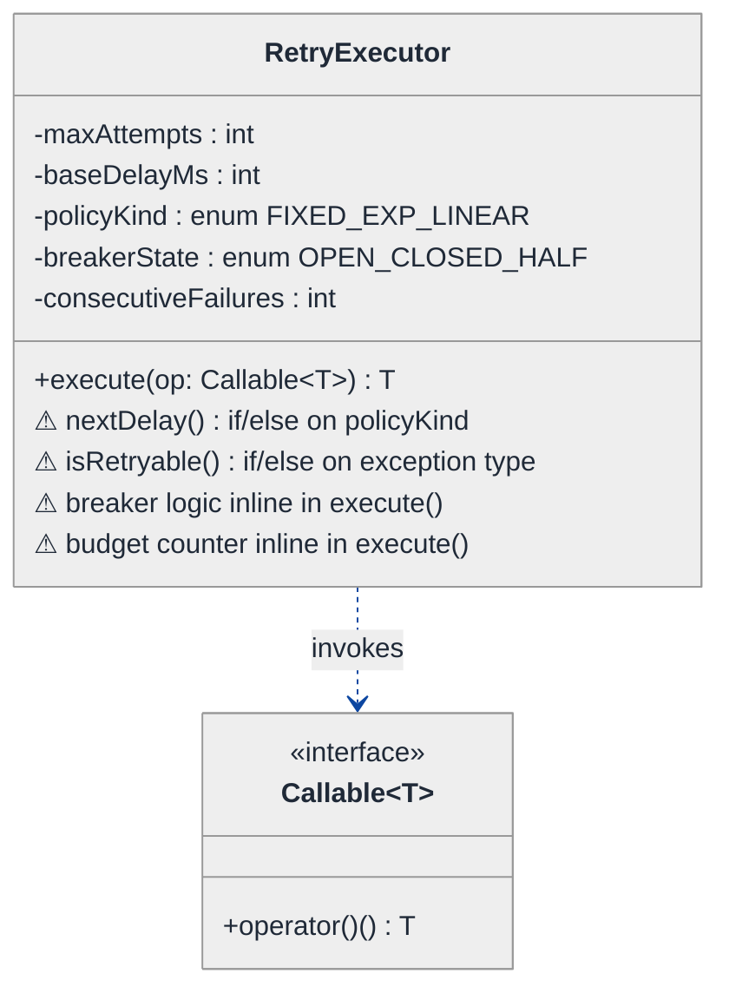
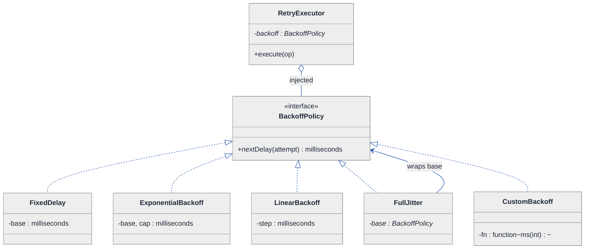
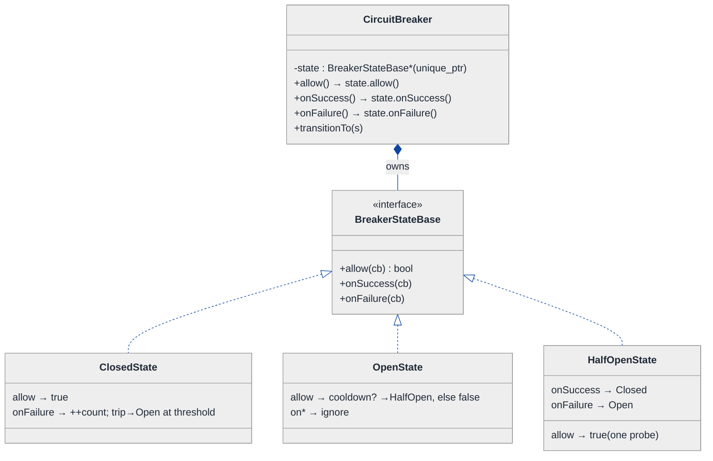
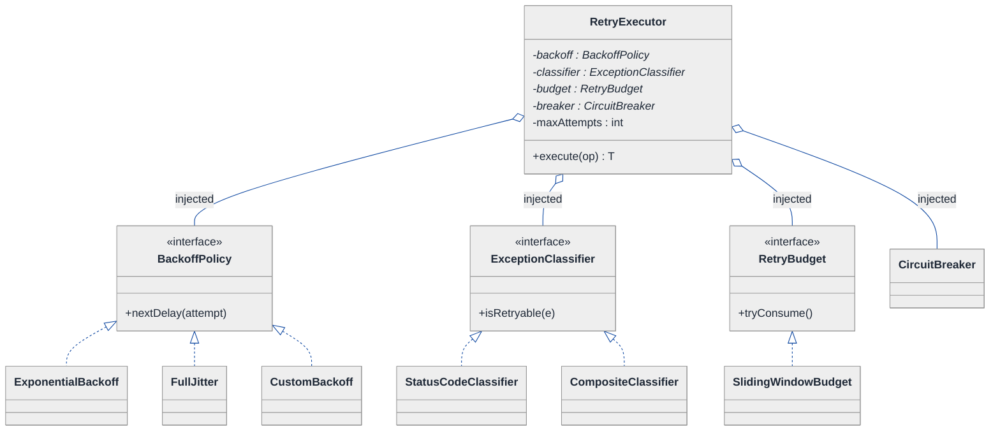
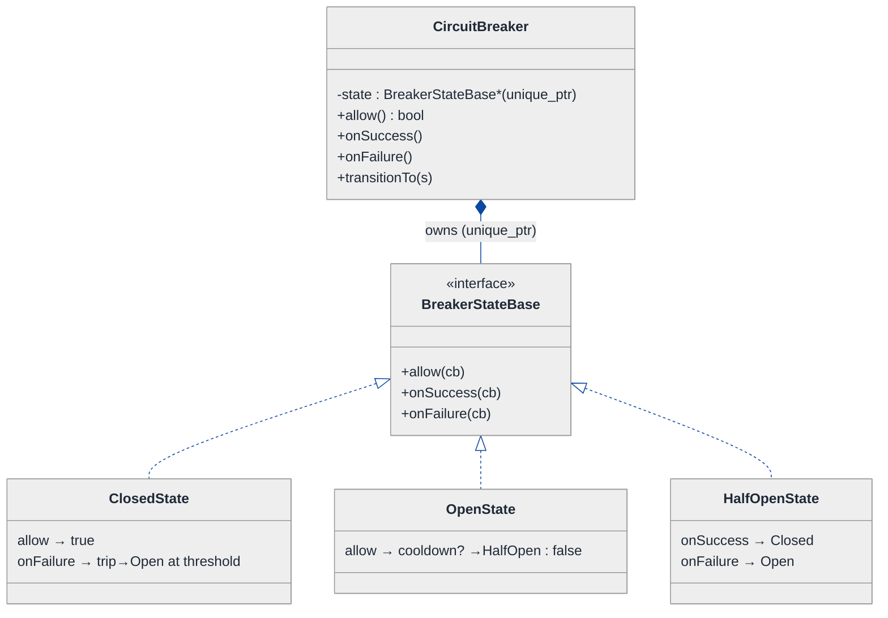
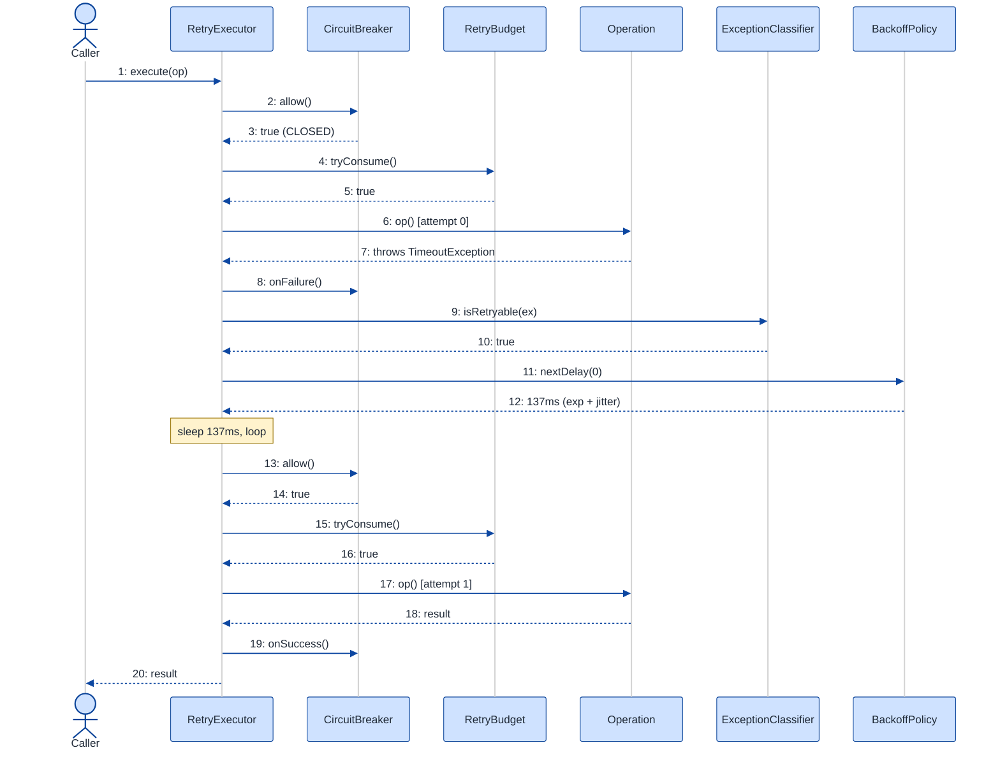

# Retry Framework — LLD Walkthrough

> **Difficulty:** Medium · **Time:** ~30 min · **Pattern focus:** Strategy (backoff policy) + State (circuit breaker)
>
> **Problem source(s):** GID R1 (bucket `Retry_Pattern`) — "Design a retry framework with fixed delay, exponential backoff with jitter, linear backoff, custom policies, retry budget, retryable exception classification, and circuit breaker integration."
>
> **Diagrams:** inline mermaid (renders natively in GitHub / VS Code). No external sources.

---

## How to use this file

Paced for a candidate seeing the retry-framework question for the first time. Reading time: ~30 minutes if you sketch each iteration by hand. **The lesson: a retry framework looks like "just a loop," but the interview is probing whether you can SEPARATE the four axes that vary — when-to-retry, how-long-to-wait, how-many-are-allowed, and whether-the-downstream-is-even-healthy — instead of cramming them all into one `for` loop.**

Don't reach for the patterns up front. We DERIVE them: write the naive retry loop first, watch it crack under four hypothetical changes, then introduce ONE pattern per painful axis.

**Map of this file (15 sections):**

1. Problem statement + clarifying questions
2. Plain-English restatement
3. Why this matters
4. Mental model
5. Try it yourself first
6. Entity & verb extraction
7. **Iteration 1: the naive retry loop** — what we'd write first
8. **Where the naive design hurts** — four future requirements, one painful diff each
9. **Pivot 1: Strategy for backoff** — the most painful axis first
10. **Pivot 2: State for the circuit breaker** — internal transitions, not external swaps
11. **Pivot 3: Strategy for the remaining axes** — exception classification + retry budget
12. Final class diagram
13. Skeleton code (C++)
14. Key flow — sequence diagram
15. Extensibility re-check + anti-patterns + how to think aloud + self-check

---

## 1. Problem statement + clarifying questions

**Prompt (typical phrasing):** "Design a retry framework. A caller hands us an operation that might fail; we retry it according to a policy — fixed delay, exponential backoff with jitter, linear backoff, or a custom policy. Support a retry budget (max retries per time window), classify which exceptions are retryable, and integrate a circuit breaker."

**Clarifying questions to ask BEFORE drawing anything:**

1. **What's the unit of work?** A synchronous callable returning a value (`() -> T`)? Or async with futures/callbacks? (Assume synchronous `Callable<T>` for the core; note where async would change ownership.)
2. **Retryable vs fatal failures?** Is "retry on any exception" acceptable, or must we distinguish transient (timeout, 503) from permanent (400, auth)? Retrying a 400 forever is a bug.
3. **What does the retry budget protect?** Is the budget per-operation, per-caller, or global across the process? Is the window a sliding window or a fixed bucket? (Assume per-target sliding window — protects the downstream, not the caller.)
4. **Circuit breaker scope?** One breaker per downstream dependency, or one shared breaker? What trips it — consecutive failures, or a failure RATE over a window?
5. **What happens when we exhaust retries OR the breaker is open?** Throw the last exception? Return a fallback value? Both should be expressible.
6. **Jitter — full or equal?** "Exponential backoff with jitter" is ambiguous. Full jitter = `random(0, base)`. Equal jitter = `base/2 + random(0, base/2)`. Worth confirming.
7. **Observability?** Do we need hooks (on-retry, on-success, on-give-up) for metrics/logging? (Assume yes — it's the difference between a toy and a framework.)

**Assumptions if interviewer dodges:** synchronous `Callable<T>`, exception-based classification, per-target sliding-window budget, one circuit breaker per downstream, framework throws the last exception on exhaustion (fallback is an optional decorator), full jitter, retry/give-up hooks present.

---

## 2. Plain-English restatement

We're building the thing that sits between a caller and a flaky dependency. The caller says "run this operation; if it fails, keep trying — but be smart about it." Being smart means: wait the right amount of time between attempts (the backoff policy), only retry failures that could plausibly succeed next time (exception classification), don't hammer a struggling downstream past a budget, and if the downstream is clearly dead, stop trying entirely for a while (the circuit breaker). The design must let us add a new backoff curve, a new "is this retryable" rule, or a new breaker-tripping condition **without rewriting the retry loop**.

---

## 3. Why this matters

Every distributed system has retries, and naive retries are how a small outage becomes a self-inflicted thundering herd. The interview probes whether you understand that "retry" is not one decision but four independent ones — *when*, *how long*, *how many*, *is the target alive* — and whether you can model each as its own swappable axis. It is also the canonical place where Strategy and State sit side by side: the backoff curve is chosen by the CALLER (Strategy), but the circuit breaker flips OPEN → HALF_OPEN → CLOSED on its own based on observed outcomes (State). Getting that distinction right is the whole point.

---

## 4. Mental model

A retry framework is a **policy-driven wrapper around a single call**. Picture a turnstile in front of a door: before you let the caller through to the downstream, you check the breaker (is the door even open?), you check the budget (have too many people gone through this minute?), you run the call, and if it fails you check the classifier (was this a "try again" failure?) and the backoff policy (how long do I make you wait before the next push?).

```
Real-world sketch (NOT a UML diagram yet):

   caller            RETRY EXECUTOR                    downstream
     │   run(op)   ┌──────────────────────────────┐
     ├────────────►│  ① breaker.allow()?  ───── no ─┼──► OPEN: fail fast
     │             │  ② budget.tryConsume()? ─ no ─┼──► budget exhausted
     │             │  ③ attempt op ──────────────┼──────────► [ flaky service ]
     │             │  ④ failure? classify it      │            ↑ may time out / 503
     │             │  ⑤ retryable? backoff.delay()│
     │             │     sleep, loop to ①          │
     │   result    └──────────────────────────────┘
     ◄─────────────  success | last-exception | fallback
```

The KEY insight from this picture: the executor is a fixed **orchestration** (the numbered loop never changes), while ①–⑤ each consult a **policy** that varies independently. Orchestration vs. policy is the separation we'll bake into the design.

---

## 5. Try it yourself first

> **Predict before reading on:**
>
> 1. List 4 nouns you'd promote to a class. List 2 nouns you'd leave as fields.
> 2. **If I told you we'll ship five different backoff curves in the first month, what would change about how you write the retry loop?**
> 3. The circuit breaker has to flip itself between OPEN, HALF_OPEN, and CLOSED based on what it observes — no external code tells it which state to be in. Does that smell more like Strategy or State? Why?

---

## 6. Entity & verb extraction

> **Mini-refresher: noun → class, but not every noun.**
>
> Naive OOD promotes every noun to a class. Senior OOD promotes a noun only if it has both BEHAVIOR and STATE that need to live together. "Delay milliseconds" stays a field; "circuit breaker" becomes a class because it carries state (counts, last-trip time) AND behavior (allow? record outcome?).

**Nouns from the prompt:**

| Noun | Decision | Why |
|---|---|---|
| RetryExecutor | Class (top-level coordinator) | Owns the loop; orchestrates policy + backoff + breaker |
| BackoffPolicy | Class (abstract) + concrete subclasses | The delay curve varies (fixed/exp/linear/custom) |
| RetryBudget | Class | Carries sliding-window state + a tryConsume decision |
| CircuitBreaker | Class | Carries state (OPEN/HALF_OPEN/CLOSED) + transition behavior |
| ExceptionClassifier | Class (abstract) + concrete | "Is this retryable?" varies by call site |
| RetryConfig | Field bag on RetryExecutor | Max attempts, etc. — data, not behavior |
| Delay / Duration | Library type (`std::chrono::milliseconds`) | No domain behavior |
| Attempt number | Field / loop counter | Not a class |

**Verbs (and the class they live on — naive answer, we'll re-examine):**

| Verb | Owner class (naive — we'll re-examine) |
|---|---|
| execute(op) | RetryExecutor |
| nextDelay(attempt) | BackoffPolicy |
| isRetryable(exception) | ExceptionClassifier |
| allow() / recordSuccess() / recordFailure() | CircuitBreaker |
| tryConsume() | RetryBudget |

**We have NOT introduced any design patterns yet.** Pure nouns + verbs.

---

## 7. <a id="iter-1"></a>Iteration 1: the naive retry loop

Let's write the simplest thing that could possibly work. No design patterns — one class, one method, conditionals and an enum inside.



**Reader's tour (read top to bottom; ~45 seconds).**

1. **There is exactly ONE class.** `RetryExecutor` holds every concern as a field: `maxAttempts`, `baseDelayMs`, a `policyKind` enum, a `breakerState` enum, and `consecutiveFailures`. Everything lives in one box.

2. **The single public method is `execute(op)`.** It takes a `Callable<T>` (the operation to run) and returns the result. The `..>` dependency arrow says "RetryExecutor invokes the callable" — that's the only collaborator.

3. **The four warning markers (⚠) are the trouble zone.** All four decisions are inlined inside `execute()`:
   - `nextDelay()` is an if/else ladder on `policyKind`.
   - `isRetryable()` is an if/else on the exception type.
   - the circuit-breaker logic (counting failures, flipping OPEN/CLOSED) is woven into the loop.
   - the budget counter is a raw integer bumped inside the loop.

Each warning is a future-pain entry point. §8 turns each into a concrete future-requirement that exposes the brittleness.

Skeleton code for the naive design (C++):

```cpp
#include <chrono>
#include <cmath>
#include <functional>
#include <stdexcept>
#include <thread>

enum class PolicyKind   { FIXED, EXPONENTIAL, LINEAR };
enum class BreakerState { CLOSED, OPEN, HALF_OPEN };

class RetryExecutor {
public:
    RetryExecutor(int maxAttempts, int baseDelayMs, PolicyKind kind)
        : maxAttempts_(maxAttempts), baseDelayMs_(baseDelayMs), kind_(kind) {}

    template <class T>
    T execute(const std::function<T()>& op) {
        for (int attempt = 0; attempt < maxAttempts_; ++attempt) {
            // ⚠ breaker check, inline
            if (breaker_ == BreakerState::OPEN) throw std::runtime_error("circuit open");
            // ⚠ budget check, inline
            if (++windowCount_ > 100) throw std::runtime_error("budget exceeded");
            try {
                T result = op();
                consecutiveFailures_ = 0;           // ⚠ breaker bookkeeping inline
                breaker_ = BreakerState::CLOSED;
                return result;
            } catch (const std::exception& e) {
                // ⚠ classification, inline if/else on the message
                std::string msg = e.what();
                bool retryable = (msg.find("timeout") != std::string::npos ||
                                  msg.find("503")     != std::string::npos);
                if (!retryable) throw;              // fatal: give up immediately
                if (++consecutiveFailures_ >= 5) breaker_ = BreakerState::OPEN;  // ⚠ trip inline
                if (attempt == maxAttempts_ - 1) throw;
                // ⚠ backoff curve, inline if/else
                int delay = baseDelayMs_;
                if (kind_ == PolicyKind::EXPONENTIAL) delay = baseDelayMs_ * (1 << attempt);
                else if (kind_ == PolicyKind::LINEAR) delay = baseDelayMs_ * (attempt + 1);
                std::this_thread::sleep_for(std::chrono::milliseconds(delay));
            }
        }
        throw std::runtime_error("retries exhausted");
    }
private:
    int          maxAttempts_;
    int          baseDelayMs_;
    PolicyKind   kind_;
    BreakerState breaker_ = BreakerState::CLOSED;
    int          consecutiveFailures_ = 0;
    int          windowCount_ = 0;
};
```

**This works.** It has zero design patterns. We can retry with fixed/exp/linear delay, classify two failure types, count toward a crude budget, and trip a crude breaker. So what's wrong with it?

---

## 8. <a id="naive-pain"></a>Where the naive design hurts

The interviewer slides a piece of paper across the desk: "Here are four requirements coming next quarter. Walk me through what changes."

### Change A: "Add exponential backoff WITH jitter (and later, decorrelated jitter)"

In the naive design:
- The `delay` computation is an if/else ladder inside `execute()`. Adding jitter means injecting `rand()` math into that ladder.
- Adding a SECOND jitter flavour (full vs decorrelated) means another branch.
- **Every new curve is surgery inside the most critical method in the framework — the one running live traffic.** And the math is now untestable in isolation because it's tangled with `sleep_for`.

### Change B: "Let teams pass a CUSTOM backoff (e.g., read delays from a config service)"

In the naive design:
- `PolicyKind` is a closed enum. A caller-supplied curve cannot be expressed as an enum value at all.
- You'd have to add a `std::function<int(int)>` field as a special case AND an `if (kind_ == CUSTOM)` branch — a second mechanism bolted next to the enum.
- **The closed enum fundamentally can't accept open extension.** That's an open/closed principle violation staring you in the face.

> **Mini-refresher: Open/Closed Principle (the "O" in SOLID).**
>
> Software entities should be OPEN for extension but CLOSED for modification. You should be able to add a new behavior by adding new code, not by editing existing, tested code. An `enum + switch` fails this: every new case edits the switch. A polymorphic interface passes it: every new case is a new subclass.

### Change C: "Classify retryable failures by HTTP status code, and let each call site override"

In the naive design:
- Classification is a substring search on the exception message — fragile and global. There's exactly one rule for the whole process.
- A call site that wants "retry on 429 but not 503" has nowhere to plug that in.
- **The single hardcoded classifier can't vary per call site, and can't be unit-tested without throwing real exceptions.**

### Change D: "Circuit breaker should trip on FAILURE RATE over a window, with a half-open probe"

In the naive design:
- `breaker_` is a bare enum bumped by a `consecutiveFailures_` counter. There is no HALF_OPEN probe logic, no time-based "stay open for 30s," no rate window.
- Adding HALF_OPEN means scattering `if (breaker_ == HALF_OPEN)` checks across `execute()`: on entry (allow one probe?), on success (close?), on failure (re-open?).
- **The transition matrix between three states ends up as N² conditionals smeared through the retry loop.** Every breaker tweak risks breaking the retry logic that shares the method.

### The pattern of pain

| Change | Files / sites touched | Smell |
|---|---|---|
| A. Jitter | `execute()` delay ladder | "Backoff math tangled with the live loop; untestable." |
| B. Custom backoff | `PolicyKind` enum + new special-case branch | "Closed enum can't accept open extension." |
| C. Per-site classification | substring search in `catch` | "One global rule; can't vary or test." |
| D. Rate-based breaker + half-open | enum + counter smeared across `execute()` | "Three-state transition matrix as scattered conditionals." |

**Two axes of pain dominate:** algorithm variability (backoff curve, classification, budget) and lifecycle variability (the circuit breaker's own state machine).

> **Pivot question:** "What pattern handles 'an algorithm that varies, chosen by the caller'? What pattern handles 'an object that transitions between states based on what it observes'?"
>
> The answers are Strategy and State. Let's introduce them one at a time, starting with the most painful axis: backoff.

---

## 9. <a id="pivot-1"></a>Pivot 1: Strategy for the backoff curve

> **Mini-refresher: Strategy pattern.**
>
> Encapsulates an algorithm behind an interface so it can be swapped at runtime. The CALLER decides which strategy to use; the strategy doesn't know about its peers.
>
> Quick example: a `Sorter` takes a `CompareStrategy*` in its constructor. Pass `Ascending` or `Descending` — the sorter doesn't care which.

**Why Strategy fits backoff.** A backoff policy is a pure function: `given an attempt number, return a delay`. It varies (fixed, exponential, linear, jittered, custom). The choice is made externally — by the caller configuring the executor, not by the executor deciding for itself. That's textbook Strategy, and crucially it makes each curve **independently unit-testable** (no `sleep`, no live loop).

**The refactor (just the affected part):**

```cpp
#include <chrono>
#include <random>

using std::chrono::milliseconds;

class BackoffPolicy {
public:
    virtual ~BackoffPolicy() = default;
    // attempt is 0-based; returns how long to wait BEFORE the next attempt.
    virtual milliseconds nextDelay(int attempt) const = 0;
};

class FixedDelay : public BackoffPolicy {
public:
    explicit FixedDelay(milliseconds base) : base_(base) {}
    milliseconds nextDelay(int) const override { return base_; }
private:
    milliseconds base_;
};

class ExponentialBackoff : public BackoffPolicy {
public:
    ExponentialBackoff(milliseconds base, milliseconds cap)
        : base_(base), cap_(cap) {}
    milliseconds nextDelay(int attempt) const override {
        auto raw = base_.count() * (1LL << attempt);          // base * 2^attempt
        return milliseconds(std::min<long long>(raw, cap_.count()));
    }
private:
    milliseconds base_, cap_;
};

// Decorator-style composition — wrap ANY policy and add full jitter.
class FullJitter : public BackoffPolicy {
public:
    explicit FullJitter(std::unique_ptr<BackoffPolicy> base) : base_(std::move(base)) {}
    milliseconds nextDelay(int attempt) const override {
        auto ceiling = base_->nextDelay(attempt).count();
        std::uniform_int_distribution<long long> dist(0, ceiling);
        thread_local std::mt19937_64 rng{std::random_device{}()};
        return milliseconds(dist(rng));                       // random(0, base)
    }
private:
    std::unique_ptr<BackoffPolicy> base_;
};
// LinearBackoff and CustomBackoff(std::function<...>) elided — same shape.

class RetryExecutor {
    // ...
    std::unique_ptr<BackoffPolicy> backoff_;   // injected at construction
    // the if/else delay ladder is GONE; execute() just calls backoff_->nextDelay(attempt)
};
```

**What changed — visualized.** Just the backoff slice:



**Tour of the after-state.**

1. **Top: RetryExecutor gained one field, lost a ladder.** `backoff` is a pointer to the `BackoffPolicy` interface, INJECTED at construction. The open diamond (`◇`) marks aggregation — the executor uses the policy. The if/else delay computation is deleted from `execute()`; it now reads `backoff_->nextDelay(attempt)`.

2. **Middle: the `<<interface>>` box.** A single virtual method, `nextDelay(attempt) → milliseconds`. That's the entire contract — pure, side-effect-free, trivially testable.

3. **Bottom row: the concrete curves.** `FixedDelay`, `ExponentialBackoff` (with a cap so it doesn't overflow to hours), `LinearBackoff`, and `CustomBackoff` (which holds a `std::function`, so Change B — caller-supplied curves — is just another subclass).

4. **`FullJitter` is a DECORATOR.** Note the arrow at the bottom (`wraps base`). It holds a pointer to ANOTHER `BackoffPolicy*` and returns `random(0, wrapped.nextDelay(attempt))`. So `FullJitter(ExponentialBackoff(...))` is "exponential backoff with full jitter" — composed, not a fifth hardcoded enum value. Change A lands as ONE decorator class.

> **Pattern-discrimination cheatsheet — Strategy vs Template Method.**
> - *Strategy:* whole algorithm in one swappable object, chosen at runtime via composition.
> - *Template Method:* algorithm skeleton in a base class; subclasses fill in hooks via inheritance.
> - *Rule of thumb:* variants that might be combined or supplied at runtime → Strategy. A fixed skeleton with 2–3 stable variants → Template Method.
>
> We chose Strategy because backoff curves COMPOSE (jitter wraps exponential) and callers SUPPLY their own — you can't compose or inject Template Method subclasses at runtime.

**Changes A and B from §8 now land cleanly.** Jitter → a `FullJitter` decorator. Custom curve → a `CustomBackoff` holding a lambda. No surgery in `execute()`.

---

## 10. <a id="pivot-2"></a>Pivot 2: State for the circuit breaker

Change D from §8 is still painful — three breaker states, time-based transitions, a half-open probe. Backoff Strategy doesn't help, because the variability here is not "which algorithm did the caller pick." It's "what is the breaker allowed to do RIGHT NOW, and what does it become next?" Nobody picks the breaker's state from outside; the breaker flips itself based on observed outcomes.

> **Mini-refresher: State pattern.**
>
> Each lifecycle state is its own class. The context object delegates to its current state, and THE STATE decides the next state. Transitions are INTERNAL, driven by events the context receives (here: `recordSuccess` / `recordFailure` / a timeout elapsing).

**Why State (not Strategy).** A circuit breaker is a textbook three-state machine:
- **CLOSED** — calls pass through; if the failure rate crosses a threshold, trip to OPEN.
- **OPEN** — calls fail fast (no downstream hit); after a cooldown, move to HALF_OPEN.
- **HALF_OPEN** — let a single probe through; success → CLOSED, failure → OPEN.

The caller never says "be OPEN now." The breaker observes outcomes and transitions itself. That is the defining property of State.

**The refactor (just the breaker part):**

```cpp
#include <chrono>
#include <memory>

class CircuitBreaker;  // forward — context, defined below

class BreakerStateBase {
public:
    virtual ~BreakerStateBase() = default;
    virtual bool allow(CircuitBreaker& cb) = 0;          // may a call go through?
    virtual void onSuccess(CircuitBreaker& cb) = 0;
    virtual void onFailure(CircuitBreaker& cb) = 0;
};

class CircuitBreaker {
public:
    explicit CircuitBreaker(int failureThreshold, std::chrono::seconds cooldown);
    bool allow()      { return state_->allow(*this); }
    void onSuccess()  { state_->onSuccess(*this); }
    void onFailure()  { state_->onFailure(*this); }
    void transitionTo(std::unique_ptr<BreakerStateBase> s) { state_ = std::move(s); }
    // getters/setters for failureCount_, openedAt_, threshold_, cooldown_ ... (elided)
private:
    std::unique_ptr<BreakerStateBase> state_;   // starts ClosedState
    int                               failureCount_ = 0;
    std::chrono::steady_clock::time_point openedAt_{};
    // threshold_, cooldown_ ... elided
};

class OpenState : public BreakerStateBase {
public:
    bool allow(CircuitBreaker& cb) override {
        if (cooldownElapsed(cb)) {                       // time-driven transition
            cb.transitionTo(std::make_unique<HalfOpenState>());
            return true;                                 // let ONE probe through
        }
        return false;                                    // fail fast
    }
    void onSuccess(CircuitBreaker&) override {}          // not expected while OPEN
    void onFailure(CircuitBreaker&) override {}
};

class HalfOpenState : public BreakerStateBase {
public:
    bool allow(CircuitBreaker&) override { return true; }   // single probe in flight
    void onSuccess(CircuitBreaker& cb) override {
        cb.transitionTo(std::make_unique<ClosedState>());   // recovered
    }
    void onFailure(CircuitBreaker& cb) override {
        cb.transitionTo(std::make_unique<OpenState>());     // still sick → re-open
    }
};
// ClosedState elided: allow→true; onFailure increments count, trips to OpenState at threshold.
```

**What changed — visualized.** Just the breaker slice:



**Tour of the after-state.**

1. **The bare `breaker_` enum is gone.** It's replaced by a `state` field of type `BreakerStateBase*` (a `std::unique_ptr` — exclusive ownership). The breaker OWNS its current state and swaps the pointer on transition.

2. **`allow()`, `onSuccess()`, `onFailure()` became one-liners that delegate.** Each just calls into the current state. **No `if (breaker_ == HALF_OPEN)` ladder anywhere** — and critically, none of it lives inside `RetryExecutor::execute()` anymore.

3. **The interface declares the contract.** Three pure-virtual methods. Each concrete state must answer all three, even when the answer is "do nothing" (e.g., `OpenState::onSuccess` — you shouldn't be recording successes while open).

4. **Three concrete states, each self-contained.** `ClosedState` counts failures and trips to OPEN at the threshold. `OpenState` fails fast until the cooldown elapses, then promotes itself to HALF_OPEN and lets one probe through. `HalfOpenState` runs the probe: success → CLOSED, failure → OPEN.

5. **Transitions live WITH the states.** Each state calls `cb.transitionTo(...)` when its condition fires. The "what comes next" knowledge is distributed across the state classes, not centralized in a giant switch. That's the whole point of the State pattern: each state knows its own successors.

**Change D lands as new behavior in the breaker's own classes** — and adding, say, a `ForcedOpenState` (for a manual kill-switch) is one new class, no edits to the others.

> **Pattern-discrimination cheatsheet — Strategy vs State (the crux of this question).**
> - *Strategy:* the CALLER picks which one to use; strategies are usually unaware of each other. (`new RetryExecutor(ExponentialBackoff{...})`.)
> - *State:* the OBJECT picks its next state internally; states know about each other (each can `transitionTo` another). (The breaker flips OPEN→HALF_OPEN on its own.)
> - *Rule of thumb:* swap happens because external code said so → Strategy. Swap happens because of an internal event flow → State.
>
> Backoff = Strategy (you choose the curve). Circuit breaker = State (it chooses its own mode). This is exactly why the question pairs them.

---

## 11. <a id="pivot-3"></a>Pivot 3: Strategy for the remaining axes

Changes A, B, D are solved. Change C (per-site exception classification) and the retry budget are not yet — and both are "an algorithm picked by the caller," i.e. the same shape as Pivot 1.

**The remaining axes:**

| Axis | Pattern | One sentence why |
|---|---|---|
| Exception classification | Strategy | "Is this retryable?" varies per call site; injected, not a global substring search |
| Retry budget | Strategy (behind an interface) | Sliding-window vs token-bucket vs fixed-bucket — picked by config, swappable, testable |

Each follows the same shape as Pivot 1. Brief sketches:

```cpp
class ExceptionClassifier {
public:
    virtual ~ExceptionClassifier() = default;
    virtual bool isRetryable(const std::exception& e) const = 0;
};
class StatusCodeClassifier : public ExceptionClassifier {
    // retry on 429, 502, 503, 504; never on 4xx-auth. (Reads a code off a typed exception.)
};
class CompositeClassifier : public ExceptionClassifier {
public:
    explicit CompositeClassifier(std::vector<std::unique_ptr<ExceptionClassifier>> rs)
        : rules_(std::move(rs)) {}
    bool isRetryable(const std::exception& e) const override {
        for (const auto& r : rules_) if (r->isRetryable(e)) return true;  // OR semantics
        return false;
    }
private:
    std::vector<std::unique_ptr<ExceptionClassifier>> rules_;
};

class RetryBudget {
public:
    virtual ~RetryBudget() = default;
    virtual bool tryConsume() = 0;     // false → budget exhausted, stop retrying
    virtual void onSuccess() = 0;      // some budgets refund on success
};
class SlidingWindowBudget : public RetryBudget { /* timestamps in last N ms */ };
class TokenBucketBudget   : public RetryBudget { /* refill rate + capacity */ };
```

**The lesson.** Once we recognized "algorithm picked by caller" as the pattern for backoff in Pivot 1, the same shape applies to classification and budget. **Pattern recognition makes subsequent design cheap.**

> **Mini-refresher: why these three Strategy hierarchies don't share one interface.**
>
> Strategy is a *role*, not a type. `BackoffPolicy`, `ExceptionClassifier`, and `RetryBudget` have nothing in common at the type level (different inputs, different outputs). Don't unify them under one `Strategy<T>` template — that's premature genericism.

> **Mini-refresher: Dependency Injection.**
>
> Rather than `new`-ing its collaborators, `RetryExecutor` receives them through its constructor (`backoff`, `classifier`, `budget`, `breaker`). The executor depends on the four INTERFACES, never on a concrete `ExponentialBackoff`. That inverts the dependency (the "D" in SOLID) and makes every collaborator a test seam — you can inject a `FakeBackoff` that returns `0ms` so unit tests don't sleep.

---

## 12. <a id="fig-class-diagram"></a>Final class diagram

Showing everything in one diagram becomes a wall of boxes. Here are **two focused sub-views**: the policy injection (the Strategy axes), and the circuit breaker (the State machine). Read them in order; the structural insight at the end ties them together.

### 12.1 The executor and its injected policies (Strategy axes)



**Tour of 12.1.**

1. **One RetryExecutor, four injected collaborators.** It holds a pointer per axis: `backoff`, `classifier`, `budget`, `breaker`. They are INJECTED at construction; the executor never `new`s them. The open diamonds (`◇`) mark aggregation — "I use this, I don't dictate its lifetime."

2. **Three Strategy interfaces, each with a small concrete family.** `BackoffPolicy` (with the `FullJitter` decorator), `ExceptionClassifier` (with the `CompositeClassifier` that ORs rules), `RetryBudget`. Every §8 change A/B/C lands as one new leaf here.

3. **`CircuitBreaker` appears as a single box — its internals are 12.2.** It is injected like the others, but it is NOT a Strategy: it's a stateful object whose internals are a State machine. We draw it separately so the two patterns don't blur.

4. **The structural insight.** Everything the naive `execute()` hardcoded — the delay ladder, the substring classifier, the budget counter — is lifted into its own type hierarchy. **The executor's core becomes pure orchestration; the variation becomes hot-swap policy.**

### 12.2 The circuit breaker internals (State machine)



**Tour of 12.2.**

1. **CircuitBreaker holds ONE BreakerStateBase pointer.** Filled diamond / `unique_ptr` — it OWNS its current state. On transition it replaces the pointer.

2. **`allow/onSuccess/onFailure` are one-liners that delegate.** No status comparison; polymorphism dispatches to the right state.

3. **Three concrete states, each knowing its own successors.** CLOSED→OPEN (on threshold), OPEN→HALF_OPEN (on cooldown), HALF_OPEN→{CLOSED on success, OPEN on failure}. The transition graph IS the set of `transitionTo` calls inside the state bodies.

### Structural insight (ties 12.1 + 12.2 together)

| Concern | Pattern used | Why |
|---|---|---|
| **Orchestration** (the retry loop) | Plain coordinator (`RetryExecutor`) | The numbered loop never varies — it just consults policies |
| **Backoff / classification / budget** | Strategy, INJECTED into the executor | Caller / config picks the variant; some compose via decorators |
| **Circuit breaker mode** | State, OWNED by `CircuitBreaker` | The breaker flips its own state from observed outcomes |
| **Jitter, composite rules** | Decorator / Composite over a Strategy interface | Stack behaviors without subclass explosion |

The big lesson: **inheritance is used only for the Strategy and State class families** — every "varies independently" axis becomes composition over an interface. *State for the thing that drives its own transitions; Strategy for the things the caller chooses.* That distinction is the entire question.

---

## 13. Skeleton code (C++)

> Show the SHAPES, not the full impl. ~120 lines. Interfaces + 1–2 concretes per pattern; the rest `// elided`.

```cpp
#include <chrono>
#include <functional>
#include <memory>
#include <stdexcept>
#include <vector>

using std::chrono::milliseconds;

// ── Forward declarations ────────────────────────────────────────────
class CircuitBreaker;

// ── Strategy axis 1: backoff curve ──────────────────────────────────
class BackoffPolicy {
public:
    virtual ~BackoffPolicy() = default;
    virtual milliseconds nextDelay(int attempt) const = 0;   // attempt is 0-based
};
class ExponentialBackoff : public BackoffPolicy {
public:
    ExponentialBackoff(milliseconds base, milliseconds cap) : base_(base), cap_(cap) {}
    milliseconds nextDelay(int attempt) const override {
        auto raw = base_.count() * (1LL << attempt);
        return milliseconds(std::min<long long>(raw, cap_.count()));
    }
private:
    milliseconds base_, cap_;
};
class FullJitter : public BackoffPolicy {            // decorator over any policy
public:
    explicit FullJitter(std::unique_ptr<BackoffPolicy> base) : base_(std::move(base)) {}
    milliseconds nextDelay(int attempt) const override; // random(0, base_->nextDelay)
private:
    std::unique_ptr<BackoffPolicy> base_;
};
// FixedDelay, LinearBackoff, CustomBackoff(std::function) elided — same shape.

// ── Strategy axis 2: exception classification ───────────────────────
class ExceptionClassifier {
public:
    virtual ~ExceptionClassifier() = default;
    virtual bool isRetryable(const std::exception& e) const = 0;
};
class StatusCodeClassifier : public ExceptionClassifier {
public:
    bool isRetryable(const std::exception& e) const override; // retry 429/502/503/504
};
// CompositeClassifier (ORs a vector of rules) elided — same shape as §11.

// ── Strategy axis 3: retry budget ───────────────────────────────────
class RetryBudget {
public:
    virtual ~RetryBudget() = default;
    virtual bool tryConsume() = 0;   // false → exhausted
    virtual void onSuccess() = 0;
};
class SlidingWindowBudget : public RetryBudget {
public:
    SlidingWindowBudget(int maxRetries, milliseconds window);
    bool tryConsume() override;      // prune old timestamps, admit if under cap
    void onSuccess() override {}
private:
    int          maxRetries_;
    milliseconds window_;
    std::vector<std::chrono::steady_clock::time_point> stamps_;
};

// ── State axis: circuit breaker ─────────────────────────────────────
class BreakerStateBase {
public:
    virtual ~BreakerStateBase() = default;
    virtual bool allow(CircuitBreaker& cb) = 0;
    virtual void onSuccess(CircuitBreaker& cb) = 0;
    virtual void onFailure(CircuitBreaker& cb) = 0;
};
class CircuitBreaker {
public:
    CircuitBreaker(int failureThreshold, std::chrono::seconds cooldown);
    bool allow()     { return state_->allow(*this); }
    void onSuccess() { state_->onSuccess(*this); }
    void onFailure() { state_->onFailure(*this); }
    void transitionTo(std::unique_ptr<BreakerStateBase> s) { state_ = std::move(s); }
    // accessors for failureCount_, openedAt_, threshold_, cooldown_ elided
private:
    std::unique_ptr<BreakerStateBase> state_;   // initialised to ClosedState
    int failureCount_ = 0;
    std::chrono::steady_clock::time_point openedAt_{};
};
// ClosedState / OpenState / HalfOpenState elided — bodies shown in §10.

// ── The orchestrator ────────────────────────────────────────────────
struct RetryError : std::runtime_error { using std::runtime_error::runtime_error; };

class RetryExecutor {
public:
    RetryExecutor(int maxAttempts,
                  std::unique_ptr<BackoffPolicy>       backoff,
                  std::unique_ptr<ExceptionClassifier> classifier,
                  std::unique_ptr<RetryBudget>         budget,
                  std::shared_ptr<CircuitBreaker>      breaker)   // shared: one breaker per downstream
        : maxAttempts_(maxAttempts), backoff_(std::move(backoff)),
          classifier_(std::move(classifier)), budget_(std::move(budget)),
          breaker_(std::move(breaker)) {}

    template <class T>
    T execute(const std::function<T()>& op) {
        for (int attempt = 0; attempt < maxAttempts_; ++attempt) {
            if (!breaker_->allow())   throw RetryError("circuit open");      // ① State
            if (!budget_->tryConsume()) throw RetryError("budget exhausted"); // ② Strategy
            try {
                T result = op();                                            // ③ attempt
                breaker_->onSuccess();
                budget_->onSuccess();
                return result;
            } catch (const std::exception& e) {
                breaker_->onFailure();
                if (!classifier_->isRetryable(e)) throw;                    // ④ Strategy: fatal
                if (attempt == maxAttempts_ - 1)  throw;                    // exhausted
                std::this_thread::sleep_for(backoff_->nextDelay(attempt));  // ⑤ Strategy
            }
        }
        throw RetryError("retries exhausted");
    }
private:
    int                                  maxAttempts_;
    std::unique_ptr<BackoffPolicy>       backoff_;
    std::unique_ptr<ExceptionClassifier> classifier_;
    std::unique_ptr<RetryBudget>         budget_;
    std::shared_ptr<CircuitBreaker>      breaker_;
};
```

Notice the loop body is now ~15 lines of pure orchestration — every decision is a one-line delegation to an injected collaborator. Compare with the naive `execute()` in §7, which inlined all five.

---

## 14. <a id="fig-sequence"></a>Key flow — sequence diagram

A single `execute()` call that fails once (retryable), waits, then succeeds — with the breaker CLOSED throughout. This is the moment Strategy and State cooperate.



**Tour of the flow. Read this slowly — it's where all the collaborators meet.**

1. **Caller invokes `execute(op)`.** The caller knows nothing about backoff, budget, or the breaker — it just hands over the operation.

2. **Before touching the downstream, the executor consults the breaker (msg 2–3).** This is the State pattern: `breaker.allow()` delegates to the current state. CLOSED returns true. Had it been OPEN, the call would have failed fast at msg 2 without ever touching `Op` — that's the breaker protecting the downstream.

3. **Then the budget (msg 4–5).** A Strategy decision: is there headroom in the window? Yes.

4. **First attempt fails with a timeout (msg 6–7).** The executor records the failure on the breaker (msg 8) — feeding the State machine the outcome it uses to decide whether to trip.

5. **Classification, then backoff (msg 9–12).** Two Strategy decisions in a row: "is this retryable?" (yes) and "how long do I wait?" (the `ExponentialBackoff` wrapped in `FullJitter` returns 137ms). **Neither decision lives in the executor — both are delegated.**

6. **The loop repeats (msg 13–18) and succeeds.** On success the executor calls `breaker.onSuccess()` (msg 19) — again feeding the State machine, which keeps it CLOSED (or, had we been HALF_OPEN, would have transitioned it back to CLOSED).

### The decisions that are NOT in the executor — and why it matters

You don't see a single `if (policy == EXPONENTIAL)` or `if (state == OPEN)` in this flow. Every branch the naive `execute()` owned is now a message to a collaborator. **The executor orchestrates; it does not decide.** Adding a new backoff curve, a new classification rule, or a new breaker state changes a collaborator — never this sequence.

---

## 15. Extensibility re-check + anti-patterns + how to think aloud + self-check

### Extensibility re-check

Revisit the four changes from [§8](#naive-pain). For each, name the SINGLE class that changes.

| Change | Naive design impact | Final design impact |
|---|---|---|
| A. Exp backoff + jitter | `execute()` delay ladder | New `FullJitter : BackoffPolicy` decorator. Compose with `ExponentialBackoff`. Done. |
| B. Custom caller backoff | closed `PolicyKind` enum | New `CustomBackoff : BackoffPolicy` holding a `std::function`. Done. |
| C. Per-site classification | substring search in `catch` | New `StatusCodeClassifier : ExceptionClassifier`; inject per call site. Done. |
| D. Rate breaker + half-open | enum + counter in `execute()` | Logic lives in `ClosedState`/`OpenState`/`HalfOpenState`. Add a state = one class. Done. |

Every change is exactly ONE new class. That's the open/closed principle in practice. If a future requirement makes you edit `RetryExecutor::execute()` AND a policy AND the breaker together — go back to §6; you missed a variability point.

### Common confusion + traps

1. **"Why is the circuit breaker State, not Strategy?"** Because nobody picks its mode from outside. The breaker observes `onFailure`/`onSuccess`/cooldown and transitions ITSELF. Strategy is chosen externally; State is driven internally. This is the single most-tested distinction in this question.

2. **"Can't I just use one big enum for everything?"** You can — for the toy version. It collapses at the first requirement that needs composition (jitter over exponential) or caller-supplied behavior (custom curve), because enums are closed.

3. **"Should the breaker be a Singleton?"** No — but it IS shared per downstream. Inject the SAME `shared_ptr<CircuitBreaker>` into every executor that talks to a given dependency, so they share trip state. A process-global singleton would conflate independent downstreams.

4. **"Where does the fallback/return-default behavior go?"** A `FallbackExecutor` decorator that wraps `RetryExecutor` and catches `RetryError` to return a default. Keep it OUT of the core loop — fallback is a separate concern.

5. **"Why `unique_ptr` for backoff/classifier/budget but `shared_ptr` for the breaker?"** The first three are owned exclusively by one executor. The breaker is genuinely shared across executors targeting the same downstream — that's the textbook case for `shared_ptr`.

### Anti-patterns

- **"God executor"** — one `execute()` that inlines backoff math, classification, budget counting, and breaker transitions (exactly the §7 design). Pull each into a collaborator.
- **"Closed enum for an open axis"** — `enum PolicyKind` when callers will supply their own curves. Use a polymorphic interface.
- **"Retry on everything"** — no classifier, so a non-retryable 400 gets retried until the budget dies. Always classify.
- **"Breaker as scattered conditionals"** — `if (state == OPEN)` checks smeared through the loop instead of a State machine. N² transitions, all in the hot path.
- **"Sleeping in tests"** — hard-coding `sleep_for` so unit tests take real seconds. Inject backoff (return `0ms` in tests) and a clock; never sleep on real time in a test.
- **"Thundering herd"** — exponential backoff WITHOUT jitter, so every client retries in lockstep. Jitter is not optional at scale.

### How to think aloud

> "Retry framework. Let me clarify scope. [Asks the §1 questions.] Synchronous callable, exception-based classification, per-downstream breaker. Got it.
>
> Nouns: RetryExecutor, BackoffPolicy, CircuitBreaker, ExceptionClassifier, RetryBudget. The executor orchestrates; the rest are policies.
>
> I'll write the NAIVE version first — one class, `execute()` with the delay ladder, substring classification, a counter, and an enum breaker all inlined. It works.
>
> Now I stress-test it. Jitter: surgery in the delay ladder. Custom curve: the enum is closed, can't express it. Per-site classification: one global substring rule. Rate breaker + half-open: three-state matrix smeared through the loop.
>
> Two axes of pain: algorithm variation (backoff, classification, budget) and a self-driven lifecycle (the breaker). Strategy and State.
>
> Pivot 1: backoff becomes a `BackoffPolicy` interface — Fixed, Exponential, Linear, plus a `FullJitter` decorator and a `CustomBackoff` lambda. Injected; the ladder is gone.
>
> Pivot 2: the breaker becomes a State machine — ClosedState, OpenState, HalfOpenState. It flips itself on observed outcomes. No external code picks its mode.
>
> Pivot 3: classification and budget are the same Strategy shape as backoff.
>
> Final: RetryExecutor aggregates three Strategy interfaces plus a shared CircuitBreaker; `execute()` is ~15 lines of delegation. Every future change is one new class. That's open/closed."

### Self-check

> **Self-check — the question to ask next time.**
>
> When you see "design a [thing] with multiple [variations]," before reaching for inheritance or one big enum, ask:
>
> > **"Is the variation a behavior the CALLER picks (Strategy) or a lifecycle the OBJECT drives through its own observed events (State)?"**
>
> Backoff, classification, budget → the caller picks → Strategy. The circuit breaker → it trips and recovers on its own → State. When a question pairs "policy" with "breaker," it is asking you to tell these two apart. If both axes exist, use both.

---

## Cross-references

- **Parent topic manifest:** [`./EXTRACTED_QUESTIONS.md`](./EXTRACTED_QUESTIONS.md)
- **Vertical overview:** [`../../LEARNING.md`](../../LEARNING.md)
- **Template:** [`../../TEMPLATE-v2.md`](../../TEMPLATE-v2.md)
- **Canonical exemplar:** [`../Object_Oriented_Design/Parking_Lot.md`](../Object_Oriented_Design/Parking_Lot.md)
- **Related v2 walkthroughs:**
  - Strategy Pattern deep-dive (in `../Strategy_Pattern/`)
  - State Pattern deep-dive (in `../State_Pattern/`)
  - Decorator Pattern deep-dive (in `../Decorator_Pattern/`) — the jitter / composite-classifier composition mechanism
- **Further reading:** <a href="https://aws.amazon.com/builders-library/timeouts-retries-and-backoff-with-jitter/" target="_blank" rel="noopener noreferrer">AWS Builders' Library — Timeouts, retries, and backoff with jitter</a>; <a href="https://martinfowler.com/bliki/CircuitBreaker.html" target="_blank" rel="noopener noreferrer">Martin Fowler — CircuitBreaker</a>.
