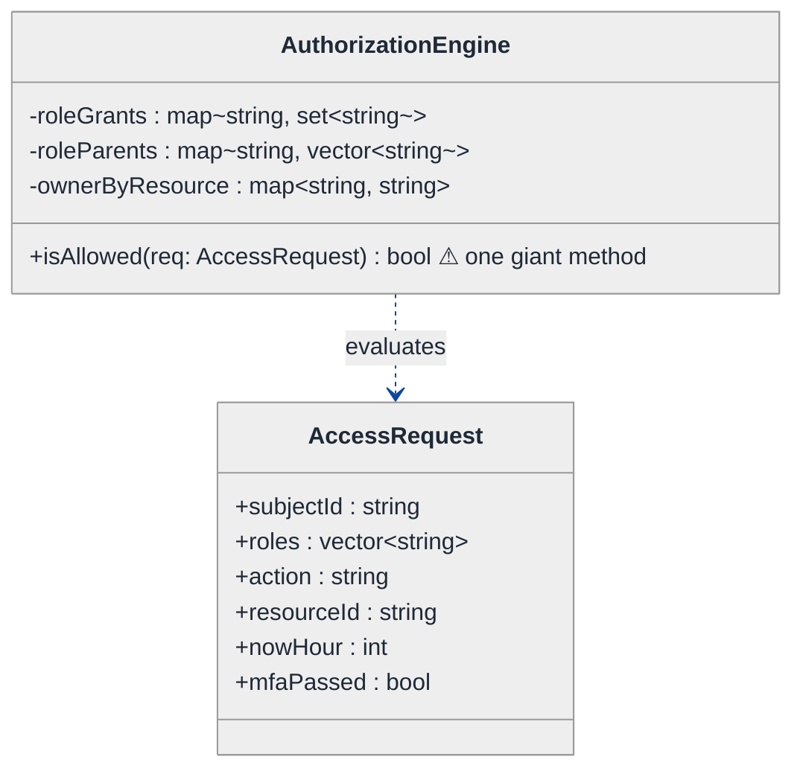
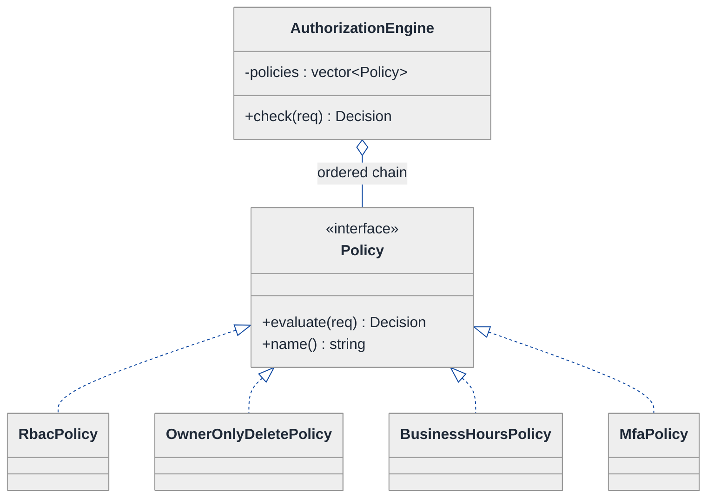
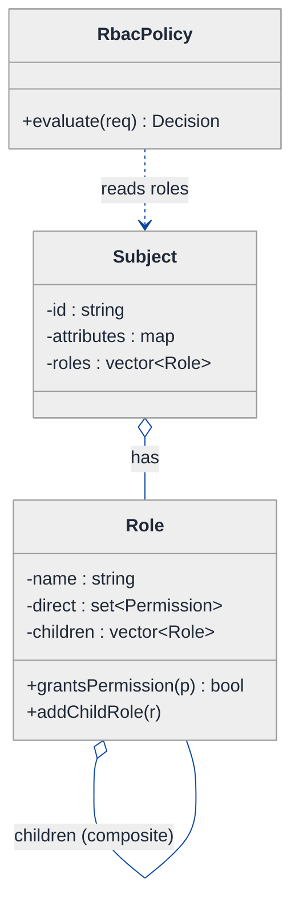
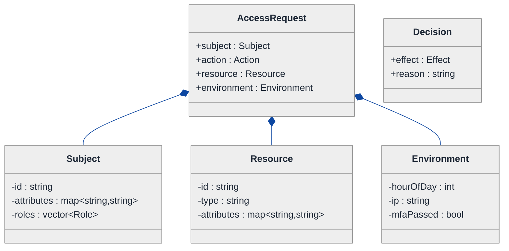
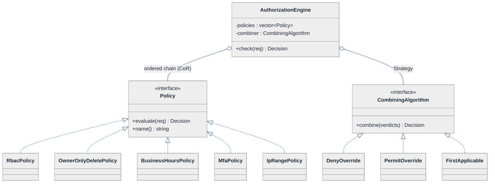
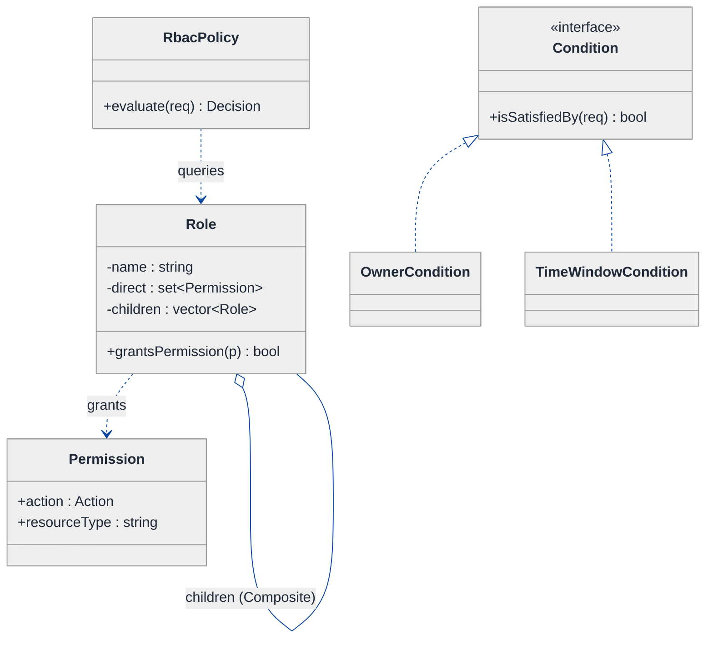
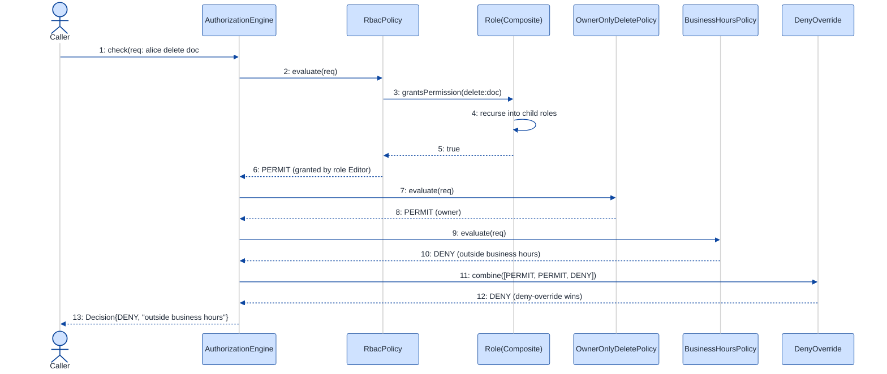

# Authorization System (RBAC + ABAC + Policy Evaluation) — LLD Walkthrough

> **Difficulty:** Hard · **Time:** ~45 min · **Pattern focus:** Chain of Responsibility + policy evaluation (with Composite for role inheritance and Strategy for combining algorithms)
>
> **Problem source(s):** GID `RE2`, bucket `Rule_Engine`. Representative of "design an access-control / permission system" LLD prompts.
>
> **Diagrams:** inline mermaid (renders natively in GitHub / VS Code). The canonical theme block is copied verbatim into every diagram.

---

## How to use this file

Paced for a candidate seeing "design an authorization system" for the first time. Reading time: ~45 minutes if you sketch each iteration by hand. **The lesson: an authorization decision is not one algorithm — it is an ORDERED PIPELINE of independent policies, each of which may permit, deny, or abstain, with an explicit rule for combining their verdicts. Don't write one giant `isAllowed()` method; derive the pipeline by watching the giant method rot under four new requirements.**

**Map of this file (15 sections):**

1. Problem statement + clarifying questions
2. Plain-English restatement
3. Why this matters
4. Mental model
5. Try it yourself first
6. Entity & verb extraction
7. **Iteration 1: the naive design** — one big `isAllowed()` method
8. **Where the naive design hurts** — four future requirements, one painful diff each
9. **Pivot 1: Chain of Responsibility for policy evaluation** — the most painful axis first
10. **Pivot 2: Composite for role inheritance** — roles that contain roles
11. **Pivot 3: Strategy for the combining algorithm** — deny-override vs permit-override vs first-applicable
12. Final UML class diagram (three sub-views)
13. Skeleton code (C++)
14. Key flow — sequence diagram
15. Extensibility re-check + anti-patterns + how to think aloud + self-check

---

## 1. Problem statement + clarifying questions

**Prompt (typical phrasing):** "Design a permission / authorization system supporting role-based access control (RBAC), attribute-based access control (ABAC), permission inheritance, and policy evaluation with deny-override."

**Clarifying questions to ask BEFORE drawing anything:**

1. **What is the decision unit?** Is every check `(subject, action, resource)` → ALLOW / DENY? Do we also need to return a REASON (for audit logs), or just a boolean?
2. **RBAC shape?** Do roles grant permissions directly, and do roles inherit from other roles (e.g. `Admin` includes everything `Editor` has)? How deep can inheritance go — one level or arbitrary trees?
3. **ABAC shape?** What attributes are in play — subject attributes (department, clearance), resource attributes (owner, classification), and environment attributes (time of day, IP, MFA-passed)? Are conditions arbitrary boolean expressions or a fixed set?
4. **Conflict resolution?** The prompt says "deny-override," but is that the ONLY combining rule, or do some resources want "permit-override" or "first-applicable"? Is an explicit DENY always stronger than any ALLOW?
5. **Default decision?** If NO policy matches, is the answer deny (default-deny / whitelist) or allow (default-allow / blacklist)? Security systems are almost always default-deny.
6. **Scale & latency?** Is this an inline check on every API request (needs to be microseconds, cacheable) or an offline batch audit? Are policies static at boot or hot-reloaded?
7. **Who authors policies?** Hardcoded by engineers, or data-driven (a policy DSL / JSON loaded at runtime)? This decides whether we need an interpreter.

**Assumptions if interviewer dodges:** decision unit is `(Subject, Action, Resource, Environment)` → an `Effect` of `PERMIT` / `DENY` / `NOT_APPLICABLE`, plus a reason string for audit. Roles inherit transitively (arbitrary tree). ABAC conditions are composable boolean predicates. Default decision is **DENY**. The default combining rule is **deny-override** but it must be swappable. Inline check, single-threaded reasoning for now (we discuss caching + concurrency in §15).

---

## 2. Plain-English restatement

We're building the component that answers one question, billions of times a day: **"Is this subject allowed to perform this action on this resource, right now?"** The answer is not computed by a single rule. It is computed by running a *set of policies* — some role-based ("Editors may publish"), some attribute-based ("only the document owner may delete", "no writes outside business hours") — and then *combining* their individual verdicts into one final decision. The hard parts are: roles that inherit from other roles, conditions that read arbitrary attributes, and a combining rule where a single DENY can veto a hundred ALLOWs. The design must let us add a new policy, a new role, or a new combining rule **without rewriting the evaluation engine**.

---

## 3. Why this matters

Authorization is the highest-stakes code in most systems: a bug that returns ALLOW when it should DENY is a security breach; the reverse is an outage. Interviewers probe this question because the naive answer (one `if`-ladder) is *exactly* what a junior writes, and it is *exactly* what gets a company breached when the ladder grows to 400 lines and someone misorders two clauses. The skill being tested is recognizing that "evaluate a list of independent rules and combine their results" is a textbook **Chain of Responsibility + policy-combining** problem — the same shape that powers XACML, AWS IAM, Open Policy Agent, and Spring Security's filter chain. It reappears anywhere you have "run a sequence of handlers, each may act or pass" — validation pipelines, middleware, fraud rules, feature gating.

---

## 4. Mental model

A real authorization engine is a **courtroom**, not a calculator. A request walks in. A line of judges (policies) each look at it. Each judge can say one of three things: "I PERMIT this" / "I DENY this" / "this isn't my business — NOT_APPLICABLE." A presiding rule (the combining algorithm) collects the verdicts and announces the final ruling. "Deny-override" means: if *any* judge said DENY, the ruling is DENY, no matter how many said PERMIT.

```
Real-world sketch (NOT a UML diagram yet):

   Request: (subject=alice, action=delete, resource=doc#42, env={time=22:00, mfa=true})
        │
        ▼
   ┌──────────────────────────────────────────────────────────┐
   │  POLICY PIPELINE (ordered, each emits PERMIT/DENY/N-A)     │
   │                                                            │
   │   [ RBAC: does alice's role chain grant 'delete'? ] → N/A  │
   │   [ ABAC: is alice the owner of doc#42?           ] → PERMIT│
   │   [ ABAC: is it within business hours?            ] → DENY  │
   │   [ ABAC: did alice pass MFA?                     ] → PERMIT│
   └───────────────────────────┬────────────────────────────────┘
                               ▼
                  ┌──────────────────────────┐
                  │  COMBINER: deny-override  │  one DENY wins
                  └────────────┬──────────────┘
                               ▼
                      FINAL: DENY ("outside business hours")
```

The KEY insight from this picture: there are **three separable concerns** — (a) the individual *policies* (each a small, testable predicate), (b) the *pipeline* that runs them in order, and (c) the *combiner* that reduces many verdicts to one. Policy / pipeline / combiner is the separation we'll bake into the design. Role inheritance is a fourth concern that lives *inside* the RBAC policy.

---

## 5. Try it yourself first

> **Predict before reading on:**
>
> 1. List 5 nouns you'd promote to a class. Which "decision" do you represent as a class vs a plain enum?
> 2. **If I told you that next month some resources need "permit-override" instead of "deny-override," what would change about how you write the final `decide()` method?**
> 3. Roles inherit: `Admin` ⊃ `Editor` ⊃ `Viewer`. When you check "does this subject have permission P," how do you avoid writing a recursive loop *inside* your main decision method?

---

## 6. Entity & verb extraction

> **Mini-refresher: noun → class, but not every noun.**
>
> Naive OOD promotes every noun to a class. Senior OOD promotes a noun only if it has both BEHAVIOR and STATE that need to live together, OR if it is a point of variation we expect to extend. "Decision" looks like a mere enum, but it carries a reason + an effect, so it earns a small value-type.

**Nouns from the prompt:**

| Noun | Decision | Why |
|---|---|---|
| AuthorizationEngine | Class (top-level coordinator) | Owns the policy pipeline + the combiner; exposes `check()` |
| Policy | Class (abstract) + concrete subclasses | The unit of variation — each emits a verdict |
| Decision / Effect | `enum class Effect { PERMIT, DENY, NOT_APPLICABLE }` + a small `Decision` struct (effect + reason) | Carries effect AND an audit reason |
| Subject (user/principal) | Class | Has id + attributes + assigned roles |
| Role | Class | Has a name, a set of permissions, AND child roles (inheritance) |
| Permission | Value type (`action:resourceType`) | No behavior of its own |
| Resource | Class | Has type + id + attributes (owner, classification) |
| Action | Field / enum on the request (`READ/WRITE/DELETE/...`) | No behavior |
| Environment / Context | Class | Time, IP, MFA flag — read by ABAC conditions |
| AccessRequest | Class (the decision unit) | Bundles subject + action + resource + environment |
| Condition (ABAC predicate) | Class (abstract) + concretes | A boolean test over the request |
| CombiningAlgorithm | Class (abstract) + concretes | deny-override / permit-override / first-applicable |

**Verbs (and the class they live on):**

| Verb | Owner class (naive answer — we'll re-examine) |
|---|---|
| check(request) → Decision | AuthorizationEngine |
| evaluate(request) → Decision | Policy (each policy) |
| hasPermission(perm) | Role (recursing into children) |
| isSatisfiedBy(request) → bool | Condition |
| combine(verdicts) → Decision | CombiningAlgorithm |
| effectiveRoles() / effectivePermissions() | Subject / Role |

**We have NOT introduced any design patterns yet.** Pure nouns + verbs.

---

## 7. <a id="iter-1"></a>Iteration 1: the naive design

Let's write the simplest thing that could possibly work. No design patterns — just one engine class with one big `isAllowed()` method that hardcodes RBAC, then ABAC, then the deny-override rule inline.



**Reader's tour (read top to bottom; ~60 seconds).**

1. **`AuthorizationEngine` is the whole system.** It holds raw maps: `roleGrants` (role → permission strings), `roleParents` (role → parent roles, for inheritance), and `ownerByResource` (for the ABAC owner check). One public method, `isAllowed()`, does *everything*.

2. **`AccessRequest` is a flat data bag.** Subject id, the subject's roles, the action, the resource id, plus two environment fields baked right in (`nowHour`, `mfaPassed`). Notice these env fields are hardcoded into the request shape — adding a new attribute means editing this struct AND the method that reads it.

3. **The warning marker (⚠) is on `isAllowed`.** This single method will: walk the role tree (RBAC + inheritance), check ownership (ABAC), check business hours (ABAC), check MFA (ABAC), and apply deny-override — all inline. Every concern is fused into one function.

**What's deliberately missing.** No `Policy` abstraction. No `Condition`. No `CombiningAlgorithm`. No `Role` class (roles are just strings in maps). The naive design doesn't *acknowledge* that "the set of policies," "the way roles inherit," and "the combining rule" are three independent axes of variation — it bakes a hardcoded answer for each into one method. That's what we're going to expose, and fix, over the next four sections.

Skeleton code for the naive design (C++):

```cpp
#include <string>
#include <vector>
#include <unordered_map>
#include <unordered_set>

struct AccessRequest {
    std::string                       subjectId;
    std::vector<std::string>          roles;        // role names assigned to the subject
    std::string                       action;       // "read" / "write" / "delete"
    std::string                       resourceId;   // "doc#42"
    int                               nowHour;      // environment: hour of day 0-23
    bool                              mfaPassed;    // environment: did they pass MFA
};

class AuthorizationEngine {
public:
    bool isAllowed(const AccessRequest& req) const {
        const std::string perm = req.action + ":doc";       // permission string

        // ── RBAC + inheritance: does any of the subject's roles (or their
        //    ancestors) grant the permission? Inline BFS over the role tree. ──
        bool granted = false;
        std::vector<std::string> stack = req.roles;
        std::unordered_set<std::string> seen;
        while (!stack.empty()) {
            std::string r = stack.back(); stack.pop_back();
            if (!seen.insert(r).second) continue;
            auto g = roleGrants_.find(r);
            if (g != roleGrants_.end() && g->second.count(perm)) { granted = true; break; }
            auto p = roleParents_.find(r);
            if (p != roleParents_.end())
                for (const auto& parent : p->second) stack.push_back(parent);
        }

        // ── ABAC rule 1: owner-only for delete. ──
        bool ownerOk = true;
        if (req.action == "delete") {
            auto o = ownerByResource_.find(req.resourceId);
            ownerOk = (o != ownerByResource_.end() && o->second == req.subjectId);
        }

        // ── ABAC rule 2: no writes outside business hours (9-18). ──
        bool hoursOk = true;
        if (req.action == "write" || req.action == "delete")
            hoursOk = (req.nowHour >= 9 && req.nowHour < 18);

        // ── ABAC rule 3: delete requires MFA. ──
        bool mfaOk = (req.action == "delete") ? req.mfaPassed : true;

        // ── deny-override, default-deny: must be granted AND no deny fired. ──
        if (!granted)  return false;          // default deny
        if (!ownerOk)  return false;          // deny overrides
        if (!hoursOk)  return false;
        if (!mfaOk)    return false;
        return true;
    }

private:
    std::unordered_map<std::string, std::unordered_set<std::string>> roleGrants_;
    std::unordered_map<std::string, std::vector<std::string>>        roleParents_;
    std::unordered_map<std::string, std::string>                     ownerByResource_;
};
```

**This works.** It has zero design patterns. It does RBAC, role inheritance, three ABAC rules, and deny-override. So what's wrong with it? It returns a bare `bool` (no audit reason), every rule is welded into one method, the combining logic is implicit in the order of `return false` statements, and the role tree walk is tangled with the ABAC checks. Let's make the pain concrete.

---

## 8. <a id="naive-pain"></a>Where the naive design hurts

Now the interviewer slides a piece of paper across the desk: "Here are four new requirements coming next quarter. Walk me through what changes."

### Change A: "Audit log — every denial must record WHICH rule denied it and why"

In the naive design:
- `isAllowed` returns `bool`. There is no place to put a reason. You must change the return type to a `struct { bool allowed; std::string reason; }`, then thread a reason string into *every one* of the four `return false` sites and the role-walk.
- **Touches the signature AND all five exit points.** And the caller's code everywhere. The smell: *the decision has no identity — it's a naked boolean, so it can't carry metadata.*

### Change B: "New ABAC rule — block access from untrusted IP ranges"

In the naive design:
- Add an `ip` field to `AccessRequest`.
- Add a fourth `bool ipOk = ...` block in the middle of `isAllowed`, plus a fifth `if (!ipOk) return false;`.
- **Every new policy means surgery in the one method.** Three rules in, `isAllowed` is 60 lines; ten rules in it's 200 lines and nobody can review a change to it safely. The smell: *the engine is not open for extension — adding a rule means editing the engine's core.*

### Change C: "Some resources need permit-override, not deny-override"

In the naive design:
- The combining rule (`if any deny → deny`) is *implicit* in the sequence of `return false` statements. There is no single place that says "deny wins." To support permit-override (any PERMIT wins unless an explicit DENY), you'd have to **invert the entire control flow** — collect all verdicts first, then decide — which means rewriting `isAllowed` from scratch.
- **The combining algorithm is not a thing you can swap; it's smeared across the method's structure.** The smell: *the conflict-resolution policy is hardcoded into control flow, not represented as data.*

### Change D: "Add a fourth-level role, and let roles grant other roles dynamically (org-chart hierarchy)"

In the naive design:
- The inline BFS over `roleParents_` *technically* handles depth already — but it's buried inside `isAllowed`, untested in isolation, and it can't represent a role that *also* aggregates a set of sub-roles plus its own direct grants in a uniform way. Adding "a role is a node that has both direct permissions and child roles, treated uniformly" is awkward when roles are just strings in two parallel maps.
- **Role inheritance logic is entangled with decision logic.** The smell: *a tree structure (roles within roles) is modeled as flat maps + an inline traversal, so you can't treat "a single role" and "a role group" uniformly.*

### The pattern of pain

| Change | Files / lines touched | Smell |
|---|---|---|
| A. Audit reason | `isAllowed` signature + all 5 return sites + every caller | "Decision is a naked bool — no identity, can't carry a reason." |
| B. New ABAC rule | `isAllowed` body (grows unboundedly) + `AccessRequest` | "Engine not open/closed; every rule is surgery in one method." |
| C. permit-override | rewrite `isAllowed` control flow entirely | "Combining rule is implicit in control flow, not a swappable thing." |
| D. Deep role tree | role walk tangled inside `isAllowed`; flat maps | "Tree (roles-in-roles) modeled as flat maps; no uniform node." |

**Three axes of pain dominate:** (1) *the set of policies* varies and grows — each should be an independent, testable unit run in a pipeline; (2) *role inheritance* is a tree that wants uniform treatment of leaf-role vs role-group; (3) *the combining algorithm* (deny-override / permit-override / first-applicable) varies per resource and must be swappable.

> **Pivot question:** "What pattern lets each rule decide independently and either ACT or PASS to the next handler in an ordered pipeline? What pattern lets me treat a single role and a group of roles uniformly? What pattern lets me swap the rule that reduces many verdicts into one?"
>
> The answers are Chain of Responsibility, Composite, and Strategy. Let's introduce them one at a time, starting with the most painful axis: the policy pipeline.

---

## 9. <a id="pivot-1"></a>Pivot 1: Chain of Responsibility for policy evaluation

> **Mini-refresher: Chain of Responsibility (CoR).**
>
> A request travels along a chain of handler objects. Each handler decides: *handle it myself, or pass it to the next handler.* The sender doesn't know which handler will act — it just hands the request to the head of the chain. Handlers are added/removed/reordered without touching the sender.
>
> Quick example: an HTTP middleware stack — `auth → rateLimit → logging → router`. Each layer either short-circuits (e.g. auth rejects) or calls `next(request)`.

**Why CoR fits policy evaluation.** Each policy is an independent handler that, given a request, emits a verdict (`PERMIT` / `DENY` / `NOT_APPLICABLE`). A policy that returns `NOT_APPLICABLE` is effectively "passing to the next handler." The engine just runs the ordered chain and collects verdicts. Adding a rule (Change B) = adding one handler to the chain. The engine's core never changes — that's the open/closed principle.

> **Mini-refresher: Open/Closed Principle (the "O" in SOLID).**
>
> Software entities should be *open for extension but closed for modification.* You should be able to add new behavior by adding new code (a new class), not by editing existing, tested code. The naive `isAllowed` violated this: every new rule edited the method.

**One twist on textbook CoR.** Classic CoR short-circuits on the first handler that acts. Authorization with deny-override needs to *keep going even after a PERMIT*, because a later DENY can veto it. So our chain doesn't short-circuit inside the policies — each policy emits a verdict and the *combiner* (Pivot 3) decides whether to stop. (We *may* short-circuit on the first DENY as an optimization under deny-override — but that's the combiner's call, not the policy's.) This is the "policy evaluation" flavor of CoR: handlers contribute verdicts; a separate algorithm reduces them.

We model the `Decision` as a value type first — that fixes Change A (the audit reason) for free:

```cpp
enum class Effect { PERMIT, DENY, NOT_APPLICABLE };

struct Decision {
    Effect      effect;
    std::string reason;   // for the audit log — "owner mismatch", "outside business hours"
    static Decision permit(std::string why = "")      { return {Effect::PERMIT, std::move(why)}; }
    static Decision deny(std::string why = "")         { return {Effect::DENY, std::move(why)}; }
    static Decision notApplicable()                    { return {Effect::NOT_APPLICABLE, ""}; }
};
```

**The refactor (just the policy axis):**

```cpp
// The handler interface. Every policy is a Policy.
class Policy {
public:
    virtual ~Policy() = default;
    virtual Decision evaluate(const AccessRequest& req) const = 0;
    virtual std::string name() const = 0;          // for audit / debugging
};

// An ABAC policy: deny 'delete' unless the subject owns the resource.
class OwnerOnlyDeletePolicy : public Policy {
public:
    explicit OwnerOnlyDeletePolicy(const ResourceStore& store) : store_(store) {}
    Decision evaluate(const AccessRequest& req) const override {
        if (req.action() != Action::DELETE) return Decision::notApplicable();
        const auto owner = store_.ownerOf(req.resource());
        return (owner == req.subject().id())
                 ? Decision::permit("owner")
                 : Decision::deny("not the owner of " + req.resource().id());
    }
    std::string name() const override { return "OwnerOnlyDelete"; }
private:
    const ResourceStore& store_;
};

// An environment (ABAC) policy: no writes outside business hours.
class BusinessHoursPolicy : public Policy {
public:
    Decision evaluate(const AccessRequest& req) const override {
        if (req.action() == Action::READ) return Decision::notApplicable();
        int h = req.environment().hourOfDay();
        return (h >= 9 && h < 18) ? Decision::notApplicable()
                                  : Decision::deny("write outside business hours");
    }
    std::string name() const override { return "BusinessHours"; }
};
// other policies (RbacPolicy, MfaPolicy, IpRangePolicy...) elided
```

**What changed — visualized.** Just the policy slice:



**Tour of the after-state.**

1. **Top: `AuthorizationEngine` now holds `policies : vector<Policy*>`.** The open diamond (`◇`) marks aggregation — the engine runs the chain but the chain is INJECTED at construction, not hardcoded. `check()` returns a `Decision` (effect + reason), not a bare bool — Change A is solved structurally.

2. **Middle: the `<<interface>>` box.** `Policy` is the abstract base — one method, `evaluate(req) → Decision`, plus `name()` for the audit trail. The contract is tiny and uniform: every policy, RBAC or ABAC, looks identical from the engine's seat.

3. **Bottom row: four concrete policies.** `RbacPolicy` (role grants), `OwnerOnlyDeletePolicy`, `BusinessHoursPolicy`, `MfaPolicy`. Each is a *small, independently testable* class. The naive design's four tangled blocks are now four files you can unit-test in isolation.

4. **Powerful consequence (Change B).** A new "block untrusted IPs" rule is a new `IpRangePolicy : Policy` class, added to the chain at config time. **Zero edits to the engine.** That's open/closed.

5. **The reason rides along.** Because each policy returns a `Decision` with a reason string, the audit log gets "denied by BusinessHours: write outside business hours" for free. The naked-bool problem is gone.

**Pattern-discrimination cheatsheet — Chain of Responsibility vs Decorator.**
- *CoR:* a chain of peers; each handler may HANDLE or PASS; the request flows along until handled (or, here, all contribute a verdict). Handlers are siblings under one interface.
- *Decorator:* each wrapper ADDS behavior around a single wrapped object and *always* delegates inward; it's about augmenting one object, not picking who responds.
- *Rule of thumb:* "an ordered list of independent responders, any of which might act" → CoR. "wrap one object to layer on extra behavior" → Decorator.

We chose CoR because the policies are *peers* contributing verdicts to one decision — not layers wrapping a core object.

**Pattern-discrimination cheatsheet — Chain of Responsibility vs Strategy.**
- *CoR:* MANY handlers, run in sequence; each may contribute.
- *Strategy:* ONE algorithm chosen from alternatives; exactly one runs.
- *Rule of thumb:* "pick one of N algorithms" → Strategy (we use this for the combiner in Pivot 3). "run a pipeline of N handlers" → CoR (we use this for the policies here).

---

## 10. <a id="pivot-2"></a>Pivot 2: Composite for role inheritance

Change D from §8 is still painful — roles inherit from roles, and the naive design models this as flat maps + an inline BFS buried inside the engine. The CoR pivot didn't touch it; role-walk logic now lives inside `RbacPolicy`, but it's still an ad-hoc loop. The variability here is *structural*: a role is sometimes a leaf (just direct permissions) and sometimes a group (its own permissions PLUS child roles), and we want to treat both uniformly.

> **Mini-refresher: Composite pattern.**
>
> Compose objects into TREE structures and let clients treat individual objects (leaves) and compositions (branches) UNIFORMLY through one interface. The classic example is a filesystem: `File` and `Directory` both implement `size()`; a directory's `size()` recurses over its children. The caller doesn't care whether it holds a file or a folder.

**Why Composite (not just a recursive helper).** A role like `Admin` *contains* `Editor`, which *contains* `Viewer`. We want one method — `grantsPermission(perm)` — that works identically whether called on a leaf role or a role that aggregates others. With Composite, `Role::grantsPermission` checks its own direct grants, then asks each child role the same question. The recursion is the structure, not a special-cased loop inside the policy. It also kills the cycle/visited bookkeeping risk because each role owns its children explicitly.

**The refactor (just the role-inheritance part):**

```cpp
class Role {
public:
    explicit Role(std::string name) : name_(std::move(name)) {}

    void grant(Permission p)                 { direct_.insert(std::move(p)); }
    void addChildRole(std::shared_ptr<Role> child) { children_.push_back(std::move(child)); }

    // Uniform query: do I (or any role I contain, transitively) grant this?
    bool grantsPermission(const Permission& p) const {
        if (direct_.count(p)) return true;
        for (const auto& child : children_)          // recurse into the tree
            if (child->grantsPermission(p)) return true;
        return false;
    }

    const std::string& name() const { return name_; }
private:
    std::string                          name_;
    std::unordered_set<Permission>       direct_;     // leaf behavior: own grants
    std::vector<std::shared_ptr<Role>>   children_;   // composite behavior: sub-roles
};
```

`RbacPolicy` now becomes trivial — it asks the subject's roles whether any grants the permission, and the *roles themselves* handle the inheritance recursion:

```cpp
class RbacPolicy : public Policy {
public:
    Decision evaluate(const AccessRequest& req) const override {
        Permission needed{req.action(), req.resource().type()};
        for (const auto& role : req.subject().roles())     // each role is a Composite root
            if (role->grantsPermission(needed))
                return Decision::permit("granted by role " + role->name());
        return Decision::notApplicable();   // RBAC says nothing → let other policies speak
    }
    std::string name() const override { return "RBAC"; }
};
```

Note the crucial design choice: when RBAC finds no grant, it returns `NOT_APPLICABLE`, **not** `DENY`. RBAC's job is only to *grant*; whether the absence of a grant means denial is the *combiner's* decision (default-deny). This separation is exactly what lets us swap combining algorithms in Pivot 3.

**What changed — visualized.** Just the role-tree slice:



**Tour of the after-state.**

1. **`Role` is now a first-class composite node.** It holds `direct : set<Permission>` (its leaf behavior — its own grants) AND `children : vector<Role>` (its composite behavior — sub-roles). The self-referential aggregation `Role o-- Role` is the Composite signature: a node that contains nodes of its own type.

2. **`grantsPermission(p)` is the uniform operation.** Call it on `Viewer` (a leaf with no children) and it checks `direct` only. Call it on `Admin` (which contains `Editor` → `Viewer`) and it checks `direct`, then recurses into each child. **Same method, same call site — the tree depth is invisible to the caller.**

3. **`Subject` aggregates roles.** A subject points to one or more `Role` roots. The subject doesn't know or care how deep each role tree goes.

4. **`RbacPolicy` shrank to nothing.** It no longer contains a BFS — it asks each of the subject's roles `grantsPermission(needed)` and the roles handle recursion themselves. Change D (deep org-chart hierarchy) is now just "build a deeper tree at config time" — **zero code change** in the policy or the engine.

5. **Why `shared_ptr` for children.** A role can be a child of multiple parents (e.g. both `Admin` and `Auditor` include `Viewer`). Shared ownership is genuine here, so `shared_ptr` is correct — this is one of the rare cases where it beats `unique_ptr`.

**Pattern-discrimination cheatsheet — Composite vs Decorator.**
- *Composite:* a TREE of objects treated uniformly; an operation recurses over children. About part-whole hierarchies (roles-in-roles).
- *Decorator:* a LINEAR chain wrapping a single object to add behavior; not a tree.
- *Rule of thumb:* "treat one and many uniformly via recursion over children" → Composite. "stack behavior around one object" → Decorator.

---

## 11. <a id="pivot-3"></a>Pivot 3: Strategy for the combining algorithm

Change C from §8 is the last unsolved one — some resources need *permit-override*, others *deny-override*, others *first-applicable*. In the naive design this was smeared across the order of `return false` statements. After Pivot 1, each policy emits a `Decision`, so we now have a clean *list of verdicts* to reduce. The thing that reduces them is the combining algorithm — and it *varies*, picked by configuration. That is textbook Strategy.

> **Mini-refresher: Strategy pattern.**
>
> Encapsulates an algorithm behind an interface so it can be swapped at runtime. The CALLER decides which strategy to use; the strategy doesn't know about its peers. Quick example: a `Sorter` takes a `CompareStrategy*`; pass `Ascending` or `Descending` and the sorter doesn't care.

**Why Strategy fits combining.** "Given a list of `Decision`s, produce one final `Decision`" is an algorithm. It varies (deny-override, permit-override, first-applicable, default-deny vs default-allow). The choice is made externally — by the engine's configuration or per-resource policy-set. Exactly one runs per evaluation. That's Strategy, not CoR (CoR runs many; Strategy picks one).

**The refactor (just the combiner):**

```cpp
class CombiningAlgorithm {
public:
    virtual ~CombiningAlgorithm() = default;
    virtual Decision combine(const std::vector<Decision>& verdicts) const = 0;
};

// Deny-override (the default): any DENY wins; else any PERMIT wins; else default-deny.
class DenyOverride : public CombiningAlgorithm {
public:
    Decision combine(const std::vector<Decision>& v) const override {
        bool sawPermit = false;
        for (const auto& d : v) {
            if (d.effect == Effect::DENY) return d;          // explicit deny vetoes everything
            if (d.effect == Effect::PERMIT) sawPermit = true;
        }
        return sawPermit ? Decision::permit("granted, no deny")
                         : Decision::deny("default-deny: no applicable permit");
    }
};

// Permit-override: any PERMIT wins; else any DENY; else default-deny.
class PermitOverride : public CombiningAlgorithm {
public:
    Decision combine(const std::vector<Decision>& v) const override {
        bool sawDeny = false;
        for (const auto& d : v) {
            if (d.effect == Effect::PERMIT) return d;
            if (d.effect == Effect::DENY) sawDeny = true;
        }
        return sawDeny ? Decision::deny("denied, no permit")
                       : Decision::deny("default-deny: no applicable rule");
    }
};

// First-applicable: the first non-NOT_APPLICABLE verdict wins (order matters).
class FirstApplicable : public CombiningAlgorithm {
public:
    Decision combine(const std::vector<Decision>& v) const override {
        for (const auto& d : v)
            if (d.effect != Effect::NOT_APPLICABLE) return d;
        return Decision::deny("default-deny: nothing applicable");
    }
};
```

And the engine becomes a tiny, *closed* orchestrator — it never changes again:

```cpp
class AuthorizationEngine {
public:
    AuthorizationEngine(std::vector<std::unique_ptr<Policy>> policies,
                        std::unique_ptr<CombiningAlgorithm>  combiner)
        : policies_(std::move(policies)), combiner_(std::move(combiner)) {}

    Decision check(const AccessRequest& req) const {
        std::vector<Decision> verdicts;
        verdicts.reserve(policies_.size());
        for (const auto& p : policies_) {
            Decision d = p->evaluate(req);
            if (d.effect != Effect::NOT_APPLICABLE)        // record only the ones that spoke
                verdicts.push_back(std::move(d));
        }
        return combiner_->combine(verdicts);               // Strategy reduces to one
    }
private:
    std::vector<std::unique_ptr<Policy>> policies_;        // CoR pipeline
    std::unique_ptr<CombiningAlgorithm>  combiner_;        // Strategy
};
```

Look at `check()` — eight lines, no `if (action == ...)`, no rule logic, no combining logic. Run the chain, hand the verdicts to the combiner. Change C is solved: switch deny-override → permit-override by injecting a different `CombiningAlgorithm`. **Zero edits to the engine or any policy.**

**Pattern-discrimination cheatsheet — Strategy vs Template Method.**
- *Strategy:* the whole combining algorithm is one swappable object, chosen at runtime via composition.
- *Template Method:* the algorithm skeleton lives in a base class; subclasses fill in hooks via inheritance.
- *Rule of thumb:* "swap the entire algorithm at runtime / config" → Strategy. "fixed skeleton with a couple of overridable steps" → Template Method.

We chose Strategy because the combining rule is selected per-engine (or per-resource) at config time and the algorithms share no skeleton — deny-override and first-applicable iterate the verdicts in completely different ways.

---

## 12. <a id="fig-class-diagram"></a>Final class diagram

Showing the entire final design in one diagram becomes a wall of boxes. Instead, here are **three focused sub-views**, each addressing one concern. Read them in order; the structural insight at the end ties them together.

### 12.1 The decision unit — what flows IN



**Tour of 12.1.** The `AccessRequest` is the courtroom case file — it composes a `Subject`, a `Resource`, and an `Environment` (filled diamonds = composition; the request owns these snapshots). `Subject`, `Resource`, and `Environment` each carry an open-ended `attributes` map — that's the ABAC fuel; a new attribute is a new map key, not a struct edit. `Decision` (effect + reason) is what flows OUT — it solves the audit-reason requirement (Change A) by giving the verdict an identity.

### 12.2 The policy pipeline + combiner — the engine's two collaborators



**Tour of 12.2.**

1. **`AuthorizationEngine` aggregates exactly two things** (open diamonds = injected, not owned-by-birth): an ordered `vector<Policy>` (the **CoR** pipeline) and one `CombiningAlgorithm` (the **Strategy**). That's the whole engine. Its `check()` method is the eight-liner from Pivot 3.

2. **Left family: the `Policy` interface and its concretes.** RBAC sits side-by-side with the ABAC policies — to the engine they're indistinguishable, just handlers in the chain. `IpRangePolicy` is the one we *added* for Change B; note it's just another box, no engine edit.

3. **Right family: the `CombiningAlgorithm` interface and its concretes.** `DenyOverride` is the default; `PermitOverride` and `FirstApplicable` are swap-ins for Change C. Per-resource policy sets can each carry their own combiner.

4. **The structural insight here.** CoR and Strategy are *orthogonal*. CoR answers "who gets to speak and in what order"; Strategy answers "how do we reduce what they said into a ruling." Separating them is why adding a policy and changing the conflict rule are independent changes.

### 12.3 The RBAC sub-structure — the Composite tree inside one policy



**Tour of 12.3.**

1. **`Role` is the Composite.** The self-referential `Role o-- Role` edge is the tree. `grantsPermission(p)` is the uniform operation that recurses; leaf roles and group roles answer it identically.

2. **`RbacPolicy` merely queries the tree.** It holds no traversal logic of its own — it asks the subject's role roots and lets the Composite recurse. This is why deep org-chart hierarchies (Change D) need zero code change.

3. **`Condition` is the optional ABAC sub-building-block.** ABAC policies can be built from reusable `Condition` predicates (`OwnerCondition`, `TimeWindowCondition`) — a second small Strategy/Composite-able hierarchy that lets you assemble a policy from boolean tests rather than hand-coding each. Shown here to indicate the extension point; an `AndCondition` / `OrCondition` Composite is the natural next step.

### Structural insight (ties 12.1 + 12.2 + 12.3 together)

| Concern | Pattern used | Why |
|---|---|---|
| **The decision unit** (request in, Decision out) | Plain value types | Data, not behavior; `Decision` carries effect + audit reason |
| **The policy set** (RBAC + ABAC rules) | **Chain of Responsibility**, injected into the engine | Each rule is an independent handler emitting a verdict; add a rule = add a class |
| **Role inheritance** (roles within roles) | **Composite**, inside the RBAC policy | Treat a leaf role and a role-group uniformly; recursion = the tree |
| **Conflict resolution** (deny/permit/first) | **Strategy**, injected into the engine | One reducing algorithm picked by config; exactly one runs |

The big lesson: an authorization decision decomposes into **pipeline (CoR) + reducer (Strategy)**, with **Composite** handling the one genuinely tree-shaped sub-concern (roles). Each future requirement lands as ONE new class in ONE of these three families — never as a surgical edit to the engine. *Inheritance for the policy/condition/combiner families; composition for the role tree; the engine itself is closed.*

---

## 13. Skeleton code (C++)

> Show the SHAPES, not the full impl. ~130 lines.

```cpp
#include <memory>
#include <string>
#include <unordered_map>
#include <unordered_set>
#include <vector>

// ── Core value types ────────────────────────────────────────────────
enum class Action  { READ, WRITE, DELETE, SHARE };
enum class Effect  { PERMIT, DENY, NOT_APPLICABLE };

struct Decision {
    Effect      effect;
    std::string reason;
    static Decision permit(std::string w = "")  { return {Effect::PERMIT, std::move(w)}; }
    static Decision deny(std::string w = "")    { return {Effect::DENY, std::move(w)}; }
    static Decision notApplicable()             { return {Effect::NOT_APPLICABLE, ""}; }
};

struct Permission {
    Action      action;
    std::string resourceType;
    bool operator==(const Permission& o) const {
        return action == o.action && resourceType == o.resourceType;
    }
};
// (std::hash<Permission> specialization elided)

// ── Composite: Role tree ────────────────────────────────────────────
class Role {
public:
    explicit Role(std::string name) : name_(std::move(name)) {}
    void grant(const Permission& p)                 { direct_.insert(p); }
    void addChildRole(std::shared_ptr<Role> child)  { children_.push_back(std::move(child)); }
    bool grantsPermission(const Permission& p) const {
        if (direct_.count(p)) return true;
        for (const auto& c : children_) if (c->grantsPermission(p)) return true;  // recurse
        return false;
    }
    const std::string& name() const { return name_; }
private:
    std::string                        name_;
    std::unordered_set<Permission>     direct_;
    std::vector<std::shared_ptr<Role>> children_;
};

// ── Request value types ─────────────────────────────────────────────
class Subject {
public:
    const std::string& id() const { return id_; }
    const std::vector<std::shared_ptr<Role>>& roles() const { return roles_; }
    const std::string& attr(const std::string& k) const;  // elided
private:
    std::string                          id_;
    std::unordered_map<std::string,std::string> attributes_;
    std::vector<std::shared_ptr<Role>>   roles_;
};
class Resource    { /* id(), type(), attr(k) — elided */ };
class Environment { /* hourOfDay(), ip(), mfaPassed() — elided */ };

class AccessRequest {
public:
    const Subject&     subject()     const { return subject_; }
    Action             action()      const { return action_; }
    const Resource&    resource()    const { return resource_; }
    const Environment& environment() const { return environment_; }
private:
    Subject     subject_;
    Action      action_;
    Resource    resource_;
    Environment environment_;
};

// ── Chain of Responsibility: Policy interface + concretes ───────────
class Policy {
public:
    virtual ~Policy() = default;
    virtual Decision    evaluate(const AccessRequest& req) const = 0;
    virtual std::string name() const = 0;
};

class RbacPolicy : public Policy {
public:
    Decision evaluate(const AccessRequest& req) const override {
        Permission needed{req.action(), /*req.resource().type()*/ "doc"};
        for (const auto& role : req.subject().roles())
            if (role->grantsPermission(needed))
                return Decision::permit("granted by role " + role->name());
        return Decision::notApplicable();   // RBAC only grants; absence ≠ deny
    }
    std::string name() const override { return "RBAC"; }
};

class OwnerOnlyDeletePolicy : public Policy {
public:
    Decision evaluate(const AccessRequest& req) const override {
        if (req.action() != Action::DELETE) return Decision::notApplicable();
        // bool owns = (req.resource().attr("owner") == req.subject().id());
        bool owns = true;  // elided
        return owns ? Decision::permit("owner")
                    : Decision::deny("not the resource owner");
    }
    std::string name() const override { return "OwnerOnlyDelete"; }
};
// BusinessHoursPolicy, MfaPolicy, IpRangePolicy — same shape, elided

// ── Strategy: CombiningAlgorithm interface + concretes ──────────────
class CombiningAlgorithm {
public:
    virtual ~CombiningAlgorithm() = default;
    virtual Decision combine(const std::vector<Decision>& verdicts) const = 0;
};

class DenyOverride : public CombiningAlgorithm {
public:
    Decision combine(const std::vector<Decision>& v) const override {
        bool permit = false;
        for (const auto& d : v) {
            if (d.effect == Effect::DENY)   return d;          // veto
            if (d.effect == Effect::PERMIT) permit = true;
        }
        return permit ? Decision::permit("granted, no deny")
                      : Decision::deny("default-deny");
    }
};
// PermitOverride, FirstApplicable — elided (see Pivot 3)

// ── The engine: CoR pipeline + Strategy reducer ─────────────────────
class AuthorizationEngine {
public:
    AuthorizationEngine(std::vector<std::unique_ptr<Policy>> policies,
                        std::unique_ptr<CombiningAlgorithm>  combiner)
        : policies_(std::move(policies)), combiner_(std::move(combiner)) {}

    Decision check(const AccessRequest& req) const {
        std::vector<Decision> verdicts;
        for (const auto& p : policies_) {
            Decision d = p->evaluate(req);
            if (d.effect != Effect::NOT_APPLICABLE) verdicts.push_back(std::move(d));
        }
        return combiner_->combine(verdicts);
    }
private:
    std::vector<std::unique_ptr<Policy>> policies_;   // exclusive ownership of the chain
    std::unique_ptr<CombiningAlgorithm>  combiner_;
};
```

---

## 14. <a id="fig-sequence"></a>Key flow — sequence diagram

This is the moment of truth — read across the swimlanes to see how CoR, Composite, and Strategy COOPERATE on one `check()`. The scenario: alice tries to `delete` doc#42 at 22:00, having passed MFA, owning the doc, with a role chain that grants delete.



**Tour of the flow. Read this slowly — it's where all three patterns cooperate.**

1. **Caller asks `check(req)` once.** It hands the whole `AccessRequest` to the engine and waits for one `Decision`. The caller knows nothing about how many policies exist or what the combining rule is.

2. **Engine walks the CoR chain (steps 2–10).** It calls `evaluate(req)` on each policy *in order*. It does NOT stop at the first PERMIT — that's the key difference from textbook short-circuit CoR. Under deny-override, a later DENY can still flip the result, so every applicable policy gets to speak.

3. **RBAC delegates to the Composite (steps 3–5).** `RbacPolicy` asks the subject's `Role` whether it `grantsPermission(delete:doc)`. The role recurses into its child roles (step 4) — *that self-call is the Composite pattern in action.* The depth of the role tree is invisible to RBAC; it just gets back `true`.

4. **Each policy returns a `Decision`, not a bool.** RBAC → PERMIT with reason "granted by role Editor"; Owner → PERMIT "owner"; BusinessHours → DENY "outside business hours". Every verdict carries its audit reason. NOT_APPLICABLE verdicts (e.g. MFA passed → nothing to say) are dropped and never reach the combiner.

5. **The Strategy reduces the verdicts (steps 11–12).** The engine hands `[PERMIT, PERMIT, DENY]` to `DenyOverride::combine`. One DENY vetoes two PERMITs → final DENY. Swap in `PermitOverride` and the SAME verdict list yields PERMIT — the engine and policies don't change at all.

6. **One `Decision` flows back (step 13).** Effect = DENY, reason = "outside business hours". The caller logs the reason to the audit trail and rejects the request.

### The logic that's NOT shown — and why it matters

You don't see any `if (action == DELETE)` ladder in the engine, and you don't see the deny-override rule expressed as control flow. The pipeline order is *data* (the injected vector), and the conflict rule is *an object* (the injected Strategy). **Reordering policies, adding a policy, or switching to permit-override are all configuration changes — not code changes to the engine.** That is the whole payoff of separating pipeline (CoR) from reducer (Strategy).

---

## 15. Extensibility re-check + anti-patterns + how to think aloud + self-check

### Extensibility re-check

Revisit the four changes from [§8](#naive-pain). For each, name the SINGLE class that changes.

| Change | Naive design impact | Final design impact |
|---|---|---|
| A. Audit reason | signature + 5 return sites + every caller | Already solved: `Decision` carries `reason`. Zero new code. |
| B. New ABAC rule (IP) | `isAllowed` grows + `AccessRequest` edit | New `IpRangePolicy : Policy`, added to the chain at config. Done. |
| C. permit-override | rewrite `isAllowed` control flow | New `PermitOverride : CombiningAlgorithm`, injected. Done. |
| D. Deep role tree | role walk tangled in `isAllowed` | Build a deeper `Role` Composite at config. No code change. Done. |

Every change is exactly ONE new class (or zero) in the final design. That's the open/closed principle in practice.

If a future requirement makes you change the engine, a policy, AND the combiner together — go back to §6 and re-identify variability points; you fused two axes that should be separate.

### Common confusion + traps

1. **"Why does RBAC return NOT_APPLICABLE instead of DENY when no role grants?"** Because RBAC's only job is to *grant*. Whether "no grant" means denial is the *combiner's* policy (default-deny). Fusing them would hardcode default-deny and prevent permit-override resources from working.

2. **"Isn't this just CoR — why the separate combiner?"** Textbook CoR short-circuits on the first handler that acts. Deny-override must keep evaluating after a PERMIT because a later DENY wins. The combiner is what makes the chain a *policy-evaluation* chain rather than a first-match chain.

3. **"Why Composite for roles instead of flattening permissions at load time?"** Flattening (precompute every role's effective permission set) is a valid *optimization* — but the authoring model is still a tree, and Composite keeps "single role" and "role group" uniform. You can flatten as a cache on top (see performance note below) without changing the model.

4. **"Should ABAC conditions be Strategy or just lambdas?"** Either works. A `Condition` interface (shown in 12.3) pays off when you want to compose them (`AndCondition`, `OrCondition` — Composite again) or load them from a policy DSL. For three hardcoded checks, lambdas are fine; name the tradeoff.

5. **"`shared_ptr` for roles but `unique_ptr` for policies — why the mix?"** Roles are genuinely shared (one `Viewer` role is a child of many parents). Policies and the combiner are owned solely by the engine. Match the smart pointer to the actual ownership.

### Anti-patterns

- **"God method `isAllowed`"** — one function doing RBAC + ABAC + combining. Split into the policy chain + combiner.
- **"Boolean blindness"** — returning bare `bool` from authorization. Return a `Decision` with an effect + reason so denials are auditable.
- **"Default-allow"** — if nothing matches, allowing the request (blacklist model). Security systems are default-deny; make the default explicit in the combiner.
- **"Combining rule as control flow"** — encoding deny-override in the *order* of `return false` statements. Represent it as a swappable Strategy object.
- **"Stringly-typed roles"** — roles as bare strings in parallel maps; inheritance becomes an inline BFS. Model the tree with a Composite.
- **"Fail-open on error"** — if a policy throws, defaulting to PERMIT. Always fail closed (treat an errored policy as DENY or abort).
- **"Order-dependent policies under deny-override"** — writing a policy that assumes it runs first. Under deny/permit-override, order must not affect the result; only first-applicable is order-sensitive (and that's intentional).

### How to think aloud

> "OK, authorization. Let me clarify scope. [Asks the §1 questions: decision unit, role inheritance depth, which combining rules, default decision, latency.] Got it — `(subject, action, resource, env)` → `Decision`, roles inherit transitively, default-deny, deny-override default but swappable.
>
> Nouns: Engine, Policy, Decision, Subject, Role, Resource, Environment, CombiningAlgorithm. Verbs: check, evaluate, grantsPermission, combine.
>
> I'll write the NAIVE design first — one engine with a giant `isAllowed()` that walks the role tree inline, checks owner / hours / MFA inline, and returns a bool via a sequence of `return false`s.
>
> Now I stress-test it. Change A: audit reason — bool has nowhere to put it; touches the signature and every return. Change B: new IP rule — grows the one method unboundedly. Change C: permit-override — the combining rule is implicit in control flow; I'd have to invert the whole method. Change D: deep role tree — inheritance is an inline BFS tangled with decision logic.
>
> Three axes: the policy SET varies (open/closed problem → Chain of Responsibility, one handler per rule, each emits a Decision). Role inheritance is a TREE (treat leaf-role and role-group uniformly → Composite). The combining rule varies (pick one reducer → Strategy).
>
> Pivot 1: each rule becomes a `Policy` emitting `PERMIT/DENY/NOT_APPLICABLE`; the engine runs the injected chain. Decision carries a reason — Change A solved for free. Pivot 2: `Role` becomes a Composite with `grantsPermission` recursing into children; RBAC shrinks to a query. Pivot 3: `CombiningAlgorithm` Strategy — DenyOverride, PermitOverride, FirstApplicable — injected into the engine.
>
> Final engine is eight lines: run the chain, collect verdicts, hand to the combiner. Every future requirement is one new class. That's open/closed. On performance: I'd cache the subject's flattened effective-permission set and memoize decisions keyed on (subject, action, resource, env-hash); fail closed on any policy error; and note that under deny/permit-override the chain can be evaluated in parallel since order doesn't matter."

### Self-check

> **Self-check — the question to ask next time.**
>
> When you see "design a system that decides X by applying many rules," before writing one big method, ask:
>
> > **"Is this a PIPELINE of independent handlers that each contribute a verdict (Chain of Responsibility), and is there a SEPARATE rule for reducing those verdicts to one answer (Strategy)?"**
>
> If yes — and authorization, validation, fraud scoring, and feature gating almost always are — model the pipeline and the reducer as two orthogonal, injectable collaborators. Add tree-shaped sub-concerns (like role inheritance) with Composite. The engine itself stays closed.

---

## Cross-references

- **Parent topic manifest:** [`./EXTRACTED_QUESTIONS.md`](./EXTRACTED_QUESTIONS.md)
- **Vertical overview:** [`../../LEARNING.md`](../../LEARNING.md)
- **Template:** [`../../TEMPLATE-v2.md`](../../TEMPLATE-v2.md)
- **Canonical exemplar:** [`../Object_Oriented_Design/Parking_Lot.md`](../Object_Oriented_Design/Parking_Lot.md)
- **Related v2 walkthroughs:**
  - Chain of Responsibility deep-dive (in `../Chain_of_Responsibility/`)
  - Strategy Pattern deep-dive (in `../Strategy_Pattern/`)
  - Composite Pattern deep-dive (in `../Composite_Pattern/`)
  - Sibling Rule_Engine walkthroughs (in `./`)
- **Further reading:** <a href="https://en.wikipedia.org/wiki/XACML" target="_blank" rel="noopener noreferrer">XACML (eXtensible Access Control Markup Language)</a> — the industry standard whose "policy / rule / combining-algorithm" vocabulary this design mirrors; <a href="https://www.openpolicyagent.org/" target="_blank" rel="noopener noreferrer">Open Policy Agent</a> — a production policy engine built on the same separation.
