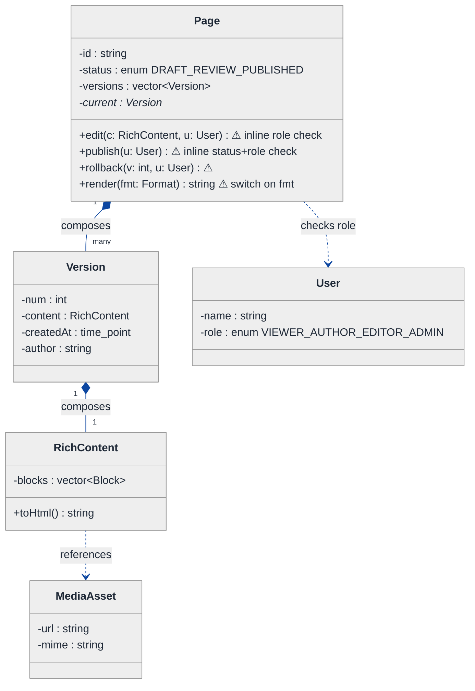
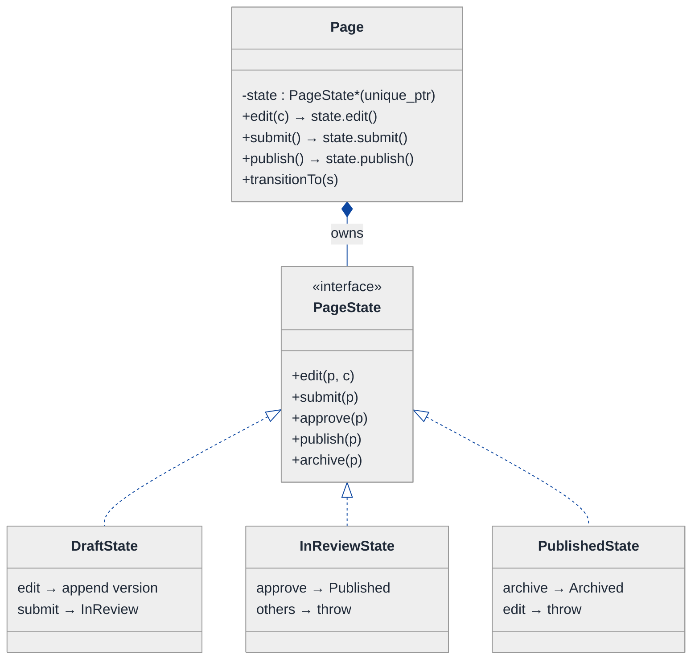
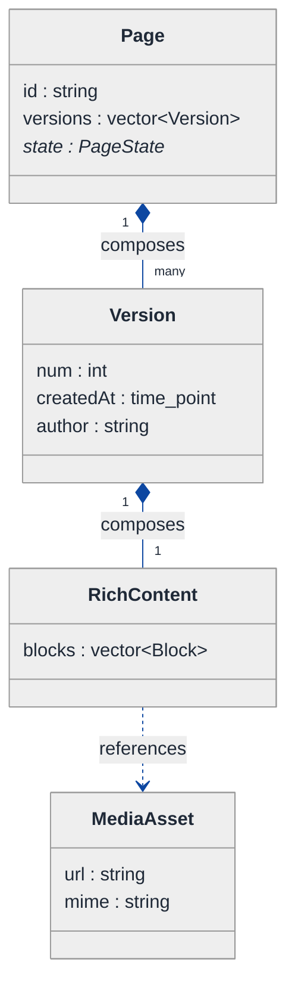
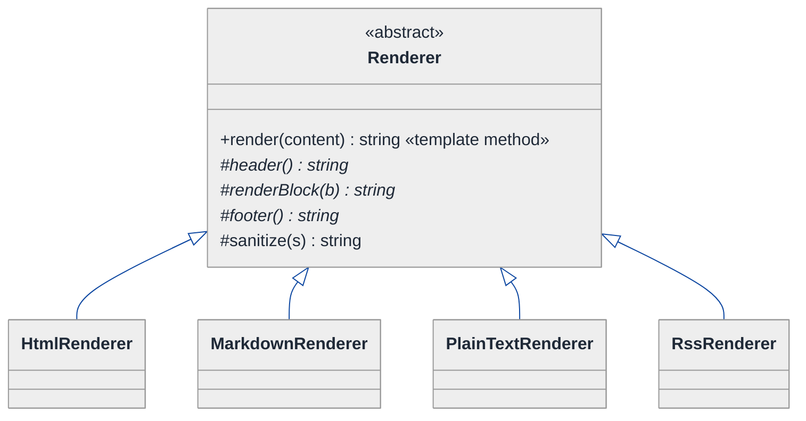
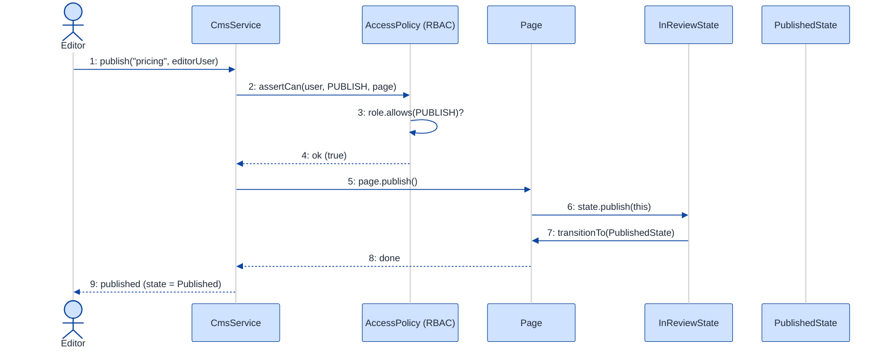

# Content Management System (CMS) — LLD Walkthrough

> **Difficulty:** Medium · **Time:** ~30 min · **Pattern focus:** State (draft/publish workflow) + Role-Based Access Control (RBAC) + Template Method (rendering)
>
> **Problem source(s):** GID `RE1`, bucket `Rule_Engine`. Representative of "design a CMS / wiki / blog platform" LLD prompts.
>
> **Diagrams:** inline mermaid (renders natively in GitHub / VS Code). The canonical theme block is copied verbatim into every diagram per the repo convention.

---

## How to use this file

Paced for a candidate seeing "design a CMS" for the first time. Reading time: ~30 minutes if you sketch each iteration by hand. **The lesson: don't reach for design patterns up front — DERIVE them by building the naive design first, watching it break under a handful of hypothetical changes, then reaching for ONE pattern per painful axis.**

**Map of this file (15 sections):**

1. Problem statement + clarifying questions
2. Plain-English restatement
3. Why this matters
4. Mental model
5. Try it yourself first
6. Entity & verb extraction
7. **Iteration 1: the naive design** — what we'd write first
8. **Where the naive design hurts** — four future requirements, one painful diff each
9. **Pivot 1: State for the draft/publish workflow** — the most painful axis first
10. **Pivot 2: RBAC as an authorization policy** — who may do what
11. **Pivot 3: Template Method for rendering** — fixed skeleton, swappable hooks
12. Final UML class diagram
13. Skeleton code (C++)
14. Key flow — sequence diagram
15. Extensibility re-check + anti-patterns + how to think aloud + self-check

---

## 1. Problem statement + clarifying questions

**Prompt (typical phrasing):** "Design a content management system supporting page creation, rich-text editing, media management, versioning with a draft/publish workflow, role-based access control, and template rendering."

**Clarifying questions to ask BEFORE drawing anything:**

1. **Workflow states?** Just draft → published, or do we need review/approval, scheduled publish, archived, and rollback to a previous version?
2. **Roles and granularity?** Fixed roles (Viewer / Author / Editor / Admin), or fully custom roles with per-action permissions? Is access global or per-page (e.g. an author owns their own pages)?
3. **Versioning semantics?** Every save a new immutable version, or only on publish? Can a user diff and revert to an old version?
4. **Rich text storage?** Store as HTML, Markdown, or a structured block/AST model? Who decides the output format (HTML page, AMP, RSS, plain text)?
5. **Media management?** Upload + reference inside content, or full asset library with reuse, transforms, and CDN URLs?
6. **Templates / rendering?** Are templates author-supplied (theme system) or a fixed set? Does rendering differ by output channel (web vs feed vs email)?
7. **Concurrency?** Two editors on the same page — last-write-wins, optimistic lock on version number, or real-time collaborative?

**Assumptions if interviewer dodges:** workflow is Draft → InReview → Published with Archived + rollback; roles are a small set mapped to actions with a per-page owner override; every save creates an immutable `Version`; rich text is a structured block model serialized to HTML/Markdown/etc; rendering varies by output channel; single-writer with optimistic version locking. We will discuss concurrency in §15.

---

## 2. Plain-English restatement

We are building the engine behind a publishing platform — think WordPress or a company wiki. An author creates a `Page`, edits its rich-text body and attaches media, and each save snapshots an immutable `Version`. A page moves through a **lifecycle**: it starts as a draft, gets submitted for review, gets published, and may later be archived or rolled back. Not everyone may do everything — a **viewer** can only read published pages, an **author** can edit their own drafts, an **editor** can publish, an **admin** can do anything. Finally, the same page must **render** into different output formats (HTML for the web, Markdown for an API, plain text for search indexing) without rewriting the page logic each time. The design must absorb new workflow states, new roles, and new output formats **without rewriting the core page code.**

---

## 3. Why this matters

A CMS is a deceptively rich LLD prompt because it bundles three *different* kinds of variability into one system, and a strong candidate must recognize they are not the same pattern. Lifecycle ("what may I do next?") is State. Authorization ("am I allowed to do this?") is a policy/RBAC concern that is orthogonal to the lifecycle. Rendering ("same data, many output shapes") is a fixed-skeleton-with-hooks problem — Template Method. Candidates who reach for one giant `Page` class with `status` enums and `if (role == ADMIN)` checks scattered everywhere produce code that works in the demo and rots in month two. The senior bar is DERIVING that these three axes vary independently and giving each its own seam.

---

## 4. Mental model

A CMS is **a stack of immutable snapshots (versions) with a moving "published" pointer**, wrapped by **a gate that asks two questions before any action: "is this transition legal in the current state?" and "is this user allowed?"** Rendering is a separate, downstream concern: take the current content and pour it through a format-specific mold.

```
Real-world sketch (NOT a UML diagram yet):

   Page "pricing"                       Who's asking?            Output mold
   ┌─────────────────────────┐          ┌───────────────┐       ┌──────────┐
   │ v4  (Published) ◀── live │   gate   │ role: Editor  │       │  HTML    │
   │ v3  (Draft)              │ ◀──────▶ │ may: publish? │       │  Markdown│
   │ v2  (archived)           │   STATE  │ may: edit?    │       │  PlainTxt│
   │ v1  (archived)           │   + RBAC └───────────────┘       └──────────┘
   └─────────────────────────┘
       immutable history          two questions per action     same data, many molds
```

The KEY insight from this picture: **history is append-only; the lifecycle is a small state machine; authorization is a yes/no gate that is independent of the state machine; rendering is a separate transform.** Four independent concerns — do not braid them into one method.

---

## 5. Try it yourself first

> **Predict before reading on:**
>
> 1. List 5 nouns you'd promote to a class, and 2 nouns you'd leave as fields.
> 2. **If I told you the CMS will add a "Scheduled" state and an "Archived" state next quarter, what breaks in a design that stores the lifecycle as a `status` enum?**
> 3. A "Contributor" role can edit but not publish, while an "Editor" can publish but only pages tagged in their section. Where does that logic live so it does not leak into the `Page` class?

---

## 6. Entity & verb extraction

> **Mini-refresher: noun → class, but not every noun.**
>
> Naive OOD promotes every noun to a class. Senior OOD promotes a noun only if it has both BEHAVIOR and STATE that need to live together. "Title" stays a field; "Page" becomes a class because it has lifecycle behavior; "Version" becomes a class because it is an immutable record with its own identity.

**Nouns from the prompt:**

| Noun | Decision | Why |
|---|---|---|
| Page | Class (aggregate root) | Owns versions, holds current lifecycle state, orchestrates edits |
| Version | Class (immutable) | A timestamped snapshot of content; has identity, never mutated |
| Content / rich text | Class (`RichContent`, block model) | Structured body + behavior (serialize to formats) |
| MediaAsset | Class | Uploaded file with metadata; referenced by content |
| User | Class | Has a Role; the actor requesting actions |
| Role | Class / value object | Maps to a permission set |
| Permission | Enum value (`Action`) | A verb the system can authorize; not a class |
| Template | Class hierarchy | Defines how content renders into an output format |
| Title / slug / timestamp | Fields | No behavior of their own |

**Verbs (and the class they live on — naive answer, we will re-examine):**

| Verb | Owner class (naive) |
|---|---|
| createPage(author) | CmsService |
| edit(content) | Page |
| submitForReview() | Page |
| publish() | Page |
| archive() / rollback(v) | Page |
| can(user, action) | Page (naive) — later AccessPolicy |
| render(format) | Page (naive) — later Template |
| uploadMedia(file) | MediaLibrary |

**We have NOT introduced any design patterns yet.** Pure nouns + verbs.

---

## 7. <a id="iter-1"></a>Iteration 1: the naive design

Let's write the simplest thing that could possibly work. No design patterns — just classes with methods, a `status` enum, and inline `if` checks.



**Reader's tour (read top to bottom; ~60 seconds).**

1. **At the top — `Page` is the aggregate root.** It holds a `status` enum, a `versions` vector, and a `current` pointer. Every meaningful operation (`edit`, `publish`, `rollback`, `render`) is a method on `Page`, and every one of them contains inline branching. Notice: NO injected policy, NO state objects, NO template hierarchy.

2. **The composition spine.** `Page` composes `Version[]` (filled diamond — same lifetime). Each `Version` composes one `RichContent`. `RichContent` references (does not own) `MediaAsset`s — the same image can be reused across pages, so it is a reference, not ownership.

3. **The four warning markers (⚠) all live on `Page`.**
   - `edit()` checks the user's role inline (`if (u.role != AUTHOR && u.role != ADMIN) throw`).
   - `publish()` checks BOTH the current status (`if (status != REVIEW) throw`) AND the role inline.
   - `rollback()` repeats the same kind of status + role tangle.
   - `render()` is a `switch (fmt)` that builds HTML vs Markdown vs plain text inside one method.

4. **`User` carries a role enum.** Authorization is "look at the enum, branch." Fine for four roles and one ownership rule. It will not survive custom roles or per-page rules.

**What's deliberately missing.** No `PageState` hierarchy. No `AccessPolicy`. No `Template` hierarchy. The naive design does not even *acknowledge* that lifecycle, authorization, and rendering are three different axes — it bakes hardcoded answers for all three into `Page`'s methods. That is exactly what we will expose and fix.

Skeleton code for the naive design (C++):

```cpp
#include <chrono>
#include <stdexcept>
#include <string>
#include <vector>

enum class Status { DRAFT, IN_REVIEW, PUBLISHED };
enum class Role   { VIEWER, AUTHOR, EDITOR, ADMIN };
enum class Format { HTML, MARKDOWN, PLAIN };

struct User { std::string name; Role role; };

class RichContent {
public:
    std::string toHtml() const { /* join blocks as <p>… */ return html_; }
    std::string raw() const { return html_; }
private:
    std::string html_;  // block model elided
};

class Version {
public:
    Version(int n, RichContent c, std::string author)
        : num_(n), content_(std::move(c)), author_(std::move(author)) {}
    const RichContent& content() const { return content_; }
private:
    int num_;
    RichContent content_;
    std::chrono::system_clock::time_point createdAt_ = std::chrono::system_clock::now();
    std::string author_;
};

class Page {
public:
    void edit(RichContent c, const User& u) {
        if (u.role != Role::AUTHOR && u.role != Role::ADMIN)   // inline role check
            throw std::runtime_error("not allowed to edit");
        if (status_ == Status::PUBLISHED)                      // inline state check
            throw std::runtime_error("cannot edit a published page directly");
        versions_.emplace_back((int)versions_.size() + 1, std::move(c), u.name);
        current_ = &versions_.back();
    }

    void publish(const User& u) {
        if (u.role != Role::EDITOR && u.role != Role::ADMIN)   // inline role check
            throw std::runtime_error("not allowed to publish");
        if (status_ != Status::IN_REVIEW)                      // inline state check
            throw std::runtime_error("can only publish a page in review");
        status_ = Status::PUBLISHED;
    }

    std::string render(Format fmt) const {                     // tag-driven switch
        const auto& c = current_->content();
        switch (fmt) {
            case Format::HTML:     return "<html>" + c.toHtml() + "</html>";
            case Format::MARKDOWN: return c.raw();   // pretend conversion
            case Format::PLAIN:    return c.raw();   // strip tags…
        }
        return "";
    }
private:
    std::string id_;
    Status status_ = Status::DRAFT;
    std::vector<Version> versions_;
    Version* current_ = nullptr;
};
```

**This works.** It has zero design patterns. We can create, edit, publish, and render. So what's wrong with it?

---

## 8. <a id="naive-pain"></a>Where the naive design hurts

The interviewer slides four new requirements across the desk: "Here's next quarter. Walk me through what changes."

### Change A: "Add a 'Scheduled' state (publish at a future time) and an 'Archived' state with rollback"

In the naive design:
- `Status` enum grows two values.
- EVERY method that branches on status (`edit`, `publish`, `rollback`, plus the gate logic in `CmsService`) needs new `case`/`if` arms.
- The legal transition matrix (who can go to what) is now scattered: nothing in one place says "Scheduled → Published is allowed but Archived → InReview is not."
- **The change touches every status-aware method, and the transition rules live nowhere — they're implicit in the `if` ladder.**

### Change B: "Custom roles — a 'Contributor' may edit but not publish; an 'Editor' may publish only pages in their section"

In the naive design:
- `Role` enum grows, and every `if (u.role != AUTHOR && ...)` clause across `edit`/`publish`/`rollback` must be revisited.
- The "only pages in their section" rule has nowhere to live — it depends on the page AND the user, which the inline `if` can't express cleanly.
- **Authorization logic is duplicated across methods and can't express data-dependent rules. Every role change is a hunt-and-edit across `Page`.**

### Change C: "Add RSS-feed output and an AMP output format"

In the naive design:
- `Format` enum grows by two.
- `render()`'s switch grows two cases, and the shared scaffolding (fetch current content, wrap header/footer, sanitize) gets copy-pasted into each case.
- **Every new output format is surgery inside one growing switch, with duplicated boilerplate around each arm.**

### Change D: "Require an approval step: an Editor must approve before InReview → Published"

In the naive design:
- `publish()` now needs to check an approval flag AND status AND role — three conditions braided into one method.
- The approval transition is a new edge in the state machine that the enum can't represent (an `IN_REVIEW` page is either approved or not).
- **The lifecycle gains a sub-state that the flat enum can't model; `publish()` becomes a thicket.**

### The pattern of pain

| Change | Files / methods touched | Smell |
|---|---|---|
| A. New states | `edit` + `publish` + `rollback` + service gate | "Status enum + scattered `if`s can't express a transition matrix." |
| B. Custom roles | every role `if` across `Page` | "Authorization duplicated; can't express data-dependent rules." |
| C. New formats | `render()` switch grows | "Tag-driven switch; boilerplate copied per format." |
| D. Approval step | `publish()` braids status+role+approval | "Lifecycle has sub-states the enum can't model." |

**Three axes of pain dominate:** the **lifecycle** (A, D — what's legal next), **authorization** (B — who may act), and **rendering** (C — same data, many output molds). They vary *independently*.

> **Pivot question:** "What pattern models a lifecycle where each phase allows different operations and decides its own transitions? What separates 'am I allowed?' from the lifecycle entirely? And what removes the duplicated scaffolding around per-format rendering?"
>
> The answers are State, an RBAC authorization policy, and Template Method. Let's introduce them one at a time, starting with the most painful axis: the lifecycle.

---

## 9. <a id="pivot-1"></a>Pivot 1: State for the draft/publish workflow

> **Mini-refresher: State pattern.**
>
> Each lifecycle phase becomes its own class. The context object (here, `Page`) delegates an operation to its current state object, and THE STATE decides what the next state is. Transitions are INTERNAL — driven by events the context receives — and each state knows which operations are legal in that phase.

**Why State fits the workflow.** The lifecycle is not an algorithm the caller picks; it is driven by what the page has been through. A `DraftState` allows `edit` and `submit`. An `InReviewState` allows `approve`/`reject`. A `PublishedState` allows `archive` but not direct `edit`. Calling `publish()` on a draft is meaningless and should fail. "What's legal next" is the PAGE's concern, encoded once per state, not a `switch` repeated in every method. That is textbook State.

**The refactor (just the lifecycle slice):**

```cpp
class Page;  // forward

class PageState {
public:
    virtual ~PageState() = default;
    virtual const char* name() const = 0;
    virtual void edit(Page& p, RichContent c) { throw std::runtime_error("edit not allowed here"); }
    virtual void submit(Page& p)              { throw std::runtime_error("submit not allowed here"); }
    virtual void approve(Page& p)             { throw std::runtime_error("approve not allowed here"); }
    virtual void publish(Page& p)             { throw std::runtime_error("publish not allowed here"); }
    virtual void archive(Page& p)             { throw std::runtime_error("archive not allowed here"); }
};

class DraftState : public PageState {
public:
    const char* name() const override { return "Draft"; }
    void edit(Page& p, RichContent c) override;     // append a new version, stay Draft
    void submit(Page& p) override;                  // → InReviewState
};

class InReviewState : public PageState {
public:
    const char* name() const override { return "InReview"; }
    void approve(Page& p) override;                 // → ApprovedState (Change D lands cleanly)
    // edit/publish stay default-throw
};

class PublishedState : public PageState {
public:
    const char* name() const override { return "Published"; }
    void archive(Page& p) override;                 // → ArchivedState
    // editing a published page is NOT allowed — must fork a new draft
};
// ApprovedState, ScheduledState, ArchivedState elided — each is one new class
```

`Page` holds the current state and delegates:

```cpp
class Page {
public:
    Page() : state_(std::make_unique<DraftState>()) {}
    void transitionTo(std::unique_ptr<PageState> s) { state_ = std::move(s); }

    void edit(RichContent c) { state_->edit(*this, std::move(c)); }
    void submit()            { state_->submit(*this); }
    void approve()           { state_->approve(*this); }
    void publish()           { state_->publish(*this); }
    void archive()           { state_->archive(*this); }

    std::vector<Version>& versions() { return versions_; }
    const char* stateName() const { return state_->name(); }
private:
    std::unique_ptr<PageState>   state_;
    std::vector<Version>         versions_;
};

inline void DraftState::edit(Page& p, RichContent c) {
    p.versions().emplace_back((int)p.versions().size() + 1, std::move(c), "author");
    // stays Draft — no transition
}
inline void DraftState::submit(Page& p)  { p.transitionTo(std::make_unique<InReviewState>()); }
inline void InReviewState::approve(Page& p) { p.transitionTo(std::make_unique<PublishedState>()); }
inline void PublishedState::archive(Page& p){ /* p.transitionTo(make_unique<ArchivedState>()); */ }
```

**What changed — visualized.** Just the lifecycle slice:



**Tour of the after-state.**

1. **The `Status` enum is gone**, replaced by a `state_` field of type `unique_ptr<PageState>` — exclusive ownership of the current phase.
2. **`Page`'s lifecycle methods became one-liners** that delegate to the current state. NO `if (status == X)` anywhere on `Page`.
3. **The base class defaults every operation to "throw."** A concrete state overrides ONLY the operations it permits. `InReviewState` doesn't mention `edit`, so editing a page in review automatically throws via the base — illegal operations are impossible by construction, not by a runtime check.
4. **Transitions live with the state.** `DraftState::submit` calls `p.transitionTo(InReviewState)`. The "what comes next" knowledge sits in the state that owns the edge, not in `Page`.

**Change A and Change D from §8 now land cleanly.** New states (`Scheduled`, `Archived`, `Approved`) are each ONE new class implementing `PageState`. The approval step is just an `ApprovedState` between `InReview` and `Published`. No edits to existing states or to `Page`. Open/closed.

> **Mini-refresher: Open/Closed Principle (the "O" in SOLID).**
>
> Software entities should be OPEN for extension but CLOSED for modification. You add new behavior by adding new code (a new `PageState` subclass), not by editing existing, tested code (the `Page` class or the other states). The State pattern is one of the cleanest ways to honor it.

**Pattern-discrimination cheatsheet — State vs Strategy.**
- *State:* the OBJECT picks its next state internally; states know about each other (each state's methods can `transitionTo` another). The set of legal operations changes as the object moves through its lifecycle.
- *Strategy:* the CALLER picks which algorithm to use; strategies are usually unaware of each other and don't transition between themselves.
- *Rule of thumb:* if `obj.handleEvent(e)` flips an internal phase → State. If `obj.setPolicy(x)` is called by external code to swap an algorithm → Strategy.

We chose State because the page DRIVES its own transitions in response to events (`submit`, `approve`), and the legal operation set differs per phase.

---

## 10. <a id="pivot-2"></a>Pivot 2: RBAC as an authorization policy

Change B from §8 is still painful. Notice the State pattern did NOT solve it — `DraftState::edit` happily appends a version regardless of WHO is asking. Lifecycle answers "is this transition legal *now*?"; it says nothing about "is this *user* allowed?" Those are orthogonal questions, and braiding them is the original sin of the naive design.

> **Mini-refresher: Role-Based Access Control (RBAC).**
>
> Users are assigned ROLES; roles are granted PERMISSIONS (the verbs the system can authorize). Authorization is a lookup — "does this user's role include this permission for this resource?" — not a hardcoded `if (role == ADMIN)`. The check is centralized behind one `AccessPolicy` so every entry point asks the same question the same way.

**Why a separate policy object (not more `if`s).** Authorization varies along a different axis than lifecycle: roles change, permissions get added, and some rules are data-dependent ("Editor may publish only pages in their section"). Putting `policy.assertCan(user, Action::PUBLISH, page)` at the front of each operation centralizes the rule, lets it depend on both the user AND the resource, and keeps `Page`/`PageState` ignorant of who is calling.

**The refactor (the authorization slice):**

```cpp
enum class Action { VIEW, EDIT, SUBMIT, APPROVE, PUBLISH, ARCHIVE, ROLLBACK, MANAGE_USERS };

class Role {
public:
    Role(std::string name, std::unordered_set<Action> grants)
        : name_(std::move(name)), grants_(std::move(grants)) {}
    bool allows(Action a) const { return grants_.count(a) > 0; }
    const std::string& name() const { return name_; }
private:
    std::string                 name_;
    std::unordered_set<Action>  grants_;   // data, not code — new roles need NO new class
};

struct User { std::string name; std::shared_ptr<Role> role; };

class Page;  // forward

// Authorization is itself an interface so the rule can vary (RBAC today, ABAC tomorrow).
class AccessPolicy {
public:
    virtual ~AccessPolicy() = default;
    virtual bool can(const User& u, Action a, const Page& p) const = 0;
    void assertCan(const User& u, Action a, const Page& p) const {
        if (!can(u, a, p)) throw std::runtime_error("403: " + u.name + " may not perform action");
    }
};

class RbacPolicy : public AccessPolicy {
public:
    bool can(const User& u, Action a, const Page& p) const override {
        return u.role && u.role->allows(a);   // pure role lookup
    }
};

// Data-dependent rule (Change B's "only pages in their section") — a Decorator over a base policy.
class OwnerOrSectionPolicy : public AccessPolicy {
public:
    explicit OwnerOrSectionPolicy(std::unique_ptr<AccessPolicy> base) : base_(std::move(base)) {}
    bool can(const User& u, Action a, const Page& p) const override;  // checks p.section() vs u
private:
    std::unique_ptr<AccessPolicy> base_;
};
```

The service layer (`CmsService`) injects the policy and gates every action with ONE line before delegating to the page's state:

```cpp
void CmsService::publish(const std::string& pageId, const User& u) {
    Page& p = repo_.get(pageId);
    policy_->assertCan(u, Action::PUBLISH, p);   // ← authorization gate, one line
    p.publish();                                 // ← lifecycle (State pattern) takes over
}
```

**The structural win.** Authorization and lifecycle now live in different objects. `Page`/`PageState` know nothing about roles; `AccessPolicy` knows nothing about transitions. Adding the "Contributor" role is *data* — a new `Role` with a different grant set, zero new classes. Adding the section rule is one `OwnerOrSectionPolicy` decorator. Change B lands without touching `Page`.

**Pattern-discrimination cheatsheet — RBAC (role lookup) vs Chain of Responsibility (rule pipeline).**
- *RBAC / single policy object:* one centralized "does this role grant this action?" lookup. Simple, fast, declarative.
- *Chain of Responsibility:* a chain of independent rule handlers, each able to allow/deny/pass — useful when authorization is many composable rules (deny-list, IP rule, role rule, ownership rule) evaluated in order.
- *Rule of thumb:* fixed role→permission map → RBAC policy. Many independent, composable, possibly short-circuiting rules → wrap them (we used a Decorator here; a full Chain is the heavier-weight cousin when rules grow).

We started with `RbacPolicy` and layered one Decorator for the data-dependent rule — the smallest thing that absorbs Change B without over-engineering a full chain.

---

## 11. <a id="pivot-3"></a>Pivot 3: Template Method for rendering

Change C (RSS, AMP, plain text, …) is the last unsolved axis. Rendering is different from both lifecycle and authorization: the *steps* are always the same — fetch current content, render a header, render the body blocks, render a footer, sanitize — only the *per-step output* differs by format. That "fixed skeleton, swappable steps" shape is Template Method, not Strategy.

> **Mini-refresher: Template Method pattern.**
>
> An abstract base class defines the SKELETON of an algorithm as a single `final` (non-overridable) method, calling abstract "hook" steps that subclasses fill in. The order of steps and the shared scaffolding live ONCE in the base; subclasses customize only the parts that vary. Inheritance, not composition.

**Why Template Method (not Strategy here).** With Strategy, each format would re-implement the whole `render()` and duplicate the "wrap header / iterate blocks / sanitize" scaffolding (exactly the copy-paste smell from §8 Change C). Template Method puts that scaffolding in ONE base method and lets each format override only `renderBlock`, `header`, and `footer`. The shared sequence is enforced; the variation is contained.

**The refactor (the rendering slice):**

```cpp
class Renderer {
public:
    virtual ~Renderer() = default;

    // The TEMPLATE METHOD — skeleton is fixed; subclasses cannot reorder it.
    std::string render(const RichContent& c) const {
        std::string out = header();
        for (const Block& b : c.blocks())
            out += renderBlock(b);     // hook — varies per format
        out += footer();
        return sanitize(out);          // shared post-step
    }
protected:
    virtual std::string header() const = 0;           // hook
    virtual std::string renderBlock(const Block&) const = 0;  // hook
    virtual std::string footer() const = 0;           // hook
    virtual std::string sanitize(const std::string& s) const { return s; }  // default hook
};

class HtmlRenderer : public Renderer {
protected:
    std::string header() const override { return "<article>"; }
    std::string renderBlock(const Block& b) const override { return "<p>" + b.text() + "</p>"; }
    std::string footer() const override { return "</article>"; }
    std::string sanitize(const std::string& s) const override { /* escape unsafe tags */ return s; }
};

class MarkdownRenderer : public Renderer {
protected:
    std::string header() const override { return ""; }
    std::string renderBlock(const Block& b) const override { return b.text() + "\n\n"; }
    std::string footer() const override { return ""; }
};
// PlainTextRenderer, RssRenderer, AmpRenderer — each is one new subclass overriding the three hooks
```

`Page` renders by delegating to whichever `Renderer` it is handed — it never builds format strings itself:

```cpp
std::string Page::render(const Renderer& r) const { return r.render(currentContent()); }
```

**Change C now lands cleanly.** RSS and AMP are each ONE new `Renderer` subclass overriding three hooks. The shared skeleton (header → blocks → footer → sanitize) is written once and reused. No growing switch, no duplicated scaffolding.

**Pattern-discrimination cheatsheet — Template Method vs Strategy.**
- *Template Method:* algorithm SKELETON fixed in a base class; subclasses fill hook steps via INHERITANCE. Use when the sequence is stable and only steps vary.
- *Strategy:* the WHOLE algorithm is a swappable object chosen at runtime via COMPOSITION. Use when variants might be combined or swapped dynamically.
- *Rule of thumb:* same steps, different per-step output → Template Method. Different whole algorithm, picked/composed at runtime → Strategy.

> **Mini-refresher: composition vs inheritance.**
>
> We used composition for policy (inject an `AccessPolicy`) and state (a `Page` HOLDS a `PageState`), but inheritance for rendering (`HtmlRenderer IS-A Renderer`). The rule of thumb: inheritance when subclasses genuinely specialize a fixed template and you want the base to ENFORCE structure; composition when you want to swap or stack behavior at runtime. Rendering's skeleton is fixed and enforced — inheritance earns its place.

---

## 12. <a id="fig-class-diagram"></a>Final class diagram

Showing everything in one diagram becomes a wall of boxes. Here are **three focused sub-views**, each addressing one concern, tied together at the end.

### 12.1 The content spine — what a Page OWNS



**Tour of 12.1.** The append-only history spine. Filled diamonds mark composition (same lifetime): a `Page` owns its `Version[]`; each `Version` owns one immutable `RichContent`. `RichContent` only *references* `MediaAsset` (dashed arrow) because one image is reused across many pages — media is owned by a separate library, not by any single version. This spine is unchanged from the naive design; it didn't need to change. Everything we added lives in 12.2 and 12.3.

### 12.2 The two gates — lifecycle (State) + authorization (RBAC)

```mermaid
---
config:
  theme: neutral
  themeVariables:
    background: '#ffffff'
    primaryColor: '#cfe2ff'
    primaryTextColor: '#1f2937'
    primaryBorderColor: '#084298'
    secondaryColor: '#fff3cd'
    secondaryTextColor: '#1f2937'
    secondaryBorderColor: '#664d03'
    tertiaryColor: '#d1e7dd'
    tertiaryTextColor: '#1f2937'
    tertiaryBorderColor: '#0a3622'
    lineColor: '#0d47a1'
    textColor: '#1f2937'
    noteBkgColor: '#fff3cd'
    noteTextColor: '#1f2937'
    noteBorderColor: '#997404'
    actorBkg: '#cfe2ff'
    actorBorder: '#084298'
    actorTextColor: '#1f2937'
    signalColor: '#0d47a1'
    signalTextColor: '#1f2937'
    labelBoxBkgColor: '#ffffff'
    labelBoxBorderColor: '#d3d3d3'
    labelTextColor: '#1f2937'
    edgeLabelBackground: '#ffffff'
    labelBackground: '#ffffff'
    classText: '#1f2937'
    fontFamily: 'system-ui, -apple-system, Segoe UI, Helvetica, Arial, sans-serif'
---
classDiagram
  direction TB
  class CmsService {
    -policy : AccessPolicy*
    +publish(id, user)
    +edit(id, content, user)
  }
  class AccessPolicy {
    <<interface>>
    +can(u, action, page)
    +assertCan(u, action, page)
  }
  class RbacPolicy
  class OwnerOrSectionPolicy {
    -base : AccessPolicy*
  }
  class Role {
    name : string
    grants : set~Action~
  }
  class Page {
    -state : PageState*
    +publish() → state.publish()
  }
  class PageState {
    <<interface>>
    +edit / submit / approve / publish / archive
  }
  class DraftState
  class InReviewState
  class PublishedState
  class ArchivedState
  CmsService o-- AccessPolicy : injected
  AccessPolicy <|.. RbacPolicy
  AccessPolicy <|.. OwnerOrSectionPolicy
  OwnerOrSectionPolicy --> AccessPolicy : wraps base
  RbacPolicy ..> Role : looks up grants
  CmsService ..> Page : orchestrates
  Page *-- PageState : owns
  PageState <|.. DraftState
  PageState <|.. InReviewState
  PageState <|.. PublishedState
  PageState <|.. ArchivedState
```



**Tour of 12.2.** Two independent gates sit in front of every action.

1. **The authorization gate (left).** `CmsService` aggregates (open diamond — injected, lifetime not necessarily owned) an `AccessPolicy`. `RbacPolicy` does a pure role→grant lookup; `OwnerOrSectionPolicy` is a Decorator that adds the data-dependent rule on top of a base policy. `Role` is plain data (a grant set), so new roles need NO new class.
2. **The lifecycle gate (right).** `Page` OWNS (filled diamond / `unique_ptr`) a `PageState`. Each concrete state declares which operations are legal and where they transition. New states are new subclasses.
3. **They never touch.** `AccessPolicy` knows nothing about transitions; `PageState` knows nothing about roles. `CmsService` calls them in sequence: authorize, THEN transition. That separation is the whole point — the naive design's sin was braiding them inside `Page`.

### 12.3 The rendering mold — Template Method



**Tour of 12.3.** `Renderer` is an abstract base whose public `render()` is the template method — it owns the fixed sequence (header → iterate blocks → footer → sanitize). The protected `header`/`renderBlock`/`footer` are abstract hooks each format fills in; `sanitize` is a hook with a default. The hollow-triangle arrows are inheritance ("is-a") — the right tool here because the skeleton is stable and the base ENFORCES the order. New formats are new leaves.

### Structural insight (ties 12.1 + 12.2 + 12.3 together)

| Concern | Pattern used | Why |
|---|---|---|
| **Content history** (Page, Version, RichContent) | Plain composition + immutable Version | Append-only snapshots; identity matters, behavior is minimal |
| **Lifecycle** (Draft → InReview → Published → Archived) | State, OWNED by Page | Page drives its own transitions; legal operations differ per phase |
| **Authorization** (who may do what) | RBAC AccessPolicy, INJECTED into CmsService (+ Decorator) | Orthogonal to lifecycle; data-driven roles; resource-aware rules |
| **Rendering** (HTML / Markdown / RSS / AMP) | Template Method, via inheritance | Fixed skeleton, per-step variation; base enforces the sequence |

The big lesson: **three different kinds of variability, three different patterns.** Lifecycle is internal-transition variation → State. Authorization is an orthogonal yes/no gate → a centralized policy. Rendering is fixed-skeleton-with-hooks → Template Method. Recognizing they are *different* — and refusing to braid them into one `Page` god-class — is the entire test.

---

## 13. Skeleton code (C++)

> Show the SHAPES, not the full impl. ~120 lines.

```cpp
#include <chrono>
#include <memory>
#include <stdexcept>
#include <string>
#include <unordered_set>
#include <vector>

// ── Content spine ───────────────────────────────────────────────────
class Block { public: const std::string& text() const { return text_; } private: std::string text_; };

class RichContent {
public:
    const std::vector<Block>& blocks() const { return blocks_; }
private:
    std::vector<Block> blocks_;          // structured block model; serialization lives in Renderer
};

class Version {
public:
    Version(int n, RichContent c, std::string author)
        : num_(n), content_(std::move(c)), author_(std::move(author)) {}
    const RichContent& content() const { return content_; }
    int num() const { return num_; }
private:
    int num_;
    RichContent content_;
    std::chrono::system_clock::time_point createdAt_ = std::chrono::system_clock::now();
    std::string author_;                 // Version is immutable once constructed
};

// ── Lifecycle: State pattern ────────────────────────────────────────
class Page;  // forward
class PageState {
public:
    virtual ~PageState() = default;
    virtual const char* name() const = 0;
    virtual void edit(Page&, RichContent) { throw std::runtime_error("edit not allowed"); }
    virtual void submit(Page&)            { throw std::runtime_error("submit not allowed"); }
    virtual void approve(Page&)           { throw std::runtime_error("approve not allowed"); }
    virtual void publish(Page&)           { throw std::runtime_error("publish not allowed"); }
    virtual void archive(Page&)           { throw std::runtime_error("archive not allowed"); }
};

class Page {
public:
    Page(std::string id);                                // starts in DraftState
    void transitionTo(std::unique_ptr<PageState> s) { state_ = std::move(s); }
    void edit(RichContent c) { state_->edit(*this, std::move(c)); }
    void submit()  { state_->submit(*this); }
    void approve() { state_->approve(*this); }
    void publish() { state_->publish(*this); }
    void archive() { state_->archive(*this); }
    std::vector<Version>& versions() { return versions_; }
    const RichContent& currentContent() const { return versions_.back().content(); }
    const std::string& section() const { return section_; }
    const char* stateName() const { return state_->name(); }
private:
    std::string                id_;
    std::string                section_;
    std::vector<Version>       versions_;
    std::unique_ptr<PageState> state_;
};

class DraftState : public PageState {
public:
    const char* name() const override { return "Draft"; }
    void edit(Page& p, RichContent c) override {
        p.versions().emplace_back((int)p.versions().size() + 1, std::move(c), "author");
    }
    void submit(Page& p) override;  // → InReviewState (elided: transitionTo)
};
// InReviewState, ApprovedState, PublishedState, ArchivedState elided — each one new class

// ── Authorization: RBAC ─────────────────────────────────────────────
enum class Action { VIEW, EDIT, SUBMIT, APPROVE, PUBLISH, ARCHIVE, ROLLBACK };

class Role {
public:
    Role(std::string n, std::unordered_set<Action> g) : name_(std::move(n)), grants_(std::move(g)) {}
    bool allows(Action a) const { return grants_.count(a) > 0; }
private:
    std::string name_;
    std::unordered_set<Action> grants_;
};
struct User { std::string name; std::shared_ptr<Role> role; };

class AccessPolicy {
public:
    virtual ~AccessPolicy() = default;
    virtual bool can(const User&, Action, const Page&) const = 0;
    void assertCan(const User& u, Action a, const Page& p) const {
        if (!can(u, a, p)) throw std::runtime_error("403 Forbidden");
    }
};
class RbacPolicy : public AccessPolicy {
public:
    bool can(const User& u, Action a, const Page&) const override {
        return u.role && u.role->allows(a);
    }
};
// OwnerOrSectionPolicy (Decorator over a base AccessPolicy) elided

// ── Rendering: Template Method ──────────────────────────────────────
class Renderer {
public:
    virtual ~Renderer() = default;
    std::string render(const RichContent& c) const {        // the template method
        std::string out = header();
        for (const Block& b : c.blocks()) out += renderBlock(b);
        out += footer();
        return sanitize(out);
    }
protected:
    virtual std::string header() const = 0;
    virtual std::string renderBlock(const Block&) const = 0;
    virtual std::string footer() const = 0;
    virtual std::string sanitize(const std::string& s) const { return s; }
};
class HtmlRenderer : public Renderer {
protected:
    std::string header() const override { return "<article>"; }
    std::string renderBlock(const Block& b) const override { return "<p>" + b.text() + "</p>"; }
    std::string footer() const override { return "</article>"; }
};
// MarkdownRenderer, RssRenderer, … elided

// ── Service layer: wires the two gates + rendering together ─────────
class PageRepository { public: Page& get(const std::string& id); /* elided */ };

class CmsService {
public:
    CmsService(PageRepository& repo, std::unique_ptr<AccessPolicy> policy)
        : repo_(repo), policy_(std::move(policy)) {}

    void edit(const std::string& id, RichContent c, const User& u) {
        Page& p = repo_.get(id);
        policy_->assertCan(u, Action::EDIT, p);   // gate 1: authorization
        p.edit(std::move(c));                      // gate 2: lifecycle (State decides legality)
    }
    void publish(const std::string& id, const User& u) {
        Page& p = repo_.get(id);
        policy_->assertCan(u, Action::PUBLISH, p);
        p.publish();
    }
    std::string render(const std::string& id, const Renderer& r) {
        return r.render(repo_.get(id).currentContent());
    }
private:
    PageRepository&               repo_;
    std::unique_ptr<AccessPolicy> policy_;
};
```

---

## 14. <a id="fig-sequence"></a>Key flow — sequence diagram

This is the moment of truth — read across the swimlanes to see how authorization (RBAC) and lifecycle (State) cooperate WITHOUT knowing about each other.



**Tour of the flow. Read slowly — this is where the two gates cooperate.**

1. **Editor asks the service to publish.** The HTTP/controller layer is collapsed into `CmsService` — the single entry point.
2. **Gate 1 — authorization (steps 2-4).** `CmsService` asks the injected `AccessPolicy` `assertCan(user, PUBLISH, page)` BEFORE touching the page. `RbacPolicy` does a pure role-grant lookup. If the user were a Viewer, this throws `403` here and the lifecycle is never invoked. **Authorization happens first and is fully independent of what state the page is in.**
3. **Gate 2 — lifecycle (steps 5-7).** Only after authorization passes does `CmsService` call `page.publish()`. `Page` delegates to its current state. If the page were a `DraftState`, `publish()` would hit the base-class default and throw "publish not allowed" — because you cannot publish something that hasn't been reviewed. Here it's an `InReviewState`, whose `publish` (via `approve`/`publish` edge) transitions the page to `PublishedState`.
4. **The transition lives in the state.** `InReviewState` itself calls `page.transitionTo(PublishedState)`. Neither `Page` nor `CmsService` contains an `if (status == ...)`.

### The validation that's NOT shown — and why it matters

You don't see `if (user.role == ADMIN)` OR `if (page.status == REVIEW)` anywhere in `CmsService`. Both checks are made impossible-to-skip by structure: authorization is a single `assertCan` line; legality is enforced by polymorphic dispatch on the state. **Two orthogonal questions, two separate objects, asked in a fixed order — neither leaks into the other, and neither leaks into `Page`.** That separation is exactly what the naive design lacked.

---

## 15. Extensibility re-check + anti-patterns + how to think aloud + self-check

### Extensibility re-check

Revisit the four changes from [§8](#naive-pain). For each, name the SINGLE thing that changes.

| Change | Naive design impact | Final design impact |
|---|---|---|
| A. New states (Scheduled, Archived) | every status method + service gate | New `ScheduledState` / `ArchivedState : PageState`. Done. |
| B. Custom roles + section rule | every role `if` across Page | New `Role` (just data) + one `OwnerOrSectionPolicy` decorator. Done. |
| C. New formats (RSS, AMP) | growing `render()` switch | New `RssRenderer` / `AmpRenderer : Renderer` overriding 3 hooks. Done. |
| D. Approval step | `publish()` braids 3 conditions | New `ApprovedState` between InReview and Published. Done. |

Every change is exactly ONE new class (or, for new roles, zero new classes — just data). That's the open/closed principle in practice.

If a future requirement forces you to change `Page`, `PageState`, `AccessPolicy`, AND `Renderer` together — go back to §6 and re-identify variability points; you've braided two axes that should be separate.

### Common confusion + traps

1. **"Why not put `can()` on the `User` or the `Role`?"** A user knowing whether it may edit a *specific* page couples the user to page internals (sections, ownership). Keep authorization in a policy that sees both the user AND the resource.
2. **"Why is the lifecycle State and not just a status enum?"** Three states fit an enum; six states with sub-states (approved-but-not-published, scheduled) make the transition matrix an N² mess of scattered `if`s. State puts each edge with the phase that owns it.
3. **"Why Template Method for rendering and not Strategy?"** The render *sequence* is stable (header → blocks → footer → sanitize); only per-step output varies. Strategy would duplicate the scaffolding in every format. If formats also needed to be composed/swapped at runtime per-block, Strategy per block would earn its place.
4. **"Where does versioning behavior live?"** `Version` is immutable; `Page` appends. Rollback is a new state-aware operation that pushes an old version's content as a new version — not a mutation of history. This is close to the Memento idea (snapshot + restore) without a separate caretaker class.
5. **"Is RBAC enough, or do I need ABAC?"** RBAC (role→permission) covers most CMS needs. The data-dependent rule ("only my section") is the seam where Attribute-Based Access Control creeps in — we absorbed it with one Decorator rather than rewriting the policy.

### Anti-patterns

- **"God class Page"** — owning lifecycle, authorization, AND rendering. Each is a separate collaborator.
- **"Status enum + scattered `if`s"** — the transition matrix has no home; use State.
- **"`if (role == ADMIN)` sprinkled everywhere"** — authorization duplicated and un-auditable; centralize in an `AccessPolicy`.
- **"Tag-driven render switch"** — `switch (format)` with copy-pasted scaffolding; use Template Method.
- **"Mutable versions"** — editing a `Version` in place destroys history. Versions are immutable snapshots.
- **"Braiding the two gates"** — checking role inside a state method (or status inside the policy). Keep authorization and lifecycle orthogonal.

### How to think aloud

> "CMS. Let me clarify scope. [Asks workflow states, role granularity, versioning, output formats from §1.] Got it.
>
> Nouns: Page, Version, RichContent, MediaAsset, User/Role, Template. Page is the aggregate root with lifecycle behavior; Version is immutable history.
>
> I'll start NAIVE — no patterns. Page holds a status enum and a versions vector; edit/publish/render each do inline role checks, status checks, and a render switch.
>
> Now stress-test. Change A: new states — every status method grows. Change B: custom roles — every role `if` grows and can't express data-dependent rules. Change C: new formats — render switch grows with duplicated boilerplate. Change D: approval step — the enum can't model a sub-state.
>
> Three independent axes: lifecycle, authorization, rendering. Three patterns.
>
> Pivot 1: lifecycle → State. Each phase is a class; the base defaults every op to throw; a state overrides only what it permits and drives its own transitions. New states are new classes.
>
> Pivot 2: authorization → a centralized AccessPolicy with RBAC role→grant lookup, plus a Decorator for the section rule. Orthogonal to lifecycle; CmsService asks `assertCan` before delegating to the page.
>
> Pivot 3: rendering → Template Method. The render sequence is fixed in a base class; HtmlRenderer/MarkdownRenderer/RssRenderer fill three hooks. No switch.
>
> Final: Page owns Version[] and a PageState; CmsService injects an AccessPolicy and gates each action; Renderer subclasses handle output. All four future changes land as one new class each — open/closed."

### Self-check

> **Self-check — the question to ask next time.**
>
> When you see "design a system with a workflow, permissions, AND multiple output shapes," before reaching for one class full of enums and `if`s, ask:
>
> > **"Which kind of variability is this — a lifecycle the OBJECT transitions through (State), an orthogonal yes/no gate over WHO is asking (a policy / RBAC), or a fixed sequence with per-step variation (Template Method)?"**
>
> Lifecycle → State. Authorization → a separate policy object. Fixed-skeleton rendering → Template Method. They are three different axes — give each its own seam and never braid them into the aggregate root.

---

## Cross-references

- **Parent topic manifest:** [`./EXTRACTED_QUESTIONS.md`](./EXTRACTED_QUESTIONS.md)
- **Vertical overview:** [`../../LEARNING.md`](../../LEARNING.md)
- **Template:** [`../../TEMPLATE-v2.md`](../../TEMPLATE-v2.md)
- **Canonical exemplar:** [`../Object_Oriented_Design/Parking_Lot.md`](../Object_Oriented_Design/Parking_Lot.md)
- **Related v2 walkthroughs:**
  - State Pattern deep-dive (in `../State_Pattern/`) — the draft/publish lifecycle here is a worked example.
  - Strategy Pattern deep-dive (in `../Strategy_Pattern/`) — contrast with the State vs Strategy cheatsheet in §9.
  - Chain of Responsibility (in `../Chain_of_Responsibility/`) — the heavier alternative to the RBAC policy when rules grow composable (see §10 cheatsheet).
- **External references:**
  - <a href="https://refactoring.guru/design-patterns/state" target="_blank" rel="noopener noreferrer">Refactoring.Guru — State pattern</a>
  - <a href="https://refactoring.guru/design-patterns/template-method" target="_blank" rel="noopener noreferrer">Refactoring.Guru — Template Method pattern</a>
  - <a href="https://en.wikipedia.org/wiki/Role-based_access_control" target="_blank" rel="noopener noreferrer">Role-based access control (Wikipedia)</a>
