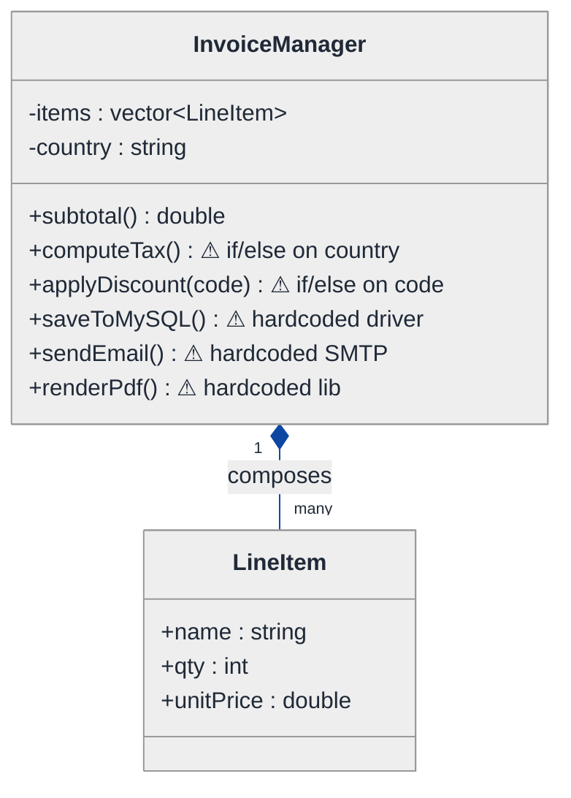
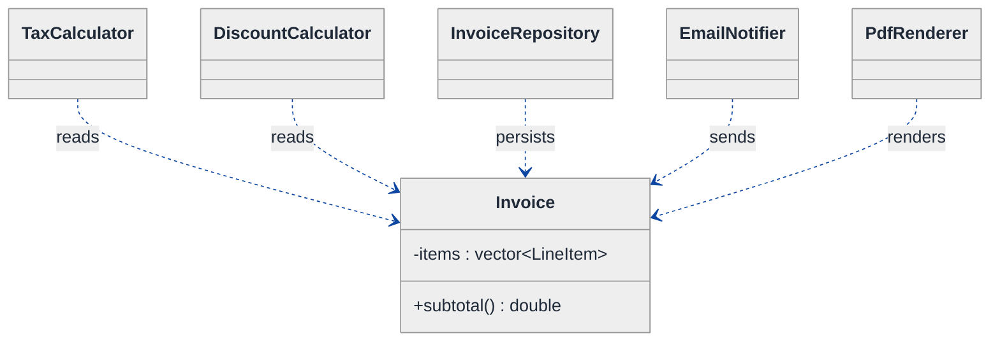
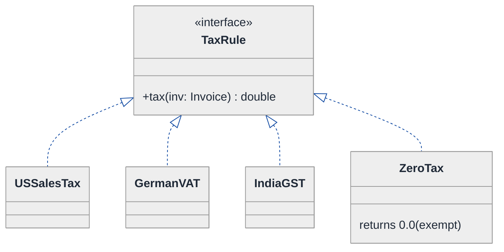
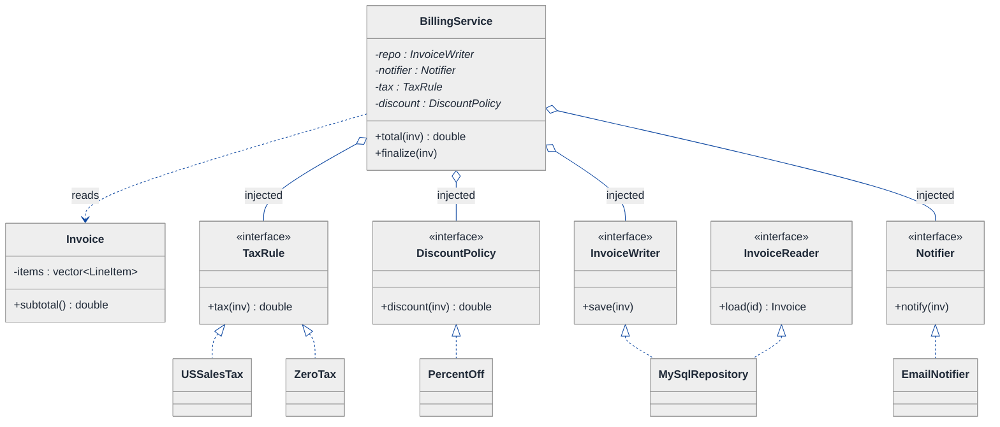

# SOLID Principles, Explained — LLD Walkthrough

> **Difficulty:** Medium · **Time:** ~30 min · **Pattern focus:** S / O / L / I / D, each with a violation and a fix, plus the patterns each principle naturally pulls in (Strategy, Decorator, Dependency Injection)
>
> **Problem source(s):** GID S1, bucket `SOLID_Principles`. Representative of the "explain SOLID with code examples" family in [`./EXTRACTED_QUESTIONS.md`](./EXTRACTED_QUESTIONS.md).
>
> **Diagrams:** inline mermaid (renders natively in GitHub / VS Code). No external sources.

---

## How to use this file

Most candidates can recite the five SOLID acronyms. The senior bar is DERIVING them — showing a single concrete class that violates all five, watching it break under realistic new requirements, then fixing ONE principle at a time and seeing what pattern each fix pulls in. **The lesson: SOLID isn't five disconnected rules. It's one idea — "isolate the things that change independently" — refracted through five lenses.**

We'll build an `InvoiceManager` for an online store, deliberately writing the worst version first. Reading time: ~30 minutes if you sketch each fix by hand.

**Map of this file (15 sections):**

1. Problem statement + clarifying questions
2. Plain-English restatement
3. Why this matters
4. Mental model
5. Try it yourself first
6. Entity & verb extraction
7. **Iteration 1: the naive design** — one class that violates all five principles
8. **Where the naive design hurts** — five future requirements, one per principle
9. **Fix 1: SRP** — split the god class along its reasons-to-change
10. **Fix 2: OCP (+ LSP)** — make tax/discount open for extension, and keep subtypes substitutable
11. **Fix 3: ISP + DIP** — slim the interfaces, depend on abstractions
12. Final class diagram
13. Skeleton code (C++)
14. Key flow — sequence diagram
15. Extensibility re-check + when to DEVIATE + anti-patterns + how to think aloud + self-check

---

## 1. Problem statement + clarifying questions

**Prompt (typical phrasing):** "Explain the SOLID principles with real-world code examples. For each principle, provide a violation example and a corrected version. When would you intentionally deviate from these principles?"

A weak answer recites definitions. A strong answer picks ONE running domain, writes a class that violates every principle, then repairs it principle-by-principle so the interviewer can *see* each rule earning its keep. So before drawing anything, clarify the domain you'll use as the worked example:

**Clarifying questions to ask BEFORE writing code:**

1. **Do you want one running example or five disconnected snippets?** (Strongly prefer one running example — it shows the principles interacting, not just memorized. I'll use an invoicing/billing module.)
2. **What language?** C++17 here; the principles are language-agnostic but DIP especially leans on abstract base classes / interfaces.
3. **How deep on the "deviate" part?** Is this a "name three exceptions" question, or do you want me to argue tradeoffs (premature abstraction cost, YAGNI, performance)?
4. **Are we optimizing for testability specifically?** DIP and ISP pay off most when the interviewer cares about unit-testing in isolation (mocking the database, the email gateway).
5. **Should I show the GoF patterns each principle pulls in?** (OCP → Strategy/Decorator, DIP → Dependency Injection.) Some interviewers want the principle named; others want the pattern.
6. **Scope of the invoice domain?** Line items, tax, discounts, persistence, notification, PDF export — which of these are in play?

**Assumptions if the interviewer dodges:** one running example (an invoicing module), C++17, moderate depth on deviation (argue the tradeoffs), testability matters, and I'll surface the pattern each principle pulls in. Invoice scope = line items + tax + discounts + persistence + email notification.

---

## 2. Plain-English restatement

SOLID is five design guidelines that together answer one question: **"when a requirement changes, how few classes do I have to touch — and how confident am I I won't break something else?"** Each letter attacks a different way a class can become rigid:

- **S**ingle Responsibility — a class should have one reason to change.
- **O**pen/Closed — open for extension, closed for modification.
- **L**iskov Substitution — a subtype must be usable wherever its base type is expected, without surprises.
- **I**nterface Segregation — no client should be forced to depend on methods it doesn't use.
- **D**ependency Inversion — depend on abstractions, not concretions.

We'll write an invoice module that breaks all five, then fix them one at a time.

---

## 3. Why this matters

This is the most common "do you actually understand design, or did you memorize an acronym?" probe in an LLD interview. Reciting definitions gets you a polite nod; *deriving* the principles from a class that hurts gets you the offer. It also tests judgment: a candidate who applies SOLID dogmatically (an interface for every class, a factory for every `new`) is as much a red flag as one who's never heard of it. The "when would you deviate" clause is where senior signal lives — the interviewer wants to hear YAGNI, premature-abstraction cost, and performance hot-paths named out loud.

---

## 4. Mental model

Picture a single overstuffed toolbox where the hammer, the multimeter, and the soldering iron are all welded together into one lump. Want a lighter hammer? You re-forge the whole lump. Want to test the multimeter alone? You can't — it's fused to a live soldering iron. SOLID is the discipline of **un-welding the tools** so each can be swapped, tested, and replaced independently.

```
Real-world sketch (NOT a UML diagram yet):

   NAIVE: one welded lump                 SOLID: separable tools
   ┌───────────────────────────┐          ┌──────────┐ ┌──────────┐
   │  InvoiceManager            │          │ Invoice  │ │ TaxRule  │  (swap)
   │  - holds line items        │   ══>    │ (data)   │ │ <iface>  │
   │  - computes tax (if/else)  │          └──────────┘ └──────────┘
   │  - computes discount       │          ┌──────────┐ ┌──────────┐
   │  - talks to MySQL directly │          │ Repo     │ │ Notifier │  (swap)
   │  - sends email directly    │          │ <iface>  │ │ <iface>  │
   │  - renders a PDF           │          └──────────┘ └──────────┘
   └───────────────────────────┘
   one reason to change? no — FIVE.        each box: exactly one reason to change.
```

The KEY insight from this picture: every distinct "reason to change" (tax law, discount policy, storage tech, notification channel) wants to live in its OWN box behind its OWN seam. SOLID is the set of rules that tells you where to cut.

---

## 5. Try it yourself first

> **Predict before reading on:**
>
> 1. Name three *different* reasons the naive `InvoiceManager` above might have to change next quarter. (Hint: one legal, one business, one infrastructural.)
> 2. **If the company expands to a country with a different tax scheme, which lines of an `if (country == ...)` tax method change — and what's the risk to the existing countries?**
> 3. If your unit test for "discount math" needs a live MySQL connection to run, which principle did the code violate?

---

## 6. Entity & verb extraction

> **Mini-refresher: noun → class, but not every noun.**
>
> Naive OOD promotes every noun to a class and crams every verb onto the nearest one. The SOLID lens adds a filter: group verbs by their *reason to change*, not by the noun they grammatically attach to. "computeTax" and "sendEmail" both touch an invoice — but they change for completely different reasons, so they belong on different classes.

**Nouns from the prompt:**

| Noun | Decision | Why |
|---|---|---|
| Invoice | Class (data + identity) | Holds line items, customer, totals |
| LineItem | Class (value object) | name + qty + unitPrice |
| Tax | Behavior, not a class yet | Varies by jurisdiction → becomes an interface |
| Discount | Behavior, not a class yet | Varies by promo → becomes an interface |
| Repository / storage | Class behind an interface | Persistence tech can change |
| Notifier / email | Class behind an interface | Channel can change (email, SMS, webhook) |
| Money / Currency | Field (`double cents` for now) | No domain behavior of its own here |

**Verbs (and the class they live on — grouped by reason-to-change):**

| Verb | Reason it changes | Owner (SOLID answer) |
|---|---|---|
| addLineItem / subtotal | Invoice shape | `Invoice` |
| computeTax | Tax law | `TaxRule` interface |
| applyDiscount | Marketing policy | `DiscountPolicy` interface |
| save / load | Storage tech | `InvoiceRepository` interface |
| notify | Comms channel | `Notifier` interface |
| renderPdf | Document format | `InvoiceRenderer` interface |

**We have NOT introduced any design patterns yet** — but notice the verb table already hints that four of these want to be interfaces. That's the derivation we'll walk.

---

## 7. <a id="iter-1"></a>Iteration 1: the naive design

Let's write the simplest thing a beginner would reach for: one `InvoiceManager` class that does everything. No interfaces, no abstractions.



**Reader's tour (read top to bottom; ~45 seconds).**

1. **One box, six public methods.** `InvoiceManager` holds the line items AND computes tax AND applies discounts AND persists to MySQL AND sends email AND renders a PDF. It is the toolbox-welded-into-a-lump from §4.

2. **Four warning markers (⚠).** Each marks a hardcoded decision:
   - `computeTax()` branches on `country` with an if/else chain.
   - `applyDiscount(code)` branches on a promo string.
   - `saveToMySQL()` names a concrete database driver.
   - `sendEmail()` / `renderPdf()` name concrete SMTP and PDF libraries.

3. **The only relationship is composition with `LineItem`.** That part is fine — a line item genuinely belongs to one invoice. The smell is entirely inside `InvoiceManager`.

**What's deliberately missing.** No `TaxRule` interface. No `DiscountPolicy`. No `InvoiceRepository`. No `Notifier`. The naive design doesn't even *acknowledge* that tax law, marketing policy, storage tech, and comms channel are four independent axes of change. It welds a hardcoded answer for each into one class.

Skeleton code for the naive design (C++):

```cpp
#include <string>
#include <vector>
#include <stdexcept>

struct LineItem {
    std::string name;
    int         qty;
    double      unitPrice;   // in dollars
};

class InvoiceManager {            // <-- violates ALL FIVE principles
public:
    void addLineItem(LineItem li) { items_.push_back(std::move(li)); }

    double subtotal() const {
        double s = 0;
        for (const auto& li : items_) s += li.qty * li.unitPrice;
        return s;
    }

    double computeTax() const {                       // S + O violation
        if (country_ == "US")      return subtotal() * 0.07;
        else if (country_ == "DE") return subtotal() * 0.19;   // VAT
        else if (country_ == "IN") return subtotal() * 0.18;   // GST
        return 0.0;                                            // every new country edits HERE
    }

    double applyDiscount(const std::string& code) const {     // O violation
        if (code == "SUMMER10") return subtotal() * 0.10;
        else if (code == "VIP")  return subtotal() * 0.20;
        return 0.0;                                            // every new promo edits HERE
    }

    void saveToMySQL() const {     // S + D violation: knows the concrete DB
        // open MySQL connection, INSERT ... (hardcoded driver)
    }

    void sendEmail() const {       // S + D violation: knows the concrete SMTP gateway
        // connect to SMTP, send ... (hardcoded gateway)
    }

    void renderPdf() const {       // S violation: document formatting lives here too
        // call a concrete PDF library ...
    }

private:
    std::vector<LineItem> items_;
    std::string           country_ = "US";
};
```

**This works.** You can build an invoice, tax it, discount it, store it, email it. It has zero abstractions. So what's wrong with it? Everything — and §8 makes each wrong thing concrete.

---

## 8. <a id="naive-pain"></a>Where the naive design hurts

The interviewer slides five new requirements across the desk — one carefully chosen to expose each principle.

### Change A (SRP): "Switch the PDF library; also the finance team wants tax logic audited in isolation"

In the naive design, `renderPdf`, `computeTax`, `sendEmail`, and `saveToMySQL` all live in `InvoiceManager`. A change to the PDF library forces you to **open, recompile, and re-test the same file** that holds tax law and persistence. The class has *five reasons to change*; any one of them risks the other four. **Smell: a single class that the legal team, the marketing team, the DBA, and the comms team all need to edit.**

### Change B (OCP): "Add tax for 12 new countries this year"

`computeTax()` is an if/else chain on `country_`. Each new country **edits the existing method** — re-testing every prior country each time. Twelve edits to one method, twelve chances to break the US case. **Smell: you modify working code to extend it.**

### Change C (LSP): "Add a TaxExemptInvoice for non-profits"

A beginner subclasses: `class TaxExemptInvoice : public InvoiceManager` and overrides `computeTax()` to `return 0`. Looks fine — until some code does `if (inv.computeTax() > 0) printTaxLine();` and another path *throws* from an exempt override "because tax shouldn't be called." Now a `TaxExemptInvoice` can't be safely used everywhere an `InvoiceManager` is expected. **Smell: the subtype surprises callers that only know the base type.**

### Change D (ISP): "A read-only reporting screen needs only the totals"

The reporting module gets handed the whole `InvoiceManager` — and is therefore *compile-time coupled* to `saveToMySQL`, `sendEmail`, `renderPdf`. A change to the email signature recompiles the reporting screen, which never sends email. **Smell: clients depend on methods they never call.**

### Change E (DIP): "Unit-test the discount math without a database; later swap MySQL for Postgres"

`computeTax`/`applyDiscount` can't be tested without instantiating the class that opens a MySQL connection in `saveToMySQL`. High-level policy (billing math) depends on low-level detail (the DB driver). Swapping to Postgres edits the same class as the billing rules. **Smell: high-level policy nailed to a concrete low-level technology.**

### The pattern of pain

| Change | Files / methods touched | Smell | Principle |
|---|---|---|---|
| A. Swap PDF / audit tax | whole `InvoiceManager` | "Many teams edit one class." | **S**RP |
| B. 12 new tax rules | `computeTax()` if/else | "Modify working code to extend it." | **O**CP |
| C. Tax-exempt subtype | callers of `computeTax()` | "Subtype surprises base-type callers." | **L**SP |
| D. Read-only report | reporting module coupling | "Depend on methods you never use." | **I**SP |
| E. Test without DB | `InvoiceManager` + DB driver | "Policy nailed to a concretion." | **D**IP |

> **Pivot question:** "Each pain has a different *reason to change* tangled into one class. Which cut do I make first, and what does each cut pull in?"
>
> The answer is: cut by responsibility first (SRP), then make the surviving policies extensible (OCP, keeping subtypes honest via LSP), then slim the seams and invert the dependencies (ISP + DIP). Let's go one fix at a time.

---

## 9. <a id="fix-srp"></a>Fix 1: SRP — split the god class along its reasons-to-change

> **Mini-refresher: Single Responsibility Principle.**
>
> A class should have ONE reason to change — i.e., one *actor* (team/stakeholder) who can demand it changes. Not "do one thing" (too vague) but "answer to one stakeholder." Tax law (legal), discount rules (marketing), persistence (DBA), and notification (comms) are four actors → four classes.

**Why SRP first.** Every other principle is easier once the responsibilities are separated. You can't make tax "open for extension" (OCP) while it's fused to PDF rendering. SRP is the chisel that produces the seams the other letters refine.

**The refactor — split by actor.** `InvoiceManager` dissolves into a thin data object plus collaborators:

```cpp
// Invoice is now JUST data + identity. One reason to change: the invoice's shape.
class Invoice {
public:
    void addLineItem(LineItem li) { items_.push_back(std::move(li)); }
    double subtotal() const {
        double s = 0;
        for (const auto& li : items_) s += li.qty * li.unitPrice;
        return s;
    }
    const std::vector<LineItem>& items() const { return items_; }
    const std::string& country() const { return country_; }
private:
    std::vector<LineItem> items_;
    std::string           country_ = "US";
};

// Each former responsibility becomes its own class (interfaces added in Fix 2 / Fix 3):
class TaxCalculator     { /* computeTax(invoice)  — legal's class      */ };
class DiscountCalculator{ /* applyDiscount(...)    — marketing's class  */ };
class InvoiceRepository { /* save/load(invoice)    — the DBA's class    */ };
class EmailNotifier     { /* notify(invoice)       — comms' class       */ };
class PdfRenderer       { /* render(invoice)       — docs' class        */ };
```



**Tour of the after-state.** `Invoice` is now a quiet data object — its only reason to change is "what an invoice contains." The five former methods became five classes, each answering to exactly one stakeholder. A PDF-library swap (Change A) now touches `PdfRenderer` *only* — tax law and persistence never recompile. **Five reasons to change → five files, one per reason.**

**Pattern-discrimination cheatsheet — SRP "do one thing" vs SRP "one reason to change."**
- *"Do one thing":* a fuzzy size heuristic; tempts you to split methods that legitimately belong together.
- *"One reason to change":* the real rule — split by *actor/stakeholder*, not by line count.
- *Rule of thumb:* if two methods would be edited by two different teams for two different reasons, they belong in two classes. If one team always edits both together, keep them together.

---

## 10. <a id="fix-ocp"></a>Fix 2: OCP (+ LSP) — make tax/discount extensible, keep subtypes honest

Change B (12 new tax rules) and Change C (tax-exempt subtype) are still painful. SRP gave tax its own class, but `TaxCalculator::computeTax()` is still an if/else chain — adding a country still *modifies* it.

> **Mini-refresher: Open/Closed Principle.**
>
> Software entities should be open for EXTENSION but closed for MODIFICATION. You add new behavior by adding new code (a new class), not by editing existing, tested code. The usual vehicle is polymorphism: an interface plus one implementation per variant.

> **Mini-refresher: Strategy pattern.**
>
> Encapsulates an algorithm behind an interface so it can be swapped at runtime. The CALLER picks the strategy; the strategy doesn't know its peers. Tax-by-jurisdiction is textbook Strategy — "given an invoice, return a number," varying by country.

**Why Strategy fits.** Tax is an algorithm (`given invoice → amount`) that varies (US, DE, IN, ...) and is selected externally (by the invoice's country). Replace the if/else with one interface and one class per jurisdiction:

```cpp
class TaxRule {                                   // OCP seam
public:
    virtual ~TaxRule() = default;
    virtual double tax(const Invoice& inv) const = 0;
};
class USSalesTax : public TaxRule {
public:
    double tax(const Invoice& inv) const override { return inv.subtotal() * 0.07; }
};
class GermanVAT : public TaxRule {
public:
    double tax(const Invoice& inv) const override { return inv.subtotal() * 0.19; }
};
// IndiaGST, FranceVAT, ... each a NEW class. computeTax() if/else is GONE.

// Discounts get the same treatment (Strategy again):
class DiscountPolicy {
public:
    virtual ~DiscountPolicy() = default;
    virtual double discount(const Invoice& inv) const = 0;
};
class PercentOff : public DiscountPolicy {
public:
    explicit PercentOff(double pct) : pct_(pct) {}
    double discount(const Invoice& inv) const override { return inv.subtotal() * pct_; }
private:
    double pct_;
};
// NoDiscount, BuyOneGetOne, ... each a NEW class.
```



**Tour of the after-state.** `TaxRule` is the seam. Each jurisdiction is one implementation. Change B ("12 new countries") is now *12 new classes* — zero edits to `USSalesTax` or any tested code. That's OCP: **open for extension (add a class), closed for modification (touch nothing old).**

**Now LSP, which OCP makes you confront.** Change C wanted a tax-exempt invoice. The naive instinct — `class TaxExemptInvoice : public Invoice` that overrides tax to throw, or that *removes* the tax line — breaks substitutability.

> **Mini-refresher: Liskov Substitution Principle.**
>
> If `S` is a subtype of `T`, you must be able to use an `S` anywhere a `T` is expected without the program misbehaving. Subtypes may not strengthen preconditions, weaken postconditions, or throw new exceptions the base never threw. The classic anti-example: `Square : Rectangle` where `setWidth` secretly also sets height — code that sets width and height independently breaks.

**The LSP-honest fix:** model exemption as *data/strategy*, not as a surprising subclass. A non-profit invoice just gets a `ZeroTax` rule (the green box in the diagram above) — a perfectly substitutable `TaxRule` that returns `0.0`. Callers doing `rule.tax(inv)` get `0.0`, never a thrown exception, never a missing tax line they assumed existed. **No subtype surprises because there's no funny subtype — just another strategy.**

**Pattern-discrimination cheatsheet — OCP via Strategy vs OCP via Decorator.**
- *Strategy:* pick ONE algorithm (this invoice uses German VAT). Mutually exclusive variants.
- *Decorator:* STACK behaviors (apply a loyalty discount on top of a seasonal discount). Composable variants.
- *Rule of thumb:* "which one?" → Strategy. "how many, layered?" → Decorator. Discounts that stack (10% seasonal + 5% loyalty) are a Decorator chain over `DiscountPolicy`; a single jurisdiction's tax is a Strategy.

---

## 11. <a id="fix-isp-dip"></a>Fix 3: ISP + DIP — slim the seams, depend on abstractions

Changes D (read-only report coupled to email/PDF) and E (test discount math without a DB; swap MySQL → Postgres) remain.

> **Mini-refresher: Interface Segregation Principle.**
>
> No client should be forced to depend on methods it doesn't use. Prefer many small, role-specific interfaces over one fat one. A reporting screen needs a "read totals" role; it should not see `save`, `sendEmail`, or `renderPdf`.

**ISP fix — split the fat surface into role interfaces.** Instead of one `InvoiceRepository` with `save + load + delete + bulkExport + ...`, expose narrow roles:

```cpp
// Fat interface (ISP violation): a reporting client forced to see save/delete it never calls.
// Split into role interfaces:
class InvoiceReader {                       // read-only role
public:
    virtual ~InvoiceReader() = default;
    virtual Invoice load(std::string id) const = 0;
};
class InvoiceWriter {                        // write role
public:
    virtual ~InvoiceWriter() = default;
    virtual void save(const Invoice& inv) = 0;
};
// The reporting screen depends on InvoiceReader ONLY. The billing flow depends on InvoiceWriter.
// A concrete repo can implement BOTH; clients still see only the role they need.
```

> **Mini-refresher: Dependency Inversion Principle.**
>
> High-level modules should not depend on low-level modules; both should depend on abstractions. Concretely: the billing service depends on an `InvoiceRepository` *interface*, not on `MySqlRepository`. The concrete class is *injected* from the outside.

> **Mini-refresher: Dependency Injection.**
>
> The technique that realizes DIP: a class receives its collaborators (via constructor) instead of `new`-ing them itself. `BillingService(repo, notifier)` — the caller decides whether `repo` is MySQL, Postgres, or an in-memory fake.

**DIP fix — invert the arrows.** A `BillingService` orchestrates the flow but depends only on abstractions, injected via its constructor:

```cpp
class Notifier {
public:
    virtual ~Notifier() = default;
    virtual void notify(const Invoice& inv) = 0;
};

class BillingService {                       // HIGH-LEVEL policy
public:
    BillingService(std::unique_ptr<InvoiceWriter> repo,
                   std::unique_ptr<Notifier>      notifier,
                   std::unique_ptr<TaxRule>       tax,
                   std::unique_ptr<DiscountPolicy> discount)
        : repo_(std::move(repo)), notifier_(std::move(notifier))
        , tax_(std::move(tax)),  discount_(std::move(discount)) {}

    double total(const Invoice& inv) const {
        return inv.subtotal() + tax_->tax(inv) - discount_->discount(inv);
    }
    void finalize(const Invoice& inv) {
        repo_->save(inv);          // could be MySQL, Postgres, or InMemoryRepo (a test fake)
        notifier_->notify(inv);    // could be Email, SMS, or NullNotifier (a test fake)
    }
private:
    std::unique_ptr<InvoiceWriter>  repo_;
    std::unique_ptr<Notifier>       notifier_;
    std::unique_ptr<TaxRule>        tax_;
    std::unique_ptr<DiscountPolicy> discount_;
};
```

**Tour of the after-state.** `BillingService` — the high-level billing policy — names *zero* concrete technologies. Change E (test discount math without a DB) is now trivial: inject an `InMemoryRepo` and a `NullNotifier`; `total()` runs with no I/O at all. Swapping MySQL → Postgres is a new `PostgresRepository : InvoiceWriter` class injected at the composition root — `BillingService` never recompiles. Change D is solved too: the reporting screen takes an `InvoiceReader` and is blind to `save`/`notify`.

**Pattern-discrimination cheatsheet — DIP vs DI (people conflate them).**
- *DIP* is the *principle*: depend on abstractions, not concretions (an arrow-direction rule).
- *DI* is the *mechanism*: hand a class its dependencies from outside (constructor/setter injection).
- *Rule of thumb:* DIP says "point at the interface." DI is *how* the concrete instance arrives. You can satisfy DIP with a factory or a service locator too — DI is just the cleanest mechanism.

---

## 12. <a id="fig-class-diagram"></a>Final class diagram

One diagram now ties all five fixes together. Read it as: a thin `Invoice` (data), a `BillingService` (high-level policy) that depends only on four interfaces, and one concrete family hanging off each interface.



**Reading guide (two paragraphs).** Top-left, `Invoice` is pure data — its single reason to change is the invoice's shape (SRP). `BillingService` is the orchestrator: it *reads* an `Invoice` and holds four interface pointers (the open diamonds mark aggregation — injected, not owned-for-life). It names no concrete class, so it depends only on abstractions (DIP), and you can hand it test fakes for `repo`/`notifier` to unit-test `total()` with no I/O (Change E).

Each interface has its own implementation family: `TaxRule` → `USSalesTax`, `ZeroTax` (the LSP-honest exemption), and a new class per country (OCP, Change B); `DiscountPolicy` → `PercentOff` and friends. Notice `MySqlRepository` implements *both* `InvoiceWriter` and `InvoiceReader` — but a read-only reporting client depends on `InvoiceReader` alone and never sees `save` (ISP, Change D). Five principles, one coherent shape: **isolate each reason-to-change behind its own seam.**

---

## 13. Skeleton code (C++)

> Show the SHAPES, not the full impl. Abstract base + 1-2 concrete classes per seam; the rest `// elided`.

```cpp
#include <memory>
#include <string>
#include <vector>

// ── Data object (SRP: one reason to change — the invoice's shape) ────
struct LineItem { std::string name; int qty; double unitPrice; };

class Invoice {
public:
    void addLineItem(LineItem li) { items_.push_back(std::move(li)); }
    double subtotal() const {
        double s = 0;
        for (const auto& li : items_) s += li.qty * li.unitPrice;
        return s;
    }
    const std::string& country() const { return country_; }
private:
    std::vector<LineItem> items_;
    std::string           country_ = "US";
};

// ── OCP seams: Strategy interfaces, one impl per variant ─────────────
class TaxRule {
public:
    virtual ~TaxRule() = default;
    virtual double tax(const Invoice& inv) const = 0;
};
class USSalesTax : public TaxRule {
public:
    double tax(const Invoice& inv) const override { return inv.subtotal() * 0.07; }
};
class ZeroTax : public TaxRule {                  // LSP-honest exemption — substitutable, returns 0
public:
    double tax(const Invoice&) const override { return 0.0; }
};
// GermanVAT, IndiaGST, ... elided — each a NEW class, no edits to the above

class DiscountPolicy {
public:
    virtual ~DiscountPolicy() = default;
    virtual double discount(const Invoice& inv) const = 0;
};
class PercentOff : public DiscountPolicy {
public:
    explicit PercentOff(double pct) : pct_(pct) {}
    double discount(const Invoice& inv) const override { return inv.subtotal() * pct_; }
private:
    double pct_;
};
// NoDiscount, stacked LoyaltyDecorator(base), ... elided

// ── ISP: role interfaces instead of one fat repository ───────────────
class InvoiceReader {
public:
    virtual ~InvoiceReader() = default;
    virtual Invoice load(const std::string& id) const = 0;
};
class InvoiceWriter {
public:
    virtual ~InvoiceWriter() = default;
    virtual void save(const Invoice& inv) = 0;
};

// ── DIP: low-level details implement the abstractions ────────────────
class MySqlRepository : public InvoiceReader, public InvoiceWriter {
public:
    Invoice load(const std::string& /*id*/) const override { /* SELECT ... */ return {}; }
    void    save(const Invoice& /*inv*/) override          { /* INSERT ... */ }
};
// PostgresRepository, InMemoryRepository (test fake) — elided

class Notifier {
public:
    virtual ~Notifier() = default;
    virtual void notify(const Invoice& inv) = 0;
};
class EmailNotifier : public Notifier {
public:
    void notify(const Invoice& /*inv*/) override { /* SMTP send */ }
};
// SmsNotifier, NullNotifier (test fake) — elided

// ── High-level policy: depends ONLY on abstractions, injected ────────
class BillingService {
public:
    BillingService(std::unique_ptr<InvoiceWriter>  repo,
                   std::unique_ptr<Notifier>       notifier,
                   std::unique_ptr<TaxRule>        tax,
                   std::unique_ptr<DiscountPolicy> discount)
        : repo_(std::move(repo)), notifier_(std::move(notifier))
        , tax_(std::move(tax)),  discount_(std::move(discount)) {}

    double total(const Invoice& inv) const {
        return inv.subtotal() + tax_->tax(inv) - discount_->discount(inv);
    }
    void finalize(const Invoice& inv) {
        repo_->save(inv);
        notifier_->notify(inv);
    }
private:
    std::unique_ptr<InvoiceWriter>  repo_;
    std::unique_ptr<Notifier>       notifier_;
    std::unique_ptr<TaxRule>        tax_;
    std::unique_ptr<DiscountPolicy> discount_;
};

// ── Composition root: the ONE place that knows the concrete classes ──
inline BillingService makeUsBilling() {
    return BillingService(std::make_unique<MySqlRepository>(),
                          std::make_unique<EmailNotifier>(),
                          std::make_unique<USSalesTax>(),
                          std::make_unique<PercentOff>(0.10));
}
```

---

## 14. <a id="fig-sequence"></a>Key flow — sequence diagram

This is the moment of truth: read across the lanes to see how SRP/OCP/DIP cooperate when a single invoice is finalized. Notice `BillingService` never names a concrete tax, repo, or notifier — it talks only to interfaces.

```mermaid
---
config:
  theme: neutral
  themeVariables:
    background: '#ffffff'
    primaryColor: '#cfe2ff'
    primaryTextColor: '#1f2937'
    primaryBorderColor: '#084298'
    secondaryColor: '#fff3cd'
    secondaryTextColor: '#1f2937'
    secondaryBorderColor: '#664d03'
    tertiaryColor: '#d1e7dd'
    tertiaryTextColor: '#1f2937'
    tertiaryBorderColor: '#0a3622'
    lineColor: '#0d47a1'
    textColor: '#1f2937'
    noteBkgColor: '#fff3cd'
    noteTextColor: '#1f2937'
    noteBorderColor: '#997404'
    actorBkg: '#cfe2ff'
    actorBorder: '#084298'
    actorTextColor: '#1f2937'
    signalColor: '#0d47a1'
    signalTextColor: '#1f2937'
    labelBoxBkgColor: '#ffffff'
    labelBoxBorderColor: '#d3d3d3'
    labelTextColor: '#1f2937'
    edgeLabelBackground: '#ffffff'
    labelBackground: '#ffffff'
    classText: '#1f2937'
    fontFamily: 'system-ui, -apple-system, Segoe UI, Helvetica, Arial, sans-serif'
  themeCSS: |
    .messageText, .labelText, .sequenceNumber {
      paint-order: stroke fill;
      stroke: #ffffff;
      stroke-width: 5px;
      stroke-linejoin: round;
      stroke-linecap: round;
    }
    .edgePath path,
    .flowchart-link,
    .messageLine0,
    .messageLine1,
    .relation,
    .composition,
    .aggregation,
    .extension,
    .dependency {
      stroke-width: 2.5px !important;
    }
    marker path {
      stroke-width: 1.5px !important;
    }
---
sequenceDiagram
  actor Caller
  participant Bill as BillingService
  participant Tax as TaxRule
  participant Disc as DiscountPolicy
  participant Repo as InvoiceWriter
  participant Note as Notifier
  Caller->>Bill: 1: total(invoice)
  Bill->>Tax: 2: tax(invoice)
  Tax-->>Bill: 3: 7.00
  Bill->>Disc: 4: discount(invoice)
  Disc-->>Bill: 5: 10.00
  Bill-->>Caller: 6: subtotal + 7 - 10
  Caller->>Bill: 7: finalize(invoice)
  Bill->>Repo: 8: save(invoice)
  Repo-->>Bill: 9: ok
  Bill->>Note: 10: notify(invoice)
  Note-->>Bill: 11: ok
```

**Tour of the flow. Read slowly — this is where the principles pay off.**

1. **Caller asks `BillingService::total(invoice)`.** The caller knows nothing about tax jurisdictions or discount promos. SRP at the entry point: one service, one orchestration job.
2. **`total` delegates to the injected `TaxRule`** (`tax(invoice)`). Whether that's `USSalesTax`, `GermanVAT`, or `ZeroTax` is invisible here — OCP and LSP mean the call site is identical for every variant.
3. **`total` delegates to the injected `DiscountPolicy`.** Same story; a stacked decorator chain would look identical from this seat.
4. **`finalize` calls `save` on the `InvoiceWriter` interface** (step 8). The concrete `MySqlRepository` runs, but `BillingService` is blind to it — DIP. Swap in `PostgresRepository` or `InMemoryRepository` (a test fake) and this diagram doesn't change.
5. **`finalize` calls `notify` on the `Notifier` interface.** Email today, SMS tomorrow — the lane label stays `Notifier`.

### The coupling that's NOT shown — and why it matters

You don't see `if (country == "US")`, `new MySqlConnection()`, or `#include <smtp.h>` anywhere in `BillingService`. That absence is the whole point: **every concrete decision was pushed out to a seam and injected at the composition root.** The high-level policy reads like a sentence — `subtotal + tax - discount`, then `save` then `notify` — because the variability lives behind interfaces, not inside the policy.

---

## 15. Extensibility re-check + when to DEVIATE + anti-patterns + how to think aloud + self-check

### Extensibility re-check

Revisit the five changes from [§8](#naive-pain). For each, name what changes now.

| Change | Naive design impact | Final design impact | Principle |
|---|---|---|---|
| A. Swap PDF / audit tax | Whole `InvoiceManager` recompiles | Touch `PdfRenderer` only; tax is its own class | **S**RP |
| B. 12 new tax rules | 12 edits to `computeTax()` if/else | 12 new `TaxRule` classes; zero edits to old ones | **O**CP |
| C. Tax-exempt non-profit | Surprising subclass override | New `ZeroTax : TaxRule` — fully substitutable | **L**SP |
| D. Read-only report | Coupled to save/email/PDF | Depends on `InvoiceReader` role only | **I**SP |
| E. Test without DB / swap Postgres | Can't test math without MySQL | Inject `InMemoryRepository`; swap `PostgresRepository` | **D**IP |

Every change is now ONE new class or ONE narrowed dependency. If a future requirement makes you edit `Invoice`, `TaxRule`, AND `BillingService` together — you missed a seam; go back to §6 and re-group verbs by reason-to-change.

### When would you INTENTIONALLY deviate? (the senior signal)

SOLID is a guideline, not a law. Applied dogmatically it produces "lasagna code" — so many thin layers you can't find the logic. Deviate, *deliberately and out loud*, when:

1. **YAGNI / premature abstraction.** If tax will *only ever* be US sales tax, a `TaxRule` interface with one impl is speculative generality — it adds indirection with no payoff. Add the seam when the SECOND variant actually appears (the "rule of three"). Inventing five interfaces "just in case" is as much a smell as the god class.
2. **Small scripts / throwaway code.** A 50-line CLI tool or a migration script doesn't need DIP and a composition root. The cost of the abstraction outweighs the change-isolation benefit when the code won't live long enough to change.
3. **Performance hot paths.** Virtual dispatch (the cost of every interface call) and the indirection of DIP can matter in a tight inner loop. Sometimes you collapse an abstraction and accept coupling for cache locality / devirtualization. Measure first, then deviate with a comment explaining why.
4. **Data Transfer Objects / value types deliberately violate SRP-as-behavior.** A DTO is *all* data and *no* behavior — that's intentional, not a violation. Likewise an `enum` + `switch` is fine for a closed, stable set that genuinely never grows (e.g., the four suits of a card deck) — OCP's polymorphism is overkill there.
5. **ISP over-segregation.** Splitting every interface to a single method produces an explosion of tiny types that obscure intent. Keep methods that one cohesive role always uses together in one interface.

The interviewer is listening for: *you know the cost of each abstraction and add it when the change it isolates becomes likely — not before.*

### Anti-patterns

- **"God class"** — one class with five reasons to change (the §7 `InvoiceManager`). The headline SRP violation.
- **"Tag-driven if/else"** — `if (country == "US") ... else if ...` to extend behavior. The headline OCP violation; replace with Strategy.
- **"Refused bequest"** — a subclass that overrides an inherited method to throw / no-op because the base behavior doesn't apply (the tax-exempt-throws subclass). The headline LSP violation.
- **"Fat interface"** — one interface with `save + load + email + render + export`; clients depend on methods they never call. The headline ISP violation.
- **"`new` in the constructor"** — `repo_ = new MySqlRepository()` inside `BillingService` hard-wires the concretion. The headline DIP violation; inject instead.
- **"SOLID cargo-culting"** — an interface for every single class and a factory for every `new`. Over-correction; produces lasagna code. The deviation discussion above is the antidote.

### How to think aloud

> "SOLID with code examples — let me use ONE running domain so the principles interact: an invoice module. First I'll write the WORST version: an `InvoiceManager` that holds items, computes tax with an if/else on country, applies discounts, saves to MySQL, sends email, and renders a PDF. One class, five reasons to change.
>
> Now I stress-test it. Swap the PDF lib → recompile the whole class (SRP). Add 12 tax countries → edit one if/else 12 times (OCP). Add a tax-exempt subtype → it surprises callers of computeTax (LSP). A read-only report drags in save/email it never uses (ISP). Can't unit-test the math without a live DB (DIP).
>
> Fix order: SRP first — split into Invoice (data) + TaxCalculator + Repository + Notifier + Renderer, one actor each. Then OCP — tax and discount become Strategy interfaces, one class per variant, so new countries are new classes. That forces the LSP question: model exemption as a ZeroTax strategy, not a throwing subclass. Then ISP — split the fat repository into InvoiceReader / InvoiceWriter roles. Then DIP — a BillingService that depends only on those interfaces, injected via its constructor; the composition root is the one place that knows MySQL and SMTP.
>
> Final shape: thin Invoice, a BillingService that reads like a sentence, four interfaces with one impl family each. And I'd flag: I would NOT add the TaxRule interface until the second country shows up — one impl behind an interface is premature. SOLID isolates the changes that are *likely*; adding seams for changes that never come is its own smell."

### Self-check

> **Self-check — the question to ask next time.**
>
> When a class feels heavy, before reaching for inheritance or another `if`, ask:
>
> > **"How many different teams/stakeholders could demand this class change — and is each of those reasons isolated behind its own seam?"**
>
> One reason per class (S). Add variants without editing old code (O). Subtypes never surprise their base (L). Clients see only the methods they use (I). Policy points at abstractions, details get injected (D). And the meta-question: *is the change this seam isolates actually likely — or am I abstracting on spec?*

---

## Cross-references

- **Parent topic manifest:** [`./EXTRACTED_QUESTIONS.md`](./EXTRACTED_QUESTIONS.md)
- **Vertical overview:** [`../../LEARNING.md`](../../LEARNING.md)
- **Template:** [`../../TEMPLATE-v2.md`](../../TEMPLATE-v2.md)
- **Canonical exemplar:** [`../Object_Oriented_Design/Parking_Lot.md`](../Object_Oriented_Design/Parking_Lot.md)
- **Related v2 walkthroughs:**
  - Strategy Pattern deep-dive (in `../Strategy_Pattern/`) — OCP's primary vehicle, expanded
  - State Pattern deep-dive (in `../State_Pattern/`) — lifecycle variability, the sibling of Strategy
  - Dependency Injection deep-dive (in `../Dependency_Injection/`) — DIP's mechanism, expanded
- **Further reading:** <a href="https://web.archive.org/web/2015/http://www.objectmentor.com/resources/articles/Principles_and_Patterns.pdf" target="_blank" rel="noopener noreferrer">Robert C. Martin, "Design Principles and Design Patterns"</a> (the original SOLID essay)
