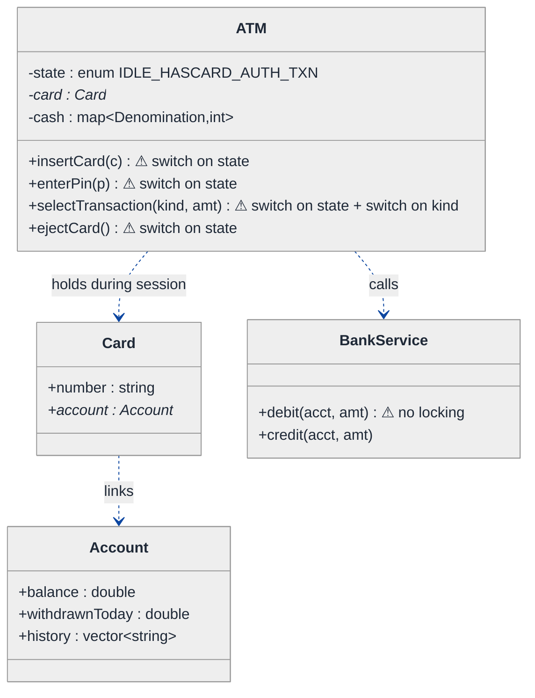
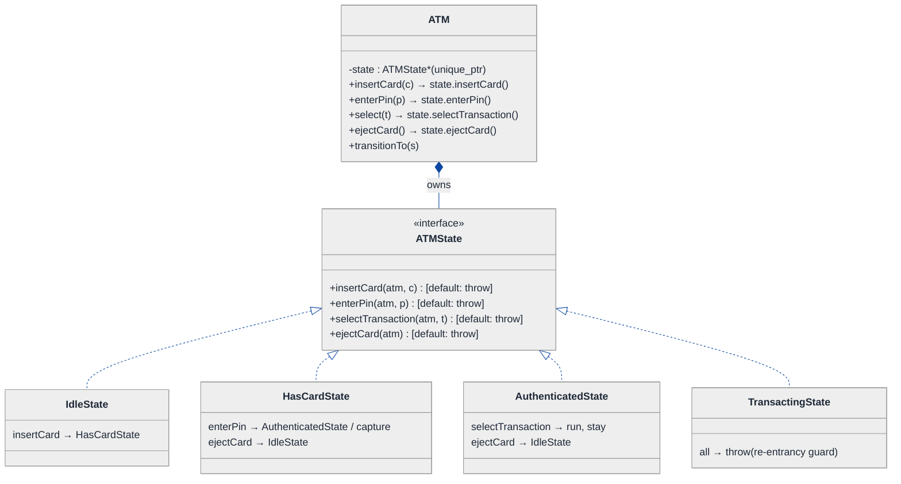
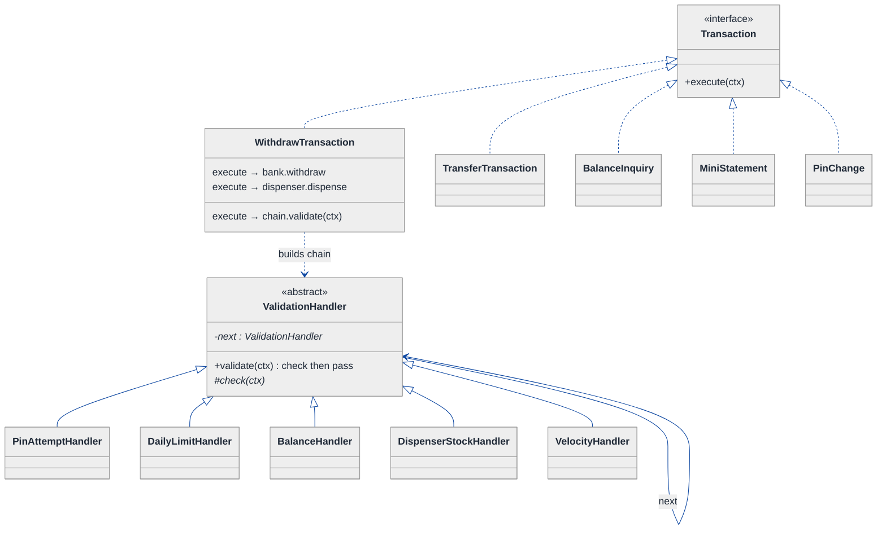
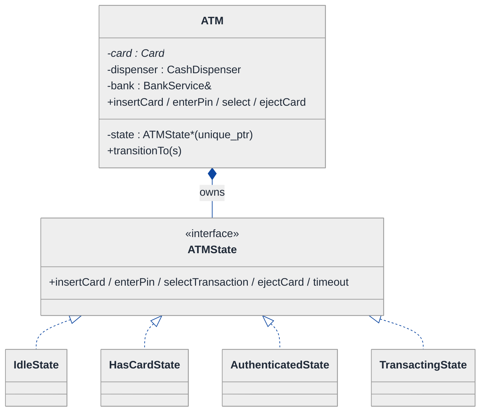
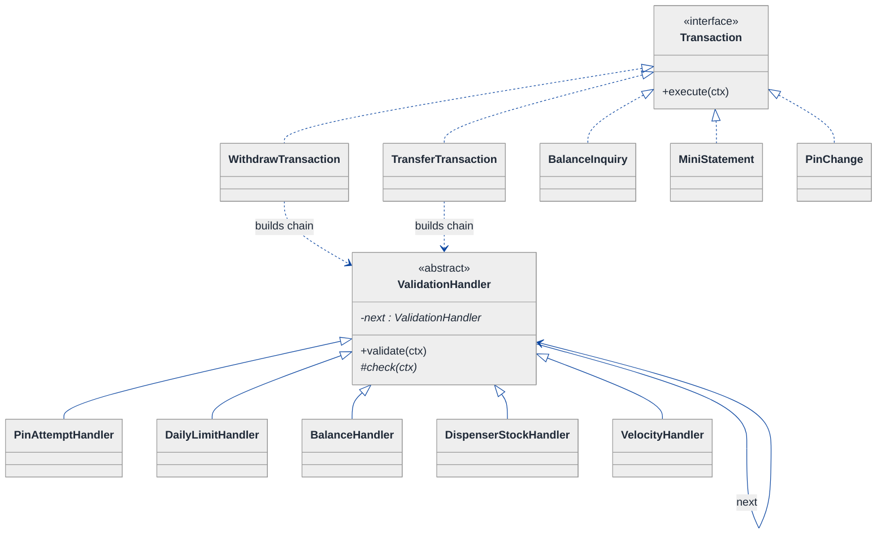
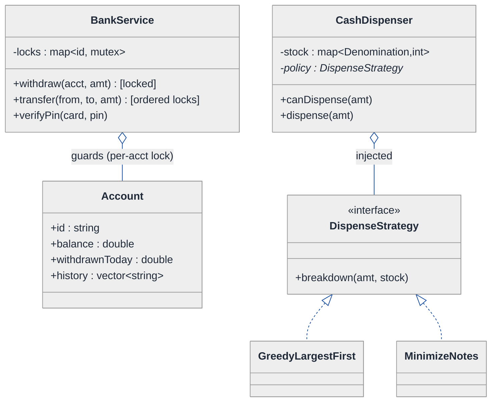
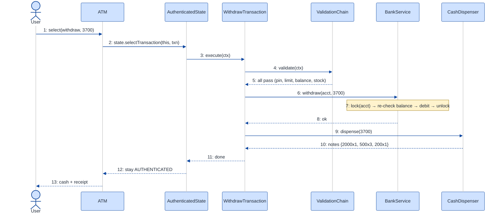

# ATM Machine — LLD Walkthrough

> **Difficulty:** Medium · **Time:** ~30 min · **Pattern focus:** State (ATM lifecycle) + Chain of Responsibility (transaction validation) + concurrency (per-account locking)
>
> **Problem source(s):** GID `ST2`, bucket `State_Pattern` — representative of multiple LeetLens rows in [`./EXTRACTED_QUESTIONS.md`](./EXTRACTED_QUESTIONS.md).
>
> **Diagrams:** inline mermaid (renders natively in GitHub / VS Code). No external binaries.

---

## How to use this file

Paced for a candidate seeing the ATM problem for the first time. Reading time: ~30 minutes if you sketch each iteration by hand. **The lesson: an ATM is two intertwined machines — a session lifecycle (insert card → enter PIN → pick transaction → eject) and a transaction pipeline (validate → execute → record). Don't model either with an enum + giant switch. DERIVE the State pattern for the lifecycle and the Chain of Responsibility for validation by building the naive design first and watching it rot under four hypothetical changes — then bolt on per-account locking for concurrency.**

**Map of this file (15 sections):**

1. Problem statement + clarifying questions
2. Plain-English restatement
3. Why this matters
4. Mental model
5. Try it yourself first
6. Entity & verb extraction
7. **Iteration 1: the naive design** — what we'd write first
8. **Where the naive design hurts** — four future requirements, one painful diff each
9. **Pivot 1: State for the ATM session lifecycle** — internal transitions, not external swaps
10. **Pivot 2: Chain of Responsibility for transaction validation** — handle-or-pass guards
11. **Pivot 3: Strategy for cash dispensing + per-account locking for concurrency**
12. Final UML class diagram
13. Skeleton code (C++)
14. Key flow — sequence diagram
15. Extensibility re-check + anti-patterns + how to think aloud + self-check

---

## 1. Problem statement + clarifying questions

**Prompt (typical phrasing):** "Design an ATM machine supporting cash withdrawal (multiple denominations), balance inquiry, mini statement, PIN change, and fund transfer, with daily withdrawal limits. Handle concurrent access to the same account."

**Clarifying questions to ask BEFORE drawing anything:**

1. **Session model?** One card at a time per machine, single user, with a hard timeout that ejects the card? Or kiosk-style multi-tenant?
2. **Transaction set — fixed or growing?** Just the five listed (withdraw / balance / mini-statement / PIN-change / transfer), or should I expect "deposit," "cardless QR withdraw," "cheque deposit" later?
3. **Denominations + dispensing policy?** Which notes does the machine stock (2000/500/200/100)? Greedy largest-first, or minimize-notes, or honour the bank's preference?
4. **Limit semantics?** Daily withdrawal cap — per card, per account, or per machine? Resets at midnight in which timezone? Does a transfer count against the withdrawal limit?
5. **Concurrency source?** The same account can be hit from two ATMs, plus net-banking, simultaneously. Are we the source of truth for balance, or is there a backend `BankService` we call? (This decides where the lock lives.)
6. **PIN verification — local or remote?** Does the ATM hold the PIN, or call the bank? How many wrong attempts before the card is captured?

**Assumptions if interviewer dodges:** single-card-at-a-time session with an idle timeout; transaction set will GROW; greedy-largest-first dispensing but pluggable; daily cap is per-account, midnight reset, transfers do not count against the withdrawal cap; a backend `BankService` owns persistent balance and we guard each account with a per-account lock; PIN verified remotely, card captured after 3 failures.

---

## 2. Plain-English restatement

We're building the software that runs the box on the wall. It walks a customer through a strict sequence: the machine sits idle, swallows a card, demands a PIN, then offers a menu of transactions, runs the chosen one against the bank, dispenses cash or prints a statement, and finally ejects the card and returns to idle. Two things must stay flexible without rewriting the core flow: **what transactions exist** (more get added), and **what validations a transaction must pass** (limits, balance, PIN-attempts, fraud checks). And because the same bank account can be drained from two machines at once, withdrawals against one account must be **serialized** so the balance can't go negative.

---

## 3. Why this matters

The ATM is the canonical State-pattern interview question because the session is a genuine finite state machine: many operations are *illegal* in the wrong state (you can't withdraw before entering a PIN). Naive candidates encode this as an `enum currentState` plus a switch in every method — and the interviewer watches that switch metastasize. The senior signal is recognizing that (a) the lifecycle is the OBJECT'S concern → State, (b) the variable list of pre-flight checks is a HANDLE-OR-PASS pipeline → Chain of Responsibility, and (c) shared-account safety is a locking-granularity question, not a "make everything synchronized" reflex.

---

## 4. Mental model

An ATM is a **turnstile with a menu**. The turnstile only lets you do the next legal thing; the menu picks which transaction runs; and behind both sits a bank whose balance is a shared resource several turnstiles fight over.

```
Real-world sketch (NOT a UML diagram yet):

   ┌──────────────── ATM (one card at a time) ─────────────────┐
   │                                                            │
   │   IDLE ──insertCard──▶ HAS_CARD ──enterPin──▶ AUTHENTICATED│
   │     ▲                                              │       │
   │     │                                         selectTxn    │
   │   ejectCard                                        ▼       │
   │     │                                       TRANSACTING    │
   │     └──────────────── eject ◀── done ──────────┘           │
   └─────────────────────────────┬──────────────────────────────┘
                                  │ withdraw / transfer
                                  ▼
                         ┌──────────────────┐
            ATM #1 ─────▶│   BankService    │◀───── ATM #2, net-banking
            (lock acct)  │  balance per acct│  (also wants the lock)
                         └──────────────────┘
```

The KEY insight: there are TWO state machines glued together. The **session lifecycle** (IDLE → HAS_CARD → AUTHENTICATED → TRANSACTING → IDLE) is one. The **per-transaction validation pipeline** (PIN ok? limit ok? balance ok? → execute) is the other. They vary independently, so they get different patterns.

---

## 5. Try it yourself first

> **Predict before reading on:**
>
> 1. List the operations a customer can attempt (insertCard, enterPin, selectWithdraw, …). For each, in which session states is it *legal*? You're sketching a transition table — that table IS the State pattern.
> 2. **If I told you that next quarter you'll add "deposit," "cardless QR withdraw," and a "fraud-velocity check that blocks the 6th withdrawal in an hour" — which of those is a new transaction and which is a new validation? Where does each plug in?**
> 3. Two ATMs withdraw from the same account at the same instant, balance is exactly enough for one. What's the smallest thing you must lock to guarantee the balance never goes negative — the whole bank, or one account?

---

## 6. Entity & verb extraction

> **Mini-refresher: noun → class, but not every noun.**
>
> Naive OOD promotes every noun to a class. Senior OOD promotes a noun only if it has both BEHAVIOR and STATE that need to live together. "PIN" stays a field; "ATM session" becomes a class because it has lifecycle behavior; "withdraw transaction" becomes a class because it has an execution step that varies.

**Nouns from the prompt:**

| Noun | Decision | Why |
|---|---|---|
| ATM | Class (top-level coordinator / context) | Holds the current session state, the cash inventory, delegates everything |
| ATMState | Class hierarchy (abstract) | The session lifecycle — derived in §9 |
| Card | Class | Carries card number + links to an account; has no behavior beyond identity |
| Account | Class | Balance, daily-withdrawn-so-far, transaction history |
| Transaction | Class hierarchy (abstract) | Withdraw / Transfer / BalanceInquiry / MiniStatement / PinChange — each `execute()`s differently |
| BankService | Class (backend boundary) | Owns persistent balance; where the per-account lock lives |
| CashDispenser | Class | Holds note inventory; computes a breakdown of notes |
| Denomination | `enum class` | 2000 / 500 / 200 / 100 — typed, no behavior |
| PIN | Field (`std::string` hash) on Card/Account | No behavior of its own |
| Daily limit | Field on Account + a validation rule | Not a class |

**Verbs (and the class they live on):**

| Verb | Owner class (naive answer — we'll re-examine) |
|---|---|
| insertCard(card) | ATM (delegates to state) |
| enterPin(pin) | ATM (delegates to state) |
| selectTransaction(t) | ATM (delegates to state) |
| execute() | Transaction (each subtype differs) |
| validate(ctx) | (naive: inline `if`s; §10 lifts to a Chain) |
| dispense(amount) | CashDispenser |
| debit(acct, amount) / credit(...) | BankService (under lock) |
| ejectCard() | ATM (delegates to state) |

**We have NOT introduced any design patterns yet.** Pure nouns + verbs.

---

## 7. <a id="iter-1"></a>Iteration 1: the naive design

Let's write the simplest thing that could possibly work. No design patterns — an enum for the session state, a switch on transaction type, and inline `if`s for every validation.



**Reader's tour (read top to bottom; ~60 seconds).**

1. **`ATM` is the root and the trouble zone.** It holds a `state` enum, the inserted `card`, and a `cash` inventory map. Every public method (`insertCard`, `enterPin`, `selectTransaction`, `ejectCard`) opens with a `switch (state)` to decide whether the call is even legal right now. Four methods × one switch each = the same transition table copied four times.

2. **`selectTransaction` carries a DOUBLE smell.** It switches on `state` (legal only when AUTHENTICATED) AND switches on `kind` (WITHDRAW vs TRANSFER vs …). Inside the WITHDRAW arm sit the inline validations: PIN-attempt check, daily-limit check, balance check, dispenser-has-notes check — a stack of `if`s.

3. **`Card` and `Account` are plain data.** Card links to an Account; Account holds balance, today's withdrawn total, and a string history. No behavior worth a hierarchy yet — correct.

4. **`BankService::debit` has no lock (⚠).** In the naive single-threaded sketch this is fine. The moment two ATMs share an account, this is the line that lets the balance go negative.

**What's deliberately missing.** No `ATMState` hierarchy — the lifecycle is an enum. No `Transaction` hierarchy — transaction kind is an enum + switch. No validation pipeline — the checks are inline `if`s. No lock. The naive design doesn't even *acknowledge* these are axes of variation. §8 turns each into a concrete future requirement.

Skeleton code for the naive design (C++):

```cpp
#include <map>
#include <mutex>
#include <stdexcept>
#include <string>
#include <vector>

enum class State        { IDLE, HAS_CARD, AUTHENTICATED, TRANSACTING };
enum class Denomination { D2000 = 2000, D500 = 500, D200 = 200, D100 = 100 };
enum class TxnKind      { WITHDRAW, TRANSFER, BALANCE, MINI_STATEMENT, PIN_CHANGE };

struct Account {
    double balance = 0;
    double withdrawnToday = 0;
    std::vector<std::string> history;
};
struct Card { std::string number; Account* account; int pinFails = 0; };

class BankService {
public:
    void debit(Account& a, double amt)  { a.balance -= amt; }  // ⚠ no lock
    void credit(Account& a, double amt) { a.balance += amt; }
};

class ATM {
public:
    void insertCard(Card* c) {
        switch (state_) {                                   // switch #1
            case State::IDLE: card_ = c; state_ = State::HAS_CARD; break;
            default: throw std::runtime_error("Card already inserted");
        }
    }
    void enterPin(const std::string& pin) {
        switch (state_) {                                   // switch #2 (same table)
            case State::HAS_CARD:
                if (!bank_.verifyPin(card_, pin)) {         // (bank_ method elided)
                    if (++card_->pinFails >= 3) { capture(); throw std::runtime_error("Card captured"); }
                    throw std::runtime_error("Wrong PIN");
                }
                state_ = State::AUTHENTICATED; break;
            default: throw std::runtime_error("Insert card first");
        }
    }
    void selectTransaction(TxnKind kind, double amt) {
        if (state_ != State::AUTHENTICATED)                 // switch #3
            throw std::runtime_error("Authenticate first");
        state_ = State::TRANSACTING;
        switch (kind) {                                     // switch on KIND too
            case TxnKind::WITHDRAW: {
                if (amt + card_->account->withdrawnToday > DAILY_LIMIT)  // inline validation
                    throw std::runtime_error("Daily limit exceeded");
                if (amt > card_->account->balance)
                    throw std::runtime_error("Insufficient funds");
                if (!canDispense(amt))
                    throw std::runtime_error("ATM out of notes");
                bank_.debit(*card_->account, amt);
                card_->account->withdrawnToday += amt;
                dispense(amt);
                break;
            }
            case TxnKind::TRANSFER:        /* … another block of inline checks … */ break;
            case TxnKind::BALANCE:         /* … */ break;
            case TxnKind::MINI_STATEMENT:  /* … */ break;
            case TxnKind::PIN_CHANGE:      /* … */ break;
        }
        state_ = State::AUTHENTICATED;
    }
    void ejectCard() {
        switch (state_) {                                   // switch #4 (same table again)
            case State::HAS_CARD: case State::AUTHENTICATED:
                card_ = nullptr; state_ = State::IDLE; break;
            default: throw std::runtime_error("Cannot eject now");
        }
    }
private:
    static constexpr double DAILY_LIMIT = 40000;
    bool canDispense(double) const;  void dispense(double);  void capture();  // elided
    State state_ = State::IDLE;
    Card* card_ = nullptr;
    std::map<Denomination,int> cash_;
    BankService bank_;
};
```

**This works.** It has zero design patterns. We can insert a card, authenticate, withdraw, eject. So what's wrong with it?

---

## 8. <a id="naive-pain"></a>Where the naive design hurts

The interviewer slides a piece of paper across the desk: "Here are four things coming next quarter. Walk me through what changes."

### Change A: "Add a hard idle-timeout that ejects the card from ANY state"

In the naive design:
- A timeout can fire while HAS_CARD, AUTHENTICATED, or TRANSACTING. Each of those is a different cleanup (return card vs. abort txn then return card).
- You add timeout handling to **every** `switch (state_)` — four methods, plus a new `onTimeout()` with its own switch.
- **Smell:** the transition table is copy-pasted across five methods. One new state-sensitive event means editing all five.

### Change B: "Add a 'deposit' transaction and a 'cardless QR withdraw'"

In the naive design:
- Add `DEPOSIT`, `QR_WITHDRAW` to the `TxnKind` enum.
- Add two new `case` arms to the `switch (kind)` inside `selectTransaction` — and that method is already 60 lines.
- **Smell:** every new transaction is surgery inside one ever-growing method. Classic tag-driven switch.

### Change C: "Add a fraud-velocity check: block the 6th withdrawal within an hour"

In the naive design:
- It's a new pre-flight check, so it goes inline with the other `if`s in the WITHDRAW arm.
- But transfers should also be velocity-checked → you copy the `if` into the TRANSFER arm too.
- **Smell:** validations are scattered and duplicated per transaction arm. Re-ordering them (run cheap checks first) means editing each arm.

### Change D: "The same account is now used at two ATMs simultaneously"

In the naive design:
- `BankService::debit` does `balance -= amt` with no lock. Two threads read the same balance, both pass the `if (amt > balance)` check, both debit → **balance goes negative**.
- A reflexive fix is "wrap the whole ATM in a mutex" or "synchronize all of BankService" — but that serializes *unrelated* accounts and kills throughput.
- **Smell:** no locking-granularity story. The check-then-act (validate balance, then debit) is not atomic.

### The pattern of pain

| Change | Files / lines touched | Smell |
|---|---|---|
| A. Idle timeout | 4 `switch(state_)` blocks + new `onTimeout` switch | "Transition table duplicated across every method." |
| B. New transactions | `TxnKind` enum + `switch(kind)` arm (already huge) | "Every transaction is surgery in one function." |
| C. Velocity check | inline `if` copied into WITHDRAW + TRANSFER arms | "Validations scattered and duplicated; order is hard-coded." |
| D. Shared account | `BankService::debit` (no lock); check-then-act not atomic | "No locking granularity; balance can go negative." |

**Three axes of pain dominate:** the session lifecycle (A), the transaction set (B), and the validation pipeline (C) — plus a concurrency correctness gap (D).

> **Pivot question:** "What pattern handles 'a lifecycle where each state allows different operations and decides what's next'? What pattern handles 'a variable, re-orderable list of pass-or-reject checks'? And what's the *smallest* thing I must lock for shared-account safety?"
>
> The answers are State, Chain of Responsibility, and a per-account lock. Let's introduce them one at a time, starting with the most painful axis: the lifecycle.

---

## 9. <a id="pivot-1"></a>Pivot 1: State for the ATM session lifecycle

> **Mini-refresher: State pattern.**
>
> Each lifecycle state is its own class implementing a common interface. The context object (here, `ATM`) delegates every event (`insertCard`, `enterPin`, …) to its CURRENT state object, and THE STATE decides what happens and what the next state is. Transitions are INTERNAL — driven by the events the context receives, not chosen by an outside caller.
>
> Quick example: a `Document` delegates `publish()` to a `DraftState` (→ moves to `Moderation`) or a `PublishedState` (→ throws "already published"). The document never says `if (status == DRAFT)`.

**Why State fits the session.** The choice of "what's legal now" is NOT picked by the caller — it's driven by what the machine has already been through. In IDLE only `insertCard` is meaningful; in HAS_CARD only `enterPin`/`ejectCard`; in AUTHENTICATED only `selectTransaction`/`ejectCard`. Calling `enterPin` while IDLE isn't a thing — it should be rejected by the *type*, not by an `if`. That's textbook State, not Strategy.

**Pattern-discrimination cheatsheet — State vs Strategy.**
- *Strategy:* the CALLER picks which algorithm to use (`atm.setDispensePolicy(x)`); strategies are unaware of each other.
- *State:* the OBJECT picks its next state internally (`state_->enterPin(...)` flips to AuthenticatedState); states know about each other so they can transition.
- *Rule of thumb:* if external code calls `setX(strategy)` → Strategy. If an event flips the internal state via `transitionTo(...)` → State. Here, `enterPin` *causes* the flip from the inside → State.

**The refactor (just the lifecycle slice):**

```cpp
class ATM;  // forward — the context, defined below

class ATMState {
public:
    virtual ~ATMState() = default;
    // Every event every state must answer (default = reject).
    virtual void insertCard(ATM&, Card*)              { throw std::runtime_error("Illegal here"); }
    virtual void enterPin(ATM&, const std::string&)   { throw std::runtime_error("Illegal here"); }
    virtual void selectTransaction(ATM&, Transaction&){ throw std::runtime_error("Illegal here"); }
    virtual void ejectCard(ATM&)                      { throw std::runtime_error("Illegal here"); }
};

class IdleState : public ATMState {
public:
    void insertCard(ATM& atm, Card* c) override;   // → HasCardState
};

class HasCardState : public ATMState {
public:
    void enterPin(ATM& atm, const std::string& pin) override; // verify → AuthenticatedState (or capture)
    void ejectCard(ATM& atm) override;                        // → IdleState
};

class AuthenticatedState : public ATMState {
public:
    void selectTransaction(ATM& atm, Transaction& t) override; // run txn, stay authenticated
    void ejectCard(ATM& atm) override;                         // → IdleState
};
// TransactingState elided — guards against re-entrancy while a txn is mid-flight

class ATM {
public:
    void insertCard(Card* c)            { state_->insertCard(*this, c); }
    void enterPin(const std::string& p) { state_->enterPin(*this, p); }
    void select(Transaction& t)         { state_->selectTransaction(*this, t); }
    void ejectCard()                    { state_->ejectCard(*this); }
    void transitionTo(std::unique_ptr<ATMState> s) { state_ = std::move(s); }
    // getters: card(), bank(), dispenser() …  (elided)
private:
    std::unique_ptr<ATMState> state_ = std::make_unique<IdleState>();
    Card* card_ = nullptr;
};

inline void IdleState::insertCard(ATM& atm, Card* c) {
    /* atm.setCard(c) */ atm.transitionTo(std::make_unique<HasCardState>());
}
```

**What changed — visualized.** Just the lifecycle slice:



**Tour of the after-state.**

1. **The `State` enum is gone.** It's replaced by a `state_` field of type `std::unique_ptr<ATMState>` — exclusive ownership. The ATM owns exactly one state object at a time.

2. **ATM's four public methods became one-liners.** Each delegates: `state_->enterPin(*this, p)`. **No `switch (state_)` anywhere on ATM.** The four-times-copied transition table is gone.

3. **The interface gives every event a DEFAULT that throws.** Each concrete state overrides only the events that are legal in that phase; everything else inherits the "Illegal here" default. So `IdleState` only overrides `insertCard` — call `enterPin` while idle and it hits the base default and rejects. **The class hierarchy IS the legality check.**

4. **Transitions live WITH the state.** `IdleState::insertCard` calls `atm.transitionTo(HasCardState)`. `HasCardState::enterPin` either transitions to `AuthenticatedState` or, on the 3rd failure, captures the card. Each state knows what comes next.

5. **`TransactingState` is a re-entrancy guard.** While a transaction is mid-flight, every event throws — you can't start a second transaction on top of one in progress. (Change A's idle-timeout slots in as one more event method, overridden per state — see below.)

**Change A from §8 now lands cleanly.** Add a `timeout(ATM&)` method to `ATMState` (default: eject + → Idle). Override it only where cleanup differs (`TransactingState::timeout` aborts the txn first). **One method on the interface, overridden where it matters — no five-method edit.**

---

## 10. <a id="pivot-2"></a>Pivot 2: Chain of Responsibility for transaction validation

Changes B and C from §8 are still painful. The transaction *set* grows (B) and the *validations* are scattered, duplicated, and hard to re-order (C). State doesn't help here — the variability is in the work a transaction does and the gauntlet of checks it must clear, not in "what's legal next."

First, lift the transaction set out of the `switch (kind)`:

> **Mini-refresher: polymorphic Transaction (the "replace switch with subtypes" move).**
>
> Each transaction kind becomes a subclass with its own `execute(TxnContext&)`. `selectTransaction` no longer switches on kind — it just calls `t.execute(...)`. New transaction = new subclass, zero edits to existing code (open/closed). This is the same "behavior picked per-object" shape as Strategy, applied to the command-ish `Transaction` object.

Now the validations. A withdrawal must clear, in order: card-not-captured → PIN-attempts-ok → daily-limit-ok → sufficient-balance → dispenser-has-notes. A transfer shares some but not all. The list grows (fraud velocity, Change C) and the order matters (run cheap checks before the network call). That is a **pipeline of pass-or-reject guards** — Chain of Responsibility.

> **Mini-refresher: Chain of Responsibility (CoR).**
>
> A request travels down a linked chain of handlers. Each handler either HANDLES it (here: rejects with a reason) or PASSES it to the next. The sender doesn't know which handler will act, and you can re-order or insert handlers without touching the others.
>
> Quick example: an HTTP middleware stack — auth → rate-limit → logging → controller. Each link inspects the request and calls `next` (or short-circuits).

**Why CoR (not one big `validate()` method).** Each check is independent, the set is open-ended, and the *order* is a configuration concern. CoR makes each check a standalone class you can chain in any order, share across transactions, and extend by inserting one link.

**The refactor (just the validation slice):**

```cpp
struct TxnContext { Account& account; double amount; Card& card; CashDispenser& dispenser; };

class ValidationHandler {
public:
    virtual ~ValidationHandler() = default;
    void setNext(std::unique_ptr<ValidationHandler> n) { next_ = std::move(n); }
    // Template-method skeleton: check here, then pass on.
    void validate(const TxnContext& ctx) {
        check(ctx);                              // throws on reject
        if (next_) next_->validate(ctx);         // else pass down the chain
    }
protected:
    virtual void check(const TxnContext& ctx) = 0;
private:
    std::unique_ptr<ValidationHandler> next_;
};

class DailyLimitHandler : public ValidationHandler {
protected:
    void check(const TxnContext& ctx) override {
        if (ctx.amount + ctx.account.withdrawnToday > DAILY_LIMIT)
            throw std::runtime_error("Daily withdrawal limit exceeded");
    }
};

class BalanceHandler : public ValidationHandler {
protected:
    void check(const TxnContext& ctx) override {
        if (ctx.amount > ctx.account.balance)
            throw std::runtime_error("Insufficient funds");
    }
};

class DispenserStockHandler : public ValidationHandler {
protected:
    void check(const TxnContext& ctx) override {
        if (!ctx.dispenser.canDispense(ctx.amount))
            throw std::runtime_error("ATM cannot dispense this amount");
    }
};
// PinAttemptHandler, VelocityHandler (Change C) elided — same shape

// WithdrawTransaction builds its chain and runs it before touching the bank.
class WithdrawTransaction : public Transaction {
public:
    void execute(TxnContext& ctx) override {
        buildChain()->validate(ctx);        // CoR gauntlet — throws if any link rejects
        ctx.account.bank().withdraw(ctx.account, ctx.amount);  // atomic, see §11
        ctx.dispenser.dispense(ctx.amount);
    }
private:
    std::unique_ptr<ValidationHandler> buildChain();  // chains the handlers in cheap→costly order
};
```

**What changed — visualized.** Just the validation slice:



**Tour of the after-state.**

1. **The `TxnKind` enum and `switch(kind)` are gone.** Each transaction is a `Transaction` subclass with its own `execute(ctx)`. `AuthenticatedState::selectTransaction` just calls `t.execute(...)` — it never asks "which kind is this?"

2. **`ValidationHandler` is an abstract base with a self-referential `next_` pointer.** Its public `validate()` is a tiny template method: run `check()`, then if there's a `next_`, pass the context along. Concrete handlers override only the protected `check()` and throw on rejection.

3. **The chain is data, not code.** `WithdrawTransaction::buildChain()` links `PinAttempt → DailyLimit → Balance → DispenserStock` in cheap-to-costly order. `TransferTransaction` builds a *different* chain (no dispenser-stock, but add a destination-valid check) reusing the SAME handler classes.

4. **Change C (velocity check) is one new link.** Write `VelocityHandler`, splice it into the chain where you want it ordered. **No edits to the other handlers, no edits to `execute`, no edits to any transaction that doesn't want it.** Open/closed.

5. **Validation is now atomic-ready.** Because all checks run as a single `chain.validate(ctx)` immediately before `bank.withdraw`, we can wrap *check + debit* in one critical section in §11 — impossible when the checks were scattered.

**Pattern-discrimination cheatsheet — Chain of Responsibility vs Decorator.**
- *CoR:* each link may SHORT-CIRCUIT (reject and stop); the request might never reach the end. Links typically don't transform the result.
- *Decorator:* every wrapper runs and AUGMENTS the result, passing an enriched value through; nobody short-circuits.
- *Rule of thumb:* "any link can veto and halt" → CoR. "every layer adds something to the output" → Decorator. Validation is a veto pipeline → CoR.

---

## 11. <a id="pivot-3"></a>Pivot 3: Strategy for dispensing + per-account locking for concurrency

Two loose ends from §8 remain: the cash-breakdown algorithm (which the prompt calls out — "multiple denominations") and Change D (shared-account safety).

### 11a. Strategy for the dispense breakdown

How the machine breaks 3,700 into notes is an *algorithm picked by configuration* — greedy-largest-first, minimize-note-count, or honour-bank-preference. That's Strategy (caller/config picks; variants are interchangeable). Same shape as any Strategy you've seen:

```cpp
class DispenseStrategy {
public:
    virtual ~DispenseStrategy() = default;
    // Return note→count, or nullopt if this amount can't be made from stock.
    virtual std::optional<std::map<Denomination,int>>
        breakdown(int amount, const std::map<Denomination,int>& stock) const = 0;
};
class GreedyLargestFirst : public DispenseStrategy { /* peel largest notes first */ };
class MinimizeNotes      : public DispenseStrategy { /* DP / coin-change min-count */ };
// CashDispenser holds a unique_ptr<DispenseStrategy>, injected at construction.
```

`CashDispenser::canDispense(amt)` is now just "does the strategy return a breakdown?" — and the `DispenserStockHandler` from §10 calls exactly that. New policy = new Strategy subclass.

### 11b. Per-account locking for concurrency

> **Mini-refresher: critical section + locking granularity.**
>
> A *critical section* is code that must run atomically — no other thread may interleave. A `std::mutex` enforces it: one thread holds the lock, others wait. *Granularity* is the question of WHAT you lock. Lock too much (the whole bank) and unrelated accounts serialize — terrible throughput. Lock too little and you get races. The right grain is "the smallest unit that must be consistent": here, **one account**.

The bug in §8 was a check-then-act race: thread A and thread B both read balance = 5000, both pass `if (amount <= balance)` for a 5000 withdrawal, both debit → balance = -5000. The fix is to make *validate-balance + debit* one atomic step, guarded by a lock keyed on the account — so two ATMs hitting the **same** account serialize, but two ATMs on **different** accounts run fully in parallel.

```cpp
class BankService {
public:
    // Atomic check-then-act, scoped to ONE account's lock.
    void withdraw(Account& acct, double amount) {
        std::lock_guard<std::mutex> guard(lockFor(acct));   // per-account lock
        if (amount > acct.balance)                          // re-check INSIDE the lock
            throw std::runtime_error("Insufficient funds");
        acct.balance         -= amount;                     // debit
        acct.withdrawnToday  += amount;                     // limit bookkeeping, same critical section
        acct.history.push_back("WD " + std::to_string(amount));
    }
    // transfer locks BOTH accounts in a fixed global order to avoid deadlock.
    void transfer(Account& from, Account& to, double amount) {
        auto& a = lockFor(from); auto& b = lockFor(to);
        std::scoped_lock guard(std::min(&a,&b) == &a ? a : b,  // ordered acquisition
                               std::min(&a,&b) == &a ? b : a);
        // … check + debit from + credit to … (elided)
    }
private:
    std::mutex& lockFor(const Account& a) {                  // one mutex per account id
        std::lock_guard<std::mutex> g(mapMutex_);
        return locks_[a.id];
    }
    std::unordered_map<std::string, std::mutex> locks_;
    std::mutex mapMutex_;
};
```

**Two subtle but interview-critical points.**

1. **The balance check moves INSIDE the lock.** The §10 `BalanceHandler` is a *fast-fail pre-check* (good UX — reject early without acquiring the lock), but it is NOT the source of truth. The authoritative check-then-act is re-done inside `withdraw` under the lock. Pre-check for friendliness; re-check for correctness.

2. **Transfer takes two locks → deadlock risk.** Thread 1 locks A then waits on B; thread 2 locks B then waits on A. The fix is a **global lock ordering** (always acquire the lower account-id first), shown via the ordered `scoped_lock`. This is the classic "lock ordering prevents deadlock" answer.

> **Note:** in a real distributed bank the lock isn't an in-process `std::mutex` — it's a row lock / optimistic-version check / distributed lock in the backend `BankService`. The *principle* (atomic check-then-act at account granularity) is identical; only the lock implementation changes. Say this out loud in the interview.

---

## 12. <a id="fig-class-diagram"></a>Final class diagram

One big diagram is a wall of boxes. Here are **three focused sub-views**, each addressing a different concern. Read them in order; the structural insight at the end ties them together.

### 12.1 The session lifecycle — State, owned by ATM



**Tour of 12.1.** The ATM owns ONE `ATMState` via `unique_ptr` (filled diamond = composition / same lifetime). Each event method on ATM is a one-line delegate to the current state. The `timeout` event (Change A) is just one more method on the interface, overridden per state. No enum, no switch.

### 12.2 The transaction + validation pipeline — polymorphic Transaction over a CoR chain



**Tour of 12.2.** Five transaction subclasses behind one `execute(ctx)` interface — adding "deposit" (Change B) is one new subclass. Each transaction *builds* its own ordered chain from the shared pool of `ValidationHandler`s; the self-referential `next` arrow is the chain link. Adding "velocity check" (Change C) is one new handler spliced into the chain.

### 12.3 The bank + cash — concurrency boundary and dispense Strategy



**Tour of 12.3.** `BankService` is the concurrency boundary: a per-account mutex map means same-account withdrawals serialize while different accounts run in parallel; `transfer` acquires two locks in a fixed order to avoid deadlock. `CashDispenser` holds an injected `DispenseStrategy` (open diamond = aggregation) so the breakdown algorithm is swappable.

### Structural insight (ties 12.1 + 12.2 + 12.3 together)

| Concern | Pattern used | Why |
|---|---|---|
| **Session lifecycle** (Idle → HasCard → Auth → Transacting) | State, OWNED by ATM | The machine decides what's legal next; transitions are internal |
| **Transaction set** (withdraw / transfer / …) | Polymorphic subtypes (Command-ish) | Each `execute()`s differently; new kind = new subclass |
| **Validation gauntlet** (PIN / limit / balance / stock / velocity) | Chain of Responsibility | Open-ended, re-orderable, any link can veto |
| **Cash breakdown** (greedy / minimize-notes) | Strategy, injected into CashDispenser | Algorithm picked by config; variants interchangeable |
| **Shared-account safety** | Per-account lock (granular critical section) | Smallest consistent unit is one account |

The big lesson: **State for the lifecycle, CoR for the veto-pipeline, Strategy for the swappable algorithm** — three GoF patterns, each matched to a *different shape* of variability, plus a concurrency answer that's about *granularity*, not a global lock.

---

## 13. Skeleton code (C++)

> Show the SHAPES, not the full impl. ~130 lines.

```cpp
#include <map>
#include <memory>
#include <mutex>
#include <optional>
#include <stdexcept>
#include <string>
#include <unordered_map>
#include <vector>

// ── Forward declarations ────────────────────────────────────────────
class ATM;
class Transaction;

// ── Domain data ─────────────────────────────────────────────────────
enum class Denomination { D2000 = 2000, D500 = 500, D200 = 200, D100 = 100 };

struct Account {
    std::string id;
    double balance = 0;
    double withdrawnToday = 0;
    std::vector<std::string> history;
};
struct Card { std::string number; Account* account; int pinFails = 0; };

// ── Concurrency boundary: per-account locking ───────────────────────
class BankService {
public:
    void withdraw(Account& a, double amt) {
        std::lock_guard<std::mutex> g(lockFor(a));     // per-account critical section
        if (amt > a.balance) throw std::runtime_error("Insufficient funds");
        a.balance -= amt; a.withdrawnToday += amt;
        a.history.push_back("WD " + std::to_string(amt));
    }
    void transfer(Account& from, Account& to, double amt);  // ordered locks — elided
    bool verifyPin(Card*, const std::string&) const;        // remote — elided
private:
    std::mutex& lockFor(const Account& a) {
        std::lock_guard<std::mutex> g(mapMutex_);
        return locks_[a.id];
    }
    std::unordered_map<std::string, std::mutex> locks_;
    std::mutex mapMutex_;
};

// ── Cash dispensing: Strategy ───────────────────────────────────────
class DispenseStrategy {
public:
    virtual ~DispenseStrategy() = default;
    virtual std::optional<std::map<Denomination,int>>
        breakdown(int amount, const std::map<Denomination,int>& stock) const = 0;
};
class GreedyLargestFirst : public DispenseStrategy {
public:
    std::optional<std::map<Denomination,int>>
    breakdown(int amount, const std::map<Denomination,int>& stock) const override; // elided
};
// MinimizeNotes elided

class CashDispenser {
public:
    CashDispenser(std::map<Denomination,int> stock, std::unique_ptr<DispenseStrategy> p)
        : stock_(std::move(stock)), policy_(std::move(p)) {}
    bool canDispense(int amt) const { return policy_->breakdown(amt, stock_).has_value(); }
    void dispense(int amt);  // subtract notes — elided
private:
    std::map<Denomination,int>       stock_;
    std::unique_ptr<DispenseStrategy> policy_;
};

// ── Validation: Chain of Responsibility ─────────────────────────────
struct TxnContext { Account& account; double amount; Card& card; CashDispenser& dispenser; BankService& bank; };

class ValidationHandler {
public:
    virtual ~ValidationHandler() = default;
    ValidationHandler* setNext(std::unique_ptr<ValidationHandler> n) { next_ = std::move(n); return next_.get(); }
    void validate(const TxnContext& ctx) { check(ctx); if (next_) next_->validate(ctx); }
protected:
    virtual void check(const TxnContext& ctx) = 0;
private:
    std::unique_ptr<ValidationHandler> next_;
};
class DailyLimitHandler : public ValidationHandler {
protected:
    void check(const TxnContext& c) override {
        if (c.amount + c.account.withdrawnToday > 40000) throw std::runtime_error("Daily limit");
    }
};
// BalanceHandler, DispenserStockHandler, PinAttemptHandler, VelocityHandler — same shape, elided

// ── Transactions: polymorphic execute() ─────────────────────────────
class Transaction {
public:
    virtual ~Transaction() = default;
    virtual void execute(TxnContext& ctx) = 0;
};
class WithdrawTransaction : public Transaction {
public:
    void execute(TxnContext& ctx) override {
        buildChain()->validate(ctx);              // CoR gauntlet
        ctx.bank.withdraw(ctx.account, ctx.amount); // atomic
        ctx.dispenser.dispense(static_cast<int>(ctx.amount));
    }
private:
    std::unique_ptr<ValidationHandler> buildChain();  // elided
};
// TransferTransaction, BalanceInquiry, MiniStatement, PinChange — elided

// ── Session lifecycle: State ────────────────────────────────────────
class ATMState {
public:
    virtual ~ATMState() = default;
    virtual void insertCard(ATM&, Card*)               { throw std::runtime_error("Illegal here"); }
    virtual void enterPin(ATM&, const std::string&)    { throw std::runtime_error("Illegal here"); }
    virtual void selectTransaction(ATM&, Transaction&) { throw std::runtime_error("Illegal here"); }
    virtual void ejectCard(ATM&)                       { throw std::runtime_error("Illegal here"); }
    virtual void timeout(ATM&);   // default: eject + → Idle (elided)
};
class IdleState          : public ATMState { public: void insertCard(ATM&, Card*) override; };
class HasCardState       : public ATMState { public: void enterPin(ATM&, const std::string&) override; void ejectCard(ATM&) override; };
class AuthenticatedState : public ATMState { public: void selectTransaction(ATM&, Transaction&) override; void ejectCard(ATM&) override; };
// TransactingState elided

class ATM {
public:
    ATM(BankService& bank, CashDispenser disp) : bank_(bank), dispenser_(std::move(disp)) {}
    void insertCard(Card* c)            { state_->insertCard(*this, c); }
    void enterPin(const std::string& p) { state_->enterPin(*this, p); }
    void select(Transaction& t)         { state_->selectTransaction(*this, t); }
    void ejectCard()                    { state_->ejectCard(*this); }
    void transitionTo(std::unique_ptr<ATMState> s) { state_ = std::move(s); }
    BankService&  bank()      { return bank_; }
    CashDispenser& dispenser(){ return dispenser_; }
    Card*         card() const { return card_; }
    void          setCard(Card* c) { card_ = c; }
private:
    std::unique_ptr<ATMState> state_ = std::make_unique<IdleState>();
    BankService&  bank_;
    CashDispenser dispenser_;
    Card*         card_ = nullptr;
};
```

---

## 14. <a id="fig-sequence"></a>Key flow — sequence diagram

The withdrawal flow is where all four ideas cooperate: State routes the events, the Transaction runs, the CoR chain validates, and the per-account lock keeps it correct under contention.



**Tour of the withdrawal flow. Read it slowly — it's the moment all the patterns cooperate.**

1. **User selects withdraw; ATM delegates to its state.** `ATM::select` is a one-liner: `state_->selectTransaction(*this, txn)`. **If the user weren't authenticated, `state_` would be `HasCardState`, whose base default throws "Illegal here" — no `if` on ATM.** That's the State pattern guarding legality (step 1→2).

2. **AuthenticatedState calls `txn.execute(ctx)`.** The state doesn't know or care WHICH transaction — withdraw, transfer, balance all look identical from here. Polymorphism dispatches (step 3).

3. **The transaction runs the CoR chain first.** `chain.validate(ctx)` walks PIN-attempt → daily-limit → balance → dispenser-stock. Any link throws and the whole thing aborts before a single rupee moves. The pre-check is a fast, friendly fail (step 4→5).

4. **`BankService::withdraw` is the atomic heart (step 6→8).** Note 7 is the critical section: acquire the per-account lock, **re-check the balance inside the lock** (the §10 check was advisory), debit, release. A second ATM hitting the same account blocks here; a second ATM on a different account sails through in parallel.

5. **Only after the debit succeeds does cash dispense (step 9→10).** The injected `DispenseStrategy` computes the note breakdown. Ordering matters: debit-then-dispense, never dispense-then-debit.

6. **Control unwinds; the state stays AUTHENTICATED.** The user can run another transaction without re-entering the PIN. Eventually `ejectCard` flips back to `IdleState`.

### The validation that's NOT shown — and why it matters

You don't see `if (state == AUTHENTICATED)` or `switch (txnKind)` anywhere in this diagram. **Legality is enforced by which state object receives the event (polymorphism), and behavior is selected by which Transaction subclass runs (polymorphism)** — not by runtime checks scattered through the code. The class hierarchies ARE the validation.

---

## 15. Extensibility re-check + anti-patterns + how to think aloud + self-check

### Extensibility re-check

Revisit the four changes from [§8](#naive-pain). For each, name the SINGLE class that changes.

| Change | Naive design impact | Final design impact |
|---|---|---|
| A. Idle timeout | 4 `switch(state_)` blocks + new switch | Add `timeout` to `ATMState`; override only where cleanup differs. |
| B. Deposit / QR withdraw | `TxnKind` enum + `switch(kind)` arm | New `DepositTransaction : Transaction` subclass. Done. |
| C. Velocity fraud check | inline `if` copied per arm | New `VelocityHandler : ValidationHandler`, spliced into the chain. Done. |
| D. Shared account | `debit` had no lock; race | Already handled — per-account lock in `BankService::withdraw`. |

Every change is one new class (or one new method on an interface). That's the open/closed principle in practice. If a future requirement makes you change `ATM`, `Transaction`, AND `BankService` together — go back to §6 and re-identify variability points; you missed one.

### Common confusion + traps

1. **"Why State and not Strategy for the lifecycle?"** Because the caller doesn't pick the state — the *events* drive transitions internally. `setState(Authenticated)` is never called by client code; `enterPin` causes the flip from inside `HasCardState`. Caller picks → Strategy; object transitions → State.

2. **"Why CoR and not just a `validate()` method with a list of checks?"** A list works until you need different orders per transaction, shared checks across transactions, and insert-a-check-without-touching-others. CoR makes each check a first-class, reorderable, reusable object.

3. **"Why not synchronize all of `BankService`?"** It serializes unrelated accounts and tanks throughput. The smallest consistent unit is one account → lock per account.

4. **"Why re-check the balance inside the lock if the chain already checked it?"** The chain check is advisory (good UX, runs lock-free). Between the advisory check and the debit, another thread can change the balance. Only the in-lock re-check is authoritative. Check-then-act must be atomic.

5. **"Is `BankService` a Singleton?"** Resist the reflex. There may be test doubles, multiple regions. Inject it into the ATM; don't reach for a global.

### Anti-patterns

- **"Enum + switch state machine"** — the `switch (currentState)` copied into every method. Replace with State classes.
- **"God method `selectTransaction`"** — one method that switches on kind and inlines every validation. Split into Transaction subtypes + a CoR chain.
- **"Global lock for concurrency"** — `synchronized` everything. Wrong granularity; lock per account.
- **"Check-then-act without atomicity"** — validate balance, then debit, with a gap in between. Classic TOCTOU race; the negative-balance bug.
- **"Deadlock-prone transfer"** — locking two accounts without a fixed order. Always acquire in a global order.
- **"Anemic Transaction"** — a data bag with a `kind` tag instead of an `execute()`. Put the behavior on the subclass.

### How to think aloud

> "ATM. Let me clarify scope. [Asks the §1 questions.] One card at a time, growing transaction set, per-account daily limit, shared accounts hit from multiple machines.
>
> Nouns: ATM, ATMState, Card, Account, Transaction, BankService, CashDispenser. Two state machines jump out — the session lifecycle and the per-transaction validation gauntlet.
>
> I'll write the NAIVE design first — an enum for state with a switch in every method, a switch on transaction kind, inline `if`s for validation, an unlocked debit.
>
> Now I stress-test it. Idle-timeout → the transition table is copied across five methods. New transactions → surgery in one giant switch. Fraud velocity check → validations scattered and duplicated. Shared account → unlocked check-then-act goes negative.
>
> Three patterns, one per axis. Pivot 1: the lifecycle is a State machine — Idle/HasCard/Authenticated/Transacting classes, each overriding only its legal events; the base defaults throw. Pivot 2: transactions become polymorphic subtypes, and validation becomes a Chain of Responsibility — each check a reorderable handler that can veto. Pivot 3: dispensing is a Strategy, and concurrency is solved with a per-account lock plus an in-lock re-check; transfers acquire two locks in a fixed order to avoid deadlock.
>
> Final design: ATM owns an ATMState; transactions run a CoR chain then call BankService under a per-account lock. Every future requirement lands as one new class. Open/closed."

### Self-check

> **Self-check — the question to ask next time.**
>
> When you see "design a [machine] with steps, a menu of operations, and shared state," before reaching for an enum + switch, ask three things:
>
> > **1. Is the variation a lifecycle the OBJECT transitions through? → State.**
> > **2. Is it an open-ended, re-orderable list of pass-or-veto checks? → Chain of Responsibility.**
> > **3. What is the SMALLEST unit that must stay consistent under concurrency? → lock at that granularity, and make check-then-act atomic.**
>
> Lifecycle → State. Veto-pipeline → CoR. Swappable algorithm → Strategy. Shared mutable state → the narrowest lock that's still correct.

---

## Cross-references

- **Parent topic manifest:** [`./EXTRACTED_QUESTIONS.md`](./EXTRACTED_QUESTIONS.md)
- **Vertical overview:** [`../../LEARNING.md`](../../LEARNING.md)
- **Template:** [`../../TEMPLATE-v2.md`](../../TEMPLATE-v2.md)
- **Canonical exemplar:** [`../Object_Oriented_Design/Parking_Lot.md`](../Object_Oriented_Design/Parking_Lot.md) — Strategy + State, the gold-standard walkthrough
- **Related v2 walkthroughs:**
  - State Pattern deep-dive — sibling files in this `State_Pattern/` directory
  - Chain of Responsibility deep-dive — `../Chain_of_Responsibility/`
  - Strategy Pattern deep-dive — `../Strategy_Pattern/`
- **Further reading:** <a href="https://refactoring.guru/design-patterns/state" target="_blank" rel="noopener noreferrer">State pattern (refactoring.guru)</a> · <a href="https://refactoring.guru/design-patterns/chain-of-responsibility" target="_blank" rel="noopener noreferrer">Chain of Responsibility (refactoring.guru)</a> · <a href="https://en.cppreference.com/w/cpp/thread/scoped_lock" target="_blank" rel="noopener noreferrer">std::scoped_lock (cppreference)</a>
