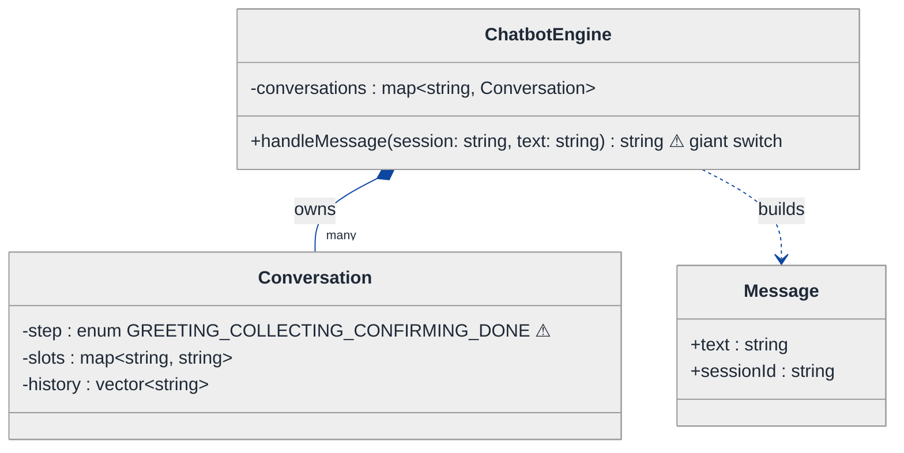
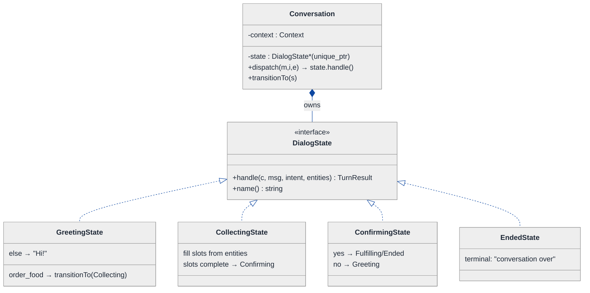
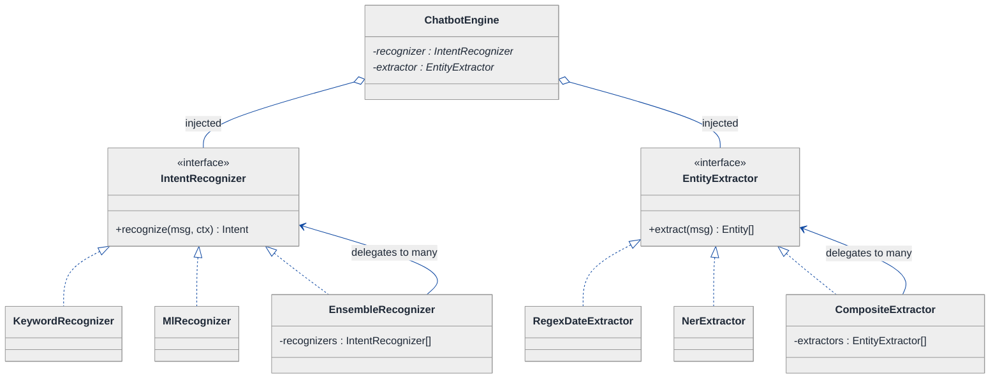
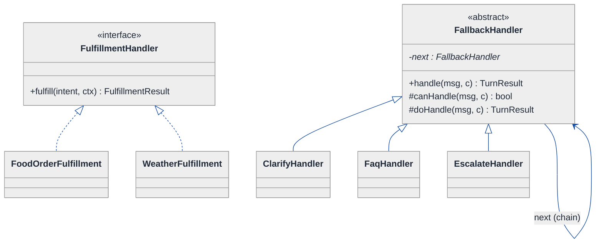
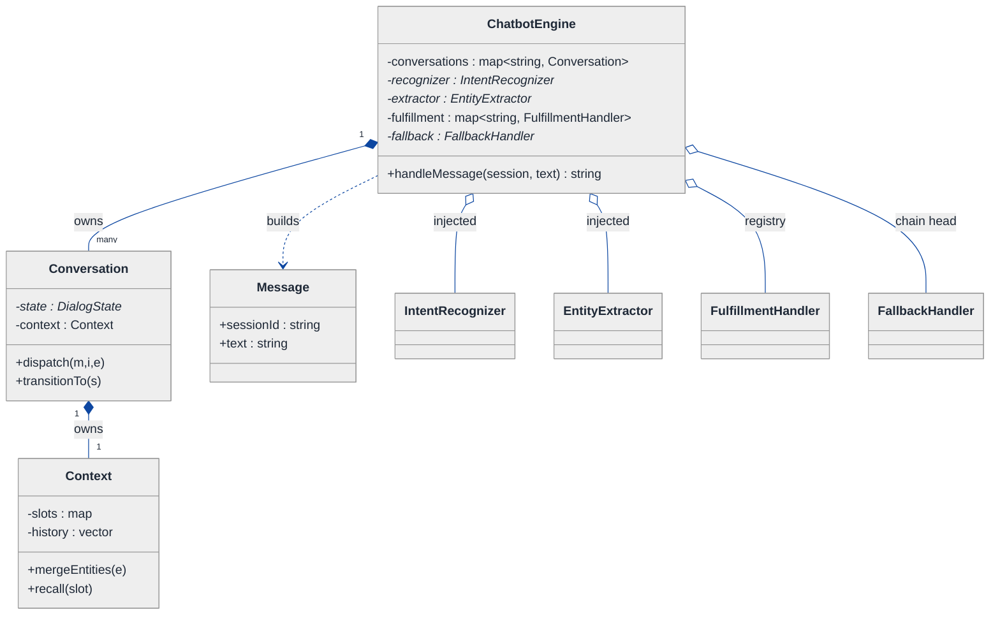
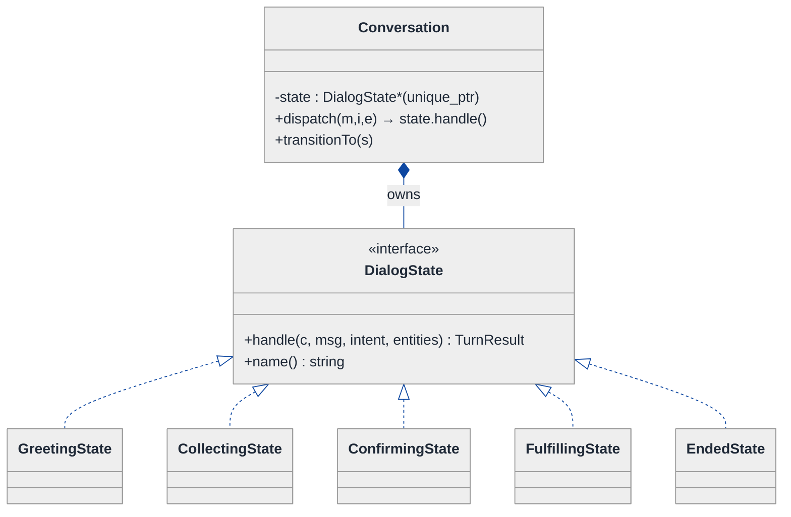
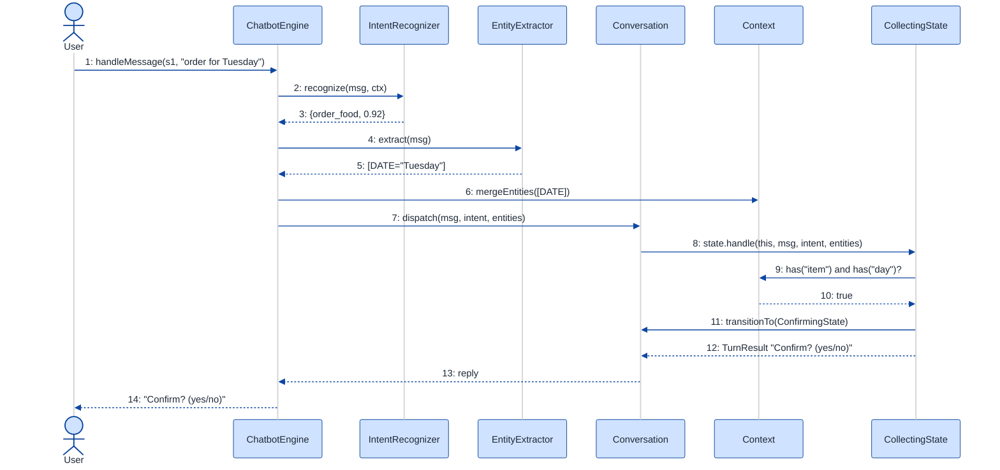
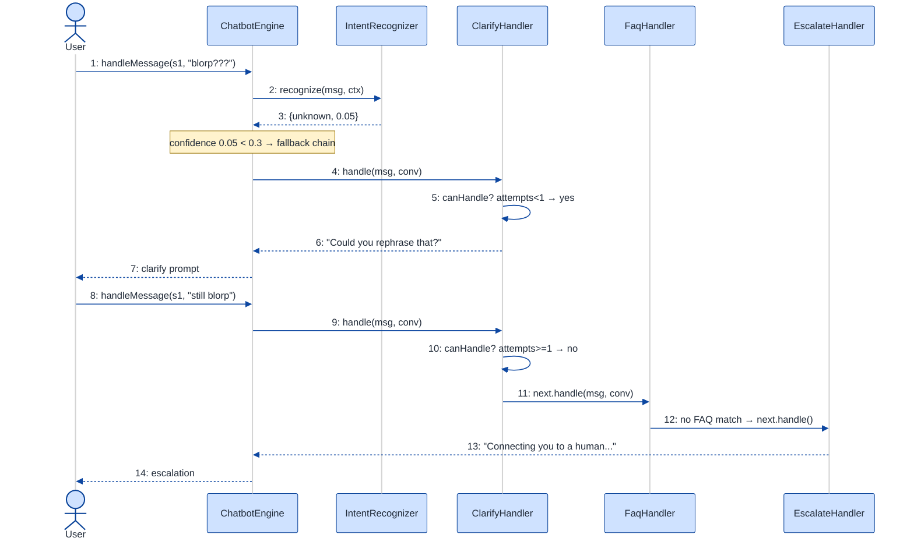

# Chatbot Framework — LLD Walkthrough

> **Difficulty:** Hard · **Time:** ~45 min · **Pattern focus:** State (conversation lifecycle) + Strategy (intent recognition, entity extraction, fulfillment)
>
> **Problem source(s):** GID `ST10`, bucket `State_Pattern`. Representative of the "design an extensible conversational engine" family of LLD prompts.
>
> **Diagrams:** inline mermaid (renders natively in GitHub / VS Code). The canonical light-theme block is copied verbatim into every diagram.

---

## How to use this file

Paced for a candidate seeing "design a chatbot framework" for the first time. Reading time: ~45 minutes if you sketch each iteration by hand. **The lesson: a conversation is a state machine, and almost everything plugged into it (how we recognize intent, how we pull out entities, how we fulfill a request) is a swappable algorithm. Don't reach for one giant `handleMessage()` switch — DERIVE the State + Strategy split by building the naive version first, watching it rot under four hypothetical changes, then fixing one painful axis at a time.**

**Map of this file (15 sections):**

1. Problem statement + clarifying questions
2. Plain-English restatement
3. Why this matters
4. Mental model
5. Try it yourself first
6. Entity & verb extraction
7. **Iteration 1: the naive design** — one big `handleMessage` switch
8. **Where the naive design hurts** — four future requirements, one painful diff each
9. **Pivot 1: State for conversation lifecycle** — the most painful axis first
10. **Pivot 2: Strategy for the NLU pipeline** — intent recognition + entity extraction
11. **Pivot 3: Strategy for fulfillment + Chain of Responsibility for fallback**
12. Final UML class diagram (three sub-views)
13. Skeleton code (C++)
14. Key flow — sequence diagram
15. Extensibility re-check + anti-patterns + how to think aloud + self-check

---

## 1. Problem statement + clarifying questions

**Prompt (typical phrasing):** "Design a chat bot framework supporting intent recognition, entity extraction, conversation state management, context tracking across turns, fallback handling, and integration with external APIs for fulfillment."

**Clarifying questions to ask BEFORE drawing anything:**

1. **Single bot or a framework?** Are we shipping ONE assistant, or a reusable engine that many bots (food ordering, banking, support) plug into? (This decides how aggressively we abstract — I'll assume a reusable framework, since the word "framework" is in the prompt.)
2. **What does "conversation state" mean here?** A simple "waiting for slot X" tracker, or a full multi-step dialog with branching (greeting → collecting slots → confirming → fulfilling)? Do we need to resume a half-finished conversation after the user wanders off-topic?
3. **Is intent recognition pluggable?** Regex/keyword for v1, but will we swap in an ML classifier (or an LLM) later? Do multiple recognizers run and vote, or just one?
4. **Entity extraction — same question.** Rule-based (dates, amounts) vs. an NER model? Can a turn carry entities that fill slots from EARLIER turns (context tracking)?
5. **Fallback policy?** When confidence is low or no intent matches, do we re-prompt, escalate to a human, or run a default "I didn't get that" handler? Is there a tiered fallback (try clarify → try FAQ → escalate)?
6. **Fulfillment / external APIs?** Synchronous HTTP calls? What happens on timeout or a 500 — retry, apologize, queue? Are there many backends (weather, payments, CRM)?
7. **Concurrency?** Many simultaneous conversations — is each conversation's state isolated? (Yes — assume one `Conversation` object per session.)
8. **Channels?** Slack, web widget, SMS — one engine, many transports? (Assume the engine is channel-agnostic; a thin adapter feeds it text.)

**Assumptions if the interviewer dodges:** a reusable framework; multi-step slot-filling dialogs; pluggable intent + entity components (regex now, ML later); tiered fallback; synchronous external fulfillment with timeout handling; one `Conversation` per session, single-threaded per session; channel-agnostic core.

---

## 2. Plain-English restatement

We're building the engine that sits behind a chat assistant. Every time a user types a message, the engine has to: figure out what the user WANTS (intent), pull the useful nouns out of the sentence (entities like a date, a city, an amount), remember what was said on previous turns (context), decide what to do next given where the conversation currently IS (state), call out to some backend if the request is actionable (fulfillment), and gracefully recover when it has no idea what the user meant (fallback). The design must let us swap the intent recognizer, add new entity types, add new dialog steps, and add new fulfillment backends **without rewriting the message-handling core**.

---

## 3. Why this matters

This question probes whether you recognize a **state machine hiding inside an event loop**. Junior candidates write one `handleMessage()` that grows a forest of `if (currentStep == ...)` branches — it works in the demo and collapses in code review. The senior move is to see two orthogonal things: a conversation is a *lifecycle* (greeting → collecting → confirming → done), which is the State pattern; and the NLU/fulfillment pieces are *interchangeable algorithms*, which is Strategy. The same skeleton reappears in workflow engines, checkout flows, IVR phone trees, and game AI. If you can derive it here, you can derive it anywhere a thing "moves through phases while delegating the work to pluggable policies."

---

## 4. Mental model

A chatbot is a **receptionist with a clipboard**. The clipboard (context) records what's been gathered so far. The receptionist is always in some *posture* — just greeted you, currently collecting your details, confirming before acting, or wrapping up. Each posture changes how the SAME incoming sentence is interpreted. And the receptionist outsources the hard thinking: a "translator" decides what you want, a "form-filler" pulls out the details, and a "back office" actually does the work.

```
Real-world sketch (NOT a UML diagram yet):

   user text ──► [ NLU desk ]──► intent + entities
                     │                  │
                     ▼                  ▼
   ┌────────────────────────────────────────────────┐
   │  Conversation (holds the clipboard / context)   │
   │                                                  │
   │   posture:  Greeting → Collecting → Confirming   │
   │                              │         → Fulfilling → Ended
   │                              ▼                     │
   │            "what's valid to do NEXT" depends on    │
   │             which posture I'm currently in         │
   └────────────────────────────┬───────────────────────┘
                                 ▼
                          [ Back office ]  ← external APIs
                          (fulfillment)
                                 │
                       (no idea?) ▼
                          [ Fallback ladder ]
```

The KEY insight from this picture: the **posture is the conversation's own concern** (the user doesn't pick it; the dialog flow drives it) — that's State. The **NLU desk and back office are interchangeable specialists** the conversation delegates to — that's Strategy. Separating "where am I in the dialog" from "how do I do each step" is the whole design.

---

## 5. Try it yourself first

> **Predict before reading on:**
>
> 1. List 5 nouns you'd promote to a class. List 3 nouns you'd leave as plain fields.
> 2. **If I told you the same incoming message ("Tuesday") means a DIFFERENT thing depending on whether the bot just asked "what day?" vs. nothing at all — where does that branching logic live? On the message? On a giant switch? Somewhere else?**
> 3. If intent recognition must move from regex to an ML model next quarter without touching the dialog code, what's the seam you'd carve today?

---

## 6. Entity & verb extraction

> **Mini-refresher: noun → class, but not every noun.**
>
> Naive OOD promotes every noun to a class. Senior OOD promotes a noun only if it has both BEHAVIOR and STATE that need to live together. "Confidence score" stays a field; "Conversation" becomes a class because it owns lifecycle behavior.

**Nouns from the prompt:**

| Noun | Decision | Why |
|---|---|---|
| ChatbotEngine | Class (top-level coordinator) | Receives messages, orchestrates one turn |
| Conversation | Class | Owns the per-session context + current dialog state |
| Message | Class (value object) | The user's raw turn: text + metadata |
| Intent | Class / value object | Name + confidence; the recognized goal |
| Entity | Class / value object | Type + value + span (e.g., DATE="Tuesday") |
| Context | Class | The clipboard — accumulated slots + history across turns |
| DialogState | Class hierarchy (State) | Greeting / Collecting / Confirming / Fulfilling / Ended |
| IntentRecognizer | Interface (Strategy) | Regex now, ML later — pluggable |
| EntityExtractor | Interface (Strategy) | Rule-based now, NER later — pluggable |
| FulfillmentHandler | Interface (Strategy) | Calls an external API per intent |
| FallbackHandler | Chain (Chain of Responsibility) | Tiered recovery when nothing matches |
| Confidence | Field on Intent (`double`) | No behavior of its own |
| Channel / session id | Field on Message / Conversation (`std::string`) | No domain behavior |

**Verbs (and the class they live on):**

| Verb | Owner class (naive answer — we'll re-examine) |
|---|---|
| handleMessage(text) | ChatbotEngine, delegating to Conversation |
| recognizeIntent(msg) | IntentRecognizer |
| extractEntities(msg) | EntityExtractor |
| handle(msg, intent, entities) | DialogState (current posture) |
| transitionTo(state) | Conversation |
| fulfill(intent, context) | FulfillmentHandler |
| handleFallback(msg) | FallbackHandler chain |
| remember(slot, value) / recall(slot) | Context |

**We have NOT introduced any design patterns yet** — but the noun table already smells two of them out (DialogState as a hierarchy, the three pluggable interfaces). We'll EARN those over the next sections rather than assert them.

---

## 7. <a id="iter-1"></a>Iteration 1: the naive design

Let's write the simplest thing that could possibly work. No design patterns — one engine, one `handleMessage`, branching on a `step` enum.



**Reader's tour (read top to bottom; ~60 seconds).**

1. **At the top — `ChatbotEngine` is the root.** It owns a map of `sessionId → Conversation` and exposes ONE public method, `handleMessage(session, text)`. Every decision — recognize, extract, branch on step, fulfill, fall back — lives inside this single method. That ⚠ is the future trouble zone.

2. **The ownership spine.** The filled diamond (`◆`) marks composition: the engine OWNS its conversations. Kill the engine, every conversation dies with it. That part is fine and stays fine.

3. **`Conversation` is a data bag.** It holds a `step` enum (⚠), a `slots` map (the context), and a `history` vector. Notice there's NO behavior on it — all the logic that READS `step` lives up in the engine's switch. This is the classic "anemic object + fat coordinator" smell.

4. **`Message` is a value object.** Text plus a session id. No behavior. That's correct — it stays a value object all the way to the final design.

**What's deliberately missing.** No `IntentRecognizer`. No `EntityExtractor`. No `DialogState` hierarchy. No `FulfillmentHandler`. No fallback chain. The naive design doesn't even acknowledge these as axes that vary — it inlines a hardcoded answer for each inside `handleMessage`. That's exactly what §8 will expose.

Skeleton code for the naive design (C++):

```cpp
#include <map>
#include <string>
#include <vector>

enum class Step { GREETING, COLLECTING, CONFIRMING, DONE };

struct Message {
    std::string sessionId;
    std::string text;
};

struct Conversation {
    Step step = Step::GREETING;
    std::map<std::string, std::string> slots;   // the "context"
    std::vector<std::string>           history;
};

class ChatbotEngine {
public:
    std::string handleMessage(const std::string& session, const std::string& text) {
        Conversation& c = conversations_[session];   // creates if missing
        c.history.push_back(text);

        // ── 1. intent recognition: inlined keyword matching ──
        std::string intent = "unknown";
        if (text.find("order") != std::string::npos)  intent = "order_food";
        else if (text.find("hi") != std::string::npos) intent = "greet";

        // ── 2. entity extraction: inlined regex-ish scraping ──
        std::string day;
        if (text.find("Tuesday") != std::string::npos) day = "Tuesday";  // hardcoded

        // ── 3. the giant lifecycle switch ── (this is the rot)
        switch (c.step) {
            case Step::GREETING:
                if (intent == "order_food") { c.step = Step::COLLECTING; return "What would you like?"; }
                return "Hi! How can I help?";
            case Step::COLLECTING:
                if (!day.empty()) c.slots["day"] = day;
                if (c.slots.count("item") && c.slots.count("day")) {
                    c.step = Step::CONFIRMING;
                    return "Confirm order for " + c.slots["day"] + "? (yes/no)";
                }
                c.slots["item"] = text;       // crude
                return "For which day?";
            case Step::CONFIRMING:
                if (text == "yes") {
                    // ── 4. fulfillment: inlined HTTP call ──
                    // httpPost("https://api.food.example/order", c.slots); (elided)
                    c.step = Step::DONE;
                    return "Ordered!";
                }
                c.step = Step::GREETING;
                return "Cancelled.";
            case Step::DONE:
                return "This conversation is over.";
        }
        // ── 5. fallback: a single catch-all ──
        return "Sorry, I didn't understand.";
    }
private:
    std::map<std::string, Conversation> conversations_;
};
```

**This works.** It has zero design patterns. It greets, collects slots, confirms, fulfills, and falls back. So what's wrong with it?

---

## 8. <a id="naive-pain"></a>Where the naive design hurts

The interviewer slides four new requirements across the desk: "Here's the roadmap for next quarter. Walk me through what changes."

### Change A: "Add a 'cancel order' dialog with its own multi-step flow (reason → confirm)"

In the naive design:
- `Step` enum gains `CANCEL_REASON`, `CANCEL_CONFIRM`.
- `handleMessage`'s switch grows two new `case` blocks.
- Worse, the existing cases must now decide whether a "cancel" intent should interrupt them — so `GREETING` and `COLLECTING` both get new `if (intent == "cancel")` branches.
- **One new feature → edits in four places inside one 50-line method.** Adding any dialog step touches every existing step.

### Change B: "Swap keyword intent matching for an ML classifier (and run BOTH, taking the higher confidence)"

In the naive design:
- The intent block is hardcoded `text.find(...)` inside `handleMessage`.
- To add ML you rip out the keyword block and paste in model-call code — and there's nowhere to "run both and compare," because intent recognition was never a *thing*, it was three lines.
- **Touches the same method everyone else is editing; no seam to extend at; can't compose two recognizers.**

### Change C: "Entities must carry across turns — if the user said 'Tuesday' three turns ago, don't ask again"

In the naive design:
- Context IS the `slots` map, but extraction is one-shot inline (`if text contains Tuesday`).
- Cross-turn logic ("did we already capture day?") is smeared across the `COLLECTING` case with `if (c.slots.count("day"))` checks.
- Adding a new entity type (amount, city) means new inline scraping + new slot-presence checks in multiple cases.
- **Entity logic and context-merge logic are tangled into the lifecycle switch.**

### Change D: "The food API can time out — on failure, apologize and offer to retry; if it 500s twice, escalate to a human"

In the naive design:
- The HTTP call is a comment inside `case CONFIRMING`.
- Error handling (timeout, retry, escalate) has nowhere to live except more nested `if`s inside that case.
- Fallback today is a single bottom-of-method `return "Sorry..."` — it can't express a LADDER (clarify → FAQ → human).
- **Fulfillment errors and the fallback policy both collapse into ad-hoc branches.**

### The pattern of pain

| Change | Files / sites touched | Smell |
|---|---|---|
| A. Cancel flow | `Step` enum + 4 `case` blocks in `handleMessage` | "Every new dialog step edits every existing step." |
| B. ML intent | the inline intent block | "Algorithm hardcoded; no seam; can't compose two recognizers." |
| C. Cross-turn entities | `COLLECTING` case + scattered slot checks | "Entity + context logic tangled into the lifecycle switch." |
| D. API failure + tiered fallback | `CONFIRMING` case + bottom-of-method catch-all | "Fulfillment errors and fallback can't be expressed as a policy." |

**Two axes of pain dominate.** First, **lifecycle variability** — the dialog moves through phases, and "what's valid next" depends on the phase (Change A). Second, **algorithm variability** — intent recognition, entity extraction, and fulfillment are each a pluggable strategy (Changes B, C, D), and fallback is a chain of pluggable strategies.

> **Pivot question:** "What pattern handles 'a lifecycle where each phase interprets the same input differently and decides the next phase'? And what pattern handles 'an algorithm picked/swapped externally'?"
>
> The answers are State and Strategy. Let's introduce them one at a time, starting with the most painful axis: the lifecycle switch (Change A is the one that touches everything).

---

## 9. <a id="pivot-1"></a>Pivot 1: State for the conversation lifecycle

The `switch (c.step)` is the worst offender — every new dialog step (Change A) forces edits to every existing step. The variability here is NOT in an algorithm; it's in **what's valid to do next, which depends on where the conversation currently is.**

> **Mini-refresher: State pattern.**
>
> Each lifecycle state is its own class. The context object delegates an event (here, `handle(message, ...)`) to its CURRENT state object, and THE STATE decides both what to do and what the next state is. Transitions are INTERNAL — driven by the events the context receives, not chosen by the caller.
>
> Quick example: a vending machine. `NoCoinState::selectItem()` says "insert coin first"; `HasCoinState::selectItem()` dispenses and transitions back to `NoCoinState`. The machine never asks the outside world "what state should I be in" — each state knows its own successor.

**Why State fits the dialog.** The user doesn't say "put me in CONFIRMING." The conversation arrives at CONFIRMING because the COLLECTING phase finished filling its slots. Each phase reacts to the SAME `Message` differently: in GREETING, "Tuesday" is noise; in COLLECTING, "Tuesday" fills the `day` slot. The phase owns "what's legal next." That's textbook State, not Strategy (the caller never picks the phase).

**The refactor (just the lifecycle part):**

```cpp
class Conversation;   // forward — holds context + current state
struct Intent;        // { std::string name; double confidence; };
struct Entity  { std::string type, value; };

struct TurnResult { std::string reply; };

// ── State interface ──────────────────────────────────────────────
class DialogState {
public:
    virtual ~DialogState() = default;
    // each state interprets the same (message, intent, entities) its own way
    virtual TurnResult handle(Conversation& c,
                              const Message& msg,
                              const Intent& intent,
                              const std::vector<Entity>& entities) = 0;
    virtual const char* name() const = 0;
};

class GreetingState : public DialogState {
public:
    TurnResult handle(Conversation& c, const Message&, const Intent& intent,
                      const std::vector<Entity>&) override;          // see below
    const char* name() const override { return "Greeting"; }
};

class CollectingState : public DialogState {
public:
    TurnResult handle(Conversation& c, const Message& msg, const Intent&,
                      const std::vector<Entity>& entities) override;  // see below
    const char* name() const override { return "Collecting"; }
};

class ConfirmingState : public DialogState {
public:
    TurnResult handle(Conversation& c, const Message& msg, const Intent&,
                      const std::vector<Entity>&) override;
    const char* name() const override { return "Confirming"; }
};

class EndedState : public DialogState {
public:
    TurnResult handle(Conversation&, const Message&, const Intent&,
                      const std::vector<Entity>&) override {
        return { "This conversation has ended." };
    }
    const char* name() const override { return "Ended"; }
};

class Conversation {
public:
    Conversation() : state_(std::make_unique<GreetingState>()) {}
    void transitionTo(std::unique_ptr<DialogState> s) { state_ = std::move(s); }
    TurnResult dispatch(const Message& m, const Intent& i, const std::vector<Entity>& e) {
        return state_->handle(*this, m, i, e);   // ONE line — no switch
    }
    Context& context() { return context_; }
private:
    std::unique_ptr<DialogState> state_;
    Context                      context_;
};

// A state knows its own successor:
TurnResult GreetingState::handle(Conversation& c, const Message&,
                                 const Intent& intent, const std::vector<Entity>&) {
    if (intent.name == "order_food") {
        c.transitionTo(std::make_unique<CollectingState>());
        return { "What would you like, and for which day?" };
    }
    return { "Hi! How can I help?" };
}
```

**What changed — visualized.** Just the lifecycle slice:



**Tour of the after-state.**

1. **The `Step` enum is gone.** It's replaced by a `state` field of type `DialogState*` — specifically `std::unique_ptr<DialogState>` (exclusive ownership). The conversation OWNS exactly one current state.

2. **`Conversation::dispatch` is a one-liner.** It just calls `state_->handle(*this, ...)`. **No `switch (step)` anywhere.** The branching that filled `handleMessage` evaporated into polymorphic dispatch.

3. **The interface declares the contract.** `DialogState` is an abstract base with one meaty pure-virtual method, `handle(...)`, returning a `TurnResult`. Every concrete state must implement it.

4. **Four concrete states, each self-contained.** `GreetingState` transitions to `CollectingState` on an order intent; `CollectingState` fills slots and transitions to `ConfirmingState` when complete; `ConfirmingState` branches on yes/no; `EndedState` is terminal.

5. **Where the transitions happen.** Each state calls `c.transitionTo(...)` itself when its work is done. **The transition logic lives WITH the state**, not in `Conversation` and not in `ChatbotEngine`.

**Change A from §8 now lands cleanly.** A "cancel order" flow is two new classes — `CancelReasonState` and `CancelConfirmState` — plus the existing states deciding to transition INTO them on a cancel intent. You write the new state's `handle` and its transitions; you do NOT edit a shared switch. (If you want "cancel can interrupt anything," that's a single guard you can factor into a shared base `handle` — see §15.)

**Pattern-discrimination cheatsheet — State vs Strategy.**
- *Strategy:* the CALLER picks which algorithm to use; strategies are usually unaware of each other.
- *State:* the OBJECT picks its next state internally; states know about each other (each state's `handle` can `transitionTo` another).
- *Rule of thumb:* if `context.setX(thing)` is called by external code → Strategy. If `context.handle(event)` flips the internal phase → State.

We chose State for the dialog because no external caller ever says "go to CONFIRMING" — the conversation arrives there because COLLECTING finished. That's an internal, event-driven transition.

---

## 10. <a id="pivot-2"></a>Pivot 2: Strategy for the NLU pipeline

Changes B and C from §8 are still painful: intent recognition is hardcoded keyword matching with no seam to swap in ML (and no way to run two recognizers), and entity extraction is inline scraping tangled into the lifecycle. Neither is a *lifecycle* problem — State doesn't help. The variability is in the ALGORITHM itself.

> **Mini-refresher: Strategy pattern.**
>
> Encapsulates an algorithm behind an interface so it can be swapped at runtime. The CALLER decides which strategy to use; the strategy doesn't know about its peers.
>
> Quick example: a `Sorter` takes a `CompareStrategy*` in its constructor. Pass `Ascending` or `Descending` — the sorter doesn't care which.

**Why Strategy fits the NLU pipeline.** Intent recognition is `Message → Intent`. It varies (keyword, ML classifier, LLM, an ensemble). The choice is made externally, by framework configuration — the conversation doesn't pick it. Entity extraction is `Message → vector<Entity>`, same story. Both are algorithms picked by the caller. Textbook Strategy.

**The refactor (just the NLU slice):**

```cpp
// ── Intent recognition strategy ───────────────────────────────────
class IntentRecognizer {
public:
    virtual ~IntentRecognizer() = default;
    virtual Intent recognize(const Message& msg, const Context& ctx) const = 0;
};

class KeywordRecognizer : public IntentRecognizer {
public:
    Intent recognize(const Message& msg, const Context&) const override {
        if (msg.text.find("order")  != std::string::npos) return { "order_food", 0.6 };
        if (msg.text.find("cancel") != std::string::npos) return { "cancel",     0.6 };
        return { "unknown", 0.0 };
    }
};

class MlRecognizer : public IntentRecognizer {       // swapped in for Change B
public:
    Intent recognize(const Message& msg, const Context&) const override {
        // model_.predict(msg.text) → {label, score};  (elided)
        return { /* label */ "order_food", /* score */ 0.92 };
    }
};

// Compose two recognizers and keep the more confident — also a Strategy
class EnsembleRecognizer : public IntentRecognizer {
public:
    EnsembleRecognizer(std::vector<std::unique_ptr<IntentRecognizer>> rs)
        : recognizers_(std::move(rs)) {}
    Intent recognize(const Message& msg, const Context& ctx) const override {
        Intent best{ "unknown", 0.0 };
        for (const auto& r : recognizers_) {
            Intent i = r->recognize(msg, ctx);
            if (i.confidence > best.confidence) best = i;
        }
        return best;
    }
private:
    std::vector<std::unique_ptr<IntentRecognizer>> recognizers_;
};

// ── Entity extraction strategy ────────────────────────────────────
class EntityExtractor {
public:
    virtual ~EntityExtractor() = default;
    virtual std::vector<Entity> extract(const Message& msg) const = 0;
};

class RegexDateExtractor : public EntityExtractor { /* DATE entities — elided */ };
class NerExtractor       : public EntityExtractor { /* model-based — elided */ };
class CompositeExtractor : public EntityExtractor {  // run several, merge results
public:
    explicit CompositeExtractor(std::vector<std::unique_ptr<EntityExtractor>> es)
        : extractors_(std::move(es)) {}
    std::vector<Entity> extract(const Message& msg) const override {
        std::vector<Entity> all;
        for (const auto& e : extractors_) {
            auto part = e->extract(msg);
            all.insert(all.end(), part.begin(), part.end());
        }
        return all;
    }
private:
    std::vector<std::unique_ptr<EntityExtractor>> extractors_;
};
```

Cross-turn context (Change C) belongs to `Context`, not the extractor — the extractor pulls entities from THIS message; the `Context` merges them with prior turns so we never re-ask:

```cpp
class Context {
public:
    void mergeEntities(const std::vector<Entity>& es) {
        for (const auto& e : es) slots_[e.type] = e.value;   // last-write-wins
    }
    bool   has(const std::string& slot) const { return slots_.count(slot) > 0; }
    std::string recall(const std::string& slot) const {
        auto it = slots_.find(slot); return it == slots_.end() ? "" : it->second;
    }
    void appendHistory(const std::string& text) { history_.push_back(text); }
private:
    std::map<std::string, std::string> slots_;
    std::vector<std::string>           history_;
};
```

**What changed — visualized.** Just the NLU slice:



**Tour of the after-state.**

1. **`ChatbotEngine` gained two injected fields.** `recognizer` and `extractor`, each a pointer to an interface, INJECTED at construction (open diamond `◇` = aggregation: the engine uses them but framework config decides which concrete one). The hardcoded `text.find(...)` block is GONE from the engine's turn logic.

2. **Two `<<interface>>` boxes, one narrow contract each.** `recognize(msg, ctx) → Intent` and `extract(msg) → Entity[]`. Note `recognize` also takes `Context` — so an ML recognizer can use prior-turn signals if it wants, without the engine knowing.

3. **`EnsembleRecognizer` and `CompositeExtractor` are COMPOSITES of their own interface.** `EnsembleRecognizer` holds a `vector<IntentRecognizer*>`, runs all, keeps the highest confidence. That's Change B's "run both and take the higher" — expressible now because intent recognition is a first-class strategy. `CompositeExtractor` runs several extractors and merges their entities.

4. **Change C lives where it belongs.** Cross-turn merging is `Context::mergeEntities` (last-write-wins) — the extractor only knows about THIS message; the context owns accumulation across turns. Adding a new entity type is a new `EntityExtractor` plugged into the composite — no edits to the lifecycle states.

**Pattern-discrimination cheatsheet — Strategy vs Decorator.**
- *Strategy:* swap a WHOLE algorithm behind an interface; the caller picks one.
- *Decorator:* wrap one implementation in another of the SAME interface to ADD behavior, delegating to the inner one.
- *Rule of thumb:* "pick one of N" → Strategy. "this one PLUS extra behavior, transparently" → Decorator.

`EnsembleRecognizer`/`CompositeExtractor` are composites (they fan out to many peers and combine), not decorators (which wrap exactly one and add a layer). We picked Strategy because the framework selects the recognizer; composition over the same interface is what makes "run several and combine" fall out for free.

---

## 11. <a id="pivot-3"></a>Pivot 3: Strategy for fulfillment + Chain of Responsibility for fallback

Change D is still open: fulfillment is a comment inside a state, error handling has no home, and fallback is a single bottom-of-method catch-all that can't express a ladder. There are really two sub-axes here.

**Sub-axis 1 — fulfillment is an algorithm per intent.** "Place a food order," "check the weather," "look up a balance" are each a `(Intent, Context) → FulfillmentResult` algorithm that calls a different backend. Picked by intent, swappable, with its own error handling. That's Strategy again — same shape as Pivot 2.

```cpp
struct FulfillmentResult { bool ok; std::string reply; bool shouldEscalate = false; };

class FulfillmentHandler {
public:
    virtual ~FulfillmentHandler() = default;
    virtual FulfillmentResult fulfill(const Intent& intent, const Context& ctx) = 0;
};

class FoodOrderFulfillment : public FulfillmentHandler {
public:
    FulfillmentResult fulfill(const Intent&, const Context& ctx) override {
        // POST https://api.food.example/order with ctx.recall("item"/"day")
        // try { auto r = http_.post(...); return { true, "Ordered for " + ... }; }
        // catch (TimeoutError&) { return { false, "The kitchen is slow — retry?" }; }
        // on 2nd failure: return { false, "Let me get a human.", /*escalate*/ true };
        return { true, "Ordered!" };   // (HTTP + retry/escalate logic elided)
    }
};
class WeatherFulfillment : public FulfillmentHandler { /* GET weather API — elided */ };
// other handlers elided; registry maps intent.name → handler
```

**Sub-axis 2 — fallback is a LADDER of handlers, each gets a chance.** Change D wants: try to clarify → try an FAQ answer → escalate to a human. That's not "pick one algorithm" — it's "pass the message down a chain until someone handles it." That's a different pattern.

> **Mini-refresher: Chain of Responsibility.**
>
> A request travels down a linked list of handlers. Each handler either HANDLES it (and stops the chain) or PASSES it to the next. The sender doesn't know which handler will deal with it. New tiers slot in by linking a node.
>
> Quick example: an expense-approval chain — team lead handles ≤$1k, director ≤$10k, VP above. Each either approves or forwards up.

> **Mini-refresher (discrimination): Chain of Responsibility vs Strategy.**
>
> *Strategy* picks exactly ONE algorithm and runs it. *Chain* offers the request to several handlers IN ORDER until one accepts. Use Strategy when the caller knows which one applies; use Chain when "try these in priority order, stop at the first that can cope" — exactly the tiered-fallback requirement.

```cpp
class FallbackHandler {
public:
    virtual ~FallbackHandler() = default;
    void setNext(std::unique_ptr<FallbackHandler> next) { next_ = std::move(next); }

    // template method: try me, else pass down the chain
    TurnResult handle(const Message& msg, Conversation& c) {
        if (canHandle(msg, c)) return doHandle(msg, c);
        if (next_) return next_->handle(msg, c);
        return { "Sorry, I still didn't get that." };   // end of chain
    }
protected:
    virtual bool      canHandle(const Message&, Conversation&) const = 0;
    virtual TurnResult doHandle(const Message&, Conversation&)       = 0;
private:
    std::unique_ptr<FallbackHandler> next_;
};

class ClarifyHandler : public FallbackHandler {        // tier 1: re-prompt once
protected:
    bool canHandle(const Message&, Conversation& c) const override { return c.context().clarifyAttempts() < 1; }
    TurnResult doHandle(const Message&, Conversation& c) override { c.context().bumpClarify(); return { "Could you rephrase that?" }; }
};
class FaqHandler      : public FallbackHandler { /* tier 2: knowledge-base lookup — elided */ };
class EscalateHandler : public FallbackHandler {       // tier 3: always handles
protected:
    bool canHandle(const Message&, Conversation&) const override { return true; }
    TurnResult doHandle(const Message&, Conversation&) override { return { "Connecting you to a human agent..." }; }
};
```

**What changed — visualized.** Fulfillment Strategy + the fallback Chain:



**Tour of the after-state.**

1. **Fulfillment is a Strategy family.** `FulfillmentHandler` interface; one concrete handler per intent (`FoodOrderFulfillment`, `WeatherFulfillment`, ...). The retry/timeout/escalate logic for Change D lives INSIDE the relevant handler, returning a `FulfillmentResult` that can flag `shouldEscalate`. Adding a backend = one new class registered against an intent name.

2. **Fallback is a Chain, not a Strategy.** `FallbackHandler` is an ABSTRACT base (not an interface) — it carries the `next_` pointer and a template-method `handle()` that tries `canHandle`/`doHandle` then delegates down. The self-reference (`FallbackHandler --> FallbackHandler : next`) is the chain link.

3. **The tiers are ordered nodes.** `ClarifyHandler` (re-prompt once) → `FaqHandler` (knowledge base) → `EscalateHandler` (always handles, the terminal node). Reordering tiers or inserting a new one is a wiring change at construction, not an edit to any handler.

4. **Why not stuff fallback into a Strategy too?** Because a Strategy picks ONE. Fallback needs "try clarify, and if that doesn't apply, try FAQ, and if THAT doesn't apply, escalate." The "try in order, stop at first that copes" semantics is exactly Chain of Responsibility.

> **Mini-refresher: why three independent Strategy hierarchies don't share one interface.**
>
> Strategy is a *role*, not a type. `IntentRecognizer`, `EntityExtractor`, and `FulfillmentHandler` have nothing in common at the type level (different inputs, different outputs). Don't try to unify them under a single `Strategy<In,Out>` template — that's premature genericism that buys nothing and obscures intent.

---

## 12. <a id="fig-class-diagram"></a>Final class diagram

Drawing the whole design in one diagram is a wall of boxes. Here are **three focused sub-views**, each addressing a concern. Read them in order; the structural insight at the end ties them together.

### 12.1 The orchestration spine — what the engine OWNS and USES



**Tour of 12.1.** The filled diamonds (`◆`) are composition — the engine OWNS its conversations; each conversation OWNS its context. The open diamonds (`◇`) are aggregation — the engine USES four pluggable policy seams (recognizer, extractor, a fulfillment registry, a fallback chain head) that framework config injects. The naive design's one fat `handleMessage` is now a thin orchestrator: recognize → extract → merge into context → dispatch to state → (on no-match) run the fallback chain.

### 12.2 The dialog lifecycle — Conversation's State pattern



**Tour of 12.2.** `Conversation` owns exactly one `DialogState` via `unique_ptr` (filled diamond). `dispatch` is a one-liner that delegates to the current state; each state's `handle` interprets the same `(message, intent, entities)` for its phase and calls `transitionTo` to advance. `FulfillingState` (the phase that invokes the chosen `FulfillmentHandler`) joins the four from Pivot 1; `EndedState` is terminal. Adding a new dialog step is exactly ONE new state class.

### 12.3 The pluggable policies — three Strategies + one Chain

```mermaid
---
config:
  theme: neutral
  themeVariables:
    background: '#ffffff'
    primaryColor: '#cfe2ff'
    primaryTextColor: '#1f2937'
    primaryBorderColor: '#084298'
    secondaryColor: '#fff3cd'
    secondaryTextColor: '#1f2937'
    secondaryBorderColor: '#664d03'
    tertiaryColor: '#d1e7dd'
    tertiaryTextColor: '#1f2937'
    tertiaryBorderColor: '#0a3622'
    lineColor: '#0d47a1'
    textColor: '#1f2937'
    noteBkgColor: '#fff3cd'
    noteTextColor: '#1f2937'
    noteBorderColor: '#997404'
    actorBkg: '#cfe2ff'
    actorBorder: '#084298'
    actorTextColor: '#1f2937'
    signalColor: '#0d47a1'
    signalTextColor: '#1f2937'
    labelBoxBkgColor: '#ffffff'
    labelBoxBorderColor: '#d3d3d3'
    labelTextColor: '#1f2937'
    edgeLabelBackground: '#ffffff'
    labelBackground: '#ffffff'
    classText: '#1f2937'
    fontFamily: 'system-ui, -apple-system, Segoe UI, Helvetica, Arial, sans-serif'
---
classDiagram
  direction TB
  class IntentRecognizer {
    <<interface>>
    +recognize(msg, ctx)
  }
  class EntityExtractor {
    <<interface>>
    +extract(msg)
  }
  class FulfillmentHandler {
    <<interface>>
    +fulfill(intent, ctx)
  }
  class FallbackHandler {
    <<abstract>>
    -next : FallbackHandler*
    +handle(msg, c)
  }
  class KeywordRecognizer
  class MlRecognizer
  class EnsembleRecognizer
  class RegexDateExtractor
  class NerExtractor
  class FoodOrderFulfillment
  class WeatherFulfillment
  class ClarifyHandler
  class FaqHandler
  class EscalateHandler
  IntentRecognizer <|.. KeywordRecognizer
  IntentRecognizer <|.. MlRecognizer
  IntentRecognizer <|.. EnsembleRecognizer
  EntityExtractor <|.. RegexDateExtractor
  EntityExtractor <|.. NerExtractor
  FulfillmentHandler <|.. FoodOrderFulfillment
  FulfillmentHandler <|.. WeatherFulfillment
  FallbackHandler <|-- ClarifyHandler
  FallbackHandler <|-- FaqHandler
  FallbackHandler <|-- EscalateHandler
  FallbackHandler --> FallbackHandler : next
```



**Tour of 12.3.** Three Strategy roles (`IntentRecognizer`, `EntityExtractor`, `FulfillmentHandler`) — each an interface with a tiny family of concrete impls, each picked by config or by intent. The fourth seam, `FallbackHandler`, is an ABSTRACT base with a `next` self-link: that's the Chain of Responsibility. The visual tell: Strategy interfaces have impls dangling below but no self-reference; the Chain base references ITSELF.

### Structural insight (ties 12.1 + 12.2 + 12.3 together)

| Concern | Pattern used | Why |
|---|---|---|
| **Lifecycle** (Greeting → Collecting → Confirming → Fulfilling → Ended) | State, OWNED by Conversation | The conversation drives transitions internally; each phase validates what's legal next |
| **Intent recognition** | Strategy, INJECTED into engine | Algorithm picked by config (keyword / ML / ensemble) |
| **Entity extraction** | Strategy, INJECTED into engine | Same — rule-based or NER, composable |
| **Context tracking** | Plain stateful object (Context) | Just accumulated slots + history; no polymorphism needed |
| **Fulfillment** | Strategy, REGISTERED per intent | One backend-calling algorithm per intent name |
| **Fallback** | Chain of Responsibility | "Try tiers in order, stop at the first that copes" |

The big lesson: **inheritance is used only for the state and strategy class families** — the conversation's *lifecycle* is State (object-driven transitions), every *interchangeable algorithm* is Strategy (caller/config-driven), and the *ordered recovery ladder* is Chain. *State for phases, Strategy for swappable work, Chain for tiered recovery.* `Context` stays a plain object because it has no behavioral variation — resist the urge to pattern-ify everything.

---

## 13. Skeleton code (C++)

> Show the SHAPES, not the full impl. ~140 lines.

```cpp
#include <map>
#include <memory>
#include <string>
#include <utility>
#include <vector>

// ── Value objects ───────────────────────────────────────────────────
struct Message { std::string sessionId; std::string text; };
struct Intent  { std::string name; double confidence = 0.0; };
struct Entity  { std::string type;  std::string value; };
struct TurnResult        { std::string reply; };
struct FulfillmentResult { bool ok; std::string reply; bool shouldEscalate = false; };

// ── Context: accumulated slots + history across turns ───────────────
class Context {
public:
    void mergeEntities(const std::vector<Entity>& es) {
        for (const auto& e : es) slots_[e.type] = e.value;   // last-write-wins
    }
    bool        has(const std::string& slot) const { return slots_.count(slot) > 0; }
    std::string recall(const std::string& slot) const {
        auto it = slots_.find(slot); return it == slots_.end() ? std::string{} : it->second;
    }
    void appendHistory(const std::string& t) { history_.push_back(t); }
    int  clarifyAttempts() const { return clarify_; }
    void bumpClarify()           { ++clarify_; }
private:
    std::map<std::string, std::string> slots_;
    std::vector<std::string>           history_;
    int                                clarify_ = 0;
};

// ── Strategy: intent recognition ────────────────────────────────────
class IntentRecognizer {
public:
    virtual ~IntentRecognizer() = default;
    virtual Intent recognize(const Message& msg, const Context& ctx) const = 0;
};
class KeywordRecognizer : public IntentRecognizer {
public:
    Intent recognize(const Message& m, const Context&) const override {
        if (m.text.find("order") != std::string::npos) return { "order_food", 0.6 };
        return { "unknown", 0.0 };
    }
};
// MlRecognizer, EnsembleRecognizer elided — see Pivot 2

// ── Strategy: entity extraction ─────────────────────────────────────
class EntityExtractor {
public:
    virtual ~EntityExtractor() = default;
    virtual std::vector<Entity> extract(const Message& msg) const = 0;
};
// RegexDateExtractor, NerExtractor, CompositeExtractor elided — see Pivot 2

// ── Strategy: fulfillment (one per intent) ──────────────────────────
class FulfillmentHandler {
public:
    virtual ~FulfillmentHandler() = default;
    virtual FulfillmentResult fulfill(const Intent& i, const Context& ctx) = 0;
};
// FoodOrderFulfillment, WeatherFulfillment elided — see Pivot 3

// ── State: dialog lifecycle ─────────────────────────────────────────
class Conversation;   // forward — owns context + current state

class DialogState {
public:
    virtual ~DialogState() = default;
    virtual TurnResult handle(Conversation& c, const Message& msg,
                              const Intent& intent,
                              const std::vector<Entity>& entities) = 0;
    virtual const char* name() const = 0;
};

class GreetingState   : public DialogState {
public:
    TurnResult handle(Conversation& c, const Message&, const Intent& i,
                      const std::vector<Entity>&) override;            // see below
    const char* name() const override { return "Greeting"; }
};
class CollectingState : public DialogState {
public:
    TurnResult handle(Conversation& c, const Message&, const Intent&,
                      const std::vector<Entity>& e) override;          // see below
    const char* name() const override { return "Collecting"; }
};
// ConfirmingState, FulfillingState, EndedState elided — same shape

class Conversation {
public:
    Conversation() : state_(std::make_unique<GreetingState>()) {}
    void transitionTo(std::unique_ptr<DialogState> s) { state_ = std::move(s); }
    TurnResult dispatch(const Message& m, const Intent& i, const std::vector<Entity>& e) {
        return state_->handle(*this, m, i, e);
    }
    Context&       context()       { return context_; }
    const Context& context() const { return context_; }
private:
    std::unique_ptr<DialogState> state_;
    Context                      context_;
};

// ── Chain of Responsibility: tiered fallback ────────────────────────
class FallbackHandler {
public:
    virtual ~FallbackHandler() = default;
    void setNext(std::unique_ptr<FallbackHandler> n) { next_ = std::move(n); }
    TurnResult handle(const Message& m, Conversation& c) {
        if (canHandle(m, c)) return doHandle(m, c);
        if (next_)           return next_->handle(m, c);
        return { "Sorry, I still didn't get that." };
    }
protected:
    virtual bool       canHandle(const Message&, Conversation&) const = 0;
    virtual TurnResult doHandle (const Message&, Conversation&)        = 0;
private:
    std::unique_ptr<FallbackHandler> next_;
};
// ClarifyHandler, FaqHandler, EscalateHandler elided — see Pivot 3

// ── Engine: thin orchestrator ───────────────────────────────────────
class ChatbotEngine {
public:
    ChatbotEngine(std::unique_ptr<IntentRecognizer> recognizer,
                  std::unique_ptr<EntityExtractor>  extractor,
                  std::map<std::string, std::unique_ptr<FulfillmentHandler>> fulfillment,
                  std::unique_ptr<FallbackHandler>  fallbackChain)
        : recognizer_(std::move(recognizer))
        , extractor_(std::move(extractor))
        , fulfillment_(std::move(fulfillment))
        , fallback_(std::move(fallbackChain)) {}

    std::string handleMessage(const std::string& session, const std::string& text) {
        Conversation& c = conversations_[session];     // creates on first turn
        Message msg { session, text };
        c.context().appendHistory(text);

        Intent  intent   = recognizer_->recognize(msg, c.context());   // Strategy
        auto    entities = extractor_->extract(msg);                   // Strategy
        c.context().mergeEntities(entities);                          // context tracking

        if (intent.confidence < kMinConfidence)
            return fallback_->handle(msg, c).reply;                   // Chain

        return c.dispatch(msg, intent, entities).reply;               // State
    }

    FulfillmentHandler* fulfillmentFor(const std::string& intentName) {
        auto it = fulfillment_.find(intentName);
        return it == fulfillment_.end() ? nullptr : it->second.get();
    }
private:
    static constexpr double kMinConfidence = 0.3;
    std::map<std::string, Conversation>                        conversations_;
    std::unique_ptr<IntentRecognizer>                          recognizer_;
    std::unique_ptr<EntityExtractor>                           extractor_;
    std::map<std::string, std::unique_ptr<FulfillmentHandler>> fulfillment_;
    std::unique_ptr<FallbackHandler>                           fallback_;
};

// ── State transition bodies (deferred until Conversation complete) ──
inline TurnResult GreetingState::handle(Conversation& c, const Message&,
                                        const Intent& i, const std::vector<Entity>&) {
    if (i.name == "order_food") {
        c.transitionTo(std::make_unique<CollectingState>());
        return { "What would you like, and for which day?" };
    }
    return { "Hi! How can I help?" };
}
inline TurnResult CollectingState::handle(Conversation& c, const Message&,
                                          const Intent&, const std::vector<Entity>&) {
    // entities already merged into context by the engine; check slot completeness
    if (c.context().has("item") && c.context().has("day")) {
        // c.transitionTo(std::make_unique<ConfirmingState>());
        return { "Confirm your order? (yes/no)" };
    }
    return { "Got it — what else do you need to tell me?" };
}
```

---

## 14. <a id="fig-sequence"></a>Key flow — sequence diagram

This is the moment of truth — read across the swimlanes to see how State, Strategy, and Chain COOPERATE in a single turn. Two phases shown: a normal turn that advances the dialog, and a low-confidence turn that drops into the fallback chain.

### Phase 1 — a normal turn (recognize → extract → dispatch to state)



**Tour of Phase 1.**

1. **User sends one turn.** The engine is the boundary; the channel adapter already turned the raw transport into `(sessionId, text)`.

2. **Engine asks the IntentRecognizer.** `recognize(msg, ctx)` — **Strategy #1 in play.** The engine doesn't know if this is keyword, ML, or an ensemble; it just gets back `{name, confidence}`.

3. **Engine asks the EntityExtractor.** `extract(msg)` returns `[DATE="Tuesday"]` — **Strategy #2.** The extractor only looks at THIS message.

4. **Engine merges entities into Context.** `mergeEntities` is where **context tracking across turns** happens — if "Tuesday" had been captured three turns ago, it'd already be in `slots` and we wouldn't re-ask.

5. **Engine dispatches to the Conversation, which delegates to its current state.** `dispatch → state.handle(...)` — **the State pattern moment.** Notice the engine never inspects "what step are we on." If the state were `EndedState`, step 8 would politely refuse — no `if (step == ...)` in the engine.

6. **The state does the phase-specific work.** `CollectingState` checks slot completeness against Context, decides the order is ready, and **transitions itself** to `ConfirmingState`. The transition lives in the state, not the engine.

7. **Reply bubbles back.** End of a normal turn.

### Phase 2 — a low-confidence turn (drops into the fallback chain)



**Tour of Phase 2 (the fallback ladder).**

1. **Recognizer returns low confidence.** `{unknown, 0.05}`. The engine compares against `kMinConfidence` and routes to the fallback chain instead of the state machine. (The Note marks that decision.)

2. **First node: ClarifyHandler.** On the first low-confidence turn, `canHandle` is true (zero prior clarify attempts), so it re-prompts and bumps the counter in Context.

3. **Second low-confidence turn walks the chain.** Now `ClarifyHandler::canHandle` is false (already clarified once), so it `next->handle`s to `FaqHandler`. The FAQ finds no match, so IT forwards to `EscalateHandler`, which always handles and escalates to a human.

4. **The sender never named a handler.** The engine just calls `fallback_->handle(...)` on the chain head. Which tier copes is decided by the chain, not the engine — that's the Chain of Responsibility payoff.

### The validation that's NOT shown — and why it matters

You don't see `if (step == COLLECTING)` anywhere in either diagram. That's the point of the State pattern: **invalid operations are made impossible by polymorphism**, not by runtime checks scattered through the engine. Call `dispatch` on a conversation in `EndedState` and you reach `EndedState::handle`, a one-liner that says "this conversation has ended" — no `if` ladder, no enum comparison. **The class hierarchy IS the validation.** Likewise, you never see `if (fallbackTier == 1) ... else if (tier == 2)` — the chain's link structure IS the ordering.

---

## 15. Extensibility re-check + anti-patterns + how to think aloud + self-check

### Extensibility re-check

Revisit the four changes from [§8](#naive-pain). For each, name the SINGLE class (or wiring change) that does the work.

| Change | Naive design impact | Final design impact |
|---|---|---|
| A. Cancel flow | `Step` enum + 4 `case` edits | New `CancelReasonState` + `CancelConfirmState`; existing states transition INTO them. No shared switch edit. |
| B. ML intent (+ run both) | rip out inline keyword block | New `MlRecognizer : IntentRecognizer`; wrap with `EnsembleRecognizer`. Inject at construction. |
| C. Cross-turn entities / new entity type | tangle in `COLLECTING` case | New `EntityExtractor` in the `CompositeExtractor`; `Context::mergeEntities` already accumulates. |
| D. API failure + tiered fallback | nested `if`s in `CONFIRMING` + catch-all | Retry/escalate inside the relevant `FulfillmentHandler`; new tier = one `FallbackHandler` linked into the chain. |

Every change is one new class plus a wiring line — never surgery in a shared method. That's the open/closed principle in practice.

> **Mini-refresher: Open/Closed Principle (the "O" in SOLID).**
>
> Software entities should be OPEN for extension but CLOSED for modification. You add behavior by adding new code (a new state, a new strategy, a new chain node), not by editing existing, tested code. The naive `handleMessage` violated it: every feature edited the same method. The final design honors it: features are new classes.

If a future requirement makes you change `Conversation`, a `DialogState`, an `IntentRecognizer`, AND a `FulfillmentHandler` all at once — go back to §6 and re-identify variability points; you missed a seam.

### Common confusion + traps

1. **"Should the State objects hold the slots/context?"** No. States are (ideally) stateless behavior — many turns reuse the same `GreetingState` logic. The per-conversation data lives in `Context`, which the state receives via the `Conversation&` parameter. (If your states must carry data, make them lightweight and short-lived, recreated per transition.)

2. **"Why is fallback a Chain and not just another Strategy?"** A Strategy picks ONE. Fallback needs "try clarify, else FAQ, else escalate" — ordered, stop-at-first-that-copes. That's Chain of Responsibility. Conflating them forces the tier order into a giant `if` ladder, re-introducing the very smell we removed.

3. **"Why does `recognize` take Context but `extract` doesn't?"** A judgment call: intent often depends on dialog history ("yes" means different things in different phases), so the recognizer gets Context. Entity extraction here is per-message; if your extractor needs history too, widen its signature. Don't over-pass.

4. **"Isn't `EnsembleRecognizer` a Decorator?"** No — a Decorator wraps exactly ONE inner of the same interface and adds a layer. `EnsembleRecognizer` fans out to MANY peers and combines results — that's a Composite-flavored Strategy. Naming the structure correctly matters in the interview.

5. **"Why `unique_ptr` for the state AND the strategies?"** Both are exclusive ownership. The conversation owns its current state; the engine owns its strategies. If a strategy had to be shared across many engines → `shared_ptr`. We don't, so `unique_ptr` is correct and cheaper.

### Anti-patterns

- **"God method `handleMessage`"** — the naive design's 50-line switch owning recognize + extract + lifecycle + fulfill + fallback. Pull each into a collaborator.
- **"Enum + switch for the lifecycle"** — fine for 3 phases; at 6+ the transition matrix is N² switches scattered across files. Use State.
- **"One mega-interface for all strategies"** — forcing `IntentRecognizer`, `EntityExtractor`, `FulfillmentHandler` under a single `Strategy<In,Out>` template. They share a role, not a type. Keep them separate.
- **"Fallback as a flag soup"** — `if (lowConf && !triedClarify) ... else if (!triedFaq) ...`. Use the chain.
- **"Anemic Conversation"** — a data bag of getters/setters with all logic in the engine. The conversation OWNS its lifecycle behavior via its state.
- **"Stateful singleton states"** — sharing one mutable `CollectingState` across conversations and stuffing slots into it. Per-conversation data belongs in `Context`.
- **"Raw owning pointers"** — `new`ing states/strategies and storing them as `T*`. Use `unique_ptr`.

### How to think aloud

> "OK, chatbot framework. Let me clarify scope. [Asks 4-6 questions from §1.] So: a reusable engine, multi-step dialogs, pluggable NLU, tiered fallback, external fulfillment. Got it.
>
> Nouns: ChatbotEngine, Conversation, Message, Intent, Entity, Context, plus the recognizer / extractor / fulfillment / fallback roles. A conversation moves through phases; the NLU pieces are interchangeable.
>
> I'll write the NAIVE design first — no patterns. One `handleMessage` that recognizes intent with `text.find`, scrapes entities inline, switches on a `step` enum, calls an HTTP fulfillment, and returns a catch-all on no-match.
>
> Now I stress-test it. Change A: a cancel flow — every new step edits every existing case. Change B: swap in ML and run two recognizers — no seam, can't compose. Change C: carry entities across turns — entity + context logic tangled in the switch. Change D: API timeouts + tiered fallback — error handling and recovery have nowhere to live.
>
> The pain clusters: lifecycle variability (Change A) and algorithm variability (B, C, D), plus a tiered-recovery shape in D.
>
> Pivot 1: the dialog lifecycle becomes State — GreetingState, CollectingState, ConfirmingState, FulfillingState, EndedState. Each `handle` interprets the turn for its phase and transitions itself. The engine's switch is gone.
>
> Pivot 2: intent recognition and entity extraction become Strategy interfaces, injected. EnsembleRecognizer composes several recognizers (Change B); CompositeExtractor merges extractors. Cross-turn accumulation lives in Context::mergeEntities (Change C).
>
> Pivot 3: fulfillment is a Strategy registered per intent, with retry/escalate inside each handler (Change D). Fallback is a Chain of Responsibility — Clarify → FAQ → Escalate — because it's 'try tiers in order, stop at first that copes.'
>
> Final design: the engine is a thin orchestrator — recognize, extract, merge, dispatch to state, or drop to the fallback chain. All four changes land as one new class plus wiring. Open/closed."

### Self-check

> **Self-check — the question to ask next time.**
>
> When you see "design a [conversational / workflow / multi-step] thing with pluggable behavior," before reaching for one big handler, ask:
>
> > **"Is the variation a lifecycle the OBJECT moves through (State), an algorithm the CALLER/config picks (Strategy), or an ordered recovery the request walks until something copes (Chain of Responsibility)?"**
>
> Phases → State. Swappable work → Strategy. Tiered try-until-handled → Chain. Most real frameworks need all three at once — and the class diagram falls out the moment you've named which axis is which.

---

## Cross-references

- **Parent topic manifest:** [`./EXTRACTED_QUESTIONS.md`](./EXTRACTED_QUESTIONS.md)
- **Vertical overview:** [`../../LEARNING.md`](../../LEARNING.md)
- **Template:** [`../../TEMPLATE-v2.md`](../../TEMPLATE-v2.md)
- **Canonical exemplar:** [`../Object_Oriented_Design/Parking_Lot.md`](../Object_Oriented_Design/Parking_Lot.md) — State + Strategy on a simpler domain
- **Diagram convention:** [`../../../CONTINUATION.md`](../../../CONTINUATION.md) §3 — the canonical mermaid theme block copied into every diagram above
- **Related v2 walkthroughs:**
  - Strategy Pattern deep-dive (sibling `../Strategy_Pattern/`)
  - Chain of Responsibility deep-dive (sibling `../Chain_of_Responsibility/`)
  - Further reading on the GoF patterns used: <a href="https://refactoring.guru/design-patterns/state" target="_blank" rel="noopener noreferrer">State</a>, <a href="https://refactoring.guru/design-patterns/strategy" target="_blank" rel="noopener noreferrer">Strategy</a>, <a href="https://refactoring.guru/design-patterns/chain-of-responsibility" target="_blank" rel="noopener noreferrer">Chain of Responsibility</a>
