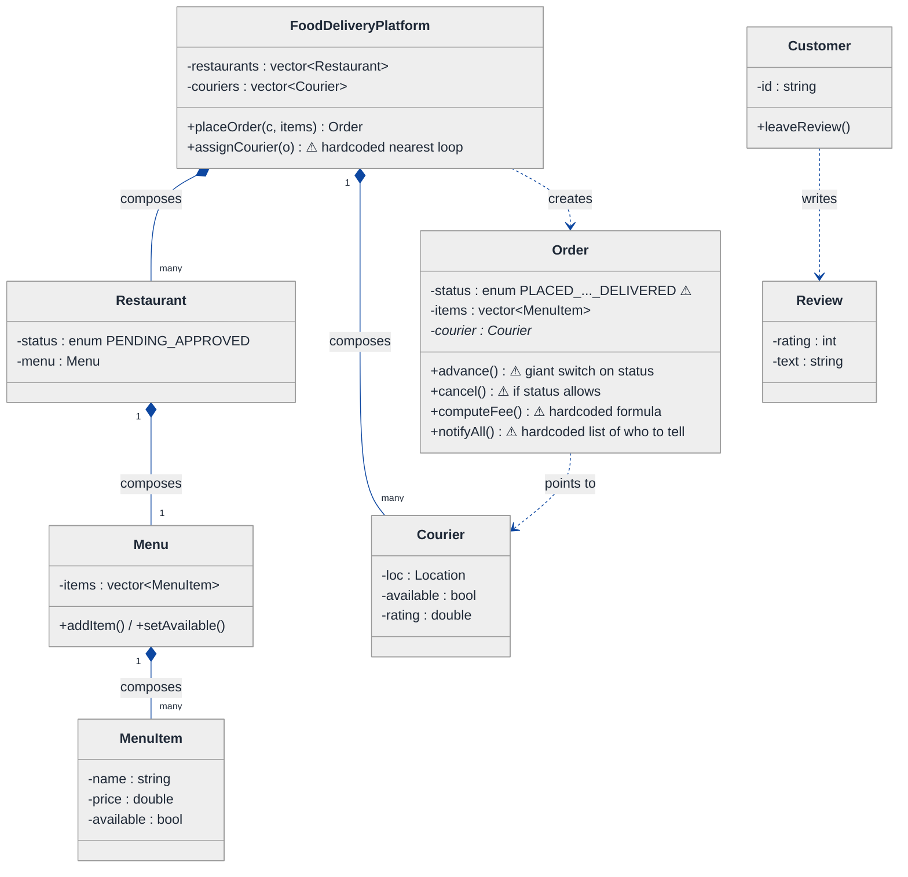
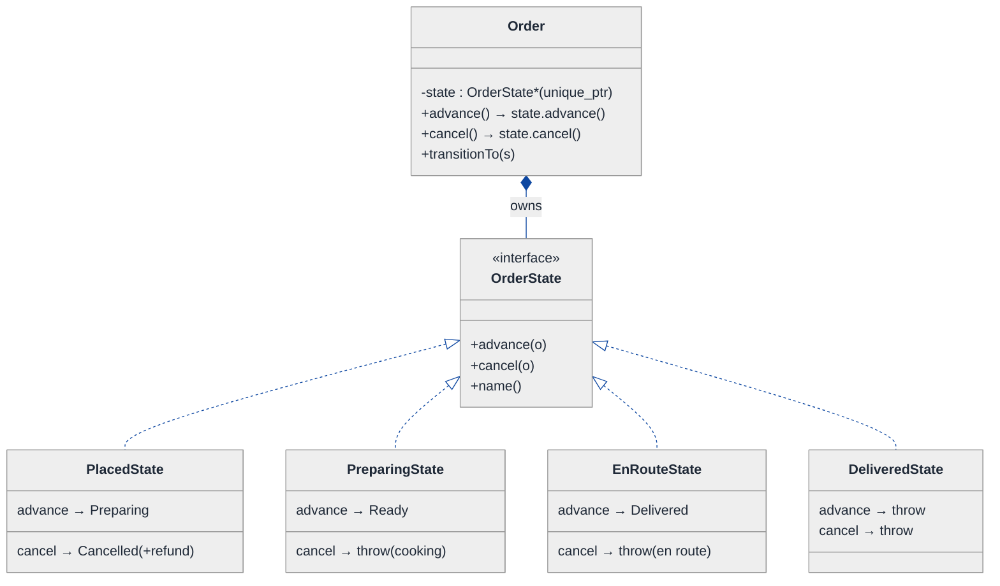
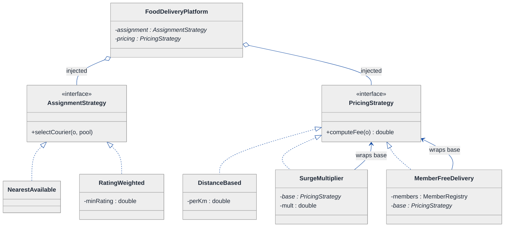
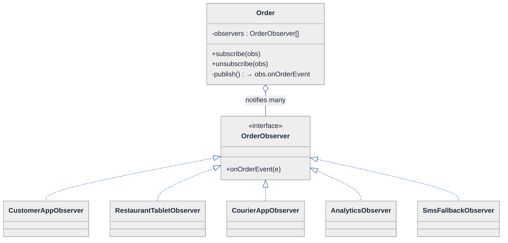
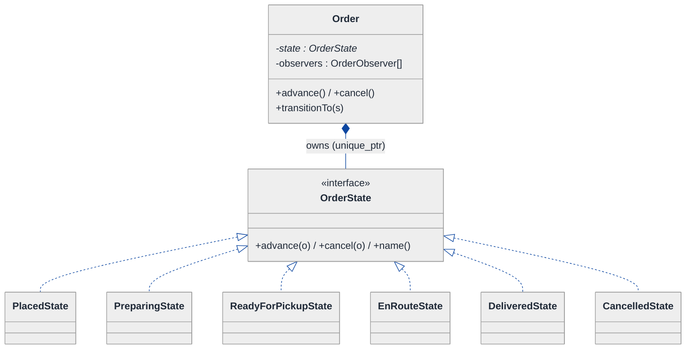
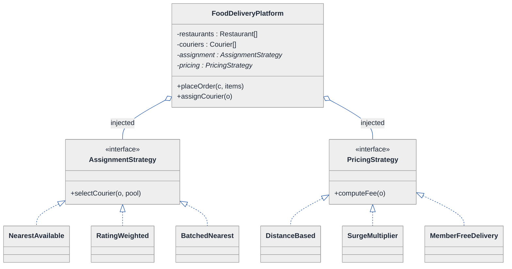
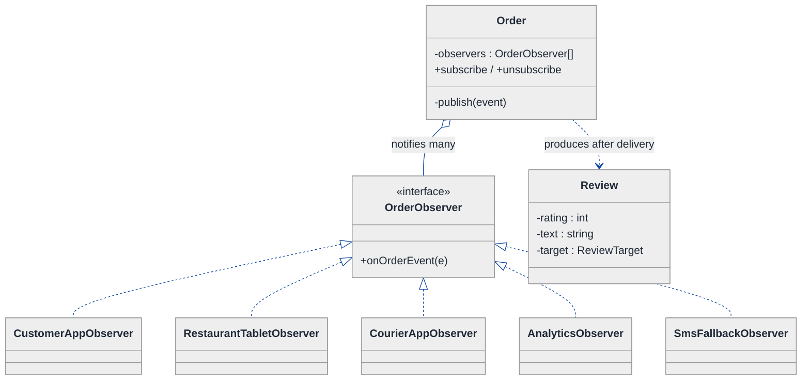
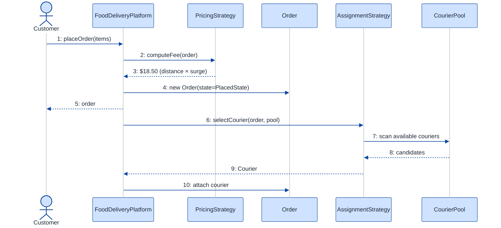
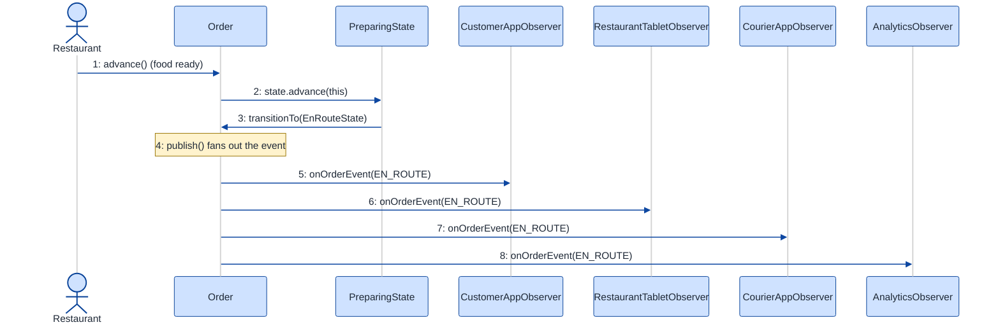

# Food Delivery System (DoorDash-style) — LLD Walkthrough

> **Difficulty:** Hard · **Time:** ~45 min · **Pattern focus:** State (order lifecycle) + Strategy (delivery assignment / pricing) + Observer (real-time tracking & notifications)
>
> **Problem source(s):** GID ST8, bucket `State_Pattern` — representative of multiple LeetLens rows in [`./EXTRACTED_QUESTIONS.md`](./EXTRACTED_QUESTIONS.md). One of the highest-signal multi-pattern LLD prompts.
>
> **Diagrams:** inline mermaid (renders natively in GitHub / VS Code). The canonical theme block is copied verbatim into every diagram.

---

## How to use this file

Paced for a candidate seeing this prompt for the first time. Reading time: ~45 minutes if you sketch each iteration by hand. **The lesson: a food-delivery system looks like ten features bolted together, but it is really THREE axes of variation — a lifecycle that the order transitions through (State), algorithms the platform picks (Strategy), and many parties that need to react to changes (Observer). Don't reach for these patterns up front. DERIVE them: build the naive design first, watch it break under four hypothetical changes, then reach for ONE pattern per painful axis.**

**Map of this file (15 sections):**

1. Problem statement + clarifying questions
2. Plain-English restatement
3. Why this matters
4. Mental model
5. Try it yourself first
6. Entity & verb extraction
7. **Iteration 1: the naive design** — what we'd write first
8. **Where the naive design hurts** — four future requirements, one painful diff each
9. **Pivot 1: State for the order lifecycle** — internal transitions, not external swaps
10. **Pivot 2: Strategy for delivery assignment + pricing** — algorithms the platform picks
11. **Pivot 3: Observer for real-time tracking + notifications** — many parties react to one change
12. Final UML class diagram (three focused sub-views)
13. Skeleton code (C++17)
14. Key flow — sequence diagram
15. Extensibility re-check + anti-patterns + how to think aloud + self-check

---

## 1. Problem statement + clarifying questions

**Prompt (typical phrasing):** "Design a food delivery system like DoorDash at the class level. Support restaurant onboarding, menu management, order placement, delivery assignment based on proximity/availability, real-time order tracking, and a review system."

**Clarifying questions to ask BEFORE drawing anything:**

1. **Order lifecycle granularity?** Is it just placed → delivered, or do we model the full chain (placed → restaurant-accepted → preparing → ready → courier-assigned → picked-up → en-route → delivered, plus cancelled/refunded)? This decides whether status is an enum or a state machine.
2. **Assignment policy?** Strictly nearest courier, or do we also weigh courier rating, current load, vehicle type, and batching (one courier, two orders)? Is the policy fixed or configurable per city?
3. **Who needs real-time updates, and via what channel?** Customer (push + map), restaurant (tablet), courier (app), and internal analytics — all at once? Push or pull?
4. **Pricing model?** Flat delivery fee, distance-based, surge during peak, free for subscription members (DashPass)? Can these stack?
5. **Reviews — of what?** The restaurant only, or restaurant AND courier AND the customer (couriers rate customers)? Can a review be left before delivery completes?
6. **Cancellation rules?** Can a customer cancel after the restaurant starts cooking? Who eats the cost? This is a lifecycle-validity question.
7. **Concurrency?** Two customers ordering the last portion; two assigners grabbing the same courier. In scope for the class design, or hand-waved to "the repository layer handles it"?
8. **Scale assumption?** Single-city in-memory model for the interview, or do we need to talk about sharding couriers by geo-cell?

**Assumptions if the interviewer dodges:** full multi-step lifecycle including cancellation/refund; configurable assignment policy (default nearest-available); push notifications to customer + restaurant + courier + analytics; stackable pricing (base + surge + member discount); reviews of both restaurant and courier, allowed only after delivery; single-process in-memory model with a note on concurrency in §15.

---

## 2. Plain-English restatement

We're building the software that runs a food-delivery marketplace. Restaurants onboard and publish menus. A customer browses, places an order, and pays. The platform routes that order to the restaurant, then — once it's cooking — finds the best courier nearby and assigns them. As the order moves through cooking → pickup → en-route → delivered, **every interested party (customer map, restaurant tablet, courier app, analytics) must see the change in real time.** After delivery, the customer reviews the restaurant and the courier. The design must let us add new lifecycle steps, new assignment algorithms, new pricing rules, and new notification channels **without rewriting the core order flow.**

---

## 3. Why this matters

This is the canonical "looks like a CRUD app, is actually three GoF patterns" interview. The skill being probed is whether you can SEPARATE three independent axes that beginners weld into one `Order` god-class: the *lifecycle* (what's legal next), the *algorithms* (how to assign / price), and the *fan-out* (who gets told). Get the separation right and every future feature is one new class; get it wrong and every feature is surgery across three methods. It reappears in ride-hailing (Uber), logistics (shipment tracking), and any workflow-plus-notifications product.

---

## 4. Mental model

A delivery platform is a **conveyor belt with a control room**. The order is a package that physically advances along the belt — each station (kitchen, pickup, road, doorstep) only permits certain next moves. The control room runs *policies* (which courier, what price) that can be reconfigured without stopping the belt. And a *wall of screens* mirrors the belt's position to everyone watching — the moment the package moves, every screen updates.

```
Real-world sketch (NOT a UML diagram yet):

   CUSTOMER places order
        │
        ▼
  ┌───────────── the conveyor belt (ORDER LIFECYCLE) ─────────────┐
  │ [Placed] → [Accepted] → [Preparing] → [Ready] →               │
  │            [PickedUp] → [EnRoute] → [Delivered]                │
  │              ↘ [Cancelled]   (only legal from early states)    │
  └───────────────────────────────────────────────────────────────┘
        │ control room                       │ wall of screens
        ▼                                     ▼
   ASSIGNMENT policy  PRICING policy     Customer app · Restaurant tablet
   (nearest? rating?) (surge? member?)   Courier app · Analytics  (OBSERVERS)
```

The KEY insight from this picture: **lifecycle, policy, and fan-out are three INDEPENDENT things.** The belt advancing has nothing to do with which pricing rule ran, which has nothing to do with how many screens are watching. That independence is exactly what we'll bake into the design — and exactly what the naive version fails to keep apart.

---

## 5. Try it yourself first

> **Predict before reading on:**
>
> 1. List 6 nouns you'd promote to a class and 3 nouns you'd leave as plain fields.
> 2. **If I told you that next quarter we add two new lifecycle steps (`AwaitingRestaurantConfirmation`, `ReturnedToRestaurant`) AND a "cancel" that's only legal before the food is cooked, what would change about how you store `Order.status`?**
> 3. The customer's map, the restaurant tablet, and analytics ALL need to know the instant a courier picks up the food. Where do you put the code that tells them? Inside `Order.advance()`? Be honest about how that scales to a fourth and fifth listener.

---

## 6. Entity & verb extraction

> **Mini-refresher: noun → class, but not every noun.**
>
> Naive OOD promotes every noun to a class. Senior OOD promotes a noun only if it has both BEHAVIOR and STATE that need to live together. "Cuisine" stays a field on `Restaurant`; "Order" becomes a class because it has lifecycle behavior. "Latitude" stays a field; "Location" might be a tiny value object because distance is a behavior.

**Nouns from the prompt:**

| Noun | Decision | Why |
|---|---|---|
| FoodDeliveryPlatform | Class (top-level coordinator) | Owns restaurants/couriers, orchestrates placeOrder |
| Restaurant | Class | Onboarding state + owns a Menu |
| Menu / MenuItem | Classes | Menu manages items; item has price + availability |
| Customer | Class | Places orders, leaves reviews |
| Courier | Class | Has location, availability, rating |
| Order | Class | The conveyor package — lifecycle behavior lives here |
| Review | Class | Rating + text + target (restaurant or courier) |
| Location | Small value object | Holds lat/lng; behavior = `distanceTo()` |
| OrderStatus | Field (naive) → its own hierarchy (final) | The whole point of §9 |
| Cuisine / address / phone | Fields | No behavior of their own |

**Verbs (and the class they live on):**

| Verb | Owner class (naive answer — we'll re-examine) |
|---|---|
| onboard(restaurant) | FoodDeliveryPlatform |
| addItem / setAvailable | Menu |
| placeOrder(customer, items) | FoodDeliveryPlatform |
| advance() / cancel() | Order |
| assignCourier(order) | FoodDeliveryPlatform |
| computeFee(order) | Order (naive) → PricingStrategy (final) |
| notify(event) | ??? (this is the Observer question) |
| leaveReview(target, rating) | Customer / Order |

**We have NOT introduced any design patterns yet.** Pure nouns + verbs. Notice the three rows already screaming for help: `advance()/cancel()` (a lifecycle), `assignCourier`/`computeFee` (algorithms), and `notify` (whose owner we can't even name yet).

---

## 7. <a id="iter-1"></a>Iteration 1: the naive design

Let's write the simplest thing that could possibly work. No design patterns — just classes with methods, an enum for status, and `if`/`switch` where decisions happen.



**Reader's tour (read top to bottom; ~60 seconds).**

1. **At the top — `FoodDeliveryPlatform` is the root coordinator.** It composes the restaurant list and the courier list, and exposes `placeOrder` + `assignCourier`. The `assignCourier` carries a ⚠ already: it's a hardcoded loop that scans couriers and picks the nearest free one. The algorithm is welded into the coordinator.

2. **The inventory spine (left side).** Platform composes `Restaurant[]` and `Courier[]`; each `Restaurant` composes one `Menu`; each `Menu` composes `MenuItem[]`. The FILLED diamonds (`◆`) are composition — strong ownership, same lifetime. This part is fine and barely changes later.

3. **`Restaurant.status` is an enum** (`PENDING` / `APPROVED`). Small now; it's a lifecycle in disguise and will join the pain in §8.

4. **The `Order` box — the trouble zone.** Four warning markers (⚠):
   - `status` is an enum covering the happy path. Adding a state means editing the enum AND every switch that reads it.
   - `advance()` is a giant `switch (status)` that decides the next status. Every new step adds a case here.
   - `cancel()` has scattered `if (status == PLACED || status == ACCEPTED)` guards — the legality rules live inline.
   - `computeFee()` hardcodes the pricing formula, and `notifyAll()` hardcodes the list of who to tell (customer, restaurant). Each is a separate future-pain entry point.

5. **`Review` and `Customer`.** A customer writes reviews; in the naive design `Review` is a flat data bag with a `rating` and `text` and nothing distinguishing a restaurant review from a courier review.

**What's deliberately missing.** No `OrderState` hierarchy. No `AssignmentStrategy`. No `PricingStrategy`. No `Observer` / event bus. The naive design doesn't even *acknowledge* these are axes — it bakes a hardcoded answer into the methods that use them.

Skeleton code for the naive design (C++17):

```cpp
#include <memory>
#include <stdexcept>
#include <string>
#include <vector>

enum class OrderStatus  { PLACED, ACCEPTED, PREPARING, READY, PICKED_UP, EN_ROUTE, DELIVERED, CANCELLED };
enum class RestaurantStatus { PENDING, APPROVED };

struct Location {
    double lat, lng;
    double distanceTo(const Location& o) const { /* haversine */ return 0.0; }
};

class MenuItem {
public:
    MenuItem(std::string name, double price) : name_(std::move(name)), price_(price) {}
    double price() const { return price_; }
    bool   available() const { return available_; }
    void   setAvailable(bool a) { available_ = a; }
private:
    std::string name_;
    double      price_;
    bool        available_ = true;
};

class Courier {
public:
    Courier(std::string id, Location loc) : id_(std::move(id)), loc_(loc) {}
    bool     available() const { return available_; }
    Location location() const { return loc_; }
    double   rating()  const { return rating_; }
    void     setAvailable(bool a) { available_ = a; }
private:
    std::string id_;
    Location    loc_;
    bool        available_ = true;
    double      rating_ = 5.0;
};

class Order {
public:
    OrderStatus status = OrderStatus::PLACED;
    std::vector<MenuItem*> items;
    Courier* courier = nullptr;

    void advance() {                              // giant switch — will hurt
        switch (status) {
            case OrderStatus::PLACED:    status = OrderStatus::ACCEPTED;  break;
            case OrderStatus::ACCEPTED:  status = OrderStatus::PREPARING; break;
            case OrderStatus::PREPARING: status = OrderStatus::READY;     break;
            case OrderStatus::READY:     status = OrderStatus::PICKED_UP; break;
            case OrderStatus::PICKED_UP: status = OrderStatus::EN_ROUTE;  break;
            case OrderStatus::EN_ROUTE:  status = OrderStatus::DELIVERED; break;
            default: throw std::runtime_error("Cannot advance from terminal state");
        }
        notifyAll();
    }

    void cancel() {                               // inline legality guard — will hurt
        if (status == OrderStatus::PLACED || status == OrderStatus::ACCEPTED)
            { status = OrderStatus::CANCELLED; notifyAll(); }
        else throw std::runtime_error("Too late to cancel");
    }

    double computeFee() const {                   // hardcoded formula — will hurt
        double subtotal = 0; for (auto* it : items) subtotal += it->price();
        return subtotal + 3.99;                   // flat delivery fee
    }

    void notifyAll() {                            // hardcoded recipients — will hurt
        // send push to customer ...
        // send push to restaurant tablet ...
    }
};

class FoodDeliveryPlatform {
public:
    Order placeOrder(/*Customer&, items*/) { Order o; /* ... */ return o; }

    void assignCourier(Order& o) {                // hardcoded nearest loop — will hurt
        Courier* best = nullptr; double bestDist = 1e9;
        for (auto& c : couriers_) {
            if (!c.available()) continue;
            double d = c.location().distanceTo(/*restaurant loc*/ Location{0,0});
            if (d < bestDist) { bestDist = d; best = &c; }
        }
        if (!best) throw std::runtime_error("No courier available");
        o.courier = best; best->setAvailable(false);
    }
private:
    std::vector<Courier> couriers_;
};
```

**This works.** It has zero design patterns. We can onboard, place an order, advance it, assign a courier, charge, and notify. So what's wrong with it?

---

## 8. <a id="naive-pain"></a>Where the naive design hurts

The interviewer slides four new requirements across the desk: "Here's next quarter's roadmap. Walk me through what changes."

### Change A: "Add two lifecycle steps + make cancellation state-aware"

Product wants `AwaitingRestaurantConfirmation` (between PLACED and ACCEPTED) and `ReturnedToRestaurant` (a failed-delivery branch). Also: cancellation is now legal *only* before `PREPARING`, and triggers a refund.

In the naive design:
- `OrderStatus` enum grows two values.
- `Order::advance()` switch gains two cases AND the existing transitions shift.
- `Order::cancel()` inline guard `if (status == PLACED || status == ACCEPTED)` must be rewritten — and any OTHER place that reads status (analytics, UI mapping) must be audited.
- **The change touches the enum, `advance()`, `cancel()`, and every reader of status.** The transition rules are smeared across the file.

### Change B: "Smarter courier assignment — rating + load + batching, configurable per city"

Marketing wants: NYC uses "nearest + rating ≥ 4.5"; suburbs use "nearest with batching (one courier, two nearby orders)."

In the naive design:
- `assignCourier()` becomes a forest of `if (city == ...)` branches, each with its own scoring loop.
- The "nearest" loop and the "rating-weighted" loop and the "batched" loop all live in one method.
- **Every new city policy → another branch in the same method.** Classic algorithm-buried-in-a-coordinator.

### Change C: "Surge pricing + DashPass free delivery, stackable"

Finance wants distance-based fee, a 1.5× surge multiplier during peak hours, and free delivery for subscription members — and these can combine.

In the naive design:
- `computeFee()`'s `subtotal + 3.99` becomes nested conditionals: `if member ... else if peak ... else ...`.
- The rules don't compose cleanly; "peak AND member" needs its own branch.
- **Three rules in and `computeFee()` is unreadable; rules can't be mixed-and-matched.**

### Change D: "Real-time tracking for courier app + analytics + SMS fallback"

Now the courier app needs live status, the analytics pipeline needs every transition, and customers without the app get an SMS.

In the naive design:
- `notifyAll()` already hardcodes customer + restaurant. Add courier app, analytics, SMS → four more inline calls.
- Every `notifyAll()` call site is coupled to the full recipient list. Want analytics to ALSO log cancellations? Edit `cancel()` too.
- **Every new listener edits `notifyAll()` and re-tests every transition.** The order class now knows about push SDKs, an analytics client, and an SMS gateway.

### The pattern of pain

| Change | Files / methods touched | Smell |
|---|---|---|
| A. New states + cancel rules | `enum` + `advance()` + `cancel()` + every status reader | "Lifecycle rules smeared across switches; enum can't express legality." |
| B. Smarter assignment | `assignCourier()` (forest of city branches) | "Algorithm buried in the coordinator; per-city surgery." |
| C. Surge + member pricing | `computeFee()` (nested conditionals) | "Single method accumulates every rule; rules can't compose." |
| D. New listeners | `notifyAll()` + every transition call site | "Order is coupled to every notification channel; fan-out is hardcoded." |

**Three axes of pain dominate:** a *lifecycle* the object transitions through (A), *algorithms* the platform picks (B, C), and a *fan-out* where one change must reach many parties (D).

> **Pivot question:** "What pattern handles 'lifecycle with state-specific legal operations'? What pattern handles 'algorithm picked externally and swapped'? What pattern handles 'one change, many independent reactors'?"
>
> The answers are State, Strategy, and Observer. Let's introduce them one at a time, starting with the most structurally central axis: the order lifecycle.

---

## 9. <a id="pivot-1"></a>Pivot 1: State for the order lifecycle

The most central pain is Change A — the enum + `advance()` switch + scattered `cancel()` guards. The variability here is NOT in an algorithm; it's in **what operations are legal, and what comes next**, given where the order is. That is the State pattern's home turf.

> **Mini-refresher: State pattern.**
>
> Each lifecycle state is its own class implementing a common interface. The context object (here, `Order`) delegates events like `advance()` / `cancel()` to its CURRENT state object, and THE STATE decides both what to do and which state comes next. Transitions are INTERNAL, driven by the events the context receives — not chosen by the caller.
>
> Quick example: a TCP connection that is `Closed`, `Listening`, `Established`. Calling `send()` on a `Closed` connection isn't an `if` check — it dispatches to `ClosedState::send()`, which throws. The state class IS the validation.

**Why State (not Strategy).** The choice of next state is NOT picked by the caller — it's driven by what the order has been through. A `PreparingOrder` can become `Ready`; a `Delivered` order can do nothing. Calling `cancel()` on a `PreparingOrder` should be a clean, localized "not allowed here" — not a guard scattered through a switch. Legality is the OBJECT'S concern, not the caller's.

**The refactor (just the lifecycle slice):**

```cpp
class Order;  // forward — defined below

class OrderState {
public:
    virtual ~OrderState() = default;
    virtual void advance(Order& o) = 0;   // move to the next legal state
    virtual void cancel(Order& o)  = 0;   // cancel if legal here
    virtual const char* name() const = 0; // for tracking / UI
};

class PlacedState : public OrderState {
public:
    void advance(Order& o) override;                 // → Preparing (restaurant accepts)
    void cancel(Order& o)  override;                 // legal: → Cancelled (+ refund)
    const char* name() const override { return "PLACED"; }
};

class PreparingState : public OrderState {
public:
    void advance(Order& o) override;                 // → ReadyForPickup
    void cancel(Order&) override {                   // food is cooking — too late
        throw std::runtime_error("Cannot cancel: order is being prepared");
    }
    const char* name() const override { return "PREPARING"; }
};

class EnRouteState : public OrderState {
public:
    void advance(Order& o) override;                 // → Delivered
    void cancel(Order&) override { throw std::runtime_error("Cannot cancel: courier en route"); }
    const char* name() const override { return "EN_ROUTE"; }
};

class DeliveredState : public OrderState {           // terminal
public:
    void advance(Order&) override { throw std::runtime_error("Already delivered"); }
    void cancel(Order&)  override { throw std::runtime_error("Already delivered"); }
    const char* name() const override { return "DELIVERED"; }
};
// ReadyForPickup / PickedUp / Cancelled / ReturnedToRestaurant elided — same shape

class Order {
public:
    Order() : state_(std::make_unique<PlacedState>()) {}
    void transitionTo(std::unique_ptr<OrderState> s) { state_ = std::move(s); }
    void advance() { state_->advance(*this); }       // one-liner — no switch
    void cancel()  { state_->cancel(*this);  }       // one-liner — no inline guard
    const char* statusName() const { return state_->name(); }
private:
    std::unique_ptr<OrderState> state_;
};

// Transitions live WITH each state (deferred until Order is complete):
inline void PlacedState::advance(Order& o)  { o.transitionTo(std::make_unique<PreparingState>()); }
inline void PlacedState::cancel(Order& o)   { /* issue refund */ o.transitionTo(std::make_unique<DeliveredState>() /* CancelledState elided */); }
inline void PreparingState::advance(Order& o){ o.transitionTo(std::make_unique<EnRouteState>() /* ReadyForPickup elided */); }
inline void EnRouteState::advance(Order& o) { o.transitionTo(std::make_unique<DeliveredState>()); }
```

**What changed — visualized.** Just the lifecycle slice:



**Tour of the after-state.**

1. **The `OrderStatus` enum is GONE.** It's replaced by a `state` field of type `OrderState*` (specifically `std::unique_ptr<OrderState>` — exclusive ownership of the current state).

2. **`Order::advance()` and `Order::cancel()` became one-liners.** Each delegates to the current state: `state_->advance(*this)`. **No `switch (status)` anywhere; no inline `if (status == ...)` guard.**

3. **The interface declares the contract.** `OrderState` is an abstract base with three pure-virtual methods. Every concrete state must answer all three — even if the honest answer is "throw" (e.g., `DeliveredState::advance` throws because nothing comes after delivery).

4. **Each state owns its own legality.** Read the boxes: `PreparingState::cancel` throws ("food is cooking") — that rule now lives in exactly ONE place, the state where it applies. Compare with the naive design where the rule lived in a shared `if`.

5. **Transitions live WITH the state.** Each state's `advance` calls `o.transitionTo(...)`. The state knows what comes next. `Order` and `FoodDeliveryPlatform` do NOT contain the transition table.

**Change A from §8 now lands cleanly.** Adding `AwaitingRestaurantConfirmation` is ONE new class that points its `advance()` at the next state and is pointed-to by the previous state's `advance()`. No edits to unrelated states, no enum surgery, no audit of every status reader. Open/closed.

**Pattern-discrimination cheatsheet — State vs Strategy.**
- *State:* the OBJECT picks its next state internally; states know about each other (each state's method can `transitionTo` another). Triggered by `context.advance()` / events.
- *Strategy:* the CALLER picks which one to use; strategies are usually unaware of each other. Triggered by `context.setStrategy(x)` externally.
- *Rule of thumb:* swap happens because of an internal event flow → State. Swap happens because external code says so → Strategy.

We chose State because the next phase is determined by where the order already is — the caller never says "become Preparing," it just says `advance()`.

---

## 10. <a id="pivot-2"></a>Pivot 2: Strategy for delivery assignment + pricing

Changes B and C from §8 are still painful — the `assignCourier()` city-branch forest and the `computeFee()` nested-conditional mess. State doesn't help here, because the variability is in the ALGORITHM, and the choice of algorithm is made by the platform's configuration, not by the order itself.

> **Mini-refresher: Strategy pattern.**
>
> Encapsulates an algorithm behind an interface so it can be swapped at runtime. The CALLER (or configuration) decides which strategy to use; the strategy doesn't know about its peers.
>
> Quick example: a `Sorter` takes a `CompareStrategy*` in its constructor — pass `Ascending` or `Descending`; the sorter doesn't care which.

**Why Strategy fits both axes.** Assignment is an algorithm (`given an order + courier pool, return the best courier`). Pricing is an algorithm (`given an order, return a fee`). Both vary (nearest / rating-weighted / batched; flat / distance / surge / member). Both are chosen externally — by city config or platform policy. That's textbook Strategy. And because they're two *different* roles (different inputs and outputs), they get two *separate* interfaces.

**The refactor (the two affected slices):**

```cpp
class CourierPool;  // forward — the available-courier set

// ── Axis 1: assignment ──────────────────────────────────────────────
class AssignmentStrategy {
public:
    virtual ~AssignmentStrategy() = default;
    virtual Courier* selectCourier(const Order& o, CourierPool& pool) const = 0;
};

class NearestAvailable : public AssignmentStrategy {
public:
    Courier* selectCourier(const Order& o, CourierPool& pool) const override; // min distance, available
};

class RatingWeighted : public AssignmentStrategy {
public:
    explicit RatingWeighted(double minRating) : minRating_(minRating) {}
    Courier* selectCourier(const Order& o, CourierPool& pool) const override; // nearest among rating >= min
private:
    double minRating_;
};
// BatchedNearest (one courier, two close orders) elided — same shape

// ── Axis 2: pricing (decorator-style composition) ───────────────────
class PricingStrategy {
public:
    virtual ~PricingStrategy() = default;
    virtual double computeFee(const Order& o) const = 0;
};

class DistanceBased : public PricingStrategy {
public:
    explicit DistanceBased(double perKm) : perKm_(perKm) {}
    double computeFee(const Order& o) const override; // subtotal + perKm * distance
private:
    double perKm_;
};

class SurgeMultiplier : public PricingStrategy {     // wraps another strategy
public:
    SurgeMultiplier(std::unique_ptr<PricingStrategy> base, double mult)
        : base_(std::move(base)), mult_(mult) {}
    double computeFee(const Order& o) const override {
        double fee = base_->computeFee(o);
        return inPeakWindow() ? fee * mult_ : fee;
    }
private:
    std::unique_ptr<PricingStrategy> base_;
    double                           mult_;
};

class MemberFreeDelivery : public PricingStrategy {  // wraps another strategy
public:
    MemberFreeDelivery(const MemberRegistry& m, std::unique_ptr<PricingStrategy> base)
        : members_(m), base_(std::move(base)) {}
    double computeFee(const Order& o) const override {
        double fee = base_->computeFee(o);
        return members_.has(o.customerId()) ? subtotalOnly(o, fee) : fee; // waive delivery part
    }
private:
    const MemberRegistry&            members_;
    std::unique_ptr<PricingStrategy> base_;
};

class FoodDeliveryPlatform {
    // ...
    std::unique_ptr<AssignmentStrategy> assignment_;  // injected at construction
    std::unique_ptr<PricingStrategy>    pricing_;     // injected at construction
};
```

**What changed — visualized.** Both Strategy slices:



**Tour of the after-state.**

1. **Platform gained two injected fields.** `assignment` and `pricing` are pointers to interfaces, INJECTED at construction (open diamond `◇` = aggregation — the platform USES them). The platform doesn't `new` them; the city config does.

2. **Two separate interfaces, on purpose.** `AssignmentStrategy::selectCourier` takes `(Order, CourierPool)` and returns a `Courier*`. `PricingStrategy::computeFee` takes `(Order)` and returns a `double`. Different inputs, different outputs — they are different *roles*. Don't try to unify them under one generic `Strategy<T>`; that's premature genericism.

3. **Assignment implementations (left family).** `NearestAvailable` is the old loop, now isolated. `RatingWeighted` filters by `minRating` then takes nearest. `BatchedNearest` (elided) handles the suburbs case. Change B becomes: pick the right strategy per city in config.

4. **Pricing implementations (right family) compose via DECORATORS.** `SurgeMultiplier` and `MemberFreeDelivery` each hold a `base : PricingStrategy*` and wrap it. So `MemberFreeDelivery(SurgeMultiplier(DistanceBased(...)))` is "member discount × surge × distance" — three rules stacked. The naive nested `if` couldn't express this.

> **Mini-refresher: Decorator pattern (why pricing stacks).**
>
> A Decorator implements the SAME interface as the thing it wraps and holds a pointer to one instance of that interface. It adds behavior before/after delegating to the wrapped object. Because the wrapper IS-A `PricingStrategy`, you can wrap a wrapper — composing rules without a combinatorial explosion of subclasses.

5. **`Order::computeFee()` is GONE.** Pricing left the order entirely; the platform owns the pricing strategy and calls it. The order's surface shrank.

**Changes B and C from §8 now land cleanly.** New assignment policy → new `AssignmentStrategy` subclass, chosen in config. New pricing rule → new `PricingStrategy` decorator, composable with the rest. No surgery in the coordinator.

**Pattern-discrimination cheatsheet — Strategy vs Template Method.**
- *Strategy:* the whole algorithm is one swappable object; chosen at runtime via composition; variants can be combined (decorators).
- *Template Method:* the algorithm skeleton lives in a base class; subclasses fill in hooks via inheritance; variants can't be combined.
- *Rule of thumb:* variants that combine or change at runtime → Strategy. A fixed skeleton with 2-3 stable variants → Template Method.

We chose Strategy because pricing variants COMPOSE (surge × member × distance) — and you cannot compose Template Method subclasses.

---

## 11. <a id="pivot-3"></a>Pivot 3: Observer for real-time tracking + notifications

Change D from §8 is the last open wound — `Order::notifyAll()` hardcoding its recipients. The variability here is neither a lifecycle nor an algorithm; it's a **fan-out**: one event (the order moved) must reach many independent parties, and the set of parties changes over time. That's the Observer pattern.

> **Mini-refresher: Observer pattern.**
>
> A *subject* maintains a list of *observers* and notifies all of them when its state changes. Observers subscribe/unsubscribe at runtime; the subject doesn't know their concrete types — only the observer interface. This decouples "something changed" from "who cares."
>
> Push vs pull: in PUSH, the subject hands the changed data to each observer (`update(event)`); in PULL, the subject just signals and observers query it back. We use push — the event carries the new status.

**Why Observer (not just a method call).** The naive `notifyAll()` welds the order to every channel — push SDK, analytics client, SMS gateway. With Observer, the order becomes a *subject* that emits an `OrderEvent`; the customer app, restaurant tablet, courier app, analytics sink, and SMS fallback are all *observers* that subscribed. The order no longer knows or cares who is listening.

**The refactor (the fan-out slice):**

```cpp
struct OrderEvent {
    std::string orderId;
    std::string newStatus;   // e.g. "EN_ROUTE"
    Location    courierLoc;  // for the live map
};

class OrderObserver {
public:
    virtual ~OrderObserver() = default;
    virtual void onOrderEvent(const OrderEvent& e) = 0;
};

class CustomerAppObserver  : public OrderObserver {
public:
    void onOrderEvent(const OrderEvent& e) override; // update map + push
};
class AnalyticsObserver    : public OrderObserver {
public:
    void onOrderEvent(const OrderEvent& e) override; // append to metrics stream
};
// RestaurantTabletObserver / CourierAppObserver / SmsFallbackObserver elided — same shape

// The Order becomes the SUBJECT:
class Order {                                       // (combined with the State pattern from Pivot 1)
public:
    void subscribe(OrderObserver* obs)  { observers_.push_back(obs); }   // weak/non-owning
    void unsubscribe(OrderObserver* obs);

    void transitionTo(std::unique_ptr<OrderState> s) {
        state_ = std::move(s);
        publish();                                  // every transition fans out
    }
private:
    void publish() {
        OrderEvent e{ id_, state_->name(), courierLoc_ };
        for (auto* obs : observers_) obs->onOrderEvent(e);  // notify ALL
    }
    std::unique_ptr<OrderState>   state_;
    std::vector<OrderObserver*>   observers_;       // subject's subscriber list
    std::string                   id_;
    Location                      courierLoc_{};
};
```

**What changed — visualized.** The fan-out slice:



**Tour of the after-state.**

1. **`Order` is now a SUBJECT.** It holds a list of `OrderObserver*` and exposes `subscribe` / `unsubscribe`. The pointers are NON-OWNING — observers outlive individual orders (the analytics sink is process-wide), so the order must not delete them. (See the ownership note below.)

2. **`notifyAll()`'s hardcoded body is GONE.** It's replaced by `publish()`, which builds one `OrderEvent` and loops over the subscriber list calling `onOrderEvent(e)`. The order knows the *interface*, never the concrete channels.

3. **`publish()` is wired into `transitionTo()`.** This is the elegant join with Pivot 1: every State transition automatically fans out. The state changes; the subject publishes; everyone subscribed reacts. No call site has to remember to notify.

4. **Five concrete observers, each independent.** Adding `SmsFallbackObserver` is one new class plus one `order.subscribe(&sms)` line at wiring time. It does NOT touch `Order`, the states, or any other observer. Change D from §8 collapses to one class.

5. **Observers can be selective.** `AnalyticsObserver::onOrderEvent` logs every event; `CustomerAppObserver` might ignore internal-only events. Each observer decides what to do with the event — the subject treats them uniformly.

> **Mini-refresher: `weak_ptr` / non-owning back-references.**
>
> When a subject holds pointers to observers it does NOT own, store raw `T*` or `std::weak_ptr<T>` — never `shared_ptr` (that would keep observers alive forever) and never `unique_ptr` (that claims ownership). `weak_ptr` is safest: the subject can detect a dead observer before calling it. Use raw `T*` only when subscriptions are strictly unsubscribed before the observer dies.

**Pattern-discrimination cheatsheet — Observer vs Mediator.**
- *Observer:* one subject broadcasts to many observers; observers don't talk to each other; relationship is "I changed, react if you care."
- *Mediator:* a central hub coordinates many peers that would otherwise talk directly; it encodes the *rules* of who-talks-to-whom.
- *Rule of thumb:* pure one-to-many notification with no cross-talk → Observer. Complex many-to-many coordination with logic in the middle → Mediator.

We chose Observer because the order broadcasts; the customer app and analytics never coordinate with each other.

---

## 12. <a id="fig-class-diagram"></a>Final class diagram

Showing the entire design in one diagram is a wall of boxes. Instead, here are **three focused sub-views**, one per pattern axis. Read them in order; the structural insight at the end ties them together.

### 12.1 The lifecycle — Order's State pattern



**Tour of 12.1.** `Order` owns ONE `OrderState` via `unique_ptr` (filled diamond = composition / exclusive ownership). Its `advance()` / `cancel()` are one-liners that delegate to the current state. Six concrete states hang off the interface; each knows what's legal in its phase and which state comes next. `DeliveredState` and `CancelledState` are terminal. Adding a state is one new class.

### 12.2 The policy injection — what the platform USES



**Tour of 12.2.** The platform composes its inventory (restaurants, couriers — filled diamonds) and AGGREGATES two injected strategy interfaces (open diamonds). Each interface has a small concrete family: assignment policies (nearest / rating-weighted / batched) and pricing rules (distance, with surge and member as stackable decorators). The platform's core stays orchestration; the variation lives in swappable policies chosen at construction.

### 12.3 The fan-out — Order's Observer wiring



**Tour of 12.3.** `Order` (the subject) aggregates many `OrderObserver*` (non-owning). On every transition it calls `publish()`, which fans the `OrderEvent` to all subscribers. Five concrete observers cover customer app, restaurant tablet, courier app, analytics, and SMS fallback — adding a sixth is one class. `Review` (rating + text + a `target` discriminator for restaurant-vs-courier) is produced once the order reaches `DeliveredState`; the State pattern guards that a review can't be left before delivery.

### Structural insight (ties 12.1 + 12.2 + 12.3 together)

| Concern | Pattern used | Who owns / picks it |
|---|---|---|
| **Lifecycle** (Placed → … → Delivered / Cancelled) | State, OWNED by Order | Order itself transitions; states validate what's legal |
| **Assignment** (nearest / rating / batched) | Strategy, INJECTED into Platform | City config picks the policy |
| **Pricing** (distance / surge / member) | Strategy + Decorator, INJECTED | Platform config; rules stack via decorators |
| **Fan-out** (tracking + notifications) | Observer, Order is the SUBJECT | Observers subscribe at wiring time |

The big lesson: **inheritance is used only for the state, strategy, and observer class families** — genuine polymorphic roles. Inventory (Restaurant, Menu, MenuItem, Courier) is plain composition + data. *Inheritance for roles, composition for everything that varies independently.* Three axes, three patterns, zero overlap — that's what makes the design extensible.

---

## 13. Skeleton code (C++17)

> Show the SHAPES, not the full impl. ~140 lines. Concrete bodies are `// elided` where the choice is already clear from §§9-11.

```cpp
#include <memory>
#include <stdexcept>
#include <string>
#include <vector>

// ── Forward declarations ────────────────────────────────────────────
class Order;            // defined below
class CourierPool;      // the available-courier set (elided)

// ── Value objects + inventory ───────────────────────────────────────
struct Location { double lat, lng; double distanceTo(const Location&) const; };

class MenuItem {
public:
    MenuItem(std::string name, double price) : name_(std::move(name)), price_(price) {}
    double price() const { return price_; }
    bool   available() const { return available_; }
    void   setAvailable(bool a) { available_ = a; }
private:
    std::string name_; double price_; bool available_ = true;
};

class Menu {
public:
    void addItem(std::unique_ptr<MenuItem> i) { items_.push_back(std::move(i)); }
private:
    std::vector<std::unique_ptr<MenuItem>> items_;
};

class Restaurant {  // onboarding could itself be a small State machine; enum suffices here
public:
    Restaurant(std::string name, Location loc) : name_(std::move(name)), loc_(loc) {}
    Menu& menu() { return menu_; }
    Location location() const { return loc_; }
private:
    std::string name_; Location loc_; Menu menu_;
};

class Courier {
public:
    Courier(std::string id, Location loc) : id_(std::move(id)), loc_(loc) {}
    bool available() const { return available_; }
    double rating() const { return rating_; }
    Location location() const { return loc_; }
    void setAvailable(bool a) { available_ = a; }
private:
    std::string id_; Location loc_; bool available_ = true; double rating_ = 5.0;
};

// ── Observer (Pivot 3) ──────────────────────────────────────────────
struct OrderEvent { std::string orderId; std::string newStatus; Location courierLoc; };

class OrderObserver {
public:
    virtual ~OrderObserver() = default;
    virtual void onOrderEvent(const OrderEvent& e) = 0;
};
class CustomerAppObserver : public OrderObserver {
public:
    void onOrderEvent(const OrderEvent& e) override; // update live map + push
};
// RestaurantTabletObserver / CourierAppObserver / AnalyticsObserver / SmsFallbackObserver elided

// ── State (Pivot 1) ─────────────────────────────────────────────────
class OrderState {
public:
    virtual ~OrderState() = default;
    virtual void advance(Order& o) = 0;
    virtual void cancel(Order& o)  = 0;
    virtual const char* name() const = 0;
};
class PlacedState : public OrderState {
public:
    void advance(Order& o) override;                 // → Preparing
    void cancel(Order& o)  override;                 // → Cancelled (+ refund)
    const char* name() const override { return "PLACED"; }
};
class PreparingState : public OrderState {
public:
    void advance(Order& o) override;                 // → ReadyForPickup
    void cancel(Order&) override { throw std::runtime_error("Cannot cancel: preparing"); }
    const char* name() const override { return "PREPARING"; }
};
// ReadyForPickup / PickedUp / EnRoute / Delivered / Cancelled elided — same shape

// ── Strategy (Pivot 2) ──────────────────────────────────────────────
class AssignmentStrategy {
public:
    virtual ~AssignmentStrategy() = default;
    virtual Courier* selectCourier(const Order& o, CourierPool& pool) const = 0;
};
class NearestAvailable : public AssignmentStrategy {
public:
    Courier* selectCourier(const Order& o, CourierPool& pool) const override; // min dist, available
};
// RatingWeighted / BatchedNearest elided

class PricingStrategy {
public:
    virtual ~PricingStrategy() = default;
    virtual double computeFee(const Order& o) const = 0;
};
class DistanceBased : public PricingStrategy {
public:
    explicit DistanceBased(double perKm) : perKm_(perKm) {}
    double computeFee(const Order& o) const override; // subtotal + perKm * dist
private:
    double perKm_;
};
class SurgeMultiplier : public PricingStrategy {      // decorator — wraps a base strategy
public:
    SurgeMultiplier(std::unique_ptr<PricingStrategy> base, double mult)
        : base_(std::move(base)), mult_(mult) {}
    double computeFee(const Order& o) const override; // base * mult in peak window
private:
    std::unique_ptr<PricingStrategy> base_; double mult_;
};
// MemberFreeDelivery elided — same decorator shape

// ── Order: State subject + Observer subject ─────────────────────────
class Order {
public:
    explicit Order(std::string id) : id_(std::move(id)), state_(std::make_unique<PlacedState>()) {}

    void advance() { state_->advance(*this); }       // delegate — no switch
    void cancel()  { state_->cancel(*this);  }       // delegate — no inline guard
    void transitionTo(std::unique_ptr<OrderState> s) { state_ = std::move(s); publish(); }

    void subscribe(OrderObserver* o)   { observers_.push_back(o); }   // non-owning
    void unsubscribe(OrderObserver* o);

    const std::string& id() const { return id_; }
    const char* statusName() const { return state_->name(); }

private:
    void publish() {
        OrderEvent e{ id_, state_->name(), courierLoc_ };
        for (auto* o : observers_) o->onOrderEvent(e);
    }
    std::string                  id_;
    std::unique_ptr<OrderState>  state_;
    std::vector<OrderObserver*>  observers_;          // subject's subscriber list
    Location                     courierLoc_{};
};

// State transitions defined after Order is complete:
inline void PlacedState::advance(Order& o)    { o.transitionTo(std::make_unique<PreparingState>()); }
inline void PlacedState::cancel(Order& o)     { /* refund */ o.transitionTo(std::make_unique<PreparingState>() /* CancelledState elided */); }
inline void PreparingState::advance(Order& o) { o.transitionTo(std::make_unique<PreparingState>() /* ReadyForPickupState elided */); }

// ── Platform (orchestrator) ─────────────────────────────────────────
class FoodDeliveryPlatform {
public:
    FoodDeliveryPlatform(std::unique_ptr<AssignmentStrategy> assign,
                         std::unique_ptr<PricingStrategy>    pricing)
        : assignment_(std::move(assign)), pricing_(std::move(pricing)) {}

    Order placeOrder(const std::string& orderId /*, customer, items */) {
        Order o(orderId);
        // o.subscribe(&customerApp); o.subscribe(&analytics); ... wired by caller
        return o;
    }
    void assignCourier(Order& o, CourierPool& pool) {
        Courier* c = assignment_->selectCourier(o, pool);
        if (!c) throw std::runtime_error("No courier available");
        c->setAvailable(false); /* attach to order */
    }
    double quote(const Order& o) const { return pricing_->computeFee(o); }

private:
    std::vector<Restaurant>             restaurants_;
    std::unique_ptr<AssignmentStrategy> assignment_;  // injected
    std::unique_ptr<PricingStrategy>    pricing_;      // injected
};
```

---

## 14. <a id="fig-sequence"></a>Key flow — sequence diagram

This is the moment of truth — read across the swimlanes to see how State, Strategy, and Observer COOPERATE in one order's life.

### Phase 1 — place + assign



**Tour of Phase 1 (place + assign).**

1. **Customer places the order.** The platform is the boundary; the customer never touches strategies or states directly.

2. **Platform asks the injected PricingStrategy for a quote.** Notice the platform does NOT compute the fee itself — it delegates. The `$18.50` could be `DistanceBased` wrapped in `SurgeMultiplier` wrapped in `MemberFreeDelivery`; from this seat they all look identical. **Strategy #1 in play.**

3. **Platform creates a new Order born in `PlacedState`.** This is where the State pattern enters: the order is BORN holding a `PlacedState` (a `unique_ptr<OrderState>`). "What phase am I in" is encoded in the owned state object, not an enum.

4. **Platform asks the AssignmentStrategy to pick a courier.** The platform doesn't loop couriers itself (it did in the naive design). The injected strategy owns the algorithm — nearest / rating-weighted / batched all look identical here. **Strategy #2 in play.**

5. **Courier attached.** End of Phase 1. No fan-out yet because the order hasn't transitioned past `Placed` — assignment is a platform concern, the lifecycle advances in Phase 2.

### Phase 2 — advance through the lifecycle (the fan-out)



**Tour of Phase 2 (advance + fan-out). Read slowly — this is where all three patterns meet.**

1. **Restaurant marks the food ready → `order.advance()`.** The caller just says "advance." It does NOT say "become EnRoute" — it doesn't know or care what's next.

2. **`Order::advance()` delegates to its current state.** This is the State-pattern moment: `state_->advance(*this)`. **If the order were already `Delivered`, this would dispatch to `DeliveredState::advance` which throws — no `if` ladder, the class hierarchy IS the validation.**

3. **The state decides the next state and calls `transitionTo`.** The state knows the lifecycle graph; `Order` doesn't. The transition logic lives WITH the state.

4. **`transitionTo` triggers `publish()`** — the Observer-pattern moment. The single transition automatically fans out; no call site has to remember to notify.

5. **`publish()` loops the subscriber list, calling `onOrderEvent` on each.** Customer app updates the live map; restaurant tablet clears the order; courier app shows the route; analytics logs the transition. **Four independent reactions to one event, and the order knows none of their concrete types.**

### The coupling that's NOT shown — and why it matters

You don't see `Order` importing a push SDK, an SMS gateway, or an analytics client. You don't see a `switch (status)` deciding what's legal. You don't see a city-branch forest choosing a courier. That's the point of the three patterns working together: **the order's lifecycle, the platform's algorithms, and the system's fan-out are three independent things, and each lives behind exactly one interface.** Add a state, an algorithm, or a listener — each is one new class, touching nothing else.

---

## 15. Extensibility re-check + anti-patterns + how to think aloud + self-check

### Extensibility re-check

Revisit the four changes from [§8](#naive-pain). For each, name the SINGLE class that changes.

| Change | Naive design impact | Final design impact |
|---|---|---|
| A. New states + cancel rules | enum + `advance()` + `cancel()` + every reader | New `OrderState` subclass(es); cancel-legality lives in the relevant state. Done. |
| B. Smarter assignment | `assignCourier()` city-branch forest | New `AssignmentStrategy` subclass, chosen per city in config. Done. |
| C. Surge + member pricing | `computeFee()` nested conditionals | New `PricingStrategy` decorator, composable with the rest. Done. |
| D. New listeners | `notifyAll()` + every transition call site | New `OrderObserver` subclass + one `subscribe()` line. Done. |

Every change is exactly ONE new class. That's the open/closed principle in practice.

> **Mini-refresher: Open/Closed Principle (the "O" in SOLID).**
>
> Software entities should be OPEN for extension but CLOSED for modification. You add behavior by adding new code (a new state / strategy / observer class), not by editing existing, tested code (a switch, a conditional, a notify list). State, Strategy, and Observer are three structural ways to honor it.

If a future requirement makes you change `Order`, `AssignmentStrategy`, AND `PricingStrategy` together — go back to §6 and re-identify variability points; you've mixed two axes into one.

### Common confusion + traps

1. **"Should restaurant onboarding also be a State machine?"** It can be (`Pending → DocsSubmitted → Approved → Suspended`). If onboarding has 4+ states with non-trivial legality, yes — same pattern as `Order`. If it's just pending/approved, an enum is fine. Don't over-engineer a two-state flag.

2. **"Why is pricing a Strategy on the platform but state is owned by the Order?"** Because pricing is a PLATFORM-WIDE policy (config picks it) while the lifecycle is the ORDER'S own journey (it transitions itself). Picked-externally → Strategy; transitions-internally → State.

3. **"Why not enum + switch instead of State?"** Works for 3 states. Falls apart at 8+ (this problem) because the transition matrix becomes N² switches scattered across `advance`, `cancel`, UI mapping, and analytics.

4. **"Can the Observer notify synchronously inside `transitionTo`?"** For the class design, yes. In production you'd push the `OrderEvent` onto a queue so a slow SMS gateway can't block the state transition. Note this — it shows you understand the boundary between LLD and HLD.

5. **"Why are observers raw pointers, not `unique_ptr`?"** Because the order does NOT own its observers — the analytics sink and the customer's app session outlive any single order. Owning them would be a lifetime bug. Use raw `T*` (with disciplined unsubscribe) or `weak_ptr`.

### Anti-patterns

- **"God class Order"** — owning lifecycle, pricing, assignment, AND notification logic. Pull each axis into its own collaborator (State / Strategy / Observer).
- **"Enum + switch lifecycle"** — `switch (status)` in `advance()`, `cancel()`, and three other readers. The transition matrix smears across files. Use State.
- **"Algorithm buried in the coordinator"** — the assignment loop and pricing formula living inside `FoodDeliveryPlatform`. Lift them into Strategy interfaces.
- **"Hardcoded fan-out"** — `notifyAll()` listing every channel inline. The subject couples to every SDK. Use Observer.
- **"Anemic Order"** — an Order that's a data bag with getters/setters and all behavior in the platform. Orders have lifecycle BEHAVIOR; put it on the class via State.
- **"Owning observers"** — storing observers as `shared_ptr`/`unique_ptr` in the subject. Causes lifetime bugs / leaks. Subjects don't own observers.
- **"One mega-Strategy"** — forcing assignment and pricing under a single `Strategy<T>` because both are "strategies." They are different roles with different signatures. Keep them separate.

### How to think aloud

> "OK, food delivery. Let me clarify scope. [Asks 4-6 questions from §1 — lifecycle granularity, assignment policy, who-gets-notified, pricing, review targets, cancellation.] Got it.
>
> Nouns: Platform, Restaurant, Menu, MenuItem, Customer, Courier, Order, Review. Inventory is plain composition. Order is the interesting one — it has a lifecycle.
>
> I'll start with the NAIVE design — no patterns. Order has a status enum, an `advance()` that's a big switch, a `cancel()` with inline guards, a `computeFee()` with a hardcoded formula, and a `notifyAll()` with hardcoded recipients. The platform's `assignCourier()` is a nearest-loop.
>
> Now stress-test it. Change A: new lifecycle states + state-aware cancel → touches the enum and every switch. Change B: per-city assignment → forest of branches in one method. Change C: stackable surge + member pricing → `computeFee` becomes unreadable. Change D: more listeners → `notifyAll` grows and couples the order to every SDK.
>
> The pain clusters into three axes: a lifecycle (State), algorithms (Strategy), and fan-out (Observer).
>
> Pivot 1: lifecycle → State. `OrderState` interface, one class per phase; `advance`/`cancel` delegate; each state validates legality and knows its successor. Adding a state is one class.
>
> Pivot 2: assignment and pricing → two separate Strategy interfaces, injected into the platform. Pricing rules compose via decorators (surge × member × distance).
>
> Pivot 3: tracking + notifications → Observer. Order becomes the subject; `transitionTo` calls `publish`; customer app, tablet, courier app, analytics, SMS are observers that subscribed. Adding a listener is one class.
>
> Final design: Order owns its State and is the Observer subject; the Platform aggregates the two Strategy interfaces. All four future requirements land as one new class each. That's open/closed."

### Self-check

> **Self-check — the question to ask next time.**
>
> When you see "design a [workflow product] with [statuses], [policies], and [notifications]," before reaching for one big class, ask THREE questions in order:
>
> > 1. **"Is there a variation the OBJECT transitions through by itself?"** → State.
> > 2. **"Is there an algorithm the CALLER / CONFIG picks (and maybe stacks)?"** → Strategy (+ Decorator if it stacks).
> > 3. **"Does one change need to reach many independent parties?"** → Observer.
>
> Most workflow systems answer "yes" to all three — and that is exactly why the naive single-class version always collapses. Three axes → three patterns → one new class per future feature.

---

## Cross-references

- **Parent topic manifest:** [`./EXTRACTED_QUESTIONS.md`](./EXTRACTED_QUESTIONS.md)
- **Vertical overview:** [`../../LEARNING.md`](../../LEARNING.md)
- **Template:** [`../../TEMPLATE-v2.md`](../../TEMPLATE-v2.md)
- **Canonical exemplar:** [`../Object_Oriented_Design/Parking_Lot.md`](../Object_Oriented_Design/Parking_Lot.md)
- **Related v2 walkthroughs (same bucket):**
  - [`./Order_Management_System.md`](./Order_Management_System.md) — pure order-lifecycle State machine
  - [`./Traffic_Signal_Control.md`](./Traffic_Signal_Control.md) — State with timed transitions
  - [`./State_Machine_Framework.md`](./State_Machine_Framework.md) — generic State infrastructure
- **External references:**
  - <a href="https://refactoring.guru/design-patterns/state" target="_blank" rel="noopener noreferrer">Refactoring.Guru — State pattern</a>
  - <a href="https://refactoring.guru/design-patterns/strategy" target="_blank" rel="noopener noreferrer">Refactoring.Guru — Strategy pattern</a>
  - <a href="https://refactoring.guru/design-patterns/observer" target="_blank" rel="noopener noreferrer">Refactoring.Guru — Observer pattern</a>
