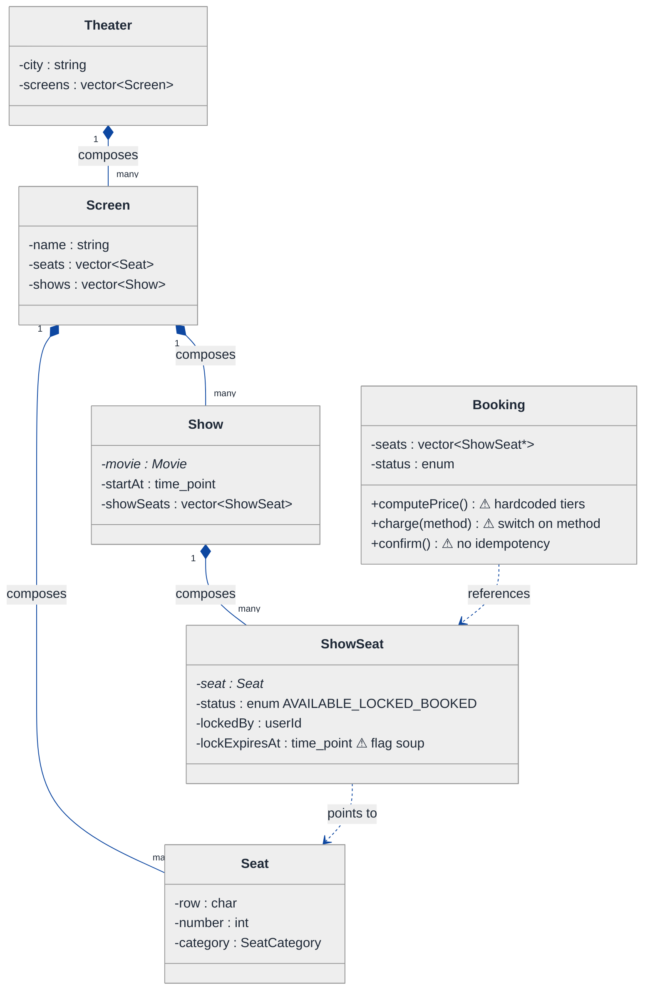
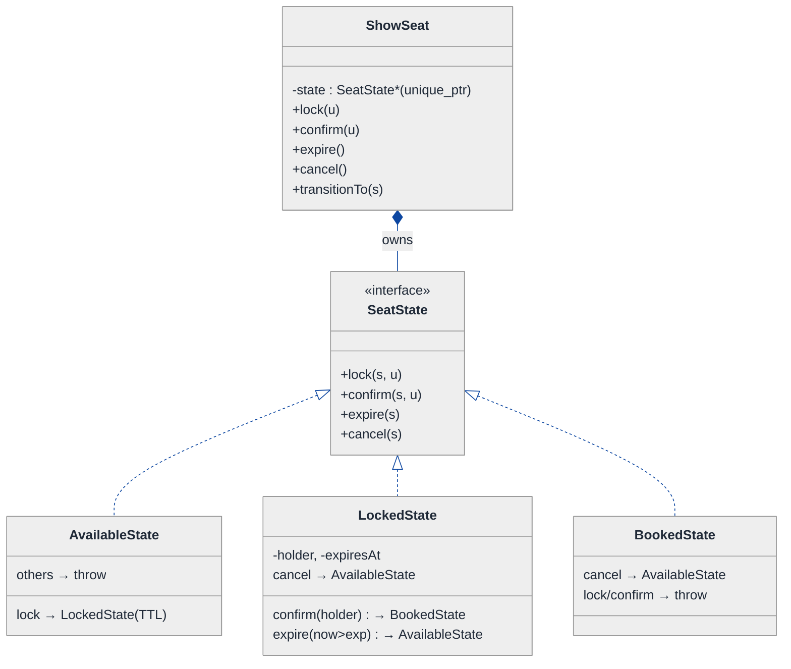
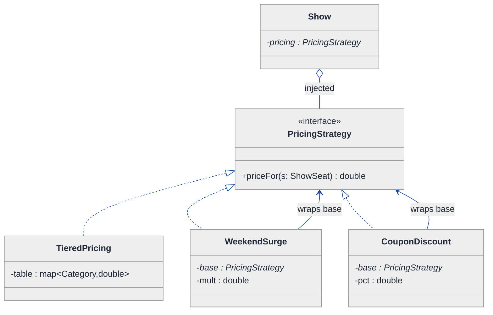
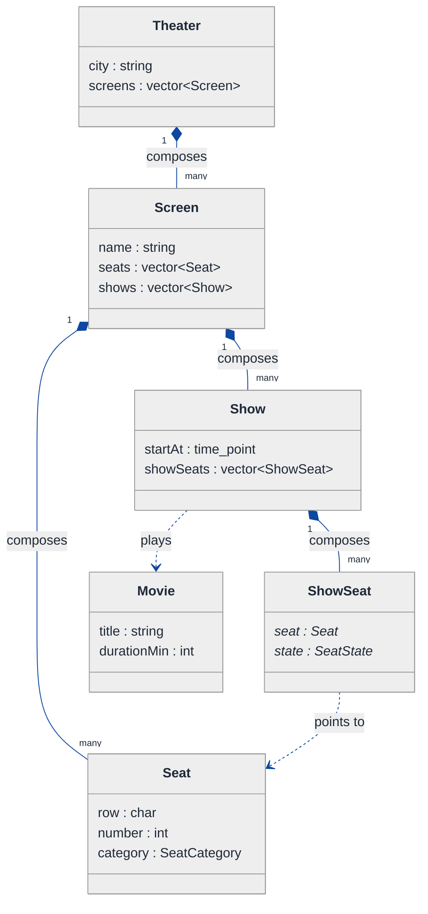
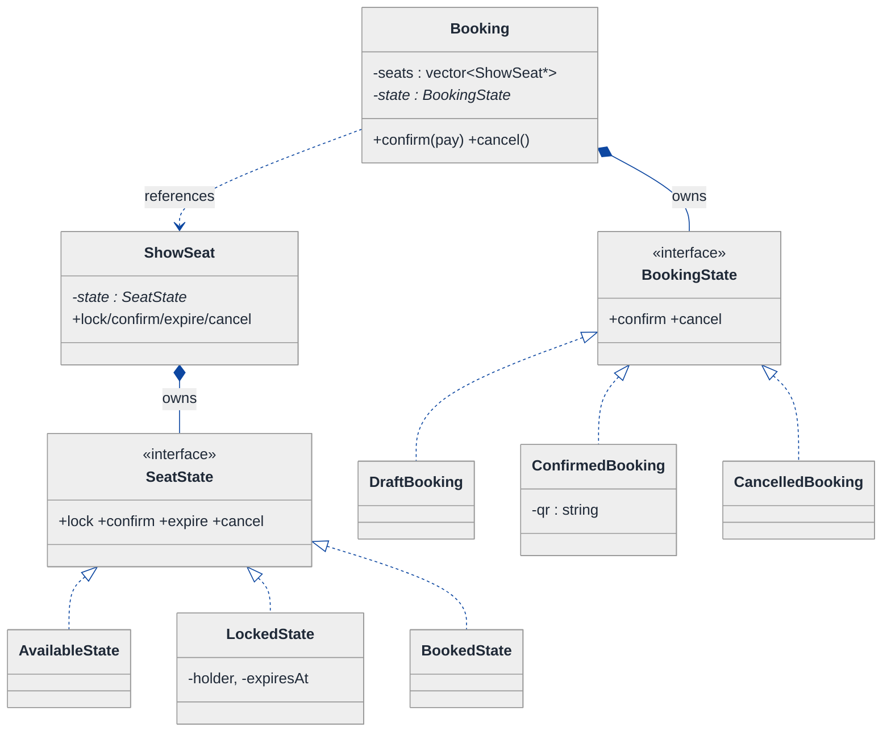
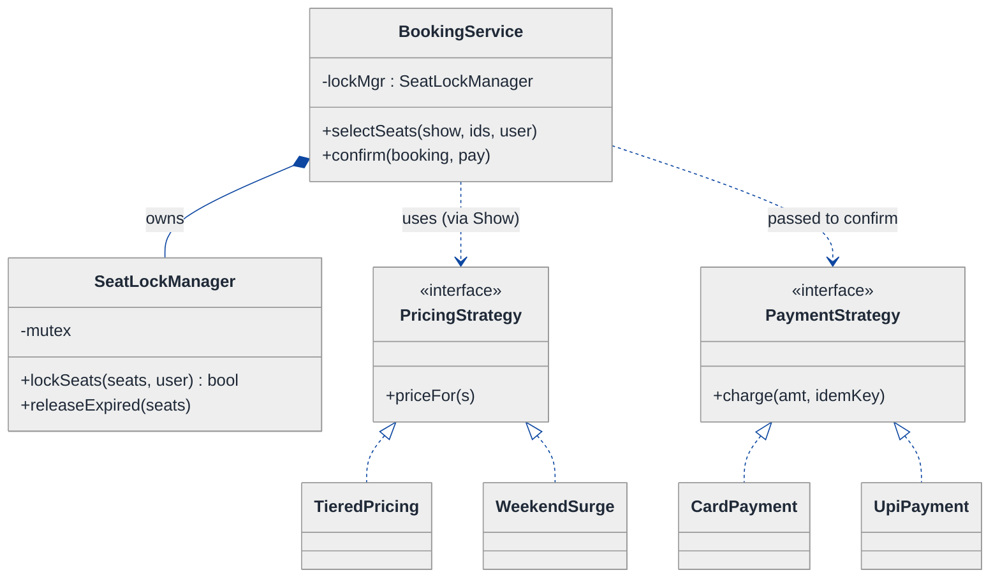
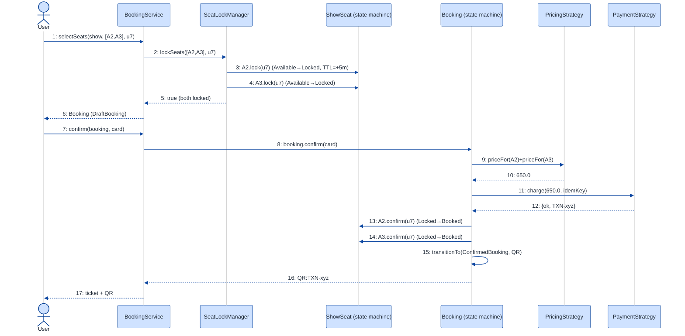
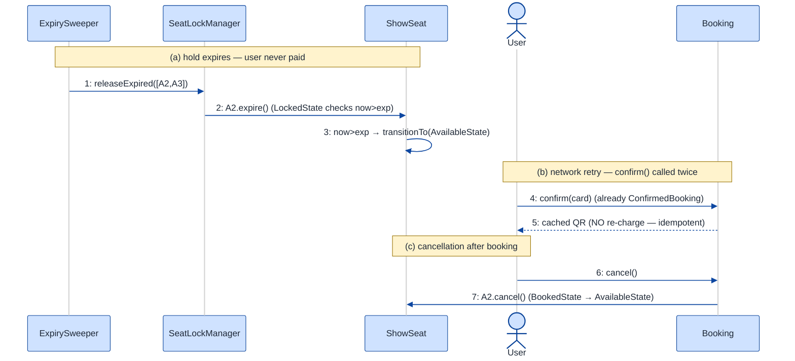

# Movie Ticket Booking (BookMyShow) — LLD Walkthrough

> **Difficulty:** Hard · **Time:** ~45 min · **Pattern focus:** State (seat + booking lifecycle) + Strategy (pricing/payment) + seat-level real-time locking
>
> **Problem source(s):** GID `ST9`, bucket `State_Pattern`. Representative of the "design BookMyShow / Ticketmaster" family in [`./EXTRACTED_QUESTIONS.md`](./EXTRACTED_QUESTIONS.md).
>
> **Diagrams:** inline mermaid (renders natively in GitHub / VS Code). Canonical theme block per [`../../../CONTINUATION.md`](../../../CONTINUATION.md) §3.

---

## How to use this file

Paced for a candidate seeing the BookMyShow problem for the first time. Reading time: ~45 minutes if you sketch each iteration by hand. **The lesson: the interesting part of this problem is NOT the catalog (theaters, screens, showtimes) — that's just data. The interesting part is the seat lifecycle under concurrency: a seat goes AVAILABLE → LOCKED → BOOKED, the lock must expire, and two users must never book the same seat. DERIVE the State pattern by writing the naive enum-and-flag version first, then watching it rot under three concurrency requirements.**

**Map of this file (15 sections):**

1. Problem statement + clarifying questions
2. Plain-English restatement
3. Why this matters
4. Mental model
5. Try it yourself first
6. Entity & verb extraction
7. **Iteration 1: the naive design** — enum status + booleans
8. **Where the naive design hurts** — three concurrency/lifecycle requirements, one painful diff each
9. **Pivot 1: State for the seat lifecycle** — the most painful axis first
10. **Pivot 2: Strategy for pricing tiers** — algorithm picked by config
11. **Pivot 3: Strategy for payment + the locking mechanism** — TTL locks, idempotent confirmation
12. Final UML class diagram (three sub-views)
13. Skeleton code (C++)
14. Key flow — sequence diagram (lock → pay → confirm; and lock expiry)
15. Extensibility re-check + anti-patterns + how to think aloud + self-check

---

## 1. Problem statement + clarifying questions

**Prompt (typical phrasing):** "Design a movie ticket booking system like BookMyShow. Support theater/screen management, seat selection with real-time locking, showtime scheduling, pricing tiers, and booking confirmation with QR-code generation."

**Clarifying questions to ask BEFORE drawing anything:**

1. **Seat hold semantics?** When a user selects seats, do we hold them temporarily (a lock with a TTL, e.g., 5 minutes to pay) or only commit at payment? This single answer drives the whole design.
2. **Concurrency guarantee?** Must we *guarantee* two users never book the same seat, or is best-effort acceptable? (Assume guarantee — it's the whole point of "real-time locking.")
3. **Pricing model?** Flat per show, or tiers (recliner / premium / regular), plus weekend/peak surge, plus coupons? How many independent pricing rules in year one?
4. **Showtime scope?** One theater or a chain across cities? Can the same movie play on multiple screens at overlapping times? (Assume a chain, multi-screen.)
5. **Payment + confirmation?** Card/UPI/wallet? Is the QR code generated at confirmation or emailed later? What happens if payment succeeds but confirmation crashes (idempotency)?
6. **Cancellation / refund?** Can a booked ticket be cancelled, and does the seat return to the pool? (Assume yes — it adds a lifecycle state.)
7. **Single process or distributed?** Are we modeling one server's in-memory state, or do locks need to survive across nodes? (Assume single-process for the LLD; we note the distributed extension in §15.)

**Assumptions if the interviewer dodges:** multi-screen chain; seats are *locked with a 5-minute TTL* on selection; the system must guarantee no double-booking; tiered + surge + coupon pricing; card/UPI/wallet payment; QR generated at confirmation; confirmation is idempotent; cancellation returns the seat; single-process (one mutex domain) for the core model.

---

## 2. Plain-English restatement

We're building the software behind a movie-ticket app. A user browses a city's theaters, picks a showtime on a specific screen, sees the seat map, selects a few seats, and gets a short window to pay. During that window, nobody else can grab those seats. If they pay in time, the seats become permanently booked and a QR ticket is issued. If they don't pay (or abandon the tab), the hold expires and the seats return to the pool. The design must let us add new pricing rules, new payment methods, and new seat lifecycle states (cancellation, reservation hold) **without rewriting the core booking flow** — and it must make double-booking *structurally impossible*, not merely unlikely.

---

## 3. Why this matters

This is the canonical "lifecycle under concurrency" interview question, and it's where most candidates fall down. They model the catalog beautifully (theaters compose screens compose seats) and then represent seat status as a `bool isBooked` or a 2-value enum — which cannot express "held by someone else, expiring at 14:05." The skill being probed is recognizing that a **seat is a state machine** (AVAILABLE → LOCKED → BOOKED → AVAILABLE-again-on-cancel), that the transitions are driven by *internal events and time*, not by a caller flipping a flag, and that the lock+confirm flow needs idempotency. Get this right and you've shown you understand the State pattern, the difference between State and Strategy, and concurrency-safe object design — the exact trio interviewers grade.

---

## 4. Mental model

A cinema booking system is a **catalog of inventory** (which seat exists where, in which show) wrapped around a **rule-book of policy** (what each seat costs, how you pay) sitting on top of a **lifecycle engine** (what a seat is allowed to do next, and when its hold expires). The catalog is boring data. The lifecycle is the hard part, and it is fundamentally a per-seat-per-show state machine.

```
Real-world sketch (NOT a UML diagram yet):

   Theater "PVR Phoenix"
   ├── Screen 1 ── Show 18:00  seat map:  [A1 ✓avail] [A2 🔒locked-by-u7 til 18:05] [A3 ✗booked]
   │                          │            [B1 ✓]     [B2 ✓]                        [B3 ✗]
   │            ── Show 21:00  seat map:  ...
   └── Screen 2 ── Show 19:30  seat map:  ...

   The same physical seat "A2" has a DIFFERENT lifecycle state in each show.
   So the state lives on (seat × show) = a "ShowSeat", not on the physical seat.

   user picks A2 ──► LOCK (start 5-min timer) ──► pay in time? ──► BOOK + QR
                                              └──► timer fires ──► back to AVAILABLE
```

The KEY insight from this picture: **status is not a flag, it is a phase**, and the phase transitions are owned by the seat-in-a-show, driven by user events (`lock`, `confirm`, `cancel`) and by time (`expire`). Inventory vs. policy vs. lifecycle is the separation we'll bake in.

---

## 5. Try it yourself first

> **Predict before reading on:**
>
> 1. List 5 nouns you'd promote to a class. Which noun holds the seat *status* — the physical `Seat`, or something else?
> 2. **If I told you a held seat must auto-release after 5 minutes if unpaid, what would change about how you store seat status?** Could a `bool isBooked` express "held, expiring at 18:05"?
> 3. If a booked ticket can later be *cancelled* and the seat returned to the pool, where does the rule "you can only cancel a BOOKED seat, never an AVAILABLE one" live?

---

## 6. Entity & verb extraction

> **Mini-refresher: noun → class, but not every noun.**
>
> Naive OOD promotes every noun to a class. Senior OOD promotes a noun only if it has both BEHAVIOR and STATE that need to live together. "City" usually stays a field; "seat-in-a-show" becomes a class because it has lifecycle behavior (lock/confirm/expire) AND state (who holds it, until when).

**Nouns from the prompt:**

| Noun | Decision | Why |
|---|---|---|
| Theater | Class | Owns screens, located in a city |
| Screen / Auditorium | Class | Owns a physical seat layout, hosts shows |
| Seat (physical) | Class | Row/number/category — pure data, NO status |
| Show / Showtime | Class | A (movie × screen × startTime); owns the per-seat lifecycle |
| ShowSeat | Class (the star) | seat × show; HOLDS the lifecycle state |
| Movie | Class | Title, duration, certification — mostly data |
| Booking | Class | A user's set of ShowSeats + payment + QR; has its own lifecycle |
| Ticket / QR | Field/value on a confirmed Booking | Generated artifact, no behavior of its own |
| City | Field on Theater (`std::string`) | No behavior |
| Price / money | Library/value type | No domain behavior |

**Verbs (and the class they live on):**

| Verb | Owner class (naive answer — we'll re-examine) |
|---|---|
| selectSeats / lock(seats) | BookingService, delegating to ShowSeat |
| confirm(payment) | Booking |
| expire() | ShowSeat (time-driven) |
| cancel() | Booking → ShowSeat |
| computePrice(showSeat) | Show / ShowSeat (naive) |
| charge(amount, method) | Booking (naive) |
| generateQR() | Booking |

**We have NOT introduced any design patterns yet.** Pure nouns + verbs.

---

## 7. <a id="iter-1"></a>Iteration 1: the naive design

Let's write the simplest thing that could possibly work. No design patterns — a `ShowSeat` with a status enum and a couple of fields, a `Booking` that prices and charges inline.



**Reader's tour (read top to bottom; ~60 seconds).**

1. **The catalog spine (left).** `Theater ◆── Screen ◆── Seat` and `Screen ◆── Show ◆── ShowSeat`. Filled diamonds = composition (same lifetime). This part is fine and stays fine — it's just inventory.

2. **`Seat` is pure data.** Row, number, category. Crucially, it has NO status — the same physical seat A2 is available in the 18:00 show and booked in the 21:00 show, so status can't live here.

3. **`ShowSeat` is the trouble zone (first ⚠).** Status is a 3-value enum, plus a `lockedBy` user id, plus a `lockExpiresAt` timestamp. Three fields that must be kept consistent by hand. "Is this seat lockable right now?" becomes a tangle of `if (status == LOCKED && now > lockExpiresAt)` checks scattered wherever a seat is touched.

4. **`Booking` is the second trouble zone (two more ⚠).** `computePrice()` hardcodes tier rates in an if/else. `charge(method)` is a switch on payment type. `confirm()` has no idempotency — if it runs twice (retry after a flaky network), it double-charges.

**What's deliberately missing.** No state objects — status is an enum. No `PricingStrategy`. No `PaymentMethodStrategy`. No lock manager with TTL ownership. The naive design doesn't even *acknowledge* these as axes of variation; it bakes a hardcoded answer into the methods that use them. That's what the next sections expose and fix.

Skeleton code for the naive design (C++):

```cpp
#include <chrono>
#include <optional>
#include <stdexcept>
#include <string>
#include <vector>

enum class SeatCategory { REGULAR, PREMIUM, RECLINER };
enum class SeatStatus   { AVAILABLE, LOCKED, BOOKED };
enum class PayMethod    { CARD, UPI, WALLET };
enum class BookingState { DRAFT, CONFIRMED, CANCELLED };

using Clock = std::chrono::system_clock;

struct Seat { char row; int number; SeatCategory category; };

class ShowSeat {
public:
    explicit ShowSeat(Seat* s) : seat_(s) {}

    // Tries to lock for a user. Tangled flag logic — will hurt.
    bool lock(const std::string& userId) {
        if (status_ == SeatStatus::LOCKED && Clock::now() > lockExpiresAt_)
            status_ = SeatStatus::AVAILABLE;            // lazy expiry, easy to forget
        if (status_ != SeatStatus::AVAILABLE) return false;
        status_       = SeatStatus::LOCKED;
        lockedBy_     = userId;
        lockExpiresAt_= Clock::now() + std::chrono::minutes(5);
        return true;
    }
    void book(const std::string& userId) {
        if (status_ != SeatStatus::LOCKED || lockedBy_ != userId)
            throw std::runtime_error("Seat not locked by you");
        status_ = SeatStatus::BOOKED;
    }
    SeatCategory category() const { return seat_->category; }
private:
    Seat*        seat_;
    SeatStatus   status_ = SeatStatus::AVAILABLE;
    std::string  lockedBy_;
    Clock::time_point lockExpiresAt_{};
};

class Booking {
public:
    BookingState state = BookingState::DRAFT;
    std::vector<ShowSeat*> seats;

    double computePrice() const {                       // hardcoded tiers — will hurt
        double total = 0;
        for (auto* s : seats) {
            switch (s->category()) {
                case SeatCategory::REGULAR:  total += 150; break;
                case SeatCategory::PREMIUM:  total += 250; break;
                case SeatCategory::RECLINER: total += 400; break;
            }
        }
        return total;
    }
    struct Receipt { bool ok; std::string ref; };
    Receipt charge(PayMethod m) {                        // switch on method — will hurt
        double amount = computePrice();
        switch (m) {
            case PayMethod::CARD:   return { true, "card-..." };
            case PayMethod::UPI:    return { true, "upi-..."  };
            case PayMethod::WALLET: return { true, "wal-..."  };
        }
        return { false, "" };
    }
    std::string confirm(PayMethod m, const std::string& userId) {  // no idempotency — will hurt
        auto res = charge(m);
        if (!res.ok) throw std::runtime_error("Payment failed");
        for (auto* s : seats) s->book(userId);
        state = BookingState::CONFIRMED;
        return "QR:" + res.ref;                          // generate QR inline
    }
};
```

**This works.** It has zero design patterns. We can lock, charge, confirm. So what's wrong with it?

---

## 8. <a id="naive-pain"></a>Where the naive design hurts

The interviewer slides a piece of paper across the desk: "Here are three requirements coming next sprint. Walk me through what changes."

### Change A: "Held seats must auto-release after 5 minutes — and the release must be observable (free up the UI, notify the next user in a waitlist)"

In the naive design:
- Expiry is *lazy* — it only happens the next time someone calls `lock()` on that exact seat (see line `if (status_ == LOCKED && now > lockExpiresAt_)`). A seat held by an abandoned tab stays "LOCKED" in the seat map forever until someone tries to grab it.
- To make expiry *active* (a timer fires, seat returns to pool, UI refreshes), you need a transition that the `ShowSeat` doesn't model — there's no single place that owns "what happens when the hold ends." You'd sprinkle the same `status_ = AVAILABLE; lockedBy_.clear(); lockExpiresAt_ = {};` reset in `lock()`, in a sweeper, and in `cancel()`.
- **The change touches every method that reads `status_` AND every method that resets the three flags. The transition logic is smeared across the class.**

### Change B: "Add a RESERVED state (corporate/loyalty block-booking held indefinitely, convertible to BOOKED) and a CANCELLED-returns-to-pool flow"

In the naive design:
- `SeatStatus` enum gains `RESERVED`. Now every `if (status_ == ...)` site must consider the new value, and every `switch (status_)` that doesn't have a `default` silently mishandles it.
- The legal-transition matrix grows: AVAILABLE→RESERVED, RESERVED→BOOKED, BOOKED→AVAILABLE (cancel). Each of these becomes another scattered `if`.
- **`lock()`, `book()`, and a new `cancel()` and `reserve()` all need their own guard ladders. N states × M events = N×M conditionals, all in one class.** This is the classic enum-state explosion.

### Change C: "Make confirmation idempotent — if the user's network retries `confirm()`, charge once and return the same QR; and add a coupon + weekend surge to pricing"

In the naive design:
- `confirm()` has no record of whether it already ran. A retry re-enters `charge()` and double-charges. To fix it you add an `if (state == CONFIRMED) return cachedQR;` guard plus a stored `cachedQR_` — bolting state checks onto an already-overloaded method.
- `computePrice()` must now layer coupon discount on top of weekend surge on top of base tier. The switch becomes a 20-line nested mess, and the next pricing rule adds 10 more lines.
- **Pricing surgery happens inside `computePrice`; idempotency surgery happens inside `confirm`; both methods accrete rules forever.**

### The pattern of pain

| Change | Files/methods touched | Smell |
|---|---|---|
| A. Active expiry | `ShowSeat::lock` + sweeper + `cancel` | "Transition logic smeared; no owner for 'hold ends'." |
| B. RESERVED + cancel | `SeatStatus` enum + every `if (status==)` + 4 methods | "Enum-state explosion: N states × M events conditionals." |
| C. Idempotent confirm + coupons | `Booking::confirm` + `Booking::computePrice` | "Single methods accumulate every rule and every guard." |

**Two axes of pain dominate:** lifecycle variability (seat status, booking status — what's valid next, who owns transitions, time-driven expiry) and algorithm variability (pricing rules, payment methods).

> **Pivot question:** "What pattern handles 'a lifecycle where each phase has its own legal operations and owns its own transitions (including a time-driven one)'? What pattern handles 'an algorithm that varies, swapped by config or caller'?"
>
> The answers are State and Strategy. Because the seat lifecycle is the heart of this problem (and the most painful axis), we introduce State FIRST.

---

## 9. <a id="pivot-1"></a>Pivot 1: State for the seat lifecycle

The dominant pain (Changes A and B) is the seat status enum + scattered guards. The variability here is NOT in an algorithm — it's in *what operations are legal* and *what comes next*. That's the State pattern's home turf.

> **Mini-refresher: State pattern.**
>
> Each lifecycle phase becomes its own class implementing a shared state interface. The context object (here `ShowSeat`) delegates each operation to its current state object, and THE STATE decides the next state. Transitions are INTERNAL — driven by events the context receives (`lock`, `confirm`, `expire`, `cancel`), not by a caller assigning a flag. Illegal operations are simply methods that throw (or no-op) in the states where they don't apply.

**Why State fits the seat.** The choice of "what state am I in" is not picked by the caller — it's driven by what the seat has been through and by time. An AVAILABLE show-seat can `lock()`. A LOCKED seat can `confirm()` (→ BOOKED) or `expire()` (→ AVAILABLE) or `cancel()` the hold. A BOOKED seat can `cancel()` (→ AVAILABLE) but cannot be locked. Calling `confirm()` on an AVAILABLE seat is *meaningless* — it should fail. The lifecycle is the SEAT'S concern.

**The refactor (just the seat-lifecycle slice):**

```cpp
class ShowSeat;  // forward — the context

class SeatState {
public:
    virtual ~SeatState() = default;
    // Each operation; default = "illegal in this state".
    virtual void lock(ShowSeat&, const std::string& userId) { throw std::logic_error("cannot lock"); }
    virtual void confirm(ShowSeat&, const std::string& userId) { throw std::logic_error("cannot confirm"); }
    virtual void expire(ShowSeat&)  { /* no-op unless overridden */ }
    virtual void cancel(ShowSeat&)  { throw std::logic_error("nothing to cancel"); }
    virtual const char* name() const = 0;
};

class AvailableState : public SeatState {
public:
    void lock(ShowSeat& s, const std::string& userId) override;  // → LockedState, sets TTL
    const char* name() const override { return "AVAILABLE"; }
};

class LockedState : public SeatState {
public:
    LockedState(std::string holder, Clock::time_point expiresAt)
        : holder_(std::move(holder)), expiresAt_(expiresAt) {}
    void confirm(ShowSeat& s, const std::string& userId) override;  // guard holder, → BookedState
    void expire(ShowSeat& s) override;                              // if now>expiresAt → AvailableState
    void cancel(ShowSeat& s) override;                              // user releases hold → AvailableState
    const char* name() const override { return "LOCKED"; }
    const std::string& holder() const { return holder_; }
    Clock::time_point   expiresAt() const { return expiresAt_; }
private:
    std::string       holder_;
    Clock::time_point expiresAt_;
};

class BookedState : public SeatState {
public:
    void cancel(ShowSeat& s) override;   // refund flow returns seat → AvailableState
    const char* name() const override { return "BOOKED"; }
};

class ShowSeat {
public:
    explicit ShowSeat(Seat* s) : seat_(s), state_(std::make_unique<AvailableState>()) {}
    void transitionTo(std::unique_ptr<SeatState> next) { state_ = std::move(next); }
    void lock(const std::string& u)    { state_->lock(*this, u); }
    void confirm(const std::string& u) { state_->confirm(*this, u); }
    void expire()                      { state_->expire(*this); }
    void cancel()                      { state_->cancel(*this); }
    std::string status() const { return state_->name(); }
    SeatCategory category() const { return seat_->category; }
private:
    Seat*                       seat_;
    std::unique_ptr<SeatState>  state_;
};

// transition bodies (deferred until ShowSeat is complete)
inline void AvailableState::lock(ShowSeat& s, const std::string& userId) {
    s.transitionTo(std::make_unique<LockedState>(userId, Clock::now() + std::chrono::minutes(5)));
}
inline void LockedState::confirm(ShowSeat& s, const std::string& userId) {
    if (userId != holder_)            throw std::logic_error("not your lock");
    if (Clock::now() > expiresAt_)  { s.transitionTo(std::make_unique<AvailableState>());
                                      throw std::logic_error("lock expired"); }
    s.transitionTo(std::make_unique<BookedState>());
}
inline void LockedState::expire(ShowSeat& s) {
    if (Clock::now() > expiresAt_) s.transitionTo(std::make_unique<AvailableState>());
}
inline void LockedState::cancel(ShowSeat& s) { s.transitionTo(std::make_unique<AvailableState>()); }
inline void BookedState::cancel(ShowSeat& s) { s.transitionTo(std::make_unique<AvailableState>()); }
```

**What changed — visualized.** Just the seat-lifecycle slice:



**Tour of the after-state.**

1. **The `SeatStatus` enum and the three flags are GONE.** They're replaced by one `state` field of type `std::unique_ptr<SeatState>` (exclusive ownership). The `lockedBy` and `lockExpiresAt` data now lives *inside* `LockedState` — exactly where it's relevant, and nowhere else. A `BookedState` can't even *hold* an expiry timestamp; the data and the phase are unified.

2. **`ShowSeat`'s four methods became one-liners.** Each delegates: `state_->lock(*this, u)`, etc. **No `if (status == X)` ladder anywhere.**

3. **The interface declares the contract.** `SeatState` has four operations. The base class provides default "throw" bodies, so each concrete state only overrides the operations that are *legal* in that phase — `AvailableState` overrides only `lock`; `LockedState` overrides `confirm`/`expire`/`cancel`. Calling `confirm()` on an AvailableState hits the base-class throw. **Illegal transitions are impossible by construction.**

4. **The time-driven transition has a home.** `expire()` is just another operation on the interface. `LockedState::expire` checks the clock and self-transitions to AVAILABLE. A background sweeper (or a per-lock timer) calls `seat.expire()` — it doesn't need to know any of the flag logic. Change A from §8 lands cleanly.

5. **Transitions live WITH the state.** Each state's method calls `s.transitionTo(...)` when its work is done. The state knows what comes next; `ShowSeat` and `Booking` never branch on status.

**Changes A and B from §8 now land cleanly.** Active expiry → `LockedState::expire`, called by a sweeper. RESERVED state → one new `ReservedState` class implementing `confirm` (→ Booked) and `cancel`; no edits to the existing states. Open/closed.

**Pattern-discrimination cheatsheet — State vs Strategy.**
- *Strategy:* the CALLER picks which algorithm to use; strategies are usually unaware of each other; the swap is external (`ctx.setStrategy(x)`).
- *State:* the OBJECT picks its next state internally; states know about each other (each `transitionTo`s a sibling); the swap is event-driven (`ctx.handleEvent(e)`).
- *Rule of thumb:* swap happens because external code said so → Strategy. Swap happens because of an internal event/time flow → State. Seat status flips because of `lock`/`confirm`/`expire` events, not because a caller assigns it → **State.**

---

## 10. <a id="pivot-2"></a>Pivot 2: Strategy for pricing tiers

Change C from §8 has two halves. The pricing half is pure algorithm variability — base tier, then weekend surge, then coupon discount, possibly stacked. State doesn't help; the variability is *the computation itself*, picked by show/lot config, not driven by an internal event flow.

> **Mini-refresher: Strategy pattern.**
>
> Encapsulates an algorithm behind an interface so it can be swapped at runtime. The CALLER (or config) decides which strategy to use; the strategy doesn't know about its peers. A `Sorter` takes a `CompareStrategy*`; pass `Ascending` or `Descending` and the sorter doesn't care.

**Why Strategy fits pricing.** Pricing is an algorithm (`given a ShowSeat, return a number`). It varies (flat, tiered, weekend surge, coupon) and the variants COMPOSE (surge × coupon × tier all at once). The choice is made by show configuration, externally. Textbook Strategy — and the composable variants are decorators wrapping a base strategy.

**The refactor (just the pricing slice):**

```cpp
class PricingStrategy {
public:
    virtual ~PricingStrategy() = default;
    virtual double priceFor(const ShowSeat& s) const = 0;
};

class TieredPricing : public PricingStrategy {
public:
    explicit TieredPricing(std::unordered_map<SeatCategory, double> table)
        : table_(std::move(table)) {}
    double priceFor(const ShowSeat& s) const override {
        auto it = table_.find(s.category());
        return it != table_.end() ? it->second : 150.0;
    }
private:
    std::unordered_map<SeatCategory, double> table_;
};

// Decorator: multiplies the wrapped price on weekend/peak windows.
class WeekendSurge : public PricingStrategy {
public:
    WeekendSurge(std::unique_ptr<PricingStrategy> base, double mult)
        : base_(std::move(base)), mult_(mult) {}
    double priceFor(const ShowSeat& s) const override {
        double p = base_->priceFor(s);
        return isWeekend(/* show start */) ? p * mult_ : p;
    }
private:
    std::unique_ptr<PricingStrategy> base_;
    double mult_;
};

// Decorator: applies a coupon discount to the wrapped price.
class CouponDiscount : public PricingStrategy {
public:
    CouponDiscount(std::unique_ptr<PricingStrategy> base, double pct)
        : base_(std::move(base)), pct_(pct) {}
    double priceFor(const ShowSeat& s) const override {
        return base_->priceFor(s) * (1.0 - pct_);
    }
private:
    std::unique_ptr<PricingStrategy> base_;
    double pct_;
};
// Compose: CouponDiscount(WeekendSurge(TieredPricing)) — three rules stacked.

class Show {
    // ...
    std::unique_ptr<PricingStrategy> pricing_;   // injected per show
};
```

Notice `Booking::computePrice()` is GONE as a place where rates live — it now sums `show.pricing().priceFor(seat)` over the booking's seats. The algorithm moved out of `Booking` entirely.

**What changed — visualized.** The pricing slice:



**Tour of the after-state.**

1. **`Show` gained a `pricing` pointer** (open diamond = aggregation; injected, not owned forever). The hardcoded tier switch in `Booking` is gone.
2. **`TieredPricing` is the base** — a category→rate table, the old logic now isolated and testable.
3. **`WeekendSurge` and `CouponDiscount` are DECORATORS** — each holds a `PricingStrategy* base` and modifies its result. You can stack them: `CouponDiscount(WeekendSurge(TieredPricing))` = "tier, then surge, then coupon." The naive nested if/else couldn't express this without rewriting `computePrice`.
4. **Change C's pricing half lands cleanly.** New rule = new decorator class. No surgery in `Booking` or `Show`.

**Pattern-discrimination cheatsheet — Strategy vs Decorator (when they look identical).**
- *Strategy:* one of several interchangeable algorithms; you pick ONE.
- *Decorator:* wraps another instance of the SAME interface to ADD behavior; you can stack many.
- *Rule of thumb:* "pick one of N" → Strategy. "layer N modifiers over a base" → Decorator. Here `TieredPricing` is the Strategy you pick; `WeekendSurge`/`CouponDiscount` are Decorators that share the interface so they can be composed.

---

## 11. <a id="pivot-3"></a>Pivot 3: Strategy for payment + the locking mechanism + idempotent booking

Two things remain: the payment switch (Change C's mention of methods) and the *mechanism* that guarantees no double-booking plus idempotent confirmation.

### 11.1 Payment — same shape as pricing

```cpp
class PaymentStrategy {
public:
    struct Receipt { bool ok; std::string txnRef; };
    virtual ~PaymentStrategy() = default;
    virtual Receipt charge(double amount, const std::string& idemKey) = 0;
};
class CardPayment   : public PaymentStrategy { /* Stripe; passes idemKey to gateway */ };
class UpiPayment    : public PaymentStrategy { /* UPI collect  */ };
class WalletPayment : public PaymentStrategy { /* internal balance */ };
```

Same derivation as Pivot 2: an algorithm (`charge`) picked by the caller per-transaction. Note the `idemKey` — payment gateways de-duplicate by it, which feeds the idempotency story below.

### 11.2 The Booking lifecycle is ALSO a State machine

The booking itself has a lifecycle: DRAFT → CONFIRMED → CANCELLED. The idempotency requirement (Change C) is naturally a *state* concern: a `ConfirmedBooking` that receives a second `confirm()` should return its cached QR, not re-charge. That's the State pattern again, one level up from the seat.

```cpp
class Booking;  // context

class BookingState {
public:
    virtual ~BookingState() = default;
    virtual std::string confirm(Booking&, PaymentStrategy&) = 0;
    virtual void cancel(Booking&) { throw std::logic_error("cannot cancel"); }
    virtual const char* name() const = 0;
};

class DraftBooking : public BookingState {
public:
    std::string confirm(Booking& b, PaymentStrategy& pay) override;   // charge → seats.confirm → QR → ConfirmedBooking
    const char* name() const override { return "DRAFT"; }
};
class ConfirmedBooking : public BookingState {
public:
    explicit ConfirmedBooking(std::string qr) : qr_(std::move(qr)) {}
    std::string confirm(Booking&, PaymentStrategy&) override { return qr_; }  // IDEMPOTENT: return cached QR, no re-charge
    void cancel(Booking& b) override;                                          // refund + seats.cancel → CancelledBooking
    const char* name() const override { return "CONFIRMED"; }
private:
    std::string qr_;
};
class CancelledBooking : public BookingState {
public:
    std::string confirm(Booking&, PaymentStrategy&) override { throw std::logic_error("cancelled"); }
    const char* name() const override { return "CANCELLED"; }
};
```

**Idempotency falls out for free.** A retried `confirm()` on a `ConfirmedBooking` returns the cached QR — no `if (state == CONFIRMED)` guard bolted onto a giant method, just polymorphic dispatch. The State pattern made the requirement disappear.

### 11.3 The lock mechanism — guaranteeing no double-booking

State models *one* seat's phases, but two threads can both see an `AvailableState` and both call `lock()` (a race). The State pattern is necessary but not sufficient — we need a `SeatLockManager` that makes the check-and-flip atomic.

> **Mini-refresher: why a flag/enum alone can't guarantee no double-booking.**
>
> `if (available) { lock(); }` is a check-then-act race: two threads read `available == true` before either flips it. You need the read-and-flip to be ATOMIC. In a single process that's a `std::mutex` (or a per-seat compare-and-swap); across nodes it's a distributed lock (Redis `SET NX PX`, or a DB row lock with `SELECT ... FOR UPDATE`).

```cpp
class SeatLockManager {
public:
    // Atomically lock ALL requested seats for a user, or none (all-or-nothing).
    bool lockSeats(const std::vector<ShowSeat*>& seats, const std::string& userId) {
        std::scoped_lock guard(mutex_);                 // single-process atomicity
        for (auto* s : seats)
            if (s->status() != "AVAILABLE") return false;  // someone else holds one
        for (auto* s : seats) s->lock(userId);           // safe: we hold the mutex
        return true;
    }
    void releaseExpired(const std::vector<ShowSeat*>& seats) {
        std::scoped_lock guard(mutex_);
        for (auto* s : seats) s->expire();               // LockedState::expire self-checks TTL
    }
private:
    std::mutex mutex_;
};
```

The lock manager is the *coordination* layer; the State pattern is the *per-seat lifecycle* layer. **All-or-nothing** matters: if a user picks A2+A3 and A3 is taken, we must not leave A2 locked. Holding the mutex across the whole batch gives that atomicity.

> **Mini-refresher: why three independent Strategy hierarchies don't share one interface.**
>
> Strategy is a *role*, not a type. `PricingStrategy` and `PaymentStrategy` take different inputs and return different outputs; they have nothing in common at the type level. Don't unify them under a generic `Strategy<T>` — that's premature genericism.

**The lesson.** Once we recognized "lifecycle with internal transitions" as State for the seat, the *same* shape solved the booking lifecycle (and gave idempotency for free). Once we recognized "algorithm picked externally" as Strategy for pricing, the same shape solved payment. **Pattern recognition makes subsequent design cheap** — but you still need a concurrency primitive (the lock manager) that no GoF pattern provides.

---

## 12. <a id="fig-class-diagram"></a>Final class diagram

One huge diagram is a wall of boxes. Here are **three focused sub-views**; the structural insight at the end ties them together.

### 12.1 The inventory spine — what the chain OWNS



**Tour of 12.1.** Filled diamonds = composition (same lifetime). `Theater` owns `Screen`s; a `Screen` owns both its physical `Seat`s and its `Show`s. A `Show` owns a `ShowSeat` per physical seat — that's where the per-(seat × show) lifecycle lives. `Show` points at a shared `Movie` (dependency, not ownership — a movie plays in many shows). This catalog layer is unchanged from the naive design; it didn't need patterns. The patterns live in the next two views.

### 12.2 The lifecycle layer — State for ShowSeat AND for Booking



**Tour of 12.2.**

1. **Two independent State machines.** `ShowSeat` owns a `SeatState` (AVAILABLE/LOCKED/BOOKED); `Booking` owns a `BookingState` (DRAFT/CONFIRMED/CANCELLED). Filled diamonds = `unique_ptr` ownership of the current state.
2. **`Booking` references the `ShowSeat`s it holds** (dependency arrow — the show owns the seats, not the booking). When `DraftBooking::confirm` succeeds, it calls `confirm()` on each `ShowSeat`, driving each seat's State machine to BOOKED.
3. **`ConfirmedBooking` caches the QR** and returns it on a repeated `confirm()` — idempotency as a state behavior, no guard ladders.
4. **Adding a state is one class.** RESERVED seat → one `ReservedState`. REFUNDED booking → one `RefundedBooking`. No edits to existing states. Open/closed at both levels.

### 12.3 The policy + coordination layer — Strategy interfaces and the lock manager



**Tour of 12.3.**

1. **`BookingService` is the orchestrator.** It owns the `SeatLockManager` (composition) and coordinates select → lock → confirm. It does NOT contain pricing or payment logic — those are delegated.
2. **`SeatLockManager` is the coordination primitive.** Its `lockSeats` does the atomic all-or-nothing batch lock under a mutex. This is the piece no GoF pattern gives you — pure concurrency engineering.
3. **`PricingStrategy` is reached via the `Show`** (each show carries its pricing); `PaymentStrategy` is **passed into `confirm()`** by the caller (per-transaction choice — UPI today, card tomorrow). Different ownership, deliberately.
4. **New pricing rule / payment method = one new class** under the relevant interface. Open/closed.

### Structural insight (ties 12.1 + 12.2 + 12.3 together)

| Concern | Pattern used | Why |
|---|---|---|
| **Inventory** (Theater, Screen, Seat, Show) | Plain composition + minimal data | No variation; just structure |
| **Seat lifecycle** (Available→Locked→Booked) | State, OWNED by ShowSeat | Internal, event/time-driven transitions; illegal ops impossible |
| **Booking lifecycle** (Draft→Confirmed→Cancelled) | State, OWNED by Booking | Idempotent confirm falls out as a state behavior |
| **Pricing** (tier, surge, coupon) | Strategy + Decorator, on Show | Config picks variant; variants compose |
| **Payment** (card, UPI, wallet) | Strategy, PASSED to confirm | Caller decides per-transaction |
| **No double-booking** | `SeatLockManager` mutex (not a GoF pattern) | Atomic check-and-flip; all-or-nothing batch |

The big lesson: **State is the spine of this problem** (two machines), Strategy handles the policy axes, and a non-pattern concurrency primitive guarantees correctness. *State for lifecycle, Strategy for behavior variation, a lock for atomicity.* Recognizing which is which is the whole interview.

---

## 13. Skeleton code (C++)

> Show the SHAPES, not the full impl. ~140 lines.

```cpp
#include <chrono>
#include <memory>
#include <mutex>
#include <stdexcept>
#include <string>
#include <unordered_map>
#include <utility>
#include <vector>

using Clock = std::chrono::system_clock;

// ── Forward declarations ────────────────────────────────────────────
class ShowSeat;
class Booking;

// ── Inventory (plain data) ──────────────────────────────────────────
enum class SeatCategory { REGULAR, PREMIUM, RECLINER };
struct Seat   { char row; int number; SeatCategory category; };
struct Movie  { std::string title; int durationMin; };

// ── Seat State machine ──────────────────────────────────────────────
class SeatState {
public:
    virtual ~SeatState() = default;
    virtual void lock(ShowSeat&, const std::string&)    { throw std::logic_error("cannot lock"); }
    virtual void confirm(ShowSeat&, const std::string&) { throw std::logic_error("cannot confirm"); }
    virtual void expire(ShowSeat&)  {}                       // no-op by default
    virtual void cancel(ShowSeat&)  { throw std::logic_error("nothing to cancel"); }
    virtual const char* name() const = 0;
};
class AvailableState : public SeatState {
public:
    void lock(ShowSeat& s, const std::string& u) override;   // → LockedState (TTL)
    const char* name() const override { return "AVAILABLE"; }
};
class LockedState : public SeatState {
public:
    LockedState(std::string holder, Clock::time_point exp) : holder_(std::move(holder)), exp_(exp) {}
    void confirm(ShowSeat& s, const std::string& u) override;  // guard holder + TTL → BookedState
    void expire(ShowSeat& s) override;                          // if expired → AvailableState
    void cancel(ShowSeat& s) override;                          // → AvailableState
    const char* name() const override { return "LOCKED"; }
private:
    std::string       holder_;
    Clock::time_point exp_;
};
class BookedState : public SeatState {
public:
    void cancel(ShowSeat& s) override;                          // refund → AvailableState
    const char* name() const override { return "BOOKED"; }
};
// ReservedState elided — one more subclass, no edits elsewhere.

class ShowSeat {
public:
    explicit ShowSeat(Seat* s) : seat_(s), state_(std::make_unique<AvailableState>()) {}
    void transitionTo(std::unique_ptr<SeatState> n) { state_ = std::move(n); }
    void lock(const std::string& u)    { state_->lock(*this, u); }
    void confirm(const std::string& u) { state_->confirm(*this, u); }
    void expire()                      { state_->expire(*this); }
    void cancel()                      { state_->cancel(*this); }
    std::string  status()   const { return state_->name(); }
    SeatCategory category() const { return seat_->category; }
private:
    Seat*                      seat_;
    std::unique_ptr<SeatState> state_;
};

inline void AvailableState::lock(ShowSeat& s, const std::string& u) {
    s.transitionTo(std::make_unique<LockedState>(u, Clock::now() + std::chrono::minutes(5)));
}
inline void LockedState::confirm(ShowSeat& s, const std::string& u) {
    if (u != holder_)             throw std::logic_error("not your lock");
    if (Clock::now() > exp_)    { s.transitionTo(std::make_unique<AvailableState>());
                                  throw std::logic_error("lock expired"); }
    s.transitionTo(std::make_unique<BookedState>());
}
inline void LockedState::expire(ShowSeat& s) {
    if (Clock::now() > exp_) s.transitionTo(std::make_unique<AvailableState>());
}
inline void LockedState::cancel(ShowSeat& s) { s.transitionTo(std::make_unique<AvailableState>()); }
inline void BookedState::cancel(ShowSeat& s) { s.transitionTo(std::make_unique<AvailableState>()); }

// ── Pricing Strategy (+ Decorators) ─────────────────────────────────
class PricingStrategy {
public:
    virtual ~PricingStrategy() = default;
    virtual double priceFor(const ShowSeat& s) const = 0;
};
class TieredPricing : public PricingStrategy {
public:
    explicit TieredPricing(std::unordered_map<SeatCategory, double> t) : table_(std::move(t)) {}
    double priceFor(const ShowSeat& s) const override {
        auto it = table_.find(s.category());
        return it != table_.end() ? it->second : 150.0;
    }
private:
    std::unordered_map<SeatCategory, double> table_;
};
// WeekendSurge, CouponDiscount decorators elided — each wraps a PricingStrategy* base.

// ── Payment Strategy ────────────────────────────────────────────────
class PaymentStrategy {
public:
    struct Receipt { bool ok; std::string txnRef; };
    virtual ~PaymentStrategy() = default;
    virtual Receipt charge(double amount, const std::string& idemKey) = 0;
};
// CardPayment, UpiPayment, WalletPayment elided.

// ── Show (carries pricing) ──────────────────────────────────────────
class Show {
public:
    Show(Movie* m, Clock::time_point startAt, std::unique_ptr<PricingStrategy> pricing)
        : movie_(m), startAt_(startAt), pricing_(std::move(pricing)) {}
    const PricingStrategy& pricing() const { return *pricing_; }
    std::vector<ShowSeat>& showSeats() { return showSeats_; }
private:
    Movie*                           movie_;
    Clock::time_point                startAt_;
    std::unique_ptr<PricingStrategy> pricing_;
    std::vector<ShowSeat>            showSeats_;
};

// ── Booking State machine ───────────────────────────────────────────
class BookingState {
public:
    virtual ~BookingState() = default;
    virtual std::string confirm(Booking&, PaymentStrategy&) = 0;
    virtual void cancel(Booking&) { throw std::logic_error("cannot cancel"); }
    virtual const char* name() const = 0;
};
class DraftBooking : public BookingState {
public:
    std::string confirm(Booking& b, PaymentStrategy& pay) override;  // charge → seats.confirm → QR
    const char* name() const override { return "DRAFT"; }
};
class ConfirmedBooking : public BookingState {
public:
    explicit ConfirmedBooking(std::string qr) : qr_(std::move(qr)) {}
    std::string confirm(Booking&, PaymentStrategy&) override { return qr_; }  // IDEMPOTENT
    void cancel(Booking& b) override;                                          // refund + seats.cancel
    const char* name() const override { return "CONFIRMED"; }
private:
    std::string qr_;
};
// CancelledBooking elided.

class Booking {
public:
    Booking(std::string user, Show& show, std::vector<ShowSeat*> seats)
        : user_(std::move(user)), show_(show), seats_(std::move(seats)),
          state_(std::make_unique<DraftBooking>()) {}
    void transitionTo(std::unique_ptr<BookingState> n) { state_ = std::move(n); }
    std::string confirm(PaymentStrategy& pay) { return state_->confirm(*this, pay); }
    void cancel()                             { state_->cancel(*this); }

    double total() const {
        double t = 0; for (auto* s : seats_) t += show_.pricing().priceFor(*s); return t;
    }
    const std::string& user()  const { return user_; }
    std::vector<ShowSeat*>& seats()  { return seats_; }
    std::string idemKey() const { return user_ + ":" + std::to_string(seats_.size()); }
private:
    std::string                   user_;
    Show&                         show_;
    std::vector<ShowSeat*>        seats_;
    std::unique_ptr<BookingState> state_;
};

inline std::string DraftBooking::confirm(Booking& b, PaymentStrategy& pay) {
    auto res = pay.charge(b.total(), b.idemKey());
    if (!res.ok) throw std::runtime_error("Payment failed");
    for (auto* s : b.seats()) s->confirm(b.user());      // drive each seat → BookedState
    std::string qr = "QR:" + res.txnRef;
    b.transitionTo(std::make_unique<ConfirmedBooking>(qr));
    return qr;
}

// ── SeatLockManager (atomic, all-or-nothing) ────────────────────────
class SeatLockManager {
public:
    bool lockSeats(const std::vector<ShowSeat*>& seats, const std::string& user) {
        std::scoped_lock g(mutex_);
        for (auto* s : seats) if (s->status() != "AVAILABLE") return false;  // someone holds one
        for (auto* s : seats) s->lock(user);
        return true;
    }
    void releaseExpired(const std::vector<ShowSeat*>& seats) {
        std::scoped_lock g(mutex_);
        for (auto* s : seats) s->expire();
    }
private:
    std::mutex mutex_;
};

// ── BookingService (orchestrator) ───────────────────────────────────
class BookingService {
public:
    // returns nullptr if seats can't all be locked (all-or-nothing)
    std::unique_ptr<Booking> selectSeats(Show& show, const std::vector<ShowSeat*>& seats,
                                         const std::string& user) {
        if (!lockMgr_.lockSeats(seats, user)) return nullptr;
        return std::make_unique<Booking>(user, show, seats);
    }
    std::string confirm(Booking& b, PaymentStrategy& pay) { return b.confirm(pay); }
private:
    SeatLockManager lockMgr_;
};
```

---

## 14. <a id="fig-sequence"></a>Key flow — sequence diagram

This is the moment of truth — read across the swimlanes to see how the State machines, the Strategies, and the lock manager COOPERATE.

### Phase 1 — select (lock) → confirm (pay + book + QR)



**Tour of Phase 1. Read slowly — this is where every pattern meets.**

1. **User selects two seats.** `BookingService` is the boundary; it does no lifecycle logic itself.
2. **The lock manager does the atomic batch lock (steps 2–5).** Under one mutex it checks BOTH seats are AVAILABLE, then locks both. If A3 had been taken, it returns `false` and A2 is never touched — **all-or-nothing**. This is the no-double-booking guarantee; the State pattern alone couldn't provide it.
3. **Each seat's State flips Available→Locked (steps 3–4)**, and `LockedState` records the holder `u7` and the +5-minute expiry. The TTL data lives inside the state object.
4. **The Booking is born in `DraftBooking` (step 6).** State pattern, level two.
5. **On confirm, `DraftBooking::confirm` orchestrates three collaborators (steps 9–15):** the **PricingStrategy** computes the total (Strategy #1), the **PaymentStrategy** charges with an idempotency key (Strategy #2), then it drives **each seat's State** Locked→Booked (State machine #1), and finally transitions itself to **ConfirmedBooking** carrying the QR (State machine #2). Four mechanisms cooperating in one method, each owned by a different actor.
6. **Notice what's NOT here:** no `if (seat.status == AVAILABLE)`, no `switch (payMethod)`, no `if (alreadyConfirmed)`. The dispatch is polymorphic top to bottom.

### Phase 2 — the unhappy paths the State pattern makes trivial



**Tour of Phase 2.**

1. **(a) Expiry is now active and owned.** A background `ExpirySweeper` (or per-lock timer) calls `releaseExpired`. `LockedState::expire` self-checks the clock and transitions to AVAILABLE — the seat reappears in the pool. There is exactly ONE place this logic lives. Change A from §8, solved.
2. **(b) Idempotent retry is free.** A second `confirm()` lands on `ConfirmedBooking::confirm`, which returns the cached QR with no payment call. No guard ladder. Change C's idempotency half, solved by polymorphism.
3. **(c) Cancellation is one transition.** `cancel()` on a `Booking` → `BookedState::cancel` on each seat → back to AVAILABLE. Trying to `cancel()` an already-AVAILABLE seat would hit the base-class throw — the illegal path is closed by construction.

### The validation that's NOT shown — and why it matters

You don't see `if (seat.status == LOCKED && now > expiresAt && lockedBy == user)` anywhere. That entire tangle from the naive design collapsed into `LockedState::confirm`, which is a few lines that only run when the seat IS locked. **The class hierarchy IS the validation** — invalid operations are made impossible by which methods each state overrides, not by runtime checks scattered through the code.

---

## 15. Extensibility re-check + anti-patterns + how to think aloud + self-check

### Extensibility re-check

Revisit the three changes from [§8](#naive-pain). For each, name the SINGLE class that changes.

| Change | Naive design impact | Final design impact |
|---|---|---|
| A. Active expiry | smeared across `lock`/sweeper/`cancel` | Lives in `LockedState::expire`; sweeper calls `seat.expire()`. Done. |
| B. RESERVED + cancel | enum + every `if (status==)` + 4 methods | New `ReservedState : SeatState`; `BookedState::cancel` already returns to pool. Done. |
| C. Idempotent confirm + coupons | `confirm` + `computePrice` accrete rules | `ConfirmedBooking::confirm` returns cached QR; `CouponDiscount : PricingStrategy` decorator. Done. |
| Bonus: crypto payment | extend `charge` switch | New `CryptoPayment : PaymentStrategy`. Done. |

Every change is one new class (plus the lock manager, which is fixed infrastructure). That's the open/closed principle in practice.

> **Mini-refresher: Open/Closed Principle (the O in SOLID).**
>
> Software entities should be OPEN for extension but CLOSED for modification. You add behavior by writing NEW classes, not by editing existing ones. State and Strategy are the two patterns that most directly deliver O: a new state or a new strategy is a new class the existing code never has to be reopened to accommodate.

If a future requirement makes you edit `ShowSeat`, `Booking`, `Show`, AND a state class together — go back to §6 and re-identify variability points; you missed one.

### Common confusion + traps

1. **"Where does seat status live — `Seat` or `ShowSeat`?"** `ShowSeat`. The physical seat A2 is available in one show and booked in another. Status is per-(seat × show). Putting status on `Seat` is the single most common modeling mistake here.
2. **"Isn't State overkill — why not a 3-value enum?"** Works for 3 states with no time dimension. The moment you add LOCKED-with-TTL, RESERVED, CANCELLED, and idempotent confirm, the enum becomes an N×M conditional matrix smeared across files. State localizes each phase's rules and transitions.
3. **"Does the State pattern prevent double-booking?"** No. State models one seat's phases; two threads can both observe `AvailableState`. You still need atomic check-and-flip — the `SeatLockManager` mutex (or a distributed lock). State + lock together.
4. **"Why is PricingStrategy on the Show but PaymentStrategy passed to confirm()?"** Pricing is show-wide config (set once when the show is scheduled). Payment is a per-transaction choice the user makes at checkout. Ownership follows who decides.
5. **"Why is idempotency a state and not a flag?"** Because a `bool confirmed_` plus an `if` is exactly the guard-ladder smell State exists to remove. Modeling CONFIRMED as a state that returns the cached QR makes the retry path a one-liner with no branching.

### Anti-patterns

- **"Status on the physical Seat"** — guarantees cross-show corruption. Status belongs on `ShowSeat`.
- **"Flag soup"** — `status` enum + `lockedBy` + `lockExpiresAt` kept consistent by hand. Replace with State; the lock data lives inside `LockedState`.
- **"Enum + switch state machine"** — the N×M conditional explosion. Switch to the State pattern.
- **"Check-then-act locking"** — `if (available) lock()` without atomicity. Race → double-booking. Use a mutex / CAS / distributed lock.
- **"Non-idempotent confirm"** — re-charges on retry. Model CONFIRMED as a state that returns the cached QR.
- **"God BookingService"** — pricing, payment, locking, and lifecycle all inline. Delegate to Strategy/State/LockManager collaborators.
- **"Raw owning pointers"** — `new SeatState` stored as `SeatState*`. Use `std::unique_ptr` for exclusive ownership of the current state.

### How to think aloud

> "BookMyShow. Let me clarify scope. [Asks the §1 questions, especially hold/TTL semantics and the no-double-booking guarantee.] Got it: 5-minute holds, must guarantee no double-booking, tiered+surge+coupon pricing, idempotent confirm.
>
> Nouns: Theater, Screen, Seat, Show, ShowSeat, Movie, Booking. The catalog (Theater→Screen→Seat / Show→ShowSeat) is just composition. The interesting noun is ShowSeat — status is per-(seat × show), not on the physical seat.
>
> I'll write the NAIVE design first — ShowSeat with a status enum plus lockedBy plus lockExpiresAt, Booking with hardcoded pricing and a payment switch and a non-idempotent confirm.
>
> Stress-test it. Change A: active expiry — transition logic smears across lock/sweeper/cancel. Change B: add RESERVED + cancel — enum explodes into N×M conditionals. Change C: idempotent confirm + coupons — confirm and computePrice accrete guards and rules forever.
>
> Two axes: lifecycle (seat status, booking status) and algorithm (pricing, payment). State and Strategy.
>
> Pivot 1, the big one: seat lifecycle becomes a State machine — AvailableState, LockedState (holds holder+TTL), BookedState. ShowSeat delegates lock/confirm/expire/cancel to its state; transitions live in the states. Illegal ops are base-class throws.
>
> Pivot 2: pricing becomes a PricingStrategy with TieredPricing base plus WeekendSurge and CouponDiscount decorators, injected per show — composable.
>
> Pivot 3: payment becomes a PaymentStrategy passed to confirm with an idempotency key; the Booking is ALSO a State machine (Draft→Confirmed→Cancelled) so idempotent retry returns the cached QR for free; and a SeatLockManager mutex makes the batch lock atomic and all-or-nothing — that's the actual no-double-booking guarantee, not a GoF pattern.
>
> Final: catalog by composition; two State machines for the two lifecycles; two Strategy hierarchies for policy; one lock manager for atomicity. Every future change is one new class."

### Self-check

> **Self-check — the question to ask next time.**
>
> When you see "design a [booking / reservation / order] system with seats / slots / inventory that get held then committed," before reaching for a status enum, ask:
>
> > **"Is the status a flag the caller sets (then it's data), or a lifecycle phase the object transitions through on internal events and time (then it's State)? And separately: what makes the check-and-claim ATOMIC so two users can't grab the same slot?"**
>
> Lifecycle with internal/time-driven transitions → State. Behavior the caller/config picks → Strategy. Atomic claim → a lock (mutex/CAS/distributed), which no GoF pattern gives you. This problem needs all three.

---

## Cross-references

- **Parent topic manifest:** [`./EXTRACTED_QUESTIONS.md`](./EXTRACTED_QUESTIONS.md)
- **Vertical overview:** [`../../LEARNING.md`](../../LEARNING.md)
- **Template:** [`../../TEMPLATE-v2.md`](../../TEMPLATE-v2.md)
- **Canonical exemplar:** [`../Object_Oriented_Design/Parking_Lot.md`](../Object_Oriented_Design/Parking_Lot.md) — the gold-standard State + Strategy walkthrough this file mirrors.
- **Related v2 walkthroughs:**
  - Strategy Pattern deep-dives (in `../Strategy_Pattern/`) — payment processing, sort strategy.
  - Other State Pattern walkthroughs (in this folder) — order state machine, document workflow.
- **Further reading:**
  - <a href="https://refactoring.guru/design-patterns/state" target="_blank" rel="noopener noreferrer">Refactoring.Guru — State pattern</a>
  - <a href="https://refactoring.guru/design-patterns/strategy" target="_blank" rel="noopener noreferrer">Refactoring.Guru — Strategy pattern</a>
  - <a href="https://en.cppreference.com/w/cpp/thread/scoped_lock" target="_blank" rel="noopener noreferrer">cppreference — std::scoped_lock</a>
