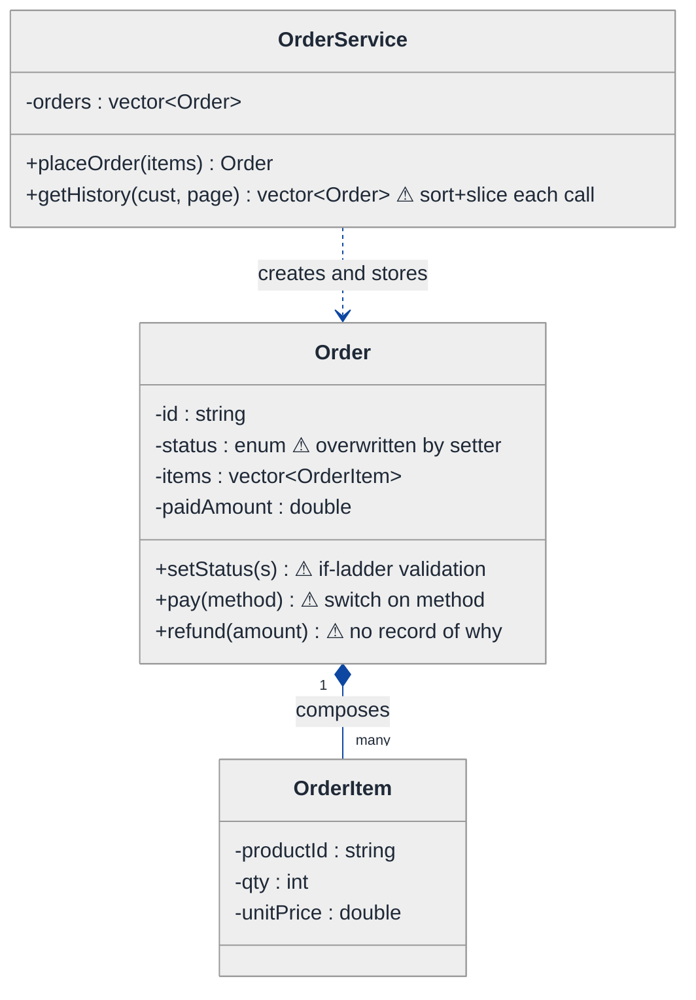
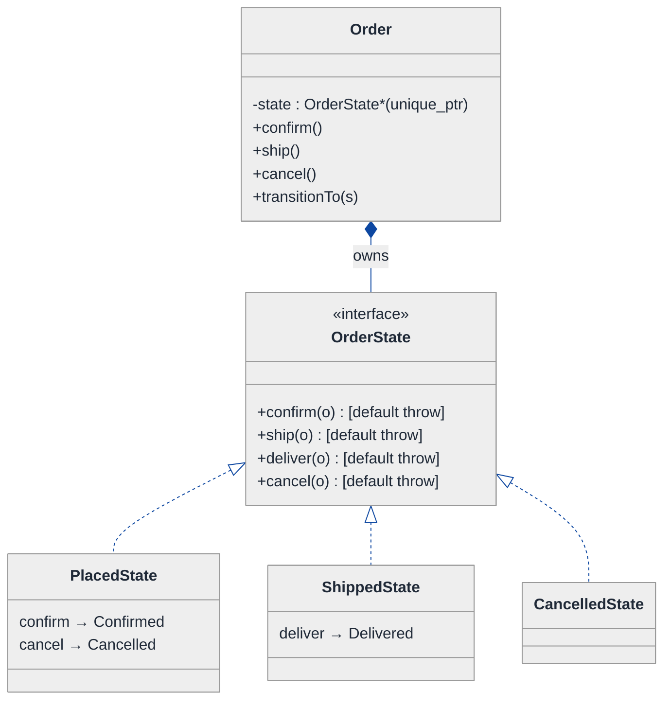
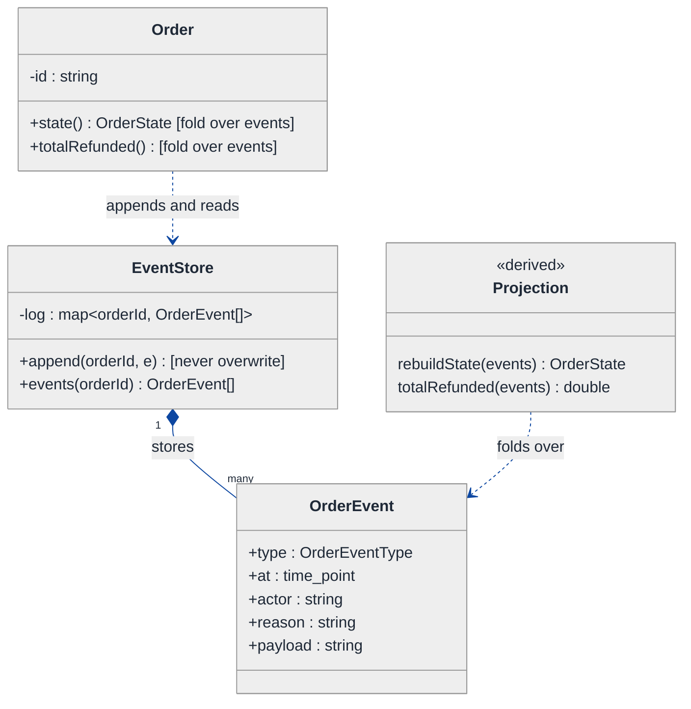
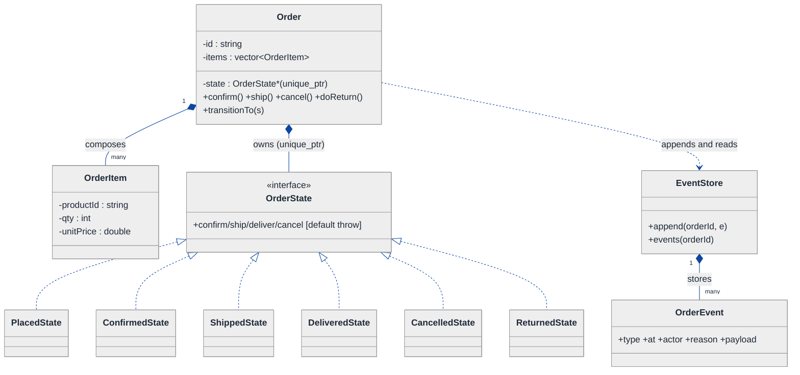
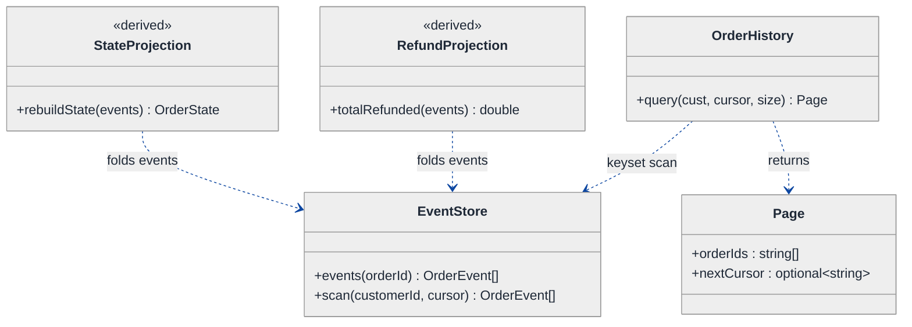
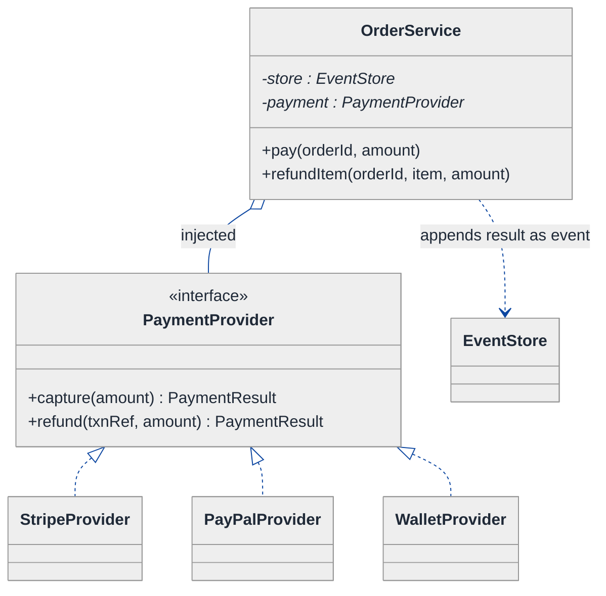
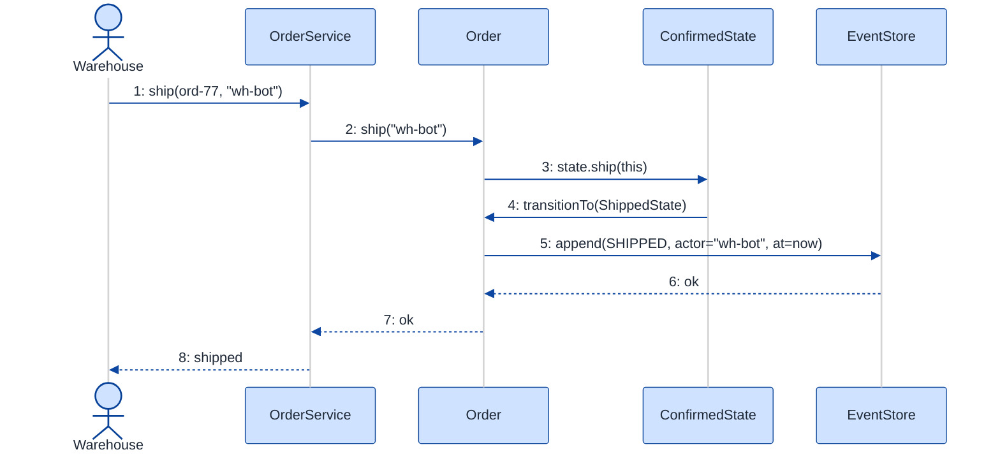
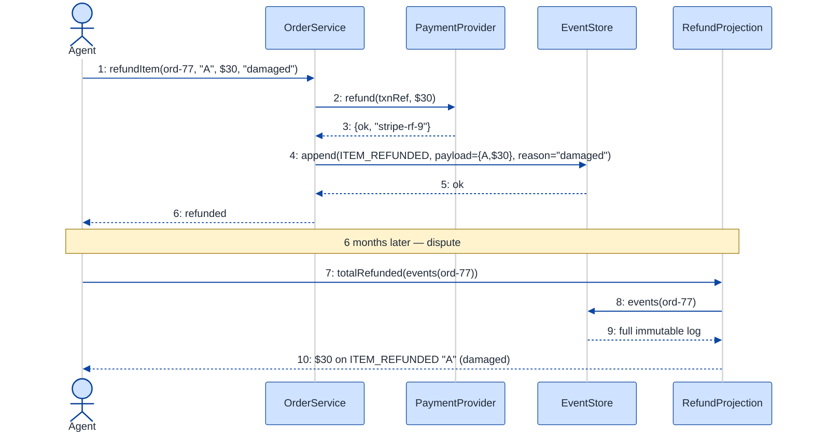

# Order Management System — LLD Walkthrough

> **Difficulty:** Medium · **Time:** ~35 min · **Pattern focus:** State (order lifecycle) + Event Sourcing (history as the source of truth)
>
> **Problem source(s):** GID `ST1`, bucket `State_Pattern` — "Design an order management system supporting order creation, status tracking, payment integration, refund processing, and order history with pagination." See [`./EXTRACTED_QUESTIONS.md`](./EXTRACTED_QUESTIONS.md).
>
> **Diagrams:** inline mermaid (renders natively in GitHub / VS Code). Light theme + soft pastels, no `look: handDrawn`.

---

## How to use this file

Paced for a candidate meeting "order management" for the first time. Reading time: ~35 minutes if you sketch each iteration by hand. **The lesson: an order's status field is a lie waiting to happen. The senior move is to recognize TWO axes — a lifecycle the order transitions through (State) and an audit trail the business needs anyway (Event Sourcing) — and to notice that the second one, done right, REPLACES the first as the source of truth.**

**Map of this file (15 sections):**

1. Problem statement + clarifying questions
2. Plain-English restatement
3. Why this matters
4. Mental model
5. Try it yourself first
6. Entity & verb extraction
7. **Iteration 1: the naive design** — a `status` enum and a setter
8. **Where the naive design hurts** — four future requirements, one painful diff each
9. **Pivot 1: State for the order lifecycle** — internal transitions, not a setter
10. **Pivot 2: Event Sourcing for history + refunds** — the log IS the order
11. **Pivot 3: Strategy for payment + a paginated history query** — the remaining axes
12. Final class diagram
13. Skeleton code (C++)
14. Key flow — sequence diagram
15. Extensibility re-check + anti-patterns + how to think aloud + self-check

---

## 1. Problem statement + clarifying questions

**Prompt (typical phrasing):** "Design an order management system. Customers place orders; orders move through statuses (placed, confirmed, preparing, shipped, delivered, cancelled, returned); the system integrates payment, processes refunds, and exposes order history with pagination."

**Clarifying questions to ask BEFORE drawing anything:**

1. **Status set — fixed or growing?** Are placed/confirmed/preparing/shipped/delivered/cancelled/returned the final list, or will new states (e.g., `OUT_FOR_DELIVERY`, `PARTIALLY_RETURNED`) appear? This decides enum-vs-State.
2. **Are transitions constrained?** Can an order go from `placed` straight to `delivered`? Can a `delivered` order be `cancelled`? Who enforces the legal transition graph?
3. **Audit / history granularity?** Do we need just the current status, or the full timeline ("who changed it, when, why")? Returns and refund disputes usually demand the latter.
4. **Refund model?** Full only, or partial (refund 2 of 5 line items)? Does a refund require the order to be in a particular state? Is the refund itself a tracked sub-lifecycle?
5. **Payment integration shape?** One gateway (Stripe) or many (Stripe, PayPal, wallet, COD)? Synchronous capture or async webhook confirmation?
6. **History pagination contract?** Page-number + size, or cursor/keyset? Sorted by what — creation time, last-update? How large can one customer's history get?
7. **Concurrency?** Can two actors (customer cancels, warehouse ships) act on the same order simultaneously? Single-threaded for the design discussion?

**Assumptions if interviewer dodges:** the status set will grow; transitions are constrained by a legal graph; we need the full timeline for audit + dispute; refunds can be partial and are themselves tracked; multiple payment providers; cursor-based pagination; single-threaded for now (we discuss concurrency in §15).

---

## 2. Plain-English restatement

We are building the software that owns an order's life from "customer clicked buy" to "delivered" (or "cancelled" / "returned"). The system must record every meaningful thing that happens to an order, reject illegal moves (you can't ship a cancelled order), charge and refund money through a payment provider, and let a customer page through their past orders. The design must absorb new statuses, new payment providers, and new refund rules **without rewriting the core flow** — and it must never lose the answer to "what happened to order #4471, and when?"

---

## 3. Why this matters

Order management is the canonical "lifecycle with money attached" problem, and it is where a naive `order.status = SHIPPED` setter does the most damage in production. The interviewer is probing two things at once: do you model a constrained lifecycle as a State machine instead of an enum-plus-if-ladder, and do you recognize that "order history" is not a nice-to-have report but a hint to make the **event log the source of truth** (Event Sourcing). The skill reappears anywhere a domain object has a legal transition graph plus an audit requirement: payments, shipping, ticketing, document approval, subscription billing.

---

## 4. Mental model

An order is **not a row whose `status` column you overwrite**. It is a **ledger of things that happened**, and its current status is just the *last word in the story*. Two real-world objects are hiding here: (1) a parcel moving through a depot — at any moment it is in exactly one physical state, and only certain next moves are legal; (2) a bank passbook — you never erase a line, you append a new one, and the balance is whatever the lines add up to.

```
Real-world sketch (NOT a UML diagram yet):

   The order's STORY (append-only ledger)          The order's STATE NOW
   ┌───────────────────────────────────────┐       (just the last word)
   │ t0  PLACED        items=[A,B,C]  $90   │
   │ t1  PAID          txn=TXN-77     $90   │            ┌───────────┐
   │ t2  CONFIRMED     by=warehouse         │  ───────►  │ SHIPPED   │
   │ t3  PREPARING                          │            └───────────┘
   │ t4  SHIPPED       tracking=UPS-12      │       legal next moves:
   │ ...                                    │         DELIVERED, RETURNED
   └───────────────────────────────────────┘
            ▲ append-only, never edited
```

The KEY insight from this picture: the **log on the left** is the truth; the **box on the right** is a *projection* (a fold over the log). Lifecycle = the box and its legal arrows (State pattern). History = the log itself (Event Sourcing). Two patterns, two axes.

---

## 5. Try it yourself first

> **Predict before reading on:**
>
> 1. List 5 nouns you'd promote to a class. Which "noun" (hint: a verb in disguise) might be the most important class of all?
> 2. **If I told you the business will add three new statuses and an audit-compliance requirement in year one, what would change about how you store an order's status?**
> 3. A customer disputes a refund six months later: "I was charged twice." Where in your design do you find the answer? If the answer is "we'd have to guess," what's missing?

---

## 6. Entity & verb extraction

> **Mini-refresher: noun → class, but not every noun.**
>
> Naive OOD promotes every noun to a class. Senior OOD promotes a noun only if it has BEHAVIOR and STATE that must live together. "Status" looks like a field — and in the naive design it is — but it has so much behavior (legal transitions, side effects) that it will graduate to a class hierarchy. Watch for the verb hiding as a noun: "an event happened" → `OrderEvent` becomes a first-class citizen.

**Nouns from the prompt:**

| Noun | Decision | Why |
|---|---|---|
| Order | Class (aggregate root) | Owns line items + drives its own lifecycle |
| OrderItem / LineItem | Class | Has product ref, qty, price; refundable individually |
| OrderStatus | Field at first → class hierarchy by §9 | Has behavior (legal transitions), not just a label |
| OrderEvent | Class (promoted in §10) | The verb "happened"; the unit of the audit log |
| Payment | Class + provider strategy | Has a result, a provider, a sub-lifecycle |
| Refund | Class | Tracked sub-process; can be partial |
| OrderHistory | Service/query object | Pagination behavior, not a data bag |
| Money / amount | Value type | No domain behavior of its own |
| Timestamp | Library type (`std::chrono::time_point`) | No domain behavior |

**Verbs (and the class they live on — naive answer, re-examined later):**

| Verb | Owner class (naive — we'll re-examine) |
|---|---|
| placeOrder(cart) | OrderService |
| confirm() / ship() / deliver() | Order |
| cancel() | Order |
| `return`() | Order |
| pay(provider) | Order, delegating to a payment provider |
| refund(items) | Order, delegating to a payment provider |
| getHistory(customer, page) | OrderHistory |

**We have NOT introduced any design patterns yet.** Pure nouns + verbs.

---

## 7. <a id="iter-1"></a>Iteration 1: the naive design

Let's write the simplest thing that could possibly work. No patterns — a `status` enum, a setter that validates with an if-ladder, a payment switch, and a `vector` we sort for history.



**Reader's tour (top to bottom; ~60 seconds).**

1. **`Order` is the aggregate root.** It carries `status` (an enum), a list of `OrderItem`, and `paidAmount`. Every state change funnels through `setStatus()`.
2. **The composition spine.** Order composes `OrderItem[]` — filled diamond, same lifetime. That part is fine and won't change.
3. **The three warning markers (⚠) on Order.** `setStatus()` overwrites the enum after an if-ladder validates the move; `pay()` switches on payment method; `refund()` mutates `paidAmount` and **records nothing about why or which items**. Each is a future-pain entry point.
4. **`OrderService` holds all orders in a vector** and answers history queries by sorting and slicing on every call — fine for 10 orders, a problem at 10 million.

Skeleton code for the naive design (C++):

```cpp
#include <chrono>
#include <stdexcept>
#include <string>
#include <vector>

enum class OrderStatus {
    PLACED, CONFIRMED, PREPARING, SHIPPED, DELIVERED, CANCELLED, RETURNED
};
enum class PaymentMethod { CARD, PAYPAL, COD };

struct OrderItem { std::string productId; int qty; double unitPrice; };

class Order {
public:
    explicit Order(std::string id, std::vector<OrderItem> items)
        : id_(std::move(id)), items_(std::move(items)) {}

    void setStatus(OrderStatus next) {            // if-ladder validation — will hurt
        if (status_ == OrderStatus::CANCELLED || status_ == OrderStatus::RETURNED)
            throw std::runtime_error("Order is terminal");
        if (status_ == OrderStatus::DELIVERED && next == OrderStatus::SHIPPED)
            throw std::runtime_error("Cannot un-ship a delivered order");
        // ... a growing thicket of pairwise rules ...
        status_ = next;                            // the overwrite: previous value lost forever
    }

    bool pay(PaymentMethod method, double amount) {   // tag-driven switch — will hurt
        switch (method) {
            case PaymentMethod::CARD:   /* Stripe */ break;
            case PaymentMethod::PAYPAL: /* PayPal */ break;
            case PaymentMethod::COD:    /* mark due */ break;
        }
        paidAmount_ += amount;
        return true;
    }

    void refund(double amount) { paidAmount_ -= amount; }  // no record of why / which items

    OrderStatus status() const { return status_; }
private:
    std::string            id_;
    OrderStatus            status_ = OrderStatus::PLACED;
    std::vector<OrderItem> items_;
    double                 paidAmount_ = 0.0;
};

class OrderService {
public:
    Order& placeOrder(std::vector<OrderItem> items) {
        orders_.emplace_back("ord-" + std::to_string(orders_.size() + 1), std::move(items));
        return orders_.back();
    }
    std::vector<Order*> getHistory(const std::string& /*cust*/, int page, int size) {
        // sort the whole vector, then slice the page — O(n log n) every call
        std::vector<Order*> out; /* elided sort + slice */ return out;
    }
private:
    std::vector<Order> orders_;
};
```

**This works.** It has zero design patterns. We can place, transition, pay, refund, and page. So what's wrong with it?

---

## 8. <a id="naive-pain"></a>Where the naive design hurts

The interviewer slides four requirements across the desk: "These ship next quarter. Walk me through what changes."

### Change A: "Add `OUT_FOR_DELIVERY` and `PARTIALLY_RETURNED` statuses"

In the naive design:
- Add two values to the `OrderStatus` enum.
- `setStatus()`'s if-ladder must learn the new legal transitions — and EVERY existing branch must be re-checked to make sure it doesn't accidentally allow/forbid the new states.
- **Touches:** the enum + `setStatus()`. The if-ladder is now N² pairwise rules. Each new state re-opens the whole method.

### Change B: "Audit requirement — show who changed the status, when, and why"

In the naive design:
- `status_` is a single overwritten value. The previous value is **gone the moment `setStatus` runs**. There is no `who` / `when` / `why` anywhere.
- You bolt on a `std::vector<std::string> log_` and remember to append in every mutator. Miss one call site and the audit has a hole.
- **Touches:** `Order` (new field) + every mutator + `pay()` + `refund()`. The data you need was DESTROYED by design.

### Change C: "Partial refunds — refund 2 of 5 items, with a tracked refund record"

In the naive design:
- `refund(double)` just subtracts from `paidAmount_`. It can't say WHICH items, can't be queried later, can't be in a "pending/settled/failed" sub-state.
- The dispute six months later ("I was charged twice") is **unanswerable** — there's no record.
- **Touches:** `refund()` rewritten, plus new fields, plus the missing history from Change B.

### Change D: "Add a wallet payment provider + cursor pagination for history"

In the naive design:
- New payment method → another `case` in the `pay()` switch. Classic tag-driven growth.
- History `getHistory` sorts the entire `orders_` vector on every call and uses page-number slicing — breaks under load and gives inconsistent pages when orders are added mid-scroll.
- **Touches:** `pay()` switch + `getHistory` rewrite.

### The pattern of pain

| Change | Files/methods touched | Smell |
|---|---|---|
| A. New statuses | enum + `setStatus()` if-ladder | "N² pairwise transition rules in one method." |
| B. Audit trail | `Order` + every mutator | "Current-status overwrite DESTROYS the history we now need." |
| C. Partial refund | `refund()` + new fields | "No record of what happened; disputes unanswerable." |
| D. Wallet + pagination | `pay()` switch + `getHistory` | "Tag-driven payment; sort-the-world pagination." |

**Two axes of pain dominate, plus two smaller ones.** (1) lifecycle variability — the legal transition graph (Changes A); (2) the history/audit/refund cluster all trace back to ONE root cause: *we overwrite status instead of recording events* (Changes B + C); (3 + 4) payment-method variability and pagination (Change D).

> **Pivot question:** "What pattern models a constrained lifecycle where the OBJECT decides its legal next moves? And what design makes the audit trail not an add-on but the actual source of truth — so refunds and history fall out for free?"
>
> The answers are the State pattern and Event Sourcing. Let's introduce them one at a time, starting with the lifecycle.

---

## 9. <a id="pivot-1"></a>Pivot 1: State for the order lifecycle

Change A is the most acute: every new status re-opens a monstrous if-ladder. The variability here is not an algorithm the caller picks — it's *what is legal next given where the order is now*. That's the order's own concern.

> **Mini-refresher: State pattern.**
>
> Each lifecycle state is its own class. The context object (here, `Order`) delegates each event (`confirm()`, `ship()`, `cancel()`) to its CURRENT state object, and THE STATE decides whether the move is legal and what the next state is. Transitions are INTERNAL, driven by events the context receives — not set from outside.
>
> Quick example: a document's `DraftState::publish()` returns a `PublishedState`; `PublishedState::publish()` throws "already published." No enum, no if-ladder — the class you're in IS the rule.

**Why State (not Strategy).** The next state isn't chosen by the caller — calling `ship()` on a `CancelledState` should fail, and that rule belongs to the state, not the warehouse code. The legal transition graph is the OBJECT's invariant. Adding `OUT_FOR_DELIVERY` becomes one new class that declares only its own legal moves; no existing state is touched.

**The refactor (just the lifecycle slice):**

```cpp
class Order;  // forward — defined in §13

class OrderState {
public:
    virtual ~OrderState() = default;
    virtual const char* name() const = 0;
    // each event: default = illegal; legal states override
    virtual void confirm(Order&) { throw std::runtime_error("confirm illegal here"); }
    virtual void ship(Order&)    { throw std::runtime_error("ship illegal here"); }
    virtual void deliver(Order&) { throw std::runtime_error("deliver illegal here"); }
    virtual void cancel(Order&)  { throw std::runtime_error("cancel illegal here"); }
    virtual void doReturn(Order&){ throw std::runtime_error("return illegal here"); }
};

class PlacedState : public OrderState {
public:
    const char* name() const override { return "PLACED"; }
    void confirm(Order& o) override;   // -> ConfirmedState  (see §13)
    void cancel(Order& o) override;    // -> CancelledState
};

class ShippedState : public OrderState {
public:
    const char* name() const override { return "SHIPPED"; }
    void deliver(Order& o) override;   // -> DeliveredState
    // ship() not overridden -> inherits "illegal" default. Can't un-ship.
};

class CancelledState : public OrderState {   // terminal: overrides nothing -> all events illegal
public:
    const char* name() const override { return "CANCELLED"; }
};
// PreparingState, DeliveredState, ReturnedState elided — same shape
```

The clever bit: the abstract base makes **every event illegal by default**. A concrete state overrides ONLY the events that are legal in that phase. `CancelledState` overrides nothing, so it's automatically terminal. Adding a state can never accidentally re-open an illegal transition somewhere else.

**What changed — visualized (lifecycle slice):**



**Tour of the after-state.**

1. **The `OrderStatus` enum is gone** as the driver of behavior. `Order` holds a `state` field of type `unique_ptr<OrderState>` — exclusive ownership of its current state.
2. **`Order`'s event methods are one-liners** that delegate: `state_->ship(*this)`. No if-ladder anywhere on `Order`.
3. **The interface declares every event with a throwing default.** Legal states override; everyone else inherits "illegal." This is the inverse of the naive design, where every rule had to be spelled out explicitly.
4. **Transitions live WITH the state.** `PlacedState::confirm` calls `o.transitionTo(make_unique<ConfirmedState>())`. The state knows what comes next — that's the whole point.

**Change A now lands cleanly.** `OUT_FOR_DELIVERY` is one new class declaring its own legal moves. No existing state edited.

**Pattern-discrimination cheatsheet — State vs Strategy.**
- *State:* the OBJECT picks its next state internally, via events; states know about each other (each can `transitionTo` another).
- *Strategy:* the CALLER picks which algorithm to use; strategies are unaware of each other.
- *Rule of thumb:* if `order.ship()` flips state internally → State. If `order.setPricing(x)` is called externally → Strategy.

We chose State because the transition is triggered by an internal event flow and the legal-move rule is the order's invariant — not something a caller should be able to override.

---

## 10. <a id="pivot-2"></a>Pivot 2: Event Sourcing for history + refunds

Changes B and C are still painful, and they share ONE root cause: the State pivot fixed *what's legal next*, but the order still **overwrites** its state. The previous state is destroyed on every transition. The audit trail (B), the partial-refund record (C), and the "charged twice" dispute all need the thing we keep throwing away: the sequence of what happened.

> **Mini-refresher: Event Sourcing.**
>
> Instead of storing current state and mutating it, you store an append-only LOG of immutable events ("OrderPlaced", "PaymentCaptured", "ItemRefunded"). Current state is not stored — it is COMPUTED by replaying (folding) the events. The log is the source of truth; the status is a *projection*. Nothing is ever edited or deleted, so the full history exists by construction.
>
> Quick example: a bank account never stores a `balance` you overwrite — it stores deposits and withdrawals, and `balance()` sums them. Want last month's balance? Replay events up to that date.

**Why Event Sourcing fits.** The prompt itself demands "order history" and "refund processing" — both are *exactly* a log of events and a fold over it. Once the log is the truth:
- **Audit (B)** is free: every event carries `who`, `when`, `why`, and a `type`. Nothing is overwritten.
- **Refunds (C)** become events (`ItemRefunded{itemId, amount, reason}`) appended to the same log; "total refunded" is a fold; the dispute is answerable by reading the log.
- The **State pattern from Pivot 1 still applies** — but the current `OrderState` is now derived by replaying events through a transition table, so State and Event Sourcing compose instead of competing.

**The refactor (the log + the fold):**

```cpp
enum class OrderEventType {
    PLACED, CONFIRMED, PREPARING, SHIPPED, DELIVERED,
    CANCELLED, RETURNED, PAYMENT_CAPTURED, ITEM_REFUNDED
};

struct OrderEvent {                         // immutable record — never edited
    OrderEventType                        type;
    std::chrono::system_clock::time_point at;
    std::string                           actor;    // who
    std::string                           reason;   // why (optional)
    std::string                           payload;  // typed detail, e.g. {"itemId":"A","amount":30}
};

class EventStore {                          // append-only; the source of truth
public:
    void append(const std::string& orderId, OrderEvent e) {
        log_[orderId].push_back(std::move(e));      // never overwrite, never delete
    }
    const std::vector<OrderEvent>& events(const std::string& orderId) const {
        return log_.at(orderId);
    }
private:
    std::unordered_map<std::string, std::vector<OrderEvent>> log_;
};

// The fold: replay events -> current OrderState. State pattern + Event Sourcing meet here.
std::unique_ptr<OrderState> rebuildState(const std::vector<OrderEvent>& events) {
    std::unique_ptr<OrderState> s = std::make_unique<PlacedState>();   // seed
    for (const auto& e : events) {
        switch (e.type) {                   // a transition table, not an if-ladder
            case OrderEventType::CONFIRMED: s = std::make_unique<ConfirmedState>(); break;
            case OrderEventType::SHIPPED:   s = std::make_unique<ShippedState>();   break;
            case OrderEventType::CANCELLED: s = std::make_unique<CancelledState>(); break;
            // ... other state-changing events elided ...
            default: break;                 // PAYMENT_CAPTURED / ITEM_REFUNDED don't change lifecycle state
        }
    }
    return s;
}

double totalRefunded(const std::vector<OrderEvent>& events) {   // another projection
    double sum = 0;
    for (const auto& e : events)
        if (e.type == OrderEventType::ITEM_REFUNDED) sum += parseAmount(e.payload);
    return sum;
}
```

**What changed — visualized (event-sourcing slice):**



**Tour of the after-state.**

1. **`EventStore` is the source of truth.** It maps `orderId → vector<OrderEvent>`, append-only. `append()` never overwrites; `events()` returns the full ordered log.
2. **`OrderEvent` is immutable** — `type`, `at`, `actor`, `reason`, `payload`. The audit fields the business asked for in Change B are now structural, not bolted on.
3. **Current state is DERIVED, not stored.** `rebuildState(events)` folds the log through a transition table to produce the current `OrderState` (reusing Pivot 1's classes). `totalRefunded(events)` is a second projection over the same log.
4. **Refunds (Change C) are just events.** `ITEM_REFUNDED{itemId, amount, reason}` is appended; the dispute is answered by reading the log. No data destroyed, ever.

> **Performance note (anticipating the obvious objection):** "Replaying every event on every read is slow." True at scale. The standard fix is a **snapshot** — periodically persist the folded state + the log offset, then replay only events after the snapshot. We'd mention this in interview but keep the skeleton replay-from-zero for clarity.

**Pattern-discrimination cheatsheet — Event Sourcing vs CRUD-with-audit-table.**
- *Event Sourcing:* the log IS the state; current status is a projection. History is free and cannot drift from reality.
- *CRUD + audit table:* a mutable `orders` row plus a side `audit_log` table you write to manually.
- *Rule of thumb:* if the audit trail and the state can ever disagree, you have CRUD-with-audit. If the state is COMPUTED from the trail, you have Event Sourcing. Choose Event Sourcing when history is a first-class requirement (it is here).

---

## 11. <a id="pivot-3"></a>Pivot 3: Strategy for payment + a paginated history query

Changes A, B, C are solved. Change D's two parts remain: the payment-method switch and the sort-the-world pagination. Both are smaller, same-shape fixes.

**Payment — Strategy.** Payment is an algorithm (`given an amount, capture it; return a result`) chosen by the caller. Textbook Strategy — identical in shape to the pricing strategy you'd see in the Parking Lot walkthrough.

> **Mini-refresher: Strategy pattern.**
>
> Encapsulates an interchangeable algorithm behind an interface; the caller picks which one. The strategy doesn't know about its peers. Here: `PaymentProvider::capture(amount)` — pass `StripeProvider`, `PayPalProvider`, or `WalletProvider`; the order doesn't care which.

```cpp
struct PaymentResult { bool ok; std::string txnRef; };

class PaymentProvider {
public:
    virtual ~PaymentProvider() = default;
    virtual PaymentResult capture(double amount) = 0;
    virtual PaymentResult refund(const std::string& txnRef, double amount) = 0;
};
class StripeProvider : public PaymentProvider { /* Stripe SDK — elided */ };
class WalletProvider : public PaymentProvider { /* internal ledger — elided */ };
// PayPalProvider, CodProvider elided — same shape
```

A successful `capture` produces a `PAYMENT_CAPTURED` event; a `refund` produces an `ITEM_REFUNDED` event. Payment integration thus flows straight into the event log from Pivot 2 — the two patterns dovetail.

**History — cursor pagination, not sort-the-world.** The naive `getHistory` sorted the entire collection and sliced by page number, which is O(n log n) per call and gives inconsistent pages when orders are added mid-scroll. The fix is **keyset (cursor) pagination**: the client passes back the last-seen key (e.g., `createdAt` of the last row), and the query returns the next page starting strictly after it. Stable under inserts, and O(page size) with an index.

```cpp
struct Page {
    std::vector<std::string>   orderIds;   // this page
    std::optional<std::string> nextCursor; // opaque "where to resume"; nullopt at end
};

class OrderHistory {
public:
    explicit OrderHistory(const EventStore& store) : store_(store) {}
    // cursor = last seen createdAt key; nullopt = first page
    Page query(const std::string& customerId,
               std::optional<std::string> cursor, int pageSize) const; // keyset scan — elided
private:
    const EventStore& store_;
};
```

> **Mini-refresher: why payment, state, and history don't share one interface.**
>
> Strategy is a ROLE, not a type. `PaymentProvider`, `OrderState`, and the history query have nothing in common at the type level (different inputs, outputs, lifetimes). Don't unify them under one generic base — that's premature genericism. Three small focused hierarchies beat one god-interface.

**The lesson.** Once the lifecycle is State and history is an event log, the remaining axes are cheap: payment is a Strategy whose results become events, and history is a keyset query over those events. **Pattern recognition makes the tail of the design fall out almost for free.**

---

## 12. <a id="fig-class-diagram"></a>Final class diagram

One huge diagram becomes a wall of boxes. Here are **three focused sub-views**, then the structural insight that ties them together.

### 12.1 The write path — Order, its State, and the event log



**Tour of 12.1.** `Order` composes its `OrderItem[]` (filled diamond, same lifetime) and OWNS its current `OrderState` via `unique_ptr`. Six concrete states hang off the `OrderState` interface, each declaring only its legal events. Every meaningful action appends an immutable `OrderEvent` into the `EventStore` — the append-only spine that makes the next view possible.

### 12.2 The read path — projections over the log



**Tour of 12.2.** Everything on the read side is DERIVED from the one log. `StateProjection.rebuildState` folds events into the current `OrderState`; `RefundProjection.totalRefunded` folds the same events into a number; `OrderHistory.query` does a keyset scan and returns a `Page` with an opaque `nextCursor`. None of these stores its own truth — they all read the `EventStore`. Add a new report tomorrow? New projection, zero writes touched.

### 12.3 The payment axis — Strategy whose results become events



**Tour of 12.3.** `OrderService` holds an INJECTED `PaymentProvider` (open diamond = aggregation — it uses, doesn't own the lifecycle). On `pay`, it calls `capture(amount)` and appends a `PAYMENT_CAPTURED` event with the returned `txnRef`. On `refundItem`, it calls `refund(...)` and appends an `ITEM_REFUNDED` event. New provider = one new class implementing the interface; the result still flows into the same log.

### Structural insight (ties 12.1 + 12.2 + 12.3 together)

| Concern | Pattern used | Why |
|---|---|---|
| **Lifecycle** (placed → … → delivered / cancelled / returned) | State, OWNED by Order | The order controls legal transitions; states validate what's legal next |
| **History + audit + refund record** | Event Sourcing — append-only log | History is a first-class requirement; the log makes it free and drift-proof |
| **Current status, total refunded, reports** | Projections (folds over the log) | Derived, never stored; add a report without touching writes |
| **Payment integration** (Stripe, PayPal, wallet) | Strategy, INJECTED, results → events | Caller/config picks the provider; the outcome is recorded as an event |

The big lesson: **State and Event Sourcing are not competitors — they compose.** State defines the legal transition graph; Event Sourcing records the transitions that actually happened and lets you recompute the State from them. Inheritance is used only for the State family and the Strategy family; everything else is composition over the event log. *State for the rules, events for the truth.*

---

## 13. Skeleton code (C++)

> Show the SHAPES, not the full impl. ~130 lines.

```cpp
#include <chrono>
#include <memory>
#include <optional>
#include <stdexcept>
#include <string>
#include <unordered_map>
#include <utility>
#include <vector>

// ── Forward declarations ────────────────────────────────────────────
class Order;          // forward — defined below
class OrderState;     // forward — defined below

// ── Domain value types ──────────────────────────────────────────────
struct OrderItem { std::string productId; int qty; double unitPrice; };

// ── State pattern: lifecycle ────────────────────────────────────────
class OrderState {
public:
    virtual ~OrderState() = default;
    virtual const char* name() const = 0;
    // every event illegal by default; legal states override
    virtual void confirm(Order&)  { throw std::runtime_error("confirm illegal here"); }
    virtual void ship(Order&)     { throw std::runtime_error("ship illegal here"); }
    virtual void deliver(Order&)  { throw std::runtime_error("deliver illegal here"); }
    virtual void cancel(Order&)   { throw std::runtime_error("cancel illegal here"); }
    virtual void doReturn(Order&) { throw std::runtime_error("return illegal here"); }
};

class PlacedState : public OrderState {
public:
    const char* name() const override { return "PLACED"; }
    void confirm(Order& o) override;   // -> ConfirmedState
    void cancel(Order& o) override;    // -> CancelledState
};
class ConfirmedState : public OrderState {
public:
    const char* name() const override { return "CONFIRMED"; }
    void ship(Order& o) override;      // -> ShippedState (via PreparingState elided)
    void cancel(Order& o) override;
};
class ShippedState : public OrderState {
public:
    const char* name() const override { return "SHIPPED"; }
    void deliver(Order& o) override;   // -> DeliveredState
};
class DeliveredState : public OrderState {
public:
    const char* name() const override { return "DELIVERED"; }
    void doReturn(Order& o) override;  // -> ReturnedState
};
class CancelledState : public OrderState {   // terminal — overrides nothing
public: const char* name() const override { return "CANCELLED"; }
};
class ReturnedState : public OrderState {    // terminal
public: const char* name() const override { return "RETURNED"; }
};

// ── Event Sourcing: the log ─────────────────────────────────────────
enum class OrderEventType {
    PLACED, CONFIRMED, PREPARING, SHIPPED, DELIVERED,
    CANCELLED, RETURNED, PAYMENT_CAPTURED, ITEM_REFUNDED
};
struct OrderEvent {                          // immutable
    OrderEventType                        type;
    std::chrono::system_clock::time_point at;
    std::string                           actor;
    std::string                           reason;
    std::string                           payload;
};
class EventStore {
public:
    void append(const std::string& orderId, OrderEvent e) {
        log_[orderId].push_back(std::move(e));         // never overwrite
    }
    const std::vector<OrderEvent>& events(const std::string& orderId) const {
        return log_.at(orderId);
    }
private:
    std::unordered_map<std::string, std::vector<OrderEvent>> log_;
};

// ── Order: aggregate root (state derived from events) ───────────────
class Order {
public:
    Order(std::string id, std::vector<OrderItem> items, EventStore& store)
        : id_(std::move(id)), items_(std::move(items)), store_(store),
          state_(std::make_unique<PlacedState>()) {}

    void transitionTo(std::unique_ptr<OrderState> s) { state_ = std::move(s); }

    void confirm(const std::string& who) { state_->confirm(*this); record(OrderEventType::CONFIRMED, who); }
    void ship(const std::string& who)    { state_->ship(*this);    record(OrderEventType::SHIPPED,   who); }
    void cancel(const std::string& who,
                const std::string& why)  { state_->cancel(*this);  record(OrderEventType::CANCELLED, who, why); }
    // deliver(), doReturn() elided — same shape

    const std::string& id() const { return id_; }
private:
    void record(OrderEventType t, const std::string& who, const std::string& why = "") {
        store_.append(id_, OrderEvent{t, std::chrono::system_clock::now(), who, why, ""});
    }
    std::string                  id_;
    std::vector<OrderItem>       items_;
    EventStore&                  store_;
    std::unique_ptr<OrderState>  state_;
};

// State transitions (deferred until Order is complete):
inline void PlacedState::confirm(Order& o)  { o.transitionTo(std::make_unique<ConfirmedState>()); }
inline void PlacedState::cancel(Order& o)   { o.transitionTo(std::make_unique<CancelledState>()); }
inline void ConfirmedState::ship(Order& o)  { o.transitionTo(std::make_unique<ShippedState>());   }
inline void ConfirmedState::cancel(Order& o){ o.transitionTo(std::make_unique<CancelledState>()); }
inline void ShippedState::deliver(Order& o) { o.transitionTo(std::make_unique<DeliveredState>()); }
inline void DeliveredState::doReturn(Order& o){ o.transitionTo(std::make_unique<ReturnedState>()); }

// ── Projections: derived reads (fold over the log) ──────────────────
std::unique_ptr<OrderState> rebuildState(const std::vector<OrderEvent>& events); // transition table — elided
double totalRefunded(const std::vector<OrderEvent>& events);                      // sum ITEM_REFUNDED — elided

// ── Strategy: payment providers ─────────────────────────────────────
struct PaymentResult { bool ok; std::string txnRef; };
class PaymentProvider {
public:
    virtual ~PaymentProvider() = default;
    virtual PaymentResult capture(double amount) = 0;
    virtual PaymentResult refund(const std::string& txnRef, double amount) = 0;
};
class StripeProvider : public PaymentProvider { /* Stripe SDK — elided */
public: PaymentResult capture(double) override { return {true, "stripe-txn"}; }
        PaymentResult refund(const std::string&, double) override { return {true, "stripe-rf"}; } };
// PayPalProvider, WalletProvider elided — same shape

// ── History: cursor pagination ──────────────────────────────────────
struct Page { std::vector<std::string> orderIds; std::optional<std::string> nextCursor; };
class OrderHistory {
public:
    explicit OrderHistory(const EventStore& store) : store_(store) {}
    Page query(const std::string& customerId,
               std::optional<std::string> cursor, int pageSize) const; // keyset scan — elided
private:
    const EventStore& store_;
};
```

---

## 14. <a id="fig-sequence"></a>Key flow — sequence diagram

This is the moment of truth — read across the swimlanes to see State, Event Sourcing, and the payment Strategy COOPERATE.

### Phase 1 — ship an order (State transition + audit event)



**Tour of Phase 1 (ship).**

1. **Warehouse calls `ship`.** The service is the thin boundary; it doesn't validate transitions itself.
2. **`Order::ship` delegates to its current state** — `state_->ship(*this)`. If the state were `CancelledState`, this throws "ship illegal here" via the inherited default. **No if-ladder on Order.** That's the State pattern doing the validation.
3. **`ConfirmedState::ship` performs the transition** — `o.transitionTo(ShippedState)`. The state knows what comes next.
4. **Order appends a `SHIPPED` event** carrying actor + timestamp. **This is the Event Sourcing moment** — the transition isn't just applied, it's RECORDED immutably. The audit answer to "who shipped it, when?" now exists by construction.

### Phase 2 — partial refund (Strategy result becomes an event)



**Tour of Phase 2 (refund + dispute). Read slowly — this is where both patterns pay off.**

1. **Agent requests a partial refund** of item A. The service delegates the money movement to the INJECTED `PaymentProvider` — **Strategy in play.** Swap Stripe for Wallet and steps 2-3 are unchanged.
2. **On success, the service appends an `ITEM_REFUNDED` event** with the item, amount, and reason. The refund isn't a silent subtraction — it's a recorded fact. **Event Sourcing in play.**
3. **Six months later, a dispute arrives.** The agent asks the `RefundProjection` for `totalRefunded`. It reads the full immutable log from the `EventStore` and folds it — answering "exactly $30 was refunded for item A, reason damaged, on this date." **The dispute is answerable BECAUSE nothing was overwritten.**

### The validation and the audit that the naive design couldn't give you

You don't see `if (status == SHIPPED)` anywhere, and you don't see a manual "remember to write the audit row" step. That's the point of the two patterns together: **illegal moves are impossible by polymorphism** (State), and **the audit trail is the data model itself, not a parallel table you might forget to write** (Event Sourcing). The class hierarchy IS the validation; the log IS the history.

---

## 15. Extensibility re-check + anti-patterns + how to think aloud + self-check

### Extensibility re-check

Revisit the four changes from [§8](#naive-pain). For each, name the SINGLE thing that changes.

| Change | Naive design impact | Final design impact |
|---|---|---|
| A. New statuses | enum + `setStatus()` if-ladder | New `OutForDeliveryState : OrderState` class + one transition-table line. Done. |
| B. Audit trail | `Order` + every mutator | Free — `OrderEvent` already carries actor/when/why; nothing overwritten. |
| C. Partial refund | `refund()` rewrite + lost history | New `ITEM_REFUNDED` event + a projection fold. Done. |
| D. Wallet + cursor pagination | `pay()` switch + sort-the-world | New `WalletProvider : PaymentProvider` class; `OrderHistory` already keyset. Done. |

Each change is one new class or one new event — never surgery across files. That's the open/closed principle in practice.

If a future requirement makes you change `Order`, `OrderState`, `PaymentProvider`, AND the event log together — go back to §6 and re-identify the variability points; you missed one.

### Common confusion + traps

1. **"Isn't replaying every event on every read wasteful?"** At scale, yes — add snapshots (persist folded state + log offset, replay only the tail). For the interview, mention it and keep replay-from-zero in the skeleton.
2. **"Why not keep a `status` column AND the event log?"** That's CRUD-with-audit, and the two can drift (you update one, forget the other). In Event Sourcing the status is DERIVED, so it can never disagree with history.
3. **"Why is the next state decided by the state, not the service?"** Because the legal-transition graph is the order's invariant. If the service decided, every caller could invent its own (wrong) rules.
4. **"Should `Order` store `OrderState` or recompute it each time?"** Either — store a cached projection for the in-memory aggregate (fast) and treat the log as the recovery source of truth (correct after a crash). Both views agree because one is folded from the other.
5. **"Why is `PaymentProvider` injected into the service, not the Order?"** Payment is infrastructure, not order data. The order records the RESULT (an event); it doesn't own a gateway connection.

### Anti-patterns

- **"Mutable status setter"** — `order.setStatus(X)` overwriting an enum. Loses history, scatters validation. Use State + events.
- **"Audit log as an afterthought"** — a side table you write to manually in each mutator. Miss a call site → audit holes. Make events the source of truth.
- **"Tag-driven payment switch"** — `switch (method)` inside the order. Use the `PaymentProvider` Strategy; let polymorphism dispatch.
- **"Offset pagination over a growing list"** — `ORDER BY created LIMIT n OFFSET m` re-sorts the world and skips/duplicates rows under concurrent inserts. Use keyset/cursor.
- **"God OrderService"** — owning lifecycle rules, payment, and history. Split: State owns rules, providers own payment, projections own reads.
- **"Anemic Order"** — a data bag of getters/setters. The order has lifecycle BEHAVIOR; put it on the class via State.

### How to think aloud

> "Order management. Let me clarify scope. [Asks the §1 questions — is the status set fixed, are transitions constrained, do we need a full audit trail, partial refunds, which payment providers, what pagination contract.] Given the answers, two things stand out: the lifecycle is constrained, and 'history' plus 'refund processing' tell me the audit trail is a first-class requirement.
>
> Nouns: Order, OrderItem, OrderState, OrderEvent, Payment, Refund, OrderHistory. The sneaky important one is OrderEvent — the verb 'happened' promoted to a class.
>
> Naive design first: an Order with a status enum, a setStatus if-ladder, a pay switch, a refund that just subtracts. It works.
>
> Stress test. New statuses → N² if-ladder. Audit → the setter DESTROYS the previous status, so the history we now need is gone. Partial refund → no record, disputes unanswerable. Wallet + pagination → switch growth and sort-the-world.
>
> Two big axes plus two small ones. Pivot 1: the constrained lifecycle is a State machine — each state declares its legal events, illegal by default; adding a state is one class. Pivot 2: the audit/refund/history cluster all trace to ONE root cause — we overwrite instead of recording — so I make the event log the source of truth (Event Sourcing). Current status becomes a fold over the log; refunds and audit fall out for free. State and Event Sourcing compose: State is the legal graph, events are what actually happened. Pivot 3: payment is a Strategy whose results become events; history is keyset pagination over the log.
>
> Final design: Order owns its OrderState and appends immutable OrderEvents; reads are projections over the log; payment is an injected provider. All four future requirements land as one new class or one new event each. Open/closed."

### Self-check

> **Self-check — the question to ask next time.**
>
> When you see "design a [thing] with statuses AND history/audit," before reaching for a `status` enum and a setter, ask:
>
> > **"Is the change a lifecycle move the OBJECT controls (State) — and does the business need to know WHAT HAPPENED, not just WHERE IT IS NOW (Event Sourcing)?"**
>
> Constrained transitions → State. History/audit/refund/dispute as a requirement → make the event log the source of truth and derive the status. If both — and order management always has both — use both: State for the rules, events for the truth.

---

## Cross-references

- **Parent topic manifest:** [`./EXTRACTED_QUESTIONS.md`](./EXTRACTED_QUESTIONS.md)
- **Vertical overview:** [`../../LEARNING.md`](../../LEARNING.md)
- **Template:** [`../../TEMPLATE-v2.md`](../../TEMPLATE-v2.md)
- **Canonical exemplar:** [`../Object_Oriented_Design/Parking_Lot.md`](../Object_Oriented_Design/Parking_Lot.md) — State + Strategy, the gold-standard reference for this format.
- **Related v2 walkthroughs:**
  - Strategy Pattern deep-dive (sibling in [`../Strategy_Pattern/`](../Strategy_Pattern/)) — the payment-provider axis in detail.
  - State Pattern deep-dive (this bucket, [`./`](./)) — the lifecycle pattern in isolation.
  - Event Sourcing deep-dive (in [`../Event_Sourcing/`](../Event_Sourcing/)) — snapshots, projections, and replay at scale.
- **Further reading:** <a href="https://martinfowler.com/eaaDev/EventSourcing.html" target="_blank" rel="noopener noreferrer">Martin Fowler — Event Sourcing</a> · <a href="https://refactoring.guru/design-patterns/state" target="_blank" rel="noopener noreferrer">Refactoring Guru — State pattern</a>
