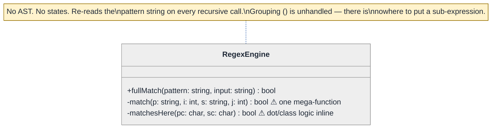
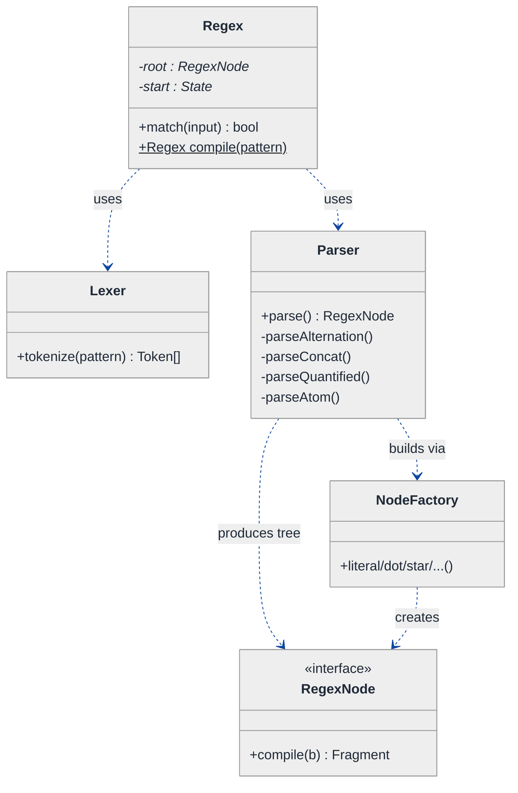
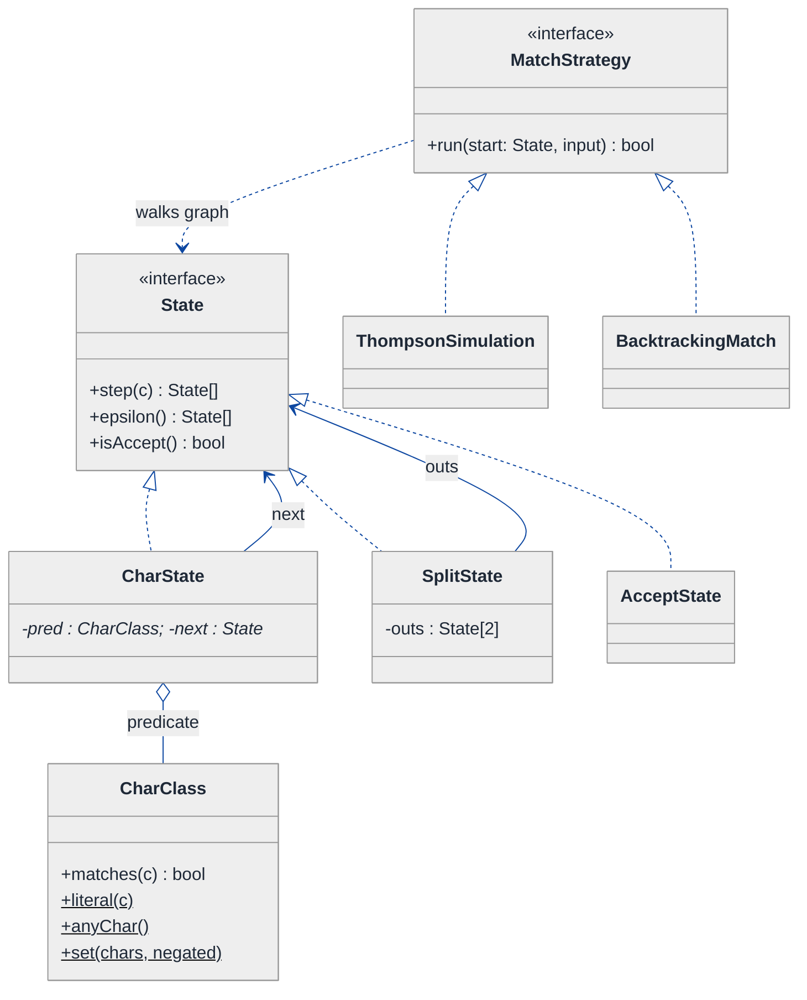
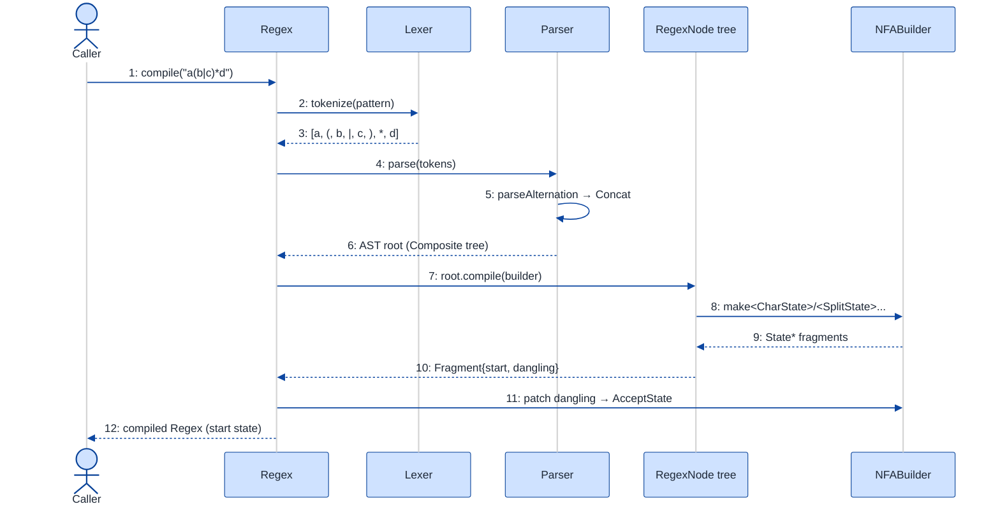
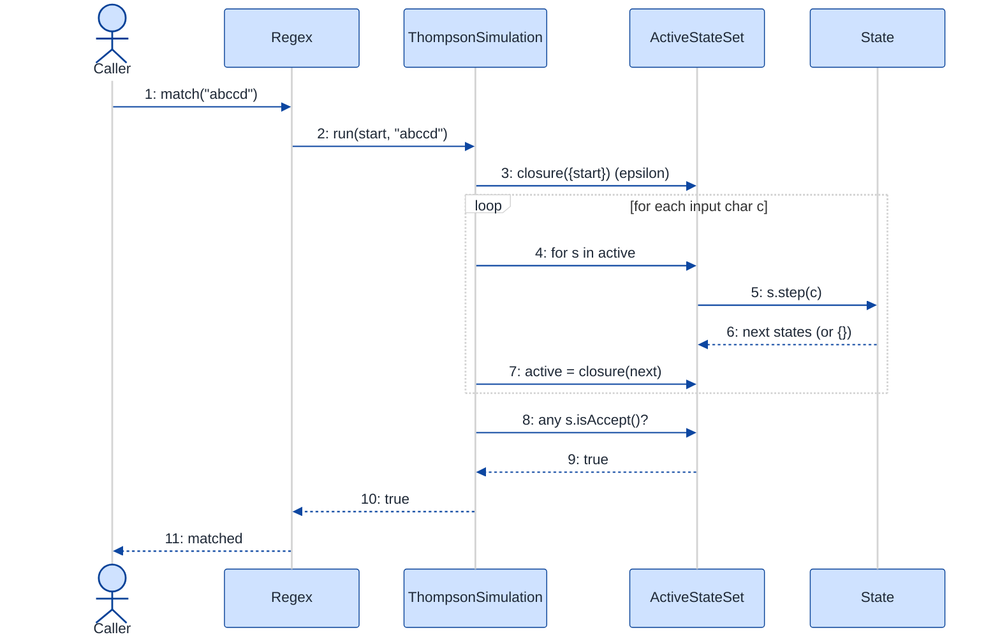

# Regex Engine (NFA Construction + Simulation) — LLD Walkthrough

> **Difficulty:** Hard · **Time:** ~45 min · **Pattern focus:** State machine + parser (State + Interpreter/Composite + Factory, with a Strategy seam for the matcher)
>
> **Problem source(s):** GID **ST5**, bucket `State_Pattern` — "Design a regex engine that supports literal characters, dot (any character), star (`*`), plus (`+`), question mark (`?`), character classes (`[abc]`), and grouping with parentheses. Implement using NFA construction and simulation."
>
> **Diagrams:** inline mermaid (renders natively in GitHub / VS Code). Theme block copied verbatim from the repo's canonical convention.

---

## How to use this file

Paced for a candidate who has used regex but never *built* one. Reading time: ~45 minutes if you sketch each iteration by hand. **The lesson: a regex engine is two machines stacked — a PARSER that turns a flat pattern string into a tree, and a STATE MACHINE (the NFA) that the tree compiles into. Don't reach for those abstractions up front. DERIVE them: write the naive one-big-function matcher first, watch it crumble under grouping + alternation + linear-time guarantees, and reach for ONE pattern at a time.**

**Map of this file (15 sections):**

1. Problem statement + clarifying questions
2. Plain-English restatement
3. Why this matters
4. Mental model
5. Try it yourself first
6. Entity & verb extraction
7. **Iteration 1: the naive design** — one recursive `match()` that branches on the metacharacter
8. **Where the naive design hurts** — five future requirements, one painful diff each
9. **Pivot 1: parse into an AST (Composite + Interpreter)** — separate syntax from matching
10. **Pivot 2: compile the AST into an NFA of State objects (State pattern)** — the machine the interviewer is probing
11. **Pivot 3: Factory for token construction + a Strategy seam for the matcher**
12. Final UML class diagram
13. Skeleton code (C++17)
14. Key flow — sequence diagram
15. Extensibility re-check + anti-patterns + how to think aloud + self-check

---

## 1. Problem statement + clarifying questions

**Prompt (typical phrasing):** "Design a regex engine. It should support literals, `.` (any char), `*`, `+`, `?`, character classes `[abc]`, and grouping with `()`. Build it via NFA construction and simulation."

**Clarifying questions to ask BEFORE drawing anything:**

1. **Match semantics — full match or search?** Must the WHOLE input match the pattern (anchored), or do we report the first substring that matches (search)? This changes whether we need `^`/`$` and a scanning loop.
2. **Which metacharacters, exactly?** The prompt lists `.` `*` `+` `?` `[]` `()`. Do we also need alternation `|`, anchors `^ $`, escaping `\`, quantifier ranges `{m,n}`, or character ranges inside classes (`[a-z]`)? I'll assume `|` is in scope (it falls out of the NFA naturally) and `{m,n}` is out.
3. **Greedy vs lazy quantifiers?** Standard `*` is greedy. Do we need lazy `*?`? I'll assume greedy-only for v1 — but note where laziness would plug in.
4. **Linear-time guarantee?** Do we care about pathological backtracking (e.g., `(a*)*b` on `aaaa...`)? If yes, we MUST use Thompson NFA simulation (process all active states in lockstep), not recursive backtracking. The prompt says "NFA construction and simulation," which strongly implies the linear-time path.
5. **Capture groups?** Do `()` groups need to capture the matched substring (like `\1` backreferences), or are they purely for grouping precedence? Capturing + backreferences make the language non-regular and break the linear-time NFA — I'll assume **non-capturing grouping** for v1.
6. **Unicode or ASCII?** I'll assume ASCII (`char`); the design generalizes to a `bool matches(int codepoint)` predicate.
7. **API surface?** `bool fullMatch(pattern, input)` plus maybe `compile(pattern) -> Regex` so a pattern can be reused across many inputs (compile once, match many).

**Assumptions if the interviewer dodges:** full/anchored match with an optional search wrapper; metacharacters `. * + ? [] () |`; greedy quantifiers; non-capturing groups; ASCII; a `compile`-then-`match` API. We will explicitly call out the linear-time Thompson simulation because the prompt names it.

---

## 2. Plain-English restatement

We're building the thing `std::regex` or `grep` does under the hood. The user hands us a **pattern** (a little program written in the regex mini-language) and an **input string**. We must answer: does this input match this pattern? To do that robustly we compile the pattern into a **finite-state machine** — a graph of states connected by transitions, where some transitions consume an input character and some are "free" (epsilon) moves. Then we *simulate* the machine: feed the input one character at a time, tracking the set of states we could possibly be in, and accept if any reachable state is the accepting state. The design must let us add new syntax (new metacharacters) and new matching strategies **without rewriting the parser or the simulator core**.

---

## 3. Why this matters

This is the canonical "state machine + parser" question, and it separates candidates who *use* tools from candidates who *build* them. It probes three things at once: can you write a recursive-descent parser, can you model a finite automaton as an object graph (the State pattern), and do you understand WHY recursive backtracking is a trap (exponential blowup) while Thompson simulation is linear. The same skeleton reappears in calculator/expression evaluators, JSON parsers, query-language engines, protocol state machines, and workflow engines. Get the parser/AST/state-machine separation right once and you own a whole family of problems.

---

## 4. Mental model

A regex engine is a **compiler pipeline** with three stages, plus a runtime:

```
Real-world sketch (NOT a UML diagram yet):

  pattern: "a(b|c)*d"
     │
     ▼   STAGE 1: PARSE  (string → tree)
   ┌──────────────────────────────┐
   │            Concat             │   the AST: structure, not chars-in-a-row
   │          /    |     \         │
   │      'a'    Star    'd'       │
   │              │                │
   │            Alt(b,c)           │
   └──────────────┬───────────────┘
                  ▼   STAGE 2: COMPILE  (tree → NFA graph)
   ┌──────────────────────────────────────────┐
   │  (s0)─a─►(s1)─ε─►(s2)═b/c loop═►(s3)─d─►((s4))  │   states + transitions
   └──────────────────────┬───────────────────────┘
                          ▼   STAGE 3: SIMULATE  (NFA + input → yes/no)
                 input "abccd"  →  walk the active-state set  →  ACCEPT
```

The KEY insight from this picture: the **pattern string** and the **machine** are different worlds. The naive design conflates them — it matches by re-reading the pattern string on every step. The senior design parses ONCE into a tree, compiles ONCE into a state graph, then runs the graph. **Syntax (parser) vs structure (AST) vs behavior (state machine) is the separation we'll bake in.**

---

## 5. Try it yourself first

> **Predict before reading on:**
>
> 1. List the nouns you'd promote to a class. Is `*` a class, or a flag on another class?
> 2. **If I told you we also need alternation `|` and anchors `^ $` next month, what would change about a single recursive `match(pattern, i, input, j)` function?**
> 3. Trace `a*` against `aaab` by hand. Now trace `(a*)*b` against `aaaaaaaaaa` (10 a's, no b). How many ways can a backtracking matcher split the a's? What does that tell you about worst-case time?

---

## 6. Entity & verb extraction

> **Mini-refresher: noun → class, but not every noun.**
>
> Naive OOD promotes every noun to a class. Senior OOD promotes a noun only if it has BEHAVIOR and STATE that belong together. "The character `a`" is data; "a Star node that repeats its child" has behavior worth a class.

**Nouns from the prompt:**

| Noun | Decision | Why |
|---|---|---|
| Pattern | Compiled into a `Regex` facade | Holds the compiled machine; exposes `match()` |
| Token / metacharacter | `Token` value type from a `Lexer` | `*`, `(`, `[` etc. — data with a kind tag |
| Regex node (literal, star, group...) | `RegexNode` abstract + subclasses | The AST — each node has compile behavior |
| NFA state | `State` abstract + subclasses | The state machine — the interviewer's target |
| Transition / edge | Field(s) on `State` | Where a state can go on a char / epsilon |
| Character class `[abc]` | `CharClass` predicate | "Does this char belong?" — behavior |
| Input string | Library type (`std::string_view`) | No domain behavior |
| Matcher / simulator | `MatchStrategy` | The algorithm that runs the NFA |

**Verbs (and the class they live on — naive answer, re-examined later):**

| Verb | Owner class (naive — we'll re-home these) |
|---|---|
| compile(pattern) | `Regex` (top-level facade) |
| tokenize(pattern) | `Lexer` |
| parse(tokens) → AST | `Parser` |
| compileToNFA(ast) → State | each `RegexNode` |
| matches(char) | `State` / `CharClass` |
| run(nfa, input) → bool | `MatchStrategy` |
| transition() | `State` |

**No design patterns introduced yet.** Just nouns + verbs.

---

## 7. <a id="iter-1"></a>Iteration 1: the naive design

Let's write the simplest thing that could possibly work. Most people who've solved LeetCode "Regular Expression Matching" reach for ONE recursive function that walks the pattern and the input together, branching on the current pattern character. No tree, no state machine, no classes worth the name.



**Reader's tour (~45 seconds).**

1. **There is exactly ONE class, and it's a function in a trench coat.** `RegexEngine` exposes `fullMatch` and hides a recursive `match(p, i, s, j)` — "does pattern `p` from index `i` match string `s` from index `j`?" Every decision — is this a literal? a dot? followed by a star? — happens inside that one function as nested `if`s.

2. **The pattern is never parsed.** The function re-reads `p[i]` and *peeks* at `p[i+1]` to detect `*`/`+`/`?` on every single call. The structure of the regex is implicit in the recursion, never materialized.

3. **`matchesHere` hides the dot/literal/class decision.** A second helper decides whether a single pattern char matches a single input char. Character classes `[abc]` don't even fit — there's no index arithmetic that cleanly skips a whole `[...]` span.

4. **Grouping `()` has nowhere to live.** This is the fatal gap. `a(b|c)*d` requires a *sub-expression* to be repeated by `*`. A flat left-to-right scan with peek-at-next-char cannot express "the thing the star applies to is a whole parenthesized group." The note in the diagram calls this out.

Skeleton code for the naive design (C++17) — handles literal, dot, star, plus, question. `()` and `[]` are stubbed because they genuinely don't fit:

```cpp
#include <string>
#include <string_view>

class RegexEngine {
public:
    bool fullMatch(std::string_view p, std::string_view s) const {
        return match(p, 0, s, 0);
    }
private:
    static bool matchesHere(char pc, char sc) {     // ⚠ dot + literal only
        return pc == '.' || pc == sc;               //   [abc] cannot be expressed here
    }

    // "does p[i..] match s[j..]?"  — one mega-function, re-reads p each call
    bool match(std::string_view p, size_t i, std::string_view s, size_t j) const {
        if (i == p.size()) return j == s.size();    // pattern exhausted → input must be too

        // peek at the NEXT char to detect a quantifier  ⚠ structure is implicit
        bool hasQuant = (i + 1 < p.size());
        char quant    = hasQuant ? p[i + 1] : '\0';

        bool firstOk = (j < s.size()) && matchesHere(p[i], s[j]);

        if (quant == '*') {                          // ⚠ greedy star, ad-hoc
            // zero occurrences  OR  one+ then recurse on same pattern pos
            return match(p, i + 2, s, j)
                || (firstOk && match(p, i, s, j + 1));
        }
        if (quant == '+') {                          // ⚠ duplicated star-ish logic
            return firstOk && (match(p, i, s, j + 1) || match(p, i + 2, s, j + 1));
        }
        if (quant == '?') {                          // ⚠ yet another branch
            return match(p, i + 2, s, j)
                || (firstOk && match(p, i + 1, s, j + 1));
        }
        // plain literal / dot
        return firstOk && match(p, i + 1, s, j + 1);
    }

    // bool matchClass(...)  // [abc] — no clean place to call this from match()
    // bool matchGroup(...)  // ()    — IMPOSSIBLE without a sub-expression concept
};
```

**This works** for `a.b*c+d?` style patterns. It has zero design patterns, zero AST, zero state machine. We can match literals, dot, and the three quantifiers. So what's wrong with it?

---

## 8. <a id="naive-pain"></a>Where the naive design hurts

The interviewer slides a paper across the desk: "Here are five things coming next sprint. Walk me through what changes."

### Change A: "Support grouping — `a(bc)*d`"

In the naive design:
- The star must apply to the **sub-expression** `(bc)`, not a single char. But `match()` only knows how to repeat one pattern position at a time.
- You'd have to scan forward to find the matching `)`, recursively match the inner span, and somehow loop it. That logic doesn't fit the `peek-at-p[i+1]` shape AT ALL.
- **This isn't a few-line edit. The flat scan model is fundamentally wrong for nesting.** This is the design-breaking change.

### Change B: "Support character classes — `[a-z]`, `[^0-9]`"

In the naive design:
- `matchesHere(char, char)` takes a single pattern char. A class is a *span* `[...]` with internal syntax (ranges, negation).
- You'd parse the `[...]` inline inside `match()`, computing skip-lengths so `i + 1` lands past the `]`. Now your quantifier-peek (`p[i+1]`) is wrong — the quantifier is after the `]`, not after the `[`.
- **Index arithmetic in `match()` becomes a minefield.** Every `i + 1` / `i + 2` assumes single-char tokens.

### Change C: "Add alternation — `cat|dog`"

In the naive design:
- `|` has the LOWEST precedence and spans the whole expression on each side. The flat scan has no notion of precedence.
- **You'd need a real parser. Bolting it onto `match()` means re-implementing recursive-descent inside a function that's already doing matching.**

### Change D: "Guarantee linear time — no catastrophic backtracking"

In the naive design:
- `match()` IS recursive backtracking. `(a*)*` on a long run of `a`s explores exponentially many ways to partition the input.
- **There is no incremental fix.** Linear time requires processing ALL currently-active states per input char (Thompson simulation). That's a different execution model entirely — you can't graft it onto a backtracking recursion.

### Change E: "Compile once, match against 10,000 inputs"

In the naive design:
- `fullMatch` re-tokenizes and re-walks the pattern string on every call. There's no compiled artifact to cache.
- **The pattern's structure is never materialized, so it can't be reused.**

### The pattern of pain

| Change | What breaks in the naive design | Smell |
|---|---|---|
| A. Grouping `()` | No sub-expression concept; flat scan can't nest | "Structure is implicit in recursion, not a tree." |
| B. Char class `[]` | Single-char `matchesHere`; index math breaks | "Tokens aren't uniform; arithmetic is fragile." |
| C. Alternation `\|` | No precedence model | "Parsing and matching are tangled in one function." |
| D. Linear time | Backtracking is exponential | "Wrong execution model for the guarantee." |
| E. Compile-once | Pattern re-parsed every call | "No materialized, reusable machine." |

**Three axes of pain dominate:** (1) the pattern has tree STRUCTURE the flat scan can't represent, (2) matching needs a state MACHINE, not recursion, (3) building tokens/states is scattered, ad-hoc construction.

> **Pivot question:** "What gives us a reusable, nestable representation of the pattern's structure? What execution model runs in linear time over a graph of states? And how do we construct those states without a giant switch?"
>
> The answers are: an **AST built by a recursive-descent parser** (Composite + Interpreter), an **NFA of State objects simulated in lockstep** (State pattern), and a **Factory** for node/state construction. Let's take them one painful axis at a time — structure first.

---

## 9. <a id="pivot-1"></a>Pivot 1: parse into an AST (Composite + Interpreter)

The most fundamental break (Changes A and C) is that the pattern has **tree structure** the flat scan can't represent. Fix the representation first.

> **Mini-refresher: Composite pattern.**
>
> Lets you treat individual objects (leaves) and compositions of objects (branches) UNIFORMLY through one interface. A file-system `Node` where `File` is a leaf and `Directory` holds `Node[]` — and `size()` works on both — is Composite. Here, a `LiteralNode` is a leaf; a `ConcatNode`/`StarNode` is a branch holding child `RegexNode`s. The recursion in operations (compile, print) "just works" over the tree.

> **Mini-refresher: Interpreter pattern.**
>
> Represents a grammar's sentences as an object tree where each node knows how to *interpret itself*. A regex's grammar (literal, concat, alternation, repetition) maps one-to-one to node classes; calling `node->compile()` recursively interprets the whole pattern. Interpreter is essentially Composite specialized for "this tree IS a program."

**Why Composite + Interpreter fits.** The regex grammar is recursive: an expression is a sequence of terms; a term is a factor optionally quantified; a factor is a literal, a dot, a class, or a *parenthesized expression*. That last clause is the recursion. A `RegexNode` interface with leaf nodes (`Literal`, `Dot`, `CharClass`) and branch nodes (`Concat`, `Alternation`, `Star`, `Plus`, `Optional`, `Group`) models it exactly. A **recursive-descent parser** builds the tree honoring precedence.

> **Mini-refresher: recursive-descent parsing + precedence.**
>
> One function per grammar rule, calling each other top-down. Lowest-precedence operator at the top: `parseAlternation()` calls `parseConcat()` for each `|`-separated branch; `parseConcat()` calls `parseQuantified()` repeatedly; `parseQuantified()` calls `parseAtom()` then checks for a trailing `* + ?`; `parseAtom()` handles a literal, `.`, `[...]`, or `( parseAlternation() )` — the recursion that makes nesting work.

**The refactor (just the AST + parser slice):**

```cpp
// ── AST: Composite of RegexNodes; each interprets itself via compile() ──
class State;   // forward — the NFA node, built in Pivot 2
struct Fragment;  // a partial NFA (start state + dangling out-arrows); Pivot 2

class RegexNode {
public:
    virtual ~RegexNode() = default;
    // Interpreter: each node compiles ITSELF into an NFA fragment.
    virtual Fragment compile(NFABuilder& b) const = 0;
};

class LiteralNode : public RegexNode {     // leaf
public:
    explicit LiteralNode(char c) : c_(c) {}
    Fragment compile(NFABuilder& b) const override;   // single char-consuming state
private:
    char c_;
};

class ConcatNode : public RegexNode {      // branch — holds children
public:
    explicit ConcatNode(std::vector<std::unique_ptr<RegexNode>> kids)
        : kids_(std::move(kids)) {}
    Fragment compile(NFABuilder& b) const override;   // wire child fragments in series
private:
    std::vector<std::unique_ptr<RegexNode>> kids_;
};

class StarNode : public RegexNode {        // branch — wraps ONE child (the group/atom)
public:
    explicit StarNode(std::unique_ptr<RegexNode> child) : child_(std::move(child)) {}
    Fragment compile(NFABuilder& b) const override;   // epsilon loop around child
private:
    std::unique_ptr<RegexNode> child_;
};
// AlternationNode, PlusNode, OptionalNode, DotNode, CharClassNode, GroupNode — elided

// ── Recursive-descent parser: honors precedence | < concat < quantifier < atom ──
class Parser {
public:
    explicit Parser(std::vector<Token> toks) : toks_(std::move(toks)) {}
    std::unique_ptr<RegexNode> parse() { return parseAlternation(); }
private:
    std::unique_ptr<RegexNode> parseAlternation();  // a|b|c  → AlternationNode
    std::unique_ptr<RegexNode> parseConcat();       // abc    → ConcatNode
    std::unique_ptr<RegexNode> parseQuantified();   // a* a+ a?→ Star/Plus/Optional
    std::unique_ptr<RegexNode> parseAtom();         // a . [..] ( ... )  ← recursion here
    std::vector<Token> toks_;
    size_t pos_ = 0;
};
```

**What changed — visualized.** Just the structure slice:

```mermaid
---
config:
  theme: neutral
  themeVariables:
    background: '#ffffff'
    primaryColor: '#cfe2ff'
    primaryTextColor: '#1f2937'
    primaryBorderColor: '#084298'
    secondaryColor: '#fff3cd'
    secondaryTextColor: '#1f2937'
    secondaryBorderColor: '#664d03'
    tertiaryColor: '#d1e7dd'
    tertiaryTextColor: '#1f2937'
    tertiaryBorderColor: '#0a3622'
    lineColor: '#0d47a1'
    textColor: '#1f2937'
    noteBkgColor: '#fff3cd'
    noteTextColor: '#1f2937'
    noteBorderColor: '#997404'
    actorBkg: '#cfe2ff'
    actorBorder: '#084298'
    actorTextColor: '#1f2937'
    signalColor: '#0d47a1'
    signalTextColor: '#1f2937'
    labelBoxBkgColor: '#ffffff'
    labelBoxBorderColor: '#d3d3d3'
    labelTextColor: '#1f2937'
    edgeLabelBackground: '#ffffff'
    labelBackground: '#ffffff'
    classText: '#1f2937'
    fontFamily: 'system-ui, -apple-system, Segoe UI, Helvetica, Arial, sans-serif'
  themeCSS: |
    .messageText, .labelText, .sequenceNumber {
      paint-order: stroke fill;
      stroke: #ffffff;
      stroke-width: 5px;
      stroke-linejoin: round;
      stroke-linecap: round;
    }
    .edgePath path,
    .flowchart-link,
    .messageLine0,
    .messageLine1,
    .relation,
    .composition,
    .aggregation,
    .extension,
    .dependency {
      stroke-width: 2.5px !important;
    }
    marker path {
      stroke-width: 1.5px !important;
    }
---
classDiagram
  direction TB
  class RegexNode {
    <<interface>>
    +compile(b: NFABuilder) Fragment
  }
  class LiteralNode { -c : char }
  class DotNode
  class CharClassNode { -pred : CharClass }
  class ConcatNode { -kids : RegexNode[] }
  class AlternationNode { -branches : RegexNode[] }
  class StarNode { -child : RegexNode }
  class PlusNode { -child : RegexNode }
  class OptionalNode { -child : RegexNode }
  class GroupNode { -child : RegexNode }
  RegexNode <|.. LiteralNode
  RegexNode <|.. DotNode
  RegexNode <|.. CharClassNode
  RegexNode <|.. ConcatNode
  RegexNode <|.. AlternationNode
  RegexNode <|.. StarNode
  RegexNode <|.. PlusNode
  RegexNode <|.. OptionalNode
  RegexNode <|.. GroupNode
  ConcatNode o-- RegexNode : children
  AlternationNode o-- RegexNode : branches
  StarNode o-- RegexNode : child
```



**Tour of the after-state.**

1. **Top: the `<<interface>>` RegexNode.** One method: `compile(NFABuilder&) -> Fragment`. This is the Interpreter contract — every node turns itself into a piece of NFA.

2. **Leaves on the left.** `LiteralNode` (holds one `char`), `DotNode` (matches anything), `CharClassNode` (holds a `CharClass` predicate). They have no children — they're the bottom of the tree.

3. **Branches on the right.** `ConcatNode` and `AlternationNode` hold a *vector* of children. `StarNode`/`PlusNode`/`OptionalNode`/`GroupNode` each wrap exactly ONE child. **This is what fixes Change A:** `a(bc)*d` parses to `Concat[ Literal(a), Star(Group(Concat[Literal(b),Literal(c)])), Literal(d) ]`. The star now wraps a whole sub-tree, not one char.

4. **The `o--` aggregation arrows** show "holds child nodes." Ownership is `unique_ptr` (a parent owns its children; the whole tree dies with the root).

5. **Change C (alternation) is now trivial** — `AlternationNode` is just another branch. And **Change E (compile-once)** is solved: parse the pattern into this tree ONCE, keep it, reuse it.

**Pattern-discrimination cheatsheet — Composite vs Decorator.**
- *Composite:* a tree of part-whole objects; the branch holds N children and operations recurse over them. (Our `ConcatNode` holds many children.)
- *Decorator:* a chain where each wrapper adds behavior to exactly ONE wrapped object of the SAME interface.
- *Rule of thumb:* "holds a collection of children, recursion fans out" → Composite. "Wraps one thing to augment it, recursion is a single chain" → Decorator.

We chose Composite because the regex tree fans out (a concat has many terms, an alternation has many branches) — that's a part-whole hierarchy, not a single-augment chain.

---

## 10. <a id="pivot-2"></a>Pivot 2: compile the AST into an NFA of State objects (the State pattern)

We have a tree. But a tree is still not a *matcher*, and a recursive tree-walk that backtracks is exactly the exponential trap of Change D. The prompt is explicit: **NFA construction and simulation**. So each AST node compiles into a fragment of a state machine, and we simulate that machine in lockstep.

> **Mini-refresher: NFA (nondeterministic finite automaton).**
>
> A graph of STATES. Two kinds of out-transitions: a *char* transition (consume a specific input char, move to the next state) and an *epsilon* transition (move for free, consuming nothing). "Nondeterministic" = from one state, epsilon moves let you be in MANY states at once. Simulation = track the SET of states currently reachable; for each input char, compute the next set. Accept if the set ever contains the accepting state. Because the set size is bounded by the number of states, simulation is O(states × input length) — **linear**, no backtracking.

> **Mini-refresher: State pattern.**
>
> Each state of a machine is its own object implementing a common interface; the machine delegates "what happens next" to the current state, and the state itself knows its transitions. Here every NFA node is a `State` subclass: a `CharState` consumes one matching char then points to one next state; a `SplitState` epsilon-branches to two next states; the `AcceptState` is terminal. The *behavior on an input character is decided by the state object*, not by a switch in the simulator.

**Why State (not Strategy) for the NFA nodes.** The choice of "what to do with the next input char" is NOT made by the caller — it's intrinsic to which state we're sitting in. A `CharState` consumes-or-rejects; a `SplitState` never consumes, it forks. The simulator doesn't branch on a type tag; it calls a polymorphic method and the *state* decides. That's textbook State: behavior varies by the object's internal position in the machine, transitions are owned by the states.

**Thompson's construction** gives each node a tiny NFA fragment with one start and a set of dangling out-arrows; gluing fragments builds the whole machine:

```cpp
// A State is one NFA node. Two flavours cover everything: consume-a-char, or epsilon-split.
class State {
public:
    virtual ~State() = default;
    // Given the current input char, return the set of states reachable by CONSUMING it.
    // (epsilon-closure is handled by the simulator before/after this call)
    virtual std::vector<const State*> step(char c) const = 0;
    virtual bool isAccept() const { return false; }
    virtual const std::vector<const State*>& epsilon() const { static std::vector<const State*> none; return none; }
};

class CharState : public State {           // consumes one matching char
public:
    CharState(CharClass pred, const State* next) : pred_(std::move(pred)), next_(next) {}
    std::vector<const State*> step(char c) const override {
        return pred_.matches(c) ? std::vector<const State*>{ next_ }
                                : std::vector<const State*>{};
    }
private:
    CharClass     pred_;     // literal / dot / [abc] all collapse to a predicate
    const State*  next_;
};

class SplitState : public State {          // epsilon-forks to two states (powers * + ? |)
public:
    SplitState(const State* a, const State* b) : outs_{ a, b } {}
    std::vector<const State*> step(char) const override { return {}; }   // consumes nothing
    const std::vector<const State*>& epsilon() const override { return outs_; }
private:
    std::vector<const State*> outs_;
};

class AcceptState : public State {         // terminal
public:
    std::vector<const State*> step(char) const override { return {}; }
    bool isAccept() const override { return true; }
};

// NFABuilder owns every State (arena) and hands out Fragments during compile().
struct Fragment { const State* start; std::vector<const State**> dangling; };

class NFABuilder {
public:
    template <class S, class... A> S* make(A&&... a) {        // Factory hook (Pivot 3)
        auto p = std::make_unique<S>(std::forward<A>(a)...);
        S* raw = p.get(); arena_.push_back(std::move(p)); return raw;
    }
private:
    std::vector<std::unique_ptr<State>> arena_;   // owns the whole machine
};
```

And the per-node `compile()` implementations — this is Thompson's construction, one rule per AST node:

```cpp
// Literal / dot / class → one CharState whose 'next' is left dangling for the caller to wire.
Fragment LiteralNode::compile(NFABuilder& b) const {
    auto* s = b.make<CharState>(CharClass::literal(c_), /*next*/nullptr);
    return { s, { const_cast<const State**>(&s->nextRef()) } };   // (nextRef exposes &next_)
}
// Concat → wire fragment[i]'s dangling outs into fragment[i+1]'s start.
Fragment ConcatNode::compile(NFABuilder& b) const { /* chain children in series — elided */ }
// Star → SplitState that either enters the child loop or skips; child loops back to the split.
Fragment StarNode::compile(NFABuilder& b) const {
    auto frag = child_->compile(b);
    auto* split = b.make<SplitState>(frag.start, /*skip*/nullptr);
    patch(frag.dangling, split);                         // child loops back to the split
    return { split, { /*the skip arrow*/ &split->secondRef() } };
}
// Alternation → SplitState fanning to each branch; merge danglers. (elided)
// Plus → like Star but enters child first.  Optional → Split that skips or enters once. (elided)
```

**What changed — visualized.** Just the machine slice:

```mermaid
---
config:
  theme: neutral
  themeVariables:
    background: '#ffffff'
    primaryColor: '#cfe2ff'
    primaryTextColor: '#1f2937'
    primaryBorderColor: '#084298'
    secondaryColor: '#fff3cd'
    secondaryTextColor: '#1f2937'
    secondaryBorderColor: '#664d03'
    tertiaryColor: '#d1e7dd'
    tertiaryTextColor: '#1f2937'
    tertiaryBorderColor: '#0a3622'
    lineColor: '#0d47a1'
    textColor: '#1f2937'
    noteBkgColor: '#fff3cd'
    noteTextColor: '#1f2937'
    noteBorderColor: '#997404'
    actorBkg: '#cfe2ff'
    actorBorder: '#084298'
    actorTextColor: '#1f2937'
    signalColor: '#0d47a1'
    signalTextColor: '#1f2937'
    labelBoxBkgColor: '#ffffff'
    labelBoxBorderColor: '#d3d3d3'
    labelTextColor: '#1f2937'
    edgeLabelBackground: '#ffffff'
    labelBackground: '#ffffff'
    classText: '#1f2937'
    fontFamily: 'system-ui, -apple-system, Segoe UI, Helvetica, Arial, sans-serif'
  themeCSS: |
    .messageText, .labelText, .sequenceNumber {
      paint-order: stroke fill;
      stroke: #ffffff;
      stroke-width: 5px;
      stroke-linejoin: round;
      stroke-linecap: round;
    }
    .edgePath path,
    .flowchart-link,
    .messageLine0,
    .messageLine1,
    .relation,
    .composition,
    .aggregation,
    .extension,
    .dependency {
      stroke-width: 2.5px !important;
    }
    marker path {
      stroke-width: 1.5px !important;
    }
---
classDiagram
  direction TB
  class State {
    <<interface>>
    +step(c: char) State[]
    +epsilon() State[]
    +isAccept() bool
  }
  class CharState {
    -pred : CharClass
    -next : State*
    step → pred.matches(c) ? next : {}
  }
  class SplitState {
    -outs : State[2]
    step → {} (consumes nothing)
    epsilon → outs (fork)
  }
  class AcceptState {
    isAccept → true (terminal)
  }
  State <|.. CharState
  State <|.. SplitState
  State <|.. AcceptState
  CharState --> State : next
  SplitState --> State : outs (x2)
```

**Tour of the after-state.**

1. **The `<<interface>>` State** declares three methods: `step(char)` (consume-and-advance), `epsilon()` (free moves), `isAccept()` (am I terminal?). The simulator only ever talks to this interface — it never asks "what kind of state are you?"

2. **`CharState` is the workhorse.** It holds a `CharClass` predicate (literal, dot, and `[abc]` ALL collapse to "does this char satisfy a predicate?" — Change B solved cleanly) and one `next` pointer. `step(c)` returns `{next}` if the predicate matches, else `{}`.

3. **`SplitState` powers every branch** — `*`, `+`, `?`, and `|`. It consumes nothing (`step` returns `{}`) but epsilon-forks to two outgoing states. A star is a split that either enters the child loop or skips past it.

4. **`AcceptState` is terminal.** `isAccept()` returns true. When the active-state set contains it after the last input char, we accept.

5. **The arrows ARE the transitions.** `CharState --> State : next` and `SplitState --> State : outs` are the NFA edges. The class graph and the state graph are the same shape — that's the State pattern paying off: **the machine is literally an object graph of State subclasses.**

6. **Change D (linear time) is now structural.** The simulator (next section / §13) keeps a *set* of active states and advances them all per char. `(a*)*` no longer explodes — the active set is bounded by the number of states, so worst case is O(states × |input|).

**Pattern-discrimination cheatsheet — State vs Strategy.**
- *Strategy:* the CALLER picks which algorithm to use; strategies are unaware of each other.
- *State:* the OBJECT (here, the simulator walking the graph) moves between states; each state knows its successor states (`next`, `outs`).
- *Rule of thumb:* swap happens because external code said so → Strategy. Successor is baked into the current state and follows from the machine's wiring → State.

We chose State for the NFA nodes because a `CharState` *intrinsically* knows it goes to `next` on a match — no external actor picks that. (We'll use Strategy in Pivot 3 for the thing the caller DOES pick: the matching algorithm itself.)

---

## 11. <a id="pivot-3"></a>Pivot 3: Factory for construction + a Strategy seam for the matcher

Two smaller axes remain: (a) constructing tokens and nodes is currently scattered `make<...>` / `new` calls, and (b) we might want to swap the *matching algorithm* (the prompt's "simulation") — Thompson NFA simulation by default, but recursive backtracking for debugging, or a compiled-DFA matcher for hot patterns. The CALLER picks that — which is the State-vs-Strategy distinction made concrete.

### 11a. Factory for token + node construction

> **Mini-refresher: Factory Method pattern.**
>
> Centralizes object creation behind a method so callers don't hardcode concrete classes. The parser shouldn't sprinkle `new LiteralNode(c)` / `new StarNode(...)` everywhere — a `NodeFactory` builds them, giving ONE place to add a new node type (e.g., when `{m,n}` lands).

```cpp
class NodeFactory {
public:
    std::unique_ptr<RegexNode> literal(char c)                          { return std::make_unique<LiteralNode>(c); }
    std::unique_ptr<RegexNode> dot()                                    { return std::make_unique<DotNode>(); }
    std::unique_ptr<RegexNode> charClass(CharClass p)                   { return std::make_unique<CharClassNode>(std::move(p)); }
    std::unique_ptr<RegexNode> star(std::unique_ptr<RegexNode> child)   { return std::make_unique<StarNode>(std::move(child)); }
    // plus(), optional(), concat(kids), alternation(branches), group(child) — elided
};
```

The `Lexer` plays the same role for `Token`s — one place that maps `*` → `Token{Kind::STAR}`, `[` → `Token{Kind::LBRACKET}`, escaping `\*` → `Token{Kind::LITERAL,'*'}`. New syntax (e.g. `\d`) = one new mapping, no edits to the parser.

### 11b. Strategy seam for the matcher (simulation)

> **Mini-refresher: Strategy pattern.**
>
> Encapsulates an algorithm behind an interface so the CALLER swaps it at runtime. A `Sorter` taking a `CompareStrategy*` is the classic example. Here, "how do we run the compiled NFA against the input" is the swappable algorithm.

```cpp
class MatchStrategy {
public:
    virtual ~MatchStrategy() = default;
    virtual bool run(const State* start, std::string_view input) const = 0;
};

class ThompsonSimulation : public MatchStrategy {   // DEFAULT — linear time, no backtracking
public:
    bool run(const State* start, std::string_view input) const override {
        std::vector<const State*> current = epsilonClosure({ start });
        for (char c : input) {
            std::vector<const State*> next;
            for (const State* s : current)
                for (const State* t : s->step(c)) next.push_back(t);
            current = epsilonClosure(std::move(next));   // follow free moves
        }
        for (const State* s : current) if (s->isAccept()) return true;
        return false;
    }
private:
    static std::vector<const State*> epsilonClosure(std::vector<const State*> seed);  // BFS over epsilon edges
};

class BacktrackingMatch : public MatchStrategy { /* recursive DFS — debugging / captures */ };
// DFAMatch : public MatchStrategy  — lazily subset-construct a DFA for hot patterns (elided)
```

**The lesson.** The NFA *nodes* use State (intrinsic transitions). The *matcher* uses Strategy (caller-picked algorithm). Same word "state machine," two different patterns — and recognizing which is which is exactly what this question probes.

**Pattern-discrimination cheatsheet — Factory Method vs Builder.**
- *Factory Method:* one call returns one finished object of a chosen concrete type. (`factory.star(child)`.)
- *Builder:* step-by-step assembly of a complex object across many calls, ending in `build()`.
- *Rule of thumb:* "give me a Star node" → Factory. "configure flags, add children incrementally, then build the Regex" → Builder.

We use Factory for nodes (each is a single creation) and could layer a Builder on the top-level `Regex` if compilation grew flags (case-insensitive, multiline) — noted, not built.

---

## 12. <a id="fig-class-diagram"></a>Final class diagram

One mega-diagram becomes a wall of boxes. Here are **three focused sub-views**, each addressing a stage of the pipeline; the structural insight ties them together.

### 12.1 The front-end — string → tokens → AST



**Tour of 12.1.** `Regex::compile(pattern)` is the static facade entry point. It runs the `Lexer` (string → `Token[]`), feeds tokens to the `Parser`, which uses the `NodeFactory` to produce a `RegexNode` tree. The dependency arrows (`..>`) are "uses/produces," not ownership — the front-end is a transient pipeline that yields a tree.

### 12.2 The AST (Composite/Interpreter) and how it compiles to states

```mermaid
---
config:
  theme: neutral
  themeVariables:
    background: '#ffffff'
    primaryColor: '#cfe2ff'
    primaryTextColor: '#1f2937'
    primaryBorderColor: '#084298'
    secondaryColor: '#fff3cd'
    secondaryTextColor: '#1f2937'
    secondaryBorderColor: '#664d03'
    tertiaryColor: '#d1e7dd'
    tertiaryTextColor: '#1f2937'
    tertiaryBorderColor: '#0a3622'
    lineColor: '#0d47a1'
    textColor: '#1f2937'
    noteBkgColor: '#fff3cd'
    noteTextColor: '#1f2937'
    noteBorderColor: '#997404'
    actorBkg: '#cfe2ff'
    actorBorder: '#084298'
    actorTextColor: '#1f2937'
    signalColor: '#0d47a1'
    signalTextColor: '#1f2937'
    labelBoxBkgColor: '#ffffff'
    labelBoxBorderColor: '#d3d3d3'
    labelTextColor: '#1f2937'
    edgeLabelBackground: '#ffffff'
    labelBackground: '#ffffff'
    classText: '#1f2937'
    fontFamily: 'system-ui, -apple-system, Segoe UI, Helvetica, Arial, sans-serif'
  themeCSS: |
    .messageText, .labelText, .sequenceNumber {
      paint-order: stroke fill;
      stroke: #ffffff;
      stroke-width: 5px;
      stroke-linejoin: round;
      stroke-linecap: round;
    }
    .edgePath path,
    .flowchart-link,
    .messageLine0,
    .messageLine1,
    .relation,
    .composition,
    .aggregation,
    .extension,
    .dependency {
      stroke-width: 2.5px !important;
    }
    marker path {
      stroke-width: 1.5px !important;
    }
---
classDiagram
  direction TB
  class RegexNode {
    <<interface>>
    +compile(b: NFABuilder) Fragment
  }
  class LiteralNode { -c : char }
  class DotNode
  class CharClassNode { -pred : CharClass }
  class ConcatNode { -kids : RegexNode[] }
  class AlternationNode { -branches : RegexNode[] }
  class StarNode { -child : RegexNode }
  class PlusNode { -child : RegexNode }
  class OptionalNode { -child : RegexNode }
  class GroupNode { -child : RegexNode }
  class NFABuilder { -arena : State[] }
  RegexNode <|.. LiteralNode
  RegexNode <|.. DotNode
  RegexNode <|.. CharClassNode
  RegexNode <|.. ConcatNode
  RegexNode <|.. AlternationNode
  RegexNode <|.. StarNode
  RegexNode <|.. PlusNode
  RegexNode <|.. OptionalNode
  RegexNode <|.. GroupNode
  ConcatNode o-- RegexNode : children
  AlternationNode o-- RegexNode : branches
  StarNode o-- RegexNode : child
  RegexNode ..> NFABuilder : compile() uses
```



**Tour of 12.2.** The Composite tree: leaves (`Literal`, `Dot`, `CharClass`) and branches (`Concat`/`Alternation` with many children, `Star`/`Plus`/`Optional`/`Group` with one). Every node's `compile(NFABuilder&)` is the Interpreter method — it asks the `NFABuilder` to mint `State`s and returns a `Fragment`. **Adding a new metacharacter = adding one leaf or branch class here; nothing else changes.**

### 12.3 The back-end — the State machine + the matcher Strategy



**Tour of 12.3.**

1. **Left: the State hierarchy** — `CharState` (consume), `SplitState` (epsilon-fork), `AcceptState` (terminal). The `-->` arrows are the NFA edges; the graph of these objects IS the compiled machine.

2. **`CharClass` is a tiny predicate value** with named constructors (`literal`, `anyChar`, `set`). Literal `a`, dot `.`, and class `[abc]` all become a `CharClass`, so `CharState` handles all three uniformly. This is why Change B (char classes) cost nothing structurally.

3. **Right: the `MatchStrategy` interface** with `ThompsonSimulation` (default, linear) and `BacktrackingMatch` (debug/captures). The matcher WALKS the State graph but is decoupled from it — `MatchStrategy ..> State`.

4. **State pattern (left) vs Strategy pattern (right) side by side.** The states' transitions are intrinsic; the matcher is caller-picked. Two "state machine" patterns, cleanly separated.

### Structural insight (ties 12.1 + 12.2 + 12.3 together)

| Stage | Pattern used | Why |
|---|---|---|
| **Front-end** (Lexer, Parser, Factory) | Recursive descent + Factory Method | Precedence-correct tree; one place to add syntax |
| **AST** (RegexNode tree) | Composite + Interpreter | Nestable structure; each node compiles itself |
| **Machine** (State graph) | State | Transitions intrinsic to each node; linear simulation |
| **Matcher** (run the machine) | Strategy | Caller picks Thompson vs backtracking vs DFA |

The big lesson: **inheritance models the two genuine "is-a" families — RegexNode kinds and State kinds — while everything else (matcher choice, construction) is composition over an interface.** *Inheritance for the grammar and the machine; composition for the policies around them.* A pattern is parsed ONCE (Composite), compiled ONCE (Interpreter → State graph), and matched MANY times (Strategy). That compile-once/match-many split is what makes the whole thing fast and extensible.

---

## 13. Skeleton code (C++17)

> Show the SHAPES, not the full impl. ~140 lines.

```cpp
#include <memory>
#include <string>
#include <string_view>
#include <vector>
#include <unordered_set>

// ── CharClass: the predicate behind every CharState ─────────────────
class CharClass {
public:
    static CharClass literal(char c)                       { return CharClass([c](char x){ return x == c; }); }
    static CharClass anyChar()                             { return CharClass([](char){ return true; }); }
    static CharClass set(std::string chars, bool negated)  {           // [abc] / [^abc]
        return CharClass([chars, negated](char x){
            bool in = chars.find(x) != std::string::npos;
            return negated ? !in : in;
        });
    }
    bool matches(char c) const { return pred_(c); }
private:
    explicit CharClass(std::function<bool(char)> p) : pred_(std::move(p)) {}
    std::function<bool(char)> pred_;
};

// ── State (NFA node) — the State pattern ────────────────────────────
class State {
public:
    virtual ~State() = default;
    virtual std::vector<State*> step(char c) = 0;        // consume a char → next states
    virtual std::vector<State*> epsilon()   { return {}; }  // free moves
    virtual bool isAccept() const            { return false; }
};

class CharState : public State {
public:
    CharState(CharClass pred) : pred_(std::move(pred)) {}
    void setNext(State* n) { next_ = n; }
    std::vector<State*> step(char c) override {
        return pred_.matches(c) && next_ ? std::vector<State*>{ next_ } : std::vector<State*>{};
    }
private:
    CharClass pred_;
    State*    next_ = nullptr;
};

class SplitState : public State {
public:
    void setOuts(State* a, State* b) { a_ = a; b_ = b; }
    std::vector<State*> step(char) override { return {}; }
    std::vector<State*> epsilon()  override {
        std::vector<State*> o; if (a_) o.push_back(a_); if (b_) o.push_back(b_); return o;
    }
private:
    State* a_ = nullptr;
    State* b_ = nullptr;
};

class AcceptState : public State {
public:
    std::vector<State*> step(char) override { return {}; }
    bool isAccept() const override { return true; }
};

// ── NFABuilder: arena that OWNS every State; Factory for nodes ───────
struct Fragment { State* start; std::vector<State**> dangling; };  // dangling = unwired 'next' slots

class NFABuilder {
public:
    template <class S, class... A> S* make(A&&... a) {
        auto up = std::make_unique<S>(std::forward<A>(a)...);
        S* raw = up.get();
        arena_.push_back(std::move(up));
        return raw;
    }
    AcceptState* accept() { return make<AcceptState>(); }
private:
    std::vector<std::unique_ptr<State>> arena_;   // whole machine dies with the builder/Regex
};

// ── RegexNode (AST) — Composite + Interpreter ───────────────────────
class RegexNode {
public:
    virtual ~RegexNode() = default;
    virtual Fragment compile(NFABuilder& b) const = 0;   // Interpreter: node → NFA fragment
};

class LiteralNode : public RegexNode {
public:
    explicit LiteralNode(char c) : c_(c) {}
    Fragment compile(NFABuilder& b) const override {
        auto* s = b.make<CharState>(CharClass::literal(c_));
        return { s, { reinterpret_cast<State**>(s) } };  // (illustrative: 'next' left dangling)
    }
private:
    char c_;
};

class StarNode : public RegexNode {        // greedy zero-or-more
public:
    explicit StarNode(std::unique_ptr<RegexNode> child) : child_(std::move(child)) {}
    Fragment compile(NFABuilder& b) const override {
        Fragment f = child_->compile(b);
        auto* split = b.make<SplitState>();
        split->setOuts(f.start, /*skip target wired by caller*/nullptr);
        // patch f.dangling → split (the child loops back); expose split's skip arrow as dangling
        return { split, { /* &split.b_ */ } };
    }
private:
    std::unique_ptr<RegexNode> child_;
};
// DotNode, CharClassNode, ConcatNode, AlternationNode, PlusNode, OptionalNode, GroupNode — elided

// ── MatchStrategy — Strategy (the "simulation") ─────────────────────
class MatchStrategy {
public:
    virtual ~MatchStrategy() = default;
    virtual bool run(State* start, std::string_view input) const = 0;
};

class ThompsonSimulation : public MatchStrategy {
public:
    bool run(State* start, std::string_view input) const override {
        auto cur = closure({ start });
        for (char c : input) {
            std::unordered_set<State*> nxt;
            for (State* s : cur) for (State* t : s->step(c)) nxt.insert(t);
            cur = closure(std::move(nxt));
        }
        for (State* s : cur) if (s->isAccept()) return true;
        return false;
    }
private:
    static std::unordered_set<State*> closure(std::unordered_set<State*> seed) {
        std::vector<State*> stack(seed.begin(), seed.end());
        while (!stack.empty()) {
            State* s = stack.back(); stack.pop_back();
            for (State* e : s->epsilon())
                if (seed.insert(e).second) stack.push_back(e);   // BFS/DFS over epsilon edges
        }
        return seed;
    }
};
// BacktrackingMatch — recursive DFS over the same State graph (debug/captures) — elided

// ── Regex: the facade — compile once, match many ───────────────────
class Regex {
public:
    static Regex compile(std::string_view pattern,
                         std::unique_ptr<MatchStrategy> strat = std::make_unique<ThompsonSimulation>()) {
        Regex r;
        r.strategy_ = std::move(strat);
        // r.tokens_ = Lexer{}.tokenize(pattern);
        // r.root_   = Parser{r.tokens_}.parse();            // → Composite AST
        // Fragment f = r.root_->compile(r.builder_);        // Interpreter → State graph
        // patch f.dangling → r.builder_.accept();           // terminal
        // r.start_   = f.start;
        return r;
    }
    bool match(std::string_view input) const { return strategy_->run(start_, input); }
private:
    std::unique_ptr<RegexNode>     root_;       // owns the AST
    NFABuilder                     builder_;     // owns the State graph
    State*                         start_ = nullptr;
    std::unique_ptr<MatchStrategy> strategy_;
};
```

---

## 14. <a id="fig-sequence"></a>Key flow — sequence diagram

The moment of truth: read across the swimlanes to see how the patterns COOPERATE. Two phases — compile (string → machine), then match (machine + input → yes/no).

### Phase 1 — compile (`Regex::compile("a(b|c)*d")`)



**Tour of Phase 1 (compile).**

1. **Caller asks `Regex::compile`.** This is the facade — the caller never sees Lexer/Parser/Builder.
2. **Lexer tokenizes** the flat string into `Token`s (step 2-3). Escaping and class-span detection live HERE, so the parser sees uniform tokens.
3. **Parser builds the Composite AST** via recursive descent (step 4-6). `parseAlternation` at the top guarantees `|` binds loosest; `(b|c)` becomes a `GroupNode` wrapping an `AlternationNode`. **This is where grouping (Change A) and precedence (Change C) are handled.**
4. **The AST compiles itself into States** (step 7-10) — the Interpreter pass. Each node calls `builder.make<...>()`, the Factory/arena that owns the machine. Thompson's construction wires fragments together.
5. **The dangling out-arrows are patched to an AcceptState** (step 11) — now the machine has a terminal.
6. **A compiled Regex comes back** (step 12), holding the start State. **Compiled once; the next phase reuses it for every input.**

### Phase 2 — match (`re.match("abccd")`)



**Tour of Phase 2 (match). Read slowly — this is where the State pattern earns its linear time.**

1. **Caller calls `match("abccd")`; Regex delegates to its `MatchStrategy`** (step 1-2). The caller picked Thompson at compile time — Strategy in action.
2. **Seed the active set with the epsilon-closure of the start state** (step 3). Epsilon moves let us occupy several states at once before reading any char.
3. **The lockstep loop (steps 4-7) is the whole game.** For each input char, ask EVERY active state `step(c)` — the State pattern means we never switch on a type tag; each state answers for itself (a CharState consumes-or-rejects, a SplitState returns `{}`). Collect all next states, take their epsilon-closure, and that's the new active set.
4. **The active set is BOUNDED by the number of states.** That's why `(a*)*` can't explode — there's no recursion tree, just a set that's at most |states| wide, advanced |input| times. O(states × |input|). **Change D solved structurally.**
5. **After the last char, accept iff any active state is the AcceptState** (steps 8-9). Result bubbles back through Strategy → Regex → Caller.

### The validation that's NOT shown — and why it matters

You don't see a `switch (stateKind)` anywhere in this diagram. The simulator only ever calls `step()` / `epsilon()` / `isAccept()` on the `State` interface. **The state subclass IS the behavior** — adding a new state type (say, a back-reference state, if we ever drop the regular-language guarantee) means a new class, not a new case in the simulator. Likewise the simulator never re-reads the pattern string; the *machine* carries all the structure. That separation — parser builds it, simulator runs it, neither knows the other's internals — is the heart of the design.

---

## 15. Extensibility re-check + anti-patterns + how to think aloud + self-check

### Extensibility re-check

Revisit the five changes from [§8](#naive-pain). For each, name the SINGLE place that changes.

| Change | Naive design impact | Final design impact |
|---|---|---|
| A. Grouping `()` | Impossible (no sub-expression) | `parseAtom` already recurses into `(...)` → `GroupNode`. Falls out for free. |
| B. Char class `[]` | Fragile index math in `match()` | One `CharClassNode` + `CharClass::set`. `CharState` is unchanged. |
| C. Alternation `\|` | No precedence model | One `AlternationNode` + `parseAlternation` at the top. Done. |
| D. Linear time | Exponential backtracking | Already linear — Thompson simulation is the default `MatchStrategy`. |
| E. Compile-once | Re-parsed every call | `Regex::compile` materializes the machine; reuse via `match()`. Done. |

Bonus future asks, each ONE new class:
- **Anchors `^ $`** → `AnchorNode` compiling to a zero-width assertion state.
- **Quantifier ranges `{m,n}`** → `RepeatNode` (or `NodeFactory.repeat(child,m,n)`) that expands to concat + optional.
- **Lazy quantifiers `*?`** → a `lazy` flag on `StarNode` that flips the order of the SplitState's two out-arrows.
- **Compiled DFA for hot patterns** → new `DFAMatch : MatchStrategy`, subset-constructed from the NFA.

If a future requirement forces you to change the Parser AND the State graph AND the simulator together — go back to §6 and re-identify the variability point; you conflated two stages.

### Common confusion + traps

1. **"Why an AST at all — can't the parser build the NFA directly?"** It can (and some engines do), but the AST gives you a clean place to print/optimize/transform the pattern and keeps parsing decoupled from machine construction. For an interview, showing the AST stage demonstrates you understand the compiler pipeline.

2. **"Why NFA not DFA?"** NFA construction is linear in pattern size and trivial to build (Thompson). A DFA can be faster to RUN but can blow up exponentially in SIZE during subset construction. Build the NFA; lazily construct DFA states only if a pattern is hot. (That's the `DFAMatch` Strategy.)

3. **"Why is the matcher a Strategy but the states are State pattern?"** Because the caller PICKS the matcher (Thompson vs backtracking vs DFA) — external choice → Strategy. A state's successor is wired into the machine — intrinsic → State. Same "state machine" words, two patterns.

4. **"Why not give every metacharacter its own State subclass (StarState, PlusState)?"** Because `* + ? |` all reduce to the SAME primitive — an epsilon SplitState wired differently. Two state types (`CharState`, `SplitState`) plus `AcceptState` cover the entire language. Don't multiply states for syntax that compiles to the same primitive.

5. **"Who owns the State objects?"** The `NFABuilder`'s arena (a `vector<unique_ptr<State>>`), held by the `Regex`. States point at each other with raw `State*` (non-owning) because the graph has cycles (`*` loops back) — `unique_ptr` cycles would leak, `shared_ptr` cycles would too. Arena-owns-all + raw back-pointers is the correct ownership model for a cyclic graph.

### Anti-patterns

- **"One mega-`match()` function"** — the naive design. Parsing, matching, and quantifier logic tangled in one recursion. Split into Lexer / Parser / AST / Simulator.
- **"Backtracking by default"** — recursive DFS over the pattern. Fine for a toy; catastrophic on `(a*)*`. Default to Thompson lockstep simulation.
- **"A State subclass per metacharacter"** — `StarState`, `PlusState`, `QuestionState`. They all compile to SplitState; don't reify syntax that shares a primitive.
- **"Capturing groups in the linear NFA"** — bolting `\1` backreferences onto the NFA breaks the regular-language guarantee and the linear-time bound. If you need captures, say so and switch to a tagged-NFA or backtracking matcher explicitly.
- **"`shared_ptr` everywhere for the state graph"** — the graph is cyclic; shared_ptr cycles leak. Use an arena + raw pointers.
- **"Re-parsing on every match"** — throwing away the compiled machine. Compile once, match many.

### How to think aloud

> "Regex engine. Let me clarify: full match or search? Which metacharacters — is `|` and `{m,n}` in scope? Greedy only? Do we need the linear-time guarantee the prompt's 'NFA simulation' hints at? Capture groups, or grouping just for precedence? [Asks §1.] Good — anchored match, `. * + ? [] () |`, greedy, non-capturing, linear-time.
>
> Naive first: one recursive `match(p,i,s,j)` that peeks at the next pattern char to detect a quantifier. It handles literal/dot/`*`/`+`/`?`. It works.
>
> Now stress it. Grouping `a(bc)*d` — the star must apply to a sub-expression; the flat scan has nowhere to put one. Char classes — single-char `matchesHere` breaks. Alternation — no precedence. Linear time — backtracking is exponential on `(a*)*`. Compile-once — nothing's materialized. Two big axes: the pattern has TREE structure, and matching needs a STATE MACHINE.
>
> Pivot 1: parse into an AST. Composite — `RegexNode` interface, leaf `Literal`/`Dot`/`CharClass`, branch `Concat`/`Alternation`/`Star`/`Group`. Recursive-descent parser honors precedence: alternation at the top, then concat, then quantifier, then atom — and atom recurses into `(...)`. Grouping and alternation now fall out for free.
>
> Pivot 2: each node compiles itself (Interpreter) into a fragment of an NFA — Thompson's construction. The NFA nodes are State-pattern objects: `CharState` consumes a char, `SplitState` epsilon-forks (powers `*+?|`), `AcceptState` terminal. The simulator tracks the SET of active states and advances them per char — linear, no backtracking.
>
> Pivot 3: a `NodeFactory` centralizes node creation, and the matcher itself is a Strategy — `ThompsonSimulation` by default, `BacktrackingMatch` for debugging, `DFAMatch` for hot patterns. The states use State (intrinsic transitions); the matcher uses Strategy (caller picks).
>
> Final design: `Regex::compile` runs Lexer → Parser → AST → State graph ONCE; `match()` runs the Strategy MANY times. Every future ask — anchors, `{m,n}`, lazy, DFA — is one new class. That's open/closed."

### Self-check

> **Self-check — the question to ask next time.**
>
> When you see "design an engine that interprets a little language" (regex, calculator, query language, workflow), ask TWO questions in order:
>
> > **1. "What's the STRUCTURE?"** — almost always a tree built by a recursive-descent parser (Composite + Interpreter). Separate syntax from evaluation.
> >
> > **2. "What's the RUNTIME — and who picks it?"** — if behavior depends on where the machine IS, that's State (transitions intrinsic). If the CALLER picks among whole algorithms, that's Strategy.
>
> Structure → parser + AST. Behavior-by-position → State. Caller-picked-algorithm → Strategy. Most "state machine + parser" questions need all three, layered — and naming which is which is the whole test.

---

## Cross-references

- **Parent topic manifest:** [`./EXTRACTED_QUESTIONS.md`](./EXTRACTED_QUESTIONS.md)
- **Vertical overview:** [`../../LEARNING.md`](../../LEARNING.md)
- **Template:** [`../../TEMPLATE-v2.md`](../../TEMPLATE-v2.md)
- **Canonical exemplar:** [`../Object_Oriented_Design/Parking_Lot.md`](../Object_Oriented_Design/Parking_Lot.md)
- **Related v2 walkthroughs (State / parser family):**
  - State Pattern siblings — order/document state machines (in `../State_Pattern/`)
  - Strategy Pattern deep-dive (in `../Strategy_Pattern/`) — the matcher-selection seam
  - Composite/Interpreter examples — expression evaluator, calculator (in `../Composite_Pattern/`, `../Interpreter_Pattern/` when authored)
- **Further reading:** <a href="https://swtch.com/~rsc/regexp/regexp1.html" target="_blank" rel="noopener noreferrer">Russ Cox — Regular Expression Matching Can Be Simple And Fast</a> (the canonical Thompson-NFA-vs-backtracking essay).
