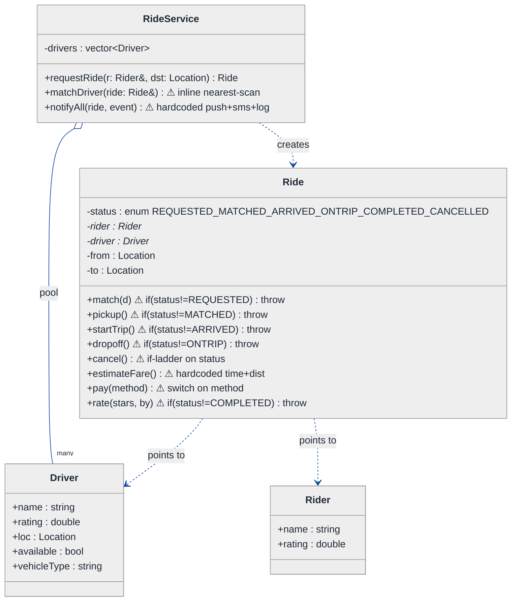
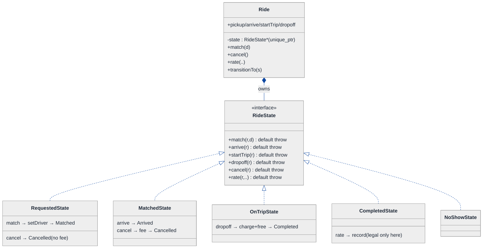
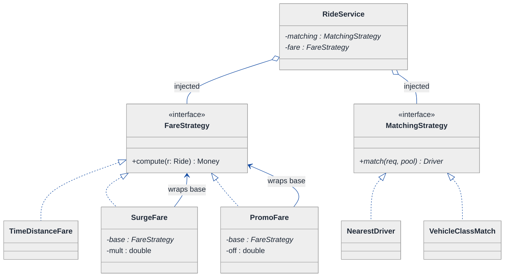
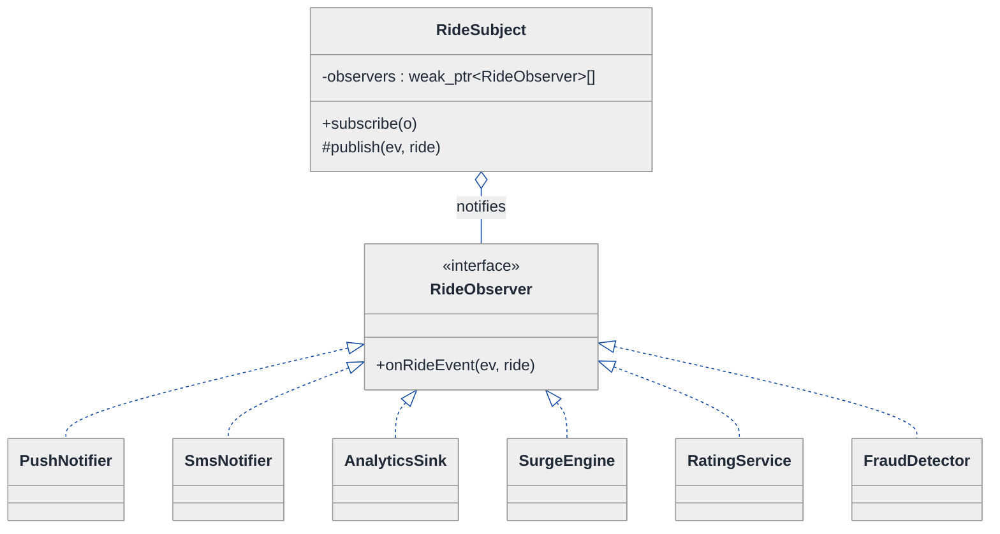
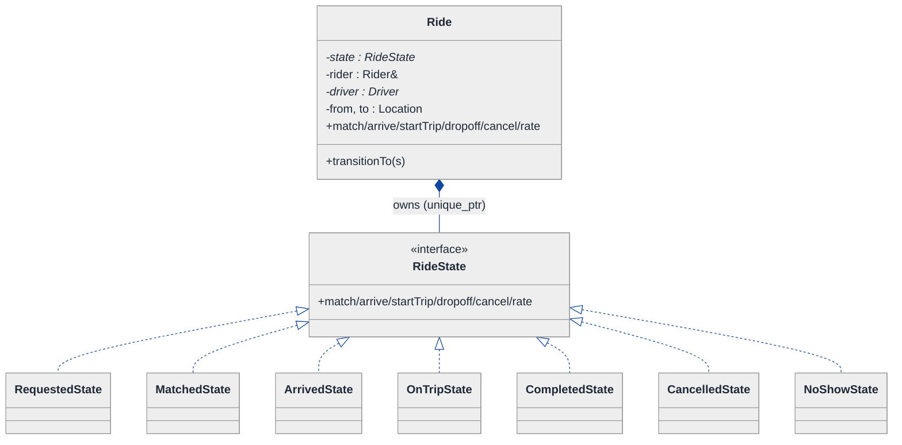
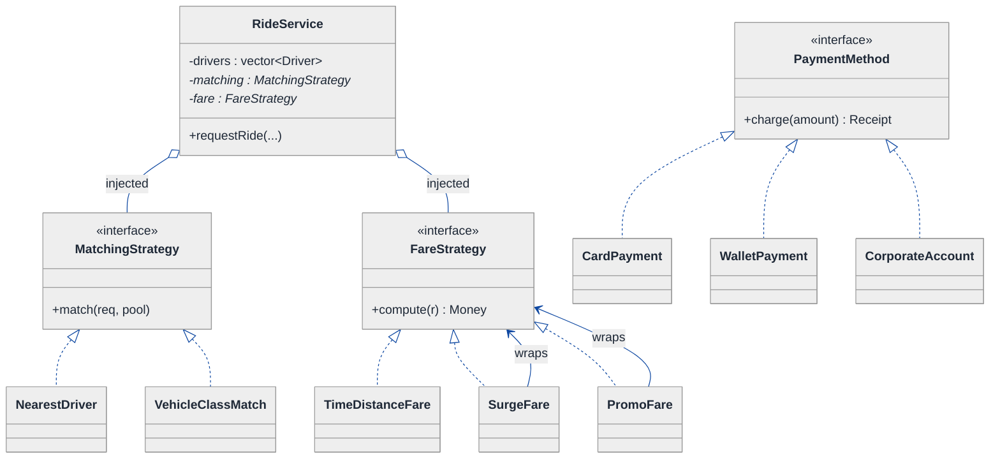
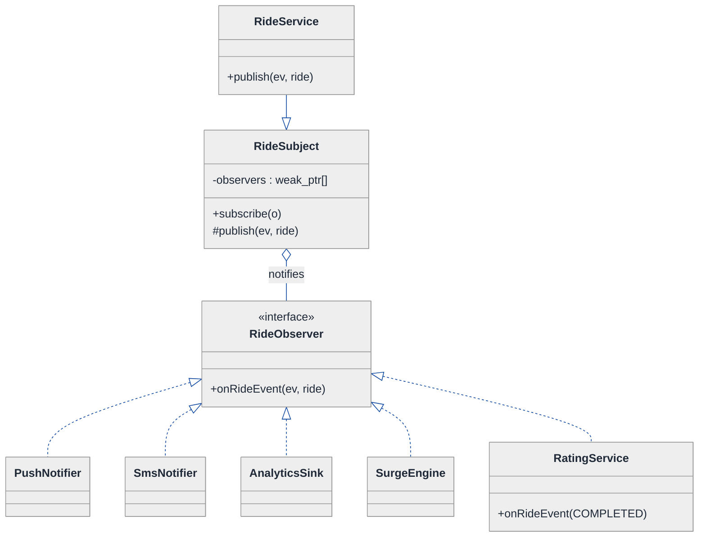
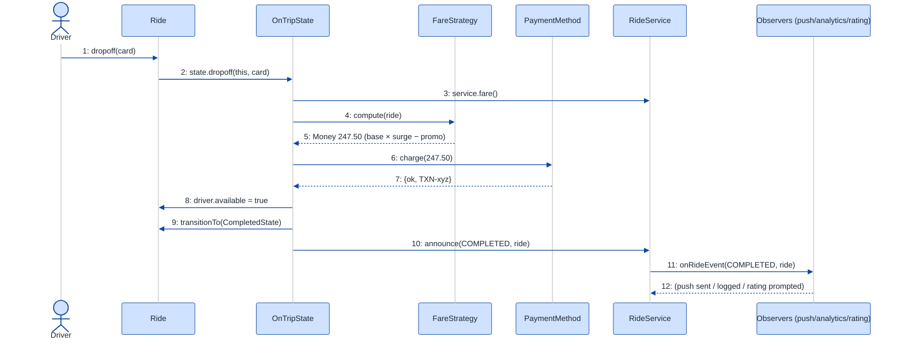

# Ride-Sharing Application — LLD Walkthrough

> **Difficulty:** Hard · **Time:** ~45 min · **Pattern focus:** State (ride lifecycle) + Strategy (matching, fare, payment) + Observer (notifications, ratings, surge feed)
>
> **Problem source(s):** GID ST7, bucket `State_Pattern`. Representative of "design Uber/Lyft/Ola at the class level" interview rows in [`./EXTRACTED_QUESTIONS.md`](./EXTRACTED_QUESTIONS.md).
>
> **Diagrams:** inline mermaid (renders natively in GitHub / VS Code). The canonical theme block is copied verbatim into every diagram.

---

## How to use this file

Paced for a candidate seeing the ride-sharing problem for the first time. Reading time: ~45 minutes if you sketch each iteration by hand. **The lesson: a ride is a LIFECYCLE with strict legal transitions, wrapped in several INDEPENDENT algorithm choices, observed by several INDEPENDENT listeners. Don't reach for those three patterns up front — DERIVE them by building the naive design first, watching it break under four hypothetical changes, then reaching for ONE pattern per painful axis.**

**Map of this file (15 sections):**

1. Problem statement + clarifying questions
2. Plain-English restatement
3. Why this matters
4. Mental model
5. Try it yourself first
6. Entity & verb extraction
7. **Iteration 1: the naive design** — what we'd write first
8. **Where the naive design hurts** — four future requirements, one painful diff each
9. **Pivot 1: State for the ride lifecycle** — the most painful axis first
10. **Pivot 2: Strategy for matching, fare, and payment** — algorithm picked by the system, not the ride
11. **Pivot 3: Observer for notifications, ratings, and the surge feed** — fan-out without coupling
12. Final UML class diagram (three sub-views)
13. Skeleton code (C++17)
14. Key flow — sequence diagram
15. Extensibility re-check + anti-patterns + how to think aloud + self-check

---

## 1. Problem statement + clarifying questions

**Prompt (typical phrasing):** "Design a ride-sharing application at the class level. Riders and drivers register; the system matches a rider to a nearby driver; it estimates a fare; it manages the ride through its lifecycle — request, match, pickup, trip, dropoff, payment; and it supports a rating system."

**Clarifying questions to ask BEFORE drawing anything:**

1. **Matching scope?** Match on pure proximity (nearest free driver), or also factor ETA, driver rating, vehicle class (economy / XL / lux), and surge zones?
2. **Fare model?** Flat per-km, time + distance, surge multiplier during peak, promo codes, minimum fare, airport flat rates? Are several of these combined on one trip?
3. **Lifecycle edges?** What are the legal states and transitions? Can a rider cancel after match but before pickup (cancellation fee)? Can a driver reject a request? What happens on a no-show?
4. **Payment timing?** Charged automatically at dropoff, or pre-authorized at match? Card, wallet, cash, corporate account?
5. **Who needs to be notified, and when?** Push to rider on match/arrival, SMS fallback, driver app update, analytics pipeline, surge-pricing engine — and can that list grow without touching ride code?
6. **Ratings — one-way or two-way?** Does the driver rate the rider too? When is a rating allowed (only after a completed trip)?
7. **Concurrency?** Two riders requesting the same nearest driver simultaneously — should the design prevent a double-assignment?
8. **One city or many?** Per-city surge config and per-region driver pools, or a single global pool?

**Assumptions if the interviewer dodges:** two-way ratings allowed only after a completed trip; fare = time + distance with a composable surge and promo layer; matching by proximity + vehicle-class filter; payment auto-charged at dropoff via a pluggable method; an open-ended set of listeners (push, SMS, analytics, surge engine) must be addable without editing ride code; single-threaded core for now (concurrency discussed in §15).

---

## 2. Plain-English restatement

We're building the software that coordinates a ride from "rider taps Request" to "both parties have rated each other." The system tracks driver availability, finds a suitable nearby driver, quotes a fare, then walks the ride through a **strict sequence of states** — each state allowing only certain actions (you can't `startTrip` before `pickup`, you can't `rate` before the trip completes). Along the way it charges a payment and tells a growing list of interested parties what just happened. The design must accommodate new matching rules, new fare components, new payment methods, new lifecycle states (e.g., a no-show flow), and new notification channels **without rewriting the core ride orchestration**.

---

## 3. Why this matters

This is the canonical "lifecycle-heavy domain" LLD question, and it is harder than parking lot because **three different families of variation collide in one object**. The interviewer is probing whether you can tell them apart: a *lifecycle with illegal transitions* (State), an *algorithm the system swaps* (Strategy), and a *one-to-many event fan-out* (Observer). Most candidates collapse all three into a `status` enum plus a wall of `if`s and a hardcoded list of side effects. The senior bar is in seeing that these are three distinct axes — and in DERIVING which pattern each axis wants.

---

## 4. Mental model

A ride is a **state machine on rails** that fires **events** as it moves, and consults **policies** to make its numeric and matching decisions. Three things vary independently: *what's legal next* (the rails), *how we compute the answer* (the policies), and *who cares that it happened* (the listeners).

```
Real-world sketch (NOT a UML diagram yet):

   rider taps Request
        │
        ▼
   [REQUESTED] ──match──> [MATCHED] ──arrive──> [ARRIVED]
        │                    │                      │
      cancel               cancel                 pickup
        │                    │                      ▼
        ▼                    ▼                  [ON_TRIP]
   [CANCELLED]          [CANCELLED]                 │
                       (with fee)                 dropoff
                                                    ▼
                                              [COMPLETED] ──rate──> done

   Off to the side, three pluggable boxes the ride consults / notifies:
     ┌ MatchingStrategy ┐   ┌ FareStrategy ┐   ┌ listeners... ┐
     │ nearest? rated?  │   │ time+dist ×  │   │ push  SMS    │
     │ vehicle class?   │   │ surge × promo│   │ analytics    │
     └──────────────────┘   └──────────────┘   │ surge engine │
                                               └──────────────┘
```

The KEY insight from this picture: the **rails are the ride's own concern** (the ride decides what's legal next), the **policies are injected** (the system picks them), and the **listeners are decoupled** (the ride announces, it doesn't call them by name). Rails vs. policy vs. audience — that separation is the whole design.

---

## 5. Try it yourself first

> **Predict before reading on:**
>
> 1. List 6 nouns you'd promote to a class and 3 nouns you'd leave as fields.
> 2. **If I told you a `rate()` call must be rejected unless the ride is COMPLETED, where do you put that check — and what happens to that code when we add a `NoShow` state next quarter?**
> 3. When a ride is matched, the rider gets a push, the driver app updates, AND an analytics event fires. If next month we must also notify a fraud-detection service, how many existing classes should you have to edit? (The right answer is zero.)

---

## 6. Entity & verb extraction

> **Mini-refresher: noun → class, but not every noun.**
>
> Naive OOD promotes every noun to a class. Senior OOD promotes a noun only if it has both BEHAVIOR and STATE that need to live together. "Rating value" stays a field; "Ride" becomes a class because it has lifecycle behavior; "Location" stays a small value type.

**Nouns from the prompt:**

| Noun | Decision | Why |
|---|---|---|
| RideService | Class (top-level coordinator) | Owns the driver pool + policies; orchestrates request/match |
| Ride / Trip | Class | The lifecycle object — the heart of the design |
| Rider | Class | Has profile, rating, payment method |
| Driver | Class | Has profile, rating, location, availability, vehicle |
| Vehicle | Field/small class on Driver | Class + type (economy/XL/lux); little behavior |
| Location | Value type (`struct{lat,lng}`) | No behavior beyond `distanceTo` |
| Fare / Money | Value type (`struct Money`) | Just a number + currency |
| Rating | Field + small `RatingEntry` record | A value; the *system* of rating has behavior |
| Notification | NOT a stored class — an EVENT | It's a thing that happens, not a thing that persists |
| PaymentMethod | Class hierarchy (varies) | Card / wallet / cash differ in behavior |

**Verbs (and the class they live on):**

| Verb | Owner class (naive answer — we'll re-examine) |
|---|---|
| requestRide(rider, dest) | RideService |
| matchDriver(ride) | RideService |
| estimateFare(ride) | RideService / Ride |
| pickup() / startTrip() / dropoff() | Ride |
| pay() | Ride |
| cancel() | Ride |
| rate(stars, by) | Ride / RatingService |
| notify(...) | RideService (naive) — *this will hurt* |

**We have NOT introduced any design patterns yet.** Pure nouns + verbs.

---

## 7. <a id="iter-1"></a>Iteration 1: the naive design

Let's write the simplest thing that could possibly work. No design patterns — just classes, a `status` enum, and methods that branch on it.



**Reader's tour (read top to bottom; ~60 seconds).**

1. **`RideService` is the root coordinator.** It holds the driver pool and exposes `requestRide`, `matchDriver`, and a `notifyAll`. Notice: NO injected policy objects, NO event subscribers. Matching is an inline scan; notification is a hardcoded sequence of calls.

2. **`Ride` is the trouble zone — and there is a LOT of trouble.** Look at the warning markers (⚠). Every lifecycle method opens with `if (status != EXPECTED) throw`. The fare is a hardcoded formula. `pay()` switches on the payment method. `rate()` guards on status. Five different concerns all branch on the same `status` enum.

3. **The composition / association edges.** `RideService` aggregates the `Driver` pool (open diamond — it references drivers, drivers outlive any one service call). `Ride` merely *points to* its `Rider` and `Driver` (association, not ownership) — a ride doesn't own the people in it.

4. **Rider and Driver are near-anemic.** Right now they're data bags with a `rating` field. That's fine for the naive cut; the rating *system* (who can rate whom, when) is currently smeared into `Ride::rate`.

**What's deliberately missing.** No `RideState` hierarchy — just an enum and `if`s. No `MatchingStrategy`, `FareStrategy`, or `PaymentMethod` polymorphism — just inline formulas and a switch. No `Observer` mechanism — `notifyAll` hardcodes who hears about an event. The naive design doesn't even *acknowledge* these as axes of variation. That's what we're going to expose, and fix, over the next four sections.

Skeleton code for the naive design (C++):

```cpp
#include <chrono>
#include <stdexcept>
#include <string>
#include <vector>

enum class RideStatus { REQUESTED, MATCHED, ARRIVED, ON_TRIP, COMPLETED, CANCELLED };
enum class PayMethod  { CARD, WALLET, CASH };

struct Location { double lat, lng; double distanceTo(const Location& o) const; };

struct Rider  { std::string name; double rating = 5.0; };
struct Driver { std::string name; double rating = 5.0; Location loc; bool available = true; std::string vehicleType; };

class Ride {
public:
    Ride(Rider* r, Location from, Location to) : rider_(r), from_(from), to_(to) {}

    void match(Driver* d) {
        if (status_ != RideStatus::REQUESTED) throw std::runtime_error("Can't match now");
        driver_ = d; d->available = false; status_ = RideStatus::MATCHED;
    }
    void pickup() {                       // driver arrived + rider in car
        if (status_ != RideStatus::MATCHED && status_ != RideStatus::ARRIVED)
            throw std::runtime_error("Can't pick up now");
        status_ = RideStatus::ON_TRIP;
    }
    void dropoff() {
        if (status_ != RideStatus::ON_TRIP) throw std::runtime_error("Not on trip");
        status_ = RideStatus::COMPLETED; driver_->available = true;
    }
    void cancel() {
        if (status_ == RideStatus::ON_TRIP || status_ == RideStatus::COMPLETED)
            throw std::runtime_error("Too late to cancel");
        if (driver_) driver_->available = true;
        status_ = RideStatus::CANCELLED;
    }
    double estimateFare() const {                          // hardcoded — will hurt
        double km = from_.distanceTo(to_);
        return 30.0 + km * 12.0;                           // base + per-km, nothing else
    }
    bool pay(PayMethod m) {                                // tag switch — will hurt
        double amount = estimateFare();
        switch (m) {
            case PayMethod::CARD:   return true;           // call Stripe
            case PayMethod::WALLET: return true;           // debit wallet
            case PayMethod::CASH:   return true;           // mark collected
        }
        return false;
    }
    void rate(int stars, bool byDriver) {                  // status guard — will hurt
        if (status_ != RideStatus::COMPLETED) throw std::runtime_error("Rate only completed");
        if (byDriver) rider_->rating = (rider_->rating + stars) / 2.0;
        else          driver_->rating = (driver_->rating + stars) / 2.0;
    }
    RideStatus status() const { return status_; }
    Driver* driver() const { return driver_; }
private:
    RideStatus status_ = RideStatus::REQUESTED;
    Rider*  rider_;
    Driver* driver_ = nullptr;
    Location from_, to_;
};

class RideService {
public:
    explicit RideService(std::vector<Driver> drivers) : drivers_(std::move(drivers)) {}

    Ride requestRide(Rider& r, Location from, Location to) {
        Ride ride(&r, from, to);
        Driver* d = matchDriver(from);                     // inline nearest-scan
        if (d) ride.match(d);
        notifyAll(ride, "matched");                        // hardcoded fan-out
        return ride;
    }
private:
    Driver* matchDriver(Location near) {                   // inline algorithm — will hurt
        Driver* best = nullptr; double bestKm = 1e9;
        for (auto& d : drivers_)
            if (d.available && d.loc.distanceTo(near) < bestKm) { bestKm = d.loc.distanceTo(near); best = &d; }
        return best;
    }
    void notifyAll(const Ride&, const std::string&) {      // hardcoded listeners — will hurt
        // sendPush(...);  sendSms(...);  analyticsLog(...);
    }
    std::vector<Driver> drivers_;
};
```

**This works.** It has zero design patterns. We can request, match, ride, pay, rate. So what's wrong with it?

---

## 8. <a id="naive-pain"></a>Where the naive design hurts

The interviewer slides a piece of paper across the desk: "Here are four requirements coming next quarter. Walk me through what changes."

### Change A: "Add a NO-SHOW flow — if the rider isn't at pickup after 5 min, the driver marks no-show, a cancellation fee is charged, and the driver is freed"

In the naive design:
- `RideStatus` enum doesn't have `NO_SHOW`. Add it.
- Every method that branches on status (`match`, `pickup`, `dropoff`, `cancel`, `rate`, `pay`) must now consider whether `NO_SHOW` is legal from there. That's six `if`-ladders to audit.
- `cancel()` already mixes "rider cancels" and "too late to cancel"; a no-show fee is a *third* exit path that doesn't fit the existing branches.
- **The change touches the enum AND scatters edits across six methods.** The transition matrix is implicit and uncheckable.

### Change B: "Surge pricing — multiply fare by a per-zone multiplier during peak; ALSO support promo codes that subtract a flat discount"

In the naive design:
- `estimateFare()` grows time-of-day logic, a zone lookup, a multiplier, then a promo subtraction.
- These two rules must COMBINE (surge then promo), so it becomes nested arithmetic in one method.
- **Next fare rule → another 10 lines in `estimateFare`.** Three rules in and it's unreadable, and you can't reorder or reuse them.

### Change C: "Add UPI and corporate-account payment; corporate rides are billed monthly, not per-trip"

In the naive design:
- Add `UPI` and `CORP` to `PayMethod` enum.
- Add `case UPI:` and `case CORP:` to `Ride::pay()`. Corporate billing isn't even a per-trip charge — it doesn't fit the `return true` shape.
- **Every new payment method is surgery inside the same switch.** Classic tag-driven dispatch.

### Change D: "Notify a fraud-detection service on every match, and a driver-incentive engine on every completed trip — without slowing down or touching ride code"

In the naive design:
- `RideService::notifyAll` hardcodes `sendPush / sendSms / analyticsLog`. Add two more calls inside it.
- The new services need DIFFERENT events (fraud cares about `matched`; incentives care about `completed`), so `notifyAll` grows event-type branching too.
- **Every new listener edits `notifyAll`, and `RideService` now compile-depends on fraud + incentive modules.** The coordinator becomes a junk drawer of side effects.

### The pattern of pain

| Change | Files/methods touched | Smell |
|---|---|---|
| A. No-show state | enum + 6 lifecycle methods | "Status enum + scattered `if`s can't express a new lifecycle state safely." |
| B. Surge + promo | `Ride::estimateFare` (monstrous) | "Single method accumulates every fare rule; rules can't compose." |
| C. UPI / corporate pay | `Ride::pay` switch | "Tag-driven dispatch; every new method is surgery in one function." |
| D. New listeners | `RideService::notifyAll` | "Coordinator hardcodes its audience and depends on every consumer." |

**Three axes of pain dominate:** lifecycle variability (states & legal transitions), algorithm variability (matching, fare, payment), and fan-out variability (who hears about events).

> **Pivot question:** "What pattern handles 'a lifecycle where each phase allows different actions and decides the next phase'? What pattern handles 'an algorithm the SYSTEM swaps'? And what pattern handles 'announce an event to an open-ended set of listeners without naming them'?"
>
> The answers are State, Strategy, and Observer. Let's introduce them one at a time, starting with the most painful axis: the lifecycle.

---

## 9. <a id="pivot-1"></a>Pivot 1: State for the ride lifecycle

Change A is the most painful: a new state forces edits across six methods, and the legal-transition matrix is invisible. The variability here is NOT in an algorithm — it's in *what's valid next*, and *what the next state is*.

> **Mini-refresher: State pattern.**
>
> Each lifecycle state is its own class implementing a common interface. The context object (here, `Ride`) delegates every action (`pickup()`, `startTrip()`, …) to its CURRENT state object, and THE STATE decides what the next state is by calling `context.transitionTo(...)`. Transitions are INTERNAL, driven by the events the context receives. Illegal actions are handled by the state simply throwing — no scattered `if (status == X)` checks.

**Why State (not Strategy) for the lifecycle.** The choice of state is NOT picked by the caller — it's driven by what the ride has been through. A `RequestedRide` can `match()`. A `MatchedRide` can `arrive()` or `cancel()` (with fee). An `OnTripRide` can only `dropoff()`. A `CompletedRide` can only `rate()`. Calling `dropoff()` on a `RequestedRide` isn't meaningful — it should fail loudly. The lifecycle is the OBJECT'S concern, not the caller's.

**The refactor (just the lifecycle part):**

```cpp
class Ride;                       // forward
class PaymentMethod;              // forward — Pivot 2/3
class FareStrategy;               // forward — Pivot 2

class RideState {
public:
    virtual ~RideState() = default;
    virtual const char* name() const = 0;
    virtual void match(Ride&, Driver&)         { throw std::logic_error("match: illegal here"); }
    virtual void arrive(Ride&)                 { throw std::logic_error("arrive: illegal here"); }
    virtual void startTrip(Ride&)              { throw std::logic_error("startTrip: illegal here"); }
    virtual void dropoff(Ride&)                { throw std::logic_error("dropoff: illegal here"); }
    virtual void cancel(Ride&)                 { throw std::logic_error("cancel: illegal here"); }
    virtual void rate(Ride&, int, bool)        { throw std::logic_error("rate: illegal here"); }
};

class RequestedState : public RideState {       // can match or cancel (no fee)
public:
    const char* name() const override { return "REQUESTED"; }
    void match(Ride& r, Driver& d) override;    // assign driver -> MatchedState
    void cancel(Ride& r) override;              // free nothing -> CancelledState
};

class OnTripState : public RideState {          // can only drop off
public:
    const char* name() const override { return "ON_TRIP"; }
    void dropoff(Ride& r) override;             // charge + free driver -> CompletedState
};

class CompletedState : public RideState {       // can only be rated
public:
    const char* name() const override { return "COMPLETED"; }
    void rate(Ride& r, int stars, bool byDriver) override;   // legal here only
};
// MatchedState, ArrivedState, CancelledState elided — same shape

class Ride {
public:
    Ride(Rider& rider, Location from, Location to)
        : rider_(rider), from_(from), to_(to),
          state_(std::make_unique<RequestedState>()) {}

    // Public API delegates EVERYTHING to the current state — no status branching.
    void match(Driver& d)            { state_->match(*this, d); }
    void arrive()                    { state_->arrive(*this); }
    void startTrip()                 { state_->startTrip(*this); }
    void dropoff()                   { state_->dropoff(*this); }
    void cancel()                    { state_->cancel(*this); }
    void rate(int stars, bool byDrv) { state_->rate(*this, stars, byDrv); }

    void transitionTo(std::unique_ptr<RideState> s) { state_ = std::move(s); }
    const char* stateName() const { return state_->name(); }
    // getters: rider(), driver(), from(), to(), setDriver(...) elided
private:
    Rider&   rider_;
    Driver*  driver_ = nullptr;
    Location from_, to_;
    std::unique_ptr<RideState> state_;
};
```

**What changed — visualized.** Just the lifecycle slice:



**Tour of the after-state.**

1. **The `RideStatus` enum is gone.** It's replaced by a `state` field of type `std::unique_ptr<RideState>` — the ride exclusively OWNS its current state object and swaps it on each transition.

2. **Every public lifecycle method on `Ride` became a one-liner.** `dropoff()` is just `state_->dropoff(*this)`. **There is no `if (status == ...)` anywhere.** The illegal-action check moved INTO the base class as a default `throw` — a state only overrides the actions that are legal in it.

3. **The base `RideState` defaults to "illegal."** Each pure-ish method throws by default; concrete states override only the legal transitions. So `OnTripState` overrides only `dropoff`; calling `match()` on an on-trip ride hits the base default and throws. **You can't forget a guard — the default IS the guard.**

4. **Each state knows its next state.** `RequestedState::match` calls `r.transitionTo(make_unique<MatchedState>())`. The transition lives WITH the state, not in `Ride` and not in `RideService`. That's the essence of State.

5. **Change A lands as ONE new class.** `NoShowState` (bottom) is added; `MatchedState`/`ArrivedState` gain a `noShow()` transition into it. No edits to `OnTripState`, `CompletedState`, or `Ride`. The transition matrix is now explicit (it's the set of overrides per class) and reviewable.

**Pattern-discrimination cheatsheet — State vs Strategy.**
- *State:* the OBJECT picks its next state internally; states know about each other (each state's methods `transitionTo` another). Swap is driven by an internal event flow.
- *Strategy:* the CALLER (or system config) picks which one to use; strategies are usually unaware of each other. Swap is driven by external code.
- *Rule of thumb:* if `ride.dropoff()` flips state internally → **State**. If `service.setMatchingStrategy(x)` is called externally → **Strategy**. The ride lifecycle is State; matching/fare/payment (next pivot) are Strategy.

---

## 10. <a id="pivot-2"></a>Pivot 2: Strategy for matching, fare, and payment

Changes B and C are still painful — fare rules that must compose, and a payment switch that grows. Pricing/matching/payment are each an *algorithm*: given inputs, produce an answer. They vary, and the choice is made by the SYSTEM (config / city / experiment), not by the ride itself. That's textbook Strategy.

> **Mini-refresher: Strategy pattern.**
>
> Encapsulates an algorithm behind an interface so it can be swapped at runtime. The CALLER decides which strategy to use; the strategy doesn't know about its peers.
>
> Quick example: a `Sorter` takes a `CompareStrategy*` in its constructor — pass `AscendingCompare` or `DescendingCompare`; the sorter doesn't care which.

**Why three SEPARATE Strategy hierarchies.** Matching, fare, and payment have nothing in common at the type level (different inputs, different outputs). Strategy is a *role*, not a shared type — don't try to unify them under one `Strategy<T>` template. Each axis gets its own interface.

**The refactor (the three affected slices):**

```cpp
// ── Matching: "given a request, pick a driver" ──────────────────────
class MatchingStrategy {
public:
    virtual ~MatchingStrategy() = default;
    virtual Driver* match(const Ride& req, std::vector<Driver>& pool) = 0;
};
class NearestDriver : public MatchingStrategy {
public:
    Driver* match(const Ride& req, std::vector<Driver>& pool) override {
        Driver* best = nullptr; double bestKm = 1e9;
        for (auto& d : pool)
            if (d.available && d.loc.distanceTo(req.from()) < bestKm) { bestKm = d.loc.distanceTo(req.from()); best = &d; }
        return best;
    }
};
// VehicleClassMatch, HighestRatedNearby elided

// ── Fare: "given a ride, return a Money" — DECORATOR-composable ──────
struct Money { double amount; };
class FareStrategy {
public:
    virtual ~FareStrategy() = default;
    virtual Money compute(const Ride& r) const = 0;
};
class TimeDistanceFare : public FareStrategy {           // the base rule
public:
    Money compute(const Ride& r) const override {
        double km = r.from().distanceTo(r.to());
        return Money{ 30.0 + km * 12.0 };
    }
};
class SurgeFare : public FareStrategy {                  // wraps another fare
public:
    SurgeFare(std::unique_ptr<FareStrategy> base, double mult) : base_(std::move(base)), mult_(mult) {}
    Money compute(const Ride& r) const override { return Money{ base_->compute(r).amount * mult_ }; }
private:
    std::unique_ptr<FareStrategy> base_; double mult_;
};
class PromoFare : public FareStrategy {                  // wraps another fare
public:
    PromoFare(std::unique_ptr<FareStrategy> base, double off) : base_(std::move(base)), off_(off) {}
    Money compute(const Ride& r) const override { return Money{ std::max(0.0, base_->compute(r).amount - off_) }; }
private:
    std::unique_ptr<FareStrategy> base_; double off_;
};

// ── Payment: "charge an amount" ─────────────────────────────────────
class PaymentMethod {
public:
    struct Receipt { bool ok; std::string ref; };
    virtual ~PaymentMethod() = default;
    virtual Receipt charge(Money amount) = 0;
};
class CardPayment : public PaymentMethod { public: Receipt charge(Money) override; };   // Stripe
class WalletPayment : public PaymentMethod { public: Receipt charge(Money) override; }; // debit balance
// UpiPayment, CorporateAccount (deferred billing) elided
```

**What changed — visualized.** The fare slice (the most interesting — it COMPOSES):



**Tour of the after-state.**

1. **`RideService` gained two injected pointers** (open diamonds = aggregation): a `MatchingStrategy` and a `FareStrategy`. The service no longer scans drivers inline or hardcodes a fare formula — it delegates.

2. **`FareStrategy` is the composable one.** `SurgeFare` and `PromoFare` are DECORATORS — each holds a `base : FareStrategy*` and wraps it. So `PromoFare(SurgeFare(TimeDistanceFare, 1.8), 50)` means "time+distance, then ×1.8 surge, then −50 promo," in that order. **Change B (surge + promo combined) is now two small classes that stack** — the naive design couldn't express this without nested arithmetic.

3. **`MatchingStrategy` is the swappable one.** Nearest-driver vs vehicle-class-filtered vs highest-rated-nearby are interchangeable; the city config picks one. No decoration needed here — these are alternatives, not layers.

4. **Payment (not drawn here, same shape).** `PaymentMethod` is an interface with `CardPayment`, `WalletPayment`, `UpiPayment`, `CorporateAccount` implementations. **Change C (UPI / corporate) is now one new class each**, not a new `case` in a switch. Corporate's deferred-billing behavior lives inside `CorporateAccount::charge` (record-and-invoice-later) instead of distorting `Ride::pay`.

5. **`Ride::estimateFare` and the `pay` switch are GONE.** The ride asks the service for its fare strategy and the caller passes a payment method — the algorithms moved out of the lifecycle object.

**Pattern-discrimination cheatsheet — Strategy vs Decorator.**
- *Strategy:* pick ONE algorithm from a set of alternatives (nearest vs vehicle-class match).
- *Decorator:* LAYER behaviors by wrapping (time+distance → surge → promo), each adding to the wrapped result.
- *Rule of thumb:* "choose one of N" → Strategy. "stack N modifiers, each transforming the previous output" → Decorator. Fare wants both: a Strategy interface whose implementations happen to be Decorators.

---

## 11. <a id="pivot-3"></a>Pivot 3: Observer for notifications, ratings, and the surge feed

Change D is still painful — `RideService::notifyAll` hardcodes its audience and compile-depends on every consumer. The variability here is neither lifecycle nor algorithm: it's *who hears about an event*, and that set must grow without editing the announcer.

> **Mini-refresher: Observer pattern.**
>
> A SUBJECT keeps a list of OBSERVERS and notifies all of them when something happens — without knowing their concrete types. Observers `subscribe()` to the subject; the subject calls `onEvent(...)` on each. New observers are added by subscribing, never by editing the subject. (Use `weak_ptr` or careful lifetime rules for the back-references so a dead observer doesn't dangle.)

**Why Observer (not just more Strategy).** A Strategy answers "how do I compute X" — one result, one caller. Observer answers "this happened; everyone who cares, react" — a fan-out to an open-ended, order-independent set. Push, SMS, analytics, fraud detection, and the surge engine all want the SAME events but do unrelated things with them. We don't want `RideService` to know any of them by name.

**The refactor (the eventing slice):**

```cpp
enum class RideEvent { REQUESTED, MATCHED, ARRIVED, TRIP_STARTED, COMPLETED, CANCELLED, NO_SHOW };

class RideObserver {
public:
    virtual ~RideObserver() = default;
    virtual void onRideEvent(RideEvent ev, const Ride& r) = 0;
};

// The SUBJECT mixin — Ride (or RideService) IS-A subject.
class RideSubject {
public:
    void subscribe(std::shared_ptr<RideObserver> o) { observers_.push_back(o); }
protected:
    void publish(RideEvent ev, const Ride& r) {
        for (auto& w : observers_)
            if (auto o = w.lock()) o->onRideEvent(ev, r);   // weak_ptr → no dangling
    }
private:
    std::vector<std::weak_ptr<RideObserver>> observers_;
};

// Concrete observers — each does ONE thing, knows nothing of the others.
class PushNotifier : public RideObserver {
public:
    void onRideEvent(RideEvent ev, const Ride& r) override {
        if (ev == RideEvent::MATCHED)  { /* push "Driver on the way" to rider */ }
        if (ev == RideEvent::ARRIVED)  { /* push "Your driver has arrived"   */ }
    }
};
class SmsNotifier      : public RideObserver { public: void onRideEvent(RideEvent, const Ride&) override; };
class AnalyticsSink    : public RideObserver { public: void onRideEvent(RideEvent, const Ride&) override; };
class SurgeEngine      : public RideObserver { public: void onRideEvent(RideEvent, const Ride&) override; }; // counts demand per zone
class FraudDetector    : public RideObserver { public: void onRideEvent(RideEvent, const Ride&) override; }; // Change D — just subscribe
```

**The rating system is ALSO an Observer.** A `RatingService` subscribes to `COMPLETED` events and prompts both parties; when a rating arrives it updates the driver's / rider's running average. Ratings thus don't bloat the lifecycle either — `CompletedState::rate` records the value, and a `RatingService` observer reacts to the completion. (Two-way rating: `rate(stars, byDriver)` routes to rider or driver accordingly.)

**What changed — visualized:**



**Tour of the after-state.**

1. **`RideSubject` holds a list of observers and a `publish` method.** `RideService` (and/or `Ride`) inherits from it. When a transition happens, the state calls `publish(RideEvent::MATCHED, ride)` — and that's the ONLY coupling point.

2. **The list is `weak_ptr<RideObserver>`.** This breaks the lifetime cycle: observers can come and go; a dead observer's `weak_ptr` simply fails to `lock()` and is skipped. (Owning `shared_ptr` would keep observers alive forever — a leak.)

3. **Six concrete observers, each doing ONE thing.** `PushNotifier` pushes; `SurgeEngine` counts demand per zone (and feeds back into the next `SurgeFare` multiplier — note how Observer and Strategy connect); `RatingService` updates averages on completion. None of them know about each other.

4. **Change D lands as ZERO edits to existing code.** `FraudDetector` is a new class that `subscribe()`s. `RideService::notifyAll` is deleted entirely — replaced by `publish` at each transition. The coordinator no longer compile-depends on any consumer.

**Pattern-discrimination cheatsheet — Observer vs Mediator.**
- *Observer:* one subject broadcasts to many independent listeners; listeners don't talk back or to each other. Fan-out.
- *Mediator:* a central hub coordinates many peers that DO need to interact, routing messages between them. Many-to-many through a hub.
- *Rule of thumb:* "announce, everyone reacts independently" → Observer. "objects must coordinate with each other via a central broker" → Mediator. Ride notifications are pure fan-out → Observer.

---

## 12. <a id="fig-class-diagram"></a>Final class diagram

Showing the entire final design in one diagram becomes a wall of boxes. Instead, here are **three focused sub-views**, each addressing one of the three axes. Read them in order; the structural insight at the end ties them together.

### 12.1 The lifecycle spine — Ride's State machine



**Tour of 12.1.** One `Ride` owns one `RideState` via `unique_ptr` (filled diamond = composition, same lifetime). Seven concrete states hang off the interface; each overrides only the actions legal in it and `transitionTo`s the next. `CancelledState`, `CompletedState`, and `NoShowState` are terminal. Adding a state is one new class — no edits to siblings.

### 12.2 The policy injection — what the service USES



**Tour of 12.2.** `RideService` aggregates (open diamonds) a `MatchingStrategy` and a `FareStrategy`, injected at construction. Each interface has its own family below it. `SurgeFare`/`PromoFare` are decorators (the `wraps` arrows back to `FareStrategy`) so fare rules stack. `PaymentMethod` is shown here for completeness but is NOT stored on the service — it's passed by the caller into `pay()` (per-trip choice). The structural point: variability the naive design hardcoded inside `RideService::matchDriver` and `Ride::estimateFare` is now lifted into hot-swappable type hierarchies.

### 12.3 The event fan-out — Observer wiring + rating



**Tour of 12.3.** `RideService` IS-A `RideSubject` (inheritance — a genuine "the service is the announcer"). The subject holds `weak_ptr` observers and `publish`es events; five observers react independently. `SurgeEngine` is the bridge back to Pivot 2 — it tallies demand per zone, which the next `SurgeFare` multiplier reads. `RatingService` reacts to `COMPLETED` to prompt and average. New observers (fraud, incentives) just `subscribe()`.

### Structural insight (ties 12.1 + 12.2 + 12.3 together)

| Concern | Pattern used | Why |
|---|---|---|
| **Lifecycle** (Requested → … → Completed / Cancelled / NoShow) | State, OWNED by Ride | The ride controls transitions; each state validates what's legal next |
| **Matching** (nearest / vehicle-class / rated) | Strategy, INJECTED into RideService | System/config picks the algorithm |
| **Fare** (time+dist × surge × promo) | Strategy whose impls are Decorators | Rules compose; layered modifiers |
| **Payment** (card / wallet / UPI / corporate) | Strategy, PASSED as method parameter | Caller decides per-trip; not service-wide |
| **Events** (push / SMS / analytics / surge / ratings / fraud) | Observer, fan-out from the subject | Open-ended audience; announce, don't call by name |

The big lesson: **inheritance is used only for genuine "is-a" — the State family, the Strategy families, the Observer family, and RideService-is-a-Subject.** Every "varies independently" axis becomes composition over an interface. *State for the rails, Strategy for the policies, Observer for the audience.* That triad is what makes the design extensible.

---

## 13. Skeleton code (C++17)

> Show the SHAPES, not the full impl. Abstract bases + 1-2 concrete classes per pattern; the rest `// elided`.

```cpp
#include <chrono>
#include <memory>
#include <stdexcept>
#include <string>
#include <vector>
#include <algorithm>

// ── Forward declarations ────────────────────────────────────────────
class Ride;
class RideService;

// ── Value types ─────────────────────────────────────────────────────
struct Location { double lat, lng; double distanceTo(const Location&) const; };
struct Money    { double amount = 0.0; };

struct Rider  { std::string name; double rating = 5.0; int ratingCount = 0; };
struct Driver { std::string name; double rating = 5.0; int ratingCount = 0;
                Location loc; bool available = true; std::string vehicleType; };

enum class RideEvent { REQUESTED, MATCHED, ARRIVED, TRIP_STARTED, COMPLETED, CANCELLED, NO_SHOW };

// ── Observer ────────────────────────────────────────────────────────
class RideObserver {
public:
    virtual ~RideObserver() = default;
    virtual void onRideEvent(RideEvent ev, const Ride& r) = 0;
};

class RideSubject {
public:
    void subscribe(std::shared_ptr<RideObserver> o) { observers_.push_back(std::move(o)); }
protected:
    void publish(RideEvent ev, const Ride& r) {
        for (auto& w : observers_) if (auto o = w.lock()) o->onRideEvent(ev, r);
    }
private:
    std::vector<std::weak_ptr<RideObserver>> observers_;
};
class PushNotifier : public RideObserver {
public:
    void onRideEvent(RideEvent ev, const Ride&) override { /* push per event */ }
};
// SmsNotifier, AnalyticsSink, SurgeEngine, FraudDetector elided

// ── Strategy: matching ──────────────────────────────────────────────
class MatchingStrategy {
public:
    virtual ~MatchingStrategy() = default;
    virtual Driver* match(const Ride& req, std::vector<Driver>& pool) = 0;
};
class NearestDriver : public MatchingStrategy {
public:
    Driver* match(const Ride& req, std::vector<Driver>& pool) override;   // nearest available
};
// VehicleClassMatch, HighestRatedNearby elided

// ── Strategy: fare (decorator-composable) ───────────────────────────
class FareStrategy {
public:
    virtual ~FareStrategy() = default;
    virtual Money compute(const Ride& r) const = 0;
};
class TimeDistanceFare : public FareStrategy {
public:
    Money compute(const Ride& r) const override;                          // base + per-km
};
class SurgeFare : public FareStrategy {
public:
    SurgeFare(std::unique_ptr<FareStrategy> base, double mult)
        : base_(std::move(base)), mult_(mult) {}
    Money compute(const Ride& r) const override { return { base_->compute(r).amount * mult_ }; }
private:
    std::unique_ptr<FareStrategy> base_; double mult_;
};
// PromoFare, MinimumFare elided — same wrapping shape

// ── Strategy: payment (passed per trip) ─────────────────────────────
class PaymentMethod {
public:
    struct Receipt { bool ok; std::string ref; };
    virtual ~PaymentMethod() = default;
    virtual Receipt charge(Money amount) = 0;
};
class CardPayment : public PaymentMethod { public: Receipt charge(Money) override; };
// WalletPayment, UpiPayment, CorporateAccount (deferred billing) elided

// ── State: ride lifecycle ───────────────────────────────────────────
class RideState {
public:
    virtual ~RideState() = default;
    virtual const char* name() const = 0;
    virtual void match(Ride&, Driver&)   { throw std::logic_error("match illegal here"); }
    virtual void arrive(Ride&)           { throw std::logic_error("arrive illegal here"); }
    virtual void startTrip(Ride&)        { throw std::logic_error("startTrip illegal here"); }
    virtual void dropoff(Ride&, PaymentMethod&) { throw std::logic_error("dropoff illegal here"); }
    virtual void cancel(Ride&)           { throw std::logic_error("cancel illegal here"); }
    virtual void rate(Ride&, int, bool)  { throw std::logic_error("rate illegal here"); }
};

class RequestedState : public RideState {
public:
    const char* name() const override { return "REQUESTED"; }
    void match(Ride& r, Driver& d) override;     // -> MatchedState
    void cancel(Ride& r) override;               // -> CancelledState (no fee)
};
class OnTripState : public RideState {
public:
    const char* name() const override { return "ON_TRIP"; }
    void dropoff(Ride& r, PaymentMethod& m) override;   // charge + free driver -> CompletedState
};
class CompletedState : public RideState {
public:
    const char* name() const override { return "COMPLETED"; }
    void rate(Ride& r, int stars, bool byDriver) override;   // legal only here
};
// MatchedState, ArrivedState, CancelledState, NoShowState elided

// ── Ride (context) ──────────────────────────────────────────────────
class Ride {
public:
    Ride(RideService& svc, Rider& rider, Location from, Location to)
        : svc_(svc), rider_(rider), from_(from), to_(to),
          state_(std::make_unique<RequestedState>()) {}

    void match(Driver& d)               { state_->match(*this, d); }
    void arrive()                       { state_->arrive(*this); }
    void startTrip()                    { state_->startTrip(*this); }
    void dropoff(PaymentMethod& m)      { state_->dropoff(*this, m); }
    void cancel()                       { state_->cancel(*this); }
    void rate(int stars, bool byDriver) { state_->rate(*this, stars, byDriver); }

    void transitionTo(std::unique_ptr<RideState> s) { state_ = std::move(s); }
    RideService& service()   { return svc_; }
    Rider&  rider()          { return rider_; }
    Driver* driver() const   { return driver_; }
    void    setDriver(Driver* d) { driver_ = d; }
    const Location& from() const { return from_; }
    const Location& to()   const { return to_; }
    const char* stateName() const { return state_->name(); }
private:
    RideService& svc_;
    Rider&   rider_;
    Driver*  driver_ = nullptr;
    Location from_, to_;
    std::unique_ptr<RideState> state_;
};

// ── RideService (coordinator + subject) ─────────────────────────────
class RideService : public RideSubject {
public:
    RideService(std::vector<Driver> drivers,
                std::unique_ptr<MatchingStrategy> matching,
                std::unique_ptr<FareStrategy>     fare)
        : drivers_(std::move(drivers)), matching_(std::move(matching)), fare_(std::move(fare)) {}

    std::unique_ptr<Ride> requestRide(Rider& r, Location from, Location to) {
        auto ride = std::make_unique<Ride>(*this, r, from, to);
        publish(RideEvent::REQUESTED, *ride);
        if (Driver* d = matching_->match(*ride, drivers_)) {
            ride->match(*d);                       // state flips REQUESTED -> MATCHED
            publish(RideEvent::MATCHED, *ride);
        }
        return ride;
    }
    const FareStrategy& fare() const { return *fare_; }
    void announce(RideEvent ev, const Ride& r) { publish(ev, r); }   // states call this
private:
    std::vector<Driver>               drivers_;
    std::unique_ptr<MatchingStrategy> matching_;
    std::unique_ptr<FareStrategy>     fare_;
};

// ── State transition impls (deferred until Ride/Service complete) ───
inline void RequestedState::match(Ride& r, Driver& d) {
    d.available = false; r.setDriver(&d);
    r.transitionTo(std::make_unique<MatchedState>());
}
inline void OnTripState::dropoff(Ride& r, PaymentMethod& m) {
    Money fare = r.service().fare().compute(r);
    auto receipt = m.charge(fare);
    if (!receipt.ok) throw std::runtime_error("Payment failed");
    if (r.driver()) r.driver()->available = true;
    r.transitionTo(std::make_unique<CompletedState>());
    r.service().announce(RideEvent::COMPLETED, r);   // Observer fan-out
}
inline void CompletedState::rate(Ride& r, int stars, bool byDriver) {
    if (byDriver) { auto& rd = r.rider();  rd.rating = (rd.rating * rd.ratingCount + stars) / (rd.ratingCount + 1); rd.ratingCount++; }
    else if (r.driver()) { auto& d = *r.driver(); d.rating = (d.rating * d.ratingCount + stars) / (d.ratingCount + 1); d.ratingCount++; }
}
```

---

## 14. <a id="fig-sequence"></a>Key flow — sequence diagram

This is the moment of truth — read across the swimlanes to see how State, Strategy, and Observer COOPERATE in the dropoff/pay flow.



**Tour of the dropoff flow. Read slowly — all three patterns meet here.**

1. **Driver taps dropoff with a payment method.** The method is chosen at this moment and passed in — it is NOT stored on the ride or the service. (Per-trip choice = Strategy passed as a parameter.)

2. **`Ride::dropoff` delegates to its current state** (`state_->dropoff(*this, card)`). **This is the State-pattern moment.** If the ride were still `MatchedState`, this call would hit the base default and throw "dropoff illegal here" — no `if (status == ON_TRIP)` anywhere.

3. **`OnTripState::dropoff` asks the service for its injected `FareStrategy`, then `compute(ride)`.** That single call may run a decorator chain — `PromoFare(SurgeFare(TimeDistanceFare))` — returning one `Money`. **Strategy + Decorator in play (the fare).** The state doesn't know or care how many layers there are.

4. **The state charges via the CALLER's `PaymentMethod`.** **Strategy #2 in play.** Card / wallet / UPI / corporate all look identical from here.

5. **On success, the state frees the driver and `transitionTo(CompletedState)`.** **State transition in play.** The next legal action becomes `rate()`; anything else now throws.

6. **The state asks the service to `announce(COMPLETED)`, which `publish`es to all observers.** **Observer in play.** Push notifier messages the rider, analytics logs the trip, the rating service prompts both parties — none named by the state. Add a fraud detector tomorrow by subscribing; this diagram doesn't change.

### The validation that's NOT shown — and why it matters

You don't see `if (ride.status == ON_TRIP)` or a hardcoded notification list anywhere. That's the payoff: **invalid lifecycle actions are made impossible by polymorphism** (the State base throws by default), and **the audience is open-ended** (the subject just publishes). The class hierarchy IS the validation; the subscriber list IS the routing.

---

## 15. Extensibility re-check + anti-patterns + how to think aloud + self-check

### Extensibility re-check

Revisit the four changes from [§8](#naive-pain). For each, name the SINGLE class that changes.

| Change | Naive design impact | Final design impact |
|---|---|---|
| A. No-show flow | enum + 6 lifecycle methods | New `NoShowState : RideState`; `Matched`/`Arrived` add a `noShow()` transition. Done. |
| B. Surge + promo | `estimateFare` monstrous | New `SurgeFare` / `PromoFare : FareStrategy` decorators; compose them. Done. |
| C. UPI / corporate pay | `pay` switch grows | New `UpiPayment` / `CorporateAccount : PaymentMethod`. Done. |
| D. New listeners | `notifyAll` edited + new deps | New `FraudDetector : RideObserver`; `subscribe()` it. Zero edits to existing code. |

Every change is one new class (plus, for A, a thin transition edge). That's the open/closed principle in practice.

> **Mini-refresher: Open/Closed Principle (the "O" in SOLID).**
>
> Software entities should be OPEN for extension but CLOSED for modification. You add behavior by adding new code (a new state/strategy/observer class), not by editing existing, tested code. State + Strategy + Observer are the three classic ways to achieve it for the three axes here.

If a future requirement makes you change `Ride`, `FareStrategy`, AND the observer list together — go back to §6 and re-identify variability points; you missed one.

### Common confusion + traps

1. **"Why not keep the `status` enum and just add a transition table?"** A table helps, but the per-state BEHAVIOR (what `dropoff` actually does in `OnTrip` vs the error it throws in `Requested`) still has to live somewhere. State co-locates the legality check AND the behavior in one class. Tables only encode legality.

2. **"Should `Driver` have a `rate()` method?"** No — rating is a two-way, ride-scoped event gated on completion. It belongs to `CompletedState::rate` (legality) + `RatingService` (averaging/prompting), not smeared onto the person objects.

3. **"Why is `FareStrategy` injected into `RideService` but `PaymentMethod` passed per call?"** Fare is a city/service-wide policy; payment is a per-trip rider choice. Lifetime and ownership follow who decides.

4. **"Aren't Strategy and State the same — both swap an object behind an interface?"** Structurally yes, intent no. Strategy is swapped by EXTERNAL code; State is swapped by the object ITSELF via internal transitions. See the cheatsheet in §9.

5. **"Why `weak_ptr` for observers?"** So a destroyed observer doesn't dangle and the subject doesn't keep observers alive forever. If the subject genuinely owns observer lifetime, `shared_ptr` is acceptable — but the default for a pub/sub list is non-owning.

### Anti-patterns

- **"God class RideService"** — owning matching + fare + lifecycle + notification logic inline. Pull each onto a State / Strategy / Observer collaborator.
- **"Status enum + if-ladder"** — `if (status == ON_TRIP) ... else if ...` repeated in every method. The transition matrix becomes uncheckable. Use State.
- **"Tag-driven payment switch"** — `switch (method)` inside `Ride::pay`. Use the `PaymentMethod` interface; let polymorphism dispatch.
- **"Hardcoded notification list"** — `RideService` calling `sendPush(); sendSms(); log();` by name. Use Observer; publish events.
- **"Anemic Ride"** — a Ride that's a data bag of getters/setters with logic living in the service. Rides have lifecycle BEHAVIOR; put it on the class via State.
- **"One mega-Strategy interface"** — forcing matching, fare, and payment under one `Strategy<T>`. They share a role, not a type. Three interfaces.
- **"Synchronous fan-out on the hot path"** — if an observer is slow (SMS/HTTP), `publish` blocks the ride. In production, hand events to a queue; the in-process Observer becomes the producer.

### How to think aloud

> "Ride-sharing. Let me clarify scope. [Asks the §1 questions: matching factors, fare model, legal transitions, payment timing, who's notified, ratings one- or two-way.] Got it.
>
> Nouns: RideService, Ride, Rider, Driver, Vehicle, PaymentMethod. Ride is the lifecycle heart; Rider/Driver are mostly data; notifications are events, not stored objects.
>
> I'll write the NAIVE design first — no patterns. RideService scans drivers inline, Ride has a status enum, every lifecycle method guards on it, estimateFare is a hardcoded formula, pay is a switch, and notifyAll hardcodes push+SMS+log.
>
> Now stress-test it. A: no-show state → enum + six method edits. B: surge + promo → estimateFare balloons and rules can't compose. C: UPI/corporate → switch surgery. D: new listeners → notifyAll edited, service depends on every consumer.
>
> Three axes: lifecycle, algorithms, fan-out. The patterns are State, Strategy, Observer.
>
> Pivot 1: lifecycle becomes a State machine. RideState base throws by default; each concrete state overrides only legal actions and transitions itself. No-show is one new class.
>
> Pivot 2: matching, fare, payment become Strategy interfaces. Fare's implementations are decorators so surge×promo compose. Payment is passed per trip; matching and fare are injected into the service.
>
> Pivot 3: notifications become Observer. RideService is-a subject; push/SMS/analytics/surge/rating/fraud are observers that subscribe. The service names none of them.
>
> Final: Ride owns a RideState; RideService aggregates two strategies and is a subject; payment is per-call; events fan out. All four future requirements land as one new class each. Open/closed."

### Self-check

> **Self-check — the question to ask next time.**
>
> When you see "design a [thing] with a lifecycle AND tunable rules AND side effects," before reaching for a status enum and a wall of `if`s, ask three questions in order:
>
> > **1. "Is this variation a lifecycle the OBJECT transitions through?" → State.**
> > **2. "Is this variation an algorithm the SYSTEM/caller picks?" → Strategy.**
> > **3. "Is this an event an OPEN-ENDED audience must react to?" → Observer.**
>
> Lifecycle → State. Algorithm → Strategy. Fan-out → Observer. Most real domains (rides, orders, payments, document workflows) need all three at once — and the class diagram falls out of answering those three questions.

---

## Cross-references

- **Parent topic manifest:** [`./EXTRACTED_QUESTIONS.md`](./EXTRACTED_QUESTIONS.md)
- **Vertical overview:** [`../../LEARNING.md`](../../LEARNING.md)
- **Template:** [`../../TEMPLATE-v2.md`](../../TEMPLATE-v2.md)
- **Canonical exemplar:** [`../Object_Oriented_Design/Parking_Lot.md`](../Object_Oriented_Design/Parking_Lot.md) — the gold-standard State + Strategy walkthrough
- **Diagram convention:** [`../../../CONTINUATION.md`](../../../CONTINUATION.md) §3 (canonical mermaid theme block)
- **Related v2 walkthroughs:**
  - Strategy Pattern deep-dive (in `../Strategy_Pattern/`)
  - Observer Pattern deep-dive (in `../Observer_Pattern/`)
  - State Pattern siblings in this folder (`./`)
- **Further reading:** <a href="https://refactoring.guru/design-patterns/state" target="_blank" rel="noopener noreferrer">State</a> · <a href="https://refactoring.guru/design-patterns/strategy" target="_blank" rel="noopener noreferrer">Strategy</a> · <a href="https://refactoring.guru/design-patterns/observer" target="_blank" rel="noopener noreferrer">Observer</a> (Refactoring Guru)
