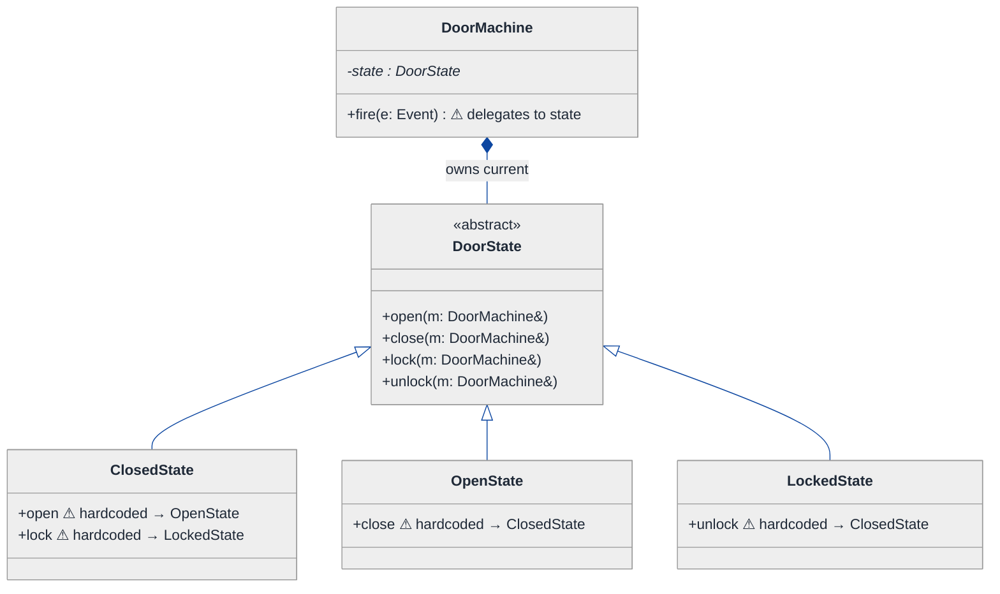
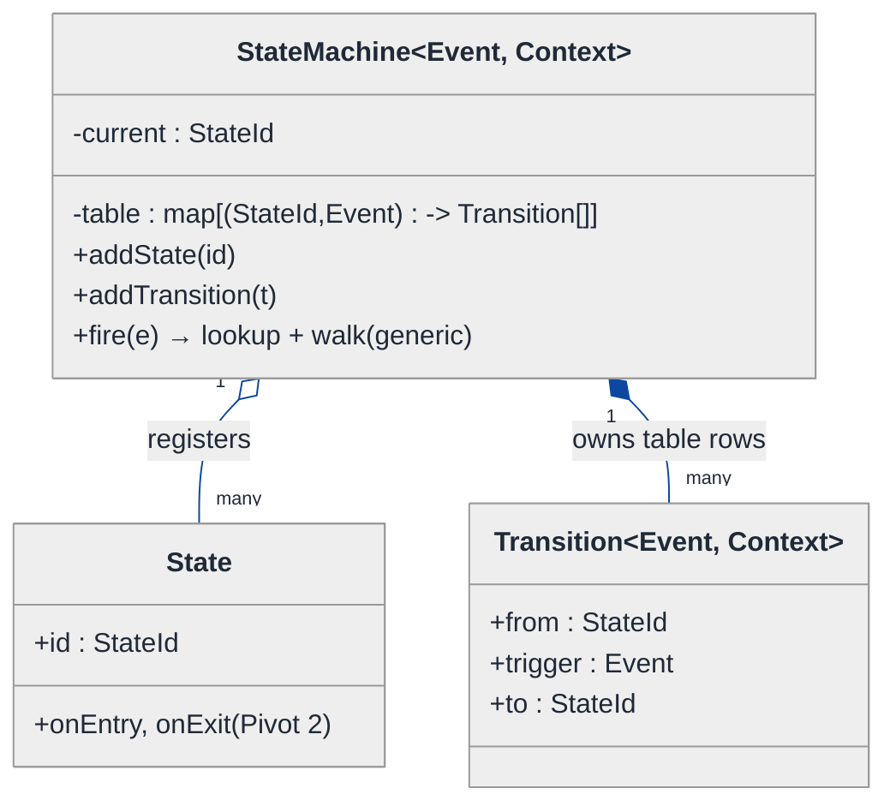
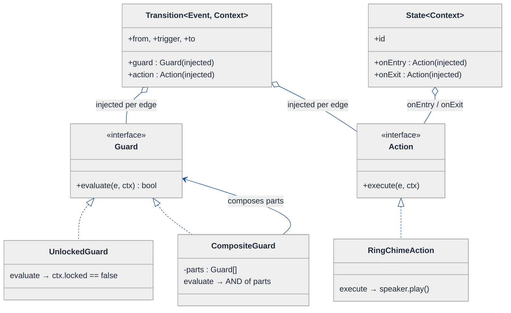
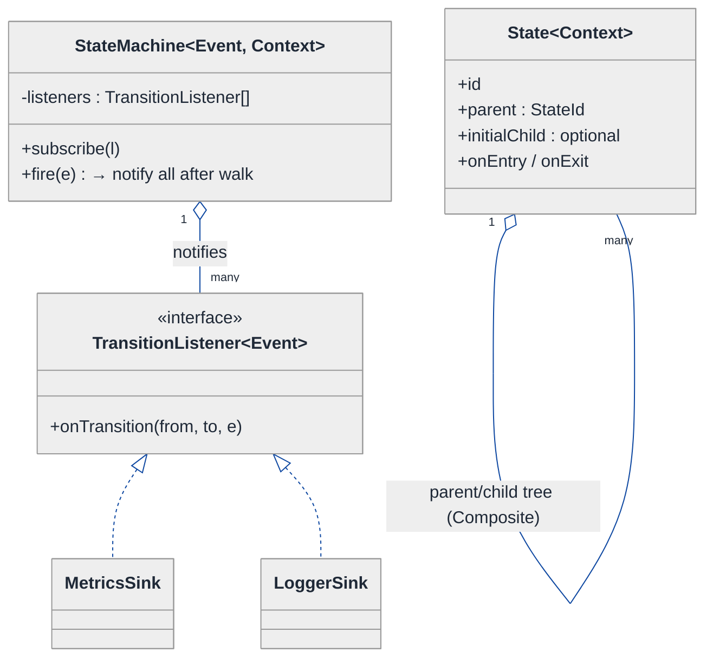
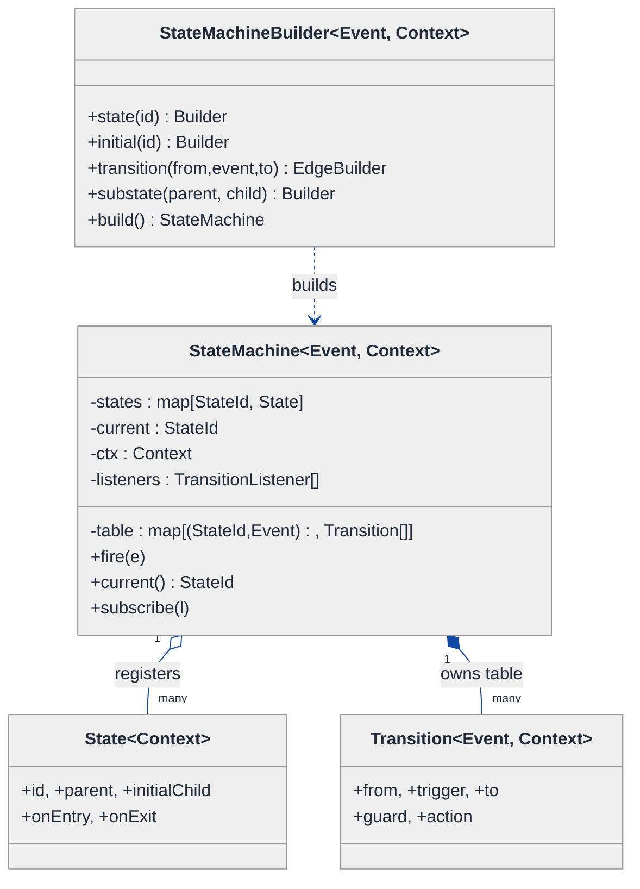
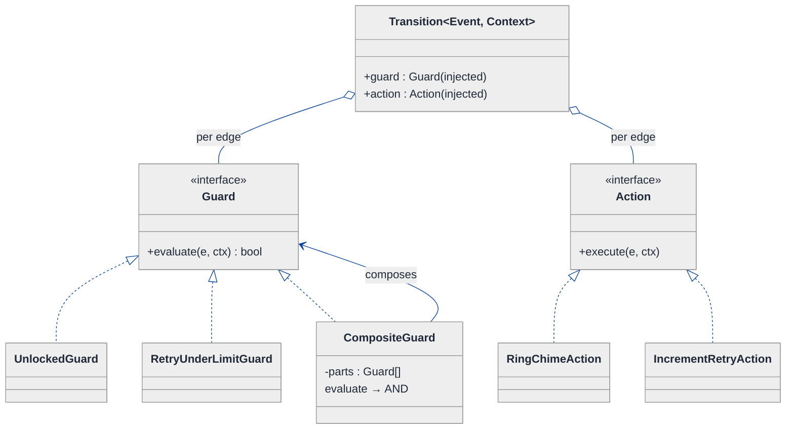
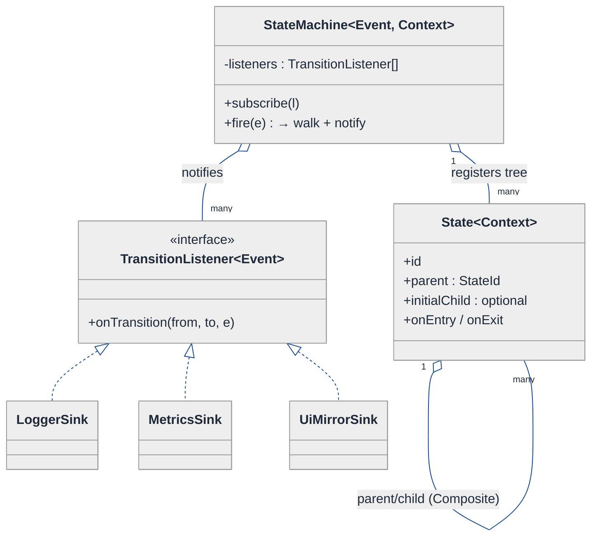
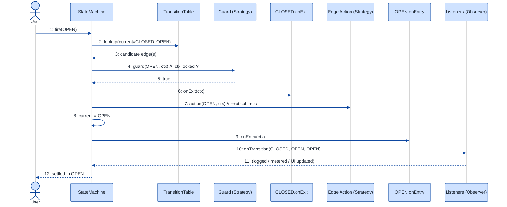

# State Machine Framework — LLD Walkthrough

> **Difficulty:** Hard · **Time:** ~45 min · **Pattern focus:** State + generics (a reusable framework, not one machine)
>
> **Problem source(s):** GID **ST4**, bucket **State_Pattern**. Representative of the "build a reusable engine, not one instance" family of LLD questions.
>
> **Diagrams:** inline mermaid (renders natively in GitHub / VS Code). Theme block copied verbatim from [`../../../CONTINUATION.md`](../../../CONTINUATION.md) §3.

---

## How to use this file

Paced for a candidate who has built ONE state machine before (a traffic light, a vending machine) and is now asked to build the **thing that builds state machines** — a generic, reusable framework. Reading time: ~45 minutes if you sketch each iteration by hand.

**The lesson:** the trap in this question is reaching for the textbook GoF State pattern (one class per state) on instinct. That pattern is right for ONE hardcoded machine. A *framework* has to host machines the framework author has never seen — so the variability axes are different, and the design pivots toward data-driven transitions, injected guards/actions, and the Observer pattern for the event loop. DERIVE that. Don't assert it.

**Map of this file (15 sections):**

1. Problem statement + clarifying questions
2. Plain-English restatement
3. Why this matters
4. Mental model
5. Try it yourself first
6. Entity & verb extraction
7. **Iteration 1: the naive design** — the textbook State pattern, one class per state
8. **Where the naive design hurts** — five future requirements, one painful diff each
9. **Pivot 1: data-driven transitions** — the transition table as a first-class object
10. **Pivot 2: Strategy for guards & actions** — pluggable conditions and side effects
11. **Pivot 3: Observer for events + Composite for hierarchy** — the event loop and nested states
12. Final UML class diagram
13. Skeleton code (C++17, generic)
14. Key flow — sequence diagram
15. Extensibility re-check + anti-patterns + how to think aloud + self-check

---

## 1. Problem statement + clarifying questions

**Prompt (typical phrasing):** "Design a state machine framework that supports state definition, transition rules, guards/conditions, entry/exit actions, hierarchical states, and event-driven transitions. Make it generic and reusable."

**Clarifying questions to ask BEFORE drawing anything:**

1. **One machine or a framework?** The word "reusable" is load-bearing. Am I designing a traffic light, or the library that someone else uses to declare a traffic light, an order-lifecycle, AND a document-approval flow without touching my code? (I'll assume the latter — that's the whole question.)
2. **Who defines the states — me or the framework's user?** If the user supplies states at runtime (config, builder, DSL), I cannot hardcode one C++ class per state. That single answer reshapes the entire design.
3. **What's an "event"?** A typed token (`enum`/string/object) the user feeds in via `fire(event)`? Are events queued, or processed synchronously? Can an action fire a new event mid-transition (run-to-completion semantics)?
4. **What do guards see?** Just the event, or the event + a shared "context" / extended-state blackboard (e.g., `retryCount`, `balance`)? Guards almost always need context, so I'll assume a context object threaded through.
5. **Entry/exit action ordering for hierarchy?** When we move from a nested child to a sibling under a different parent, which exit/entry actions fire and in what order? (Standard UML statechart semantics: exit innermost-first, entry outermost-first.)
6. **Are transitions deterministic?** If two transitions out of the same state match the same event, is that an error, or do guards disambiguate? I'll assume guards disambiguate and ambiguity-with-no-guard is a config error caught at build time.
7. **Concurrency?** One machine instance per thread, or shared? I'll assume single-threaded per instance for now and discuss locking in §15.
8. **Generic over what?** Should `State`, `Event`, and `Context` be template parameters so the user gets compile-time type safety, or stringly-typed for flexibility? I'll make `Event` and `Context` template parameters and identify states by a typed key.

**Assumptions if the interviewer dodges:** it's a framework; users declare states/transitions at runtime via a builder; events are typed tokens fed through `fire(event)`; guards and actions are user-supplied callables that see a shared mutable context; hierarchical states follow UML statechart entry/exit ordering; single-threaded per instance.

---

## 2. Plain-English restatement

We are not building a state machine. We are building the **engine that runs any state machine** somebody hands us. A user of our framework should be able to say, in their own code, "here are my states, here are the transitions between them, here's the guard that decides whether a transition is allowed, here's the action to run when I enter or leave a state" — and then just feed events in and watch the machine move. The framework knows nothing about traffic lights or orders. It knows about *states, transitions, guards, actions, events, and nesting*. Our job is to make those six concepts first-class, composable, and extensible without recompiling the framework.

---

## 3. Why this matters

This question separates candidates who memorized the GoF State pattern from candidates who understand *why* it exists and *when it stops scaling*. The textbook State pattern (one class per state) is perfect for a fixed machine you own. The instant the machine definition must come from outside — a config file, a user's code, a visual editor — "one class per state" becomes "the framework author writes infinite classes," which is absurd. The skill being probed is recognizing that a **framework inverts who owns the variability**, which flips you from inheritance-per-state to data-driven transitions plus injected behavior. This same inversion shows up in rule engines, workflow engines, parser generators, and game AI — anywhere you build the tool instead of the thing.

---

## 4. Mental model

A state machine is a **directed graph** plus a **rule-book for walking it**. Nodes are states. Edges are transitions, each labeled with the event that triggers it. Each edge carries a *guard* (a yes/no gate) and an *action* (a side effect). Each node carries *entry* and *exit* hooks. A *current-state* token sits on one node; feeding an event slides the token along a matching, unguarded-or-guard-passing edge, firing the exit/action/entry hooks along the way. Hierarchy means a node can itself contain a whole sub-graph.

```
Real-world sketch (NOT a UML diagram yet) — a door, declared by a USER of our framework:

        fire(OPEN) [guard: unlocked?]                fire(CLOSE)
   ┌──────────────────────────────►┐          ┌──────────────────────────►┐
   │                                ▼          │                            ▼
[ CLOSED ]                       [ OPEN ] ─────┘                       (back to CLOSED)
   ▲   │ entry: ring chime
   │   │ fire(LOCK) [guard: closed?]            ┌───── hierarchy ─────────────┐
   │   └────────────────► [ LOCKED ]            │  [ OPERATIONAL ]            │
   │                          │                 │    contains: CLOSED, OPEN   │
   └──────────────────────────┘                 │  [ MAINTENANCE ] (sibling)  │
        fire(UNLOCK)                             └─────────────────────────────┘

The framework supplies the box-and-arrow MACHINERY.
The user supplies the LABELS, the GUARDS (unlocked?), the ACTIONS (ring chime), and the NESTING.
```

The KEY insight from this picture: **the framework owns the graph-walking; the user owns the graph's content.** Everything the user provides — states, edges, guards, actions — is *data and injected behavior*, not subclasses of our types. That separation is the whole design.

---

## 5. Try it yourself first

> **Predict before reading on:**
>
> 1. List the nouns you'd promote to framework classes. Which of them does the framework DEFINE, and which does the USER supply?
> 2. **If the user must be able to declare a 40-state machine at runtime from a JSON file, what breaks about "one C++ class per state"?**
> 3. A guard needs to read `retryCount` and an action needs to increment it. Where does `retryCount` live so both can reach it without the framework knowing it exists?

---

## 6. Entity & verb extraction

> **Mini-refresher: noun → class, but not every noun — and in a FRAMEWORK, ask who owns it.**
>
> Naive OOD promotes every noun to a class. Framework OOD adds a second question: does the *framework* own this concept's definition, or does the *user*? If the user owns it, the framework's job is to model it as data or an injected interface, not as a subclass the framework must enumerate.

**Nouns from the prompt:**

| Noun | Decision | Owned by | Why |
|---|---|---|---|
| StateMachine | Class (the engine) | Framework | Holds current state, processes events, walks the graph |
| State | Object/record (a node) | User defines instances | A *value* with id + entry/exit hooks; NOT a subclass-per-state |
| Transition | Class (an edge) | User defines instances | from-state, event, guard, action, to-state |
| Event | Template parameter / token | User | The trigger; framework is generic over its type |
| Guard / Condition | Interface (Strategy) | User supplies impls | "Is this transition allowed right now?" |
| Action (entry/exit/transition) | Interface (Strategy/Command) | User supplies impls | The side effect to run |
| Context / extended state | Class (template param) | User | The blackboard guards & actions read/write (`retryCount`, `balance`) |
| HierarchicalState | Composite of State | User defines | A state that contains sub-states |
| EventListener / Observer | Interface | User opt-in | Notified on every transition (logging, metrics, UI) |
| Builder | Class (fluent API) | Framework | Lets the user declare the machine ergonomically |

**Verbs (and the class they live on):**

| Verb | Owner class (naive answer — we'll re-examine) |
|---|---|
| fire(event) / handle(event) | StateMachine |
| canFire(event) | StateMachine (asks the matching guard) |
| evaluate(event, ctx) → bool | Guard |
| execute(ctx) | Action |
| onEntry() / onExit() | State |
| addTransition(from, event, to, guard, action) | Builder |
| onTransition(from, to, event) | EventListener |

**We have NOT introduced design patterns by name yet** beyond noticing that Guard and Action *smell* like injected behavior. Pure nouns + verbs + a framework-ownership column.

---

## 7. <a id="iter-1"></a>Iteration 1: the naive design

Most candidates, hearing "state machine," reach straight for the **textbook GoF State pattern**: an abstract `State` base, one concrete subclass per state, and each subclass's method decides the next state. Let's write exactly that — it's the honest first instinct, and it even *works* for a single fixed machine.

> **Mini-refresher: the GoF State pattern.**
>
> Each lifecycle state is its own class implementing a common interface. The context object delegates the current event to its current-state object, and THE STATE object decides (and switches to) the next state. Transitions are hardcoded inside each state class's methods.



**Reader's tour (read top to bottom; ~60 seconds).**

1. **Top — `DoorMachine` is the context.** It owns ONE field, `state` (a `DoorState*`), and exposes `fire(event)` which just delegates to the current state. So far so good — this is clean delegation.
2. **The `DoorState` abstract base** declares one method per *event* the door understands: `open`, `close`, `lock`, `unlock`. Every concrete state must implement (or inherit a default-throws version of) all four.
3. **Three concrete state classes**, each hardcoding its outgoing transitions. `ClosedState::open` does `m.setState(new OpenState)`. The transition graph is *scattered across the method bodies of N classes*.
4. **The warning markers (⚠).** Every transition is welded into a subclass at compile time. There is no single place that says "here is the whole graph." There is no Event *type* either — events are encoded as method names. Guards and actions don't exist yet; if you needed "only open if unlocked," you'd write an `if` inside `ClosedState::open`.

**What's deliberately missing.** No `Transition` object. No `Guard` interface. No `Action` interface. No `Event` token (events ARE methods). No hierarchy. No listeners. No genericity — this is hardwired to doors. The naive design doesn't even *acknowledge* that a framework user needs to define their own states without writing C++.

Skeleton code for the naive design (C++):

```cpp
#include <iostream>
#include <memory>

class DoorMachine;  // forward — defined below

class DoorState {
public:
    virtual ~DoorState() = default;
    // one method per event; default = illegal transition
    virtual void open  (DoorMachine&) { throw std::logic_error("illegal: open");   }
    virtual void close (DoorMachine&) { throw std::logic_error("illegal: close");  }
    virtual void lock  (DoorMachine&) { throw std::logic_error("illegal: lock");   }
    virtual void unlock(DoorMachine&) { throw std::logic_error("illegal: unlock"); }
    virtual const char* name() const = 0;
};

class ClosedState; class OpenState; class LockedState;  // forward

class DoorMachine {
public:
    DoorMachine();                                   // starts CLOSED
    void setState(std::unique_ptr<DoorState> s) { state_ = std::move(s); }
    void open()   { state_->open(*this);   }
    void close()  { state_->close(*this);  }
    void lock()   { state_->lock(*this);   }
    void unlock() { state_->unlock(*this); }
    const char* current() const { return state_->name(); }
private:
    std::unique_ptr<DoorState> state_;
};

class OpenState : public DoorState {
public:
    void close(DoorMachine& m) override;             // → ClosedState (hardcoded)
    const char* name() const override { return "OPEN"; }
};
class LockedState : public DoorState {
public:
    void unlock(DoorMachine& m) override;            // → ClosedState (hardcoded)
    const char* name() const override { return "LOCKED"; }
};
class ClosedState : public DoorState {
public:
    void open(DoorMachine& m) override { m.setState(std::make_unique<OpenState>());   }  // hardcoded
    void lock(DoorMachine& m) override { m.setState(std::make_unique<LockedState>()); }  // hardcoded
    const char* name() const override { return "CLOSED"; }
};
inline void OpenState::close   (DoorMachine& m) { m.setState(std::make_unique<ClosedState>()); }
inline void LockedState::unlock(DoorMachine& m) { m.setState(std::make_unique<ClosedState>()); }
inline DoorMachine::DoorMachine() : state_(std::make_unique<ClosedState>()) {}
```

**This works.** It's the canonical State pattern, it compiles, and for a single fixed door it is genuinely fine. So what's wrong with it — *for a framework*?

---

## 8. <a id="naive-pain"></a>Where the naive design hurts

The interviewer slides a piece of paper across the desk: "Here are five things the framework's *users* will need. Walk me through what changes."

### Change A: "A user wants to define a 40-state order-lifecycle machine — without editing the framework."

In the naive design:
- Every state is a C++ subclass of `DoorState`. The user would have to write 40 subclasses **inside our framework's type hierarchy**, recompile the framework, and they're forever coupled to "Door."
- The framework author cannot ship a `.so` and let users declare machines at runtime. **The design fundamentally cannot host a machine the framework author hasn't seen.**
- Smell: *the variability (the set of states + transitions) is owned by the USER, but the design forces it into framework subclasses.*

### Change B: "Only allow OPEN if the door is unlocked AND a sensor says the path is clear."

In the naive design:
- You'd add an `if (unlocked && pathClear)` inside `ClosedState::open`. Where does `pathClear` come from? It's not a door property. Now `ClosedState` depends on a sensor.
- Every new guard condition is hand-written branching inside a state method. Two guards on the same transition → nested `if`s. **Guards have no home.**

### Change C: "Ring a chime on entering OPEN; log a metric on leaving any state."

In the naive design:
- Entry/exit actions don't exist. You'd sprinkle `ringChime()` at the top of every method that transitions *into* OpenState — i.e., in `ClosedState::open` AND anywhere else that reaches OPEN. The entry behavior is **duplicated at every incoming edge** instead of living on the state.
- A cross-cutting "log on every exit" means editing all N×M methods. **No hook points.**

### Change D: "Add a MAINTENANCE super-state containing CLOSED and OPEN; a global `fire(EMERGENCY)` jumps the whole group to a SHUTDOWN state."

In the naive design:
- There's no notion of containment. To get "any sub-state handles EMERGENCY the same way," you'd copy an `emergency()` override into every leaf state. N copies.
- Hierarchical entry/exit ordering (exit child then parent) cannot be expressed at all. **Flat class list, no tree.**

### Change E: "Stream every transition to a logger, a metrics sink, and a live UI — without the machine knowing who's watching."

In the naive design:
- The machine has no concept of observers. You'd hardcode `logger.log(...); metrics.inc(...); ui.update(...)` into `setState`. Every new sink edits `setState`. **Tag-driven coupling to consumers.**

### The pattern of pain

| Change | What the naive design forces | Smell |
|---|---|---|
| A. User-defined 40 states | A C++ subclass per state, inside our hierarchy, recompiled | "The graph's *structure* is hardcoded as types, but the user owns the structure." |
| B. Compound guards | Hand-written `if` ladders inside state methods | "Conditions have no first-class home; they leak into transition code." |
| C. Entry/exit + cross-cutting actions | Side effects duplicated at every incoming edge | "Behavior that belongs to a STATE or an EDGE is smeared across methods." |
| D. Hierarchy + group transitions | Copy an override into every leaf state | "No tree; containment and inherited transitions can't be expressed." |
| E. Many transition observers | Hardcode every sink into `setState` | "The machine is coupled to its consumers." |

**The axes of pain, named:**
1. **Structure variability** — the *set* of states and transitions is user-owned data, not framework types. (A, D)
2. **Condition variability** — guards are pluggable predicates. (B)
3. **Behavior variability** — actions (entry/exit/transition) are pluggable side effects. (C)
4. **Containment** — states form a tree, not a flat list. (D)
5. **Consumer decoupling** — transitions are events others subscribe to. (E)

> **Pivot question:** "If the framework's USER owns which states and transitions exist, what should a `Transition` *be* — a method buried in a subclass, or a piece of data the framework walks? And once it's data, where do the *guard* and the *action* on each edge live?"
>
> The answer that unlocks everything: make the **transition a first-class data object** (Pivot 1), hang **injected Guard/Action strategies** off it (Pivot 2), and decouple the **event loop + hierarchy** via Observer + Composite (Pivot 3). Let's go, hardest axis first: structure.

---

## 9. <a id="pivot-1"></a>Pivot 1: data-driven transitions (the transition table)

The most painful axis is structure (Change A and D): the framework's user owns the graph, so the graph cannot be C++ subclasses the framework author writes. The fix is to stop encoding transitions as *methods on state subclasses* and start encoding them as *data the engine looks up*.

> **Mini-refresher: data-driven design vs. behavioral subclassing.**
>
> Instead of one class per variant whose *methods* encode behavior, store the variants as records in a table and write ONE generic engine that interprets the table. The variation moves from the type system (compile-time, framework-owned) into data (runtime, user-owned). Interpreters, regex engines, and parser generators all do this.

**Why data-driven fits structure.** A transition is fully described by a 5-tuple: `(fromState, event, guard, action, toState)`. None of that needs a subclass. If transitions are rows in a table keyed by `(fromState, event)`, then **the user builds the table** — at runtime, from a config file, from a builder — and our engine just does a lookup and walks the edge. The framework author writes the `StateMachine` engine ONCE and never sees the user's states.

So `State` becomes a lightweight value (an id + optional entry/exit hooks), not a subclass. `Transition` becomes a record. `StateMachine` becomes a generic engine over a `(State, Event)` table.

**The refactor (just the structural slice):**

```cpp
#include <functional>
#include <optional>
#include <string>
#include <unordered_map>
#include <vector>

// Identify a state by a typed key, not by a C++ type.
using StateId = std::string;   // could be an enum value or int; string for the demo

template <class Event, class Context>
struct Transition {                          // a ROW in the table — pure data + hooks
    StateId from;
    Event   trigger;
    StateId to;
    // guard & action added in Pivot 2; placeholder here
};

template <class Event, class Context>
class StateMachine {
public:
    void addState(StateId id) { states_.insert(std::move(id)); }
    void addTransition(Transition<Event, Context> t) {
        table_[{t.from, t.trigger}].push_back(std::move(t));
    }
    void start(StateId initial) { current_ = std::move(initial); }

    void fire(const Event& e) {
        auto it = table_.find({current_, e});
        if (it == table_.end()) return;                 // no transition: ignore (or throw)
        const auto& candidates = it->second;            // may be >1 (disambiguated by guards, Pivot 2)
        const auto& chosen = candidates.front();        // single-candidate case for now
        current_ = chosen.to;                           // walk the edge — ONE generic line
    }

    const StateId& current() const { return current_; }
private:
    struct Key { StateId s; Event e; bool operator==(const Key&) const = default; };
    struct KeyHash { size_t operator()(const Key&) const; /* hash s ^ e */ };
    std::unordered_map<Key, std::vector<Transition<Event, Context>>, KeyHash> table_;
    std::set<StateId> states_;
    StateId current_;
};
```

**What changed — visualized.** The structural slice:



**Tour of the after-state.**

1. **`StateMachine` is now generic** — `<Event, Context>` template parameters. The framework author writes it once; a door user instantiates `StateMachine<DoorEvent, DoorCtx>`, an order user instantiates `StateMachine<OrderEvent, OrderCtx>`. **No subclass per machine.**
2. **`Transition` is a data record**, not a method. Look at it: four fields, zero behavior (yet). It's a *row in a table*. The user creates rows; the engine reads them.
3. **`fire(e)` collapsed to a lookup-and-walk.** The N×M scattered `setState` calls from the naive design became ONE generic line: `current_ = chosen.to`. The entire transition graph now lives in `table_`, a single inspectable structure (you could serialize it, visualize it, validate it for unreachable states — none possible in the naive design).
4. **`State` survives as a lightweight value** with an id. It will gain entry/exit hooks in Pivot 2, but it is NOT a polymorphic subclass-per-state anymore.

**Change A and D get unblocked.** A 40-state machine is 40 `addState` + N `addTransition` calls — or a loop over a JSON file. The framework never recompiles. Hierarchy (D) now has somewhere to live: a tree of `State` values (we finish it in Pivot 3).

**Pattern-discrimination cheatsheet — GoF State (subclass-per-state) vs Data-driven table.**
- *GoF State:* one class per state; transitions are method bodies; the *type system* enforces legality; great when YOU own a fixed, small machine.
- *Data-driven table:* states/transitions are data rows; ONE generic engine interprets them; great when the USER owns the machine at runtime.
- *Rule of thumb:* if the framework author enumerates the states → GoF State. If the framework's *user* enumerates them at runtime → data-driven table. **"Build a reusable framework" almost always means data-driven.**

We rejected GoF State *as the top-level structure* precisely because Change A makes the user the owner of the state set. (We did not throw State away conceptually — the engine still has a single "current state" that drives behavior; we just stopped modeling each state as a compiled subclass.)

---

## 10. <a id="pivot-2"></a>Pivot 2: Strategy for guards & actions

The structure is data now, but Change B (compound guards) and Change C (entry/exit + transition actions) are unsolved. A transition row currently has no way to say "only if unlocked" or "ring the chime." We need to hang *pluggable behavior* off both edges and states — behavior the framework can call but the user supplies.

> **Mini-refresher: Strategy pattern.**
>
> Encapsulates a unit of behavior behind an interface so it can be swapped/injected at runtime. The CALLER (here, the engine) invokes the interface; the concrete behavior is supplied by someone else (the user). The strategy doesn't know about its peers.

A **guard** is a Strategy returning `bool` (`evaluate(event, ctx) → bool`). An **action** is a Strategy returning `void` (`execute(ctx)` — a side effect). In modern C++ both are naturally `std::function`, which IS the lightweight Strategy idiom: the user passes a lambda, the engine stores and calls it. (Equivalently, a `class Guard { virtual bool evaluate(...) = 0; };` for users who prefer named classes — same role.)

> **Mini-refresher: the shared Context (extended state / blackboard).**
>
> Guards and actions need to read and mutate data the framework knows nothing about (`retryCount`, `balance`, a sensor handle). We thread a single user-defined `Context&` through every guard and action call. The framework treats it as opaque — it's the `Context` template parameter. This is how `retryCount` from §5 finds a home without the framework ever naming it.

**Why Strategy (not more subclassing).** A guard is "a yes/no algorithm picked by the user and injected per-edge." An action is "a side effect picked by the user and injected per-edge or per-state." That is the *exact* definition of Strategy: behavior selected externally and plugged in. We do NOT want a `LockedGuard` subclass in our framework — the framework can't enumerate user guards any more than it could enumerate user states.

**The refactor (transition rows and states grow injected behavior):**

```cpp
template <class Event, class Context>
struct Transition {
    StateId from;
    Event   trigger;
    StateId to;
    // INJECTED behavior — supplied by the user, called by the engine:
    std::function<bool(const Event&, Context&)> guard
        = [](const Event&, Context&) { return true; };          // default: always allowed
    std::function<void(const Event&, Context&)> action
        = [](const Event&, Context&) {};                        // default: no side effect
};

template <class Context>
struct State {
    StateId id;
    std::function<void(Context&)> onEntry = [](Context&) {};    // entry action
    std::function<void(Context&)> onExit  = [](Context&) {};    // exit action
};

template <class Event, class Context>
class StateMachine {
public:
    void fire(const Event& e) {
        auto it = table_.find({current_, e});
        if (it == table_.end()) return;
        // disambiguate multiple candidate edges by their guards (first whose guard passes wins):
        for (const auto& t : it->second) {
            if (!t.guard(e, ctx_)) continue;                    // GUARD: skip blocked edges
            states_.at(current_).onExit(ctx_);                  // EXIT action of old state
            t.action(e, ctx_);                                  // TRANSITION action on the edge
            current_ = t.to;
            states_.at(current_).onEntry(ctx_);                 // ENTRY action of new state
            return;
        }
        // no guard passed: no transition (or throw, per config)
    }
private:
    std::unordered_map<StateId, State<Context>> states_;
    /* table_, current_ as before */
    Context ctx_;                                               // the shared blackboard
};
```

**What changed — visualized.** The guard/action slice:



**Tour of the after-state.**

1. **`Transition` grew two injected slots:** `guard` and `action`. Both are `std::function` (the lightweight Strategy). Defaults are "always allow" and "do nothing," so a plain edge needs neither.
2. **`State` grew `onEntry`/`onExit`.** Change C is solved structurally: the chime lives on `OPEN`'s `onEntry`, not duplicated at every incoming edge. The engine fires exit-then-action-then-entry in the correct order (look at `fire()` — four lines, fixed order).
3. **Guards disambiguate multiple edges.** Look back at `fire()`: when `(current, event)` has several candidate rows, the engine takes the first whose `guard` returns true. That's how two transitions out of the same state on the same event coexist (Change B's "compound" condition).
4. **`CompositeGuard` (bottom).** Need "unlocked AND path-clear"? The user composes guards: a `CompositeGuard` that ANDs a vector of sub-guards. **Composition of conditions, no new framework code.** (This is the Composite pattern applied to guards — same idea we'll use for hierarchy in Pivot 3.)
5. **The framework calls; the user supplies.** `UnlockedGuard` and `RingChimeAction` are USER classes (or lambdas). The framework's `Transition`/`State` only know the *interface*. The framework author never wrote them.

**Change B and C now land cleanly.** A compound guard → a `CompositeGuard` (or `g1 && g2` lambda). An entry chime → `OPEN.onEntry`. A "log on every exit" → set every state's `onExit`, or better, handle it via Pivot 3's listener.

**Pattern-discrimination cheatsheet — Strategy vs Command (for actions).**
- *Strategy:* an interchangeable algorithm the engine *calls* (`execute(ctx)`); the engine decides WHEN; no notion of undo or queueing.
- *Command:* a reified request you can *store, queue, log, and undo*; carries its own receiver and args.
- *Rule of thumb:* if you just need to plug in "what to do" and the engine controls timing → Strategy (our case). If you need an undo stack or to replay/queue actions as objects → Command.
- We chose Strategy because the engine fully controls when entry/exit/transition actions fire; we don't need undo. (If the framework later wanted transition *replay/rollback*, Command becomes attractive — see §15.)

---

## 11. <a id="pivot-3"></a>Pivot 3: Observer for events + Composite for hierarchy

Two axes remain: Change E (many transition consumers, decoupled) and Change D's hierarchy (super-states containing sub-states, with UML entry/exit ordering and group transitions). These are different problems, so two patterns.

### 11a. Observer for the transition stream

> **Mini-refresher: Observer pattern.**
>
> A *subject* maintains a list of *observers* and notifies all of them when something happens — without knowing who they are. Observers subscribe/unsubscribe; the subject just iterates its list and calls `notify(...)`. Decouples the producer of events from its consumers.

**Why Observer (not hardcoded sinks).** Change E says logger + metrics + UI must all see every transition, and the machine must not know who's watching. That's textbook Observer: the `StateMachine` is the subject; loggers/metrics/UI are observers; on each successful transition the machine calls `listener.onTransition(from, to, event)` for each registered listener. Adding a sink = `machine.subscribe(newSink)` — zero engine edits.

```cpp
template <class Event>
class TransitionListener {
public:
    virtual ~TransitionListener() = default;
    virtual void onTransition(const StateId& from, const StateId& to, const Event& e) = 0;
};

// inside StateMachine:
//   void subscribe(TransitionListener<Event>* l) { listeners_.push_back(l); }
//   ... after current_ = t.to; states_.at(current_).onEntry(ctx_);
//   for (auto* l : listeners_) l->onTransition(prev, current_, e);   // notify all

class MetricsSink : public TransitionListener<DoorEvent> {           // a USER class
public:
    void onTransition(const StateId& from, const StateId& to, const DoorEvent&) override {
        /* counters[from + "->" + to]++ */
    }
};
// LoggerSink, UiSink elided — same shape
```

**Pattern-discrimination cheatsheet — Observer vs the entry/exit Actions of Pivot 2.**
- *Entry/exit Action:* behavior that is *part of the machine's definition* and specific to ONE state (ring chime on OPEN). The machine author/user wires it per-state.
- *Observer:* cross-cutting behavior that watches ALL transitions and is *external* to the machine's meaning (logging, metrics, a live UI mirror). Subscribed dynamically, not baked into states.
- *Rule of thumb:* if the side effect IS the state's job → entry/exit Action. If it's a bystander watching everything → Observer.

### 11b. Composite for hierarchical states

> **Mini-refresher: Composite pattern.**
>
> Lets clients treat individual objects (*leaves*) and groups of objects (*composites*) uniformly through one interface. A composite holds children of the same interface type, so a tree is built and operations recurse. Classic for "part-whole" hierarchies.

**Why Composite fits hierarchy.** Change D wants a `MAINTENANCE` / `OPERATIONAL` super-state containing `CLOSED` and `OPEN`. A super-state IS-A state (it has an id, can be current via its initial child, has entry/exit) but ALSO contains states. That's a tree of states → Composite. Two payoffs:

1. **UML entry/exit ordering falls out of the tree.** Moving from a deep child to a sibling under a different parent: walk *up* from the source firing `onExit` (innermost-first) to the common ancestor, then walk *down* to the target firing `onEntry` (outermost-first). The path is computed from the tree — no per-state copying.
2. **Group transitions become "inherited" edges.** A `fire(EMERGENCY)` defined on the super-state applies to every descendant: if no leaf-level transition matches, the engine walks up the parent chain looking for a matching edge. One row covers the whole subtree (kills Change D's N-copies smell).

```cpp
template <class Context>
struct State {
    StateId id;
    StateId parent;                         // "" if top-level — gives us the tree
    std::optional<StateId> initialChild;    // composite: which child to enter by default
    std::function<void(Context&)> onEntry = [](Context&){};
    std::function<void(Context&)> onExit  = [](Context&){};
    bool isComposite() const { return initialChild.has_value(); }
};
// fire() now: on no-match at current_, climb parent chain looking for a matching edge;
// on transition, compute LCA(from, to) and run exits up / entries down. (engine detail — elided)
```

**What changed — visualized.** Hierarchy + the listener stream together:



**Tour of the after-state.**

1. **`State` gained `parent` + `initialChild`.** That's the Composite, expressed compactly: a state points to its parent; a *composite* state names its default child. The whole hierarchy is a tree the engine can walk for LCA-based exit/entry ordering.
2. **The self-association on `State` ("parent/child tree")** is the Composite relationship — states contain states uniformly. A leaf and a super-state are the *same type*; only `initialChild` distinguishes them.
3. **`StateMachine` gained a `listeners_` list + `subscribe`.** Observer. After every successful walk, it iterates listeners and calls `onTransition`. `MetricsSink`/`LoggerSink` are user classes; the machine never names them.
4. **Group transitions need no new structure** — the existing transition table plus the parent chain does it: unmatched events climb the tree.

**Change D and E now land cleanly.** Hierarchy = set `parent`/`initialChild`. Group transition = one edge on the super-state. New observer = `subscribe(sink)`.

> **Mini-refresher: don't unify the three injected interfaces.**
>
> `Guard`, `Action`, and `TransitionListener` are different *roles* with different signatures (`bool` vs `void` vs notification). Resist collapsing them into one `Callable<T>`. Strategy is a role, not a type; premature unification just hides intent.

---

## 12. <a id="fig-class-diagram"></a>Final class diagram

One mega-diagram would be a wall of boxes. Here are **three focused sub-views**: the engine + builder, the per-edge behavior, and the hierarchy + observer plane. The structural insight at the end ties them together.

### 12.1 The engine and its builder — what the framework OWNS



**Tour of 12.1.** The framework owns exactly four types, all generic over `<Event, Context>`. `StateMachineBuilder` is a fluent factory (next paragraph) that assembles a `StateMachine`. The machine *registers* `State` values (aggregation — the user may share/define them) and *owns* the `Transition` table (composition — rows live and die with the machine). Crucially, **none of these four types is subclassed by the user.** The user supplies *data* (states, edges) and *lambdas* (guards, actions), never new framework subclasses.

> **Mini-refresher: Builder pattern.**
>
> Separates the *construction* of a complex object from its representation, exposing a fluent step-by-step API so you don't pass a 9-argument constructor. `builder.state("OPEN").onEntry(chime).transition("OPEN", CLOSE, "CLOSED").guard(g).build()`. We use it so declaring a machine reads like a DSL.
>
> *Builder vs Factory:* a Factory returns a finished product in one call based on a type tag; a Builder accumulates configuration across many calls then `build()`s. A machine has many optional parts (entry actions, guards, nesting) → Builder.

### 12.2 The per-edge behavior plane — guards & actions (Strategy)



**Tour of 12.2.** Each `Transition` carries an injected `Guard` and `Action` (Strategy role; in code these are `std::function`, shown here as interfaces for clarity). The concrete guards/actions on the bottom rows are ALL user-supplied — `UnlockedGuard`, `RetryUnderLimitGuard`, `RingChimeAction`, `IncrementRetryAction`. `CompositeGuard` lets users AND/OR conditions without framework changes (Composite-over-guards). The open diamonds mark injection: the transition *uses* a guard/action but the user owns its identity.

### 12.3 The hierarchy + observer plane



**Tour of 12.3.** The self-association on `State` is the Composite hierarchy; `parent` + `initialChild` encode the tree the engine walks for entry/exit ordering and group transitions. The `StateMachine`→`TransitionListener` aggregation is the Observer plane — three user sinks (`LoggerSink`, `MetricsSink`, `UiMirrorSink`) subscribe and get notified after every transition, with zero coupling back into the engine.

### Structural insight (ties 12.1 + 12.2 + 12.3 together)

| Concern | Pattern used | Why |
|---|---|---|
| **Structure** (which states/transitions exist) | Data-driven table + Builder | The USER owns the graph at runtime; the engine interprets data, not subclasses |
| **Conditions** (when an edge is allowed) | Strategy (Guard), composable via Composite | The user injects predicates per edge; AND/OR via CompositeGuard |
| **Behavior** (entry/exit/transition side effects) | Strategy (Action) | The user injects side effects; engine controls timing |
| **Containment** (super-states) | Composite | Part-whole tree gives UML entry/exit ordering + group transitions for free |
| **Consumers** (logging/metrics/UI) | Observer | The machine streams transitions without knowing who listens |

The big lesson: **a framework inverts ownership.** In a single fixed machine (Parking Lot's ticket lifecycle) the State pattern's one-class-per-state is right because YOU own the states. The instant the USER owns them, structure becomes *data*, behavior becomes *injected Strategy*, and the GoF State subclass-per-state would force the framework author to write infinite classes. *Subclass-per-state for a machine you own; data-driven table for a machine your users own.*

---

## 13. Skeleton code (C++17, generic)

> Show the SHAPES, not the full impl. The engine is generic over `<Event, Context>`. ~140 lines.

```cpp
#include <functional>
#include <memory>
#include <optional>
#include <set>
#include <string>
#include <unordered_map>
#include <vector>

// ── Identity ────────────────────────────────────────────────────────
using StateId = std::string;   // could be enum class / int; string for the demo

// ── State: a value with hooks + tree links (Composite) ──────────────
template <class Context>
struct State {
    StateId                        id;
    StateId                        parent;          // "" = top-level
    std::optional<StateId>         initialChild;    // set → composite (super-)state
    std::function<void(Context&)>  onEntry = [](Context&){};
    std::function<void(Context&)>  onExit  = [](Context&){};
    bool isComposite() const { return initialChild.has_value(); }
};

// ── Transition: a data row with injected Strategy behavior ──────────
template <class Event, class Context>
struct Transition {
    StateId from;
    Event   trigger;
    StateId to;
    std::function<bool(const Event&, Context&)> guard  = [](const Event&, Context&){ return true; };
    std::function<void(const Event&, Context&)> action = [](const Event&, Context&){};
};

// ── Observer interface ──────────────────────────────────────────────
template <class Event>
class TransitionListener {
public:
    virtual ~TransitionListener() = default;
    virtual void onTransition(const StateId& from, const StateId& to, const Event& e) = 0;
};

// ── The generic engine — written ONCE by the framework author ───────
template <class Event, class Context>
class StateMachine {
public:
    explicit StateMachine(Context ctx) : ctx_(std::move(ctx)) {}

    void addState(State<Context> s)                 { states_[s.id] = std::move(s); }
    void addTransition(Transition<Event, Context> t){ table_[{t.from, t.trigger}].push_back(std::move(t)); }
    void start(StateId initial)                     { current_ = enterDeepest(std::move(initial)); }
    void subscribe(TransitionListener<Event>* l)    { listeners_.push_back(l); }

    void fire(const Event& e) {
        // climb the parent chain so super-state edges apply to descendants (group transitions)
        for (StateId s = current_; ; s = states_.at(s).parent) {
            auto it = table_.find({s, e});
            if (it != table_.end()) {
                for (const auto& t : it->second) {
                    if (!t.guard(e, ctx_)) continue;        // Strategy: guard gate
                    walk(s, t, e);                          // run exits/action/entries + notify
                    return;
                }
            }
            if (states_.at(s).parent.empty()) break;        // reached root, no match → ignore
        }
    }

    const StateId& current() const { return current_; }

private:
    // exit innermost→ancestor, run edge action, enter ancestor→target (UML statechart order)
    void walk(const StateId& source, const Transition<Event, Context>& t, const Event& e) {
        const StateId prev = current_;
        runExitsUpTo(current_, lca(current_, t.to));
        t.action(e, ctx_);                                  // Strategy: edge action
        current_ = enterDownTo(t.to);                       // resolves composite initialChild
        for (auto* l : listeners_) l->onTransition(prev, current_, e);   // Observer: notify all
    }
    StateId enterDeepest(StateId id);                       // descend initialChild, fire onEntry
    StateId enterDownTo(const StateId& target);             // entries outermost-first; // elided
    void    runExitsUpTo(StateId from, const StateId& stop);// exits innermost-first;   // elided
    StateId lca(const StateId& a, const StateId& b) const;  // lowest common ancestor;  // elided

    struct Key { StateId s; Event e; bool operator==(const Key&) const = default; };
    struct KeyHash { size_t operator()(const Key& k) const; /* elided */ };

    std::unordered_map<StateId, State<Context>>                                  states_;
    std::unordered_map<Key, std::vector<Transition<Event, Context>>, KeyHash>    table_;
    std::vector<TransitionListener<Event>*>                                      listeners_;
    Context                                                                      ctx_;
    StateId                                                                      current_;
};

// ── Fluent Builder — ergonomic machine declaration ──────────────────
template <class Event, class Context>
class StateMachineBuilder {
public:
    StateMachineBuilder& state(StateId id) { sm_.addState(State<Context>{ std::move(id) }); return *this; }
    StateMachineBuilder& substate(StateId parent, StateId child); // wires parent/initialChild; elided
    StateMachineBuilder& onEntry(const StateId& id, std::function<void(Context&)> f); // elided
    StateMachineBuilder& transition(Transition<Event, Context> t) { sm_.addTransition(std::move(t)); return *this; }
    StateMachine<Event, Context> build(StateId initial) { sm_.start(std::move(initial)); return std::move(sm_); }
private:
    StateMachine<Event, Context> sm_{ Context{} };
};

// ── A USER declaring a door machine — note: zero framework subclasses ─
enum class DoorEvent { OPEN, CLOSE, LOCK, UNLOCK, EMERGENCY };
struct DoorCtx { bool locked = false; int chimes = 0; };

inline StateMachine<DoorEvent, DoorCtx> makeDoor() {
    StateMachineBuilder<DoorEvent, DoorCtx> b;
    b.state("CLOSED").state("OPEN").state("LOCKED");
    b.transition({ "CLOSED", DoorEvent::OPEN, "OPEN",
                   /*guard*/  [](auto&, DoorCtx& c){ return !c.locked; },     // user Strategy
                   /*action*/ [](auto&, DoorCtx& c){ ++c.chimes; } });        // user Strategy
    b.transition({ "OPEN",   DoorEvent::CLOSE,  "CLOSED" });
    b.transition({ "CLOSED", DoorEvent::LOCK,   "LOCKED" });
    b.transition({ "LOCKED", DoorEvent::UNLOCK, "CLOSED" });
    return b.build("CLOSED");
}
// MetricsSink / LoggerSink (TransitionListener impls) elided — same shape as §11a
```

Notice the payoff in `makeDoor()`: a complete machine declared with **no subclassing of any framework type** — only data rows and lambdas. The order-lifecycle user writes the same shape with `OrderEvent`/`OrderCtx`. That is "generic and reusable."

---

## 14. <a id="fig-sequence"></a>Key flow — sequence diagram

The interesting flow is a single `fire(event)` where a guard passes, an entry/exit action runs, the state walks, and listeners get notified — the moment all the patterns cooperate.



**Tour of the flow. Read slowly — this is where five patterns cooperate.**

1. **User fires an event** — a typed `DoorEvent::OPEN` token. The user does NOT name a target state; they name an *event*. The machine decides the target.
2. **Lookup in the transition table (data-driven, Pivot 1).** The machine keys `(current=CLOSED, OPEN)` into the table. If nothing matched here, it would climb the parent chain (group transitions). The graph is *data*, so this is one map lookup, not a dispatch through N subclasses.
3. **Guard evaluation (Strategy, Pivot 2).** The candidate edge's injected guard runs against the shared context: `!ctx.locked`. If it returned false, the machine would try the next candidate edge or, finding none, do nothing. **The guard disambiguates competing edges — no `if` ladder in the engine.**
4. **Exit action, edge action, entry action — in UML order (Pivot 2).** `CLOSED.onExit` → edge `action` (`++ctx.chimes`) → `OPEN.onEntry`. For hierarchical moves this would be multiple exits up to the LCA then multiple entries down (Pivot 3). The engine controls the timing; the user supplied the behavior.
5. **State walk.** `current = OPEN`, between exit and entry. One assignment — the whole transition graph collapsed into data made this trivial.
6. **Observer notification (Pivot 3).** Every registered listener gets `onTransition(CLOSED, OPEN, OPEN)`. The machine doesn't know if that's a logger, a metrics counter, or a live UI. **Adding a sink never touches `fire()`.**

### The validation that's NOT shown — and why it matters

You don't see `if (event == OPEN && state == CLOSED && !locked) ...` anywhere. Legality is expressed as *data + a guard*, not as branching in the engine. The engine body is the SAME for a door, an order, or a 40-state workflow — only the table differs. **The data IS the machine; the engine just walks it.** That is exactly what makes it a framework and not one machine.

---

## 15. Extensibility re-check + anti-patterns + how to think aloud + self-check

### Extensibility re-check

Revisit the five changes from [§8](#naive-pain). For each, name what the framework's *user* writes — and note the framework itself never changes.

| Change | Naive design impact | Framework design impact |
|---|---|---|
| A. 40-state machine | 40 C++ subclasses, recompile framework | 40 `addState` + N `addTransition` (or a JSON loader). User code only. |
| B. Compound guard | `if` ladder inside a state method | A lambda or `CompositeGuard` on the edge. User code only. |
| C. Entry/exit + cross-cutting | Side effect duplicated at every incoming edge | `state.onEntry` for the chime; a `TransitionListener` for cross-cutting log. User code only. |
| D. Hierarchy + group transition | Copy an override into every leaf | Set `parent`/`initialChild`; one edge on the super-state. User code only. |
| E. Many transition consumers | Hardcode every sink into `setState` | `machine.subscribe(sink)`. User code only. |

Every change is *user-side data or an injected lambda/observer*. **The framework binary is never recompiled.** That's the framework bar — a stronger form of open/closed: closed even to the framework author.

If a future requirement forces you to edit `StateMachine::fire`, stop and ask which variability axis you missed — it should be expressible as a state property, a transition field, a guard, an action, or a listener.

### Common confusion + traps

1. **"Isn't dropping subclass-per-state abandoning the State pattern?"** No — it's recognizing the framework inversion. The conceptual State pattern (current state drives behavior, transitions change it) is alive; we just represent each state as *data the engine interprets* rather than a compiled subclass, because the USER owns the state set. For a fixed machine you own, subclass-per-state is still correct (see Parking Lot's ticket lifecycle).
2. **"Where does `retryCount` live?"** In the user's `Context`, threaded through every guard and action by reference. The framework treats `Context` as an opaque template parameter — it never names `retryCount`.
3. **"Two edges match the same event — bug?"** Not necessarily. Guards disambiguate (first passing guard wins). Two *unguarded* edges on the same `(state, event)` IS a config error — catch it in `build()`.
4. **"Run-to-completion: can an action `fire()` a new event?"** Standard statechart semantics queue the new event and process it after the current transition fully settles. Add an internal event queue + a `processing_` flag so re-entrant `fire()` enqueues instead of recursing.
5. **"Why `std::function` instead of `Guard`/`Action` interfaces?"** Both are the Strategy role. `std::function` is the lightweight idiom (lambdas, less boilerplate); a virtual interface is better if guards need names, state, or polymorphic composition (`CompositeGuard`). Offer both; they're interchangeable at the call site.

### Anti-patterns

- **"God `fire()` with a giant switch on state."** The thing the table + guards exist to kill. If `fire()` grows branches per state, you've re-hardcoded the machine.
- **"Subclass per state in a framework."** Forces the framework author to write the user's states. The Change-A failure. Use data.
- **"Guards/actions reaching into framework internals."** They should only touch the `Context`. If a guard needs `StateMachine`'s privates, your Context is missing a field.
- **"One `Callable<T>` to rule guard + action + listener."** Premature unification of three distinct roles. Keep the signatures honest.
- **"Stringly-typed everything with no validation."** `StateId` as a string is fine for ergonomics IF `build()` validates every `to`/`from`/`parent` resolves and no state is unreachable. Skip validation and typos become silent dead transitions.
- **"Observer that mutates the machine during notification."** A listener that calls `fire()` re-enters mid-transition. Listeners observe; they don't drive. Route their intent through the event queue.

### How to think aloud

> "State machine *framework* — the word 'framework' is the whole question, so let me clarify [asks §1 Qs]. Confirmed: the user defines states/transitions at runtime; I build the engine.
>
> My instinct is the GoF State pattern — one class per state. Let me write that as iteration 1... and immediately stress it: if the USER must declare a 40-state machine from a config file, one-class-per-state means *I* write infinite subclasses and they recompile my framework. Dead on arrival for a framework.
>
> So the structure — states and transitions — must be *data the user owns*, and my engine interprets it. Pivot 1: a transition table. `StateMachine<Event, Context>` keyed on `(state, event)`; `fire()` becomes lookup-and-walk. States become lightweight values, not subclasses.
>
> Pivot 2: guards and actions. A guard is a yes/no algorithm picked by the user → Strategy (a `std::function` or `Guard` interface) on each edge, seeing a shared `Context`. Entry/exit actions live on the state, transition actions on the edge. The engine fires exit→action→entry in UML order.
>
> Pivot 3: two remaining axes. Observers want every transition (logger, metrics, UI) without coupling → Observer; `subscribe()` + notify after each walk. Hierarchy → Composite: states form a parent/child tree, which gives me UML exit/entry ordering and group transitions for free by climbing the parent chain.
>
> Final: four generic framework types (Builder, StateMachine, State, Transition), guard/action as injected Strategy, Observer for the stream, Composite for nesting. A user declares a door with zero subclasses — just data rows and lambdas. Every one of the five future requirements is user-side code; my framework binary never changes. That's the framework bar."

### Self-check

> **Self-check — the question to ask next time.**
>
> When you see "design a *framework / engine / reusable* X with multiple variations," before reaching for the textbook pattern, ask:
>
> > **"Who owns the variation — me (the framework author) or my user? If the USER owns the set of variants at runtime, the variation must become DATA my engine interprets, plus INJECTED behavior — not subclasses I enumerate."**
>
> Single fixed machine you own → GoF State (subclass-per-state). Framework your users populate → data-driven table + Strategy (guards/actions) + Observer (events) + Composite (hierarchy). Same word, "state machine," two completely different designs — and the discriminator is *ownership of the variability*.

---

## Cross-references

- **Parent topic manifest:** [`./EXTRACTED_QUESTIONS.md`](./EXTRACTED_QUESTIONS.md)
- **Vertical overview:** [`../../LEARNING.md`](../../LEARNING.md)
- **Template:** [`../../TEMPLATE-v2.md`](../../TEMPLATE-v2.md)
- **Canonical exemplar:** [`../Object_Oriented_Design/Parking_Lot.md`](../Object_Oriented_Design/Parking_Lot.md) — Strategy + State for a single owned machine (contrast with this framework's data-driven inversion)
- **Diagram convention:** [`../../../CONTINUATION.md`](../../../CONTINUATION.md) §3 — canonical mermaid theme block
- **Related v2 walkthroughs:**
  - Strategy Pattern deep-dive (sibling `../Strategy_Pattern/`) — guards/actions as injected behavior
  - Observer Pattern deep-dive (sibling `../Observer_Pattern/`) — the transition listener plane
  - Composite Pattern deep-dive (sibling `../Composite_Pattern/`) — hierarchical states
- **External reading:**
  - <a href="https://refactoring.guru/design-patterns/state" target="_blank" rel="noopener noreferrer">Refactoring.Guru — State pattern</a>
  - <a href="https://statecharts.dev/" target="_blank" rel="noopener noreferrer">statecharts.dev — Harel statecharts (hierarchy, guards, actions)</a>
  - <a href="https://en.wikipedia.org/wiki/UML_state_machine" target="_blank" rel="noopener noreferrer">UML state machine (run-to-completion, entry/exit ordering)</a>
