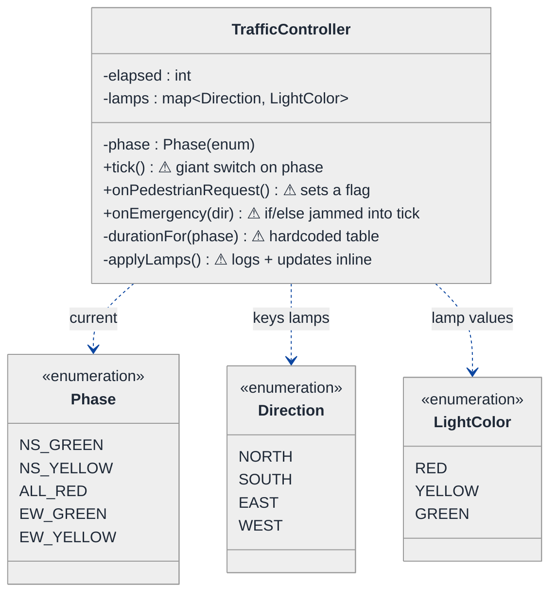
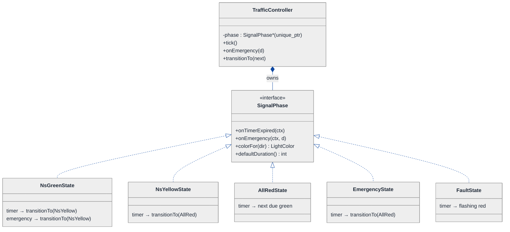
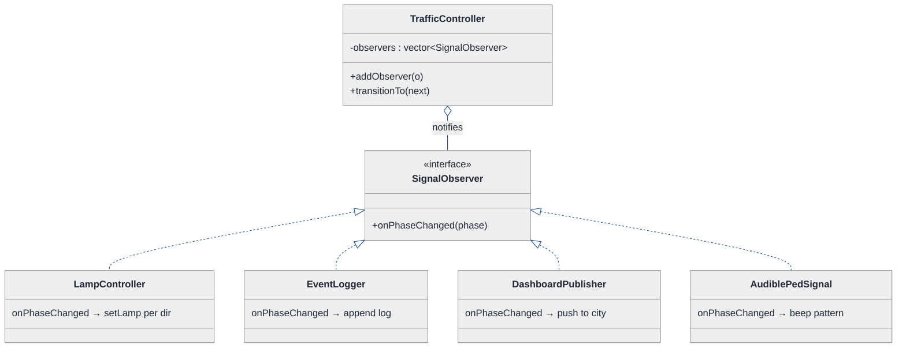
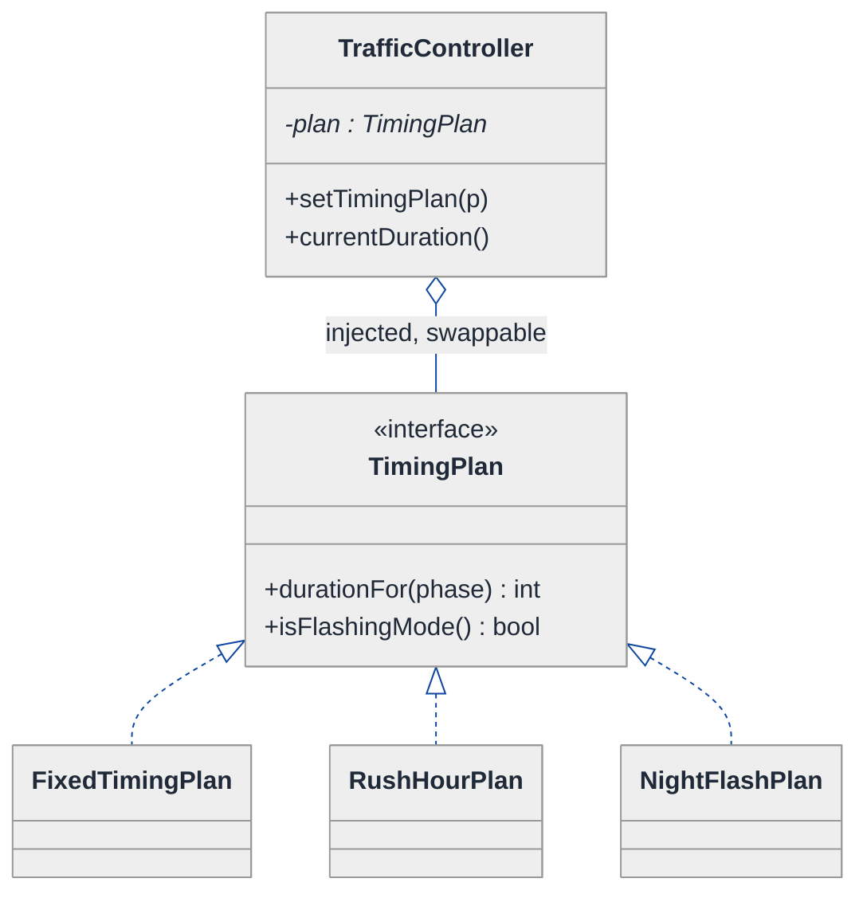
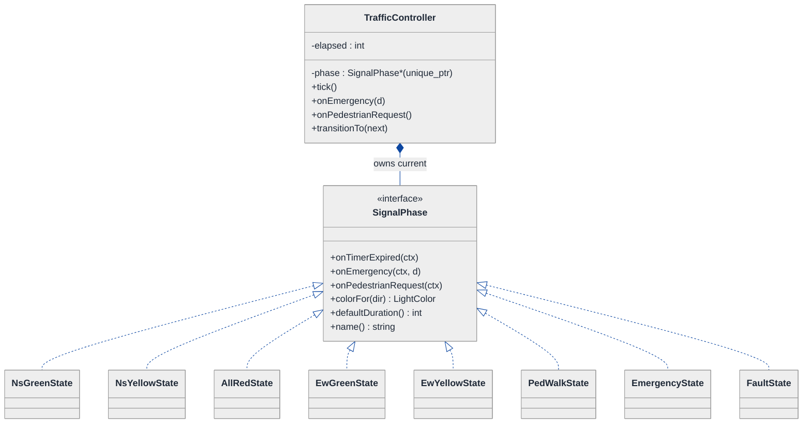
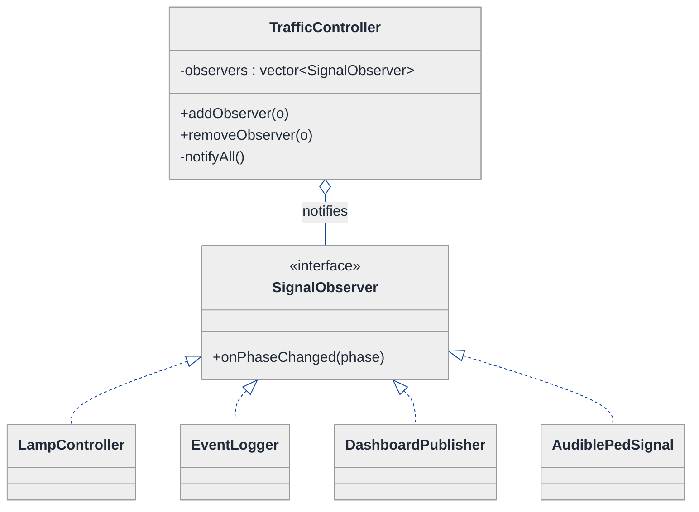
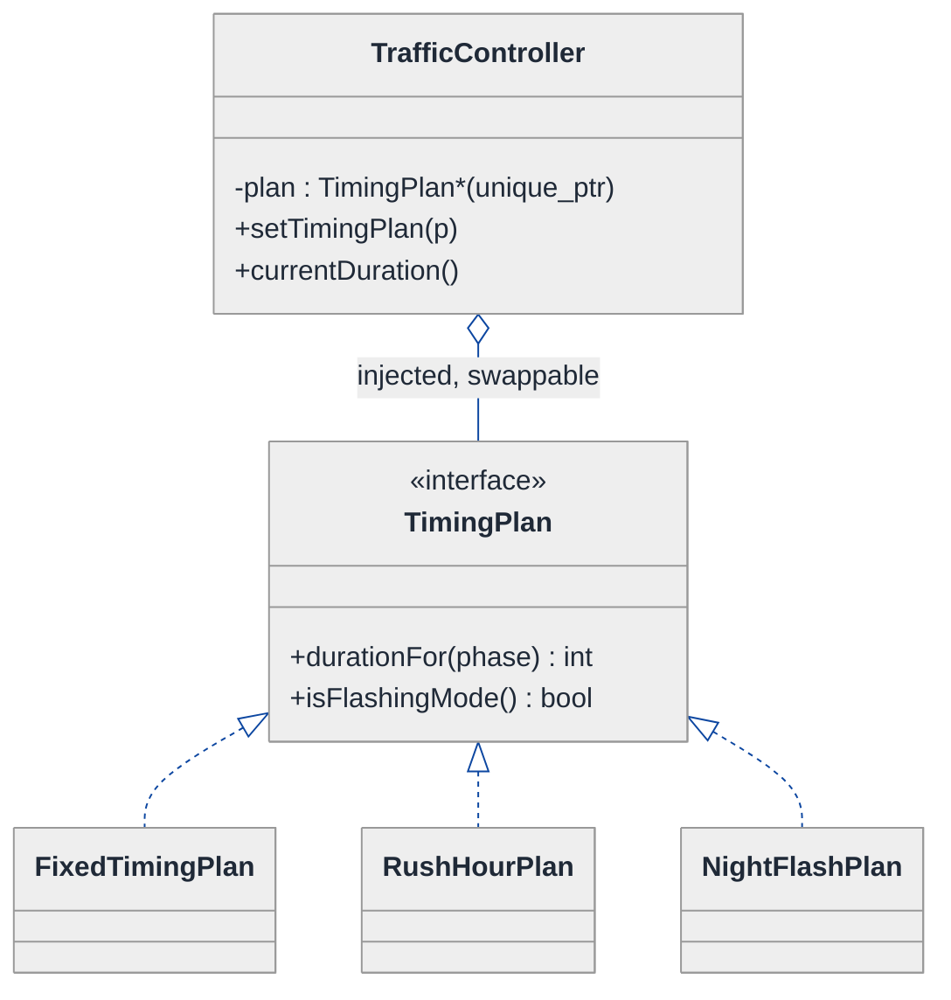
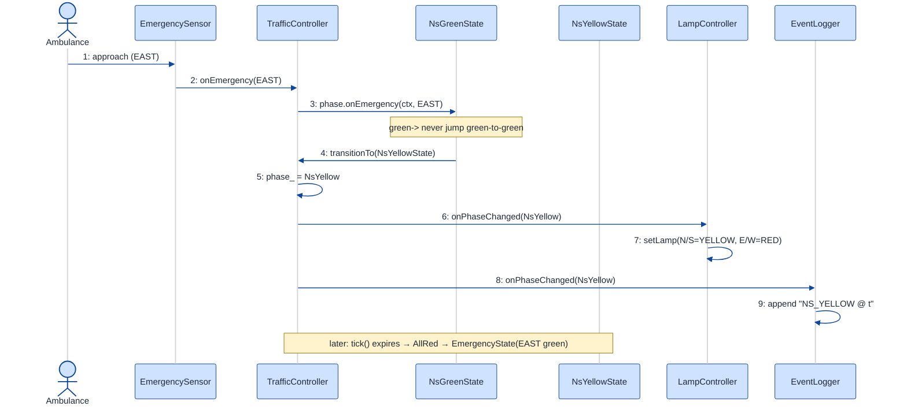

# Traffic Signal Control System — LLD Walkthrough

> **Difficulty:** Medium · **Time:** ~30 min · **Pattern focus:** State + Observer (a finite state machine that broadcasts its transitions)
>
> **Problem source(s):** GID `ST3`, bucket `State_Pattern`. Representative of multiple LeetLens rows in [`./EXTRACTED_QUESTIONS.md`](./EXTRACTED_QUESTIONS.md).
>
> **Diagrams:** inline mermaid (renders natively in GitHub / VS Code). No external sources.

---

## How to use this file

Paced for a candidate seeing the traffic-signal problem for the first time. Reading time: ~30 minutes if you sketch each iteration by hand. **The lesson: a traffic signal is the textbook finite state machine — but don't reach for the State pattern by reflex. DERIVE it by writing the naive enum-and-switch version first, watching it rot under three or four hypothetical changes, then reaching for ONE pattern per painful axis: State for the phase lifecycle, Observer for the things that need to react to a phase change.**

**Map of this file (15 sections):**

1. Problem statement + clarifying questions
2. Plain-English restatement
3. Why this matters
4. Mental model
5. Try it yourself first
6. Entity & verb extraction
7. **Iteration 1: the naive design** — what we'd write first
8. **Where the naive design hurts** — four future requirements, one painful diff each
9. **Pivot 1: State for the signal phases** — internal transitions, not external swaps
10. **Pivot 2: Observer for everything that reacts to a phase change** — decouple the broadcasters from the listeners
11. **Pivot 3: Strategy for the timing plan** — the remaining variability axis
12. Final UML class diagram
13. Skeleton code (C++)
14. Key flow — sequence diagram
15. Extensibility re-check + anti-patterns + how to think aloud + self-check

---

## 1. Problem statement + clarifying questions

**Prompt (typical phrasing):** "Design a traffic signal control system for a 4-way intersection. It must support vehicle detection, pedestrian crossing, emergency vehicle priority override, and configurable timing patterns."

**Clarifying questions to ask BEFORE drawing anything:**

1. **Intersection topology?** Is it always a symmetric 4-way (North/South green together, then East/West), or do we need protected left-turn arrows and odd geometries? (Assume two opposing approaches share a phase: NS, then EW.)
2. **What drives a transition?** Pure fixed timers, or do vehicle/pedestrian sensors shorten or extend a phase (actuated control)? (Assume both — timers are the baseline, sensors adjust.)
3. **Emergency override semantics?** When an ambulance approaches, do we instantly flip its approach to green, or do we finish the current phase safely first (always pass through yellow → all-red)? (Assume we MUST pass through yellow — never a green-to-green jump; safety first.)
4. **Pedestrian model?** Push-to-cross button that requests a WALK phase, or a fixed pedestrian phase every cycle? (Assume push-button request, serviced at the next safe opportunity.)
5. **Who needs to KNOW about a phase change?** Just the lamps, or also a logging/analytics service, a central traffic-management dashboard, an audible signal for the visually impaired? (Assume the list will grow — that's a hint.)
6. **Configurable timing — how configurable?** Per-time-of-day plans (rush hour vs night flashing-red), or fully scriptable? (Assume named plans: `Daytime`, `RushHour`, `NightFlash`.)
7. **Single intersection or a coordinated corridor?** (Assume single intersection for this design; note corridor coordination in §15.)
8. **Failure / fallback?** If a controller faults, fall back to flashing red? (Assume yes — a `FaultState`.)

**Assumptions if the interviewer dodges:** symmetric 4-way (NS / EW phase pairing), timer baseline with sensor actuation, emergency override that always routes through yellow → all-red, push-button pedestrian requests, a growing list of subscribers that react to phase changes, named time-of-day timing plans, single intersection.

---

## 2. Plain-English restatement

We're building the brain of one traffic intersection. At any instant the intersection is in exactly ONE phase — NS-green, NS-yellow, all-red, EW-green, a pedestrian WALK, an emergency override, or a fault fallback. The controller moves between phases on events: a timer firing, a sensor tripping, a pedestrian pressing a button, an ambulance broadcasting a priority request. Each phase knows which phases may legally follow it (you can never go green-to-green without yellow in between). And when the phase changes, several independent things must react: the physical lamps, the pedestrian WALK/DON'T-WALK display, an event log, maybe a city dashboard. The design must let us add new phases, new reactors, and new timing plans **without rewriting the transition core**.

---

## 3. Why this matters

A traffic signal is the canonical finite state machine, so interviewers use it to test one specific reflex: when you see "an object that moves through a lifecycle with phase-specific legal transitions," do you write an `enum` + a giant `switch` in a `tick()` method, or do you recognize the State pattern? The second probe is subtler — "several things must react to a change" is the Observer pattern, and weak candidates hardwire those reactions into the transition code, coupling the controller to every consumer. Getting BOTH right — State for the lifecycle, Observer for the fan-out — is the senior bar. The same State+Observer pairing reappears in order-status pipelines, document-approval workflows, game character states, and connection state machines.

---

## 4. Mental model

An intersection controller is a **rotating dial** (the current phase) wired to a **PA announcer** (broadcasts every time the dial moves). The dial doesn't jump anywhere it likes — each notch has hardwired "next notch" rules, and an emergency can only divert the dial through the safe yellow notch first. Everyone who cares (lamps, pedestrian sign, logger) listens to the announcer; the dial never calls them by name.

```
Real-world sketch (NOT a UML diagram yet):

                         N
                    ┌─────────┐
                    │  [R][Y][G]│
            ┌───────┤  ped ◻    ├───────┐
         W  │ [R]      INTERSECTION   [R]│ E
            │ [Y]      CONTROLLER     [Y]│
            │ [G]   (one phase at a    [G]│
            └───────┤   time)   ├───────┘
                    │  [R][Y][G]│
                    └─────────┘
                         S

   Phase dial:  NS_GREEN → NS_YELLOW → ALL_RED → EW_GREEN → EW_YELLOW → ALL_RED → (loop)
                 ▲                                                                  │
                 └──── PED_WALK / EMERGENCY / FAULT can divert (always via ALL_RED) ┘

   Announcer broadcasts "phase changed to X" → [Lamps] [PedSign] [Logger] [Dashboard]
```

The KEY insight from this picture: there are THREE separable concerns. (1) *Which phase am I in and what may follow* — that's the dial, the lifecycle. (2) *How long does each phase last* — that's the timing policy, which swaps by time-of-day. (3) *Who reacts when the phase changes* — that's the broadcast. Lifecycle vs. policy vs. broadcast is the separation we'll bake into the design.

---

## 5. Try it yourself first

> **Predict before reading on:**
>
> 1. List 5 nouns you'd promote to a class. List 3 nouns you'd leave as fields.
> 2. **If I told you the intersection needs a brand-new "protected left-turn arrow" phase next quarter, what would change about how you stored the current phase?**
> 3. The city wants every phase change logged AND shown on a downtown dashboard AND announced audibly for the blind. If the controller calls each of those directly inside its transition code, what happens when they add a fourth consumer?

---

## 6. Entity & verb extraction

> **Mini-refresher: noun → class, but not every noun.**
>
> Naive OOD promotes every noun to a class. Senior OOD promotes a noun only if it has both BEHAVIOR and STATE that need to live together. "Phase duration" usually stays a field; "phase" usually becomes a class because it has transition behavior — it knows what comes next.

**Nouns from the prompt:**

| Noun | Decision | Why |
|---|---|---|
| TrafficController | Class (top-level coordinator / FSM context) | Holds the current phase, receives events, owns subscribers |
| SignalPhase | Class (abstract) + concrete phases | Each phase has phase-specific transition behavior |
| Direction (N/S/E/W) | `enum class` | Pure label, no behavior |
| LightColor (R/Y/G) | `enum class` | Pure label |
| VehicleDetector / Sensor | Class | Emits detection events into the controller |
| PedestrianButton | Class | Emits a cross-request event |
| EmergencyVehicle | Source of an event, not a stored object | Emits a priority-override event |
| TimingPlan | Class (abstract) + concrete plans | Phase durations vary by plan — behavior |
| Lamp / signal head | Observer (reacts to phase changes) | Reacts; doesn't drive |
| EventLogger / Dashboard | Observer | Reacts; doesn't drive |
| Phase duration (seconds) | Field, supplied by TimingPlan | No behavior of its own |

**Verbs (and the class they live on):**

| Verb | Owner class (naive answer — we'll re-examine) |
|---|---|
| tick() / advance() | TrafficController |
| onVehicleDetected(dir) | TrafficController |
| onPedestrianRequest() | TrafficController |
| onEmergency(dir) | TrafficController |
| nextPhase() | TrafficController (naive) → SignalPhase (after Pivot 1) |
| durationFor(phase) | TrafficController (naive) → TimingPlan (after Pivot 3) |
| notify(phase) | TrafficController → its observers (after Pivot 2) |

**We have NOT introduced any design patterns yet.** Pure nouns + verbs.

---

## 7. <a id="iter-1"></a>Iteration 1: the naive design

Let's write the simplest thing that could possibly work. No design patterns — just an enum for the phase and a `switch` that decides the next phase.



**Reader's tour (read top to bottom; ~60 seconds).**

1. **`TrafficController` is the whole show.** It holds the current `phase` (an enum), an `elapsed` timer, and a `lamps` map. Every decision — what phase comes next, how long it lasts, who to tell — lives inside its methods. There is no other class with behavior.

2. **`tick()` is the heart and the trouble.** Once per second the outside world calls `tick()`. Inside is a giant `switch (phase)`: if `elapsed` exceeds the hardcoded duration for the current phase, fall through to the next phase in the cycle. That single method encodes the ENTIRE transition table.

3. **The enums (bottom) carry no behavior.** `Phase`, `Direction`, `LightColor` are pure labels. That's correct for `Direction` and `LightColor` — but `Phase` being an enum is exactly the smell we'll attack, because a phase WANTS behavior (it knows what comes next).

4. **The warning markers (⚠).** Look at them: `tick()` is a switch; `onEmergency` is jammed in as more branches in the same switch; `durationFor` is a hardcoded table; `applyLamps` updates the physical lamps AND writes a log line inline. Every reactor is hardwired.

5. **What's deliberately missing.** No `SignalPhase` hierarchy. No subscriber list. No `TimingPlan`. The naive design doesn't even acknowledge these are axes of variation — it bakes a hardcoded answer for each into `tick()`. That's what we're going to expose and fix.

Skeleton code for the naive design (C++):

```cpp
#include <map>
#include <string>
#include <iostream>

enum class Direction  { NORTH, SOUTH, EAST, WEST };
enum class LightColor { RED, YELLOW, GREEN };
enum class Phase      { NS_GREEN, NS_YELLOW, ALL_RED, EW_GREEN, EW_YELLOW };

class TrafficController {
public:
    void tick() {                                   // called once per second
        ++elapsed_;
        if (elapsed_ < durationFor(phase_)) return; // not time yet
        elapsed_ = 0;

        switch (phase_) {                            // the whole transition table, inline
            case Phase::NS_GREEN:
                phase_ = pedWaiting_ ? Phase::NS_YELLOW : Phase::NS_YELLOW; break;
            case Phase::NS_YELLOW:  phase_ = Phase::ALL_RED;  break;
            case Phase::ALL_RED:
                phase_ = (lastGreen_ == Phase::NS_GREEN) ? Phase::EW_GREEN : Phase::NS_GREEN;
                break;
            case Phase::EW_GREEN:   phase_ = Phase::EW_YELLOW; break;
            case Phase::EW_YELLOW:  phase_ = Phase::ALL_RED;   break;
        }
        if (phase_ == Phase::NS_GREEN || phase_ == Phase::EW_GREEN) lastGreen_ = phase_;
        applyLamps();
    }

    void onPedestrianRequest() { pedWaiting_ = true; }       // just a flag — serviced... somewhere?
    void onEmergency(Direction d) {                          // jammed in as a special case
        // force the matching approach green ASAP — but we must NOT jump green-to-green!
        // so... more branching here, duplicating the yellow/all-red safety logic. Ugh.
        if (phase_ == Phase::NS_GREEN || phase_ == Phase::EW_GREEN) phase_ = Phase::NS_YELLOW;
        // (incomplete — emergency really needs its own mini state machine)
    }

private:
    int durationFor(Phase p) {                               // hardcoded table
        switch (p) {
            case Phase::NS_GREEN: case Phase::EW_GREEN:  return 30;
            case Phase::NS_YELLOW: case Phase::EW_YELLOW: return 4;
            case Phase::ALL_RED:                          return 2;
        }
        return 5;
    }
    void applyLamps() {                                       // updates lamps AND logs, inline
        std::cout << "[LOG] phase=" << static_cast<int>(phase_) << "\n";   // logging hardwired
        // ... set every Direction's LightColor based on phase_ ...
    }

    Phase phase_ = Phase::NS_GREEN;
    Phase lastGreen_ = Phase::EW_GREEN;
    int   elapsed_ = 0;
    bool  pedWaiting_ = false;
    std::map<Direction, LightColor> lamps_;
};
```

**This works.** It has zero design patterns. The dial rotates, the timer fires, the lamps update. So what's wrong with it?

---

## 8. <a id="naive-pain"></a>Where the naive design hurts

The interviewer slides a piece of paper across the desk: "Here are four changes coming next quarter. Walk me through what changes."

### Change A: "Add a protected left-turn arrow phase (NS_LEFT) before NS_GREEN"

In the naive design:
- The `Phase` enum needs a new value `NS_LEFT`.
- `tick()`'s switch needs a new `case`, AND the `ALL_RED` case's "what comes next" logic must now route into `NS_LEFT` instead of `NS_GREEN`.
- `durationFor()` needs a new entry.
- `applyLamps()` needs a new lamp pattern.
- **One conceptual change → four separate sites, three of them inside methods that already do other things.**

### Change B: "Emergency override must always pass through yellow → all-red, then green for the emergency approach"

In the naive design:
- `onEmergency()` has to reproduce the yellow/all-red safety sequence that already lives in `tick()` — duplicated transition logic.
- The controller now has TWO places that decide "what phase is next": `tick()` and `onEmergency()`. They can disagree.
- **The transition rules are no longer in one place. Every safety invariant must be re-checked in two methods.**

### Change C: "The city dashboard and an audible pedestrian signal must both react to every phase change"

In the naive design:
- `applyLamps()` already hardwires a log line. Now we add `dashboard.push(phase)` and `audible.announce(phase)` calls in the same method.
- The controller now `#include`s and depends on the logger, the dashboard client, AND the audio device.
- **Every new consumer is another hardcoded call inside the transition code. The controller is coupled to every reactor — adding a fifth means editing the core again.**

### Change D: "Rush-hour timing plan (longer greens) and a night plan (flashing red)"

In the naive design:
- `durationFor()` becomes `durationFor(phase, timeOfDay)` — a 2-D hardcoded table.
- Night "flashing red" isn't even expressible as a duration — it's a different mode entirely, so `tick()` grows a top-level `if (night) { flash(); return; }`.
- **Timing policy is tangled into both `durationFor()` and `tick()`.**

### The pattern of pain

| Change | Sites touched | Smell |
|---|---|---|
| A. New phase | `Phase` enum + `tick()` switch + `durationFor()` + `applyLamps()` | "Adding a state edits the transition table, the duration table, and the render — scattered." |
| B. Emergency via yellow | `onEmergency()` duplicates `tick()`'s safety sequence | "Two methods both decide the next phase; transition rules aren't in one place." |
| C. New reactor | `applyLamps()` grows another hardwired call | "Controller is coupled to every consumer; fan-out is hardcoded." |
| D. Timing plans | `durationFor()` + `tick()` | "Timing policy tangled into the transition core." |

**Three axes of pain dominate:** lifecycle variability (which phase follows which — A and B), broadcast coupling (who reacts to a change — C), and policy variability (how long each phase lasts — D).

> **Pivot question:** "What pattern lets each phase own its own 'what comes next' rules so transitions live in ONE place per phase (A, B)? What pattern lets the controller announce a change WITHOUT knowing who's listening (C)? What pattern swaps the timing policy at runtime (D)?"
>
> The answers are State, Observer, and Strategy. Let's introduce them one at a time, starting with the most painful axis: the phase lifecycle.

---

## 9. <a id="pivot-1"></a>Pivot 1: State for the signal phases

Changes A and B are the deepest pain: the transition table is scattered, and two methods fight over "what's next." The variability here is not an algorithm the caller picks — it's *what is legal to do next given where I am*. That's the State pattern.

> **Mini-refresher: State pattern.**
>
> Each lifecycle state becomes its own class implementing a common interface. The CONTEXT object (here `TrafficController`) delegates events to its current state object, and THE STATE decides what the next state is and asks the context to switch to it. Transitions are INTERNAL — driven by the events the context forwards, not picked by an outside caller.
>
> Quick example: a `Document` delegates `publish()` to its current state. `DraftState::publish()` moves it to `ModerationState`; `PublishedState::publish()` throws. No `if (status == ...)` anywhere in `Document`.

**Why State fits the phases.** Each phase has a fixed, phase-specific answer to "what happens when the timer expires?" `NsGreen` → `NsYellow`. `NsYellow` → `AllRed`. `AllRed` → whichever green is due next. The emergency rule (Change B) becomes natural: an emergency event handled by a *green* state transitions to *yellow* (never to another green), and the safety sequence is encoded once, by the states themselves. No method outside the states ever decides "what's next."

**The refactor (just the affected part):**

```cpp
class TrafficController;  // forward — the FSM context, defined below

class SignalPhase {
public:
    virtual ~SignalPhase() = default;
    virtual void onTimerExpired(TrafficController& ctx) = 0;     // the timer fired
    virtual void onEmergency(TrafficController& ctx, Direction d) = 0;
    virtual LightColor colorFor(Direction d) const = 0;          // what each lamp shows now
    virtual int defaultDuration() const = 0;                     // baseline (overridden by Strategy later)
    virtual std::string name() const = 0;
};

class NsGreenState : public SignalPhase {
public:
    void onTimerExpired(TrafficController& ctx) override;        // → NsYellow
    void onEmergency(TrafficController& ctx, Direction d) override; // green-> always go via yellow
    LightColor colorFor(Direction d) const override {
        return (d == Direction::NORTH || d == Direction::SOUTH) ? LightColor::GREEN : LightColor::RED;
    }
    int defaultDuration() const override { return 30; }
    std::string name() const override { return "NS_GREEN"; }
};

class NsYellowState : public SignalPhase {
public:
    void onTimerExpired(TrafficController& ctx) override;        // → AllRed
    void onEmergency(TrafficController&, Direction) override {}  // already heading to red; ignore
    LightColor colorFor(Direction d) const override {
        return (d == Direction::NORTH || d == Direction::SOUTH) ? LightColor::YELLOW : LightColor::RED;
    }
    int defaultDuration() const override { return 4; }
    std::string name() const override { return "NS_YELLOW"; }
};
// AllRedState, EwGreenState, EwYellowState, PedWalkState, EmergencyState, FaultState — elided (same shape)
```

Each state's `onTimerExpired` calls `ctx.transitionTo(std::make_unique<NextState>())`. The transition logic now lives WITH the state. The context shrinks to a thin dispatcher:

```cpp
class TrafficController {
public:
    void tick() {
        if (++elapsed_ < currentDuration()) return;
        elapsed_ = 0;
        phase_->onTimerExpired(*this);            // delegate — controller no longer decides "next"
    }
    void onEmergency(Direction d) { phase_->onEmergency(*this, d); }   // delegate
    void transitionTo(std::unique_ptr<SignalPhase> next) { phase_ = std::move(next); /* + notify, Pivot 2 */ }
private:
    int currentDuration() const { return phase_->defaultDuration(); }  // Strategy overrides this, Pivot 3
    std::unique_ptr<SignalPhase> phase_;
    int elapsed_ = 0;
};
```

**What changed — visualized.** Just the lifecycle slice:



**Tour of the after-state.**

1. **The `Phase` enum is gone.** It's replaced by a `phase` field of type `SignalPhase*` (a `std::unique_ptr<SignalPhase>` — exclusive ownership; the controller owns its current phase and replaces the pointer on each transition).

2. **`tick()` and `onEmergency()` became one-liners.** Each delegates to the current phase: `phase_->onTimerExpired(*this)`. **No `switch (phase)` anywhere on the controller.**

3. **The interface declares the contract.** `SignalPhase` is an abstract base: `onTimerExpired`, `onEmergency`, `colorFor` (what each direction's lamp shows in this phase), `defaultDuration`. Every concrete phase implements all four.

4. **Each transition lives WITH its state.** `NsGreenState::onTimerExpired` calls `ctx.transitionTo(make_unique<NsYellowState>())`. The "what's next" rules are no longer in a central table — they're distributed to the states that own them. Change B's emergency rule becomes one line in each green state: route through yellow.

5. **Change A (new phase) is now ONE new class.** Adding `NsLeftState` means writing one class and pointing `AllRedState`'s transition at it. No edits to the other states, no central switch to grow.

**Pattern-discrimination cheatsheet — State vs Strategy.**
- *State:* the OBJECT picks its next state internally, via events it receives; states know about each other (each can `transitionTo` another).
- *Strategy:* the CALLER picks which algorithm to use; strategies are usually unaware of one another.
- *Rule of thumb:* if `ctx.handleEvent(e)` flips the behavior from the inside → State. If `ctx.setPolicy(x)` is called from the outside → Strategy.

We chose State for phases because the phase changes itself in response to events (timer, emergency) — no external code calls `setPhase()`. (We'll use Strategy in Pivot 3 for timing, precisely because the timing plan IS picked externally.)

---

## 10. <a id="pivot-2"></a>Pivot 2: Observer for everything that reacts to a phase change

Change C is still painful — the dashboard, the logger, and the audible signal are all hardwired into the controller's transition code. The variability here is not the lifecycle and not an algorithm — it's *the set of things that must react when a phase changes*, and that set grows. That's the Observer pattern.

> **Mini-refresher: Observer pattern.**
>
> A SUBJECT maintains a list of OBSERVERS and notifies them when something changes, without knowing their concrete types. Observers subscribe/unsubscribe at runtime. The subject depends only on an abstract observer interface — so adding a new reactor never touches the subject.
>
> Quick example: a spreadsheet `Cell` (subject) notifies every `Chart` and `Formula` (observers) when its value changes. The cell doesn't know charts exist — it just iterates its observer list.

**Why Observer fits the broadcast.** The controller is the subject — it knows when the phase changes (it just did `transitionTo`). The lamps, logger, dashboard, and audible signal are observers — each cares about phase changes for its own reason. The controller should iterate an abstract list and call `onPhaseChanged(newPhase)`; it must NOT know the concrete observers exist. Then Change C is: write a new observer, register it. Zero edits to the controller.

> **Push vs pull (a common Observer sub-decision).** *Push:* the subject sends the changed data in the notification (`onPhaseChanged(phase, lampColors)`). *Pull:* the subject sends a bare ping and observers query it back (`onPhaseChanged()` then `ctx.currentPhase()`). We push the new phase here — it's small, immutable, and avoids re-entrant callbacks into the controller mid-transition.

**The refactor (just the broadcast part):**

```cpp
class SignalObserver {
public:
    virtual ~SignalObserver() = default;
    virtual void onPhaseChanged(const SignalPhase& phase) = 0;   // push the new phase
};

class LampController : public SignalObserver {                   // drives the physical lamps
public:
    void onPhaseChanged(const SignalPhase& phase) override {
        for (auto d : { Direction::NORTH, Direction::SOUTH, Direction::EAST, Direction::WEST })
            setLamp(d, phase.colorFor(d));                       // ask the phase what to show
    }
private:
    void setLamp(Direction, LightColor) { /* GPIO write — elided */ }
};

class EventLogger : public SignalObserver {                     // was hardwired in applyLamps()
public:
    void onPhaseChanged(const SignalPhase& phase) override {
        /* append phase.name() + timestamp to the log — elided */
    }
};
// DashboardPublisher, AudiblePedSignal — elided (same shape: implement onPhaseChanged, do their thing)

// The controller becomes the SUBJECT:
class TrafficController {
public:
    void addObserver(std::shared_ptr<SignalObserver> o) { observers_.push_back(std::move(o)); }

    void transitionTo(std::unique_ptr<SignalPhase> next) {
        phase_ = std::move(next);
        for (const auto& o : observers_) o->onPhaseChanged(*phase_);  // broadcast — no concrete types
    }
private:
    std::unique_ptr<SignalPhase>               phase_;
    std::vector<std::shared_ptr<SignalObserver>> observers_;
};
```

> **Why `shared_ptr` for observers but `unique_ptr` for the phase?** The phase is exclusively owned by the controller — `unique_ptr`. Observers may be shared with other systems (the same `DashboardPublisher` could observe several intersections), so `shared_ptr` models that shared lifetime. If an observer needs a back-reference to its subject, use `weak_ptr` to avoid a reference cycle.

**What changed — visualized.** Just the broadcast slice:



**Tour of the after-state.**

1. **The controller gained an observer list, lost its consumer dependencies.** It no longer `#include`s the logger, dashboard, or audio device. It holds a `vector<shared_ptr<SignalObserver>>` and an `addObserver`. The open diamond (`◇`) marks aggregation — the controller notifies observers but doesn't exclusively own their lifetime.

2. **One `transitionTo` broadcasts to all.** After swapping the phase, it loops the list calling `onPhaseChanged(*phase_)`. **The controller knows only the abstract `SignalObserver`.**

3. **`LampController` is now just another observer.** The physical-lamp update — previously buried in `applyLamps()` — is its own class. It asks the phase `colorFor(dir)`, neatly reusing the State pattern's `colorFor` from Pivot 1.

4. **`EventLogger` was the hardwired log line.** It moved out of the controller entirely. The hardcoded `std::cout` from §7 is now a self-contained observer.

5. **Change C lands cleanly.** Dashboard → new `DashboardPublisher` observer, register it. Audible signal → new `AudiblePedSignal` observer, register it. A fifth, sixth, seventh consumer is always one new class + one `addObserver` call. **Zero edits to the controller.**

**Pattern-discrimination cheatsheet — Observer vs Mediator.**
- *Observer:* one subject fans OUT to many listeners; listeners don't talk back to each other; the relationship is broadcast.
- *Mediator:* a hub coordinates MANY-to-many interactions between colleagues that would otherwise reference each other directly.
- *Rule of thumb:* one source, N passive reactors, "tell me when X happens" → Observer. A tangle of objects that need to coordinate THROUGH a central point → Mediator.

We chose Observer because the controller is a single source broadcasting a one-way "the phase changed" signal; the reactors never coordinate with each other.

---

## 11. <a id="pivot-3"></a>Pivot 3: Strategy for the timing plan

Changes A, B, C are solved. Change D (rush-hour / night timing plans) is not. The variability here is an algorithm — "given a phase, how long should it last?" — and crucially it's picked by EXTERNAL configuration (time-of-day), not by the phase itself. That's textbook Strategy.

> **Mini-refresher: Strategy pattern.**
>
> Encapsulates an interchangeable algorithm behind an interface so it can be swapped at runtime. The CALLER (here, the controller's configuration) decides which strategy is active; the strategy doesn't know about its peers.

**Why Strategy (not State) for timing.** The timing plan does NOT transition itself — a scheduler or operator sets it (`controller.setTimingPlan(rushHour)`). That external swap is the signature of Strategy, exactly the discriminator from Pivot 1's cheatsheet. The phase still owns its `defaultDuration()` as a fallback; the active `TimingPlan` overrides it.

**The refactor (just the timing part):**

```cpp
class TimingPlan {
public:
    virtual ~TimingPlan() = default;
    virtual int durationFor(const SignalPhase& phase) const = 0;   // seconds for this phase
    virtual bool isFlashingMode() const { return false; }          // night plan overrides
};

class FixedTimingPlan : public TimingPlan {                        // the §7 baseline, isolated
public:
    int durationFor(const SignalPhase& phase) const override { return phase.defaultDuration(); }
};

class RushHourPlan : public TimingPlan {
public:
    int durationFor(const SignalPhase& phase) const override {
        return (phase.name() == "NS_GREEN" || phase.name() == "EW_GREEN")
                 ? 60 : phase.defaultDuration();                   // longer greens
    }
};

class NightFlashPlan : public TimingPlan {                         // flashing red — a whole mode
public:
    int durationFor(const SignalPhase& phase) const override { return 1; }
    bool isFlashingMode() const override { return true; }
};

class TrafficController {
    // ...
    void setTimingPlan(std::unique_ptr<TimingPlan> p) { plan_ = std::move(p); }  // external swap
    int currentDuration() const { return plan_->durationFor(*phase_); }          // delegate
    std::unique_ptr<TimingPlan> plan_;
};
```

**What changed — visualized.** Just the timing slice:



**Tour of the after-state.** The controller's hardcoded `durationFor()` table is gone; it holds a swappable `TimingPlan*` (aggregation, open diamond) and delegates. `currentDuration()` asks the active plan. A scheduler calls `setTimingPlan(rushHour)` at 7am and `setTimingPlan(nightFlash)` at midnight. Change D is now two new classes (`RushHourPlan`, `NightFlashPlan`), zero edits to `tick()` or the phases.

> **Mini-refresher: why three independent hierarchies (State, Observer, Strategy) don't share one base.**
>
> Each pattern is a *role*, not a type. `SignalPhase`, `SignalObserver`, and `TimingPlan` have nothing in common at the type level — different methods, different inputs, different lifetimes. Don't try to unify them under one mega-interface; that's premature genericism.

---

## 12. <a id="fig-class-diagram"></a>Final class diagram

Drawing all three patterns plus the enums in one diagram becomes a wall of boxes. Instead, here are **three focused sub-views**, each addressing a concern. Read them in order; the structural insight at the end ties them together.

### 12.1 The lifecycle core — State pattern (what the controller IS)



**Tour of 12.1.** One controller, one `SignalPhase` interface, eight concrete phases. The filled diamond (`◆`) marks composition — the controller exclusively owns its current phase via `unique_ptr`, replacing it on each transition. Every event (`tick`, `onEmergency`, `onPedestrianRequest`) delegates to the current phase; each phase decides the next phase itself. `EmergencyState` and `PedWalkState` are just more states — the override and pedestrian flows are first-class, not special-cased branches.

### 12.2 The broadcast — Observer pattern (who the controller TELLS)



**Tour of 12.2.** The controller is the SUBJECT — it holds an aggregated list of `SignalObserver` (open diamond `◇`: it notifies but doesn't own their lifetimes; they're `shared_ptr`). `notifyAll()` runs inside `transitionTo`. Four reactors hang off the interface, each doing its own thing on `onPhaseChanged`. The controller's source has zero `#include` of any concrete reactor — the whole point: add a fifth observer without touching the core.

### 12.3 The timing policy — Strategy pattern (how long the controller WAITS)



**Tour of 12.3.** The controller aggregates a single swappable `TimingPlan` (open diamond). An external scheduler calls `setTimingPlan(...)` by time-of-day. `currentDuration()` delegates to `plan_->durationFor(*phase_)`. Three plans cover the requirements; a fourth (e.g., `EventDayPlan`) is one more class.

### Structural insight (ties 12.1 + 12.2 + 12.3 together)

| Concern | Pattern used | Owned/related how | Why |
|---|---|---|---|
| **Lifecycle** (which phase follows which) | State, OWNED by controller (`unique_ptr`) | composition `◆` | The phase changes itself in response to events; transitions belong with the states |
| **Broadcast** (who reacts to a change) | Observer, AGGREGATED by controller (`shared_ptr` list) | aggregation `◇` | One source fans out to a growing set of passive reactors |
| **Timing** (how long each phase lasts) | Strategy, INJECTED into controller (swappable) | aggregation `◇` | An algorithm picked by EXTERNAL config (time-of-day), not by the object |

The big lesson: **inheritance is used only for the State / Observer / Strategy class families** — three orthogonal axes, three role hierarchies. The controller's core is a thin dispatcher: `tick()` delegates to the phase, the phase calls `transitionTo`, `transitionTo` notifies the observers, and the duration comes from the timing plan. *State for the lifecycle, Observer for the fan-out, Strategy for the policy.* That separation is what makes the design extensible.

---

## 13. Skeleton code (C++)

> Show the SHAPES, not the full impl. ~130 lines.

```cpp
#include <memory>
#include <vector>
#include <string>
#include <algorithm>

// ── Enums (pure labels, no behavior) ────────────────────────────────
enum class Direction  { NORTH, SOUTH, EAST, WEST };
enum class LightColor { RED, YELLOW, GREEN };

// ── Forward declarations ────────────────────────────────────────────
class TrafficController;   // FSM context + Observer subject
class SignalPhase;         // State role

// ── Observer role ───────────────────────────────────────────────────
class SignalObserver {
public:
    virtual ~SignalObserver() = default;
    virtual void onPhaseChanged(const SignalPhase& phase) = 0;
};

// ── Strategy role: timing policy ────────────────────────────────────
class SignalPhase;
class TimingPlan {
public:
    virtual ~TimingPlan() = default;
    virtual int  durationFor(const SignalPhase& phase) const = 0;
    virtual bool isFlashingMode() const { return false; }
};
class FixedTimingPlan : public TimingPlan {
public:
    int durationFor(const SignalPhase& phase) const override;   // returns phase.defaultDuration()
};
// RushHourPlan, NightFlashPlan — elided (see Pivot 3)

// ── State role: the phase lifecycle ─────────────────────────────────
class SignalPhase {
public:
    virtual ~SignalPhase() = default;
    virtual void       onTimerExpired(TrafficController& ctx) = 0;
    virtual void       onEmergency(TrafficController& ctx, Direction d) = 0;
    virtual void       onPedestrianRequest(TrafficController& ctx) = 0;
    virtual LightColor colorFor(Direction d) const = 0;
    virtual int        defaultDuration() const = 0;
    virtual std::string name() const = 0;
};

class NsGreenState : public SignalPhase {
public:
    void onTimerExpired(TrafficController& ctx) override;             // → NsYellow
    void onEmergency(TrafficController& ctx, Direction d) override;   // → NsYellow (never green→green)
    void onPedestrianRequest(TrafficController& ctx) override;        // record; serviced at AllRed
    LightColor colorFor(Direction d) const override {
        return (d == Direction::NORTH || d == Direction::SOUTH) ? LightColor::GREEN : LightColor::RED;
    }
    int defaultDuration() const override { return 30; }
    std::string name() const override { return "NS_GREEN"; }
};
// NsYellowState, AllRedState, EwGreenState, EwYellowState,
// PedWalkState, EmergencyState, FaultState — elided (same shape)

// ── Context: TrafficController (State context + Observer subject) ────
class TrafficController {
public:
    TrafficController(std::unique_ptr<SignalPhase> initial,
                      std::unique_ptr<TimingPlan>  plan)
        : phase_(std::move(initial)), plan_(std::move(plan)) {}

    // event ingress — all delegate to the current phase
    void tick() {
        if (++elapsed_ < plan_->durationFor(*phase_)) return;
        elapsed_ = 0;
        phase_->onTimerExpired(*this);
    }
    void onEmergency(Direction d)   { phase_->onEmergency(*this, d); }
    void onPedestrianRequest()      { phase_->onPedestrianRequest(*this); }

    // State pattern: the phases call this to advance themselves
    void transitionTo(std::unique_ptr<SignalPhase> next) {
        phase_ = std::move(next);
        elapsed_ = 0;
        notifyAll();                                // Observer fan-out happens here
    }

    // Observer registration
    void addObserver(std::shared_ptr<SignalObserver> o) { observers_.push_back(std::move(o)); }
    void removeObserver(const std::shared_ptr<SignalObserver>& o) {
        observers_.erase(std::remove(observers_.begin(), observers_.end(), o), observers_.end());
    }

    // Strategy hot-swap (external scheduler calls this)
    void setTimingPlan(std::unique_ptr<TimingPlan> p) { plan_ = std::move(p); }

    const SignalPhase& currentPhase() const { return *phase_; }

private:
    void notifyAll() { for (const auto& o : observers_) o->onPhaseChanged(*phase_); }

    std::unique_ptr<SignalPhase>                 phase_;     // State (owned)
    std::unique_ptr<TimingPlan>                  plan_;      // Strategy (owned, swappable)
    std::vector<std::shared_ptr<SignalObserver>> observers_; // Observer subject list
    int                                          elapsed_ = 0;
};

// ── Representative concrete observer ─────────────────────────────────
class LampController : public SignalObserver {
public:
    void onPhaseChanged(const SignalPhase& phase) override {
        for (auto d : { Direction::NORTH, Direction::SOUTH, Direction::EAST, Direction::WEST })
            setLamp(d, phase.colorFor(d));
    }
private:
    void setLamp(Direction, LightColor) { /* GPIO write — elided */ }
};
// EventLogger, DashboardPublisher, AudiblePedSignal — elided (same shape)

// ── State transition impls (deferred until controller is complete) ──
inline void NsGreenState::onTimerExpired(TrafficController& ctx) {
    ctx.transitionTo(std::make_unique<NsYellowState>());   // forward-declared above
}
inline void NsGreenState::onEmergency(TrafficController& ctx, Direction) {
    ctx.transitionTo(std::make_unique<NsYellowState>());   // safety: always via yellow
}
inline void NsGreenState::onPedestrianRequest(TrafficController&) {
    /* set a 'ped waiting' flag the AllRedState reads when choosing the next phase — elided */
}
inline int FixedTimingPlan::durationFor(const SignalPhase& phase) const {
    return phase.defaultDuration();
}
```

---

## 14. <a id="fig-sequence"></a>Key flow — sequence diagram

This is the moment of truth — read across the swimlanes to see how the three patterns COOPERATE. The scenario: the controller is in `NS_GREEN` when an ambulance triggers an emergency on the EAST approach.



**Tour of the sequence. Read this slowly — it's where all three patterns meet.**

1. **The ambulance trips the emergency sensor on EAST.** The sensor is a thin boundary; it just forwards an event.

2. **Sensor → `TrafficController::onEmergency(EAST)`.** The controller does NOT decide what to do. It delegates immediately: `phase_->onEmergency(*this, EAST)`. **State pattern, message 3.**

3. **`NsGreenState::onEmergency` enforces the safety invariant.** Because we're currently green, we MUST NOT jump straight to another green — the state routes through yellow. This rule lives in the state, encoded once. (See the note over `NsGreenState`.)

4. **The state asks the controller to transition** — `ctx.transitionTo(NsYellowState)` (message 4). Notice the controller never computed "next phase"; the state did.

5. **`transitionTo` swaps the phase, then broadcasts** (message 5 → 6, 8). This is the Observer pattern: the controller loops its observer list calling `onPhaseChanged(NsYellow)`. **It does not know LampController or EventLogger by type.**

6. **Each observer reacts independently.** `LampController` sets the physical lamps from `phase.colorFor(dir)` (message 7) — reusing the State pattern's `colorFor`. `EventLogger` appends a record (message 9). A dashboard or audible observer would react here too, with zero changes to the controller.

7. **What happens later (the note).** The next `tick()` expires the yellow, transitioning to `AllRed`, then to an `EmergencyState` that holds EAST green until the ambulance clears — each step another delegate-and-broadcast. The Strategy (timing plan) supplies each phase's duration along the way.

### The validation that's NOT shown — and why it matters

You don't see `if (phase == NS_GREEN)` anywhere in this flow. That's the payoff of the State pattern: the "what's legal next" decision is made by polymorphic dispatch, not by an `enum` comparison scattered across `tick()` and `onEmergency()`. And you don't see the controller naming the lamps or logger — that's the payoff of Observer: **the broadcast is decoupled from the reactors.** The class hierarchies ARE the control flow.

---

## 15. Extensibility re-check + anti-patterns + how to think aloud + self-check

### Extensibility re-check

Revisit the four changes from [§8](#naive-pain). For each, name the SINGLE class that changes.

| Change | Naive design impact | Final design impact |
|---|---|---|
| A. New phase (NS_LEFT) | `Phase` enum + `tick()` + `durationFor()` + `applyLamps()` | New `NsLeftState : SignalPhase` + point `AllRedState` at it. Done. |
| B. Emergency via yellow | `onEmergency()` duplicates `tick()`'s safety logic | The rule lives in each green state's `onEmergency` (one line each) + an `EmergencyState`. Done. |
| C. New reactor (dashboard, audible) | `applyLamps()` grows hardwired calls | New `DashboardPublisher : SignalObserver` + `addObserver`. Done. |
| D. Timing plans | `durationFor()` + `tick()` | New `RushHourPlan : TimingPlan` + `setTimingPlan`. Done. |

Every change is one new class (plus, for A, a one-line edit to where the predecessor points). That's the open/closed principle in practice.

> **Mini-refresher: Open/Closed Principle (the "O" in SOLID).**
>
> Software entities should be OPEN for extension but CLOSED for modification. You add behavior by adding new code (a new state, a new observer, a new plan), not by editing existing, tested code. The State/Observer/Strategy interfaces are the extension seams.

If a future requirement makes you change `TrafficController`, `SignalPhase`, AND `TimingPlan` together — go back to §6 and re-identify variability points; you missed one.

### Common confusion + traps

1. **"Why not a `nextPhase` lookup table in the controller instead of State?"** A table handles the happy path but not phase-specific *behavior* (emergency routing differs per phase, pedestrian requests are recorded differently). State co-locates the transition AND the behavior. A 2-D table that grows a third dimension for "is there an emergency?" is the smell.

2. **"Should the controller call the lamps directly — it's only one consumer?"** Today, maybe. But §8 Change C is the whole point: the consumer set grows. Observer makes the first extra consumer free. Coupling the controller to one consumer invites coupling it to all.

3. **"Is the timing plan a State or a Strategy?"** Strategy. Discriminator: the plan is swapped by EXTERNAL config (a time-of-day scheduler), it doesn't transition itself in response to events. Phases transition themselves → State; timing is set from outside → Strategy.

4. **"Why `shared_ptr` for observers but `unique_ptr` for the phase and plan?"** The controller exclusively owns its phase and its plan → `unique_ptr`. Observers may be shared across multiple intersections → `shared_ptr`. If an observer back-references its subject, use `weak_ptr` to break the cycle.

5. **"Does adding `FaultState` break anything?"** No — it's one more `SignalPhase`. On a detected fault the controller transitions to it; the lamps observer reads `colorFor` (flashing red), the logger records it. Open/closed again.

### Anti-patterns

- **"Enum + giant switch FSM"** — the entire transition table inside one `tick()` method. Each new state edits the switch. Use the State pattern; let each state own its transitions.
- **"Two methods decide the next phase"** — `tick()` and `onEmergency()` both compute transitions and can disagree on safety. Centralize "what's next" in the states.
- **"Controller coupled to every consumer"** — hardwiring `logger.log()`, `dashboard.push()` into transition code. Use Observer; depend on the abstract interface only.
- **"God controller"** — one class that holds the phase logic, the durations, AND the reactor calls. Pull each axis into its own role hierarchy.
- **"Timing baked into transitions"** — durations as magic numbers inside `tick()`. Extract a `TimingPlan` Strategy.
- **"Raw owning pointers"** — `new`ing states/observers and storing raw `T*`. Use `unique_ptr` (exclusive) / `shared_ptr` (shared).

### How to think aloud

> "OK, traffic signal — the canonical FSM. Let me clarify scope. [Asks 4-6 questions from §1.] Got it: symmetric 4-way, timers plus sensors, emergency always via yellow, push-button pedestrian, a growing list of reactors, named timing plans.
>
> Nouns: TrafficController, SignalPhase, Direction, LightColor, sensors, TimingPlan, lamps, logger. Direction and LightColor are enums. Phase WANTS behavior.
>
> I'll start NAIVE — no patterns. A `Phase` enum, a `tick()` with a giant switch that decides the next phase, a hardcoded duration table, and lamp updates plus a log line inline.
>
> Now stress-test it. Change A: add a left-turn phase — touches the enum, the switch, the duration table, the render. Change B: emergency must go via yellow — `onEmergency` duplicates `tick()`'s safety sequence; two methods now decide 'next'. Change C: a dashboard and an audible signal must react — every consumer is hardwired into the transition code. Change D: rush-hour and night timing plans — duration logic tangles into `tick()`.
>
> Three axes: lifecycle (A, B), broadcast (C), policy (D).
>
> Pivot 1 — State for the phases. Each phase is a class implementing `onTimerExpired` / `onEmergency` / `colorFor`. The phase calls `ctx.transitionTo(next)`. The enum and the switch are gone; a new phase is one class.
>
> Pivot 2 — Observer for the reactors. The controller becomes a subject with an observer list; `transitionTo` broadcasts `onPhaseChanged`. Lamps, logger, dashboard, audible are all observers. A new consumer is one class plus `addObserver`.
>
> Pivot 3 — Strategy for timing. A `TimingPlan` interface, swapped externally by a scheduler. Fixed, RushHour, NightFlash. Discriminator vs State: timing is set from outside, phases transition themselves.
>
> Final: the controller is a thin dispatcher — owns a `SignalPhase` (State), aggregates `SignalObserver`s (Observer), holds a swappable `TimingPlan` (Strategy). All four future requirements land as one new class each. Open/closed."

### Self-check

> **Self-check — the question to ask next time.**
>
> When you see "design a [thing] that moves through phases AND several things must react to the change," before reaching for an enum-and-switch, ask:
>
> > **"Is this a lifecycle the OBJECT transitions through internally (State), an algorithm the CALLER picks (Strategy), or a fan-out to a growing set of reactors (Observer)?"**
>
> Internal transitions → State. Externally-picked policy → Strategy. One source, many passive listeners → Observer. A traffic signal is all three at once — and recognizing each axis separately is what turns a 200-line `tick()` into a thin dispatcher plus three clean role hierarchies.

---

## Cross-references

- **Parent topic manifest:** [`./EXTRACTED_QUESTIONS.md`](./EXTRACTED_QUESTIONS.md)
- **Vertical overview:** [`../../LEARNING.md`](../../LEARNING.md)
- **Template:** [`../../TEMPLATE-v2.md`](../../TEMPLATE-v2.md)
- **Canonical exemplar:** [`../Object_Oriented_Design/Parking_Lot.md`](../Object_Oriented_Design/Parking_Lot.md)
- **Related v2 walkthroughs:**
  - [`./ATM_Machine.md`](./ATM_Machine.md) — State pattern for a transaction lifecycle (sibling in this bucket)
  - [`./Order_Management_System.md`](./Order_Management_System.md) — State pattern for order status (sibling in this bucket)
- **Further reading (external):**
  - <a href="https://refactoring.guru/design-patterns/state" target="_blank" rel="noopener noreferrer">Refactoring.Guru — State pattern</a>
  - <a href="https://refactoring.guru/design-patterns/observer" target="_blank" rel="noopener noreferrer">Refactoring.Guru — Observer pattern</a>
