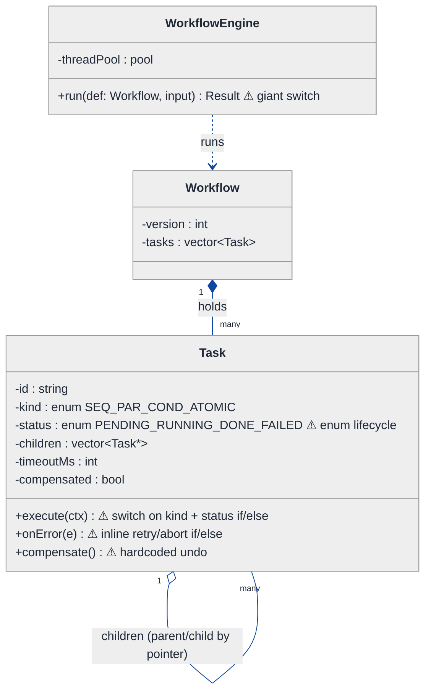
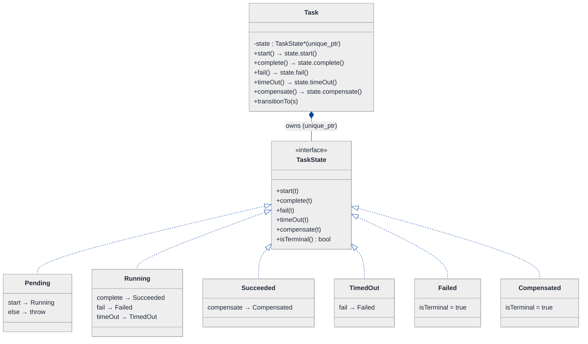
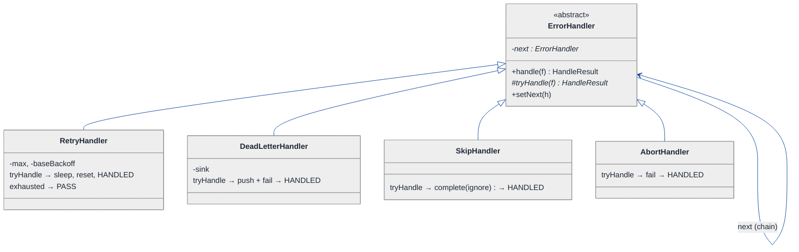
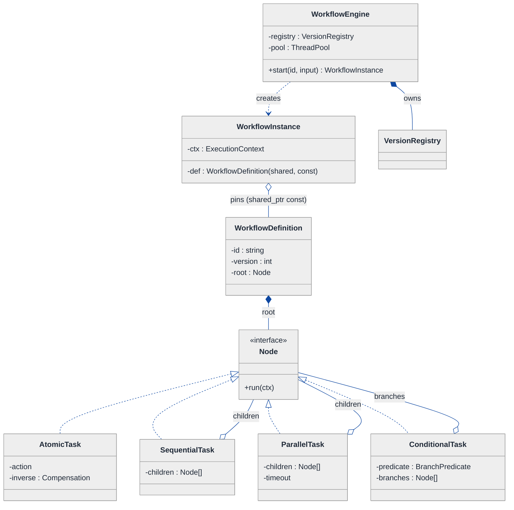
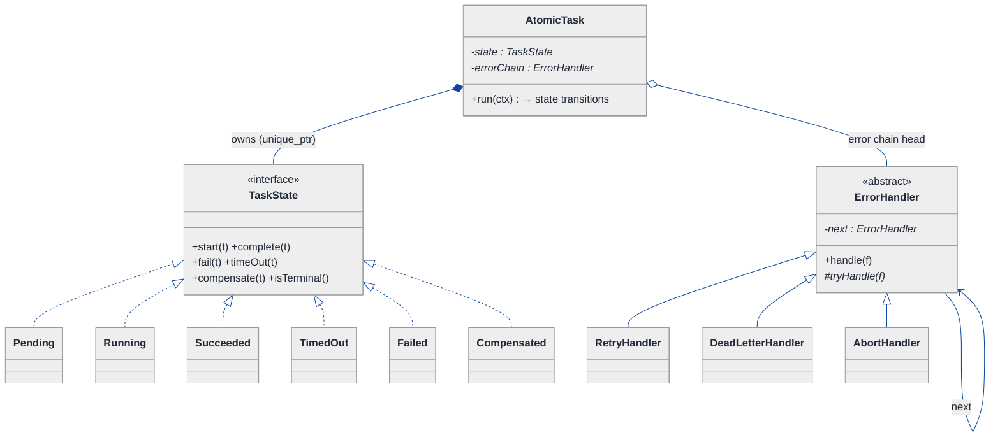
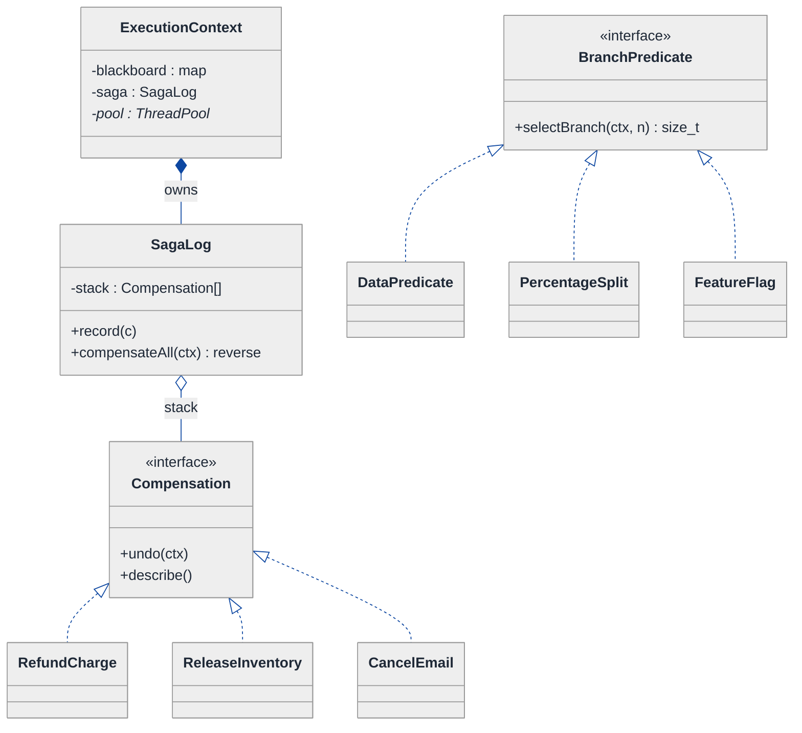
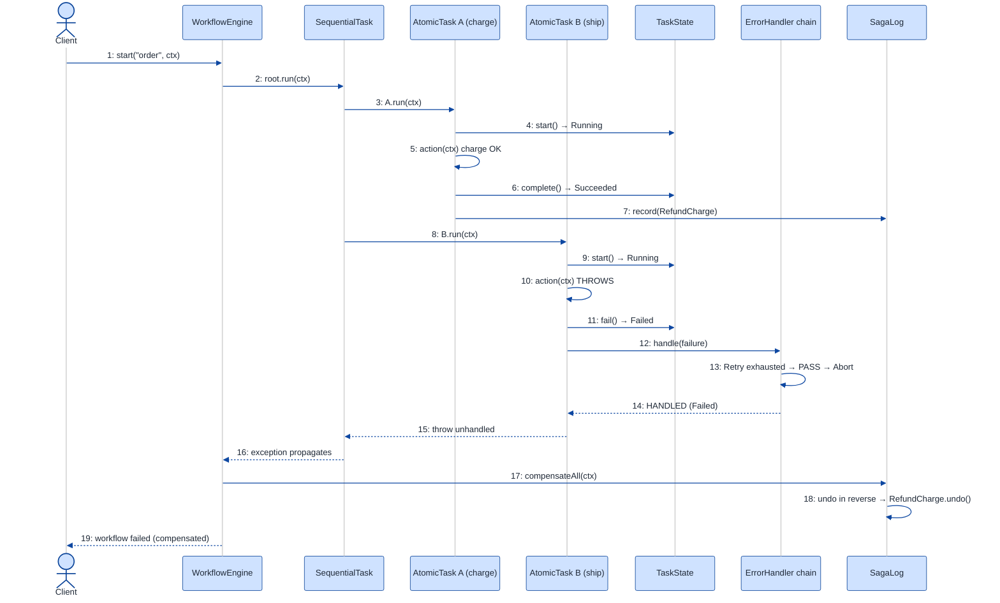

# Workflow Engine — LLD Walkthrough

> **Difficulty:** Hard · **Time:** ~45 min · **Pattern focus:** State (task lifecycle) + Chain of Responsibility (error handling) + Saga (compensation) + a few supporting patterns
>
> **Problem source(s):** GID ST6 in [`./EXTRACTED_QUESTIONS.md`](./EXTRACTED_QUESTIONS.md), bucket `State_Pattern`. A senior-bar orchestration question.
>
> **Diagrams:** inline mermaid (renders natively in GitHub / VS Code). Light theme + soft pastels + navy arrows; canonical theme block only.

---

## How to use this file

Paced for a candidate who has seen State before and wants to see how it COMBINES with Chain of Responsibility and Saga in one design. Reading time: ~45 minutes if you sketch each iteration by hand. **The lesson: a workflow engine is NOT one big switch over task statuses — it's three independent variability axes (lifecycle, error-policy, compensation) that each want their own pattern. Derive them by building the naive design first, watching it collapse under five hypothetical changes, then reaching for ONE pattern per axis.**

**Map of this file (15 sections):**

1. Problem statement + clarifying questions
2. Plain-English restatement
3. Why this matters
4. Mental model
5. Try it yourself first
6. Entity & verb extraction
7. **Iteration 1: the naive design** — what we'd write first
8. **Where the naive design hurts** — five future requirements, one painful diff each
9. **Pivot 1: State for task lifecycle** — internal transitions, not external swaps
10. **Pivot 2: Chain of Responsibility for error handling** — handle-or-pass
11. **Pivot 3: Saga + Command for compensation, Composite for structure, Strategy for branching**
12. Final UML class diagram (three sub-views)
13. Skeleton code (C++17)
14. Key flow — sequence diagram
15. Extensibility re-check + anti-patterns + how to think aloud + self-check

---

## 1. Problem statement + clarifying questions

**Prompt (typical phrasing):** "Design a workflow engine supporting sequential and parallel task execution, conditional branching, error handling with compensation, task timeout, and workflow versioning."

**Clarifying questions to ask BEFORE drawing anything:**

1. **Task granularity?** Is a "task" a single function call, a remote service call, or a sub-workflow that can itself contain tasks? (Determines whether we need a recursive/tree structure.)
2. **Execution topology?** Strictly DAG (directed acyclic), or can there be loops / retries that re-enter a node? Do parallel branches join (fan-out then fan-in), or run fire-and-forget?
3. **What does "compensation" mean here?** Saga-style — for every committed step, run a semantically-inverse undo action when a later step fails? Or just "rollback a DB transaction"? (Big design difference.)
4. **Timeout semantics?** Per-task wall-clock timeout that cancels the task and triggers error handling? Or a soft SLA warning? What happens to a parallel sibling when one branch times out — cancel the rest or let them finish?
5. **Persistence & durability?** Must a workflow survive a process crash and resume mid-flight (i.e., is state event-sourced / checkpointed), or is everything in-memory for the interview scope?
6. **Versioning semantics?** When a workflow definition changes, do IN-FLIGHT instances keep running on their original version (pin-to-version) while NEW instances use the latest? (Almost always yes — this is the whole point of versioning.)
7. **Conditional branching inputs?** Does a branch decision read the output of a prior task, external context, or both? Is the predicate code, or data (a rules table)?
8. **Concurrency model?** Thread pool, async/coroutines, or distributed workers? (We'll assume a thread pool for the interview and note the distributed extension in §15.)

**Assumptions if interviewer dodges:** tasks can be atomic OR sub-workflows (recursive); topology is a DAG with explicit sequential / parallel / conditional composites; compensation is Saga-style (inverse Command per completed task, run in reverse order on failure); per-task wall-clock timeout that cancels and routes to the error chain; in-flight instances pin to the workflow-definition version they started on; branching predicates are pluggable code; thread-pool concurrency. We'll discuss durability/event-sourcing in §15.

---

## 2. Plain-English restatement

We're building the engine that RUNS a business process described as a graph of tasks. The engine must: execute tasks in order where order matters, fan out tasks that can run at the same time and wait for them to rejoin, pick one of several paths based on a runtime condition, give each task a deadline and cancel it if it overruns, and — when something fails partway through — UNDO the steps that already succeeded (in reverse) so the system isn't left half-done. On top of all that, the DEFINITION of a workflow changes over time, and a workflow that's already running must keep using the rules it started with even after we publish a new version. The design must let us add a new task type, a new error-handling policy, or a new branching rule **without rewriting the core execution loop.**

---

## 3. Why this matters

This is the question interviewers reach for when "design a parking lot" was too easy. It probes whether you can keep THREE orthogonal variability axes from collapsing into one tangled `switch`: the task LIFECYCLE (pending → running → succeeded / failed / timed-out / compensated), the error POLICY (retry, skip, abort, compensate), and the STRUCTURE (sequential / parallel / conditional / nested). Candidates who haven't internalized State-vs-Strategy-vs-Chain will produce a 400-line `execute()` method with nested `if`s; the senior bar is recognizing each axis and giving it the smallest pattern that fits. The same skeleton reappears in CI/CD pipelines, Airflow / Temporal / Step Functions, payment orchestration, and ETL frameworks.

---

## 4. Mental model

A workflow engine is a **conductor** standing in front of an **orchestra (tasks)** reading from a **score (definition)**. Three things vary independently: how the conductor sequences players (structure), what each player does when they hit a wrong note (error policy), and how the conductor walks everyone back to the last clean bar when the piece falls apart (compensation). The score itself gets re-edited between performances (versioning), but a performance already underway plays the score it started with.

```
Real-world sketch (NOT a UML diagram yet):

   Workflow definition v3 (the "score")
   ┌────────────────────────────────────────────────┐
   │  [A] ──▶ ( fan-out )──▶ [B]  ─┐                  │
   │                         [C]  ─┼─▶ ( join )─▶ [E] │
   │                         [D]  ─┘                  │
   │              if X ──▶ [F]   (conditional)        │
   └────────────────────────────────────────────────┘
        each [ ] is a Task with its own lifecycle:
        pending → running → (succeeded | failed | timed-out)
                                  │ on failure
                                  ▼
        compensation: undo E, then undo B/C/D, then undo A  (reverse order)
```

The KEY insight from this picture: **structure** (how tasks compose), **lifecycle** (what state a single task is in), and **failure recovery** (reverse-order undo) are three SEPARATE concerns. The naive design fuses them. The good design keeps them apart — and the pattern for each is different.

---

## 5. Try it yourself first

> **Predict before reading on:**
>
> 1. List 5 nouns you'd promote to a class and 2 you'd leave as fields. Where does "parallel" live — is it a flag on a task, or its own kind of thing?
> 2. **If a single task can be in 6+ lifecycle states and each state allows different operations, what's the cost of representing state as an `enum` checked by `switch` in every method?**
> 3. A task at step 7 fails. Steps 1-6 already committed side effects. Where do you put the "undo step 6, then 5, then ..." logic so that adding step 8 later doesn't force you to touch that logic?

---

## 6. Entity & verb extraction

> **Mini-refresher: noun → class, but not every noun.**
>
> Naive OOD promotes every noun to a class. Senior OOD promotes a noun only if it has both BEHAVIOR and STATE that need to live together. "Timeout duration" stays a field; "Task" becomes a class because it has lifecycle behavior; "parallel group" becomes a class because composing children IS its behavior.

**Nouns from the prompt:**

| Noun | Decision | Why |
|---|---|---|
| WorkflowEngine | Class (top-level coordinator) | Owns the run loop, the thread pool, the version registry |
| WorkflowDefinition | Class (immutable, versioned) | The "score"; a tree of task nodes + a version number |
| WorkflowInstance | Class | A live run pinned to one definition version; holds runtime context |
| Task / TaskNode | Class (abstract) + concrete kinds | Has lifecycle + execution behavior |
| Sequential / Parallel / Conditional | Classes (composite nodes) | Composing children IS their behavior |
| TaskState | Class family (Pivot 1) | Lifecycle behavior; what's legal next |
| ErrorHandler | Class family (Pivot 2) | Retry / skip / abort / compensate policy |
| Compensation | Command object (Pivot 3) | The reverse action of a completed task |
| BranchPredicate | Strategy (Pivot 3) | The condition picking a branch |
| Timeout / Duration | Field on Task (`std::chrono`) | No domain behavior of its own |
| Version number | Field on WorkflowDefinition (`int`) | Not a class |
| Context / blackboard | Field on WorkflowInstance (`map<string, Value>`) | A data bag, not behavior |

**Verbs (and the class they live on — naive answer, we'll re-examine):**

| Verb | Owner class (naive — revisited later) |
|---|---|
| run(definition, input) | WorkflowEngine |
| execute() | TaskNode |
| transitionTo(state) | Task (via its State) |
| onError(failure) | TaskNode → ErrorHandler |
| compensate() | TaskNode → Compensation command |
| evaluate(context) | Conditional → BranchPredicate |
| register(definition) / getVersion(n) | VersionRegistry |
| awaitWithTimeout(task) | WorkflowEngine |

**We have NOT introduced any design patterns yet.** Pure nouns + verbs.

---

## 7. <a id="iter-1"></a>Iteration 1: the naive design

Let's write the simplest thing that could possibly work. No design patterns — one `Task` struct with a `status` enum, one giant `execute()` that switches on a `kind` enum, error handling as inline `if`s, compensation as a hand-rolled stack.



**Reader's tour (read top to bottom; ~60 seconds).**

1. **`WorkflowEngine` is the root.** One real method, `run(def, input)`, which is a giant loop that walks the task list, switches on each task's `kind`, and inline-handles errors and compensation. Every decision lives in this one method. Mark it: ⚠.

2. **`Workflow` is a thin holder.** A version number plus a flat-ish `vector<Task>`. Note it stores `tasks` as a vector even though the real structure is a TREE (a parallel group contains children) — the naive design fakes the tree with a `children` pointer list on `Task` and hopes the engine traverses it right.

3. **`Task` is the trouble zone — it does EVERYTHING.** Look at the warning markers:
   - `kind` is an enum (`SEQUENTIAL / PARALLEL / CONDITIONAL / ATOMIC`). `execute()` switches on it. Every new composition type adds a case.
   - `status` is an enum (`PENDING / RUNNING / DONE / FAILED`). Every method that touches a task first checks `if (status == ...)`. The transition rules are scattered.
   - `onError()` is inline `if (retriesLeft) ... else if (abortOnError) ... else skip`. Every new policy adds a branch.
   - `compensate()` hardcodes the undo. There's no record of WHAT to undo, just a `compensated` bool.

4. **The parent/child pointer (`o--`).** A `Task` points at child `Task`s. This is how parallel/conditional groups "contain" subtasks — but because `Task` is one concrete type, a leaf task and a parallel group are the SAME class, distinguished only by the `kind` enum. That conflation is the structural smell.

**What's deliberately missing.** No `TaskState` hierarchy. No `ErrorHandler` chain. No `Compensation` command. No `BranchPredicate`. No separation between a leaf task and a composite group. No version registry — `Workflow` just has an `int version` that nobody enforces. The naive design doesn't even ACKNOWLEDGE these are independent axes; it bakes a hardcoded answer for each into `Task` and `run()`. That's what we'll expose, and fix.

Skeleton code for the naive design (C++17):

```cpp
#include <chrono>
#include <functional>
#include <stdexcept>
#include <string>
#include <unordered_map>
#include <vector>

enum class TaskKind   { ATOMIC, SEQUENTIAL, PARALLEL, CONDITIONAL };
enum class TaskStatus { PENDING, RUNNING, DONE, FAILED };          // will hurt

using Context = std::unordered_map<std::string, std::string>;

struct Task {
    std::string  id;
    TaskKind     kind = TaskKind::ATOMIC;
    TaskStatus   status = TaskStatus::PENDING;
    int          timeoutMs = 30000;
    bool         abortOnError = true;
    int          retriesLeft = 0;
    bool         compensated = false;
    std::function<void(Context&)> action;          // atomic work
    std::vector<Task*> children;                    // for SEQ/PAR/COND
    std::function<bool(const Context&)> condition;  // for COND

    void execute(Context& ctx) {                    // ⚠ does everything
        status = TaskStatus::RUNNING;
        switch (kind) {                             // ⚠ switch on kind
            case TaskKind::ATOMIC:
                try { action(ctx); status = TaskStatus::DONE; }
                catch (const std::exception& e) { onError(ctx); }
                break;
            case TaskKind::SEQUENTIAL:
                for (Task* c : children) {
                    c->execute(ctx);
                    if (c->status == TaskStatus::FAILED) {   // ⚠ status check
                        status = TaskStatus::FAILED; return;
                    }
                }
                status = TaskStatus::DONE; break;
            case TaskKind::PARALLEL:
                // spawn threads, join... timeout handling inline ⚠
                for (Task* c : children) c->execute(ctx);   // (not actually parallel here)
                status = TaskStatus::DONE; break;
            case TaskKind::CONDITIONAL:
                if (!children.empty() && condition(ctx)) children[0]->execute(ctx);
                else if (children.size() > 1)            children[1]->execute(ctx);
                status = TaskStatus::DONE; break;
        }
    }

    void onError(Context& ctx) {                    // ⚠ inline policy ladder
        if (retriesLeft > 0) { --retriesLeft; execute(ctx); }
        else if (abortOnError) { status = TaskStatus::FAILED; }
        else { status = TaskStatus::DONE; /* skip */ }
    }

    void compensate(Context& ctx) {                 // ⚠ hardcoded undo
        if (status == TaskStatus::DONE && !compensated) {
            // ??? what was the inverse action? we never recorded it.
            compensated = true;
        }
    }
};

class WorkflowEngine {
public:
    void run(std::vector<Task*>& tasks, Context& ctx) {  // ⚠ one giant method
        std::vector<Task*> completed;
        for (Task* t : tasks) {
            t->execute(ctx);
            if (t->status == TaskStatus::FAILED) {
                // compensate in reverse — but the undo logic doesn't exist
                for (auto it = completed.rbegin(); it != completed.rend(); ++it)
                    (*it)->compensate(ctx);
                throw std::runtime_error("Workflow failed at " + t->id);
            }
            completed.push_back(t);
        }
    }
};
```

**This works.** It has zero design patterns. It can run a sequence, sort of fan out, branch, and attempt compensation. So what's wrong with it?

---

## 8. <a id="naive-pain"></a>Where the naive design hurts

The interviewer slides five new requirements across the desk: "Here's next quarter's roadmap. Walk me through what changes."

### Change A: "Add a per-task wall-clock timeout that cancels the task and routes it to error handling"

In the naive design:
- The `PARALLEL` case in `execute()` already pretends to spawn threads but never enforces a deadline. Real timeout means wrapping each child in a future, waiting with `wait_for`, and on timeout setting `status = FAILED` and calling `onError`.
- But `status` has no `TIMED_OUT` value — and a timed-out task needs DIFFERENT handling than a thrown exception (e.g., it may be retriable while a logic error is not). So you add a `TIMED_OUT` enum AND special-case it in `onError`, `execute`, and the engine loop.
- **Touches: `TaskStatus` enum + `execute()` (every branch) + `onError()` + the engine loop. Four sites for one feature.**

### Change B: "Add a 'retry with exponential backoff, then escalate to a dead-letter queue' policy"

In the naive design:
- `onError()` is an `if (retriesLeft) ... else if (abortOnError) ...` ladder. Backoff means sleeping between retries; dead-letter means a NEW terminal action.
- You bolt `backoffMs`, `maxBackoff`, and `deadLetterSink` fields onto `Task` (which already has 9 fields) and grow the ladder to 5 branches.
- **Next error policy → another field + another branch in the same method.** Two policies in and `onError` is unreadable. Classic policy-soup.

### Change C: "Saga compensation — when step 7 fails, run the SEMANTIC INVERSE of steps 1-6 in reverse order (refund the charge, release the inventory, cancel the email)"

In the naive design:
- `compensate()` has a `compensated` bool but NO RECORD of what the inverse action is. The atomic `action` is a forward `std::function`; there is no paired undo function anywhere.
- To fix it you'd add an `undo` `std::function` to every `Task`, and the engine's reverse loop would call it. But the undo for a PARALLEL group must itself fan out; the undo for a CONDITIONAL must only undo the branch that ran. The `compensate()` switch now mirrors the `execute()` switch — **double the surface.**
- **Touches: `Task` (new field) + `compensate()` (new switch on kind) + engine loop. And it's fundamentally a STACK-of-actions problem the data model doesn't express.**

### Change D: "Conditional branch should choose among N branches using a pluggable rule (A/B test %, feature flag, data predicate)"

In the naive design:
- `CONDITIONAL` hardcodes `condition(ctx) ? children[0] : children[1]` — exactly two branches, one inline lambda.
- N-way branching with a swappable rule means replacing the lambda with... something. Each new rule type (percentage split, flag lookup, data table) is a different shape. You end up with `if (ruleType == PERCENT) ... else if (ruleType == FLAG) ...` — another tag-driven switch, this time inside the conditional case.
- **Touches the `CONDITIONAL` branch of `execute()` and adds a ruleType enum. The branching algorithm is varying and there's nowhere clean to put it.**

### Change E: "Workflow versioning — publish definition v4 while v3 instances are still running; in-flight runs MUST finish on v3"

In the naive design:
- There is no registry and no instance/definition split. `WorkflowEngine::run` takes a raw `vector<Task*>` — the live mutable structure IS the definition. If you edit it to publish v4, every in-flight run mutates underneath itself.
- To fix it you need: an immutable versioned `WorkflowDefinition`, a `WorkflowInstance` that pins a version, and a registry mapping `(workflowId, version) → definition`. None exist.
- **This isn't a "touch a method" change — it's a missing architectural seam. The naive design fused definition and runtime state.**

### The pattern of pain

| Change | Files / methods touched | Smell |
|---|---|---|
| A. Timeout | `TaskStatus` enum + `execute()` + `onError()` + engine | "Lifecycle states + scattered status checks can't express a new phase cleanly." |
| B. Backoff + dead-letter | `onError()` ladder + `Task` fields | "One method accumulates every error policy." |
| C. Saga compensation | `Task` field + `compensate()` switch + engine | "Undo has no first-class representation; mirrors the execute switch." |
| D. Pluggable branching | `CONDITIONAL` branch + ruleType enum | "Branch-selection algorithm varies; tag-driven switch." |
| E. Versioning | (no seam exists) | "Definition and runtime state are the same mutable object." |

**Three axes of pain dominate.** (1) The task LIFECYCLE — too many states for an enum + scattered `if`s (Changes A, and the `status` checks everywhere). (2) The ERROR POLICY — a method accumulating every recovery rule (Change B). (3) COMPENSATION + STRUCTURE — undo has no first-class form, and leaf-vs-composite is conflated (Changes C, D), with versioning (E) as the architectural seam that makes the rest safe.

> **Pivot question:** "What pattern handles 'a lifecycle with many states, each allowing different operations, transitioning internally'? What pattern handles 'a request that should be handled by the FIRST policy that can, else passed along'? And what pattern records 'a forward action paired with its inverse, replayable in reverse'?"
>
> The answers are State, Chain of Responsibility, and Command/Saga. Let's introduce them one at a time, starting with the most pervasive pain: the lifecycle.

---

## 9. <a id="pivot-1"></a>Pivot 1: State for the task lifecycle

The `status` enum + scattered `if (status == X)` is the most PERVASIVE pain — it leaks into `execute()`, `onError()`, `compensate()`, and the engine loop. Adding `TIMED_OUT` (Change A) and later `COMPENSATED` (Change C) means N new comparisons in M places: an N×M problem.

> **Mini-refresher: State pattern.**
>
> Each lifecycle state is its own class implementing a common interface. The context object (here, `Task`) delegates operations to its CURRENT state object, and THE STATE decides what the next state is. Transitions are INTERNAL — driven by events the context receives — and each state knows which operations are legal in it (illegal ones throw or no-op). The result: zero `switch (status)` anywhere.

**Why State (not Strategy).** The choice of state is NOT picked by the caller — it's driven by what the task has been through. A `Pending` task can `start()`. A `Running` task can `complete()`, `fail()`, or `timeOut()`. A `Succeeded` task can `compensate()`. A `Failed` task cannot be completed. Calling `complete()` on a `Failed` task is meaningless — it must throw. The lifecycle is the OBJECT'S concern, not the caller's.

**The refactor (just the lifecycle slice):**

```cpp
class Task;  // forward

class TaskState {
public:
    virtual ~TaskState() = default;
    virtual const char* name() const = 0;
    // The operations a task supports; each state implements what's legal.
    virtual void start(Task& t)     { throw std::logic_error("start illegal here"); }
    virtual void complete(Task& t)  { throw std::logic_error("complete illegal here"); }
    virtual void fail(Task& t)      { throw std::logic_error("fail illegal here"); }
    virtual void timeOut(Task& t)   { throw std::logic_error("timeOut illegal here"); }
    virtual void compensate(Task& t){ throw std::logic_error("compensate illegal here"); }
    virtual bool isTerminal() const { return false; }
};

class Pending : public TaskState {
public:
    const char* name() const override { return "PENDING"; }
    void start(Task& t) override;                 // → Running
};

class Running : public TaskState {
public:
    const char* name() const override { return "RUNNING"; }
    void complete(Task& t) override;              // → Succeeded
    void fail(Task& t) override;                  // → Failed (routes to error chain)
    void timeOut(Task& t) override;               // → TimedOut (a DISTINCT failure)
};

class Succeeded : public TaskState {
public:
    const char* name() const override { return "SUCCEEDED"; }
    void compensate(Task& t) override;            // → Compensated (Saga undo)
};

class TimedOut : public TaskState {               // Change A lands as ONE new class
public:
    const char* name() const override { return "TIMED_OUT"; }
    void fail(Task& t) override;                  // a timeout may still route to error policy
    bool isTerminal() const override { return false; }
};
// Failed, Compensated elided — each a small class.
```

**What changed — visualized.** Just the lifecycle slice:



**Tour of the after-state.**

1. **The `TaskStatus` enum is gone.** Replaced by a `state` field of type `unique_ptr<TaskState>` — exclusive ownership of the current state object.

2. **`Task`'s lifecycle methods became one-liners.** `start()` is just `state_->start(*this)`. **No `if (status == X)` branching anywhere on Task or in the engine.**

3. **The interface declares the full operation set.** Each concrete state implements only the legal ones; the base class defaults the rest to `throw`. So `Failed::complete()` inherits the throwing default — completing a failed task is impossible by construction, not by a runtime check you might forget.

4. **Six concrete states, each self-contained.** `Pending → Running → {Succeeded, Failed, TimedOut}`; `Succeeded → Compensated`; `TimedOut → Failed`. The transition lives WITH the state (each state calls `t.transitionTo(...)`), so adding `TimedOut` (Change A) is ONE new class touching nothing else.

5. **`isTerminal()` replaces the scattered "is it done?" checks.** The engine asks the state, not an enum.

**Change A from §8 now lands cleanly.** `TIMED_OUT` is a new `TimedOut` state class. No edits to `Pending`, `Running`, `Succeeded`, `Task`, or the engine loop. Open/closed.

> **Mini-refresher: Open/Closed Principle (the "O" in SOLID).**
>
> Software entities should be OPEN for extension but CLOSED for modification. You add new behavior by adding new code (a new class), not by editing existing code. The State pattern delivers this for the lifecycle: a new state = a new class, existing states untouched.

**Pattern-discrimination cheatsheet — State vs Strategy.**
- *Strategy:* the CALLER picks which algorithm to use (`task.setErrorHandler(retry)`); strategies are usually unaware of each other.
- *State:* the OBJECT picks its next state internally (`running.complete()` flips to `Succeeded`); states know about each other (each can `transitionTo` another).
- *Rule of thumb:* swap happens because external code says so → Strategy. Swap happens because of an internal event flow → State.

We chose State for the lifecycle because the transitions are driven by what HAPPENS to the task (it completed, it threw, it ran out of time), not by a caller's configuration choice.

---

## 10. <a id="pivot-2"></a>Pivot 2: Chain of Responsibility for error handling

Change B from §8 is still painful — `onError()` is a growing `if`-ladder of recovery policies (retry, backoff, skip, abort, dead-letter, compensate). The State pattern doesn't help here: the variability isn't WHAT STATE we're in, it's WHICH POLICY gets to handle a failure — and policies should be ORDERED and COMPOSABLE (try retry first; if retries exhausted, try dead-letter; else abort).

> **Mini-refresher: Chain of Responsibility (CoR).**
>
> A request travels along a linked chain of handlers. Each handler either HANDLES it (and stops the chain) or PASSES it to the next handler. The sender doesn't know which handler will deal with it. New handlers slot into the chain without touching existing ones. Classic uses: middleware pipelines, event bubbling, approval workflows.

**Why CoR (not Strategy).** A single Strategy would let the caller pick ONE error policy. But real error handling is layered: "retry up to 3×; if that fails, send to dead-letter; if no dead-letter configured, abort." That's an ORDERED sequence where each handler decides "can I deal with this, or do I pass it on?" — the exact shape CoR describes. Strategy gives you one swap; CoR gives you a pipeline of handle-or-pass.

**The refactor (just the error-handling slice):**

```cpp
struct Failure {
    Task*        task;
    std::string  reason;
    bool         isTimeout = false;
    int          attempt   = 0;
};

enum class HandleResult { HANDLED, PASS };   // HANDLED stops the chain

class ErrorHandler {
public:
    virtual ~ErrorHandler() = default;
    void setNext(std::unique_ptr<ErrorHandler> next) { next_ = std::move(next); }

    // Template-method skeleton: try me, else delegate to next.
    HandleResult handle(Failure& f) {
        if (tryHandle(f) == HandleResult::HANDLED) return HandleResult::HANDLED;
        if (next_) return next_->handle(f);
        return HandleResult::PASS;            // nobody handled it → engine aborts
    }
protected:
    virtual HandleResult tryHandle(Failure& f) = 0;
private:
    std::unique_ptr<ErrorHandler> next_;
};

class RetryHandler : public ErrorHandler {
public:
    explicit RetryHandler(int maxRetries, std::chrono::milliseconds baseBackoff)
        : max_(maxRetries), base_(baseBackoff) {}
protected:
    HandleResult tryHandle(Failure& f) override {
        if (f.attempt >= max_) return HandleResult::PASS;       // exhausted → next handler
        auto delay = base_ * (1 << f.attempt);                  // exponential backoff
        std::this_thread::sleep_for(delay);
        f.task->reset();                                        // back to Pending
        ++f.attempt;
        return HandleResult::HANDLED;                           // engine re-runs the task
    }
private:
    int max_;
    std::chrono::milliseconds base_;
};

class DeadLetterHandler : public ErrorHandler {
public:
    explicit DeadLetterHandler(DeadLetterSink& sink) : sink_(sink) {}
protected:
    HandleResult tryHandle(Failure& f) override {
        sink_.push(f.task->id(), f.reason);                     // escalate, stop chain
        f.task->fail();                                         // mark Failed (State pattern)
        return HandleResult::HANDLED;
    }
private:
    DeadLetterSink& sink_;
};

class AbortHandler : public ErrorHandler {                      // terminal fallback
protected:
    HandleResult tryHandle(Failure& f) override {
        f.task->fail();
        return HandleResult::HANDLED;                           // triggers compensation upstream
    }
};
// SkipHandler, CompensateHandler elided — same shape.
```

**What changed — visualized.** Just the error-handling slice:



**Tour of the after-state.**

1. **`onError()`'s `if`-ladder is gone.** It's replaced by a CHAIN of handler objects, each a small class. The engine builds the chain once (`retry → deadLetter → abort`) and calls `chain.handle(failure)`.

2. **`handle()` is the non-virtual template method; `tryHandle()` is the virtual hook.** The base class owns the "try me, else pass to next" plumbing so no subclass can forget it. Each subclass only fills in its own policy. (That base `handle()`/`tryHandle()` split is itself the **Template Method** pattern — skeleton in the base, hook in the child.)

3. **Each handler returns HANDLED or PASS.** `RetryHandler` HANDLES while retries remain (sleeps with exponential backoff, resets the task to `Pending`, signals the engine to re-run), and PASSES once exhausted. `DeadLetterHandler` escalates and stops. `AbortHandler` is the terminal fallback that marks the task `Failed` (via the State pattern from Pivot 1), which upstream triggers compensation.

4. **The `next` self-association (`ErrorHandler → ErrorHandler`)** is the chain link. Reordering policy is reordering the chain; adding a policy is `setNext` of a new handler. **Change B (backoff + dead-letter) is two small handler classes wired into the chain — zero edits to existing handlers.**

> **Mini-refresher: Template Method pattern.**
>
> An abstract base defines the SKELETON of an algorithm in a non-virtual method, deferring specific steps to virtual "hook" methods that subclasses override. Here `handle()` is the skeleton ("try, then delegate"), `tryHandle()` is the hook.

**Pattern-discrimination cheatsheet — Chain of Responsibility vs Strategy vs Decorator.**
- *Strategy:* pick exactly ONE algorithm; no notion of "pass it on."
- *Chain of Responsibility:* an ORDERED list; first handler that can deal with it stops the chain; the rest never run.
- *Decorator:* each wrapper ALWAYS runs and augments the result, passing through to the inner one (no early stop).
- *Rule of thumb:* "first one that can, wins, others skipped" → CoR. "Every layer contributes" → Decorator. "Exactly one, caller's choice" → Strategy.

We chose CoR because error policies are tried in order and the FIRST that can handle the failure stops the rest — that early-exit is the defining trait.

---

## 11. <a id="pivot-3"></a>Pivot 3: Saga + Command for compensation, Composite for structure, Strategy for branching

Three axes remain: compensation (Change C), structure / leaf-vs-composite (the conflation that made Change C's undo mirror the execute switch), pluggable branching (Change D), and the versioning seam (Change E). Each gets the smallest pattern that fits.

### 11.1 Compensation: Command + Saga

> **Mini-refresher: Command pattern.**
>
> Wraps a request as an OBJECT — bundling the action and the data it needs — so it can be stored, queued, passed around, and (crucially) reversed. A command typically exposes `execute()` and `undo()`. Storing executed commands in a list gives you a replayable / reversible history.

> **Mini-refresher: Saga pattern.**
>
> For a multi-step process where each step commits its own side effect (no global transaction), a Saga pairs every forward step with a COMPENSATING action (its semantic inverse). If step K fails, the saga runs the compensations for steps K-1 ... 1 in REVERSE order, leaving the system consistent. It's "undo via inverse operations," not "rollback a transaction."

**Why Command + Saga (not the naive `compensate()` switch).** Change C's real problem was that undo had no first-class representation. The fix: when a task succeeds, it pushes a `Compensation` Command (its inverse, with captured data) onto the instance's saga log. On failure, the engine pops the log and calls `undo()` in reverse — no switch on task kind, because each Command already knows how to reverse ITS step.

```cpp
class Compensation {                       // Command
public:
    virtual ~Compensation() = default;
    virtual void undo(Context& ctx) = 0;
    virtual const char* describe() const = 0;
};

class RefundCharge : public Compensation {
public:
    explicit RefundCharge(std::string txnId) : txnId_(std::move(txnId)) {}
    void undo(Context&) override { /* call payment API refund(txnId_) */ }
    const char* describe() const override { return "refund charge"; }
private:
    std::string txnId_;
};
// ReleaseInventory, CancelEmail elided — each a Command capturing its own data.

class SagaLog {                            // reverse-order replay
public:
    void record(std::unique_ptr<Compensation> c) { stack_.push_back(std::move(c)); }
    void compensateAll(Context& ctx) {
        for (auto it = stack_.rbegin(); it != stack_.rend(); ++it)
            (*it)->undo(ctx);              // reverse order — the Saga guarantee
        stack_.clear();
    }
private:
    std::vector<std::unique_ptr<Compensation>> stack_;
};
```

### 11.2 Structure: Composite

> **Mini-refresher: Composite pattern.**
>
> Lets you treat individual objects (leaves) and compositions of objects (containers) UNIFORMLY through a common interface. A `render()` on a node works whether it's a single shape or a group of shapes. Recursion in operations falls out for free. Here it dissolves the naive "one `Task` with a `kind` enum" into a clean tree.

**Why Composite.** The naive design conflated a leaf task and a group via the `kind` enum, which forced `execute()` (and would have forced `compensate()`) into a switch. Composite makes `AtomicTask` (leaf) and `SequentialTask` / `ParallelTask` / `ConditionalTask` (composites) all implement one `Node` interface. `WorkflowEngine` calls `node->run(ctx)` and never asks "what kind are you?"

```cpp
class Node {                               // Composite component
public:
    virtual ~Node() = default;
    virtual void run(ExecutionContext& ctx) = 0;     // recursive
};

class AtomicTask : public Node { /* wraps a Task + its action + records Compensation */ };

class SequentialTask : public Node {       // composite
public:
    explicit SequentialTask(std::vector<std::unique_ptr<Node>> children)
        : children_(std::move(children)) {}
    void run(ExecutionContext& ctx) override {
        for (auto& c : children_) c->run(ctx);        // stops if a child throws / fails
    }
private:
    std::vector<std::unique_ptr<Node>> children_;
};

class ParallelTask : public Node {         // composite — fan-out + join with timeout
public:
    void run(ExecutionContext& ctx) override {
        std::vector<std::future<void>> fs;
        for (auto& c : children_) fs.push_back(ctx.pool().submit([&]{ c->run(ctx); }));
        for (auto& f : fs)
            if (f.wait_for(timeout_) == std::future_status::timeout) ctx.cancelAll(); // Change A
        for (auto& f : fs) f.get();                   // propagate exceptions
    }
private:
    std::vector<std::unique_ptr<Node>> children_;
    std::chrono::milliseconds timeout_{30000};
};
// ConditionalTask elided — see 11.3.
```

### 11.3 Branching: Strategy

> **Mini-refresher: Strategy pattern.**
>
> Encapsulates an algorithm behind an interface so it can be swapped at runtime. The CALLER (here, the workflow author) picks which strategy a `ConditionalTask` uses; the strategy doesn't know about its peers.

**Why Strategy.** Change D's branch selection (data predicate vs percentage split vs feature flag) is an ALGORITHM picked at definition time. That's textbook Strategy — and it's N-way, returning the index of the branch to run.

```cpp
class BranchPredicate {                    // Strategy
public:
    virtual ~BranchPredicate() = default;
    virtual size_t selectBranch(const ExecutionContext& ctx, size_t n) const = 0;
};
class DataPredicate    : public BranchPredicate { /* ctx["status"]=="approved" ? 0 : 1 */ };
class PercentageSplit  : public BranchPredicate { /* hash(userId) % 100 < pct ? 0 : 1 */ };
class FeatureFlag      : public BranchPredicate { /* flags.on("newFlow") ? 0 : 1 */ };

class ConditionalTask : public Node {
public:
    ConditionalTask(std::unique_ptr<BranchPredicate> p,
                    std::vector<std::unique_ptr<Node>> branches)
        : predicate_(std::move(p)), branches_(std::move(branches)) {}
    void run(ExecutionContext& ctx) override {
        size_t i = predicate_->selectBranch(ctx, branches_.size());
        branches_.at(i)->run(ctx);         // only the chosen branch runs (and gets compensated)
    }
private:
    std::unique_ptr<BranchPredicate> predicate_;
    std::vector<std::unique_ptr<Node>> branches_;
};
```

### 11.4 Versioning: immutable definition + registry (the seam)

Change E needs an architectural seam, not a GoF pattern. Split the mutable runtime from the immutable plan:

```cpp
class WorkflowDefinition {                 // immutable, value-like
public:
    WorkflowDefinition(std::string id, int version, std::unique_ptr<Node> root)
        : id_(std::move(id)), version_(version), root_(std::move(root)) {}
    int version() const { return version_; }
    const Node& root() const { return *root_; }
private:
    std::string id_;
    int version_;
    std::unique_ptr<Node> root_;           // the Composite tree, frozen
};

class VersionRegistry {                    // (workflowId, version) → definition
public:
    void publish(std::shared_ptr<const WorkflowDefinition> def);
    std::shared_ptr<const WorkflowDefinition> get(const std::string& id, int version) const;
    std::shared_ptr<const WorkflowDefinition> latest(const std::string& id) const;
private:
    std::unordered_map<std::string,
        std::map<int, std::shared_ptr<const WorkflowDefinition>>> byId_;
};

class WorkflowInstance {                   // runtime — PINS a version
public:
    WorkflowInstance(std::shared_ptr<const WorkflowDefinition> pinned, ExecutionContext ctx)
        : def_(std::move(pinned)), ctx_(std::move(ctx)) {}   // shares the frozen def
    // ctx_ holds the SagaLog, blackboard, thread pool handle — the only mutable part
private:
    std::shared_ptr<const WorkflowDefinition> def_;
    ExecutionContext ctx_;
};
```

A new instance grabs `latest(id)`; an in-flight instance keeps its `shared_ptr<const WorkflowDefinition>` alive — publishing v4 adds a registry entry and never touches the v3 object the running instance still points at. **Change E lands as a new seam that all the other patterns slot behind.**

**The lesson.** Once we named each axis, the pattern picked itself: lifecycle → State, ordered error policy → CoR, reversible step → Command/Saga, leaf-vs-group → Composite, branch selection → Strategy, version isolation → immutable value + registry. **Pattern recognition turns a 400-line method into a dozen small, independently-extensible classes.**

> **Mini-refresher: why these don't share one base interface.**
>
> `TaskState`, `ErrorHandler`, `Compensation`, `BranchPredicate`, and `Node` are different ROLES with different signatures. Don't unify them under a single `Handler<T>` template — that's premature genericism. Each interface earns its place by serving one axis of variation.

---

## 12. <a id="fig-class-diagram"></a>Final class diagram

One diagram for all of this is a wall of boxes. Here are **three focused sub-views**, each addressing a different concern; the structural insight at the end ties them together.

### 12.1 The structure spine — the Composite tree the engine runs



**Tour of 12.1.** `WorkflowEngine` owns the `VersionRegistry` and a `ThreadPool`. `start(id, input)` pulls the latest immutable `WorkflowDefinition` and creates a `WorkflowInstance` that PINS it via `shared_ptr<const ...>` (open diamond = aggregation; the instance doesn't own the definition's lifetime — the registry does). The definition's `root` is a `Node`. The Composite payoff is the bottom half: `SequentialTask`, `ParallelTask`, and `ConditionalTask` are composites that hold child `Node`s (themselves possibly composites) — the engine calls `root.run(ctx)` and recursion does the rest, with no `kind` switch anywhere.

### 12.2 The lifecycle + error policy — State and Chain of Responsibility



**Tour of 12.2.**

1. **`AtomicTask` holds TWO collaborators.** A `unique_ptr<TaskState>` (filled diamond — it OWNS its current state) and the head of an `ErrorHandler` chain (open diamond — aggregation; the chain is typically shared/configured at definition level).

2. **Left family: the State pattern.** Six self-contained states. `AtomicTask::run` drives transitions by calling `state_->start()`, then on the worker thread either `complete()`, `fail()`, or `timeOut()`. **No `switch (status)` exists.** Adding a state = one class.

3. **Right family: the Chain of Responsibility.** `ErrorHandler` is abstract with a non-virtual `handle()` (Template Method skeleton) and a virtual `tryHandle()` hook. The `next` self-association is the chain. On a `fail()`, `AtomicTask` hands a `Failure` to the chain head; the first handler that returns HANDLED stops it. Adding a policy = one handler wired in.

4. **The two families meet at the State transition.** When `RetryHandler` resets a task it transitions `Failed → Pending`; when `AbortHandler` gives up it transitions to `Failed` (terminal), which upstream triggers Saga compensation (12.3).

### 12.3 The compensation + branching — Saga/Command and Strategy



**Tour of 12.3.**

1. **`ExecutionContext` is the only mutable runtime object.** It carries the blackboard (task inputs/outputs), the `SagaLog`, and a handle to the thread pool. The immutable definition (12.1) reads from / writes to this — keeping versioning safe.

2. **`SagaLog` owns a stack of `Compensation` commands.** When an `AtomicTask` succeeds, it `record`s its inverse Command (with captured data like a transaction id). On a workflow-level failure, `compensateAll` walks the stack in REVERSE and calls each `undo()`. **No switch on task kind — each Command knows how to reverse its own step (Command pattern).**

3. **Three concrete compensations** (`RefundCharge`, `ReleaseInventory`, `CancelEmail`) each capture exactly the data their undo needs. Adding a fourth = one class.

4. **`BranchPredicate` (Strategy) is independent.** A `ConditionalTask` holds one and calls `selectBranch`. The three concrete predicates are different selection algorithms picked by the workflow author. Adding an A/B variant = one class.

### Structural insight (ties 12.1 + 12.2 + 12.3 together)

| Concern | Pattern used | Why |
|---|---|---|
| **Structure** (seq / parallel / conditional / nested) | Composite | Leaf and group share one `Node` interface; engine recurses, no `kind` switch |
| **Lifecycle** (pending → running → … → compensated) | State, OWNED by the task | The task transitions internally on events; each state validates what's legal |
| **Error policy** (retry / dead-letter / skip / abort) | Chain of Responsibility | Ordered handlers; first that can handle stops the chain |
| **Compensation** (reverse-order undo) | Command + Saga | Each step records its inverse; failure replays the log in reverse |
| **Branching** (data / % / flag) | Strategy, picked at definition time | The selection algorithm varies; author chooses |
| **Versioning** (in-flight isolation) | Immutable value + registry | A new seam, not a GoF pattern; pin the version via shared_ptr const |

The big lesson: **each axis of variation got the SMALLEST pattern that fits — and they compose without entangling.** State doesn't know about CoR; CoR doesn't know about Saga; Composite doesn't know about Strategy. *One pattern per axis, glued by the engine's run loop.* That separation is what makes the design extensible.

---

## 13. Skeleton code (C++17)

> Show the SHAPES, not the full impl. Abstract bases + 1-2 concretes per pattern; the rest `// elided`.

```cpp
#include <chrono>
#include <functional>
#include <future>
#include <map>
#include <memory>
#include <stdexcept>
#include <string>
#include <thread>
#include <unordered_map>
#include <vector>

// ── Forward declarations ────────────────────────────────────────────
class Task;            // the lifecycle host (an AtomicTask wraps one)
class ExecutionContext;

// ── Shared runtime: blackboard + saga log + pool ────────────────────
class Compensation {                                  // Command
public:
    virtual ~Compensation() = default;
    virtual void undo(ExecutionContext& ctx) = 0;
    virtual const char* describe() const = 0;
};

class SagaLog {
public:
    void record(std::unique_ptr<Compensation> c) { stack_.push_back(std::move(c)); }
    void compensateAll(ExecutionContext& ctx) {
        for (auto it = stack_.rbegin(); it != stack_.rend(); ++it) (*it)->undo(ctx);
        stack_.clear();
    }
private:
    std::vector<std::unique_ptr<Compensation>> stack_;
};

class ThreadPool {                                    // elided body
public:
    std::future<void> submit(std::function<void()> job);
    void cancelAll();
};

class ExecutionContext {
public:
    std::unordered_map<std::string, std::string>& blackboard() { return bb_; }
    SagaLog&    saga() { return saga_; }
    ThreadPool& pool() { return *pool_; }
    void cancelAll()   { pool_->cancelAll(); }
private:
    std::unordered_map<std::string, std::string> bb_;
    SagaLog     saga_;
    ThreadPool* pool_ = nullptr;
};

// ── Pattern 1: State (task lifecycle) ───────────────────────────────
class TaskState {
public:
    virtual ~TaskState() = default;
    virtual const char* name() const = 0;
    virtual void start(Task&)      { throw std::logic_error("start illegal"); }
    virtual void complete(Task&)   { throw std::logic_error("complete illegal"); }
    virtual void fail(Task&)       { throw std::logic_error("fail illegal"); }
    virtual void timeOut(Task&)    { throw std::logic_error("timeOut illegal"); }
    virtual void compensate(Task&) { throw std::logic_error("compensate illegal"); }
    virtual bool isTerminal() const { return false; }
};
class Pending   : public TaskState { public: const char* name() const override { return "PENDING"; }
                                     void start(Task& t) override; };
class Running   : public TaskState { public: const char* name() const override { return "RUNNING"; }
                                     void complete(Task& t) override; void fail(Task& t) override;
                                     void timeOut(Task& t) override; };
// Succeeded, TimedOut, Failed, Compensated elided — each a small class.

// ── Pattern 2: Chain of Responsibility (error policy) ───────────────
struct Failure { Task* task; std::string reason; bool isTimeout = false; int attempt = 0; };
enum class HandleResult { HANDLED, PASS };

class ErrorHandler {
public:
    virtual ~ErrorHandler() = default;
    void setNext(std::unique_ptr<ErrorHandler> n) { next_ = std::move(n); }
    HandleResult handle(Failure& f) {                 // Template Method skeleton
        if (tryHandle(f) == HandleResult::HANDLED) return HandleResult::HANDLED;
        return next_ ? next_->handle(f) : HandleResult::PASS;
    }
protected:
    virtual HandleResult tryHandle(Failure& f) = 0;   // hook
private:
    std::unique_ptr<ErrorHandler> next_;
};
class RetryHandler : public ErrorHandler {
public:
    RetryHandler(int max, std::chrono::milliseconds base) : max_(max), base_(base) {}
protected:
    HandleResult tryHandle(Failure& f) override;      // sleep backoff, reset, ++attempt
private:
    int max_; std::chrono::milliseconds base_;
};
// DeadLetterHandler, SkipHandler, AbortHandler elided.

// ── Pattern 3: Strategy (branch selection) ──────────────────────────
class BranchPredicate {
public:
    virtual ~BranchPredicate() = default;
    virtual size_t selectBranch(const ExecutionContext& ctx, size_t n) const = 0;
};
// DataPredicate, PercentageSplit, FeatureFlag elided.

// ── Pattern 4: Composite (structure) ────────────────────────────────
class Node {
public:
    virtual ~Node() = default;
    virtual void run(ExecutionContext& ctx) = 0;
};

class AtomicTask : public Node {                       // leaf + lifecycle host
public:
    AtomicTask(std::string id,
               std::function<void(ExecutionContext&)> action,
               std::function<std::unique_ptr<Compensation>(ExecutionContext&)> makeInverse,
               std::unique_ptr<ErrorHandler> chain,
               std::chrono::milliseconds timeout)
        : id_(std::move(id)), action_(std::move(action)),
          makeInverse_(std::move(makeInverse)), chain_(std::move(chain)),
          timeout_(timeout), state_(std::make_unique<Pending>()) {}

    void run(ExecutionContext& ctx) override {
        state_->start(*this);                          // → Running (State pattern)
        auto fut = ctx.pool().submit([&]{ action_(ctx); });
        if (fut.wait_for(timeout_) == std::future_status::timeout) {
            state_->timeOut(*this);                    // → TimedOut
            routeError(ctx, /*timeout=*/true);
            return;
        }
        try { fut.get(); state_->complete(*this);      // → Succeeded
              ctx.saga().record(makeInverse_(ctx)); }  // record undo for Saga
        catch (const std::exception& e) { state_->fail(*this); routeError(ctx, false); }
    }

    void transitionTo(std::unique_ptr<TaskState> s) { state_ = std::move(s); }
    const std::string& id() const { return id_; }
    void reset() { state_ = std::make_unique<Pending>(); }   // used by RetryHandler

private:
    void routeError(ExecutionContext& ctx, bool timeout) {
        Failure f{ this, "task failed", timeout, 0 };
        if (chain_->handle(f) == HandleResult::PASS) throw std::runtime_error("unhandled: " + id_);
    }
    std::string id_;
    std::function<void(ExecutionContext&)> action_;
    std::function<std::unique_ptr<Compensation>(ExecutionContext&)> makeInverse_;
    std::unique_ptr<ErrorHandler> chain_;
    std::chrono::milliseconds     timeout_;
    std::unique_ptr<TaskState>    state_;
};

class SequentialTask : public Node {
public:
    explicit SequentialTask(std::vector<std::unique_ptr<Node>> ch) : children_(std::move(ch)) {}
    void run(ExecutionContext& ctx) override { for (auto& c : children_) c->run(ctx); }
private:
    std::vector<std::unique_ptr<Node>> children_;
};
class ParallelTask : public Node {                     // fan-out + join with timeout (see §11.2)
    // elided — submits each child to the pool, joins, cancels siblings on timeout
};
class ConditionalTask : public Node {                  // Strategy-driven branch (see §11.3)
public:
    ConditionalTask(std::unique_ptr<BranchPredicate> p, std::vector<std::unique_ptr<Node>> b)
        : predicate_(std::move(p)), branches_(std::move(b)) {}
    void run(ExecutionContext& ctx) override {
        branches_.at(predicate_->selectBranch(ctx, branches_.size()))->run(ctx);
    }
private:
    std::unique_ptr<BranchPredicate>   predicate_;
    std::vector<std::unique_ptr<Node>> branches_;
};

// ── Versioning seam: immutable definition + registry + instance ─────
class WorkflowDefinition {
public:
    WorkflowDefinition(std::string id, int version, std::unique_ptr<Node> root)
        : id_(std::move(id)), version_(version), root_(std::move(root)) {}
    int         version() const { return version_; }
    const Node& root()    const { return *root_; }
    const std::string& id() const { return id_; }
private:
    std::string id_;
    int         version_;
    std::unique_ptr<Node> root_;                       // frozen Composite tree
};

class VersionRegistry {
public:
    void publish(std::shared_ptr<const WorkflowDefinition> d) { byId_[d->id()][d->version()] = d; }
    std::shared_ptr<const WorkflowDefinition> latest(const std::string& id) const {
        return byId_.at(id).rbegin()->second;
    }
private:
    std::unordered_map<std::string,
        std::map<int, std::shared_ptr<const WorkflowDefinition>>> byId_;
};

// ── Engine (orchestrator) ───────────────────────────────────────────
class WorkflowEngine {
public:
    explicit WorkflowEngine(VersionRegistry reg) : registry_(std::move(reg)) {}
    void start(const std::string& id, ExecutionContext ctx) {
        auto def = registry_.latest(id);               // new run pins latest; in-flight runs keep theirs
        try { def->root().run(ctx); }                  // one call; Composite recurses
        catch (const std::exception&) { ctx.saga().compensateAll(ctx); throw; }  // Saga on failure
    }
private:
    VersionRegistry registry_;
};

// State transitions (deferred until Task complete):
inline void Pending::start(Task& /*t*/)    { /* t.transitionTo(make_unique<Running>()) */ }
inline void Running::complete(Task& /*t*/) { /* → Succeeded */ }
inline void Running::fail(Task& /*t*/)     { /* → Failed */ }
inline void Running::timeOut(Task& /*t*/)  { /* → TimedOut */ }
```

---

## 14. <a id="fig-sequence"></a>Key flow — sequence diagram

This is the moment of truth — read across the swimlanes to see how the patterns COOPERATE on the unhappy path (a task fails, the chain gives up, the Saga compensates).



**Tour of the sequence. Read it slowly — this is where all the patterns meet.**

1. **Client starts the workflow (msg 1-2).** The engine pulls the pinned definition and calls `root.run(ctx)`. `root` is a `SequentialTask` (Composite) — the engine never asks "what kind?".

2. **Task A runs and SUCCEEDS (msgs 3-7).** `A.run` drives the State pattern: `start()` → Running, the action charges the card, `complete()` → Succeeded. Crucially, **on success A records its inverse Command (`RefundCharge`) into the SagaLog (msg 7).** This is the Saga setup — every committed side effect leaves a breadcrumb for undo.

3. **Task B runs and FAILS (msgs 8-11).** Same State-driven start, but the action throws. `fail()` transitions B to `Failed`.

4. **B routes the failure into the Chain of Responsibility (msgs 12-14).** The chain head is `RetryHandler`; once retries are exhausted it returns PASS, the failure flows to `AbortHandler`, which marks B `Failed` and returns HANDLED. **Notice the engine never wrote a single `if` to decide retry-vs-abort — the chain ordering encodes the policy.**

5. **The unhandled failure propagates up the Composite (msgs 15-16).** B throws, `SequentialTask` stops iterating, the exception bubbles to the engine.

6. **The engine triggers Saga compensation (msgs 17-18).** `compensateAll` walks the SagaLog in REVERSE. A's `RefundCharge.undo()` runs — the card charge from step 5 is refunded. If C and D had also committed, their undos would run first (reverse order). **The system is left consistent.**

7. **The client learns the workflow failed but was cleanly compensated (msg 19).**

### The validation that's NOT shown — and why it matters

You never see `if (task.status == FAILED)` or `switch (task.kind)` or `if (errorPolicy == RETRY)` anywhere. The State pattern makes illegal transitions throw by construction; the Composite makes "run this node" uniform; the Chain encodes policy as ordering; the Saga records undo as data. **Four behaviors that the naive design crammed into one `run()` method are now four cooperating objects, each owned by a different concern.**

---

## 15. Extensibility re-check + anti-patterns + how to think aloud + self-check

### Extensibility re-check

Revisit the five changes from [§8](#naive-pain). For each, name the SINGLE thing that changes.

| Change | Naive design impact | Final design impact |
|---|---|---|
| A. Task timeout | enum + `execute()` + `onError()` + engine | New `TimedOut : TaskState` class + the `wait_for` already in `ParallelTask`/`AtomicTask`. Done. |
| B. Backoff + dead-letter | `onError()` ladder + fields | New `RetryHandler` (backoff) + `DeadLetterHandler`, wired into the chain. Done. |
| C. Saga compensation | `Task` field + `compensate()` switch + engine | New `Compensation` Command subclasses; `SagaLog` already replays in reverse. Done. |
| D. Pluggable branching | `CONDITIONAL` branch + ruleType enum | New `BranchPredicate` Strategy subclass. Done. |
| E. Versioning | (no seam existed) | Already structural: publish a new `WorkflowDefinition`; in-flight instances keep their pinned `shared_ptr const`. Done. |

Every change is one or two new classes — never surgery on the run loop. That's the open/closed principle in practice.

If a future requirement makes you change `Node`, `TaskState`, `ErrorHandler`, AND the engine together — go back to §6 and re-identify variability points; you fused two axes.

### Common confusion + traps

1. **"Why State for lifecycle but Strategy for branching?"** State transitions are driven INTERNALLY by what happens to the task (it threw, it timed out). Branch selection is chosen EXTERNALLY by the workflow author at definition time. Internal event flow → State; caller's choice → Strategy.

2. **"Why not one `Handler` interface for both error handling and compensation?"** Different roles, different signatures. `ErrorHandler.handle(Failure)` returns a result and may pass on; `Compensation.undo(ctx)` always runs and never passes. Forcing one interface is premature genericism.

3. **"Why Composite instead of a flat task list + adjacency edges (a real DAG)?"** For nested seq/parallel/conditional structures, Composite is cleaner and recursion is free. If the topology were an arbitrary DAG with cross-edges and join-on-multiple-predecessors, you'd switch to an explicit graph + topological scheduler — note that tradeoff aloud.

4. **"Where does timeout cancellation actually happen?"** In the parent `ParallelTask` (or the `AtomicTask` wrapper) via `future::wait_for`. The State pattern only RECORDS the timeout outcome (`TimedOut` state); the mechanism is the future + pool's `cancelAll`.

5. **"Is the SagaLog thread-safe?"** With parallel tasks recording compensations concurrently, yes — guard `record()` with a mutex (elided). Reverse replay happens single-threaded after the run aborts.

### Anti-patterns

- **"God method `execute()`"** — a 400-line switch on kind × status × policy. Split each axis into its own pattern.
- **"Enum lifecycle"** — `TaskStatus` enum checked by `switch` in every method. Use the State pattern once you pass ~4 states with distinct legal operations.
- **"Compensation as a bool"** — a `compensated` flag with no record of WHAT to undo. Make the inverse a first-class Command recorded in a log.
- **"Mutable shared definition"** — running instances pointing at the same mutable task tree you edit to publish a new version. Freeze the definition; pin the version via `shared_ptr const`.
- **"Tag-driven branching"** — `if (ruleType == PERCENT) ...` inside the conditional. Use a `BranchPredicate` Strategy.
- **"Catch-all error handling"** — one `try/catch` that swallows everything. Use an ordered chain so each policy gets its turn and the unhandled case is explicit (PASS → abort + compensate).

### How to think aloud

> "Workflow engine — let me clarify scope. [Asks 4-6 questions from §1: task granularity, topology, what compensation means, timeout semantics, durability, versioning.] Got it.
>
> Nouns: Engine, Definition, Instance, Task, and the composite kinds Sequential / Parallel / Conditional. Verbs: run, execute, transition, onError, compensate, branch.
>
> I'll start NAIVE — one `Task` struct with a `kind` enum and a `status` enum, one giant `execute()` that switches on kind, inline `onError` if-ladder, and a `compensate()` that has no record of what to undo.
>
> Now I stress-test it with five roadmap changes. Timeout needs a new lifecycle phase the enum can't express cleanly. Backoff + dead-letter bloats the onError ladder. Saga compensation has nowhere to store the inverse action. Pluggable branching becomes another tag switch. Versioning has no seam at all — definition and runtime are the same mutable object.
>
> Three axes plus a seam: lifecycle, error policy, compensation+structure, and the version seam. Each gets the smallest pattern.
>
> Pivot 1: lifecycle → State. Six state classes; transitions internal; illegal ops throw by construction. TimedOut is now one new class.
>
> Pivot 2: error policy → Chain of Responsibility. Retry → DeadLetter → Abort handlers; first that handles stops the chain. The base `handle()` is a Template Method; `tryHandle()` is the hook.
>
> Pivot 3: compensation → Command recorded in a SagaLog replayed in reverse; structure → Composite so leaf and group share `Node.run()`; branching → Strategy; versioning → immutable `WorkflowDefinition` + registry, instances pin a `shared_ptr const`.
>
> Final design: the engine calls `root.run(ctx)` once; Composite recurses; each task drives its State; failures flow through the CoR chain; the SagaLog compensates in reverse on abort. All five roadmap changes land as one or two new classes each. Open/closed."

### Self-check

> **Self-check — the question to ask next time.**
>
> When you see "design an engine that runs [steps] with [lifecycle], [error policy], and [undo]," before reaching for one big `execute()` switch, ask:
>
> > **"How many INDEPENDENT axes of variation are there — and is each one an internal lifecycle (State), an ordered policy (Chain), a reversible step (Command/Saga), a structural tree (Composite), or a caller-picked algorithm (Strategy)?"**
>
> Name the axes first; the pattern for each falls out. The failure mode is fusing two axes into one switch. One pattern per axis, glued by a thin orchestrator.

---

## Cross-references

- **Parent topic manifest:** [`./EXTRACTED_QUESTIONS.md`](./EXTRACTED_QUESTIONS.md)
- **Vertical overview:** [`../../LEARNING.md`](../../LEARNING.md)
- **Template:** [`../../TEMPLATE-v2.md`](../../TEMPLATE-v2.md)
- **Canonical exemplar:** [`../Object_Oriented_Design/Parking_Lot.md`](../Object_Oriented_Design/Parking_Lot.md) — State + Strategy reference
- **Related v2 walkthroughs:**
  - Strategy Pattern deep-dive (in `../Strategy_Pattern/`) — the branching axis here
  - Chain of Responsibility / middleware (in `../Chain_of_Responsibility/`) — the error-handling axis
  - Command Pattern / undo-redo (in `../Command_Pattern/`) — the compensation axis
- **Further reading:**
  - <a href="https://microservices.io/patterns/data/saga.html" target="_blank" rel="noopener noreferrer">Saga pattern (microservices.io)</a>
  - <a href="https://refactoring.guru/design-patterns/state" target="_blank" rel="noopener noreferrer">State pattern (Refactoring Guru)</a>
  - <a href="https://refactoring.guru/design-patterns/chain-of-responsibility" target="_blank" rel="noopener noreferrer">Chain of Responsibility (Refactoring Guru)</a>
