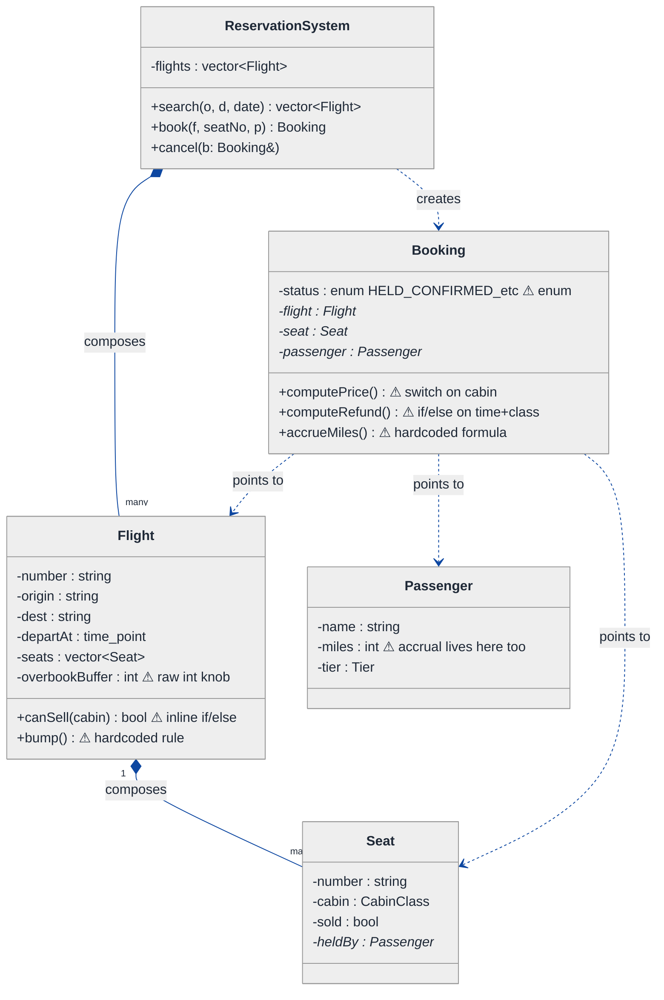
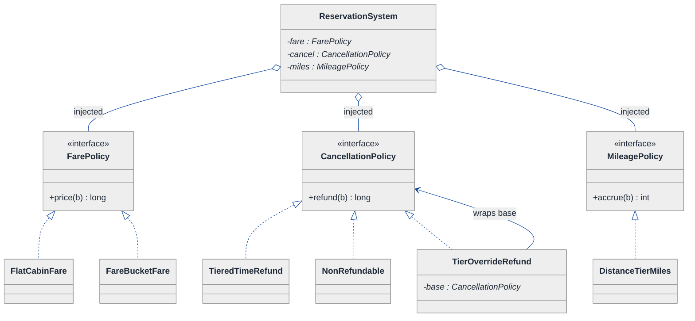
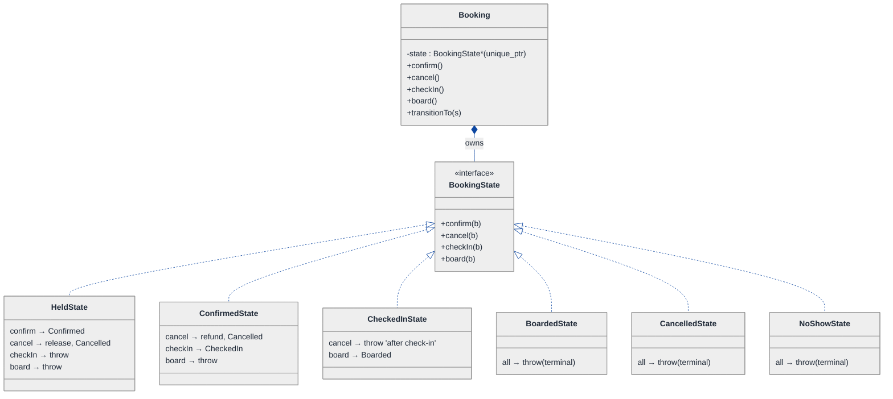
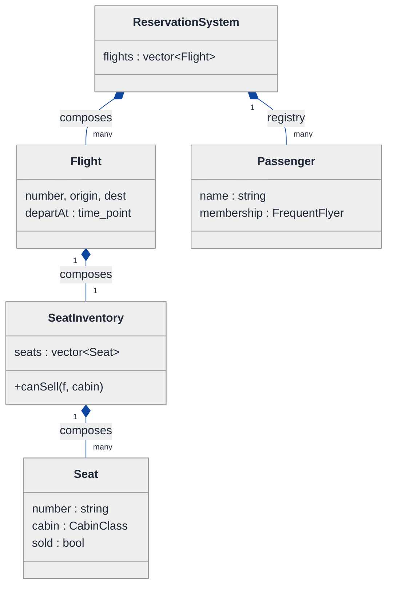
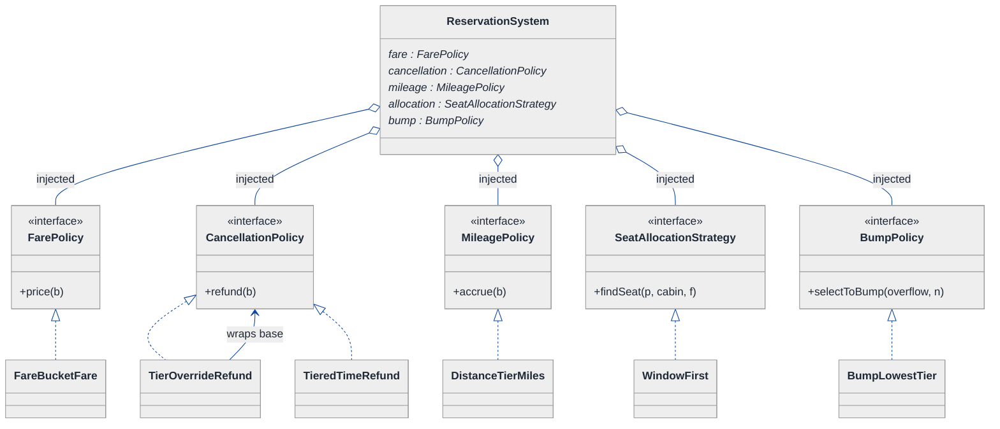
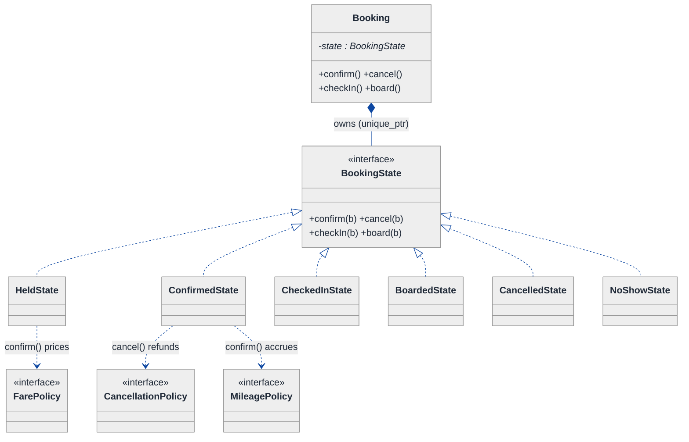
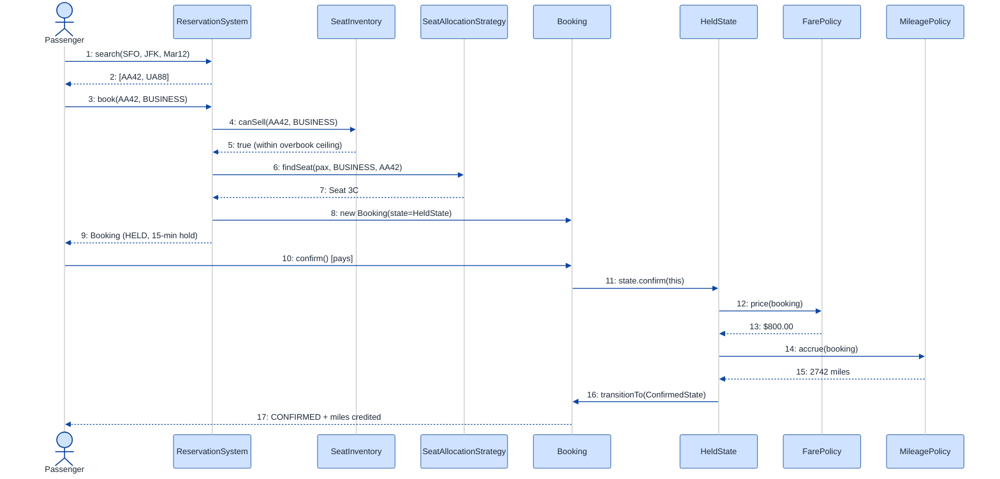
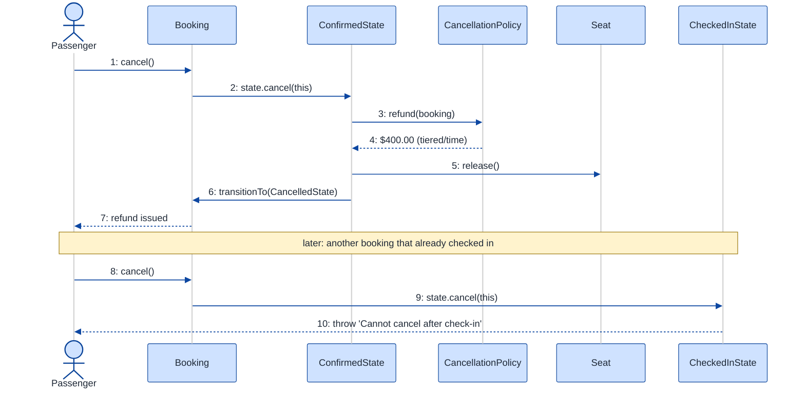

# Airline Reservation System — LLD Walkthrough

> **Difficulty:** Hard · **Time:** ~45 min · **Pattern focus:** Strategy (fare/cancellation/frequent-flyer) + State (booking lifecycle) + inventory (seat allocation, overbooking)
>
> **Problem source(s):** GID SG15, bucket `Strategy_Pattern`. Representative of the "design an airline reservation system" family of LeetLens rows.
>
> **Diagrams:** inline mermaid (renders natively in GitHub / VS Code). Theme block is the repo-canonical block, copied verbatim into every diagram.

---

## How to use this file

Paced for a candidate seeing the airline-reservation question for the first time. Reading time: ~45 minutes if you sketch each iteration by hand. **The lesson: don't reach for design patterns up front — DERIVE them. Build the naive design first, watch it crack under four hypothetical product requirements, then reach for ONE pattern at a time to fix the most painful axis.**

A reservation system is a deceptively rich question because it has THREE distinct kinds of variability tangled together:

- **Algorithm variability** — fare rules, cancellation penalties, frequent-flyer accrual. These are *picked by the caller / config*.
- **Lifecycle variability** — a booking moves HELD → CONFIRMED → CHECKED_IN → CANCELLED. The *object* drives the transitions.
- **Inventory** — seats are a finite, contended resource with overbooking on top. This is plain ownership + an allocation policy.

Telling those three apart is the whole interview.

**Map of this file (15 sections):**

1. Problem statement + clarifying questions
2. Plain-English restatement
3. Why this matters
4. Mental model
5. Try it yourself first
6. Entity & verb extraction
7. **Iteration 1: the naive design** — what we'd write first
8. **Where the naive design hurts** — four future requirements, one painful diff each
9. **Pivot 1: Strategy for fare/cancellation/accrual** — the most painful axis first
10. **Pivot 2: State for the booking lifecycle** — internal transitions, not external swaps
11. **Pivot 3: inventory + overbooking** — allocation Strategy, and where overbooking lives
12. Final class diagram (three sub-views)
13. Skeleton code (C++)
14. Key flow — sequence diagram
15. Extensibility re-check + anti-patterns + how to think aloud + self-check

---

## 1. Problem statement + clarifying questions

**Prompt (typical phrasing):** "Design an airline reservation system with flight search, seat selection (economy, business, first class), booking with passenger details, cancellation policies, a frequent flyer program, and overbooking management."

**Clarifying questions to ask BEFORE drawing anything:**

1. **Search scope?** Single-leg flights only, or multi-leg itineraries with connections? Round-trips? Do we rank results (cheapest, fastest, fewest stops)?
2. **Cabin classes and fare classes?** Three cabins (economy / business / first) is given — but within a cabin are there multiple fare buckets (e.g. economy-saver vs economy-flex) that price and cancel differently?
3. **Cancellation policy granularity?** One refund rule for everyone, or does it vary by fare class, by how far ahead of departure, and by frequent-flyer tier?
4. **Frequent-flyer program?** How are miles earned — distance flown, fare paid, or a tier multiplier? Do tiers (Silver / Gold / Platinum) change pricing, baggage, or boarding priority?
5. **Overbooking?** Do we deliberately sell more seats than exist? If so, what's the policy when too many passengers show up — who gets bumped, and by what rule?
6. **Booking lifecycle?** What states exist — held (unpaid), confirmed (paid), checked-in, boarded, cancelled, no-show? Which transitions are legal?
7. **Payment + holds?** Is a seat held for N minutes during checkout, then auto-released? Is payment in scope or stubbed?
8. **Concurrency?** Two passengers racing for the last business seat — must we guarantee only one wins?

**Assumptions if the interviewer dodges:** single-leg flights with ranked search; three cabins, each with multiple fare buckets; cancellation rules vary by fare class + time-to-departure + tier; miles earned by distance × tier multiplier; deliberate overbooking with a bump policy; lifecycle HELD → CONFIRMED → CHECKED_IN → BOARDED, plus CANCELLED / NO_SHOW; a 15-minute hold during checkout; payment stubbed behind an interface; single-threaded for the core design, concurrency discussed in §15.

---

## 2. Plain-English restatement

We're building the software behind "book a flight." A passenger searches for flights, picks a seat in a cabin, and the system holds it, takes payment, and confirms the booking. Later the passenger may cancel (with a refund computed by some policy), check in, and board — earning frequent-flyer miles along the way. The airline deliberately sells a few more seats than physically exist (overbooking), so the system must manage that risk and decide who gets bumped if everyone shows up. The design must let the business add new fare rules, new cancellation policies, new tier perks, and new lifecycle states **without rewriting the core booking flow**.

---

## 3. Why this matters

This is a senior-bar LLD question because the naive instinct — one `Booking` class with a giant `status` enum and a `computePrice()` method full of `if (cabin == BUSINESS)` — collapses the moment the airline ships its second fare rule. The interviewer is probing whether you can separate the THREE flavors of change: an algorithm the business swaps (Strategy), a lifecycle the booking walks through (State), and a contended inventory with a risk policy on top. The same separation reappears in hotel booking, event ticketing, ride-hailing, and any system that sells a finite, perishable resource. Get the airline right and you can derive the rest.

---

## 4. Mental model

An airline is **an inventory of perishable seats** + **a rule-book** + **a booking that walks a lifecycle**. The seats expire worthless at departure, so the airline overbooks to hedge no-shows. The rule-book (pricing, cancellation, mileage) changes constantly by business decision. The booking is a little state machine that the passenger pushes through events.

```
Real-world sketch (NOT a UML diagram yet):

        ┌─────────────────────────────────────────────┐
        │   Flight AA42  SFO→JFK  Mar 12               │
        │   FIRST    [█][█]                  cap 2      │
        │   BUSINESS [█][□][□][█]            cap 4      │  □ free  █ sold
        │   ECONOMY  [█][█][█][□][□]...      cap 180    │
        │   overbook buffer: +8 economy seats sellable  │
        └───────────────────┬──────────────────────────┘
              search │ hold │ pay │ cancel │ check-in │ board
                     ▼
            ┌──────────────────────────┐
            │ Booking (state machine)  │
            │ HELD → CONFIRMED →       │
            │ CHECKED_IN → BOARDED     │
            │   ↘ CANCELLED  ↘ NO_SHOW │
            └──────────────────────────┘
```

The KEY insight from this picture: seats are **inventory**, the booking is **orchestration through a lifecycle**, and pricing/cancellation/mileage are **policy**. Inventory vs. lifecycle vs. policy is the separation we'll bake into the design.

---

## 5. Try it yourself first

> **Predict before reading on:**
>
> 1. List 6 nouns you'd promote to a class. List 3 nouns you'd leave as fields.
> 2. **If I told you the airline will ship four cancellation policies in its first year (full-refund, 24-hour-free, tiered-penalty, non-refundable), what would change about how you write the `Booking` class?**
> 3. Overbooking means you can SELL more seats than exist but only BOARD as many as exist. Where does the "you may sell" check live, and where does the "who gets bumped" decision live? Are they the same object?

---

## 6. Entity & verb extraction

> **Mini-refresher: noun → class, but not every noun.**
>
> Naive OOD promotes every noun to a class. Senior OOD promotes a noun only if it has both BEHAVIOR and STATE that need to live together. "CabinClass" is usually an `enum class` (it has no behavior of its own); "Booking" becomes a class because it has lifecycle behavior; "FarePolicy" becomes a class because it has behavior that varies.

**Nouns from the prompt:**

| Noun | Decision | Why |
|---|---|---|
| Flight | Class | Has a route, a departure time, and owns the seat inventory |
| Seat | Class | Has a number, a cabin, an occupancy flag; can be held / sold / released |
| CabinClass | `enum class` (ECONOMY / BUSINESS / FIRST) | A typed tag; no behavior of its own |
| Booking | Class | Lifecycle behavior + the unit a passenger holds |
| Passenger | Class | Identity + frequent-flyer membership |
| FrequentFlyer | Class (membership) | Holds miles balance + tier; accrues over bookings |
| Itinerary / SearchResult | Class (value object) | A ranked list of flights matching a query |
| ReservationSystem | Class (top-level coordinator) | Owns flights, orchestrates search/book/cancel |
| Money / Miles | Field types (`long` cents, `int` miles) | No domain behavior beyond arithmetic |
| Route (origin, dest) | Field on Flight (or small value struct) | Data, not behavior |

**Verbs (and the class they live on):**

| Verb | Owner class (naive answer — we'll re-examine) |
|---|---|
| search(origin, dest, date) | ReservationSystem |
| book(flight, seat, passenger) | ReservationSystem |
| computePrice(booking) | Booking (naive) → FarePolicy (later) |
| cancel(booking) | Booking (naive) → CancellationPolicy decides refund (later) |
| computeRefund(booking) | Booking (naive) → CancellationPolicy (later) |
| accrueMiles(booking) | Booking (naive) → MileagePolicy (later) |
| hold() / confirm() / checkIn() / board() | Booking (naive enum) → TicketState (later) |
| canSell(cabin) / assignSeat() | Flight / SeatInventory |
| bump(flight) | Flight (naive) → OverbookingPolicy (later) |

**We have NOT introduced any design patterns yet.** Pure nouns + verbs.

---

## 7. <a id="iter-1"></a>Iteration 1: the naive design

Let's write the simplest thing that could possibly work. No design patterns — just classes with methods, enums, and `if/else`.



**Reader's tour (read top to bottom; ~60 seconds).**

1. **`ReservationSystem` is the root.** It holds `flights` and exposes `search`, `book`, `cancel`. Notice: NO injected policies. Every decision lives inside these methods or inside `Booking`.

2. **The composition spine (down the left).** The filled-diamond arrows mark composition — strong ownership / same lifetime. The system composes `Flight[]`; each Flight composes `Seat[]`. Kill the system, every flight and seat dies with it. This part of the design is sound and won't change.

3. **`Flight` carries the overbooking knob inline.** `overbookBuffer` is a raw int, and `canSell()` / `bump()` bake the policy into `if/else`. That's two warning markers already.

4. **`Passenger` accidentally owns mileage accrual.** `miles` lives here AND the accrual formula leaks into `Booking::accrueMiles()`. Responsibility is smeared across two classes.

5. **The `Booking` box — the trouble zone.** Four warning markers (⚠):
   - `status` is an enum. Fine for 4 states; will break the moment a transition needs state-specific *behavior* (§8 change C).
   - `computePrice()` is a `switch` on cabin. Every fare rule means surgery here.
   - `computeRefund()` is an `if/else` on time-to-departure and fare class. Every cancellation policy means more branches.
   - `accrueMiles()` hardcodes one formula. Tier multipliers, promo bonuses → more branches.

Each warning is a future-pain entry point. §8 turns each into a concrete future requirement that exposes the brittleness.

**What's deliberately missing.** No `FarePolicy`. No `CancellationPolicy`. No `MileagePolicy`. No `BookingState`. No `SeatAllocationStrategy`. No `OverbookingPolicy`. The naive design doesn't even *acknowledge* these are axes of variation — it bakes a hardcoded answer for each into the method that uses it.

Skeleton code for the naive design (C++):

```cpp
#include <chrono>
#include <stdexcept>
#include <string>
#include <vector>

enum class CabinClass    { ECONOMY, BUSINESS, FIRST };
enum class Tier          { NONE, SILVER, GOLD, PLATINUM };
enum class BookingStatus { HELD, CONFIRMED, CHECKED_IN, BOARDED, CANCELLED, NO_SHOW };

class Passenger {
public:
    std::string name;
    int   miles = 0;          // accrual smeared in here
    Tier  tier  = Tier::NONE;
};

class Seat {
public:
    Seat(std::string no, CabinClass c) : number_(std::move(no)), cabin_(c) {}
    bool       sold()  const { return sold_; }
    CabinClass cabin() const { return cabin_; }
    void sell(Passenger* p)  { heldBy_ = p; sold_ = true; }
    void release()           { heldBy_ = nullptr; sold_ = false; }
private:
    std::string number_;
    CabinClass  cabin_;
    bool        sold_ = false;
    Passenger*  heldBy_ = nullptr;
};

class Flight {
public:
    std::string number, origin, dest;
    std::chrono::system_clock::time_point departAt;
    std::vector<Seat> seats;
    int overbookBuffer = 0;                 // raw knob

    bool canSell(CabinClass c) const {       // inline policy — will hurt
        int cap = 0, sold = 0;
        for (const auto& s : seats) if (s.cabin() == c) { ++cap; if (s.sold()) ++sold; }
        if (c == CabinClass::ECONOMY) cap += overbookBuffer;  // only economy overbooked
        return sold < cap;
    }
};

class Booking {
public:
    BookingStatus status = BookingStatus::HELD;
    Flight*    flight;
    Seat*      seat;
    Passenger* passenger;

    long computePrice() const {              // switch on cabin — will hurt
        switch (seat->cabin()) {
            case CabinClass::ECONOMY:  return 20000;   // $200.00 in cents
            case CabinClass::BUSINESS: return 80000;
            case CabinClass::FIRST:    return 150000;
        }
        return 0;
    }
    long computeRefund() const {             // if/else on time + class — will hurt
        // hours until departure
        auto hrs = std::chrono::duration_cast<std::chrono::hours>(
                       flight->departAt - std::chrono::system_clock::now()).count();
        long price = computePrice();
        if (seat->cabin() == CabinClass::FIRST) return price;          // first = full refund
        if (hrs > 24) return price;                                    // >24h = full
        if (hrs > 2)  return price / 2;                                // 2-24h = half
        return 0;                                                      // <2h = none
    }
    int accrueMiles() const {                // hardcoded formula — will hurt
        int base = 500;
        if (passenger->tier == Tier::GOLD)     base = base * 2;
        if (passenger->tier == Tier::PLATINUM) base = base * 3;
        return base;
    }
};

class ReservationSystem {
public:
    explicit ReservationSystem(std::vector<Flight> f) : flights_(std::move(f)) {}

    Booking book(Flight& f, const std::string& seatNo, Passenger& p) {
        if (!f.canSell(/* cabin of seatNo */ CabinClass::ECONOMY))
            throw std::runtime_error("Sold out");
        for (auto& s : f.seats) {
            if (/* s.number == seatNo && */ !s.sold()) {
                s.sell(&p);
                Booking b; b.flight = &f; b.seat = &s; b.passenger = &p;
                b.status = BookingStatus::CONFIRMED;       // assume instant pay
                p.miles += b.accrueMiles();
                return b;
            }
        }
        throw std::runtime_error("Seat unavailable");
    }

    void cancel(Booking& b) {
        if (b.status == BookingStatus::BOARDED)            // scattered guard
            throw std::runtime_error("Already boarded");
        long refund = b.computeRefund();
        b.seat->release();
        b.passenger->miles -= b.accrueMiles();             // claw back miles
        b.status = BookingStatus::CANCELLED;
        (void)refund;  // issue refund elided
    }
private:
    std::vector<Flight> flights_;
};
```

**This works.** It has zero design patterns. We can search, book, cancel, accrue miles, and overbook economy. So what's wrong with it?

---

## 8. <a id="naive-pain"></a>Where the naive design hurts

The interviewer slides a piece of paper across the desk: "Here are four requirements coming next quarter. Walk me through what changes."

### Change A: "Add fare buckets — economy-saver (cheap, non-refundable) vs economy-flex (pricey, free cancel)"

In the naive design:
- `Booking::computePrice()` switches on `CabinClass`, but now price depends on a *fare bucket within* a cabin. The `switch` can't express it — you add a nested `if (bucket == SAVER) ...`.
- `Booking::computeRefund()` ALSO must branch on bucket (saver = no refund, flex = full).
- **One product change touches `computePrice` AND `computeRefund`, and both grow a second dimension of branching.**

### Change B: "Tiered cancellation — Platinum members always get a full refund; everyone else by time-to-departure"

In the naive design:
- `computeRefund()` already branches on cabin and time; now add tier.
- The method becomes a 20-line truth table of `cabin × bucket × hours × tier`.
- **Every new cancellation rule is another clause in the same monstrous method. Three rules in and nobody can read it.**

### Change C: "Add a NO_SHOW flow and a CHECKED_IN → BOARDED gate; you cannot cancel after check-in, and boarding a no-show is illegal"

In the naive design:
- `BookingStatus` enum grows, but the real problem is *behavior per state*. Right now `cancel()` has one scattered guard (`if status == BOARDED`). Now we need: cancel illegal after CHECKED_IN; board illegal from HELD; no-show only reachable from CONFIRMED at departure.
- **You sprinkle `if (status == X)` guards across `cancel()`, `checkIn()`, `board()` — the transition matrix becomes N² checks scattered across files.**

### Change D: "Overbooking now applies to business class too, and the bump rule must prefer bumping the lowest-tier passenger (not last-booked)"

In the naive design:
- `Flight::canSell()` hardcodes "only economy overbooked." Add business → edit the method.
- There's no `bump()` worth the name — the bump RULE (who loses their seat) doesn't exist as a swappable thing. Adding "lowest-tier first" means writing it inline in `Flight`.
- **Overbooking policy (how many to oversell) and bump policy (who to bump) are two different decisions, both buried in `Flight`.**

### The pattern of pain

| Change | Files touched | Smell |
|---|---|---|
| A. Fare buckets | `Booking::computePrice` + `Booking::computeRefund` | "Pricing logic grows a second dimension inside one switch." |
| B. Tiered cancellation | `Booking::computeRefund` (monstrous) | "A single method accumulates every refund rule." |
| C. No-show / boarding gate | `cancel()` + `checkIn()` + `board()` guards | "Status enum + scattered guards can't express legal transitions." |
| D. Business overbooking + bump rule | `Flight::canSell` + new inline bump | "Two distinct policies hardcoded in the inventory class." |

**Three axes of pain dominate:** algorithm variability (fare, cancellation, mileage), lifecycle variability (booking state), and inventory policy (overbooking + bump).

> **Pivot question:** "What pattern handles 'an algorithm that varies, swapped by the business'? What pattern handles 'a lifecycle with state-specific legality'? And where does a contended-inventory risk policy live?"
>
> The answers are Strategy, State, and (for the last) a small allocation/overbooking Strategy owned by the inventory. Let's introduce them one at a time, starting with the most painful axis: the fare/cancellation/mileage tangle.

---

## 9. <a id="pivot-1"></a>Pivot 1: Strategy for fare, cancellation, and mileage

> **Mini-refresher: Strategy pattern.**
>
> Encapsulates an algorithm behind an interface so it can be swapped at runtime. The CALLER (or config) decides which strategy to use; the strategy doesn't know about its peers.
>
> Quick example: a `Sorter` takes a `CompareStrategy*` in its constructor. Pass `AscendingCompare` or `DescendingCompare` — the sorter doesn't care which.

**Why Strategy fits all three.** Each of fare, cancellation, and mileage is *an algorithm that varies, chosen by business policy, not by the booking itself*:

- **Fare** = `given (flight, seat, passenger) → price`. Varies: flat, fare-bucket, dynamic/demand-based, promotional.
- **Cancellation** = `given booking → refund amount`. Varies: full-refund, tiered-by-time, non-refundable, tier-override.
- **Mileage** = `given booking → miles earned`. Varies: flat, distance × tier multiplier, double-miles promo.

The booking does NOT pick these — the airline's configuration does. That's textbook Strategy. Note all three are *separate* Strategy hierarchies: they take different inputs and return different things; they share the *role* "swappable algorithm," not a type.

**The refactor (just the affected part):**

```cpp
class Booking;  // forward — defined in Pivot 2

// ---- Fare ----
class FarePolicy {
public:
    virtual ~FarePolicy() = default;
    virtual long price(const Booking& b) const = 0;   // cents
};
class FlatCabinFare : public FarePolicy {             // the old switch, isolated
public:
    long price(const Booking& b) const override;      // by cabin
};
class FareBucketFare : public FarePolicy {            // Change A lands here
public:
    long price(const Booking& b) const override;      // by cabin + bucket
};

// ---- Cancellation ----
class CancellationPolicy {
public:
    virtual ~CancellationPolicy() = default;
    virtual long refund(const Booking& b) const = 0;
};
class TieredTimeRefund : public CancellationPolicy {  // by hours-to-departure
public:
    long refund(const Booking& b) const override;
};
class NonRefundable : public CancellationPolicy {
public:
    long refund(const Booking&) const override { return 0; }
};
// Decorator-style override: Platinum always full refund, else delegate (Change B)
class TierOverrideRefund : public CancellationPolicy {
public:
    TierOverrideRefund(Tier minFull, std::unique_ptr<CancellationPolicy> base)
        : minFull_(minFull), base_(std::move(base)) {}
    long refund(const Booking& b) const override;     // if tier>=minFull_ return price else base_
private:
    Tier minFull_;
    std::unique_ptr<CancellationPolicy> base_;
};

// ---- Mileage ----
class MileagePolicy {
public:
    virtual ~MileagePolicy() = default;
    virtual int accrue(const Booking& b) const = 0;
};
class DistanceTierMiles : public MileagePolicy {
public:
    int accrue(const Booking& b) const override;      // miles_flown * tierMultiplier
};
```

The booking no longer owns `computePrice`, `computeRefund`, or `accrueMiles`. Those methods are GONE from `Booking`; the algorithms moved out into their own hierarchies, injected into the `ReservationSystem` (or attached to the flight's fare class — a clarifying-question call).

**What changed — visualized.** Just the policy slice:



**Tour of the after-state.**

1. **ReservationSystem gained three injected pointers.** One per algorithm axis — `fare`, `cancel`, `miles`. The OPEN diamond (`◇`) marks aggregation: the system uses them but they're handed in at construction, not `new`ed internally.

2. **Three independent `<<interface>>` boxes.** Each is an abstract base with a single virtual method whose contract is narrow: take a `Booking`, return one number. Nothing else leaks across the boundary.

3. **Concrete families below each interface.**
   - Fare: `FlatCabinFare` (the old switch, isolated) and `FareBucketFare` (Change A — adds the bucket dimension *inside its own class*, touching nothing else).
   - Cancellation: `TieredTimeRefund`, `NonRefundable`, and `TierOverrideRefund` — a DECORATOR (note the `wraps base` arrow). It returns a full refund for Platinum and otherwise delegates to whatever policy it wraps. Change B lands as this one new decorator.
   - Mileage: `DistanceTierMiles`.

4. **Powerful consequence.** Cancellation composes: `TierOverrideRefund(PLATINUM, TieredTimeRefund())` means "Platinum → full refund; everyone else → tiered by time." The naive design couldn't express that without nested `if`.

5. **Booking's surface SHRANK.** Three methods left the class. The booking now keeps only its lifecycle (which we fix in Pivot 2).

**Changes A and B from §8 now land cleanly.** Fare buckets → new `FareBucketFare`. Tiered cancellation → new `TierOverrideRefund` decorator. No surgery in `Booking`.

**Pattern-discrimination cheatsheet — Strategy vs Template Method.**
- *Strategy:* the whole algorithm is one swappable object, chosen at runtime via composition; variants can be combined (decorators).
- *Template Method:* the algorithm skeleton lives in a base class; subclasses fill in hooks via inheritance; variants are fixed at compile time and cannot be combined.
- *Rule of thumb:* variants you might combine or swap by config → Strategy. A fixed skeleton with 2-3 stable steps → Template Method.

We chose Strategy because cancellation rules COMPOSE (tier-override × tiered-time) and the business swaps them by config — neither is expressible with Template Method subclasses.

---

## 10. <a id="pivot-2"></a>Pivot 2: State for the booking lifecycle

Change C from §8 is still painful — the NO_SHOW flow, the CHECKED_IN → BOARDED gate, and "cancel illegal after check-in." A Strategy doesn't help because the variability is not in an ALGORITHM; it's in WHAT'S LEGAL NEXT. That's a lifecycle, and the booking itself drives it.

> **Mini-refresher: State pattern.**
>
> Each lifecycle state is its own class. The context object delegates events (`cancel()`, `checkIn()`, `board()`) to its CURRENT state object, and THE STATE decides the next state. Transitions are INTERNAL, driven by the events the context receives — not chosen by an outside caller.

**Why State (not Strategy).** Nobody outside picks "the booking is now CHECKED_IN." It got there because the passenger checked in from CONFIRMED. An ACTIVE/HELD booking can `confirm()`; a CONFIRMED booking can `cancel()` or `checkIn()`; a CHECKED_IN booking can `board()` but NOT `cancel()`; a BOARDED booking is terminal. Calling `cancel()` on a CHECKED_IN booking isn't a refund edge case — it's *illegal* and should fail loudly. The legality table is the OBJECT'S concern.

**The refactor (just the lifecycle part):**

```cpp
class Booking;  // forward

class BookingState {
public:
    virtual ~BookingState() = default;
    virtual void confirm(Booking& b)  = 0;
    virtual void cancel(Booking& b)   = 0;   // CancellationPolicy invoked from the legal states
    virtual void checkIn(Booking& b)  = 0;
    virtual void board(Booking& b)    = 0;
    virtual const char* name() const  = 0;
};

class HeldState : public BookingState {       // unpaid hold, auto-expires
public:
    void confirm(Booking& b) override;        // payment ok → ConfirmedState
    void cancel(Booking& b)  override;        // release seat, no charge → CancelledState
    void checkIn(Booking&)   override { throw std::runtime_error("Pay before check-in"); }
    void board(Booking&)     override { throw std::runtime_error("Not checked in"); }
    const char* name() const override { return "HELD"; }
};

class ConfirmedState : public BookingState {
public:
    void confirm(Booking&)   override { throw std::runtime_error("Already confirmed"); }
    void cancel(Booking& b)  override;        // refund via policy, release seat → CancelledState
    void checkIn(Booking& b) override;        // → CheckedInState
    void board(Booking&)     override { throw std::runtime_error("Check in first"); }
    const char* name() const override { return "CONFIRMED"; }
};

class CheckedInState : public BookingState {
public:
    void confirm(Booking&)   override { throw std::runtime_error("Already confirmed"); }
    void cancel(Booking&)    override { throw std::runtime_error("Cannot cancel after check-in"); }
    void checkIn(Booking&)   override { throw std::runtime_error("Already checked in"); }
    void board(Booking& b)   override;        // → BoardedState
    const char* name() const override { return "CHECKED_IN"; }
};

class BoardedState  : public BookingState { /* terminal — every event throws; elided */ };
class CancelledState: public BookingState { /* terminal — every event throws; elided */ };
class NoShowState   : public BookingState { /* terminal — every event throws; elided */ };

class Booking {
public:
    Booking(ReservationSystem& sys, Flight& f, Seat& s, Passenger& p)
        : sys_(sys), flight_(f), seat_(s), passenger_(p),
          state_(std::make_unique<HeldState>()) {}

    void transitionTo(std::unique_ptr<BookingState> s) { state_ = std::move(s); }

    void confirm() { state_->confirm(*this); }
    void cancel()  { state_->cancel(*this); }
    void checkIn() { state_->checkIn(*this); }
    void board()   { state_->board(*this); }

    // getters used by states + policies (elided): sys(), flight(), seat(), passenger() ...
private:
    ReservationSystem&            sys_;
    Flight&                       flight_;
    Seat&                         seat_;
    Passenger&                    passenger_;
    std::unique_ptr<BookingState> state_;
};

// transitions live WITH the state (deferred until Booking is complete):
inline void ConfirmedState::cancel(Booking& b) {
    long refund = b.sys().cancellation().refund(b);
    b.seat().release();
    // issue refund(refund) elided
    b.transitionTo(std::make_unique<CancelledState>());
}
inline void ConfirmedState::checkIn(Booking& b) {
    b.transitionTo(std::make_unique<CheckedInState>());
}
inline void CheckedInState::board(Booking& b) {
    b.transitionTo(std::make_unique<BoardedState>());
}
```

**What changed — visualized.** Just the lifecycle slice:



**Tour of the after-state.**

1. **The `BookingStatus` enum is gone.** Replaced by a `state` field of type `std::unique_ptr<BookingState>` — exclusive ownership.

2. **Booking's four lifecycle methods became one-liners.** `confirm/cancel/checkIn/board` each just delegate to the current state. **NO `if (status == X)` branching anywhere.**

3. **The interface declares the contract.** `BookingState` has four pure-virtual events. Each concrete state must implement all four, even when the answer is "throw" — e.g. `CheckedInState::cancel` throws "Cannot cancel after check-in," which is exactly Change C's requirement, encoded as a *method body* instead of a scattered guard.

4. **Six concrete states.** `HeldState` (unpaid, auto-expiring), `ConfirmedState` (the busy one — cancel runs the refund policy, checkIn advances), `CheckedInState` (can board, cannot cancel), and three terminal states (`BoardedState`, `CancelledState`, `NoShowState`) where every event throws.

5. **Transitions live WITH the state.** Each state body calls `b.transitionTo(...)` when its work is done. The legality table IS the class hierarchy — there is no transition matrix anywhere else.

**Adding the no-show flow is one new class plus one transition.** `NoShowState` already exists as terminal; the only edit is letting a sweep job call a `markNoShow()` event on `ConfirmedState` at departure. No edits to the other states, to `Booking`, or to `ReservationSystem`. Open/closed.

**Pattern-discrimination cheatsheet — Strategy vs State.**
- *Strategy:* the CALLER picks which one to use (`sys.setFarePolicy(x)`); strategies are usually unaware of each other.
- *State:* the OBJECT picks its next state internally (`b.checkIn()` flips HELD-illegal vs CONFIRMED-legal); states know about each other (each `transitionTo`s a sibling).
- *Rule of thumb:* swap happens because external code/config says so → Strategy. Swap happens because of an internal event flow → State.

---

## 11. <a id="pivot-3"></a>Pivot 3: inventory + overbooking

Changes A, B, C are solved. Change D — business-class overbooking plus a "bump the lowest tier first" rule — is not. And it's a *different* kind of variability from both Strategy-the-algorithm and State-the-lifecycle: it's about a **contended, finite resource** with a **risk policy** on top.

The crucial realization: there are **two separate decisions** buried in the naive `Flight`:

1. **"May I sell another seat in cabin C?"** — the OVERBOOKING decision (how many to oversell per cabin). This is a small Strategy.
2. **"Too many passengers showed up — who loses their seat?"** — the BUMP decision (selection rule). This is a *different* small Strategy.

Conflating them was the smell. We split them, and we also pull seat-finding into its own allocation Strategy (same shape as Parking Lot's spot assignment) so search/booking can rank seats by a swappable rule.

> **Mini-refresher: why inventory is not "just another Strategy."**
>
> The seats themselves are plain composition (Flight owns Seat[]) — that part doesn't change. What varies is the *policy* layered over the inventory: how aggressively to oversell, how to pick a seat, who to bump. Each of those is a Strategy, but the *resource* stays a simple owned collection with an occupancy invariant. Keep the data dumb and the policy swappable.

```cpp
// How many seats may we sell in a cabin? (oversell buffer per cabin)
class OverbookingPolicy {
public:
    virtual ~OverbookingPolicy() = default;
    virtual int sellableCapacity(const Flight& f, CabinClass c) const = 0;  // physical + buffer
};
class NoOverbooking      : public OverbookingPolicy { /* returns physical capacity */ };
class PercentBuffer      : public OverbookingPolicy {  // Change D: configurable per cabin
public:
    explicit PercentBuffer(double pct) : pct_(pct) {}
    int sellableCapacity(const Flight& f, CabinClass c) const override; // physical * (1+pct_)
private:
    double pct_;
};

// When oversold and everyone shows up — who gets bumped?
class BumpPolicy {
public:
    virtual ~BumpPolicy() = default;
    virtual std::vector<Booking*> selectToBump(std::vector<Booking*> overflow, int n) const = 0;
};
class BumpLastBooked   : public BumpPolicy { /* original naive rule */ };
class BumpLowestTier   : public BumpPolicy {  // Change D: lowest FF tier first
public:
    std::vector<Booking*> selectToBump(std::vector<Booking*> overflow, int n) const override;
};

// Which free seat to give a passenger? (ranking)
class SeatAllocationStrategy {
public:
    virtual ~SeatAllocationStrategy() = default;
    virtual Seat* findSeat(const Passenger& p, CabinClass c, Flight& f) = 0;
};
class WindowFirst   : public SeatAllocationStrategy { /* prefer window seats */ };
class TogetherBlock : public SeatAllocationStrategy { /* group adjacency */ };

// SeatInventory owns the seats + enforces the sell invariant using the overbooking policy.
class SeatInventory {
public:
    SeatInventory(std::vector<Seat> seats, std::unique_ptr<OverbookingPolicy> ob)
        : seats_(std::move(seats)), overbooking_(std::move(ob)) {}

    bool canSell(const Flight& f, CabinClass c) const {
        int sold = soldCount(c);
        return sold < overbooking_->sellableCapacity(f, c);   // policy decides the ceiling
    }
    // soldCount, sell, release, iteration elided
private:
    std::vector<Seat>                  seats_;
    std::unique_ptr<OverbookingPolicy> overbooking_;
};
```

**The lesson.** Once we recognized "an algorithm picked by config" as the shape in Pivot 1, the same shape applied to *three more* axes here — overbooking, bump selection, seat allocation. Change D lands as `PercentBuffer` (oversell business too) + `BumpLowestTier` (new bump rule). **Two new classes, zero edits to `Flight` or `SeatInventory`.** Pattern recognition makes the later axes cheap.

> **Pattern-discrimination cheatsheet — Strategy vs Chain of Responsibility (for the bump rule).**
> - *Strategy (chosen):* one `BumpPolicy` decides the entire selection in one call. Right when the rule is a single, total ordering ("lowest tier first").
> - *Chain of Responsibility:* a sequence of handlers, each removing some candidates and passing the rest on. Right when bumping is multi-stage ("first volunteers, then no-checked-bag, then lowest tier").
> - *Rule of thumb:* one self-contained decision → Strategy. A pipeline of partial filters → Chain. We picked Strategy; if the airline's bump policy becomes multi-stage, wrap several Strategies in a Chain.

---

## 12. <a id="fig-class-diagram"></a>Final class diagram

One diagram for the whole system is a wall of boxes. Here are **three focused sub-views**, each addressing one concern. Read them in order; the structural insight at the end ties them together.

### 12.1 The inventory spine — what the system OWNS



**Tour of 12.1.** The filled diamonds (`◆`) mark composition — same lifetime. The system owns flights; each flight owns one `SeatInventory`; the inventory owns its seats. This spine barely changed from the naive design — inventory was always plain ownership. The only structural addition is extracting `SeatInventory` from `Flight` so the overbooking policy has a clear home (see 12.2). `Passenger` is held in a registry so frequent-flyer balances persist across bookings.

### 12.2 The policy injection — what the system USES



**Tour of 12.2.**

1. **One ReservationSystem, five injected Strategy interfaces.** One pointer per algorithm axis — fare, cancellation, mileage, seat allocation, bump. All INJECTED at construction; the system never `new`s a policy itself.

2. **Open diamonds (`◇`) mark AGGREGATION** — "I use this but don't own its lifecycle," the formal contrast with the filled-diamond composition in 12.1.

3. **Each interface has a small concrete family.** Note `TierOverrideRefund` wraps a `base : CancellationPolicy*` (the decorator), so cancellation rules stack. `OverbookingPolicy` lives one level down on `SeatInventory` (shown in 12.1's box / §13), not here, because the oversell ceiling is an inventory concern, not a system-wide one.

4. **The structural insight.** Every axis the naive design hardcoded inside `Flight` and `Booking` is now a swappable policy. **The system's core becomes orchestration; the variation becomes hot-swap config.**

### 12.3 The lifecycle and the cooperating policies — Booking's State pattern



**Tour of 12.3.**

1. **Booking holds ONE `BookingState` pointer** (filled diamond / `unique_ptr` — exclusive ownership). On transition, the booking swaps the pointer for a new state object.

2. **Booking's four events are one-liners** that delegate to the current state. **No status-switch anywhere on Booking.**

3. **Six concrete states** hang off the interface — each self-contained, each knowing what's legal in its phase and where it transitions next. `BoardedState`, `CancelledState`, `NoShowState` are terminal.

4. **The Strategies are NOT stored on the states.** Look at the dotted dependency arrows: `HeldState::confirm` reaches the FarePolicy and MileagePolicy through the booking's `sys()`; `ConfirmedState::cancel` reaches the CancellationPolicy the same way. The state *uses* the policies but doesn't *own* them — the system does.

5. **The cooperation moment.** `HeldState::confirm` prices via FarePolicy, charges, accrues via MileagePolicy, and `transitionTo(ConfirmedState)`. Three actors (the booking's state, the system's fare policy, the system's mileage policy) meet in one method — exactly the kind of multi-pattern handoff §14 traces step by step.

### Structural insight (ties 12.1 + 12.2 + 12.3 together)

| Concern | Pattern used | Why |
|---|---|---|
| **Inventory** (Flight, SeatInventory, Seat, Passenger) | Plain ownership + minimal data | Seats are a finite resource; CabinClass is an enum, not a hierarchy |
| **Policy** (fare, cancellation, mileage, allocation, bump) | Strategy, INJECTED into the system | Business/config picks the variant; some compose via decorators |
| **Lifecycle** (Held → Confirmed → CheckedIn → Boarded / Cancelled / NoShow) | State, OWNED by Booking | The booking controls transitions; each state validates what's legal next |
| **Overbooking ceiling** (sell more than physical) | Strategy, OWNED by SeatInventory | Oversell aggressiveness is an inventory-level knob, not a booking concern |

The big lesson: **inheritance is used only for the State and Strategy class families** — every "varies independently" axis is composition over an interface, and the seat inventory stays dumb data with a swappable ceiling. *Inheritance for behavior families, composition for variation, plain ownership for the resource.* That separation is what makes the design extensible.

---

## 13. Skeleton code (C++)

> Show the SHAPES, not the full impl. ~130 lines.

```cpp
#include <chrono>
#include <memory>
#include <stdexcept>
#include <string>
#include <vector>

// ── Forward declarations ────────────────────────────────────────────
class Booking;
class Flight;
class ReservationSystem;

// ── Enums + small value types ───────────────────────────────────────
enum class CabinClass { ECONOMY, BUSINESS, FIRST };
enum class Tier       { NONE, SILVER, GOLD, PLATINUM };

class FrequentFlyer {
public:
    int   miles = 0;
    Tier  tier  = Tier::NONE;
    void add(int m)   { miles += m; if (miles > 100000) tier = Tier::PLATINUM; }  // tier recalc elided
};

class Passenger {
public:
    explicit Passenger(std::string name) : name_(std::move(name)) {}
    const std::string& name() const { return name_; }
    FrequentFlyer&      membership() { return ff_; }
private:
    std::string   name_;
    FrequentFlyer ff_;
};

// ── Inventory ───────────────────────────────────────────────────────
class Seat {
public:
    Seat(std::string no, CabinClass c) : number_(std::move(no)), cabin_(c) {}
    bool        sold()  const { return sold_; }
    CabinClass  cabin() const { return cabin_; }
    void sell()    { sold_ = true; }
    void release() { sold_ = false; }
private:
    std::string number_;
    CabinClass  cabin_;
    bool        sold_ = false;
};

class OverbookingPolicy {                       // how many we may SELL per cabin
public:
    virtual ~OverbookingPolicy() = default;
    virtual int sellableCapacity(const Flight& f, CabinClass c) const = 0;
};
// NoOverbooking / PercentBuffer elided — see Pivot 3

class SeatInventory {
public:
    SeatInventory(std::vector<Seat> seats, std::unique_ptr<OverbookingPolicy> ob)
        : seats_(std::move(seats)), overbooking_(std::move(ob)) {}
    bool canSell(const Flight& f, CabinClass c) const;   // sold(c) < overbooking_->sellableCapacity
    Seat* firstFree(CabinClass c);                       // helper for allocation
    // soldCount, release elided
private:
    std::vector<Seat>                  seats_;
    std::unique_ptr<OverbookingPolicy> overbooking_;
};

class Flight {
public:
    Flight(std::string num, std::string o, std::string d,
           std::chrono::system_clock::time_point dep, SeatInventory inv)
        : number_(std::move(num)), origin_(std::move(o)), dest_(std::move(d)),
          departAt_(dep), inventory_(std::move(inv)) {}
    SeatInventory& inventory() { return inventory_; }
    auto departAt() const { return departAt_; }
    // getters elided
private:
    std::string number_, origin_, dest_;
    std::chrono::system_clock::time_point departAt_;
    SeatInventory inventory_;
};

// ── Strategy interfaces (one per axis of variation) ─────────────────
class FarePolicy          { public: virtual ~FarePolicy() = default;
                             virtual long price(const Booking&) const = 0; };
class CancellationPolicy  { public: virtual ~CancellationPolicy() = default;
                             virtual long refund(const Booking&) const = 0; };
class MileagePolicy       { public: virtual ~MileagePolicy() = default;
                             virtual int  accrue(const Booking&) const = 0; };
class SeatAllocationStrategy { public: virtual ~SeatAllocationStrategy() = default;
                               virtual Seat* findSeat(const Passenger&, CabinClass, Flight&) = 0; };
class BumpPolicy          { public: virtual ~BumpPolicy() = default;
                             virtual std::vector<Booking*> selectToBump(std::vector<Booking*>, int) const = 0; };
// concrete impls elided — see Pivots 1 & 3

// ── State pattern (booking lifecycle) ───────────────────────────────
class BookingState {
public:
    virtual ~BookingState() = default;
    virtual void confirm(Booking&) = 0;
    virtual void cancel(Booking&)  = 0;
    virtual void checkIn(Booking&) = 0;
    virtual void board(Booking&)   = 0;
};
class HeldState : public BookingState {
public:
    void confirm(Booking& b) override;                               // prices, charges, accrues → Confirmed
    void cancel(Booking& b)  override;                               // release, no charge → Cancelled
    void checkIn(Booking&) override { throw std::runtime_error("Pay first"); }
    void board(Booking&)   override { throw std::runtime_error("Not checked in"); }
};
class ConfirmedState : public BookingState {
public:
    void confirm(Booking&)   override { throw std::runtime_error("Already confirmed"); }
    void cancel(Booking& b)  override;                               // refund via policy → Cancelled
    void checkIn(Booking& b) override;                               // → CheckedIn
    void board(Booking&)     override { throw std::runtime_error("Check in first"); }
};
// CheckedInState / BoardedState / CancelledState / NoShowState elided — terminal or near-terminal

// ── Booking (context) ───────────────────────────────────────────────
class Booking {
public:
    Booking(ReservationSystem& sys, Flight& f, Seat& s, Passenger& p)
        : sys_(sys), flight_(f), seat_(s), passenger_(p),
          state_(std::make_unique<HeldState>()) {}
    void transitionTo(std::unique_ptr<BookingState> s) { state_ = std::move(s); }
    void confirm() { state_->confirm(*this); }
    void cancel()  { state_->cancel(*this); }
    void checkIn() { state_->checkIn(*this); }
    void board()   { state_->board(*this); }

    ReservationSystem& sys()       { return sys_; }
    Flight&            flight()    { return flight_; }
    Seat&              seat()      { return seat_; }
    Passenger&         passenger() { return passenger_; }
private:
    ReservationSystem&            sys_;
    Flight&                       flight_;
    Seat&                         seat_;
    Passenger&                    passenger_;
    std::unique_ptr<BookingState> state_;
};

// ── ReservationSystem (orchestrator) ────────────────────────────────
class ReservationSystem {
public:
    ReservationSystem(std::vector<Flight> flights,
                      std::unique_ptr<FarePolicy>            fare,
                      std::unique_ptr<CancellationPolicy>    cancellation,
                      std::unique_ptr<MileagePolicy>         mileage,
                      std::unique_ptr<SeatAllocationStrategy> allocation,
                      std::unique_ptr<BumpPolicy>            bump)
        : flights_(std::move(flights)), fare_(std::move(fare)),
          cancellation_(std::move(cancellation)), mileage_(std::move(mileage)),
          allocation_(std::move(allocation)), bump_(std::move(bump)) {}

    std::vector<Flight*> search(const std::string& o, const std::string& d,
                                std::chrono::system_clock::time_point /*date*/);  // ranking elided

    Booking book(Flight& f, CabinClass cabin, Passenger& p) {
        if (!f.inventory().canSell(f, cabin)) throw std::runtime_error("Sold out (incl. overbook)");
        Seat* s = allocation_->findSeat(p, cabin, f);
        if (!s) throw std::runtime_error("No seat");
        s->sell();
        return Booking(*this, f, *s, p);            // born in HeldState
    }

    const FarePolicy&         fare()         const { return *fare_; }
    const CancellationPolicy& cancellation() const { return *cancellation_; }
    const MileagePolicy&      mileage()      const { return *mileage_; }

private:
    std::vector<Flight>                     flights_;
    std::unique_ptr<FarePolicy>             fare_;
    std::unique_ptr<CancellationPolicy>     cancellation_;
    std::unique_ptr<MileagePolicy>          mileage_;
    std::unique_ptr<SeatAllocationStrategy> allocation_;
    std::unique_ptr<BumpPolicy>             bump_;
};

// ── State transitions (deferred until Booking + System are complete) ─
inline void HeldState::confirm(Booking& b) {
    long price = b.sys().fare().price(b);
    // charge(price) via payment gateway elided
    int miles = b.sys().mileage().accrue(b);
    b.passenger().membership().add(miles);
    b.transitionTo(std::make_unique<ConfirmedState>());
    (void)price;
}
inline void ConfirmedState::cancel(Booking& b) {
    long refund = b.sys().cancellation().refund(b);
    b.seat().release();
    // issue refund(refund) elided
    b.transitionTo(std::make_unique<CancelledState>());   // CancelledState elided above
    (void)refund;
}
inline void ConfirmedState::checkIn(Booking& b) {
    b.transitionTo(std::make_unique<CheckedInState>());   // CheckedInState elided above
}
```

---

## 14. <a id="fig-sequence"></a>Key flow — sequence diagram

This is the moment of truth — read across the participants to see how the patterns COOPERATE.

### Phase 1 — search + book + confirm



**Tour of Phase 1.**

1. **Search returns ranked flights.** The ranking rule is itself swappable (cheapest / fastest) — elided here, but it's the same Strategy shape as the others.

2. **`book` does two inventory checks, then creates a HELD booking.** First `canSell` asks the inventory whether selling another BUSINESS seat is within the **overbooking ceiling** (step 4-5) — this is where overbooking lives at SELL time. Then `findSeat` (step 6-7) lets the allocation Strategy pick the actual seat. The booking is BORN in `HeldState` — the State pattern enters here.

3. **`confirm()` delegates to the current state (step 11).** This is the State-pattern moment: `state_->confirm(*this)`. If the hold had expired and the state were `CancelledState`, this would throw — no guard on `Booking`.

4. **`HeldState::confirm` orchestrates two Strategies** — prices via FarePolicy (12-13), accrues via MileagePolicy (14-15) — then transitions itself to `ConfirmedState` (16). **Two Strategies and a State transition meet in one method, each owned by a different actor (the system owns the policies; the booking owns the state).**

### Phase 2 — cancel (later) and the illegal path



**Tour of Phase 2.**

1. **`cancel()` delegates to `ConfirmedState` (step 2).** The state computes the refund via the injected CancellationPolicy (3-4) — a tiered/time/tier rule decides the number — releases the seat (5), then transitions to `CancelledState` (6). The seat returning to the pool is what makes overbooking work: cancellations free inventory.

2. **The illegal path (steps 8-10) is the punchline.** A booking that already reached `CheckedInState` receives `cancel()`. `CheckedInState::cancel` is a one-line `throw`. **There is no `if (status == CHECKED_IN)` guard anywhere** — the legality is encoded in which class the booking is currently holding.

### The validation that's NOT shown — and why it matters

You won't find `if (booking.status == X)` anywhere in these flows. That's the point of the State pattern: **invalid operations are made impossible by polymorphism**, not by runtime checks scattered through `cancel()`, `checkIn()`, and `board()`. The class hierarchy IS the transition table. Likewise, "may I sell another seat?" is never an inline `if` on overbook buffer — it's one `OverbookingPolicy` call, so the rule changes in one class.

---

## 15. Extensibility re-check + anti-patterns + how to think aloud + self-check

### Extensibility re-check

Revisit the four changes from [§8](#naive-pain). For each, name the SINGLE class that changes.

| Change | Naive design impact | Final design impact |
|---|---|---|
| A. Fare buckets | `computePrice` + `computeRefund` | New `FareBucketFare : FarePolicy`. Done. |
| B. Tiered cancellation | `computeRefund` monstrous | New `TierOverrideRefund : CancellationPolicy` decorator; compose over `TieredTimeRefund`. Done. |
| C. No-show / boarding gate | scattered guards in 3 methods | `NoShowState` (already terminal) + one `markNoShow` transition. Done. |
| D. Business overbooking + bump rule | `Flight::canSell` + inline bump | New `PercentBuffer : OverbookingPolicy` + `BumpLowestTier : BumpPolicy`. Two classes, zero edits. Done. |

Every change is one or two NEW classes, with no edits to existing ones. That's the open/closed principle in practice.

> **Mini-refresher: Open/Closed Principle (the "O" in SOLID).**
>
> Software entities should be OPEN for extension but CLOSED for modification. You add new behavior by adding new code (a new Strategy / State subclass), not by editing existing, tested code. Strategy and State are the two patterns that make OCP concrete for "behavior that varies" and "lifecycle that varies."

If a future requirement makes you change `Flight`, `FarePolicy`, AND `Booking` together — go back to §6 and re-identify variability points; you missed one.

### Common confusion + traps

1. **"Should `Seat` be subclassed into EconomySeat / BusinessSeat / FirstSeat?"** Usually no. The difference between cabins is *price and policy*, not seat behavior. One `Seat` + a `CabinClass` enum + the policy Strategies beats a parallel inheritance hierarchy.

2. **"Where does overbooking live — sell-time or board-time?"** Both, but they're different objects. `OverbookingPolicy` raises the SELL ceiling (`canSell`). `BumpPolicy` decides who loses a seat at BOARD time when too many show up. Conflating them into `Flight` was the original smell.

3. **"Why not an enum + switch instead of State?"** Works for 3 states. It collapses at 6 because the legality is an N×events table scattered as guards across `cancel`/`checkIn`/`board`.

4. **"Why is `FarePolicy` injected into the system, not stored on `Booking`?"** Because pricing is an airline-wide policy. The booking DELEGATES via `b.sys().fare().price(b)`. If pricing varied per-booking (a promo code on that ticket), you'd attach the policy to the booking instead.

5. **"`unique_ptr` for state AND for the injected policies?"** Both are exclusive ownership — the booking owns its state; the system owns its policies. If a policy were shared across multiple system instances → `shared_ptr`. We don't need that, so `unique_ptr` is correct.

### Anti-patterns

- **"God class ReservationSystem"** — owning search, pricing, refund math, mileage math, and lifecycle. Pull each into a collaborator (we did).
- **"Inheritance chain for fare variations"** — `EconomyFare → SaverFare → SuperSaverFare`. Switch to composition + Strategy (decorators for stacking rules).
- **"Tag-driven if/else"** — `switch (cabin)` inside `computePrice()`, or `if (status == X)` inside `cancel()`. Let polymorphism dispatch.
- **"Anemic Booking"** — a data bag of getters/setters with all logic in the system. Bookings have lifecycle BEHAVIOR; put it on the class via the State pattern.
- **"Singleton ReservationSystem"** — "there's one airline." An airline runs many markets / sub-systems, and tests need fresh instances. Inject, don't singleton.
- **"Overbooking as a magic int on Flight"** — a raw `overbookBuffer` field with inline `if`. Make it an `OverbookingPolicy` so the rule is swappable and testable.

### How to think aloud

> "OK, airline reservation. Let me clarify scope. [Asks 4-6 questions from §1 — fare buckets, cancellation granularity, mileage formula, overbooking, lifecycle.] Got it.
>
> Nouns: ReservationSystem, Flight, SeatInventory, Seat, Passenger, FrequentFlyer, Booking. CabinClass is an enum, not a class. The system composes flights; flights own a seat inventory.
>
> I'll start NAIVE — no patterns. `book()` checks an inline overbook int and sells a seat. `Booking` has a status enum, a `computePrice` switch on cabin, a `computeRefund` if/else on time+class, and an `accrueMiles` formula.
>
> Now I stress-test it. A: fare buckets → `computePrice` AND `computeRefund` grow a dimension. B: tiered cancellation → `computeRefund` becomes a truth table. C: no-show + boarding gate → scattered status guards. D: overbook business + bump-lowest-tier → two policies buried in `Flight`.
>
> The pain clusters into three axes: algorithm variation (fare/cancel/miles/allocation/bump), lifecycle state, and inventory ceiling. Strategy, State, and a small inventory Strategy.
>
> Pivot 1: fare, cancellation, mileage each become a Strategy interface, injected into the system. Cancellation uses a decorator for tier overrides. `Booking::compute*` methods are GONE.
>
> Pivot 2: booking lifecycle becomes State — Held, Confirmed, CheckedIn, Boarded, Cancelled, NoShow. Each state's methods encode what's legal; `CheckedInState::cancel` throws.
>
> Pivot 3: split overbooking (sell ceiling) from bump (who loses a seat) — two Strategies — plus a seat-allocation Strategy. Inventory stays plain ownership.
>
> Final: system composes flights + seat inventory; aggregates five policy Strategies; Booking owns a BookingState. All four future requirements land as one-or-two new classes each. Open/closed."

### Self-check

> **Self-check — the question to ask next time.**
>
> When you see "design a [booking / reservation / ticketing] system with [policies] and a [lifecycle]," before reaching for one big class with a status enum, ask:
>
> > **"Is this variation an algorithm the BUSINESS picks (Strategy), a lifecycle the OBJECT transitions through (State), or a contended RESOURCE with a risk policy on top (inventory + a small Strategy)?"**
>
> Algorithm → Strategy. Lifecycle → State. Resource → plain ownership + an allocation/overbooking Strategy. Most real systems need all three at once — and the class diagram falls out for free once you've sorted each axis into the right bucket.

---

## Cross-references

- **Parent topic manifest:** [`./EXTRACTED_QUESTIONS.md`](./EXTRACTED_QUESTIONS.md)
- **Vertical overview:** [`../../LEARNING.md`](../../LEARNING.md)
- **Template:** [`../../TEMPLATE-v2.md`](../../TEMPLATE-v2.md)
- **Canonical exemplar:** [`../Object_Oriented_Design/Parking_Lot.md`](../Object_Oriented_Design/Parking_Lot.md) — the gold-standard Strategy + State walkthrough this file mirrors
- **Related v2 walkthroughs:**
  - State Pattern deep-dive (in `../State_Pattern/`) — the booking-lifecycle axis in isolation
  - Strategy Pattern siblings (in this folder) — the fare/cancellation/mileage axis pattern
- **Further reading (external):**
  - <a href="https://refactoring.guru/design-patterns/strategy" target="_blank" rel="noopener noreferrer">Refactoring.Guru — Strategy</a>
  - <a href="https://refactoring.guru/design-patterns/state" target="_blank" rel="noopener noreferrer">Refactoring.Guru — State</a>
