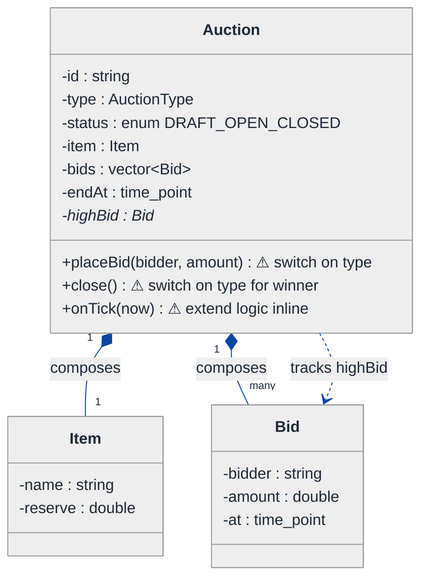
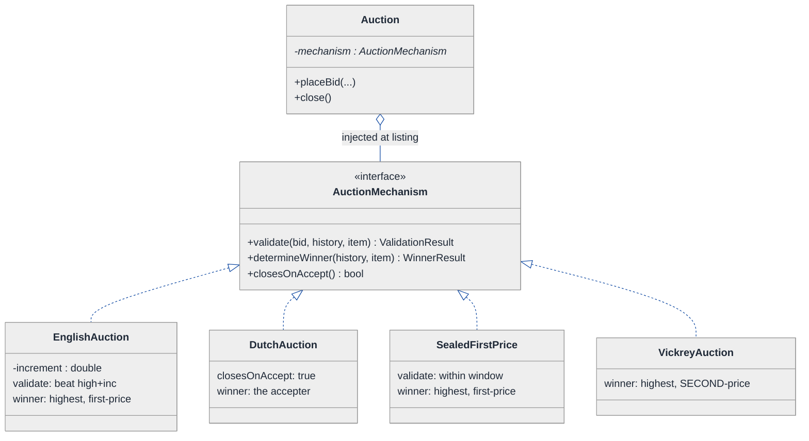
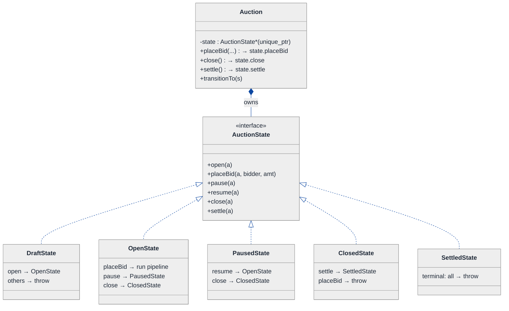
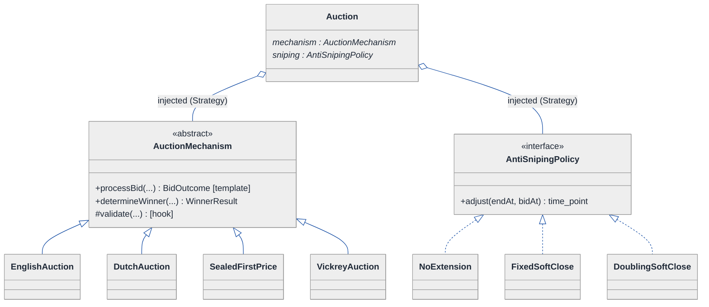
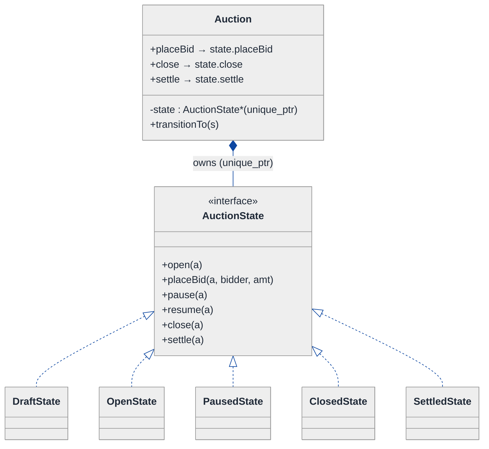
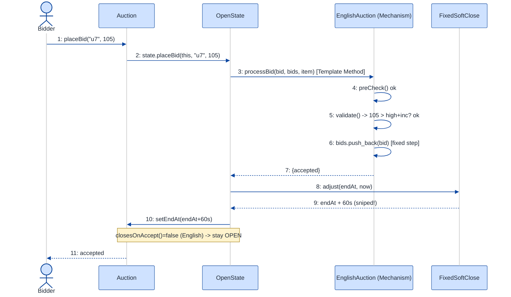

# Auction System — LLD Walkthrough

> **Difficulty:** Hard · **Time:** ~45 min · **Pattern focus:** Strategy (auction mechanism) + State (auction lifecycle) + Template Method (the shared bid→validate→record skeleton)
>
> **Problem source(s):** bosscode question bank GID **SG17**, bucket `Strategy_Pattern`. Representative of "design an auction / bidding engine" LLD prompts.
>
> **Diagrams:** inline mermaid (renders natively in GitHub / VS Code). The canonical light-theme block is copied verbatim into every diagram.

---

## How to use this file

Paced for a candidate seeing "design an auction" for the first time. Reading time: ~45 minutes if you sketch each iteration by hand. **The lesson: don't reach for an `enum AuctionType` and a wall of `switch` statements. DERIVE the design — write the naive version first, watch it fracture under four hypothetical changes, then introduce ONE pattern per painful axis: Strategy for the auction mechanism, State for the lifecycle, Template Method for the shared bid-handling skeleton.**

**Map of this file (15 sections):**

1. Problem statement + clarifying questions
2. Plain-English restatement
3. Why this matters
4. Mental model
5. Try it yourself first
6. Entity & verb extraction
7. **Iteration 1: the naive design** — what we'd write first
8. **Where the naive design hurts** — four future requirements, one painful diff each
9. **Pivot 1: Strategy for the auction mechanism** — the most painful axis first
10. **Pivot 2: State for the auction lifecycle** — internal transitions, not external swaps
11. **Pivot 3: Template Method for the shared bid pipeline** (+ Strategy for anti-sniping)
12. Final UML class diagram
13. Skeleton code (C++17)
14. Key flow — sequence diagram
15. Extensibility re-check + anti-patterns + how to think aloud + self-check

---

## 1. Problem statement + clarifying questions

**Prompt (typical phrasing):** "Design an auction system supporting English (ascending), Dutch (descending), and sealed-bid auctions. Include bid validation, time-based auction closing, winner determination, and anti-sniping extensions."

**Clarifying questions to ask BEFORE drawing anything:**

1. **Which auction mechanisms, and are they fixed?** English (ascending open-cry), Dutch (price drops until someone accepts), sealed-bid first-price, sealed-bid second-price (Vickrey)? Will more be added later? (This answer decides how hard we lean on Strategy.)
2. **What does "valid bid" mean per mechanism?** English: strictly greater than current high by a minimum increment. Dutch: any accept at the current clock price wins immediately. Sealed: any bid within the window, hidden from peers. Same validation everywhere, or per-mechanism?
3. **How does an auction close?** Fixed end-time? First acceptance (Dutch)? Manual seller close? A combination? Who fires the "time's up" event — a scheduler, a clock tick, a wall-clock check on each bid?
4. **Anti-sniping policy?** "Soft close": a bid in the last N seconds extends the deadline by M seconds. Is the extension rule the same for all auction types, or pluggable?
5. **Concurrency?** Can two bids land at the same millisecond? Do we need per-auction serialization so the "current high bid" is never corrupted?
6. **Visibility / information model?** English bids are public; sealed bids are private until close. Does the system need to enforce that, or just store bids?
7. **Winner & settlement?** Does the system just *determine* the winner, or also charge them? (We'll scope to determination + a settlement hook.)
8. **Reserve price?** Below-reserve highest bid → no sale?

**Assumptions if interviewer dodges:** English + Dutch + sealed-bid (first-price) with Vickrey as a stretch; per-mechanism validation and winner rules; auctions have a scheduled end-time plus mechanism-specific early-close; anti-sniping is a pluggable soft-close extension; single process, but each auction serializes its own bids; we *determine* the winner and expose a settlement hook rather than charging cards.

---

## 2. Plain-English restatement

We're building the engine behind an auction marketplace. A seller lists an item under one of several **mechanisms** — English (price climbs, highest at close wins), Dutch (price falls on a clock, first to accept wins), or sealed-bid (everyone submits once, hidden, highest at close wins). The engine must accept bids, **validate** each one according to the mechanism's rules, decide when the auction **closes** (a deadline, or a Dutch acceptance, or a seller action), determine the **winner**, and optionally **extend the deadline** when a last-second bid arrives (anti-sniping). The design must let us add a new mechanism, a new validation rule, or a new anti-sniping policy **without rewriting the bid-handling core**.

---

## 3. Why this matters

This is a *pattern-discrimination* question wearing an auction costume. The naive instinct — one `Auction` class with an `enum Type` and `switch (type)` in every method — works for the demo and collapses the moment a fourth mechanism or a new rule arrives. The skill being probed is recognizing **three genuinely different axes of variation** (the bidding *algorithm*, the auction *lifecycle*, and the *shared steps* every bid goes through) and mapping each to its correct pattern: Strategy, State, and Template Method. Getting Template-Method-vs-Strategy right under pressure is exactly the senior signal interviewers look for. The same skill reappears in payment processors, pricing engines, game-rule engines, and matching engines.

---

## 4. Mental model

An auction is a **referee running a rulebook over a stream of bids, against a clock.** Three things vary independently:

- The **rulebook** (what counts as a valid bid, who wins) — that's the *mechanism*. English, Dutch, and sealed-bid are different rulebooks for the same "items + bids + clock" substrate.
- The **phase** the auction is in — Draft → Open → (maybe Extended) → Closed → Settled. What you're allowed to *do* depends on the phase. You can't bid on a Draft auction; you can't bid on a Closed one.
- The **steps every bid goes through** regardless of mechanism — authenticate the bidder, check the auction is open, run mechanism-specific validation, record the bid, maybe fire anti-sniping. The *skeleton* is fixed; one or two *steps* differ per mechanism.

```
Real-world sketch (NOT a UML diagram yet):

         seller lists item
                │
                ▼
        ┌───────────────────────────────────────────┐
        │  Auction (mechanism = English / Dutch / …) │
        │                                            │
        │   phase:  Draft → Open → [Extended] →      │
        │                  Closed → Settled          │
        │                                            │
        │   bids ──►  [ authenticate ]               │  ← same for all
        │             [ phase-open?  ]               │  ← same for all
        │             [ VALIDATE     ]  ← mechanism  │  ← differs
        │             [ record       ]               │  ← same for all
        │             [ anti-snipe?  ]  ← extension  │  ← pluggable
        └───────────────────────────────────────────┘
                │
                ▼  clock hits end (or Dutch accept)
        determine WINNER  ← mechanism decides the rule
```

The KEY insight from this picture: **mechanism = policy (Strategy/Template Method), phase = lifecycle (State), the bid pipeline = a fixed skeleton with one variable step.** That separation is the entire design.

---

## 5. Try it yourself first

> **Predict before reading on:**
>
> 1. List 5 nouns you'd promote to a class. List 3 nouns you'd leave as plain fields.
> 2. **If I told you a fourth mechanism (Vickrey second-price) lands next sprint, what would change about how you wrote the `placeBid` method?**
> 3. Anti-sniping says "a bid in the last 30s extends the close by 60s." Where does that rule live so that it does NOT touch the validation logic or the winner logic?

---

## 6. Entity & verb extraction

> **Mini-refresher: noun → class, but not every noun.**
>
> Naive OOD promotes every noun to a class. Senior OOD promotes a noun only if it has both BEHAVIOR and STATE that need to live together. "Bid amount" stays a field; "Auction" becomes a class because it has lifecycle behavior and owns a stream of bids.

**Nouns from the prompt:**

| Noun | Decision | Why |
|---|---|---|
| Auction | Class (top-level aggregate) | Owns bids, holds phase, orchestrates place/close/settle |
| Item / Lot | Class (or struct) | The thing being sold; mostly data + a reserve price |
| Bid | Class (value-ish) | Amount + bidder + timestamp; small behavior (compareTo) |
| Bidder | Class | Identity; later, credentials for validation |
| AuctionMechanism | **Will become a Strategy/Template-Method base** | English/Dutch/Sealed differ in validation + winner rule |
| AuctionPhase / status | **Will become State** | Draft/Open/Extended/Closed/Settled gate what's legal |
| Winner result | Struct returned by close | Winner + price; not a long-lived class |
| Deadline / clock | Field (`time_point`) + a Clock seam | Time has no domain behavior of its own |
| Anti-sniping rule | **Will become a Strategy** | Pluggable soft-close extension |
| Bid increment / reserve | Fields on mechanism / item | No behavior of their own |

**Verbs (and the class they live on — naive answer, we'll re-examine):**

| Verb | Owner class (naive — revisited later) |
|---|---|
| placeBid(bidder, amount) | Auction |
| validate(bid) | Auction (naive) → mechanism (final) |
| close() | Auction |
| determineWinner() | Auction (naive) → mechanism (final) |
| extendIfSniped(bid) | Auction (naive) → anti-sniping strategy (final) |
| onTick(now) | Auction (the clock pokes it) |

**We have NOT introduced any design patterns yet.** Pure nouns + verbs.

---

## 7. <a id="iter-1"></a>Iteration 1: the naive design

Let's write the simplest thing that could possibly work. No design patterns — one `Auction` class, an `enum AuctionType`, and `switch (type_)` wherever behavior differs.



**Reader's tour (read top to bottom; ~60 seconds).**

1. **`Auction` is one giant box.** It holds the type (`enum AuctionType`), the status (another enum), the item, the bid list, the deadline, and a pointer to the current high bid. Every decision lives inside its three public methods.

2. **`placeBid` carries a `switch (type_)`** (⚠). English checks "amount > highBid + increment"; Dutch checks "amount == currentClockPrice and nobody has accepted"; sealed-bid checks "within window, store hidden." One method, three branches.

3. **`close` carries another `switch (type_)`** (⚠) for winner determination. English/sealed → highest stored bid. Dutch → already decided at acceptance. Each new mechanism adds a branch here too.

4. **`onTick(now)`** (⚠) inlines the anti-sniping extension: "if now is within 30s of endAt and a bid just landed, push endAt by 60s." The rule is baked into the method.

5. **`status` is an enum** with DRAFT / OPEN / CLOSED. Fine for three phases; it cannot express "Extended" or "Settled" without a fourth and fifth enum value plus more guards.

6. **`Item` and `Bid` are small.** Item is name + reserve. Bid is bidder + amount + timestamp. These are *not* the smell — they're honest data holders.

**What's deliberately missing.** No `AuctionMechanism`. No `AuctionState`. No `AntiSnipingPolicy`. The naive design doesn't even *acknowledge* that the mechanism, the lifecycle, and the extension rule are three independent axes. It hardcodes a `switch` answer for each.

Skeleton code for the naive design (C++17):

```cpp
#include <chrono>
#include <optional>
#include <stdexcept>
#include <string>
#include <vector>

using Clock     = std::chrono::system_clock;
using TimePoint = Clock::time_point;

enum class AuctionType   { ENGLISH, DUTCH, SEALED };
enum class AuctionStatus { DRAFT, OPEN, CLOSED };

struct Item { std::string name; double reserve = 0.0; };
struct Bid  { std::string bidder; double amount; TimePoint at; };

class Auction {
public:
    Auction(std::string id, AuctionType type, Item item, TimePoint endAt)
        : id_(std::move(id)), type_(type), item_(std::move(item)), endAt_(endAt) {}

    void placeBid(const std::string& bidder, double amount) {
        if (status_ != AuctionStatus::OPEN) throw std::runtime_error("not open");
        TimePoint now = Clock::now();

        switch (type_) {                                   // ⚠ tag-driven dispatch
            case AuctionType::ENGLISH:
                if (highBid_ && amount <= highBid_->amount + increment_)
                    throw std::runtime_error("must beat high bid + increment");
                bids_.push_back({bidder, amount, now});
                highBid_ = &bids_.back();
                break;
            case AuctionType::DUTCH:
                // first accept at clock price wins immediately
                bids_.push_back({bidder, amount, now});
                highBid_ = &bids_.back();
                status_ = AuctionStatus::CLOSED;           // closes on accept
                break;
            case AuctionType::SEALED:
                if (now > endAt_) throw std::runtime_error("window closed");
                bids_.push_back({bidder, amount, now});    // hidden until close
                break;
        }

        // ⚠ anti-sniping inlined
        if (endAt_ - now < std::chrono::seconds(30))
            endAt_ += std::chrono::seconds(60);
    }

    std::optional<Bid> close() {
        status_ = AuctionStatus::CLOSED;
        switch (type_) {                                   // ⚠ another switch
            case AuctionType::ENGLISH:
            case AuctionType::SEALED: {
                Bid* best = nullptr;
                for (auto& b : bids_)
                    if (!best || b.amount > best->amount) best = &b;
                if (best && best->amount >= item_.reserve) return *best;
                return std::nullopt;                       // below reserve
            }
            case AuctionType::DUTCH:
                return highBid_ ? std::optional<Bid>(*highBid_) : std::nullopt;
        }
        return std::nullopt;
    }

private:
    std::string   id_;
    AuctionType   type_;
    AuctionStatus status_ = AuctionStatus::DRAFT;
    Item          item_;
    std::vector<Bid> bids_;
    TimePoint     endAt_;
    Bid*          highBid_ = nullptr;
    double        increment_ = 1.0;
};
```

**This works.** It has zero design patterns. We can run all three mechanisms. So what's wrong with it?

---

## 8. <a id="naive-pain"></a>Where the naive design hurts

The interviewer slides four requirements across the desk: "Here's next quarter's roadmap. Walk me through what changes."

### Change A: "Add a Vickrey (second-price sealed-bid) auction — winner pays the SECOND-highest bid"

In the naive design:
- `placeBid`'s `switch` needs a `case VICKREY:` (validation is like sealed, so maybe reuse the SEALED branch — but C++ fallthrough is a footgun).
- `close`'s `switch` needs a *different* winner rule: highest bidder wins but the *price* is the second-highest amount. The existing ENGLISH/SEALED branch returns the wrong price.
- **Two `switch` statements in two methods grow, and the winner branch can no longer share code with SEALED** because the price differs. The `AuctionType` enum gains a value that ripples to every `switch` in the file — including ones you forgot about.

### Change B: "English auctions need a minimum-increment rule that depends on the current price band (\$1 increments under \$100, \$10 under \$1000, \$100 above)"

In the naive design:
- The ENGLISH branch in `placeBid` grows a price-band ladder.
- **Validation logic balloons inside a method that's already a 40-line `switch`.** The next validation tweak adds more lines to the same monster. There's no place to unit-test "the increment rule" in isolation — it's welded to `placeBid`.

### Change C: "Add a 'Paused' phase (seller can pause/resume) and a 'Settled' phase after payment clears"

In the naive design:
- `AuctionStatus` enum gains `PAUSED` and `SETTLED`.
- **Every method that touches status grows a guard:** `placeBid` must reject bids when PAUSED *and* when SETTLED; `close` must reject when already SETTLED; a new `pause()`/`resume()`/`settle()` each need their own `if (status_ == ...)` ladders.
- The legal-transition matrix (Draft→Open→Paused→Open→Closed→Settled) is now scattered as ad-hoc `if`s across five methods. Miss one guard and you can `settle()` a `DRAFT` auction. **The transition rules live nowhere; they're implied by whichever guards happen to exist.**

### Change D: "Anti-sniping policy must differ per auction: some extend by 60s, some double the remaining time, some don't extend at all"

In the naive design:
- The inline `if (endAt_ - now < 30s) endAt_ += 60s` in `placeBid` is one hardcoded policy.
- **To vary it per auction you add another `switch` or a pile of config flags inside `placeBid`.** A method that already does validation + recording now also branches on extension policy. Three concerns, one method.

### The pattern of pain

| Change | Files / methods touched | Smell |
|---|---|---|
| A. Vickrey | `placeBid` switch + `close` switch + enum | "Mechanism behavior scattered across two switches; winner rule can't be reused cleanly." |
| B. Increment bands | `placeBid` ENGLISH branch | "Validation welded to dispatch; untestable in isolation." |
| C. Paused/Settled | `status` enum + guards in 5 methods | "Lifecycle transitions implied by scattered `if`s; no single source of truth." |
| D. Per-auction sniping | `placeBid` inline rule | "Extension policy hardcoded; can't vary per auction." |

**Three axes of pain dominate:**
1. **Mechanism variability** — validation + winner rule differ per mechanism (A, B). Picked by the *seller* when listing.
2. **Lifecycle variability** — what's legal depends on phase (C). The *auction* transitions itself.
3. **Pipeline + extension variability** — every bid runs the same skeleton with one variable validation step (B), and one pluggable extension step (D).

> **Pivot question:** "What pattern handles 'an algorithm picked by the caller'? What pattern handles 'a lifecycle with phase-specific legality'? And what pattern handles 'a fixed sequence of steps where one step varies'?"
>
> The answers are **Strategy**, **State**, and **Template Method**. Introduce them one at a time, starting with the most painful axis: the mechanism.

---

## 9. <a id="pivot-1"></a>Pivot 1: Strategy for the auction mechanism

> **Mini-refresher: Strategy pattern.**
>
> Encapsulates an algorithm behind an interface so it can be swapped at runtime. The CALLER (here: the seller, when listing) decides which strategy to use; the strategy doesn't know about its peers.
>
> Quick example: a `Sorter` takes a `CompareStrategy*`. Pass `Ascending` or `Descending` — the sorter doesn't care which.

**Why Strategy fits the mechanism.** "Given a bid, is it valid?" and "given the bids, who wins and at what price?" are two algorithms that vary together per mechanism (English vs Dutch vs sealed vs Vickrey). The choice is made *externally* — the seller picks the mechanism when listing the item, and it never changes for that auction. That's textbook Strategy: the `Auction` (the context) holds a pointer to an `AuctionMechanism` (the strategy) and delegates the varying decisions to it.

> **Mini-refresher: Open/Closed Principle (the "O" in SOLID).**
>
> Software should be open for extension, closed for modification. Adding a mechanism should mean *adding a class*, not *editing a `switch`*. Strategy is the most direct way to satisfy OCP for an algorithm axis.

**The refactor (just the affected slice):**

```cpp
struct ValidationResult { bool ok; std::string reason; };
struct WinnerResult     { std::optional<Bid> winner; double price = 0.0; };

class AuctionMechanism {
public:
    virtual ~AuctionMechanism() = default;
    // Is this bid acceptable RIGHT NOW, given the bids seen so far?
    virtual ValidationResult validate(const Bid& incoming,
                                       const std::vector<Bid>& history,
                                       const Item& item) const = 0;
    // After close, who won and what do they pay?
    virtual WinnerResult determineWinner(const std::vector<Bid>& history,
                                         const Item& item) const = 0;
    // Does accepting a bid immediately close the auction? (Dutch = true)
    virtual bool closesOnAccept() const { return false; }
};

class EnglishAuction : public AuctionMechanism {
public:
    explicit EnglishAuction(double increment) : increment_(increment) {}
    ValidationResult validate(const Bid& in, const std::vector<Bid>& h,
                              const Item&) const override {
        double high = h.empty() ? 0.0 : h.back().amount;   // h kept sorted by arrival
        if (in.amount < high + increment_)
            return {false, "must beat current high + increment"};
        return {true, ""};
    }
    WinnerResult determineWinner(const std::vector<Bid>& h, const Item& item) const override {
        if (h.empty()) return {std::nullopt, 0.0};
        const Bid& top = *std::max_element(h.begin(), h.end(),
                          [](auto& a, auto& b){ return a.amount < b.amount; });
        if (top.amount < item.reserve) return {std::nullopt, 0.0};
        return {top, top.amount};                           // first-price
    }
private:
    double increment_;
};

class VickreyAuction : public AuctionMechanism {           // Change A — a NEW class
public:
    ValidationResult validate(const Bid&, const std::vector<Bid>&,
                              const Item&) const override { return {true, ""}; } // sealed
    WinnerResult determineWinner(const std::vector<Bid>& h, const Item& item) const override {
        if (h.size() < 2) return h.empty() ? WinnerResult{}
                                           : WinnerResult{h[0], h[0].amount};
        // highest bidder WINS, pays SECOND-highest amount
        auto sorted = h;
        std::sort(sorted.begin(), sorted.end(),
                  [](auto& a, auto& b){ return a.amount > b.amount; });
        if (sorted[0].amount < item.reserve) return {std::nullopt, 0.0};
        return {sorted[0], sorted[1].amount};               // second-price
    }
};
// DutchAuction (closesOnAccept() = true) and SealedFirstPrice elided
```

**What changed — visualized.** Just the mechanism slice:



**Tour of the after-state.**

1. **`Auction` gained a field and lost two `switch`es.** `mechanism` is a pointer to the `AuctionMechanism` interface, INJECTED when the seller lists the item. The OPEN diamond (`◇`) marks aggregation — the auction *uses* the mechanism; in our skeleton it owns it via `unique_ptr`, but conceptually the mechanism is a policy, not part of the auction's identity.

2. **The `<<interface>>` box is the contract.** Three methods: `validate` (per-bid legality), `determineWinner` (post-close winner + price), and `closesOnAccept` (a hook so Dutch can close immediately). The contract is *narrow* — it knows about bids, history, and the item, nothing else.

3. **Four concrete mechanisms.** `EnglishAuction` carries the increment and a first-price winner rule. `DutchAuction` overrides `closesOnAccept() → true`. `SealedFirstPrice` validates by window only. `VickreyAuction` is **Change A from §8 — one new class**: same validation as sealed, different winner rule (highest wins, pays second-highest).

4. **Change A and Change B from §8 now land cleanly.** Vickrey → a new `AuctionMechanism` subclass. The increment-band rule → it lives entirely inside `EnglishAuction::validate`, unit-testable in isolation, with zero impact on the other mechanisms.

**Pattern-discrimination cheatsheet — Strategy vs Template Method.**
- *Strategy:* the WHOLE algorithm lives in a swappable object, chosen at runtime via composition. Variants are independent and may be combined.
- *Template Method:* the algorithm *skeleton* lives in a base class; subclasses override only specific *steps* via inheritance.
- *Rule of thumb:* if the variants share almost nothing and are picked at runtime → Strategy. If the variants share a fixed sequence and differ in one or two steps → Template Method.

We picked **Strategy** for the *mechanism choice* because the seller selects it at runtime and the mechanisms are independent objects. But notice the bid-handling *sequence* (authenticate → check open → validate → record → anti-snipe) is the *same* for every mechanism — only the validate step differs. That shared sequence is a Template-Method job, and we'll do exactly that in Pivot 3. (Strategy for "which mechanism"; Template Method for "the steps of handling a bid.")

---

## 10. <a id="pivot-2"></a>Pivot 2: State for the auction lifecycle

Change C from §8 is still painful — `PAUSED`, `SETTLED`, and a transition matrix scattered as `if`s across five methods. The mechanism Strategy doesn't help, because the variability here isn't *which algorithm* — it's *what's legal right now*.

> **Mini-refresher: State pattern.**
>
> Each lifecycle phase is its own class. The context delegates an operation (`placeBid`, `close`, `settle`) to its current state object, and THE STATE decides both what's legal and what the next state is. Transitions are INTERNAL, driven by events the context receives — not chosen by the caller.

**Why State (not Strategy).** Nobody from outside says "switch this auction to Closed." It closes because the clock ran out or a Dutch bid was accepted. An `OpenState` accepts bids; a `ClosedState` rejects them and allows `settle()`; a `DraftState` allows neither but allows `open()`. Calling `placeBid` on a `ClosedState` isn't a runtime check we sprinkle around — it's simply what `ClosedState::placeBid` does (throw). The legality *is* the class.

**The refactor (just the lifecycle slice):**

```cpp
class Auction;  // forward — defined in §13

class AuctionState {
public:
    virtual ~AuctionState() = default;
    virtual const char* name() const = 0;
    virtual void open  (Auction&)                       { throw std::logic_error("cannot open"); }
    virtual void placeBid(Auction&, const std::string&, double) { throw std::logic_error("not accepting bids"); }
    virtual void pause (Auction&)                       { throw std::logic_error("cannot pause"); }
    virtual void resume(Auction&)                       { throw std::logic_error("cannot resume"); }
    virtual void close (Auction&)                       { throw std::logic_error("cannot close"); }
    virtual void settle(Auction&)                       { throw std::logic_error("cannot settle"); }
};

class OpenState : public AuctionState {
public:
    const char* name() const override { return "OPEN"; }
    void placeBid(Auction& a, const std::string& bidder, double amount) override; // §13: runs the pipeline
    void pause(Auction& a) override;   // → PausedState
    void close(Auction& a) override;   // → ClosedState
};

class PausedState : public AuctionState {
public:
    const char* name() const override { return "PAUSED"; }
    void resume(Auction& a) override;  // → OpenState
    void close(Auction& a) override;   // → ClosedState  (seller may abandon)
};

class ClosedState : public AuctionState {
public:
    const char* name() const override { return "CLOSED"; }
    void settle(Auction& a) override;  // → SettledState
};

class SettledState : public AuctionState {       // Change C — terminal phase, one new class
public:
    const char* name() const override { return "SETTLED"; }
    // every operation falls through to the base "throw" — terminal
};
// DraftState (open() → OpenState) elided
```

**What changed — visualized.** Just the lifecycle slice:



**Tour of the after-state.**

1. **The `AuctionStatus` enum is gone.** It's replaced by a `state` field of type `std::unique_ptr<AuctionState>` — exclusive ownership; the auction owns its current phase object.

2. **`Auction::placeBid/close/settle` became one-liners.** Each delegates: `state_->placeBid(*this, ...)`, `state_->close(*this)`. **No `if (status_ == X)` ladder anywhere.**

3. **The base class declares the full operation set with a default "throw."** Each concrete state overrides only the operations that are *legal* in that phase. `ClosedState` overrides `settle` (legal) and inherits the throwing `placeBid` (illegal) for free. That's the Liskov-substitution-friendly way to express "most things are illegal here."

4. **Five concrete states, each owning its transitions.** Read across: `DraftState::open → OpenState`. `OpenState` accepts bids, can pause or close. `PausedState` can resume or close. `ClosedState` can settle. `SettledState` is terminal — every operation falls through to the base throw.

5. **Transition logic lives WITH the state.** `OpenState::close` is the one that does `t.transitionTo(make_unique<ClosedState>())`. The transition matrix is no longer scattered — it's exactly the set of overrides each state class declares. **One source of truth: the state classes themselves.** Change C lands as the single new class `SettledState` (plus the `PausedState`), with no edits to the others.

**Pattern-discrimination cheatsheet — Strategy vs State.**
- *Strategy:* the CALLER picks which one; strategies are usually unaware of each other and don't transition between themselves.
- *State:* the OBJECT picks its next state internally; states know about each other (each state's methods can `transitionTo` another).
- *Rule of thumb:* `auction.setMechanism(x)` called externally at listing time → Strategy (that's the mechanism). `auction.close()` flips Open→Closed because the *auction* decided → State (that's the lifecycle).

This is why the auction needs *both*: the mechanism is chosen once by the caller (Strategy), the phase transitions itself in response to events (State).

---

## 11. <a id="pivot-3"></a>Pivot 3: Template Method for the bid pipeline (+ Strategy for anti-sniping)

Two pains remain. Change B exposed that **every bid runs the same sequence** — authenticate, check open, validate, record, maybe extend — and only the *validate* step differs per mechanism. Change D exposed that the **anti-sniping extension is a pluggable policy**. These are two different patterns for two sub-problems.

### 11a. Template Method for the shared bid-handling skeleton

> **Mini-refresher: Template Method pattern.**
>
> A base class defines the *skeleton* of an operation as a sequence of steps in one non-virtual method (the "template method"). Some steps are concrete (shared by all); one or two are abstract *hooks* that subclasses override. Inheritance, not composition: the variation is a *step*, not the whole algorithm.

The bid pipeline is a fixed sequence with exactly one variable step (`validate`, which we already gave to the mechanism Strategy). So the "template method" is `Auction::handleBid`, and the variable step delegates to the mechanism. Equivalently, if you wanted the *mechanism* itself to own the skeleton, you'd put a non-virtual `processBid` on `AuctionMechanism` that calls the virtual `validate` hook:

```cpp
class AuctionMechanism {
public:
    virtual ~AuctionMechanism() = default;

    // TEMPLATE METHOD: fixed skeleton, one virtual hook (validate).
    // Non-virtual on purpose — subclasses must NOT change the sequence.
    BidOutcome processBid(const Bid& incoming, std::vector<Bid>& history,
                          const Item& item) {
        if (!preCheck(incoming, item))                       // step 1 (hook, default ok)
            return {false, "pre-check failed"};
        ValidationResult v = validate(incoming, history, item); // step 2 (REQUIRED hook)
        if (!v.ok) return {false, v.reason};
        history.push_back(incoming);                         // step 3 (fixed)
        onAccepted(incoming, history);                       // step 4 (hook, default no-op)
        return {true, ""};
    }

    virtual bool closesOnAccept() const { return false; }
    virtual WinnerResult determineWinner(const std::vector<Bid>&, const Item&) const = 0;

protected:
    virtual ValidationResult validate(const Bid&, const std::vector<Bid>&,
                                      const Item&) const = 0;   // the one required hook
    virtual bool preCheck(const Bid&, const Item&) const { return true; }       // optional hook
    virtual void onAccepted(const Bid&, std::vector<Bid>&)       {}             // optional hook
};
```

**Why Template Method here and not "just another Strategy."** The *sequence* of steps (pre-check → validate → record → on-accepted) must NOT vary — if a subclass could reorder or skip "record," the engine's invariants break. Template Method *locks the sequence* in a non-virtual method and exposes only the safe hooks. A second Strategy interface would let a subclass replace the whole thing, including the invariant steps. **Template Method = "I control the algorithm, you fill the blanks." Strategy = "you control the whole algorithm."** That is the precise distinction the interviewer is probing with this question.

### 11b. Strategy for anti-sniping (Change D)

The extension policy is the *opposite* situation: it varies per auction, is chosen by the caller (the seller's listing config), and the whole rule is independent. That's a Strategy, injected into the `Auction`.

```cpp
class AntiSnipingPolicy {
public:
    virtual ~AntiSnipingPolicy() = default;
    // Given a bid arriving now and the current deadline, return the (possibly extended) deadline.
    virtual TimePoint adjust(TimePoint endAt, TimePoint bidAt) const = 0;
};

class NoExtension : public AntiSnipingPolicy {
public:
    TimePoint adjust(TimePoint endAt, TimePoint) const override { return endAt; }
};

class FixedSoftClose : public AntiSnipingPolicy {            // "last 30s → +60s"
public:
    FixedSoftClose(std::chrono::seconds window, std::chrono::seconds bump)
        : window_(window), bump_(bump) {}
    TimePoint adjust(TimePoint endAt, TimePoint bidAt) const override {
        return (endAt - bidAt < window_) ? endAt + bump_ : endAt;
    }
private:
    std::chrono::seconds window_, bump_;
};
// DoublingSoftClose (doubles remaining time) elided — another one-class add
```

> **Mini-refresher: Dependency Injection.**
>
> Instead of an object `new`-ing its collaborators, you pass them in (here, via the constructor). The `Auction` receives its `AuctionMechanism` and its `AntiSnipingPolicy` rather than constructing them. This is what makes both axes swappable and testable — you can inject a `NoExtension` and a fake mechanism in a unit test.

**Pattern-discrimination cheatsheet — Template Method vs Strategy (the crux of this problem).**
- *Template Method:* used for the **bid pipeline** — the *sequence* is fixed, only the `validate` *step* varies. Inheritance; the base class owns the algorithm.
- *Strategy:* used for **anti-sniping** (and the mechanism choice) — the *whole* rule is swappable and chosen by the caller. Composition; the caller owns the choice.
- *Rule of thumb:* "fill in a blank in my fixed recipe" → Template Method. "hand me a whole recipe" → Strategy.

With this, all four §8 changes are absorbed: Vickrey (Pivot 1), increment bands (Pivot 1, inside `validate`), Paused/Settled (Pivot 2), per-auction sniping (Pivot 3b).

---

## 12. <a id="fig-class-diagram"></a>12. Final class diagram

One mega-diagram becomes a wall of boxes. Here are **three focused sub-views**, then a structural insight tying them together.

### 12.1 The aggregate spine — what the auction OWNS

```mermaid
---
config:
  theme: neutral
  themeVariables:
    background: '#ffffff'
    primaryColor: '#cfe2ff'
    primaryTextColor: '#1f2937'
    primaryBorderColor: '#084298'
    secondaryColor: '#fff3cd'
    secondaryTextColor: '#1f2937'
    secondaryBorderColor: '#664d03'
    tertiaryColor: '#d1e7dd'
    tertiaryTextColor: '#1f2937'
    tertiaryBorderColor: '#0a3622'
    lineColor: '#0d47a1'
    textColor: '#1f2937'
    noteBkgColor: '#fff3cd'
    noteTextColor: '#1f2937'
    noteBorderColor: '#997404'
    actorBkg: '#cfe2ff'
    actorBorder: '#084298'
    actorTextColor: '#1f2937'
    signalColor: '#0d47a1'
    signalTextColor: '#1f2937'
    labelBoxBkgColor: '#ffffff'
    labelBoxBorderColor: '#d3d3d3'
    labelTextColor: '#1f2937'
    edgeLabelBackground: '#ffffff'
    labelBackground: '#ffffff'
    classText: '#1f2937'
    fontFamily: 'system-ui, -apple-system, Segoe UI, Helvetica, Arial, sans-serif'
---
classDiagram
  direction TB
  class Auction {
    id : string
    endAt : time_point
    bids : vector~Bid~
    (root coordinator)
  }
  class Item {
    name : string
    reserve : double
  }
  class Bid {
    bidder : string
    amount : double
    at : time_point
  }
  Auction "1" *-- "1" Item : composes
  Auction "1" *-- "many" Bid : composes
```

**Tour of 12.1.** Three boxes, one ownership chain. The filled diamonds (`◆`) mark composition — the same lifetime relationship from the naive design. The `Auction` owns its `Item` and its `Bid` list; if the auction is destroyed, both go with it. **The data spine didn't change** — what changed is everything we lifted *out* of `Auction` into policy objects (next two views).

### 12.2 The policy injection — what the auction USES (Strategy axes)



**Tour of 12.2.**

1. **One `Auction`, two injected interfaces.** `mechanism` and `sniping` are both passed in at listing time (open diamonds `◇` = aggregation; in code they're `unique_ptr` because the auction is the only owner).

2. **`AuctionMechanism` is `<<abstract>>`, not `<<interface>>`, on purpose.** It carries the **Template Method** `processBid` (a *concrete* method that runs the fixed pipeline) plus the abstract `validate` hook (`#` = protected) and the abstract `determineWinner`. The hollow-triangle `<|--` to the four mechanisms is *inheritance* (Template Method's mechanism), distinct from...

3. **`AntiSnipingPolicy` is a pure `<<interface>>`** — the dashed `<|..` is *realization* (pure Strategy via composition). `NoExtension` / `FixedSoftClose` / `DoublingSoftClose` are interchangeable whole rules.

4. **The structural insight:** the two Strategy-family interfaces use *different UML arrows* because one is Template Method (inheritance — solid triangle) and one is pure Strategy (realization — dashed triangle). The diagram itself encodes the pattern choice.

### 12.3 The lifecycle — Auction's State pattern



**Tour of 12.3.** `Auction` owns ONE `AuctionState` (`unique_ptr`, filled diamond). Its `placeBid/close/settle` are one-line delegations to the current state; **no status enum, no scattered guards.** Five states realize the interface; each overrides only the operations legal in its phase and inherits a throwing default for the rest. Transitions live inside the states (`OpenState::close → ClosedState`), so the legal-transition matrix is exactly the set of overrides — one source of truth.

### Structural insight (ties 12.1 + 12.2 + 12.3 together)

| Concern | Pattern used | Why |
|---|---|---|
| **Aggregate data** (Item, Bid list) | Plain composition | Honest data the auction owns; no behavior variation |
| **Mechanism** (English/Dutch/Sealed/Vickrey) | **Strategy** for the *choice* + **Template Method** for the *bid pipeline* | Seller picks the whole mechanism (Strategy); the bid *steps* are fixed with one varying hook (Template Method) |
| **Lifecycle** (Draft→Open→Paused→Closed→Settled) | **State**, owned by Auction | Auction transitions itself in response to events; legality = the class |
| **Anti-sniping** (none/fixed/doubling) | **Strategy**, injected | Pluggable whole rule, chosen by the caller per auction |

The big lesson: **inheritance is used only where the variation is a *step* (Template Method mechanism) or a *kind* (State classes); every "swap a whole algorithm at runtime" axis is composition over an interface.** *Template Method when you own the recipe and expose blanks; Strategy when you hand over the whole recipe.* Getting those two apart is what this question tests.

---

## 13. Skeleton code (C++17)

> Show the SHAPES, not the full impl. Concrete bodies elided where they merely repeat a known pattern.

```cpp
#include <algorithm>
#include <chrono>
#include <memory>
#include <optional>
#include <stdexcept>
#include <string>
#include <vector>

using Clock     = std::chrono::system_clock;
using TimePoint = Clock::time_point;

// ── Forward declarations ────────────────────────────────────────────
class Auction;

// ── Plain data ──────────────────────────────────────────────────────
struct Item { std::string name; double reserve = 0.0; };
struct Bid  { std::string bidder; double amount; TimePoint at; };
struct BidOutcome   { bool accepted; std::string reason; };
struct WinnerResult { std::optional<Bid> winner; double price = 0.0; };
struct ValidationResult { bool ok; std::string reason; };

// ── Mechanism: Strategy choice + Template Method pipeline ───────────
class AuctionMechanism {
public:
    virtual ~AuctionMechanism() = default;

    // TEMPLATE METHOD — fixed sequence; subclasses fill the validate hook only.
    BidOutcome processBid(const Bid& in, std::vector<Bid>& history, const Item& item) {
        if (!preCheck(in, item))           return {false, "pre-check failed"};
        ValidationResult v = validate(in, history, item);
        if (!v.ok)                         return {false, v.reason};
        history.push_back(in);             // invariant step — cannot be overridden
        onAccepted(in, history);
        return {true, ""};
    }
    virtual bool closesOnAccept() const { return false; }
    virtual WinnerResult determineWinner(const std::vector<Bid>&, const Item&) const = 0;

protected:
    virtual ValidationResult validate(const Bid&, const std::vector<Bid>&,
                                      const Item&) const = 0;       // required hook
    virtual bool preCheck(const Bid&, const Item&) const { return true; }   // optional hook
    virtual void onAccepted(const Bid&, std::vector<Bid>&)       {}         // optional hook
};

class EnglishAuction : public AuctionMechanism {
public:
    explicit EnglishAuction(double increment) : inc_(increment) {}
protected:
    ValidationResult validate(const Bid& in, const std::vector<Bid>& h,
                              const Item&) const override {
        double high = h.empty() ? 0.0 : h.back().amount;
        if (in.amount < high + inc_) return {false, "below high + increment"};
        return {true, ""};
    }
public:
    WinnerResult determineWinner(const std::vector<Bid>& h, const Item& item) const override {
        if (h.empty()) return {};
        const Bid& top = *std::max_element(h.begin(), h.end(),
                          [](auto& a, auto& b){ return a.amount < b.amount; });
        if (top.amount < item.reserve) return {};
        return {top, top.amount};
    }
private:
    double inc_;
};

class VickreyAuction : public AuctionMechanism {       // highest wins, pays second-highest
protected:
    ValidationResult validate(const Bid&, const std::vector<Bid>&,
                              const Item&) const override { return {true, ""}; }
public:
    WinnerResult determineWinner(const std::vector<Bid>& h, const Item& item) const override {
        if (h.empty()) return {};
        auto s = h; std::sort(s.begin(), s.end(),
                              [](auto& a, auto& b){ return a.amount > b.amount; });
        if (s[0].amount < item.reserve) return {};
        return {s[0], s.size() > 1 ? s[1].amount : s[0].amount};
    }
};
// class DutchAuction (closesOnAccept()=true), class SealedFirstPrice : elided

// ── Anti-sniping: pure Strategy ─────────────────────────────────────
class AntiSnipingPolicy {
public:
    virtual ~AntiSnipingPolicy() = default;
    virtual TimePoint adjust(TimePoint endAt, TimePoint bidAt) const = 0;
};
class FixedSoftClose : public AntiSnipingPolicy {
public:
    FixedSoftClose(std::chrono::seconds w, std::chrono::seconds b) : w_(w), b_(b) {}
    TimePoint adjust(TimePoint endAt, TimePoint bidAt) const override {
        return (endAt - bidAt < w_) ? endAt + b_ : endAt;
    }
private:
    std::chrono::seconds w_, b_;
};
// class NoExtension, class DoublingSoftClose : elided

// ── Lifecycle: State pattern ────────────────────────────────────────
class AuctionState {
public:
    virtual ~AuctionState() = default;
    virtual const char* name() const = 0;
    virtual void open  (Auction&)                                 { throw std::logic_error("cannot open"); }
    virtual void placeBid(Auction&, const std::string&, double)   { throw std::logic_error("not accepting bids"); }
    virtual void pause (Auction&)                                 { throw std::logic_error("cannot pause"); }
    virtual void resume(Auction&)                                 { throw std::logic_error("cannot resume"); }
    virtual void close (Auction&)                                 { throw std::logic_error("cannot close"); }
    virtual void settle(Auction&)                                 { throw std::logic_error("cannot settle"); }
};

class OpenState : public AuctionState {
public:
    const char* name() const override { return "OPEN"; }
    void placeBid(Auction& a, const std::string& bidder, double amount) override; // below
    void pause(Auction& a) override;
    void close(Auction& a) override;
};
class ClosedState : public AuctionState {
public:
    const char* name() const override { return "CLOSED"; }
    void settle(Auction& a) override;
};
// class DraftState, PausedState, SettledState : elided (same shape)

// ── Auction (context for State; holds the two Strategy policies) ─────
class Auction {
public:
    Auction(std::string id, Item item, TimePoint endAt,
            std::unique_ptr<AuctionMechanism>  mechanism,
            std::unique_ptr<AntiSnipingPolicy> sniping)
        : id_(std::move(id)), item_(std::move(item)), endAt_(endAt)
        , mechanism_(std::move(mechanism)), sniping_(std::move(sniping))
        , state_(std::make_unique<DraftState>()) {}

    // Public API — all one-line delegations to the current state:
    void open()                                              { state_->open(*this); }
    void placeBid(const std::string& bidder, double amount)  { state_->placeBid(*this, bidder, amount); }
    void pause()                                             { state_->pause(*this); }
    void close()                                             { state_->close(*this); }
    void settle()                                            { state_->settle(*this); }

    void transitionTo(std::unique_ptr<AuctionState> s) { state_ = std::move(s); }

    // Accessors used by the states:
    AuctionMechanism&   mechanism()  { return *mechanism_; }
    AntiSnipingPolicy&  sniping()    { return *sniping_; }
    std::vector<Bid>&   bids()       { return bids_; }
    const Item&         item() const { return item_; }
    TimePoint           endAt() const { return endAt_; }
    void                setEndAt(TimePoint t) { endAt_ = t; }

private:
    std::string                        id_;
    Item                               item_;
    TimePoint                          endAt_;
    std::vector<Bid>                   bids_;
    std::unique_ptr<AuctionMechanism>  mechanism_;
    std::unique_ptr<AntiSnipingPolicy> sniping_;
    std::unique_ptr<AuctionState>      state_;
};

// ── State transitions (deferred until Auction is complete) ──────────
inline void OpenState::placeBid(Auction& a, const std::string& bidder, double amount) {
    TimePoint now = Clock::now();
    if (now > a.endAt()) throw std::logic_error("auction expired");
    Bid bid{bidder, amount, now};
    BidOutcome out = a.mechanism().processBid(bid, a.bids(), a.item()); // Template Method
    if (!out.accepted) throw std::runtime_error(out.reason);
    a.setEndAt(a.sniping().adjust(a.endAt(), now));                      // anti-snipe Strategy
    if (a.mechanism().closesOnAccept())                                 // Dutch closes now
        a.transitionTo(std::make_unique<ClosedState>());
}
inline void OpenState::close(Auction& a) { a.transitionTo(std::make_unique<ClosedState>()); }
inline void ClosedState::settle(Auction& a) {
    WinnerResult w = a.mechanism().determineWinner(a.bids(), a.item());
    (void)w;                                  // hand off to settlement hook
    a.transitionTo(std::make_unique<SettledState>());
}
```

---

## 14. <a id="fig-sequence"></a>14. Key flow — sequence diagram

The moment of truth — read across the swimlanes to see how Strategy, State, and Template Method COOPERATE during a single bid that lands in the final 10 seconds (so anti-sniping fires).



**Tour of the bid flow. Read slowly — all three patterns meet here.**

1. **Bidder calls `Auction::placeBid`.** The public API is mechanism-agnostic and phase-agnostic; the bidder never names a mechanism or a phase.

2. **`Auction` delegates to its current state (`OpenState`).** This is the **State** moment: `state_->placeBid(*this, ...)`. If the auction were `PausedState` or `ClosedState`, this same call would throw — *the legality is the class*, not an `if`.

3. **`OpenState` invokes the mechanism's `processBid` — the Template Method.** Steps 4-6 happen *inside* `processBid`: `preCheck` (hook), `validate` (the one varying hook — here English's "beat high + increment"), then the **fixed, non-overridable** `bids.push_back`. A subclass can change *how to validate* but can NOT change the *sequence* or skip recording. That guarantee is exactly why this is Template Method and not a second Strategy.

4. **The accepted bid bubbles back to `OpenState` (step 7).**

5. **`OpenState` asks the anti-sniping Strategy whether to extend (steps 8-10).** `FixedSoftClose::adjust` sees the bid landed inside the 30s window and returns `endAt + 60s`. The state pushes the new deadline onto the auction. **This is the second Strategy axis** — a `NoExtension` policy would have returned `endAt` unchanged, with zero code change anywhere else.

6. **`closesOnAccept()` is consulted (the Note).** English returns false → the auction stays `OPEN`. Had this been a Dutch mechanism, `closesOnAccept()` would be true and `OpenState` would `transitionTo(ClosedState)` right here — same code path, different mechanism, different outcome.

### The validation that's NOT shown — and why it matters

You won't find `if (status == OPEN)` or `switch (type)` anywhere in this flow. Phase legality is enforced by *which state class* handles the call (State pattern). Mechanism behavior is enforced by *which mechanism object* is plugged in and by the *locked pipeline* of `processBid` (Strategy + Template Method). **The class structure IS the validation** — invalid operations are made impossible by polymorphism, not by scattered runtime checks.

---

## 15. Extensibility re-check + anti-patterns + how to think aloud + self-check

### Extensibility re-check

Revisit the four changes from [§8](#naive-pain). For each, name the SINGLE class that changes.

| Change | Naive design impact | Final design impact |
|---|---|---|
| A. Vickrey 2nd-price | `placeBid` switch + `close` switch + enum | New `VickreyAuction : AuctionMechanism`. Done. |
| B. Increment bands | `placeBid` ENGLISH branch balloons | Edit only `EnglishAuction::validate` (or a new `BandedEnglish`). Isolated + unit-testable. |
| C. Paused / Settled | `status` enum + guards in 5 methods | New `PausedState` + `SettledState : AuctionState`. Done. |
| D. Per-auction sniping | inline rule in `placeBid` | New `AntiSnipingPolicy` subclass; inject per auction. Done. |

Every change is one new class (or one isolated edit). That's the open/closed principle in practice.

If a future requirement makes you change `Auction`, a mechanism, a state, AND the sniping policy together — go back to §6 and re-identify variability points; you missed an axis.

### Common confusion + traps

1. **"Why is the mechanism Template Method but anti-sniping pure Strategy?"** Because the *bid pipeline* is a fixed sequence with one varying step (validate) — you must lock the sequence so a subclass can't skip "record the bid." Anti-sniping is a *whole* rule with no shared skeleton, freely swapped by the caller. Recipe-with-blanks → Template Method; whole-recipe → Strategy.

2. **"Should Dutch's price-drop clock be a state?"** No — the falling price is *data* (a function of elapsed time), not a phase. Dutch stays `OpenState` until a bid is accepted; the difference from English is purely `closesOnAccept() = true` on the mechanism.

3. **"Why not one enum for mechanism AND a `switch`?"** That's the naive design (§7). Every new mechanism ripples into every `switch`; the winner rule can't be reused or tested in isolation.

4. **"Why `unique_ptr` for state and for the strategies?"** All three are exclusive ownership — one auction owns one state object and one of each policy. If a policy were shared across many auctions (e.g., a stateless singleton mechanism), `shared_ptr` (or a raw non-owning pointer to a long-lived object) would be the call; here exclusivity holds.

5. **"Where does concurrency live?"** Out of scope for the class structure, but the seam is clean: serialize each auction's `placeBid`/`close` (one mutex per `Auction`). Because all mutation funnels through the state→mechanism path, there's exactly one critical section to guard, not a dozen scattered `switch`es.

### Anti-patterns

- **"God class Auction"** — the naive `Auction` that owns type, status, validation, winner, and extension. Pull each axis into a collaborator (mechanism / state / sniping).
- **"Enum + switch for behavior"** — `switch (type_)` / `switch (status_)`. Replace with Strategy and State respectively.
- **"Strategy where Template Method belongs"** — making the *entire* bid pipeline a swappable strategy lets a subclass skip recording a bid and corrupt invariants. Lock the sequence with Template Method.
- **"Template Method where Strategy belongs"** — forcing anti-sniping into the mechanism inheritance tree, so you can't vary it independently of the mechanism. Keep it a separately injected Strategy.
- **"Fat state base with no defaults"** — making every state re-implement every operation. Give the base a throwing default; states override only what's legal.
- **"Raw owning pointers"** — `new`-ing mechanisms/states and storing `T*`. Use `unique_ptr`.

### How to think aloud

> "Auction system — let me scope it. [Asks the §1 questions: which mechanisms, validation per mechanism, how it closes, anti-sniping policy, concurrency.] Got it: English/Dutch/sealed plus Vickrey as a stretch, per-mechanism validation and winner rules, scheduled close plus Dutch early-close, pluggable soft-close.
>
> Nouns: Auction, Item, Bid, Bidder. Verbs: placeBid, validate, close, determineWinner, extend. I'll write the NAIVE design first — one Auction class, an `enum AuctionType`, a `switch` in placeBid for validation and another in close for the winner, an inline anti-sniping `if`, and a status enum.
>
> Now I stress-test it. Vickrey → two switches grow and the winner rule can't be reused. Increment bands → validation balloons inside placeBid, untestable. Paused/Settled → status enum plus guards scattered across five methods. Per-auction sniping → another inline branch. Three axes of pain: the mechanism algorithm, the lifecycle, and the bid pipeline + extension.
>
> Pivot 1: mechanism → Strategy. AuctionMechanism interface with validate + determineWinner; English/Dutch/Sealed/Vickrey are subclasses; injected at listing. Vickrey and increment bands now land as a new class / an isolated edit.
>
> Pivot 2: lifecycle → State. AuctionState with placeBid/pause/close/settle; Draft/Open/Paused/Closed/Settled override only what's legal and own their transitions. Auction's methods become one-line delegations — no status switch.
>
> Pivot 3: the bid pipeline is a fixed sequence with one varying step (validate), so processBid becomes a Template Method on the mechanism — locks 'record the bid' so subclasses can't break it. Anti-sniping is a *whole* swappable rule, so it's a separate injected Strategy.
>
> Final: Auction composes Item + bids; aggregates a mechanism Strategy and a sniping Strategy; owns an AuctionState. All four future changes become one new class each. Open/closed."

### Self-check

> **Self-check — the question to ask next time.**
>
> When you see "design a [thing] with multiple [variations]," before reaching for inheritance or an enum + switch, ask three questions in order:
>
> > **1. "Is the variation a whole algorithm the CALLER picks at runtime?"** → **Strategy.**
> >
> > **2. "Is the variation a lifecycle phase the OBJECT transitions through, gating what's legal?"** → **State.**
> >
> > **3. "Is the variation a single STEP inside an otherwise-fixed sequence I must not let callers reorder?"** → **Template Method.**
>
> The auction needs all three: Strategy for the mechanism and anti-sniping, State for the phase, Template Method for the bid pipeline. Name the axis, and the pattern falls out for free.

---

## Cross-references

- **Parent topic manifest:** [`./EXTRACTED_QUESTIONS.md`](./EXTRACTED_QUESTIONS.md)
- **Vertical overview:** [`../../LEARNING.md`](../../LEARNING.md)
- **Template:** [`../../TEMPLATE-v2.md`](../../TEMPLATE-v2.md)
- **Canonical exemplar:** [`../Object_Oriented_Design/Parking_Lot.md`](../Object_Oriented_Design/Parking_Lot.md) — Strategy + State, the gold-standard reference for this format.
- **Related v2 walkthroughs:**
  - State Pattern deep-dive (in `../State_Pattern/`) — the lifecycle axis in isolation.
  - Template Method deep-dive (in `../Template_Method/`) — the recipe-with-blanks axis in isolation.
  - Rule Engine (in `../Rule_Engine/`) — condition-action validation, a cousin of per-mechanism `validate`.
- **External references:**
  - <a href="https://refactoring.guru/design-patterns/strategy" target="_blank" rel="noopener noreferrer">Strategy pattern (Refactoring.Guru)</a>
  - <a href="https://refactoring.guru/design-patterns/state" target="_blank" rel="noopener noreferrer">State pattern (Refactoring.Guru)</a>
  - <a href="https://refactoring.guru/design-patterns/template-method" target="_blank" rel="noopener noreferrer">Template Method pattern (Refactoring.Guru)</a>
  - <a href="https://en.wikipedia.org/wiki/Vickrey_auction" target="_blank" rel="noopener noreferrer">Vickrey (second-price) auction (Wikipedia)</a>
