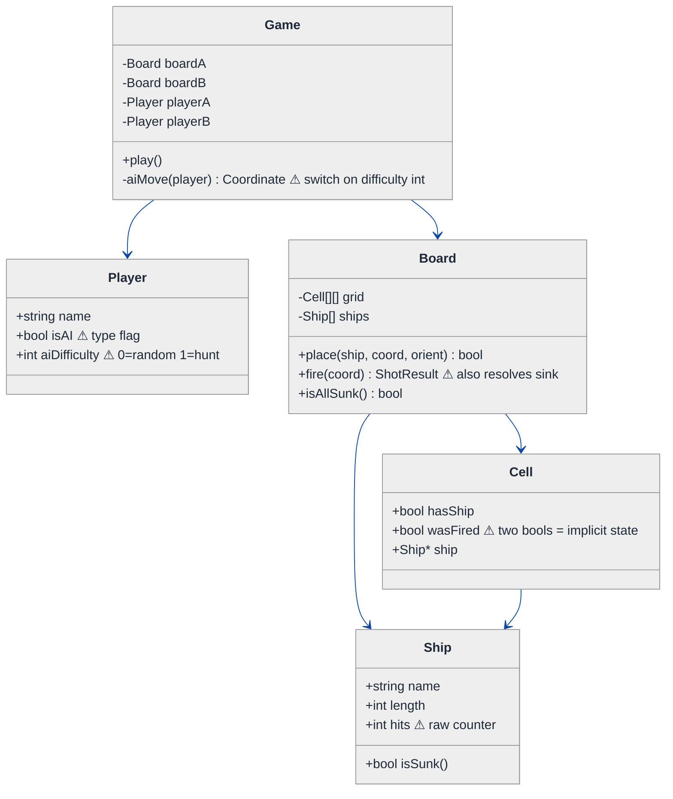
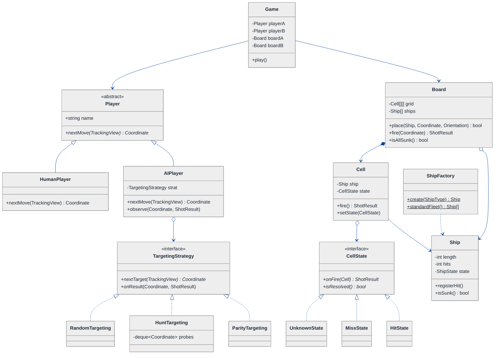
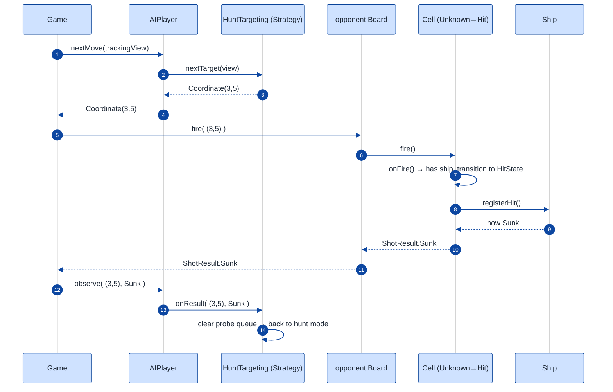

# Battleship Game — LLD Walkthrough

> **Difficulty:** Medium / Hard · **Time:** ~45 min · **Pattern focus:** Strategy (AI targeting algorithm) + State (ship / cell lifecycle) + Factory (ship creation)
>
> **Problem source(s):** LeetLens GID `836db4b6`, bucket `Strategy_Pattern`. "Design a Battleship game supporting grid setup, ship placement with rotation, turn-based attack system, hit/miss tracking, ship sinking detection, and game end condition. Support both human and AI players." See [`./EXTRACTED_QUESTIONS.md`](./EXTRACTED_QUESTIONS.md).
>
> **Diagrams:** inline mermaid (renders natively in GitHub / VS Code). No external image artifacts. The canonical theme block is copied verbatim at the top of every diagram; `look: handDrawn` is intentionally omitted (it rendered dark on some viewers).

---

## How to use this file

Paced for a candidate who has *played* Battleship but never *designed* one. Reading time: ~45 minutes if you sketch each iteration by hand. **The lesson: do not pre-load the answer with patterns. Build the naive game first, watch it crack under three realistic asks — a smarter AI, a different board geometry, a salvo rule — then reach for exactly ONE pattern per painful axis. Strategy for the AI targeting algorithm the *caller* picks, State for the ship/cell lifecycle the *object* transitions through, Factory for the family of ships we keep `new`-ing by hand.**

The single most important skill on display here is **pattern discrimination**: the AI's choice of where to fire is a *behavior the caller swaps* (Strategy), but a cell going `Empty → Hit` or a ship going `Floating → Sunk` is a *lifecycle the object drives itself* (State). Confusing the two is the classic failure.

**Map of this file (15 sections):**

1. Problem statement + clarifying questions
2. Plain-English restatement
3. Why this matters
4. Mental model (domain sketch, not code)
5. Try it yourself first
6. Entity & verb extraction — nouns → classes, verbs → method owners (no patterns yet)
7. **Iteration 1: the naive design** — what we'd write first (mermaid + ~40 lines C++, pattern-free)
8. **Where the naive design hurts** — three future asks, one painful diff each, ending in a pivot question
9. **Pivot 1: Strategy for AI targeting** — the most painful axis first (+ Strategy-vs-State cheatsheet)
10. **Pivot 2: State for ship / cell lifecycle** — the lifecycle axis
11. **Pivot 3: Factory for ship creation** — the construction axis
12. Final UML class diagram + reading guide
13. Skeleton code (C++17, shapes not implementations)
14. Key flow — sequence diagram (fire a shot)
15. Extensibility re-check + anti-patterns + how to think aloud + self-check

---

## 1. Problem statement + clarifying questions

**Prompt (typical phrasing):** "Design a Battleship game. Each player has a grid; ships are placed on the grid (with rotation); players take turns firing at the opponent's grid; the system reports hit / miss / sink; the game ends when one player's fleet is fully sunk. Support both human and AI players."

**Clarifying questions to ask BEFORE drawing anything** (a senior candidate asks these first — the answer to each redraws the design):

1. **Board geometry?** Classic 10×10 square grid, or do we need to support arbitrary `N×M`, or even non-rectangular boards (hex, donut with a hole)? Are coordinates `(row, col)` integer pairs, and is the origin top-left? *This decides whether the board is a hard-coded 2D array or an abstraction behind an interface.*
2. **Ship placement rules?** Fixed fleet (1 carrier, 1 battleship, 2 destroyers, …) or configurable? Ships are straight line segments placed **horizontally or vertically** (rotation = orientation), never diagonal? May ships touch or overlap? Placed by the player, randomly, or both?
3. **Hit / miss / sink reporting?** On a fire, do we tell the shooter only "hit/miss", or also "you sank my Battleship"? Do we reveal the sunk ship's full coordinates? Is firing on an already-fired cell a no-op, a re-report, or an illegal move?
4. **AI targeting strategy?** Does the AI fire purely randomly, or do we need a smarter algorithm — **hunt/target** (random until a hit, then probe the four neighbors), **parity** (only fire on a checkerboard of cells, since the smallest ship spans 2), or a probability-density map? *This is the axis that varies the most and is the heart of the question.*
5. **Single-player vs multiplayer?** Human-vs-AI only, human-vs-human (hotseat), AI-vs-AI (for testing)? Is it strictly **turn-based two-player**, or could there be >2 players?
6. **Salvo / shots-per-turn?** Classic one-shot-per-turn, or "salvo" mode where you fire as many shots as you have ships still afloat?
7. **Persistence / concurrency?** In-memory single process for the interview, or save/resume? Single-threaded turn loop assumed?

**Assumptions if the interviewer dodges:** a configurable `N×M` rectangular board (default 10×10) behind a small abstraction so geometry can change; a configurable fleet of straight ships placed horizontally or vertically, no overlap, may touch; fire reports `MISS / HIT / SUNK(shipName)`; firing a repeated cell is rejected; **the AI targeting algorithm is pluggable** (random, hunt/target, parity — this is the crux); strictly turn-based two players, each a human OR an AI; classic one-shot-per-turn with salvo flagged as a future ask; single process, single-threaded turn loop.

---

## 2. Plain-English restatement

We are building the engine behind Battleship. Each player owns a grid and a fleet of ships laid out on it. On a turn, the active player names a coordinate on the *opponent's* grid; the engine resolves that into a miss, a hit, or a hit-that-sinks-a-ship, and records it so nobody fires the same cell twice. When every cell of every ship in a fleet has been hit, that fleet is sunk and the other player wins. A "player" is either a human (who supplies coordinates from outside) or an AI (which *computes* its next coordinate). The design must let us add **new AI targeting algorithms**, **new board geometries**, and **new turn rules (like salvo)** without rewriting the turn loop or the hit-resolution math, and it must make **illegal moves structurally impossible** (you cannot fire on an empty board, cannot re-fire a known cell) rather than guarded by a thicket of scattered `if` checks.

---

## 3. Why this matters

Battleship is a deceptively rich LLD prompt because it hides *three independent axes of change* behind a familiar game. The skill being probed is **pattern discrimination under pressure**: candidates who write one giant `Game::play()` with an `if (player.isAI)` and a nested `switch (aiLevel)` fail, because they've fused three things that vary independently. The strong candidate names *which* axis is the AI's swappable algorithm (Strategy), *which* is a lifecycle the object drives (State), and *which* is a construction family (Factory) — and can defend why each is NOT one of its confusable siblings. The exact same three-way split reappears in chess engines (move-selection Strategy, piece-state, piece Factory), trading bots (signal Strategy, order State), and any turn-based simulation. Get it right here and you've got a transferable template.

---

## 4. Mental model

Picture two sealed grids facing each other, like two players sitting back to back. Each grid has ships hidden on it and a "tracking" overlay where you record your shots at the *other* grid. A turn is: the active player points at one cell of the opponent's grid; a referee looks behind the screen, says "miss" or "hit" (and "...and that sinks the Destroyer" if it was the ship's last cell), and marks the overlay. An AI player is just a player whose pointing finger is replaced by a little algorithm box you can swap out.

```
Real-world sketch (NOT a UML diagram yet):

  PLAYER A                          REFEREE / RESOLVER              PLAYER B
  ┌───────────────┐                                                ┌───────────────┐
  │  own grid     │   "fire (3,5)"   ┌────────────────────┐        │  own grid     │
  │  S S . . .    │  ───────────────►│ look behind B's     │        │  . . . S S    │
  │  . . . D .    │                  │ screen at (3,5):    │        │  . . . . .    │
  │  . . . D .    │                  │  is a ship there?   │        │  . D . . .    │
  └───────────────┘                  │  was the ship's     │        │  . D . . .    │
  ┌───────────────┐  ◄───────────────│  last cell?         │        └───────────────┘
  │ tracking grid │   "HIT + SUNK"   └────────────────────┘
  │  o o X . .    │
  └───────────────┘     ▲
                        │
              ┌─────────────────────┐   the AI player's "finger" is a swappable box:
              │ AI targeting box    │   random | hunt-then-target | parity
              └─────────────────────┘
```

The KEY insight from this picture: there are **three different shapes** here, and they want three different tools. (1) The AI's *finger* — how it picks a cell — is a behavior the *game* hands to the player and could swap at runtime → that smells like Strategy. (2) A cell goes `Unknown → Miss` or `Unknown → Hit`, and a ship goes `Floating → Damaged → Sunk` — those are *lifecycles the object transitions through itself* → that smells like State. (3) We keep constructing Carrier/Battleship/Destroyer ships of fixed lengths → that's a *creation family* → that smells like Factory. We will derive each, not assert it.

---

## 5. Try it yourself first

> **Predict before reading on:**
>
> 1. List 5 nouns you'd promote to a class and 3 you'd leave as plain fields.
> 2. **If the product owner says "next sprint the AI must use a hunt-then-target algorithm instead of pure random," what breaks in a design where `Game::aiMove()` is one method with the random logic inlined?** Name the file and the method that has to change, and what else risks breaking.
> 3. A player fires on a cell they already fired on last turn. Where does that get rejected — a scattered `if` at the call site, or something structural inside the cell itself? Which is safer as the game grows?
> 4. Who decides a ship is "sunk" — the ship, the board, or the game loop? What information does that decision need, and where does it naturally live?

---

## 6. Entity & verb extraction

> **Mini-refresher: noun → class, but not every noun.**
>
> Naive OOD promotes every noun to a class. Senior OOD promotes a noun only if it has BOTH behavior and state that belong together. "Coordinate" stays a small value type; "Board" becomes a class because it owns cells AND the place/fire behavior; "Ship" becomes a class because it has a *lifecycle* (afloat → sunk). **No design patterns yet** — we're just listing candidates.

**Nouns from the prompt → class candidates:**

| Noun | Decision | Why |
|---|---|---|
| Board / Grid | Class | Owns the cell matrix + ships; place / fire / isAllSunk |
| Cell | Class (or value) | Holds what's at a coordinate and whether it's been fired; has a tiny lifecycle |
| Ship | Class | Occupies cells; tracks hits; knows when it's sunk — has STATE |
| Coordinate (row, col) | Value type (struct) | No behavior; just an addressable pair |
| Orientation | `enum class` (Horizontal / Vertical) | A typed flag, not a class |
| Player | Class (abstract: Human / AI) | Owns a board; supplies the next move |
| ShotResult | Value type / `enum class` + payload | The outcome of a fire (MISS / HIT / SUNK + ship name) |
| Fleet | Field on Board (a `vector<Ship>`) | Just the collection of a board's ships; not its own class (yet) |
| Game | Class | Owns two players; runs the turn loop; detects game over |
| Turn / move | Field/concept | Modeled as a method call, not a class |

**Verbs → the class they live on (the naive answer — we'll re-examine in the pivots):**

| Verb | Owner class (first guess) |
|---|---|
| `place(ship, coord, orientation)` | Board |
| `fire(coord)` → ShotResult | Board (looks up the cell, marks it, asks the ship) |
| `checkHit(coord)` | Board / Cell |
| `isSunk()` | Ship (it owns its own hit count) |
| `isAllSunk()` / `hasLost()` | Board |
| `nextMove()` → Coordinate | Player (Human reads input; AI computes) |
| `play()` / turn loop | Game |

Notice the tension already lurking: `nextMove()` for an AI is going to want *different algorithms*, and `Cell` / `Ship` both carry a little state machine. We deliberately ignore that for now and write the dumbest thing that works.

---

## 7. Iteration 1: the naive design

What a competent-but-pattern-unaware engineer writes first. One `Board` with a 2D array, a `Ship` that counts its hits, a `Player` base with an `isAI` flag, and a `Game` loop that branches on `if (player.isAI)` and `switch`-es on an AI difficulty int. **This works. It has zero design patterns. Then we'll see what's wrong with it.**

### 7.1 Naive class diagram



### 7.2 Naive C++17 skeleton (no patterns — straight if/else)

```cpp
enum class Orientation { Horizontal, Vertical };
enum class ShotResult  { Miss, Hit, Sunk, Repeat };

struct Coordinate { int row, col; };

struct Cell {
    bool  hasShip  = false;
    bool  wasFired = false;   // two bools encode the cell's "state"
    Ship* ship     = nullptr; // raw back-pointer
};

struct Ship {
    std::string name;
    int  length = 0;
    int  hits   = 0;          // raw counter, no lifecycle object
    bool isSunk() const { return hits >= length; }
};

class Board {
public:
    Board(int rows, int cols) : grid_(rows, std::vector<Cell>(cols)) {}

    bool place(Ship* s, Coordinate c, Orientation o) {
        // bounds + overlap checks inlined here ... (elided)
        for (int i = 0; i < s->length; ++i) {
            int r = c.row + (o == Orientation::Vertical ? i : 0);
            int k = c.col + (o == Orientation::Horizontal ? i : 0);
            grid_[r][k].hasShip = true;
            grid_[r][k].ship    = s;
        }
        ships_.push_back(s);
        return true;
    }

    ShotResult fire(Coordinate c) {
        Cell& cell = grid_[c.row][c.col];
        if (cell.wasFired) return ShotResult::Repeat;   // scattered guard
        cell.wasFired = true;
        if (!cell.hasShip) return ShotResult::Miss;
        cell.ship->hits++;                              // Board mutates Ship's counter
        return cell.ship->isSunk() ? ShotResult::Sunk : ShotResult::Hit;
    }

    bool isAllSunk() const {
        for (auto* s : ships_) if (!s->isSunk()) return false;
        return true;
    }
private:
    std::vector<std::vector<Cell>> grid_;
    std::vector<Ship*>             ships_;
};

struct Player { std::string name; bool isAI = false; int aiDifficulty = 0; };

class Game {
public:
    void play() {
        while (true) {
            Coordinate move = current_->isAI ? aiMove(*current_) : humanMove();
            ShotResult r = opponentBoard_->fire(move);
            // ... report r ...
            if (opponentBoard_->isAllSunk()) break;
            swapTurn();
        }
    }
private:
    Coordinate aiMove(const Player& p) {
        switch (p.aiDifficulty) {        // ⚠ the smell we will fix in §9
            case 0: return randomCell();
            case 1: return huntCell();   // hunt logic inlined inside Game
            default: return randomCell();
        }
    }
    Coordinate randomCell();  // elided
    Coordinate huntCell();    // elided
    Coordinate humanMove();   // elided
    void swapTurn();          // elided
    Board* opponentBoard_ = nullptr;
    Player* current_      = nullptr;
};
```

This compiles and plays a full game. It has **zero design patterns** — just enums, structs, a 2D array, and conditionals. That's a feature, not a bug, at this stage: we don't add structure until a concrete pain demands it. Now let's make it hurt.

---

## 8. Where the naive design hurts

Three realistic future asks. For each: name the change, walk the files + lines that move, name the smell, and surface a pivot question.

### 8.1 Ask: "Add a smarter AI — hunt/target, then parity"

The product owner wants three AI difficulties: random (have it), **hunt/target** (random until a hit, then systematically fire the four orthogonal neighbors of the hit until the ship sinks), and **parity** (only fire cells where `(row+col)` is even — since the shortest ship is length 2, this halves wasted shots while guaranteeing coverage).

**What changes in the naive design:**

- `Game::aiMove()` — add `case 2: return parityCell();` and a third `case`. The `switch` grows every time.
- `Game` gains `huntCell()`, `parityCell()`, plus the *state these algorithms need*: hunt/target must remember "where was the last hit, which neighbors are still untried." That state has no home, so it leaks into `Game` as more member fields (`std::vector<Coordinate> huntStack_; bool inHuntMode_;`) — fields that are meaningless for the random and parity AIs.
- Every algorithm now lives in the `Game` class, which is supposed to run the *turn loop*, not be a library of targeting heuristics.

**The smell:** **open/closed violation** + **a god class**. Adding a behavior means editing `Game` (not extending it), and `Game` accumulates state that only one of its branches uses. Two AIs that share nothing now share a class and a `switch`.

### 8.2 Ask: "Support a different board geometry"

Marketing wants a "mega" 15×20 board, and an event mode on a board with a hole in the middle (a few coordinates are off-limits). Later, possibly a hex grid.

**What changes in the naive design:**

- `Board`'s constructor hard-codes a rectangular `std::vector<std::vector<Cell>>`. A hole or a hex layout has no representation.
- `Board::place()` and `Board::fire()` index with `grid_[r][k]` and do bounds checks assuming a dense rectangle — every off-limits-cell or non-rectangular shape forces special-casing inside both methods.
- Random/hunt/parity AI all assume `0..rows × 0..cols`; they'd fire into the hole.

**The smell:** **geometry knowledge is duplicated** across `Board::place`, `Board::fire`, and the AI move generators. There's no single abstraction for "what coordinates are valid." (We'll note the fix but keep it light — geometry isn't this question's headline axis.)

### 8.3 Ask: "Add salvo mode"

In salvo mode, on your turn you fire **as many shots as you have ships still afloat** (5 ships up → 5 shots this turn), all resolved before the opponent replies.

**What changes in the naive design:**

- `Game::play()`'s loop fires exactly one shot per turn. Salvo means wrapping the fire call in a `for (k = 0; k < current_->shipsAfloat(); ++k)` — but that count lives on the *board*, the turn-advance logic is tangled with the single-shot assumption, and the human-vs-AI branch must now collect *N* moves, not one.
- `aiMove()` returns one `Coordinate`; salvo wants a batch, and a smart AI's salvo should not waste two shots on the same cell — more state, again homeless.

**The smell:** the **turn rule (how many shots, in what order) is hard-coded into the loop**, fused with move generation. Different rule sets can't coexist.

### 8.4 Pivot question

Three asks, three axes:

> **What varies independently here?**
> 1. *How the AI chooses a cell* — an **algorithm the game picks for a player** and could swap at runtime (random vs hunt vs parity).
> 2. *What a cell or ship IS right now* — a **lifecycle the object transitions through itself** (cell: unknown → hit/miss; ship: floating → damaged → sunk).
> 3. *Which concrete ships make up a fleet* — a **construction family** we keep `new`-ing by hand.

Axis 1 is the most painful (it grew a `switch` and homeless state) so we attack it first. The phrase "*an algorithm the caller selects and swaps at runtime*" is the textbook trigger for one specific pattern.

---

## 9. Pivot 1: Strategy for AI targeting

The most painful axis is *how the AI picks its next cell*. The variability is **the algorithm itself**, and the *game* (the caller) decides which one a given AI player uses. That is precisely Strategy.

> **Mini-refresher: Strategy pattern.**
>
> Encapsulates an interchangeable algorithm behind an interface so it can be swapped at runtime. The **caller** picks which strategy to use; the strategy doesn't know about its peers and owns whatever state *its own* algorithm needs. Quick example: a `Sorter` takes a `CompareStrategy*`; pass `Ascending` or `Descending` and the sorter doesn't care. Here, an `AIPlayer` takes a `TargetingStrategy*`; pass `RandomTargeting`, `HuntTargeting`, or `ParityTargeting`.

### 9.1 The refactor

Pull every targeting algorithm out of `Game` and behind a `TargetingStrategy` interface. Each concrete strategy owns the state *it* needs (hunt keeps its own probe queue), so `Game` stops hoarding fields it doesn't use. The strategy's one job: given a view of the tracking grid (which cells are known miss/hit/unknown), return the next coordinate to fire.

```cpp
// The view of past shots a strategy is allowed to read (read-only).
class TrackingView {
public:
    virtual ~TrackingView() = default;
    virtual int  rows() const = 0;
    virtual int  cols() const = 0;
    virtual bool isUnknown(Coordinate c) const = 0; // never fired here
    virtual bool wasHit(Coordinate c)    const = 0; // fired, hit a ship
    virtual bool isValid(Coordinate c)   const = 0; // inside playable geometry
};

// ── Strategy interface ──────────────────────────────────────────────
class TargetingStrategy {
public:
    virtual ~TargetingStrategy() = default;
    virtual Coordinate nextTarget(const TrackingView& view) = 0;
    // Optional hook so a strategy can update its own state after seeing a result.
    virtual void onResult(Coordinate fired, ShotResult r) { (void)fired; (void)r; }
};

// ── Concrete strategy 1: pure random ────────────────────────────────
class RandomTargeting : public TargetingStrategy {
public:
    Coordinate nextTarget(const TrackingView& v) override {
        Coordinate c;
        do { c = {rand() % v.rows(), rand() % v.cols()}; }
        while (!v.isValid(c) || !v.isUnknown(c));
        return c;                       // owns no extra state
    }
};

// ── Concrete strategy 2: hunt/target (owns its own probe queue) ──────
class HuntTargeting : public TargetingStrategy {
public:
    Coordinate nextTarget(const TrackingView& v) override {
        while (!probes_.empty()) {                  // target mode
            Coordinate c = probes_.front(); probes_.pop_front();
            if (v.isValid(c) && v.isUnknown(c)) return c;
        }
        return randomUnknown(v);                    // hunt mode
    }
    void onResult(Coordinate fired, ShotResult r) override {
        if (r == ShotResult::Hit)                    // enqueue 4 neighbours
            for (auto n : neighbours(fired)) probes_.push_back(n);
        if (r == ShotResult::Sunk) probes_.clear();  // ship done, back to hunt
    }
private:
    std::deque<Coordinate> probes_;                  // state lives HERE, not in Game
    Coordinate randomUnknown(const TrackingView&);   // elided
    static std::array<Coordinate,4> neighbours(Coordinate); // elided
};
// ParityTargeting elided — same shape, fires only on (row+col)%2==0 cells.
```

`Game::aiMove()` and its `switch` are gone. An AI player simply *holds* a strategy:

```cpp
class AIPlayer : public Player {
public:
    explicit AIPlayer(std::unique_ptr<TargetingStrategy> s) : strat_(std::move(s)) {}
    Coordinate nextMove(const TrackingView& v) override {
        Coordinate c = strat_->nextTarget(v);
        return c;
    }
    void observe(Coordinate fired, ShotResult r) { strat_->onResult(fired, r); }
private:
    std::unique_ptr<TargetingStrategy> strat_;   // the swappable "finger"
};
```

Adding a probability-density AI is now a *new class* implementing `TargetingStrategy` — zero edits to `Game`, `Board`, or the other strategies. Open/closed satisfied.

### 9.2 Pattern-discrimination cheatsheet

> **Strategy vs State.**
> - *Strategy:* the **caller** picks which algorithm to use (`new AIPlayer(make_unique<HuntTargeting>())`).
> - *State:* the **object itself** flips between behaviors via internal transitions in response to events.
> - *Rule of thumb:* if something *external* calls `setStrategy(x)` / chooses it at construction → **Strategy**. If the object calls `transitionTo(next)` inside `handle(event)` → **State**.
> - *Subtle trap here:* HuntTargeting *internally* switches between "hunt mode" and "target mode." Isn't that State? **No** — that internal mode flip is private bookkeeping of one algorithm; the *game* still picked "hunt" from outside and never sees the mode. The unit of swappability that the caller controls is the whole algorithm → Strategy. (Contrast §10, where the *cell* itself drives `Unknown → Hit` and the caller never picks that.)

> **Strategy vs Template Method.**
> - *Template Method:* vary steps of a fixed algorithm via **inheritance** (override hook methods on a base class).
> - *Strategy:* vary the **whole** algorithm via **composition** (hold a pointer to an interface).
> - *Why Strategy here:* an `AIPlayer` should be able to *change* its targeting at runtime and we don't want a `RandomAIPlayer` / `HuntAIPlayer` class explosion. Composition over inheritance wins.

---

## 10. Pivot 2: State for ship / cell lifecycle

Recall the naive `Cell` carried two bools (`hasShip`, `wasFired`) and `Ship` carried a raw `hits` counter with an `isSunk()` derived from it. That's a state machine *encoded in primitives* — and the `fire()` logic in §7 had to re-derive "what does firing mean right now?" with conditionals every call. The variability here is different from Strategy: **the object transitions through a lifecycle itself**, and *nobody outside picks* "go to Sunk" — it happens because of what was done to the object.

> **Mini-refresher: State pattern.**
>
> Lets an object alter its behavior when its internal state changes — the object *appears to change class*. Each state is an object implementing a common interface; the context delegates to its current state, and a state can transition the context to the next state in response to an event. The difference from Strategy is the driver: **the object transitions itself** in `handle(event)`, rather than a caller swapping the algorithm.

### 10.1 The refactor — Cell lifecycle

A cell is one of: `Unknown` (never fired), `Miss` (fired, empty), or `Hit` (fired, ship there). The transition `Unknown → {Miss|Hit}` is driven by `fire()`; an already-resolved cell *refuses* a second fire — and that refusal is now structural (the `Unknown` state is the only one that accepts a fire), not a scattered `if (cell.wasFired)` at the call site.

```cpp
class Cell;  // forward — context, defined below

// ── State interface ─────────────────────────────────────────────────
class CellState {
public:
    virtual ~CellState() = default;
    virtual ShotResult onFire(Cell& cell) = 0;  // returns outcome + may transition
    virtual bool isResolved() const = 0;
};

// ── Concrete states ─────────────────────────────────────────────────
class UnknownState : public CellState {        // the ONLY state that accepts a fire
public:
    ShotResult onFire(Cell& cell) override;     // transitions cell to Miss or Hit
    bool isResolved() const override { return false; }
};
class MissState : public CellState {
public:
    ShotResult onFire(Cell&) override { return ShotResult::Repeat; } // refuses
    bool isResolved() const override { return true; }
};
class HitState : public CellState {
public:
    ShotResult onFire(Cell&) override { return ShotResult::Repeat; } // refuses
    bool isResolved() const override { return true; }
};

// ── Context ─────────────────────────────────────────────────────────
class Cell {
public:
    Cell() : state_(std::make_unique<UnknownState>()) {}
    ShotResult fire() { return state_->onFire(*this); } // delegates — no if-ladder
    void setState(std::unique_ptr<CellState> s) { state_ = std::move(s); }
    bool hasShip() const { return ship_ != nullptr; }
    Ship* ship() const   { return ship_; }
private:
    Ship* ship_ = nullptr;                  // set during placement
    std::unique_ptr<CellState> state_;      // the lifecycle, made explicit
};
```

`UnknownState::onFire` is where the one transition decision lives — if the cell has a ship it becomes `HitState` and tells the ship it was hit (which may sink it, see below), else `MissState`. Every other state's `onFire` is a uniform "Repeat." The `if (cell.wasFired)` guard from §7 has vanished into the type system.

Ships get the same treatment at a coarser grain — `Floating → Damaged → Sunk` — so `isSunk()` is no longer a counter comparison scattered around but a state the ship *enters* when its last cell is hit, and the **ship itself** decides to transition (the board just delivers the hit event):

```cpp
class Ship {
public:
    void registerHit() {                        // event from a HitState
        if (++hits_ == length_) state_ = ShipState::Sunk;
        else                    state_ = ShipState::Damaged;
    }
    bool isSunk() const { return state_ == ShipState::Sunk; }
private:
    enum class ShipState { Floating, Damaged, Sunk };
    int hits_ = 0, length_ = 0;
    ShipState state_ = ShipState::Floating;
};
```

(For a ship the lifecycle is simple enough that an `enum class` state field is the pragmatic choice — full State *objects* would be over-engineering. The teachable point: Cell needed polymorphic behavior per state, Ship needed only a labeled transition. Use the heavier State-object form only where behavior genuinely differs per state.)

### 10.2 Pattern-discrimination cheatsheet

> **State vs Strategy (the headline confusion for this question).**
> - *State:* `cell.fire()` — the cell looks at its *current* state and transitions itself; no external code says "become Hit." Behavior changes as a side effect of events.
> - *Strategy:* `aiPlayer.nextMove()` — the game *chose* which targeting algorithm at construction; the algorithm never spontaneously becomes a different algorithm.
> - *Rule of thumb:* **internal, event-driven transition ⇒ State. External, caller-chosen swap ⇒ Strategy.** Same UML shape (context + interface + concretes); opposite *driver*.

> **State vs a plain enum + switch.**
> - For a 2-3 state machine with trivial behavior (Ship), a labeled `enum class` is fine.
> - Promote to full State *objects* when each state has substantially different *behavior* and you'd otherwise repeat the same `switch(state)` in several methods (Cell's `onFire` differs sharply per state, and we want illegal transitions to be *unrepresentable*).

---

## 11. Pivot 3: Factory for ship creation

The remaining axis: we keep hand-constructing the fleet — `new Ship{"Carrier",5}`, `new Ship{"Battleship",4}`, two destroyers, and so on — scattered wherever a board is set up. A configurable or alternate fleet (the "mega board" wants bigger ships) means hunting down every `new Ship{...}`. The variability is **which concrete ships make up a fleet**, i.e. a construction family.

> **Mini-refresher: Factory (Factory Method / simple factory).**
>
> Centralizes object creation behind a method so callers ask for *what* they want, not *how* to build it. Decouples client code from concrete constructors, so changing the family (different lengths, a custom fleet) touches one place. Cousin of Abstract Factory (which builds *families of related* objects) and Builder (which assembles one complex object step by step).

### 11.1 The refactor

```cpp
enum class ShipType { Carrier, Battleship, Cruiser, Submarine, Destroyer };

// ── Simple factory: one place that knows ship dimensions ────────────
class ShipFactory {
public:
    static std::unique_ptr<Ship> create(ShipType t) {
        switch (t) {
            case ShipType::Carrier:    return make("Carrier",    5);
            case ShipType::Battleship: return make("Battleship", 4);
            case ShipType::Cruiser:    return make("Cruiser",    3);
            case ShipType::Submarine:  return make("Submarine",  3);
            case ShipType::Destroyer:  return make("Destroyer",  2);
        }
        throw std::invalid_argument("unknown ship type");
    }
    // The standard fleet as data, not scattered `new`s.
    static std::vector<std::unique_ptr<Ship>> standardFleet() {
        std::vector<std::unique_ptr<Ship>> f;
        for (auto t : {ShipType::Carrier, ShipType::Battleship,
                       ShipType::Cruiser, ShipType::Submarine, ShipType::Destroyer})
            f.push_back(create(t));
        return f;
    }
private:
    static std::unique_ptr<Ship> make(std::string n, int len); // elided
};
```

Now a "mega fleet" or a "custom fleet from a config file" is a *new factory method* (or a data-driven variant), not a sweep across the codebase. Board setup just calls `ShipFactory::standardFleet()`.

### 11.2 Pattern-discrimination cheatsheet

> **Factory vs Builder.**
> - *Factory:* pick *which* object to create from a closed set (a Carrier vs a Destroyer) in one call.
> - *Builder:* assemble *one* complex object through many optional steps (a fluent `BoardBuilder().size(15,20).addShip(...).withHole(...)`).
> - *Rule of thumb:* choosing among variants ⇒ Factory; configuring a single multi-part object ⇒ Builder. Ship selection is a closed variant set ⇒ Factory. (If board *construction* grows many knobs, a `BoardBuilder` becomes attractive — note it, don't force it.)

> **Factory vs raw `new`.**
> - Raw `new Ship{...}` scatters the "Carrier = length 5" knowledge across the codebase and couples every call site to the concrete constructor.
> - Factory centralizes that knowledge, so a dimension change or a new fleet is a one-file edit.

---

## 12. <a id="fig-class-diagram"></a>12. Final class diagram



**Reading guide (paragraph 1 — the spine).** `Game` owns two `Player`s and two `Board`s and runs the turn loop, nothing more — it no longer knows any targeting heuristic or any "was this cell fired" rule. A `Board` *composes* its `Cell` grid (solid-diamond composition: cells die with the board) and *aggregates* the `Ship`s placed on it. On a turn, `Game` asks the active `Player` for a move, then calls `fire()` on the opponent's `Board`, which delegates to the addressed `Cell`.

**Reading guide (paragraph 2 — the three patterns).** Three families hang off the spine, one per axis we derived. **Strategy:** `AIPlayer` holds a `TargetingStrategy` (aggregation — the algorithm is injected and swappable); `Random`/`Hunt`/`Parity` implement it, and `Hunt` owns its own probe queue so `Game` stays clean. **State:** each `Cell` holds a `CellState` (`Unknown`/`Miss`/`Hit`); `fire()` delegates to the current state, which decides the outcome and transitions the cell — making a repeat fire structurally impossible rather than guarded by an `if`. `Ship` carries a lighter labeled state (`Floating`/`Damaged`/`Sunk`) it enters itself on `registerHit()`. **Factory:** `ShipFactory` is the one place that knows ship dimensions and assembles the standard fleet, so an alternate fleet is a one-file change. Note the *driver* contrast that defines the whole design: the `AIPlayer`→`Strategy` link is chosen *by the caller*; the `Cell`→`State` link transitions *by the object itself*.

---

## 13. Skeleton code (C++17)

Shapes, not implementations: abstract bases, `enum class`, `std::unique_ptr` for ownership, `// elided` for the labor. One or two concretes per pattern.

```cpp
#include <deque>
#include <memory>
#include <string>
#include <vector>

enum class Orientation { Horizontal, Vertical };
enum class ShotResult  { Miss, Hit, Sunk, Repeat };
enum class ShipType    { Carrier, Battleship, Cruiser, Submarine, Destroyer };

struct Coordinate { int row, col; };

// ── Read-only view a targeting Strategy is allowed to see ───────────
class TrackingView {
public:
    virtual ~TrackingView() = default;
    virtual int  rows() const = 0;
    virtual int  cols() const = 0;
    virtual bool isUnknown(Coordinate) const = 0;
    virtual bool wasHit(Coordinate)    const = 0;
    virtual bool isValid(Coordinate)   const = 0;
};

// ── STRATEGY: targeting algorithm (caller picks) ───────────────────
class TargetingStrategy {
public:
    virtual ~TargetingStrategy() = default;
    virtual Coordinate nextTarget(const TrackingView&) = 0;
    virtual void onResult(Coordinate, ShotResult) {}
};
class RandomTargeting : public TargetingStrategy {
public:
    Coordinate nextTarget(const TrackingView&) override; // elided
};
class HuntTargeting : public TargetingStrategy {
public:
    Coordinate nextTarget(const TrackingView&) override; // elided
    void onResult(Coordinate, ShotResult) override;      // elided
private:
    std::deque<Coordinate> probes_;   // algorithm-local state
};
// ParityTargeting elided — same interface

// ── STATE: cell lifecycle (object transitions itself) ──────────────
class Cell;
class CellState {
public:
    virtual ~CellState() = default;
    virtual ShotResult onFire(Cell&) = 0;
    virtual bool isResolved() const = 0;
};
class UnknownState : public CellState {       // only state that accepts a fire
public:
    ShotResult onFire(Cell&) override;        // transitions to Hit/Miss; elided
    bool isResolved() const override { return false; }
};
class MissState : public CellState {
public:
    ShotResult onFire(Cell&) override { return ShotResult::Repeat; }
    bool isResolved() const override { return true; }
};
class HitState : public CellState {
public:
    ShotResult onFire(Cell&) override { return ShotResult::Repeat; }
    bool isResolved() const override { return true; }
};

// ── Ship: light labeled state machine ──────────────────────────────
class Ship {
public:
    Ship(std::string name, int length) : name_(std::move(name)), length_(length) {}
    void registerHit();          // ++hits_; may enter Sunk — elided
    bool isSunk() const;         // elided
    const std::string& name() const { return name_; }
    int length() const { return length_; }
private:
    enum class ShipState { Floating, Damaged, Sunk };
    std::string name_;
    int length_, hits_ = 0;
    ShipState state_ = ShipState::Floating;
};

// ── FACTORY: ship construction family ──────────────────────────────
class ShipFactory {
public:
    static std::unique_ptr<Ship> create(ShipType);                 // elided
    static std::vector<std::unique_ptr<Ship>> standardFleet();     // elided
};

// ── Cell context ───────────────────────────────────────────────────
class Cell {
public:
    Cell() : state_(std::make_unique<UnknownState>()) {}
    ShotResult fire() { return state_->onFire(*this); }
    void setState(std::unique_ptr<CellState> s) { state_ = std::move(s); }
    Ship* ship() const { return ship_; }
    void  setShip(Ship* s) { ship_ = s; }
private:
    Ship* ship_ = nullptr;
    std::unique_ptr<CellState> state_;
};

// ── Board ──────────────────────────────────────────────────────────
class Board {
public:
    Board(int rows, int cols) : grid_(rows, std::vector<Cell>(cols)) {}
    bool       place(Ship*, Coordinate, Orientation);  // elided
    ShotResult fire(Coordinate c) { return grid_[c.row][c.col].fire(); }
    bool       isAllSunk() const;                        // elided
private:
    std::vector<std::vector<Cell>> grid_;
    std::vector<std::unique_ptr<Ship>> ships_;
};

// ── Players ────────────────────────────────────────────────────────
class Player {
public:
    explicit Player(std::string name) : name_(std::move(name)) {}
    virtual ~Player() = default;
    virtual Coordinate nextMove(const TrackingView&) = 0;
    const std::string& name() const { return name_; }
protected:
    std::string name_;
};
class HumanPlayer : public Player {
public:
    using Player::Player;
    Coordinate nextMove(const TrackingView&) override;   // reads input; elided
};
class AIPlayer : public Player {
public:
    AIPlayer(std::string name, std::unique_ptr<TargetingStrategy> s)
        : Player(std::move(name)), strat_(std::move(s)) {}
    Coordinate nextMove(const TrackingView& v) override { return strat_->nextTarget(v); }
    void observe(Coordinate c, ShotResult r) { strat_->onResult(c, r); }
private:
    std::unique_ptr<TargetingStrategy> strat_;
};

// ── Game (turn loop only) ──────────────────────────────────────────
class Game {
public:
    Game(std::unique_ptr<Player> a, std::unique_ptr<Player> b);  // elided
    void play();   // loop: nextMove → fire → report → check win → swap; elided
private:
    std::unique_ptr<Player> a_, b_;
    Board boardA_{10, 10}, boardB_{10, 10};
};
```

---

## 14. <a id="fig-sequence"></a>14. Key flow — sequence diagram (fire a shot)



**What the patterns HIDE from the caller.** `Game` issues exactly two intents — "give me your move" (msg 1) and "resolve this shot" (msg 5) — and learns nothing about *how* either is done. **Strategy hides the targeting algorithm:** between messages 2–3 the `HuntTargeting` strategy consults its private probe queue and may flip between hunt and target mode; `Game` never sees that and would behave identically with `RandomTargeting` swapped in. **State hides the cell lifecycle and the repeat-guard:** at message 6 `Game`/`Board` just call `fire()`; the `Cell` decides — *because of its current state* — whether this is a hit, a miss, or a rejected repeat, and transitions itself (msg 7) plus notifies the `Ship` (msg 8). Nobody outside the cell ever writes `cell.state = Hit` or checks `if (wasFired)`. The post-shot `observe`/`onResult` (msgs 12–14) is how a Strategy gets to learn from the outcome without `Game` knowing why it cares.

---

## 15. Extensibility re-check + anti-patterns + how to think aloud + self-check

### 15.1 Extensibility re-check — do the §8 asks still hurt?

| Future ask | Naive design | Final design |
|---|---|---|
| New AI: probability-density targeting | edit `Game::aiMove` switch + add homeless state | **new `TargetingStrategy` class**, zero edits elsewhere |
| Salvo mode (N shots/turn) | rewrite the turn loop, thread N through fire | turn rule is isolated in `Game::play`; a `TurnPolicy` Strategy drops in cleanly (next pivot if asked) |
| Repeat-fire safety | scattered `if (wasFired)` at every call site | structural — only `UnknownState` accepts a fire |
| Alternate / config fleet | sweep every `new Ship{...}` | **one new `ShipFactory` method** |
| Different board geometry | special-case `place`/`fire` + every AI generator | localize behind `TrackingView::isValid` + a geometry abstraction (noted, light) |

The headline axes (AI algorithm, lifecycle, construction) are now open for extension and closed for modification.

### 15.2 Named anti-patterns this design avoids

- **God class** — the naive `Game` was accreting targeting algorithms, their state, and the turn rule. Strategy + State evacuated all three.
- **Type-flag / `switch`-on-type smell** — `player.isAI` and `switch(aiDifficulty)` are replaced by polymorphism (`Player` subclasses, `TargetingStrategy` implementations).
- **Primitive-obsession state machine** — `bool wasFired` + `int hits` re-deriving "what does firing mean" every call is replaced by explicit `CellState` / ship state.
- **Shotgun surgery** — scattered `new Ship{...}` and scattered `if (wasFired)` guards, each a change that touched many sites, are centralized.
- **Over-engineering caution** — we deliberately did NOT make `Ship` use full State *objects* (an enum sufficed), did NOT force a `BoardBuilder` we don't yet need, and did NOT pre-add a `TurnPolicy` Strategy before salvo is actually asked. Patterns earn their place by a concrete pain.

### 15.3 How to think aloud (first person, in the room)

"I'll resist drawing the final classes first — let me get a naive version on the board so we can attack it. Board with a 2D grid, Ship with a hit counter, Game with a turn loop. Now, what would the interviewer throw at this? A smarter AI — and there it is, my `Game::aiMove` would grow a `switch` and start hoarding hunt-mode state it doesn't own. That's the open/closed smell, and the thing that varies is *the algorithm the game hands the player*, which the caller picks at runtime — that's Strategy, not State, because nothing transitions itself. Next, the cell's `wasFired` bool: a repeated shot is rejected by a scattered `if` today; I'd rather make the `Unknown` state the only one that accepts a fire, so a repeat is *unrepresentable*. That's State — the cell drives its own transition. Lastly I keep `new`-ing Carrier/Destroyer by hand; one `ShipFactory` and an alternate fleet is a one-file change. I'd stop there and only add a `TurnPolicy` Strategy if you want salvo — I won't pre-build it."

### 15.4 Self-check

> **Self-check — the question to ask next time.**
>
> When you see "design a game/engine with multiple AI behaviors and a board of evolving cells," before reaching for inheritance or one big `switch`, ask:
>
> > **"Is this variation a behavior the CALLER picks and could swap at runtime (Strategy), or a lifecycle the OBJECT transitions through itself in response to events (State)?"**
>
> AI targeting → the game picks it → **Strategy**. Cell unknown→hit→miss and ship floating→sunk → the object drives it → **State**. A closed family we keep constructing → **Factory**. If a single design has all three (Battleship does), use all three — and be ready to name why each is NOT its confusable sibling.

---

## Cross-references

- **Parent topic manifest:** [`./EXTRACTED_QUESTIONS.md`](./EXTRACTED_QUESTIONS.md) — Battleship is GID 7 / LeetLens `836db4b6`.
- **Vertical overview:** [`../../LEARNING.md`](../../LEARNING.md)
- **Template:** [`../../TEMPLATE-v2.md`](../../TEMPLATE-v2.md)
- **Canonical exemplar:** [`../Object_Oriented_Design/Parking_Lot.md`](../Object_Oriented_Design/Parking_Lot.md)
- **Related v2 walkthroughs:**
  - [`./Shopping_Cart.md`](./Shopping_Cart.md) — Strategy + Decorator + State on the same design (pricing pipeline + checkout lifecycle).
  - [`./Notification_Service.md`](./Notification_Service.md) — Strategy for delivery channels.
  - [`./Feature_Toggle_Service.md`](./Feature_Toggle_Service.md) — Strategy for rollout rules.
  - [`./Load_Testing_Framework.md`](./Load_Testing_Framework.md) — Strategy for load profiles.
- **Optional editable diagrams:** sibling `.excalidraw` files (supplementary, not required — mermaid is the source of truth).
