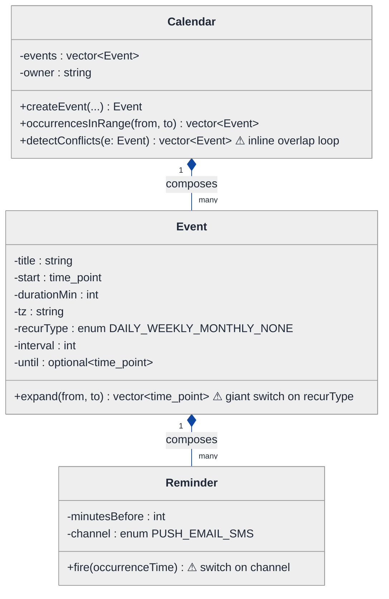
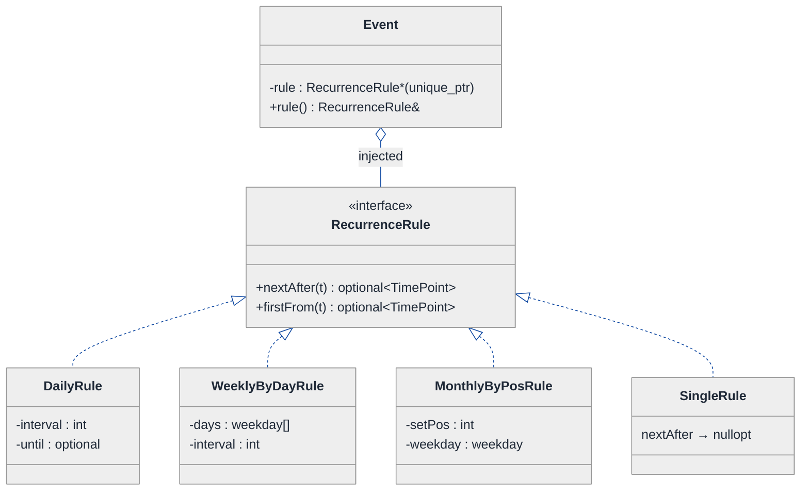
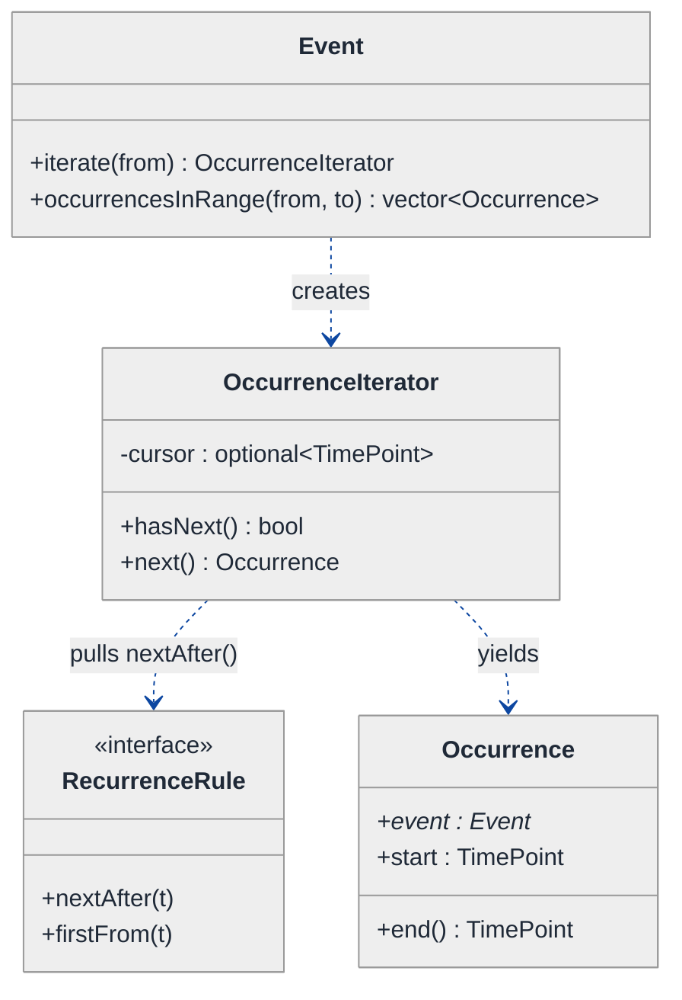
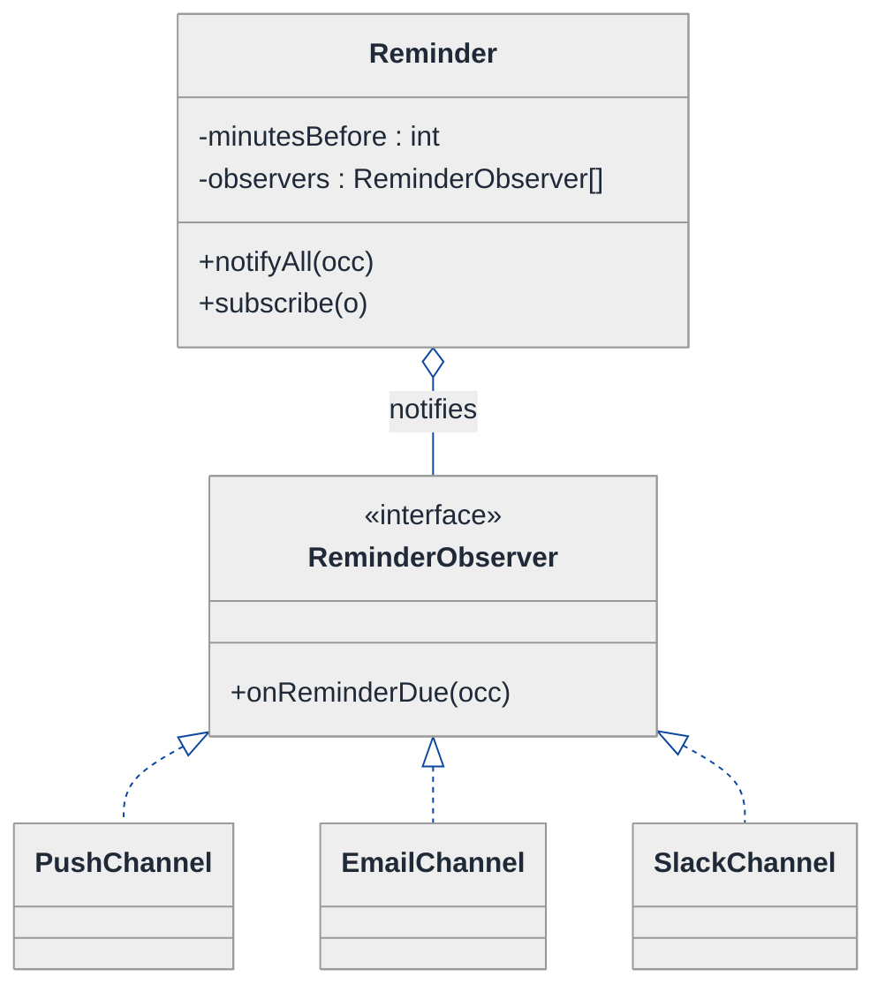
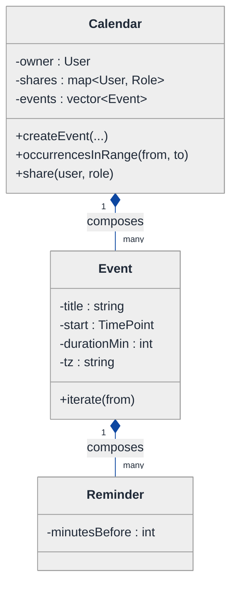
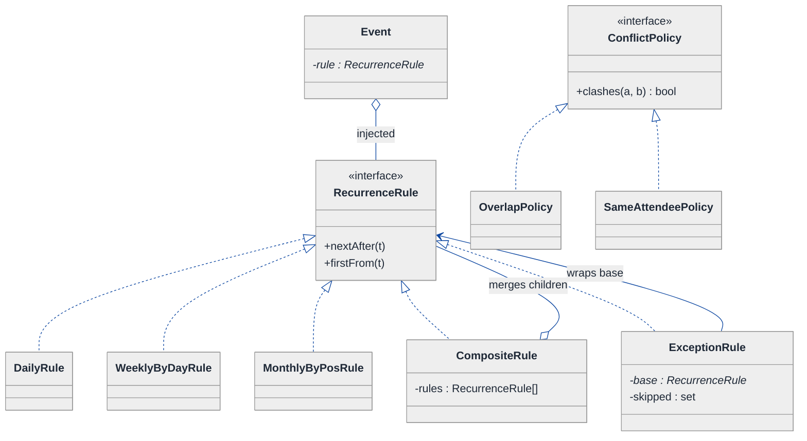
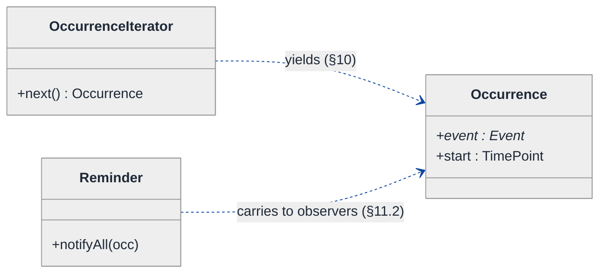
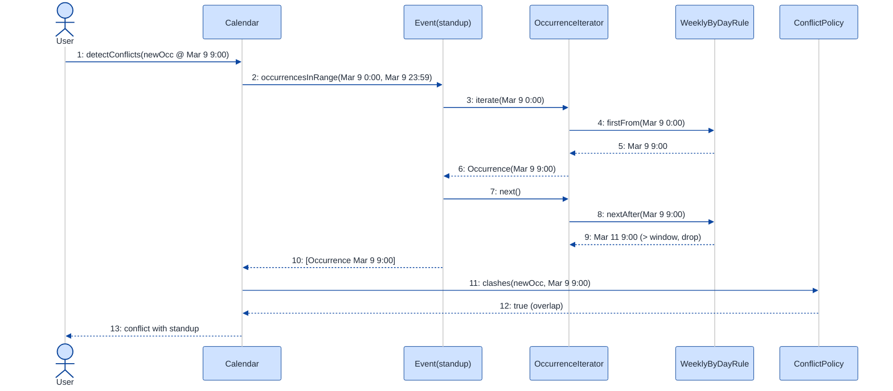
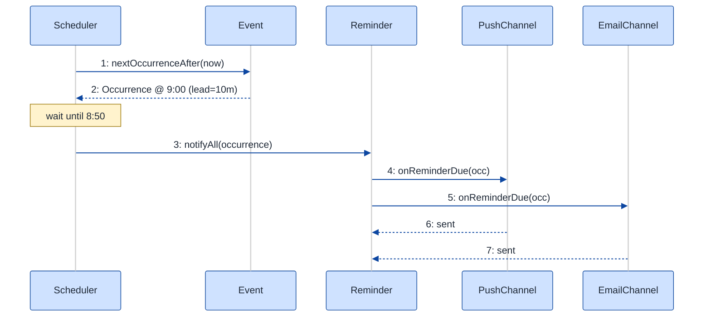

# Calendar Application — LLD Walkthrough

> **Difficulty:** Hard · **Time:** ~45 min · **Pattern focus:** Strategy (recurrence expansion) + Iterator (lazy occurrence stream) — with Observer (reminders) and a Composite/Decorator twist for custom rules
>
> **Problem source(s):** GID `SG13`, bucket `Strategy_Pattern`. Representative of multiple LeetLens "design a calendar / scheduling" rows in [`./EXTRACTED_QUESTIONS.md`](./EXTRACTED_QUESTIONS.md).
>
> **Diagrams:** inline mermaid (renders natively in GitHub / VS Code). Light theme + soft pastel fills + navy arrows — the canonical block from `CONTINUATION.md` §3.

---

## How to use this file

Paced for a candidate seeing "design a calendar" for the first time. Reading time: ~45 minutes if you sketch each iteration by hand. **The lesson: a recurring event is not a row in a table — it is a RULE that GENERATES an infinite stream of occurrences. The instant you model it that way, two patterns fall out: Strategy (the rule is a swappable expansion algorithm) and Iterator (the stream is consumed lazily, one occurrence at a time, because it's unbounded). Everything else — conflict detection, reminders, timezones — hangs off that spine.**

**Map of this file (15 sections):**

1. Problem statement + clarifying questions
2. Plain-English restatement
3. Why this matters
4. Mental model
5. Try it yourself first
6. Entity & verb extraction
7. **Iteration 1: the naive design** — store every occurrence as a row
8. **Where the naive design hurts** — five future requirements, one painful diff each
9. **Pivot 1: Strategy for recurrence** — the most painful axis first
10. **Pivot 2: Iterator for the occurrence stream** — lazy, bounded-on-demand
11. **Pivot 3: Composite recurrence + Observer for reminders** — the remaining axes
12. Final UML class diagram (three sub-views)
13. Skeleton code (C++17)
14. Key flow — sequence diagram
15. Extensibility re-check + anti-patterns + how to think aloud + self-check

---

## 1. Problem statement + clarifying questions

**Prompt (typical phrasing):** "Design a calendar application. Users create events with recurrence rules (daily, weekly, monthly, custom). The system detects conflicts, handles timezones, supports shared calendars, and fires reminders."

**Clarifying questions to ask BEFORE drawing anything:**

1. **How far do recurrences run?** Forever ("every Monday, no end date"), until a date, or for N occurrences? This decides whether we can materialize occurrences or must generate them lazily.
2. **What counts as a conflict?** Any time overlap on the same calendar? Or only events the same person is an attendee of across all their calendars? Do all-day events conflict with timed events?
3. **What does "custom" recurrence mean?** Free-form like "every 2nd Tuesday and last Friday of the month"? Do we need to support the iCalendar RRULE grammar (`FREQ=WEEKLY;INTERVAL=2;BYDAY=MO,WE`)?
4. **Exceptions to a series?** Can a user edit or delete ONE occurrence ("skip next Monday", "move this week's standup to 3pm") without breaking the rest of the series?
5. **Timezone semantics?** Is an event stored in the organizer's timezone and shown in the viewer's? What happens to a recurring 9am meeting across a daylight-saving boundary — does it stay 9am wall-clock or shift?
6. **Shared calendars — permission model?** Read-only vs read-write? Can a viewer add reminders that only they see?
7. **Reminders — delivery channels?** Push, email, SMS? Per-user override of the event's default reminder?
8. **Scale assumption for now?** Single-process, in-memory for the LLD; we'll note where persistence / a job scheduler would slot in (§15).

**Assumptions if interviewer dodges:** recurrences may be infinite (no end date allowed); a conflict = time overlap among events a given user attends; custom = a composable rule set (RRULE-like); per-occurrence exceptions are required; events store a wall-clock time + an IANA timezone id; shared calendars have read/read-write roles; reminders fire to one or more channels; single-process in-memory.

---

## 2. Plain-English restatement

We're building the engine behind a calendar like Google Calendar or Outlook. A user creates an event — maybe a one-off lunch, maybe "team standup every weekday at 9am forever." The system must: expand that rule into actual dated occurrences on demand, show them correctly in whatever timezone the viewer is in, warn when a new event overlaps something the user already has, let people share a calendar with different permissions, and nudge attendees before an event starts. The design must let us add a NEW kind of recurrence rule, a NEW conflict policy, and a NEW reminder channel **without rewriting the core event-expansion loop**.

---

## 3. Why this matters

Calendar is a deceptively deep LLD prompt. The naive instinct — "an event is a row; a recurring event is many rows" — collapses the moment recurrences are infinite or editable per-occurrence. The senior signal is recognizing that **a recurrence rule is an algorithm, and an unbounded sequence of occurrences must be lazy**. That's Strategy + Iterator, the two patterns this prompt is built to probe. The same shape reappears everywhere a system turns a compact rule into an on-demand stream: cron schedulers, billing cycles, retry backoff, pagination over generated data.

---

## 4. Mental model

A calendar is **not** a list of dated boxes. It's a small set of **generators** (recurrence rules) plus a **viewport** (the date range you're currently looking at). When you scroll to next March, the calendar ASKS each event's rule, "give me your occurrences that fall in March," and the rule computes them on the fly.

```
Real-world sketch (NOT a UML diagram yet):

   Event "Standup"  ──owns──►  RecurrenceRule: "every weekday 9:00, forever"
        │                              │
        │                              ▼   (asked: "occurrences in [Mar 1 .. Mar 31]?")
        │                       ┌───────────────────────────────────┐
        │                       │ Mar 2, Mar 3, Mar 4, Mar 5, Mar 6, │  ← generated lazily,
        │                       │ Mar 9, Mar 10, ... (never stored)  │    one at a time
        │                       └───────────────────────────────────┘
        ▼
   Reminders (observers)  ◄── "Standup starting in 10 min" ──┐
   Conflict detector  ◄── "does this overlap your day?" ─────┘
```

The KEY insight from this picture: **the rule is the source of truth, the occurrences are derived and ephemeral.** Generators vs viewport vs derived-stream is the separation we bake into the design. Inventory (events + rules) is policy; the iterator is the orchestration that turns a rule into a bounded answer for a viewport.

---

## 5. Try it yourself first

> **Predict before reading on:**
>
> 1. List 5 nouns you'd promote to a class. Which "noun" is actually a behavior in disguise?
> 2. **If the interviewer says "recurrences can have no end date," what breaks about storing each occurrence as a row in a table?**
> 3. A user wants to delete just *this Friday's* standup but keep the rest of the series. Where does that exception live — on the rule, on the event, or somewhere new?

---

## 6. Entity & verb extraction

> **Mini-refresher: noun → class, but not every noun.**
>
> Naive OOD promotes every noun to a class. Senior OOD promotes a noun only if it has both BEHAVIOR and STATE that need to live together. "Timezone" is mostly a value (an id string + library logic); "recurrence rule" looks like a noun but is really a *generating behavior* — that's the one to watch.

**Nouns from the prompt:**

| Noun | Decision | Why |
|---|---|---|
| Calendar | Class (owns events, has sharing roles) | Container + permission boundary |
| Event | Class | The series definition: title, start, duration, rule |
| RecurrenceRule | Class (abstract) — **a behavior** | Generates occurrences; varies (daily/weekly/...) |
| Occurrence | Class (lightweight, derived) | A single dated instance; not stored, computed |
| Reminder | Class | "Notify channel X, N minutes before" |
| ConflictDetector | Class (policy) | Decides if two occurrences clash |
| User / Attendee | Class | Who owns/attends; reminder target |
| Timezone | Value type (`std::string` IANA id + helper) | No domain behavior of its own |
| DateTime / Duration | Library type (`std::chrono` / civil-time lib) | No domain behavior |

**Verbs (and the class they live on — naive answer, we'll re-examine):**

| Verb | Owner class (naive) |
|---|---|
| createEvent(...) | Calendar |
| occurrencesInRange(from, to) | Event → delegates to its rule |
| nextOccurrenceAfter(t) | RecurrenceRule |
| detectConflicts(occurrence) | ConflictDetector / Calendar |
| share(user, role) | Calendar |
| fireReminders(now) | Reminder / scheduler |
| toViewerTimezone(occ, tz) | (somewhere — naive design fumbles this) |

**We have NOT introduced any design patterns yet.** Pure nouns + verbs. Note the one already-suspicious entry: `RecurrenceRule` is a noun that *does something* (generates) — flag it for §9.

---

## 7. <a id="iter-1"></a>Iteration 1: the naive design

Let's write the simplest thing that could possibly work. No patterns — a recurring event is "stored as many rows," recurrence type is an enum, conflict and timezone logic live inline.



**Reader's tour (read top to bottom; ~60 seconds).**

1. **`Calendar` is the root.** It holds `events`, an `owner` string, and three public methods. `createEvent` builds an event; `occurrencesInRange` answers "what's on my calendar between these dates"; `detectConflicts` loops all events and checks time overlap inline.

2. **The composition spine.** Filled diamonds (`◆`) mark composition / same-lifetime ownership: Calendar owns Events, Event owns its Reminders. If the calendar dies, its events and their reminders die with it. This part is fine and survives to the end.

3. **The Event box — trouble zone #1.** Look at the warning markers (⚠):
   - `recurType` is an enum (`DAILY / WEEKLY / MONTHLY / NONE`). Fine for four cases; it cannot express "every 2nd Tuesday" or "weekdays only."
   - `expand(from, to)` is a giant `switch (recurType)` that computes occurrence times. Every new recurrence kind = a new case in this one method.
   - There's NO place for a per-occurrence exception (skip-this-Friday). The series is monolithic.

4. **The Reminder box — trouble zone #2.** `fire()` switches on a `channel` enum. Every new delivery channel adds a case. Classic tag-driven dispatch.

5. **Conflict + timezone are HIDDEN inside methods.** `detectConflicts` is an inline double loop in Calendar. Timezone handling is a bare `tz` string with no conversion behavior anywhere — the naive design doesn't even acknowledge that "9am in Mumbai" must render as a different wall-clock for a London viewer.

**What's deliberately missing.** No `RecurrenceRule` hierarchy. No lazy occurrence stream (we eagerly build a `vector`). No `ConflictPolicy`. No `ReminderChannel` interface. No exception/override model. The naive design bakes a hardcoded answer for every axis into the methods that use them. That's what the next section exposes.

Skeleton code for the naive design (C++17):

```cpp
#include <chrono>
#include <optional>
#include <string>
#include <vector>

using TimePoint = std::chrono::system_clock::time_point;

enum class RecurType { NONE, DAILY, WEEKLY, MONTHLY };
enum class Channel   { PUSH, EMAIL, SMS };

struct Reminder {
    int     minutesBefore;
    Channel channel;
    void fire(TimePoint occ) const {              // tag-driven switch — will hurt
        switch (channel) {
            case Channel::PUSH:  /* push SDK  */ break;
            case Channel::EMAIL: /* SMTP      */ break;
            case Channel::SMS:   /* SMS gw    */ break;
        }
    }
};

struct Event {
    std::string            title;
    TimePoint              start;
    int                    durationMin;
    std::string            tz;          // IANA id — but nothing converts it
    RecurType              recurType = RecurType::NONE;
    int                    interval  = 1;
    std::optional<TimePoint> until;
    std::vector<Reminder>  reminders;

    // EAGERLY materialize every occurrence in [from, to] — will hurt
    std::vector<TimePoint> expand(TimePoint from, TimePoint to) const {
        std::vector<TimePoint> out;
        TimePoint t = start;
        while (t <= to && (!until || t <= *until)) {
            if (t >= from) out.push_back(t);
            switch (recurType) {                    // giant switch — will hurt
                case RecurType::NONE:    return out;
                case RecurType::DAILY:   t += std::chrono::hours(24 * interval); break;
                case RecurType::WEEKLY:  t += std::chrono::hours(24 * 7 * interval); break;
                case RecurType::MONTHLY: t += std::chrono::hours(24 * 30 * interval); break; // wrong! months vary
            }
        }
        return out;
    }
};

class Calendar {
public:
    Event& createEvent(Event e) { events_.push_back(std::move(e)); return events_.back(); }

    std::vector<Event*> detectConflicts(const Event& cand) {   // inline O(n*occurrences) loop
        std::vector<Event*> hits;
        for (auto& e : events_) {
            // inline overlap check against eagerly-expanded occurrences... messy, elided
            (void)e; (void)cand;
        }
        return hits;
    }
private:
    std::vector<Event> events_;
    std::string        owner_;
};
```

**This works for the demo.** Daily/weekly events expand, reminders fire, conflicts kind-of compute. It has zero design patterns. So what's wrong with it?

---

## 8. <a id="naive-pain"></a>Where the naive design hurts

The interviewer slides over five requirements for next quarter: "walk me through what changes."

### Change A: "Support custom recurrence — 'every 2nd Tuesday and the last Friday of the month'"

In the naive design:
- `RecurType` enum has no value for this; the `expand()` switch has no case.
- You'd add `case CUSTOM:` and then... what? The single `interval + recurType` fields can't carry the parameters (which weekdays, which ordinals). You'd bolt on more fields (`std::vector<int> byDay`, `int bySetPos`) that are meaningless for DAILY/WEEKLY.
- **The Event class accumulates fields for every recurrence variant, and `expand()` becomes a 100-line switch.** This is the open/closed principle screaming.

### Change B: "Recurrences with no end date — infinite series"

In the naive design:
- `expand(from, to)` is bounded by `to`, so a query is fine. But `detectConflicts` and any "list all occurrences" path that forgets the bound will loop forever or OOM.
- Worse: the WHOLE model assumes you can materialize a `vector<TimePoint>`. An infinite series has no vector. **The data structure is wrong, not just the loop.**
- **Pivot pressure:** we need to *generate occurrences on demand*, not return a list.

### Change C: "Edit/delete a single occurrence without touching the series"

In the naive design:
- There is nowhere to put "this Friday is cancelled" or "this week's 9am moved to 3pm." The series is one Event with one rule.
- You'd hack in a `std::set<TimePoint> exceptions` and a `std::map<TimePoint, Event> overrides` on Event, then teach `expand()` to skip/replace them.
- **Three methods now consult the exception maps; the rule and the exceptions are tangled in one class.**

### Change D: "A recurring 9am meeting must stay 9am wall-clock across a daylight-saving change"

In the naive design:
- `start` is a single `system_clock::time_point` (an absolute instant). Adding 24 hours repeatedly drifts the wall-clock time across DST boundaries — the 9am standup silently becomes 8am or 10am.
- The `tz` string is stored but never used. There's no conversion to a viewer's timezone anywhere.
- **Fixing this means reworking how occurrences are computed (wall-clock + zone, not raw instant) — i.e., reworking `expand()` again.**

### Change E: "Add a Slack reminder channel; let each attendee override the reminder"

In the naive design:
- Add `SLACK` to the `Channel` enum and a `case` to `Reminder::fire()`. Tag-driven switch grows.
- Per-attendee override has no home — `Reminder` is owned by the Event, shared by all attendees.

### The pattern of pain

| Change | Files / methods touched | Smell |
|---|---|---|
| A. Custom recurrence | `Event` fields + `expand()` switch | "One method accumulates every recurrence variant; fields go unused per-type." |
| B. Infinite series | `expand()` return type + every caller | "We modeled a derived stream as a stored list." |
| C. Per-occurrence edit | `Event` + `expand()` + conflict path | "Rule and exceptions tangled; nowhere clean to express an override." |
| D. DST / timezone | `expand()` again + missing conversion | "Time computed as raw instants; zone ignored." |
| E. New channel + override | `Reminder::fire()` switch | "Tag-driven dispatch; no per-target reminder." |

**Two axes dominate the pain.** First, *recurrence is an algorithm that varies* (A, C, D all force surgery in the same `expand()` switch). Second, *the result is an unbounded stream consumed for a viewport* (B forces us to stop returning a list). Reminders (E) are a smaller, third axis — pluggable dispatch.

> **Pivot question:** "What pattern handles 'an algorithm that varies, picked per-event'? What pattern lets a caller walk an unbounded sequence one element at a time without materializing it? And what pattern lets N subscribers react to an event firing?"
>
> The answers are Strategy, Iterator, and Observer. We introduce them one at a time, starting with the most painful axis: recurrence expansion.

---

## 9. <a id="pivot-1"></a>Pivot 1: Strategy for recurrence

> **Mini-refresher: Strategy pattern.**
>
> Encapsulates an algorithm behind an interface so it can be swapped at runtime. The CALLER (here, the Event) holds a pointer to the interface and delegates; the strategy doesn't know about its peers.
>
> Quick example: a `Sorter` takes a `CompareStrategy*`. Pass `Ascending` or `Descending` — the sorter doesn't care which.

**Why Strategy fits recurrence.** "Given a starting point, produce the next occurrence" is an algorithm. It varies wildly (daily, weekly-by-weekday, monthly-by-ordinal, custom). The variant is chosen per-event, externally, at creation time. The Event doesn't need to know HOW each rule computes — only that it can ask for the next occurrence. That's textbook Strategy.

> **Mini-refresher: Open/Closed Principle (the "O" in SOLID).**
>
> Software entities should be *open for extension, closed for modification*. Adding a new recurrence kind should mean writing a NEW class, not editing an existing `switch`. The §8 `expand()` switch violates this; a `RecurrenceRule` interface fixes it.

**The refactor (just the recurrence slice).** The key design move: a rule answers `nextAfter(t)` — "what's the first occurrence strictly after instant `t`?" — and reports whether the series is done. Note we model occurrences in **wall-clock time within a timezone** (fixes Change D) by computing on civil dates, then resolving to an instant in the event's zone.

```cpp
#include <chrono>
#include <optional>
#include <string>

using TimePoint = std::chrono::system_clock::time_point;

// A rule generates occurrences from an anchor (the event's first start).
class RecurrenceRule {
public:
    virtual ~RecurrenceRule() = default;
    // First occurrence STRICTLY after `t`; nullopt if the series has ended.
    virtual std::optional<TimePoint> nextAfter(TimePoint t) const = 0;
    // First occurrence at or after `t` (handles the "on or after" boundary).
    virtual std::optional<TimePoint> firstFrom(TimePoint t) const = 0;
};

class DailyRule : public RecurrenceRule {
public:
    DailyRule(TimePoint anchor, int interval, std::optional<TimePoint> until)
        : anchor_(anchor), interval_(interval), until_(until) {}
    std::optional<TimePoint> nextAfter(TimePoint t) const override {
        // advance whole days of `interval_` past max(anchor, t); respect `until_`
        TimePoint nxt = stepForwardPast(t);
        if (until_ && nxt > *until_) return std::nullopt;
        return nxt;
    }
    std::optional<TimePoint> firstFrom(TimePoint t) const override; // elided (same shape)
private:
    TimePoint stepForwardPast(TimePoint t) const; // wall-clock add of interval_ days, DST-safe — elided
    TimePoint anchor_;
    int       interval_;
    std::optional<TimePoint> until_;
};

class WeeklyByDayRule : public RecurrenceRule {   // "every 2 weeks on Mon, Wed"
public:
    WeeklyByDayRule(TimePoint anchor, int interval,
                    std::vector<std::chrono::weekday> days,
                    std::optional<TimePoint> until);
    std::optional<TimePoint> nextAfter(TimePoint t) const override; // scan days-of-week — elided
    std::optional<TimePoint> firstFrom(TimePoint t) const override; // elided
    // fields elided
};

class MonthlyByPosRule : public RecurrenceRule {  // "2nd Tuesday", "last Friday"
public:
    // setPos = +2 (2nd) or -1 (last); weekday = Tuesday
    MonthlyByPosRule(TimePoint anchor, int setPos, std::chrono::weekday wd,
                     std::optional<TimePoint> until);
    std::optional<TimePoint> nextAfter(TimePoint t) const override; // civil-month math — elided
    std::optional<TimePoint> firstFrom(TimePoint t) const override; // elided
    // fields elided
};
// SingleRule (no recurrence) elided — nextAfter always returns nullopt.

class Event {
public:
    Event(std::string title, TimePoint start, int durationMin,
          std::string tz, std::unique_ptr<RecurrenceRule> rule)
        : title_(std::move(title)), start_(start), durationMin_(durationMin)
        , tz_(std::move(tz)), rule_(std::move(rule)) {}
    // expand() is GONE. The rule owns the algorithm; the event just delegates.
    const RecurrenceRule& rule() const { return *rule_; }
private:
    std::string                      title_;
    TimePoint                        start_;
    int                              durationMin_;
    std::string                      tz_;
    std::unique_ptr<RecurrenceRule>  rule_;   // injected at construction
};
```

**What changed — visualized.** Just the recurrence slice:



**Tour of the after-state.**

1. **Event gained a field and lost a method.** `rule` is a `unique_ptr<RecurrenceRule>` injected at construction (open diamond = aggregation in spirit; we own it exclusively, hence unique_ptr). The `expand()` switch is GONE.

2. **The interface is tiny.** `nextAfter(t)` and `firstFrom(t)`. Both return `optional<TimePoint>` — `nullopt` means "the series has ended." This single contract is what makes the next pivot (Iterator) possible: you can repeatedly ask `nextAfter` to walk forward.

3. **Four concrete rules, each self-contained.** `DailyRule` does interval-of-days math; `WeeklyByDayRule` carries the BYDAY weekday set; `MonthlyByPosRule` carries the ordinal (+2 = 2nd, -1 = last) and a weekday; `SingleRule` is the degenerate non-recurring case (returns nullopt after the first). **Change A from §8 (custom recurrence) is now a new class, not a new switch case.**

4. **Wall-clock correctness lives in the rule.** Because each rule computes on civil dates (year/month/day + time) within the event's timezone and only then resolves to an instant, "9am every day" stays 9am across DST — **Change D's root cause is fixed here**, not by patching a switch.

**Pattern-discrimination cheatsheet — Strategy vs Template Method.**
- *Strategy:* the whole algorithm is a swappable object, chosen by composition at runtime.
- *Template Method:* the algorithm skeleton lives in a base class; subclasses fill in hook methods via inheritance.
- *Rule of thumb:* if you want to swap or even combine variants at runtime → Strategy. If there's a fixed skeleton with a couple of stable hooks → Template Method.

We chose Strategy because recurrence variants are open-ended (every product wants a new one) and, as §11 shows, they can be **composed** (custom = "rule A OR rule B") — and you cannot compose Template Method subclasses.

---

## 10. <a id="pivot-2"></a>Pivot 2: Iterator for the occurrence stream

Change B from §8 is still unsolved. The rule can now produce occurrences, but `occurrencesInRange` still wants to return a `vector` — and an infinite series has no vector. Strategy fixed *how an occurrence is computed*; it didn't fix *how a caller walks an unbounded sequence*.

> **Mini-refresher: Iterator pattern.**
>
> Provides a way to access elements of a collection sequentially WITHOUT exposing the collection's internals — and, crucially, without requiring the collection to be fully materialized. An iterator holds a cursor and a `hasNext()` / `next()` pair. For a *generated* (lazy) sequence, the collection may be infinite; the iterator just computes the next element on demand.
>
> Quick example: reading lines from a file — you don't load the whole file; you pull one line at a time. A number generator (`1, 2, 3, ...`) has no end, yet you can iterate it as long as you keep asking.

**Why Iterator (not "just return a vector").** The occurrence sequence is potentially infinite (Change B). The caller almost always wants a *bounded slice* (a viewport: "March", or "next 10 occurrences"). An iterator gives you exactly that: pull occurrences via `next()` until you pass the window's end, then stop. Nothing is materialized beyond what you consume.

**The refactor (the occurrence-walking slice).** We build an `OccurrenceIterator` over an Event's rule. It's lazy: each `next()` calls `rule.nextAfter(cursor)`.

```cpp
struct Occurrence {           // lightweight, derived, never stored
    const Event* event;       // back-reference (non-owning)
    TimePoint    start;
    TimePoint    end() const; // start + event->durationMin, elided
};

// External iterator over a (possibly infinite) occurrence stream.
class OccurrenceIterator {
public:
    OccurrenceIterator(const Event& e, TimePoint from)
        : event_(e), cursor_(e.rule().firstFrom(from)) {}
    bool hasNext() const { return cursor_.has_value(); }
    Occurrence next() {
        Occurrence occ{ &event_, *cursor_ };
        cursor_ = event_.rule().nextAfter(*cursor_);  // advance lazily
        return occ;
    }
private:
    const Event&             event_;
    std::optional<TimePoint> cursor_;   // nullopt once the rule is exhausted
};

class Event {
public:
    // Hand out an iterator; the CALLER decides how far to walk.
    OccurrenceIterator iterate(TimePoint from) const { return OccurrenceIterator(*this, from); }
    // Convenience: bound the stream into a window. Caller-facing, still lazy internally.
    std::vector<Occurrence> occurrencesInRange(TimePoint from, TimePoint to) const {
        std::vector<Occurrence> out;
        for (auto it = iterate(from); it.hasNext(); ) {
            Occurrence occ = it.next();
            if (occ.start > to) break;     // stop at the window edge — never over-generates
            out.push_back(occ);
        }
        return out;
    }
    // ... rule(), durationMin(), etc.
};
```

**What changed — visualized.** The occurrence-stream slice:



**Tour of the after-state.**

1. **`OccurrenceIterator` is the new cursor.** It holds an `optional<TimePoint> cursor_`. `hasNext()` is just "is the cursor still set?" `next()` returns the current occurrence and advances by asking the rule for `nextAfter(cursor)`.

2. **Nothing is materialized that the caller doesn't consume.** An infinite "every Monday forever" event produces a perfectly happy iterator; you walk it until you leave March. **Change B (infinite series) is now structurally impossible to mishandle** — there's no list to overflow.

3. **`occurrencesInRange` becomes a thin bound on the iterator.** It loops `next()` and `break`s when it passes the window's `to`. This is the "internal iterator" convenience layered over the "external iterator" primitive — both are available.

4. **`Occurrence` is a derived value, not stored state.** It carries a back-pointer to its Event and a start instant. The calendar never persists occurrences; it persists Events + Rules and regenerates occurrences for whatever viewport the UI asks about.

**Pattern-discrimination cheatsheet — Iterator vs Generator/Callback (visitor-ish).**
- *Iterator (external):* the CALLER drives — pulls `next()` and decides when to stop. Best when the caller needs to interleave (e.g., "stop at the first conflict").
- *Internal iteration / callback:* the COLLECTION drives — you hand it `forEach(fn)` and it pushes elements at you. Simpler, but the caller can't easily break early or interleave two streams.
- *Rule of thumb:* unbounded sequence + caller wants control over how far to go → external Iterator. Bounded sequence + uniform action per element → internal iteration.

We chose external iteration because viewports, conflict scans, and "next reminder" all need to stop early — and because an infinite stream *must* be caller-bounded.

---

## 11. <a id="pivot-3"></a>Pivot 3: Composite recurrence + Observer for reminders

Changes A, B, D are solved. Three axes remain: **custom = combining rules** (Change A's harder half), **per-occurrence exceptions** (Change C), and **pluggable reminder channels + per-attendee override** (Change E).

### 11.1 Composite recurrence — "custom" is rules combined

A truly custom recurrence ("2nd Tuesday AND last Friday") is the UNION of two simpler rules. Rather than invent a mega-rule, compose the ones we have.

> **Mini-refresher: Composite pattern.**
>
> Lets you treat a group of objects the same way you treat a single object, by giving the group the SAME interface as its parts. A `CompositeRule` IS-A `RecurrenceRule` that holds several child `RecurrenceRule`s and merges their output — so callers (the iterator) can't tell a leaf rule from a composite.

```cpp
class CompositeRule : public RecurrenceRule {     // union of child rules
public:
    explicit CompositeRule(std::vector<std::unique_ptr<RecurrenceRule>> rules)
        : rules_(std::move(rules)) {}
    std::optional<TimePoint> nextAfter(TimePoint t) const override {
        std::optional<TimePoint> best;            // earliest "next" across all children
        for (const auto& r : rules_) {
            if (auto n = r->nextAfter(t); n && (!best || *n < *best)) best = n;
        }
        return best;                              // nullopt only when ALL children are exhausted
    }
    std::optional<TimePoint> firstFrom(TimePoint t) const override; // same min-merge — elided
private:
    std::vector<std::unique_ptr<RecurrenceRule>> rules_;
};
```

A second decorator-style rule handles **exceptions** (Change C) by wrapping a base rule and skipping/replacing specific instants:

```cpp
class ExceptionRule : public RecurrenceRule {     // wraps a base rule; skips cancelled dates
public:
    ExceptionRule(std::unique_ptr<RecurrenceRule> base, std::set<TimePoint> skipped)
        : base_(std::move(base)), skipped_(std::move(skipped)) {}
    std::optional<TimePoint> nextAfter(TimePoint t) const override {
        auto n = base_->nextAfter(t);
        while (n && skipped_.count(*n)) n = base_->nextAfter(*n);  // skip cancelled occurrences
        return n;
    }
    std::optional<TimePoint> firstFrom(TimePoint t) const override; // elided
private:
    std::unique_ptr<RecurrenceRule> base_;
    std::set<TimePoint>             skipped_;
};
```

> **Mini-refresher: Decorator vs Composite (they look identical in UML — both "have-a same interface").**
>
> - *Composite:* combines MANY children into one, merging their results (a tree). `CompositeRule` unions N rules.
> - *Decorator:* wraps ONE child to ADD behavior, same interface out. `ExceptionRule` wraps one rule and subtracts dates.
> - *Rule of thumb:* "many parts, treat as one" → Composite. "one part, plus a twist" → Decorator.

Because both implement `RecurrenceRule`, the iterator from Pivot 2 walks them unchanged. **Change C (per-occurrence edit) becomes `ExceptionRule(baseRule, {thatFriday})`** — no edits to the iterator, the event, or any other rule. A moved occurrence is "skip the old instant + add a `SingleRule` for the new one," merged via `CompositeRule`.

### 11.2 Observer for reminders

Reminders (Change E) are a different shape: when an occurrence is *about to start*, N interested parties want to be notified, each possibly on a different channel. That's a publish/subscribe relationship.

> **Mini-refresher: Observer pattern.**
>
> A *subject* maintains a list of *observers* and notifies them when an event happens. Observers subscribe/unsubscribe at runtime; the subject doesn't know their concrete types — only the observer interface. Push (subject sends data) vs pull (observer queries subject) is a design choice.

```cpp
class ReminderObserver {                          // the subscriber interface
public:
    virtual ~ReminderObserver() = default;
    virtual void onReminderDue(const Occurrence& occ) = 0;
};

class PushChannel  : public ReminderObserver { public: void onReminderDue(const Occurrence&) override; };
class EmailChannel : public ReminderObserver { public: void onReminderDue(const Occurrence&) override; };
class SlackChannel : public ReminderObserver { public: void onReminderDue(const Occurrence&) override; };
// each formats + dispatches to its own backend — elided

// A Reminder is "fire X minutes before, notifying these observers".
class Reminder {
public:
    Reminder(int minutesBefore, std::vector<std::shared_ptr<ReminderObserver>> obs)
        : minutesBefore_(minutesBefore), observers_(std::move(obs)) {}
    void subscribe(std::shared_ptr<ReminderObserver> o) { observers_.push_back(std::move(o)); }
    int  leadMinutes() const { return minutesBefore_; }
    void notifyAll(const Occurrence& occ) const {     // no switch — polymorphic dispatch
        for (const auto& o : observers_) o->onReminderDue(occ);
    }
private:
    int                                              minutesBefore_;
    std::vector<std::shared_ptr<ReminderObserver>>   observers_;
};
```



**Tour.** `Reminder` is the subject; `ReminderObserver` is the subscriber interface; the three channels are concrete observers. `notifyAll` loops and dispatches polymorphically — **no `switch(channel)`**. **Change E (Slack channel) is a new `SlackChannel` class**; per-attendee override is `reminder.subscribe(attendeesOwnObserver)`.

**Pattern-discrimination cheatsheet — Observer vs Strategy.**
- *Strategy:* ONE collaborator that the context delegates a computation to; the context expects a return value.
- *Observer:* MANY collaborators notified of an event; fire-and-forget, no return expected.
- *Rule of thumb:* "compute this one thing for me" → Strategy. "tell everyone who cares that this happened" → Observer.

> **Mini-refresher: why three independent interfaces don't share one base.**
>
> `RecurrenceRule`, `ReminderObserver`, and (below) `ConflictPolicy` are different *roles* with different signatures. Don't unify them under a generic `Strategy<T>` — that's premature genericism. Each axis gets its own narrow interface.

### 11.3 The conflict axis (brief)

Conflict detection is a small Strategy too: a `ConflictPolicy` decides whether two `Occurrence`s clash (overlap-on-shared-calendar vs same-attendee-anywhere vs ignore-all-day). The detector pulls occurrences from each event's iterator within the candidate's window and asks the policy. Same shape as Pivot 1; sketched in §13.

---

## 12. <a id="fig-class-diagram"></a>Final class diagram

One giant diagram is a wall of boxes. Here are **three focused sub-views**; the structural insight at the end ties them together.

### 12.1 The ownership spine — what the calendar OWNS



**Tour of 12.1.** The composition spine is the SAME as the naive design — Calendar owns Events, Event owns Reminders (filled diamonds = same lifetime). What changed isn't ownership; it's everything we ADDED alongside it (12.2, 12.3). `Calendar` also gained a `shares : map<User, Role>` — the shared-calendar permission model is just a map from user to read/read-write role, checked at the API boundary.

### 12.2 The policy axes — what the calendar USES (Strategy + Composite)



**Tour of 12.2.**

1. **`RecurrenceRule` is the star Strategy.** Five concrete rules hang off it. Three are leaves (Daily/Weekly/Monthly); `CompositeRule` MERGES children (Composite pattern — note the `o--` back to the interface); `ExceptionRule` WRAPS one base (Decorator — note the `-->` "wraps base"). All present the same `nextAfter`/`firstFrom` contract, so the iterator and everything downstream are blind to the difference.

2. **`ConflictPolicy` is a second, smaller Strategy.** `OverlapPolicy` (any time overlap) vs `SameAttendeePolicy` (overlap only if they share an attendee). Picked per-calendar.

3. **The structural payoff.** Every axis the naive `expand()`/`detectConflicts` hardcoded is now a type hierarchy. The core stays orchestration; the variation is hot-swap policy. **Open/closed across recurrence AND conflict.**

### 12.3 Where the two streams meet (Iterator → Observer)

The full Iterator hierarchy was drawn in [§10](#pivot-2) and the full Observer fan-out (the three channel interfaces hanging off `ReminderObserver`) in [§11.2](#pivot-3); rather than re-draw both, this slice shows only the **handoff** — the single point where the lazy occurrence stream feeds the reminder fan-out.



**Tour of 12.3.** The scheduler walks the `OccurrenceIterator` (the lazy Iterator cursor from §10) to find the next start, then — `leadMinutes` before it — hands that derived `Occurrence` to `Reminder::notifyAll`, which fans out to the channel observers from §11.2 (push model). The two patterns meet at **`Occurrence`**: the same lightweight, never-stored value flows from generation to notification.

### Structural insight (ties 12.1 + 12.2 + 12.3 together)

| Concern | Pattern used | Why |
|---|---|---|
| **Ownership** (Calendar → Event → Reminder) | Plain composition | Same lifetime; pure containment |
| **Recurrence** (daily / weekly / custom) | Strategy, INJECTED into Event | Event delegates "next occurrence" to a swappable rule |
| **Custom / exceptions** | Composite + Decorator over the SAME Strategy interface | Combine rules; skip/replace instants — no new switch |
| **Occurrence stream** (possibly infinite) | Iterator, created by Event | Caller pulls bounded slices; nothing materialized |
| **Conflict** (overlap vs same-attendee) | Strategy, picked per-Calendar | Policy swap, not hardcoded loop |
| **Reminders** (push / email / slack) | Observer, fan-out from Reminder | N subscribers, fire-and-forget, per-attendee subscribe |

The big lesson: **inheritance is used only for the rule / observer / policy class families** — every "varies independently" axis is composition over an interface, and the one genuinely unbounded thing (the occurrence sequence) is an iterator. *Strategy for the algorithm axes, Iterator for the unbounded stream, Observer for the fan-out.* That trio is the spine that makes a calendar extensible.

---

## 13. Skeleton code (C++17)

> Show the SHAPES, not the full impl. ~140 lines. Civil-date / timezone math is sketched and `// elided` — in production you'd lean on a date library (Howard Hinnant's `date`/`tz`, or C++20 `std::chrono::zoned_time`).

```cpp
#include <chrono>
#include <map>
#include <memory>
#include <optional>
#include <set>
#include <string>
#include <vector>

using TimePoint = std::chrono::system_clock::time_point;

class Event;            // forward — defined below
struct Occurrence;      // forward

// ── Recurrence Strategy (one per axis of variation) ─────────────────
class RecurrenceRule {
public:
    virtual ~RecurrenceRule() = default;
    virtual std::optional<TimePoint> firstFrom(TimePoint t) const = 0;  // >= t
    virtual std::optional<TimePoint> nextAfter(TimePoint t) const = 0;  // > t
};

class DailyRule : public RecurrenceRule {
public:
    DailyRule(TimePoint anchor, int interval, std::optional<TimePoint> until)
        : anchor_(anchor), interval_(interval), until_(until) {}
    std::optional<TimePoint> firstFrom(TimePoint t) const override;     // elided
    std::optional<TimePoint> nextAfter(TimePoint t) const override {
        TimePoint nxt = stepForwardPast(t);   // wall-clock add interval_ days, DST-safe
        if (until_ && nxt > *until_) return std::nullopt;
        return nxt;
    }
private:
    TimePoint stepForwardPast(TimePoint) const;  // elided
    TimePoint anchor_; int interval_; std::optional<TimePoint> until_;
};
// WeeklyByDayRule, MonthlyByPosRule, SingleRule — same shape, elided.

// Composite: union of child rules (custom recurrence).
class CompositeRule : public RecurrenceRule {
public:
    explicit CompositeRule(std::vector<std::unique_ptr<RecurrenceRule>> rules)
        : rules_(std::move(rules)) {}
    std::optional<TimePoint> nextAfter(TimePoint t) const override {
        std::optional<TimePoint> best;
        for (const auto& r : rules_)
            if (auto n = r->nextAfter(t); n && (!best || *n < *best)) best = n;
        return best;
    }
    std::optional<TimePoint> firstFrom(TimePoint t) const override;     // elided (min-merge)
private:
    std::vector<std::unique_ptr<RecurrenceRule>> rules_;
};

// Decorator: wrap a base rule, skip cancelled instants (per-occurrence exceptions).
class ExceptionRule : public RecurrenceRule {
public:
    ExceptionRule(std::unique_ptr<RecurrenceRule> base, std::set<TimePoint> skipped)
        : base_(std::move(base)), skipped_(std::move(skipped)) {}
    std::optional<TimePoint> nextAfter(TimePoint t) const override {
        auto n = base_->nextAfter(t);
        while (n && skipped_.count(*n)) n = base_->nextAfter(*n);
        return n;
    }
    std::optional<TimePoint> firstFrom(TimePoint t) const override;     // elided
private:
    std::unique_ptr<RecurrenceRule> base_;
    std::set<TimePoint>             skipped_;
};

// ── Reminder Observer ───────────────────────────────────────────────
class ReminderObserver {
public:
    virtual ~ReminderObserver() = default;
    virtual void onReminderDue(const Occurrence& occ) = 0;
};
class PushChannel  : public ReminderObserver { public: void onReminderDue(const Occurrence&) override; };
class EmailChannel : public ReminderObserver { public: void onReminderDue(const Occurrence&) override; };
// SlackChannel etc. elided.

class Reminder {
public:
    Reminder(int minutesBefore, std::vector<std::shared_ptr<ReminderObserver>> obs)
        : minutesBefore_(minutesBefore), observers_(std::move(obs)) {}
    void subscribe(std::shared_ptr<ReminderObserver> o) { observers_.push_back(std::move(o)); }
    int  leadMinutes() const { return minutesBefore_; }
    void notifyAll(const Occurrence& occ) const {
        for (const auto& o : observers_) o->onReminderDue(occ);
    }
private:
    int                                            minutesBefore_;
    std::vector<std::shared_ptr<ReminderObserver>> observers_;
};

// ── Event + lazy Iterator ───────────────────────────────────────────
struct Occurrence { const Event* event; TimePoint start; TimePoint end() const; /* elided */ };

class Event {
public:
    Event(std::string title, TimePoint start, int durationMin,
          std::string tz, std::unique_ptr<RecurrenceRule> rule)
        : title_(std::move(title)), start_(start), durationMin_(durationMin)
        , tz_(std::move(tz)), rule_(std::move(rule)) {}

    const RecurrenceRule& rule() const { return *rule_; }
    int durationMin() const { return durationMin_; }
    void addReminder(Reminder r) { reminders_.push_back(std::move(r)); }

    class Iterator {                       // external iterator over the occurrence stream
    public:
        Iterator(const Event& e, TimePoint from) : e_(e), cur_(e.rule().firstFrom(from)) {}
        bool       hasNext() const { return cur_.has_value(); }
        Occurrence next() {
            Occurrence occ{ &e_, *cur_ };
            cur_ = e_.rule().nextAfter(*cur_);   // advance lazily
            return occ;
        }
    private:
        const Event& e_; std::optional<TimePoint> cur_;
    };
    Iterator iterate(TimePoint from) const { return Iterator(*this, from); }

    std::vector<Occurrence> occurrencesInRange(TimePoint from, TimePoint to) const {
        std::vector<Occurrence> out;
        for (auto it = iterate(from); it.hasNext(); ) {
            Occurrence occ = it.next();
            if (occ.start > to) break;           // never over-generates
            out.push_back(occ);
        }
        return out;
    }
private:
    std::string                     title_;
    TimePoint                       start_;
    int                             durationMin_;
    std::string                     tz_;          // IANA id, used by rule math
    std::unique_ptr<RecurrenceRule> rule_;
    std::vector<Reminder>           reminders_;
};

// ── Conflict Strategy ───────────────────────────────────────────────
class ConflictPolicy {
public:
    virtual ~ConflictPolicy() = default;
    virtual bool clashes(const Occurrence& a, const Occurrence& b) const = 0;
};
class OverlapPolicy : public ConflictPolicy {       // [a.start,a.end) overlaps [b.start,b.end)
public:
    bool clashes(const Occurrence& a, const Occurrence& b) const override {
        return a.start < b.end() && b.start < a.end();
    }
};
// SameAttendeePolicy elided.

// ── Calendar (orchestrator + sharing) ───────────────────────────────
enum class Role { READ, READ_WRITE };

class Calendar {
public:
    Calendar(std::string owner, std::unique_ptr<ConflictPolicy> policy)
        : owner_(std::move(owner)), policy_(std::move(policy)) {}

    Event& createEvent(Event e) { events_.push_back(std::move(e)); return events_.back(); }
    void   share(const std::string& user, Role r) { shares_[user] = r; }

    std::vector<Occurrence> occurrencesInRange(TimePoint from, TimePoint to) const {
        std::vector<Occurrence> all;
        for (const auto& e : events_) {
            auto slice = e.occurrencesInRange(from, to);   // each event's lazy iterator, bounded
            all.insert(all.end(), slice.begin(), slice.end());
        }
        return all;     // sort by start at the call site if needed
    }

    std::vector<Occurrence> detectConflicts(const Occurrence& cand) const {
        std::vector<Occurrence> hits;
        // candidate window = [cand.start, cand.end()]; pull each event's occurrences in it
        for (const auto& e : events_)
            for (auto& occ : e.occurrencesInRange(cand.start, cand.end()))
                if (policy_->clashes(cand, occ)) hits.push_back(occ);
        return hits;
    }
private:
    std::string                       owner_;
    std::map<std::string, Role>       shares_;
    std::vector<Event>                events_;
    std::unique_ptr<ConflictPolicy>   policy_;
};
```

---

## 14. <a id="fig-sequence"></a>Key flow — sequence diagram

Two flows show how the patterns COOPERATE: rendering a viewport (Iterator + Strategy + conflict), and firing a reminder (Observer).

### Phase 1 — render March + detect a conflict for a new event



**Tour of Phase 1.**

1. **User proposes a new event** at Mar 9, 9:00; the calendar must check for conflicts. The candidate's own window is its `[start, end]`.

2. **Calendar asks each Event for occurrences in that window.** It does NOT loop dates itself — that's the iterator's job now. Note steps 3-9: the Event creates an `OccurrenceIterator`, which pulls from the rule via `firstFrom` then `nextAfter`. **The Strategy (`WeeklyByDayRule`) computes; the Iterator walks; the Event bounds.**

3. **Lazy stop (step 9).** The second occurrence (Mar 11) is past the one-day window, so the iterator's caller `break`s. Nothing beyond the window is generated — this is exactly what makes infinite series safe.

4. **Conflict is a Strategy call (step 11).** `policy_->clashes(cand, occ)` — overlap or same-attendee, swappable. No inline overlap math in Calendar.

5. **What's hidden from the caller.** The User never sees recurrence type, timezone math, or whether the series is infinite. They asked "does this conflict?" and got a yes. **Strategy + Iterator hide the entire generation machinery behind two method calls.**

### Phase 2 — a reminder fires (Observer fan-out)



**Tour of Phase 2.**

1. **The scheduler asks the event for its next occurrence** (one `iterate(now).next()` under the hood) and reads the reminder's `leadMinutes`. It schedules a wake-up 10 minutes before.

2. **At 8:50, the Scheduler calls `Reminder::notifyAll(occ)`.** The Reminder is the subject. It loops its observer list and dispatches `onReminderDue` to each — Push and Email here.

3. **No `switch(channel)` anywhere (steps 4-5).** Adding Slack means subscribing a `SlackChannel`; the loop is untouched. **The class set IS the channel list** — exactly the Observer payoff.

### The validation that's NOT shown — and why it matters

You never see "what kind of recurrence is this?" or "is the series finite?" in either flow. The Strategy answers "next occurrence," the Iterator answers "is there a next," and the Observer answers "who cares." **The variability is absorbed by polymorphism, not by branching scattered through Calendar.**

---

## 15. Extensibility re-check + anti-patterns + how to think aloud + self-check

### Extensibility re-check

Revisit the five changes from [§8](#naive-pain). For each, name the SINGLE thing that changes.

| Change | Naive design impact | Final design impact |
|---|---|---|
| A. Custom recurrence | `Event` fields + `expand()` switch | New `RecurrenceRule` subclass; or compose existing ones via `CompositeRule`. Done. |
| B. Infinite series | `expand()` return type + every caller | Already handled — the iterator never materializes. No change. |
| C. Per-occurrence edit | `Event` + `expand()` + conflict path | Wrap the rule in `ExceptionRule(base, {thatDate})`. Done. |
| D. DST / timezone | `expand()` again | Lives inside each rule's civil-date math; new zone = data, not code. Done. |
| E. Slack channel + override | `Reminder::fire()` switch | New `SlackChannel : ReminderObserver`; `reminder.subscribe(...)` for per-attendee. Done. |

Every change is one new class (or zero). That's the open/closed principle in practice. If a future requirement makes you touch Event, Rule, Iterator, AND Calendar together — go back to §6; you missed a variability axis.

### Common confusion + traps

1. **"Why not store occurrences in a table and query with a date index?"** Two reasons: infinite series have no finite table, and per-occurrence edits multiply rows. You CAN materialize a bounded cache as an optimization — but the rule + iterator stays the source of truth. (Real systems do exactly this: store the RRULE, expand on read, cache hot windows.)

2. **"Should each recurrence type be a subclass of Event?"** No. The DIFFERENCE between a daily and a weekly event is the *generation algorithm*, not identity. One `Event` + a `RecurrenceRule` strategy beats `DailyEvent`/`WeeklyEvent` subclasses — which couldn't be combined for "custom" anyway.

3. **"Why is timezone a string on Event, not a class?"** Because a timezone has no domain behavior of its own — it's an id the rule's civil-date math consults. Promoting it to a class would be noun-overpromotion (see §6).

4. **"Is the iterator overkill — why not `for` loop in Calendar?"** The loop works only if the sequence is finite and you know the bound up front. For an infinite series the iterator is the only correct model: the CALLER decides when to stop.

5. **"`shared_ptr` for observers but `unique_ptr` for rules — why the mismatch?"** A rule is owned exclusively by its event → `unique_ptr`. An observer (a channel, or an attendee's notifier) may be shared across many reminders → `shared_ptr`. Ownership intent drives the smart-pointer choice.

### Anti-patterns

- **"Materialize-everything"** — eagerly expanding an infinite series into a `vector`. OOMs or hangs. Generate lazily.
- **"God Event"** — one class with fields for every recurrence variant (`byDay`, `bySetPos`, `interval`, `monthDay`...) most of which are null per-event. Push the variance into rule subclasses.
  > **Mini-refresher: Single-Responsibility Principle (the "S" in SOLID).** A class should have one reason to change. A "God Event" changes whenever *any* recurrence variant changes; splitting each variant into its own `RecurrenceRule` subclass gives each one reason to change.
- **"Tag-driven dispatch"** — `switch(recurType)` / `switch(channel)`. Use the Strategy / Observer interface; let polymorphism dispatch.
- **"Instant arithmetic across DST"** — adding `24h` to a `time_point` to mean "tomorrow at the same wall time." It drifts. Compute on civil dates within a zone.
- **"Anemic Occurrence stored as truth"** — persisting derived occurrences and forgetting they came from a rule, so an edit to the rule leaves stale rows. Occurrences are derived; the rule is canonical.
- **"Singleton Calendar"** — there are many calendars (per user, shared). Inject, don't globalize.

### How to think aloud

> "OK, calendar. Let me clarify scope. [Asks the §1 questions — especially 'can recurrences be infinite?' and 'are per-occurrence edits required?'] Got it.
>
> Nouns: Calendar, Event, Reminder, User. The suspicious one is RecurrenceRule — it's a *behavior*, a generator, not just data. Hold that thought.
>
> I'll write the NAIVE design first: Event has a recurType enum and an `expand(from,to)` that switches on it and returns a vector of times. Reminder switches on a channel enum.
>
> Now stress-test it. Custom recurrence? The switch can't express '2nd Tuesday' and the fields go unused per-type. Infinite series? A vector can't hold infinity — the whole return type is wrong. Per-occurrence edit? Nowhere to put it. DST? Instant arithmetic drifts. New channel? Switch grows.
>
> Two big axes: recurrence is a varying algorithm → Strategy; the occurrence sequence is unbounded and consumed for a viewport → Iterator. Plus a smaller one: reminders fan out to N channels → Observer.
>
> Pivot 1: `RecurrenceRule` interface with `nextAfter`/`firstFrom`. DailyRule, WeeklyByDayRule, MonthlyByPosRule. Event delegates; the switch is gone, and civil-date math fixes DST.
>
> Pivot 2: `OccurrenceIterator` walks the rule lazily. `occurrencesInRange` bounds it. Infinite series is now safe.
>
> Pivot 3: 'custom' = `CompositeRule` (union of rules); per-occurrence edits = `ExceptionRule` (decorator that skips dates). Reminders = Observer: `Reminder` notifies subscribed channels. Conflict = a small `ConflictPolicy` Strategy.
>
> Final: Calendar composes Events; Event aggregates a RecurrenceRule and yields an OccurrenceIterator; Reminder fans out to observers. Every one of the five future changes lands as one new class. Open/closed."

### Self-check

> **Self-check — the question to ask next time.**
>
> When you see "design a [thing] that produces a [sequence] from a [rule]," before reaching for a table of rows, ask:
>
> > **"Is the rule a swappable algorithm (Strategy), and is the sequence it produces unbounded or consumed piecewise (Iterator)?"**
>
> Rule that varies → Strategy. Sequence walked on demand → Iterator. Many parties reacting to each element → Observer. If all three, use all three — the class diagram falls out for free.

---

## Cross-references

- **Parent topic manifest:** [`./EXTRACTED_QUESTIONS.md`](./EXTRACTED_QUESTIONS.md)
- **Vertical overview:** [`../../LEARNING.md`](../../LEARNING.md)
- **Template:** [`../../TEMPLATE-v2.md`](../../TEMPLATE-v2.md)
- **Canonical exemplar:** [`../Object_Oriented_Design/Parking_Lot.md`](../Object_Oriented_Design/Parking_Lot.md)
- **Related v2 walkthroughs:**
  - [`./Notification_Service.md`](./Notification_Service.md) — Observer-heavy fan-out, same channel pattern as reminders
  - [`./Coupon_Discount_Engine.md`](./Coupon_Discount_Engine.md) — Strategy + Composite for combinable rules
  - Iterator Pattern deep-dive (in [`../Iterator_Pattern/`](../Iterator_Pattern/))
  - State Pattern deep-dive (in [`../State_Pattern/`](../State_Pattern/))
- **External references:**
  - <a href="https://datatracker.ietf.org/doc/html/rfc5545" target="_blank" rel="noopener noreferrer">RFC 5545 — iCalendar (RRULE recurrence grammar)</a>
  - <a href="https://howardhinnant.github.io/date/tz.html" target="_blank" rel="noopener noreferrer">Howard Hinnant's date/tz library (civil-time + timezone math in C++)</a>
