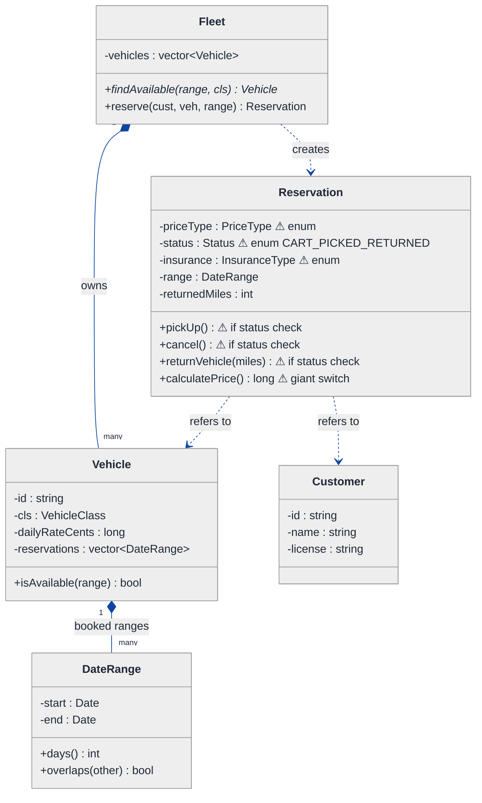
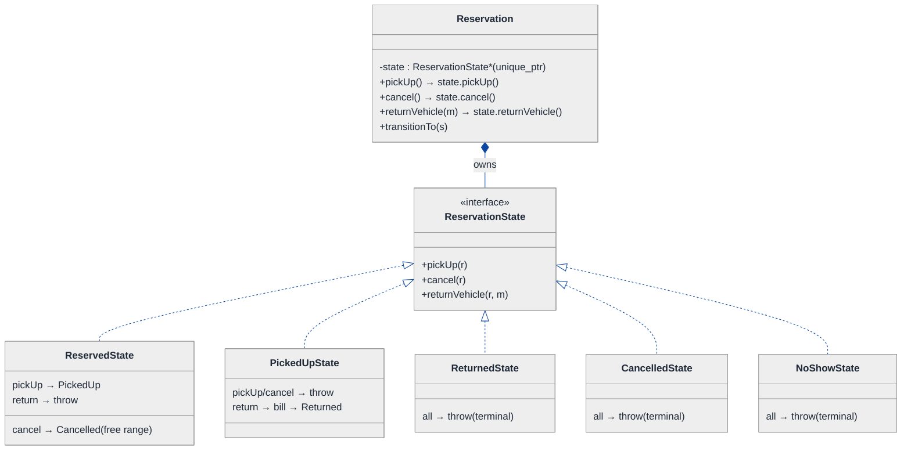
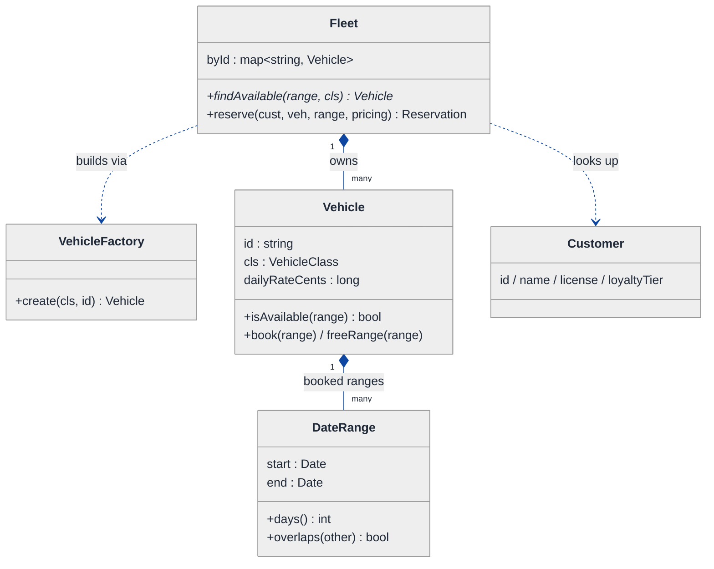
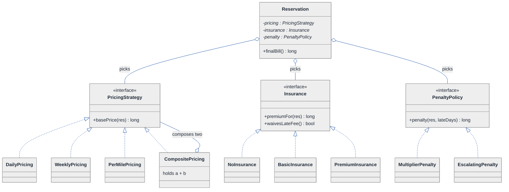
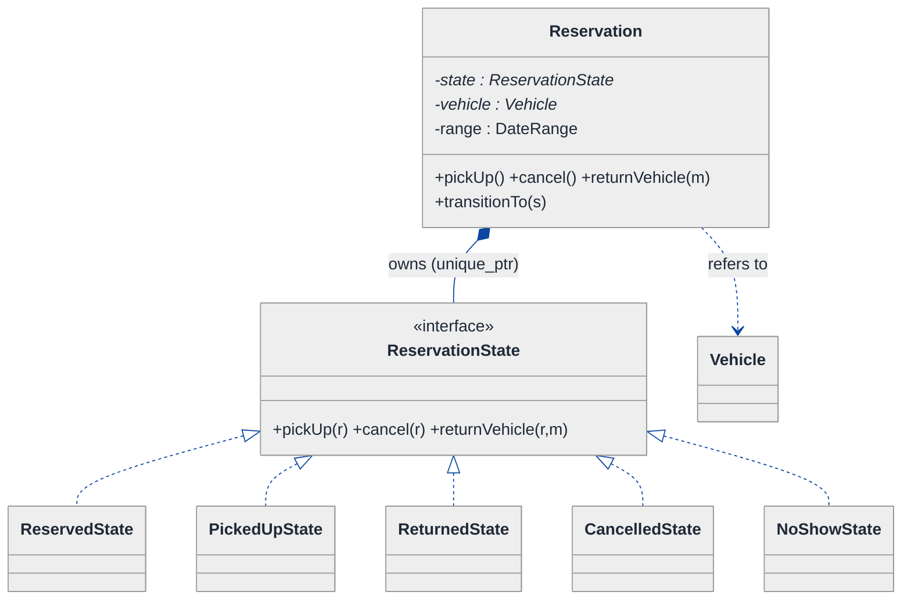
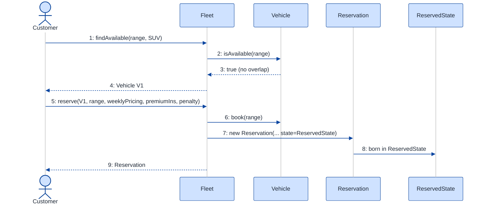
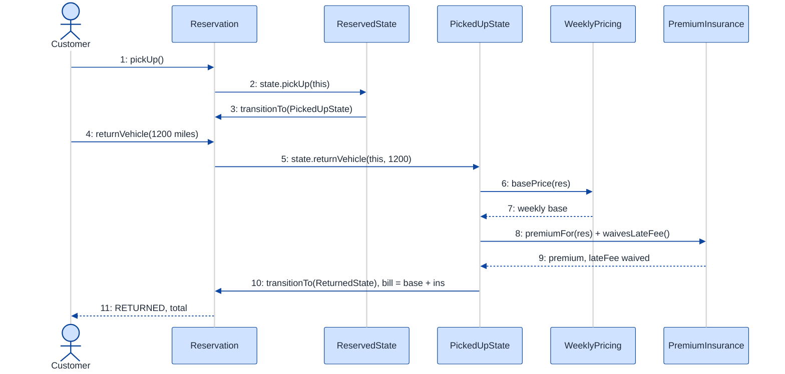

# Car Rental System — LLD Walkthrough

> **Difficulty:** Medium · **Time:** ~35 min · **Pattern focus:** Strategy (pricing: daily / weekly / per-mile) + State (reservation lifecycle) + light Factory (vehicle creation)
>
> **Problem source(s):** GID `fc5aeac8`, bucket `Strategy_Pattern` (Amazon). Row 6 in [`./EXTRACTED_QUESTIONS.md`](./EXTRACTED_QUESTIONS.md). Also fits `Object_Oriented_Design` · `State_Pattern`.
>
> **Diagrams:** inline mermaid (renders natively in GitHub / VS Code). No external image artifacts.

---

## How to use this file

Paced for a candidate who has rented a car as a *customer* but never designed the system behind it. Reading time: ~35 minutes if you sketch each iteration by hand. **The lesson: don't pre-load the answer with patterns. Build the naive rental system first, watch it crack under four realistic business asks, then reach for exactly ONE pattern per painful axis — Strategy for the pricing math that varies, State for the reservation that has a lifecycle, and a small Factory so the fleet stays open for new vehicle types.**

**Map of this file (15 sections):**

1. Problem statement + clarifying questions
2. Plain-English restatement
3. Why this matters
4. Mental model
5. Try it yourself first
6. Entity & verb extraction
7. **Iteration 1: the naive design** — what we'd write first
8. **Where the naive design hurts** — four business asks, one painful diff each
9. **Pivot 1: Strategy for pricing** — the most painful axis first
10. **Pivot 2: State for the reservation lifecycle** — booking → cancellation → pickup → return
11. **Pivot 3: Strategy for late-penalty + insurance, Factory for the fleet** — the remaining variability
12. Final UML class diagram (three sub-views)
13. Skeleton code (C++)
14. Key flow — sequence diagram
15. Extensibility re-check + anti-patterns + how to think aloud + self-check

---

## 1. Problem statement + clarifying questions

**Prompt (typical phrasing):** "Design a car rental system. Customers browse a vehicle fleet, make a reservation for a date range, pick up and return the vehicle, and are billed using a pricing strategy (daily, weekly, per-mile). Support customer profiles, insurance options, and late-return penalties."

**Clarifying questions to ask BEFORE drawing anything:**

1. **Pricing models?** Just flat daily rate, or also weekly bundles (7 days for the price of 5), per-mile, seasonal surge, corporate/loyalty discounts? **Can the customer combine them** (a weekly base rate PLUS a per-mile overage)? Is the pricing the same across vehicle classes or per-class?
2. **Reservation lifecycle?** Is a booking a single atomic create, or a multi-step lifecycle (RESERVED → PICKED_UP → RETURNED, plus CANCELLED / NO_SHOW)? What's legal at each step — can you cancel after pickup? Can you pick up a cancelled booking? What happens to the vehicle's availability at each transition?
3. **Date ranges & availability.** A reservation holds a vehicle for `[start, end)`. Two bookings on the same vehicle must not OVERLAP. Do we check overlap at booking time? Is the end date inclusive or exclusive? Grace period for late return?
4. **Insurance options?** None / basic / premium, priced per-day? Optional add-on chosen at booking? Does insurance change the penalty math (premium waives late fees)?
5. **Late-return penalty?** Flat per-day surcharge, a multiple of the daily rate, or escalating (1.5× for the first day, 2× thereafter)? Computed at return time against the planned end date?
6. **Fleet scope?** Sedans, SUVs, vans, luxury, electric — do these differ in behavior, or only in data (rate, seats)? Do we add new vehicle types often?
7. **Concurrency / persistence?** In-memory for the interview, single-threaded? (Concurrency on the "last available car" race discussed in §15.)

**Assumptions if the interviewer dodges:** multiple **pricing strategies** (daily, weekly, per-mile), chosen per-reservation; a **multi-step reservation lifecycle** (RESERVED → PICKED_UP → RETURNED, plus CANCELLED) with availability changing on transitions; reservations hold a **half-open date range `[start, end)`** and must not overlap on the same vehicle; **optional insurance** (none / basic / premium) priced per-day; **late penalty** as a multiple of the daily rate; vehicle types differ mostly in DATA; single-threaded for now.

---

## 2. Plain-English restatement

We're building the software behind a car-rental counter. A customer browses the fleet, reserves a specific vehicle for a date range, and the system makes sure no two reservations for the same vehicle overlap. At pickup the vehicle becomes unavailable; at return the system computes the bill — a base rental price (daily / weekly / per-mile, the customer's choice), plus optional insurance, plus a late penalty if the car came back after the planned end date. The design must let the business add **new pricing models**, **new insurance tiers**, and **new vehicle types** without rewriting the billing math, and it must make **illegal lifecycle moves impossible** (you can't pick up a cancelled booking, can't cancel a returned one) rather than guarded by scattered `if` checks.

---

## 3. Why this matters

Car rental is a staple Amazon LLD prompt and a clean **pattern-discrimination** test, because it cleanly separates the two most-confused GoF patterns. Pricing is a family of **algorithms the caller picks** — textbook Strategy. The reservation is a genuine **lifecycle the object transitions through** — textbook State. A candidate who jams both into one `Reservation` class with a `priceType` enum and a `status` enum plus two giant `switch` statements fails; a candidate who says "pricing is Strategy because the *caller* chooses it, lifecycle is State because the *object* drives its own transitions" passes. The same daily/weekly/per-mile + reserve/pickup/return split reappears in equipment rental, hotel booking, and subscription billing.

---

## 4. Mental model

A rental system is a **fleet of vehicles**, a **calendar of reservations** that must not collide, and a **billing pipeline** that turns a finished rental into a number. The fleet is mostly data (a vehicle has a class, a daily rate, a seat count). The calendar is an interval problem — each vehicle owns a set of non-overlapping date ranges. The reservation is a conveyor belt: it rides through stations (reserved → picked up → returned), and at each station only certain moves are legal. Billing is a sum of independent parts — base price + insurance + penalty — where each part can vary on its own.

```
Real-world sketch (NOT a UML diagram yet):

   FLEET (data)              CALENDAR (intervals)            RESERVATION (conveyor)
  ┌────────────┐
  │ Sedan  $40 │   vehicle V1:  [Jun2–Jun5) [Jun9–Jun11)    ┌──────────┐  ┌──────────┐  ┌──────────┐
  │ SUV    $65 │                ╳ no overlap allowed         │ RESERVED │─►│ PICKED_UP│─►│ RETURNED │
  │ Van    $80 │                                             └──────────┘  └──────────┘  └──────────┘
  └────────────┘                                                  │  each station: only some moves legal
                              BILL = base + insurance + penalty    └─► CANCELLED (only before pickup)
```

The KEY insight from this picture: **the fleet** is data; **pricing** is a swappable algorithm the customer picks; **the reservation** is a lifecycle the system drives; **the bill** is a sum of independent terms. Different shapes → different patterns: Strategy for pricing, State for the lifecycle, plain composition for the fleet.

---

## 5. Try it yourself first

> **Predict before reading on:**
>
> 1. List 5 nouns you'd promote to a class and 3 you'd leave as plain fields.
> 2. **If the business says "next month we launch a weekend-special rate AND a corporate per-mile plan," what breaks in a single `calculatePrice()` method that switches on a `priceType` enum?**
> 3. A customer tries to **cancel a reservation they already picked up**. Where does that get rejected — a scattered `if (status == PICKED_UP)`, or something structural?

---

## 6. Entity & verb extraction

> **Mini-refresher: noun → class, but not every noun.**
>
> Naive OOD promotes every noun to a class. Senior OOD promotes a noun only if it has both BEHAVIOR and STATE that belong together. "Daily rate" stays a field; "Vehicle" becomes a class because it owns identity + availability; "Reservation" becomes a class because it has a *lifecycle*.

**Nouns from the prompt:**

| Noun | Decision | Why |
|---|---|---|
| Vehicle | Class (abstract base + type field) | Identity + class + daily rate + availability |
| Fleet | Class (lookup + availability index) | Owns vehicles; finds an available one for a range |
| Customer | Class | Profile: id, name, license, loyalty tier |
| Reservation | Class | Has a LIFECYCLE — born at booking |
| DateRange | Class (value object) | `[start, end)`; knows overlap + day count |
| PricingStrategy | Strategy interface (later) | The thing that VARIES — daily / weekly / per-mile |
| Insurance | Strategy interface (later) | none / basic / premium, per-day |
| Money / rate | Field (`long` cents) | No behavior; integer cents, never `double` |
| Mileage | Field on Reservation (`int`) | Recorded at return; not a class |

**Verbs (and the class they live on):**

| Verb | Owner class (naive answer — we'll re-examine) |
|---|---|
| browse() / findAvailable(range, class) | Fleet |
| reserve(customer, vehicle, range) | Fleet → creates Reservation |
| cancel() / pickUp() / returnVehicle(miles) | Reservation |
| calculatePrice() | Reservation (naive: one big method) |
| latePenalty() | Reservation (naive: inline) |
| isAvailable(range) | Vehicle |

**We have NOT introduced any design patterns yet.** Pure nouns + verbs.

---

## 7. <a id="iter-1"></a>Iteration 1: the naive design

The simplest thing that could possibly work. No patterns — just classes with methods, an enum for vehicle type, an enum for the price model, an enum for status, and one `calculatePrice()` that does everything.



**Reader's tour (top to bottom; ~60 seconds).**

1. **`Fleet` is the lookup + booker.** It owns `Vehicle` objects and exposes `findAvailable(range, cls)` and `reserve(...)`. Nothing controversial yet — the fleet is not where the design rots.

2. **The composition spine.** `Fleet` composes `Vehicle[]` (filled diamond — same lifetime). Each `Vehicle` owns its booked `DateRange[]` for overlap checks. `Reservation` only *refers to* a `Vehicle` and a `Customer` (dashed arrows — it does NOT own them; the fleet does). Note we store **rates in integer cents** (`long`), never `double` — floating-point money is a classic bug.

3. **`DateRange` is a clean value object** with `days()` and `overlaps(other)`. This part is fine; intervals are not where the rot is.

4. **`Reservation` is the trouble zone.** Look at the warning markers (⚠):
   - `priceType : PriceType` — a tag. `calculatePrice()` is the monster: a giant `switch (priceType)` that hardcodes daily vs weekly vs per-mile math, then adds insurance via another `switch (insurance)`, then a hardcoded late-penalty formula. Every new pricing or insurance rule means surgery inside this one method.
   - `status : Status` is an enum. Fine for three states; can't express `CANCELLED` or `NO_SHOW` cleanly, and the *transition rules* live nowhere — they're scattered `if`s inside `pickUp` / `cancel` / `returnVehicle`.

**What's deliberately missing.** No `PricingStrategy`, no `Insurance` hierarchy, no `ReservationState`. The naive design doesn't even *acknowledge* these are axes of variation — it bakes a hardcoded answer into `calculatePrice()` and re-checks `status` everywhere. That's what the next section exposes.

Skeleton code for the naive design (C++):

```cpp
#include <stdexcept>
#include <string>
#include <vector>
#include <ctime>

enum class VehicleClass { SEDAN, SUV, VAN };
enum class PriceType    { DAILY, WEEKLY, PER_MILE };
enum class InsuranceType{ NONE, BASIC, PREMIUM };
enum class Status       { RESERVED, PICKED_UP, RETURNED };  // no CANCELLED!

struct Date { int y, m, d; };

class DateRange {
public:
    DateRange(Date s, Date e) : start_(s), end_(e) {}
    int  days() const { /* (end - start) in days; half-open */ return diffDays(start_, end_); }
    bool overlaps(const DateRange& o) const {            // half-open [start,end)
        return start_ < o.end_ && o.start_ < end_;
    }
private:
    Date start_, end_;
    static int  diffDays(Date a, Date b);                // elided
    friend bool operator<(const Date&, const Date&);     // elided
};

class Vehicle {
public:
    Vehicle(std::string id, VehicleClass c, long rate) : id_(id), cls_(c), dailyRateCents_(rate) {}
    bool isAvailable(const DateRange& r) const {
        for (const auto& booked : reservations_) if (booked.overlaps(r)) return false;
        return true;
    }
    void book(const DateRange& r) { reservations_.push_back(r); }
    long dailyRate() const { return dailyRateCents_; }
private:
    std::string             id_;
    VehicleClass            cls_;
    long                    dailyRateCents_;
    std::vector<DateRange>  reservations_;
};

class Reservation {
public:
    Reservation(Vehicle* v, DateRange r, PriceType pt, InsuranceType ins)
        : vehicle_(v), range_(r), priceType_(pt), insurance_(ins) {}

    void pickUp() {                                       // scattered status guards
        if (status_ != Status::RESERVED) throw std::runtime_error("Cannot pick up");
        status_ = Status::PICKED_UP;
    }
    void cancel() {
        if (status_ != Status::RESERVED) throw std::runtime_error("Cannot cancel");
        // ...free the vehicle's date range...
    }
    void returnVehicle(int miles) {
        if (status_ != Status::PICKED_UP) throw std::runtime_error("Not picked up");
        returnedMiles_ = miles;
        status_ = Status::RETURNED;
    }

    long calculatePrice() const {                         // the monster
        int days = range_.days();
        long base = 0;
        switch (priceType_) {                             // hardcoded pricing switch
            case PriceType::DAILY:   base = days * vehicle_->dailyRate(); break;
            case PriceType::WEEKLY:  base = (days / 7) * 5 * vehicle_->dailyRate()
                                          + (days % 7) * vehicle_->dailyRate(); break;
            case PriceType::PER_MILE:base = returnedMiles_ * 50; break; // 50c/mile
        }
        long ins = 0;                                     // hardcoded insurance switch
        switch (insurance_) {
            case InsuranceType::NONE:    ins = 0;               break;
            case InsuranceType::BASIC:   ins = days * 1000;     break;
            case InsuranceType::PREMIUM: ins = days * 2500;     break;
        }
        long penalty = 0;                                 // hardcoded late penalty
        // if (returnedLate) penalty = lateDays * 2 * vehicle_->dailyRate();
        return base + ins + penalty;
    }
private:
    Vehicle*       vehicle_;
    DateRange      range_;
    PriceType      priceType_;
    InsuranceType  insurance_;
    Status         status_ = Status::RESERVED;
    int            returnedMiles_ = 0;
};
```

**This works.** It has zero design patterns. We can find a car, reserve it, pick up, return, and total it. So what's wrong with it?

---

## 8. <a id="naive-pain"></a>Where the naive design hurts

The product manager drops four asks for next quarter on your desk: "walk me through what changes."

### Change A: "Launch a weekend-special rate AND a corporate per-mile plan"

In the naive design:
- `PriceType` is an enum tag. You add `WEEKEND`, `CORPORATE_PER_MILE` to it.
- `calculatePrice()` grows two more `case`s inside its `switch (priceType_)`. The weekend logic needs to know which days fall on Sat/Sun — more branching inside the monster.
- **Every new pricing model is surgery inside the same `calculatePrice` switch.** Classic tag-driven dispatch; the method that already does insurance and penalty math gets bigger.

### Change B: "Combine a weekly base rate WITH per-mile overage above 1000 miles"

In the naive design:
- The `switch (priceType_)` assumes pricing is ONE algorithm. "Weekly base + per-mile overage" is a *combination* — the enum can't express it without a `WEEKLY_PLUS_MILES` case that duplicates both branches.
- **Combinatorial explosion:** every pair of models you want to combine becomes a new enum value and a new `case`. The `calculatePrice` switch grows quadratically.

### Change C: "Add CANCELLED and NO_SHOW states; a no-show forfeits a one-day fee; you cannot cancel after pickup"

In the naive design:
- `Status` enum has no `CANCELLED` or `NO_SHOW`.
- The transition rules live as scattered `if (status_ != Status::RESERVED)` checks copy-pasted across `pickUp`, `cancel`, `returnVehicle`. Adding `NO_SHOW` means new guards in every method PLUS a new `markNoShow()` with its own guard.
- **The transition matrix is smeared across four methods, each re-checking `status_`.** The enum + scattered guards can't cleanly express a state machine — and the "cannot cancel after pickup" rule is just one more `if` someone will forget.

### Change D: "Add a luxury class with a surge multiplier, and an electric class with a per-kWh charge"

In the naive design:
- Add `LUXURY`, `ELECTRIC` to `VehicleClass`.
- Wherever code branches on vehicle class (surge in pricing, charging in penalty), add a `case`. Construction sites that build vehicles (`new Vehicle(id, cls, rate)`) all need updating to know the new defaults.
- **New vehicle behavior is scattered across every `switch (cls_)`**, and there's no single place that owns "how to build a LUXURY vehicle."

### The pattern of pain

| Change | Files / methods touched | Smell |
|---|---|---|
| A. New pricing model | `PriceType` enum + `calculatePrice` switch | "Tag-driven dispatch; every model is surgery in one function." |
| B. Combine two pricing models | `PriceType` enum (combinatorial) + `calculatePrice` | "One enum can't express a combination; switch grows quadratically." |
| C. New lifecycle states | `pickUp` + `cancel` + `returnVehicle` + new `markNoShow`, scattered guards | "Enum + scattered `if`s can't express a lifecycle." |
| D. New vehicle type | every `switch (cls_)` + all `new Vehicle(...)` sites | "Type-driven branching + scattered construction." |

**Three axes of pain dominate:** (1) the pricing *algorithm* that varies AND combines, (2) the reservation's *lifecycle* with state-specific rules, and (3) *vehicle creation* scattered across the codebase.

> **Pivot question:** "What pattern handles an *algorithm that varies, swapped by the caller* (pricing, insurance, penalty)? What pattern handles a *lifecycle with state-specific rules* (reservation)? What pattern centralizes *creation of a family of objects* (vehicles)?"
>
> The answers are Strategy, State, and Factory. We introduce them one at a time, most-painful first: pricing.

---

## 9. <a id="pivot-1"></a>Pivot 1: Strategy for pricing

> **Mini-refresher: Strategy pattern.**
>
> Encapsulates an algorithm behind an interface so it can be swapped at runtime. The CALLER picks which strategy to use; the strategy doesn't know about its peers.
>
> Quick example: a `Sorter` takes a `Comparator*` in its constructor. Pass `Ascending` or `Descending` — the sorter doesn't care which.

> **Mini-refresher: Open/Closed Principle (the "O" in SOLID).**
>
> Software should be *open for extension, closed for modification*. Adding a new pricing model should mean writing a new class, NOT editing an existing method. The naive `switch (priceType_)` violates this — every new model edits `calculatePrice`.

**Why Strategy fits pricing.** A pricing model is an algorithm: `given a reservation (range, vehicle, miles), return a base price in cents`. It varies — daily, weekly, per-mile, weekend-special. The choice of which model applies is made externally (the customer picks a plan at booking; a corporate account forces per-mile). That's textbook Strategy.

**The refactor (just the pricing slice):**

```cpp
class Reservation;  // forward

class PricingStrategy {
public:
    virtual ~PricingStrategy() = default;
    // base price in cents for a finished/quoted reservation
    virtual long basePrice(const Reservation& r) const = 0;
    virtual std::string label() const = 0;
};

class DailyPricing : public PricingStrategy {
public:
    long basePrice(const Reservation& r) const override;   // days * dailyRate
    std::string label() const override { return "daily"; }
};

class WeeklyPricing : public PricingStrategy {
public:
    // 7 days billed as 5 — the bundle discount lives HERE, not in a switch
    long basePrice(const Reservation& r) const override;
    std::string label() const override { return "weekly"; }
};

class PerMilePricing : public PricingStrategy {
public:
    explicit PerMilePricing(long centsPerMile) : cpm_(centsPerMile) {}
    long basePrice(const Reservation& r) const override;   // miles * cpm_
    std::string label() const override { return "per-mile"; }
private:
    long cpm_;
};
// WeekendSpecial, SeasonalSurge ... elided — each a new class, no edits elsewhere
```

The reservation no longer holds a `PriceType` tag; it holds a `PricingStrategy*` (injected at booking) and asks it for `basePrice`. **Change A's "every model is surgery in one function" disappears** — a new model is a new class. The `switch (priceType_)` is gone.

**What about Change B (combine weekly base + per-mile overage)?** Strategy gives us the clean answer that a combined enum value couldn't: write a `CompositePricing` that *holds two strategies* and sums them — `WeeklyPricing` + a capped `PerMilePricing`. Composition over combination; no quadratic enum.

```cpp
class CompositePricing : public PricingStrategy {        // Change B, cleanly
public:
    CompositePricing(std::unique_ptr<PricingStrategy> a, std::unique_ptr<PricingStrategy> b)
        : a_(std::move(a)), b_(std::move(b)) {}
    long basePrice(const Reservation& r) const override { return a_->basePrice(r) + b_->basePrice(r); }
    std::string label() const override { return a_->label() + "+" + b_->label(); }
private:
    std::unique_ptr<PricingStrategy> a_, b_;
};
```

**Pattern-discrimination cheatsheet — Strategy vs Template Method.**
- *Strategy:* the whole algorithm is one swappable object, chosen at runtime via composition.
- *Template Method:* the algorithm skeleton lives in a base class; subclasses fill in hooks via inheritance.
- *Rule of thumb:* variants you might combine or swap at runtime → Strategy. A fixed skeleton with 2-3 stable variants → Template Method.

We chose Strategy because pricing models must be **swapped and combined at runtime** (Change A and B) — you can't compose Template-Method subclasses.

---

## 10. <a id="pivot-2"></a>Pivot 2: State for the reservation lifecycle

Change C remains, and it's a different shape. The variability here is NOT an algorithm picked by the caller — it's **what's valid next**, driven by what the reservation has been through. A `RESERVED` booking can be picked up or cancelled. A `PICKED_UP` booking can be returned but NOT cancelled (the §5 "cancel after pickup" rejection). The lifecycle is the OBJECT'S concern.

> **Mini-refresher: State pattern.**
>
> Each lifecycle state is its own class. The context object delegates an action (e.g. `cancel()`) to its current state, and THE STATE decides what's legal and what the next state is. Transitions are INTERNAL, driven by events the context receives — not chosen by the caller.

**Why State (not Strategy) for the reservation.** The reservation's current phase isn't picked by the caller — it's the result of what the reservation has done. Calling `cancel()` on a picked-up booking must be rejected *structurally*, not by a scattered `if (status_ == PICKED_UP)`. Each state knows its own legal moves and its own next state. Adding `NoShowState` becomes one new class, not new guards smeared across four methods.

**The reservation-lifecycle refactor:**

```cpp
class Reservation;  // forward

class ReservationState {
public:
    virtual ~ReservationState() = default;
    virtual void pickUp(Reservation& r)              = 0;
    virtual void cancel(Reservation& r)              = 0;
    virtual void returnVehicle(Reservation& r, int miles) = 0;
    virtual std::string name() const                 = 0;
};

class ReservedState : public ReservationState {
public:
    void pickUp(Reservation& r) override;                       // -> PickedUpState
    void cancel(Reservation& r) override;                       // free vehicle range -> CancelledState
    void returnVehicle(Reservation&, int) override { throw std::runtime_error("Not picked up yet"); }
    std::string name() const override { return "RESERVED"; }
};

class PickedUpState : public ReservationState {
public:
    void pickUp(Reservation&) override { throw std::runtime_error("Already picked up"); }
    void cancel(Reservation&) override { throw std::runtime_error("Cannot cancel after pickup"); }  // Change C rule
    void returnVehicle(Reservation& r, int miles) override;     // record miles, bill -> ReturnedState
    std::string name() const override { return "PICKED_UP"; }
};

class ReturnedState : public ReservationState {                 // terminal
public:
    void pickUp(Reservation&) override        { throw std::runtime_error("Already returned"); }
    void cancel(Reservation&) override        { throw std::runtime_error("Already returned"); }
    void returnVehicle(Reservation&, int) override { throw std::runtime_error("Already returned"); }
    std::string name() const override { return "RETURNED"; }
};
// CancelledState, NoShowState ... elided — every method throws (terminal)

class Reservation {
public:
    Reservation(Vehicle* v, DateRange r, std::unique_ptr<PricingStrategy> pricing)
        : vehicle_(v), range_(r), pricing_(std::move(pricing)),
          state_(std::make_unique<ReservedState>()) {}
    void transitionTo(std::unique_ptr<ReservationState> s) { state_ = std::move(s); }
    void pickUp()                  { state_->pickUp(*this); }        // one-liner — delegates
    void cancel()                  { state_->cancel(*this); }
    void returnVehicle(int miles)  { state_->returnVehicle(*this, miles); }
    // ... accessors used by states + pricing ...
private:
    Vehicle*                          vehicle_;
    DateRange                         range_;
    std::unique_ptr<PricingStrategy>  pricing_;
    std::unique_ptr<ReservationState> state_;
    int                               returnedMiles_ = 0;
};

inline void ReservedState::pickUp(Reservation& r) {
    r.transitionTo(std::make_unique<PickedUpState>());
}
inline void PickedUpState::returnVehicle(Reservation& r, int miles) {
    // record miles, compute final bill via pricing strategy + penalty ...
    r.transitionTo(std::make_unique<ReturnedState>());
}
```

**What changed — visualized.** The lifecycle slice:



**Tour of the after-state.**

1. **The `Status` enum is gone.** Replaced by a `state` field of type `unique_ptr<ReservationState>` — the reservation owns its current state.

2. **`Reservation::pickUp/cancel/returnVehicle` became one-liners** that delegate to the current state. **No `if (status_ == X)` anywhere on Reservation.**

3. **Five concrete states, each self-contained.** `ReservedState::cancel` frees the vehicle's date range and transitions to `CancelledState`. `PickedUpState::cancel` *throws* — Change C's "cannot cancel after pickup" is enforced *structurally*, by which class you're in. `ReturnedState`, `CancelledState`, `NoShowState` are terminal (all methods throw).

4. **Transitions live WITH the state.** Each state calls `r.transitionTo(...)` when its work is done — the transition matrix is distributed across the state classes, not centralized in scattered `if`s.

5. **Adding `NoShowState` is one new class** plus one transition (e.g. a nightly job calls `markNoShow()` on still-`RESERVED` bookings past their start date) — zero edits to existing states.

**Pattern-discrimination cheatsheet — Strategy vs State.**
- *Strategy:* the CALLER picks which one; strategies are usually unaware of each other.
- *State:* the OBJECT picks its next state internally; states know about each other (each can `transitionTo` another).
- *Rule of thumb:* if `reservation.setPricing(x)` is called externally → Strategy (pricing). If `reservation.pickUp()` flips the state internally → State (lifecycle).

This is the single most important discrimination in the whole problem: **pricing is Strategy because the customer chooses it; the lifecycle is State because the reservation drives its own transitions.**

---

## 11. <a id="pivot-3"></a>Pivot 3: Strategy for penalty + insurance, Factory for the fleet

Two axes remain. The billing add-ons (insurance, late penalty) are the *same shape* as pricing — algorithms the caller/config picks — so they're quick Strategies. Vehicle creation (Change D) is a different shape: it's about *centralizing construction* of a family of objects.

### 11a. Insurance + late-penalty as Strategies

The naive `calculatePrice` had a `switch (insurance_)` and a hardcoded penalty formula. Both vary independently of the base price, so both become Strategy families that the final bill sums:

```cpp
class Insurance {
public:
    virtual ~Insurance() = default;
    virtual long premiumFor(const Reservation& r) const = 0;   // per the rental
    virtual bool waivesLateFee() const { return false; }
};
class NoInsurance      : public Insurance { public: long premiumFor(const Reservation&) const override { return 0; } };
class BasicInsurance   : public Insurance { public: long premiumFor(const Reservation& r) const override; };          // days * 1000
class PremiumInsurance : public Insurance {                    // premium waives the late fee
public: long premiumFor(const Reservation& r) const override;  // days * 2500
        bool waivesLateFee() const override { return true; }
};

class PenaltyPolicy {
public:
    virtual ~PenaltyPolicy() = default;
    virtual long penalty(const Reservation& r, int lateDays) const = 0;
};
class MultiplierPenalty : public PenaltyPolicy {               // 2x daily rate per late day
public:
    explicit MultiplierPenalty(double mult) : mult_(mult) {}
    long penalty(const Reservation& r, int lateDays) const override;   // lateDays * mult_ * dailyRate
private:
    double mult_;
};
// FlatPenalty, EscalatingPenalty ... elided — each a new class
```

The final bill is the clean sum the naive monster method couldn't express without nested switches:

```
total = pricing.basePrice(res)
      + insurance.premiumFor(res)
      + (insurance.waivesLateFee() ? 0 : penaltyPolicy.penalty(res, lateDays));
```

Each term is one swappable Strategy; insurance even *influences* the penalty via `waivesLateFee()` — a clean collaboration, not a tangle of `if`s.

### 11b. A Factory for the fleet

> **Mini-refresher: Factory Method pattern.**
>
> Centralizes object creation behind a single method/class, so callers ask for "a SUV" by intent instead of calling `new SUV(seats, rate, ...)` with the right arguments everywhere. Adding a new product type means editing ONE factory, not every construction site.

**Why a Factory for vehicles.** Change D ("add luxury, electric") hurt because `new Vehicle(id, cls, rate)` was scattered, and each call site had to know the right defaults (seats, surge multiplier, charging cost). A `VehicleFactory` owns that knowledge:

```cpp
class VehicleFactory {
public:
    static std::unique_ptr<Vehicle> create(VehicleClass cls, std::string id) {
        switch (cls) {                                    // the ONLY switch on class, in ONE place
            case VehicleClass::SEDAN:    return std::make_unique<Vehicle>(id, cls, 4000, 5);
            case VehicleClass::SUV:      return std::make_unique<Vehicle>(id, cls, 6500, 7);
            case VehicleClass::VAN:      return std::make_unique<Vehicle>(id, cls, 8000, 8);
            // case LUXURY / ELECTRIC -> add ONE line here, nowhere else (Change D)
        }
        throw std::invalid_argument("unknown class");
    }
};
```

Now Change D is: add an enum value + ONE line in the factory. Every other site asks `VehicleFactory::create(...)` and stays untouched. (For richer per-type *behavior* you'd subclass `Vehicle` and have the factory return the right subtype — same Factory shape.)

**Pattern-discrimination cheatsheet — Factory Method vs Builder vs Abstract Factory.**
- *Factory Method:* one method picks and returns one of a family of related products by a type tag.
- *Builder:* assembles ONE complex object step-by-step (many optional fields, fluent API).
- *Abstract Factory:* creates *families* of related products that must be used together (e.g. a whole UI toolkit).
- *Rule of thumb:* "give me an X of type T" → Factory Method. "assemble a complicated X with many optional parts" → Builder.

We chose a simple Factory Method: vehicles differ mostly in a few defaults, not in a long optional-field assembly, so Builder would be overkill.

---

## 12. <a id="fig-class-diagram"></a>12. Final class diagram

One mega-diagram becomes a wall of boxes. Here are **three focused sub-views** — fleet, pricing/billing, lifecycle — and a structural-insight table that ties them together.

### 12.1 The fleet spine — what the system OWNS



**Tour of 12.1.** The fleet. `Fleet` composes `Vehicle[]` (filled diamond = same lifetime), built through `VehicleFactory` (Change D lands here as one line). Each `Vehicle` owns its booked `DateRange[]` for overlap checks — `isAvailable(range)` scans them. `Customer` and `DateRange` are plain data hanging off the booking call. This spine barely changed from the naive design; the fleet was never the part that rotted. Everything we ADDED hangs off the pricing and lifecycle sub-views.

### 12.2 Billing — Strategy everywhere (pricing + insurance + penalty)



**Tour of 12.2.**

1. **Three independent Strategy families** plug into the `Reservation` by composition (open diamond = "picks/holds"): `PricingStrategy` (base), `Insurance` (add-on), `PenaltyPolicy` (late fee). `finalBill()` sums the three — no `switch`, no nested `if`.

2. **`CompositePricing` is the Change-B answer.** It IS a `PricingStrategy` and HOLDS two more (self-referential open diamond) — weekly base + per-mile overage sum cleanly, no `WEEKLY_PLUS_MILES` enum value.

3. **Strategies can collaborate.** `PremiumInsurance::waivesLateFee()` returns true, so `finalBill()` skips the penalty term — insurance influences penalty through the interface, not through a tangle of conditionals. Each new pricing/insurance/penalty rule (Change A) is exactly ONE new class.

### 12.3 The reservation lifecycle — State



**Tour of 12.3.** `Reservation` owns ONE `ReservationState` (filled diamond / `unique_ptr`). `pickUp/cancel/returnVehicle` are one-liners that delegate; the five states encode the legal transitions among themselves — `ReservedState` can go to `PickedUp` or `Cancelled`; `PickedUpState` can only go to `Returned` (cancel throws); `Returned/Cancelled/NoShow` are terminal. The reservation only *refers* to its `Vehicle` (dashed) — the fleet owns it. A new state = one new class.

### Structural insight (ties 12.1 + 12.2 + 12.3 together)

| Concern | Pattern used | Why |
|---|---|---|
| **Fleet** (Fleet, Vehicle, DateRange, Customer) | Plain ownership + a small **Factory** | Vehicles are mostly data; Factory centralizes construction so new types land in one place |
| **Base pricing** (daily, weekly, per-mile, composite) | **Strategy** (+ composite Strategy) | Each model is a swappable algorithm the customer picks; combos via `CompositePricing` |
| **Insurance** (none, basic, premium) | **Strategy** | Algorithm picked at booking; can influence penalty via `waivesLateFee()` |
| **Late penalty** (multiplier, flat, escalating) | **Strategy** | Algorithm picked by config; summed into the final bill |
| **Reservation lifecycle** (Reserved → PickedUp → Returned / Cancelled / NoShow) | **State**, OWNED by Reservation | Reservation controls transitions; states validate what's legal next |

The big lesson: **inheritance is used only for the strategy/state class families** — every "varies independently" axis is composition over an interface. *Strategy for the algorithms the caller picks (pricing, insurance, penalty), State for the lifecycle the object drives, a small Factory for construction.* That split is the whole answer, and the Strategy-vs-State call is the discrimination the interviewer is really testing.

---

## 13. Skeleton code (C++)

> Show the SHAPES, not the full impl. Abstract bases + 1-2 concretes per pattern; the rest `// elided`.

```cpp
#include <memory>
#include <stdexcept>
#include <string>
#include <unordered_map>
#include <utility>
#include <vector>

// ── Forward declarations ────────────────────────────────────────────
class Reservation;
class Vehicle;

enum class VehicleClass { SEDAN, SUV, VAN, LUXURY, ELECTRIC };

// ── Value object: half-open date range [start, end) ─────────────────
struct Date { int y, m, d; };
bool operator<(const Date& a, const Date& b);   // elided (lexicographic y,m,d)

class DateRange {
public:
    DateRange(Date s, Date e) : start_(s), end_(e) {}
    int  days() const;                                           // (end - start) in days
    bool overlaps(const DateRange& o) const {                    // half-open
        return start_ < o.end_ && o.start_ < end_;
    }
    Date start() const { return start_; }
    Date end()   const { return end_; }
private:
    Date start_, end_;
};

// ── Fleet (plain data + a small Factory) ────────────────────────────
class Vehicle {
public:
    Vehicle(std::string id, VehicleClass c, long rate, int seats)
        : id_(std::move(id)), cls_(c), dailyRateCents_(rate), seats_(seats) {}
    bool isAvailable(const DateRange& r) const {
        for (const auto& b : booked_) if (b.overlaps(r)) return false;
        return true;
    }
    void book(const DateRange& r)      { booked_.push_back(r); }
    void freeRange(const DateRange&)   { /* erase matching range — elided */ }
    long dailyRate() const             { return dailyRateCents_; }
    const std::string& id() const      { return id_; }
private:
    std::string            id_;
    VehicleClass           cls_;
    long                   dailyRateCents_;
    int                    seats_;
    std::vector<DateRange> booked_;
};

class VehicleFactory {                                           // Factory Method
public:
    static std::unique_ptr<Vehicle> create(VehicleClass cls, std::string id) {
        switch (cls) {                                           // the ONLY switch on class
            case VehicleClass::SEDAN:    return std::make_unique<Vehicle>(id, cls, 4000, 5);
            case VehicleClass::SUV:      return std::make_unique<Vehicle>(id, cls, 6500, 7);
            case VehicleClass::VAN:      return std::make_unique<Vehicle>(id, cls, 8000, 8);
            case VehicleClass::LUXURY:   return std::make_unique<Vehicle>(id, cls, 15000, 4);
            case VehicleClass::ELECTRIC: return std::make_unique<Vehicle>(id, cls, 7000, 5);
        }
        throw std::invalid_argument("unknown vehicle class");
    }
};

// ── Strategy: base pricing ──────────────────────────────────────────
class PricingStrategy {
public:
    virtual ~PricingStrategy() = default;
    virtual long basePrice(const Reservation& r) const = 0;
};
class DailyPricing : public PricingStrategy {
public:
    long basePrice(const Reservation& r) const override;         // days * dailyRate
};
class WeeklyPricing : public PricingStrategy {
public:
    long basePrice(const Reservation& r) const override;         // 7 days billed as 5
};
// PerMilePricing, WeekendSpecial ... elided

class CompositePricing : public PricingStrategy {                // combine two (Change B)
public:
    CompositePricing(std::unique_ptr<PricingStrategy> a, std::unique_ptr<PricingStrategy> b)
        : a_(std::move(a)), b_(std::move(b)) {}
    long basePrice(const Reservation& r) const override {
        return a_->basePrice(r) + b_->basePrice(r);
    }
private:
    std::unique_ptr<PricingStrategy> a_, b_;
};

// ── Strategy: insurance + late penalty ──────────────────────────────
class Insurance {
public:
    virtual ~Insurance() = default;
    virtual long premiumFor(const Reservation& r) const = 0;
    virtual bool waivesLateFee() const { return false; }
};
class NoInsurance : public Insurance {
public: long premiumFor(const Reservation&) const override { return 0; }
};
class PremiumInsurance : public Insurance {
public: long premiumFor(const Reservation& r) const override;    // days * 2500
        bool waivesLateFee() const override { return true; }
};
// BasicInsurance ... elided

class PenaltyPolicy {
public:
    virtual ~PenaltyPolicy() = default;
    virtual long penalty(const Reservation& r, int lateDays) const = 0;
};
class MultiplierPenalty : public PenaltyPolicy {
public:
    explicit MultiplierPenalty(double mult) : mult_(mult) {}
    long penalty(const Reservation& r, int lateDays) const override;  // lateDays * mult_ * dailyRate
private:
    double mult_;
};
// FlatPenalty, EscalatingPenalty ... elided

// ── State: reservation lifecycle ────────────────────────────────────
class ReservationState {
public:
    virtual ~ReservationState() = default;
    virtual void pickUp(Reservation& r)                   = 0;
    virtual void cancel(Reservation& r)                   = 0;
    virtual void returnVehicle(Reservation& r, int miles) = 0;
    virtual std::string name() const                      = 0;
};
class ReservedState; class PickedUpState; class ReturnedState;   // forward

class Reservation {
public:
    Reservation(Vehicle* v, DateRange range,
                std::unique_ptr<PricingStrategy> pricing,
                std::unique_ptr<Insurance> ins,
                std::unique_ptr<PenaltyPolicy> pen);
    void transitionTo(std::unique_ptr<ReservationState> s) { state_ = std::move(s); }
    void pickUp()                  { state_->pickUp(*this); }
    void cancel()                  { state_->cancel(*this); }
    void returnVehicle(int miles)  { state_->returnVehicle(*this, miles); }

    long finalBill(int lateDays) const {                         // the clean sum
        long t = pricing_->basePrice(*this) + insurance_->premiumFor(*this);
        if (!insurance_->waivesLateFee()) t += penalty_->penalty(*this, lateDays);
        return t;
    }
    const DateRange& range()   const { return range_; }
    Vehicle*         vehicle() const { return vehicle_; }
    int              miles()   const { return returnedMiles_; }
    void             setMiles(int m) { returnedMiles_ = m; }
private:
    Vehicle*                          vehicle_;     // borrowed; Fleet owns it
    DateRange                         range_;
    std::unique_ptr<PricingStrategy>  pricing_;
    std::unique_ptr<Insurance>        insurance_;
    std::unique_ptr<PenaltyPolicy>    penalty_;
    std::unique_ptr<ReservationState> state_;
    int                               returnedMiles_ = 0;
};

class ReservedState : public ReservationState {
public:
    void pickUp(Reservation& r) override { r.transitionTo(std::make_unique<PickedUpState>()); }
    void cancel(Reservation& r) override {                       // free the held range
        r.vehicle()->freeRange(r.range());
        // r.transitionTo(make_unique<CancelledState>());        // elided fwd
    }
    void returnVehicle(Reservation&, int) override { throw std::runtime_error("Not picked up"); }
    std::string name() const override { return "RESERVED"; }
};
class PickedUpState : public ReservationState {
public:
    void pickUp(Reservation&) override { throw std::runtime_error("Already picked up"); }
    void cancel(Reservation&) override { throw std::runtime_error("Cannot cancel after pickup"); }
    void returnVehicle(Reservation& r, int miles) override {
        r.setMiles(miles);
        // compute lateDays vs planned end; bill via r.finalBill(lateDays) ...
        r.transitionTo(std::make_unique<ReturnedState>());
    }
    std::string name() const override { return "PICKED_UP"; }
};
// ReturnedState, CancelledState, NoShowState ... elided — terminal, all throw

inline Reservation::Reservation(Vehicle* v, DateRange range,
                                std::unique_ptr<PricingStrategy> pricing,
                                std::unique_ptr<Insurance> ins,
                                std::unique_ptr<PenaltyPolicy> pen)
    : vehicle_(v), range_(range), pricing_(std::move(pricing)),
      insurance_(std::move(ins)), penalty_(std::move(pen)),
      state_(std::make_unique<ReservedState>()) {}

// ── Fleet: the booker ───────────────────────────────────────────────
class Fleet {
public:
    void add(std::unique_ptr<Vehicle> v) { byId_[v->id()] = std::move(v); }
    Vehicle* findAvailable(const DateRange& r, VehicleClass /*cls*/) {
        for (auto& [id, v] : byId_) if (v->isAvailable(r)) return v.get();
        return nullptr;
    }
    Reservation reserve(Vehicle* v, const DateRange& r,
                        std::unique_ptr<PricingStrategy> pricing,
                        std::unique_ptr<Insurance> ins,
                        std::unique_ptr<PenaltyPolicy> pen) {
        if (!v->isAvailable(r)) throw std::runtime_error("Vehicle not available");
        v->book(r);                                              // reserve the interval
        return Reservation(v, r, std::move(pricing), std::move(ins), std::move(pen));
    }
private:
    std::unordered_map<std::string, std::unique_ptr<Vehicle>> byId_;
};
```

---

## 14. <a id="fig-sequence"></a>14. Key flow — sequence diagram

Two phases: book the vehicle, then pick up + return (where State and the Strategy bill cooperate). Read slowly.

### Phase 1 — find + reserve



**Tour of Phase 1.**

1. **`findAvailable` asks each vehicle `isAvailable(range)`** (msg 2), which scans its booked `DateRange[]` for an overlap. The overlap check is the half-open `start < o.end && o.start < end` — no double-booking.
2. **`reserve` injects the three Strategies** (msg 5): pricing, insurance, penalty. The customer *picks* these — that's why they're Strategy, not State. `book(range)` reserves the interval so a concurrent booker sees the slot taken (msg 6).
3. **Message 7-8: the Reservation is BORN in `ReservedState`.** State enters here — the reservation holds a `unique_ptr<ReservedState>` from birth.

### Phase 2 — pick up + return (billing)



**Tour of Phase 2.**

1. **`Reservation::pickUp()` delegates to its state** (msg 2). The reservation does NOT check its status — it just calls `state_->pickUp`. If it were already `PickedUpState`, this would hit `PickedUpState::pickUp` and throw "Already picked up" — rejected *structurally*, no `if`. The §5 "cancel after pickup" is the same: `PickedUpState::cancel` throws.
2. **`returnVehicle` runs on `PickedUpState`** (msg 5), which records miles and computes the bill: `WeeklyPricing::basePrice` (msg 6), then `PremiumInsurance::premiumFor` + `waivesLateFee()` (msg 8). Because premium insurance waives the late fee, the penalty Strategy is skipped (msg 9) — **the Strategies collaborate without a single `if (insuranceType == PREMIUM)`** in the reservation.
3. **The state owns the transition** (msg 10): only `PickedUpState` advances to `ReturnedState`.

**The validation that's NOT shown — and why it matters.** There is no `if (status == PICKED_UP)` anywhere. Calling `cancel()` on a picked-up reservation routes to `PickedUpState::cancel`, a one-line throw. **The class hierarchy IS the validation** — invalid lifecycle moves are impossible by polymorphism, not guarded by scattered runtime checks. And the bill is a sum of three Strategy calls, not a nested switch.

---

## 15. Extensibility re-check + anti-patterns + how to think aloud + self-check

### Extensibility re-check

Revisit the four changes from [§8](#naive-pain). For each, name the SINGLE class that changes.

| Change | Naive design impact | Final design impact |
|---|---|---|
| A. New pricing / insurance / penalty model | `PriceType` enum + `calculatePrice` switch | New `WeekendSpecial : PricingStrategy` (or `Insurance`/`PenaltyPolicy`). One class. Done. |
| B. Combine two pricing models | new `WEEKLY_PLUS_MILES` enum + duplicated cases | `CompositePricing(weekly, perMile)` — compose existing classes. Zero new pricing math. Done. |
| C. New lifecycle states + "no cancel after pickup" | scattered `if (status_ != ...)` across 4 methods | New `NoShowState : ReservationState`; the cancel rule already lives in `PickedUpState::cancel`. Done. |
| D. New vehicle type | every `switch (cls_)` + all `new Vehicle(...)` | Enum value + ONE line in `VehicleFactory::create`. Done. |

Every change is exactly ONE new class (or one composition / one factory line). That's the open/closed principle in practice. If a future requirement makes you change Fleet, PricingStrategy, Insurance, AND Reservation together — go back to §6 and re-identify variability; you missed an axis.

### Common confusion + traps

1. **"Why is pricing Strategy but the lifecycle is State?"** The customer *picks* the pricing model from outside (`reserve(..., weeklyPricing, ...)`) → Strategy. The reservation *drives* its own phase via `pickUp()`/`returnVehicle()` → State. External choice vs internal transition is the whole discrimination.
2. **"Why not one `priceType` enum and a `switch`?"** Every new model edits one method (open/closed violation), and combinations (Change B) explode the enum. Strategy makes a new model a new class and combos a `CompositePricing`.
3. **"Should `Vehicle` be subclassed per type (Sedan, SUV)?"** Usually no — the difference is data (rate, seats), not behavior. Use a `cls` field + a `VehicleFactory`. Subclass ONLY if a type needs genuinely different *behavior* (e.g. electric charging logic).
4. **"Where does overlap/double-booking get prevented?"** In `Vehicle::isAvailable(range)`, checked in `Fleet::reserve` BEFORE `book(range)`. Half-open `[start, end)` so back-to-back rentals (end == next start) don't false-collide.
5. **"Money as `double`?"** Never. Use integer cents (`long`). Floating-point rounding silently corrupts totals — especially with per-mile and percentage math.

### Anti-patterns

- **"God method `calculatePrice()`"** — every pricing, insurance, and penalty rule in one function with nested switches. Split into three Strategy families summed in `finalBill()`.
- **"Enum + scattered status guards"** — `if (status == PICKED_UP)` re-checked in every method. Use the State pattern; let polymorphism enforce the lifecycle.
- **"Combinatorial enum"** — `WEEKLY_PLUS_MILES`, `WEEKEND_CORPORATE`, ... one value per combination. Use a `CompositePricing` that holds two strategies.
- **"Type-driven `switch (vehicleClass)`"** — class branching scattered across pricing, penalty, and construction. Centralize creation in a `VehicleFactory`; push behavioral differences into Strategies.
- **"Anemic Reservation"** — a data bag with getters/setters and lifecycle logic living in the Fleet or a service. Put lifecycle behavior ON the Reservation via State.
- **"Raw owning pointers"** — storing strategy/state objects as raw `T*` and `new`ing them. Use `unique_ptr` for exclusive ownership; borrow the `Vehicle*` (the Fleet owns it).

### How to think aloud

> "Car rental. Let me clarify scope. [Asks the §1 questions — especially *which pricing models, can they combine*, and *what's the reservation lifecycle*.] Got it: daily/weekly/per-mile pricing the customer picks, optional insurance, late penalty, and a reserve → pickup → return lifecycle with cancel.
>
> Nouns: Fleet, Vehicle, Customer, Reservation, DateRange. Money in integer cents. Reservations hold a half-open `[start, end)` range; no overlap per vehicle.
>
> I'll write the NAIVE design first — no patterns. Reservation has a `priceType` enum, an `insurance` enum, a `status` enum, and a giant `calculatePrice()` with a pricing switch + an insurance switch + a hardcoded penalty. Lifecycle methods re-check `status` everywhere.
>
> Stress test. A: new pricing model — surgery in the `calculatePrice` switch. B: combine weekly + per-mile — the enum can't express a combination without exploding. C: add CANCELLED/NO_SHOW and 'no cancel after pickup' — scattered `if`s can't express a state machine. D: new vehicle type — every `switch (cls)` plus scattered `new`.
>
> Three axes: pricing/insurance/penalty are algorithms the CALLER picks → Strategy. The reservation lifecycle is driven by the OBJECT → State. Vehicle creation is scattered → a small Factory.
>
> Pivot 1: `PricingStrategy` (daily/weekly/per-mile), plus `CompositePricing` for combos. Pivot 2: the reservation becomes a State machine (Reserved/PickedUp/Returned/Cancelled/NoShow) — cancel-after-pickup just throws in `PickedUpState`. Pivot 3: insurance and penalty are also Strategies summed in `finalBill()` (premium insurance waives the late fee via the interface), and a `VehicleFactory` centralizes construction.
>
> Final: Fleet composes Vehicles built by a Factory; billing is three Strategy families summed; Reservation owns its State. All four asks land as ONE new class each. Open/closed."

### Self-check

> **Self-check — the question to ask next time.**
>
> When you see "design a [thing] with multiple [pricing/variation] options and a [booking/order] lifecycle," before reaching for enums + one big method, ask two questions in order:
>
> > **1. "Is the variation a whole algorithm the CALLER picks?"** → Strategy (pricing, insurance, penalty). If two can combine, compose them (`CompositePricing`).
> > **2. "Is the variation a lifecycle the OBJECT transitions through?"** → State (reservation: reserved → pickedUp → returned / cancelled).
>
> Pricing is Strategy because the customer chooses it; the reservation is State because it drives its own transitions. If you can name which axis is Strategy and which is State, the class diagram falls out for free — and you've passed the discrimination test the interviewer set.

---

## Cross-references

- **Parent topic manifest:** [`./EXTRACTED_QUESTIONS.md`](./EXTRACTED_QUESTIONS.md)
- **Vertical overview:** [`../../LEARNING.md`](../../LEARNING.md)
- **Template:** [`../../TEMPLATE-v2.md`](../../TEMPLATE-v2.md)
- **Canonical exemplar:** [`../Object_Oriented_Design/Parking_Lot.md`](../Object_Oriented_Design/Parking_Lot.md) — the gold-standard Strategy + State walkthrough
- **Related v2 walkthroughs:**
  - [`./Shopping_Cart.md`](./Shopping_Cart.md) — Strategy + Decorator + State; same pricing-Strategy / lifecycle-State split with stacking discounts
  - [`./Notification_Service.md`](./Notification_Service.md) — Strategy for channels + Template Method
  - State Pattern deep-dive (in `../State_Pattern/`) — the reservation-lifecycle pattern in isolation
- **Further reading:** <a href="https://refactoring.guru/design-patterns/strategy" target="_blank" rel="noopener noreferrer">Strategy</a>, <a href="https://refactoring.guru/design-patterns/state" target="_blank" rel="noopener noreferrer">State</a>, and <a href="https://refactoring.guru/design-patterns/factory-method" target="_blank" rel="noopener noreferrer">Factory Method</a> on Refactoring.Guru.
