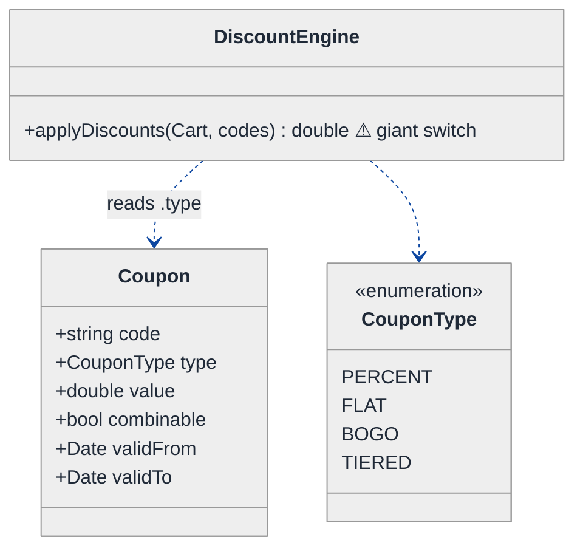
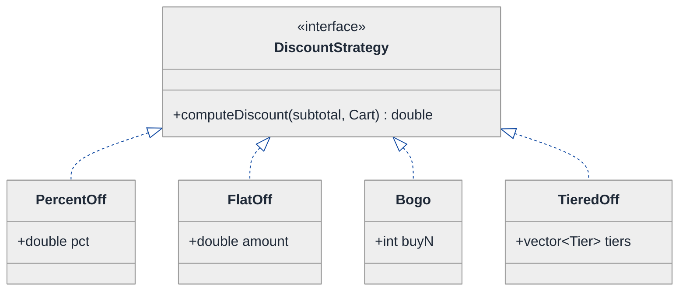
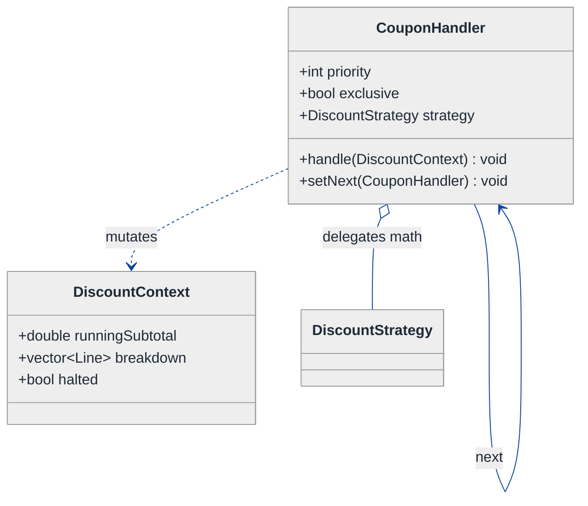
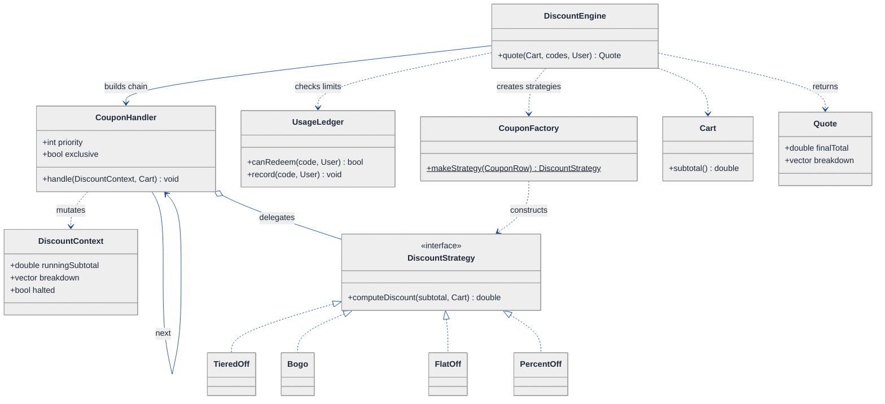
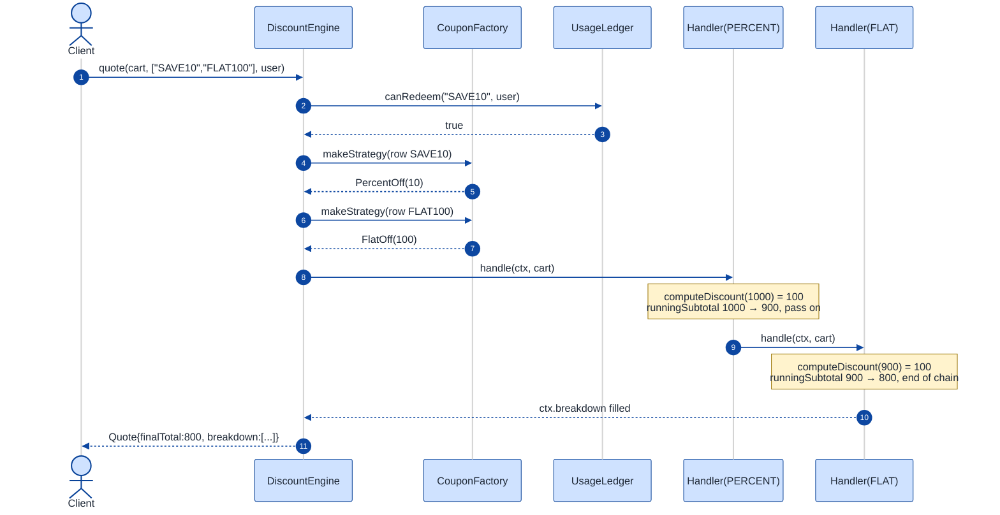

# Coupon / Discount Engine — LLD Walkthrough

> **Difficulty:** Medium   |   **Time:** ~40 min   |   **Pattern focus:** Strategy (the discount algorithm) + Chain of Responsibility (stacking) + Factory (coupon creation)
>
> **Problem source(s):** LeetLens `e1b697b7` (Strategy_Pattern bucket, Seq 5). See [`./EXTRACTED_QUESTIONS.md`](./EXTRACTED_QUESTIONS.md).
>
> **Diagrams:** inline mermaid blocks (class + sequence). Every diagram copies the canonical theme block verbatim (the sketch/hand-drawn look is intentionally omitted). See the diagram convention in [`../../TEMPLATE-v2.md`](../../TEMPLATE-v2.md).

## How to use this file

**Reading time:** ~40 minutes if you read the C++ and stop to predict; ~15 minutes if you skim the diagrams and the cheatsheets.

**The one lesson:** *The discount math is the variability axis.* A coupon engine looks like "a pile of `if (type == PERCENT) … else if (type == FLAT) …`" — and that pile is exactly the open/closed violation that the Strategy pattern exists to kill. Once each discount is a swappable object, the *second* hard problem appears: how do several coupons combine? That is a separate axis (ordering + handle-or-pass), and it pulls in Chain of Responsibility. A third, smaller axis — turning a stored coupon row into the right object — is Factory.

**Map of the 15 sections:**

| # | Section | What you get |
|---|---|---|
| 1 | Problem + clarifying questions | The 6 questions a senior asks before drawing |
| 2 | Plain-English restatement | Mentor-voice one-paragraph framing |
| 3 | Why this matters | The skill being probed |
| 4 | Mental model | Domain sketch (no code) |
| 5 | Try it yourself first | 3 prediction prompts |
| 6 | Entity & verb extraction | nouns → classes, verbs → methods |
| 7 | Iteration 1: naive design | mermaid + ~45 lines of if/else C++ |
| 8 | Where it hurts | 3 future requirements + file/line touch + pivot questions |
| 9 | Pivot 1: Strategy | discount algorithm behind an interface |
| 10 | Pivot 2: Chain of Responsibility | stacking / combinable-vs-exclusive |
| 11 | Pivot 3: Factory | coupon-code → strategy object |
| 12 | Final class diagram | inline mermaid, anchored |
| 13 | Skeleton code | C++17 shapes only |
| 14 | Sequence diagram | inline mermaid, what Strategy hides |
| 15 | Extensibility re-check + anti-patterns + think-aloud + self-check | five sub-blocks |

---

## 1. Problem statement + clarifying questions

**Restated.** Design, at the class level, a coupon/discount engine that supports: **percentage off**, **flat amount off**, **buy-one-get-one (BOGO)**, and **tiered discounts**; distinguishes **combinable** coupons from **exclusive** ones; enforces **usage limits** (per-user and global); and resolves **discount stacking priority** when more than one coupon applies to a cart.

A senior candidate does **not** start drawing. They ask:

1. **Stacking rules.** When two combinable coupons both apply, do they compound (apply the second to the *already-discounted* subtotal) or do they each apply to the *original* subtotal and we sum the discounts? This changes the math materially. *(Assume: compound — each coupon sees the running subtotal left by the previous one. This is the more common retail behaviour and the more interesting design.)*
2. **Exclusive vs combinable conflict resolution.** If the cart has one exclusive coupon and two combinable ones, which wins — the single best exclusive, or the stacked combinables, whichever yields the larger discount? Or is it first-come-first-served by the order codes were entered? *(Assume: we evaluate "best exclusive" vs "stacked combinables" and keep whichever discounts the customer more. The customer-favourable rule.)*
3. **Eligibility scope.** Do coupons apply to the whole cart, to a category, or to specific SKUs? Does BOGO mean "buy any item, get the cheapest free" or "buy SKU-X, get SKU-Y"? *(Assume: cart-level and category-level eligibility; BOGO = buy N of an eligible item, the cheapest qualifying unit is free.)*
4. **Expiry and activation windows.** Is a coupon valid by an absolute date range, and do we evaluate against the *order* timestamp or *now*? *(Assume: each coupon has `[validFrom, validTo)`; we check against the order timestamp.)*
5. **Usage limits.** Is the per-user limit "N times ever" or "N times per day"? Is the global limit a hard inventory cap (race-prone under concurrency)? *(Assume: per-user = N times ever, global = a hard cap; concurrency/atomic-decrement is noted as out of scope for the class diagram but flagged.)*
6. **Tiered semantics.** Is "tiered" by spend threshold (spend ₹5000 → 15% off) or by quantity (buy 10+ → ₹50/unit off)? *(Assume: spend-threshold tiers — the discount rate is a step function of the subtotal.)*

**The point of asking:** answers 1 and 2 decide whether stacking is a *fold over an ordered list* (it is) — which is the single biggest structural decision in this problem.

---

## 2. Plain-English restatement

Here's the situation in plain terms. A customer has a cart with a subtotal. They type in zero or more coupon codes. Each code, if valid, knocks some money off — but *how* it knocks money off differs wildly (a percentage, a flat amount, a free item, a stepped rate). Some coupons are happy to share the cart with others; some demand to be the only one. Your engine has to validate each coupon, figure out the legal combination that helps the customer most, apply them in a sensible order, and hand back a final price plus an itemised breakdown of what each coupon saved. That's it. The whole game is keeping the *kinds of discount* and the *rules for combining them* from turning into one giant tangle of conditionals.

---

## 3. Why this matters

This is the canonical "the algorithm itself varies" interview. The skill being probed is whether you can spot that *the discount calculation* is the thing changing — not the data, not the workflow — and reach for Strategy rather than a switch statement. It reappears everywhere: pricing engines, tax calculators, shipping-cost estimators, fee schedules, ranking functions. The *second* skill — recognising that "combine several of these in a priority order, some of which veto others" is a different axis that wants Chain of Responsibility — is what separates a mid-level answer ("I'll use Strategy") from a senior one ("Strategy for the math, Chain of Responsibility for the stacking, and here's why they're different objects").

---

## 4. Mental model

Picture a **conveyor belt of stamps**. The cart subtotal rides along on the belt. Each applicable coupon is a stamp pressed onto the belt in turn: the percentage stamp shaves 10%, the flat stamp lifts ₹100, the BOGO stamp removes the cheapest unit. Each stamp acts on whatever the *previous* stamp left behind (compound stacking). One special stamp — the "exclusive" one — refuses to share the belt: if it presses, no other stamp gets a turn. At the end, the price that rolls off the belt is the final total, and we kept a receipt of which stamp removed how much.

The two independent ideas in that sketch: **what a single stamp does** (varies per coupon → Strategy) and **the rules of the belt — order, sharing, vetoes** (varies per policy → Chain of Responsibility). Keep them separate.

---

## 5. Try it yourself first

Before reading the naive code, predict:

1. If you wrote this as one `applyDiscounts(cart, codes)` function with a `switch` on coupon type, **how many places** would you edit to add "tiered" discounts six months later? (Hint: count the switch, the validation, and the serialization.)
2. Stacking "compound" vs "sum-then-subtract" — which one makes the *order* of coupons matter to the final price? Why does that push you toward a list you fold over rather than a set you sum?
3. An exclusive coupon must be able to say "stop — no one after me applies." Which classic pattern lets each handler in a chain choose to *handle-and-stop* or *pass along*?

---

## 6. Entity & verb extraction

Two lists, straight from the problem statement. **No patterns yet** — just nouns and verbs.

| Noun (→ class / field candidate) | Why it's here |
|---|---|
| **Cart** | has line items, a subtotal; the thing being discounted |
| **LineItem** | SKU, unit price, quantity, category |
| **Coupon** | a code + its rules (type, value, validity, limits, combinable flag) |
| **DiscountResult** | per-coupon breakdown: which coupon, how much off |
| **User** | identity for per-user usage limits |
| **DiscountEngine** | the orchestrator the caller talks to |
| **UsageLedger** | tracks redemptions for per-user / global limits |

| Verb (→ method owner) | Likely owner |
|---|---|
| **apply** a discount to a subtotal | the coupon's discount logic |
| **validate** (expiry, eligibility, limits) | engine / coupon |
| **combine / stack** multiple coupons | engine |
| **resolve conflict** (exclusive vs combinable) | engine |
| **compute final total** | engine |
| **record redemption** | UsageLedger |

Notice the verbs cluster into two groups: *apply* (one coupon's math) and *combine/resolve* (the multi-coupon policy). That clustering is foreshadowing the two patterns.

---

## 7. <a id="iter-1"></a>Iteration 1: the naive design

What a beginner writes first: one `Coupon` struct with a `type` enum, and one engine method with a big conditional.



```cpp
// ===== Iteration 1: NO design patterns. One enum, one switch. =====
enum class CouponType { PERCENT, FLAT, BOGO, TIERED };

struct Coupon {
    std::string code;
    CouponType  type;
    double      value;        // % for PERCENT, ₹ for FLAT, n/a for BOGO...
    bool        combinable;
    Date        validFrom, validTo;
};

class DiscountEngine {
public:
    // Returns the final total after applying every code in `codes`.
    double applyDiscounts(const Cart& cart, const std::vector<std::string>& codes) {
        double subtotal = cart.subtotal();
        for (const auto& code : codes) {
            const Coupon& c = lookup(code);
            if (c.validTo < cart.orderTime()) continue;            // expiry
            // ---- the giant switch: ONE place that knows every discount kind ----
            switch (c.type) {
                case CouponType::PERCENT:
                    subtotal -= subtotal * (c.value / 100.0);
                    break;
                case CouponType::FLAT:
                    subtotal -= std::min(c.value, subtotal);
                    break;
                case CouponType::BOGO: {
                    double cheapest = cart.cheapestEligibleUnitPrice();
                    subtotal -= cheapest;
                    break;
                }
                case CouponType::TIERED:
                    if      (subtotal > 5000) subtotal -= subtotal * 0.15;
                    else if (subtotal > 2000) subtotal -= subtotal * 0.10;
                    else                      subtotal -= subtotal * 0.05;
                    break;
            }
            // ---- and combinable/exclusive logic would ALSO live here ----
            if (!c.combinable) break;   // exclusive: stop after this one
        }
        return std::max(0.0, subtotal);
    }
private:
    const Coupon& lookup(const std::string& code);  // elided
};
```

**State it plainly:** this works. It has zero design patterns. Now let's watch it break.

---

## 8. <a id="naive-pain"></a>Where the naive design hurts

Three realistic change requests. For each: the change, the files/lines that move, the smell, and the pivot question.

### Change A — "Add a 'free shipping' discount, and next quarter a 'spend ₹X get ₹Y' threshold coupon"

- **Files/lines that change:** `CouponType` enum gains `FREE_SHIPPING`, `SPEND_GET` (1 file). The `switch` in `applyDiscounts` gains two `case` blocks (`DiscountEngine.cpp`, the loop body). The persistence/serialization layer that maps DB rows → `Coupon` gains two branches. Any analytics that buckets by type gains two branches.
- **Smell:** every new discount *kind* edits the same `switch`, and the switch is also where stacking lives — so unrelated concerns recompile together. This is a textbook **open/closed principle** violation.

> **Mini-refresher: Open/Closed Principle (the "O" in SOLID).**
> Software entities should be **open for extension, closed for modification** — you add behaviour by adding new code, not by editing existing, tested code. A `switch` that grows a `case` per feature is the canonical violation: every new feature reopens a closed file.

- **Pivot question:** *the thing that varies is the discount calculation itself — the per-coupon math. What pattern lets me add a new calculation as a new class without touching the existing ones?*

### Change B — "Two combinable coupons should compound; an exclusive coupon must veto everything else; and marketing wants to reorder priority without a deploy"

- **Files/lines that change:** the loop's `if (!c.combinable) break;` is too crude — it can't express "evaluate best-exclusive vs stacked-combinables and keep the better." That logic balloons inside `applyDiscounts`, interleaved with the math `switch`. To make ordering data-driven, you thread a priority field through the loop and sort `codes` first. Every change to stacking policy edits the same method that holds the math.
- **Smell:** *two* axes of change (what each coupon does, and how coupons combine) live in **one** method. Single Responsibility violation — the method changes for two unrelated reasons.

> **Mini-refresher: Single Responsibility Principle (the "S" in SOLID).**
> A class (or method) should have **one reason to change**. If discount math and stacking policy both force edits to `applyDiscounts`, it has two reasons — split it.

- **Pivot question:** *combining is "run an ordered list of handlers, each of which may handle-and-stop or pass along." What pattern is exactly an ordered list of handlers with a handle-or-pass decision?*

### Change C — "Coupons now arrive as JSON rows from a campaign service; constructing the right discount object from a code is sprinkled everywhere"

- **Files/lines that change:** today `lookup(code)` returns a `Coupon` struct and the *caller* must re-derive behaviour from `.type`. Once each discount is its own class (Change A's fix), every call site that needs "the object for this code" duplicates a `switch (row.type) { case PERCENT: new PercentDiscount(...) ... }`. That construction switch appears in the engine, in tests, in the admin tool.
- **Smell:** object **creation** logic is duplicated and coupled to the concrete classes — a second open/closed violation, this time on the *instantiation* side.
- **Pivot question:** *who should own the "code/row → concrete discount object" mapping so there's exactly one place that knows the concrete classes?*

### The pattern of pain

Three changes, three distinct axes: **(A) the per-coupon math**, **(B) the combination policy**, **(C) the object creation**. The naive design jams all three into one method + one enum. Each axis wants its own pattern. We pivot one axis at a time.

---

## 9. <a id="pivot-1"></a>Pivot 1: Strategy for the discount calculation

The most painful axis (Change A) is **the discount math itself**. Each coupon kind is a different *algorithm* that turns a subtotal into a discount amount. We want to add a new algorithm without editing the others.

> **Mini-refresher: Strategy pattern.**
> Encapsulates an algorithm behind an interface so it can be swapped at runtime. The **caller** decides which strategy to use; the strategy doesn't know about its peers.
> Quick example: a `Sorter` takes a `CompareStrategy*`. Pass `AscendingCompare` or `DescendingCompare` — the sorter doesn't care which.

Here, the "algorithm" is `computeDiscount(subtotal, cart) → amount`. We make it an interface and give each coupon kind a concrete strategy. The giant `switch` evaporates — replaced by polymorphism.



```cpp
// ===== Pivot 1: Strategy. Each discount kind is now its own class. =====
class DiscountStrategy {
public:
    virtual ~DiscountStrategy() = default;
    // Returns the discount amount to subtract from `subtotal`.
    virtual double computeDiscount(double subtotal, const Cart& cart) const = 0;
};

class PercentOff : public DiscountStrategy {
public:
    explicit PercentOff(double pct) : pct_(pct) {}
    double computeDiscount(double subtotal, const Cart&) const override {
        return subtotal * (pct_ / 100.0);
    }
private:
    double pct_;
};

class FlatOff : public DiscountStrategy {
public:
    explicit FlatOff(double amount) : amount_(amount) {}
    double computeDiscount(double subtotal, const Cart&) const override {
        return std::min(amount_, subtotal);          // never below zero
    }
private:
    double amount_;
};

class TieredOff : public DiscountStrategy {       // spend-threshold step function
public:
    explicit TieredOff(std::vector<std::pair<double,double>> tiers)  // {threshold, pct}
        : tiers_(std::move(tiers)) {}              // sorted desc by threshold
    double computeDiscount(double subtotal, const Cart&) const override {
        for (const auto& [threshold, pct] : tiers_)
            if (subtotal >= threshold) return subtotal * (pct / 100.0);
        return 0.0;
    }
private:
    std::vector<std::pair<double,double>> tiers_;
};
// Bogo elided — computes cheapest eligible unit price from `cart`.
```

Adding "free shipping" is now: write one `FreeShipping : public DiscountStrategy`. Zero edits to `PercentOff`, `FlatOff`, or the engine. Open/closed satisfied.

**Pattern-discrimination cheatsheets.**

**Strategy vs State.**
- *Strategy:* the **caller** picks which algorithm to use (`coupon.strategy = new PercentOff(10)`).
- *State:* the **object** picks, via internal transitions (a coupon "ACTIVE → EXHAUSTED" flipping its own behaviour as usage limits hit).
- *Rule of thumb:* if something external calls `setStrategy(x)` → Strategy. If `handleEvent(e)` flips behaviour internally → State. Our discount kind is chosen at coupon-creation by the caller, never self-mutating → **Strategy**.

**Strategy vs Factory.**
- *Strategy:* about **interchangeable behaviour** at run time — "which algorithm runs."
- *Factory:* about **object creation** — "which concrete object gets built." They're orthogonal and often used together (we use Factory in Pivot 3 to *create* the Strategy).
- *Rule of thumb:* if the question is "what does it *do*?" → Strategy. If the question is "who *makes* it?" → Factory.

---

## 10. <a id="pivot-2"></a>Pivot 2: Chain of Responsibility for stacking

Change B's axis is **how multiple coupons combine** — order matters, some compound, an exclusive one vetoes the rest. That is precisely an ordered list of handlers where each may **handle-and-stop or handle-and-pass**.

> **Mini-refresher: Chain of Responsibility pattern.**
> A request travels along a chain of handler objects. Each handler either **processes it and passes it on**, **processes it and stops the chain**, or **passes it untouched**. The sender doesn't know which handler (or how many) will act.
> Quick example: a support ticket flows Tier-1 → Tier-2 → Tier-3; the first tier that can resolve it stops the chain.

We model each *applicable* coupon as a handler holding its `DiscountStrategy` (from Pivot 1). The chain folds over the running subtotal — that gives us compound stacking for free. A handler marked **exclusive** applies, records its result, and **halts** the chain.



```cpp
// ===== Pivot 2: Chain of Responsibility for stacking/ordering/veto. =====
struct DiscountContext {
    double runningSubtotal;
    std::vector<std::pair<std::string,double>> breakdown;  // {code, amountOff}
    bool halted = false;
};

class CouponHandler {
public:
    CouponHandler(std::string code, int priority, bool exclusive,
                  std::unique_ptr<DiscountStrategy> strat)
        : code_(std::move(code)), priority_(priority),
          exclusive_(exclusive), strategy_(std::move(strat)) {}

    void setNext(CouponHandler* next) { next_ = next; }

    void handle(DiscountContext& ctx, const Cart& cart) const {
        if (ctx.halted) return;
        const double off = strategy_->computeDiscount(ctx.runningSubtotal, cart);
        ctx.runningSubtotal -= off;                 // COMPOUND: next sees this
        ctx.breakdown.push_back({code_, off});
        if (exclusive_) { ctx.halted = true; return; }   // veto the rest
        if (next_) next_->handle(ctx, cart);             // pass along
    }
    int priority() const { return priority_; }
private:
    std::string code_;
    int  priority_;
    bool exclusive_;
    std::unique_ptr<DiscountStrategy> strategy_;
    CouponHandler* next_ = nullptr;   // raw back-link; chain owns nodes elsewhere
};
// Engine sorts handlers by priority(), links them, runs best-exclusive vs
// best-combinable-chain, keeps whichever total is lower. Comparison elided.
```

The engine no longer holds discount math *or* an `if (!combinable) break`. It builds two candidate chains (the combinables, sorted by priority; and each exclusive alone), runs each over a fresh `DiscountContext`, and keeps the customer-favourable result.

**Pattern-discrimination cheatsheet.**

**Chain of Responsibility vs Decorator.**
- *Chain of Responsibility:* handlers may **stop** the chain (the exclusive veto); the request might be handled by *one* link. Intent: "find the handler(s)."
- *Decorator:* every wrapper **always** runs and augments the result; you never short-circuit. Intent: "stack behaviours, all of them."
- *Rule of thumb:* if any link can say "stop, I'm the last" → Chain. If every layer always contributes → Decorator. Our exclusive-veto requires stopping → **Chain**. (If stacking were *always* "apply all, no vetoes," Decorator would fit too — note that to the interviewer.)

**Chain of Responsibility vs a Rule Engine.**
- *Chain:* fixed linear order, each handler self-contained.
- *Rule engine:* a separate matcher selects rules by conditions, with explicit conflict-resolution policy. Worth mentioning as the "scale-up" if priority logic gets data-driven and complex.

---

## 11. <a id="pivot-3"></a>Pivot 3: Factory for coupon creation

Change C's axis is **object creation**: a coupon code or DB row must become the right `DiscountStrategy` + handler. We want exactly one place that knows the concrete strategy classes.

> **Mini-refresher: Factory (Factory Method) pattern.**
> Centralises object creation behind a single function/class so callers ask for *what* they want, not *how* it's built. Adding a new product type edits one factory, not every call site.
> Quick example: `ShapeFactory::create("circle")` returns a `unique_ptr<Shape>`; callers never write `new Circle`.

```cpp
// ===== Pivot 3: Factory maps a stored coupon row -> Strategy object. =====
class CouponFactory {
public:
    // The ONE place that knows the concrete DiscountStrategy classes.
    static std::unique_ptr<DiscountStrategy> makeStrategy(const CouponRow& row) {
        switch (row.kind) {
            case Kind::PERCENT: return std::make_unique<PercentOff>(row.value);
            case Kind::FLAT:    return std::make_unique<FlatOff>(row.value);
            case Kind::TIERED:  return std::make_unique<TieredOff>(parseTiers(row));
            case Kind::BOGO:    return std::make_unique<Bogo>(row.buyN);
        }
        throw std::invalid_argument("unknown coupon kind");
    }
    static std::vector<std::pair<double,double>> parseTiers(const CouponRow&); // elided
};
```

This is the *only* surviving `switch` — and that's correct: a factory is allowed to know every concrete type, because creation is its single responsibility (SRP again). Adding "free shipping" now touches exactly two places: a new `FreeShipping` strategy class, and one `case` here. Nothing else.

**Pattern-discrimination cheatsheet.**

**Factory vs Builder.**
- *Factory:* "give me the right *type* of object," one call.
- *Builder:* "assemble one complex object step by step" (fluent `withX().withY().build()`).
- *Rule of thumb:* branching on a type tag → Factory. Many optional construction parameters → Builder. We branch on `row.kind` → **Factory**.

---

## 12. <a id="fig-class-diagram"></a>Final class diagram



**Reading guide (1/2).** The `DiscountEngine` is the only class the caller talks to: `quote(cart, codes, user)`. It uses `CouponFactory` to turn each code into a `DiscountStrategy`, asks `UsageLedger` whether each code is still redeemable, then builds a chain of `CouponHandler` nodes ordered by `priority`.

**Reading guide (2/2).** The three patterns sit on three different edges: the **Strategy** interface (`DiscountStrategy` with its four impls) owns the *math*; the **Chain** (`CouponHandler --> next`, mutating a shared `DiscountContext`) owns the *stacking and veto*; the **Factory** (`CouponFactory`) owns *creation*. A handler *delegates* (aggregation `o--`) to a strategy — it holds one but doesn't define the math. The engine returns a `Quote` with the final total plus a per-coupon breakdown.

---

## 13. Skeleton code (C++)

Shapes only — abstract bases plus one or two concrete classes per pattern; the rest is `// elided`.

```cpp
#include <memory>
#include <string>
#include <vector>

class Cart;                       // forward — defined elsewhere
struct CouponRow;                 // forward — DB/JSON row

enum class CouponKind { PERCENT, FLAT, BOGO, TIERED };   // never bare enum

// ---- Strategy: the discount math ----
class DiscountStrategy {
public:
    virtual ~DiscountStrategy() = default;
    virtual double computeDiscount(double subtotal, const Cart& cart) const = 0;
};

class PercentOff : public DiscountStrategy {
public:
    explicit PercentOff(double pct) : pct_(pct) {}
    double computeDiscount(double subtotal, const Cart&) const override {
        return subtotal * (pct_ / 100.0);
    }
private:
    double pct_;
};
// FlatOff, Bogo, TieredOff elided — same shape, different math.

// ---- Chain of Responsibility: stacking ----
struct DiscountContext {
    double runningSubtotal;
    std::vector<std::pair<std::string, double>> breakdown;
    bool halted = false;
};

class CouponHandler {
public:
    CouponHandler(std::string code, int priority, bool exclusive,
                  std::unique_ptr<DiscountStrategy> strategy);   // elided body
    void setNext(CouponHandler* next) { next_ = next; }
    void handle(DiscountContext& ctx, const Cart& cart) const;   // elided body
    int  priority() const;                                       // elided body
private:
    std::string code_;
    int  priority_;
    bool exclusive_;
    std::unique_ptr<DiscountStrategy> strategy_;   // exclusive ownership
    CouponHandler* next_ = nullptr;                // non-owning link
};

// ---- Factory: creation ----
class CouponFactory {
public:
    static std::unique_ptr<DiscountStrategy> makeStrategy(const CouponRow& row);  // elided
};

// ---- Orchestrator ----
struct Quote { double finalTotal; std::vector<std::pair<std::string,double>> breakdown; };

class DiscountEngine {
public:
    Quote quote(const Cart& cart,
                const std::vector<std::string>& codes,
                const class User& user);   // validate -> build chain -> fold -> return
private:
    class UsageLedger* ledger_;            // checks per-user / global limits
    // candidate-chain comparison (best-exclusive vs stacked-combinable) elided
};
```

---

## 14. <a id="fig-sequence"></a>Key flow — sequence diagram



**What the patterns HIDE from the caller.** The client sends *codes* and gets back a *Quote*. It never learns that "SAVE10" is a percentage and "FLAT100" is a flat amount — **Strategy** hides the per-coupon math behind one `computeDiscount` call. It never learns the *order* coupons were applied in, that the percentage saw ₹1000 but the flat saw the already-discounted ₹900 (compound), or that an exclusive coupon could have halted the chain — **Chain of Responsibility** hides the combination policy. And it never writes `new PercentOff` — **Factory** hides which concrete class backs each code. The caller's mental model stays "codes in, price out."

---

## 15. Extensibility re-check + anti-patterns + how to think aloud + self-check

### Extensibility re-check

| New requirement | What you add | What you DON'T touch |
|---|---|---|
| "Free shipping" discount | one `FreeShipping : DiscountStrategy` + one `case` in `CouponFactory` | every other strategy, the chain, the engine |
| "First-order-only" eligibility | a guard in the relevant handler / a validation predicate | the math strategies |
| "Apply-all, no vetoes" stacking mode | a handler subclass that never sets `halted` | the strategies, the factory |
| New conflict policy (sum-then-subtract) | a second `DiscountContext`-folding routine in the engine | strategies and handlers |

The three axes that hurt in §8 are now each absorbed by adding a class, not editing one.

### Common confusion + traps

- **Putting `combinable`/`exclusive` logic inside the Strategy.** No — that's *combination policy*, which is the Chain's job. The Strategy only knows its own math. Mixing them re-creates the original two-reasons-to-change smell.
- **Letting the engine `new` concrete strategies.** That's the Factory's job; doing it in the engine re-introduces Change C's duplicated creation switch.
- **Summing discounts vs compounding.** If you fold over a list, you get compounding for free; if you sum independent discounts you must apply them to the *original* subtotal — decide and state it (we chose compound).

### Anti-patterns (named)

- **God object:** a `DiscountEngine` that holds the math, the stacking, the creation, and the persistence. We split it into Strategy + Chain + Factory + Ledger.
- **`switch`-on-type smell (a.k.a. type-code-instead-of-polymorphism):** the §7 enum switch. Replaced by Strategy; the only surviving switch is confined to the Factory, where it belongs.
- **Primitive obsession:** passing raw `CouponType` enums + `double value` everywhere instead of a typed strategy object. Fixed by giving each kind a class.
- **Boolean-flag explosion:** encoding policy as `combinable`, `exclusive`, `stackable`, `firstOnly` booleans threaded through one method — replaced by handler behaviour.

### How to think aloud (first person)

"Okay — first I'd separate *what one coupon does* from *how coupons combine*; those are two different reasons to change, so they should be two different abstractions. The per-coupon math is the obvious variability axis, so I'll make `DiscountStrategy` an interface and give each kind — percent, flat, BOGO, tiered — its own class; that kills the type switch and satisfies open/closed. Then stacking: order matters and an exclusive coupon must veto the rest, which is literally 'an ordered list of handlers that can handle-and-stop' — Chain of Responsibility, folding over a running subtotal so compounding falls out naturally. Finally I don't want every call site to know the concrete strategy classes, so a `CouponFactory` owns the code→object mapping — the one place a switch is legitimate. The engine just orchestrates: validate against the usage ledger, build the chain, fold, return a quote with a breakdown. I'd flag concurrency on the global usage limit as the real-world sharp edge, but it's orthogonal to the class structure."

### Self-check — the question to ask next time

> When you see "design a [pricing/discount/fee] engine with multiple [kinds] that [combine]," ask **two** questions, not one:
>
> > **1. "Is the *calculation* the thing that varies?"** → if the caller picks which algorithm runs, that's **Strategy** (not State — State is the object flipping its own behaviour).
> >
> > **2. "Do several of them *combine in an order, with possible vetoes*?"** → an ordered handle-or-pass list is **Chain of Responsibility** (not Decorator — Decorator never short-circuits).
>
> Math axis → Strategy. Combination axis → Chain. Creation axis → Factory. Three axes, three patterns — name each one separately and you've given the senior answer.

---

## Cross-references

- **Parent topic manifest:** [`./EXTRACTED_QUESTIONS.md`](./EXTRACTED_QUESTIONS.md)
- **Vertical overview:** [`../../LEARNING.md`](../../LEARNING.md)
- **Template / contract:** [`../../TEMPLATE-v2.md`](../../TEMPLATE-v2.md)
- **Canonical exemplar:** [`../Object_Oriented_Design/Parking_Lot.md`](../Object_Oriented_Design/Parking_Lot.md)
- **Related v2 walkthroughs:** [`./Shopping_Cart.md`](./Shopping_Cart.md) (Strategy + Decorator + State for carts), [`./Notification_Service.md`](./Notification_Service.md) (Strategy + Observer)
- **Optional editable diagrams:** sibling `.excalidraw` files (supplementary, not required)
