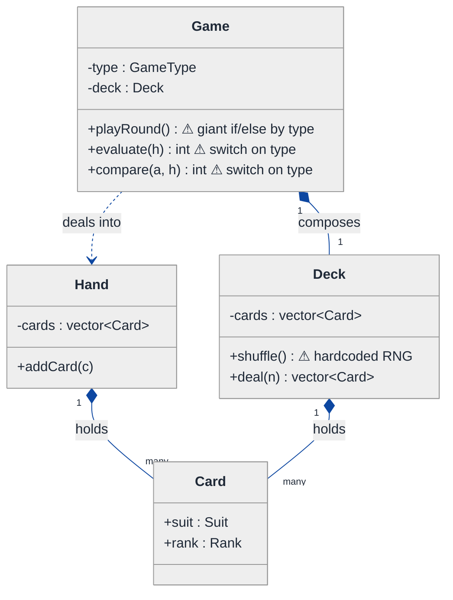
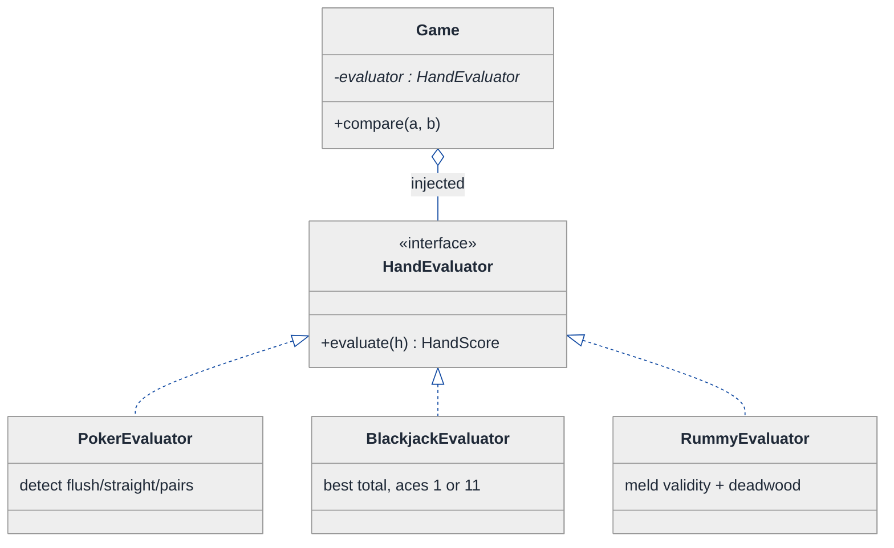
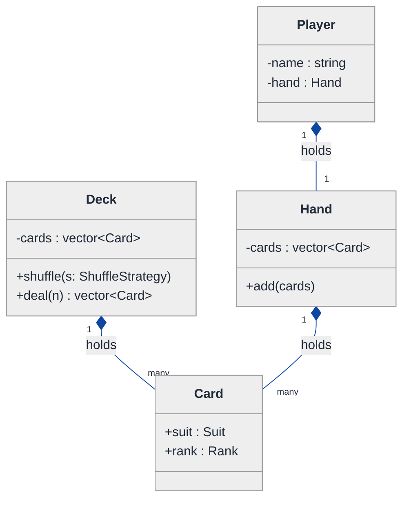
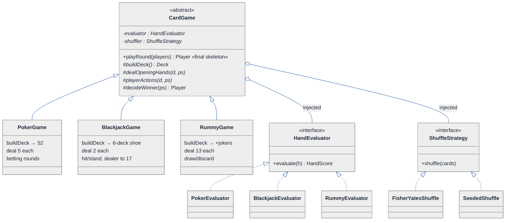
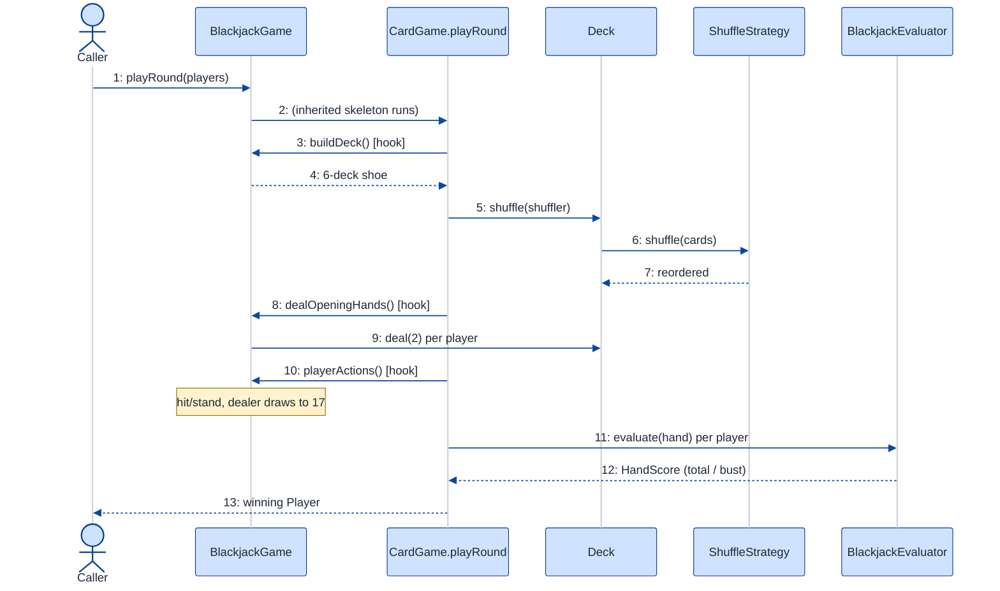

# Deck of Cards (Multi-Game Card Engine) — LLD Walkthrough

> **Difficulty:** Medium · **Time:** ~30 min · **Pattern focus:** Strategy (shuffle / hand-evaluation / rules) + Template Method (the deal-and-play loop)
>
> **Problem source(s):** GID SG9, bucket `Strategy_Pattern`. Representative of multiple LeetLens rows in [`./EXTRACTED_QUESTIONS.md`](./EXTRACTED_QUESTIONS.md).
>
> **Diagrams:** inline mermaid (renders natively in GitHub / VS Code). No external image sources.

---

## How to use this file

Paced for a candidate seeing "design a multi-game card system" for the first time. Reading time: ~30 minutes if you sketch each iteration by hand. **The lesson: a `Card` and a `Deck` are trivially shared across Poker, Blackjack, and Rummy — the hard part is the per-game VARIATION (how you shuffle, how you score a hand, what the rules are). Don't reach for a giant `if (game == POKER)` switch. DERIVE Strategy for the algorithms that vary, and Template Method for the play-loop skeleton that stays fixed.**

**Map of this file (15 sections):**

1. Problem statement + clarifying questions
2. Plain-English restatement
3. Why this matters
4. Mental model
5. Try it yourself first
6. Entity & verb extraction
7. **Iteration 1: the naive design** — what we'd write first
8. **Where the naive design hurts** — four future requirements, one painful diff each
9. **Pivot 1: Strategy for hand evaluation** — the most painful axis first
10. **Pivot 2: Strategy for shuffling** — same shape, different axis
11. **Pivot 3: Template Method for the play-loop** + Strategy for the rule engine
12. Final UML class diagram
13. Skeleton code (C++)
14. Key flow — sequence diagram
15. Extensibility re-check + anti-patterns + how to think aloud + self-check

---

## 1. Problem statement + clarifying questions

**Prompt (typical phrasing):** "Design a deck of cards system that supports multiple card games (Poker, Blackjack, Rummy). Include deck shuffling, dealing, hand evaluation, and game-specific rule engines."

**Clarifying questions to ask BEFORE drawing anything:**

1. **Which games at launch, and which are coming?** Poker, Blackjack, Rummy now — but the phrase "multiple card games" tells me the system must accept a NEW game without rewriting the engine. That single answer decides the whole design.
2. **Single standard 52-card deck, or variants?** Does Blackjack use a 6-deck shoe? Does anything use jokers? Does Rummy use two decks? Deck composition itself may vary per game.
3. **Is "hand evaluation" comparison (who wins) or classification (what is this hand)?** Poker needs "flush beats straight"; Blackjack needs "is this 21 / bust / soft 17"; Rummy needs "are these valid melds." Very different return types.
4. **How "fair" must shuffling be?** A real casino wants a cryptographically-seeded Fisher-Yates; a unit test wants a *deterministic* shuffle (fixed seed) so results are reproducible. So shuffling itself is an axis that varies.
5. **Who drives the turn loop — the engine or the caller?** Does the system run the full game (deal → bet → reveal → score), or just provide primitives the caller stitches together?
6. **Multiplayer / concurrency?** Multiple players at one table, or single-player-vs-dealer? Networked tables? (Assume single-table, single-threaded for the core design; note concurrency in §15.)

**Assumptions if the interviewer dodges:** standard 52-card `Suit × Rank` deck as the shared primitive; deck composition can be overridden per game; hand evaluation differs per game and returns a comparable score; shuffle is swappable (real RNG vs. seeded); the engine drives a fixed deal-and-play skeleton with game-specific hooks; single-threaded for now.

---

## 2. Plain-English restatement

We're building the reusable core that several card games sit on top of. The bottom layer — a `Card` (suit + rank) and a `Deck` (an ordered pile of cards you can shuffle and deal from) — is identical across every game. The top layer is where games disagree: Poker ranks five-card hands, Blackjack counts toward 21 with soft aces, Rummy validates runs and sets. The design must let us add a brand-new game (say, Baccarat) by writing the game-specific bits ONLY — not by editing the deck, the shuffler, or any existing game.

---

## 3. Why this matters

This question is a clean separation test: can you tell the difference between the parts that are SHARED (the deck, dealing) and the parts that VARY (scoring, rules, shuffle quality), and pick the right tool for each? The trap is modeling every game as a subclass of one giant `CardGame` that overrides everything, or worse, a single class with a `gameType` enum and switches everywhere. The senior signal is using composition + Strategy for the algorithms that swap, and Template Method for the one thing that genuinely stays fixed: the order of phases in a round. It reappears anywhere you have "one workflow, many pluggable policies" — payment pipelines, report generators, ETL jobs.

---

## 4. Mental model

A card game is a **fixed ceremony wrapped around swappable rules**. The ceremony is always the same: build a deck, shuffle it, deal hands, let players act, then score and decide a winner. What changes between games is the *content* of three of those steps — how thoroughly you shuffle, how many cards you deal, and how you score the final hands.

```
Real-world sketch (NOT a UML diagram yet):

   SHARED primitives                 PER-GAME policy (varies)
   ┌───────────────────┐             ┌──────────────────────────┐
   │ Card  = Suit+Rank │             │ Shuffle:  Fisher-Yates    │
   │ Deck  = [Card...] │  ◄──uses──  │           Seeded (tests)  │
   │   .shuffle()      │             ├──────────────────────────┤
   │   .deal(n)        │             │ Evaluate: PokerHandRank   │
   └───────────────────┘             │           BlackjackCount  │
            ▲                         │           RummyMelds      │
            │ deal-and-play           ├──────────────────────────┤
   ┌────────┴──────────┐             │ Rules:    Poker / BJ / ...│
   │  Game ceremony    │  ──drives── │  (cards per hand, win cmp)│
   │  (FIXED skeleton) │             └──────────────────────────┘
   └───────────────────┘
```

The KEY insight: the left column is built ONCE. The right column is a family of small, swappable objects. The ceremony in the bottom-left is a fixed sequence of steps with three holes where game-specific behavior plugs in — that's exactly what Template Method captures, and the holes are filled by Strategy objects.

---

## 5. Try it yourself first

> **Predict before reading on:**
>
> 1. List the nouns you'd promote to classes. Which ones are SHARED across all games, and which are PER-GAME?
> 2. **If I told you a new game (Baccarat) ships next sprint, what's the minimum set of classes you'd want to write — and which existing classes should you NOT have to touch?**
> 3. Hand evaluation returns very different things per game (a poker rank, a 0-21 count, a meld validity). How do you give the engine ONE way to ask "who won" across all of them?

---

## 6. Entity & verb extraction

> **Mini-refresher: noun → class, but not every noun.**
>
> Naive OOD promotes every noun to a class. Senior OOD promotes a noun only if it has BEHAVIOR and STATE that belong together. "Suit" stays an `enum class`; "Deck" becomes a class because it owns ordered cards and the shuffle/deal behavior over them.

**Nouns from the prompt:**

| Noun | Decision | Why |
|---|---|---|
| Card | Class (tiny, immutable) | Suit + Rank; value-type, no lifecycle |
| Suit / Rank | `enum class` | Fixed, typed sets — not classes |
| Deck | Class | Owns ordered cards + shuffle/deal behavior |
| Hand | Class | The cards a player holds; given to an evaluator |
| Player | Class | Has a hand + identity; later, a balance |
| Game | Class (the engine/coordinator) | Drives the round; holds the policies |
| Shuffle | **Strategy** (we'll derive) | The algorithm varies (real vs. seeded) |
| Hand evaluation | **Strategy** (we'll derive) | Wildly different per game |
| Rule engine | **Strategy** (we'll derive) | Cards-per-hand, win comparison vary |

**Verbs (and the class they live on):**

| Verb | Owner class (naive answer — we'll re-examine) |
|---|---|
| shuffle() | Deck |
| deal(n) | Deck |
| evaluate(hand) | Game (naive: a big switch) |
| compareHands(a, b) | Game |
| playRound() | Game |
| addCard(card) | Hand |

**We have NOT introduced any design patterns yet.** Pure nouns + verbs. (The "Strategy" tags above are foreshadowing — the naive design in §7 will hardcode all three of those axes.)

---

## 7. <a id="iter-1"></a>Iteration 1: the naive design

The simplest thing that could possibly work: a `Card`, a `Deck` that shuffles itself, and one `Game` class that switches on a `GameType` enum for everything game-specific.



**Reader's tour (read top to bottom; ~60 seconds).**

1. **`Card` is a dumb value.** Suit + Rank, nothing else. This is correct and never changes — it's the shared primitive. Good.

2. **`Deck` owns its cards and shuffles itself.** The composition diamond (`◆`) means the deck OWNS its `Card[]`. `deal(n)` pops n cards off the top. `shuffle()` carries a ⚠ — it calls one hardcoded RNG. There's no way to make it deterministic for a test, and no way to upgrade to a casino-grade shuffle without editing this method.

3. **`Hand` is a small bag of cards** a player accumulates. Fine for now.

4. **`Game` is the trouble zone — it's a god class.** Look at the three ⚠ markers:
   - `playRound()` is a giant `if (type == POKER) {...} else if (type == BLACKJACK) {...}` — every game's entire flow crammed into one method.
   - `evaluate(hand)` switches on `type` to score a hand. Poker logic, Blackjack logic, Rummy logic all live in one function.
   - `compare(a, b)` switches on `type` to decide a winner.

   Every game-specific decision is a `switch (type_)`. Adding a game means editing all three methods.

**What's deliberately missing.** No `ShuffleStrategy`. No `HandEvaluator`. No `GameRules`. The naive design doesn't even acknowledge that shuffling, scoring, and rules are independent axes — it bakes a hardcoded answer for each into `Game`'s methods, dispatched by an enum. That's what we'll expose and fix.

Skeleton code for the naive design (C++):

```cpp
#include <algorithm>
#include <random>
#include <stdexcept>
#include <vector>

enum class Suit { CLUBS, DIAMONDS, HEARTS, SPADES };
enum class Rank { TWO, THREE, /* ... */ KING, ACE };
enum class GameType { POKER, BLACKJACK, RUMMY };

struct Card { Suit suit; Rank rank; };

class Deck {
public:
    Deck() { for (auto s : allSuits()) for (auto r : allRanks()) cards_.push_back({s, r}); }
    void shuffle() {                                   // hardcoded — will hurt
        std::mt19937 rng{std::random_device{}()};      // can't seed for tests
        std::shuffle(cards_.begin(), cards_.end(), rng);
    }
    std::vector<Card> deal(int n) {
        if ((int)cards_.size() < n) throw std::runtime_error("Not enough cards");
        std::vector<Card> out(cards_.end() - n, cards_.end());
        cards_.erase(cards_.end() - n, cards_.end());
        return out;
    }
private:
    std::vector<Card> cards_;
    // allSuits()/allRanks() elided
};

class Hand { public: void addCard(Card c) { cards_.push_back(c); } std::vector<Card> cards_; };

class Game {
public:
    explicit Game(GameType type) : type_(type) {}

    int evaluate(const Hand& h) const {               // switch on type — will hurt
        switch (type_) {
            case GameType::POKER:     return scorePoker(h);      // flush/straight/...
            case GameType::BLACKJACK: return scoreBlackjack(h);  // sum toward 21
            case GameType::RUMMY:     return scoreRummy(h);      // meld validity
        }
        return 0;
    }
    int compare(const Hand& a, const Hand& b) const {  // switch on type — will hurt
        switch (type_) {
            case GameType::BLACKJACK: /* closest to 21 without bust */ break;
            default:                  return evaluate(a) - evaluate(b);
        }
        return 0;
    }
    void playRound() {                                 // giant if/else — will hurt
        if (type_ == GameType::POKER)          { /* deal 5, bet, reveal, compare */ }
        else if (type_ == GameType::BLACKJACK) { /* deal 2, hit/stand, dealer draws */ }
        else if (type_ == GameType::RUMMY)     { /* deal 13, draw/discard loop */ }
    }
private:
    GameType type_;
    Deck     deck_;
    // scorePoker/scoreBlackjack/scoreRummy elided
};
```

**This works.** It has zero design patterns. We can build a deck, shuffle, deal, score, and run a round. So what's wrong with it?

---

## 8. <a id="naive-pain"></a>Where the naive design hurts

The interviewer slides four upcoming requirements across the desk: "Walk me through what changes for each."

### Change A: "Add Baccarat (a fourth game)"

In the naive design:
- Add `BACCARAT` to the `GameType` enum.
- Add a `case BACCARAT:` to `Game::evaluate()`.
- Add a `case BACCARAT:` to `Game::compare()`.
- Add an `else if (type_ == BACCARAT)` branch to `Game::playRound()`.
- **One new game = surgery in THREE methods + the enum. And you risk breaking Poker/Blackjack/Rummy while you're in there.**

### Change B: "Tests must be reproducible — same shuffle every run"

In the naive design:
- `Deck::shuffle()` seeds its RNG from `random_device` (non-deterministic).
- To test, you'd add an `if (testMode)` flag and a second code path inside `shuffle()`.
- **Now the deck knows about test mode. Two more requirements (casino-grade shuffle, riffle-shuffle simulation) each add another branch to the same method.**

### Change C: "Blackjack needs a 6-deck shoe; Rummy needs jokers"

In the naive design:
- Deck composition is hardcoded in the `Deck` constructor (one standard 52).
- You'd add constructor parameters or a `buildFor(GameType)` switch.
- **Deck composition becomes yet another switch on game type — the enum leaks into the one class that should be game-agnostic.**

### Change D: "Poker hand evaluation has a bug — and it's 200 lines inside `Game::evaluate`"

In the naive design:
- `scorePoker`, `scoreBlackjack`, `scoreRummy` are all private helpers on one class.
- You can't unit-test the poker evaluator in isolation — it's welded to `Game` and reached only through the `evaluate` switch.
- **Scoring logic for three unrelated games shares one file, one class, one test target.**

### The pattern of pain

| Change | Files touched | Smell |
|---|---|---|
| A. New game | `Game::evaluate` + `compare` + `playRound` + enum | "Every game-specific decision is a switch on type." |
| B. Reproducible shuffle | `Deck::shuffle` grows branches | "One method accumulates every shuffle variant." |
| C. Deck variants | `Deck` ctor switch on type | "Game type leaks into the shared primitive." |
| D. Buggy poker eval | `Game` (god class) | "Three unrelated algorithms welded into one class." |

**Two axes of pain dominate:** algorithm variability (shuffle, hand evaluation, rules/composition all vary independently and are picked by the GAME) and structural duplication (the play-loop is the same shape for every game, but rewritten in each `if` branch).

> **Pivot question:** "What pattern handles 'an algorithm that varies, chosen externally'? And what pattern handles 'a fixed sequence of steps where only a few steps differ per variant'?"
>
> The answers are Strategy and Template Method. Let's introduce them one at a time, starting with the most painful axis: hand evaluation.

---

## 9. <a id="pivot-1"></a>Pivot 1: Strategy for hand evaluation

> **Mini-refresher: Strategy pattern.**
>
> Encapsulates an algorithm behind an interface so it can be swapped at runtime. The CALLER decides which strategy to use; the strategy doesn't know about its peers.
>
> Quick example: a `Sorter` takes a `CompareStrategy*` in its constructor. Pass `Ascending` or `Descending` — the sorter doesn't care which.

**Why Strategy fits hand evaluation.** Evaluating a hand is an algorithm (`given cards, return a comparable score`). It varies enormously (poker rank, blackjack count, rummy melds). The choice is made externally — by which game you're playing, not by the hand itself. That's textbook Strategy. The one subtlety: each game returns a *different kind* of score, so the interface must expose a COMPARABLE result, not a raw `int`, so the engine can ask "is hand A better than hand B" uniformly.

**The refactor (just the affected slice):**

```cpp
// A normalized, comparable score so the engine can rank ANY game's hands.
struct HandScore {
    int category;   // e.g. poker: 8=straight-flush ... 0=high-card; bj: 0 ok / -1 bust
    int tiebreaker; // kicker / exact total / meld count
    bool operator<(const HandScore& o) const {
        return category != o.category ? category < o.category : tiebreaker < o.tiebreaker;
    }
};

class HandEvaluator {                                  // Strategy interface
public:
    virtual ~HandEvaluator() = default;
    virtual HandScore evaluate(const Hand& h) const = 0;
};

class PokerEvaluator : public HandEvaluator {
public:
    HandScore evaluate(const Hand& h) const override {
        // detect flush/straight/pairs -> category 0..8, kicker -> tiebreaker
        return { detectCategory(h), highCardKicker(h) };
    }
private:
    int detectCategory(const Hand&) const;             // elided
    int highCardKicker(const Hand&) const;             // elided
};

class BlackjackEvaluator : public HandEvaluator {
public:
    HandScore evaluate(const Hand& h) const override {
        int total = bestTotalWithSoftAces(h);          // aces count 1 or 11
        return total > 21 ? HandScore{-1, total}       // bust loses to everything
                          : HandScore{0, total};        // higher total wins
    }
private:
    int bestTotalWithSoftAces(const Hand&) const;      // elided
};
// RummyEvaluator elided — returns meld validity + deadwood as the score
```

Now the engine ranks any game uniformly: `evaluator_->evaluate(a) < evaluator_->evaluate(b)`. The `switch (type_)` in `Game::evaluate` and `Game::compare` is **gone** — both collapse into a single comparison of `HandScore`s.

**What changed — visualized.** Just the evaluation slice:



**Tour of the after-state.**

1. **Top: `Game` gained a field.** `evaluator` is a pointer to a `HandEvaluator` interface, INJECTED at construction. The open diamond (`◇`) marks aggregation — the game uses an evaluator it's handed; it doesn't `new` one per game-type.

2. **Middle: the `<<interface>>` box.** One pure-virtual method, `evaluate(Hand&) → HandScore`. The contract is narrow: take a hand, return a comparable score.

3. **Bottom: three concrete evaluators**, one per game, each fully isolated. `PokerEvaluator` can now be unit-tested directly — that solves Change D. Each lives in its own file and its own test target.

4. **`Game::compare` shrank to one line** — compare two `HandScore`s. The two switches from §7 are gone.

**Change A and Change D from §8 now land cleanly.** New game → new `HandEvaluator` subclass. Buggy poker eval → fix one class, test it in isolation. No edits to `Game`'s comparison logic.

**Pattern-discrimination cheatsheet — Strategy vs Template Method.**
- *Strategy:* the WHOLE algorithm is one swappable object; chosen at runtime via composition.
- *Template Method:* the algorithm SKELETON lives in a base class; subclasses fill in a few hook steps via inheritance.
- *Rule of thumb:* the variation is a self-contained algorithm with no shared scaffolding → Strategy. The variation is a few steps inside an otherwise-fixed sequence → Template Method.

We chose Strategy for evaluation because each game's scoring shares NO scaffolding with the others — poker's flush detection and blackjack's ace counting have nothing in common to factor into a base class. (We'll meet Template Method in Pivot 3, where the play-loop genuinely IS a shared skeleton.)

---

## 10. <a id="pivot-2"></a>Pivot 2: Strategy for shuffling

Change B and the "casino-grade vs. seeded" requirement are still painful. The variability here is, again, an ALGORITHM the caller picks — so the same pattern applies, on a different axis.

**Why Strategy (again).** Shuffling is `given a list of cards, reorder it`. It varies (cryptographic Fisher-Yates, deterministic seeded shuffle for tests, riffle-shuffle simulation) and the choice is external (production vs. test harness vs. fairness audit). The `Deck` should ask a strategy to shuffle its cards rather than hardcode the RNG.

**The refactor (just the shuffle slice):**

```cpp
class ShuffleStrategy {                                // Strategy interface
public:
    virtual ~ShuffleStrategy() = default;
    virtual void shuffle(std::vector<Card>& cards) const = 0;
};

class FisherYatesShuffle : public ShuffleStrategy {    // production default
public:
    void shuffle(std::vector<Card>& cards) const override {
        std::mt19937 rng{std::random_device{}()};
        std::shuffle(cards.begin(), cards.end(), rng);
    }
};

class SeededShuffle : public ShuffleStrategy {         // reproducible tests
public:
    explicit SeededShuffle(unsigned seed) : seed_(seed) {}
    void shuffle(std::vector<Card>& cards) const override {
        std::mt19937 rng{seed_};
        std::shuffle(cards.begin(), cards.end(), rng);
    }
private:
    unsigned seed_;
};
// RiffleShuffle (simulates imperfect human shuffles) elided

class Deck {
public:
    void shuffle(const ShuffleStrategy& s) { s.shuffle(cards_); }  // delegates
    // deal(n) unchanged
private:
    std::vector<Card> cards_;
};
```

**Notice what we did NOT do:** we did not store the `ShuffleStrategy` as a field on `Deck`. The deck is a passive container; the strategy is PASSED IN at the moment of shuffling. The caller (the `Game`) owns the choice. This keeps `Deck` totally game-agnostic — solving the "game type leaks into Deck" half of Change C. (Deck *composition* — the 6-deck shoe / jokers — is handled by a `DeckFactory` or a constructor parameter, which we fold into the rule engine in Pivot 3.)

**Change B now lands cleanly.** Tests construct the game with a `SeededShuffle{42}`; production uses `FisherYatesShuffle`. Same `Deck`, same `Game`, zero branches.

**Pattern-discrimination cheatsheet — Strategy vs Decorator.**
- *Strategy:* swaps ONE algorithm for a different complete implementation.
- *Decorator:* wraps an existing object to ADD behavior while keeping the same interface.
- *Rule of thumb:* "use this instead" → Strategy. "use this, but also do X around it" → Decorator.

Shuffling is "use this RNG instead of that one" — a clean swap — so Strategy, not Decorator. (If we wanted "shuffle, then log every move for a fairness audit," THAT layered behavior would be a Decorator wrapping a `ShuffleStrategy`.)

---

## 11. <a id="pivot-3"></a>Pivot 3: Template Method for the play-loop (+ Strategy for the rule engine)

Change A (add a game) is mostly solved for *scoring*, but `Game::playRound()` is still a giant `if/else` re-implementing the same ceremony per game. Look closely at those branches — they're the SAME shape:

```
build deck -> shuffle -> deal opening hands -> [game-specific player actions] -> score -> decide winner
```

Only the bracketed middle, the deal-size, and the win-comparison differ. The skeleton is identical. **This is not a Strategy axis — it's a fixed sequence with a few holes.** That's the textbook trigger for Template Method.

> **Mini-refresher: Template Method pattern.**
>
> Define the SKELETON of an algorithm in a base-class method (`final`, non-overridable), calling abstract "hook" methods for the steps that vary. Subclasses override only the hooks. The skeleton enforces the ORDER of steps; subclasses supply the CONTENT of a few of them.
>
> Quick example: a `ReportGenerator::run()` always does `openFile(); writeHeader(); writeBody(); writeFooter(); close();` — but `writeBody()` is abstract, filled by `PdfReport` / `CsvReport`. Nobody can reorder the steps.

**Why Template Method here (and not Strategy).** The order of phases is invariant — every card game shuffles before dealing and scores after acting; you must NEVER let a subclass reorder that. Strategy would let the caller swap the whole loop and accidentally break the contract. Template Method LOCKS the order in a base class and exposes only the safe holes. It uses inheritance deliberately, because the relationship is genuinely "a Poker round IS-A card-game round, with these three steps customized."

**The refactor — the skeleton plus its hooks:**

```cpp
class CardGame {                                       // Template Method base
public:
    CardGame(std::unique_ptr<HandEvaluator> eval,
             std::unique_ptr<ShuffleStrategy> shuffler)
        : evaluator_(std::move(eval)), shuffler_(std::move(shuffler)) {}
    virtual ~CardGame() = default;

    // THE TEMPLATE METHOD — fixed skeleton, cannot be overridden.
    Player playRound(std::vector<Player>& players) final {
        Deck deck = buildDeck();          // hook: composition (52 / shoe / jokers)
        deck.shuffle(*shuffler_);         // injected Strategy (Pivot 2)
        dealOpeningHands(deck, players);  // hook: how many cards each
        playerActions(deck, players);     // hook: bet / hit-stand / draw-discard
        return decideWinner(players);     // uses evaluator_ (Pivot 1) via compare()
    }

protected:
    // Hooks the subclass MUST fill:
    virtual Deck buildDeck() const = 0;
    virtual void dealOpeningHands(Deck& deck, std::vector<Player>& players) = 0;
    virtual void playerActions(Deck& deck, std::vector<Player>& players) = 0;

    // Shared helper available to all games:
    Player decideWinner(std::vector<Player>& players) {
        return *std::max_element(players.begin(), players.end(),
            [&](const Player& a, const Player& b) {
                return evaluator_->evaluate(a.hand()) < evaluator_->evaluate(b.hand());
            });
    }
    std::unique_ptr<HandEvaluator>   evaluator_;
    std::unique_ptr<ShuffleStrategy> shuffler_;
};

class PokerGame : public CardGame {
public:
    using CardGame::CardGame;
protected:
    Deck buildDeck() const override { return Deck{}; }                  // standard 52
    void dealOpeningHands(Deck& d, std::vector<Player>& ps) override {  // 5 each
        for (auto& p : ps) p.hand().add(d.deal(5));
    }
    void playerActions(Deck&, std::vector<Player>&) override { /* betting rounds */ }
};

class BlackjackGame : public CardGame {
public:
    using CardGame::CardGame;
protected:
    Deck buildDeck() const override { return Deck::shoe(6); }           // 6-deck shoe (Change C)
    void dealOpeningHands(Deck& d, std::vector<Player>& ps) override {  // 2 each
        for (auto& p : ps) p.hand().add(d.deal(2));
    }
    void playerActions(Deck& d, std::vector<Player>& ps) override { /* hit/stand, dealer draws to 17 */ }
};
// RummyGame elided — buildDeck() adds jokers; dealOpeningHands deals 13; playerActions runs draw/discard
```

The "rule engine" the prompt asks for is exactly this set of hooks: cards-per-hand (`dealOpeningHands`), deck composition (`buildDeck`), and turn behavior (`playerActions`), with the win comparison delegated to the injected `HandEvaluator`. Game-specific rules live in the subclass hooks; the *order* lives in the base.

**Pattern-discrimination cheatsheet — Strategy vs Template Method (the core decision of this problem).**
- *Strategy:* variation is a complete algorithm, swapped via COMPOSITION (a field you inject). Multiple variants can coexist / be chosen at runtime. Used here for shuffle + hand evaluation.
- *Template Method:* variation is a few STEPS inside a fixed sequence, supplied via INHERITANCE (override hooks). The skeleton's order is locked. Used here for the play-loop.
- *Rule of thumb:* "swap the whole thing" → Strategy. "keep the recipe, change the ingredients" → Template Method.

**Why both, not one.** Notice the design uses BOTH together: `CardGame` is a Template Method (the round skeleton) that HOLDS two Strategies (shuffle + evaluator). The skeleton stays fixed; the pluggable algorithms get injected. That combination is the answer the interviewer is probing — Strategy for the swappable algorithms, Template Method for the invariant ceremony that uses them.

---

## 12. <a id="fig-class-diagram"></a>Final class diagram

Showing everything in one diagram becomes a wall of boxes. Here are two focused sub-views: the shared primitives, then the game layer (Template Method skeleton + injected Strategies). The structural insight at the end ties them together.

### 12.1 The shared primitive spine — what every game REUSES



**Tour of 12.1.** Four boxes, all game-agnostic. `Card` is an immutable value (suit + rank). `Deck` owns its cards and exposes `shuffle(strategy)` / `deal(n)` — note `shuffle` now TAKES a strategy rather than hardcoding one. `Hand` and `Player` are plain holders. Nothing here knows Poker from Rummy — this entire layer is written once and never touched when a new game arrives.

### 12.2 The game layer — Template Method skeleton + injected Strategies



**Tour of 12.2.**

1. **`CardGame` is abstract and holds the Template Method.** `playRound()` is the `«final skeleton»` — the fixed sequence (build → shuffle → deal → act → decide). The `#` methods are the protected hooks subclasses fill. Nobody can reorder the phases.

2. **Three concrete games inherit (solid triangle arrows).** This is genuine inheritance — each game IS-A `CardGame`. They override only the three hooks; everything else (the order, `decideWinner`) is reused from the base. Adding Baccarat is one new subclass here.

3. **The two open-diamond aggregations on the left** are the injected Strategies. `CardGame` HOLDS a `HandEvaluator` and a `ShuffleStrategy` — it uses them but they're passed in at construction. This is where composition meets inheritance: the skeleton (inheritance) delegates the swappable algorithms (composition).

4. **Two Strategy families at the bottom.** Each game is wired with its matching evaluator (Poker→PokerEvaluator) and any shuffler (seeded for tests, Fisher-Yates for prod). The evaluator and shuffler vary INDEPENDENTLY of the game subclass — that's why they're separate strategies, not more hooks.

### Structural insight (ties 12.1 + 12.2 together)

| Concern | Pattern used | Why |
|---|---|---|
| **Primitives** (Card, Deck, Hand, Player) | Plain composition, no inheritance | Shared, game-agnostic data + behavior |
| **The round ceremony** (build→shuffle→deal→act→score) | Template Method on `CardGame` | Order is invariant; only a few steps differ; "a Poker round IS-A round" |
| **Hand evaluation** (poker rank / 21 count / melds) | Strategy, INJECTED into the game | Self-contained algorithms with no shared scaffolding; comparable via `HandScore` |
| **Shuffling** (real / seeded / riffle) | Strategy, PASSED to `Deck.shuffle()` | Swappable algorithm picked by caller (prod vs. test) |

The big lesson: **inheritance for the ceremony (the fixed recipe), composition + Strategy for the ingredients (the swappable algorithms).** Template Method locks the ORDER; Strategy swaps the CONTENT of the variable steps. That division is what makes the engine extensible — a new game is one subclass plus one evaluator, touching nothing that already works.

---

## 13. Skeleton code (C++)

> Show the SHAPES, not the full impl. Abstract bases + 1-2 concretes per pattern; the rest `// elided`.

```cpp
#include <algorithm>
#include <memory>
#include <random>
#include <stdexcept>
#include <string>
#include <vector>

// ── Primitives (shared, game-agnostic) ──────────────────────────────
enum class Suit { CLUBS, DIAMONDS, HEARTS, SPADES };
enum class Rank { TWO, THREE, FOUR, FIVE, SIX, SEVEN, EIGHT, NINE, TEN, JACK, QUEEN, KING, ACE };

struct Card { Suit suit; Rank rank; };

class Hand {
public:
    void add(std::vector<Card> cs) { cards_.insert(cards_.end(), cs.begin(), cs.end()); }
    const std::vector<Card>& cards() const { return cards_; }
private:
    std::vector<Card> cards_;
};

class Player {
public:
    explicit Player(std::string name) : name_(std::move(name)) {}
    Hand&       hand()       { return hand_; }
    const Hand& hand() const { return hand_; }
    const std::string& name() const { return name_; }
private:
    std::string name_;
    Hand        hand_;
};

// ── Strategy #1: shuffling (passed into Deck.shuffle) ───────────────
class ShuffleStrategy {
public:
    virtual ~ShuffleStrategy() = default;
    virtual void shuffle(std::vector<Card>& cards) const = 0;
};
class FisherYatesShuffle : public ShuffleStrategy {
public:
    void shuffle(std::vector<Card>& c) const override {
        std::mt19937 rng{std::random_device{}()};
        std::shuffle(c.begin(), c.end(), rng);
    }
};
class SeededShuffle : public ShuffleStrategy {
public:
    explicit SeededShuffle(unsigned seed) : seed_(seed) {}
    void shuffle(std::vector<Card>& c) const override {
        std::mt19937 rng{seed_};
        std::shuffle(c.begin(), c.end(), rng);
    }
private:
    unsigned seed_;
};
// RiffleShuffle elided

class Deck {
public:
    Deck() { for (auto s : suits()) for (auto r : ranks()) cards_.push_back({s, r}); }
    static Deck shoe(int n) { Deck d; for (int i = 1; i < n; ++i) d.append(Deck{}); return d; }
    void shuffle(const ShuffleStrategy& s) { s.shuffle(cards_); }
    std::vector<Card> deal(int n) {
        if ((int)cards_.size() < n) throw std::runtime_error("Not enough cards");
        std::vector<Card> out(cards_.end() - n, cards_.end());
        cards_.erase(cards_.end() - n, cards_.end());
        return out;
    }
private:
    void append(Deck other) { cards_.insert(cards_.end(), other.cards_.begin(), other.cards_.end()); }
    static std::vector<Suit> suits();   // elided
    static std::vector<Rank> ranks();   // elided
    std::vector<Card> cards_;
};

// ── Strategy #2: hand evaluation (injected into CardGame) ───────────
struct HandScore {
    int category;
    int tiebreaker;
    bool operator<(const HandScore& o) const {
        return category != o.category ? category < o.category : tiebreaker < o.tiebreaker;
    }
};
class HandEvaluator {
public:
    virtual ~HandEvaluator() = default;
    virtual HandScore evaluate(const Hand& h) const = 0;
};
class PokerEvaluator : public HandEvaluator {
public:
    HandScore evaluate(const Hand& h) const override { return { category(h), kicker(h) }; }
private:
    int category(const Hand&) const;   // 8=straight-flush ... 0=high-card — elided
    int kicker(const Hand&) const;     // elided
};
class BlackjackEvaluator : public HandEvaluator {
public:
    HandScore evaluate(const Hand& h) const override {
        int t = bestTotal(h);
        return t > 21 ? HandScore{-1, t} : HandScore{0, t};
    }
private:
    int bestTotal(const Hand&) const;  // aces 1 or 11 — elided
};
// RummyEvaluator elided

// ── Template Method: the fixed round ceremony ───────────────────────
class CardGame {
public:
    CardGame(std::unique_ptr<HandEvaluator> eval, std::unique_ptr<ShuffleStrategy> shuf)
        : evaluator_(std::move(eval)), shuffler_(std::move(shuf)) {}
    virtual ~CardGame() = default;

    // THE TEMPLATE METHOD — locked skeleton; subclasses cannot reorder.
    Player playRound(std::vector<Player>& players) final {
        Deck deck = buildDeck();
        deck.shuffle(*shuffler_);
        dealOpeningHands(deck, players);
        playerActions(deck, players);
        return decideWinner(players);
    }
protected:
    virtual Deck buildDeck() const = 0;                                 // hook
    virtual void dealOpeningHands(Deck&, std::vector<Player>&) = 0;     // hook
    virtual void playerActions(Deck&, std::vector<Player>&) = 0;        // hook
    Player decideWinner(std::vector<Player>& ps) {                      // shared
        return *std::max_element(ps.begin(), ps.end(),
            [&](const Player& a, const Player& b) {
                return evaluator_->evaluate(a.hand()) < evaluator_->evaluate(b.hand());
            });
    }
    std::unique_ptr<HandEvaluator>   evaluator_;
    std::unique_ptr<ShuffleStrategy> shuffler_;
};

class PokerGame : public CardGame {
public:
    using CardGame::CardGame;
protected:
    Deck buildDeck() const override { return Deck{}; }
    void dealOpeningHands(Deck& d, std::vector<Player>& ps) override {
        for (auto& p : ps) p.hand().add(d.deal(5));
    }
    void playerActions(Deck&, std::vector<Player>&) override { /* betting rounds — elided */ }
};
// BlackjackGame, RummyGame elided — override the same three hooks
```

---

## 14. <a id="fig-sequence"></a>Key flow — sequence diagram

A single round of Blackjack. Watch how `playRound()` (the Template Method) drives a fixed sequence while the swappable Strategies (shuffle + evaluator) do the variable work.



**Tour of the round. Read slowly — this is where Strategy and Template Method cooperate.**

1. **Caller invokes `playRound(players)` on the concrete `BlackjackGame`.** But `playRound` isn't defined on the subclass — it's the inherited, `final` skeleton on `CardGame`. The caller doesn't (and can't) control the order of phases.

2. **The skeleton calls `buildDeck()` — a HOOK.** Dispatch lands in `BlackjackGame::buildDeck`, which returns a 6-deck shoe. The base never knew it would be 6 decks; that's the subclass's secret. (Change C, solved.)

3. **The skeleton calls `Deck::shuffle(shuffler)`**, and the Deck delegates to the injected `ShuffleStrategy`. In production this is `FisherYatesShuffle`; in a test it's `SeededShuffle{42}`. **The deck never hardcodes an RNG** — Strategy #1 at work. (Change B, solved.)

4. **The skeleton calls `dealOpeningHands()` — a HOOK.** Blackjack deals 2 per player. Poker would deal 5; Rummy 13. Same phase slot, different content.

5. **The skeleton calls `playerActions()` — a HOOK.** The note shows blackjack's hit/stand + dealer-to-17 logic. This is the most game-specific step, fully encapsulated in the subclass.

6. **The skeleton calls the injected `HandEvaluator` to score each hand**, getting back a comparable `HandScore`. `decideWinner` picks the max. **The base ranks blackjack hands without knowing a thing about 21 or soft aces** — Strategy #2 at work. (Change A & D, solved.)

7. **The winning Player bubbles back to the caller.**

### What the patterns HIDE from the caller

The caller never sees a `switch (gameType)`. It never sees how the deck was shuffled, how many cards were dealt, or how a hand was scored. It calls ONE method — `playRound` — and the Template Method enforces the ceremony while the two Strategies fill in the variable steps. **The class structure IS the dispatch; there is no central conditional anywhere.**

---

## 15. Extensibility re-check + anti-patterns + how to think aloud + self-check

### Extensibility re-check

Revisit the four changes from [§8](#naive-pain). For each, name the SINGLE thing that changes.

| Change | Naive design impact | Final design impact |
|---|---|---|
| A. Add Baccarat | `evaluate` + `compare` + `playRound` + enum | New `BaccaratGame : CardGame` + `BaccaratEvaluator : HandEvaluator`. Two new classes; nothing existing edited. |
| B. Reproducible shuffle | branches inside `Deck::shuffle` | Construct game with `SeededShuffle{42}`. Zero code change. |
| C. 6-deck shoe / jokers | `Deck` ctor switch on type | Subclass's `buildDeck()` hook returns `Deck::shoe(6)` / adds jokers. One method. |
| D. Buggy poker eval | dig through god class `Game` | Fix `PokerEvaluator` in isolation; unit-test it directly. One class. |

Every change is one or two new classes (or just configuration) in the final design. That's the open/closed principle in practice.

If a future requirement makes you change `CardGame`, `Deck`, AND every evaluator together — go back to §6 and re-identify variability points; you missed an axis.

### Common confusion + traps

1. **"Why not make hand evaluation a hook on `CardGame` too, instead of a separate Strategy?"** Because the shuffler and evaluator vary INDEPENDENTLY of the game subclass (you want a seeded shuffle in tests for the SAME PokerGame). Hooks are tied to the subclass; Strategies can be swapped per-instance. Mixing axes into one inheritance tree causes a subclass explosion (`PokerSeededGame`, `PokerRealGame`, ...).

2. **"Should `Card` be a class with methods?"** No. A card is a value — suit + rank, immutable, no behavior. A `struct` (or `record`) is right. Promoting it to a behavior-rich class is over-modeling.

3. **"Why is `playRound` marked `final`?"** To enforce the Template Method contract: subclasses customize the STEPS, never the ORDER. A subclass that overrode `playRound` could shuffle after dealing — a bug the `final` keyword makes impossible to write.

4. **"One `HandScore` for every game — isn't that a leaky abstraction?"** It's a deliberate normalization. The engine only needs a TOTAL ORDER over hands ("is A better than B"). `{category, tiebreaker}` gives every game a comparable result without the engine knowing game internals.

5. **"`unique_ptr` for the injected strategies — why?"** Exclusive ownership: each game owns its evaluator and shuffler for its lifetime. If a shuffler were shared across many tables → `shared_ptr`. We don't share, so `unique_ptr` is correct.

### Anti-patterns

- **"God class `Game`"** — one class switching on `gameType` for shuffle, deal, score, and rules. Split each axis into its own type.
- **"Enum-driven dispatch"** — `switch (gameType)` repeated in three methods. Replace with polymorphism (Strategy + Template Method); the type system dispatches for you.
- **"Subclass explosion"** — `PokerSeededGame`, `PokerRealGame`, `Blackjack6DeckGame`... when axes are crossed in the inheritance tree. Keep independent axes as separate injected Strategies.
- **"Strategy where Template Method belongs"** — making the whole play-loop a swappable Strategy lets a caller reorder phases and break invariants. Lock the order with Template Method.
- **"Anemic Deck"** — a deck that's just a public `vector<Card>` with logic living elsewhere. The deck owns shuffle/deal behavior over its own cards.

### How to think aloud

> "Multi-game card system. Let me clarify scope. [Asks the §1 questions — especially: 'is the game set fixed or open-ended?' Open-ended → the design must take a new game without editing the engine.]
>
> Nouns: Card, Deck, Hand, Player are SHARED across every game. The VARIATION is per-game: how you shuffle, how you score a hand, the rules. So I'll separate shared primitives from per-game policy.
>
> I'll write the NAIVE design first — Card, Deck-that-shuffles-itself, and one Game class switching on a GameType enum for evaluate / compare / playRound. It works, zero patterns.
>
> Now stress-test it. Add Baccarat: surgery in three methods. Reproducible shuffle: a branch in Deck::shuffle. 6-deck shoe: game type leaks into Deck. Buggy poker eval: it's welded into a god class. The pain clusters into algorithm-variation (shuffle, evaluation) and a duplicated play-loop skeleton.
>
> Pivot 1: hand evaluation becomes a HandEvaluator Strategy returning a comparable HandScore — Poker/Blackjack/Rummy evaluators, each unit-testable. The two switches collapse to one comparison.
>
> Pivot 2: shuffling becomes a ShuffleStrategy passed into Deck.shuffle — FisherYates for prod, Seeded for tests. Deck stays game-agnostic.
>
> Pivot 3: the play-loop is a FIXED sequence with a few holes, so it's Template Method, not Strategy. CardGame::playRound() is a final skeleton (build → shuffle → deal → act → decide); PokerGame/BlackjackGame/RummyGame override only buildDeck / dealOpeningHands / playerActions hooks.
>
> Final design: shared primitives + a CardGame Template Method that HOLDS two injected Strategies. New game = one subclass + one evaluator. That's open/closed — Strategy for the swappable algorithms, Template Method for the invariant ceremony."

### Self-check

> **Self-check — the question to ask next time.**
>
> When you see "one workflow, many variants," before reaching for a giant subclass or an enum switch, ask:
>
> > **"Is the variation a self-contained algorithm I swap in (Strategy), or a few steps inside a sequence whose ORDER must stay fixed (Template Method)?"**
>
> Swap the whole algorithm → Strategy (composition, injected). Keep the recipe, change a few ingredients → Template Method (inheritance, hooks). If both — as here — the skeleton is Template Method and it HOLDS the Strategies.

---

## Cross-references

- **Parent topic manifest:** [`./EXTRACTED_QUESTIONS.md`](./EXTRACTED_QUESTIONS.md)
- **Vertical overview:** [`../../LEARNING.md`](../../LEARNING.md)
- **Template:** [`../../TEMPLATE-v2.md`](../../TEMPLATE-v2.md)
- **Canonical exemplar:** [`../Object_Oriented_Design/Parking_Lot.md`](../Object_Oriented_Design/Parking_Lot.md)
- **Related v2 walkthroughs (same bucket):**
  - [`./Coupon_Discount_Engine.md`](./Coupon_Discount_Engine.md) — Strategy for swappable discount rules
  - [`./Car_Rental_System.md`](./Car_Rental_System.md) — Strategy for pricing + State for rental lifecycle
  - [`./Shopping_Cart.md`](./Shopping_Cart.md) — Strategy for pricing / promotions
- **External reading:**
  - <a href="https://refactoring.guru/design-patterns/strategy" target="_blank" rel="noopener noreferrer">Strategy pattern (refactoring.guru)</a>
  - <a href="https://refactoring.guru/design-patterns/template-method" target="_blank" rel="noopener noreferrer">Template Method pattern (refactoring.guru)</a>
