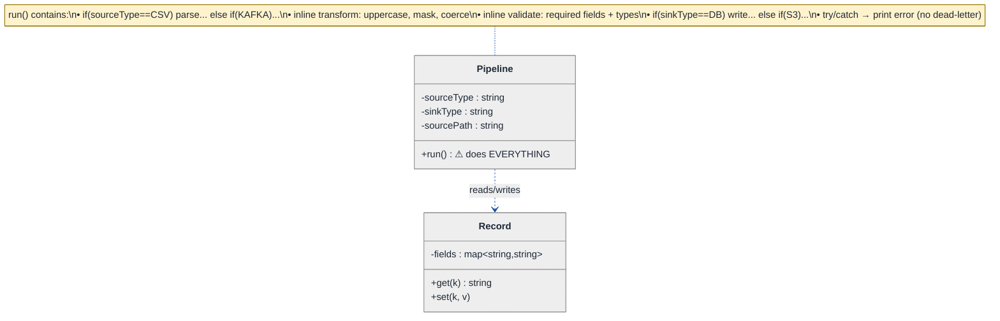
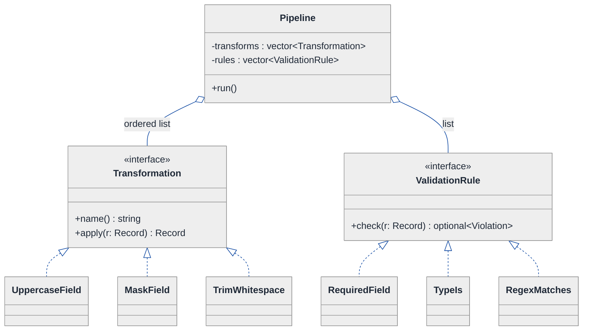
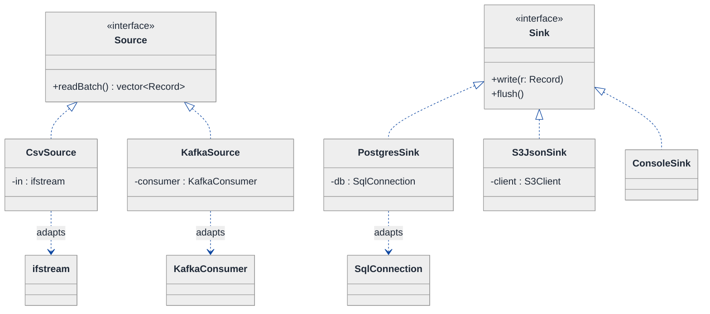
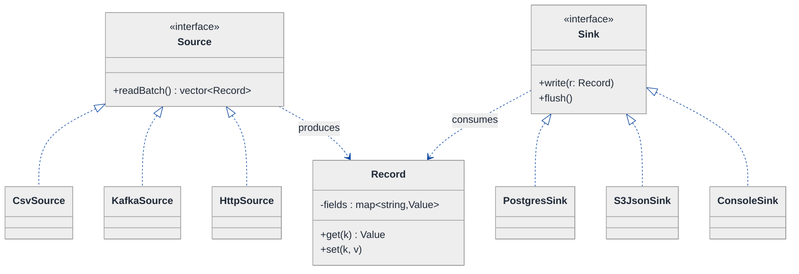
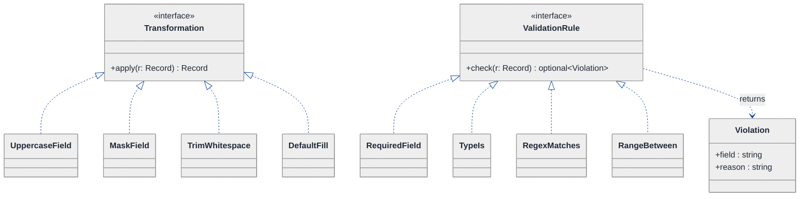
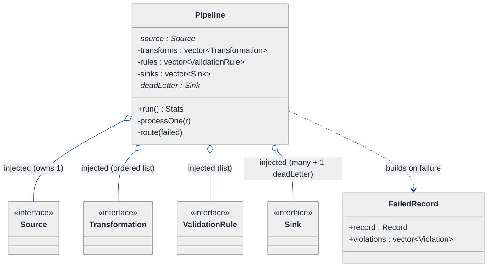
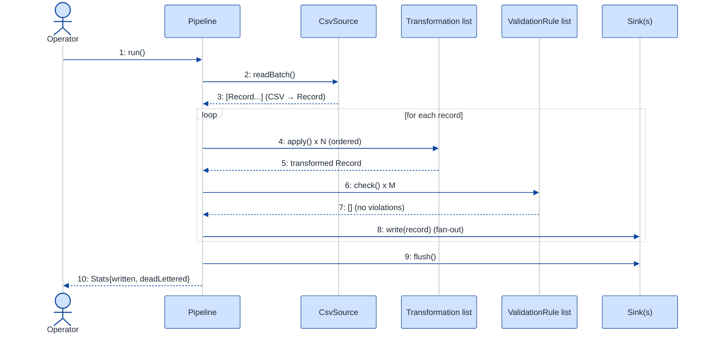
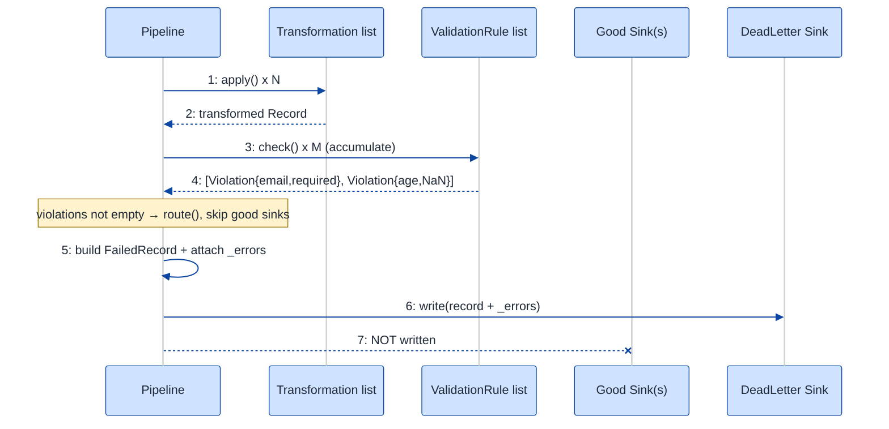

# Data Validation & Transformation Pipeline (ETL) — LLD Walkthrough

> **Difficulty:** Hard · **Time:** ~45 min · **Pattern focus:** Strategy (transformations + validation) + Adapter (sources/sinks) + Pipeline orchestration
>
> **Problem source(s):** GID SG16, bucket `Strategy_Pattern`. Representative of the "design an ETL / data-pipeline at class level" family in [`./EXTRACTED_QUESTIONS.md`](./EXTRACTED_QUESTIONS.md).
>
> **Diagrams:** inline mermaid (renders natively in GitHub / VS Code). The canonical theme block is copied verbatim into every diagram below.

---

## How to use this file

Paced for a candidate seeing the "design an ETL pipeline at the class level" prompt for the first time. Reading time: ~45 minutes if you sketch each iteration by hand. **The lesson: an ETL pipeline LOOKS like one big algorithm, but it is actually four independent axes of variation glued by a fixed orchestration spine. Don't reach for patterns up front — write the naive one-method pipeline first, watch it calcify under four hypothetical changes, then introduce ONE pattern per axis: Adapter for the I/O edges, Strategy for the transform/validate steps, and a thin Pipeline orchestrator that knows none of the concrete types.**

**Map of this file (15 sections):**

1. Problem statement + clarifying questions
2. Plain-English restatement
3. Why this matters
4. Mental model
5. Try it yourself first
6. Entity & verb extraction
7. **Iteration 1: the naive design** — one `run()` method that does everything
8. **Where the naive design hurts** — four future requirements, one painful diff each
9. **Pivot 1: Strategy for transformation + validation** — the most painful axis first
10. **Pivot 2: Adapter for sources and sinks** — taming heterogeneous I/O
11. **Pivot 3: the Pipeline orchestrator + dead-letter routing** — assembling the spine
12. Final UML class diagram
13. Skeleton code (C++)
14. Key flow — sequence diagram
15. Extensibility re-check + anti-patterns + how to think aloud + self-check

---

## 1. Problem statement + clarifying questions

**Prompt (typical phrasing):** "Design a data validation and transformation pipeline (ETL at the class level) that reads from multiple sources, applies configurable transformations, validates data against schemas, and writes to multiple sinks. Support error handling and a dead-letter output."

**Clarifying questions to ask BEFORE drawing anything:**

1. **What are the sources?** Files (CSV, JSON, Parquet), a database table, a Kafka topic, an HTTP API? Do they all hand us the same in-memory shape, or different ones?
2. **What is a "record"?** A flat key→value map? A nested document? A typed struct? This decides whether transforms operate on a generic `Record` or on typed domain objects.
3. **Are transformations ordered and composable?** Is "uppercase the name THEN mask the SSN THEN drop nulls" a fixed list per run, or a branching DAG? (I'll assume an ordered list per run — true ETL DAGs are an HLD concern.)
4. **What does "validate against a schema" mean?** Required-fields + type checks? Regex/range constraints? A pluggable JSON-Schema validator? Can a record fail PARTIALLY (some fields ok)?
5. **What happens to a bad record?** Drop silently, halt the whole run, or route to a dead-letter sink with the failure reason attached? (The prompt says dead-letter, so: route, don't halt.)
6. **One sink or many, and fan-out semantics?** Write every good record to all sinks, or route by content? Is the dead-letter sink just another sink?
7. **Batch or streaming?** Bounded file → bounded run, or an unbounded stream? (I'll assume pull-based batch with a record iterator; the design extends to streaming by swapping the source.)
8. **Concurrency / ordering / exactly-once?** Do we need parallel workers, ordering guarantees, idempotent sinks? (I'll note this in §15; single-threaded for the core design.)

**Assumptions if the interviewer dodges:** heterogeneous sources and sinks; a record is a `map<string, Value>`; transformations are an ordered, composable list; validation is a set of pluggable rules; a failing record is routed to a dead-letter sink with its error attached (the run does NOT halt); pull-based batch; single-threaded for the core, concurrency discussed at the end.

---

## 2. Plain-English restatement

We're building the software skeleton of an ETL job. The job pulls records from one or more *sources* whose physical formats differ (a CSV file looks nothing like a Kafka message), pushes each record through an ordered chain of *transformations* (rename, mask, coerce types), *validates* the result against a schema, then writes the survivors to one or more *sinks*. Records that fail transformation or validation must not crash the run — they go to a *dead-letter sink* carrying the reason they failed. The design must let us add a new source format, a new transform rule, a new validation rule, or a new sink **without editing the orchestration loop**.

---

## 3. Why this matters

ETL is the canonical "looks like one algorithm, is actually four interchangeable parts" problem — interviewers love it because the naive answer (one giant `run()` method) works on day one and is unmaintainable by day thirty. It probes whether you can spot *independent axes of variation* and isolate each behind its own seam. The exact same shape recurs in HTTP middleware stacks, compiler passes, image-processing pipelines, and message brokers. If you can derive Adapter-at-the-edges + Strategy-in-the-middle + a type-agnostic orchestrator here, you can derive it everywhere.

---

## 4. Mental model

An ETL pipeline is a **factory conveyor belt**. Raw material arrives on the belt from loading docks of different shapes (a truck, a rail car, a pipe) — but once it's on the belt it's a uniform crate. The belt carries each crate past a line of *stations* (each station does one transformation), then past a *quality inspector* (validation). Crates that pass roll off into shipping bays (sinks); crates the inspector rejects get shunted onto a *reject chute* (the dead-letter sink) with a tag explaining why.

```
Real-world sketch (NOT a UML diagram yet):

   loading docks            the belt (uniform crates)            shipping bays
  ┌───────────┐      ┌──────────────────────────────────┐      ┌──────────┐
  │ CSV file  │─┐    │  [T1]→[T2]→[T3]   →  [INSPECT]    │  ┌──▶ │ Postgres │
  │ Kafka     │─┼──▶ │  transform stations  validation   │ ─┼──▶ │ S3 JSON  │
  │ HTTP API  │─┘    └──────────────────┬───────────────┘  └──▶ │ console  │
  └───────────┘                         │ reject                └──────────┘
   (Adapters                            ▼
    normalize)                    ┌──────────────┐
                                  │ dead-letter  │  (record + reason)
                                  └──────────────┘
```

The KEY insight from this picture: the **docks** (sources) and **bays** (sinks) are the variable EDGES — they speak foreign formats and must be normalized; the **stations** and **inspector** are variable MIDDLE STEPS — pluggable behaviors; the **belt** itself is fixed orchestration that knows nothing about any concrete dock, station, or bay. Edges vs. steps vs. belt is the separation we'll bake into the design.

---

## 5. Try it yourself first

> **Predict before reading on:**
>
> 1. List 5 nouns you'd promote to a class. List 3 nouns you'd leave as fields or library types.
> 2. **If I told you the pipeline will need to read from CSV, Kafka, and an HTTP API in its first month — and each delivers data in a totally different physical shape — what single abstraction lets the rest of the pipeline not care which one it is?**
> 3. A record fails validation. Where does the *reason* live, and which object decides it goes to the dead-letter sink instead of halting the run?

---

## 6. Entity & verb extraction

> **Mini-refresher: noun → class, but not every noun.**
>
> Naive OOD promotes every noun to a class. Senior OOD promotes a noun only if it has both BEHAVIOR and STATE that need to live together. "Schema" might be just data (a list of field rules); "Source" becomes a class because reading-and-normalizing is behavior that varies by format.

**Nouns from the prompt:**

| Noun | Decision | Why |
|---|---|---|
| Pipeline | Class (top-level orchestrator) | Owns the run loop; wires sources → transforms → validation → sinks |
| Source | Class (abstract) + concrete adapters | Reading + normalizing varies by format; same output shape |
| Sink | Class (abstract) + concrete adapters | Writing varies by destination; same input shape |
| Transformation | Class (abstract) + concrete steps | An algorithm `Record → Record`; the core variability axis |
| Validator / ValidationRule | Class (abstract) + concrete rules | An algorithm `Record → pass/fail+reason` |
| Record | Class (the uniform crate) | Carries field data; the lingua franca on the belt |
| Schema | Field on the pipeline / input to validation | A list of field constraints; mostly data |
| DeadLetter | A Sink (not a special type) | "Reject chute" is just another writable destination |
| FailureReason / error | Field carried alongside a record | No behavior of its own; a string/struct |

**Verbs (and the class they live on):**

| Verb | Owner class (naive answer — we'll re-examine) |
|---|---|
| run() | Pipeline |
| read() / nextBatch() | Source |
| transform(record) | Transformation |
| validate(record) | ValidationRule |
| write(record) | Sink |
| routeToDeadLetter(record, reason) | Pipeline (delegating to a dead-letter Sink) |

**We have NOT introduced any design patterns yet.** Pure nouns + verbs.

---

## 7. <a id="iter-1"></a>Iteration 1: the naive design

Let's write the simplest thing that could possibly work: one `Pipeline` class with a `run()` method that does everything, branching on string "type" tags for source/sink format and hardcoding the transform and validation steps inline.



**Reader's tour (read top to bottom; ~60 seconds).**

1. **`Pipeline` is the only real class.** It holds string tags (`sourceType`, `sinkType`, `sourcePath`) and ONE public method, `run()`. Every decision the pipeline ever makes lives inside that one method.

2. **`Record` is a thin data bag.** A `map<string,string>` with `get`/`set`. It has no opinion about transforms, validation, or where it came from. That part is actually fine — we'll keep it.

3. **The note attached to `Pipeline` is the whole problem.** Read it: `run()` branches on `sourceType` to parse, runs hardcoded transform steps, runs hardcoded validation, branches on `sinkType` to write, and on any error just prints. Four independent concerns — I/O format, transformation, validation, destination — are fused into one method, each expressed as an `if/else` ladder or inline statements.

4. **There is no dead-letter path at all.** The prompt explicitly asked for dead-letter output; the naive design's error handling is a `try/catch` that prints and either drops or aborts. That gap alone fails the requirement.

**What's deliberately missing.** No `Source` abstraction. No `Sink` abstraction. No `Transformation` interface. No `ValidationRule` interface. No dead-letter routing. The naive design doesn't even *acknowledge* that source format, transform logic, validation, and sink destination are four separate axes — it bakes a hardcoded answer for each into `run()`.

Skeleton code for the naive design (C++):

```cpp
#include <fstream>
#include <iostream>
#include <map>
#include <stdexcept>
#include <string>
#include <vector>

class Record {
public:
    std::string get(const std::string& k) const {
        auto it = fields_.find(k);
        return it == fields_.end() ? "" : it->second;
    }
    void set(const std::string& k, std::string v) { fields_[k] = std::move(v); }
    std::map<std::string, std::string> fields_;
};

class Pipeline {
public:
    Pipeline(std::string sourceType, std::string sourcePath, std::string sinkType)
        : sourceType_(std::move(sourceType)), sourcePath_(std::move(sourcePath)),
          sinkType_(std::move(sinkType)) {}

    void run() {
        std::vector<Record> records;

        // ── EXTRACT: branch on source format ──────────────────────────
        if (sourceType_ == "CSV") {
            std::ifstream f(sourcePath_);
            std::string line;
            while (std::getline(f, line)) { /* split commas → Record */ records.push_back(parseCsv(line)); }
        } else if (sourceType_ == "KAFKA") {
            // ... poll topic, decode JSON → Record ...     (not written yet)
        } else {
            throw std::runtime_error("Unknown source type");
        }

        for (auto& r : records) {
            try {
                // ── TRANSFORM: hardcoded, ordered, inline ─────────────
                r.set("name", toUpper(r.get("name")));               // step 1
                r.set("ssn", mask(r.get("ssn")));                    // step 2
                if (r.get("age").empty()) r.set("age", "0");         // step 3 default

                // ── VALIDATE: hardcoded rules ─────────────────────────
                if (r.get("email").empty())   throw std::runtime_error("email required");
                if (!isNumeric(r.get("age"))) throw std::runtime_error("age not numeric");

                // ── LOAD: branch on sink format ───────────────────────
                if (sinkType_ == "DB")        writeToDb(r);
                else if (sinkType_ == "S3")   writeToS3Json(r);
                else                          std::cout << serialize(r) << "\n";

            } catch (const std::exception& e) {
                std::cerr << "BAD RECORD: " << e.what() << "\n";  // no dead-letter sink!
            }
        }
    }
private:
    std::string sourceType_, sourcePath_, sinkType_;
    // parseCsv / toUpper / mask / isNumeric / writeToDb / writeToS3Json / serialize ... elided
};
```

**This works.** It has zero design patterns. We can read a CSV, transform, validate, write to a DB. So what's wrong with it?

---

## 8. <a id="naive-pain"></a>Where the naive design hurts

Now the interviewer slides a piece of paper across the desk: "Here are four new requirements coming next quarter. Walk me through what changes."

### Change A: "Add a Kafka source AND an HTTP-API source"

In the naive design:
- Add `else if (sourceType_ == "KAFKA")` and `else if (sourceType_ == "HTTP")` branches inside `run()`.
- Each branch needs format-specific decoding (Avro/JSON deserialization, paging an API).
- **`run()`'s extract block grows an arm per source.** The same method now also owns transform, validate, and load — so a change to *reading* forces you to re-read 80 lines of unrelated logic. The smell: the orchestration loop changes every time a *format* changes.

### Change B: "Make transformations configurable per run — masking on for prod, off for the analytics export; add a 'trim whitespace' and a 'drop-PII-columns' step"

In the naive design:
- The transform steps are literal statements in the middle of `run()`. To make them configurable you'd add `bool maskEnabled` flags, then `if (maskEnabled)` around step 2, then more flags for new steps.
- Adding `trim` and `drop-PII` means editing `run()` again and threading two more flags through the constructor.
- **Every new transform = surgery inside `run()` + a new boolean.** Three transforms in and the method is an unreadable thicket of flags. There's no way to REORDER steps or run a different set per environment without a second copy of `run()`.

### Change C: "Validation must report ALL failures per record (not just the first) and route bad records to a dead-letter sink with the reasons attached"

In the naive design:
- Validation is `throw` on the first failure, so you only ever see one reason. Collecting all failures means restructuring the `try/catch` into a list of checks that accumulate.
- There is no dead-letter sink object — the `catch` only prints. You'd have to invent ad-hoc dead-letter writing inline, branching on `sinkType_` again.
- **The change touches the validation block, the catch block, AND the load block** — three regions of one method, plus you still can't add a fourth validation rule without editing the same spot.

### Change D: "Fan out: write good records to BOTH Postgres and S3, and send rejects to a Kafka dead-letter topic"

In the naive design:
- `sinkType_` is a single string. Writing to two sinks means... a second string? a comma-split? Either way the load block sprouts more branches.
- The dead-letter destination is a *third* sink format with its own branching.
- **Load logic and dead-letter logic both balloon, in the same method, controlled by string tags.** Classic tag-driven dispatch.

### The pattern of pain

| Change | Where it hurts in the naive design | Smell |
|---|---|---|
| A. New sources | `run()` extract block — one `else if` per format | "Orchestration loop changes when a *format* changes." |
| B. Configurable transforms | `run()` transform block + new boolean flags | "Single method accumulates every step; can't reorder or select per run." |
| C. All-failures + dead-letter | `run()` validate block + catch block + load block | "First-failure throw can't accumulate; no dead-letter object exists." |
| D. Multi-sink fan-out | `run()` load block — tag-driven branching | "One string can't express many destinations; every sink is surgery." |

**Three axes of pain dominate:** (1) heterogeneous **I/O at the edges** (sources A, sinks D) — same data, different physical formats; (2) **interchangeable middle steps** (transforms B, validation C) — same shape `Record → Record` or `Record → result`, picked by config; (3) the **orchestration spine** itself keeps changing because it knows the concrete types.

> **Pivot question:** "What pattern lets the middle steps vary — an algorithm picked by config and run by name? What pattern lets the EDGES vary — wrapping a foreign interface (CSV file, Kafka client, Postgres driver) in one uniform contract the pipeline understands? And what keeps the orchestration loop from knowing any concrete type at all?"
>
> The answers are **Strategy** (middle steps), **Adapter** (edges), and a thin **Pipeline orchestrator** that talks only to interfaces. Let's introduce them one at a time, starting with the most painful axis: the transform/validate middle, because that's where the prompt's "configurable" and "dead-letter" requirements live.

---

## 9. <a id="pivot-1"></a>Pivot 1: Strategy for transformation + validation

> **Mini-refresher: Strategy pattern.**
>
> Encapsulates an algorithm behind an interface so it can be swapped at runtime. The CALLER (here, the pipeline / its config) decides which strategy to use; the strategy doesn't know about its peers or who invokes it.
>
> Quick example: a `Sorter` takes a `CompareStrategy*`. Pass `Ascending` or `Descending` — the sorter doesn't care. Here a `Pipeline` takes a `vector<Transformation*>` and a `vector<ValidationRule*>` — the pipeline runs them in order without knowing what any of them does.

**Why Strategy fits transformation.** A transformation IS an algorithm: `given a Record, return a (modified) Record`. It varies (uppercase, mask, trim, default-fill, drop-columns). The *choice and order* of transforms is made externally — by run config, not by the transform itself. That's textbook Strategy. Crucially, because every transform has the identical signature, you can store them in an **ordered list** and run them in a loop — config picks both the set and the order, and that solves Change B (configurable, reorderable) directly.

**Why Strategy also fits validation — with a twist.** A validation rule is `given a Record, return pass | fail(reason)`. Same Strategy shape. The twist that solves Change C: instead of `throw` on first failure, each rule returns a *result*, and the pipeline ACCUMULATES results across all rules so a record can report every reason it failed.

**The refactor (just the affected middle):**

```cpp
// ── Transformation strategy ─────────────────────────────────────────
class Transformation {
public:
    virtual ~Transformation() = default;
    virtual std::string name() const = 0;
    virtual Record apply(Record r) const = 0;   // takes & returns by value: pure step
};

class UppercaseField : public Transformation {
public:
    explicit UppercaseField(std::string field) : field_(std::move(field)) {}
    std::string name() const override { return "uppercase(" + field_ + ")"; }
    Record apply(Record r) const override {
        r.set(field_, toUpper(r.get(field_)));
        return r;
    }
private:
    std::string field_;
};

class MaskField : public Transformation {
public:
    explicit MaskField(std::string field) : field_(std::move(field)) {}
    std::string name() const override { return "mask(" + field_ + ")"; }
    Record apply(Record r) const override { r.set(field_, "***"); return r; }
private:
    std::string field_;
};
// TrimWhitespace, DefaultFill, DropColumns ... elided — all same shape

// ── Validation strategy (returns a result, never throws) ────────────
struct Violation { std::string field; std::string reason; };

class ValidationRule {
public:
    virtual ~ValidationRule() = default;
    // returns nullopt if OK, else the violation
    virtual std::optional<Violation> check(const Record& r) const = 0;
};

class RequiredField : public ValidationRule {
public:
    explicit RequiredField(std::string field) : field_(std::move(field)) {}
    std::optional<Violation> check(const Record& r) const override {
        if (r.get(field_).empty()) return Violation{field_, "required field missing"};
        return std::nullopt;
    }
private:
    std::string field_;
};
// TypeIs, RegexMatches, RangeBetween ... elided — all same shape
```

**What changed — visualized.** Just the middle slice:



**Tour of the after-state.**

1. **Top: `Pipeline` gained two fields.** An ORDERED `vector<Transformation*>` and a `vector<ValidationRule*>`, both injected from config. The open diamonds (`◇`) mark aggregation — the pipeline uses these collaborators; how they're built is config's job.

2. **Two `<<interface>>` boxes.** `Transformation` has one method, `apply(Record) → Record`. `ValidationRule` has one method, `check(Record) → optional<Violation>`. Two narrow contracts replace the fat inline blocks of the naive `run()`.

3. **Concrete steps hang off each interface.** Each is one tiny class doing one thing. `MaskField` masks; `RequiredField` checks presence. Adding `TrimWhitespace` is a new class implementing `Transformation` — zero edits to `run()`.

4. **The run loop becomes trivial and FIXED.** Per record: `for (auto& t : transforms_) r = t->apply(std::move(r));` then `for (auto& rule : rules_) if (auto v = rule->check(r)) violations.push_back(*v);`. The loop never mentions a concrete transform or rule. Change B (reorder/select) is now just "reorder the vector"; Change C (all failures) is now "accumulate instead of throw."

5. **Validation never throws anymore.** It returns a value. The pipeline decides what a non-empty `violations` list MEANS (→ dead-letter), which is exactly the seam we'll exploit in Pivot 3.

**Change B and Change C from §8 now land cleanly.** Configurable transforms → the config builds the `transforms_` vector in whatever order it wants. All-failures validation → accumulate every `Violation` instead of throwing on the first.

**Pattern-discrimination cheatsheet — Strategy vs Chain of Responsibility.**
- *Strategy:* a flat, swappable algorithm; the caller runs it (or runs a LIST of them) and owns the iteration.
- *Chain of Responsibility:* each handler holds a pointer to the NEXT and decides whether to handle-or-pass; the chain owns its own traversal, and a handler can short-circuit the rest.
- *Rule of thumb:* if the orchestrator loops over a collection and calls each → list-of-Strategies. If each node points to its successor and may stop the chain → CoR.

We chose list-of-Strategies for transforms because the pipeline wants to OWN the order and always run every step in sequence; we don't want a transform deciding "stop here, skip the rest." (If a transform COULD abort the pipeline — e.g. a hard "reject immediately" filter — CoR would be the better fit. That's a legitimate variant to mention to the interviewer.)

> **Mini-refresher: Open/Closed Principle (the "O" in SOLID).**
>
> Software entities should be OPEN for extension but CLOSED for modification. Adding a new transform should mean adding a new class, not editing an existing one. The naive `run()` violated this — every new step modified it. The Strategy lists restore it: extend by adding a class, never touch the loop.

---

## 10. <a id="pivot-2"></a>Pivot 2: Adapter for sources and sinks

Changes A (new sources) and D (multi-sink fan-out) are still painful. Strategy doesn't directly help here, because the problem isn't "which algorithm to run" — it's "this CSV file, this Kafka client, this Postgres driver all have DIFFERENT, INCOMPATIBLE interfaces, and I need them all to look the same to the pipeline."

> **Mini-refresher: Adapter pattern.**
>
> Wraps an object with an incompatible interface in a new object that exposes the interface your client expects. The adapter *translates* calls. It's about making a foreign thing fit a contract you already have — not about choosing between algorithms.
>
> Quick example: your code wants `read() → vector<Record>`. The CSV library gives you `getline()`; the Kafka client gives you `poll(timeout) → ConsumerRecords`. A `CsvSource` adapter and a `KafkaSource` adapter each implement your `read()` and internally translate to the foreign API.

**Why Adapter fits the edges (and why it's NOT Strategy).** Sources and sinks aren't interchangeable *algorithms the caller picks for behavior* — they're interchangeable *connections to the outside world whose native interfaces clash*. The job of `CsvSource` is to make `std::ifstream` look like our `Source`; the job of `PostgresSink` is to make a SQL driver look like our `Sink`. That translation role is Adapter. (The line is fuzzy in practice — both wrap a uniform interface around variation — but naming it Adapter signals *"I'm normalizing foreign I/O,"* which is what the interviewer wants to hear when sources/sinks come up.)

**The refactor (just the I/O edges):**

```cpp
// ── Source: pull-based, yields normalized Records ───────────────────
class Source {
public:
    virtual ~Source() = default;
    virtual std::string name() const = 0;
    // returns empty vector when exhausted (batch); a stream source blocks/polls
    virtual std::vector<Record> readBatch() = 0;
};

class CsvSource : public Source {                 // adapts std::ifstream
public:
    explicit CsvSource(std::string path) : in_(path) {}
    std::string name() const override { return "csv"; }
    std::vector<Record> readBatch() override {
        std::vector<Record> out;
        std::string line;
        while (out.size() < kBatch && std::getline(in_, line))
            out.push_back(parseCsvLine(line, header_));   // translate CSV → Record
        return out;
    }
private:
    std::ifstream in_;
    std::vector<std::string> header_;
    static constexpr size_t kBatch = 1000;
};

class KafkaSource : public Source {               // adapts a Kafka consumer client
public:
    std::string name() const override { return "kafka"; }
    std::vector<Record> readBatch() override {
        auto msgs = consumer_.poll(/*timeout*/ 200);     // foreign API
        std::vector<Record> out;
        for (auto& m : msgs) out.push_back(decodeJson(m.value()));  // translate
        return out;
    }
private:
    KafkaConsumer consumer_;  // 3rd-party type we don't control
};

// ── Sink: accepts normalized Records ────────────────────────────────
class Sink {
public:
    virtual ~Sink() = default;
    virtual std::string name() const = 0;
    virtual void write(const Record& r) = 0;
    virtual void flush() {}                              // default no-op
};

class PostgresSink : public Sink {                // adapts a SQL driver
public:
    std::string name() const override { return "postgres"; }
    void write(const Record& r) override { batch_.push_back(toRow(r)); if (batch_.size() >= 500) flush(); }
    void flush() override { /* db_.executeBatch(batch_); */ batch_.clear(); }
private:
    SqlConnection db_;
    std::vector<Row> batch_;
};
// S3JsonSink, ConsoleSink, KafkaSink ... elided — all adapt a foreign client to write()
```

**What changed — visualized.** Just the edges slice:



**Tour of the after-state.**

1. **Two `<<interface>>` boxes anchor the edges.** `Source::readBatch() → vector<Record>` and `Sink::write(Record)`. These are OUR contracts — the pipeline speaks only these.

2. **Each concrete adapter wraps a foreign type** (the dashed `..>` "adapts" arrows). `CsvSource` holds an `ifstream`; `KafkaSource` holds a `KafkaConsumer`; `PostgresSink` holds a `SqlConnection`. The foreign type's weird API (`getline`, `poll`, `executeBatch`) is hidden behind our clean method. **That translation is the Adapter's whole job.**

3. **`Record` is the normalization boundary.** A `CsvSource` emits `Record`s; a `KafkaSource` emits `Record`s; downstream, nothing can tell which dock a crate came from. This is what makes the transform/validate middle from Pivot 1 source-agnostic.

4. **`Sink::flush()` has a default no-op.** Console doesn't batch, so it inherits the empty default; Postgres overrides it to flush its batch. Small detail, but it shows the interface accommodating both buffered and unbuffered destinations.

5. **Change A and Change D land cleanly.** New source (HTTP API) → new `HttpSource : Source`. Fan-out to many sinks → the pipeline just holds a `vector<Sink*>` and loops (we wire that in Pivot 3). No `if (type=="...")` anywhere.

**Pattern-discrimination cheatsheet — Adapter vs Strategy vs Facade.**
- *Adapter:* makes an EXISTING, incompatible interface conform to the one you need. Intent: *translation.* (Our `KafkaSource` wrapping `KafkaConsumer`.)
- *Strategy:* provides INTERCHANGEABLE algorithms behind one interface, chosen by the caller. Intent: *behavior selection.* (Our `Transformation` list.)
- *Facade:* a simplified front over a COMPLICATED subsystem (many classes). Intent: *simplification of a cluster*, not one-to-one translation.
- *Rule of thumb:* wrapping ONE foreign object to fit a contract → Adapter. Picking among several of YOUR OWN algorithms → Strategy. Hiding a whole subsystem behind one easy door → Facade.

The edges are Adapter (translating foreign clients); the middle is Strategy (selecting our own steps). Same `Record`-in / `Record`-out uniformity, different INTENT — and saying the intent out loud is the senior signal.

---

## 11. <a id="pivot-3"></a>Pivot 3: the Pipeline orchestrator + dead-letter routing

Pivots 1 and 2 gave us four interface families: `Source`, `Sink`, `Transformation`, `ValidationRule`. Now we assemble the **belt** — a `Pipeline` that wires them and knows NONE of the concrete types — and we wire in the dead-letter requirement that the naive design never had.

**The orchestration insight: dead-letter is just another `Sink`.** We don't need a new abstraction for it. A failing record is routed to a `Sink` we happen to call the dead-letter sink, carrying its violations. This is the payoff of making validation *return* results instead of throwing: the pipeline holds the decision "violations present → write to deadLetter; else → write to the good sinks."

> **Mini-refresher: Dependency Injection.**
>
> A class receives its collaborators from the outside (constructor parameters) instead of constructing them itself. The `Pipeline` is HANDED its source, sinks, transforms, rules, and dead-letter sink. It never says `new CsvSource(...)`. Benefit: the same `Pipeline` class runs any configuration, and tests can inject fakes (an in-memory source, a recording sink).

```cpp
// A record bundled with why it failed (for the dead-letter sink).
struct FailedRecord { Record record; std::vector<Violation> violations; };

class Pipeline {
public:
    Pipeline(std::unique_ptr<Source> source,
             std::vector<std::unique_ptr<Transformation>> transforms,
             std::vector<std::unique_ptr<ValidationRule>>  rules,
             std::vector<std::unique_ptr<Sink>>            sinks,
             std::unique_ptr<Sink>                         deadLetter)
        : source_(std::move(source)), transforms_(std::move(transforms)),
          rules_(std::move(rules)), sinks_(std::move(sinks)),
          deadLetter_(std::move(deadLetter)) {}

    Stats run() {
        Stats s;
        for (auto batch = source_->readBatch(); !batch.empty(); batch = source_->readBatch()) {
            for (auto& raw : batch) {
                processOne(std::move(raw), s);
            }
        }
        for (auto& sink : sinks_) sink->flush();
        deadLetter_->flush();
        return s;
    }
private:
    void processOne(Record r, Stats& s) {
        // TRANSFORM — a transform can fail (e.g. parse error); guard it.
        try {
            for (const auto& t : transforms_) r = t->apply(std::move(r));
        } catch (const std::exception& e) {
            route({std::move(r), {Violation{"_transform", e.what()}}}, s);
            return;
        }
        // VALIDATE — accumulate ALL violations, never throw.
        std::vector<Violation> violations;
        for (const auto& rule : rules_)
            if (auto v = rule->check(r)) violations.push_back(*v);

        if (!violations.empty()) { route({std::move(r), std::move(violations)}, s); return; }

        // LOAD — fan out to every good sink.
        for (auto& sink : sinks_) sink->write(r);
        ++s.written;
    }

    void route(FailedRecord fr, Stats& s) {     // dead-letter routing in ONE place
        Record dl = fr.record;
        dl.set("_errors", join(fr.violations));   // attach reasons
        deadLetter_->write(dl);
        ++s.deadLettered;
    }

    std::unique_ptr<Source>                       source_;
    std::vector<std::unique_ptr<Transformation>>  transforms_;
    std::vector<std::unique_ptr<ValidationRule>>  rules_;
    std::vector<std::unique_ptr<Sink>>            sinks_;
    std::unique_ptr<Sink>                          deadLetter_;
};
```

**What changed.** `run()` no longer mentions CSV, Kafka, Postgres, uppercase, or "email required." It loops over interfaces. Every concrete decision moved out to a collaborator that was *injected*. The dead-letter path — the requirement the naive design dropped entirely — is now a single `route()` method plus one extra `Sink`.

**Change C (dead-letter) and Change D (fan-out) land cleanly.** Dead-letter → it's a `Sink`, routed in `route()`. Fan-out → `sinks_` is a vector; the load loop already writes to all of them.

**Pattern-discrimination cheatsheet — Pipeline (list-of-steps) vs Decorator vs Chain of Responsibility.**
- *Pipeline / list-of-steps:* an orchestrator OWNS an ordered collection and pushes each item through every step. (Our `Pipeline` over `transforms_`.)
- *Decorator:* each step WRAPS the next and they form a single composite object with the same interface; you call the outermost and it cascades inward. Good when you want one "super-transform" object.
- *Chain of Responsibility:* each node points to its successor and may STOP the chain. Good when a step should be able to abort the rest.
- *Rule of thumb:* central loop that always runs all steps → Pipeline. One nested wrapper object with the same interface → Decorator. Self-terminating handoff → CoR.

We chose the explicit Pipeline-loop because the orchestrator must also interleave *validation, fan-out, and dead-letter routing* between/after the transform steps — responsibilities a pure Decorator chain of transforms couldn't own. The orchestrator is the natural home for cross-step concerns.

---

## 12. <a id="fig-class-diagram"></a>Final class diagram

Showing the entire design in one diagram becomes a wall of boxes. Instead, here are **three focused sub-views**, each addressing a different concern. Read them in order; the structural insight at the end ties them together.

### 12.1 The edges — Adapters that normalize I/O



**Tour of 12.1.** Two interfaces (`Source`, `Sink`) bracket the design. Each concrete class adapts one foreign system — file streams, Kafka clients, SQL drivers, S3 SDKs — to our contract. `Record` is the shared currency: sources PRODUCE it, sinks CONSUME it. Adding a new format anywhere is one new class implementing one interface.

### 12.2 The middle — Strategy lists for transform + validate



**Tour of 12.2.** Two more interfaces, two more concrete families. `Transformation::apply` is pure `Record → Record`; `ValidationRule::check` is `Record → optional<Violation>`. The pipeline stores each as an ORDERED vector and runs them in a loop — config picks the set and order. Note `ValidationRule` returns a `Violation` value rather than throwing: that's what lets a record collect *all* its failures and what feeds the dead-letter routing.

### 12.3 The spine — the Pipeline that wires everything (and routes dead-letters)



**Tour of 12.3.**

1. **One `Pipeline`, holding the four interface families.** `source_` (one), `transforms_` (ordered list), `rules_` (list), `sinks_` (many), plus a distinguished `deadLetter_` `Sink`. All `unique_ptr`, all INJECTED — open diamonds (`◇`) mark that the pipeline owns the lifetime but was handed the concrete instances by config / DI.

2. **`Pipeline` references only INTERFACES.** Not one concrete `CsvSource` or `MaskField` appears here. That's the open/closed payoff: new formats and steps never touch this class.

3. **`processOne` and `route` are private helpers.** `processOne` runs the transform→validate→load sequence for one record; `route` is the single chokepoint where a failed record (transform exception OR accumulated violations) gets its reasons attached and is written to `deadLetter_`.

4. **`FailedRecord` bundles a record with its violations.** The pipeline BUILDS one on any failure (dashed `..>`), then routes it. Dead-letter is not a special subsystem — it's this struct plus one ordinary `Sink`.

5. **The dead-letter sink is structurally identical to a normal sink.** It could be a `KafkaSink` writing to a `dead-letter-topic`, an `S3JsonSink` to a quarantine bucket, or a `ConsoleSink` in dev. The pipeline doesn't know or care.

### Structural insight (ties 12.1 + 12.2 + 12.3 together)

| Concern | Pattern used | Why |
|---|---|---|
| **Edges** (sources, sinks, dead-letter) | Adapter behind `Source`/`Sink` interfaces | Foreign clients have clashing APIs; adapters translate them to one `Record`-based contract |
| **Middle steps** (transform, validate) | Strategy, stored as ORDERED lists | Same `Record`-shaped algorithm; config picks the set + order; validation returns results to enable accumulation |
| **Spine** (the run loop) | Pipeline orchestrator + Dependency Injection | A type-agnostic loop over interfaces; concrete wiring is injected, never `new`ed inside |
| **Failure handling** | Dead-letter = just another injected `Sink` | No new abstraction; the "reject chute" reuses the `Sink` interface, fed by a single `route()` chokepoint |

The big lesson: **inheritance is used only to define the four interface families and their concrete implementations** — there is no deep class hierarchy, no `if/else` on type tags, and the orchestrator depends on abstractions only. *Adapter for the edges, Strategy for the steps, a thin injected orchestrator for the spine.* That triad is the reusable skeleton of every ETL / middleware / pass-pipeline problem.

---

## 13. Skeleton code (C++)

> Show the SHAPES, not the full impl. ~140 lines.

```cpp
#include <map>
#include <memory>
#include <optional>
#include <stdexcept>
#include <string>
#include <vector>

// ── The uniform crate ───────────────────────────────────────────────
using Value = std::string;   // could be a variant<int,double,string,...> in a typed design
class Record {
public:
    Value get(const std::string& k) const {
        auto it = fields_.find(k);
        return it == fields_.end() ? Value{} : it->second;
    }
    void set(const std::string& k, Value v) { fields_[k] = std::move(v); }
    const std::map<std::string, Value>& fields() const { return fields_; }
private:
    std::map<std::string, Value> fields_;
};

struct Violation   { std::string field; std::string reason; };
struct FailedRecord{ Record record; std::vector<Violation> violations; };
struct Stats       { size_t written = 0; size_t deadLettered = 0; };

// ── Edge interfaces: Adapter targets ────────────────────────────────
class Source {
public:
    virtual ~Source() = default;
    virtual std::vector<Record> readBatch() = 0;   // empty vector => exhausted
};
class Sink {
public:
    virtual ~Sink() = default;
    virtual void write(const Record& r) = 0;
    virtual void flush() {}
};

// Representative concrete adapters (rest elided):
class CsvSource : public Source {                  // adapts std::ifstream
public:
    explicit CsvSource(std::string path);
    std::vector<Record> readBatch() override;      // getline + split → Record
};
class ConsoleSink : public Sink {                  // adapts std::ostream
public:
    void write(const Record& r) override;          // print serialized record
};
// KafkaSource, HttpSource, PostgresSink, S3JsonSink, KafkaSink ... elided

// ── Middle interfaces: Strategy families ────────────────────────────
class Transformation {
public:
    virtual ~Transformation() = default;
    virtual Record apply(Record r) const = 0;       // pure Record -> Record
};
class MaskField : public Transformation {
public:
    explicit MaskField(std::string field) : field_(std::move(field)) {}
    Record apply(Record r) const override { r.set(field_, "***"); return r; }
private:
    std::string field_;
};
// UppercaseField, TrimWhitespace, DefaultFill, DropColumns ... elided

class ValidationRule {
public:
    virtual ~ValidationRule() = default;
    virtual std::optional<Violation> check(const Record& r) const = 0;  // value, never throws
};
class RequiredField : public ValidationRule {
public:
    explicit RequiredField(std::string field) : field_(std::move(field)) {}
    std::optional<Violation> check(const Record& r) const override {
        if (r.get(field_).empty()) return Violation{field_, "required"};
        return std::nullopt;
    }
private:
    std::string field_;
};
// TypeIs, RegexMatches, RangeBetween ... elided

// ── The spine: type-agnostic orchestrator (Dependency Injection) ────
class Pipeline {
public:
    Pipeline(std::unique_ptr<Source> source,
             std::vector<std::unique_ptr<Transformation>> transforms,
             std::vector<std::unique_ptr<ValidationRule>>  rules,
             std::vector<std::unique_ptr<Sink>>            sinks,
             std::unique_ptr<Sink>                         deadLetter)
        : source_(std::move(source)), transforms_(std::move(transforms)),
          rules_(std::move(rules)), sinks_(std::move(sinks)),
          deadLetter_(std::move(deadLetter)) {}

    Stats run() {
        Stats s;
        for (auto batch = source_->readBatch(); !batch.empty(); batch = source_->readBatch())
            for (auto& raw : batch) processOne(std::move(raw), s);
        for (auto& sink : sinks_) sink->flush();
        deadLetter_->flush();
        return s;
    }
private:
    void processOne(Record r, Stats& s) {
        try {
            for (const auto& t : transforms_) r = t->apply(std::move(r));
        } catch (const std::exception& e) {
            return route({std::move(r), {Violation{"_transform", e.what()}}}, s);
        }
        std::vector<Violation> v;
        for (const auto& rule : rules_)
            if (auto viol = rule->check(r)) v.push_back(*viol);
        if (!v.empty()) return route({std::move(r), std::move(v)}, s);

        for (auto& sink : sinks_) sink->write(r);   // fan-out
        ++s.written;
    }
    void route(FailedRecord fr, Stats& s) {
        Record dl = fr.record;
        dl.set("_errors", serializeViolations(fr.violations));
        deadLetter_->write(dl);
        ++s.deadLettered;
    }
    static std::string serializeViolations(const std::vector<Violation>&); // elided

    std::unique_ptr<Source>                       source_;
    std::vector<std::unique_ptr<Transformation>>  transforms_;
    std::vector<std::unique_ptr<ValidationRule>>  rules_;
    std::vector<std::unique_ptr<Sink>>            sinks_;
    std::unique_ptr<Sink>                          deadLetter_;
};

// ── Assembly (what a config / builder produces) ─────────────────────
inline Pipeline buildPipeline() {
    std::vector<std::unique_ptr<Transformation>> ts;
    ts.push_back(std::make_unique<MaskField>("ssn"));         // order matters

    std::vector<std::unique_ptr<ValidationRule>> rs;
    rs.push_back(std::make_unique<RequiredField>("email"));

    std::vector<std::unique_ptr<Sink>> sinks;
    sinks.push_back(std::make_unique<ConsoleSink>());          // + PostgresSink, S3JsonSink...

    return Pipeline(std::make_unique<CsvSource>("in.csv"),
                    std::move(ts), std::move(rs), std::move(sinks),
                    std::make_unique<ConsoleSink>());          // dead-letter sink
}
```

---

## 14. <a id="fig-sequence"></a>Key flow — sequence diagram

This is the moment of truth for the design — read across the participants to see how Adapter, Strategy, and the orchestrator COOPERATE, and where a record forks to the dead-letter sink.

### Phase 1 — a good record flows through



**Tour of Phase 1 (happy path).**

1. **Operator starts the run.** A single `run()` call; the operator never touches a concrete source or sink.

2. **Pipeline pulls a batch from the Source.** `readBatch()` returns `Record`s. The CsvSource adapter has already TRANSLATED raw CSV lines into uniform `Record`s — the pipeline can't tell CSV from Kafka here. **Adapter at work.**

3. **Pipeline runs the transform list in order.** `for t in transforms: r = t.apply(r)`. The pipeline owns the loop; each `Transformation` does one step. **Strategy at work, orchestrator owns iteration.**

4. **Pipeline runs the validation list.** Each `ValidationRule::check` returns a value. Here the list comes back empty — no violations.

5. **Pipeline fans out to every sink.** `for sink in sinks: sink.write(r)`. One record → Postgres AND S3 AND console, depending on what was injected. **Adapter at work on the way out.**

6. **After the source is exhausted, flush + return Stats.** The orchestrator flushes batched sinks and hands back counts.

### Phase 2 — a bad record forks to the dead-letter sink



**Tour of Phase 2 (failure path). Read this slowly — it's where the dead-letter requirement lives.**

1. **Transforms run as usual** — a record can be perfectly transformable yet still invalid.

2. **Validation ACCUMULATES.** Notice step 4 returns TWO violations, not one. Because each `ValidationRule::check` returns a value instead of throwing, the pipeline collects every reason. This directly answers Change C ("report ALL failures").

3. **The fork decision lives in ONE place.** The `Note` marks it: `violations not empty → route()`. There is no scattered `if (status==BAD)` — the orchestrator makes the single routing decision based on the accumulated list.

4. **The record is bundled and tagged.** `route()` builds a `FailedRecord`, attaches the reasons as an `_errors` field, and writes it to the dead-letter `Sink`.

5. **The good sinks are NOT written** (step 7, the `--x` line). The record left the main flow at the fork; the run continues with the next record. **The pipeline never halts on a bad record** — exactly the dead-letter semantics the prompt asked for.

### The branching that's NOT shown — and why it matters

You don't see `if (sourceType == "CSV")` or `if (sinkType == "DB")` anywhere in either diagram. That's the point: **the orchestrator talks only to interfaces.** A CSV source, a Kafka source, and an HTTP source all enter at step 2 of Phase 1 identically; Postgres, S3, and console sinks all receive `write()` identically. The format knowledge is sealed inside each adapter, and the step knowledge inside each Strategy. The pipeline loop is the same code regardless of how it was wired.

---

## 15. Extensibility re-check + anti-patterns + how to think aloud + self-check

### Extensibility re-check

Revisit the four changes from [§8](#naive-pain). For each, name the SINGLE class that changes.

| Change | Naive design impact | Final design impact |
|---|---|---|
| A. Kafka + HTTP sources | `run()` extract block grows an `else if` per format | New `KafkaSource` / `HttpSource : Source`. Inject it. Done. |
| B. Configurable transforms | `run()` transform block + boolean flags | New `Transformation` classes; config orders the `transforms_` vector. Done. |
| C. All-failures + dead-letter | validate + catch + load blocks | `ValidationRule` returns values (accumulate); dead-letter is an injected `Sink`. Done. |
| D. Multi-sink fan-out | single `sinkType_` string → more branches | `sinks_` is a vector; the load loop already fans out. Done. |

Every change is "add a class implementing an existing interface" or "inject a different list" — never "edit the run loop." That's the open/closed principle in practice.

If a future requirement makes you change `Pipeline`, `Source`, `Transformation`, AND `Sink` together — go back to §6 and re-identify variability points; you missed one. (A common real one: **schema evolution.** If records become typed and transforms must declare input/output schemas, you'd add a `Schema` type and have transforms expose `inputSchema()/outputSchema()` so the orchestrator can type-check the chain at wiring time. That's a clean extension, not a rewrite.)

### Common confusion + traps

1. **"Isn't `Source`/`Sink` just Strategy too? Why call it Adapter?"** Mechanically similar (interface + impls), but the INTENT differs: Adapter exists to make a *foreign, pre-existing* interface (`KafkaConsumer`, `SqlConnection`) fit your contract; Strategy exists to let the *caller pick among your own* algorithms. Saying "Adapter" tells the interviewer you recognize you're wrapping third-party I/O.

2. **"Should validation throw on the first failure?"** No — that's what the naive design did, and it can only ever report one reason. Returning `optional<Violation>` (or a list) lets the record accumulate all failures, which the dead-letter sink needs.

3. **"Why is dead-letter a `Sink` and not its own class?"** Because a reject destination has the exact same shape as a normal destination: `write(Record)`. Inventing a `DeadLetterWriter` would duplicate the `Sink` adapters. Reuse the interface.

4. **"Should the `Pipeline` build its own `CsvSource`?"** No. That re-couples the orchestrator to a concrete type. Inject collaborators (DI) so one `Pipeline` class runs every configuration and tests can inject fakes.

5. **"Transforms as a Decorator chain vs a list?"** A Decorator chain (`Mask(Upper(Trim(...)))`) is valid, but the orchestrator also needs to interleave validation, fan-out, and dead-letter routing — concerns a pure transform-chain can't own. The explicit list + loop keeps those cross-cutting responsibilities in the orchestrator where they belong.

### Anti-patterns

- **"God method `run()`"** — one method owning extract + transform + validate + load + error handling. Split each concern behind its own interface.
- **"Tag-driven dispatch"** — `if (sourceType == "CSV") ... else if (...)`. Replace string tags with polymorphic Adapters; let the type system dispatch.
- **"Throwing validators"** — first-failure `throw` that can't accumulate reasons and conflates "invalid data" (route it) with "broken pipeline" (abort). Validate by returning values; reserve exceptions for genuine system faults.
- **"Swallowing bad records"** — a `catch` that prints or silently drops. Route to a dead-letter sink with the reason attached so failures are observable and replayable.
- **"Anemic over-genericism"** — forcing `Source`, `Sink`, `Transformation`, and `ValidationRule` to share one `Step<T>` super-interface. They have different signatures and intents; a shared base buys nothing and obscures intent.
- **"Concrete coupling in the spine"** — `Pipeline` `#include`-ing `CsvSource.h`. The orchestrator should depend only on the four interfaces (Dependency Inversion).

### How to think aloud

> "ETL pipeline. Let me clarify scope. [Asks questions from §1: what sources/sinks, what's a record, are transforms ordered/composable, what does validate mean, what happens to bad records, fan-out semantics, batch vs stream, concurrency.] Got it — heterogeneous sources/sinks, ordered composable transforms, pluggable validation, bad records routed to a dead-letter sink without halting.
>
> Nouns: Pipeline, Source, Sink, Transformation, ValidationRule, Record, dead-letter (which I'll model as a Sink). Verbs: run, read, transform, validate, write, route.
>
> I'll start NAIVE — one `Pipeline::run()` that branches on a source-type string to parse, runs hardcoded transform statements, validates with first-failure throws, branches on a sink-type string to write, and catches errors by printing. It works but fuses four concerns into one method, and it has no dead-letter path.
>
> Now stress-test it. A: new Kafka/HTTP sources → extract block grows an arm each. B: configurable transforms → flags threaded through `run()`. C: report all failures + dead-letter → throw can't accumulate and no dead-letter object exists. D: fan-out to many sinks → one string can't express many destinations.
>
> Three axes: heterogeneous I/O at the edges, interchangeable middle steps, and an orchestration spine that shouldn't know concrete types.
>
> Pivot 1: Transformation and ValidationRule become Strategy interfaces stored as ordered lists; validation returns values so failures accumulate. Solves B and C's accumulation.
>
> Pivot 2: Source and Sink become Adapter interfaces — each concrete class wraps a foreign client (ifstream, Kafka consumer, SQL driver) behind a uniform `Record`-based contract. Solves A and D.
>
> Pivot 3: a thin `Pipeline` orchestrator wires everything via constructor injection, loops over interfaces only, and routes failures (transform exceptions OR accumulated violations) to a dead-letter `Sink` through a single `route()` chokepoint. The dead-letter sink is just another `Sink`.
>
> Final: Adapter at the edges, Strategy in the middle, an injected type-agnostic orchestrator as the spine. All four future requirements become one new class each. Open/closed."

### Self-check

> **Self-check — the question to ask next time.**
>
> When you see "design a pipeline that reads from X, processes through Y, writes to Z," before reaching for one big method, ask:
>
> > **"Which parts vary because they touch the OUTSIDE WORLD (→ Adapter behind a uniform contract), which parts vary because they're INTERCHANGEABLE STEPS the config picks (→ Strategy in an ordered list), and what is the FIXED SPINE that should know neither (→ an injected orchestrator over interfaces)?"**
>
> Edges → Adapter. Steps → Strategy. Spine → injected orchestrator. Failures → just another Sink, routed in one place. The class diagram falls out for free.

---

## Cross-references

- **Parent topic manifest:** [`./EXTRACTED_QUESTIONS.md`](./EXTRACTED_QUESTIONS.md)
- **Vertical overview:** [`../../LEARNING.md`](../../LEARNING.md)
- **Template:** [`../../TEMPLATE-v2.md`](../../TEMPLATE-v2.md)
- **Canonical exemplar:** [`../Object_Oriented_Design/Parking_Lot.md`](../Object_Oriented_Design/Parking_Lot.md)
- **Related LLD walkthroughs:**
  - Strategy Pattern siblings (in this `Strategy_Pattern/` bucket)
  - Chain of Responsibility deep-dive (in `../Chain_of_Responsibility/`) — the "self-terminating handoff" alternative to the transform list
  - Decorator Pattern deep-dive (in `../Decorator_Pattern/`) — the "wrapped composite" alternative to the transform list
- **External references:**
  - <a href="https://refactoring.guru/design-patterns/strategy" target="_blank" rel="noopener noreferrer">Strategy pattern (refactoring.guru)</a>
  - <a href="https://refactoring.guru/design-patterns/adapter" target="_blank" rel="noopener noreferrer">Adapter pattern (refactoring.guru)</a>
  - <a href="https://en.wikipedia.org/wiki/Extract,_transform,_load" target="_blank" rel="noopener noreferrer">Extract, transform, load (Wikipedia)</a>
