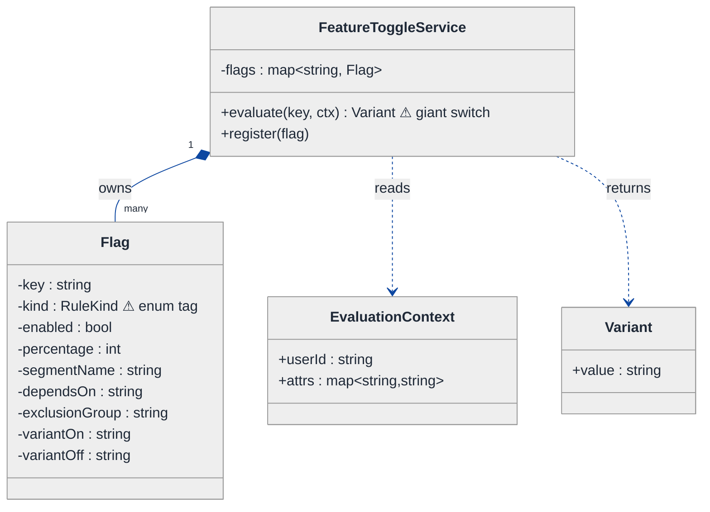
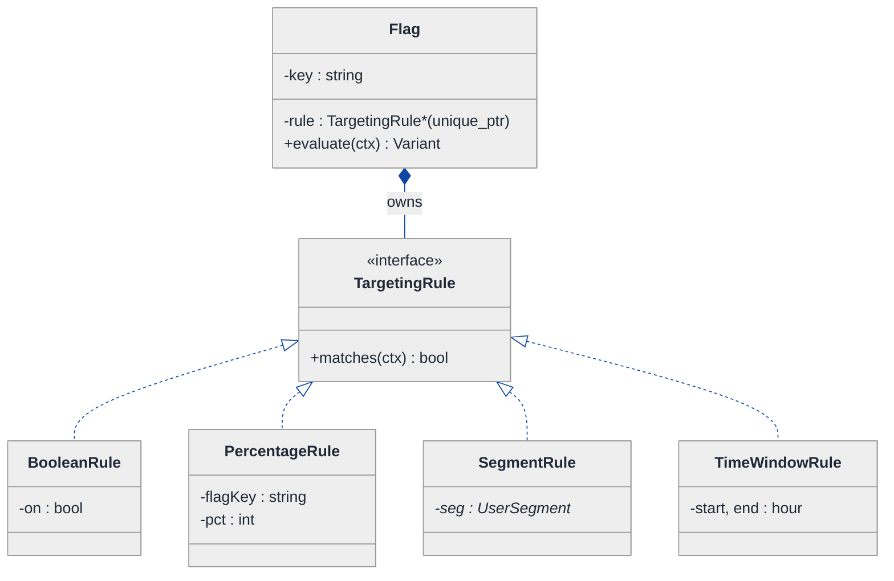
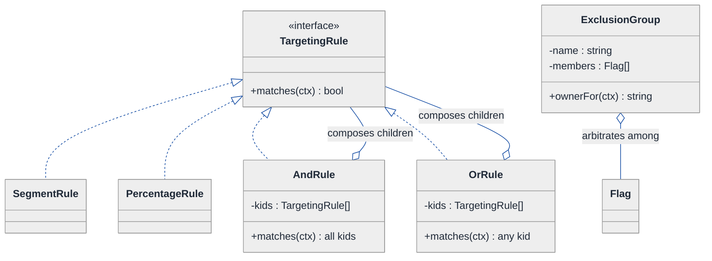
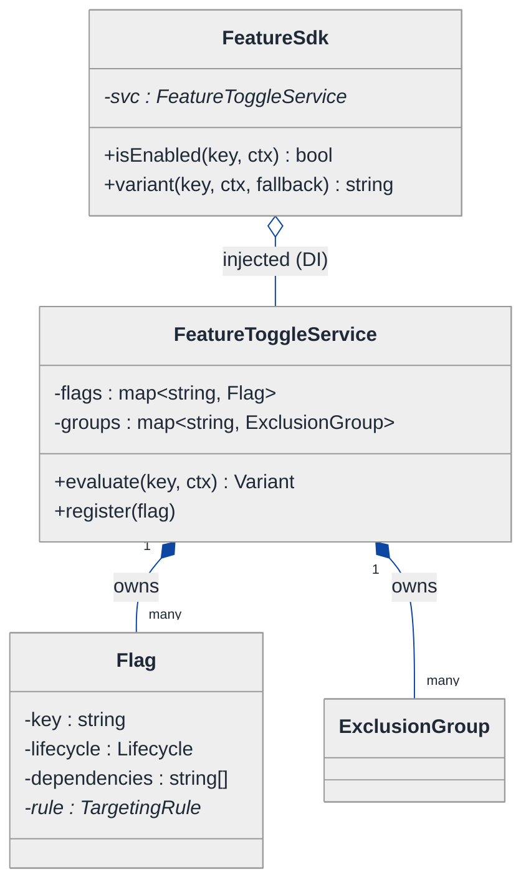
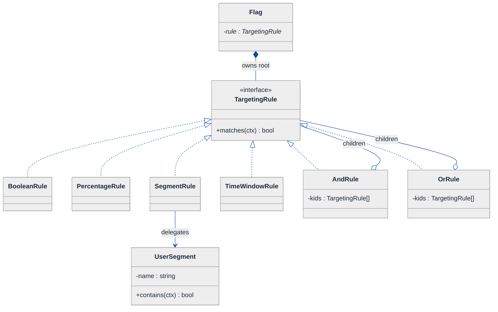
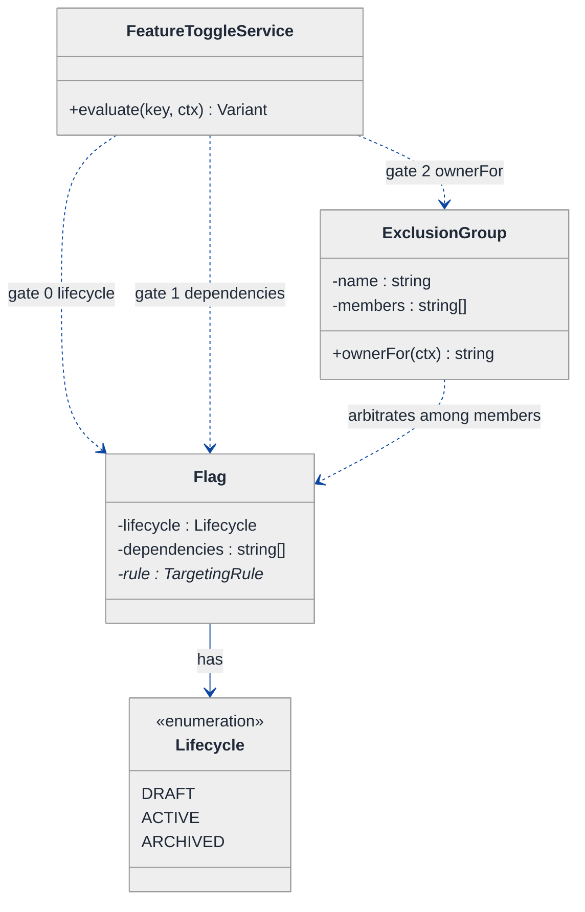
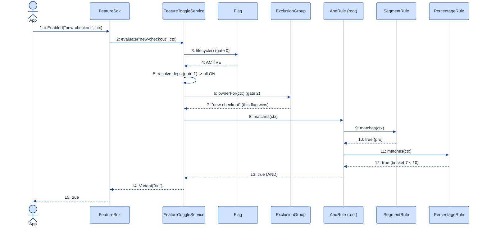

# Feature Toggle Service — LLD Walkthrough

> **Difficulty:** Medium · **Time:** ~30 min · **Pattern focus:** Strategy (targeting rules) + Composite (rule trees) + a State touch for flag lifecycle
>
> **Problem source(s):** GID SG2, bucket `Strategy_Pattern`. Representative of feature-flag / experimentation-platform LLD rows in [`./EXTRACTED_QUESTIONS.md`](./EXTRACTED_QUESTIONS.md).
>
> **Diagrams:** inline mermaid (renders natively in GitHub / VS Code). Theme block copied verbatim from the repo's canonical convention.

---

## How to use this file

Paced for a candidate who has used a feature-flag library (LaunchDarkly, Unleash, Split) but has never designed one. Reading time: ~30 minutes if you sketch each iteration by hand. **The lesson: the interviewer says "feature toggle" but is really probing one thing — when a flag's value depends on a RULE that varies (boolean / percentage / segment / dependency / mutual-exclusion), do you bury that variation in an if/else ladder, or do you lift each rule behind a Strategy interface so a new targeting rule is one new class?**

**Map of this file (15 sections):**

1. Problem statement + clarifying questions
2. Plain-English restatement
3. Why this matters
4. Mental model
5. Try it yourself first
6. Entity & verb extraction
7. **Iteration 1: the naive design** — what we'd write first
8. **Where the naive design hurts** — four future requirements, one painful diff each
9. **Pivot 1: Strategy for targeting rules** — the most painful axis first
10. **Pivot 2: Composite for AND/OR rule trees + dependency/mutual-exclusion** — second axis
11. **Pivot 3: lifecycle + the SDK boundary** — Facade + a State touch
12. Final UML class diagram
13. Skeleton code (C++)
14. Key flow — sequence diagram
15. Extensibility re-check + anti-patterns + how to think aloud + self-check

---

## 1. Problem statement + clarifying questions

**Prompt (typical phrasing):** "Design a feature toggle service at the class level supporting boolean flags, percentage rollouts, user segment targeting, mutual exclusion groups, and flag dependency management. Include an SDK for client integration."

**Clarifying questions to ask BEFORE drawing anything:**

1. **What is the unit of evaluation?** Is a flag always evaluated *for a user/context* (userId + attributes), or are some flags global (no context)?
2. **Boolean only, or multivariate?** Do flags return just on/off, or can they return a variant (`"control"` / `"red-button"` / `"blue-button"`)? This decides the return type of every rule.
3. **What does "percentage rollout" mean exactly?** Sticky per-user (same user always lands the same side across calls), or re-rolled each call? Sticky implies a deterministic hash, not `rand()`.
4. **Mutual exclusion semantics?** If two experiments are in one exclusion group, does a user get *at most one* of them, and is that assignment sticky? How is the "winner" chosen?
5. **Dependency semantics?** "Flag B requires flag A on" — is it a hard precondition (B is off if A is off), or just a config-time validation guard against cycles?
6. **SDK evaluation model?** Does the client SDK evaluate locally against a synced ruleset (fast, offline-capable), or call the server per evaluation (always fresh, network cost)?
7. **Consistency / staleness?** When an admin flips a flag, how fast must clients see it — seconds (poll/stream) or "eventually"?
8. **Scale of audience?** Per-second evaluation volume drives whether evaluation must be allocation-free and lock-free on the hot path.

**Assumptions if interviewer dodges:** every evaluation takes an `EvaluationContext` (userId + string attributes); flags are multivariate returning a `Variant`; percentage rollout is **sticky** via a deterministic hash of `(flagKey, userId)`; mutual exclusion is sticky within a group; dependency is a hard precondition AND a config-time cycle check; the SDK evaluates **locally** against a synced ruleset and exposes one thin `isEnabled` / `variant` facade. Single-process for the class design; we note thread-safety in §15.

---

## 2. Plain-English restatement

We're building the library that answers one question, millions of times a second: **"for THIS user, what value does flag X have right now?"** The answer is not a stored boolean — it is *computed* from a chain of rules attached to the flag: maybe it's off globally; maybe it's on only for the `beta-testers` segment; maybe it's on for a deterministic 10% slice of everyone; maybe it can't turn on because a flag it depends on is off; maybe a sibling experiment in its exclusion group already claimed this user. The design must let us add a brand-new *kind* of rule (say, "on only between 9am and 5pm") **without editing the evaluation core**, and it must expose a dead-simple SDK so application code never sees the machinery.

---

## 3. Why this matters

This is the canonical "the value varies by a swappable rule" problem, and it is a Strategy-pattern litmus test. Most candidates start with a `Flag` class holding a `bool enabled` and an `if (segment) ... else if (percentage) ...` ladder inside `evaluate()`. That works for the four rule types in the prompt and collapses the moment a fifth arrives. The senior signal is recognizing that **the rule is the thing that varies**, lifting it behind an interface, and then noticing that rules also *compose* (AND/OR, dependency-gated) — which is a second, different pattern (Composite). Feature flags also reappear constantly in real systems: experimentation platforms, kill switches, gradual rollouts, entitlement/permission gating.

---

## 4. Mental model

A feature toggle service is a **lookup table of flags**, where each flag's value isn't stored — it's **produced by running an input context through a decision rule**. Think of each flag as owning a small *decision function* `(context) -> variant`, and the service as the registry that finds the right function and runs it.

```
Real-world sketch (NOT a UML diagram yet):

   evaluate("new-checkout", user={id:7, plan:"pro", country:"DE"})
                         │
                         ▼
        ┌─────────────────────────────────────────┐
        │  Flag "new-checkout"                      │
        │  ┌─────────────────────────────────────┐ │
        │  │ rule:  (segment:pro) AND (10% slice) │ │  ← the rule VARIES
        │  └─────────────────────────────────────┘ │     per flag
        │  depends-on: "checkout-v2" (must be ON)   │  ← gate
        │  exclusion-group: "checkout-experiments"  │  ← at most one wins
        └─────────────────────────────────────────┘
                         │
                         ▼
                  Variant("blue-button")
```

The KEY insight from this picture: the *value* is a verb, not a noun. "Inventory of flags" vs. "the rule that decides a value" vs. "the SDK that hides all of it" — registry vs. policy vs. boundary is the separation we'll bake into the design.

---

## 5. Try it yourself first

> **Predict before reading on:**
>
> 1. List 4 nouns you'd promote to a class. List 3 nouns you'd leave as fields.
> 2. **If I told you the service will need five different KINDS of targeting rule in its first year (boolean, percentage, segment, time-window, geo), what would change about how you write the `evaluate()` method?**
> 3. "Flag B depends on flag A" and "flags X and Y are mutually exclusive" — are those the same kind of relationship, or two different ones? Where would you put each?

---

## 6. Entity & verb extraction

> **Mini-refresher: noun → class, but not every noun.**
>
> Naive OOD promotes every noun to a class. Senior OOD promotes a noun only if it has both BEHAVIOR and STATE that need to live together. "Percentage" is a field; "the rule that uses a percentage to decide" is a class because it has decision behavior.

**Nouns from the prompt:**

| Noun | Decision | Why |
|---|---|---|
| FeatureToggleService | Class (top-level registry/coordinator) | Owns flags, orchestrates evaluation |
| Flag | Class | Has key, lifecycle, a rule, dependency + exclusion metadata |
| TargetingRule | Class (abstract) + concrete subclasses | The thing that VARIES — boolean/percentage/segment/… |
| EvaluationContext | Class (value object) | userId + attribute map, passed into every rule |
| Variant | Small class / value type | The result (`"on"`, `"control"`, `"red"`) |
| UserSegment | Class | A named predicate over context attributes |
| ExclusionGroup | Class | Set of flags where at most one activates per user |
| FeatureSdk / Client | Class (boundary) | Thin facade app code calls |
| Percentage / bucket | Field on a rule (`int 0..100`) | No behavior of its own |
| Flag key | Field on Flag (`std::string`) | Not a class |

**Verbs (and the class they live on):**

| Verb | Owner class (naive answer — we'll re-examine) |
|---|---|
| isEnabled(key, ctx) | FeatureSdk → delegates to FeatureToggleService |
| variant(key, ctx) | FeatureSdk → delegates to FeatureToggleService |
| evaluate(flag, ctx) | FeatureToggleService |
| matches(ctx) | TargetingRule |
| inSegment(ctx) | UserSegment |
| bucketOf(key, userId) | (free function / rule helper) |
| register(flag) / addDependency / addExclusion | FeatureToggleService |

**We have NOT introduced any design patterns yet.** Pure nouns + verbs.

---

## 7. <a id="iter-1"></a>Iteration 1: the naive design

Let's write the simplest thing that could possibly work. No design patterns — just a `Flag` with an enum for its rule kind and a big `evaluate()` that switches on it.



**Reader's tour (read top to bottom; ~60 seconds).**

1. **At the top — `FeatureToggleService` is the root.** It holds ONE field (`flags`, a map keyed by flag key) and exposes `evaluate(key, ctx)`. Notice: NO rule objects, NO segment objects. Every decision lives inside the one `evaluate` method.

2. **The composition spine.** The filled diamond (`◆`) marks composition — the service owns its flags; kill the service, the flags die with it. Reasonable and unchanged later.

3. **The Flag box — the trouble zone.** Look at the two warning markers (⚠):
   - `kind` is a `RuleKind` enum tag (`BOOLEAN`, `PERCENTAGE`, `SEGMENT`). The presence of a `kind` *tag field* is the tell-tale sign of a switch waiting to happen.
   - Worse, Flag is a **bag of optional fields**: `percentage` only matters when kind is PERCENTAGE, `segmentName` only when kind is SEGMENT. Most fields are dead weight for any given flag.

4. **`evaluate()` is a giant switch.** The service reads `flag.kind` and branches. This is the whole design's center of gravity — and the thing that will not scale.

**What's deliberately missing.** No `TargetingRule` interface. No `Segment` object with its own predicate. No `Composite` rule that ANDs/ORs sub-rules. No SDK boundary class (app code calls the service directly). The naive design doesn't even *acknowledge* that the rule is an axis of variation — it bakes one hardcoded branch per rule kind into `evaluate()`. That's what we'll expose and fix.

Skeleton code for the naive design (C++):

```cpp
#include <functional>
#include <stdexcept>
#include <string>
#include <unordered_map>

enum class RuleKind { BOOLEAN, PERCENTAGE, SEGMENT };

struct EvaluationContext {
    std::string userId;
    std::unordered_map<std::string, std::string> attrs;
};

struct Variant { std::string value; };  // "on" / "off" / "red" ...

struct Flag {
    std::string key;
    RuleKind    kind = RuleKind::BOOLEAN;
    bool        enabled = false;     // BOOLEAN
    int         percentage = 0;      // PERCENTAGE (0..100)
    std::string segmentName;         // SEGMENT
    std::string dependsOn;           // "" if none
    std::string exclusionGroup;      // "" if none
    std::string variantOn  = "on";
    std::string variantOff = "off";
};

class FeatureToggleService {
public:
    void register_(Flag f) { flags_[f.key] = std::move(f); }

    Variant evaluate(const std::string& key, const EvaluationContext& ctx) {
        auto it = flags_.find(key);
        if (it == flags_.end()) throw std::runtime_error("no such flag");
        const Flag& f = it->second;

        // ⚠ dependency check, inline
        if (!f.dependsOn.empty() &&
            evaluate(f.dependsOn, ctx).value == flags_.at(f.dependsOn).variantOff)
            return { f.variantOff };

        // ⚠ the giant switch — one branch per rule kind
        switch (f.kind) {
            case RuleKind::BOOLEAN:
                return { f.enabled ? f.variantOn : f.variantOff };
            case RuleKind::PERCENTAGE: {
                int bucket = std::hash<std::string>{}(f.key + ":" + ctx.userId) % 100;
                return { bucket < f.percentage ? f.variantOn : f.variantOff };
            }
            case RuleKind::SEGMENT: {
                auto a = ctx.attrs.find("segment");
                bool in = (a != ctx.attrs.end() && a->second == f.segmentName);
                return { in ? f.variantOn : f.variantOff };
            }
        }
        return { f.variantOff };
        // ⚠ exclusion-group logic? not even here yet.
    }
private:
    std::unordered_map<std::string, Flag> flags_;
};
```

**This works.** It has zero design patterns. We can do boolean, percentage, and a single-segment match. So what's wrong with it?

---

## 8. <a id="naive-pain"></a>Where the naive design hurts

The interviewer slides a piece of paper across the desk: "Here are four things coming next quarter. Walk me through what changes."

### Change A: "Add a time-window rule — flag on only 9am–5pm UTC"

In the naive design:
- Add `TIME_WINDOW` to the `RuleKind` enum.
- Add two more fields to the `Flag` bag (`startHour`, `endHour`) that are dead weight for every other flag.
- Add a `case TIME_WINDOW:` to the switch in `evaluate()`.
- **Three edits, and `Flag` keeps bloating with one-rule-only fields.** This repeats for every new rule kind (geo, app-version, A/B variant split…).

### Change B: "Combine rules — on for `pro` segment AND in the 10% rollout"

In the naive design:
- A flag has ONE `kind`. There is no way to express "segment AND percentage."
- The honest fix is to add `kind = SEGMENT_AND_PERCENTAGE`, then `SEGMENT_OR_PERCENTAGE`, then `SEGMENT_AND_PERCENTAGE_AND_TIME`… **a combinatorial explosion of enum values**, each with its own switch branch.
- **The switch grows as the POWER SET of rule kinds.** This is the moment the naive design is provably doomed.

### Change C: "Mutual exclusion groups — a user gets at most ONE experiment in a group"

In the naive design:
- There's a `exclusionGroup` field but no logic. To honor it, `evaluate()` must, for a flag in group G, find all *other* flags in G, deterministically pick which one "owns" this user, and return off if this flag isn't the owner.
- That cross-flag coordination has nowhere to live except a new block bolted into `evaluate()`, which already does dependency + switch.
- **`evaluate()` becomes a god-method**: dependency resolution + rule switch + exclusion arbitration, all in one function.

### Change D: "Ship an SDK; app code must not see Flag/Variant internals, and a bad flag key must return a safe default, not throw"

In the naive design:
- App code calls `service.evaluate(...)` directly and gets a `Variant` it has to interpret. Missing flag → exception that crashes the request.
- Every caller writes its own try/catch and its own `variant.value == "on"` parsing.
- **There is no boundary**; the internal model leaks into every consumer, and error policy is duplicated everywhere.

### The pattern of pain

| Change | Files / methods touched | Smell |
|---|---|---|
| A. Time-window rule | `RuleKind` enum + `Flag` fields + `evaluate` switch | "Tag enum + per-kind fields + switch — open/closed violation." |
| B. Combine rules | enum power-set + N switch branches | "Can't compose rules; combinatorial enum explosion." |
| C. Exclusion groups | `evaluate` (cross-flag coordination) | "God-method doing dependency + rule + arbitration." |
| D. SDK boundary | every caller | "No facade; internal model + error policy leak everywhere." |

> **Mini-refresher: the Open/Closed Principle (the "O" in SOLID).**
>
> Software entities (classes, modules, functions) should be **open for extension but closed for modification** — you should be able to add new behavior by adding new code, not by editing code that already works. The `RuleKind` enum + `evaluate` switch violates this: every new rule kind forces you to *modify* the enum and the switch. The Strategy refactor in §9 restores it — a new rule is one new class, and nothing existing is touched.

**Three axes of pain dominate:** (1) the targeting rule itself varies and (2) rules need to *compose*, and (3) there is no client boundary.

> **Pivot question:** "What pattern handles 'an algorithm/decision that varies, picked per flag'? What pattern lets those decisions *nest into AND/OR trees*? And what hides the whole engine behind a tiny client surface?"
>
> The answers are Strategy, Composite, and Facade. We introduce them one at a time, starting with the most painful axis: the rule itself.

---

## 9. <a id="pivot-1"></a>Pivot 1: Strategy for targeting rules

> **Mini-refresher: Strategy pattern.**
>
> Encapsulates an algorithm behind an interface so it can be swapped at runtime. The CALLER (here, the Flag) decides which strategy to hold; the strategy doesn't know about its peers.
>
> Quick example: a `Sorter` takes a `CompareStrategy*`. Pass `AscendingCompare` or `DescendingCompare` — the sorter doesn't care which.

**Why Strategy fits a targeting rule.** A rule is a decision: `given a context, return on/off (or a variant)`. It varies (boolean, percentage, segment, time-window, geo, …). The choice of rule is made externally — per flag, by whoever configures the flag, not by the evaluation core. That is textbook Strategy. The `RuleKind` enum + switch is exactly the "tag-driven dispatch" smell Strategy exists to delete.

**The refactor (just the affected part):**

```cpp
class TargetingRule {
public:
    virtual ~TargetingRule() = default;
    // returns true => this rule says "the targeted variant applies"
    virtual bool matches(const EvaluationContext& ctx) const = 0;
};

class BooleanRule : public TargetingRule {
public:
    explicit BooleanRule(bool on) : on_(on) {}
    bool matches(const EvaluationContext&) const override { return on_; }
private:
    bool on_;
};

class PercentageRule : public TargetingRule {
public:
    PercentageRule(std::string flagKey, int pct) : flagKey_(std::move(flagKey)), pct_(pct) {}
    bool matches(const EvaluationContext& ctx) const override {
        // sticky: deterministic hash of (flagKey, userId), NOT rand()
        std::size_t h = std::hash<std::string>{}(flagKey_ + ":" + ctx.userId);
        return static_cast<int>(h % 100) < pct_;
    }
private:
    std::string flagKey_;
    int         pct_;
};

class SegmentRule : public TargetingRule {
public:
    explicit SegmentRule(std::shared_ptr<UserSegment> seg) : seg_(std::move(seg)) {}
    bool matches(const EvaluationContext& ctx) const override { return seg_->contains(ctx); }
private:
    std::shared_ptr<UserSegment> seg_;
};
// TimeWindowRule, GeoRule, ... elided — each is one new class

class Flag {
    // RuleKind enum is GONE. percentage / segmentName fields are GONE.
    std::unique_ptr<TargetingRule> rule_;   // the rule the flag holds
    // ...
};
```

**What changed — visualized.** Just the rule slice:



**Tour of the after-state.**

1. **Flag now holds ONE `TargetingRule*`** (a `unique_ptr` — exclusive ownership). The `RuleKind` enum and all the per-kind fields (`percentage`, `segmentName`) are GONE from Flag. Flag shrank to `key` + `rule` + lifecycle metadata.

2. **The `<<interface>>` box** declares the contract: `matches(ctx) -> bool`. Narrow and total — every rule answers the same question for the same input.

3. **Concrete rules each own their own data.** `PercentageRule` carries its own `pct` and the flag key it needs for sticky hashing; `SegmentRule` carries a pointer to a `UserSegment`. No more dead optional fields on Flag.

4. **`Flag::evaluate(ctx)` becomes a one-liner:** `return rule_->matches(ctx) ? variantOn_ : variantOff_;`. No switch. The service no longer reads a `kind` tag at all.

**Change A from §8 now lands cleanly.** Time-window rule → new `TimeWindowRule : TargetingRule`. No enum edit, no Flag field, no switch branch. One new class. Open/closed.

**Pattern-discrimination cheatsheet — Strategy vs State.**
- *Strategy:* the CALLER (the Flag, set at config time) picks which rule to hold; rules are unaware of each other.
- *State:* the OBJECT picks its next state internally via transitions; states know about each other.
- *Rule of thumb:* if `flag.setRule(x)` is set externally and never changes itself → Strategy. If the object flips its own behavior on an event → State.

A targeting rule never transitions itself — it's chosen when the flag is configured. So it's Strategy, not State. (Flag *lifecycle* — draft → active → archived — *is* a State concern; we touch that in Pivot 3.)

---

## 10. <a id="pivot-2"></a>Pivot 2: Composite for AND/OR rule trees, dependency, and exclusion

Changes B and C from §8 are still painful. Strategy gave us one rule per flag, but Change B wants **"segment AND 10% rollout"** — two rules combined — and Change C wants cross-flag arbitration. Adding `AndRule`/`OrRule` as *more enum branches* would re-create the explosion we just deleted. The variability here is not "which single algorithm" — it's "how do rules NEST."

> **Mini-refresher: Composite pattern.**
>
> Lets you treat individual objects and *compositions* of objects uniformly through one interface. A leaf and a "bag of children that delegates to them" both implement the same type, so client code recurses without caring which it holds.
>
> Quick example: a filesystem `Node` interface with `size()`. `File` returns its bytes; `Directory` returns the sum of its children's `size()`. The caller calls `node->size()` without knowing the type.

**Why Composite fits combined rules.** `AndRule` and `OrRule` are themselves `TargetingRule`s — they hold a `vector<TargetingRule*>` and `matches()` by combining their children's answers. Because they share the `TargetingRule` interface, an `AndRule` can hold a `SegmentRule`, a `PercentageRule`, and even another `OrRule`. Arbitrary boolean rule trees, zero new enum values, zero changes to `Flag::evaluate`.

**The refactor (the combinator slice):**

```cpp
class AndRule : public TargetingRule {
public:
    explicit AndRule(std::vector<std::unique_ptr<TargetingRule>> kids)
        : kids_(std::move(kids)) {}
    bool matches(const EvaluationContext& ctx) const override {
        for (const auto& k : kids_) if (!k->matches(ctx)) return false;  // short-circuit
        return true;
    }
private:
    std::vector<std::unique_ptr<TargetingRule>> kids_;
};

class OrRule : public TargetingRule {
public:
    explicit OrRule(std::vector<std::unique_ptr<TargetingRule>> kids)
        : kids_(std::move(kids)) {}
    bool matches(const EvaluationContext& ctx) const override {
        for (const auto& k : kids_) if (k->matches(ctx)) return true;
        return false;
    }
private:
    std::vector<std::unique_ptr<TargetingRule>> kids_;
};
// NotRule elided — one more leaf-of-composites
```

**Dependency and exclusion are NOT rules — they're gates around the rule.** This is the subtle senior point. A dependency ("B requires A on") and an exclusion ("at most one in group G") are *cross-flag* concerns; they don't fit inside a single `matches(ctx)` because they need the other flags. They live in the service's evaluation pipeline, *before* the rule runs:

```cpp
Variant FeatureToggleService::evaluate(const std::string& key,
                                       const EvaluationContext& ctx) {
    const Flag& f = lookup(key);
    if (f.lifecycle() == Lifecycle::ARCHIVED) return f.variantOff();   // gate 0: lifecycle

    for (const auto& dep : f.dependencies())                            // gate 1: dependency
        if (evaluate(dep, ctx).value == off(dep)) return f.variantOff();

    if (auto* g = groupOf(f))                                           // gate 2: exclusion
        if (g->ownerFor(ctx) != f.key()) return f.variantOff();        // sticky winner

    return f.rule().matches(ctx) ? f.variantOn() : f.variantOff();     // the rule (Strategy/Composite)
}
```

**What changed — visualized.** The rule tree plus the gate collaborators:



**Tour of the after-state.**

1. **`AndRule` and `OrRule` ARE `TargetingRule`s.** Note the dual relationship: they implement the interface (`<|..`) *and* aggregate it (`o--`). That self-referential "implements-and-holds-the-same-interface" shape is the visual fingerprint of Composite.

2. **A flag's rule is now a TREE.** `AndRule[ SegmentRule("pro"), PercentageRule(10) ]` expresses Change B directly. `Flag::evaluate` and the service are unchanged — they call `matches(ctx)` on the root and recursion handles the rest.

3. **`ExclusionGroup` is a separate collaborator, not a rule.** It holds its member flags and exposes `ownerFor(ctx)` — a deterministic sticky pick (e.g., hash the user into the group's member list). It is consulted by the service's gate pipeline, not nested in a rule tree, because it needs knowledge *across* flags.

4. **Dependencies live on the Flag as a list of keys** and are resolved by the service (gate 1) — also cross-flag, also outside `matches`.

**Changes B and C now land cleanly.** Combined targeting → build an `AndRule`/`OrRule` tree (no new types needed). Exclusion → `ExclusionGroup::ownerFor` consulted as a gate. The god-method is gone: `evaluate` is a short, readable pipeline of named gates ending in one `matches` call.

**Pattern-discrimination cheatsheet — Composite vs Decorator.**
- *Composite:* one-to-MANY. A node holds a *list* of children and combines them (`all`, `any`, `sum`). Used to build trees.
- *Decorator:* one-to-ONE. A wrapper holds a *single* wrapped object and adds behavior around it (logging, caching) while keeping the same interface.
- *Rule of thumb:* "combine N peers" → Composite. "augment 1 thing" → Decorator. `AndRule` combines many → Composite. (A `CachingRule(base)` that memoizes one rule's result would be a Decorator.)

---

## 11. <a id="pivot-3"></a>Pivot 3: the SDK boundary (Facade) + a State touch for lifecycle

Change D from §8 remains: app code talks to internals and a bad key throws. And we hinted at flag *lifecycle* (draft → active → archived) in Pivot 1. Both are about *boundaries* — one external (client), one internal (what operations a flag allows in each phase).

> **Mini-refresher: Facade pattern.**
>
> Provides one simplified, stable entry point in front of a larger subsystem, so clients depend on the facade — not the moving parts behind it.
>
> Quick example: a `MediaPlayer.play(file)` facade hides codecs, buffers, and audio devices. Callers never touch those classes.

**Why Facade fits the SDK.** Application code should ask exactly two questions — `isEnabled(key, ctx)` and `variant(key, ctx)` — and never see `Flag`, `TargetingRule`, or `Variant`. The SDK is a thin facade over `FeatureToggleService` that also owns the **error policy**: unknown key → safe default, not an exception. Centralizing that policy in one place is the whole point.

```cpp
class FeatureSdk {
public:
    explicit FeatureSdk(std::shared_ptr<FeatureToggleService> svc) : svc_(std::move(svc)) {}

    bool isEnabled(const std::string& key, const EvaluationContext& ctx) const {
        return variant(key, ctx, "off") == "on";
    }
    std::string variant(const std::string& key, const EvaluationContext& ctx,
                        const std::string& fallback = "off") const {
        try { return svc_->evaluate(key, ctx).value; }   // boundary owns the error policy
        catch (const std::exception&) { return fallback; } // bad key => safe default, never throw
    }
private:
    std::shared_ptr<FeatureToggleService> svc_;
};
```

**The State touch (lifecycle).** A flag moves through `DRAFT -> ACTIVE -> ARCHIVED`. We don't need a full State-class hierarchy here — a `Lifecycle` enum checked at gate 0 is proportional for three stable phases. The senior note is *knowing why* you didn't reach for the State pattern:

**Pattern-discrimination cheatsheet — State pattern vs a plain enum.**
- *State pattern (class per state):* worth it when each phase has *rich, divergent behavior* and transitions are many — the enum-switch would sprawl across files (think the Ticket lifecycle in the Parking Lot walkthrough).
- *Plain enum + a guard:* worth it when phases mostly gate a single decision and behavior barely differs.
- *Rule of thumb:* 3 phases, one gate, no per-phase methods → enum. 5+ phases with phase-specific operations → State classes.

A flag's lifecycle is the enum case: three phases, one gate (`if ARCHIVED return off`). Reaching for the full State pattern here would be over-engineering — and saying so out loud is exactly the discrimination the interviewer wants.

> **Mini-refresher: Dependency Injection.**
>
> A class receives its collaborators from outside (constructor parameters) instead of constructing them itself. The `FeatureSdk` is *given* a `FeatureToggleService`; it doesn't `new` one. This keeps the SDK testable (inject a fake service) and decoupled from how the service is wired.

---

## 12. <a id="fig-class-diagram"></a>Final class diagram

Showing everything in one diagram becomes a wall of boxes. Here are **three focused sub-views**; the structural insight at the end ties them together.

### 12.1 The registry spine — what the service OWNS



**Tour of 12.1.** The SDK sits in FRONT of the service (open diamond = aggregation; injected, not owned). The service composes its flags and exclusion groups (filled diamonds = ownership). Each Flag carries its lifecycle, dependency keys, and its rule pointer — but the *rule machinery* lives in 12.2.

### 12.2 The targeting policy — the Strategy + Composite tree



**Tour of 12.2.**

1. **One interface, two species of implementer.** Leaves (`BooleanRule`, `PercentageRule`, `SegmentRule`, `TimeWindowRule`) decide directly. Composites (`AndRule`, `OrRule`) both implement (`<|..`) and aggregate (`o--`) the interface — the Composite fingerprint.

2. **`SegmentRule` delegates to a `UserSegment`** — a reusable named predicate (`plan == "pro" AND country == "DE"`). One segment can back many flags; that's why it's its own class, not inlined into the rule.

3. **A flag's `rule` is the root of a tree.** Evaluation is `rule->matches(ctx)`, recursing through composites. Adding a new leaf rule kind adds one box on the left; it never touches the service or any existing rule.

### 12.3 The evaluation pipeline — gates around the rule



**Tour of 12.3.** `evaluate` is a short pipeline: gate 0 checks `Lifecycle` (archived → off), gate 1 resolves each dependency key recursively (any dep off → off), gate 2 asks the `ExclusionGroup` whether this flag owns the user (`ownerFor(ctx) != key` → off), then — and only then — runs the rule tree. Each gate is a cross-flag concern that *cannot* live inside `matches(ctx)`, which is why they're in the service and not in a rule.

### Structural insight (ties 12.1 + 12.2 + 12.3 together)

| Concern | Pattern used | Why |
|---|---|---|
| **Registry** (service owns flags + groups) | Plain composition | Flags are owned data with a lifetime tied to the service |
| **Targeting rule** (boolean/percentage/segment/time) | **Strategy**, held by Flag | Per-flag choice of a swappable decision algorithm; new kind = one class |
| **Combined rules** (AND/OR trees) | **Composite** over the same interface | Rules nest into trees; combinators ARE rules |
| **Cross-flag gates** (dependency, exclusion, lifecycle) | Pipeline of guards in the service | Need knowledge across flags; can't live in `matches(ctx)` |
| **Client surface** (isEnabled / variant) | **Facade** (SDK) + DI | One stable entry point; owns error policy (bad key → default) |

The big lesson: **the rule is the axis that varies, so it becomes a Strategy; rules that nest become a Composite over that same interface; everything that needs to see OTHER flags stays in the service as an explicit gate.** Strategy and Composite share one interface; the gates do not pretend to be rules. That separation is what makes the design extensible.

---

## 13. Skeleton code (C++)

> Show the SHAPES, not the full impl. ~130 lines.

```cpp
#include <functional>
#include <memory>
#include <stdexcept>
#include <string>
#include <unordered_map>
#include <vector>

// ── Value objects ───────────────────────────────────────────────────
struct EvaluationContext {
    std::string userId;
    std::unordered_map<std::string, std::string> attrs;
};
struct Variant { std::string value; };             // "on" / "off" / "red" ...
enum class Lifecycle { DRAFT, ACTIVE, ARCHIVED };

// ── Segment: a reusable named predicate ─────────────────────────────
class UserSegment {
public:
    explicit UserSegment(std::string name) : name_(std::move(name)) {}
    virtual ~UserSegment() = default;
    virtual bool contains(const EvaluationContext& ctx) const = 0;
    const std::string& name() const { return name_; }
private:
    std::string name_;
};
// e.g. AttributeSegment(attr,value) elided

// ── Strategy: the targeting rule ────────────────────────────────────
class TargetingRule {
public:
    virtual ~TargetingRule() = default;
    virtual bool matches(const EvaluationContext& ctx) const = 0;
};

class BooleanRule : public TargetingRule {
public:
    explicit BooleanRule(bool on) : on_(on) {}
    bool matches(const EvaluationContext&) const override { return on_; }
private:
    bool on_;
};

class PercentageRule : public TargetingRule {        // sticky via deterministic hash
public:
    PercentageRule(std::string flagKey, int pct)
        : flagKey_(std::move(flagKey)), pct_(pct) {}
    bool matches(const EvaluationContext& ctx) const override {
        std::size_t h = std::hash<std::string>{}(flagKey_ + ":" + ctx.userId);
        return static_cast<int>(h % 100) < pct_;
    }
private:
    std::string flagKey_;
    int         pct_;
};

class SegmentRule : public TargetingRule {
public:
    explicit SegmentRule(std::shared_ptr<UserSegment> seg) : seg_(std::move(seg)) {}
    bool matches(const EvaluationContext& ctx) const override { return seg_->contains(ctx); }
private:
    std::shared_ptr<UserSegment> seg_;
};
// TimeWindowRule, GeoRule ... elided — each is one new TargetingRule

// ── Composite: rule trees ───────────────────────────────────────────
class AndRule : public TargetingRule {
public:
    explicit AndRule(std::vector<std::unique_ptr<TargetingRule>> kids) : kids_(std::move(kids)) {}
    bool matches(const EvaluationContext& ctx) const override {
        for (const auto& k : kids_) if (!k->matches(ctx)) return false;
        return true;
    }
private:
    std::vector<std::unique_ptr<TargetingRule>> kids_;
};
// OrRule, NotRule elided — same shape

// ── Flag ────────────────────────────────────────────────────────────
class Flag {
public:
    Flag(std::string key, std::unique_ptr<TargetingRule> rule)
        : key_(std::move(key)), rule_(std::move(rule)) {}
    const std::string& key() const { return key_; }
    Lifecycle lifecycle() const { return lifecycle_; }
    const std::vector<std::string>& dependencies() const { return deps_; }
    bool matches(const EvaluationContext& ctx) const { return rule_->matches(ctx); }
    Variant variantOn()  const { return { on_ };  }
    Variant variantOff() const { return { off_ }; }
private:
    std::string                    key_;
    Lifecycle                      lifecycle_ = Lifecycle::ACTIVE;
    std::vector<std::string>       deps_;          // flag keys that must be ON
    std::unique_ptr<TargetingRule> rule_;          // Strategy / Composite root
    std::string on_ = "on", off_ = "off";
};

// ── Exclusion group ─────────────────────────────────────────────────
class ExclusionGroup {
public:
    explicit ExclusionGroup(std::string name) : name_(std::move(name)) {}
    void add(const std::string& flagKey) { members_.push_back(flagKey); }
    // sticky: deterministic winner for this user among members
    std::string ownerFor(const EvaluationContext& ctx) const {
        if (members_.empty()) return "";
        std::size_t h = std::hash<std::string>{}(name_ + ":" + ctx.userId);
        return members_[h % members_.size()];
    }
private:
    std::string              name_;
    std::vector<std::string> members_;
};

// ── Service: registry + the gate pipeline ───────────────────────────
class FeatureToggleService {
public:
    void register_(std::shared_ptr<Flag> f) { flags_[f->key()] = std::move(f); }
    void addExclusion(const std::string& group, const std::string& flagKey);  // elided

    Variant evaluate(const std::string& key, const EvaluationContext& ctx) {
        auto it = flags_.find(key);
        if (it == flags_.end()) throw std::runtime_error("no such flag: " + key);
        const Flag& f = *it->second;

        if (f.lifecycle() == Lifecycle::ARCHIVED) return f.variantOff();      // gate 0
        for (const auto& dep : f.dependencies())                             // gate 1
            if (evaluate(dep, ctx).value == flags_.at(dep)->variantOff().value)
                return f.variantOff();
        if (auto g = groupOf(key))                                           // gate 2
            if (g->ownerFor(ctx) != key) return f.variantOff();

        return f.matches(ctx) ? f.variantOn() : f.variantOff();              // the rule
    }
private:
    const ExclusionGroup* groupOf(const std::string& key) const;  // elided
    std::unordered_map<std::string, std::shared_ptr<Flag>> flags_;
    std::unordered_map<std::string, ExclusionGroup>        groups_;
};

// ── Facade: the SDK app code calls ──────────────────────────────────
class FeatureSdk {
public:
    explicit FeatureSdk(std::shared_ptr<FeatureToggleService> svc) : svc_(std::move(svc)) {}
    bool isEnabled(const std::string& key, const EvaluationContext& ctx) const {
        return variant(key, ctx, "off") == "on";
    }
    std::string variant(const std::string& key, const EvaluationContext& ctx,
                        const std::string& fallback = "off") const {
        try { return svc_->evaluate(key, ctx).value; }
        catch (const std::exception&) { return fallback; }   // safe default, never throws
    }
private:
    std::shared_ptr<FeatureToggleService> svc_;
};
```

---

## 14. <a id="fig-sequence"></a>Key flow — sequence diagram

This is the moment Strategy, Composite, and the gate pipeline cooperate to answer one `isEnabled` call.



**Tour of the flow. Read slowly — this is where all the patterns meet.**

1. **App calls the SDK facade, not the service.** It passes a key and context, and gets back a plain `bool`. It never sees `Flag`, `Variant`, or any rule. **Facade in play.**

2. **SDK delegates to the service** and will translate the result (and swallow a missing-key exception into a safe default — not shown here because the flag exists).

3-7. **The gate pipeline runs FIRST, before any rule.** Lifecycle (active), dependencies (all on), exclusion (this flag wins the user via the group's sticky `ownerFor`). These are the cross-flag concerns — note they query `Flag` and `ExclusionGroup`, never a rule.

8-13. **Then the rule tree evaluates.** The service calls `matches(ctx)` on the ROOT, which happens to be an `AndRule`. The `AndRule` recurses into its children — `SegmentRule` (true: user is `pro`) and `PercentageRule` (true: sticky bucket 7 < 10) — and ANDs the results. **Strategy + Composite in play: the service asked ONE `matches` and a whole tree answered.**

14-15. **`Variant{"on"}` flows back; the SDK turns it into `true`.**

### The dispatch that's NOT shown — and why it matters

You don't see `switch (flag.kind)` anywhere in this diagram. That's the point of Strategy + Composite: **the decision is dispatched by polymorphism**, not by a tag inspected in the service. The service asked `matches(ctx)` and didn't know — or care — whether it hit a single `BooleanRule` or a five-deep `AndRule(OrRule(...), SegmentRule, ...)` tree. **The class hierarchy IS the dispatch.**

---

## 15. Extensibility re-check + anti-patterns + how to think aloud + self-check

### Extensibility re-check

Revisit the four changes from [§8](#naive-pain). For each, name the SINGLE thing that changes.

| Change | Naive design impact | Final design impact |
|---|---|---|
| A. Time-window rule | enum + Flag fields + switch | New `TimeWindowRule : TargetingRule`. Done. |
| B. Combine rules | enum power-set explosion | Build an `AndRule`/`OrRule` tree from existing rules. No new types. Done. |
| C. Exclusion groups | god-method in `evaluate` | `ExclusionGroup::ownerFor` consulted as gate 2. One collaborator. Done. |
| D. SDK boundary | every caller leaks internals | `FeatureSdk` facade owns surface + error policy. One class. Done. |

Every change is one new class or no new class at all. That's the open/closed principle in practice. If a future requirement makes you change `Flag`, `TargetingRule`, AND the service together — go back to §6 and re-identify variability points; you missed one.

### Common confusion + traps

1. **"Should dependency be a `TargetingRule`?"** No. A rule sees only `ctx`; a dependency needs to evaluate ANOTHER flag. Cross-flag concerns belong in the service's gate pipeline, not inside `matches(ctx)`.

2. **"Why is percentage hashed, not `rand()`?"** Stickiness. A user must land on the same side every call, or the rollout flickers on every page load. Deterministic `hash(flagKey, userId)` gives stable, uniformly-distributed buckets.

3. **"Why not one `Rule` class with a `std::function` instead of subclasses?"** A `std::function<bool(ctx)>` is fine for trivial cases, but you lose named, testable, serializable rule types and the Composite tree structure (how do you serialize a lambda back from config?). Subclasses keep rules first-class.

4. **"Why is `UserSegment` separate from `SegmentRule`?"** A segment is a reusable predicate that many flags share; the rule is the per-flag adapter that plugs a segment into the `TargetingRule` interface. Separation lets one `pro-users` segment back twenty flags.

5. **"Why `unique_ptr` for the rule but `shared_ptr` for the segment?"** A flag exclusively owns its rule tree → `unique_ptr`. A segment is shared across flags → `shared_ptr`. Ownership semantics drive the pointer type, not habit.

### Anti-patterns

- **"Tag-driven if/else"** — `switch (flag.kind)` in `evaluate()`. The whole naive design; replaced by Strategy.
- **"Enum power-set"** — `SEGMENT_AND_PERCENTAGE`, `SEGMENT_OR_TIME`… one enum value per combination. Replaced by Composite.
- **"God service"** — `evaluate()` doing dependency resolution + rule dispatch + exclusion arbitration in one tangle. Replaced by an explicit gate pipeline + delegated `matches`.
- **"Leaky abstraction"** — app code reading `flag.rule` or parsing `Variant` strings. Hide behind the SDK facade.
- **"Anemic Flag"** — a Flag that's a struct of optional fields (`percentage`, `segmentName`) most of which are null. Give it a single `rule` instead.
- **"Random percentage"** — using `rand()` so a user flips sides every call. Use a deterministic hash.
- **"Over-engineered lifecycle"** — a full State-class hierarchy for three phases gated by one check. A `Lifecycle` enum is proportional; say so.

### How to think aloud

> "Feature toggle service. Let me clarify scope. [Asks 4-6 questions from §1 — evaluation unit, multivariate, sticky percentage, dependency semantics, SDK local-vs-remote.] Got it.
>
> Nouns: Service, Flag, TargetingRule, EvaluationContext, Variant, Segment, ExclusionGroup, SDK. The rule is the thing that varies.
>
> I'll start NAIVE — no patterns. A Flag with a `kind` enum and a bag of optional fields; `evaluate()` switches on kind. It works for boolean/percentage/segment.
>
> Now stress-test it. Change A: a time-window rule — touches enum + fields + switch. Change B: combine segment AND percentage — there's no way except an enum power-set. Change C: exclusion groups need cross-flag arbitration — `evaluate` becomes a god-method. Change D: an SDK so app code doesn't see internals.
>
> Three axes of pain: the rule varies, rules compose, and there's no client boundary.
>
> Pivot 1: rule becomes a `TargetingRule` Strategy. BooleanRule, PercentageRule (sticky hash), SegmentRule. Flag holds one `unique_ptr<TargetingRule>`; the enum and optional fields are gone; new rule kind = one class.
>
> Pivot 2: combined rules become a Composite — AndRule/OrRule ARE TargetingRules holding children, so rules nest into trees with zero new enum values. Dependency and exclusion are NOT rules — they need other flags, so they live as gates in the service pipeline; ExclusionGroup::ownerFor picks a sticky winner.
>
> Pivot 3: a FeatureSdk facade exposes isEnabled/variant and owns the error policy (bad key → default, never throw); injected via DI. Flag lifecycle is just a 3-value enum checked at gate 0 — a full State hierarchy would be over-engineering here.
>
> Final: SDK → service (registry of flags + groups) → per-flag Strategy/Composite rule tree, fronted by a gate pipeline. Every future requirement lands as one new class. Open/closed."

### Self-check

> **Self-check — the question to ask next time.**
>
> When you see "design a [thing] whose value depends on rules that vary," before reaching for an enum + switch, ask:
>
> > **"Is the variation a single algorithm the CONFIG picks (Strategy), do those algorithms NEST into AND/OR trees (Composite), and does anything need to see OTHER instances (a gate in the coordinator, NOT a rule)?"**
>
> Single swappable decision → Strategy. Decisions that nest → Composite over the same interface. Cross-instance knowledge → a gate in the coordinator. Client convenience → a Facade. The class diagram falls out for free.

---

## Cross-references

- **Parent topic manifest:** [`./EXTRACTED_QUESTIONS.md`](./EXTRACTED_QUESTIONS.md)
- **Vertical overview:** [`../../LEARNING.md`](../../LEARNING.md)
- **Template:** [`../../TEMPLATE-v2.md`](../../TEMPLATE-v2.md)
- **Canonical exemplar:** [`../Object_Oriented_Design/Parking_Lot.md`](../Object_Oriented_Design/Parking_Lot.md) — Strategy + State, the gold-standard derivation arc
- **Sibling walkthrough:** [`./Notification_Service.md`](./Notification_Service.md) — Strategy for channel dispatch
- **Related GoF reading:**
  - <a href="https://refactoring.guru/design-patterns/strategy" target="_blank" rel="noopener noreferrer">Strategy pattern (Refactoring Guru)</a>
  - <a href="https://refactoring.guru/design-patterns/composite" target="_blank" rel="noopener noreferrer">Composite pattern (Refactoring Guru)</a>
  - <a href="https://refactoring.guru/design-patterns/facade" target="_blank" rel="noopener noreferrer">Facade pattern (Refactoring Guru)</a>
- **Related v2 walkthroughs (future):**
  - State Pattern deep-dive (in `../State_Pattern/`)
  - Composite Pattern deep-dive (in `../Composite_Pattern/`)
