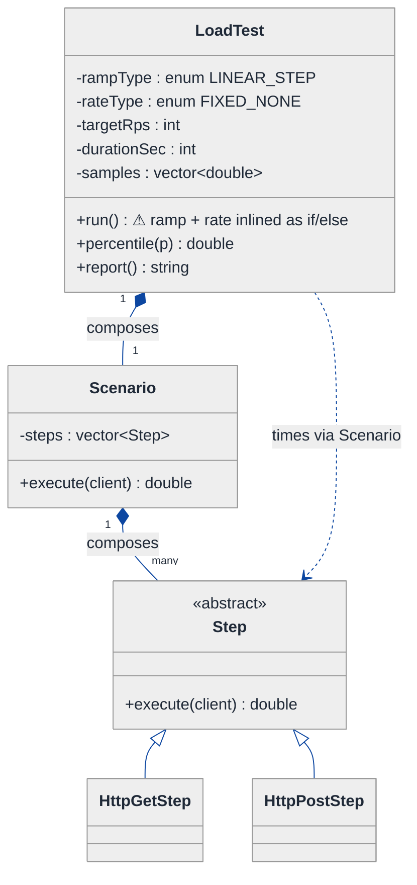
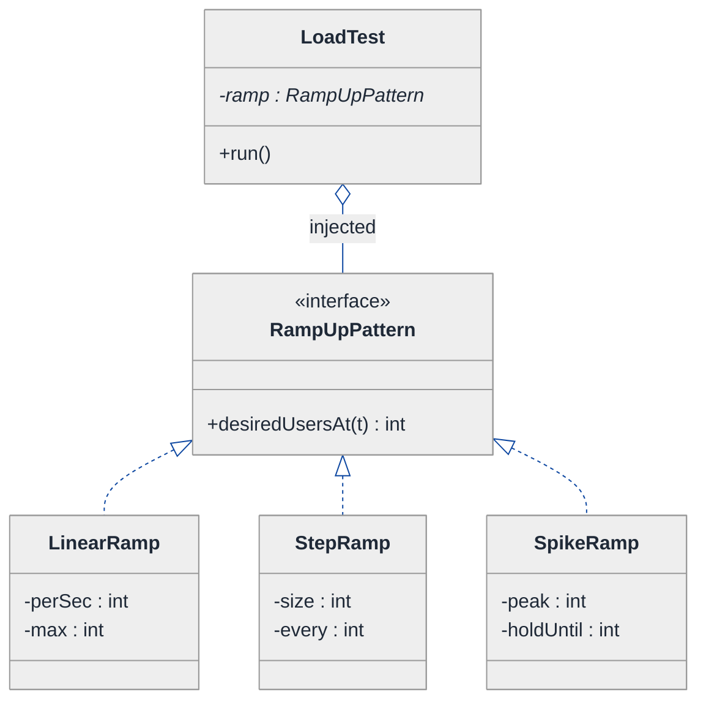
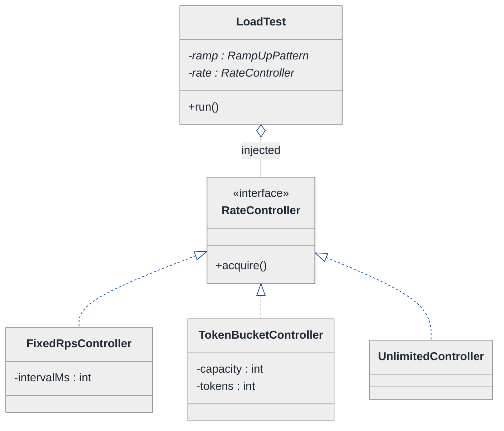
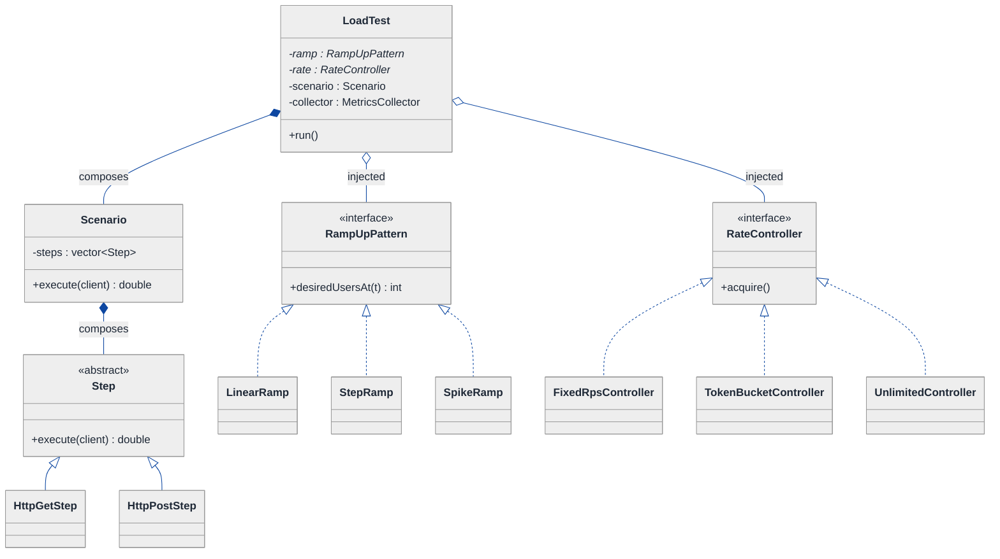
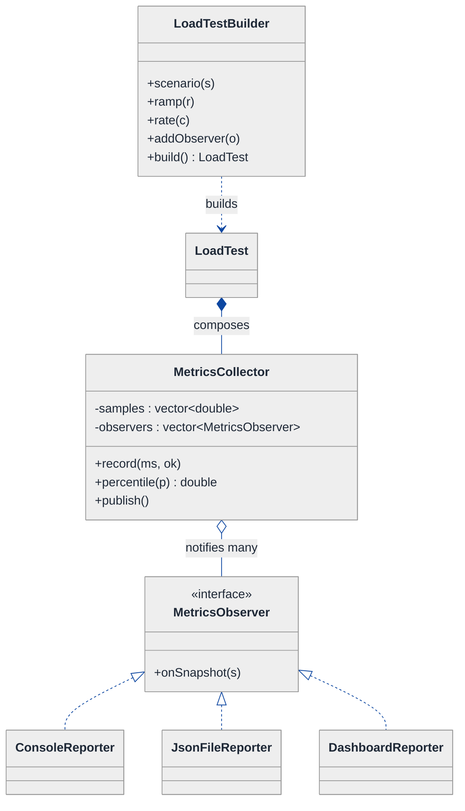

# Load Testing Framework — LLD Walkthrough

> **Difficulty:** Medium · **Time:** ~30 min · **Pattern focus:** Strategy (ramp-up + rate control) + a supporting cast (Builder, Observer)
>
> **Problem source(s):** GID SG4, bucket `Strategy_Pattern` — "Design a load testing framework at the class level supporting configurable user scenarios, ramp-up patterns, request rate control, response time measurement, percentile calculation (P50/P95/P99), and result reporting."
>
> **Diagrams:** inline mermaid (renders natively in GitHub / VS Code). No external binary artifacts.

---

## How to use this file

Paced for a candidate seeing "build a mini-JMeter / k6" for the first time. Reading time: ~30 minutes if you sketch each iteration by hand. **The lesson: don't reach for design patterns up front — DERIVE them. Build the naive single-class runner first, watch it ossify when the interviewer asks for a second ramp shape and a third rate policy, then reach for ONE pattern at a time on the most painful axis.** The pattern the interviewer is probing here is Strategy, applied TWICE on two independent axes (how users arrive, and how fast requests fire).

**Map of this file (15 sections):**

1. Problem statement + clarifying questions
2. Plain-English restatement
3. Why this matters
4. Mental model
5. Try it yourself first
6. Entity & verb extraction
7. **Iteration 1: the naive design** — one big runner, hardcoded everything
8. **Where the naive design hurts** — four future requirements, one painful diff each
9. **Pivot 1: Strategy for the ramp-up pattern** — the most painful axis first
10. **Pivot 2: Strategy for request-rate control** — a second, independent algorithm axis
11. **Pivot 3: Builder for scenario config + Observer for live metrics**
12. Final UML class diagram
13. Skeleton code (C++)
14. Key flow — sequence diagram
15. Extensibility re-check + anti-patterns + how to think aloud + self-check

---

## 1. Problem statement + clarifying questions

**Prompt (typical phrasing):** "Design a load testing framework. It runs a user scenario against a target, ramps virtual users up over time, controls the request rate, measures response times, computes P50/P95/P99, and reports results."

**Clarifying questions to ask BEFORE drawing anything:**

1. **What is a "scenario"?** A single request, or a sequence of steps (login → browse → checkout) with think-time between them?
2. **Ramp-up shapes?** Just linear (add N users/sec), or also step (spike +50 every 30s), spike-and-hold, and custom curves loaded from a file?
3. **Rate control axis — is it separate from ramp-up?** Ramp-up controls *how many concurrent virtual users exist*; rate control caps *requests-per-second across all of them*. Are these two independent knobs or one?
4. **Open vs closed model?** Closed: a fixed pool of users, each fires, waits for response, fires again. Open: new requests arrive at a target arrival rate regardless of whether prior ones finished. Which?
5. **Percentiles — exact or approximate?** Exact needs all samples in memory (fine for millions, not billions). Approximate (HDR histogram / t-digest) is bounded-memory. Which scale?
6. **Reporting — one final report, or live streaming during the run?** Console only, or also JSON / CSV / a dashboard feed?
7. **Concurrency model?** Thread-per-user, a thread pool, or async event loop? How many virtual users at peak — hundreds or hundreds of thousands?
8. **Stop conditions?** Fixed duration, fixed request count, or "until error rate > X%"?

**Assumptions if interviewer dodges:** a scenario is a sequence of steps; ramp-up and rate are two independent axes; closed model with a thread pool; exact percentiles via a sorted sample buffer (we'll note the histogram swap in §15); a final report plus optional live observers; stop on fixed duration. Single target host.

---

## 2. Plain-English restatement

We're building the engine behind a tool like JMeter, Gatling, or k6. You hand it a **scenario** (what each virtual user does) and a **load profile** (how the herd of virtual users grows over time, and how fast they're allowed to fire). The engine spins up virtual users according to the ramp-up shape, throttles the aggregate request rate, times every request, collects the samples, computes percentiles at the end, and emits a report. The design must let us add a new ramp-up shape or a new rate policy **without rewriting the run loop** — because in practice every load test wants a slightly different curve.

---

## 3. Why this matters

This question is a Strategy-pattern litmus test wearing a systems costume. The trap is to write one `LoadTester::run()` method with the ramp math and the throttle math inlined as `if (rampType == LINEAR) ... else if (...)`. That works for the demo and collapses the moment a second shape is requested. The skill being probed: can you spot that "how users arrive" and "how fast requests fire" are **two independent algorithm axes**, each a textbook Strategy, and keep the run loop oblivious to which concrete algorithm is plugged in? The same reasoning reappears in schedulers, rate limiters, ret/ backoff policies, and any "pluggable policy" system.

---

## 4. Mental model

A load test is a **conveyor belt with two dials**. One dial sets how many workers stand at the belt (ramp-up). The other dial sets how fast the belt itself moves (request rate). The workers don't care how the dials are set; they just grab the next request and time it. A clipboard at the end tallies the timings.

```
Real-world sketch (NOT a UML diagram yet):

   time ─────────────────────────────────────────►
   users
     ▲      ramp-up dial decides this curve's shape
   60│                    ┌──────── (step)
     │             ┌──────┘
   30│        ╱───────────────────  (linear)
     │      ╱
    0└────┴──────────────────────────────────────►

   each active user ──► [ rate gate ] ──► fire request ──► time it
                          ▲                                  │
              rate dial caps req/sec                         ▼
                                                    [ sample collector ]
                                                    P50 / P95 / P99 + report
```

The KEY insight from this picture: **the ramp dial and the rate dial are turned independently**, and the worker + collector machinery is the same regardless of how either dial is set. That independence is exactly what tells us we have two separate variability axes — and Strategy is the pattern that isolates "a varying algorithm picked by the caller."

---

## 5. Try it yourself first

> **Predict before reading on:**
>
> 1. List 5 nouns you'd promote to a class and 2 you'd leave as fields.
> 2. **If I told you the framework needs three ramp shapes (linear, step, spike) in week one, what would change about how you write the run loop?**
> 3. Where does P95 get computed — inside the worker that fires requests, or somewhere that sees ALL the samples? Why does that placement matter?

---

## 6. Entity & verb extraction

> **Mini-refresher: noun → class, but not every noun.**
>
> Naive OOD promotes every noun to a class. Senior OOD promotes a noun only if it has both BEHAVIOR and STATE that need to live together. "Duration" stays a field; "Scenario" becomes a class because it holds steps AND knows how to execute them.

**Nouns from the prompt:**

| Noun | Decision | Why |
|---|---|---|
| LoadTest / Engine | Class (top-level coordinator) | Owns the run loop, wires everything together |
| Scenario | Class | Holds an ordered list of steps + executes them per virtual user |
| Step / Request | Class (abstract) + concrete | One HTTP/gRPC action; has a method to execute and time |
| VirtualUser | Class | Runs a scenario in a loop until stopped |
| RampUpPattern | Interface (varies) | "How many users should be active at time t" — an algorithm |
| RateController | Interface (varies) | "May I fire a request now?" — an algorithm |
| MetricsCollector | Class | Aggregates samples, computes percentiles |
| Sample / ResponseTime | Field (a `double` ms) | No behavior of its own |
| Report | Class | Formats collected metrics |
| P50/P95/P99 | Computed values, not classes | Outputs of MetricsCollector |
| Target host / URL | Field on Step (`std::string`) | No domain behavior |

**Verbs (and the class they live on):**

| Verb | Owner class (naive answer — we'll re-examine) |
|---|---|
| run() | LoadTest (the orchestrator) |
| desiredUsersAt(t) | RampUpPattern (later — naive bakes it into run()) |
| acquire() / mayFire() | RateController (later — naive bakes it into run()) |
| execute() | Step / Scenario |
| record(sampleMs) | MetricsCollector |
| percentile(p) | MetricsCollector |
| render() | Report |

**We have NOT introduced any design patterns yet.** Pure nouns + verbs.

---

## 7. <a id="iter-1"></a>Iteration 1: the naive design

Let's write the simplest thing that could possibly work. No design patterns — one engine class with the ramp math, the rate math, the timing, and the percentile math all in reach.



**Reader's tour (read top to bottom; ~60 seconds).**

1. **At the top — `LoadTest` is the root, and it's doing far too much.** Look at its fields: `rampType` and `rateType` are *enums*. That's the tell. The shape of the ramp and the rate policy are baked into integer tags, and `run()` branches on them with `if/else`.

2. **The composition spine (down the left).** `LoadTest` composes one `Scenario`; the `Scenario` composes many `Step`s. Filled diamonds (`◆`) mark composition — strong ownership / same lifetime. This part of the design is fine; scenarios genuinely own their steps.

3. **The `Step` hierarchy (right side).** `Step` is an abstract base; `HttpGetStep` and `HttpPostStep` inherit. This is a genuine "is-a" relationship and is *not* the smell — every concrete step IS a step that knows how to `execute()` and return its elapsed milliseconds.

4. **The trouble zone — the ⚠ on `run()`.** Inside one method we (a) compute "how many users should be live right now" by branching on `rampType`, (b) decide "may I fire" by branching on `rateType`, (c) execute the scenario and time it, and (d) push the sample into `samples`. Four responsibilities, two of them branch-on-enum.

5. **`samples` + `percentile()` live on `LoadTest`.** Convenient for now — `run()` pushes, `percentile()` sorts and indexes. We'll see this responsibility wants its own home once reporting grows.

**What's deliberately missing.** No `RampUpPattern` interface. No `RateController` interface. No `MetricsCollector`. No `Report` hierarchy. The naive design doesn't even *acknowledge* that ramp-shape and rate-policy are axes of variation — it encodes one hardcoded answer per enum value inside `run()`. That is exactly what §8 will expose.

Skeleton code for the naive design (C++):

```cpp
#include <algorithm>
#include <chrono>
#include <cmath>
#include <string>
#include <thread>
#include <vector>

enum class RampType { LINEAR, STEP };           // only two shapes today
enum class RateType { FIXED_RPS, UNLIMITED };   // only two policies today

class HttpClient;  // forward — issues the actual request

class Step {
public:
    virtual ~Step() = default;
    virtual double execute(HttpClient& c) const = 0;  // returns elapsed ms
};
class HttpGetStep : public Step {
public:
    explicit HttpGetStep(std::string url) : url_(std::move(url)) {}
    double execute(HttpClient& c) const override; // GET url_, return ms (elided)
private:
    std::string url_;
};

class Scenario {
public:
    explicit Scenario(std::vector<std::unique_ptr<Step>> steps) : steps_(std::move(steps)) {}
    double execute(HttpClient& c) const {
        double total = 0;
        for (const auto& s : steps_) total += s->execute(c);
        return total;
    }
private:
    std::vector<std::unique_ptr<Step>> steps_;
};

class LoadTest {
public:
    void run(HttpClient& client) {
        using clock = std::chrono::steady_clock;
        auto start = clock::now();
        while (elapsedSec(start) < durationSec_) {
            int t = elapsedSec(start);

            // (a) ramp — how many users right now? HARDCODED branch:
            int users = (rampType_ == RampType::LINEAR)
                          ? std::min(maxUsers_, t * usersPerSec_)
                          : ((t / stepEverySec_) + 1) * stepSize_;   // STEP

            // (b) rate gate — HARDCODED branch:
            if (rateType_ == RateType::FIXED_RPS) {
                std::this_thread::sleep_for(std::chrono::milliseconds(1000 / targetRps_));
            } // UNLIMITED: no sleep

            // (c)+(d) fire `users` scenarios, time each, collect
            for (int i = 0; i < users; ++i)
                samples_.push_back(scenario_->execute(client));
        }
    }
    double percentile(double p) const {                 // exact, in-memory
        auto v = samples_;
        std::sort(v.begin(), v.end());
        return v[static_cast<size_t>(p / 100.0 * (v.size() - 1))];
    }
    // report() prints percentile(50), percentile(95), percentile(99) — elided
private:
    static int elapsedSec(std::chrono::steady_clock::time_point s) {
        return std::chrono::duration_cast<std::chrono::seconds>(
                   std::chrono::steady_clock::now() - s).count();
    }
    RampType rampType_  = RampType::LINEAR;
    RateType rateType_  = RateType::FIXED_RPS;
    int usersPerSec_ = 5, maxUsers_ = 100, stepEverySec_ = 30, stepSize_ = 50;
    int targetRps_ = 200, durationSec_ = 300;
    std::unique_ptr<Scenario> scenario_;
    std::vector<double>       samples_;
};
```

**This works.** It has zero design patterns. It ramps, throttles, times, and reports. So what's wrong with it?

---

## 8. <a id="naive-pain"></a>Where the naive design hurts

The interviewer slides four next-quarter requirements across the desk: "Walk me through what changes."

### Change A: "Add a spike ramp — jump to 500 users instantly, hold, then drop"

In the naive design:
- The `RampType` enum gains a `SPIKE` value.
- The ramp branch in `run()` gains a third `else if`, and it doesn't fit the `t * usersPerSec` mold — it needs a hold window and a drop time.
- **The 30+ line run loop grows another arm.** Every ramp shape makes `run()` longer and harder to read.

### Change B: "Add a ramp-down / staged profile loaded from a JSON curve file"

In the naive design:
- A file-driven curve can't be expressed as a single arithmetic formula at all.
- You'd smuggle a `std::map<int,int>` into `LoadTest` AND another enum value AND another branch — and now `LoadTest` parses files too.
- **`run()` accumulates an unrelated responsibility (config parsing).**

### Change C: "Rate control by token bucket (bursty), and later a closed-loop model"

In the naive design:
- `RateType` gains `TOKEN_BUCKET`; the rate branch in `run()` needs bucket state (tokens, refill timer) that has nowhere clean to live.
- A closed-loop model isn't a sleep at all — it's "fire next request when the previous one returns." That doesn't fit the `sleep_for` shape, so the branch becomes structurally incompatible with the others.
- **Two policies that don't share a code shape are forced into one if/else.**

### Change D: "Stream live metrics to a dashboard every second, AND keep the console report, AND emit JSON"

In the naive design:
- `samples_` lives on `LoadTest`; only `report()` reads it. To stream live, `run()` must call a dashboard pusher inline.
- Three output sinks → three hardcoded calls sprinkled through `run()` and `report()`.
- **Every new sink is surgery in the orchestrator, and the orchestrator now knows about dashboards.**

### The pattern of pain

| Change | Files / methods touched | Smell |
|---|---|---|
| A. Spike ramp | `RampType` enum + `run()` ramp branch | "Run loop grows an arm per ramp shape." |
| B. File curve | `LoadTest` fields + `run()` + new parse code | "Orchestrator absorbs unrelated responsibilities." |
| C. Token bucket / closed loop | `RateType` enum + `run()` rate branch | "Policies with no common shape jammed into one switch." |
| D. Live + JSON + console | `run()` + `report()`, multiple inline calls | "Output sinks hardcoded into the orchestrator." |

**Three axes of pain dominate:** how-users-arrive varies (A, B), how-fast-requests-fire varies (C), and who-consumes-the-metrics varies (D). The first two are algorithms; the third is a fan-out of listeners.

> **Pivot question:** "What pattern handles 'an algorithm that varies, chosen by the caller and swapped at runtime'? And what pattern handles 'one source notifying many independent consumers'?"
>
> The answers are Strategy (for ramp and rate — two independent applications) and Observer (for reporting). Let's introduce them one at a time, starting with the most painful axis: the ramp-up shape.

---

## 9. <a id="pivot-1"></a>Pivot 1: Strategy for the ramp-up pattern

> **Mini-refresher: Strategy pattern.**
>
> Encapsulates an algorithm behind an interface so it can be swapped at runtime. The CALLER decides which strategy to use; the strategy doesn't know about its peers. The context (here, the run loop) holds a pointer to the interface and calls it without knowing which concrete variant is plugged in.
>
> Quick example: a `Sorter` takes a `CompareStrategy*` in its constructor. Pass `AscendingCompare` or `DescendingCompare` — the sorter never branches on which one it got.

**Why Strategy fits ramp-up.** "How many virtual users should be active at elapsed time t" is a pure algorithm: input `t`, output a user count. It varies (linear, step, spike, file-driven curve). The choice is made externally — by whoever configures the test, not by the run loop. The run loop only ever asks `ramp->desiredUsersAt(t)`. That is textbook Strategy.

**The refactor (just the affected slice):**

```cpp
class RampUpPattern {
public:
    virtual ~RampUpPattern() = default;
    // Pure algorithm: given seconds elapsed, how many users should be live now?
    virtual int desiredUsersAt(int elapsedSec) const = 0;
};

class LinearRamp : public RampUpPattern {
public:
    LinearRamp(int usersPerSec, int maxUsers)
        : perSec_(usersPerSec), max_(maxUsers) {}
    int desiredUsersAt(int t) const override {
        return std::min(max_, t * perSec_);
    }
private:
    int perSec_, max_;
};

class StepRamp : public RampUpPattern {
public:
    StepRamp(int stepSize, int everySec) : size_(stepSize), every_(everySec) {}
    int desiredUsersAt(int t) const override {
        return ((t / every_) + 1) * size_;
    }
private:
    int size_, every_;
};

class SpikeRamp : public RampUpPattern {       // Change A — lands as a NEW class
public:
    SpikeRamp(int peak, int holdUntilSec) : peak_(peak), hold_(holdUntilSec) {}
    int desiredUsersAt(int t) const override {
        return (t < hold_) ? peak_ : 0;
    }
private:
    int peak_, hold_;
};
// FileCurveRamp (Change B) elided — reads a std::map<int,int>, interpolates

class LoadTest {
    // ...
    std::unique_ptr<RampUpPattern> ramp_;   // INJECTED at construction
    // run() now calls: int users = ramp_->desiredUsersAt(t);   // no branch
};
```

**What changed — visualized.** Just the ramp slice:



**Tour of the after-state.**

1. **`LoadTest` lost its `rampType` enum** and gained a `ramp : RampUpPattern*` field, INJECTED at construction. The open diamond (`◇`) marks aggregation — the lot uses the ramp but the caller decided which one.
2. **The `<<interface>>` box declares one method.** `desiredUsersAt(int) → int`. The contract is narrower than the old branch: it takes elapsed seconds, returns a count. Nothing else.
3. **Three concrete ramps hang off the interface.** `LinearRamp`, `StepRamp`, `SpikeRamp` — each owns its own parameters and its own formula. Adding `FileCurveRamp` (Change B) is a fourth box; no existing box changes.
4. **The run loop no longer branches.** It calls `ramp_->desiredUsersAt(t)` and trusts the answer. **Change A and Change B from §8 now land as ONE new class each.**

**Pattern-discrimination cheatsheet — Strategy vs State.**
- *Strategy:* the CALLER picks which algorithm to use; the variants are unaware of each other. `setRamp(linear)` is called from outside.
- *State:* the OBJECT picks its next state internally via transitions; states know each other. `ticket.handleEvent(e)` flips state from within.
- *Rule of thumb:* if the swap happens because external config says so → Strategy. If it happens because of an internal event flow → State. Ramp shape is chosen by the test author up front → **Strategy**.

---

## 10. <a id="pivot-2"></a>Pivot 2: Strategy for request-rate control

Change C from §8 is still painful — token bucket, then a closed-loop model that isn't even a sleep. Ramp Strategy doesn't help, because this is a *different* algorithm axis: not "how many users exist" but "is this user allowed to fire right now."

**Why Strategy again (and why it's a SEPARATE hierarchy).** Rate control is also a pure algorithm, but its signature is different from ramp's: it answers "block until I'm allowed to fire" rather than "how many users at time t." Two different inputs, two different outputs → two different Strategy interfaces. Cramming both under one base would be premature genericism.

> **Mini-refresher: why two Strategy hierarchies don't share one interface.**
>
> Strategy is a *role*, not a type. `RampUpPattern` and `RateController` have nothing in common at the type level — different parameters, different return types, different call sites. Don't unify them under a `Strategy<T>` template just because both are "strategies." Two roles → two interfaces.

**The refactor (just the rate slice):**

```cpp
class RateController {
public:
    virtual ~RateController() = default;
    // Block (or busy-wait) until the caller is permitted to fire the next request.
    virtual void acquire() = 0;
};

class FixedRpsController : public RateController {     // simple constant pacing
public:
    explicit FixedRpsController(int rps) : intervalMs_(1000 / rps) {}
    void acquire() override {
        std::this_thread::sleep_for(std::chrono::milliseconds(intervalMs_));
    }
private:
    int intervalMs_;
};

class TokenBucketController : public RateController {  // Change C — bursty
public:
    TokenBucketController(int capacity, int refillPerSec)
        : capacity_(capacity), refillPerSec_(refillPerSec), tokens_(capacity) {}
    void acquire() override {
        refill();
        while (tokens_ <= 0) { std::this_thread::sleep_for(std::chrono::milliseconds(1)); refill(); }
        --tokens_;
    }
private:
    void refill();                 // top up by elapsed * refillPerSec_, cap at capacity_ (elided)
    int capacity_, refillPerSec_, tokens_;
    std::chrono::steady_clock::time_point lastRefill_ = std::chrono::steady_clock::now();
};

class UnlimitedController : public RateController {
public:
    void acquire() override { /* no-op: fire as fast as possible */ }
};

class LoadTest {
    // ...
    std::unique_ptr<RateController> rate_;   // INJECTED, independent of ramp_
    // run() now calls: rate_->acquire();    // before each fire — no branch
};
```

**What changed — visualized.** Just the rate slice:



**Tour of the after-state.**

1. **`LoadTest` now holds TWO independent strategy pointers** — `ramp_` and `rate_`. They vary independently: any ramp shape can be paired with any rate policy. That's `4 ramps × 3 rates = 12` profiles from 7 classes instead of a 12-arm switch.
2. **The interface is a single `acquire()` method.** The run loop calls `rate_->acquire()` before each fire and never asks "which policy is this."
3. **`TokenBucketController` carries the bucket state that had nowhere to live in the naive design** — capacity, tokens, refill clock — all encapsulated, invisible to the run loop.
4. **`UnlimitedController` is the Null-Object form of the strategy** — a do-nothing `acquire()`. The run loop doesn't special-case "no throttle"; it always has a controller. (See §15 note on the closed-loop model, which is the one case that doesn't fit `acquire()` and motivates an open-vs-closed run-loop variant.)

**The lesson.** Once we recognized "algorithm picked by caller" for ramp in Pivot 1, the same shape applied to rate immediately — recognizing the pattern made the second axis cheap.

---

## 11. <a id="pivot-3"></a>Pivot 3: Builder for scenario config + Observer for metrics fan-out

Two loose ends remain: (1) wiring a `LoadTest` now needs a scenario, a ramp, a rate, a duration, a stop condition — a fat, error-prone constructor; and (2) Change D's "live + JSON + console" fan-out.

### 11a. Builder for the configuration

> **Mini-refresher: Builder pattern.**
>
> Assembles a complex object step by step through a fluent API, avoiding a telescoping constructor (one with 6+ positional args where you can't tell `200` the RPS from `300` the duration). The builder validates and then hands back a fully-formed, immutable object.

```cpp
class LoadTestBuilder {
public:
    LoadTestBuilder& scenario(std::unique_ptr<Scenario> s) { scenario_ = std::move(s); return *this; }
    LoadTestBuilder& ramp(std::unique_ptr<RampUpPattern> r) { ramp_ = std::move(r); return *this; }
    LoadTestBuilder& rate(std::unique_ptr<RateController> c) { rate_ = std::move(c); return *this; }
    LoadTestBuilder& durationSec(int d) { duration_ = d; return *this; }
    LoadTestBuilder& addObserver(std::shared_ptr<MetricsObserver> o) { observers_.push_back(std::move(o)); return *this; }
    std::unique_ptr<LoadTest> build();   // validates non-null ramp/rate/scenario, then constructs
private:
    std::unique_ptr<Scenario>      scenario_;
    std::unique_ptr<RampUpPattern> ramp_;
    std::unique_ptr<RateController> rate_;
    int                            duration_ = 60;
    std::vector<std::shared_ptr<MetricsObserver>> observers_;
};
```

**Pattern-discrimination cheatsheet — Builder vs Factory.**
- *Builder:* assembles ONE complex object via many incremental steps; you control each part. Used when there are many optional/independent knobs.
- *Factory:* decides WHICH concrete class to instantiate from a key, in one call. Used when the variation is "which type," not "how to assemble."
- *Rule of thumb:* many optional fields and step-by-step assembly → Builder. One-shot "give me the right subclass for this enum" → Factory. Configuring a load test has many knobs → **Builder**.

### 11b. Observer for metrics fan-out

> **Mini-refresher: Observer pattern.**
>
> A subject keeps a list of observers and notifies all of them when something happens. Observers are independent; adding a new one doesn't touch the subject or the other observers. Use `weak_ptr`/`shared_ptr` deliberately to avoid dangling back-references.

`MetricsCollector` becomes the subject. Each recorded sample is pushed to it; it both accumulates (for final percentiles) and notifies observers (for live streaming). Console, JSON file, and dashboard each become a `MetricsObserver`.

```cpp
struct Snapshot { double p50, p95, p99; long count; double errorRate; };

class MetricsObserver {
public:
    virtual ~MetricsObserver() = default;
    virtual void onSnapshot(const Snapshot& s) = 0;
};
class ConsoleReporter   : public MetricsObserver { void onSnapshot(const Snapshot&) override; };  // prints
class JsonFileReporter  : public MetricsObserver { void onSnapshot(const Snapshot&) override; };  // appends JSON
class DashboardReporter : public MetricsObserver { void onSnapshot(const Snapshot&) override; };  // POSTs (elided)

class MetricsCollector {  // SUBJECT
public:
    void addObserver(std::shared_ptr<MetricsObserver> o) { observers_.push_back(std::move(o)); }
    void record(double ms, bool ok) {
        samples_.push_back(ms);
        if (!ok) ++errors_;
    }
    void publish() {                              // called per-second and at the end
        Snapshot s{ percentile(50), percentile(95), percentile(99),
                    (long)samples_.size(), errorRate() };
        for (auto& o : observers_) o->onSnapshot(s);
    }
    double percentile(double p) const;            // sort + index (elided)
    double errorRate() const;                     // errors_/count (elided)
private:
    std::vector<double>                            samples_;
    long                                           errors_ = 0;
    std::vector<std::shared_ptr<MetricsObserver>>  observers_;
};
```

**Change D from §8 now lands cleanly.** Live dashboard, JSON, console = three observers registered via the builder. `MetricsCollector` calls `publish()`; it never names a single concrete sink. Adding a fourth sink is one new `MetricsObserver` subclass.

**Pattern-discrimination cheatsheet — Observer vs Strategy.**
- *Observer:* one-to-MANY notification; the subject fans out an event to a list. Used for the *consumers* of metrics.
- *Strategy:* one-to-ONE algorithm selection; the context calls exactly one policy. Used for ramp and rate.
- *Rule of thumb:* "tell everyone who's interested" → Observer. "do it this one way I picked" → Strategy.

---

## 12. <a id="fig-class-diagram"></a>Final class diagram

A single mega-diagram becomes a wall of boxes. Here are **two focused sub-views** — the engine plus its two Strategy axes, then the metrics fan-out — followed by a structural-insight table that ties them together.

### 12.1 The engine + the two Strategy axes



**Tour of 12.1.** One `LoadTest` aggregates two Strategy interfaces (open diamonds `◇` = "uses, caller-owned lifecycle") and composes one `Scenario` (filled diamond `◆` = owns). The `Scenario` composes its `Step`s. Read the two interface families left-to-right: any of three ramps pairs with any of three rate controllers, and the run loop is blind to which. The `Step` hierarchy is the design's only genuine "is-a" inheritance — concrete steps ARE steps.

### 12.2 The metrics fan-out (subject + observers) and the builder



**Tour of 12.2.** `LoadTestBuilder` is the assembly point (dashed `..>` = "builds, then steps aside"). `MetricsCollector` is the SUBJECT: it accumulates samples for exact percentiles AND fans out `Snapshot`s to a list of `MetricsObserver`s. Three reporters hang off the interface; a fourth is one new subclass. The collector never names a concrete sink — that's what keeps Change D out of the run loop.

### Structural insight (ties 12.1 + 12.2 together)

| Concern | Pattern used | Why |
|---|---|---|
| **Ramp shape** (linear / step / spike / curve) | Strategy, INJECTED into LoadTest | Caller picks the curve; run loop calls `desiredUsersAt(t)` |
| **Rate policy** (fixed / token bucket / unlimited) | Strategy, INJECTED into LoadTest | Caller picks the throttle; run loop calls `acquire()` |
| **Scenario / Step** | Composition + minimal inheritance | Scenario OWNS its steps; Step subtypes are genuine "is-a" |
| **Configuration** | Builder | Many independent knobs; avoids a telescoping constructor |
| **Reporting fan-out** | Observer (subject = MetricsCollector) | One source, many independent sinks; add a sink = one class |

The big lesson: **inheritance appears only for `Step` types and the strategy/observer class families** — every "varies independently" axis became composition over an interface. *Inheritance for identity, composition for behavior variation.* Two of those axes (ramp, rate) are the Strategy applications the interviewer was probing.

---

## 13. Skeleton code (C++)

> Show the SHAPES, not the full impl. Abstract bases + 1-2 concretes per pattern; the rest `// elided`.

```cpp
#include <algorithm>
#include <chrono>
#include <memory>
#include <string>
#include <thread>
#include <vector>

// ── Forward declarations ────────────────────────────────────────────
class HttpClient;        // issues real requests; injected, mocked in tests

// ── Step hierarchy (genuine is-a) ───────────────────────────────────
class Step {
public:
    virtual ~Step() = default;
    virtual double execute(HttpClient& c) const = 0;   // returns elapsed ms
};
class HttpGetStep : public Step {
public:
    explicit HttpGetStep(std::string url) : url_(std::move(url)) {}
    double execute(HttpClient& c) const override;       // GET url_ (elided)
private:
    std::string url_;
};
// class HttpPostStep : public Step { ... };  // elided

class Scenario {
public:
    explicit Scenario(std::vector<std::unique_ptr<Step>> steps) : steps_(std::move(steps)) {}
    double execute(HttpClient& c) const {
        double total = 0;
        for (const auto& s : steps_) total += s->execute(c);
        return total;
    }
private:
    std::vector<std::unique_ptr<Step>> steps_;
};

// ── Strategy axis #1: ramp-up ───────────────────────────────────────
class RampUpPattern {
public:
    virtual ~RampUpPattern() = default;
    virtual int desiredUsersAt(int elapsedSec) const = 0;
};
class LinearRamp : public RampUpPattern {
public:
    LinearRamp(int perSec, int max) : perSec_(perSec), max_(max) {}
    int desiredUsersAt(int t) const override { return std::min(max_, t * perSec_); }
private:
    int perSec_, max_;
};
// class StepRamp, SpikeRamp, FileCurveRamp : public RampUpPattern { ... };  // elided

// ── Strategy axis #2: rate control ──────────────────────────────────
class RateController {
public:
    virtual ~RateController() = default;
    virtual void acquire() = 0;     // block until allowed to fire
};
class FixedRpsController : public RateController {
public:
    explicit FixedRpsController(int rps) : intervalMs_(1000 / rps) {}
    void acquire() override { std::this_thread::sleep_for(std::chrono::milliseconds(intervalMs_)); }
private:
    int intervalMs_;
};
// class TokenBucketController, UnlimitedController : public RateController { ... };  // elided

// ── Observer axis: metrics fan-out ──────────────────────────────────
struct Snapshot { double p50, p95, p99; long count; double errorRate; };
class MetricsObserver {
public:
    virtual ~MetricsObserver() = default;
    virtual void onSnapshot(const Snapshot& s) = 0;
};
// class ConsoleReporter, JsonFileReporter, DashboardReporter : public MetricsObserver { ... }; // elided

class MetricsCollector {        // SUBJECT
public:
    void addObserver(std::shared_ptr<MetricsObserver> o) { observers_.push_back(std::move(o)); }
    void record(double ms, bool ok) { samples_.push_back(ms); if (!ok) ++errors_; }
    double percentile(double p) const {
        if (samples_.empty()) return 0;
        auto v = samples_; std::sort(v.begin(), v.end());
        return v[static_cast<size_t>(p / 100.0 * (v.size() - 1))];
    }
    void publish() {
        Snapshot s{ percentile(50), percentile(95), percentile(99),
                    static_cast<long>(samples_.size()),
                    samples_.empty() ? 0.0 : double(errors_) / samples_.size() };
        for (auto& o : observers_) o->onSnapshot(s);
    }
private:
    std::vector<double>                           samples_;
    long                                          errors_ = 0;
    std::vector<std::shared_ptr<MetricsObserver>> observers_;
};

// ── The orchestrator — branch-free run loop ─────────────────────────
class LoadTest {
public:
    LoadTest(std::unique_ptr<Scenario> sc, std::unique_ptr<RampUpPattern> ramp,
             std::unique_ptr<RateController> rate, int durationSec)
        : scenario_(std::move(sc)), ramp_(std::move(ramp)),
          rate_(std::move(rate)), durationSec_(durationSec) {}

    MetricsCollector& collector() { return collector_; }

    void run(HttpClient& client) {
        using clock = std::chrono::steady_clock;
        auto start = clock::now();
        int lastPublishSec = -1;
        while (elapsedSec(start) < durationSec_) {
            int t = elapsedSec(start);
            int users = ramp_->desiredUsersAt(t);     // Strategy #1 — no branch
            for (int i = 0; i < users; ++i) {
                rate_->acquire();                      // Strategy #2 — no branch
                bool ok = true;
                double ms = 0;
                try { ms = scenario_->execute(client); }
                catch (...) { ok = false; }
                collector_.record(ms, ok);
            }
            if (t != lastPublishSec) { collector_.publish(); lastPublishSec = t; }  // Observer
        }
        collector_.publish();                          // final report
    }
private:
    static int elapsedSec(std::chrono::steady_clock::time_point s) {
        return std::chrono::duration_cast<std::chrono::seconds>(
                   std::chrono::steady_clock::now() - s).count();
    }
    std::unique_ptr<Scenario>       scenario_;
    std::unique_ptr<RampUpPattern>  ramp_;
    std::unique_ptr<RateController> rate_;
    int                             durationSec_;
    MetricsCollector                collector_;
};

// LoadTestBuilder elided — fluent setters return *this, build() validates non-null
// ramp/rate/scenario, forwards observers into collector(), returns unique_ptr<LoadTest>.
```

Notice the run loop has **zero `if (rampType == ...)` / `if (rateType == ...)` branches**. The two `try/catch` and the publish-throttle are the only conditionals, and neither is about which policy is plugged in. That branch-freedom is the entire payoff of the two Strategy pivots.

---

## 14. <a id="fig-sequence"></a>Key flow — sequence diagram

One tick of the run loop, showing how the two Strategies and the Observer fan-out cooperate.

```mermaid
---
config:
  theme: neutral
  themeVariables:
    background: '#ffffff'
    primaryColor: '#cfe2ff'
    primaryTextColor: '#1f2937'
    primaryBorderColor: '#084298'
    secondaryColor: '#fff3cd'
    secondaryTextColor: '#1f2937'
    secondaryBorderColor: '#664d03'
    tertiaryColor: '#d1e7dd'
    tertiaryTextColor: '#1f2937'
    tertiaryBorderColor: '#0a3622'
    lineColor: '#0d47a1'
    textColor: '#1f2937'
    noteBkgColor: '#fff3cd'
    noteTextColor: '#1f2937'
    noteBorderColor: '#997404'
    actorBkg: '#cfe2ff'
    actorBorder: '#084298'
    actorTextColor: '#1f2937'
    signalColor: '#0d47a1'
    signalTextColor: '#1f2937'
    labelBoxBkgColor: '#ffffff'
    labelBoxBorderColor: '#d3d3d3'
    labelTextColor: '#1f2937'
    edgeLabelBackground: '#ffffff'
    labelBackground: '#ffffff'
    classText: '#1f2937'
    fontFamily: 'system-ui, -apple-system, Segoe UI, Helvetica, Arial, sans-serif'
---
sequenceDiagram
  participant Loop as LoadTest.run
  participant Ramp as RampUpPattern
  participant Rate as RateController
  participant Scn as Scenario
  participant Coll as MetricsCollector
  participant Obs as MetricsObserver(s)
  Loop->>Ramp: 1: desiredUsersAt(t)
  Ramp-->>Loop: 2: users = 30
  loop for each of 30 users
    Loop->>Rate: 3: acquire()
    Rate-->>Loop: 4: (returns when allowed)
    Loop->>Scn: 5: execute(client)
    Scn-->>Loop: 6: 8.5 ms (or throws)
    Loop->>Coll: 7: record(8.5, ok)
  end
  Loop->>Coll: 8: publish()
  Coll->>Coll: 9: percentile(50/95/99)
  Coll->>Obs: 10: onSnapshot(p50,p95,p99,...)
  Obs-->>Coll: 11: (console / JSON / dashboard updated)
```

**Tour of the tick. Read slowly — this is where all three patterns meet.**

1. **The loop asks the ramp strategy how many users to drive this second** (`desiredUsersAt(t)`). It does NOT know whether that number came from linear math, a step formula, or a file curve. **Strategy #1 in play.**
2. **For each user, the loop asks the rate controller for permission** (`acquire()`). Fixed-RPS sleeps; token-bucket may block until a token refills; unlimited returns instantly. The loop is blind to which. **Strategy #2 in play.**
3. **The scenario executes and returns its elapsed time** (or throws on failure). The loop catches and records both the timing and the ok-flag.
4. **The collector accumulates** — it's holding every sample for exact percentiles.
5. **Once per second the loop calls `publish()`.** The collector computes P50/P95/P99 and fans the `Snapshot` out to EVERY observer. **Observer in play.** Adding a dashboard sink changes nothing in this diagram — it's just one more arrow off step 10.

### The branching that's NOT shown — and why it matters

You don't see `if (rampType == LINEAR)` or `if (rateType == FIXED)` anywhere in this flow. That's the point of the two Strategies: **the run loop is a fixed choreography, and the variation lives behind the two interface calls.** New ramp shape, new rate policy, new report sink — none of them touch this sequence. The choreography is stable; the policies are swappable.

---

## 15. Extensibility re-check + anti-patterns + how to think aloud + self-check

### Extensibility re-check

Revisit the four changes from [§8](#naive-pain). For each, name the SINGLE class that changes.

| Change | Naive design impact | Final design impact |
|---|---|---|
| A. Spike ramp | enum + `run()` ramp branch | New `SpikeRamp : RampUpPattern`. Done. |
| B. File-driven curve | enum + `run()` + parse code in orchestrator | New `FileCurveRamp : RampUpPattern`. Done. |
| C. Token bucket / closed loop | enum + `run()` rate branch + stray state | New `TokenBucketController : RateController`. (Closed-loop = an open-vs-closed run-loop variant; see below.) |
| D. Live + JSON + console | inline calls scattered in `run()`/`report()` | New `MetricsObserver` subclass per sink. Done. |

Every algorithm change is exactly ONE new class. That's the open/closed principle in practice. If a future requirement makes you change `RampUpPattern`, `RateController`, AND `LoadTest` together — go back to §6 and re-identify the variability points; you missed one.

### Common confusion + traps

1. **"Why two separate Strategy interfaces instead of one?"** Ramp answers "how many users at time t" (`int → int`); rate answers "may I fire now" (`void → void`, blocking). Different signatures, different call sites. Strategy is a role, not a shared type.
2. **"Should percentiles be computed in the worker?"** No. A worker sees only its own sample; P95 needs ALL samples. Percentiles belong on `MetricsCollector`, which is the one thing that sees the whole stream.
3. **"Exact percentiles forever?"** The sorted-buffer approach is O(n log n) memory-and-time and fine to millions. At billions, swap `MetricsCollector`'s internals for an HDR histogram / t-digest — note that the public `percentile(p)` contract doesn't change, so nothing else does. (Encapsulation paying off.)
4. **"Closed-loop model breaks `acquire()`?"** Yes — closed loop is "fire next when prior returns," which isn't a gate. That's the honest limit of the `acquire()` shape; model it as an alternate run-loop (open vs closed) selected at construction, not as a third `RateController`. Naming this limit out loud is a senior signal.
5. **Concurrency.** `MetricsCollector::record` is called from many worker threads — guard `samples_`/`errors_` with a mutex, or shard per-thread and merge at publish. The single-threaded skeleton above elides this on purpose; flag it in the interview.

### Anti-patterns

- **"God class LoadTest"** — ramp math, rate math, timing, percentiles, and reporting all in `run()`. Pull each axis into a collaborator.
- **"Tag-driven if/else"** — `if (rampType == LINEAR) ... else if (...)`. Replace the enum with a Strategy interface; let polymorphism dispatch.
- **"Telescoping constructor"** — `LoadTest(scenario, 5, 100, 30, 50, 200, 300, ...)`. Use the Builder.
- **"One Strategy interface to rule them all"** — forcing ramp and rate under a `Strategy<T>` template. Premature genericism; keep the two roles separate.
- **"Reporter hardcoded in the run loop"** — `run()` calling `dashboard.push(...)` directly. Use Observer so sinks are pluggable.
- **"Raw owning pointers"** — `new`ing strategies and storing `RampUpPattern*`. Use `unique_ptr` for exclusive ownership; `shared_ptr` for observers genuinely shared with the caller.

### How to think aloud

> "Load testing framework. Let me clarify scope. [Asks the §1 questions — scenario shape, ramp shapes, open vs closed, exact vs approximate percentiles, live vs final report.] Got it.
>
> Nouns: LoadTest, Scenario, Step, RampUpPattern, RateController, MetricsCollector, Report. Step is a genuine hierarchy; Scenario owns steps.
>
> I'll write the NAIVE design first — one `run()` with the ramp math and rate math inlined as `if (rampType...)` / `if (rateType...)`, samples and percentiles on `LoadTest`. It works.
>
> Now stress-test it. A: spike ramp → another arm on the ramp branch. B: file curve → orchestrator starts parsing files. C: token bucket then closed loop → a rate branch that doesn't share a shape. D: live + JSON + console → output sinks hardcoded into the loop.
>
> The pain clusters into three axes: how users arrive (algorithm), how fast requests fire (algorithm), who consumes metrics (fan-out). Two Strategies and an Observer.
>
> Pivot 1: `RampUpPattern` interface with `desiredUsersAt(t)`; LinearRamp / StepRamp / SpikeRamp; injected into LoadTest; run loop just asks the interface.
>
> Pivot 2: `RateController` interface with `acquire()` — a SEPARATE hierarchy, different signature; FixedRps / TokenBucket / Unlimited.
>
> Pivot 3: Builder for the config knobs; Observer so MetricsCollector fans P50/P95/P99 snapshots to console/JSON/dashboard sinks.
>
> Final: LoadTest aggregates two Strategy interfaces, composes a Scenario + a MetricsCollector subject. Run loop is branch-free. All four future requirements become one new class each."

### Self-check

> **Self-check — the question to ask next time.**
>
> When you see "design a [framework] with configurable [knob A] and configurable [knob B]," before inlining `if (type == ...)`, ask:
>
> > **"Is each knob a single algorithm the CALLER picks (Strategy), a lifecycle the OBJECT walks through (State), or a fan-out to many independent consumers (Observer)?"**
>
> Two independent caller-picked algorithms → two Strategy interfaces (one per axis, never merged). A one-source-many-sinks output → Observer. If you find yourself adding an enum value AND an `else if`, that enum wanted to be a Strategy interface all along.

---

## Cross-references

- **Parent topic manifest:** [`./EXTRACTED_QUESTIONS.md`](./EXTRACTED_QUESTIONS.md)
- **Vertical overview:** [`../../LEARNING.md`](../../LEARNING.md)
- **Template:** [`../../TEMPLATE-v2.md`](../../TEMPLATE-v2.md)
- **Canonical exemplar:** [`../Object_Oriented_Design/Parking_Lot.md`](../Object_Oriented_Design/Parking_Lot.md)
- **Related v2 walkthroughs:**
  - Strategy sibling in this bucket: [`./Notification_Service.md`](./Notification_Service.md)
  - State Pattern deep-dive (in `../State_Pattern/`)
  - Observer Pattern deep-dive (in `../Observer_Pattern/`)
  - Builder Pattern deep-dive (in `../Builder_Pattern/`)
- **Further reading:** <a href="https://refactoring.guru/design-patterns/strategy" target="_blank" rel="noopener noreferrer">Strategy pattern (refactoring.guru)</a> · <a href="https://refactoring.guru/design-patterns/observer" target="_blank" rel="noopener noreferrer">Observer pattern (refactoring.guru)</a>
