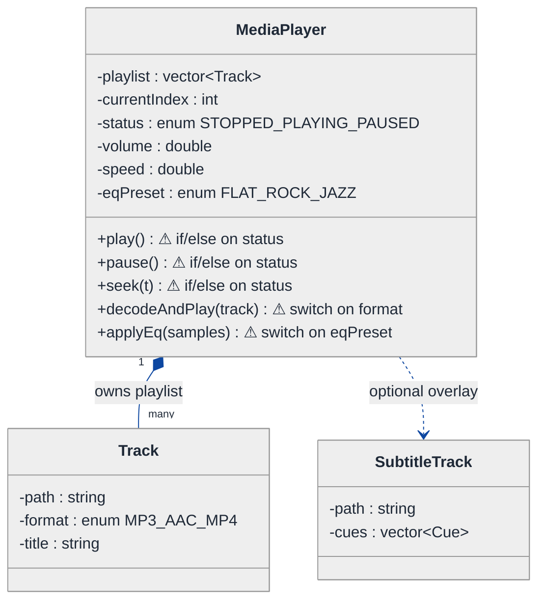
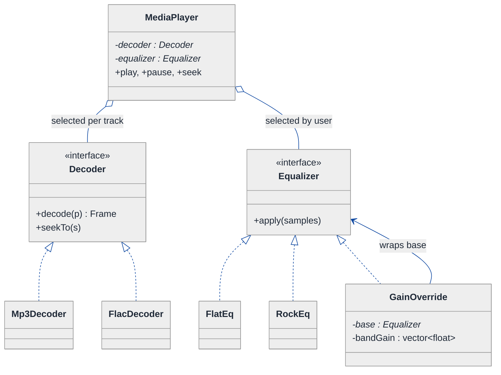
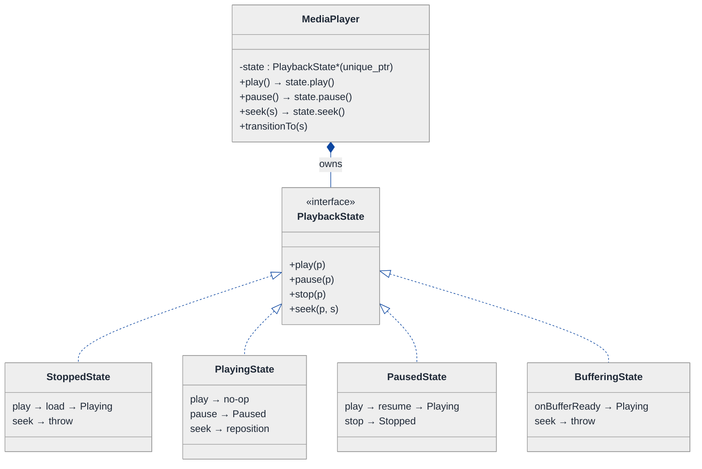
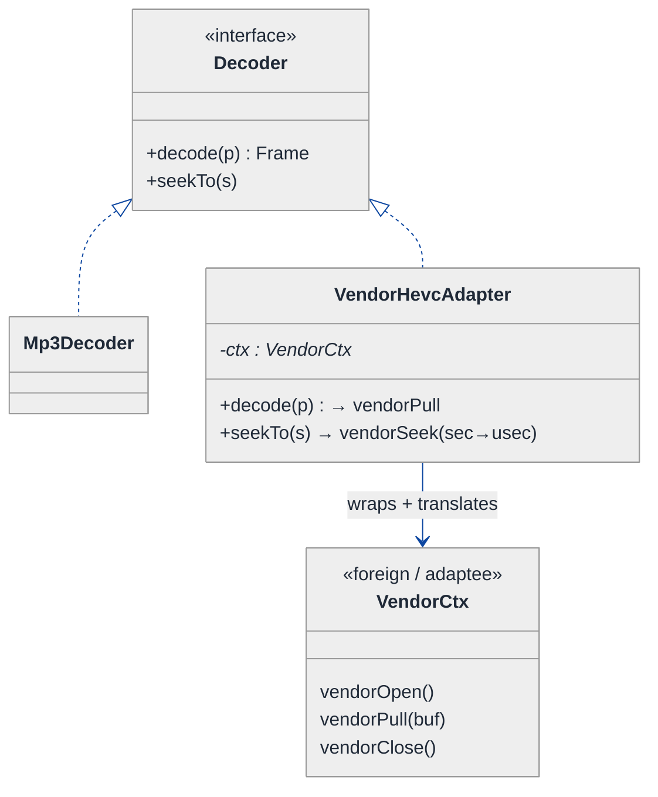
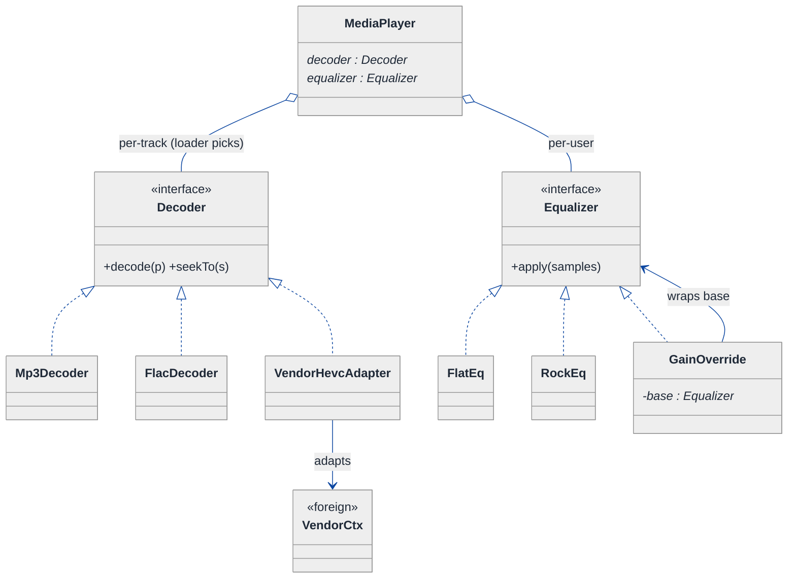
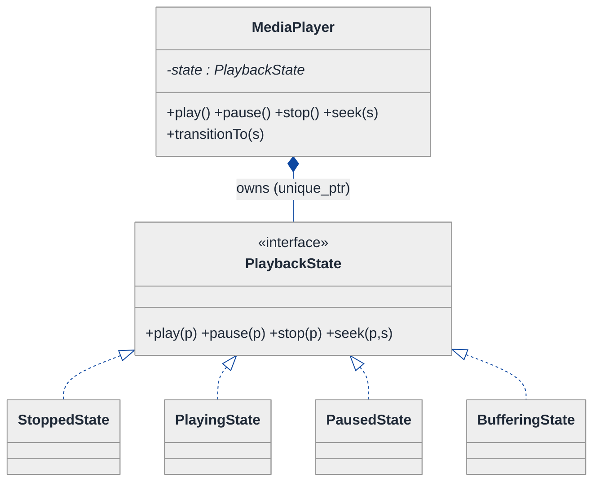
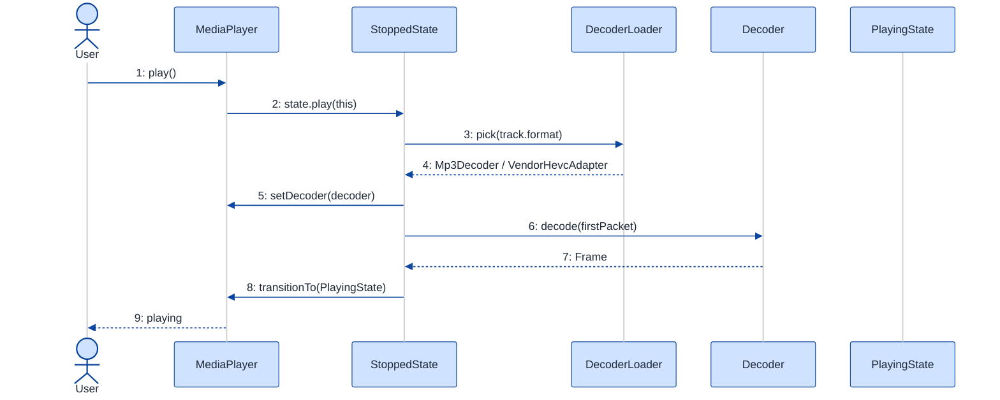
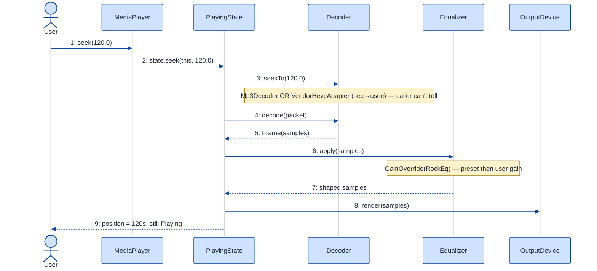

# Media Player — LLD Walkthrough

> **Difficulty:** Medium · **Time:** ~30 min · **Pattern focus:** Strategy (codecs / equalizer) + State (playback lifecycle) + Adapter (third-party decoders)
>
> **Problem source(s):** GID SG8, bucket `Strategy_Pattern`. See parent manifest [`./EXTRACTED_QUESTIONS.md`](./EXTRACTED_QUESTIONS.md).
>
> **Diagrams:** inline mermaid (renders natively in GitHub / VS Code). No external binary artifacts.

---

## How to use this file

Paced for a candidate seeing "design a media player" for the first time. Reading time: ~30 minutes if you sketch each iteration by hand. **The lesson: don't reach for design patterns up front — DERIVE them. Build the naive design first, watch it crack under four hypothetical changes, then reach for ONE pattern per painful axis.** A media player is the textbook case where Strategy, State, and Adapter all show up — and the senior bar is knowing WHICH axis each one fixes.

**Map of this file (15 sections):**

1. Problem statement + clarifying questions
2. Plain-English restatement
3. Why this matters
4. Mental model
5. Try it yourself first
6. Entity & verb extraction
7. **Iteration 1: the naive design** — what we'd write first
8. **Where the naive design hurts** — four future requirements, one painful diff each
9. **Pivot 1: Strategy for codecs / equalizer** — the most painful axis first
10. **Pivot 2: State for playback lifecycle** — internal transitions, not external swaps
11. **Pivot 3: Adapter for third-party decoders** — making a foreign API fit our interface
12. Final UML class diagram
13. Skeleton code (C++)
14. Key flow — sequence diagram
15. Extensibility re-check + anti-patterns + how to think aloud + self-check

---

## 1. Problem statement + clarifying questions

**Prompt (typical phrasing):** "Design a media player application supporting multiple audio/video formats, playlist management, playback controls (play, pause, seek, speed), equalizer settings, and subtitle handling."

**Clarifying questions to ask BEFORE drawing anything:**

1. **Which formats?** MP3 / AAC / FLAC for audio; MP4 / MKV / WebM for video — and is the list fixed, or do we onboard new ones over time?
2. **Are we WRITING the decoders, or wrapping existing libraries?** (FFmpeg, a vendor SDK, the OS codec.) This decides whether Adapter shows up at all.
3. **Playback controls scope?** Play / pause / stop / seek / playback-speed — and what should happen if I call `seek()` while stopped, or `pause()` while already paused?
4. **Equalizer model?** A fixed set of presets (Rock, Jazz, Flat), or arbitrary per-band gain the user dials in? Can presets stack with a user override?
5. **Subtitles?** External files (.srt / .vtt) only, or embedded tracks inside the container? Multiple languages selectable at runtime?
6. **Playlist semantics?** Repeat-one / repeat-all / shuffle? Does "next" wrap around?
7. **Single track at a time, or gapless / crossfade?** (Affects whether the player owns one decode pipeline or a small pool.)
8. **Threading?** Decode on a worker thread while the UI thread issues controls? (We'll note concurrency in §15, design single-threaded first.)

**Assumptions if the interviewer dodges:** an open-ended format list (new codecs arrive over time), we WRAP third-party decoders rather than write them, the standard five controls with state-dependent validity, equalizer = composable presets + user gain, external subtitle files selectable at runtime, one track playing at a time, single-threaded core.

---

## 2. Plain-English restatement

We're building the engine behind a media player: load a file, figure out how to decode it, push decoded frames to an output device, and let the user drive playback (play / pause / seek / change speed), shape the sound with an equalizer, and turn subtitles on or off. The hard part isn't any single feature — it's that **the format list, the equalizer rules, the lifecycle of "what's a legal control right now," and the source of our decoders all vary independently.** The design must let us add an MKV decoder, a new EQ preset, a "buffering" state, or a vendor SDK **without rewriting the play/pause core.**

---

## 3. Why this matters

This question is a pattern-discrimination gauntlet. A weak candidate writes one giant `MediaPlayer` class with a `switch(format)` for decoding, an `if(state)` ladder for controls, and EQ math inlined into the decode loop — it works, and it's a maintenance bomb. The skill being probed is whether you can separate the THREE different kinds of variation here: an algorithm the caller/loader selects (Strategy), a lifecycle the object drives itself (State), and a foreign API you must bend to fit your contract (Adapter). The same trio reappears in video editors, game engines, document viewers, and any "pluggable backend" system.

---

## 4. Mental model

A media player is a **pipeline with a control panel**. Bytes flow left-to-right: file → decoder → effects (equalizer) → output device, with subtitles riding alongside. The control panel (play/pause/seek/speed) doesn't touch the pipeline's *shape* — it changes the pipeline's *state*. The decoder at the front of the pipe is swappable per file; the effect in the middle is swappable per user preference; the thing producing the decoder might be ours or a vendor's.

```
Real-world sketch (NOT a UML diagram yet):

   ┌────────┐   ┌──────────┐   ┌────────────┐   ┌──────────┐
   │  File  │──▶│  Decoder │──▶│ Equalizer  │──▶│  Output  │
   │ .flac  │   │ (swap by │   │ (swap by   │   │  Device  │
   └────────┘   │  format) │   │  preset)   │   └──────────┘
                └──────────┘   └────────────┘
   subtitles ─────────────────────────────────────▲ (overlay)

        ┌───────────────── Control Panel ─────────────────┐
        │  [play] [pause] [stop] [seek ▸] [speed 1.5x]     │
        │   ↑ what's LEGAL depends on current state         │
        └───────────────────────────────────────────────────┘
```

The KEY insight from this picture: the **pipeline stages are policy** (swap them), the **control panel is lifecycle** (state decides what's legal), and **where a decoder comes from is an integration detail** (ours vs. wrapped). Three different kinds of "varies" — three different patterns.

---

## 5. Try it yourself first

> **Predict before reading on:**
>
> 1. List 5 nouns you'd promote to a class and 3 you'd leave as fields.
> 2. **If I told you the player must support a new format (Opus) next month AND a vendor's closed-source decoder the month after, would those two changes touch the same code? Should they?**
> 3. Where does the rule "you can't `seek()` while `Stopped`" live — in `MediaPlayer`, in a `seek()` method, or somewhere else?

---

## 6. Entity & verb extraction

> **Mini-refresher: noun → class, but not every noun.**
>
> Naive OOD promotes every noun to a class. Senior OOD promotes a noun only if it has both BEHAVIOR and STATE that belong together. "Volume" stays a field; "Decoder" becomes a class because it has decode behavior that varies by format.

**Nouns from the prompt:**

| Noun | Decision | Why |
|---|---|---|
| MediaPlayer | Class (top-level coordinator) | Owns playlist, current track, drives controls |
| Track / MediaFile | Class | Path + format + metadata; the unit a playlist holds |
| Decoder | Class (abstract) + concrete per format | Decode behavior varies by format — the core variability |
| Equalizer | Class (abstract) + concrete presets | EQ math varies by preset; composable |
| Playlist | Class | Ordered collection + next/prev/shuffle behavior |
| PlaybackState | Class (abstract) — emerges in §10 | "What's legal now" is lifecycle behavior |
| SubtitleTrack | Class | Timed cues; can be toggled/selected |
| OutputDevice | Class | Sink for decoded frames |
| Format | Field on Track (`enum class`) | A tag, not behavior |
| Volume / speed | Fields on MediaPlayer | Plain numbers, no behavior |

**Verbs (and the class they live on):**

| Verb | Owner class (naive answer — we'll re-examine) |
|---|---|
| play / pause / stop / seek / setSpeed | MediaPlayer |
| decode(packet) | Decoder |
| applyEqualizer(samples) | Equalizer |
| next / prev / shuffle | Playlist |
| loadSubtitles / cueAt(t) | SubtitleTrack |
| render(frame) | OutputDevice |

**We have NOT introduced any design patterns yet.** Pure nouns + verbs.

---

## 7. <a id="iter-1"></a>Iteration 1: the naive design

Let's write the simplest thing that could possibly work. No design patterns — one player class with enums and conditionals.



**Reader's tour (read top to bottom; ~60 seconds).**

1. **`MediaPlayer` is one big class.** It holds the playlist, the current index, the status enum, volume, speed, and an EQ-preset enum. Every responsibility lives here.

2. **The composition spine.** `MediaPlayer` composes a `Track[]` (the playlist) — filled diamond, same lifetime. `Track` is plain data: path, a `format` enum, a title. `SubtitleTrack` hangs off via a dependency arrow (optional).

3. **The five warning markers (⚠) — the trouble zone.**
   - `play()`, `pause()`, `seek()` each open with an `if (status == ...)` ladder to decide whether the call is even legal.
   - `decodeAndPlay()` has a `switch(format)` choosing how to decode.
   - `applyEq()` has a `switch(eqPreset)` choosing the gain curve.

   Each switch/ladder is a future-pain entry point. §8 turns each into a concrete future requirement that exposes the brittleness.

**What's deliberately missing.** No `Decoder` interface. No `Equalizer` interface. No `PlaybackState`. No `Adapter`. The naive design doesn't even acknowledge these are independent axes — it bakes a hardcoded answer for each into the one class.

Skeleton code for the naive design (C++):

```cpp
#include <stdexcept>
#include <string>
#include <vector>

enum class Format     { MP3, AAC, MP4 };
enum class Status     { STOPPED, PLAYING, PAUSED };
enum class EqPreset   { FLAT, ROCK, JAZZ };

struct Track { std::string path; Format format; std::string title; };

class MediaPlayer {
public:
    void play() {                                   // if/else ladder — will hurt
        if (status_ == Status::PLAYING) return;     // already playing, ignore
        if (status_ == Status::STOPPED)  loadAndStart();
        status_ = Status::PLAYING;                  // resume from paused falls through here
    }
    void pause() {
        if (status_ != Status::PLAYING) throw std::runtime_error("Nothing to pause");
        status_ = Status::PAUSED;
    }
    void seek(double seconds) {
        if (status_ == Status::STOPPED) throw std::runtime_error("Cannot seek while stopped");
        positionSec_ = seconds;                     // do the seek
    }

    void decodeAndPlay(const Track& t) {            // switch on format — will hurt
        switch (t.format) {
            case Format::MP3: /* libmad decode loop  */ break;
            case Format::AAC: /* faad  decode loop  */ break;
            case Format::MP4: /* demux + h264 decode */ break;
        }
    }

    void applyEq(std::vector<float>& samples) {     // switch on preset — will hurt
        switch (eqPreset_) {
            case EqPreset::FLAT: break;                      // no-op
            case EqPreset::ROCK: /* boost lows + highs */ break;
            case EqPreset::JAZZ: /* gentle mid scoop   */ break;
        }
    }
private:
    void loadAndStart() { /* open file, spin decode loop */ }
    std::vector<Track> playlist_;
    int      currentIndex_ = 0;
    Status   status_       = Status::STOPPED;
    double   volume_       = 1.0;
    double   speed_        = 1.0;
    double   positionSec_  = 0.0;
    EqPreset eqPreset_     = EqPreset::FLAT;
};
```

**This works.** It has zero design patterns. We can play, pause, seek, decode, EQ. So what's wrong with it?

---

## 8. <a id="naive-pain"></a>Where the naive design hurts

The interviewer slides four new requirements across the desk: "Here's next quarter. Walk me through what changes."

### Change A: "Support FLAC and Opus (lossless + low-latency voice)"

In the naive design:
- Add `FLAC, OPUS` to the `Format` enum.
- Add two `case` arms to `decodeAndPlay()`'s switch.
- **Every new format → surgery inside `decodeAndPlay`. The method grows without bound, and a typo in one case can break unrelated formats** (they share the same function body).

### Change B: "Custom equalizer — user dials arbitrary per-band gain, and presets must stack with a user override"

In the naive design:
- `EqPreset` enum can't express "arbitrary gain." You'd add a `std::vector<float> customGain_` field AND an `EqPreset::CUSTOM` case AND special-case "preset + override."
- **`applyEq()` becomes a tangle: switch on preset, then if-custom blend. Composition ("Rock preset, then +3dB on band 4") is impossible without nesting.**

### Change C: "Add a Buffering state for network streams; seek must pause-then-resume; double-tap play must be a no-op"

In the naive design:
- `Status` enum has no `BUFFERING`. Add it.
- Now `play()`, `pause()`, `seek()`, AND the decode loop all need new `if (status == BUFFERING)` branches.
- **The legality matrix is N states × M controls. Every new state multiplies the if-ladders across THREE methods. This is the classic enum-state explosion.**

### Change D: "Integrate a vendor's closed-source HEVC decoder whose API is `vendorOpen() / vendorPull(buf) / vendorClose()` — nothing like our decode loop"

In the naive design:
- The vendor API doesn't match the shape `decodeAndPlay` expects.
- You'd inline `vendorOpen()/vendorPull()/vendorClose()` calls directly into a new `case Format::HEVC:` arm — **mixing third-party lifecycle management into our core method, leaking the vendor's API all over `MediaPlayer`.**

### The pattern of pain

| Change | Files/methods touched | Smell |
|---|---|---|
| A. New formats | `decodeAndPlay` switch grows | "Tag-driven switch; every codec is surgery in one function." |
| B. Custom EQ | `applyEq` switch + new fields | "Single method accumulates every effect; can't compose." |
| C. Buffering state | `play` + `pause` + `seek` + decode loop | "Enum + if-ladder can't express a lifecycle; N×M explosion." |
| D. Vendor decoder | new `case` leaks vendor API into core | "Foreign API doesn't fit our shape; integration bleeds everywhere." |

**Three distinct axes of pain:** algorithm variability (codecs, EQ), lifecycle variability (playback state), and shape-mismatch with foreign code (vendor decoder).

> **Pivot question:** "What pattern handles 'an algorithm the loader/caller selects'? What pattern handles 'a lifecycle the object drives itself'? What pattern handles 'a foreign API that doesn't fit our interface'?"
>
> The answers are Strategy, State, and Adapter. Let's introduce them one at a time, starting with the most painful axis: codecs.

---

## 9. <a id="pivot-1"></a>Pivot 1: Strategy for codecs and equalizer

> **Mini-refresher: Strategy pattern.**
>
> Encapsulates an algorithm behind an interface so it can be swapped at runtime. The CALLER (or a factory/loader) decides which strategy to use; the strategy doesn't know about its peers.
>
> Quick example: a `Sorter` takes a `CompareStrategy*`. Pass `AscendingCompare` or `DescendingCompare` — the sorter doesn't care which.

**Why Strategy fits codecs.** Decoding is an algorithm: `given a packet, return decoded samples`. It varies by format (MP3, AAC, FLAC, Opus). The choice is made externally — by a loader that inspects the file header, not by the player's control logic. That's textbook Strategy. The same reasoning applies to the equalizer: `given samples, return shaped samples`, varying by preset.

**The refactor (just the affected part):**

```cpp
// Codec axis ---------------------------------------------------------
class Decoder {
public:
    virtual ~Decoder() = default;
    virtual Frame decode(const Packet& p) = 0;   // one packet -> one frame
    virtual void  seekTo(double seconds)  = 0;
};

class Mp3Decoder : public Decoder {
public:
    Frame decode(const Packet& p) override { /* libmad */ return {}; }
    void  seekTo(double s) override        { /* reposition bitstream */ }
};
class FlacDecoder : public Decoder { /* libFLAC — elided */ };
// Opus, AAC decoders elided — each is a NEW class, not a new switch arm

// Equalizer axis -----------------------------------------------------
class Equalizer {
public:
    virtual ~Equalizer() = default;
    virtual void apply(std::vector<float>& samples) const = 0;
};
class FlatEq : public Equalizer {
public:
    void apply(std::vector<float>&) const override {}     // no-op
};
class RockEq : public Equalizer {
public:
    void apply(std::vector<float>& s) const override { /* boost lows+highs */ }
};

// Decorator-style composition: a user gain layered over any base preset
class GainOverride : public Equalizer {
public:
    GainOverride(std::unique_ptr<Equalizer> base, std::vector<float> bandGain)
        : base_(std::move(base)), bandGain_(std::move(bandGain)) {}
    void apply(std::vector<float>& s) const override {
        base_->apply(s);                 // run the preset first...
        applyBandGain(s, bandGain_);     // ...then the user's per-band override
    }
private:
    std::unique_ptr<Equalizer> base_;
    std::vector<float>         bandGain_;
};

class MediaPlayer {
    std::unique_ptr<Decoder>   decoder_;    // chosen per track by a loader
    std::unique_ptr<Equalizer> equalizer_;  // chosen by user preference
    // decodeAndPlay() / applyEq() switches are GONE.
};
```

**What changed — visualized.** Just the policy slice:



**Tour of the after-state.**

1. **MediaPlayer gained two pointers.** `decoder_` and `equalizer_`, both to interfaces, both INJECTED (the loader picks the decoder from the file header; the user picks the EQ). Open diamonds (`◇`) mark aggregation — the player uses them but their concrete type is decided outside.

2. **Two independent interfaces.** `Decoder` (decode + seekTo) and `Equalizer` (apply). Note they share nothing — different inputs, different outputs. They're separate Strategy *roles*.

3. **Concrete families below each.** `Mp3Decoder`, `FlacDecoder` (Opus/AAC elided — each a new class). `FlatEq`, `RockEq`, plus `GainOverride`.

4. **`GainOverride` is a DECORATOR.** It holds a `base : Equalizer*` and runs the preset first, then layers the user's per-band gain. So `GainOverride(RockEq, [+3dB band4])` = "Rock, then nudge band 4." Composition of effects, not subclassing.

5. **The switches are GONE.** `decodeAndPlay`'s `switch(format)` and `applyEq`'s `switch(preset)` no longer exist. Adding Opus = a new `OpusDecoder` class; adding a custom EQ = compose `GainOverride`.

**Change A and Change B from §8 now land cleanly.** New format → new `Decoder` subclass. Custom EQ → compose `GainOverride` over any preset. No surgery in `MediaPlayer`.

**Pattern-discrimination cheatsheet — Strategy vs Template Method.**
- *Strategy:* the whole algorithm lives in one swappable object, chosen at runtime via composition.
- *Template Method:* the algorithm skeleton lives in a base class; subclasses fill in hooks via inheritance.
- *Rule of thumb:* variants that get combined or swapped at runtime → Strategy. A fixed skeleton with 2-3 stable variants → Template Method.

We chose Strategy because EQ effects COMPOSE (preset × user-override × room-correction), and you can't compose Template Method subclasses.

---

## 10. <a id="pivot-2"></a>Pivot 2: State for the playback lifecycle

Change C from §8 is still painful — `BUFFERING`, the N×M legality matrix, "double-tap play is a no-op." Strategy doesn't help: the variability isn't in an *algorithm*, it's in WHAT'S LEGAL NEXT.

> **Mini-refresher: State pattern.**
>
> Each lifecycle state is its own class. The context object delegates each operation to its current state, and THE STATE decides what the next state is. Transitions are INTERNAL, driven by the events the context receives — not chosen by the caller.

**Why State (not Strategy).** The current playback state isn't picked by the caller — it's a consequence of what the player has been through. A `Stopped` player that gets `play()` starts decoding and becomes `Playing`. A `Playing` player that gets `pause()` becomes `Paused`. Calling `pause()` on a `Stopped` player is meaningless and should be rejected. **That legality is the player's concern, not the caller's** — and the caller shouldn't have to know the matrix.

**The refactor (just the lifecycle part):**

```cpp
class MediaPlayer;  // forward

class PlaybackState {
public:
    virtual ~PlaybackState() = default;
    virtual void play(MediaPlayer& p)            = 0;
    virtual void pause(MediaPlayer& p)           = 0;
    virtual void stop(MediaPlayer& p)            = 0;
    virtual void seek(MediaPlayer& p, double s)  = 0;
};

class StoppedState : public PlaybackState {
public:
    void play(MediaPlayer& p) override;                              // -> Playing (loads track)
    void pause(MediaPlayer&) override { /* no-op: nothing to pause */ }
    void stop(MediaPlayer&)  override { /* no-op: already stopped */ }
    void seek(MediaPlayer&, double) override { throw std::runtime_error("Cannot seek while stopped"); }
};

class PlayingState : public PlaybackState {
public:
    void play(MediaPlayer&) override  { /* no-op: already playing (double-tap) */ }
    void pause(MediaPlayer& p) override;                            // -> Paused
    void stop(MediaPlayer& p)  override;                           // -> Stopped
    void seek(MediaPlayer& p, double s) override;                  // reposition, stay Playing
};

class PausedState : public PlaybackState {
public:
    void play(MediaPlayer& p) override;                            // -> Playing (resume)
    void pause(MediaPlayer&) override { /* no-op */ }
    void stop(MediaPlayer& p)  override;                           // -> Stopped
    void seek(MediaPlayer& p, double s) override;                  // reposition, stay Paused
};

class BufferingState : public PlaybackState {
public:
    void play(MediaPlayer&) override  { /* no-op: wait for buffer */ }
    void pause(MediaPlayer& p) override;                           // -> Paused (cancel buffering)
    void stop(MediaPlayer& p)  override;                           // -> Stopped
    void seek(MediaPlayer&, double) override { throw std::runtime_error("Cannot seek while buffering"); }
    void onBufferReady(MediaPlayer& p);                            // -> Playing
};

class MediaPlayer {
public:
    void transitionTo(std::unique_ptr<PlaybackState> s) { state_ = std::move(s); }
    void play()            { state_->play(*this); }
    void pause()           { state_->pause(*this); }
    void stop()            { state_->stop(*this); }
    void seek(double sec)  { state_->seek(*this, sec); }
    // ... decoder()/equalizer() accessors, position, etc. ...
private:
    std::unique_ptr<PlaybackState> state_ = std::make_unique<StoppedState>();
};
```

**What changed — visualized.** Just the lifecycle slice:



**Tour of the after-state.**

1. **The `Status` enum is gone.** Replaced by a `state` field of type `PlaybackState*` (specifically `std::unique_ptr<PlaybackState>` — exclusive ownership).

2. **`play()`, `pause()`, `seek()` became one-liners.** Each delegates to the current state: `state_->play(*this)`. **No `if (status == X)` ladder anywhere.**

3. **The interface declares the contract.** `PlaybackState` has four pure-virtual operations. Each concrete state must answer all four — even if the answer is "no-op" (double-tap play on `PlayingState`) or "throw" (seek on `StoppedState`).

4. **Four concrete states, each owning its rules.**
   - `StoppedState::play` loads the track and transitions to `Playing`; `seek` throws.
   - `PlayingState::play` is a no-op (the double-tap requirement); `pause` → `Paused`; `seek` repositions and stays `Playing`.
   - `PausedState::play` resumes → `Playing`; `stop` → `Stopped`.
   - `BufferingState` rejects seek; `onBufferReady` transitions to `Playing`.

5. **Transitions live WITH the state.** Each state's method calls `p.transitionTo(...)` when its work is done — not `MediaPlayer`, not the caller. That's the whole point: each state knows what comes next.

**Adding `BufferingState` was ONE new class.** Change C from §8 — the buffering state plus its legality rules — is a single class. No edits to `StoppedState`, `PlayingState`, `PausedState`, or `MediaPlayer`'s delegating one-liners. Open/closed.

**Pattern-discrimination cheatsheet — Strategy vs State.**
- *Strategy:* the CALLER (or loader) picks which one to use; strategies are usually unaware of each other.
- *State:* the OBJECT picks its next state internally; states know about each other (each can `transitionTo` another).
- *Rule of thumb:* if `player.setDecoder(x)` is called externally → Strategy. If `player.play()` flips the internal state → State.

The decoder is Strategy (the loader sets it). The playback phase is State (the player flips it). Same player, two different kinds of "varies."

---

## 11. <a id="pivot-3"></a>Pivot 3: Adapter for third-party decoders

Changes A, B, C are solved. Change D — the vendor HEVC decoder with `vendorOpen()/vendorPull(buf)/vendorClose()` — is not. We can't subclass `Decoder` and call vendor functions inline; that leaks the vendor's lifecycle into our codebase, and the vendor's method names don't match our `decode(Packet)` / `seekTo(double)` contract.

> **Mini-refresher: Adapter pattern.**
>
> Wraps an object with an INCOMPATIBLE interface so it conforms to the interface your code expects. The adapter holds the foreign object (the *adaptee*), implements YOUR interface, and translates each call into one or more foreign calls. It changes the *shape* of an API without changing its behavior.

**Why Adapter (not "just add a Decoder subclass").** A plain `HevcDecoder : Decoder` would still have to *contain* the vendor handle and translate calls — which is exactly what an Adapter is. Naming it for what it does keeps the intent obvious and isolates ALL vendor knowledge in one class. If the vendor ships a v2 API, only the adapter changes.

**The refactor (just the integration slice):**

```cpp
// --- The foreign API we do NOT control (the adaptee) ---
struct VendorCtx;
extern "C" {
    VendorCtx* vendorOpen(const char* path);
    int        vendorPull(VendorCtx*, uint8_t* buf, int cap);  // bytes, or -1 on EOF
    void       vendorSeek(VendorCtx*, long long usec);
    void       vendorClose(VendorCtx*);
}

// --- The adapter: implements OUR Decoder, wraps THEIR handle ---
class VendorHevcAdapter : public Decoder {
public:
    explicit VendorHevcAdapter(const std::string& path)
        : ctx_(vendorOpen(path.c_str())) {
        if (!ctx_) throw std::runtime_error("vendor open failed");
    }
    ~VendorHevcAdapter() override { vendorClose(ctx_); }  // RAII over the foreign handle

    Frame decode(const Packet& /*p*/) override {
        uint8_t buf[4096];
        int n = vendorPull(ctx_, buf, sizeof buf);        // translate: pull -> Frame
        if (n < 0) return Frame::eof();
        return Frame::fromRaw(buf, n);
    }
    void seekTo(double seconds) override {
        vendorSeek(ctx_, static_cast<long long>(seconds * 1'000'000));  // sec -> usec
    }
private:
    VendorCtx* ctx_;   // the adaptee; owned, freed in dtor
};
// To the rest of the system this is just another Decoder. No vendor symbol
// appears anywhere outside this class.
```

**What changed — visualized.** Just the adapter slice:



**Tour of the after-state.**

1. **`VendorHevcAdapter` implements OUR `Decoder` interface** — so to `MediaPlayer` it's indistinguishable from `Mp3Decoder`. The player never learns a vendor exists.

2. **It HOLDS the foreign `VendorCtx*` (the adaptee).** Solid arrow with "wraps + translates." The adapter owns the handle and frees it in its destructor (RAII) — the vendor's manual `open/close` lifecycle is contained in one class.

3. **Each method TRANSLATES.** `decode(Packet)` calls `vendorPull`; `seekTo(seconds)` converts seconds → microseconds and calls `vendorSeek`. Shape-matching, not behavior-changing.

4. **Vendor symbols appear in exactly ONE file.** If the vendor ships a v2 API, only `VendorHevcAdapter` changes. Change D from §8 is now isolated, not smeared across `MediaPlayer`.

**Pattern-discrimination cheatsheet — Adapter vs Decorator vs Facade.**
- *Adapter:* changes an interface so incompatible code fits. Same behavior, different shape. (Vendor decoder → our `Decoder`.)
- *Decorator:* keeps the SAME interface but adds behavior. (`GainOverride` is an `Equalizer` that adds gain.)
- *Facade:* a NEW simplified interface over a complex subsystem. (A `Player::open(path)` that hides demux + decode + device setup.)
- *Rule of thumb:* "make it fit" → Adapter. "add to it, same type" → Decorator. "hide the mess behind one door" → Facade.

> **Mini-refresher: why three Strategy/Adapter hierarchies don't share one base.**
>
> `Decoder`, `Equalizer`, and `PlaybackState` are different *roles*, not one type. They take different inputs and return different outputs. Don't unify them under a `Strategy<T>` template — that's premature genericism that buys nothing.

---

## 12. <a id="fig-class-diagram"></a>Final class diagram

One mega-diagram would be a wall of boxes. Here are **three focused sub-views**, then a structural insight that ties them together.

### 12.1 The ownership spine — what the player OWNS

```mermaid
---
config:
  theme: neutral
  themeVariables:
    background: '#ffffff'
    primaryColor: '#cfe2ff'
    primaryTextColor: '#1f2937'
    primaryBorderColor: '#084298'
    secondaryColor: '#fff3cd'
    secondaryTextColor: '#1f2937'
    secondaryBorderColor: '#664d03'
    tertiaryColor: '#d1e7dd'
    tertiaryTextColor: '#1f2937'
    tertiaryBorderColor: '#0a3622'
    lineColor: '#0d47a1'
    textColor: '#1f2937'
    noteBkgColor: '#fff3cd'
    noteTextColor: '#1f2937'
    noteBorderColor: '#997404'
    actorBkg: '#cfe2ff'
    actorBorder: '#084298'
    actorTextColor: '#1f2937'
    signalColor: '#0d47a1'
    signalTextColor: '#1f2937'
    labelBoxBkgColor: '#ffffff'
    labelBoxBorderColor: '#d3d3d3'
    labelTextColor: '#1f2937'
    edgeLabelBackground: '#ffffff'
    labelBackground: '#ffffff'
    classText: '#1f2937'
    fontFamily: 'system-ui, -apple-system, Segoe UI, Helvetica, Arial, sans-serif'
  themeCSS: |
    .messageText, .labelText, .sequenceNumber {
      paint-order: stroke fill;
      stroke: #ffffff;
      stroke-width: 5px;
      stroke-linejoin: round;
      stroke-linecap: round;
    }
    .edgePath path,
    .flowchart-link,
    .messageLine0,
    .messageLine1,
    .relation,
    .composition,
    .aggregation,
    .extension,
    .dependency {
      stroke-width: 2.5px !important;
    }
    marker path {
      stroke-width: 1.5px !important;
    }
---
classDiagram
  direction TB
  class MediaPlayer {
    volume : double
    speed : double
    (root coordinator)
  }
  class Playlist {
    tracks : vector~Track~
    cursor : int
    +next() +prev() +shuffle()
  }
  class Track {
    path : string
    format : Format
    title : string
  }
  class SubtitleTrack {
    lang : string
    cues : vector~Cue~
    +cueAt(t)
  }
  MediaPlayer "1" *-- "1" Playlist : composes
  Playlist "1" *-- "many" Track : composes
  MediaPlayer "1" o-- "0..1" SubtitleTrack : optional, selectable
```

**Tour of 12.1.** The player composes one `Playlist`; the playlist composes its `Track[]` — filled diamonds, shared lifetime. `SubtitleTrack` hangs off the player by AGGREGATION (open diamond, `0..1`) because subtitles are optional and selected at runtime — the player uses one but doesn't define its existence. Volume/speed stay as plain fields. This inventory barely changed from the naive design; what changed is everything we ADDED elsewhere — see 12.2 and 12.3.

### 12.2 The policy injection — the Strategy + Adapter axes



**Tour of 12.2.**

1. **One MediaPlayer, two injected Strategy interfaces** (`Decoder`, `Equalizer`). Open diamonds (`◇`) = aggregation: the player uses them; their concrete type is decided outside.

2. **The Decoder family mixes Strategy AND Adapter.** `Mp3Decoder`/`FlacDecoder` are native Strategy implementations. `VendorHevcAdapter` is ALSO a `Decoder` — but it adapts the foreign `VendorCtx`. From the player's seat, all three are identical. **Adapter is "a Strategy implementation that happens to wrap a foreign object."**

3. **The Equalizer family uses the Decorator twist.** `GainOverride` wraps a `base : Equalizer*`, so presets and user gain stack.

4. **Structural insight here.** The two switches the naive `MediaPlayer` carried (format, preset) are lifted into type hierarchies. The player's core becomes orchestration; the variation becomes hot-swappable policy.

### 12.3 The lifecycle — the State axis



**Tour of 12.3.** MediaPlayer OWNS one `PlaybackState` via `unique_ptr` (filled diamond). The four control methods are one-liners that delegate to the current state. Each state validates what's legal — no enum, no scattered `if`. `BufferingState` is the change-C newcomer; `StoppedState` is the start state. Adding a future state (e.g., `SeekingState` for async seeks) is one more class.

### Structural insight (ties 12.1 + 12.2 + 12.3 together)

| Concern | Pattern used | Why |
|---|---|---|
| **Inventory** (Playlist, Track, Subtitle) | Plain ownership + minimal data | Tracks are data; the playlist's next/prev is the only behavior |
| **Decode + Effects** (codecs, EQ) | Strategy, INJECTED | The loader/user picks the variant; effects compose via Decorator |
| **Foreign decoder** (vendor SDK) | Adapter (a Strategy impl wrapping a foreign API) | Make an incompatible API fit our `Decoder` contract; isolate vendor symbols |
| **Lifecycle** (Stopped→Playing→Paused→Buffering) | State, OWNED by MediaPlayer | The player drives transitions; states validate what's legal next |

The big lesson: **inheritance appears only inside the Strategy/State/Adapter class families** — every "varies independently" axis became composition over an interface. *Inheritance for the polymorphic role, composition for the variation.* That separation is what makes the player extensible.

---

## 13. Skeleton code (C++)

> Show the SHAPES, not the full impl. ~130 lines.

```cpp
#include <chrono>
#include <cstdint>
#include <memory>
#include <stdexcept>
#include <string>
#include <vector>

// ── Forward declarations ────────────────────────────────────────────
class MediaPlayer;

// ── Plain data ──────────────────────────────────────────────────────
enum class Format { MP3, AAC, FLAC, OPUS, MP4, HEVC };
struct Packet { /* compressed bytes */ };
struct Frame  { std::vector<float> samples; bool eofFlag = false;
                static Frame eof() { return {{}, true}; }
                static Frame fromRaw(const uint8_t*, int) { return {}; } };
struct Cue    { double startSec; double endSec; std::string text; };
struct Track  { std::string path; Format format; std::string title; };

// ── Strategy axis #1: Decoder (codecs) ──────────────────────────────
class Decoder {
public:
    virtual ~Decoder() = default;
    virtual Frame decode(const Packet& p) = 0;
    virtual void  seekTo(double seconds)  = 0;
};
class Mp3Decoder : public Decoder {
public:
    Frame decode(const Packet&) override { /* libmad */ return {}; }
    void  seekTo(double) override        { /* reposition */ }
};
// FlacDecoder, OpusDecoder, AacDecoder elided — each a NEW class

// ── Adapter: wrap a foreign decoder behind our Decoder interface ─────
struct VendorCtx;
extern "C" {
    VendorCtx* vendorOpen(const char*);
    int        vendorPull(VendorCtx*, uint8_t*, int);
    void       vendorSeek(VendorCtx*, long long);
    void       vendorClose(VendorCtx*);
}
class VendorHevcAdapter : public Decoder {
public:
    explicit VendorHevcAdapter(const std::string& path)
        : ctx_(vendorOpen(path.c_str())) {
        if (!ctx_) throw std::runtime_error("vendor open failed");
    }
    ~VendorHevcAdapter() override { vendorClose(ctx_); }
    Frame decode(const Packet&) override {
        uint8_t buf[4096];
        int n = vendorPull(ctx_, buf, sizeof buf);
        return n < 0 ? Frame::eof() : Frame::fromRaw(buf, n);
    }
    void seekTo(double s) override {
        vendorSeek(ctx_, static_cast<long long>(s * 1'000'000));
    }
private:
    VendorCtx* ctx_;
};

// ── Strategy axis #2: Equalizer (effects) + Decorator ───────────────
class Equalizer {
public:
    virtual ~Equalizer() = default;
    virtual void apply(std::vector<float>& samples) const = 0;
};
class FlatEq : public Equalizer {
public:
    void apply(std::vector<float>&) const override {}
};
// RockEq, JazzEq elided
class GainOverride : public Equalizer {     // decorator: preset, then user gain
public:
    GainOverride(std::unique_ptr<Equalizer> base, std::vector<float> gain)
        : base_(std::move(base)), gain_(std::move(gain)) {}
    void apply(std::vector<float>& s) const override {
        base_->apply(s);
        /* apply per-band gain_ */
    }
private:
    std::unique_ptr<Equalizer> base_;
    std::vector<float>         gain_;
};

// ── State axis: playback lifecycle ──────────────────────────────────
class PlaybackState {
public:
    virtual ~PlaybackState() = default;
    virtual void play(MediaPlayer&)            = 0;
    virtual void pause(MediaPlayer&)           = 0;
    virtual void stop(MediaPlayer&)            = 0;
    virtual void seek(MediaPlayer&, double)    = 0;
};
class StoppedState : public PlaybackState {
public:
    void play(MediaPlayer& p) override;                               // -> Playing
    void pause(MediaPlayer&) override {}                              // no-op
    void stop(MediaPlayer&)  override {}                              // no-op
    void seek(MediaPlayer&, double) override { throw std::runtime_error("Cannot seek while stopped"); }
};
// PlayingState, PausedState, BufferingState elided — same shape (see §10)

// ── Playlist ────────────────────────────────────────────────────────
class Playlist {
public:
    const Track& current() const { return tracks_.at(cursor_); }
    void next()    { if (cursor_ + 1 < (int)tracks_.size()) ++cursor_; }
    void prev()    { if (cursor_ > 0) --cursor_; }
    void shuffle() { /* Fisher-Yates */ }
private:
    std::vector<Track> tracks_;
    int                cursor_ = 0;
};

// ── SubtitleTrack ───────────────────────────────────────────────────
class SubtitleTrack {
public:
    const std::string* cueAt(double t) const { /* binary search cues_ */ return nullptr; }
private:
    std::string      lang_;
    std::vector<Cue> cues_;
};

// ── MediaPlayer (orchestrator) ──────────────────────────────────────
class MediaPlayer {
public:
    MediaPlayer(Playlist pl, std::unique_ptr<Equalizer> eq)
        : playlist_(std::move(pl)), equalizer_(std::move(eq)),
          state_(std::make_unique<StoppedState>()) {}

    // Control surface — pure delegation to the current state (State pattern):
    void play()           { state_->play(*this); }
    void pause()          { state_->pause(*this); }
    void stop()           { state_->stop(*this); }
    void seek(double sec) { state_->seek(*this, sec); }
    void transitionTo(std::unique_ptr<PlaybackState> s) { state_ = std::move(s); }

    void setDecoder(std::unique_ptr<Decoder> d)   { decoder_ = std::move(d); }   // loader injects
    void setEqualizer(std::unique_ptr<Equalizer> e){ equalizer_ = std::move(e); } // user injects

    Decoder&   decoder()   { return *decoder_; }
    Equalizer& equalizer() { return *equalizer_; }
    Playlist&  playlist()  { return playlist_; }
    void       setSpeed(double s) { speed_ = s; }

private:
    Playlist                       playlist_;
    std::unique_ptr<Decoder>       decoder_;     // Strategy / Adapter (per track)
    std::unique_ptr<Equalizer>     equalizer_;   // Strategy + Decorator (per user)
    std::unique_ptr<PlaybackState> state_;       // State (lifecycle)
    SubtitleTrack*                 subtitle_ = nullptr;   // optional, selectable
    double                         volume_ = 1.0;
    double                         speed_  = 1.0;
};

// State transition impl (deferred until MediaPlayer is complete):
inline void StoppedState::play(MediaPlayer& p) {
    // open p.playlist().current(), choose decoder via loader, start decode loop
    p.transitionTo(std::make_unique<class PlayingStateStub>());  // -> Playing in real code
}
```

---

## 14. <a id="fig-sequence"></a>Key flow — sequence diagram

Read across the swimlanes to see how the three patterns COOPERATE.

### Phase 1 — load + play



**Tour of Phase 1 (load + play).**

1. **User calls `play()` on the player.** The player itself holds no `if (status)` ladder — it just forwards.

2. **Player delegates to its current state** (`StoppedState::play`). This is the State-pattern moment: the player doesn't decide what "play" means; the state does.

3. **`StoppedState` asks a loader to pick a `Decoder` for the track's format.** The loader returns `Mp3Decoder` for MP3 OR `VendorHevcAdapter` for HEVC — **the state doesn't care which; both are `Decoder`.** Strategy + Adapter, invisible from here.

4. **The chosen decoder is injected into the player** and decodes the first packet. The decode algorithm is fully encapsulated.

5. **`StoppedState` transitions the player to `PlayingState`.** The transition lives in the state, not in the player or the caller.

### Phase 2 — seek while playing, with EQ on the output path



**Tour of Phase 2 (seek + EQ). Read slowly — all three patterns cooperate.**

1. **User seeks to 120s.** Player forwards to the current state.

2. **`PlayingState::seek` runs** — because we're Playing, seek is legal and stays in Playing. (Had we been `StoppedState`, step 2 would have thrown. No `if` ladder decides this — the state class does.)

3. **State calls `decoder_->seekTo(120.0)`.** Whether it's an `Mp3Decoder` repositioning a bitstream or the `VendorHevcAdapter` converting 120s → 120,000,000 µs and calling `vendorSeek`, **the caller can't tell.** Adapter hides the foreign API.

4. **Decode the next packet → a `Frame` of samples.** Strategy hides the codec.

5. **Samples flow through `equalizer_->apply()`.** If the user composed `GainOverride(RockEq, ...)`, the Rock preset runs, then the per-band gain. Decorator hides the stacking.

6. **Shaped samples go to the output device; position updates; still Playing.**

### The validation that's NOT shown — and why it matters

You don't see `if (status == PLAYING)` anywhere. That's the point of the State pattern: **invalid operations are made impossible by polymorphism**, not by runtime checks scattered through the code. Call `seek()` while `Stopped` and the call lands in `StoppedState::seek`, a one-line throw. **The class hierarchy IS the validation.** And you don't see `switch(format)` or `switch(preset)` either — Strategy and Adapter dispatch those.

---

## 15. Extensibility re-check + anti-patterns + how to think aloud + self-check

### Extensibility re-check

Revisit the four changes from [§8](#naive-pain). For each, name the SINGLE thing that changes.

| Change | Naive design impact | Final design impact |
|---|---|---|
| A. New formats (Opus) | `decodeAndPlay` switch grows | New `OpusDecoder : Decoder` class. Done. |
| B. Custom EQ | `applyEq` switch + new fields | Compose `GainOverride` over any preset. Done. |
| C. Buffering state | `play` + `pause` + `seek` + decode loop | New `BufferingState : PlaybackState` class. Done. |
| D. Vendor decoder | `case` leaks vendor API into core | New `VendorHevcAdapter : Decoder`; vendor symbols isolated. Done. |

Every change is exactly ONE new class (or one composition). That's the open/closed principle in practice.

> **Mini-refresher: Open/Closed Principle (the "O" in SOLID).**
>
> Software should be OPEN for extension but CLOSED for modification. You add new behavior by adding new code (a new subclass), not by editing existing, tested code. Strategy/State/Adapter are the mechanical realizations of this principle.

If a future requirement forces you to change `Decoder`, `Equalizer`, AND `PlaybackState` together — go back to §6 and re-identify variability axes; you missed one.

### Common confusion + traps

1. **"Decoder is Strategy but vendor decoder is Adapter — aren't those the same?"** The Adapter IS a Strategy implementation. The distinction is intent: a native decoder implements `Decoder` directly; the adapter implements `Decoder` by *translating* a foreign API. Name it Adapter to flag where the integration risk lives.

2. **"Why not enum + switch for playback state?"** Works for 3 states. Falls apart at 5+ (Buffering, Seeking, Ended): the N states × M controls legality matrix becomes if-ladders smeared across every control method.

3. **"Should the player own the OutputDevice?"** Yes by composition if there's exactly one sink, or inject it (aggregation) if it's swappable (speakers vs. Bluetooth vs. file render) — same Strategy reasoning as the decoder.

4. **"Why is the Equalizer chosen by the user but the Decoder chosen by a loader?"** Different actors decide. EQ is user preference; the decoder is dictated by the file's format. Both are Strategy — what differs is *who* injects.

5. **"`unique_ptr` everywhere — why not `shared_ptr`?"** Each axis is exclusively owned: the player owns its state, its decoder, its equalizer. Share only if a strategy were genuinely used by multiple players at once. It isn't, so `unique_ptr` is correct.

### Anti-patterns

- **"God class MediaPlayer"** — every responsibility in one class. Pull each axis into a collaborator.
- **"Tag-driven switch"** — `switch(format)` / `switch(preset)`. Use the Strategy interface; let polymorphism dispatch.
- **"Enum-state explosion"** — `if (status == BUFFERING)` branches multiplying across methods. Use the State pattern.
- **"Vendor API bleed"** — calling `vendorOpen/vendorPull` from anywhere but one Adapter. Quarantine third-party symbols.
- **"Decorator masquerading as inheritance"** — `RockEqWithUserGain : RockEq`. Compose `GainOverride` instead so any preset can take a gain layer.
- **"Anemic state classes"** — states that only set a flag. The transition logic must live IN the state.

### How to think aloud

> "Media player. Let me clarify scope. [Asks questions from §1 — format list open or fixed? Do we write decoders or wrap them? What should seek-while-stopped do?] Got it.
>
> Nouns: MediaPlayer, Track, Decoder, Equalizer, Playlist, SubtitleTrack, OutputDevice. I'll write the NAIVE design first — one MediaPlayer with a `switch(format)` to decode, a `switch(preset)` for EQ, and an `if (status)` ladder for controls.
>
> Now stress-test it. New format → grows the decode switch. Custom EQ → the preset switch can't compose. Buffering state → the if-ladder explodes across three methods. Vendor decoder → its API doesn't fit and leaks everywhere.
>
> Three axes: algorithm variation (codecs, EQ), lifecycle (playback state), foreign-API mismatch (vendor). Strategy, State, Adapter.
>
> Pivot 1: Decoder and Equalizer become Strategy interfaces; new format = new subclass; custom EQ = a GainOverride decorator. Pivot 2: playback becomes a State machine — StoppedState, PlayingState, PausedState, BufferingState — each validating its own legal operations. Pivot 3: the vendor decoder becomes a VendorHevcAdapter implementing our Decoder, isolating their API.
>
> Final: MediaPlayer composes a Playlist, aggregates a Decoder and an Equalizer, owns a PlaybackState. All four future requirements land as one new class each. Open/closed."

### Self-check

> **Self-check — the question to ask next time.**
>
> When you see "design a [player/engine] supporting multiple [formats/effects/states]," before reaching for a `switch` or an enum, ask three questions in order:
>
> > **1. "Is this an algorithm someone OUTSIDE picks?"** → Strategy.
> > **2. "Is this a lifecycle the object drives ITSELF?"** → State.
> > **3. "Is this a foreign API that doesn't fit my interface?"** → Adapter.
>
> Most rich systems have all three. Map each axis to its pattern and the class diagram falls out for free.

---

## Cross-references

- **Parent topic manifest:** [`./EXTRACTED_QUESTIONS.md`](./EXTRACTED_QUESTIONS.md)
- **Vertical overview:** [`../../LEARNING.md`](../../LEARNING.md)
- **Template:** [`../../TEMPLATE-v2.md`](../../TEMPLATE-v2.md)
- **Canonical exemplar:** [`../Object_Oriented_Design/Parking_Lot.md`](../Object_Oriented_Design/Parking_Lot.md) — Strategy + State, the gold standard for this format
- **Related v2 walkthroughs (current / future):**
  - State Pattern deep-dive (in `../State_Pattern/`) — order/document workflows, the State-vs-Strategy boundary
  - Other Strategy_Pattern walkthroughs (in this folder) — payment processing, sort strategy
- **Further reading:**
  - <a href="https://refactoring.guru/design-patterns/strategy" target="_blank" rel="noopener noreferrer">Strategy pattern (Refactoring Guru)</a>
  - <a href="https://refactoring.guru/design-patterns/state" target="_blank" rel="noopener noreferrer">State pattern (Refactoring Guru)</a>
  - <a href="https://refactoring.guru/design-patterns/adapter" target="_blank" rel="noopener noreferrer">Adapter pattern (Refactoring Guru)</a>
