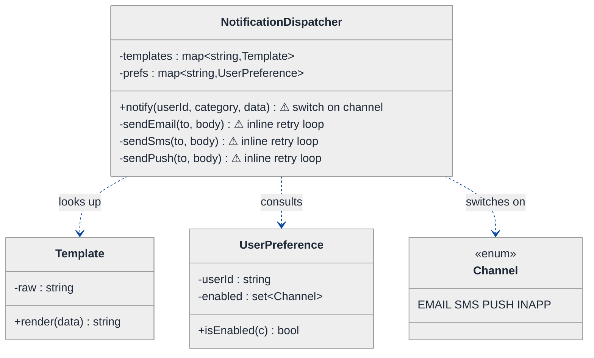
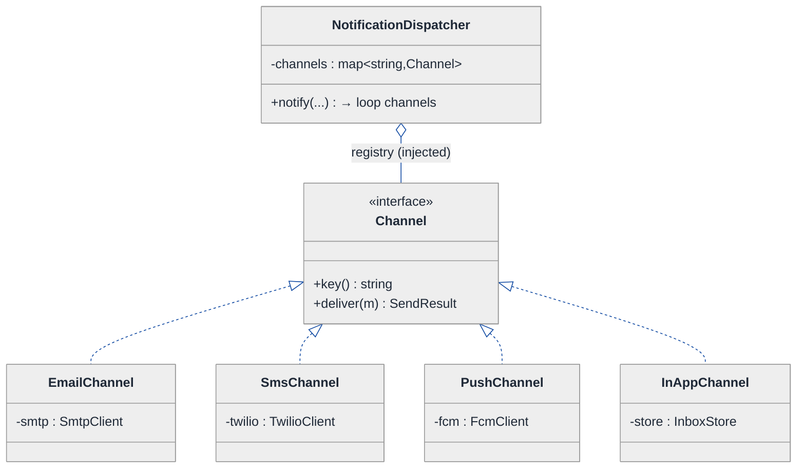
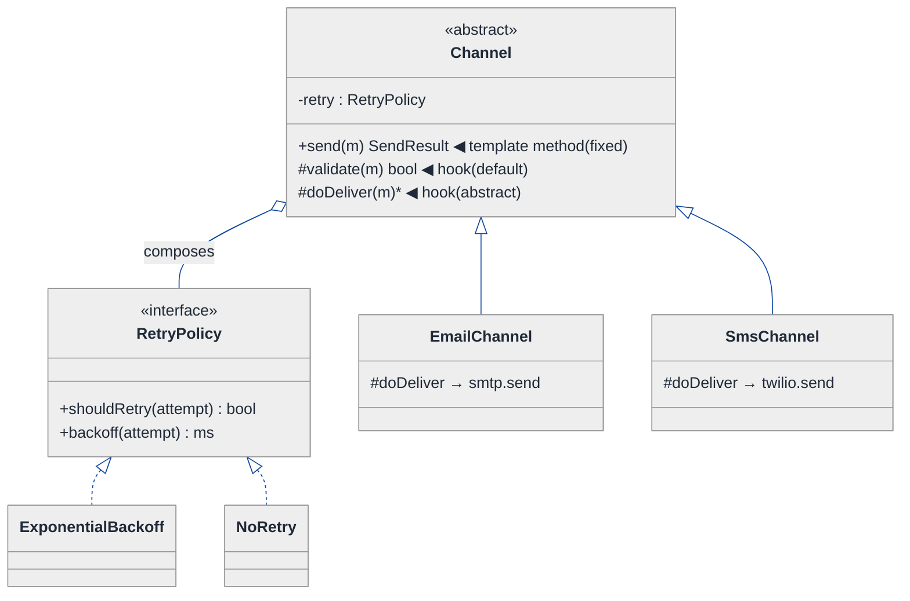
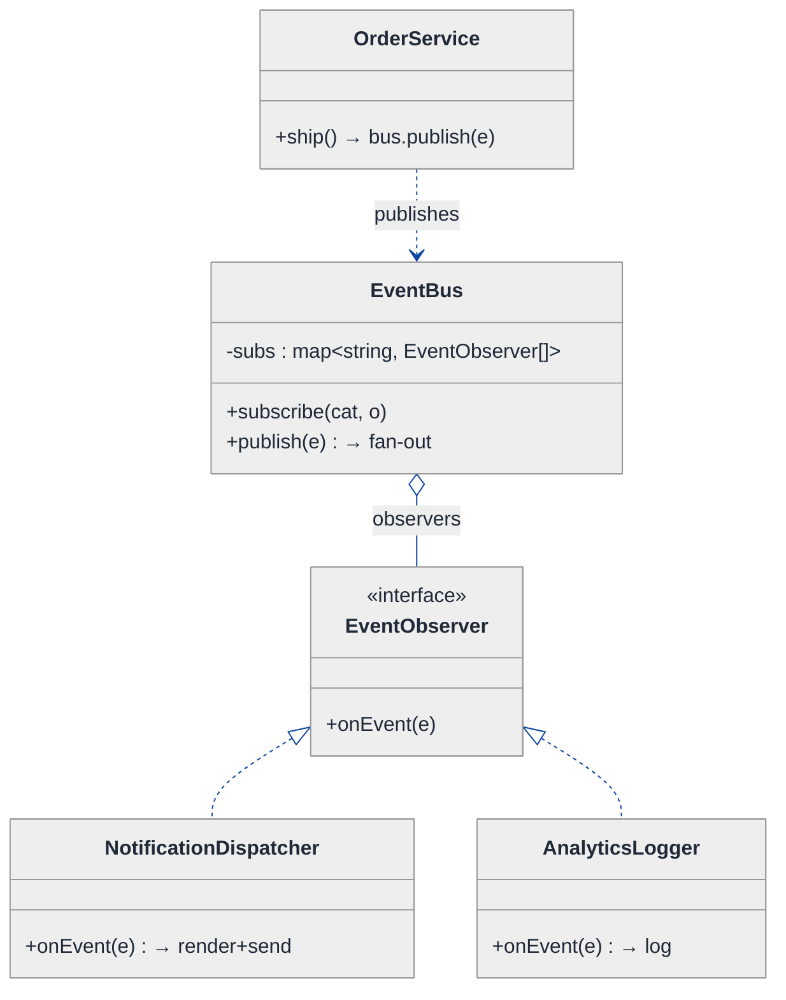
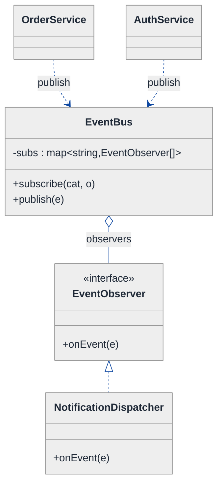
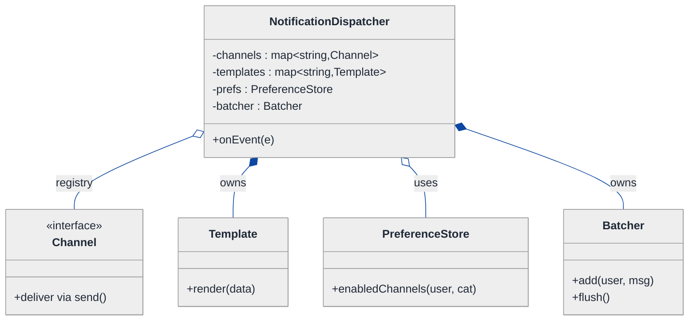
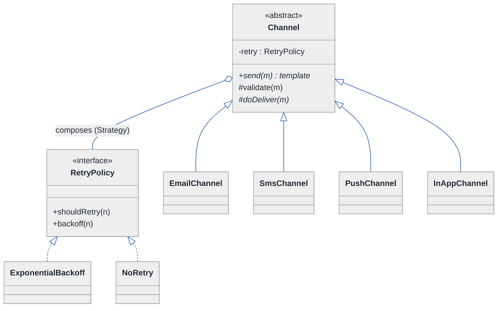
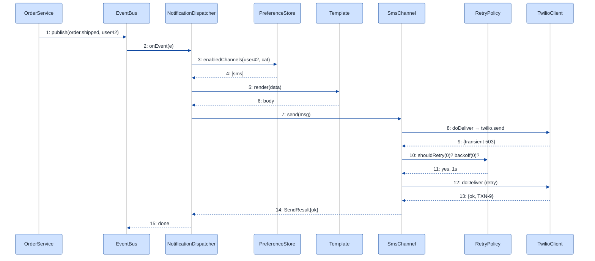

# Notification Service — LLD Walkthrough

> **Difficulty:** Medium · **Time:** ~35 min · **Pattern focus:** Strategy (channels) + Observer (event → delivery fan-out) + Template Method (the per-channel send pipeline)
>
> **Problem source(s):** GID SG1 in [`./EXTRACTED_QUESTIONS.md`](./EXTRACTED_QUESTIONS.md), bucket `Strategy_Pattern`. A staple of "design a notification / pub-sub system" interviews.
>
> **Diagrams:** inline mermaid (renders natively in GitHub / VS Code). Optional editable freehand sources are sibling `.excalidraw` files.

---

## How to use this file

Paced for a candidate who has not built a notification service before. Reading time: ~35 minutes if you sketch each iteration by hand. **The lesson: don't open with "I'll use Strategy + Observer + Template Method." DERIVE them — write the naive design first, watch it crack under four hypothetical changes, then reach for ONE pattern per painful axis.**

**Map of this file (15 sections):**

1. Problem statement + clarifying questions
2. Plain-English restatement
3. Why this matters
4. Mental model
5. Try it yourself first
6. Entity & verb extraction
7. **Iteration 1: the naive design** — what we'd write first
8. **Where the naive design hurts** — four future requirements, one painful diff each
9. **Pivot 1: Strategy for channels** — the most painful axis first
10. **Pivot 2: Template Method for the per-channel send pipeline** — the shared skeleton with retry
11. **Pivot 3: Observer for event → delivery fan-out** — decouple producers from the dispatcher
12. Final UML class diagram
13. Skeleton code (C++)
14. Key flow — sequence diagram
15. Extensibility re-check + anti-patterns + how to think aloud + self-check

---

## 1. Problem statement + clarifying questions

**Prompt (typical phrasing):** "Design a notification service at the class level supporting multiple channels (email, SMS, push, in-app), template management, user preference handling, batching, and retry logic."

**Clarifying questions to ask BEFORE drawing anything:**

1. **Which channels, and is the set fixed?** Email / SMS / push / in-app today — but will Slack, WhatsApp, webhook arrive later? (If yes, channels are an extension axis, not an enum.)
2. **Who triggers a notification?** A direct API call, or domain events ("order shipped", "password reset") emitted by many upstream services? This decides whether we need a pub-sub layer.
3. **Templates:** server-rendered with variables (`Hi {name}, your order {id} shipped`)? One template per channel, or one logical template rendered differently per channel?
4. **User preferences:** can a user opt out of a channel, set quiet hours, or pick a preferred channel per notification category? What happens when all channels are disabled?
5. **Batching:** batch by what — per-user digest (collapse 10 events into one email), or per-provider throughput batching (send 500 SMS in one API call)? They are different designs.
6. **Retry:** retry on what failures (5xx / timeout, not 4xx)? How many attempts, what backoff, and is delivery at-least-once or exactly-once?
7. **Delivery guarantees / ordering:** must notifications for one user arrive in order? Is a dropped notification acceptable?
8. **Scale / async:** synchronous request-response, or fire-and-forget into a queue? (This is LLD, so we model the in-process class structure; we note the queue seam in §15.)

**Assumptions if interviewer dodges:** open-ended channel set, event-driven triggers from many producers, server-side templates with per-channel rendering, per-user channel preferences + quiet hours, per-user digest batching, retry with exponential backoff on transient failures, at-least-once delivery, single-process model with a clearly marked queue seam.

---

## 2. Plain-English restatement

We're building the in-process engine that turns a domain event ("order shipped") into one or more rendered messages delivered over the channels each user actually wants. The engine must: pick the channels (honoring user preferences), render a template per channel, hand each message to the right provider (SMTP, Twilio, FCM, in-app store), retry transient failures with backoff, and optionally batch many events for one user into a single digest. The design must absorb new channels, new retry policies, and new event producers **without rewriting the core dispatch loop**.

---

## 3. Why this matters

Notification services are where juniors reflexively write one giant `send()` method with a `switch (channel)` and a hand-rolled retry loop — and seniors show three different patterns cooperating. The interviewer is probing whether you can tell apart three kinds of variability that look similar at a glance: *which delivery algorithm* (Strategy), *the fixed-skeleton-with-varying-steps send pipeline* (Template Method), and *who-gets-told-when-something-happens* (Observer). Getting these three to coexist cleanly is the senior bar. The same shape reappears in payment processing, audit logging, and webhook delivery.

---

## 4. Mental model

A notification service is a **post office**. An event ("your order shipped") is a letter dropped in the box. The post office looks up the recipient's preferences (PO box? home delivery? "no junk mail"?), chooses the right carriers, stamps each envelope from a template, and hands it to a carrier. If a carrier truck breaks down (transient failure), the post office tries again later. If you'd get ten letters today, it bundles them into one envelope (digest).

```
Real-world sketch (NOT a UML diagram yet):

   producers                dispatcher                  carriers
  ┌──────────┐   event   ┌───────────────┐   message  ┌──────────┐
  │ Orders   ├──────────►│               ├───────────►│  Email   │
  │ Auth     ├──────────►│  Notification│───────────►│  SMS     │
  │ Billing  ├──────────►│   Dispatcher  ├───────────►│  Push    │
  └──────────┘           │               ├───────────►│  InApp   │
                         └──────┬────────┘            └──────────┘
                       reads    │   consults
                    Templates   │   UserPreferences
                                ▼
                         (render + batch + retry)
```

The KEY insight from this picture: **producers**, **carriers**, and the **send mechanics** (render/batch/retry) all vary on different axes and at different times. The dispatcher in the middle should be stable orchestration; everything around it should be pluggable.

---

## 5. Try it yourself first

> **Predict before reading on:**
>
> 1. List 5 nouns you'd promote to a class. Which 2 nouns are really just fields?
> 2. **If the company adds a Slack channel next month — and WhatsApp the month after — what would you NOT want to edit each time?**
> 3. Retry-with-backoff is identical logic for every channel, but the actual "send one message" call differs. Where does the shared loop live so you don't copy-paste it four times?

---

## 6. Entity & verb extraction

> **Mini-refresher: noun → class, but not every noun.**
>
> Naive OOD promotes every noun to a class. Senior OOD promotes a noun only if it has both BEHAVIOR and STATE that belong together. "Phone number" stays a field; "Notification" becomes a class because it carries a payload AND a delivery lifecycle.

**Nouns from the prompt:**

| Noun | Decision | Why |
|---|---|---|
| NotificationDispatcher | Class (coordinator) | Orchestrates render → preference filter → send |
| Channel (Email/SMS/Push/InApp) | Interface + concrete impls | The delivery algorithm varies per channel |
| Notification / Message | Class | Carries recipient, payload, channel, attempt count |
| Template | Class | Holds a body with variables; renders per channel |
| UserPreference | Class | Per-user enabled channels, quiet hours, category opt-outs |
| Event | Class (or small hierarchy) | What a producer emits ("OrderShipped") |
| RetryPolicy | Interface + impls | Backoff math varies (fixed, exponential, none) |
| Batcher / Digest | Class | Collapses many events for one user |
| Provider (SMTP/Twilio/FCM) | Field/dependency inside a Channel | An SDK handle, not a domain class on its own |
| Recipient / User id | Field (`std::string`) | No behavior of its own |

**Verbs (and the class they live on):**

| Verb | Owner class (naive answer — we'll re-examine) |
|---|---|
| notify(event) | NotificationDispatcher |
| send(message) | NotificationDispatcher (naive) → Channel (later) |
| render(template, data) | Template |
| isEnabled(user, channel) | UserPreference |
| shouldRetry(attempt, error) | RetryPolicy |
| addToDigest(user, event) | Batcher |
| onEvent(event) | (no owner yet — this is the Observer hole) |

**We have NOT introduced any design patterns yet.** Pure nouns + verbs.

---

## 7. <a id="iter-1"></a>Iteration 1: the naive design

The simplest thing that could possibly work — classes with methods, a channel enum, a `switch`, and an inline retry loop.



**Reader's tour (top to bottom; ~60 seconds).**

1. **`NotificationDispatcher` is the root and does EVERYTHING.** It holds the templates and preferences maps, and exposes one public `notify(...)`. Notice the three private `sendEmail` / `sendSms` / `sendPush` helpers — each is a near-copy of the others with a different SDK call buried inside.

2. **The first warning (⚠) — `notify` switches on channel.** For each enabled channel it does `switch (c) { case EMAIL: sendEmail(...); ... }`. Adding a channel means a new enum value AND a new case AND a new private helper.

3. **The second warning (⚠) — retry is copy-pasted.** Every `sendXxx` has its own `for (attempt 0..3) { try send; sleep(backoff); }` loop. The retry logic is identical; the one differing line is the SDK call. Four copies of the same loop.

4. **`Template` and `UserPreference` are fine** — they're genuine data+behavior classes. They are NOT the smell.

5. **Where's the trigger?** In the naive design, every producer must hold a `NotificationDispatcher&` and call `notify(...)` directly. The Orders service, the Auth service, the Billing service all `#include` and depend on the dispatcher. That coupling is invisible in this diagram — and it's the third future pain.

**What's deliberately missing.** No `Channel` interface (it's an enum). No shared send pipeline. No `RetryPolicy` object. No event/observer layer — producers call the dispatcher directly. The naive design doesn't even acknowledge these are axes of variation; it bakes a hardcoded answer for each.

Skeleton code for the naive design (C++):

```cpp
#include <chrono>
#include <map>
#include <set>
#include <stdexcept>
#include <string>
#include <thread>

enum class Channel { EMAIL, SMS, PUSH, INAPP };

class Template {
public:
    explicit Template(std::string raw) : raw_(std::move(raw)) {}
    std::string render(const std::map<std::string, std::string>& data) const {
        std::string out = raw_;              // naive {key} substitution
        for (auto& [k, v] : data) {
            std::string token = "{" + k + "}";
            for (size_t p; (p = out.find(token)) != std::string::npos; )
                out.replace(p, token.size(), v);
        }
        return out;
    }
private:
    std::string raw_;
};

class UserPreference {
public:
    bool isEnabled(Channel c) const { return enabled_.count(c) > 0; }
    std::set<Channel> enabled_;
};

class NotificationDispatcher {
public:
    void notify(const std::string& userId, const std::string& category,
                const std::map<std::string, std::string>& data) {
        const auto& pref = prefs_.at(userId);
        std::string body = templates_.at(category).render(data);
        for (Channel c : { Channel::EMAIL, Channel::SMS, Channel::PUSH, Channel::INAPP }) {
            if (!pref.isEnabled(c)) continue;
            switch (c) {                                  // ⚠ tag-driven switch
                case Channel::EMAIL: sendEmail(userId, body); break;
                case Channel::SMS:   sendSms(userId, body);   break;
                case Channel::PUSH:  sendPush(userId, body);  break;
                case Channel::INAPP: sendInApp(userId, body); break;
            }
        }
    }
private:
    void sendEmail(const std::string& to, const std::string& body) {
        for (int attempt = 0; attempt < 3; ++attempt) {   // ⚠ retry loop copy #1
            if (smtpSend(to, body)) return;
            std::this_thread::sleep_for(std::chrono::seconds(1 << attempt));
        }
        throw std::runtime_error("email failed");
    }
    void sendSms(const std::string& to, const std::string& body) {
        for (int attempt = 0; attempt < 3; ++attempt) {   // ⚠ retry loop copy #2 (identical)
            if (twilioSend(to, body)) return;
            std::this_thread::sleep_for(std::chrono::seconds(1 << attempt));
        }
        throw std::runtime_error("sms failed");
    }
    void sendPush(const std::string& to, const std::string& body)  { /* copy #3 */ }
    void sendInApp(const std::string& to, const std::string& body) { /* copy #4 */ }

    static bool smtpSend(const std::string&, const std::string&)   { return true; }
    static bool twilioSend(const std::string&, const std::string&) { return true; }

    std::map<std::string, Template>       templates_;
    std::map<std::string, UserPreference> prefs_;
};
```

**This works.** It has zero design patterns. We can render, respect preferences, send, and retry. So what's wrong with it?

---

## 8. <a id="naive-pain"></a>Where the naive design hurts

The interviewer slides four next-quarter requirements across the desk: "Walk me through what changes."

### Change A: "Add a Slack channel — and a WhatsApp channel after that"

In the naive design:
- Add `SLACK` to the `Channel` enum.
- Add a `case Channel::SLACK:` to the `switch` in `notify`.
- Add a new private `sendSlack()` helper — another copy of the retry loop.
- **Three sites per channel, forever. The dispatcher grows without bound.**

### Change B: "Different retry policy per channel — SMS retries 5× with jitter, in-app never retries"

In the naive design:
- Each `sendXxx` has its OWN hardcoded `for (attempt < 3)` and `1 << attempt` backoff.
- To vary retry per channel you edit four methods, each differently.
- **Retry policy is welded to the send call. You can't reuse a policy or test it in isolation.**

### Change C: "Producers shouldn't depend on the dispatcher — Orders, Auth, Billing just emit events"

In the naive design:
- Every producer holds a `NotificationDispatcher&` and calls `notify(...)` directly.
- Adding a new producer (e.g., Fraud) means wiring the dispatcher into yet another module.
- Worse: adding a SECOND consumer of the same event (say, an analytics logger) means every producer must now call BOTH.
- **Producers are coupled to consumers. The dependency arrow points the wrong way.**

### Change D: "Per-user digest — collapse 10 events in an hour into one email"

In the naive design:
- `notify` sends immediately. There's no place to hold pending events.
- You'd thread an `if (batchingEnabled)` branch through `notify`, plus a timer, plus a buffer map.
- **Batching cross-cuts the whole send path; bolting it onto `notify` makes that method a tangle.**

### The pattern of pain

| Change | Files / sites touched | Smell |
|---|---|---|
| A. New channel | `Channel` enum + `notify` switch + new `sendXxx` | "Tag-driven switch; every channel is surgery in three places." |
| B. Per-channel retry | all four `sendXxx` loops | "Retry logic copy-pasted and welded to the send call." |
| C. Decouple producers | every producer module | "Producers depend on the dispatcher; can't add consumers freely." |
| D. Digest batching | `notify` (tangled) | "Cross-cutting concern bolted into the core method." |

**Three axes of pain dominate:** *which delivery algorithm runs* (channels), *the send-with-retry pipeline shape* (identical skeleton, one differing step), and *who learns about an event* (producer→consumer coupling).

> **Pivot question:** "What pattern swaps a whole algorithm chosen by the caller (the channel)? What pattern captures a fixed skeleton with one varying step (send-then-retry)? And what pattern lets producers broadcast without naming their consumers (the event trigger)?"
>
> The answers are Strategy, Template Method, and Observer. We introduce them one at a time, starting with the most painful axis: channels.

---

## 9. <a id="pivot-1"></a>Pivot 1: Strategy for channels

> **Mini-refresher: Strategy pattern.**
>
> Encapsulates an interchangeable algorithm behind an interface so it can be swapped at runtime. The CALLER (here, the dispatcher) decides which strategy to invoke; the strategy doesn't know about its peers.
>
> Quick example: a `Sorter` takes a `CompareStrategy*`. Pass `Ascending` or `Descending` — the sorter doesn't care which.

**Why Strategy fits channels.** "Deliver this message" is an algorithm (`given a message, push it to a provider`). It varies per channel (SMTP vs Twilio vs FCM vs in-app DB write). The dispatcher picks which channels to use from the user's preferences — externally. That's textbook Strategy: each channel becomes a concrete strategy behind a `Channel` interface, and the dispatcher holds a registry of them.

**The refactor (just the channel slice):**

```cpp
struct Message {
    std::string recipient;
    std::string body;
    std::string channelKey;   // "email", "sms", ...
};

struct SendResult { bool ok; bool transient; std::string ref; };

class Channel {
public:
    virtual ~Channel() = default;
    virtual std::string key() const = 0;          // "email"
    virtual SendResult deliver(const Message& m) = 0;
};

class EmailChannel : public Channel {
public:
    explicit EmailChannel(SmtpClient& smtp) : smtp_(smtp) {}
    std::string key() const override { return "email"; }
    SendResult deliver(const Message& m) override {
        auto r = smtp_.send(m.recipient, m.body);
        return { r.accepted, r.status >= 500, r.id };   // 5xx = transient
    }
private:
    SmtpClient& smtp_;
};

class SmsChannel : public Channel {     // wraps Twilio — body elided
    std::string key() const override { return "sms"; }
    SendResult deliver(const Message& m) override;  // elided
};
// PushChannel, InAppChannel elided — same shape

class NotificationDispatcher {
    // The switch is GONE. A registry replaces it:
    std::map<std::string, std::unique_ptr<Channel>> channels_;
};
```

**What changed — visualized.** Just the channel slice:



**Tour of the after-state.**

1. **The `switch` is gone.** The dispatcher now holds a `map<string, Channel*>` registry. `notify` iterates the user's enabled channel keys and calls `channels_.at(key)->deliver(m)`. No enum, no case ladder.

2. **`Channel` is the interface** — one meaningful method, `deliver(Message) → SendResult`. The result reports `ok` AND whether a failure was `transient` (that flag is the hook Pivot 2 will use for retry).

3. **Four concrete channels** hang off the interface, each owning its provider SDK (`SmtpClient`, `TwilioClient`, `FcmClient`, `InboxStore`). The differing line — the actual provider call — is now isolated to one class each.

4. **The open diamond (`◇`) marks aggregation** — the dispatcher USES injected channels; they're constructed and wired outside (dependency injection), not `new`ed inside the dispatcher.

5. **Change A from §8 lands cleanly.** Slack? Write `SlackChannel : Channel`, register it under `"slack"`. WhatsApp? Another class. **Zero edits to the dispatcher or any existing channel.** Open/closed.

**Pattern-discrimination cheatsheet — Strategy vs Factory.**
- *Strategy:* swaps the BEHAVIOR (how to deliver) at runtime; the caller invokes the chosen object.
- *Factory:* decides which CONCRETE object to CREATE; it's about construction, not behavior dispatch.
- *Rule of thumb:* if you're asking "which algorithm do I run?" → Strategy. If "which object do I instantiate?" → Factory. (We'll use a small factory/registry to BUILD the channels, but the dispatch is Strategy.)

We chose Strategy because the dispatcher needs to *invoke* different delivery behaviors at runtime, not just construct objects.

---

## 10. <a id="pivot-2"></a>Pivot 2: Template Method for the per-channel send pipeline

Change B from §8 is still painful. Each channel's `deliver` does the actual provider call, but the surrounding *pipeline* — validate the message, attempt the send, on a transient failure consult a retry policy and back off, on success record a receipt — is IDENTICAL for every channel. Strategy alone would have us copy that pipeline into every `deliver`. We don't want that.

> **Mini-refresher: Template Method pattern.**
>
> A base class defines the SKELETON of an algorithm as a single non-virtual method, and defers the varying steps to abstract "hook" methods that subclasses fill in. The skeleton runs the same for everyone; only the hooks differ. Inheritance, not composition.
>
> Quick example: a `ReportGenerator::run()` always does `openFile() → writeHeader() → writeBody() → close()`. `writeBody()` is abstract; `CsvReport` and `PdfReport` override only that hook.

**Why Template Method fits the send pipeline.** The pipeline is a FIXED sequence with exactly ONE varying step (the provider call). That's the precise shape Template Method targets: lock the skeleton (the retry loop, the result handling) in the base class as a non-virtual `send()`, and expose a single abstract hook `doDeliver(Message)` that each channel overrides.

**The refactor — fold the retry skeleton into the base `Channel`:**

```cpp
class RetryPolicy {                       // composed in — a small Strategy
public:
    virtual ~RetryPolicy() = default;
    virtual bool shouldRetry(int attempt) const = 0;
    virtual std::chrono::milliseconds backoff(int attempt) const = 0;
};
class ExponentialBackoff : public RetryPolicy {
public:
    ExponentialBackoff(int max, std::chrono::milliseconds base) : max_(max), base_(base) {}
    bool shouldRetry(int attempt) const override { return attempt < max_; }
    std::chrono::milliseconds backoff(int attempt) const override {
        return base_ * (1 << attempt);    // + jitter in real impl
    }
private:
    int max_; std::chrono::milliseconds base_;
};
class NoRetry : public RetryPolicy {      // for in-app
    bool shouldRetry(int) const override { return false; }
    std::chrono::milliseconds backoff(int) const override { return {}; }
};

class Channel {
public:
    explicit Channel(std::unique_ptr<RetryPolicy> retry) : retry_(std::move(retry)) {}
    virtual ~Channel() = default;
    virtual std::string key() const = 0;

    // TEMPLATE METHOD — the fixed skeleton. NOT virtual. Same for every channel.
    SendResult send(const Message& m) {
        if (!validate(m)) return { false, false, "" };       // hook 1 (has default)
        for (int attempt = 0; ; ++attempt) {
            SendResult r = doDeliver(m);                      // hook 2 (abstract)
            if (r.ok || !r.transient || !retry_->shouldRetry(attempt)) return r;
            std::this_thread::sleep_for(retry_->backoff(attempt));
        }
    }
protected:
    virtual bool validate(const Message&) const { return true; }   // overridable hook
    virtual SendResult doDeliver(const Message& m) = 0;            // the ONLY required hook
private:
    std::unique_ptr<RetryPolicy> retry_;
};

class EmailChannel : public Channel {
public:
    EmailChannel(SmtpClient& s, std::unique_ptr<RetryPolicy> r)
        : Channel(std::move(r)), smtp_(s) {}
    std::string key() const override { return "email"; }
protected:
    SendResult doDeliver(const Message& m) override {            // the one differing line
        auto r = smtp_.send(m.recipient, m.body);
        return { r.accepted, r.status >= 500, r.id };
    }
private:
    SmtpClient& smtp_;
};
```

**What changed — visualized.** Just the pipeline slice:



**Tour of the after-state.**

1. **`Channel::send()` is the template method** — a single non-virtual method that owns the skeleton: validate → loop(doDeliver → check result → maybe backoff). Every channel inherits this UNCHANGED. The four copies of the retry loop from the naive design collapse into ONE.

2. **`doDeliver()` is the one abstract hook.** It's the only thing a new channel must implement — the literal provider call. `validate()` is a softer hook with a default (return true) that channels can override (e.g., SMS validates phone-number format).

3. **`RetryPolicy` is composed in, not inherited.** Notice the filled diamond — the channel OWNS a `RetryPolicy` via `unique_ptr`. The backoff MATH varies independently of the channel, so it's its own small Strategy. SMS gets `ExponentialBackoff(5, ...)`; in-app gets `NoRetry`.

4. **Why both Template Method AND a Strategy here?** The *pipeline* is fixed-skeleton-one-hook → Template Method (inheritance). The *backoff math* is a self-contained interchangeable algorithm → Strategy (composition). Two different kinds of variability, two different tools — that distinction is exactly what the interviewer is probing.

5. **Change B from §8 lands cleanly.** Per-channel retry = inject a different `RetryPolicy` when constructing each channel. No edits to `send()`, no edits to any `doDeliver()`.

**Pattern-discrimination cheatsheet — Template Method vs Strategy.**
- *Template Method:* the skeleton lives in a base class; subclasses fill HOOKS via inheritance. The structure is fixed at compile time per subclass.
- *Strategy:* the WHOLE algorithm is a separate object, swapped at runtime via composition.
- *Rule of thumb:* "fixed steps, one or two vary" → Template Method. "the entire algorithm is interchangeable / composable at runtime" → Strategy.

We used Template Method for the send pipeline (fixed skeleton) and Strategy for both the channel choice and the backoff policy (interchangeable wholes). Same file, three patterns, each on the axis it fits.

---

## 11. <a id="pivot-3"></a>Pivot 3: Observer for event → delivery fan-out

Change C from §8 remains: producers (Orders, Auth, Billing) currently hold a `NotificationDispatcher&` and call it directly. We want producers to announce "something happened" without naming who cares.

> **Mini-refresher: Observer pattern.**
>
> A SUBJECT keeps a list of OBSERVERS and notifies all of them when its state changes — without knowing their concrete types. Observers subscribe/unsubscribe at runtime. The dependency arrow points from observer → subject, so producers stay ignorant of consumers.
>
> Quick example: a spreadsheet `Cell` (subject) notifies every `Chart` (observer) that re-renders when the cell value changes. The cell doesn't know what a chart is.

**Why Observer fits the trigger.** Many producers emit events; potentially many consumers care (notifications today, analytics tomorrow, an audit log next quarter). We want producers to `publish(event)` to a bus and stay oblivious to who's listening. The `NotificationDispatcher` becomes just one observer that subscribes to the categories it handles.

**The refactor (the event-bus slice):**

```cpp
struct Event {
    std::string category;                          // "order.shipped"
    std::string userId;
    std::map<std::string, std::string> data;
};

class EventObserver {                               // the observer interface
public:
    virtual ~EventObserver() = default;
    virtual void onEvent(const Event& e) = 0;
};

class EventBus {                                    // the subject
public:
    void subscribe(const std::string& category, EventObserver* o) {
        subs_[category].push_back(o);               // raw back-ref ptr; observer outlives event
    }
    void publish(const Event& e) {
        auto it = subs_.find(e.category);
        if (it == subs_.end()) return;
        for (EventObserver* o : it->second) o->onEvent(e);   // fan-out
    }
private:
    std::map<std::string, std::vector<EventObserver*>> subs_;
};

// The dispatcher is now ONE observer among potentially many:
class NotificationDispatcher : public EventObserver {
public:
    void onEvent(const Event& e) override {
        // 1. look up template by category, render
        // 2. consult UserPreference, pick enabled channels
        // 3. (optionally hand to Batcher) else for each channel: channels_.at(key)->send(msg)
    }
    // ... channels_, templates_, prefs_, batcher_ ...
};
```

**What changed — visualized.** The event-bus slice:



**Tour of the after-state.**

1. **`EventBus` is the subject.** It holds a map of category → observer list and exposes `subscribe` and `publish`. On `publish`, it fans the event out to every subscribed observer.

2. **`NotificationDispatcher` is now just an observer** — it implements `onEvent`. So is `AnalyticsLogger`. Adding a new consumer = one new `EventObserver` subscribed to the bus; **zero producer edits**.

3. **The dependency arrow flipped.** `OrderService` now depends only on `EventBus` (publishes), not on the dispatcher. Producers are oblivious to consumers — exactly Change C's goal.

4. **Observers hold raw back-ref pointers, the bus does not own them.** The bus's `vector<EventObserver*>` is non-owning (the dispatcher outlives the bus subscription). If lifetimes were uncertain you'd reach for `weak_ptr`. We note this ownership choice deliberately.

5. **Where does batching live?** Inside the dispatcher's `onEvent`: instead of sending immediately, it can hand the event to a `Batcher` that accumulates per-user events and flushes a single digest on a timer or count threshold. Batching is now a private collaborator of one observer — not a tangle threaded through a god method. That resolves Change D.

**Pattern-discrimination cheatsheet — Observer vs Mediator.**
- *Observer:* one subject broadcasts to many observers; observers don't talk to each other; the relationship is one-directional fan-out.
- *Mediator:* a central hub coordinates MANY-to-MANY interactions between colleagues that would otherwise reference each other directly.
- *Rule of thumb:* "broadcast a state change to subscribers" → Observer. "untangle a web of mutual references into a coordinator" → Mediator.

We chose Observer because the relationship is one-way fan-out (event → consumers), not a tangle of peers coordinating each other.

---

## 12. <a id="fig-class-diagram"></a>Final class diagram

One mega-diagram would be a wall of boxes. Here are **three focused sub-views**; the structural insight at the end ties them together.

### 12.1 The trigger spine — Observer (producers → bus → dispatcher)



**Tour of 12.1.** Producers publish into the bus; the bus fans out to observers. The `NotificationDispatcher` is one observer. The aggregation diamond (`◇`) on `EventBus o-- EventObserver` means the bus references observers but doesn't own their lifetime. Adding a producer or a consumer never touches the other side.

### 12.2 The dispatch core — what the dispatcher OWNS and USES



**Tour of 12.2.** The dispatcher composes (`◆`) its templates and batcher (same lifetime), aggregates (`◇`) the channel registry and the preference store (injected, shared). Its `onEvent` is pure orchestration: render → preference-filter → (batch or send). The variability — channels, templates, prefs, batching — all hangs off it as collaborators, not as branches inside one method.

### 12.3 The send pipeline — Template Method + the two Strategies



**Tour of 12.3.** `Channel::send()` is the template method (fixed skeleton: validate → loop doDeliver with backoff). Each concrete channel overrides only `doDeliver()` (inheritance — solid triangle arrow). The `RetryPolicy` is composed in (`◆`) as an interchangeable Strategy, so backoff varies per channel independently of the channel's identity.

### Structural insight (ties 12.1 + 12.2 + 12.3 together)

| Concern | Pattern used | Why |
|---|---|---|
| **Trigger** (who learns about an event) | Observer — `EventBus` broadcasts to `EventObserver`s | One-way fan-out; producers must not name consumers |
| **Channel choice** (which delivery algorithm) | Strategy — `Channel` registry, picked per user pref | Whole algorithm interchangeable at runtime; new channels are new classes |
| **Send pipeline** (validate→retry skeleton) | Template Method — `Channel::send()` + `doDeliver()` hook | Fixed steps, exactly one varies; kills four copies of the retry loop |
| **Backoff math** (how to retry) | Strategy — `RetryPolicy` composed into each channel | Self-contained interchangeable algorithm, varies per channel |
| **Batching** (collapse N events) | Composition — `Batcher` owned by the dispatcher | Cross-cutting buffering isolated to one collaborator |

The big lesson: **three GoF patterns, each pinned to the axis it fits.** Inheritance appears only where there's a genuine fixed-skeleton-with-hooks relationship (Template Method on `Channel`); everything else is composition over an interface. *Inheritance for the shared skeleton, composition for everything that varies independently.*

---

## 13. Skeleton code (C++)

> Show the SHAPES, not the full impl. ~140 lines.

```cpp
#include <chrono>
#include <map>
#include <memory>
#include <string>
#include <thread>
#include <vector>

// ── Value types ─────────────────────────────────────────────────────
struct Message  { std::string recipient; std::string body; std::string channelKey; };
struct SendResult { bool ok; bool transient; std::string ref; };
struct Event { std::string category; std::string userId;
               std::map<std::string, std::string> data; };

// ── Strategy #1: RetryPolicy (backoff math) ─────────────────────────
class RetryPolicy {
public:
    virtual ~RetryPolicy() = default;
    virtual bool shouldRetry(int attempt) const = 0;
    virtual std::chrono::milliseconds backoff(int attempt) const = 0;
};
class ExponentialBackoff : public RetryPolicy {
public:
    ExponentialBackoff(int max, std::chrono::milliseconds base) : max_(max), base_(base) {}
    bool shouldRetry(int a) const override { return a < max_; }
    std::chrono::milliseconds backoff(int a) const override { return base_ * (1 << a); }
private:
    int max_; std::chrono::milliseconds base_;
};
class NoRetry : public RetryPolicy {
    bool shouldRetry(int) const override { return false; }
    std::chrono::milliseconds backoff(int) const override { return {}; }
};

// ── Strategy #2 + Template Method: Channel ──────────────────────────
class Channel {
public:
    explicit Channel(std::unique_ptr<RetryPolicy> retry) : retry_(std::move(retry)) {}
    virtual ~Channel() = default;
    virtual std::string key() const = 0;

    // TEMPLATE METHOD — fixed skeleton shared by every channel.
    SendResult send(const Message& m) {
        if (!validate(m)) return { false, false, "" };
        for (int attempt = 0; ; ++attempt) {
            SendResult r = doDeliver(m);                       // the varying hook
            if (r.ok || !r.transient || !retry_->shouldRetry(attempt)) return r;
            std::this_thread::sleep_for(retry_->backoff(attempt));
        }
    }
protected:
    virtual bool validate(const Message&) const { return true; }  // soft hook (default)
    virtual SendResult doDeliver(const Message& m) = 0;           // hard hook (abstract)
private:
    std::unique_ptr<RetryPolicy> retry_;
};

class EmailChannel : public Channel {
public:
    EmailChannel(SmtpClient& s, std::unique_ptr<RetryPolicy> r)
        : Channel(std::move(r)), smtp_(s) {}
    std::string key() const override { return "email"; }
protected:
    SendResult doDeliver(const Message& m) override {
        auto r = smtp_.send(m.recipient, m.body);
        return { r.accepted, r.status >= 500, r.id };
    }
private:
    SmtpClient& smtp_;
};
// SmsChannel, PushChannel, InAppChannel — same shape, doDeliver elided

// ── Supporting domain classes ───────────────────────────────────────
class Template {
public:
    explicit Template(std::string raw) : raw_(std::move(raw)) {}
    std::string render(const std::map<std::string, std::string>& d) const;  // {key} sub — elided
private:
    std::string raw_;
};

class PreferenceStore {
public:
    // enabled channel keys for this user + category, honoring quiet hours / opt-outs
    std::vector<std::string> enabledChannels(const std::string& userId,
                                             const std::string& category) const;  // elided
};

class Batcher {
public:
    void add(const std::string& userId, Message m);   // buffer per user
    void flush();                                      // emit digests — elided
};

// ── Observer: interface + bus ───────────────────────────────────────
class EventObserver {
public:
    virtual ~EventObserver() = default;
    virtual void onEvent(const Event& e) = 0;
};

class EventBus {                                       // the Subject
public:
    void subscribe(const std::string& category, EventObserver* o) {
        subs_[category].push_back(o);                  // non-owning back-ref
    }
    void publish(const Event& e) {
        auto it = subs_.find(e.category);
        if (it == subs_.end()) return;
        for (EventObserver* o : it->second) o->onEvent(e);
    }
private:
    std::map<std::string, std::vector<EventObserver*>> subs_;
};

// ── The coordinator: one observer, owns the dispatch core ───────────
class NotificationDispatcher : public EventObserver {
public:
    NotificationDispatcher(std::map<std::string, std::unique_ptr<Channel>> channels,
                           std::map<std::string, Template> templates,
                           PreferenceStore& prefs)
        : channels_(std::move(channels)), templates_(std::move(templates)), prefs_(prefs) {}

    void onEvent(const Event& e) override {
        const Template& tpl = templates_.at(e.category);
        for (const std::string& key : prefs_.enabledChannels(e.userId, e.category)) {
            Message msg{ e.userId, tpl.render(e.data), key };
            // batch-or-send decision lives here, not threaded through a god method:
            // if (digestEnabled(e.userId)) batcher_.add(e.userId, msg);
            // else
            channels_.at(key)->send(msg);              // Template Method + Strategy fire here
        }
    }
private:
    std::map<std::string, std::unique_ptr<Channel>> channels_;   // Strategy registry
    std::map<std::string, Template>                 templates_;
    PreferenceStore&                                prefs_;
    Batcher                                         batcher_;
};
```

---

## 14. <a id="fig-sequence"></a>Key flow — sequence diagram

The moment all three patterns cooperate: a producer publishes an event, the bus fans it out, the dispatcher renders and routes, and a channel runs its retry pipeline.



**Tour of the flow. Read slowly — this is where Observer, Strategy, and Template Method meet.**

1. **OrderService publishes an event** to the bus. **Observer in play.** Note it names no consumer — it knows nothing about the dispatcher.

2. **EventBus fans out to the dispatcher** via `onEvent`. If an `AnalyticsLogger` were subscribed too, it would receive the same event here — the producer is none the wiser.

3-4. **Dispatcher consults `PreferenceStore`** for the user's enabled channels (here, just SMS — maybe email is in quiet hours). Preferences are honored before any rendering work.

5-6. **Dispatcher renders the template** with the event data into a message body.

7. **Dispatcher calls `SmsChannel::send(msg)`.** This is the `send()` TEMPLATE METHOD — the fixed skeleton.

8-9. **`doDeliver` calls Twilio; it returns a transient 503.** The hook is the only channel-specific step.

10-11. **The skeleton consults the `RetryPolicy` STRATEGY** — `shouldRetry(0)` → yes, `backoff(0)` → 1s. The channel sleeps. **Strategy in play, inside the Template Method skeleton.**

12-13. **`doDeliver` runs again; this time Twilio accepts.** The retry loop lives ENTIRELY in the base class — `SmsChannel` never wrote a loop.

14-15. **Result bubbles back.** The dispatcher is done; the bus returns to the producer.

### The validation that's NOT shown — and why it matters

There is no `switch (channel)` anywhere in this diagram, and no `for (attempt) { try/catch }` written by hand in `SmsChannel`. The channel selection is a registry lookup (Strategy), and the retry loop is inherited (Template Method). **The class structure IS the control flow** — the dispatcher orchestrates, but the branching that a naive design would scatter across methods has been dissolved into polymorphism and a shared skeleton.

---

## 15. Extensibility re-check + anti-patterns + how to think aloud + self-check

### Extensibility re-check

Revisit the four changes from [§8](#naive-pain). For each, name the SINGLE thing that changes.

| Change | Naive design impact | Final design impact |
|---|---|---|
| A. Slack / WhatsApp channel | enum + switch + new `sendXxx` | New `SlackChannel : Channel`, register under `"slack"`. Done. |
| B. Per-channel retry | edit all four send loops | Inject a different `RetryPolicy` per channel at construction. Done. |
| C. Decouple producers | edit every producer | Producers `publish` to `EventBus`; dispatcher subscribes. Add consumers freely. Done. |
| D. Digest batching | tangle `notify` | `Batcher` owned by dispatcher; `onEvent` chooses batch-or-send. Done. |

Every change is one new class or one injected object. That's the open/closed principle in practice.

> **Mini-refresher: Open/Closed Principle (the "O" in SOLID).**
>
> Software entities should be OPEN for extension but CLOSED for modification. You add behavior by adding new code (a new `Channel`, a new `EventObserver`), not by editing existing, tested code. Strategy, Template Method, and Observer are three of the classic ways to achieve it.

If a future requirement makes you change the dispatcher, a channel, AND the bus together — go back to §6 and re-identify variability points; you missed one.

### Common confusion + traps

1. **"Isn't Observer the same as a message queue?"** Conceptually yes — `EventBus` is the in-process stand-in for Kafka/RabbitMQ. In a real system the `publish`→`onEvent` hop becomes "enqueue → worker consumes." The CLASS structure is identical; only the transport changes. Mark that seam (it's the async boundary).

2. **"Why not one `RetryPolicy` baked into `Channel::send`?"** Because retry MATH varies per channel (SMS 5× with jitter, in-app never). Composing a `RetryPolicy` lets you vary it without subclassing the channel for each policy.

3. **"Should Template be a Strategy too?"** It can be. If rendering varies wildly per channel (HTML email vs 160-char SMS), make `Template::render` channel-aware or give each channel a `format()` hook. For most systems one template + per-channel truncation is enough.

4. **"Why is preference logic not a Strategy?"** It could be, if preference RESOLUTION varies (per-tenant rules). For a single product, a `PreferenceStore` with one `enabledChannels` method is simpler. Don't pattern-ify an axis that doesn't vary yet.

5. **"unique_ptr for channels but raw pointers in the bus?"** Channels are exclusively OWNED by the dispatcher → `unique_ptr`. The bus only REFERENCES observers it doesn't own → raw (or `weak_ptr` if lifetimes are uncertain). Ownership dictates the pointer type.

### Anti-patterns

- **"God dispatcher"** — one `notify` with a switch, inline retry, inline batching. Split each into a collaborator (channel, policy, batcher).
- **"Tag-driven switch"** — `switch (channel)`. Replace with a Strategy registry; let polymorphism dispatch.
- **"Copy-pasted retry loop"** — the same `for (attempt)` in every send method. Hoist into a Template Method.
- **"Producers calling consumers directly"** — `orderService.notifier.notify(...)`. Invert with Observer so producers depend only on the bus.
- **"Enum that wants to be a class"** — a `Channel` enum that keeps growing cases. The growth is the signal to promote it to an interface.
- **"Retrying 4xx"** — retrying non-transient errors (bad phone number) wastes attempts and can double-send. Only retry on `transient`.

### How to think aloud

> "Notification service. Let me clarify scope. [Asks 4-6 questions from §1.] Got it: open-ended channels, event-driven triggers, per-user prefs, retry with backoff, digest batching.
>
> Nouns: Dispatcher, Channel, Message, Template, UserPreference, Event, RetryPolicy, Batcher. Channels are a hierarchy; templates and prefs are data+behavior.
>
> I'll start NAIVE — no patterns. A dispatcher with `notify` that switches on a channel enum and has a copy-pasted retry loop per channel. Producers call it directly.
>
> Now stress-test. A: new channel → enum + switch + new helper, three sites. B: per-channel retry → four hand-edited loops. C: decouple producers → every producer holds the dispatcher. D: batching → tangles `notify`.
>
> Three axes: which delivery algorithm (channels), the fixed send-with-retry skeleton, and who hears about an event.
>
> Pivot 1: channels become a Strategy interface in a registry — the switch dies, new channels are new classes. Pivot 2: the send pipeline becomes a Template Method on `Channel::send()` with one abstract `doDeliver` hook, and retry math becomes a composed `RetryPolicy` Strategy — four copies of the loop collapse to one. Pivot 3: an `EventBus` Observer flips the dependency — producers publish, the dispatcher subscribes; analytics can subscribe too with zero producer edits. Batching becomes a `Batcher` the dispatcher owns.
>
> Final: producers → bus → dispatcher (Observer); dispatcher picks channels (Strategy); each channel runs the shared retry skeleton (Template Method) with its own backoff (Strategy). All four future changes land as one new class each. Open/closed."

### Self-check

> **Self-check — the question to ask next time.**
>
> When you see "design a service that does the same thing over several interchangeable backends, triggered by events," before reaching for one big method with a switch, ask:
>
> > **"Of my variability, which is a whole algorithm the caller picks (Strategy), which is a fixed pipeline with one varying step (Template Method), and which is a broadcast where producers must not know consumers (Observer)?"**
>
> Algorithm-the-caller-picks → Strategy. Fixed-skeleton-one-hook → Template Method. Producer-broadcasts-to-unknown-consumers → Observer. Most real services need all three at once — and the class diagram falls out for free.

---

## Cross-references

- **Parent topic manifest:** [`./EXTRACTED_QUESTIONS.md`](./EXTRACTED_QUESTIONS.md)
- **Vertical overview:** [`../../LEARNING.md`](../../LEARNING.md)
- **Template:** [`../../TEMPLATE-v2.md`](../../TEMPLATE-v2.md)
- **Canonical exemplar:** [`../Object_Oriented_Design/Parking_Lot.md`](../Object_Oriented_Design/Parking_Lot.md)
- **Related v2 walkthroughs (current / future):**
  - Parking Lot — Strategy + State (in `../Object_Oriented_Design/`)
  - Observer Pattern deep-dive (in `../Observer_Pattern/`)
  - State Pattern deep-dive (in `../State_Pattern/`)
- **HLD companion:** a distributed notification system (queues, fan-out, dedupe) under `HLD/Topics/Messaging_StreamProcessing/` — the same class structure, scaled out. External reading: <a href="https://refactoring.guru/design-patterns/observer" target="_blank" rel="noopener noreferrer">Observer</a>, <a href="https://refactoring.guru/design-patterns/strategy" target="_blank" rel="noopener noreferrer">Strategy</a>, <a href="https://refactoring.guru/design-patterns/template-method" target="_blank" rel="noopener noreferrer">Template Method</a>.
