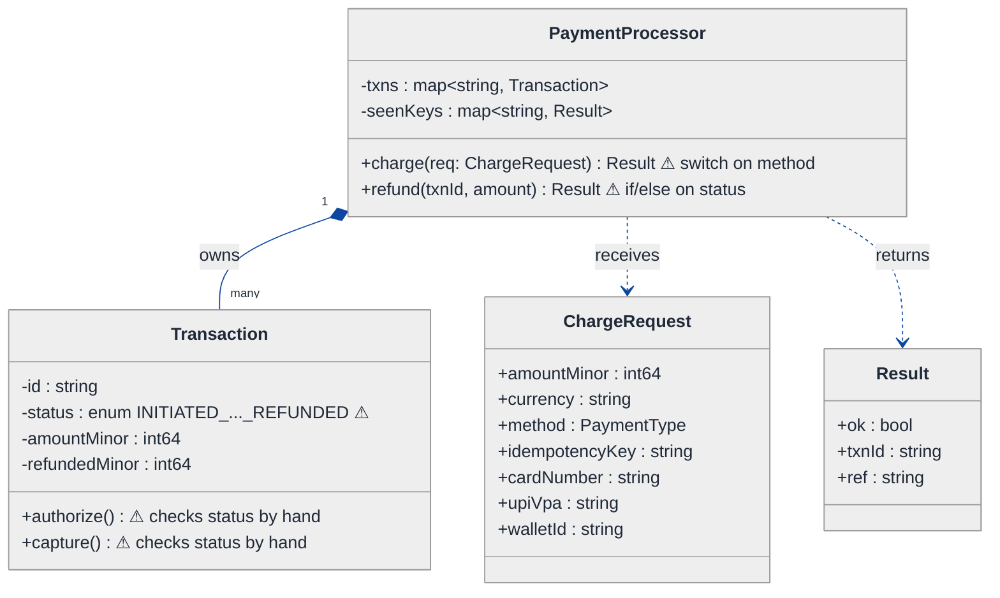
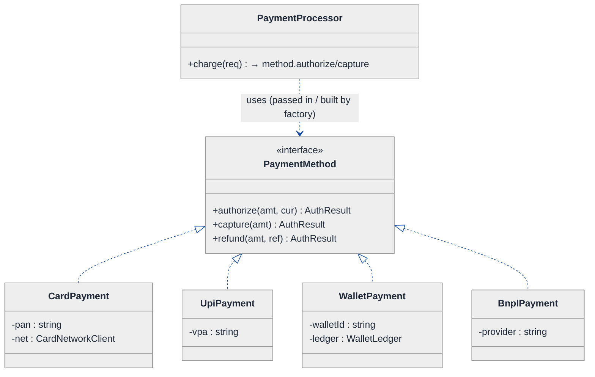
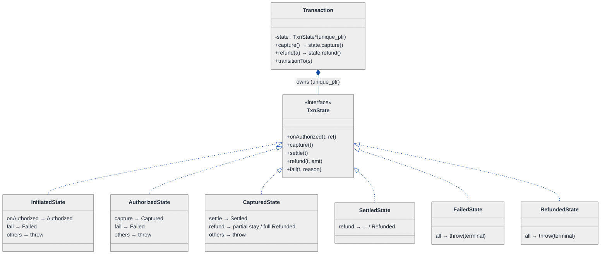
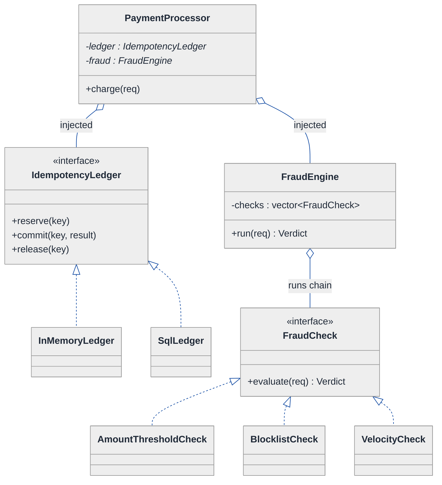
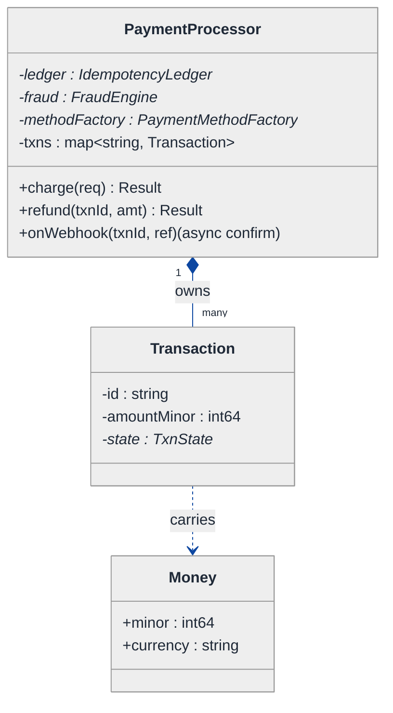
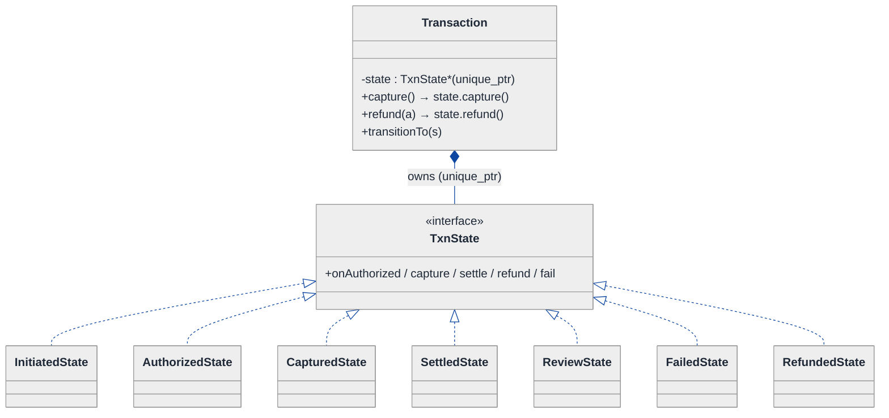
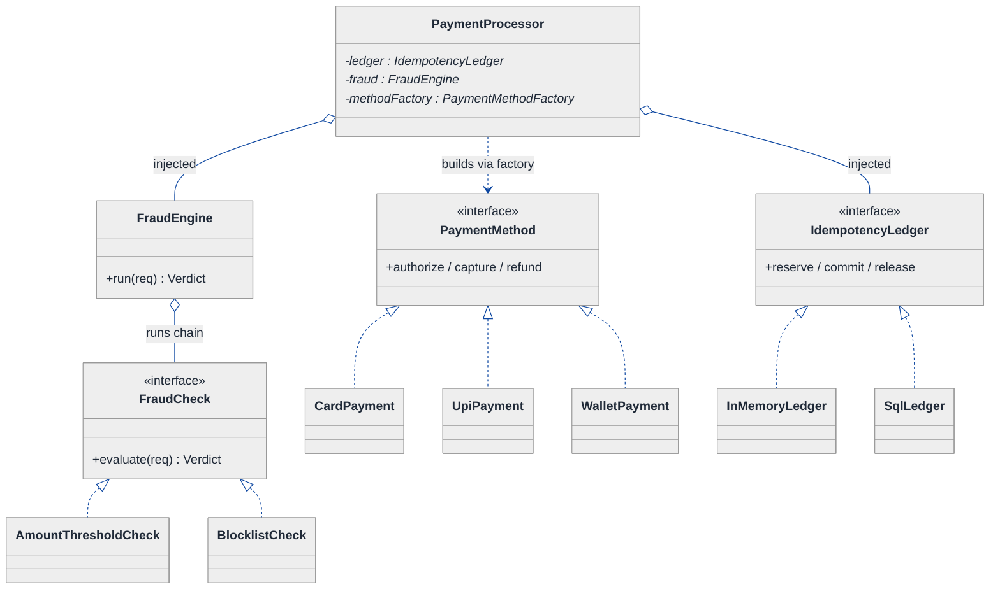
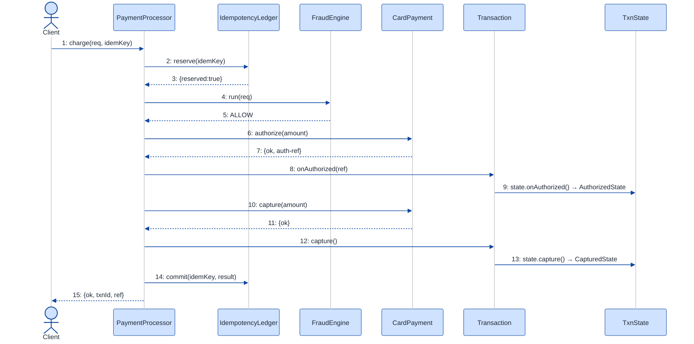

# Payment Processing System — LLD Walkthrough

> **Difficulty:** Hard · **Time:** ~45 min · **Pattern focus:** Strategy (payment methods) + State (transaction lifecycle) + idempotency (dedup ledger)
>
> **Problem source(s):** GID SG11, bucket `Strategy_Pattern`. Representative of the "design a payment gateway / payment processor" family of LLD prompts. See [`./EXTRACTED_QUESTIONS.md`](./EXTRACTED_QUESTIONS.md).
>
> **Diagrams:** inline mermaid (renders natively in GitHub / VS Code). No external sources, no PNGs.

---

## How to use this file

Paced for a candidate seeing "design a payment processor" for the first time. Reading time: ~45 minutes if you sketch each iteration by hand. **The lesson: a payment system is a textbook trap for reaching at patterns up front. Don't. DERIVE them — build the naive `switch (method)` version first, watch it shatter under four hypothetical changes (new rails, refunds, double-charges, fraud), then reach for ONE pattern per painful axis.** The three axes turn out to be: the payment algorithm (Strategy), the transaction lifecycle (State), and request deduplication (idempotency via a keyed ledger).

**Map of this file (15 sections):**

1. Problem statement + clarifying questions
2. Plain-English restatement
3. Why this matters
4. Mental model
5. Try it yourself first
6. Entity & verb extraction
7. **Iteration 1: the naive design** — what we'd write first
8. **Where the naive design hurts** — four future requirements, one painful diff each
9. **Pivot 1: Strategy for payment methods** — the most painful axis first
10. **Pivot 2: State for the transaction lifecycle** — internal transitions, not external swaps
11. **Pivot 3: idempotency + fraud hooks** — a keyed ledger and a check chain
12. Final UML class diagram (three sub-views)
13. Skeleton code (C++17)
14. Key flow — sequence diagram
15. Extensibility re-check + anti-patterns + how to think aloud + self-check

---

## 1. Problem statement + clarifying questions

**Prompt (typical phrasing):** "Design a payment processing system supporting multiple payment methods (credit card, debit card, UPI, wallet), transaction lifecycle management, refund handling, idempotency, and fraud detection hooks."

**Clarifying questions to ask BEFORE drawing anything:**

1. **Which payment methods, and are they truly different?** Credit/debit card both hit a card network; UPI hits a bank rail; wallet is an internal ledger. Do they share an interface, or are the failure modes / latencies / refund rules genuinely different per rail?
2. **Synchronous or asynchronous capture?** Does `charge()` return a final result inline, or do we authorize now and capture later (auth → capture is the standard card flow)? Do some rails (UPI) only ever give us an async webhook?
3. **What does idempotency mean here?** Client retries the SAME request (network blip) and we must NOT double-charge — keyed by a client-supplied idempotency key? What's the dedup window — minutes, hours, forever?
4. **Refund semantics?** Full vs partial refund? Can you refund more than was captured (no)? Multiple partial refunds summing to the captured amount? Is a refund a new transaction or a state change on the original?
5. **Fraud hooks — block or score?** Do fraud checks run synchronously before charge (hard block) or asynchronously (flag for review)? Can a transaction be put in a REVIEW hold and resolved later?
6. **Consistency & concurrency?** Two threads processing the same idempotency key simultaneously — must exactly one win. Is the ledger single-node or distributed (affects whether a mutex suffices or we need a DB unique constraint)?
7. **Money representation?** Integer minor units (paise / cents) — never floating point. Currency attached to every amount?

**Assumptions if interviewer dodges:** four payment methods behind one interface; auth+capture modelled but we expose a single `charge()` for brevity; idempotency keyed by a client-supplied string with an in-memory ledger (note the DB-unique-constraint equivalent in §11); refund is a state transition on the original transaction supporting multiple partials; fraud hooks run synchronously as a pre-charge chain that can BLOCK or HOLD; money is `int64` minor units + currency code; single process, guard the ledger with a mutex.

---

## 2. Plain-English restatement

We're building the software core of a payment processor. A caller (a checkout service) hands us "charge ₹500 to this card, here's an idempotency key." We must: dedup the request so a retry never double-charges, run fraud checks, route to the right payment rail (card network / UPI / wallet), drive the resulting transaction through a lifecycle (initiated → authorized → captured → settled, or failed / refunded), and let refunds flow back. The design must absorb **new payment rails, new fraud rules, and new lifecycle states without rewriting the charge path**.

---

## 3. Why this matters

Payment processing is the canonical "looks like a switch statement, actually three orthogonal patterns" interview. It probes whether you can separate three things most candidates fuse into one `process()` method: the *algorithm* (which rail charges the money), the *lifecycle* (what's a legal next step for this transaction), and *cross-cutting safety* (idempotency + fraud). Get the separation right and refunds, new rails, and review-holds each cost one new class. Get it wrong and every requirement is surgery on a god method. This exact shape reappears in order systems, booking engines, and any "state machine over an external integration."

---

## 4. Mental model

A payment processor is a **router in front of a state machine, behind a turnstile**. The turnstile (idempotency + fraud) decides whether a request is even allowed to spend money. The router (Strategy) picks which rail executes it. The state machine (State) tracks where each transaction is in its life and refuses illegal moves.

```
Real-world sketch (NOT a UML diagram yet):

   charge(req, idemKey)
        │
        ▼
   ┌─────────────────┐   seen this key before?
   │ Idempotency     │── yes ─► return the STORED result (no second charge)
   │ Ledger          │
   └────────┬────────┘  no, first time
            ▼
   ┌─────────────────┐   any check says BLOCK? ─► fail fast
   │ Fraud check     │   any check says HOLD?  ─► REVIEW state
   │ chain           │
   └────────┬────────┘  all pass
            ▼
   ┌─────────────────┐
   │ Pick rail       │   card? upi? wallet?  (Strategy)
   │ (Strategy)      │
   └────────┬────────┘
            ▼
   ┌──────────────────────────────────────────────┐
   │ Transaction lifecycle (State)                  │
   │  INITIATED → AUTHORIZED → CAPTURED → SETTLED   │
   │      │                       │                 │
   │      └─► FAILED              └─► REFUNDED       │
   └──────────────────────────────────────────────┘
```

The KEY insight from this picture: **safety, routing, and lifecycle are three independent axes.** A retry concerns the turnstile, not the rail. A new wallet concerns the rail, not the lifecycle. A "REVIEW" hold concerns the lifecycle, not the rail. Three axes → (at least) three patterns.

---

## 5. Try it yourself first

> **Predict before reading on:**
>
> 1. List 5 nouns you'd promote to a class. List 3 nouns you'd leave as plain fields.
> 2. **If I tell you the processor will add "buy-now-pay-later" and "bank transfer" rails in its first year — and each has a different refund rule — what would change about how you write the `charge()` method?**
> 3. A client's network drops right after we charge the card but before they get our response, so they retry the identical request. Where does the logic that prevents a double-charge live — and what is it keyed on?

---

## 6. Entity & verb extraction

> **Mini-refresher: noun → class, but not every noun.**
>
> Naive OOD promotes every noun to a class. Senior OOD promotes a noun only if it has both BEHAVIOR and STATE that need to live together. "Currency" stays a field; "Transaction" becomes a class because it has lifecycle behavior; "Money" becomes a tiny value type because it has an invariant (minor units + currency, never mixed).

**Nouns from the prompt:**

| Noun | Decision | Why |
|---|---|---|
| PaymentProcessor | Class (top-level coordinator) | Owns the charge/refund orchestration; holds the policy objects |
| PaymentMethod (card/UPI/wallet) | Interface + concrete subclasses | The thing that varies; behavior differs per rail |
| Transaction | Class | Has lifecycle behavior + is the refund target |
| Money / Amount | Value type (`int64` minor units + currency) | Has an invariant; no lifecycle |
| IdempotencyKey | Field (`std::string`) on the request | No behavior of its own |
| IdempotencyLedger | Class | Stores key → result; enforces "charge once" |
| FraudCheck | Interface + concrete rules | Cross-cutting policy that varies |
| Refund | NOT a class — a transition + record on Transaction | A refund is something a Transaction *does*, not a separate lifecycle |
| Receipt / Result | Value type | Returned, not owned |
| Currency | Field (enum/string) | No behavior |

**Verbs (and the class they live on):**

| Verb | Owner class (naive answer — we'll re-examine) |
|---|---|
| charge(request) | PaymentProcessor |
| refund(txnId, amount) | PaymentProcessor → delegates to Transaction |
| authorize / capture / settle | Transaction (via its state) |
| pay / executeCharge | PaymentMethod |
| isDuplicate(key) / record(key, result) | IdempotencyLedger |
| evaluate(request) | FraudCheck |
| markFailed / markCaptured | Transaction (via its state) |

**We have NOT introduced any design patterns yet.** Pure nouns + verbs.

---

## 7. <a id="iter-1"></a>7. Iteration 1: the naive design

Let's write the simplest thing that could possibly work. No design patterns — one `PaymentProcessor` with a `charge()` method that branches on an enum, a `Transaction` with a status enum, and inline dedup.



**Reader's tour (read top to bottom; ~60 seconds).**

1. **`PaymentProcessor` is the root.** It owns ALL transactions in a map, plus a `seenKeys` map for dedup, and exposes `charge` and `refund`. Every decision lives inside these two methods.

2. **`ChargeRequest` is a fat data bag (smell incoming).** Look at it: `cardNumber`, `upiVpa`, `walletId` all live on the SAME struct, even though any given request uses exactly one of them. That's a sign the request is straining to be polymorphic and isn't.

3. **`Transaction` carries a `status` enum** with INITIATED / AUTHORIZED / CAPTURED / SETTLED / FAILED / REFUNDED. Its `authorize()` / `capture()` methods check the current status by hand with `if (status != ...)` guards. Fine for now; this is the lifecycle trouble-zone.

4. **The two ⚠ on `charge`/`refund`.** `charge` is going to be a `switch (req.method)`. `refund` is going to be an `if/else` ladder on `status` + an `if (refundedMinor + amount > amountMinor)` partial-refund check. Both are where the next requirements will cut.

5. **Idempotency is a bare map.** `seenKeys` maps the idempotency key to a prior `Result`. The check is `if (seenKeys.count(key)) return seenKeys[key];` at the top of `charge`. No locking, no expiry — we'll feel that in §8.

**What's deliberately missing.** No `PaymentMethod` interface — the rail logic is a switch. No `TransactionState` — the lifecycle is an enum + hand-written guards. No fraud hooks at all. No real concurrency story for the ledger. The naive design doesn't acknowledge these as axes; it bakes a hardcoded answer for each.

Skeleton code for the naive design (C++17):

```cpp
#include <cstdint>
#include <mutex>
#include <stdexcept>
#include <string>
#include <unordered_map>

enum class PaymentType   { CREDIT_CARD, DEBIT_CARD, UPI, WALLET };
enum class TxnStatus     { INITIATED, AUTHORIZED, CAPTURED, SETTLED, FAILED, REFUNDED };

struct ChargeRequest {
    int64_t     amountMinor;        // paise / cents — NEVER floating point
    std::string currency;
    PaymentType method;
    std::string idempotencyKey;
    std::string cardNumber;         // used iff method is *_CARD
    std::string upiVpa;             // used iff method is UPI
    std::string walletId;           // used iff method is WALLET
};
struct Result { bool ok; std::string txnId; std::string ref; };

struct Transaction {
    std::string id;
    TxnStatus   status = TxnStatus::INITIATED;
    int64_t     amountMinor = 0;
    int64_t     refundedMinor = 0;
};

class PaymentProcessor {
public:
    Result charge(const ChargeRequest& req) {
        // idempotency: bare map, no lock, no expiry
        if (auto it = seenKeys_.find(req.idempotencyKey); it != seenKeys_.end())
            return it->second;

        Transaction txn;
        txn.id = newId();
        txn.amountMinor = req.amountMinor;

        bool ok = false; std::string ref;
        switch (req.method) {                 // tag-driven — will hurt
            case PaymentType::CREDIT_CARD:
            case PaymentType::DEBIT_CARD:
                ok = callCardNetwork(req.cardNumber, req.amountMinor, ref); break;
            case PaymentType::UPI:
                ok = callUpiRail(req.upiVpa, req.amountMinor, ref); break;
            case PaymentType::WALLET:
                ok = debitWallet(req.walletId, req.amountMinor, ref); break;
        }
        txn.status = ok ? TxnStatus::CAPTURED : TxnStatus::FAILED;  // skips AUTHORIZED!
        txns_[txn.id] = txn;

        Result r{ ok, txn.id, ref };
        seenKeys_[req.idempotencyKey] = r;
        return r;
    }

    Result refund(const std::string& txnId, int64_t amountMinor) {
        auto it = txns_.find(txnId);
        if (it == txns_.end()) return { false, txnId, "no-such-txn" };
        Transaction& t = it->second;
        if (t.status != TxnStatus::CAPTURED && t.status != TxnStatus::SETTLED)  // hand guard
            return { false, txnId, "not-refundable" };
        if (t.refundedMinor + amountMinor > t.amountMinor)                       // partial guard
            return { false, txnId, "over-refund" };
        t.refundedMinor += amountMinor;
        if (t.refundedMinor == t.amountMinor) t.status = TxnStatus::REFUNDED;
        return { true, txnId, "refund-ok" };
    }
private:
    std::string newId();                       // elided
    bool callCardNetwork(const std::string&, int64_t, std::string&);  // elided
    bool callUpiRail(const std::string&, int64_t, std::string&);      // elided
    bool debitWallet(const std::string&, int64_t, std::string&);      // elided
    std::unordered_map<std::string, Transaction> txns_;
    std::unordered_map<std::string, Result>      seenKeys_;
};
```

**This works.** It has zero design patterns. We can charge a card, charge UPI, dedup a retry, and process a refund. So what's wrong with it?

---

## 8. <a id="naive-pain"></a>8. Where the naive design hurts

The interviewer slides a sheet across the desk: "Four things land next quarter. Walk me through what changes."

### Change A: "Add buy-now-pay-later (BNPL) and bank-transfer rails"

In the naive design:
- Add `BNPL`, `BANK_TRANSFER` to `PaymentType`.
- Add two more `case` labels in the `switch` inside `charge()`.
- BNPL needs a `bnplProvider` field and bank transfer needs an `accountNumber` field → **two more optional fields bolted onto `ChargeRequest`**, which already carries three method-specific fields none of which most requests use.
- **Touches: the enum, `charge()`'s switch, and `ChargeRequest`'s shape.** Three sites. And every new rail makes the fat request struct fatter.

### Change B: "Auth now, capture later (real card flow) + async UPI confirmation via webhook"

In the naive design:
- `charge()` currently jumps straight to `CAPTURED` (it even SKIPS `AUTHORIZED`). To support auth-then-capture you need a separate `capture(txnId)` entry point.
- `capture()` must reject anything not in `AUTHORIZED`: `if (status != AUTHORIZED) ...`. UPI's async webhook lands in a totally different code path that ALSO has to flip status and respect "only from AUTHORIZED."
- **The status transition rules are now duplicated across `charge`, `capture`, and the webhook handler.** Three places enforce the same matrix by hand; they WILL drift.

### Change C: "Fraud rules — velocity check + amount threshold + blocklist; some BLOCK, some HOLD for review"

In the naive design:
- There is no place for them. You'd prepend a block of `if`s to `charge()`: `if (overVelocity(req)) return fail; if (req.amountMinor > THRESHOLD) ...`.
- "HOLD for review" needs a new state the enum doesn't have, plus a way to resume a held transaction later — another entry point, more status guards.
- **`charge()` grows an unbounded prologue of fraud `if`s, and the lifecycle enum can't even express REVIEW.**

### Change D: "Idempotency must be concurrency-safe and survive a restart"

In the naive design:
- Two threads hit `charge()` with the same key at the same instant: BOTH see an empty `seenKeys_`, BOTH charge. **Double charge — the exact bug idempotency was supposed to prevent.**
- The map is in-memory, so a restart loses every key; replays after deploy double-charge.
- **The dedup needs locking + a "reserve the key, then charge, then store result" protocol, and the storage needs to be swappable (in-memory now, DB unique-constraint later). None of that fits a bare map read at the top of `charge()`.**

### The pattern of pain

| Change | Files / sites touched | Smell |
|---|---|---|
| A. New rails | `PaymentType` enum + `charge()` switch + `ChargeRequest` fields | "Tag-driven switch; fat request struct grows per rail." |
| B. Auth/capture + webhook | `charge` + `capture` + webhook handler all re-check status | "Transition matrix duplicated; enum guards drift." |
| C. Fraud BLOCK/HOLD | `charge()` prologue + enum can't express REVIEW | "Cross-cutting checks jammed inline; lifecycle can't hold." |
| D. Safe idempotency | dedup logic + storage at top of `charge()` | "Read-then-write race double-charges; storage not swappable." |

**Three axes of pain dominate:** (1) which rail executes the charge (algorithm variation), (2) what's a legal next step for a transaction (lifecycle variation), and (3) cross-cutting safety — dedup + fraud — that must wrap the charge regardless of rail or state.

> **Pivot question:** "What pattern handles 'algorithm that varies, picked by the caller / config'? What pattern handles 'a lifecycle with state-specific legal operations'? And what structures 'dedup + a chain of pluggable checks that gate the operation'?"
>
> The answers are Strategy, State, and (for the third) an idempotency ledger + a Chain-of-Responsibility of checks. We'll introduce them one at a time, starting with the most painful: the payment-method switch.

---

## 9. <a id="pivot-1"></a>9. Pivot 1: Strategy for payment methods

> **Mini-refresher: Strategy pattern.**
>
> Encapsulates an algorithm behind an interface so it can be swapped at runtime. The CALLER (or config) decides which strategy to use; the strategy doesn't know about its peers.
>
> Quick example: a `Sorter` takes a `CompareStrategy*`. Pass `AscendingCompare` or `DescendingCompare` — the sorter doesn't care which.

**Why Strategy fits payment methods.** Charging is an algorithm: *given an amount + instrument details, move money and return a reference*. It varies per rail (card network call, UPI rail, internal wallet debit), and the variants have nothing structurally in common — different SDKs, latencies, failure modes. The choice is made externally (the request says "card" or "UPI"). That's textbook Strategy. Bonus: each strategy owns its OWN instrument fields, so the fat `ChargeRequest` struct dissolves.

**The refactor (just the affected part):**

```cpp
// One result type all rails share.
struct AuthResult { bool ok; std::string ref; std::string declineReason; };

class PaymentMethod {
public:
    virtual ~PaymentMethod() = default;
    // authorize = reserve funds; capture = actually move them (card flow).
    // Wallet/UPI can implement capture as a no-op after authorize.
    virtual AuthResult authorize(int64_t amountMinor, const std::string& currency) = 0;
    virtual AuthResult capture(int64_t amountMinor)                                  = 0;
    virtual AuthResult refund(int64_t amountMinor, const std::string& origRef)       = 0;
    virtual std::string name() const = 0;
};

class CardPayment : public PaymentMethod {
public:
    CardPayment(std::string pan, CardNetworkClient& net) : pan_(std::move(pan)), net_(net) {}
    AuthResult authorize(int64_t amt, const std::string& cur) override {
        return net_.auth(pan_, amt, cur);          // hold on the card
    }
    AuthResult capture(int64_t amt) override { return net_.capture(pan_, amt); }
    AuthResult refund(int64_t amt, const std::string& ref) override {
        return net_.refund(ref, amt);              // refund rule: against original auth ref
    }
    std::string name() const override { return "CARD"; }
private:
    std::string        pan_;       // instrument detail lives HERE, not on a fat request
    CardNetworkClient& net_;
};

class WalletPayment : public PaymentMethod {
public:
    WalletPayment(std::string walletId, WalletLedger& ledger)
        : walletId_(std::move(walletId)), ledger_(ledger) {}
    AuthResult authorize(int64_t amt, const std::string&) override {
        return ledger_.debit(walletId_, amt);      // internal ledger — instant
    }
    AuthResult capture(int64_t) override { return { true, "wallet-captured", "" }; } // already moved
    AuthResult refund(int64_t amt, const std::string&) override {
        return ledger_.credit(walletId_, amt);     // refund rule: credit back instantly
    }
    std::string name() const override { return "WALLET"; }
private:
    std::string   walletId_;
    WalletLedger& ledger_;
};
// UpiPayment, BnplPayment, BankTransferPayment elided — same shape, own refund rules
```

**What changed — visualized.** Just the payment slice:



**Tour of the after-state.**

1. **The `switch (req.method)` is GONE.** `PaymentProcessor::charge` now calls `method->authorize(...)` and `method->capture(...)` on a `PaymentMethod*` it was handed. Polymorphism dispatches to the right rail.

2. **The fat `ChargeRequest` dissolved.** Each instrument detail (`pan`, `vpa`, `walletId`, `provider`) lives ON its own concrete strategy, constructed from the request once at the boundary. No more "five optional fields, use one."

3. **The interface is narrow and rail-agnostic:** `authorize` / `capture` / `refund` returning a common `AuthResult`. Each rail implements its OWN refund rule inside `refund()` — card refunds against the original auth ref, wallet credits instantly. **Change A's per-rail refund difference is absorbed by the interface, not a switch.**

4. **Change A from §8 now lands cleanly.** BNPL → new `BnplPayment : PaymentMethod`. Bank transfer → new `BankTransferPayment : PaymentMethod`. No edits to `charge()`, no enum case, no new request field.

> **Mini-refresher: Factory (briefly, because we need ONE here).**
>
> A Factory turns "data describing what to build" into "the object." We add a small `PaymentMethodFactory` that maps the request's method tag + instrument fields to a concrete `unique_ptr<PaymentMethod>`. This keeps the ONE remaining `switch` (tag → object) in a single place whose only job is construction — not business logic. Adding a rail touches only the factory, not `charge()`.

**Pattern-discrimination cheatsheet — Strategy vs Template Method.**
- *Strategy:* the whole algorithm is one swappable object, chosen at runtime via composition.
- *Template Method:* a base class fixes the algorithm SKELETON; subclasses fill in hooks via inheritance.
- *Rule of thumb:* if the variants are wholly different implementations selected at runtime → Strategy. If there's ONE fixed flow (e.g. "validate → execute → log") with a couple of swappable steps → Template Method.

We chose Strategy because card/UPI/wallet share almost no skeleton — UPI is async, wallet is a synchronous ledger write, card is auth-then-capture. There's no common skeleton to template; there are genuinely different algorithms to swap.

---

## 10. <a id="pivot-2"></a>10. Pivot 2: State for the transaction lifecycle

Change B from §8 is still painful — auth-then-capture, async webhooks, and a transition matrix duplicated across `charge`, `capture`, and the webhook handler. Strategy doesn't help: the variability isn't in the algorithm, it's in **what operation is legal given where the transaction is.**

> **Mini-refresher: State pattern.**
>
> Each lifecycle state is its own class. The context object (here, `Transaction`) delegates an operation (`capture()`, `refund()`) to its CURRENT state object, and THE STATE decides whether it's legal and what the next state is. Transitions are INTERNAL, driven by events the context receives — not chosen by the caller.

**Why State (not Strategy).** Nobody from outside picks "be in the AUTHORIZED state." The transaction GETS there because authorization succeeded. `capture()` is legal from AUTHORIZED, illegal from INITIATED or REFUNDED. `refund()` is legal from CAPTURED/SETTLED, illegal otherwise. That's a lifecycle the OBJECT owns — exactly what State is for. It also kills the duplicated matrix: each rule lives in exactly one state class.

**The refactor (just the lifecycle part):**

```cpp
class Transaction;  // forward

class TxnState {
public:
    virtual ~TxnState() = default;
    virtual void onAuthorized(Transaction& t, const std::string& ref);  // default: throw
    virtual void capture(Transaction& t);                               // default: throw
    virtual void settle(Transaction& t);                                // default: throw
    virtual void refund(Transaction& t, int64_t amountMinor);           // default: throw
    virtual void fail(Transaction& t, const std::string& reason);       // default: throw
    virtual const char* name() const = 0;
protected:
    [[noreturn]] static void illegal(const char* op, const char* st);
};

class InitiatedState : public TxnState {
public:
    void onAuthorized(Transaction& t, const std::string& ref) override;  // → Authorized
    void fail(Transaction& t, const std::string& reason) override;       // → Failed
    const char* name() const override { return "INITIATED"; }
};

class AuthorizedState : public TxnState {
public:
    void capture(Transaction& t) override;                               // → Captured
    void fail(Transaction& t, const std::string& reason) override;       // → Failed (auth expired)
    const char* name() const override { return "AUTHORIZED"; }
};

class CapturedState : public TxnState {
public:
    void settle(Transaction& t) override;                                // → Settled
    void refund(Transaction& t, int64_t amt) override;                   // partial → stay; full → Refunded
    const char* name() const override { return "CAPTURED"; }
};

// SettledState (refundable), FailedState (terminal), RefundedState (terminal),
// ReviewState (added in Pivot 3) — all elided, same shape.

class Transaction {
public:
    Transaction(std::string id, int64_t amt, std::string cur)
        : id_(std::move(id)), amountMinor_(amt), currency_(std::move(cur)),
          state_(std::make_unique<InitiatedState>()) {}

    void transitionTo(std::unique_ptr<TxnState> s) { state_ = std::move(s); }

    // Public API delegates to the current state — NO status guards here.
    void onAuthorized(const std::string& ref) { state_->onAuthorized(*this, ref); }
    void capture()                            { state_->capture(*this); }
    void settle()                             { state_->settle(*this); }
    void refund(int64_t amt)                  { state_->refund(*this, amt); }
    void fail(const std::string& reason)      { state_->fail(*this, reason); }

    int64_t amountMinor() const   { return amountMinor_; }
    int64_t refundedMinor() const { return refundedMinor_; }
    void addRefunded(int64_t a)   { refundedMinor_ += a; }
    const char* stateName() const { return state_->name(); }
private:
    std::string                 id_;
    int64_t                     amountMinor_;
    int64_t                     refundedMinor_ = 0;
    std::string                 currency_;
    std::unique_ptr<TxnState>   state_;
};

// Example transition bodies (deferred until Transaction is complete):
inline void InitiatedState::onAuthorized(Transaction& t, const std::string&) {
    t.transitionTo(std::make_unique<AuthorizedState>());
}
inline void AuthorizedState::capture(Transaction& t) {
    t.transitionTo(std::make_unique<CapturedState>());
}
inline void CapturedState::refund(Transaction& t, int64_t amt) {
    if (t.refundedMinor() + amt > t.amountMinor()) illegal("refund(over)", "CAPTURED");
    t.addRefunded(amt);
    if (t.refundedMinor() == t.amountMinor())
        t.transitionTo(std::make_unique<RefundedState>());   // else stay CAPTURED (partial)
}
```

**What changed — visualized.** Just the lifecycle slice:



**Tour of the after-state.**

1. **The `TxnStatus` enum is gone**, replaced by `state_` of type `std::unique_ptr<TxnState>` — the transaction OWNS its current state and swaps the pointer on transition.

2. **`Transaction`'s public methods became one-liners** that delegate: `capture()` is `state_->capture(*this)`. **No `if (status != AUTHORIZED)` anywhere.** The base `TxnState` provides a default `throw` for every operation, so any illegal call (e.g. `capture()` on a `RefundedState`) fails by polymorphism, not by a scattered guard.

3. **Each transition rule lives in exactly ONE place.** "Capture is only legal from AUTHORIZED" is encoded by the fact that ONLY `AuthorizedState` overrides `capture()`. The duplicated matrix from Change B (across `charge`/`capture`/webhook) collapses: the webhook handler just calls `txn.onAuthorized(ref)` and the state decides if that's legal.

4. **Partial refunds are handled inside `CapturedState::refund`** — it accumulates `refundedMinor`, stays CAPTURED while partial, transitions to RefundedState only when fully refunded. The over-refund guard lives here too, beside the data it protects.

5. **Adding a state is one new class.** Change C's "REVIEW hold" (next section) becomes a new `ReviewState` whose `capture()`/`refund()` throw and which can transition to AUTHORIZED (approved) or FAILED (rejected). No edits to the other states.

**Pattern-discrimination cheatsheet — Strategy vs State.**
- *Strategy:* the CALLER picks which one to use; strategies are usually unaware of each other (`CardPayment` knows nothing about `WalletPayment`).
- *State:* the OBJECT picks its next state internally; states know about each other (`AuthorizedState::capture` constructs a `CapturedState`).
- *Rule of thumb:* if `setX(variant)` is called from outside → Strategy. If `handleEvent(e)` flips the object's internals → State. Here: `PaymentMethod` is set by the caller (Strategy); `TxnState` flips because authorization succeeded (State).

---

## 11. <a id="pivot-3"></a>11. Pivot 3: idempotency + fraud hooks

Changes A and B are solved. Changes C (fraud BLOCK/HOLD) and D (concurrency-safe, durable idempotency) remain. These are **cross-cutting safety** — they wrap the charge regardless of which rail or state is involved. Two distinct mechanisms.

### 11a. Idempotency — a keyed ledger with reserve-then-commit

> **Mini-refresher: idempotency (the concept, not a GoF pattern).**
>
> An operation is idempotent if doing it twice has the same effect as once. A payment `charge` is NOT naturally idempotent — calling it twice charges twice. We MAKE it idempotent by keying each request on a client-supplied **idempotency key** and storing the outcome. A repeat of the same key returns the stored outcome instead of charging again. The dangerous window is "two requests with the same key arrive concurrently," so the ledger must **reserve** a key atomically before charging, then **commit** the result — not merely read-then-write.

The fix for Change D is to extract the bare `seenKeys_` map into an interface so the storage is swappable, and to give it a three-step protocol that closes the race:

```cpp
struct StoredOutcome { bool inFlight; Result result; };  // inFlight = reserved, not yet committed

class IdempotencyLedger {
public:
    virtual ~IdempotencyLedger() = default;
    // Atomically: if key unseen, reserve it (mark inFlight) and return {reserved:true}.
    // If already present, return {reserved:false, existing outcome}.
    virtual std::pair<bool, StoredOutcome> reserve(const std::string& key) = 0;
    virtual void commit(const std::string& key, const Result& r)           = 0;
    virtual void release(const std::string& key)                           = 0;  // on crash/abort
};

class InMemoryLedger : public IdempotencyLedger {
public:
    std::pair<bool, StoredOutcome> reserve(const std::string& key) override {
        std::lock_guard<std::mutex> g(mu_);                // the lock that the naive map lacked
        auto [it, inserted] = store_.try_emplace(key, StoredOutcome{ true, {} });
        if (inserted) return { true,  it->second };        // we reserved it
        return { false, it->second };                      // someone else has it (in-flight or done)
    }
    void commit(const std::string& key, const Result& r) override {
        std::lock_guard<std::mutex> g(mu_);
        store_[key] = StoredOutcome{ false, r };
    }
    void release(const std::string& key) override {
        std::lock_guard<std::mutex> g(mu_);
        store_.erase(key);
    }
private:
    std::mutex mu_;
    std::unordered_map<std::string, StoredOutcome> store_;
};
// SqlLedger : IdempotencyLedger — reserve = INSERT ... ON CONFLICT DO NOTHING (unique key).
// The DB unique constraint IS the distributed mutex; survives restart. Elided.
```

The `reserve → charge → commit` protocol means a concurrent duplicate gets `reserved:false` and either returns the committed result or is told the original is in-flight (retry-after). The race in Change D is gone, and swapping `InMemoryLedger` for `SqlLedger` makes it durable + distributed — same interface.

### 11b. Fraud hooks — a Chain of Responsibility of checks

> **Mini-refresher: Chain of Responsibility.**
>
> A request passes through a chain of handler objects. Each handler either handles/decides, or passes to the next. New handlers are added by linking, not by editing existing ones. Perfect for "run a list of pluggable checks, any of which can stop the flow."

Change C wants velocity / amount-threshold / blocklist checks, where some BLOCK and some HOLD. Model each as a `FraudCheck` returning a verdict; run them as a chain:

```cpp
enum class Verdict { ALLOW, REVIEW, BLOCK };

class FraudCheck {
public:
    virtual ~FraudCheck() = default;
    virtual Verdict evaluate(const ChargeRequest& req) const = 0;
};

class AmountThresholdCheck : public FraudCheck {
public:
    explicit AmountThresholdCheck(int64_t limit) : limit_(limit) {}
    Verdict evaluate(const ChargeRequest& req) const override {
        return req.amountMinor > limit_ ? Verdict::REVIEW : Verdict::ALLOW;
    }
private:
    int64_t limit_;
};

class BlocklistCheck : public FraudCheck {
public:
    explicit BlocklistCheck(const std::unordered_set<std::string>& denied) : denied_(denied) {}
    Verdict evaluate(const ChargeRequest& req) const override {
        return denied_.count(req.payerId) ? Verdict::BLOCK : Verdict::ALLOW;
    }
private:
    const std::unordered_set<std::string>& denied_;
};
// VelocityCheck (too many charges per minute) elided — same shape.

class FraudEngine {                          // the chain runner
public:
    explicit FraudEngine(std::vector<std::unique_ptr<FraudCheck>> checks)
        : checks_(std::move(checks)) {}
    Verdict run(const ChargeRequest& req) const {
        Verdict worst = Verdict::ALLOW;       // BLOCK > REVIEW > ALLOW
        for (const auto& c : checks_) {
            Verdict v = c->evaluate(req);
            if (v == Verdict::BLOCK) return Verdict::BLOCK;   // short-circuit hard block
            if (v == Verdict::REVIEW) worst = Verdict::REVIEW;
        }
        return worst;
    }
private:
    std::vector<std::unique_ptr<FraudCheck>> checks_;
};
```

`charge()` consults the `FraudEngine` BEFORE picking a rail: `BLOCK` → fail fast; `REVIEW` → create the transaction and transition it straight into `ReviewState` (the new state from Pivot 2) instead of authorizing; `ALLOW` → proceed. Adding a fraud rule is one new `FraudCheck` subclass added to the chain — `charge()` never changes (Change C solved).



**Tour.** `PaymentProcessor` aggregates (open diamond — injected, lifecycle owned elsewhere) an `IdempotencyLedger` and a `FraudEngine`. The ledger has two swappable impls (in-memory now, SQL later) behind one interface. The fraud engine runs a vector of `FraudCheck`s (the chain), each pluggable. Both are CROSS-CUTTING — they wrap the charge regardless of rail (Pivot 1) or state (Pivot 2).

**Pattern-discrimination cheatsheet — Chain of Responsibility vs Decorator.**
- *Chain of Responsibility:* handlers can STOP the flow (a BLOCK verdict short-circuits); the request may not reach the end.
- *Decorator:* every wrapper adds behavior and (almost always) delegates onward; the call reaches the core.
- *Rule of thumb:* "any link may halt and decide" → Chain. "every layer augments and forwards" → Decorator. Fraud checks halt → Chain.

---

## 12. <a id="fig-class-diagram"></a>12. Final class diagram

One diagram would be a wall of boxes. Here are **three focused sub-views**; the structural insight at the end ties them together.

### 12.1 The orchestration core — what the processor COORDINATES



**Tour of 12.1.** `PaymentProcessor` is the coordinator. It OWNS its transactions (filled diamond — composition; a transaction's lifetime is bounded by the processor's store). It holds three injected policy collaborators (shown in 12.3). `Money` is a tiny value type (minor units + currency) carried by transactions — not a class with behavior, just an invariant holder. Note the three entry points: `charge`, `refund`, and `onWebhook` (the async confirmation path from Change B).

### 12.2 The lifecycle — Transaction's State pattern



**Tour of 12.2.** `Transaction` owns ONE `TxnState` (unique_ptr — exclusive ownership, swapped on transition). Seven concrete states. Legal transitions: INITIATED → AUTHORIZED (or REVIEW, or FAILED); REVIEW → AUTHORIZED / FAILED; AUTHORIZED → CAPTURED / FAILED; CAPTURED → SETTLED / RefundedState; SETTLED → RefundedState; FAILED and REFUNDED are terminal. **Every transition rule lives in the source state's class — there is no central matrix.** `ReviewState` is the fraud-HOLD state from Pivot 3; adding it cost one class.

### 12.3 The policy injection — what the processor USES



**Tour of 12.3.** Three injected policy axes hang off the processor (open diamonds = aggregation = "uses, doesn't own lifecycle"): the **payment Strategy** (`PaymentMethod`, built per-request by a factory), the **idempotency ledger** (swappable storage), and the **fraud engine** (a chain of `FraudCheck`s). The processor `new`s none of these — they're handed in at construction (dependency injection). The CORE is orchestration; every varying concern is a hot-swap policy behind an interface.

### Structural insight (ties 12.1 + 12.2 + 12.3 together)

| Concern | Pattern used | Owned by / picked by |
|---|---|---|
| **Which rail charges** (card / UPI / wallet / BNPL) | Strategy (built by Factory) | Caller's request → factory builds it |
| **Transaction lifecycle** (Initiated → … → Settled/Refunded/Failed/Review) | State, OWNED by Transaction | The transaction itself, via internal transitions |
| **Don't double-charge** (retries, concurrency, durability) | Idempotency ledger (swappable storage) | Injected into the processor |
| **Should we charge at all** (fraud) | Chain of Responsibility of FraudCheck | Injected into the processor |

> **Mini-refresher: dependency injection + open/closed.**
>
> *Dependency injection:* a class receives its collaborators (ledger, fraud engine, payment factory) from outside rather than constructing them — so you can swap real for fake (tests) or in-memory for SQL (prod) without touching the class.
> *Open/closed principle:* software should be open for EXTENSION but closed for MODIFICATION. Here, every §8 change is a NEW class (new rail, new state, new check, new ledger impl) — the existing `charge()` is never edited. That's open/closed in practice.

The big lesson: **inheritance appears only inside the three pattern families (payment, state, fraud check).** The orchestration core uses composition + injection. *Inheritance for the polymorphic family, composition for wiring.*

---

## 13. Skeleton code (C++17)

> Show the SHAPES, not the full impl. Abstract bases + 1-2 concretes per pattern; `// elided` for the rest. ~130 lines.

```cpp
#include <cstdint>
#include <memory>
#include <mutex>
#include <string>
#include <unordered_map>
#include <unordered_set>
#include <vector>

// ── Value types ─────────────────────────────────────────────────────
struct Money { int64_t minor; std::string currency; };   // never floating point
struct Result { bool ok; std::string txnId; std::string ref; std::string reason; };
struct AuthResult { bool ok; std::string ref; std::string declineReason; };

enum class PaymentType { CREDIT_CARD, DEBIT_CARD, UPI, WALLET, BNPL };
enum class Verdict     { ALLOW, REVIEW, BLOCK };

struct ChargeRequest {
    Money       amount;
    PaymentType method;
    std::string idempotencyKey;
    std::string payerId;
    std::string instrument;            // PAN / VPA / walletId — interpreted by the factory
};

// ── Pivot 1: payment Strategy (one per rail) ────────────────────────
class PaymentMethod {
public:
    virtual ~PaymentMethod() = default;
    virtual AuthResult authorize(const Money& m) = 0;
    virtual AuthResult capture(int64_t minor)    = 0;
    virtual AuthResult refund(int64_t minor, const std::string& origRef) = 0;
    virtual const char* name() const = 0;
};
class CardPayment : public PaymentMethod {
public:
    explicit CardPayment(std::string pan) : pan_(std::move(pan)) {}
    AuthResult authorize(const Money& m) override; // call card network — elided
    AuthResult capture(int64_t minor)    override; // elided
    AuthResult refund(int64_t minor, const std::string& ref) override; // elided
    const char* name() const override { return "CARD"; }
private:
    std::string pan_;
};
// UpiPayment, WalletPayment, BnplPayment — same shape, own refund rules. Elided.

class PaymentMethodFactory {                       // the ONE remaining tag-switch lives here
public:
    std::unique_ptr<PaymentMethod> build(const ChargeRequest& req) const; // elided switch
};

// ── Pivot 2: transaction State ──────────────────────────────────────
class Transaction;
class TxnState {
public:
    virtual ~TxnState() = default;
    virtual void onAuthorized(Transaction&, const std::string& ref) { illegal("authorize"); }
    virtual void capture(Transaction&)                              { illegal("capture"); }
    virtual void settle(Transaction&)                               { illegal("settle"); }
    virtual void refund(Transaction&, int64_t)                      { illegal("refund"); }
    virtual void fail(Transaction&, const std::string&)             { illegal("fail"); }
    virtual const char* name() const = 0;
protected:
    [[noreturn]] static void illegal(const char* op); // throws "illegal op in this state"
};
class AuthorizedState : public TxnState {
public:
    void capture(Transaction& t) override;          // → CapturedState
    void fail(Transaction& t, const std::string&) override; // → FailedState
    const char* name() const override { return "AUTHORIZED"; }
};
class CapturedState : public TxnState {
public:
    void settle(Transaction& t) override;           // → SettledState
    void refund(Transaction& t, int64_t amt) override; // partial stay / full → RefundedState
    const char* name() const override { return "CAPTURED"; }
};
// InitiatedState, SettledState, ReviewState, FailedState, RefundedState — elided.

class Transaction {
public:
    Transaction(std::string id, Money amt)
        : id_(std::move(id)), amount_(std::move(amt)),
          state_(std::make_unique<InitiatedState>()) {}
    void transitionTo(std::unique_ptr<TxnState> s) { state_ = std::move(s); }
    void onAuthorized(const std::string& ref) { state_->onAuthorized(*this, ref); }
    void capture()                            { state_->capture(*this); }
    void refund(int64_t amt)                  { state_->refund(*this, amt); }
    int64_t amountMinor() const   { return amount_.minor; }
    int64_t refundedMinor() const { return refunded_; }
    void addRefunded(int64_t a)   { refunded_ += a; }
    const std::string& id() const { return id_; }
private:
    std::string               id_;
    Money                     amount_;
    int64_t                   refunded_ = 0;
    std::unique_ptr<TxnState> state_;
};

// ── Pivot 3a: idempotency ledger ────────────────────────────────────
struct StoredOutcome { bool inFlight; Result result; };
class IdempotencyLedger {
public:
    virtual ~IdempotencyLedger() = default;
    virtual std::pair<bool, StoredOutcome> reserve(const std::string& key) = 0;
    virtual void commit(const std::string& key, const Result& r) = 0;
    virtual void release(const std::string& key) = 0;
};
class InMemoryLedger : public IdempotencyLedger { /* mutex + map, see §11a */ };
// SqlLedger : INSERT ... ON CONFLICT DO NOTHING — elided.

// ── Pivot 3b: fraud chain ───────────────────────────────────────────
class FraudCheck {
public:
    virtual ~FraudCheck() = default;
    virtual Verdict evaluate(const ChargeRequest& req) const = 0;
};
class FraudEngine {
public:
    explicit FraudEngine(std::vector<std::unique_ptr<FraudCheck>> c) : checks_(std::move(c)) {}
    Verdict run(const ChargeRequest& req) const;    // worst-of, BLOCK short-circuits
private:
    std::vector<std::unique_ptr<FraudCheck>> checks_;
};

// ── The orchestrator: charge() reads like the §4 sketch ─────────────
class PaymentProcessor {
public:
    PaymentProcessor(IdempotencyLedger& ledger, FraudEngine& fraud,
                     PaymentMethodFactory& factory)
        : ledger_(ledger), fraud_(fraud), factory_(factory) {}

    Result charge(const ChargeRequest& req) {
        // 1. idempotency: reserve the key (atomic). Duplicate → return stored / in-flight.
        auto [reserved, prior] = ledger_.reserve(req.idempotencyKey);
        if (!reserved) return prior.inFlight
            ? Result{ false, "", "", "in-flight, retry" }
            : prior.result;

        // 2. fraud chain BEFORE spending money.
        Verdict v = fraud_.run(req);
        if (v == Verdict::BLOCK) {
            Result r{ false, "", "", "blocked" };
            ledger_.commit(req.idempotencyKey, r);
            return r;
        }

        // 3. create transaction (State pattern) + pick rail (Strategy).
        auto txn    = std::make_unique<Transaction>(newId(), req.amount);
        auto method = factory_.build(req);

        if (v == Verdict::REVIEW) {
            txn->transitionTo(std::make_unique<ReviewState>());  // hold; resolved later
            Result r{ true, txn->id(), "", "in-review" };
            txns_[txn->id()] = std::move(txn);
            ledger_.commit(req.idempotencyKey, r);
            return r;
        }

        // 4. authorize + capture via the strategy; drive the state machine.
        AuthResult a = method->authorize(req.amount);
        if (!a.ok) { txn->fail(a.declineReason);
                     Result r{ false, txn->id(), "", a.declineReason };
                     ledger_.commit(req.idempotencyKey, r); return r; }
        txn->onAuthorized(a.ref);
        method->capture(req.amount.minor);
        txn->capture();

        Result r{ true, txn->id(), a.ref, "" };
        txns_[txn->id()] = std::move(txn);
        ledger_.commit(req.idempotencyKey, r);   // 5. commit outcome under the key
        return r;
    }

    Result refund(const std::string& txnId, int64_t amountMinor) {
        auto it = txns_.find(txnId);
        if (it == txns_.end()) return { false, txnId, "", "no-such-txn" };
        it->second->refund(amountMinor);          // State decides legality + partial/full
        return { true, txnId, "", "refund-ok" };
    }
private:
    std::string newId();                          // elided
    IdempotencyLedger&    ledger_;
    FraudEngine&          fraud_;
    PaymentMethodFactory& factory_;
    std::unordered_map<std::string, std::unique_ptr<Transaction>> txns_;
};
```

Notice `charge()` reads like the §4 mental-model sketch top to bottom: reserve key → fraud chain → build rail → drive state machine → commit. No `switch (method)`, no `if (status == ...)` ladder, no inline fraud `if`s. Every varying concern delegated to its pattern.

---

## 14. <a id="fig-sequence"></a>14. Key flow — sequence diagram

The charge path is where all four mechanisms cooperate. Read it slowly.



**Tour (the moment all four mechanisms cooperate).**

1. **Client calls `charge(req, idemKey)`.** The boundary into the processor.
2-3. **Reserve the idempotency key FIRST.** `reserve` atomically marks the key in-flight. A concurrent duplicate would get `{reserved:false}` here and bounce — the double-charge race from Change D is closed before any money moves.
4-5. **Fraud chain runs BEFORE spending.** `FraudEngine::run` walks its `FraudCheck` chain; ALLOW lets us proceed. A BLOCK would have short-circuited to a failure; a REVIEW would have parked the transaction in ReviewState.
6-7. **Pick the rail (Strategy) and authorize.** The processor holds a `PaymentMethod*` built by the factory; it calls `authorize`. Polymorphism dispatches to `CardPayment` — the processor has no idea it's a card.
8-9. **Drive the State machine: `onAuthorized` → AuthorizedState.** `Transaction::onAuthorized` delegates to the current state. **If the state weren't InitiatedState, the default base `throw` would fire — no guard on Transaction.**
10-13. **Capture, then transition to CapturedState.** Same delegation: `Transaction::capture` → `state_->capture` → constructs CapturedState. The transition rule lives in `AuthorizedState`, nowhere else.
14. **Commit the outcome under the idempotency key.** Now a later retry of the same key returns this stored result instead of charging again.
15. **Result returns to the client.**

### The validation that's NOT shown — and why it matters

You won't find `if (txn.status == AUTHORIZED)` or `switch (req.method)` anywhere in this diagram. That's the payoff: **illegal lifecycle moves are impossible by polymorphism** (call `capture()` on a RefundedState → the base `throw` fires), **rail selection is polymorphic dispatch** (no switch), and **double-charge is prevented by an atomic reserve** (no read-then-write race). The class structure IS the validation.

---

## 15. Extensibility re-check + anti-patterns + how to think aloud + self-check

### Extensibility re-check

Revisit the four changes from [§8](#naive-pain). For each, name the SINGLE thing that changes.

| Change | Naive design impact | Final design impact |
|---|---|---|
| A. New rails (BNPL, bank transfer) | enum + `charge` switch + fat request | New `PaymentMethod` subclass + one line in the factory. Done. |
| B. Auth/capture + async webhook | matrix duplicated across 3 sites | `onWebhook` calls `txn.onAuthorized(ref)`; states own the rules. Done. |
| C. Fraud BLOCK/HOLD | inline `if` prologue + enum can't hold | New `FraudCheck` in the chain + `ReviewState` already exists. Done. |
| D. Safe, durable idempotency | read-then-write race, in-memory only | Swap `InMemoryLedger` → `SqlLedger`; same interface. Done. |

Every change is one new class (or one line in a factory). That's the open/closed principle in practice.

If a future requirement makes you change `PaymentMethod`, `TxnState`, AND `charge()` together — go back to §6 and re-identify variability points; you missed one.

### Common confusion + traps

1. **"Is a refund a separate transaction or a state change?"** Model it as a transition on the ORIGINAL transaction (CapturedState/SettledState → partial-stay / RefundedState). The original holds `refundedMinor`, enforcing "never refund more than captured" in one place. (Some systems also emit a child refund record for ledgering — that's an addition, not a contradiction.)
2. **"Why not one `process()` that does everything?"** That's the naive god method. The three axes (rail / lifecycle / safety) vary independently; fusing them means every change touches the same method.
3. **"Why is `PaymentMethod` built per-request, not injected like the ledger?"** Because the rail + instrument is request-specific (this card, that wallet), whereas the ledger and fraud engine are process-wide policy. Per-request → factory; process-wide → injected.
4. **"Why floats are banned for money."** `0.1 + 0.2 != 0.3` in IEEE-754. Use `int64` minor units (paise/cents) + a currency code; round only at display.
5. **"Idempotency key vs transaction id."** The key is CLIENT-supplied and dedups requests; the txn id is SERVER-generated and identifies the result. One key maps to exactly one txn id.

### Anti-patterns

- **"God `process()` method"** — one method branching on method, status, and fraud. Split along the three axes.
- **"Tag-driven switch"** — `switch (req.method)` in business logic. Confine the tag→object switch to the factory; dispatch via the `PaymentMethod` interface elsewhere.
- **"Enum lifecycle + hand guards"** — `if (status != AUTHORIZED) throw`. Use State; let the missing override be the guard.
- **"Read-then-write idempotency"** — checking a map then inserting later. Reserve atomically, or use a DB unique constraint.
- **"Floating-point money"** — silent rounding loss. Integer minor units.
- **"Anemic Transaction"** — a data bag of getters/setters with lifecycle logic living in the processor. Put lifecycle behavior on the transaction via State.
- **"Refund-more-than-captured"** — no accumulation guard. Track `refundedMinor` on the transaction and check in the refund transition.

### How to think aloud

> "Payment processor. Let me clarify scope. [Asks the §1 questions: methods, sync vs async capture, idempotency window, refund semantics, fraud block-vs-score, concurrency, money representation.] Got it.
>
> Nouns: PaymentProcessor, PaymentMethod, Transaction, Money, IdempotencyLedger, FraudCheck. Refund is a transition, not a class. Money is integer minor units.
>
> I'll write the NAIVE design first — one `charge()` with a `switch (method)`, a Transaction with a status enum, idempotency as a bare map read at the top. It works.
>
> Now stress-test it. Change A: new rails → switch + fat request grow. Change B: auth/capture + webhook → status matrix duplicated across three sites. Change C: fraud block/hold → inline `if`s and the enum can't express REVIEW. Change D: concurrent same-key requests → read-then-write race double-charges.
>
> Three axes: which rail charges (algorithm), the transaction lifecycle (legal next step), and cross-cutting safety (dedup + fraud).
>
> Pivot 1: payment methods become a `PaymentMethod` Strategy — `authorize/capture/refund`, each rail its own refund rule, instrument fields move onto the strategy, the fat request dissolves. A small factory keeps the one tag→object switch.
>
> Pivot 2: transaction lifecycle becomes a State machine — InitiatedState, AuthorizedState, CapturedState, SettledState, FailedState, RefundedState. Each state owns its legal transitions; the base class throws for illegal ops. The webhook just calls `onAuthorized` and the state decides.
>
> Pivot 3: idempotency becomes a swappable ledger with atomic `reserve → charge → commit` (in-memory mutex now, DB unique constraint later); fraud becomes a Chain of Responsibility of `FraudCheck`s returning ALLOW/REVIEW/BLOCK, with REVIEW parking the txn in ReviewState.
>
> Final: `charge()` reads like the mental-model sketch — reserve, fraud, pick rail, drive states, commit. All four §8 changes land as one new class each. Open/closed."

### Self-check

> **Self-check — the question to ask next time.**
>
> When you see "design a [thing] with multiple [methods], a lifecycle, and a no-double-do guarantee," before reaching for one big `process()`, ask:
>
> > **"Is this variation a behavior the CALLER picks (Strategy), a lifecycle the OBJECT transitions through (State), or a cross-cutting guarantee that must WRAP the operation regardless of the other two (idempotency ledger / Chain of checks)?"**
>
> Caller-picked algorithm → Strategy. Object-owned lifecycle → State. Must-happen-once or must-be-checked-first → a keyed ledger and/or a check chain. When all three are present — as in payments — use all three, each on its own axis, and the class diagram falls out for free.

---

## Cross-references

- **Parent topic manifest:** [`./EXTRACTED_QUESTIONS.md`](./EXTRACTED_QUESTIONS.md)
- **Vertical overview:** [`../../LEARNING.md`](../../LEARNING.md)
- **Template:** [`../../TEMPLATE-v2.md`](../../TEMPLATE-v2.md)
- **Canonical exemplar:** [`../Object_Oriented_Design/Parking_Lot.md`](../Object_Oriented_Design/Parking_Lot.md) — same Strategy + State derivation arc
- **Related v2 walkthroughs in this bucket:**
  - [`./Coupon_Discount_Engine.md`](./Coupon_Discount_Engine.md) — Strategy + Chain for stacking discount rules
  - [`./Shopping_Cart.md`](./Shopping_Cart.md) — Strategy for pricing / checkout policies
  - [`./Notification_Service.md`](./Notification_Service.md) — Strategy over delivery channels
- **External references:**
  - <a href="https://refactoring.guru/design-patterns/strategy" target="_blank" rel="noopener noreferrer">Strategy pattern (Refactoring Guru)</a>
  - <a href="https://refactoring.guru/design-patterns/state" target="_blank" rel="noopener noreferrer">State pattern (Refactoring Guru)</a>
  - <a href="https://stripe.com/docs/api/idempotent_requests" target="_blank" rel="noopener noreferrer">Stripe idempotent requests — real-world idempotency-key contract</a>
