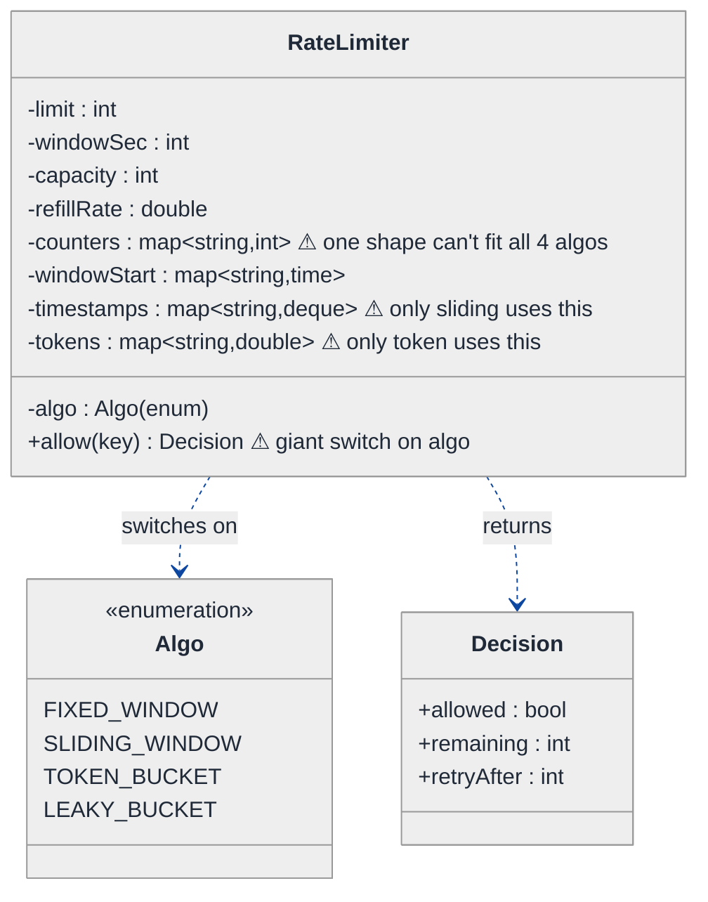
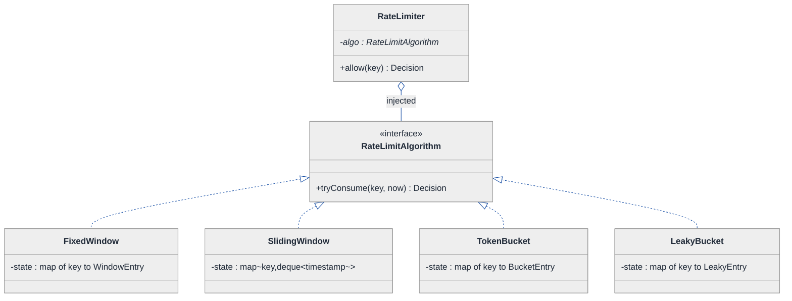
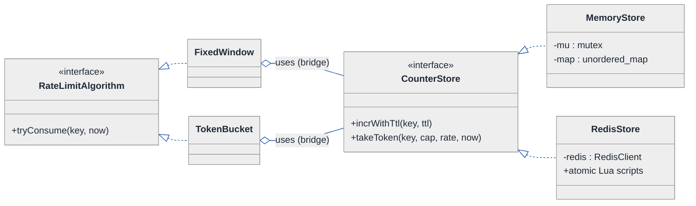
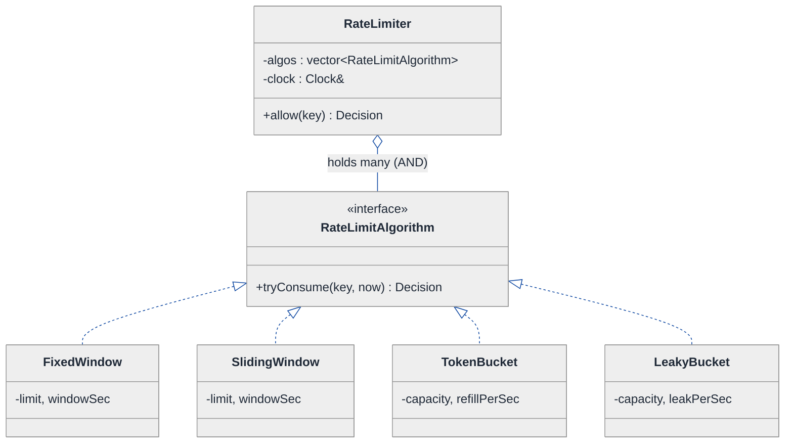
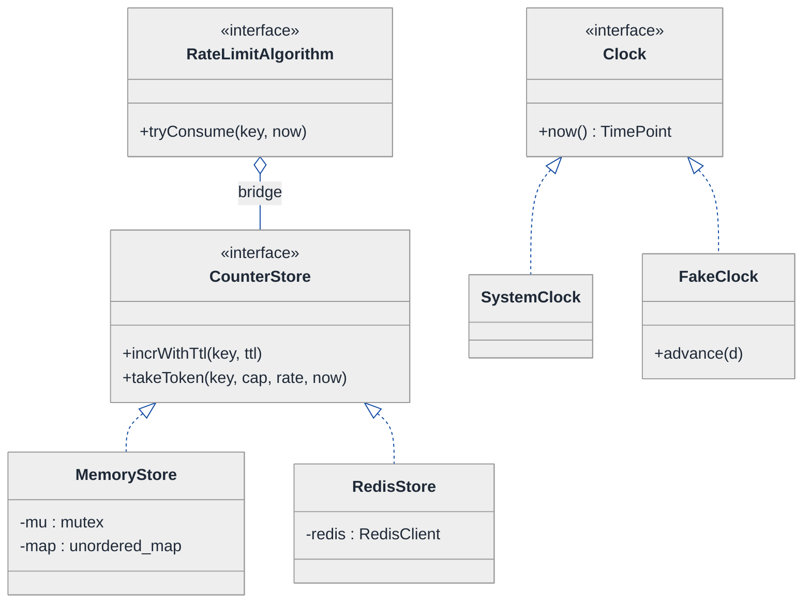
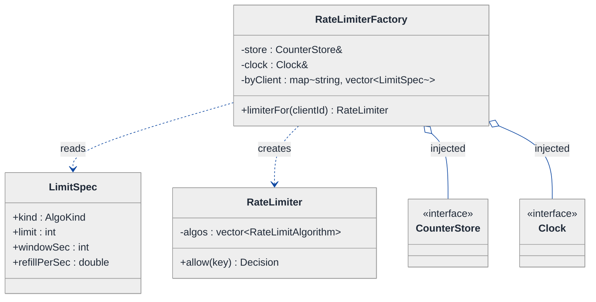
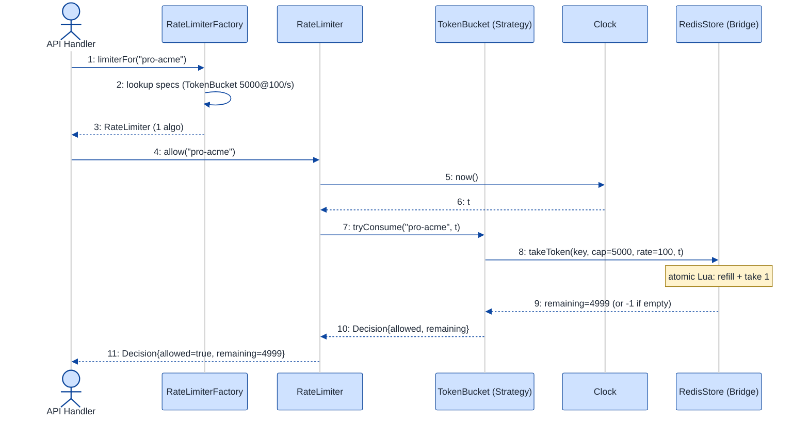

# Rate Limiter — LLD Walkthrough

> **Difficulty:** Hard · **Time:** ~45 min · **Pattern focus:** Strategy (the four algorithms) + Factory (per-client wiring) + Bridge/Strategy (the shared store) + Decorator (composing limits)
>
> **Problem source(s):** GID **SG12**, bucket `Strategy_Pattern`. Representative of multiple LeetLens rows in [`./EXTRACTED_QUESTIONS.md`](./EXTRACTED_QUESTIONS.md).
>
> **Diagrams:** inline mermaid (renders natively in GitHub / VS Code). Light-bg + soft pastel palette per the repo's canonical theme block.

---

## How to use this file

Paced for a candidate who has heard the words "token bucket" and "sliding window" but has never had to make them *coexist behind one interface*. Reading time: ~45 minutes if you sketch each iteration by hand. **The lesson: four named rate-limiting algorithms is a flashing neon sign for the Strategy pattern — but the senior bar is in noticing that the ALGORITHM, the STORE (in-memory vs Redis), and the PER-CLIENT POLICY are three INDEPENDENT axes of variation, and refusing to collapse them into one inheritance tree.**

**Map of this file (15 sections):**

1. Problem statement + clarifying questions
2. Plain-English restatement
3. Why this matters
4. Mental model
5. Try it yourself first
6. Entity & verb extraction
7. **Iteration 1: the naive design** — one class, four `if` branches
8. **Where the naive design hurts** — five future requirements, one painful diff each
9. **Pivot 1: Strategy for the algorithm** — the most painful axis first
10. **Pivot 2: Strategy (Bridge) for the shared store** — local vs distributed, swapped underneath
11. **Pivot 3: Factory + per-client config** — wiring the right limiter per caller
12. Final UML class diagram (three focused sub-views)
13. Skeleton code (C++)
14. Key flow — sequence diagram
15. Extensibility re-check + anti-patterns + how to think aloud + self-check

---

## 1. Problem statement + clarifying questions

**Prompt (typical phrasing):** "Design a rate limiter class supporting fixed window, sliding window, token bucket, and leaky bucket algorithms. It should be configurable per-client and support distributed usage with a shared store."

**Clarifying questions to ask BEFORE drawing anything:**

1. **What's the unit of limiting?** Requests per client-id? Per IP? Per (client, endpoint) tuple? This decides the *key* we count against.
2. **Single algorithm at a time, or must one deployment mix them?** i.e., can client A use token-bucket while client B uses sliding-window simultaneously? (This is the difference between "pick one at startup" and "swap per request.")
3. **What does `allow()` return?** Just a boolean, or a decision object with `retry-after` and `remaining` for the standard `429 Too Many Requests` + `X-RateLimit-*` headers?
4. **Distributed: how many app nodes, and what's the shared store?** Redis is the usual answer. Do we need strict correctness (atomic across nodes) or is approximate counting acceptable for throughput?
5. **Per-client config source?** Static map at boot, or a config service we hot-reload from? Are limits tiered (free / pro / enterprise)?
6. **Failure mode when the store is down?** Fail-open (allow everything) or fail-closed (reject everything)? This is a product decision with security implications.
7. **Time source?** Wall clock (`system_clock`) is fine for windows; but for token refill we want a monotonic clock so NTP adjustments don't grant free tokens.

**Assumptions if interviewer dodges:** key = client-id string; one deployment must support DIFFERENT algorithms for different clients (the hard, interesting case); `allow()` returns a `Decision { allowed, remaining, retryAfter }`; shared store is Redis with atomic Lua scripts; per-client config from a static map injected at boot; fail-open on store outage; monotonic clock for refill math.

---

## 2. Plain-English restatement

We're building the gatekeeper that sits in front of an API. For every incoming request it answers one question — *"has this client used up its allowance for the current period?"* — and returns allow/deny plus how long to wait. The catch is that "allowance" can be measured four different ways (fixed window, sliding window, token bucket, leaky bucket), the counters can live either in this process's memory or in a shared Redis (so a fleet of app servers agrees on the count), and each client can be on a different plan. The design must let us add a fifth algorithm, a third store backend, or a new client tier **without rewriting the request path**.

---

## 3. Why this matters

Rate limiting is *the* canonical "four algorithms behind one interface" interview prompt — it's almost designed to test whether you reach for Strategy. But the trap is subtler than Parking-Lot pricing: here there are THREE orthogonal axes (algorithm, store, per-client policy) and weak candidates fuse them into a single `RedisTokenBucketForProTier` class explosion. The skill being probed is *axis separation* — recognizing that "how I count" and "where I store the count" and "which limit applies to whom" vary independently, and that the cross-product is handled by composition, not by 4×2×3 = 24 subclasses. This exact shape reappears in feature flags, retry/backoff policies, caching eviction, and load balancers.

---

## 4. Mental model

A rate limiter is a **counter with a clock and a rule for forgetting**. Each algorithm is really just a different answer to *"how does the count decay over time?"*

```
Real-world sketch (NOT a UML diagram yet):

   request(clientId) ──►  ┌─────────────────────────────────┐
                          │  RateLimiter                     │
                          │                                  │
                          │   key = clientId                 │
                          │   ┌───────────┐   ┌───────────┐  │
                          │   │ ALGORITHM │ + │   STORE   │  │
                          │   │ how to    │   │ where the │  │
                          │   │ count/    │   │ count     │  │
                          │   │ decay     │   │ lives     │  │
                          │   └───────────┘   └───────────┘  │
                          └──────────────┬───────────────────┘
                                         ▼
                              Decision { allowed, remaining, retryAfter }

   Algorithm variants (how to decay):
     fixed window   :  count resets to 0 at the top of each window
     sliding window :  count = requests in the trailing T seconds
     token bucket   :  tokens refill at rate R, each request spends 1
     leaky bucket   :  requests queue and drain at constant rate R
```

The KEY insight from this picture: **the algorithm decides the math; the store decides the location; the client-config decides which (algorithm, limits) pair you instantiate.** Three knobs, turned independently. That separation is the whole design.

---

## 5. Try it yourself first

> **Predict before reading on:**
>
> 1. List the 4 algorithms. For each, what STATE does it need to persist per key? (Hint: they're not the same — one needs a list of timestamps, one needs two numbers.)
> 2. **If I told you that tomorrow the same service must run token-bucket in-memory for internal traffic AND sliding-window-on-Redis for public traffic, how many classes does that require?** If your answer is 4 (one per combination), pause — that's the trap.
> 3. Where does the `retry-after` value come from, and is it the same calculation for all four algorithms?

---

## 6. Entity & verb extraction

> **Mini-refresher: noun → class, but not every noun.**
>
> Naive OOD promotes every noun to a class. Senior OOD promotes a noun only if it has both BEHAVIOR and STATE that need to live together. "Window size" is a config field; "Algorithm" becomes a class because each variant carries genuinely different behavior AND different per-key state.

**Nouns from the prompt:**

| Noun | Decision | Why |
|---|---|---|
| RateLimiter | Class (the facade callers hit) | Owns `allow(key)`; delegates the math + storage |
| Algorithm (fixed/sliding/token/leaky) | Class (abstract) + 4 concrete | Each is a different decay rule — the core variability |
| Store (memory / Redis) | Class (abstract) + concrete | Where counters live; varies independently of algorithm |
| Client / clientId | Field (the `key`, a `std::string`) | No behavior; it's just the bucket label |
| Config / Limit (rate, capacity, window) | Value struct | Plain data passed to an algorithm |
| Decision | Value struct (`allowed`, `remaining`, `retryAfter`) | The return type — no behavior |
| Clock | Injected dependency (abstract) | So tests can fast-forward time |

**Verbs (and the class they live on):**

| Verb | Owner class (naive answer — we'll re-examine) |
|---|---|
| allow(key) | RateLimiter, delegating to Algorithm |
| tryConsume(key, now) | Algorithm |
| get(key) / set(key, state) / incr(...) | Store |
| now() | Clock |
| limiterFor(clientId) | (no home yet — emerges as Factory in §11) |

**We have NOT introduced any design patterns yet.** Pure nouns + verbs.

---

## 7. <a id="iter-1"></a>Iteration 1: the naive design

Let's write the simplest thing that could possibly work: ONE class, an `enum` for the algorithm, and a `switch`. The counters live in a `std::unordered_map` member. No store abstraction, no per-client config — every caller gets the same limit.



**Reader's tour (read top to bottom; ~60 seconds).**

1. **One God-class — `RateLimiter`.** It holds the algorithm *as an enum* and ALL config fields for ALL four algorithms flattened together (`limit`, `windowSec`, `capacity`, `refillRate`). Most are unused for any single algorithm — `capacity`/`refillRate` mean nothing to fixed-window.

2. **Three different per-key state maps (⚠).** Fixed-window needs `(count, windowStart)`. Sliding-window needs a `deque` of timestamps. Token-bucket needs `(tokens, lastRefill)`. They have NOTHING in common, so the naive class carries all three maps and uses only the subset its current `algo` needs. The other two-thirds of memory is dead weight per key.

3. **`allow()` is a giant `switch` (⚠).** One method, four branches, each branch a different ~10-line algorithm. The method is the entire design.

4. **No store abstraction.** The maps ARE the storage, hardcoded in-process. "Distributed usage with a shared store" — the second half of the prompt — isn't even *expressible* here.

5. **No per-client anything.** `limit` is a single field. Every key shares it. "Configurable per-client" — also not expressible.

**What's deliberately missing.** No `Algorithm` interface. No `Store` interface. No `Clock`. No per-client `Limit` lookup. The naive design hardcodes a single answer to all three axes. That's what the next sections expose and fix.

Skeleton code for the naive design (C++):

```cpp
#include <chrono>
#include <deque>
#include <string>
#include <unordered_map>

enum class Algo { FIXED_WINDOW, SLIDING_WINDOW, TOKEN_BUCKET, LEAKY_BUCKET };

struct Decision { bool allowed; int remaining; int retryAfter; };

class RateLimiter {
public:
    RateLimiter(Algo a, int limit, int windowSec, int capacity, double refillRate)
        : algo_(a), limit_(limit), windowSec_(windowSec),
          capacity_(capacity), refillRate_(refillRate) {}

    Decision allow(const std::string& key) {            // giant switch — will hurt
        auto now = std::chrono::steady_clock::now();
        switch (algo_) {
            case Algo::FIXED_WINDOW: {
                auto& ws = windowStart_[key];
                long elapsed = secsSince(ws, now);
                if (elapsed >= windowSec_) { ws = now; count_[key] = 0; }   // reset
                if (count_[key] < limit_) { count_[key]++; return {true,  limit_-count_[key], 0}; }
                return {false, 0, windowSec_ - (int)elapsed};
            }
            case Algo::SLIDING_WINDOW: {
                auto& dq = stamps_[key];                                    // only sliding uses this
                while (!dq.empty() && secsSince(dq.front(), now) >= windowSec_) dq.pop_front();
                if ((int)dq.size() < limit_) { dq.push_back(now); return {true, limit_-(int)dq.size(), 0}; }
                return {false, 0, windowSec_};
            }
            case Algo::TOKEN_BUCKET: {
                refill(key, now);                                           // only token uses tokens_
                if (tokens_[key] >= 1.0) { tokens_[key] -= 1.0; return {true, (int)tokens_[key], 0}; }
                return {false, 0, (int)(1.0 / refillRate_)};
            }
            case Algo::LEAKY_BUCKET: {
                // drain queue at refillRate_, admit if room ... (another ~10 lines)
                return {true, 0, 0};
            }
        }
        return {false, 0, 0};
    }
private:
    long secsSince(...) const;  void refill(const std::string&, ...);  // elided
    Algo  algo_;
    int   limit_, windowSec_, capacity_;
    double refillRate_;
    std::unordered_map<std::string,int>                         count_;       // fixed
    std::unordered_map<std::string,std::chrono::steady_clock::time_point> windowStart_; // fixed
    std::unordered_map<std::string,std::deque<std::chrono::steady_clock::time_point>> stamps_; // sliding
    std::unordered_map<std::string,double>                      tokens_;      // token
};
```

**This works.** It has zero design patterns. You can rate-limit with any of the four algorithms by passing a different `Algo` enum. So what's wrong with it?

---

## 8. <a id="naive-pain"></a>Where the naive design hurts

The interviewer slides over the roadmap: "Here are five things coming next quarter. Walk me through what changes."

### Change A: "Add a sixth algorithm — generic cell rate (GCRA)"

In the naive design:
- Add `GCRA` to the `Algo` enum.
- Add a `case Algo::GCRA:` to the `switch` inside `allow()`.
- GCRA needs a *new* per-key state shape (a single "theoretical arrival time" double) → add a FOURTH state map member.
- **The `allow()` method grows another branch; the class grows another map. Every new algorithm is surgery in the same method + a new member field.**

### Change B: "Go distributed — counters must live in Redis so all 8 app nodes agree"

In the naive design:
- The per-key maps ARE the storage. There's no seam to swap.
- You'd have to rewrite EVERY branch of `allow()` to read/write Redis instead of the local map — and do it atomically (a `GET`-then-`SET` race lets two nodes both see count=4 and both allow).
- **Storage is entangled with algorithm in all four branches. There is no single place to change. The prompt's "shared store" requirement is architecturally impossible without a rewrite.**

### Change C: "Per-client tiers — free=10/min, pro=1000/min, enterprise=custom"

In the naive design:
- `limit_`, `windowSec_`, etc. are single fields on one limiter.
- You'd instantiate one `RateLimiter` per tier and route by hand at every call site — or stuff a `map<clientId, Config>` plus a config-lookup inside `allow()`.
- **Config resolution leaks into the algorithm method, OR call sites must know which limiter to pick. Either way, "configurable per-client" has no clean home.**

### Change D: "Compose limits — 100/sec AND 5000/hour for the same client"

In the naive design:
- One limiter holds ONE algorithm with ONE window. You can't express "both must pass."
- You'd nest the two checks inline in the caller, or add a `vector<Algo>` and loop in `allow()` — but the config fields are scalars, not per-rule.
- **No way to AND two independent limits without bolting a loop onto the God-class.**

### Change E: "Make it testable — freeze time so a 60-second window test runs in 1ms"

In the naive design:
- `allow()` calls `std::chrono::steady_clock::now()` directly, four times, inline.
- **Time is hardwired. You can't fast-forward. Every window test must literally sleep.**

### The pattern of pain

| Change | Files/sites touched | Smell |
|---|---|---|
| A. New algorithm | `allow()` switch + new state map field | "Open/closed violation — every algorithm edits the same method." |
| B. Distributed store | all 4 switch branches | "Storage entangled with algorithm; no swappable seam." |
| C. Per-client tiers | `allow()` + every call site | "Config resolution has no owner." |
| D. Compose limits | God-class + caller | "Can't AND two limits without a loop in the God-class." |
| E. Testable time | `allow()` (4 `now()` calls) | "Time is a hardwired dependency." |

**Three axes of pain dominate:** the *algorithm* itself varies (A, D), the *storage location* varies (B), and the *per-client policy* varies (C). Time (E) is a smaller dependency-injection fix we'll fold in along the way.

> **Pivot question:** "What pattern handles 'a whole algorithm that varies, swapped by the caller'? What pattern handles 'the same operation backed by a different storage mechanism underneath'? And what creates the right object per client without the call site knowing the wiring?"
>
> The answers are Strategy (algorithm), Strategy/Bridge (store), and Factory (per-client wiring). Let's introduce them one at a time, starting with the most painful axis: the algorithm.

---

## 9. <a id="pivot-1"></a>Pivot 1: Strategy for the algorithm

> **Mini-refresher: Strategy pattern.**
>
> Encapsulates an algorithm behind an interface so it can be swapped at runtime. The CALLER (or a factory) decides which strategy to use; the strategy doesn't know about its peers. Each concrete strategy owns whatever private state IT needs — they don't have to share a state shape.
>
> Quick example: a `Sorter` takes a `CompareStrategy*`. Pass `Ascending` or `Descending`; the sorter doesn't care.

**Why Strategy fits the algorithm axis.** "Fixed window / sliding window / token bucket / leaky bucket" is the textbook trigger: four interchangeable implementations of one contract — *"given a key and the current time, may this request proceed, and what's the remaining/retry-after?"* The choice is made externally (by per-client config), the variants are unaware of each other, and — crucially — each carries DIFFERENT private state. Strategy lets each concrete class own exactly the state it needs (`TokenBucket` keeps `(tokens, lastRefill)`; `SlidingWindow` keeps a timestamp deque) instead of the naive God-class carrying all of them.

**The contract.** Note we DON'T pass storage in yet (that's Pivot 2) — for now each strategy keeps its own in-memory state, exactly like the naive maps but isolated per class.

```cpp
struct Decision { bool allowed; int remaining; int retryAfter; };

// The Strategy interface — one method, the whole algorithm behind it.
class RateLimitAlgorithm {
public:
    virtual ~RateLimitAlgorithm() = default;
    // returns the decision AND records the request if allowed (atomic per call)
    virtual Decision tryConsume(const std::string& key, TimePoint now) = 0;
};

// Concrete strategy #1 — fixed window.
class FixedWindow : public RateLimitAlgorithm {
public:
    FixedWindow(int limit, int windowSec) : limit_(limit), windowSec_(windowSec) {}
    Decision tryConsume(const std::string& key, TimePoint now) override {
        auto& s = state_[key];                       // {count, windowStart}
        if (secs(now - s.windowStart) >= windowSec_) { s = {0, now}; }   // roll window
        if (s.count < limit_) { ++s.count; return {true, limit_ - s.count, 0}; }
        return {false, 0, windowSec_ - (int)secs(now - s.windowStart)};
    }
private:
    struct St { int count = 0; TimePoint windowStart{}; };
    int limit_, windowSec_;
    std::unordered_map<std::string, St> state_;       // ONLY the state THIS algo needs
};

// Concrete strategy #2 — token bucket (different state, same interface).
class TokenBucket : public RateLimitAlgorithm {
public:
    TokenBucket(double capacity, double refillPerSec)
        : capacity_(capacity), refillPerSec_(refillPerSec) {}
    Decision tryConsume(const std::string& key, TimePoint now) override {
        auto& s = state_[key];                        // {tokens, lastRefill}
        double add = secs(now - s.lastRefill) * refillPerSec_;
        s.tokens = std::min(capacity_, s.tokens + add);
        s.lastRefill = now;
        if (s.tokens >= 1.0) { s.tokens -= 1.0; return {true, (int)s.tokens, 0}; }
        return {false, 0, (int)((1.0 - s.tokens) / refillPerSec_)};
    }
private:
    struct St { double tokens; TimePoint lastRefill; };
    double capacity_, refillPerSec_;
    std::unordered_map<std::string, St> state_;
};
// SlidingWindow, LeakyBucket elided — same interface, their own private state.

class RateLimiter {
    std::unique_ptr<RateLimitAlgorithm> algo_;        // injected; the switch is GONE
};
```

**What changed — visualized.** Just the algorithm slice:



**Tour of the after-state.**

1. **`RateLimiter` lost its `switch` and all its config fields.** It now holds ONE pointer to a `RateLimitAlgorithm` interface, injected at construction (open diamond `◇` = aggregation — the limiter uses an algorithm; ownership detail comes later). `allow()` is a one-liner that delegates to `algo_->tryConsume(...)`.

2. **The `<<interface>>` box declares the entire contract.** A single method `tryConsume(key, now) → Decision`. That's the narrowest possible surface — give it a key and a time, get a verdict.

3. **Four concrete strategies, each owning DIFFERENT state.** This is the payoff over the naive design: `FixedWindow` keeps `{count, windowStart}`; `SlidingWindow` keeps a `deque` of timestamps; `TokenBucket` keeps `{tokens, lastRefill}`; `LeakyBucket` keeps `{queue, lastLeak}`. No class carries state it doesn't use. The naive design's three dead maps per key are gone.

4. **Adding Change A (GCRA) is now ONE new class.** Write `class GCRA : public RateLimitAlgorithm` with its own `{tat}` state. No edit to `RateLimiter`, no edit to the other four strategies, no enum to grow. Open/closed.

**Change A and Change E land cleanly here.** New algorithm → new class. And time: notice `tryConsume` already TAKES `now` as a parameter instead of calling the clock itself — that's the seam for injecting a fake clock in tests (Change E). The `RateLimiter` will own a `Clock` and pass `clock_->now()` down.

**Pattern-discrimination cheatsheet — Strategy vs State.**
- *Strategy:* the CALLER (here, per-client config) picks which algorithm; the four are peers, unaware of each other; the choice rarely changes during a key's life.
- *State:* the OBJECT transitions itself between states based on internal events (Active → Paid → Exited); states know about each other.
- *Rule of thumb:* `limiter.useAlgorithm(tokenBucket)` set from outside → Strategy. `ticket.pay()` flipping the ticket's own state internally → State. A rate limiter never "becomes" sliding-window because of an event it processed — config picks it. **Strategy.**

**Pattern-discrimination cheatsheet — Strategy vs Template Method (why not inheritance?).**
- *Template Method:* algorithm skeleton in a base class; subclasses override hook steps. Good when the four variants share a common skeleton.
- *Strategy:* whole algorithm swapped via composition.
- *Rule of thumb:* do the four algorithms share a common skeleton? Barely — token-bucket and sliding-window have almost no shared steps. And we want to combine/swap them at runtime (Change D, Change C). Composition wins. **Strategy.**

---

## 10. <a id="pivot-2"></a>Pivot 2: Strategy (Bridge) for the shared store

Change B is still unsolved. Right now each strategy keeps its counters in a private `unordered_map` — fine for one process, useless across 8 nodes. We need the SAME algorithm to run against either local memory or a shared Redis, chosen independently of WHICH algorithm it is.

> **Mini-refresher: Bridge pattern (Strategy's structural cousin).**
>
> Bridge splits an abstraction (the algorithm) from its implementation (the storage) so the two vary INDEPENDENTLY, connected by a reference. Mechanically it looks just like Strategy — an interface injected into a class — but the INTENT differs: Strategy swaps *behavior the caller chose*; Bridge decouples *two dimensions that would otherwise cross-multiply into a subclass explosion*. Here the cross-product is `{4 algorithms} × {2 stores} = 8`. Without the bridge you'd write 8 classes; with it you write `4 + 2`.

**Why a Store interface (Bridge), not 8 subclasses.** The naive trap (and the weak-candidate answer) is `RedisTokenBucket`, `MemoryTokenBucket`, `RedisSlidingWindow`, ... — the 4×2 explosion from §5 question 2. Instead we give the algorithm a `CounterStore*` it talks to for ALL persistence. Token-bucket asks the store *"atomically refill and try to take one token"*; the store answers either from a local map or from a Redis Lua script. The algorithm doesn't know or care which.

```cpp
// The Bridge: storage abstraction the algorithms talk to.
// Each method must be ATOMIC (read-modify-write) so concurrent nodes don't race.
class CounterStore {
public:
    virtual ~CounterStore() = default;
    // Atomic: increment counter for key, return new value; create with TTL if absent.
    virtual long incrWithTtl(const std::string& key, int ttlSec) = 0;
    // Token-bucket primitive: atomically refill by elapsed*rate, take 1, return remaining (-1 = denied).
    virtual double takeToken(const std::string& key, double capacity,
                             double refillPerSec, TimePoint now) = 0;
    // ... sliding-window log ops elided ...
};

class MemoryStore : public CounterStore {           // single-process; a guarded map
    long   incrWithTtl(const std::string&, int) override;        // elided
    double takeToken(const std::string&, double, double, TimePoint) override; // elided
    // std::mutex + unordered_map under the hood
};

class RedisStore : public CounterStore {            // distributed; atomic Lua scripts
public:
    explicit RedisStore(RedisClient& c) : redis_(c) {}
    long incrWithTtl(const std::string& key, int ttlSec) override {
        // EVAL "local v=redis.call('INCR',KEYS[1]); if v==1 then redis.call('EXPIRE',...) end; return v"
        return redis_.evalIncr(key, ttlSec);
    }
    double takeToken(const std::string& key, double cap, double rate, TimePoint now) override {
        return redis_.evalTokenBucket(key, cap, rate, toMillis(now));   // atomic Lua
    }
private:
    RedisClient& redis_;
};

// Algorithms no longer hold their own map — they hold a CounterStore& (the bridge).
class FixedWindow : public RateLimitAlgorithm {
public:
    FixedWindow(int limit, int windowSec, CounterStore& store)
        : limit_(limit), windowSec_(windowSec), store_(store) {}
    Decision tryConsume(const std::string& key, TimePoint now) override {
        std::string wkey = key + ":" + std::to_string(windowIndex(now));   // window-bucketed key
        long n = store_.incrWithTtl(wkey, windowSec_);                     // ATOMIC across nodes
        if (n <= limit_) return {true, (int)(limit_ - n), 0};
        return {false, 0, secsToWindowEnd(now)};
    }
private:
    int limit_, windowSec_;
    CounterStore& store_;     // the bridge — local OR redis, algorithm doesn't know
};
```

**What changed — visualized.** Just the store slice:



**Tour of the after-state.**

1. **Two interfaces now, perpendicular to each other.** `RateLimitAlgorithm` (left) is the *abstraction* — "how to count." `CounterStore` (right) is the *implementation* — "where the count lives." The bridge is the `◇` line connecting every algorithm to a `CounterStore&`.

2. **Each algorithm pushed its state DOWN into the store.** `FixedWindow` no longer owns a map; it calls `store_.incrWithTtl(...)`. The atomicity that was impossible in the naive design (the `GET`-then-`SET` race from Change B) is now the store's job — `MemoryStore` uses a mutex, `RedisStore` uses an atomic Lua `EVAL`.

3. **The cross-product collapsed.** `{Fixed, Sliding, Token, Leaky} × {Memory, Redis}` would be 8 classes by inheritance. With the bridge it's `4 algorithms + 2 stores = 6`, and adding a third store (e.g., DynamoDB) is `+1`, not `+4`. **This is the entire reason to reach for Bridge over more subclasses.**

4. **Distributed correctness lives in ONE place.** The "all 8 nodes must agree" requirement (Change B) reduces to "make `RedisStore`'s operations atomic." The algorithms are oblivious — `FixedWindow::tryConsume` reads identically whether it's hitting memory or Redis.

**Change B lands cleanly:** inject `RedisStore` instead of `MemoryStore` at construction; not one line of algorithm code changes.

**Pattern-discrimination cheatsheet — Bridge vs Strategy (they look identical!).**
- *Strategy:* one axis varies (the algorithm); the caller picks the variant for its behavior.
- *Bridge:* TWO axes vary independently (algorithm × store) and you're avoiding their cross-product; the second axis is an *implementation detail* the first delegates to, not a behavior the caller is choosing for its own sake.
- *Rule of thumb:* if removing the second interface forces an N×M subclass grid → it was a Bridge. Here, drop `CounterStore` and you're back to `RedisTokenBucket`/`MemoryTokenBucket`/... — so it's Bridge. (Honestly, Strategy and Bridge are the same *shape*; naming it Bridge in the interview signals you understand the cross-product motivation, which is the point.)

---

## 11. <a id="pivot-3"></a>Pivot 3: Factory + per-client config (and composing limits)

Changes C and D remain. We can now build *any* (algorithm, store) limiter — but WHO decides that the `free` tier gets `FixedWindow(10, 60)` while `enterprise` gets `TokenBucket(5000, 100)`? And how do we express "100/sec AND 5000/hour"? The request path must NOT contain that wiring.

> **Mini-refresher: Factory pattern.**
>
> A Factory centralizes object CREATION so callers ask for a thing by intent ("give me the limiter for this client") without naming concrete classes or knowing the constructor arguments. It turns scattered `new FixedWindow(10,60, store)` calls into one `factory.limiterFor(clientId)`.

> **Mini-refresher: Open/Closed Principle (the "O" in SOLID).**
>
> Software entities should be OPEN for extension but CLOSED for modification. Adding a client tier or an algorithm should mean writing NEW code (a new config row, a new class), not EDITING existing, tested code. Pivots 1–3 each move one axis from "edit a switch" to "add a class/row" — that's OCP made concrete.

**The Factory reads per-client config and wires the right limiter.** Config is data (a `LimitSpec`), so a new tier is a new MAP ENTRY, not new code in the request path.

```cpp
// Per-client configuration — pure data.
enum class AlgoKind { FixedWindow, SlidingWindow, TokenBucket, LeakyBucket };
struct LimitSpec {
    AlgoKind kind;
    int      limit;       // requests per window  (or capacity for buckets)
    int      windowSec;   // window length        (or refill basis)
    double   refillPerSec;
};

class RateLimiterFactory {
public:
    RateLimiterFactory(CounterStore& store, Clock& clock,
                       std::unordered_map<std::string, std::vector<LimitSpec>> byClient)
        : store_(store), clock_(clock), byClient_(std::move(byClient)) {}

    // Returns a limiter wired with the client's algorithm(s) + the shared store.
    std::unique_ptr<RateLimiter> limiterFor(const std::string& clientId) const {
        auto it = byClient_.find(clientId);
        const auto& specs = (it != byClient_.end()) ? it->second : defaultSpecs_;
        std::vector<std::unique_ptr<RateLimitAlgorithm>> algos;
        for (const auto& s : specs) algos.push_back(make(s));     // one per rule (Change D)
        return std::make_unique<RateLimiter>(std::move(algos), clock_);
    }
private:
    std::unique_ptr<RateLimitAlgorithm> make(const LimitSpec& s) const {
        switch (s.kind) {   // the ONE allowed switch — isolated in the factory, not the request path
            case AlgoKind::FixedWindow:   return std::make_unique<FixedWindow>(s.limit, s.windowSec, store_);
            case AlgoKind::TokenBucket:   return std::make_unique<TokenBucket>(s.limit, s.refillPerSec, store_);
            case AlgoKind::SlidingWindow: return std::make_unique<SlidingWindow>(s.limit, s.windowSec, store_);
            case AlgoKind::LeakyBucket:   return std::make_unique<LeakyBucket>(s.limit, s.refillPerSec, store_);
        }
        throw std::logic_error("unknown algo");
    }
    CounterStore& store_;
    Clock&        clock_;
    std::unordered_map<std::string, std::vector<LimitSpec>> byClient_;
    std::vector<LimitSpec> defaultSpecs_;
};

// RateLimiter now holds a LIST of algorithms — Change D, "AND" of limits — and ALLs them.
class RateLimiter {
public:
    RateLimiter(std::vector<std::unique_ptr<RateLimitAlgorithm>> algos, Clock& clock)
        : algos_(std::move(algos)), clock_(clock) {}
    Decision allow(const std::string& key) {
        Decision worst{true, INT_MAX, 0};
        for (auto& a : algos_) {                       // every rule must pass (Decorator-ish AND)
            Decision d = a->tryConsume(key, clock_.now());
            if (!d.allowed) return d;                  // first denial wins, carries its retryAfter
            worst.remaining = std::min(worst.remaining, d.remaining);
        }
        return worst;
    }
private:
    std::vector<std::unique_ptr<RateLimitAlgorithm>> algos_;
    Clock& clock_;
};
```

> **Mini-refresher: Dependency Injection.**
>
> Notice the Factory RECEIVES `CounterStore&` and `Clock&` rather than `new`-ing them. The composition root (main/bootstrap) decides memory-vs-redis and real-vs-fake-clock ONCE and hands them down. Tests inject `MemoryStore` + a fake clock; production injects `RedisStore` + the real clock. Same code path.

**The lesson.** Once Pivot 1 named "algorithm = Strategy," Changes C and D became *configuration*, not *code*: a new tier is a `byClient_` map entry, and "AND two limits" is a two-element `vector<LimitSpec>` that `RateLimiter::allow` loops over and short-circuits on first denial. The single remaining `switch` is quarantined inside the factory's `make()` — it touches creation only, never the request path.

**Pattern-discrimination cheatsheet — Factory vs Builder.**
- *Factory:* pick + construct a product by intent in one call (`limiterFor(clientId)`); the variation is *which concrete type*.
- *Builder:* assemble ONE complex product step-by-step with a fluent API; the variation is *which optional parts*.
- *Rule of thumb:* choosing among types from a key → Factory. Assembling a many-field object incrementally → Builder. We pick a type per client → **Factory.**

---

## 12. <a id="fig-class-diagram"></a>Final class diagram

One giant diagram would be a wall of boxes. Here are **three focused sub-views**; the structural insight at the end ties them together.

### 12.1 The algorithm axis — the four Strategies



**Tour of 12.1.** `RateLimiter` holds a `vector` of `RateLimitAlgorithm` (open diamond = aggregation) so it can AND several limits (Change D), looping and short-circuiting on the first denial. The four concrete strategies implement one method, each parameterized by ITS own config — no shared God-config. Adding a fifth (GCRA) is one new leaf box.

### 12.2 The store axis — the Bridge



**Tour of 12.2.** Every algorithm holds a `CounterStore&` (the bridge — one reference, swappable). `MemoryStore` guards a map with a mutex; `RedisStore` runs atomic Lua. The `Clock` interface (with `SystemClock` for prod, `FakeClock` for tests) is injected the same way — that's the testable-time fix (Change E). The cross-product `{4 algos} × {2 stores}` stays at `4 + 2`, not `8`.

### 12.3 The wiring axis — the Factory + config



**Tour of 12.3.** `RateLimiterFactory` is the only place that maps a `clientId` → `vector<LimitSpec>` and constructs the wired `RateLimiter`. A new tier is a new `byClient_` entry (pure data); the single allowed `switch` lives in the factory's `make()`, isolated from the request path. The factory receives `CounterStore&` + `Clock&` by injection, so the composition root picks memory/redis and real/fake-clock once.

### Structural insight (ties 12.1 + 12.2 + 12.3 together)

| Axis | Pattern | Why |
|---|---|---|
| **Algorithm** (fixed/sliding/token/leaky) | Strategy, injected as a list | Four interchangeable behaviors; caller-config picks; AND-able |
| **Store** (memory / Redis / future DynamoDB) | Bridge (Strategy-shaped), injected | Decouples "where" from "how" to avoid the 4×N subclass grid |
| **Per-client policy** (tiers, combined limits) | Factory + data `LimitSpec` | New tier = config row, not code on the request path |
| **Time** | Dependency Injection (`Clock`) | Fake clock fast-forwards window tests |

The big lesson: **three things vary, so there are three seams, NOT one inheritance tree.** A weak design fuses them into `RedisTokenBucketProTier`; the strong design composes `Factory( Strategy[ ] over a Bridge store )`. *One interface per axis of change.*

---

## 13. Skeleton code (C++)

> Show the SHAPES, not the full impl. ~140 lines. `// elided` marks the labor we skip.

```cpp
#include <chrono>
#include <climits>
#include <memory>
#include <mutex>
#include <string>
#include <unordered_map>
#include <vector>

using TimePoint = std::chrono::steady_clock::time_point;
inline double secs(std::chrono::steady_clock::duration d) {
    return std::chrono::duration<double>(d).count();
}

// ── Value types ─────────────────────────────────────────────────────
struct Decision { bool allowed; int remaining; int retryAfter; };
enum class AlgoKind { FixedWindow, SlidingWindow, TokenBucket, LeakyBucket };
struct LimitSpec { AlgoKind kind; int limit; int windowSec; double refillPerSec; };

// ── Clock (DI seam for testable time) ───────────────────────────────
class Clock {
public:
    virtual ~Clock() = default;
    virtual TimePoint now() const = 0;
};
class SystemClock : public Clock {
public: TimePoint now() const override { return std::chrono::steady_clock::now(); }
};
class FakeClock : public Clock {            // test double
public:
    TimePoint now() const override { return t_; }
    void advance(std::chrono::seconds d)   { t_ += d; }
private: TimePoint t_ = TimePoint{};
};

// ── Store (Bridge: where counters live; ops MUST be atomic) ─────────
class CounterStore {
public:
    virtual ~CounterStore() = default;
    virtual long   incrWithTtl(const std::string& key, int ttlSec) = 0;
    virtual double takeToken(const std::string& key, double cap,
                             double refillPerSec, TimePoint now) = 0;
    // sliding-window log primitives elided
};
class MemoryStore : public CounterStore {
public:
    long incrWithTtl(const std::string& key, int ttlSec) override {
        std::lock_guard<std::mutex> g(mu_);
        /* expire-if-stale then ++ ; elided */ return ++counts_[key];
    }
    double takeToken(const std::string&, double, double, TimePoint) override; // elided
private:
    std::mutex mu_;
    std::unordered_map<std::string, long> counts_;
};
class RedisStore : public CounterStore {     // distributed via atomic Lua EVAL
public:
    explicit RedisStore(class RedisClient& c) : redis_(c) {}
    long   incrWithTtl(const std::string& key, int ttlSec) override;          // elided (Lua)
    double takeToken(const std::string&, double, double, TimePoint) override; // elided (Lua)
private:
    RedisClient& redis_;
};

// ── Strategy: the algorithm interface + 2 representative impls ──────
class RateLimitAlgorithm {
public:
    virtual ~RateLimitAlgorithm() = default;
    virtual Decision tryConsume(const std::string& key, TimePoint now) = 0;
};

class FixedWindow : public RateLimitAlgorithm {
public:
    FixedWindow(int limit, int windowSec, CounterStore& store)
        : limit_(limit), windowSec_(windowSec), store_(store) {}
    Decision tryConsume(const std::string& key, TimePoint now) override {
        std::string wkey = key + ":" + std::to_string(windowIndex(now));
        long n = store_.incrWithTtl(wkey, windowSec_);          // atomic across nodes
        if (n <= limit_) return {true, (int)(limit_ - n), 0};
        return {false, 0, secsToWindowEnd(now)};
    }
private:
    long windowIndex(TimePoint) const;  int secsToWindowEnd(TimePoint) const; // elided
    int limit_, windowSec_;
    CounterStore& store_;       // bridge
};

class TokenBucket : public RateLimitAlgorithm {
public:
    TokenBucket(double capacity, double refillPerSec, CounterStore& store)
        : capacity_(capacity), refillPerSec_(refillPerSec), store_(store) {}
    Decision tryConsume(const std::string& key, TimePoint now) override {
        double remaining = store_.takeToken(key, capacity_, refillPerSec_, now);
        if (remaining >= 0) return {true, (int)remaining, 0};
        return {false, 0, (int)(1.0 / refillPerSec_)};
    }
private:
    double capacity_, refillPerSec_;
    CounterStore& store_;       // bridge
};
// SlidingWindow, LeakyBucket elided — same interface, store-backed state.

// ── RateLimiter: holds a list of algorithms; ANDs them ──────────────
class RateLimiter {
public:
    RateLimiter(std::vector<std::unique_ptr<RateLimitAlgorithm>> algos, Clock& clock)
        : algos_(std::move(algos)), clock_(clock) {}
    Decision allow(const std::string& key) {
        Decision worst{true, INT_MAX, 0};
        for (auto& a : algos_) {
            Decision d = a->tryConsume(key, clock_.now());
            if (!d.allowed) return d;                  // first denial short-circuits
            worst.remaining = std::min(worst.remaining, d.remaining);
        }
        return worst;
    }
private:
    std::vector<std::unique_ptr<RateLimitAlgorithm>> algos_;
    Clock& clock_;
};

// ── Factory: per-client wiring; the ONE allowed switch lives here ───
class RateLimiterFactory {
public:
    RateLimiterFactory(CounterStore& store, Clock& clock,
                       std::unordered_map<std::string, std::vector<LimitSpec>> byClient)
        : store_(store), clock_(clock), byClient_(std::move(byClient)) {}
    std::unique_ptr<RateLimiter> limiterFor(const std::string& clientId) const {
        auto it = byClient_.find(clientId);
        const auto& specs = (it != byClient_.end()) ? it->second : defaultSpecs_;
        std::vector<std::unique_ptr<RateLimitAlgorithm>> algos;
        for (const auto& s : specs) algos.push_back(make(s));
        return std::make_unique<RateLimiter>(std::move(algos), clock_);
    }
private:
    std::unique_ptr<RateLimitAlgorithm> make(const LimitSpec& s) const {
        switch (s.kind) {       // isolated to creation; never on the request path
            case AlgoKind::FixedWindow:   return std::make_unique<FixedWindow>(s.limit, s.windowSec, store_);
            case AlgoKind::TokenBucket:   return std::make_unique<TokenBucket>(s.limit, s.refillPerSec, store_);
            // SlidingWindow, LeakyBucket elided
            default: throw std::logic_error("unknown algo");
        }
    }
    CounterStore& store_;
    Clock& clock_;
    std::unordered_map<std::string, std::vector<LimitSpec>> byClient_;
    std::vector<LimitSpec> defaultSpecs_;
};
```

---

## 14. <a id="fig-sequence"></a>Key flow — sequence diagram

The moment of truth — read across the swimlanes to see how the three patterns COOPERATE on one request.



**Tour of the flow. Read slowly — this is where all three patterns meet.**

1. **API handler asks the Factory for the client's limiter (msg 1-3).** The handler names the client by ID, not by algorithm. The Factory resolves `"pro-acme"` → its `LimitSpec` list and returns a wired `RateLimiter`. The handler never names `TokenBucket` or `RedisStore` — **Factory hides the wiring.** (In production you'd cache this per client rather than rebuild each request.)

2. **Handler calls `allow(key)` (msg 4).** This is the ONLY method on the request path. No switch, no config lookup, no Redis knowledge here.

3. **Limiter stamps the time via the injected Clock (msg 5-6).** In prod that's `SystemClock`; in tests a `FakeClock` you can `advance(60s)`. **Dependency Injection — time isn't hardwired.** The limiter then loops its algorithm list (here just one).

4. **Limiter delegates to the algorithm's `tryConsume` (msg 7).** This is the Strategy-pattern moment: the limiter holds an interface pointer and calls one polymorphic method. Swap the spec to `SlidingWindow` and msgs 4-11 read identically.

5. **The algorithm asks the Store to do the atomic counting (msg 8-9).** This is the Bridge-pattern moment: `TokenBucket` calls `store_.takeToken(...)` and is OBLIVIOUS that it's Redis running a Lua script. Swap `RedisStore` for `MemoryStore` and the algorithm code doesn't change. The atomicity that guarantees 8 nodes agree lives entirely inside the store.

6. **Decision bubbles back up unchanged (msg 10-11).** Each layer just passes the verdict through. The handler turns `allowed=false` into HTTP 429 with `Retry-After: retryAfter`.

### The branching that's NOT shown — and why it matters

You don't see a single `if (algo == TOKEN_BUCKET)` or `if (store == REDIS)` anywhere in this diagram. The naive design's giant `switch` has dissolved into polymorphic dispatch across two interfaces. **Choosing an algorithm and choosing a store are decisions made ONCE at wiring time (msg 2), never re-litigated on the hot path.** That's the difference between a design that scales to a fifth algorithm / third store and one that grows a new `case` in a 200-line method every quarter.

---

## 15. Extensibility re-check + anti-patterns + how to think aloud + self-check

### Extensibility re-check

Revisit the five changes from [§8](#naive-pain). For each, name what changes.

| Change | Naive design impact | Final design impact |
|---|---|---|
| A. New algorithm (GCRA) | new `case` + new state map field | New `class GCRA : RateLimitAlgorithm`. Add an `AlgoKind`. Done. |
| B. Distributed store | rewrite all 4 switch branches | Inject `RedisStore` instead of `MemoryStore`. Zero algorithm edits. |
| C. Per-client tiers | `allow()` + every call site | New `byClient_` config row (data, not code). |
| D. Compose limits (AND) | God-class + caller loop | Two-element `vector<LimitSpec>`; `allow()` already ANDs. |
| E. Testable time | hardwired `now()` ×4 | Inject `FakeClock`; `advance(60s)`. |

Every change is one new class, one config row, or one injected dependency — never surgery in a shared method. That's the open/closed principle in practice.

If a future requirement forces you to touch an algorithm AND the store AND the factory together — go back to §6 and re-check your axes; you fused two that should be separate.

### Common confusion + traps

1. **"Should each (algorithm, store) be its own class — `RedisTokenBucket`?"** No. That's the 4×N explosion. Keep the two axes as separate interfaces joined by a reference (Bridge). 4 + N classes, not 4 × N.

2. **"Can the store be a plain key-value `get/set`?"** Dangerous. A `get`-then-`set` from two nodes races (both read 4, both write 5, both allow). The store interface must expose ATOMIC read-modify-write primitives (`incrWithTtl`, `takeToken`) so correctness lives in one place.

3. **"Why is `now` a parameter to `tryConsume` instead of the algorithm calling the clock?"** So time is injectable. The limiter samples `clock_->now()` once per `allow()` and passes it down — consistent timestamp across ANDed limits, and fast-forwardable in tests.

4. **"Wall clock or monotonic clock?"** Monotonic (`steady_clock`) for token/leaky refill — an NTP step-back on wall clock would either grant free tokens or stall refill. Fixed/sliding windows keyed to civil time may need wall clock; note the tradeoff out loud.

5. **"What if Redis is down?"** A product decision: fail-open (allow, prioritize availability) or fail-closed (deny, prioritize protection). Put it in `RedisStore` (catch + fallback) or a decorating store — NOT scattered in each algorithm.

### Anti-patterns

- **"Enum + giant switch"** — the naive `allow()`. Every algorithm edits one method. Use the Strategy interface; let polymorphism dispatch.
- **"Subclass cross-product"** — `RedisTokenBucket`, `MemoryFixedWindow`, ... Collapse with the Bridge (store interface).
- **"God-class config"** — one limiter holding `limit`, `windowSec`, `capacity`, `refillRate` for all four algorithms, most fields dead. Each strategy owns only its own config.
- **"Non-atomic distributed counter"** — `get` then `set` against Redis. A race that silently over-admits. Push atomicity into the store.
- **"Hardwired clock"** — `steady_clock::now()` inline. Untestable windows. Inject a `Clock`.
- **"Singleton RateLimiter"** — global mutable state shared across tiers; you can't have free + pro limits coexist. Build per-client via the Factory and inject.

### How to think aloud

> "Rate limiter — four named algorithms, distributed, per-client. Let me clarify scope. [Asks Qs from §1: return type, mixed algorithms per deployment, store, failure mode, clock.] Got it: one deployment must mix algorithms, Redis-backed, per-client tiers, fail-open.
>
> Nouns: RateLimiter (facade), Algorithm (4 variants), Store (memory/redis), Clock, LimitSpec (config), Decision (return). Verbs: allow → tryConsume → store ops.
>
> I'll start NAIVE — one class, an Algo enum, a giant switch in `allow()`, counters in local maps. It works for one process, one limit, one algorithm. Now stress-test it. A: new algorithm → new switch case + new state map. B: distributed → no swappable store seam, and the local map can't be atomic across nodes. C: per-client tiers → config has no home. D: AND two limits → can't. E: testable time → hardwired clock.
>
> Three axes vary: algorithm, store, per-client policy. Pivot 1: algorithm becomes a Strategy interface, `tryConsume(key, now)`; four concrete classes each own their own state — the switch is gone. Pivot 2: storage becomes a Bridge — a `CounterStore` interface with ATOMIC ops; algorithms hold a `CounterStore&`; `MemoryStore` uses a mutex, `RedisStore` uses Lua. That collapses the 4×2 grid to 4+2. Pivot 3: a Factory reads per-client `LimitSpec`s and wires the right limiter; AND-ing limits is just a list the limiter loops over. Clock injected for testability.
>
> Final: `Factory( list of Strategy algorithms over a Bridge store )`. All five future changes become one new class, one config row, or one injected dependency. One interface per axis of change."

### Self-check

> **Self-check — the question to ask next time.**
>
> When you see "design an X that supports algorithms A, B, C, D *and also* varies along some other dimension (storage, transport, tenant)," before reaching for inheritance, ask:
>
> > **"How many INDEPENDENT axes of change are there — and am I about to multiply them into a subclass grid?"**
>
> One axis the caller picks → Strategy. Two axes that would cross-multiply → Bridge (one interface per axis, joined by a reference). Choosing the wiring per tenant → Factory over data. *One interface per axis; never the product of the axes.*

---

## Cross-references

- **Parent topic manifest:** [`./EXTRACTED_QUESTIONS.md`](./EXTRACTED_QUESTIONS.md)
- **Vertical overview:** [`../../LEARNING.md`](../../LEARNING.md)
- **Template:** [`../../TEMPLATE-v2.md`](../../TEMPLATE-v2.md)
- **Canonical exemplar:** [`../Object_Oriented_Design/Parking_Lot.md`](../Object_Oriented_Design/Parking_Lot.md)
- **Related v2 walkthroughs (same bucket):**
  - [`./Coupon_Discount_Engine.md`](./Coupon_Discount_Engine.md) — Strategy for discount rules
  - [`./Notification_Service.md`](./Notification_Service.md) — Strategy for delivery channels
  - [`./Feature_Toggle_Service.md`](./Feature_Toggle_Service.md) — Strategy + per-client config, the same three-axis shape
- **Further reading:**
  - <a href="https://en.wikipedia.org/wiki/Token_bucket" target="_blank" rel="noopener noreferrer">Token bucket (Wikipedia)</a>
  - <a href="https://stripe.com/blog/rate-limiters" target="_blank" rel="noopener noreferrer">Scaling your API with rate limiters (Stripe)</a>
  - <a href="https://redis.io/docs/latest/develop/use/patterns/distributed-locks/" target="_blank" rel="noopener noreferrer">Redis distributed patterns (atomicity for shared counters)</a>
