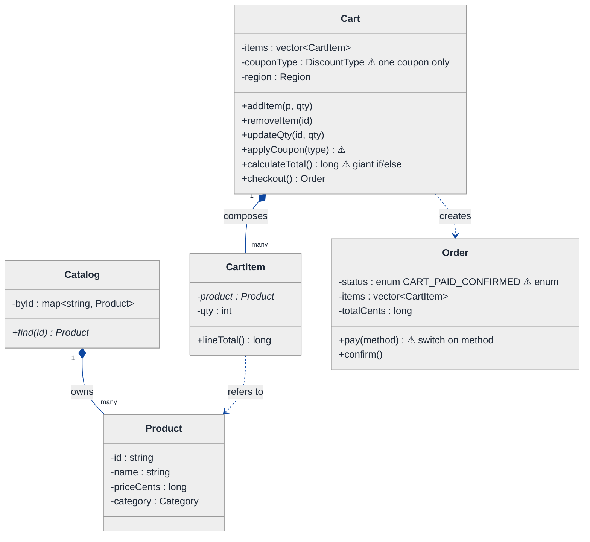
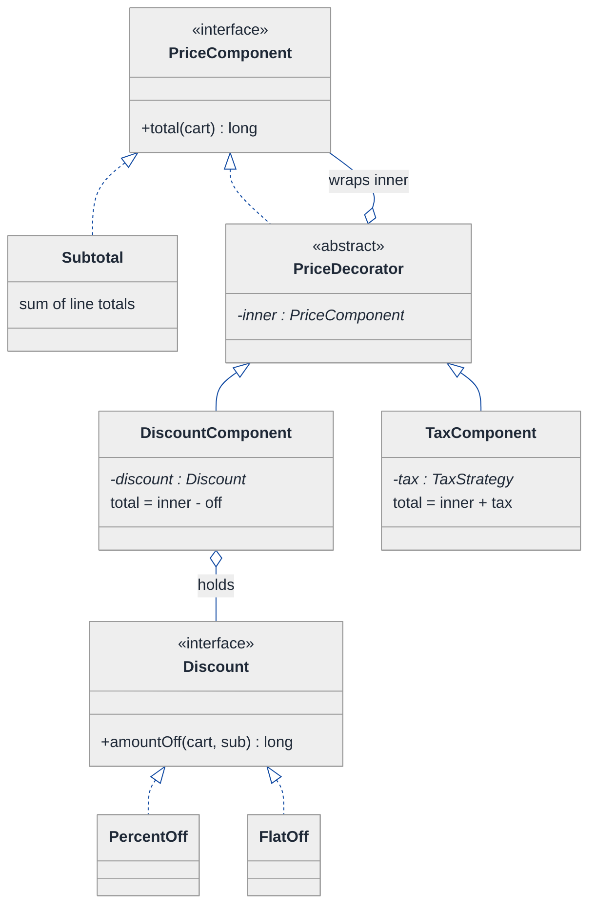
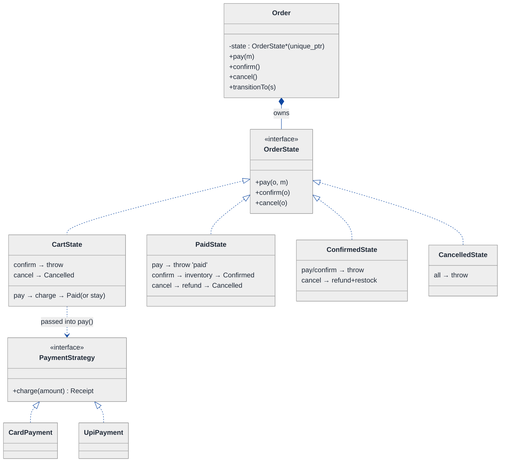
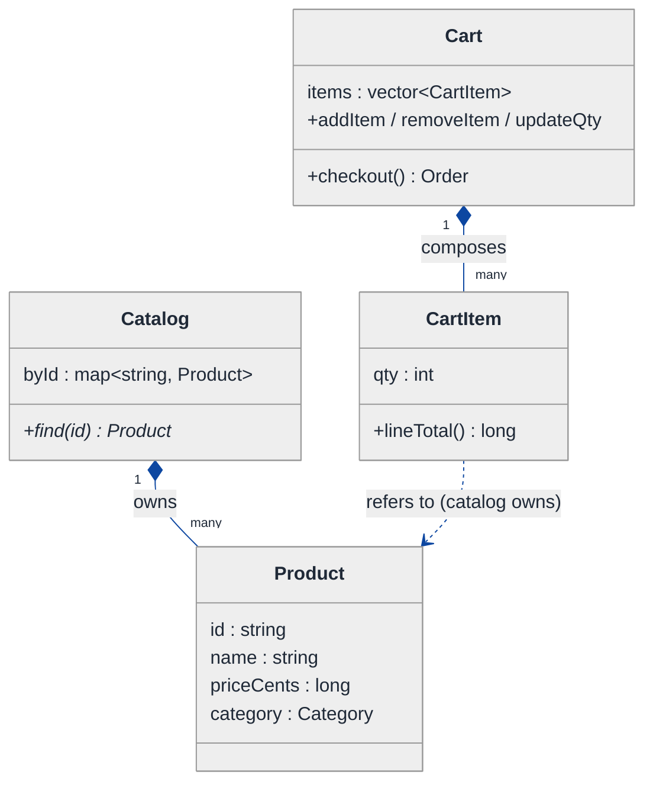
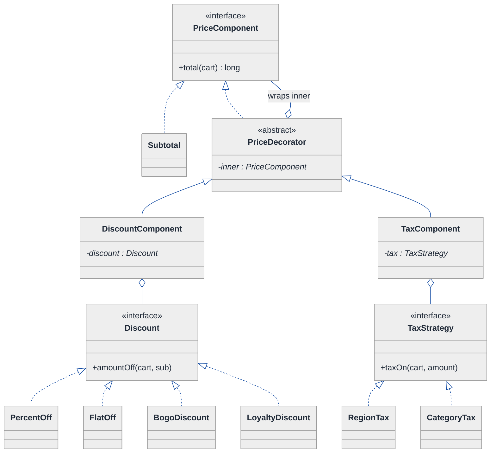
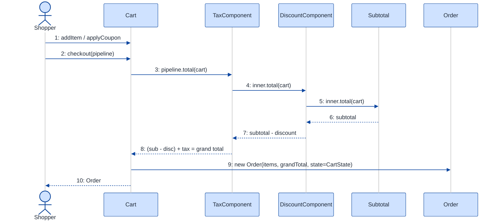
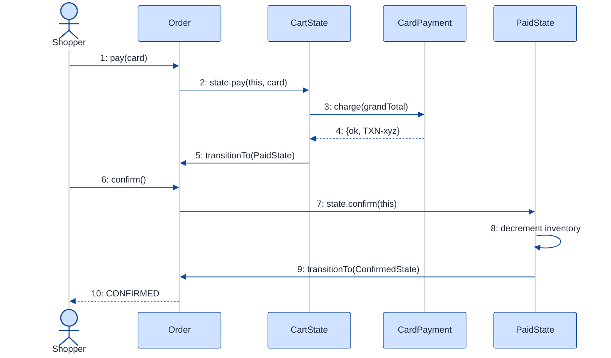

# Online Shopping Cart — LLD Walkthrough

> **Difficulty:** Medium · **Time:** ~30 min · **Pattern focus:** Strategy (discount / tax / payment) + Decorator (stacking discounts) + State (checkout / order lifecycle)
>
> **Problem source(s):** GID SG3, bucket `Strategy_Pattern`. Representative of cart / checkout LLD rows in [`./EXTRACTED_QUESTIONS.md`](./EXTRACTED_QUESTIONS.md).
>
> **Diagrams:** inline mermaid (renders natively in GitHub / VS Code). No external image artifacts.

---

## How to use this file

Paced for a candidate who has seen a shopping cart as a *user* but never designed one. Reading time: ~30 minutes if you sketch each iteration by hand. **The lesson: don't pre-load the answer with patterns. Build the naive cart first, watch it crack under four realistic product asks, then reach for exactly ONE pattern per painful axis — Strategy for the algorithms that vary, Decorator for the discounts that STACK, State for the checkout that has a lifecycle.**

**Map of this file (15 sections):**

1. Problem statement + clarifying questions
2. Plain-English restatement
3. Why this matters
4. Mental model
5. Try it yourself first
6. Entity & verb extraction
7. **Iteration 1: the naive design** — what we'd write first
8. **Where the naive design hurts** — four product asks, one painful diff each
9. **Pivot 1: Strategy for discounts** — the most painful axis first
10. **Pivot 2: Decorator to STACK discounts** — coupon × loyalty × tax, composed
11. **Pivot 3: State for the checkout / order lifecycle** + Strategy for payment
12. Final UML class diagram (three sub-views)
13. Skeleton code (C++)
14. Key flow — sequence diagram
15. Extensibility re-check + anti-patterns + how to think aloud + self-check

---

## 1. Problem statement + clarifying questions

**Prompt (typical phrasing):** "Design an online shopping cart. Users browse a product catalog, add / remove / update quantities in a cart, apply coupons and discounts, the system computes tax, and checkout creates an order."

**Clarifying questions to ask BEFORE drawing anything:**

1. **Discount kinds?** Just percent-off coupons, or also flat-amount, buy-one-get-one, category-wide sales, loyalty tiers? **Can multiple discounts apply to the same cart at once** (do they stack)? If they stack, in what order — before or after tax?
2. **Tax model?** Single flat rate, or per-region (US state / EU VAT / GST), or per-category (food untaxed, electronics taxed)? Is tax computed on the pre-discount or post-discount subtotal?
3. **Catalog scope?** Do we model browsing/search/pagination, or assume the catalog is a read-only lookup and the cart is the real subject? (Most interviewers want the cart + checkout, not a search engine.)
4. **Checkout lifecycle?** Is checkout a single atomic call, or a multi-step flow (cart → address → payment → confirmed) where each step has rules about what's valid next? What happens to inventory on a failed payment?
5. **Payment methods?** Card, wallet, UPI, gift card, cash-on-delivery? Picked per-order by the user?
6. **Inventory?** Do we decrement stock on add-to-cart, or only on order creation? Can two users race for the last unit?
7. **Persistence / concurrency?** In-memory for the interview, or a real store? Single-threaded for now?

**Assumptions if the interviewer dodges:** multiple **stackable** discount kinds (percent, flat, BOGO, loyalty), **region-based** tax computed on the post-discount subtotal, catalog is a read-only lookup, checkout is a **multi-step lifecycle** that creates an Order, multiple payment methods chosen at checkout, inventory decremented on order creation, single-threaded for now (concurrency discussed in §15).

---

## 2. Plain-English restatement

We're building the software behind an e-commerce cart. A shopper browses a catalog, drops items into a cart and tweaks quantities, applies one or more discount codes, sees a running total with tax, and checks out — which validates the cart, takes payment, and produces an Order. The design must let the business add **new discount rules**, **new tax regions**, and **new payment methods** without rewriting the pricing math or the checkout flow, and it must make **illegal checkout steps impossible** rather than guarded by scattered `if` checks.

---

## 3. Why this matters

Cart/checkout is the second-most-asked LLD question after parking lot, and it's a pure **pattern-discrimination** test. Pricing has *three* things that vary independently (discount, tax, payment), discounts famously **compose** (stack a coupon on top of a loyalty discount on top of a sale), and checkout is a genuine **state machine** (you can't pay an empty cart, can't confirm an unpaid order). Candidates who reach for one giant `calculateTotal()` method with nested conditionals fail; candidates who name *which* axis is Strategy, *which* is Decorator, and *which* is State pass. The same three-way split shows up in billing systems, insurance quoting, and tax engines.

---

## 4. Mental model

A cart is a **bag of line items** plus a **pricing pipeline** plus a **checkout conveyor belt**. The bag is plain inventory. The pricing pipeline is a sequence of transforms — subtotal, then minus discounts, then plus tax — where each transform can change independently. The conveyor belt is the checkout: an order rides through stations (cart → paid → confirmed → shipped), and at each station only certain actions are legal.

```
Real-world sketch (NOT a UML diagram yet):

   CART (bag)                 PRICING PIPELINE                CHECKOUT (conveyor)
  ┌──────────┐    subtotal   ┌─────────────────────┐
  │ 2× Shirt │  ───────────► │  - coupon (SAVE10)  │   ┌──────┐  ┌──────┐  ┌──────────┐
  │ 1× Phone │               │  - loyalty (gold)   │   │ CART │─►│ PAID │─►│CONFIRMED │─► ...
  │ 3× Cable │               │  + tax (CA 7.25%)   │   └──────┘  └──────┘  └──────────┘
  └──────────┘               └─────────┬───────────┘     each station: only some moves legal
                                       ▼
                                  grand total
```

The KEY insight from this picture: **inventory** (the bag) is just data; **pricing** (the pipeline) is a stack of independent, composable transforms; **checkout** (the belt) is a lifecycle with state-specific rules. Three different shapes → three different patterns.

---

## 5. Try it yourself first

> **Predict before reading on:**
>
> 1. List 5 nouns you'd promote to a class and 3 you'd leave as fields.
> 2. **If the business tells you "starting next month, customers can stack a coupon AND a loyalty discount AND a flash-sale on the same cart," what breaks in a single `calculateTotal()` method?**
> 3. A user clicks "Pay" twice in a row. Where does the second click get rejected — and is that rejection a scattered `if`, or something structural?

---

## 6. Entity & verb extraction

> **Mini-refresher: noun → class, but not every noun.**
>
> Naive OOD promotes every noun to a class. Senior OOD promotes a noun only if it has both BEHAVIOR and STATE that belong together. "Price" stays a field; "Cart" becomes a class because it owns line items AND the add/remove behavior; "Order" becomes a class because it has a *lifecycle*.

**Nouns from the prompt:**

| Noun | Decision | Why |
|---|---|---|
| Product | Class | Identity + price + category; lives in the catalog |
| Catalog | Class (read-only lookup) | Maps id → Product; browse / find |
| CartItem (line item) | Class | Pairs a Product with a quantity; computes line subtotal |
| Cart | Class | Owns line items; add / remove / update; computes subtotal |
| Coupon / Discount | Class (abstract + concrete) | The thing that VARIES — its own hierarchy |
| Tax | Strategy interface (later) | Varies by region/category |
| Order | Class | Has a LIFECYCLE — born at checkout |
| Money / price | Field (`long` cents) | No behavior of its own; use integer cents, never `double` |
| Quantity | Field on CartItem (`int`) | Not a class |

**Verbs (and the class they live on):**

| Verb | Owner class (naive answer — we'll re-examine) |
|---|---|
| browse() / find(id) | Catalog |
| addItem(product, qty) / removeItem / updateQty | Cart |
| applyCoupon(code) | Cart |
| calculateTotal() | Cart (naive: one big method) |
| checkout() | Cart → creates Order |
| pay(method) / confirm() / cancel() | Order |

**We have NOT introduced any design patterns yet.** Pure nouns + verbs.

---

## 7. <a id="iter-1"></a>Iteration 1: the naive design

The simplest thing that could possibly work. No patterns — just classes with methods, an enum for discount type, and one `calculateTotal()` that does everything.



**Reader's tour (top to bottom; ~60 seconds).**

1. **`Catalog` is a read-only lookup.** It owns `Product` objects and hands out pointers via `find(id)`. Nothing controversial here — the catalog is not where the design rots.

2. **The composition spine.** `Cart` composes `CartItem[]` (filled diamond — same lifetime). Each `CartItem` *refers to* a `Product` (dashed arrow — it does NOT own the product; the catalog does). Note we store **prices in integer cents** (`long`), never `double` — floating-point money is a classic bug.

3. **`Cart` is the trouble zone.** Look at the warning markers (⚠):
   - `couponType : DiscountType` — the cart can hold exactly ONE coupon. The moment the business wants to stack two, this field can't express it.
   - `applyCoupon(type)` takes an enum tag.
   - `calculateTotal()` is the monster: it sums line items, then a giant `switch (couponType)` subtracts a discount, then hardcodes a tax rate. Every new discount or tax rule means surgery inside this one method.

4. **`Order` is the second trouble zone.**
   - `status` is an enum. Fine for three states; can't express `PAYMENT_FAILED` or `CANCELLED` cleanly, and the *transition rules* live nowhere — they'll be scattered `if`s.
   - `pay(method)` switches on a payment-type tag. Every new method adds a case.

**What's deliberately missing.** No `Discount` hierarchy, no `TaxStrategy`, no `PaymentStrategy`, no `OrderState`. The naive design doesn't even *acknowledge* these are axes of variation — it bakes a hardcoded answer into `calculateTotal()` and `pay()`. That's what the next section exposes.

Skeleton code for the naive design (C++):

```cpp
#include <stdexcept>
#include <string>
#include <vector>

enum class Category     { GENERAL, FOOD, ELECTRONICS };
enum class Region       { CA, NY, EU };
enum class DiscountType { NONE, SAVE10_PERCENT, FLAT5 };
enum class PaymentType  { CARD, WALLET, COD };
enum class OrderStatus  { CART, PAID, CONFIRMED };

struct Product {
    std::string id, name;
    long        priceCents;
    Category    category;
};

class CartItem {
public:
    CartItem(const Product* p, int qty) : product_(p), qty_(qty) {}
    long lineTotal() const { return product_->priceCents * qty_; }
    int  qty() const { return qty_; }
    void setQty(int q) { qty_ = q; }
    const Product* product() const { return product_; }
private:
    const Product* product_;
    int            qty_;
};

class Order;  // forward

class Cart {
public:
    void addItem(const Product* p, int qty) { items_.emplace_back(p, qty); }
    void applyCoupon(DiscountType d)        { coupon_ = d; }       // only ONE
    void setRegion(Region r)                { region_ = r; }

    long calculateTotal() const {                                 // the monster
        long subtotal = 0;
        for (const auto& it : items_) subtotal += it.lineTotal();

        long discount = 0;                                        // hardcoded switch
        switch (coupon_) {
            case DiscountType::SAVE10_PERCENT: discount = subtotal / 10;  break;
            case DiscountType::FLAT5:          discount = 500;            break;
            case DiscountType::NONE:           discount = 0;              break;
        }
        long taxable = subtotal - discount;

        double rate = 0.0;                                        // hardcoded tax
        switch (region_) {
            case Region::CA: rate = 0.0725; break;
            case Region::NY: rate = 0.08;   break;
            case Region::EU: rate = 0.20;   break;
        }
        long tax = static_cast<long>(taxable * rate);
        return taxable + tax;
    }

    Order checkout();  // creates an Order, copies items + total
private:
    std::vector<CartItem> items_;
    DiscountType          coupon_ = DiscountType::NONE;
    Region                region_ = Region::CA;
};

class Order {
public:
    OrderStatus status = OrderStatus::CART;
    long        totalCents = 0;

    void pay(PaymentType method) {                                // tag-driven switch
        if (status != OrderStatus::CART) throw std::runtime_error("Not payable");
        switch (method) {
            case PaymentType::CARD:   /* call Stripe   */ break;
            case PaymentType::WALLET: /* call wallet   */ break;
            case PaymentType::COD:    /* mark on-deliv */ break;
        }
        status = OrderStatus::PAID;
    }
    void confirm() {
        if (status != OrderStatus::PAID) throw std::runtime_error("Not paid");
        status = OrderStatus::CONFIRMED;
    }
};
```

**This works.** It has zero design patterns. We can add items, apply a coupon, total it, pay, confirm. So what's wrong with it?

---

## 8. <a id="naive-pain"></a>Where the naive design hurts

The product manager drops four asks for next quarter on your desk: "walk me through what changes."

### Change A: "Stack a coupon AND a loyalty discount AND a flash-sale on the same cart"

In the naive design:
- `Cart::coupon_` is a single `DiscountType` field — it physically can't hold three discounts.
- You'd change it to a `vector<DiscountType>`, then `calculateTotal()` grows a loop over the vector with the same `switch` inside — and now you must decide ORDERING (does the 10% apply before or after the flat $5?) with more branching.
- **The change touches the `coupon_` field, the `applyCoupon` signature, AND balloons `calculateTotal`.** Three edits, and ordering logic has nowhere clean to live.

### Change B: "Per-category tax — food is untaxed, electronics taxed at the region rate"

In the naive design:
- `calculateTotal()` computes ONE blended `tax` over the whole post-discount taxable amount. Per-category tax means you must tax each line item by its category, not the cart as a whole.
- The single `rate` variable and the final `taxable * rate` line both have to be rewritten into a per-item loop.
- **`calculateTotal` is rewritten again** — the same method that Change A already bloated.

### Change C: "Payment can fail — failed payment must roll back to CART, not advance to PAID; add a CANCELLED state"

In the naive design:
- `OrderStatus` enum has no `PAYMENT_FAILED` or `CANCELLED`.
- `pay()` unconditionally sets `status = PAID` even though a charge can fail. To fix it you add `if (charge failed) { status stays CART; return; }` plus new `if (status == ...)` guards in `pay()`, `confirm()`, and a new `cancel()`.
- **The transition rules are now scattered across `pay`, `confirm`, `cancel`, each re-checking `status`.** The enum + scattered guards can't cleanly express a state machine.

### Change D: "Add UPI and gift-card payment"

In the naive design:
- Add `UPI`, `GIFT_CARD` to the `PaymentType` enum.
- Add two `case`s to the `switch` in `Order::pay()`.
- **Every new payment method is surgery inside the same switch.** Classic tag-driven dispatch.

### The pattern of pain

| Change | Files / methods touched | Smell |
|---|---|---|
| A. Stacked discounts | `coupon_` field + `applyCoupon` + `calculateTotal` | "One field can't hold a list; ordering logic homeless." |
| B. Per-category tax | `calculateTotal` (rewritten) | "Single method accumulates every pricing rule." |
| C. Payment can fail | `pay` + `confirm` + new `cancel`, all re-checking `status` | "Enum + scattered `if`s can't express a lifecycle." |
| D. New payment method | `Order::pay()` switch | "Tag-driven dispatch; every method is surgery in one function." |

**Three axes of pain dominate:** (1) discounts that **vary AND stack**, (2) algorithms picked by the caller (**tax, payment**), and (3) the order's **lifecycle**.

> **Pivot question:** "What pattern handles an *algorithm that varies, swapped by the caller* (tax, payment)? What pattern lets those varying pieces *STACK / compose* (discounts)? What pattern handles a *lifecycle with state-specific rules* (order)?"
>
> The answers are Strategy, Decorator, and State. We introduce them one at a time, most-painful first: discounts.

---

## 9. <a id="pivot-1"></a>Pivot 1: Strategy for discounts

> **Mini-refresher: Strategy pattern.**
>
> Encapsulates an algorithm behind an interface so it can be swapped at runtime. The CALLER picks which strategy to use; the strategy doesn't know about its peers.
>
> Quick example: a `Sorter` takes a `Comparator*` in its constructor. Pass `Ascending` or `Descending` — the sorter doesn't care which.

> **Mini-refresher: Open/Closed Principle (the "O" in SOLID).**
>
> Software should be *open for extension, closed for modification*. Adding a new discount should mean writing a new class, NOT editing an existing method. The naive `switch (coupon_)` violates this — every new discount edits `calculateTotal`.

**Why Strategy fits a discount.** A discount is an algorithm: `given a subtotal (or cart), return an amount off`. It varies — percent, flat, BOGO, loyalty tier. The choice of which discount applies is made externally (the user types a coupon code; the loyalty engine adds one). That's textbook Strategy.

**The refactor (just the discount slice):**

```cpp
class Cart;  // forward

class Discount {
public:
    virtual ~Discount() = default;
    // returns the amount to subtract, in cents, given the running subtotal
    virtual long amountOff(const Cart& cart, long runningSubtotal) const = 0;
    virtual std::string label() const = 0;
};

class PercentOff : public Discount {
public:
    explicit PercentOff(int pct) : pct_(pct) {}
    long amountOff(const Cart&, long sub) const override { return sub * pct_ / 100; }
    std::string label() const override { return std::to_string(pct_) + "% off"; }
private:
    int pct_;
};

class FlatOff : public Discount {
public:
    explicit FlatOff(long cents) : cents_(cents) {}
    long amountOff(const Cart&, long sub) const override { return std::min(cents_, sub); }
    std::string label() const override { return "flat off"; }
private:
    long cents_;
};
// BogoDiscount, LoyaltyDiscount ... elided — each a new class, no edits elsewhere
```

The cart no longer holds a `DiscountType` tag; it holds `Discount` objects and asks each for its `amountOff`. **Change A's "one field can't hold a list" disappears** — a list of `Discount*` is natural. But "in what ORDER do they stack, and how do we add tax on top?" is still open. That's the next pivot.

**Pattern-discrimination cheatsheet — Strategy vs Template Method.**
- *Strategy:* the whole algorithm is one swappable object, chosen at runtime via composition.
- *Template Method:* the algorithm skeleton lives in a base class; subclasses fill in hooks via inheritance.
- *Rule of thumb:* variants you might combine or change at runtime → Strategy. A fixed skeleton with 2-3 stable variants → Template Method.

We chose Strategy because discounts must be **swapped and combined at runtime** — you can't compose Template-Method subclasses.

---

## 10. <a id="pivot-2"></a>Pivot 2: Decorator to STACK discounts (and add tax)

Change A wants discounts to STACK, and Change B wants tax layered on top. A flat list of independent `Discount` objects still leaves *who applies them in order and adds tax?* unanswered. If we put that loop back in `Cart::calculateTotal`, we've just moved the monster. The variability here is not "which single algorithm" — it's "a CHAIN of transforms, each wrapping the previous result."

> **Mini-refresher: Decorator pattern.**
>
> A decorator implements the SAME interface as the thing it wraps, holds a pointer to a wrapped instance, and adds behavior *around* the wrapped call. Because it shares the interface, decorators nest: `A(B(C(x)))`. The caller can't tell a decorated object from a plain one.
>
> Quick example: `BufferedStream` wraps any `Stream`, adds buffering, and is still a `Stream` — so you can wrap it again with `EncryptedStream`.

**Why Decorator fits stacked pricing.** Model the pricing pipeline as a chain of `PriceComponent`s, each of which takes the running total and returns a new running total. `Subtotal` is the base; each `DiscountComponent` subtracts; the `TaxComponent` adds. Because they share one interface, you stack them in any order and the cart just asks the outermost one for the final number.

**The refactor (the pricing pipeline slice):**

```cpp
// A node in the pricing pipeline. Each wraps an inner node.
class PriceComponent {
public:
    virtual ~PriceComponent() = default;
    virtual long total(const Cart& cart) const = 0;   // running total in cents
};

// The base of the chain — raw subtotal, no wrapping.
class Subtotal : public PriceComponent {
public:
    long total(const Cart& cart) const override;       // sum of line totals (defined w/ Cart)
};

// Decorator base: holds the inner component it wraps.
class PriceDecorator : public PriceComponent {
public:
    explicit PriceDecorator(std::unique_ptr<PriceComponent> inner) : inner_(std::move(inner)) {}
protected:
    std::unique_ptr<PriceComponent> inner_;
};

class DiscountComponent : public PriceDecorator {
public:
    DiscountComponent(std::unique_ptr<PriceComponent> inner, std::unique_ptr<Discount> d)
        : PriceDecorator(std::move(inner)), discount_(std::move(d)) {}
    long total(const Cart& cart) const override {
        long running = inner_->total(cart);
        return running - discount_->amountOff(cart, running);   // subtract, then pass up
    }
private:
    std::unique_ptr<Discount> discount_;
};

class TaxComponent : public PriceDecorator {
public:
    TaxComponent(std::unique_ptr<PriceComponent> inner, std::unique_ptr<TaxStrategy> tax)
        : PriceDecorator(std::move(inner)), tax_(std::move(tax)) {}
    long total(const Cart& cart) const override {
        long running = inner_->total(cart);
        return running + tax_->taxOn(cart, running);            // add tax on the post-discount amount
    }
private:
    std::unique_ptr<TaxStrategy> tax_;
};
```

Now a fully-priced cart is just a built chain:

```cpp
// Subtotal -> minus 10% coupon -> minus flat $5 loyalty -> plus CA tax
auto pipeline =
    std::make_unique<TaxComponent>(
      std::make_unique<DiscountComponent>(
        std::make_unique<DiscountComponent>(
          std::make_unique<Subtotal>(),
          std::make_unique<PercentOff>(10)),
        std::make_unique<FlatOff>(500)),
      std::make_unique<RegionTax>(Region::CA));
long grandTotal = pipeline->total(cart);   // ordering is explicit in the nesting
```

**What changed — visualized.** Just the pricing slice:



**Tour of the after-state.**

1. **One interface, `PriceComponent`, with a single method `total(cart)`.** Everything in the pipeline — the base subtotal AND every decorator — speaks this one method. That's what lets them nest.

2. **`Subtotal` is the base of the chain.** It just sums line totals. No wrapping.

3. **`PriceDecorator` (abstract) holds the inner component it wraps.** The open diamond (`◇`) on `PriceDecorator o-- PriceComponent` is the wrapping relationship — a decorator HAS an inner `PriceComponent`. Note it points back at the same interface it implements: that self-reference is the signature of Decorator.

4. **Two concrete decorators.** `DiscountComponent` subtracts a `Discount`'s `amountOff` from whatever the inner node returned; `TaxComponent` adds tax. Because they nest, the ORDER is encoded in the nesting (tax wraps discounts → tax computed on the post-discount amount, satisfying our §1 assumption).

5. **`Discount` is still a Strategy** (from Pivot 1), now *held by* a `DiscountComponent`. So this slice uses two patterns together: Decorator builds the pipeline, Strategy supplies each discount's math.

**Change A and Change B now land cleanly.** Stacking → nest more `DiscountComponent`s. Per-category tax → a new `CategoryTax : TaxStrategy` plugged into the same `TaxComponent`. No edits to existing classes; ordering is explicit in the build, not buried in a method.

**Pattern-discrimination cheatsheet — Decorator vs Strategy vs Chain of Responsibility.**
- *Strategy:* pick ONE algorithm; it fully computes the answer.
- *Decorator:* WRAP an object to add behavior; every layer runs and each transforms the previous result. Shares the wrapped type, so it nests.
- *Chain of Responsibility:* pass a request along until ONE handler consumes it; most links do nothing.
- *Rule of thumb:* "every layer contributes to the result" → Decorator. "exactly one layer handles it, the rest skip" → Chain of Responsibility. "swap the whole algorithm" → Strategy.

We chose Decorator for the pipeline because **every layer contributes** (each discount subtracts, tax adds) — not "one handler wins."

---

## 11. <a id="pivot-3"></a>Pivot 3: State for the order lifecycle (+ Strategy for payment)

Changes C and D remain. Change D (new payment method) is the *same shape* as discounts/tax — an algorithm picked by the caller — so it's a quick Strategy. Change C is different: the variability is not in an algorithm, it's in **what's valid next**.

> **Mini-refresher: State pattern.**
>
> Each lifecycle state is its own class. The context object delegates an action (e.g. `pay()`) to its current state, and THE STATE decides what's legal and what the next state is. Transitions are INTERNAL, driven by events the context receives — not chosen by the caller.

**Why State (not Strategy) for the order.** The order's current phase isn't picked by the caller — it's the result of what the order has been through. A `CartState` order can `pay()`. A `PaidState` order can `confirm()` but `pay()` should fail. Calling `pay()` twice (the §5 double-click) must be rejected *structurally*, not by a scattered `if (status == PAID)`. The lifecycle is the OBJECT'S concern.

**The order-lifecycle refactor:**

```cpp
class Order;  // forward
class PaymentStrategy;  // forward — the Strategy below

class OrderState {
public:
    virtual ~OrderState() = default;
    virtual void pay(Order& o, PaymentStrategy& method) = 0;
    virtual void confirm(Order& o) = 0;
    virtual void cancel(Order& o) = 0;
    virtual std::string name() const = 0;
};

class CartState : public OrderState {
public:
    void pay(Order& o, PaymentStrategy& method) override;   // charge; on ok -> Paid, on fail -> stays (or -> Cancelled)
    void confirm(Order&) override { throw std::runtime_error("Cannot confirm unpaid order"); }
    void cancel(Order& o) override;                         // -> CancelledState, restock
    std::string name() const override { return "CART"; }
};

class PaidState : public OrderState {
public:
    void pay(Order&, PaymentStrategy&) override { throw std::runtime_error("Already paid"); }
    void confirm(Order& o) override;                        // decrement inventory -> ConfirmedState
    void cancel(Order& o) override;                         // refund -> CancelledState
    std::string name() const override { return "PAID"; }
};

class ConfirmedState : public OrderState {                  // terminal-ish (ship/refund elided)
public:
    void pay(Order&, PaymentStrategy&) override { throw std::runtime_error("Already paid"); }
    void confirm(Order&) override               { throw std::runtime_error("Already confirmed"); }
    void cancel(Order& o) override;                         // -> CancelledState, refund + restock
    std::string name() const override { return "CONFIRMED"; }
};
// CancelledState ... elided — every method throws

class Order {
public:
    Order(std::vector<CartItem> items, long total)
        : items_(std::move(items)), totalCents_(total),
          state_(std::make_unique<CartState>()) {}
    void transitionTo(std::unique_ptr<OrderState> s) { state_ = std::move(s); }
    void pay(PaymentStrategy& m) { state_->pay(*this, m); }   // one-liner — delegates
    void confirm()               { state_->confirm(*this); }
    void cancel()                { state_->cancel(*this); }
    long totalCents() const { return totalCents_; }
private:
    std::vector<CartItem>         items_;
    long                          totalCents_;
    std::unique_ptr<OrderState>   state_;
};

inline void CartState::pay(Order& o, PaymentStrategy& method) {
    auto r = method.charge(o.totalCents());
    if (r.ok) o.transitionTo(std::make_unique<PaidState>());
    // on failure: leave in CartState (caller can retry) — no scattered status flag
}
inline void PaidState::confirm(Order& o) {
    // decrement inventory here ...
    o.transitionTo(std::make_unique<ConfirmedState>());
}
```

**The payment Strategy (Change D), same shape as discounts:**

```cpp
class PaymentStrategy {
public:
    struct Receipt { bool ok; std::string ref; };
    virtual ~PaymentStrategy() = default;
    virtual Receipt charge(long amountCents) = 0;
};
class CardPayment     : public PaymentStrategy { /* Stripe   */ };
class WalletPayment   : public PaymentStrategy { /* wallet   */ };
class UpiPayment      : public PaymentStrategy { /* UPI      */ };  // Change D: one new class
class GiftCardPayment : public PaymentStrategy { /* balance  */ };  // Change D: one new class
```

**What changed — visualized.** The lifecycle slice:



**Tour of the after-state.**

1. **The `OrderStatus` enum is gone.** Replaced by a `state` field of type `unique_ptr<OrderState>` — the order owns its current state.

2. **`Order::pay/confirm/cancel` became one-liners** that delegate to the current state. **No `if (status == X)` anywhere on Order.**

3. **Four concrete states, each self-contained.** `CartState::pay` charges and, only on success, transitions to `PaidState` — solving Change C's "failed payment must not advance." `PaidState::pay` throws — the §5 double-click is rejected *structurally*. `CancelledState` is terminal (all methods throw).

4. **Transitions live WITH the state.** Each state calls `o.transitionTo(...)` when its work is done — the transition matrix is distributed across the state classes, not centralized in scattered `if`s.

5. **`PaymentStrategy` is NOT stored on Order or Cart** — it's passed into `pay(method)` (dashed dependency arrow). The user picks payment per-order; it isn't a cart-wide policy.

**Adding a new state or payment method is one new class.** Change C's `CancelledState` and Change D's `UpiPayment`/`GiftCardPayment` are each one class, zero edits elsewhere. Open/closed.

**Pattern-discrimination cheatsheet — Strategy vs State.**
- *Strategy:* the CALLER picks which one; strategies are usually unaware of each other.
- *State:* the OBJECT picks its next state internally; states know about each other (each can `transitionTo` another).
- *Rule of thumb:* swap because external code says so → Strategy (payment). Swap because of an internal event flow → State (order lifecycle).

---

## 12. <a id="fig-class-diagram"></a>12. Final class diagram

One mega-diagram becomes a wall of boxes. Here are **three focused sub-views** — inventory, pricing pipeline, lifecycle — and a structural-insight table that ties them together.

### 12.1 The inventory spine — what the cart OWNS



**Tour of 12.1.** The bag. `Cart` composes `CartItem[]` (filled diamond = same lifetime). Each `CartItem` only *refers* to a `Product` (dashed) — the `Catalog` owns products, the cart borrows them. This spine barely changed from the naive design; inventory was never the part that rotted. Everything we ADDED hangs off the pricing and lifecycle sub-views.

### 12.2 The pricing pipeline — Decorator + Strategy



**Tour of 12.2.**

1. **`PriceComponent` is the spine of the pipeline.** Subtotal is the base; `DiscountComponent` and `TaxComponent` are decorators that wrap an inner `PriceComponent` (open diamond, self-referential — the Decorator signature).

2. **Two Strategy families plug into the decorators.** `DiscountComponent` holds a `Discount` (percent / flat / BOGO / loyalty). `TaxComponent` holds a `TaxStrategy` (region / category). The decorators don't know which concrete strategy they carry — pure composition.

3. **The two patterns cooperate.** Decorator answers *"how do these layers stack and in what order?"*; Strategy answers *"what does each layer compute?"* Stacking a new discount (Change A) = nest another `DiscountComponent`. Per-category tax (Change B) = `CategoryTax`, one new class.

### 12.3 The order lifecycle — State + payment Strategy

```mermaid
---
config:
  theme: neutral
  themeVariables:
    background: '#ffffff'
    primaryColor: '#cfe2ff'
    primaryTextColor: '#1f2937'
    primaryBorderColor: '#084298'
    secondaryColor: '#fff3cd'
    secondaryTextColor: '#1f2937'
    secondaryBorderColor: '#664d03'
    tertiaryColor: '#d1e7dd'
    tertiaryTextColor: '#1f2937'
    tertiaryBorderColor: '#0a3622'
    lineColor: '#0d47a1'
    textColor: '#1f2937'
    noteBkgColor: '#fff3cd'
    noteTextColor: '#1f2937'
    noteBorderColor: '#997404'
    actorBkg: '#cfe2ff'
    actorBorder: '#084298'
    actorTextColor: '#1f2937'
    signalColor: '#0d47a1'
    signalTextColor: '#1f2937'
    labelBoxBkgColor: '#ffffff'
    labelBoxBorderColor: '#d3d3d3'
    labelTextColor: '#1f2937'
    edgeLabelBackground: '#ffffff'
    labelBackground: '#ffffff'
    classText: '#1f2937'
    fontFamily: 'system-ui, -apple-system, Segoe UI, Helvetica, Arial, sans-serif'
---
classDiagram
  direction TB
  class Order {
    -state : OrderState*
    -totalCents : long
    +pay(m) +confirm() +cancel()
    +transitionTo(s)
  }
  class OrderState {
    <<interface>>
    +pay(o,m) +confirm(o) +cancel(o)
  }
  class CartState
  class PaidState
  class ConfirmedState
  class CancelledState
  class PaymentStrategy {
    <<interface>>
    +charge(amount) Receipt
  }
  class CardPayment
  class WalletPayment
  class UpiPayment
  class GiftCardPayment
  Order *-- OrderState : owns (unique_ptr)
  OrderState <|.. CartState
  OrderState <|.. PaidState
  OrderState <|.. ConfirmedState
  OrderState <|.. CancelledState
  PaymentStrategy <|.. CardPayment
  PaymentStrategy <|.. WalletPayment
  PaymentStrategy <|.. UpiPayment
  PaymentStrategy <|.. GiftCardPayment
  CartState ..> PaymentStrategy : passed into pay()
```



**Tour of 12.3.** `Order` owns ONE `OrderState` (filled diamond / `unique_ptr`). `pay/confirm/cancel` are one-liners that delegate; the four states encode the legal transitions among themselves. `PaymentStrategy` is a Strategy family that is **not stored** anywhere — it's passed into `pay()` per transaction (dashed dependency). New state or new payment = one new class.

### Structural insight (ties 12.1 + 12.2 + 12.3 together)

| Concern | Pattern used | Why |
|---|---|---|
| **Inventory** (Catalog, Product, CartItem) | Plain ownership, minimal inheritance | Products/items are data; nothing varies behaviorally |
| **Discounts** (percent, flat, BOGO, loyalty) | Strategy + **Decorator** | Each discount is a swappable algorithm (Strategy) AND they STACK in order (Decorator) |
| **Tax** (region, category) | Strategy, plugged into a `TaxComponent` decorator | Algorithm picked by config; layered after discounts |
| **Payment** (card, wallet, UPI, gift card) | Strategy, PASSED as a method parameter | Caller picks per-order; not cart-wide config |
| **Order lifecycle** (Cart → Paid → Confirmed / Cancelled) | State, OWNED by Order | Order controls transitions; states validate what's legal next |

The big lesson: **inheritance is used only for the strategy/state/decorator class families** — every "varies independently" axis is composition over an interface. *Strategy for the algorithm, Decorator when those algorithms STACK, State for the lifecycle.* That three-way split is the whole answer.

---

## 13. Skeleton code (C++)

> Show the SHAPES, not the full impl. Abstract bases + 1-2 concretes per pattern; the rest `// elided`.

```cpp
#include <memory>
#include <stdexcept>
#include <string>
#include <unordered_map>
#include <utility>
#include <vector>
#include <algorithm>

// ── Forward declarations ────────────────────────────────────────────
class Cart;
class Order;
class PaymentStrategy;

enum class Category { GENERAL, FOOD, ELECTRONICS };
enum class Region   { CA, NY, EU };

// ── Inventory (plain data) ──────────────────────────────────────────
struct Product { std::string id, name; long priceCents; Category category; };

class CartItem {
public:
    CartItem(const Product* p, int qty) : product_(p), qty_(qty) {}
    long lineTotal() const { return product_->priceCents * qty_; }
    const Product* product() const { return product_; }
    int  qty() const { return qty_; }
    void setQty(int q) { qty_ = q; }
private:
    const Product* product_;   // borrowed; Catalog owns the Product
    int            qty_;
};

// ── Strategy: a single discount algorithm ───────────────────────────
class Discount {
public:
    virtual ~Discount() = default;
    virtual long amountOff(const Cart& cart, long runningSubtotal) const = 0;
};
class PercentOff : public Discount {
public:
    explicit PercentOff(int pct) : pct_(pct) {}
    long amountOff(const Cart&, long sub) const override { return sub * pct_ / 100; }
private: int pct_;
};
// FlatOff, BogoDiscount, LoyaltyDiscount ... elided

// ── Strategy: tax ───────────────────────────────────────────────────
class TaxStrategy {
public:
    virtual ~TaxStrategy() = default;
    virtual long taxOn(const Cart& cart, long amount) const = 0;
};
class RegionTax : public TaxStrategy {
public:
    explicit RegionTax(Region r) : rate_(rateFor(r)) {}
    long taxOn(const Cart&, long amount) const override {
        return static_cast<long>(amount * rate_);
    }
private:
    static double rateFor(Region r) {           // table, not a switch in the hot path
        static const std::unordered_map<Region, double> t{
            {Region::CA, 0.0725}, {Region::NY, 0.08}, {Region::EU, 0.20}};
        return t.at(r);
    }
    double rate_;
};
// CategoryTax ... elided

// ── Decorator: the pricing pipeline ─────────────────────────────────
class PriceComponent {
public:
    virtual ~PriceComponent() = default;
    virtual long total(const Cart& cart) const = 0;
};
class Subtotal : public PriceComponent {
public:
    long total(const Cart& cart) const override;   // defined after Cart
};
class PriceDecorator : public PriceComponent {
public:
    explicit PriceDecorator(std::unique_ptr<PriceComponent> inner) : inner_(std::move(inner)) {}
protected:
    std::unique_ptr<PriceComponent> inner_;
};
class DiscountComponent : public PriceDecorator {
public:
    DiscountComponent(std::unique_ptr<PriceComponent> in, std::unique_ptr<Discount> d)
        : PriceDecorator(std::move(in)), d_(std::move(d)) {}
    long total(const Cart& c) const override {
        long r = inner_->total(c);
        return r - d_->amountOff(c, r);
    }
private: std::unique_ptr<Discount> d_;
};
class TaxComponent : public PriceDecorator {
public:
    TaxComponent(std::unique_ptr<PriceComponent> in, std::unique_ptr<TaxStrategy> t)
        : PriceDecorator(std::move(in)), t_(std::move(t)) {}
    long total(const Cart& c) const override {
        long r = inner_->total(c);
        return r + t_->taxOn(c, r);
    }
private: std::unique_ptr<TaxStrategy> t_;
};

// ── Cart ────────────────────────────────────────────────────────────
class Cart {
public:
    void addItem(const Product* p, int qty) { items_.emplace_back(p, qty); }
    void removeItem(const std::string& id) {
        items_.erase(std::remove_if(items_.begin(), items_.end(),
            [&](const CartItem& i){ return i.product()->id == id; }), items_.end());
    }
    void updateQty(const std::string& id, int qty) {
        for (auto& i : items_) if (i.product()->id == id) i.setQty(qty);
    }
    const std::vector<CartItem>& items() const { return items_; }

    // checkout builds the priced Order; the pipeline is supplied (injected) by the caller
    Order checkout(const PriceComponent& pipeline) const;
private:
    std::vector<CartItem> items_;
};

inline long Subtotal::total(const Cart& cart) const {
    long s = 0;
    for (const auto& i : cart.items()) s += i.lineTotal();
    return s;
}

// ── Strategy: payment ───────────────────────────────────────────────
class PaymentStrategy {
public:
    struct Receipt { bool ok; std::string ref; };
    virtual ~PaymentStrategy() = default;
    virtual Receipt charge(long amountCents) = 0;
};
class CardPayment : public PaymentStrategy {
public:
    Receipt charge(long amount) override { /* Stripe */ return { amount >= 0, "card-..." }; }
};
// WalletPayment, UpiPayment, GiftCardPayment ... elided

// ── State: order lifecycle ──────────────────────────────────────────
class OrderState {
public:
    virtual ~OrderState() = default;
    virtual void pay(Order& o, PaymentStrategy& m) = 0;
    virtual void confirm(Order& o) = 0;
    virtual void cancel(Order& o)  = 0;
    virtual std::string name() const = 0;
};
class CartState; class PaidState; class ConfirmedState;  // forward

class Order {
public:
    Order(std::vector<CartItem> items, long total);
    void transitionTo(std::unique_ptr<OrderState> s) { state_ = std::move(s); }
    void pay(PaymentStrategy& m) { state_->pay(*this, m); }
    void confirm()               { state_->confirm(*this); }
    void cancel()                { state_->cancel(*this); }
    long totalCents() const { return totalCents_; }
private:
    std::vector<CartItem>       items_;
    long                        totalCents_;
    std::unique_ptr<OrderState> state_;
};

class CartState : public OrderState {
public:
    void pay(Order& o, PaymentStrategy& m) override {
        if (m.charge(o.totalCents()).ok) o.transitionTo(std::make_unique<PaidState>());
        // failure: remain in CartState — caller may retry
    }
    void confirm(Order&) override { throw std::runtime_error("Cannot confirm unpaid order"); }
    void cancel(Order& o)  override;   // -> CancelledState
    std::string name() const override { return "CART"; }
};
class PaidState : public OrderState {
public:
    void pay(Order&, PaymentStrategy&) override { throw std::runtime_error("Already paid"); }
    void confirm(Order& o) override { /* decrement inventory */ o.transitionTo(std::make_unique<ConfirmedState>()); }
    void cancel(Order& o)  override;   // refund -> CancelledState
    std::string name() const override { return "PAID"; }
};
// ConfirmedState, CancelledState ... elided

inline Order::Order(std::vector<CartItem> items, long total)
    : items_(std::move(items)), totalCents_(total),
      state_(std::make_unique<CartState>()) {}

inline Order Cart::checkout(const PriceComponent& pipeline) const {
    return Order(items_, pipeline.total(*this));
}
```

---

## 14. <a id="fig-sequence"></a>14. Key flow — sequence diagram

Two phases: build the priced order, then pay + confirm. Read slowly — this is where Decorator, Strategy, and State cooperate.

### Phase 1 — price + checkout



**Tour of Phase 1.**

1. **Shopper builds the cart** (add items, apply coupon). The coupon just adds a `DiscountComponent` to the pipeline the caller will pass in.
2. **`checkout(pipeline)` hands the cart its pricing pipeline.** The cart doesn't know the pipeline's shape — that's the Decorator paying off; it just calls `total()`.
3. **Messages 3-8: the Decorator chain unwinds.** `TaxComponent` asks its inner `DiscountComponent`, which asks `Subtotal`. The subtotal bubbles back UP, each layer transforming it: discount subtracts (msg 7), tax adds (msg 8). **Ordering is encoded in the nesting, not in any `if`.**
4. **Message 9: the Order is BORN in `CartState`.** This is where State enters — the order holds an `unique_ptr<CartState>` from birth.

### Phase 2 — pay + confirm



**Tour of Phase 2.**

1. **`Order::pay(card)` delegates to its state** (msg 2). The order does NOT check its status — it just calls `state_->pay`. If the order were already `PaidState`, this call would hit `PaidState::pay` and throw "Already paid" — the §5 double-click rejected *structurally*, no `if`.
2. **`CartState::pay` runs the payment Strategy** (msg 3): `card.charge(grandTotal)`. The state owns the transition decision: only on `{ok}` does it `transitionTo(PaidState)` (msg 5). A failed charge would leave the order in `CartState` — Change C solved.
3. **`confirm()` delegates to the now-current `PaidState`** (msg 7), which decrements inventory and transitions to `ConfirmedState`.

**The validation that's NOT shown — and why it matters.** There is no `if (order.status == PAID)` anywhere. Calling `pay()` on a `PaidState` order routes to `PaidState::pay`, a one-line throw. **The class hierarchy IS the validation** — invalid steps are impossible by polymorphism, not guarded by scattered runtime checks.

---

## 15. Extensibility re-check + anti-patterns + how to think aloud + self-check

### Extensibility re-check

Revisit the four changes from [§8](#naive-pain). For each, name the SINGLE class that changes.

| Change | Naive design impact | Final design impact |
|---|---|---|
| A. Stacked discounts | `coupon_` field + `applyCoupon` + `calculateTotal` | Nest another `DiscountComponent`; ordering explicit in the build. Done. |
| B. Per-category tax | `calculateTotal` rewritten | New `CategoryTax : TaxStrategy`, plug into `TaxComponent`. Done. |
| C. Payment can fail / cancel | `pay` + `confirm` + `cancel`, scattered guards | `CartState::pay` only advances on success; new `CancelledState`. Done. |
| D. New payment method | `Order::pay()` switch grows | New `UpiPayment : PaymentStrategy`. Done. |

Every change is exactly ONE new class (or one nested decorator). That's the open/closed principle in practice. If a future requirement makes you change Cart, Discount, Tax, AND Order together — go back to §6 and re-identify variability; you missed an axis.

### Common confusion + traps

1. **"Why Decorator for discounts instead of just a `vector<Discount>` loop in the cart?"** A bare loop hardcodes ordering and re-introduces the monster method. Decorator makes the ORDER explicit in the nesting and lets tax layer on top through the same interface — and the cart stays ignorant of the pipeline shape.
2. **"Why is tax a Decorator layer AND a Strategy?"** Decorator answers *where* in the pipeline tax sits (after discounts); Strategy answers *how* tax is computed (region vs category). Different questions, different patterns, composed.
3. **"Should `Product` be subclassed (Book, Electronics)?"** Usually no. The difference between products is data (category, price), not behavior. Use a `category` field + a `CategoryTax` strategy, not an inheritance tree.
4. **"Why is PaymentStrategy passed to `pay()` instead of stored?"** Payment is a per-order choice by the shopper, not cart-wide policy. Discounts/tax are pipeline policy (stored/injected); payment is a parameter.
5. **"Money as `double`?"** Never. Use integer cents (`long`). Floating-point rounding silently corrupts totals.

### Anti-patterns

- **"God method `calculateTotal()`"** — every pricing rule in one function. Split into a Decorator pipeline of Strategy components.
- **"Enum + scattered status guards"** — `if (status == PAID)` re-checked in every method. Use the State pattern; let polymorphism enforce the lifecycle.
- **"Tag-driven `switch (paymentType)`"** — surgery for every new method. Use the `PaymentStrategy` interface.
- **"Anemic Order"** — a data bag with getters/setters and lifecycle logic living in the Cart or a service. Put lifecycle behavior ON the Order via State.
- **"Raw owning pointers"** — storing pipeline/state objects as raw `T*` and `new`ing them. Use `unique_ptr` for exclusive ownership; the decorator chain is a perfect `unique_ptr` tree.
- **"Singleton Cart"** — there are many carts (one per session). Don't make it global; instantiate per user.

### How to think aloud

> "Online cart. Let me clarify scope. [Asks the §1 questions — especially *do discounts stack* and *is checkout multi-step*.] Got it: stackable discounts, region tax on the post-discount amount, multi-step checkout.
>
> Nouns: Catalog, Product, CartItem, Cart, Discount, Tax, Order, Payment. Money in integer cents.
>
> I'll write the NAIVE design first — no patterns. Cart has one coupon enum and a giant `calculateTotal()` with a discount switch and a tax switch. Order has a status enum and a `pay()` switch.
>
> Stress test. A: stack three discounts — one enum field can't hold a list, ordering is homeless. B: per-category tax — rewrite `calculateTotal`. C: payment can fail + cancel — enum + scattered `if`s can't express a state machine. D: new payment method — extend the switch.
>
> Three axes of pain: discounts that vary AND stack; algorithms the caller picks (tax, payment); the order lifecycle.
>
> Pivot 1: each discount becomes a `Discount` Strategy. Pivot 2: a `PriceComponent` Decorator pipeline stacks them — `TaxComponent(DiscountComponent(Subtotal))` — ordering explicit in the nesting. Pivot 3: the order becomes a State machine (CartState/PaidState/ConfirmedState/CancelledState), and payment becomes a `PaymentStrategy` passed into `pay()`.
>
> Final: Cart composes CartItems; pricing is a Decorator+Strategy pipeline; Order owns its State; payment is a per-call Strategy. All four asks land as ONE new class each. Open/closed."

### Self-check

> **Self-check — the question to ask next time.**
>
> When you see "design a [thing] with multiple [variations]," before reaching for inheritance or one big method, ask three questions in order:
>
> > **1. "Is each variation a whole algorithm the CALLER picks?"** → Strategy.
> > **2. "Do those variations STACK / layer on top of each other?"** → wrap the Strategies in a Decorator pipeline.
> > **3. "Is there a variation that's a lifecycle the OBJECT transitions through?"** → State.
>
> Discounts are Strategies that stack → Strategy + Decorator. Tax and payment are Strategies. The order's life is State. If you can name which axis is which, the class diagram falls out for free.

---

## Cross-references

- **Parent topic manifest:** [`./EXTRACTED_QUESTIONS.md`](./EXTRACTED_QUESTIONS.md)
- **Vertical overview:** [`../../LEARNING.md`](../../LEARNING.md)
- **Template:** [`../../TEMPLATE-v2.md`](../../TEMPLATE-v2.md)
- **Canonical exemplar:** [`../Object_Oriented_Design/Parking_Lot.md`](../Object_Oriented_Design/Parking_Lot.md) — the gold-standard Strategy + State walkthrough
- **Related v2 walkthroughs:**
  - State Pattern deep-dive (in `../State_Pattern/`) — the order-lifecycle pattern in isolation
  - Decorator Pattern deep-dive (in `../Decorator_Pattern/`) — the stacking-discount pattern in isolation
  - Builder Pattern (in `../Builder_Pattern/`) — for assembling complex Orders with optional fields
- **Further reading:** <a href="https://refactoring.guru/design-patterns/strategy" target="_blank" rel="noopener noreferrer">Strategy</a>, <a href="https://refactoring.guru/design-patterns/decorator" target="_blank" rel="noopener noreferrer">Decorator</a>, and <a href="https://refactoring.guru/design-patterns/state" target="_blank" rel="noopener noreferrer">State</a> on Refactoring.Guru.
