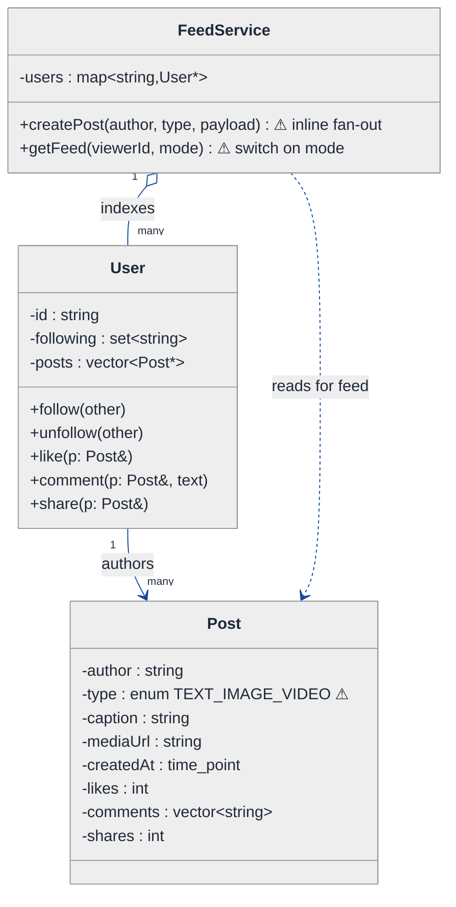
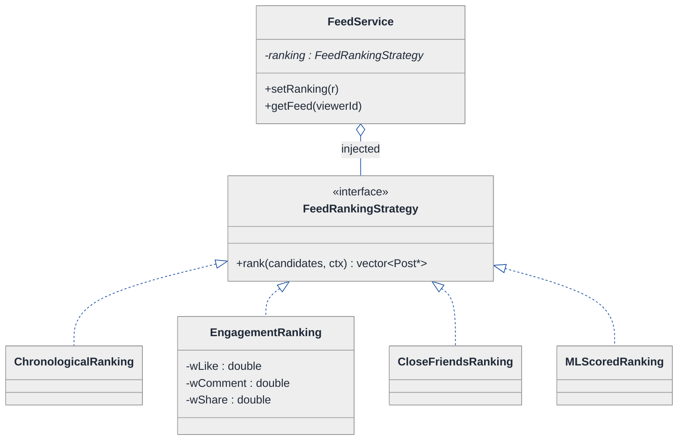
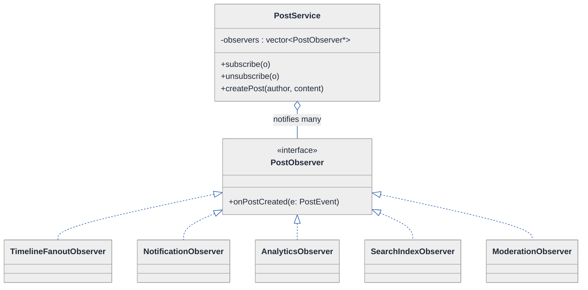
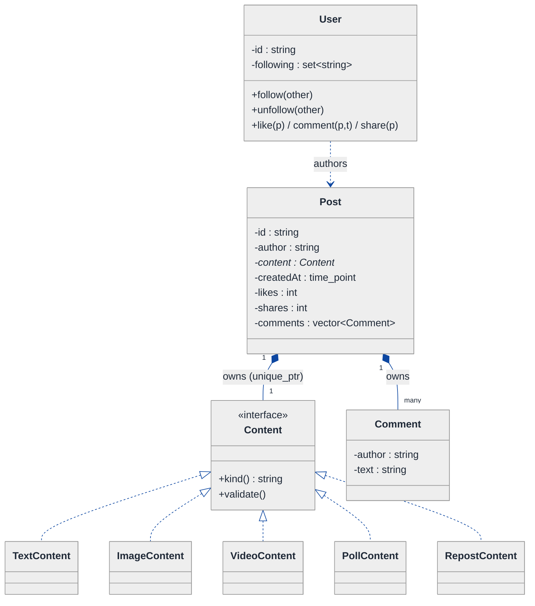
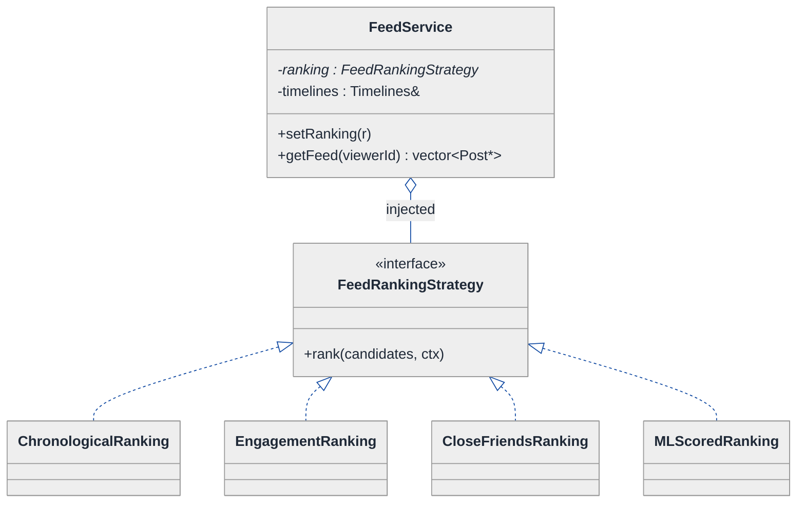
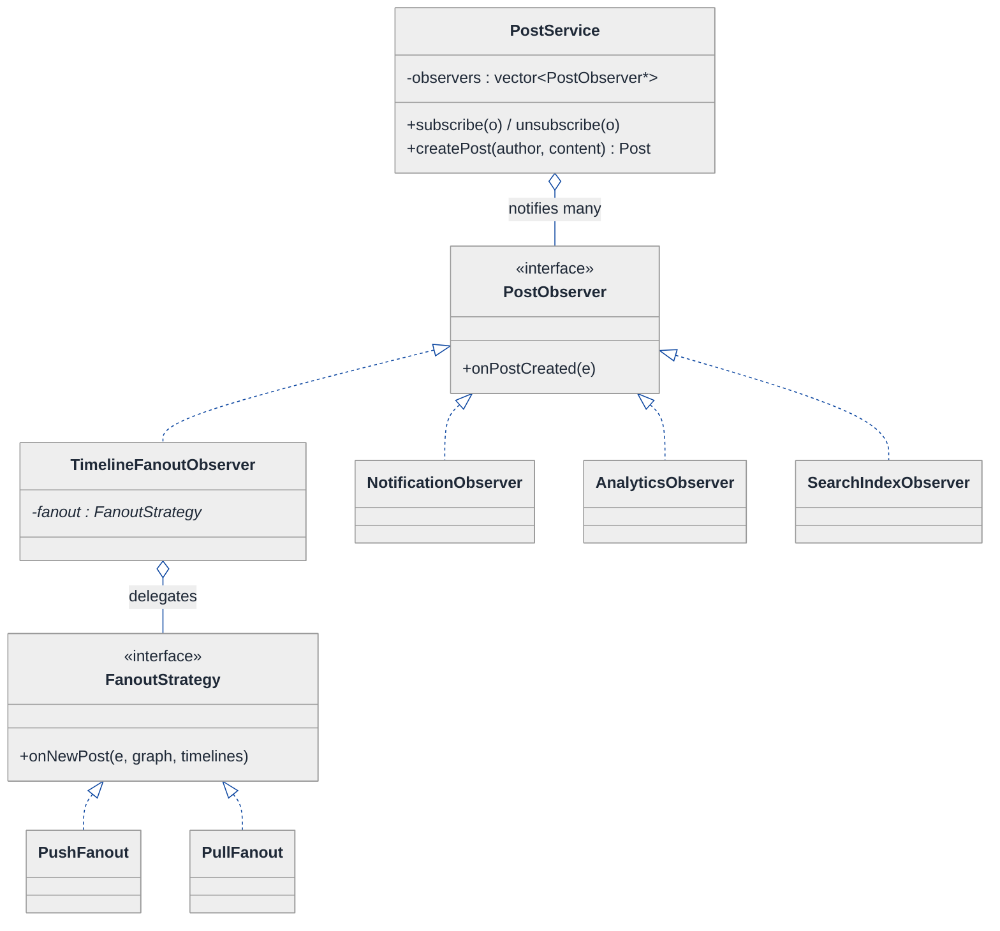
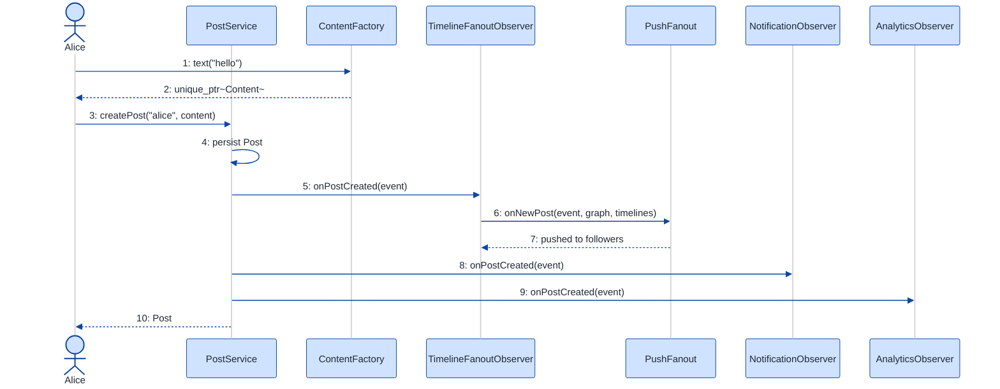
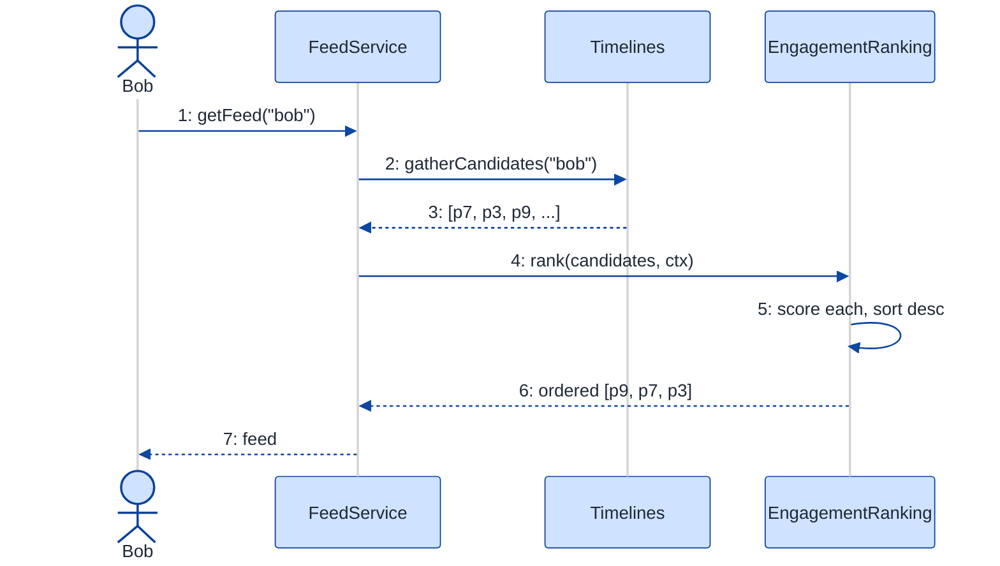

# Social Media Feed — LLD Walkthrough

> **Difficulty:** Hard · **Time:** ~45 min · **Pattern focus:** Strategy (feed ranking) + Observer (fan-out on new post) + a few more
>
> **Problem source(s):** GID SG14, bucket `Strategy_Pattern`, in [`./EXTRACTED_QUESTIONS.md`](./EXTRACTED_QUESTIONS.md).
>
> **Diagrams:** inline mermaid (renders natively in GitHub / VS Code). Theme block is the canonical one from `CONTINUATION.md §3`.

---

## How to use this file

Paced for a candidate who has built CRUD apps but never thought hard about *where the variability lives* in a feed system. Reading time: ~45 minutes if you sketch each iteration by hand. **The lesson: a feed system has two loud axes of change — how the feed is ORDERED (chronological vs ranked vs ML), and who gets NOTIFIED when something happens (new post, like, comment). Don't bake either into a god-method. Derive Strategy for the first axis and Observer for the second by watching a naive design buckle under four product requirements.**

**Map of this file (15 sections):**

1. Problem statement + clarifying questions
2. Plain-English restatement
3. Why this matters
4. Mental model
5. Try it yourself first
6. Entity & verb extraction
7. **Iteration 1: the naive design** — what we'd write first
8. **Where the naive design hurts** — four future requirements, one painful diff each
9. **Pivot 1: Strategy for feed generation** — the most painful axis first
10. **Pivot 2: Observer for the fan-out / notifications** — who reacts when a post is created
11. **Pivot 3: remaining variability** — post content (Factory), engagement actions (Command-ish), feed assembly (Decorator)
12. Final UML class diagram
13. Skeleton code (C++)
14. Key flow — sequence diagram
15. Extensibility re-check + anti-patterns + how to think aloud + self-check

---

## 1. Problem statement + clarifying questions

**Prompt (typical phrasing):** "Design a social media feed system at the class level. Support post creation (text, image, video), like/comment/share actions, follow/unfollow, and a feed generation algorithm that can be either chronological or ranked."

**Clarifying questions to ask BEFORE drawing anything:**

1. **Feed ordering modes?** Just chronological + a single "ranked" score, or do we need pluggable ranking (engagement-weighted, ML-scored, "close friends" boosted, ad-interleaved)? Will the SAME user be able to toggle between modes?
2. **Post content types?** The prompt says text/image/video — are those the only three forever, or should new types (poll, link-preview, live-stream, repost) be cheap to add? Can a single post mix media (text + 4 images)?
3. **Fan-out timing?** When Alice posts, do we push the post into every follower's feed immediately (fan-out-on-write / push), or build each feed lazily when a follower opens the app (fan-out-on-read / pull)? Celebrity accounts with 10M followers change this answer.
4. **What reacts to a new post / like / comment?** Just the follower feeds, or also: notification service, analytics counters, content-moderation queue, search index? How many independent reactors, and will more be added?
5. **Like/comment/share semantics?** Is a "share" a new post that references the original (repost), or just a counter bump? Can you un-like? Is comment a flat list or threaded?
6. **Scale / consistency?** Is this single-process in-memory (interview LLD scope), or do we need to leave seams for a queue / cache / DB? (We design the *classes*; we leave seams.)
7. **Privacy / blocking?** Can a follow be pending (private accounts)? Do blocks filter the feed?

**Assumptions if interviewer dodges:** pluggable ranking (chronological + ranked + room for more), three content types that must be extensible, fan-out-on-write as the default with a seam to swap to pull for celebrities, **multiple independent reactors** to a new post (follower feeds, notifications, analytics, search index), share = repost that references the original, single-process in-memory with seams for persistence. We'll discuss scale tradeoffs in §15.

---

## 2. Plain-English restatement

We're building the in-memory object model behind a feed product. A `User` can create `Post`s (text, image, video), can `like` / `comment` / `share` other posts, and can `follow` / `unfollow` other users. When a user opens the app, the system assembles their **feed** — a list of posts from the people they follow — ordered either newest-first (chronological) or by a relevance score (ranked). The design must let us (a) add new ranking algorithms without touching post or user code, and (b) add new things-that-react-to-a-new-post (notifications, analytics, search index) without editing the post-creation flow.

---

## 3. Why this matters

A feed is the canonical "two independent axes of change" LLD problem, which makes it a favorite for probing pattern discrimination. The first axis — *how the feed is ordered* — is a textbook Strategy: an algorithm the caller (or user setting) picks at runtime. The second axis — *who reacts when something happens* — is a textbook Observer: a one-to-many notification where the publisher must NOT know its subscribers. Candidates who reach for one giant `generateFeed()` with `if (mode == ...)` and a hardcoded list of side effects fail the same way they fail parking-lot pricing: the variability gets buried in conditionals. The senior signal is recognizing the two axes *before* writing code and keeping them orthogonal.

---

## 4. Mental model

A feed system is a **bulletin board with a rule-book and a mailing list.**

- The **bulletin board** is the inventory: users, posts, the follow graph.
- The **rule-book** is the ordering policy: given a candidate set of posts, return them in some order. That rule changes independently of everything else.
- The **mailing list** is the reaction policy: when Alice pins a new note to the board, a *list of interested parties* must be told — her followers' feeds, the notification bell, the analytics tally, the search crawler. The board doesn't care who's on the list; it just shouts "new post!" and the list handles itself.

```
Real-world sketch (NOT a UML diagram yet):

   Alice  ──follows──►  Bob, Carol         (the follow graph)
     │
     │ creates Post("text+image")
     ▼
  ┌─────────────────────────────────────────┐
  │  "NEW POST!"  (one event, many listeners)│
  └───────┬──────────┬───────────┬───────────┘
          ▼          ▼           ▼
   Follower feeds  Notifier   Analytics   Search index   ...  (the mailing list)
          │
          ▼
   Bob opens app → FeedService assembles Bob's feed
                   → orders it via { Chronological | Ranked | ML } (the rule-book)
```

The KEY insight from this picture: **ordering** and **reaction** are two different jobs that beginners cram into one `createPost()` + one `getFeed()`. We will pull ordering into a Strategy and reaction into an Observer, and they will never touch each other.

---

## 5. Try it yourself first

> **Predict before reading on:**
>
> 1. List 5 nouns you'd promote to a class. List 3 nouns you'd leave as plain fields.
> 2. **If the product team says "next quarter we ship chronological, engagement-ranked, AND a 'close friends first' feed, and users can switch between them in settings" — what would change about how you write `getFeed()`?**
> 3. When Alice posts, four different subsystems need to know (follower feeds, notifications, analytics, search). Where do you put the code that tells all four? What happens when a fifth subsystem is added?

---

## 6. Entity & verb extraction

> **Mini-refresher: noun → class, but not every noun.**
>
> Naive OOD promotes every noun to a class. Senior OOD promotes a noun only if it has both BEHAVIOR and STATE that need to live together. "Caption" stays a `std::string` field; "Post" becomes a class because it has content, engagement counters, and authorship. "Timestamp" stays a library type.

**Nouns from the prompt:**

| Noun | Decision | Why |
|---|---|---|
| User | Class | Has identity, a follow graph edge, authors posts, performs actions |
| Post | Class (with a content part) | Has author, content, timestamp, engagement counters |
| Content (text/image/video) | Class hierarchy OR a part of Post | Varies by type — extraction point we'll revisit in §11 |
| Feed | NOT a stored class — a *computed* list | Assembled on demand by a service; storing it is a caching decision |
| FeedService | Class (coordinator) | Orchestrates "assemble candidate posts → order them" |
| Like / Comment / Share | Class or method? | Comment has state (text, author) → class. Like is a (user,post) edge. Share = repost (a Post) |
| Follow relationship | Edge in a graph (set of user ids) | Usually a field, not a class — unless it has state (pending/accepted) |
| Timestamp | Library type (`std::chrono::time_point`) | No domain behavior |
| Caption / URL / mime | Fields on Content | No behavior of their own |

**Verbs (and the class they live on — naive answer, we'll re-examine):**

| Verb | Owner class (naive) |
|---|---|
| createPost(content) | User → delegates to a PostService / FeedService |
| like(post) / comment(post, text) / share(post) | User, mutating Post counters |
| follow(other) / unfollow(other) | User |
| getFeed(mode) | FeedService |
| score(post, viewer) | (naive) inline inside getFeed |
| notifyFollowers(post) | (naive) inline inside createPost |

**We have NOT introduced any design patterns yet.** Pure nouns + verbs. Note the two verbs already smelling of trouble — `getFeed(mode)` (mode switch) and `notifyFollowers` (hardcoded reaction list).

---

## 7. <a id="iter-1"></a>Iteration 1: the naive design

Let's write the simplest thing that could possibly work. No design patterns — just classes with methods, an enum for the feed mode, and an inline list of side effects.



**Reader's tour (read top to bottom; ~60 seconds).**

1. **`User` (top-left).** Holds an id, a `following` set of user-ids (the follow graph as a plain set — no Follow class), a list of posts they authored, and the four engagement methods. Each engagement method just mutates a counter on the target `Post`.

2. **`Post` (top-right) — the first trouble zone.** Look at the `type` field marked ⚠: it's an `enum { TEXT, IMAGE, VIDEO }`, and the body has BOTH a `caption` and a `mediaUrl`, only some of which are valid per type. A text post has no `mediaUrl`; a video post needs a duration we didn't model. The single flat struct pretends all three content types are the same shape. They aren't.

3. **`FeedService` (bottom) — the main trouble zone.** Two ⚠ methods:
   - `createPost(...)` will, in the naive version, *inline* the fan-out: loop over followers and append to each feed, then call the notifier, then bump analytics. Every reaction is hardcoded into this one method.
   - `getFeed(viewerId, mode)` switches on a `mode` enum: `if (mode == CHRONOLOGICAL) sort by time; else if (mode == RANKED) sort by score`. The scoring formula is hardcoded inline.

4. **Relationships.** `FeedService` indexes `User`s (aggregation — it doesn't own their lifetime). `User` authors `Post`s. `FeedService` reads posts to build a feed. No strategy objects, no observers, no content hierarchy — every decision lives inside two fat methods.

**What's deliberately missing.** No `FeedRankingStrategy`. No `PostObserver` / event bus. No `Content` hierarchy. The naive design doesn't even acknowledge that "ordering" and "reaction" are axes of variation — it bakes one hardcoded answer for each into the method that uses it. That's what we'll expose, and fix.

Skeleton code for the naive design (C++):

```cpp
#include <algorithm>
#include <chrono>
#include <memory>
#include <string>
#include <unordered_map>
#include <unordered_set>
#include <vector>

using Clock = std::chrono::system_clock;

enum class PostType { TEXT, IMAGE, VIDEO };          // ⚠ tag — will hurt
enum class FeedMode { CHRONOLOGICAL, RANKED };       // ⚠ tag — will hurt

struct Post {
    std::string id;
    std::string author;
    PostType    type;
    std::string caption;     // valid for all
    std::string mediaUrl;    // only valid for IMAGE / VIDEO  ⚠ partially-valid fields
    Clock::time_point createdAt = Clock::now();
    int likes = 0;
    int shares = 0;
    std::vector<std::string> comments;
};

class User {
public:
    explicit User(std::string id) : id_(std::move(id)) {}
    void follow(const std::string& other)   { following_.insert(other); }
    void unfollow(const std::string& other)  { following_.erase(other); }
    void like(Post& p)                        { ++p.likes; }
    void comment(Post& p, const std::string& t) { p.comments.push_back(t); }
    void share(Post& p)                       { ++p.shares; }   // ⚠ counter bump, not a repost
    const std::string& id() const             { return id_; }
    const std::unordered_set<std::string>& following() const { return following_; }
private:
    std::string id_;
    std::unordered_set<std::string> following_;
};

class FeedService {
public:
    User& addUser(const std::string& id) {
        auto u = std::make_unique<User>(id);
        auto& ref = *u;
        users_[id] = std::move(u);
        return ref;
    }

    Post& createPost(const std::string& author, PostType type,
                     const std::string& caption, const std::string& mediaUrl) {
        auto p = std::make_unique<Post>();
        p->id = nextId(); p->author = author; p->type = type;
        p->caption = caption; p->mediaUrl = mediaUrl;
        Post& ref = *p;
        posts_[ref.id] = std::move(p);

        // ⚠ INLINE FAN-OUT — every reaction hardcoded right here:
        for (auto& [uid, u] : users_)
            if (u->following().count(author)) timelines_[uid].push_back(ref.id);
        // notifier->notify(author + " posted");       // hardcoded side effect
        // analytics->increment("posts_created");       // hardcoded side effect
        // searchIndex->add(ref);                        // hardcoded side effect
        return ref;
    }

    std::vector<Post*> getFeed(const std::string& viewerId, FeedMode mode) {
        std::vector<Post*> candidates;
        for (auto id : timelines_[viewerId]) candidates.push_back(posts_[id].get());

        // ⚠ MODE SWITCH — ordering hardcoded right here:
        if (mode == FeedMode::CHRONOLOGICAL) {
            std::sort(candidates.begin(), candidates.end(),
                      [](Post* a, Post* b){ return a->createdAt > b->createdAt; });
        } else { // RANKED
            std::sort(candidates.begin(), candidates.end(), [](Post* a, Post* b){
                double sa = a->likes * 1.0 + a->comments.size() * 2.0 + a->shares * 3.0; // hardcoded weights
                double sb = b->likes * 1.0 + b->comments.size() * 2.0 + b->shares * 3.0;
                return sa > sb;
            });
        }
        return candidates;
    }
private:
    std::string nextId() { return "p" + std::to_string(++seq_); }
    std::unordered_map<std::string, std::unique_ptr<User>> users_;
    std::unordered_map<std::string, std::unique_ptr<Post>> posts_;
    std::unordered_map<std::string, std::vector<std::string>> timelines_;
    int seq_ = 0;
};
```

**This works.** It has zero design patterns. We can post, like, comment, share, follow, and pull a feed in two modes. So what's wrong with it?

---

## 8. <a id="naive-pain"></a>Where the naive design hurts

The interviewer slides a piece of paper across the desk: "Here are four requirements coming next quarter. Walk me through what changes."

### Change A: "Add a third feed mode — 'close friends first' — and a fourth, ML-scored. Users toggle the mode in settings."

In the naive design:
- `FeedMode` enum grows two values.
- `getFeed()`'s `if/else` becomes a four-way ladder; the ML branch needs a model handle that `FeedService` now has to hold and inject *into the middle of a sort lambda*.
- The hardcoded engagement weights (`likes*1 + comments*2 + shares*3`) live inside the lambda — to A/B test new weights you edit and redeploy `FeedService`.
- **The change touches the `FeedMode` enum AND the `getFeed` method AND drags new dependencies (the ML model) into FeedService.** Every new ordering rule is surgery in the same method.

### Change B: "When a post is created, also: send a push notification, bump an analytics counter, add it to the search index, and run it through content moderation."

In the naive design:
- `createPost()` already inlines the follower fan-out. Now we add four more hardcoded calls right after it.
- Each new reactor means editing `createPost()`. FeedService now `#include`s the notifier, analytics, search, and moderation headers — it depends on everything.
- If moderation needs to run *before* fan-out but analytics *after*, the ordering logic gets tangled into one method too.
- **Every new reaction → another line in `createPost`, another dependency on FeedService. Classic "publisher knows all subscribers" coupling.**

### Change C: "Add a Poll post type and a Repost (share that references the original and shows in feeds)."

In the naive design:
- `PostType` enum grows. The flat `Post` struct now needs `pollOptions`, `pollVotes`, and an `originalPostId` — fields that are null for every other type.
- `share()` currently bumps a counter; a Repost must be a real Post that appears in feeds, so `share()` has to *create a post* — a different return type and flow.
- Rendering / validation code everywhere now `switch`es on `PostType` with new cases.
- **New content type → wider struct + more `switch`es scattered across the codebase. The struct accumulates partially-valid fields.**

### Change D: "Celebrity accounts have 20M followers — fan-out-on-write would write 20M timeline entries per post."

In the naive design:
- The fan-out loop in `createPost()` is hardwired to push. There is no seam to say "for celebrities, skip the push; build their followers' feeds lazily on read."
- **Changing the fan-out STRATEGY means rewriting `createPost`'s loop and `getFeed`'s candidate-gathering together.** They're coupled because both assume push.

### The pattern of pain

| Change | Methods / files touched | Smell |
|---|---|---|
| A. New feed modes | `FeedMode` enum + `getFeed` (four-way ladder + injected deps) | "Single method accumulates every ordering rule; weights are un-swappable." |
| B. New reactors | `createPost` (grows a line each) + FeedService deps | "Publisher hardcodes its subscriber list; depends on everything that reacts." |
| C. New content types | `PostType` enum + flat struct + scattered `switch`es | "Tag + partially-valid fields; new type ripples everywhere." |
| D. Fan-out push vs pull | `createPost` loop + `getFeed` gather (coupled) | "Fan-out policy hardwired; can't swap push↔pull." |

**Two axes of pain dominate:** ordering variability (the feed algorithm) and reaction variability (who responds to events). A third, smaller axis is content-type variability.

> **Pivot question:** "What pattern handles 'an algorithm that varies and is picked by the caller/user setting'? What pattern handles 'one event, many independent reactors, where the publisher must not know the reactors'?"
>
> The answers are **Strategy** and **Observer**. Let's introduce them one at a time, starting with the most painful and most-asked axis: feed ordering.

---

## 9. <a id="pivot-1"></a>Pivot 1: Strategy for feed generation

> **Mini-refresher: Strategy pattern.**
>
> Encapsulates an algorithm behind an interface so it can be swapped at runtime. The CALLER decides which strategy to use; the strategy doesn't know about its peers.
>
> Quick example: a `Sorter` takes a `CompareStrategy*`. Pass `AscendingCompare` or `DescendingCompare` — the sorter doesn't care which.

**Why Strategy fits feed ordering.** Feed generation is an algorithm: `given a viewer and a set of candidate posts, return them in some order`. It varies (chronological, engagement-ranked, close-friends-first, ML-scored, ad-interleaved). The choice is made externally — by the user's settings or an A/B bucket, NOT by the post or the user object. The candidate set is the same; only the ordering rule changes. That is textbook Strategy.

**The refactor (just the affected part):**

```cpp
// The viewer-context a ranking might need (viewer id, follow graph, time, A/B bucket).
struct FeedContext {
    std::string viewerId;
    const std::unordered_set<std::string>* closeFriends;  // may be null
    Clock::time_point now;
};

class FeedRankingStrategy {
public:
    virtual ~FeedRankingStrategy() = default;
    // Takes candidates by value-ish (pointers), returns them ordered. Pure: no side effects.
    virtual std::vector<Post*> rank(std::vector<Post*> candidates,
                                    const FeedContext& ctx) const = 0;
};

class ChronologicalRanking : public FeedRankingStrategy {
public:
    std::vector<Post*> rank(std::vector<Post*> c, const FeedContext&) const override {
        std::sort(c.begin(), c.end(),
                  [](Post* a, Post* b){ return a->createdAt > b->createdAt; });
        return c;
    }
};

class EngagementRanking : public FeedRankingStrategy {
public:
    // weights are CONSTRUCTOR DATA now — A/B test by injecting different numbers, no code edit.
    EngagementRanking(double wLike, double wComment, double wShare)
        : wLike_(wLike), wComment_(wComment), wShare_(wShare) {}
    std::vector<Post*> rank(std::vector<Post*> c, const FeedContext&) const override {
        auto score = [&](Post* p){
            return p->likes * wLike_ + p->comments.size() * wComment_ + p->shares * wShare_;
        };
        std::sort(c.begin(), c.end(), [&](Post* a, Post* b){ return score(a) > score(b); });
        return c;
    }
private:
    double wLike_, wComment_, wShare_;
};
// CloseFriendsRanking, MLScoredRanking, AdInterleavedRanking : elided (same shape)

class FeedService {
    // ...
    std::unique_ptr<FeedRankingStrategy> ranking_;   // injected; swappable at runtime
public:
    void setRanking(std::unique_ptr<FeedRankingStrategy> r) { ranking_ = std::move(r); }
    std::vector<Post*> getFeed(const std::string& viewerId) {
        auto candidates = gatherCandidates(viewerId);             // unchanged
        return ranking_->rank(std::move(candidates), makeCtx(viewerId)); // NO mode switch
    }
};
```

**What changed — visualized.** Just the ranking slice:



**Tour of the after-state.**

1. **`FeedService` gained a field and lost a parameter.** It now holds a `ranking` pointer to the `FeedRankingStrategy` interface (open diamond `◇` = aggregation; injected, swappable via `setRanking`). And `getFeed` no longer takes a `mode` enum — the strategy *is* the mode.

2. **The `<<interface>>` box.** Single virtual method `rank(candidates, ctx) → ordered candidates`. The contract is narrow and PURE: it takes posts + context, returns ordered posts, no side effects. That purity is why it's trivially unit-testable.

3. **Four concrete strategies.** `ChronologicalRanking` (newest first), `EngagementRanking` (note: weights are *constructor data* now — A/B test by injecting `EngagementRanking(1,2,3)` vs `(2,1,5)` without touching code), `CloseFriendsRanking`, `MLScoredRanking`. Each is one self-contained class.

4. **Change A from §8 now lands cleanly.** "Close friends first" → new `CloseFriendsRanking` class. "ML-scored" → new `MLScoredRanking` class that holds its model handle. User toggles mode in settings → `service.setRanking(...)`. No enum, no `if`-ladder, no surgery in `getFeed`.

**Pattern-discrimination cheatsheet — Strategy vs State.**
- *Strategy:* the CALLER (here, the user's settings / A/B bucket) picks which algorithm; strategies are unaware of each other.
- *State:* the OBJECT picks its next state internally, driven by events it receives; states know about each other.
- *Rule of thumb:* if `service.setRanking(x)` is called by external code → Strategy. If the object flips its own behavior on an internal event → State. Feed ordering is chosen *for* the feed by the user → Strategy.

**Pattern-discrimination cheatsheet — Strategy vs Template Method.**
- *Strategy:* whole algorithm in a swappable object, chosen at runtime via composition.
- *Template Method:* a fixed algorithm skeleton in a base class; subclasses fill hooks via inheritance.
- *Rule of thumb:* we want to *swap* the entire ordering at runtime and A/B test parameterized variants → Strategy. If all rankings shared a fixed "gather → score → sort → truncate" skeleton and only the *score* step varied, Template Method would also fit — but swapping whole algorithms at runtime wins here.

---

## 10. <a id="pivot-2"></a>Pivot 2: Observer for the fan-out / reactions

Change B from §8 is still painful — `createPost()` hardcodes the follower fan-out and would have to grow a line per reactor (notifications, analytics, search, moderation). Strategy doesn't help: the variability isn't a single algorithm picked by a caller, it's *a set of independent parties that all want to react to the same event*, and the publisher must not know them.

> **Mini-refresher: Observer pattern.**
>
> A **subject** maintains a list of **observers** and notifies them when an event occurs by calling a uniform method (e.g. `onPostCreated(post)`). The subject does NOT know the concrete observer types — it only knows the `Observer` interface. Observers subscribe/unsubscribe themselves. One-to-many, decoupled.
>
> Quick example: a spreadsheet `Cell` is a subject; charts and formula-cells `subscribe` to it. When the cell changes, it calls `notify()` and each subscriber recomputes — the cell has no idea a chart exists.

> **Mini-refresher: weak_ptr for back-references.**
>
> When a subject holds pointers to observers (and observers might be owned elsewhere), holding `shared_ptr` creates a risk of cycles / lifetime surprises. The idiom: subject stores `weak_ptr<Observer>`, `lock()`s before each call, and drops dead entries. For interview scope a raw `Observer*` registry with explicit `subscribe/unsubscribe` is acceptable, but say the `weak_ptr` line out loud.

**Why Observer (not "just inject a strategy").** There is no single "fan-out algorithm" to pick. There are *N independent reactors*, each with its own job, added and removed over time, and the post-creation flow must stay closed to modification as they come and go. That is the literal definition of Observer: a subject (`PostService`) emits an event; a dynamic list of observers each handle it.

**The refactor (just the reaction part):**

```cpp
// The event payload — immutable view of what happened.
struct PostEvent {
    const Post* post;
    std::string authorId;
};

class PostObserver {
public:
    virtual ~PostObserver() = default;
    virtual void onPostCreated(const PostEvent& e) = 0;
};

// Concrete observer #1: push the post id into each follower's timeline.
class TimelineFanoutObserver : public PostObserver {
public:
    TimelineFanoutObserver(FollowGraph& g, Timelines& t) : graph_(g), timelines_(t) {}
    void onPostCreated(const PostEvent& e) override {
        for (const auto& follower : graph_.followersOf(e.authorId))
            timelines_.push(follower, e.post->id);
    }
private:
    FollowGraph& graph_;
    Timelines&   timelines_;
};

// Concrete observer #2: fire a notification. Knows nothing about feeds.
class NotificationObserver : public PostObserver {
public:
    explicit NotificationObserver(Notifier& n) : notifier_(n) {}
    void onPostCreated(const PostEvent& e) override {
        notifier_.push(e.authorId + " just posted");
    }
private:
    Notifier& notifier_;
};
// AnalyticsObserver, SearchIndexObserver, ModerationObserver : elided (same shape)

// The SUBJECT: PostService owns the observer registry, emits events.
class PostService {                                  // (publisher)
public:
    void subscribe(PostObserver* o)   { observers_.push_back(o); }   // weak_ptr in prod
    void unsubscribe(PostObserver* o) { /* erase-remove, elided */ }

    Post& createPost(const std::string& author, std::unique_ptr<Content> content) {
        Post& p = store(author, std::move(content));     // persist
        PostEvent e{ &p, author };
        for (auto* o : observers_) o->onPostCreated(e);  // notify all — order of subscribe
        return p;
    }
private:
    std::vector<PostObserver*> observers_;               // the mailing list
    // store(), posts_ : elided
};
```

**What changed — visualized.** Just the reaction slice:



**Tour of the after-state.**

1. **`PostService` is the SUBJECT.** It holds `observers` — a list of `PostObserver*` (the "mailing list"). `createPost` does its own job (persist the post), then loops the list calling `onPostCreated(event)`. **It does NOT know what any observer does.** The hardcoded fan-out loop and the imagined notifier/analytics/search lines from the naive `createPost` are GONE.

2. **The `<<interface>>` `PostObserver`.** One method, `onPostCreated(PostEvent)`. Every reactor implements it.

3. **Five concrete observers, each one job.** `TimelineFanoutObserver` does the follower push (the thing `createPost` used to inline). `NotificationObserver` fires the bell. `AnalyticsObserver` bumps counters. `SearchIndexObserver` indexes. `ModerationObserver` enqueues for review. Each knows nothing about the others.

4. **Change B from §8 now lands cleanly.** New reactor → write one `PostObserver` subclass and `subscribe` it at wiring time. Zero edits to `createPost`, zero new dependencies on `PostService`. Remove a reactor → `unsubscribe`. **Open/closed: the publisher is closed; the subscriber list is open.**

5. **The two patterns are orthogonal.** Notice `FeedRankingStrategy` (Pivot 1) and `PostObserver` (Pivot 2) never touch. Ordering is a *read-time* concern; reaction is a *write-time* concern. Keeping them in separate hierarchies is the whole point.

**Pattern-discrimination cheatsheet — Observer vs Mediator.**
- *Observer:* one subject broadcasts to many observers; observers don't talk to each other; flow is one-directional (subject → observers).
- *Mediator:* a hub coordinates many-to-many interactions *between* colleagues; colleagues talk through the hub, not directly.
- *Rule of thumb:* "one event, many independent listeners" → Observer. "several objects need to coordinate complex mutual interactions" → Mediator. Post-created fan-out is one-to-many broadcast → Observer.

**Pattern-discrimination cheatsheet — Observer (push) vs Strategy.**
- *Observer:* the subject pushes an event to a *dynamic set* of subscribers it doesn't know.
- *Strategy:* the context pulls one behavior from a *single* swappable algorithm it does know about.
- *Rule of thumb:* "N reactors that come and go" → Observer. "1 algorithm chosen from a family" → Strategy. We used Observer for reactions and Strategy for ordering precisely because of this.

---

## 11. <a id="pivot-3"></a>Pivot 3: remaining variability — content, fan-out policy, share-as-repost

Changes A and B are solved. Change C (new content types) and Change D (push vs pull fan-out) remain, plus the share-as-repost detail. Each follows a shape we've already seen.

**The remaining axes:**

| Axis | Pattern | One sentence why |
|---|---|---|
| Post content (text/image/video/poll/repost) | **Factory + polymorphic Content** | Each type has its own shape & validation; creation varies; new type = new class |
| Fan-out push vs pull | **Strategy** (a second, independent Strategy) | The fan-out algorithm is picked by config/account-type; same shape as ranking |
| Share = repost referencing original | Modeled as a `Content` subtype (`RepostContent`) | A repost IS a post whose content points at another post |

### 11a. Content as a polymorphic hierarchy + a Factory

> **Mini-refresher: Factory Method.**
>
> A factory centralizes object creation behind a single call so callers don't `new ConcreteType` directly. When the set of concrete types grows, only the factory changes — callers stay closed. Pairs naturally with a polymorphic hierarchy.

The flat `Post` struct with a `type` enum and partially-valid fields (`mediaUrl` null for text) was Change C's pain. Replace it with a `Content` interface; `Post` *has-a* `Content`. A `ContentFactory` builds the right subtype.

```cpp
class Content {
public:
    virtual ~Content() = default;
    virtual std::string kind() const = 0;       // "text" | "image" | "video" | "poll" | "repost"
    virtual void validate() const = 0;          // each type enforces its own invariants
};
class TextContent  : public Content {
public:
    explicit TextContent(std::string body) : body_(std::move(body)) {}
    std::string kind() const override { return "text"; }
    void validate() const override { if (body_.empty()) throw std::runtime_error("empty text"); }
private:
    std::string body_;
};
class VideoContent : public Content {
public:
    VideoContent(std::string url, int durationSec) : url_(std::move(url)), dur_(durationSec) {}
    std::string kind() const override { return "video"; }
    void validate() const override { if (dur_ > 600) throw std::runtime_error("too long"); }
private:
    std::string url_; int dur_;
};
class RepostContent : public Content {           // "share" = a post that references another
public:
    explicit RepostContent(std::string originalId) : original_(std::move(originalId)) {}
    std::string kind() const override { return "repost"; }
    void validate() const override { /* ensure original exists, elided */ }
private:
    std::string original_;
};
// ImageContent, PollContent : elided (same shape)

class ContentFactory {                            // creation lives in one place
public:
    static std::unique_ptr<Content> text(std::string body)  { return std::make_unique<TextContent>(std::move(body)); }
    static std::unique_ptr<Content> video(std::string u, int d) { return std::make_unique<VideoContent>(std::move(u), d); }
    static std::unique_ptr<Content> repost(std::string id)  { return std::make_unique<RepostContent>(std::move(id)); }
    // image(), poll() : elided
};
```

Now `Post` owns a `std::unique_ptr<Content>`. Change C ("add Poll, add Repost") = two new `Content` subclasses + two factory methods. No `switch`, no partially-valid fields, no widening of a god-struct. And `share()` simply calls `postService.createPost(author, ContentFactory::repost(originalId))` — a repost is a first-class post that flows through fan-out like any other.

### 11b. Fan-out push vs pull as a second Strategy

Change D wanted to swap push↔pull for celebrities. We already met the Timeline fan-out as an *observer*. The push-vs-pull decision is an *algorithm* picked by account type — so the observer delegates to an injected `FanoutStrategy`:

```cpp
class FanoutStrategy {
public:
    virtual ~FanoutStrategy() = default;
    virtual void onNewPost(const PostEvent& e, FollowGraph& g, Timelines& t) = 0;
};
class PushFanout : public FanoutStrategy {        // fan-out-on-write (normal accounts)
    void onNewPost(const PostEvent& e, FollowGraph& g, Timelines& t) override {
        for (const auto& f : g.followersOf(e.authorId)) t.push(f, e.post->id);
    }
};
class PullFanout : public FanoutStrategy {        // fan-out-on-read (celebrities): do nothing on write
    void onNewPost(const PostEvent&, FollowGraph&, Timelines&) override { /* feed gathers lazily */ }
};
```

`TimelineFanoutObserver` now holds a `FanoutStrategy*` and delegates. **Observer says *when* (on post-created); Strategy says *how* (push or pull).** Two patterns, cleanly stacked, each closed to modification.

> **Mini-refresher: why multiple Strategy hierarchies don't share one interface.**
>
> Strategy is a *role*, not a type. `FeedRankingStrategy` and `FanoutStrategy` have different inputs and outputs — don't unify them under a `Strategy<T>` template. That's premature genericism. Three small focused interfaces beat one abstract one.

**The lesson.** Once you recognize "algorithm picked by caller/config" (ranking, fan-out) and "one event, many reactors" (post-created), the same two shapes cover every remaining axis. Pattern recognition makes subsequent design cheap.

---

## 12. <a id="fig-class-diagram"></a>Final class diagram

One mega-diagram would be a wall of boxes. Here are **three focused sub-views**, each addressing a concern. Read them in order; the structural insight at the end ties them together.

### 12.1 The inventory spine — what the system OWNS



**Tour of 12.1.** `Post` is the spine. It OWNS its `Content` (filled diamond `◆` / `unique_ptr`) and its `Comment`s. `Content` is a polymorphic interface with five leaf types — the partially-valid-fields god-struct from §7 is gone; each content type validates itself. `User` authors posts but holds only ids (the follow graph is a `set<string>`, not a Follow-class — it has no behavior of its own). Inventory is plain ownership plus the one genuine "is-a" hierarchy (Content). `RepostContent` is how "share" became a first-class post.

### 12.2 The read path — feed ranking Strategy



**Tour of 12.2.** `FeedService` gathers candidate posts from the viewer's timeline, then hands them to its injected `FeedRankingStrategy` (open diamond = aggregation, swappable via `setRanking`). The mode enum and the four-way `if`-ladder from §7 are gone; the strategy *is* the mode. Adding a ranking is one new leaf class; A/B-testing engagement weights is a constructor argument.

### 12.3 The write path — post creation Observer + fan-out Strategy



**Tour of 12.3.** `PostService` (the subject) holds a list of `PostObserver`s and, on `createPost`, persists then broadcasts `onPostCreated`. Each observer does one job. `TimelineFanoutObserver` is special: it *also* aggregates a `FanoutStrategy` so the push-vs-pull decision (Change D) is swappable. **Observer answers "when/who reacts," the nested Strategy answers "how to fan out."** New reactor = new observer subclass + `subscribe`; new fan-out policy = new `FanoutStrategy`. Both closed to modification.

### Structural insight (ties 12.1 + 12.2 + 12.3 together)

| Concern | Pattern used | Why |
|---|---|---|
| **Inventory** (User, Post, Comment, follow graph) | Plain ownership + one polymorphic hierarchy (Content) | Content subtypes are genuine "is-a"; the follow graph is just data |
| **Content creation** (text/image/video/poll/repost) | Factory + polymorphic Content | Centralize creation; new type = new class, no `switch` |
| **Feed ordering** (read path) | Strategy, INJECTED into FeedService | User/A-B picks the algorithm; pure, swappable, parameterizable |
| **Reaction to events** (write path) | Observer, with PostService as subject | One event, many independent reactors; publisher must not know them |
| **Fan-out push vs pull** | Strategy, nested inside the fan-out observer | Account type / config picks the algorithm; orthogonal to *when* it runs |

The big lesson: **inheritance is used only for the genuine "is-a" hierarchies (Content, and the strategy/observer families) — every "varies independently" axis becomes composition over an interface.** Ordering (read) and reaction (write) live in completely separate hierarchies and never touch. *Inheritance for identity, composition for behavior variation.*

---

## 13. Skeleton code (C++)

> Show the SHAPES, not the full impl. Abstract bases + 1-2 concretes per pattern; `// elided` for the rest.

```cpp
#include <algorithm>
#include <chrono>
#include <memory>
#include <string>
#include <unordered_map>
#include <unordered_set>
#include <vector>

using Clock = std::chrono::system_clock;

// ── Forward declarations ────────────────────────────────────────────
class Post;
class FollowGraph;
class Timelines;

// ── Content hierarchy + Factory (Pivot 3a) ──────────────────────────
class Content {
public:
    virtual ~Content() = default;
    virtual std::string kind() const = 0;
    virtual void validate() const = 0;
};
class TextContent : public Content {
public:
    explicit TextContent(std::string body) : body_(std::move(body)) {}
    std::string kind() const override { return "text"; }
    void validate() const override { if (body_.empty()) throw std::runtime_error("empty"); }
private:
    std::string body_;
};
class RepostContent : public Content {              // "share" = post referencing another
public:
    explicit RepostContent(std::string origId) : origId_(std::move(origId)) {}
    std::string kind() const override { return "repost"; }
    void validate() const override { /* ensure original exists, elided */ }
private:
    std::string origId_;
};
// ImageContent, VideoContent, PollContent : elided

class ContentFactory {
public:
    static std::unique_ptr<Content> text(std::string b)   { return std::make_unique<TextContent>(std::move(b)); }
    static std::unique_ptr<Content> repost(std::string id){ return std::make_unique<RepostContent>(std::move(id)); }
    // image(), video(), poll() : elided
};

// ── Domain entities (Inventory, 12.1) ───────────────────────────────
struct Comment { std::string author; std::string text; };

class Post {
public:
    Post(std::string id, std::string author, std::unique_ptr<Content> c)
        : id_(std::move(id)), author_(std::move(author)), content_(std::move(c)) {
        content_->validate();
    }
    const std::string& id() const     { return id_; }
    const std::string& author() const { return author_; }
    Clock::time_point   createdAt() const { return createdAt_; }
    int  likes() const                { return likes_; }
    int  shares() const               { return shares_; }
    const std::vector<Comment>& comments() const { return comments_; }
    void addLike()                    { ++likes_; }
    void addShare()                   { ++shares_; }
    void addComment(Comment c)        { comments_.push_back(std::move(c)); }
private:
    std::string id_, author_;
    std::unique_ptr<Content> content_;            // OWNS its content
    Clock::time_point createdAt_ = Clock::now();
    int likes_ = 0, shares_ = 0;
    std::vector<Comment> comments_;
};

class User {
public:
    explicit User(std::string id) : id_(std::move(id)) {}
    void follow(const std::string& o)   { following_.insert(o); }
    void unfollow(const std::string& o)  { following_.erase(o); }
    const std::string& id() const        { return id_; }
    const std::unordered_set<std::string>& following() const { return following_; }
private:
    std::string id_;
    std::unordered_set<std::string> following_;
};

// ── Feed ranking Strategy (Pivot 1, 12.2) ───────────────────────────
struct FeedContext { std::string viewerId; Clock::time_point now; };

class FeedRankingStrategy {
public:
    virtual ~FeedRankingStrategy() = default;
    virtual std::vector<Post*> rank(std::vector<Post*> candidates,
                                    const FeedContext& ctx) const = 0;
};
class ChronologicalRanking : public FeedRankingStrategy {
public:
    std::vector<Post*> rank(std::vector<Post*> c, const FeedContext&) const override {
        std::sort(c.begin(), c.end(),
                  [](Post* a, Post* b){ return a->createdAt() > b->createdAt(); });
        return c;
    }
};
class EngagementRanking : public FeedRankingStrategy {
public:
    EngagementRanking(double l, double cm, double s) : wL_(l), wC_(cm), wS_(s) {}
    std::vector<Post*> rank(std::vector<Post*> c, const FeedContext&) const override {
        auto score = [&](Post* p){ return p->likes()*wL_ + p->comments().size()*wC_ + p->shares()*wS_; };
        std::sort(c.begin(), c.end(), [&](Post* a, Post* b){ return score(a) > score(b); });
        return c;
    }
private:
    double wL_, wC_, wS_;
};
// CloseFriendsRanking, MLScoredRanking : elided

// ── Fan-out Strategy (Pivot 3b) ─────────────────────────────────────
struct PostEvent { const Post* post; std::string authorId; };

class FanoutStrategy {
public:
    virtual ~FanoutStrategy() = default;
    virtual void onNewPost(const PostEvent& e, FollowGraph& g, Timelines& t) = 0;
};
class PushFanout : public FanoutStrategy {          // fan-out-on-write
    void onNewPost(const PostEvent& e, FollowGraph& g, Timelines& t) override; // elided body
};
class PullFanout : public FanoutStrategy {          // fan-out-on-read: no-op on write
    void onNewPost(const PostEvent&, FollowGraph&, Timelines&) override {}
};

// ── Observer (Pivot 2, 12.3) ────────────────────────────────────────
class PostObserver {
public:
    virtual ~PostObserver() = default;
    virtual void onPostCreated(const PostEvent& e) = 0;
};
class TimelineFanoutObserver : public PostObserver {
public:
    TimelineFanoutObserver(FollowGraph& g, Timelines& t, std::unique_ptr<FanoutStrategy> f)
        : graph_(g), timelines_(t), fanout_(std::move(f)) {}
    void onPostCreated(const PostEvent& e) override {
        fanout_->onNewPost(e, graph_, timelines_);   // delegates push vs pull
    }
private:
    FollowGraph& graph_;
    Timelines&   timelines_;
    std::unique_ptr<FanoutStrategy> fanout_;
};
class NotificationObserver : public PostObserver {
public:
    void onPostCreated(const PostEvent& e) override { /* notifier_.push(...) */ }
};
// AnalyticsObserver, SearchIndexObserver, ModerationObserver : elided

// ── PostService: SUBJECT of the Observer pattern ────────────────────
class PostService {
public:
    void subscribe(PostObserver* o)   { observers_.push_back(o); }   // weak_ptr in prod
    void unsubscribe(PostObserver* o) {
        observers_.erase(std::remove(observers_.begin(), observers_.end(), o), observers_.end());
    }
    Post& createPost(const std::string& author, std::unique_ptr<Content> content) {
        auto post = std::make_unique<Post>(nextId(), author, std::move(content));
        Post& ref = *post;
        posts_[ref.id()] = std::move(post);
        PostEvent e{ &ref, author };
        for (auto* o : observers_) o->onPostCreated(e);  // broadcast; doesn't know reactors
        return ref;
    }
private:
    std::string nextId() { return "p" + std::to_string(++seq_); }
    std::unordered_map<std::string, std::unique_ptr<Post>> posts_;
    std::vector<PostObserver*> observers_;
    int seq_ = 0;
};

// ── FeedService: read path, uses the ranking Strategy ───────────────
class FeedService {
public:
    explicit FeedService(Timelines& t) : timelines_(t) {}
    void setRanking(std::unique_ptr<FeedRankingStrategy> r) { ranking_ = std::move(r); }
    std::vector<Post*> getFeed(const std::string& viewerId) {
        auto candidates = gatherCandidates(viewerId);                 // from timeline (push) or graph (pull)
        return ranking_->rank(std::move(candidates), { viewerId, Clock::now() });
    }
private:
    std::vector<Post*> gatherCandidates(const std::string& viewerId); // elided
    Timelines& timelines_;
    std::unique_ptr<FeedRankingStrategy> ranking_;
};
```

---

## 14. <a id="fig-sequence"></a>Key flow — sequence diagram

Two phases: Alice creates a post (write path — Observer + fan-out Strategy fire), then Bob opens his app (read path — ranking Strategy fires). Watch what each pattern HIDES from the caller.

### Phase 1 — Alice creates a post (write path)



**Tour of Phase 1 (write path).**

1. **Alice builds content via the Factory (steps 1-2).** She doesn't `new TextContent` — `ContentFactory::text("hello")` returns a `unique_ptr<Content>`. Adding a poll type later wouldn't change this call site shape.

2. **Alice calls `PostService::createPost` (step 3).** Then `PostService` persists the post (step 4) — its OWN job.

3. **`PostService` broadcasts to its observers (steps 5, 8, 9).** It loops the subscriber list calling `onPostCreated(event)`. **Notice it does NOT know what `TimelineFanoutObserver`, `NotificationObserver`, or `AnalyticsObserver` do.** A fourth observer added next quarter would slot in here with zero edits to `createPost`. That's what the Observer pattern HIDES from the caller: the identity and count of reactors.

4. **`TimelineFanoutObserver` delegates the *how* to a `FanoutStrategy` (steps 6-7).** Here it's `PushFanout` (write each follower's timeline). For a celebrity, the wiring would inject `PullFanout` and step 7 would be a no-op. That's what the nested Strategy HIDES: push vs pull.

5. **Result returns to Alice (step 10).** She got a `Post` back and never learned that four subsystems reacted.

### Phase 2 — Bob opens his app (read path)



**Tour of Phase 2 (read path).**

1. **Bob calls `FeedService::getFeed("bob")` (step 1) — no mode argument.** The mode was set once via `setRanking` (from Bob's settings). The caller doesn't pass the algorithm; the service already holds it.

2. **`FeedService` gathers candidates (steps 2-3).** For a push account these come straight from Bob's materialized timeline; for a pull account `gatherCandidates` would walk the follow graph live. Either way, the *gathering* is separate from the *ordering*.

3. **`FeedService` hands candidates to the injected `EngagementRanking` (step 4).** It calls `rank(...)` and gets back an ordered list (steps 5-6). **`FeedService` has no idea HOW they were ordered** — chronological, engagement, ML — it just trusts the strategy. That's what Strategy HIDES: the ordering algorithm.

4. **The ordered feed returns to Bob (step 7).**

### The conditional that's NOT shown — and why it matters

You don't see `if (mode == CHRONOLOGICAL)` in Phase 2, and you don't see `notifier.push(); analytics.bump(); searchIndex.add();` hardcoded in Phase 1. **The variability was lifted into polymorphic hierarchies** — pick the strategy / subscribe the observer at wiring time, and the hot path is conditional-free. Adding a ranking or a reactor never reopens `getFeed` or `createPost`. The class hierarchy IS the configuration.

---

## 15. Extensibility re-check + anti-patterns + how to think aloud + self-check

### Extensibility re-check

Revisit the four changes from [§8](#naive-pain). For each, name the SINGLE class that changes.

| Change | Naive design impact | Final design impact |
|---|---|---|
| A. New feed modes (close-friends, ML) | `FeedMode` enum + `getFeed` ladder + injected deps | New `FeedRankingStrategy` subclass. Toggle = `setRanking`. Done. |
| B. New reactors (notif, analytics, search, moderation) | `createPost` grows a line + new deps each | New `PostObserver` subclass + `subscribe`. Done. |
| C. New content types (poll, repost) | `PostType` enum + wider struct + scattered `switch`es | New `Content` subclass + `ContentFactory` method. Done. |
| D. Push vs pull fan-out | rewrite `createPost` loop + `getFeed` gather together | New `FanoutStrategy` subclass, injected into the fan-out observer. Done. |

Every change is exactly ONE new class. That's the open/closed principle in practice.

> **Mini-refresher: Open/Closed Principle (the "O" in SOLID).**
>
> Software entities should be *open for extension, closed for modification*. You add behavior by adding new code (a subclass), not by editing existing, tested code. Strategy, Observer, and Factory are the three workhorses that buy you OCP here.

If a future requirement makes you change `Post`, `FeedService`, AND `PostService` together — go back to §6 and re-identify variability points; you missed one.

### Common confusion + traps

1. **"Why is ranking a Strategy but reaction an Observer? They both 'vary.'"** Ranking is ONE algorithm chosen from a family (the caller knows it, pulls it). Reaction is N independent parties broadcast to (the publisher must NOT know them). Strategy = pull-one; Observer = push-to-many. See the cheatsheets in §9 and §10.

2. **"Should `getFeed` take a `mode` enum for convenience?"** No — that's the smell we removed. The mode is the strategy; set it once. An enum re-introduces the `switch`.

3. **"Should `User` have a `getFeed()` method?"** No. Feed assembly needs the global follow graph and the post store — that's a service-level concern. Keep `User` thin (identity + follow edges). An anemic-but-correct `User` beats a god `User`.

4. **"Is 'share' a counter or a post?"** If the product shows reposts in feeds, share must be a real `Post` with `RepostContent` so it flows through the same fan-out. A bare counter can't appear in a feed. We modeled it as content.

5. **"Observer fires synchronously in `createPost` — won't a slow observer block the post?"** In-process, yes. The interview-correct answer: the `PostObserver` interface is the seam — a `QueuedObserver` can push the event to a message queue and return immediately, moving fan-out off the request path. The pattern doesn't change; only one observer's implementation does.

6. **"`shared_ptr` or `weak_ptr` for the observer registry?"** The subject should not keep observers alive. Use `weak_ptr<PostObserver>` and `lock()` before each call (drop dead entries), or require explicit `unsubscribe`. Raw `Observer*` is acceptable for interview scope if you say this out loud.

### Anti-patterns

- **"God FeedService"** — one class that creates posts, fans out, ranks, notifies, indexes. Split write (PostService + observers) from read (FeedService + ranking).
- **"Mode enum + switch"** — `if (mode == RANKED) ... else if ...`. Replace with a `FeedRankingStrategy`.
- **"Publisher knows its subscribers"** — `createPost` directly calling `notifier`, `analytics`, `searchIndex`. Invert it: they subscribe to the subject.
- **"Tag + partially-valid fields"** — a flat `Post` with a `PostType` enum and `mediaUrl`/`pollOptions` null most of the time. Use a polymorphic `Content`.
- **"Hardcoded ranking weights"** — magic numbers in a sort lambda. Make them constructor data so you can A/B test without redeploying.
- **"Strategy and Observer fused"** — cramming ordering and reaction into one hierarchy. They're orthogonal axes; keep them apart.

### How to think aloud

> "OK, social feed. Let me clarify scope. [Asks the §1 questions: ordering modes, content types, fan-out timing, what reacts, share semantics.] Got it.
>
> Nouns: User, Post, Content, Comment, FeedService, PostService. The follow graph is a set of ids, not a class. Feed is computed, not stored.
>
> I'll start NAIVE — no patterns. `FeedService::createPost` inlines the follower fan-out; `getFeed(mode)` switches on a mode enum and sorts; `Post` is a flat struct with a type enum.
>
> Now I stress-test it. Requirement A: three feed modes plus ML, user-toggleable — `getFeed` becomes an `if`-ladder dragging an ML model into a sort lambda. B: also notify, analytics, search, moderate on new post — `createPost` grows a line per reactor and depends on all of them. C: poll + repost content — the struct widens with null-most-of-the-time fields and `switch`es spread. D: celebrities need pull fan-out — the hardwired push loop can't swap.
>
> Two dominant axes: ordering (an algorithm the user picks → Strategy) and reaction (one event, many independent reactors the publisher must not know → Observer). Plus content-type variation → a Content hierarchy + Factory.
>
> Pivot 1: `FeedRankingStrategy` injected into FeedService. Chronological, Engagement (weights as constructor data), CloseFriends, ML. `getFeed` loses its mode switch.
>
> Pivot 2: `PostService` becomes a subject with a `PostObserver` list. TimelineFanout, Notification, Analytics, Search observers. `createPost` persists then broadcasts — knows no reactor.
>
> Pivot 3: Content hierarchy + ContentFactory for post types; FanoutStrategy (push/pull) nested inside the fan-out observer; share = a Post with RepostContent.
>
> Final: write path = PostService + observers (+ fan-out strategy); read path = FeedService + ranking strategy; they never touch. All four requirements land as one new class each. Open/closed."

### Self-check

> **Self-check — the question to ask next time.**
>
> When you see "design a [system] with multiple [behaviors] and things that react to [events]," before reaching for one big method, ask:
>
> > **"Is this variation ONE algorithm the caller picks (Strategy), or MANY independent parties reacting to an event the publisher must not know about (Observer)?"**
>
> Pick-one-algorithm → Strategy. Push-to-many-listeners → Observer. If you have both axes — a read-time ordering choice and a write-time fan-out — use both, in separate hierarchies that never touch. The class diagram falls out for free.

---

## Cross-references

- **Parent topic manifest:** [`./EXTRACTED_QUESTIONS.md`](./EXTRACTED_QUESTIONS.md)
- **Vertical overview:** [`../../LEARNING.md`](../../LEARNING.md)
- **Template:** [`../../TEMPLATE-v2.md`](../../TEMPLATE-v2.md)
- **Canonical exemplar:** [`../Object_Oriented_Design/Parking_Lot.md`](../Object_Oriented_Design/Parking_Lot.md) — Strategy + State, 8 mermaid diagrams
- **Related LLD walkthroughs (same bucket):**
  - [`./Notification_Service.md`](./Notification_Service.md) — Observer-heavy fan-out to channels
  - [`./Feature_Toggle_Service.md`](./Feature_Toggle_Service.md) — Strategy for rollout rules
  - [`./Coupon_Discount_Engine.md`](./Coupon_Discount_Engine.md) — Strategy + composition for stacking rules
- **Further reading:**
  - <a href="https://refactoring.guru/design-patterns/strategy" target="_blank" rel="noopener noreferrer">Strategy pattern (Refactoring Guru)</a>
  - <a href="https://refactoring.guru/design-patterns/observer" target="_blank" rel="noopener noreferrer">Observer pattern (Refactoring Guru)</a>
