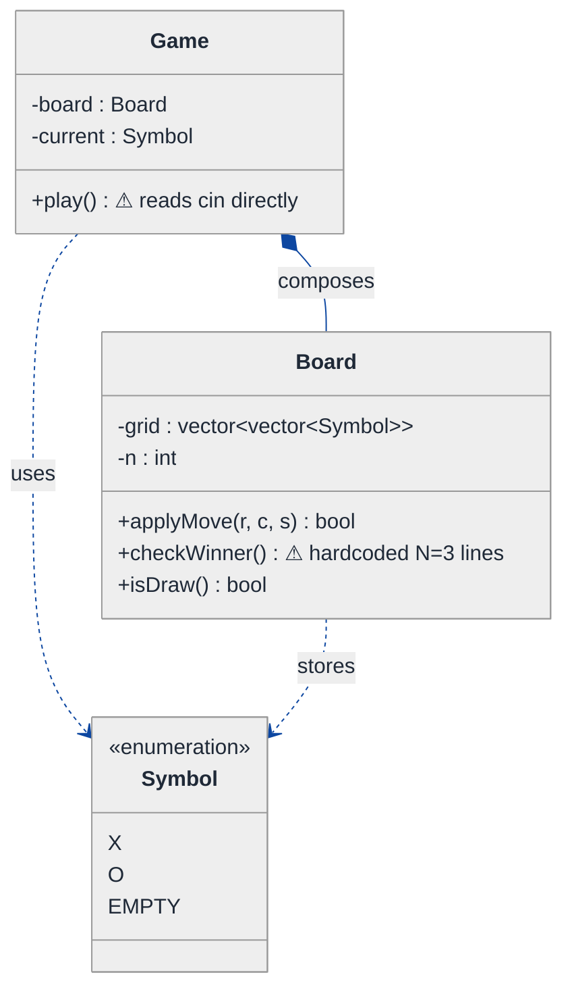
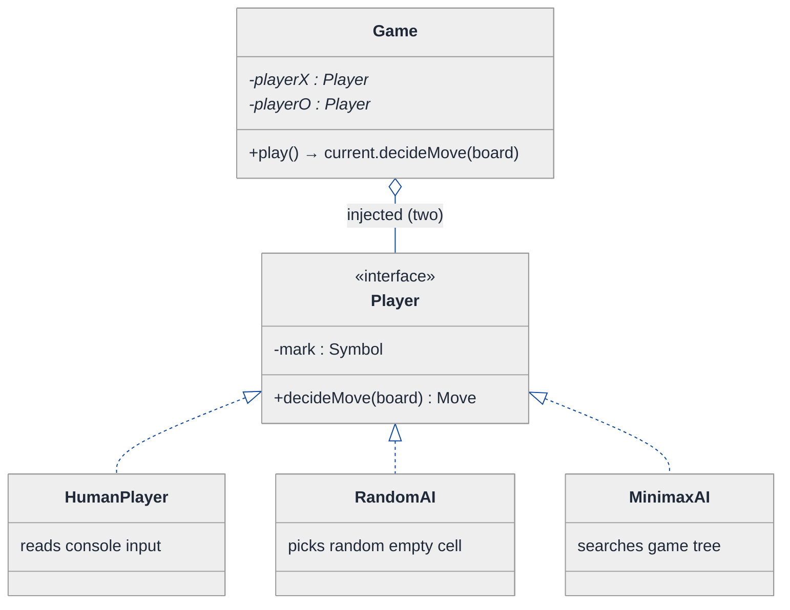
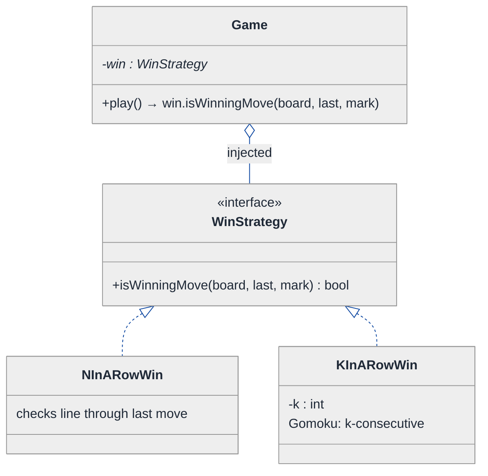
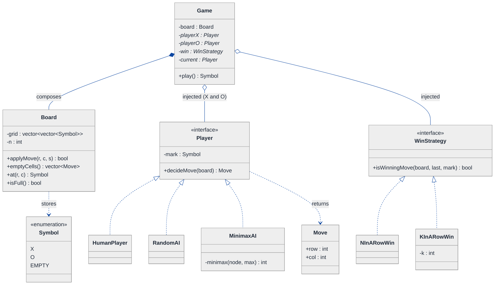
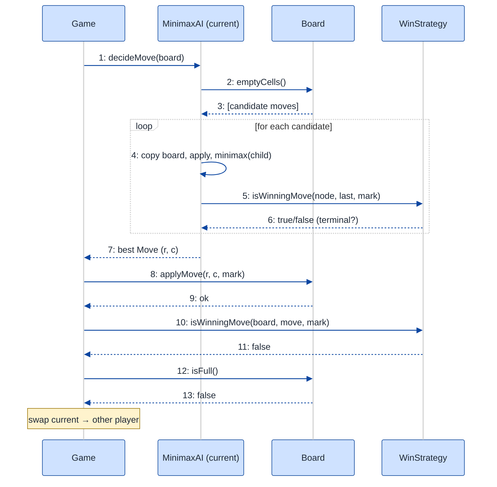

# Tic-Tac-Toe — LLD Walkthrough

> **Difficulty:** Medium · **Time:** ~30 min · **Pattern focus:** Strategy (player AI) + a supporting Strategy (win detection)
>
> **Problem source(s):** GID SG10, bucket `Strategy_Pattern`. Representative of multiple LeetLens rows in [`./EXTRACTED_QUESTIONS.md`](./EXTRACTED_QUESTIONS.md).
>
> **Diagrams:** inline mermaid (renders natively in GitHub / VS Code). No external image sources.

---

## How to use this file

Paced for a candidate seeing Tic-Tac-Toe LLD for the first time. Reading time: ~30 minutes if you sketch each iteration by hand. **The lesson: a "human vs human" board game and an "AI opponent" game share 95% of their code — but only if you spotted, up front, that "how a player decides its move" is a swappable algorithm. The naive design bakes the human-input assumption into the game loop; the interviewer's real probe is whether you can lift that decision out behind an interface so minimax slots in as just another player.**

**Map of this file (15 sections):**

1. Problem statement + clarifying questions
2. Plain-English restatement
3. Why this matters
4. Mental model
5. Try it yourself first
6. Entity & verb extraction
7. **Iteration 1: the naive design** — what we'd write first
8. **Where the naive design hurts** — four future requirements, one painful diff each
9. **Pivot 1: Strategy for the player's move decision** — the most painful axis first
10. **Pivot 2: Strategy for win detection** — a second, smaller algorithm axis
11. **Pivot 3: factoring the board so the rules stop hardcoding N=3**
12. Final UML class diagram
13. Skeleton code (C++)
14. Key flow — sequence diagram
15. Extensibility re-check + anti-patterns + how to think aloud + self-check

---

## 1. Problem statement + clarifying questions

**Prompt (typical phrasing):** "Design a Tic-Tac-Toe game supporting a configurable N x N board, two players, win-condition checking (row, column, diagonal), and draw detection. Extend it to support an AI opponent using minimax."

**Clarifying questions to ask BEFORE drawing anything:**

1. **Board size?** Always 3x3, or genuinely configurable N x N? Does a win need N-in-a-row, or a fixed K-in-a-row (like Gomoku's 5-in-a-row on a 15x15 board)?
2. **Player count and symbols?** Always two (X and O), or could there be 3+ players each with their own mark?
3. **Who supplies a move?** Human at a keyboard, an AI, a remote network opponent, a replay file? Should the game loop care which?
4. **AI strength?** Is minimax the only AI, or do we want easy/medium/hard (random, heuristic, full minimax)? Does the AI need a depth limit or alpha-beta pruning for larger boards?
5. **Turn alternation rules?** Strict X-then-O, or could a variant let a player move twice / pass?
6. **End conditions?** Win, draw — anything else (resign, timeout, illegal-move forfeit)?
7. **Where does the UI live?** Console, GUI, API? Should the core engine be UI-agnostic?

**Assumptions if interviewer dodges:** configurable N x N board with N-in-a-row to win, exactly two players, moves come from "players" whose decision logic is pluggable (human OR AI), AI = full minimax (with room to add alpha-beta and a depth cap), strict turn alternation, end on win or draw, console UI but the engine is UI-agnostic.

---

## 2. Plain-English restatement

We're building the engine that runs a game of Tic-Tac-Toe on an N x N grid. The engine must: track which cells are filled and by whom, alternate turns between two players, validate that a move targets an empty in-bounds cell, detect when someone has completed a full row / column / diagonal, and detect a draw when the board fills with no winner. The crucial extension: one of the "players" might be a human typing coordinates, and another might be a minimax AI computing its best move — and **the game loop must not know or care which is which.**

---

## 3. Why this matters

This question looks like a toy, which is exactly why it discriminates. A junior writes a `while` loop that reads from `cin`, hardcodes 3x3, and scatters win-checks. A senior notices that "the human types a move" and "the AI computes a move" are the SAME operation — *produce a move given the board* — and the only thing that varies is HOW. The interviewer is probing whether you can name that varying axis (the player's decision algorithm) and lift it behind an interface so the AI is a drop-in, not a rewrite. The same instinct shows up everywhere: pluggable validators, pluggable sort comparators, pluggable retry policies. Get this one right and you've demonstrated the core reflex of behavior-based design.

---

## 4. Mental model

A board game is a **state** (the grid + whose turn it is) plus a **driver loop** that repeatedly asks the current player for a move, applies it, and checks for an end condition. The thing that varies between "human game" and "AI game" is NOT the loop and NOT the board — it's the single step "decide which cell to play."

```
Real-world sketch (NOT a UML diagram yet):

        ┌───────────────────────────────┐
        │   Game loop (the referee)      │
        │   while not over:              │
        │     move = currentPlayer.???   │  ← the ONE step that varies
        │     board.apply(move)          │
        │     if win/draw: stop          │
        │     swap currentPlayer         │
        └───────────────────────────────┘
              ▲                  ▲
       "type a cell"      "run minimax"
        (HumanPlayer)       (AIPlayer)
```

The KEY insight from this picture: the referee runs the same script regardless of who's playing. The only swappable cartridge is `currentPlayer.decideMove(board)`. That cartridge is the Strategy.

---

## 5. Try it yourself first

> **Predict before reading on:**
>
> 1. List the nouns you'd promote to a class. Which would you leave as plain fields?
> 2. **If I told you that next sprint we need a "play against the computer" mode, what in your design would have to change?** If your answer is "the game loop," that's the smell we're hunting.
> 3. Where does the win-checking logic live — on the Board, the Game, or somewhere else? Does it have to know N=3?

---

## 6. Entity & verb extraction

> **Mini-refresher: noun → class, but not every noun.**
>
> Naive OOD promotes every noun to a class. Senior OOD promotes a noun only when it has BEHAVIOR and STATE that belong together. "Symbol" (X / O) is usually an enum, not a class. "Player" earns class-hood because the *behavior* of choosing a move is exactly what we want to vary.

**Nouns from the prompt:**

| Noun | Decision | Why |
|---|---|---|
| Game | Class (top-level coordinator) | Owns the loop, players, board; drives turns |
| Board | Class | Holds the grid, applies moves, reports cell state |
| Player | Class (abstract) + concrete subclasses | Behavior `decideMove` is the variable axis |
| Move | Small struct/class (row, col) | Value object; the output of a decision |
| Symbol / Mark | `enum class { X, O, EMPTY }` | No behavior; pure tag |
| Win condition | Will become a strategy (see §10) | An *algorithm*, not a thing |
| Cell | Field of Board (`Symbol` in a 2D vector) | No behavior of its own |

**Verbs (and the class they live on):**

| Verb | Owner class (naive answer — we'll re-examine) |
|---|---|
| play() / run() | Game |
| decideMove(board) | Player (the axis we'll vary) |
| applyMove(move, symbol) | Board |
| isCellEmpty(r, c) | Board |
| checkWinner() | Board (naive) → its own strategy (later) |
| isDraw() | Board |
| switchTurn() | Game |

**We have NOT introduced any design patterns yet.** Pure nouns + verbs. But notice the table already flagged `decideMove` and `checkWinner` as "the things that vary" — that's the foreshadowing the interviewer wants you to surface.

---

## 7. <a id="iter-1"></a>Iteration 1: the naive design

Let's write the simplest thing that could possibly work. No patterns — a Game, a Board, an enum, and a loop that reads from the console.



**Reader's tour (read top to bottom; ~45 seconds).**

1. **`Game` is the root.** It owns a `Board` (filled diamond = composition; the board lives and dies with the game) and tracks `current`, the symbol whose turn it is. Its single public method `play()` runs the whole match.

2. **The trouble marker on `Game::play()`.** It reads moves directly from `cin`. There is no concept of a "player object." The human-input assumption is welded INTO the loop. This is the smell that change A in §8 will detonate.

3. **`Board` holds the grid** as a 2D vector of `Symbol`, plus `n`. It can apply a move and report a winner / draw.

4. **The trouble marker on `Board::checkWinner()`.** In the naive version this is hardcoded for 3x3 — three explicit row checks, three column checks, two diagonals. It *takes* an `n` but the win logic was written assuming N=3.

5. **`Symbol` is a plain enum.** X, O, EMPTY. No behavior. Correctly NOT a class.

**What's deliberately missing.** No `Player` abstraction. No `MoveStrategy`. No `WinStrategy`. The naive design doesn't even acknowledge that "who decides the move" or "what counts as a win" are axes that vary. It bakes a single hardcoded answer for each into the loop and the board. That's what we'll expose, then fix.

Skeleton code for the naive design (C++):

```cpp
#include <iostream>
#include <vector>

enum class Symbol { X, O, EMPTY };

class Board {
public:
    explicit Board(int n) : n_(n), grid_(n, std::vector<Symbol>(n, Symbol::EMPTY)) {}

    bool applyMove(int r, int c, Symbol s) {
        if (r < 0 || r >= n_ || c < 0 || c >= n_) return false;
        if (grid_[r][c] != Symbol::EMPTY) return false;
        grid_[r][c] = s;
        return true;
    }

    Symbol checkWinner() const {            // hardcoded for 3x3 — will hurt
        for (int i = 0; i < 3; ++i) {
            if (grid_[i][0] != Symbol::EMPTY && grid_[i][0] == grid_[i][1] && grid_[i][1] == grid_[i][2])
                return grid_[i][0];          // row
            if (grid_[0][i] != Symbol::EMPTY && grid_[0][i] == grid_[1][i] && grid_[1][i] == grid_[2][i])
                return grid_[0][i];          // column
        }
        if (grid_[0][0] != Symbol::EMPTY && grid_[0][0] == grid_[1][1] && grid_[1][1] == grid_[2][2])
            return grid_[0][0];              // main diagonal
        if (grid_[0][2] != Symbol::EMPTY && grid_[0][2] == grid_[1][1] && grid_[1][1] == grid_[2][0])
            return grid_[0][2];              // anti-diagonal
        return Symbol::EMPTY;
    }

    bool isDraw() const {
        for (const auto& row : grid_)
            for (Symbol s : row) if (s == Symbol::EMPTY) return false;
        return checkWinner() == Symbol::EMPTY;
    }
private:
    int n_;
    std::vector<std::vector<Symbol>> grid_;
};

class Game {
public:
    explicit Game(int n) : board_(n) {}

    void play() {
        Symbol current = Symbol::X;
        while (true) {
            int r, c;
            std::cout << "Player " << (current == Symbol::X ? "X" : "O") << " move (row col): ";
            std::cin >> r >> c;                          // human input WELDED into the loop
            if (!board_.applyMove(r, c, current)) {
                std::cout << "Illegal move, try again\n";
                continue;
            }
            if (board_.checkWinner() != Symbol::EMPTY) { std::cout << "Winner!\n"; return; }
            if (board_.isDraw())                        { std::cout << "Draw!\n";  return; }
            current = (current == Symbol::X) ? Symbol::O : Symbol::X;
        }
    }
private:
    Board board_;
};
```

**This works.** It has zero design patterns. Two humans can sit at one keyboard and play a complete 3x3 game. So what's wrong with it?

---

## 8. <a id="naive-pain"></a>Where the naive design hurts

The interviewer slides a piece of paper across the desk: "Here are four things product wants next quarter. Walk me through what changes."

### Change A: "Add a 'play against the computer' mode using minimax"

In the naive design:
- There is no `Player` object — the loop reads `cin` directly. To add an AI you'd write `if (aiMode && current == Symbol::O) { auto [r,c] = runMinimax(...); } else { std::cin >> r >> c; }`.
- That `if (aiMode)` branch lands **inside `Game::play()`**, the hottest method in the system.
- Worse, the next mode (network player, replay file) adds ANOTHER branch in the same loop. **`play()` becomes a switchboard of input sources.**

### Change B: "Support N x N with N-in-a-row to win (e.g., 5x5)"

In the naive design:
- `Board::checkWinner()` is hardcoded to 3x3 — literal indices `[0][0]`, `[1][1]`, `[2][2]`, loop bound `i < 3`.
- You rewrite the entire method to loop generically. **Every index literal is a landmine**, and you have to re-derive the diagonal logic from scratch.

### Change C: "Add easy / medium / hard AI (random, heuristic, full minimax)"

In the naive design:
- Building on the change-A branch, now you nest a SECOND switch: `if (difficulty == EASY) randomMove(); else if (HARD) minimax();`.
- **Two interacting switches inside `play()`** — input source AND difficulty. The method is now unreadable.

### Change D: "Make the engine usable from a GUI, not just the console"

In the naive design:
- `play()` calls `std::cout` and `std::cin` directly. A GUI can't drive a blocking `cin` loop.
- You'd have to gut the loop and invert control. **The engine and the console UI are fused.**

### The pattern of pain

| Change | Method/lines touched | Smell |
|---|---|---|
| A. AI opponent | `Game::play()` grows an `if (aiMode)` branch | "Input source is hardcoded into the game loop." |
| B. N x N win | `Board::checkWinner()` full rewrite | "Win logic hardcoded to a single board size." |
| C. AI difficulty | `Game::play()` second nested switch | "Algorithm choice is a switch, not a swap." |
| D. GUI front end | `play()` is tangled with `cin`/`cout` | "UI and engine fused; no seam to inject input." |

**Two axes of pain dominate:** *who/how a move is decided* (changes A, C, D all reduce to "the move-source varies") and *how a win is detected for arbitrary N* (change B).

> **Pivot question:** "What pattern lets the game loop ask 'give me your move' WITHOUT knowing whether the answer comes from a human, an AI, or a network — and lets me swap that decision algorithm freely?"
>
> The answer is Strategy. The varying thing is *the move-decision algorithm itself*. Let's introduce it for the most painful axis first: the player's move.

---

## 9. <a id="pivot-1"></a>Pivot 1: Strategy for the player's move decision

> **Mini-refresher: Strategy pattern.**
>
> Encapsulates an algorithm behind an interface so it can be swapped at runtime. The CALLER holds a pointer to the interface and invokes one method; it never branches on which concrete algorithm it has. The strategies don't know about each other.
>
> Quick example: a `Sorter` takes a `Comparator*`. Pass `Ascending` or `Descending` — the sorter calls `cmp(a, b)` and doesn't care which it got.

**Why Strategy fits the player's move.** The game loop performs one step that varies: "decide which cell to play, given the current board." A human reads from the console; a minimax AI searches the game tree; a random AI picks any empty cell; a network player waits for a socket. The OUTPUT is identical (a `Move`); only the algorithm differs, and the choice is made externally (when you set up the match — "human vs AI"). That's textbook Strategy: same contract, swappable implementation, picked by the caller.

Here `Player` IS the strategy interface — the single method `decideMove(const Board&) -> Move` is the algorithm. (You can name the interface `Player` or `MoveStrategy`; `Player` reads more naturally because it also carries the symbol.)

**The refactor (just the affected part):**

```cpp
struct Move { int row, col; };

class Player {                                   // the Strategy interface
public:
    explicit Player(Symbol mark) : mark_(mark) {}
    virtual ~Player() = default;
    virtual Move decideMove(const Board& board) = 0;   // the varying algorithm
    Symbol mark() const { return mark_; }
private:
    Symbol mark_;
};

class HumanPlayer : public Player {
public:
    using Player::Player;
    Move decideMove(const Board& board) override {
        int r, c;
        std::cout << "Your move (row col): ";
        std::cin >> r >> c;                      // console input lives HERE, not in Game
        return { r, c };
    }
};

class RandomAI : public Player {
public:
    using Player::Player;
    Move decideMove(const Board& board) override {
        auto cells = board.emptyCells();
        return cells[std::rand() % cells.size()];
    }
};

class MinimaxAI : public Player {                // full minimax — the headline extension
public:
    using Player::Player;
    Move decideMove(const Board& board) override {
        int bestScore = -1000; Move best{ -1, -1 };
        for (const Move& m : board.emptyCells()) {
            Board next = board;                  // copy, try, undo via value semantics
            next.applyMove(m.row, m.col, mark());
            int score = minimax(next, /*maximizing=*/false);
            if (score > bestScore) { bestScore = score; best = m; }
        }
        return best;
    }
private:
    int minimax(Board node, bool maximizing);    // recursive search — body in §13
};

class Game {
    // play() no longer reads cin. It just asks the current Player for a move:
    //   Move m = current->decideMove(board_);
    std::unique_ptr<Player> playerX_;            // injected at construction
    std::unique_ptr<Player> playerO_;
    Board board_;
};
```

**What changed — visualized.** Just the player slice:



**Tour of the after-state.**

1. **`Game` lost its `cin` dependency.** It now holds two `Player*` (open diamond = aggregation; the players are injected at construction, the lot doesn't `new` them inline). Its loop became `Move m = current->decideMove(board_);` — it asks the current player and applies the result. **`Game::play()` no longer knows or cares who is playing.**

2. **`Player` is the Strategy interface.** One pure-virtual method, `decideMove(const Board&) -> Move`. The contract is narrow: given a board, return a move. It also carries the player's `mark` (X or O), because that's intrinsic player state.

3. **Three concrete strategies hang off it.** `HumanPlayer` reads the console (the input code MOVED out of `Game` into here). `RandomAI` picks any empty cell. `MinimaxAI` runs the full search. All three satisfy the same contract.

4. **The headline extension is now a drop-in.** "Play against the computer" = construct the game with `HumanPlayer` and `MinimaxAI` instead of two `HumanPlayer`s. **Zero changes to `Game::play()`.** Change A from §8 evaporated.

**Changes A, C, and D from §8 now land cleanly.** AI opponent → pass a `MinimaxAI`. Difficulty levels → `RandomAI` / `HeuristicAI` / `MinimaxAI`, each a new class. GUI → a `GuiHumanPlayer` whose `decideMove` blocks on a UI event instead of `cin` — the engine never changes. **One axis, one interface, every input source becomes a leaf class.**

**Pattern-discrimination cheatsheet — Strategy vs State.**
- *Strategy:* the CALLER picks which algorithm to use, up front, and it stays put. `Game` is configured with `MinimaxAI` for O — that choice doesn't change mid-game.
- *State:* the OBJECT flips its own behavior internally as events arrive (e.g., a ticket going Active → Paid → Exited).
- *Rule of thumb:* if `game.setPlayer(o, minimaxAI)` is decided externally and stable → Strategy. If `player.handleEvent(e)` would silently change how the same object behaves next call → State. Here the player's algorithm is fixed at setup, so it's Strategy, not State.

**Pattern-discrimination cheatsheet — Strategy vs Template Method (the trap candidates fall into).**
- *Strategy:* whole algorithm in a separate swappable object, chosen by composition. `Player` is injected.
- *Template Method:* algorithm skeleton in a base class, subclasses override hook methods via inheritance — e.g., a `BasePlayer` with a `protected: virtual scoreMove()` hook.
- *Rule of thumb:* if the variants are wholly different (typing vs tree-search share NO skeleton) → Strategy. If they share a fixed skeleton and differ only in one step → Template Method. Human and minimax share nothing, so Strategy is the right call.

---

## 10. <a id="pivot-2"></a>Pivot 2: Strategy for win detection

Change B from §8 is still painful — `checkWinner()` is hardcoded to 3x3, and the broader variant (Gomoku: 5-in-a-row on a 15x15 board) means "what counts as a win" is itself an algorithm that varies.

> **Mini-refresher: Strategy again — but a different role.**
>
> Strategy is a *role*, not a single class. We already used it for the player's move. "How do I detect a win" is a SECOND, independent algorithm axis: standard N-in-a-row, K-in-a-row (Gomoku), or even a custom shape. Same pattern, separate interface — they share nothing at the type level, so they stay separate hierarchies. (Trying to unify them under one `Strategy<T>` template would be premature genericism.)

**Why Strategy (not just a smarter method).** You could rewrite `checkWinner()` to loop generically and stop there. That handles N-in-a-row. But the moment Gomoku ("5-in-a-row, board may be 15x15, win does NOT require filling a full line") arrives, a single method sprouts a mode flag. The win rule is a policy that VARIES — lift it behind an interface and the board stops caring.

**The refactor (just the win-detection part):**

```cpp
class WinStrategy {
public:
    virtual ~WinStrategy() = default;
    // Given the board and the move just played, did that move complete a win?
    virtual bool isWinningMove(const Board& board, const Move& last, Symbol mark) const = 0;
};

class NInARowWin : public WinStrategy {          // standard: fill any full line
public:
    bool isWinningMove(const Board& board, const Move& last, Symbol mark) const override {
        int n = board.size();
        return fullLine(board, last.row, 0, 0, 1, mark, n)   // its row
            || fullLine(board, 0, last.col, 1, 0, mark, n)   // its column
            || (last.row == last.col      && fullLine(board, 0, 0, 1, 1, mark, n))      // main diag
            || (last.row + last.col == n-1&& fullLine(board, 0, n-1, 1, -1, mark, n));  // anti-diag
    }
private:
    static bool fullLine(const Board& b, int r0, int c0, int dr, int dc, Symbol m, int n) {
        for (int i = 0; i < n; ++i) if (b.at(r0 + i*dr, c0 + i*dc) != m) return false;
        return true;
    }
};

class KInARowWin : public WinStrategy {          // Gomoku: K consecutive anywhere through last
public:
    explicit KInARowWin(int k) : k_(k) {}
    bool isWinningMove(const Board& board, const Move& last, Symbol mark) const override;
    // scans the 4 directions through `last` for k consecutive marks — body elided
private:
    int k_;
};

class Board {
    // checkWinner() is GONE. The board exposes at(r,c)/size(); the WIN RULE lives on the strategy,
    // invoked by Game after each move: if (win_->isWinningMove(board_, m, current->mark())) ...
};
```

**What changed — visualized.** Just the win-detection slice:



**Tour of the after-state.**

1. **`Board::checkWinner()` is gone.** The board shrank to pure data + access (`at(r,c)`, `size()`, `applyMove`, `emptyCells`). It no longer encodes the rules of victory — it just holds marks.

2. **`WinStrategy` is the interface.** `isWinningMove(board, lastMove, mark)`. Note the signature took the LAST move as a parameter — we only need to re-check the lines through the cell that just changed, which is O(N) per move instead of O(N^2) rescanning the whole board.

3. **Two concrete rules.** `NInARowWin` (standard) and `KInARowWin(k)` (Gomoku). `Game` holds one `WinStrategy*`, injected at construction, and calls it after each move.

4. **Change B from §8 evaporated, and so did its bigger cousin.** N x N standard win → `NInARowWin` (size-agnostic, derived from `board.size()`). Gomoku → `KInARowWin(5)`. The board never changes; you pick a win rule when you build the game.

**Pattern-discrimination cheatsheet — two Strategies, why not merge them.**
- `Player` and `WinStrategy` are BOTH Strategy, but they vary independently and have unrelated signatures (`Move decideMove(board)` vs `bool isWinningMove(board, move, mark)`).
- *Rule of thumb:* one Strategy interface per axis of variation. Don't force two unrelated algorithms into a shared base just because both are "strategies." Strategy is a role each plays, not a type they share.

---

## 11. <a id="pivot-3"></a>Pivot 3: factoring the Board so the rules stop hardcoding N

Pivots 1 and 2 lifted out the two algorithm axes. One structural cleanup remains: the `Board` itself must be a clean, N-agnostic value object so that (a) `MinimaxAI` can copy it cheaply to explore hypothetical futures, and (b) `WinStrategy` can query it without knowing N=3.

This isn't a new GoF pattern — it's applying a principle we should name.

> **Mini-refresher: Single Responsibility Principle (the S in SOLID).**
>
> A class should have ONE reason to change. The naive `Board` had three reasons: storing cells, deciding wins, AND being tied to N=3 indexing. We already moved win-detection out (Pivot 2). What's left is making the board a focused, copyable data structure with one job: hold marks and answer questions about cells.

**Why the board must be cheaply copyable.** Minimax explores the game tree by trying a move, recursing, and undoing it. The simplest correct way to "undo" is value semantics: copy the board, mutate the copy, throw it away. For a small N this copy is cheap and bug-free (no mutate-then-restore aliasing bugs). So `Board` gets a clean copy constructor (the default works — it's just a `vector<vector<Symbol>>`).

**The refactor (the board's final shape):**

```cpp
class Board {
public:
    explicit Board(int n) : n_(n), grid_(n, std::vector<Symbol>(n, Symbol::EMPTY)) {}
    Board(const Board&) = default;               // value semantics → minimax copies freely

    int  size() const { return n_; }
    Symbol at(int r, int c) const { return grid_[r][c]; }

    bool applyMove(int r, int c, Symbol s) {     // single responsibility: place a mark
        if (r < 0 || r >= n_ || c < 0 || c >= n_ || grid_[r][c] != Symbol::EMPTY) return false;
        grid_[r][c] = s;
        return true;
    }

    std::vector<Move> emptyCells() const {       // used by both RandomAI and MinimaxAI
        std::vector<Move> out;
        for (int r = 0; r < n_; ++r)
            for (int c = 0; c < n_; ++c)
                if (grid_[r][c] == Symbol::EMPTY) out.push_back({ r, c });
        return out;
    }

    bool isFull() const {
        for (const auto& row : grid_)
            for (Symbol s : row) if (s == Symbol::EMPTY) return false;
        return true;
    }
private:
    int n_;
    std::vector<std::vector<Symbol>> grid_;
};
```

**The lesson.** No new pattern here — just discipline. Once win-detection (Pivot 2) and move-decision (Pivot 1) left the board, the board's remaining job is so simple it becomes a clean value object. **That cleanliness is what makes minimax trivial to write:** `Board next = board; next.applyMove(...); minimax(next, ...);` — copy, try, recurse, discard. Draw detection becomes `board.isFull() && nobody won`, computed by `Game` from the two strategies it already owns.

---

## 12. <a id="fig-class-diagram"></a>Final class diagram

One diagram now fits comfortably — the design is small. Read it top-down: `Game` is the referee that owns the board and aggregates two Strategy interfaces (player decision + win rule).



**Reading guide (two paragraphs).**

`Game` is the referee. It COMPOSES a `Board` (filled diamond — the board lives and dies with the game) and AGGREGATES three injected strategy pointers: two `Player`s (X and O) and one `WinStrategy` (open diamonds — injected at construction, lifetimes managed via `unique_ptr` but conceptually "used, not born here"). The loop holds a `current` pointer that alternates between `playerX` and `playerO`. Every turn is the same three lines: ask `current->decideMove(board)`, `board.applyMove(...)`, then `win->isWinningMove(...)` — and if the board `isFull()` with no win, it's a draw.

The two Strategy hierarchies are the heart of the design and they vary independently. `Player` answers "what move do I make" — `HumanPlayer` (console), `RandomAI`, `MinimaxAI` (tree search). `WinStrategy` answers "did that move win" — `NInARowWin` (standard) and `KInARowWin` (Gomoku). `Board` is now a clean, copyable value object with one job (hold marks, answer cell queries), which is precisely what lets `MinimaxAI` copy it freely to explore hypothetical futures. **Inheritance appears ONLY in the two strategy families; everything else is composition over interfaces.** That's the whole extensibility story.

---

## 13. Skeleton code (C++)

> Show the SHAPES, not the full impl. Abstract bases + 1-2 concretes per pattern; the rest `// elided`.

```cpp
#include <iostream>
#include <memory>
#include <vector>

// ── Value types ─────────────────────────────────────────────────────
enum class Symbol { X, O, EMPTY };
struct Move { int row, col; };

// ── Board: a clean, copyable value object (SRP) ─────────────────────
class Board {
public:
    explicit Board(int n) : n_(n), grid_(n, std::vector<Symbol>(n, Symbol::EMPTY)) {}
    Board(const Board&) = default;               // copy is cheap → minimax explores freely

    int    size() const                 { return n_; }
    Symbol at(int r, int c) const        { return grid_[r][c]; }
    bool   isFull() const {
        for (const auto& row : grid_)
            for (Symbol s : row) if (s == Symbol::EMPTY) return false;
        return true;
    }
    bool applyMove(int r, int c, Symbol s) {
        if (r < 0 || r >= n_ || c < 0 || c >= n_ || grid_[r][c] != Symbol::EMPTY) return false;
        grid_[r][c] = s;
        return true;
    }
    std::vector<Move> emptyCells() const {
        std::vector<Move> out;
        for (int r = 0; r < n_; ++r)
            for (int c = 0; c < n_; ++c)
                if (grid_[r][c] == Symbol::EMPTY) out.push_back({ r, c });
        return out;
    }
private:
    int n_;
    std::vector<std::vector<Symbol>> grid_;
};

// ── Strategy #1: how a player decides a move ────────────────────────
class Player {
public:
    explicit Player(Symbol mark) : mark_(mark) {}
    virtual ~Player() = default;
    virtual Move decideMove(const Board& board) = 0;
    Symbol mark() const { return mark_; }
private:
    Symbol mark_;
};

class HumanPlayer : public Player {
public:
    using Player::Player;
    Move decideMove(const Board&) override {
        int r, c; std::cout << "Move (row col): "; std::cin >> r >> c;
        return { r, c };
    }
};
// class RandomAI : public Player { ... emptyCells()[rand] ... };   // elided

// ── Strategy #2: how a win is detected ──────────────────────────────
class WinStrategy {
public:
    virtual ~WinStrategy() = default;
    virtual bool isWinningMove(const Board& b, const Move& last, Symbol mark) const = 0;
};

class NInARowWin : public WinStrategy {
public:
    bool isWinningMove(const Board& b, const Move& last, Symbol m) const override {
        int n = b.size();
        return line(b, last.row, 0, 0, 1, m, n)
            || line(b, 0, last.col, 1, 0, m, n)
            || (last.row == last.col       && line(b, 0, 0, 1, 1, m, n))
            || (last.row + last.col == n-1 && line(b, 0, n-1, 1, -1, m, n));
    }
private:
    static bool line(const Board& b, int r0, int c0, int dr, int dc, Symbol m, int n) {
        for (int i = 0; i < n; ++i) if (b.at(r0 + i*dr, c0 + i*dc) != m) return false;
        return true;
    }
};
// class KInARowWin : public WinStrategy { int k_; ... };           // elided (Gomoku)

// ── MinimaxAI: the headline extension, a Player strategy ────────────
class MinimaxAI : public Player {
public:
    MinimaxAI(Symbol mark, const WinStrategy& win) : Player(mark), win_(win) {}
    Move decideMove(const Board& board) override {
        int best = -1000; Move bestMove{ -1, -1 };
        for (const Move& m : board.emptyCells()) {
            Board next = board;
            next.applyMove(m.row, m.col, mark());
            int score = minimax(next, m, /*maximizing=*/false);
            if (score > best) { best = score; bestMove = m; }
        }
        return bestMove;
    }
private:
    Symbol opponent() const { return mark() == Symbol::X ? Symbol::O : Symbol::X; }
    // Returns +1 if AI wins, -1 if opponent wins, 0 for draw. (Add a depth term to prefer
    // faster wins; add alpha-beta params to prune. Both elided for the shape.)
    int minimax(Board node, Move last, bool maximizing) {
        Symbol mover = maximizing ? opponent() : mark();      // who just played `last`
        if (win_.isWinningMove(node, last, mover))
            return (mover == mark()) ? +1 : -1;
        if (node.isFull()) return 0;
        Symbol toMove = maximizing ? mark() : opponent();
        int bestScore = maximizing ? -1000 : 1000;
        for (const Move& m : node.emptyCells()) {
            Board child = node;
            child.applyMove(m.row, m.col, toMove);
            int s = minimax(child, m, !maximizing);
            bestScore = maximizing ? std::max(bestScore, s) : std::min(bestScore, s);
        }
        return bestScore;
    }
    const WinStrategy& win_;                                  // reuses the SAME win rule
};

// ── Game: the referee. Knows the loop, not the algorithms ───────────
class Game {
public:
    Game(int n, std::unique_ptr<Player> x, std::unique_ptr<Player> o,
         std::unique_ptr<WinStrategy> win)
        : board_(n), playerX_(std::move(x)), playerO_(std::move(o)),
          win_(std::move(win)), current_(playerX_.get()) {}

    Symbol play() {
        while (true) {
            Move m = current_->decideMove(board_);            // STRATEGY in action
            if (!board_.applyMove(m.row, m.col, current_->mark())) continue;  // re-prompt on illegal
            if (win_->isWinningMove(board_, m, current_->mark())) return current_->mark();
            if (board_.isFull()) return Symbol::EMPTY;         // draw
            current_ = (current_ == playerX_.get()) ? playerO_.get() : playerX_.get();
        }
    }
private:
    Board                          board_;
    std::unique_ptr<Player>        playerX_;
    std::unique_ptr<Player>        playerO_;
    std::unique_ptr<WinStrategy>   win_;
    Player*                        current_;     // non-owning; points into playerX_/playerO_
};

// ── Wiring: human vs minimax on a 3x3 board ─────────────────────────
// auto win = std::make_unique<NInARowWin>();
// Game g(3, std::make_unique<HumanPlayer>(Symbol::X),
//           std::make_unique<MinimaxAI>(Symbol::O, *win),   // shares the win rule by ref
//           std::move(win));
// Symbol winner = g.play();
```

Notice the one subtlety in the wiring comment: `MinimaxAI` needs a `WinStrategy` to evaluate terminal positions, and it should use the SAME rule the game judges with. We pass it by `const&` and let `Game` own the `unique_ptr`. (In production you'd hold a `shared_ptr<WinStrategy>` so ownership is unambiguous; `const&` keeps the skeleton simple.)

---

## 14. <a id="fig-sequence"></a>Key flow — sequence diagram

One full turn where the current player is the `MinimaxAI`. Watch how `Game` issues the SAME `decideMove` call it would to a human — it has no idea a whole game-tree search is happening behind that one message.



**Tour of the flow.**

1. **`Game` asks the current player to decide (message 1).** This is the ONLY thing `Game` does to get a move. Crucially, this exact same call goes to a `HumanPlayer` — `Game` cannot tell them apart. **That indistinguishability is the Strategy pattern paying off.**

2. **Inside `decideMove`, the AI enumerates candidates (2-3)** by asking the board for its empty cells.

3. **The search loop (4-6).** For each candidate, the AI COPIES the board (value semantics from Pivot 3), applies the trial move, and recurses through `minimax`. At each node it asks the SAME `WinStrategy` the game uses whether the position is terminal. **The AI reuses the game's win rule — it doesn't re-implement victory logic.** This is why win detection had to be its own strategy: both the referee AND the AI consume it.

4. **The AI returns one Move (7).** All the tree search collapsed back into a single `(row, col)` — the identical return type a human would have produced.

5. **`Game` applies and judges (8-13).** It applies the move, asks the win strategy if that move won (it didn't), asks the board if it's full (it isn't), and swaps `current` to the other player.

### What the Strategy pattern HIDES from the caller

`Game::play()` is roughly five lines and contains ZERO branches on "is this an AI." There's no `if (player is MinimaxAI)`, no difficulty switch, no input-source check. The entire complexity of minimax — game-tree recursion, board copying, terminal evaluation — lives behind message 1 and is **completely invisible** to the referee. Swap `MinimaxAI` for `RandomAI`, `HumanPlayer`, or a future `NetworkPlayer`, and this diagram's messages 1 and 7 are identical; only what happens between them changes. **That's the seam Strategy buys you.**

---

## 15. Extensibility re-check + anti-patterns + how to think aloud + self-check

### Extensibility re-check

Revisit the four changes from [§8](#naive-pain). For each, name the SINGLE class that changes.

| Change | Naive design impact | Final design impact |
|---|---|---|
| A. AI opponent | `if (aiMode)` branch in `play()` | New `MinimaxAI : Player`. Wire it as player O. Done. |
| B. N x N / N-in-a-row | Rewrite `checkWinner()` | `NInARowWin` is already size-agnostic (`board.size()`). Done — no change. |
| C. AI difficulty | Nested switch in `play()` | New `RandomAI` / `HeuristicAI : Player`. Pick one at setup. Done. |
| D. GUI front end | Gut the `cin` loop | New `GuiHumanPlayer : Player` whose `decideMove` blocks on a UI event. Engine unchanged. |

Every change is exactly ONE new class (or zero). That's the open/closed principle in practice.

A bonus axis the design now absorbs for free: **Gomoku** (5-in-a-row on a 15x15 board) = `KInARowWin(5)` + a 15-sized board. No engine change. If a future requirement forces you to edit `Game::play()` AND `Board` AND a strategy together, go back to §6 — you missed a variability axis.

### Common confusion + traps

1. **"Should `MinimaxAI` undo moves instead of copying the board?"** Copying is simpler and bug-free for small N; that's why Pivot 3 made `Board` cheaply copyable. For large boards (Gomoku), switch to make/undo on a single board to avoid copy cost — but only if profiling demands it.

2. **"Why isn't `Player` a State pattern? The current player changes every turn."** The *which* player is current changes, but each player's `decideMove` algorithm is FIXED at setup. State is for an object that changes its OWN behavior over time. A `MinimaxAI` always runs minimax. So it's Strategy, alternated by the referee — not State.

3. **"Why is win detection a separate strategy and not a method on `Board`?"** Because the win RULE varies (standard vs Gomoku) AND because the AI needs to reuse it. A method on `Board` couldn't be swapped, and would force the board to know all game variants.

4. **"Should symbols be classes?"** No. `X`/`O`/`EMPTY` have no behavior. An `enum class` is correct. Promoting them to classes is over-engineering.

### Anti-patterns

- **"God Game loop"** — `play()` that reads input, runs AI, checks wins, and prints UI all inline. Split each into a collaborator (Player, WinStrategy) injected in.
- **"Tag-driven if/else"** — `if (player == AI) minimax() else readCin()`. The classic smell Strategy kills; let polymorphism dispatch via `decideMove`.
- **"Hardcoded dimensions"** — literal `[0][0]`, `i < 3` in win checks. Derive everything from `board.size()`.
- **"Anemic Board carrying game rules"** — a board that ALSO decides wins. Keep the board a data structure; lift rules into strategies.
- **"Re-implemented win logic in the AI"** — minimax writing its own victory check that drifts from the game's. Inject the SAME `WinStrategy` into both.
- **"Raw owning pointers"** — `new`ing players and never freeing. Use `unique_ptr` for ownership; non-owning `Player*` for the `current` cursor.

### How to think aloud

> "Tic-Tac-Toe. Let me clarify: configurable N x N? N-in-a-row or fixed K? Is the AI a drop-in or one of several difficulties? Should the engine be UI-agnostic? [Asks §1 questions.] Got it — N x N, two players, pluggable players, full minimax with room for more.
>
> Nouns: Game, Board, Player, Move, Symbol. Symbol is an enum, not a class. The interesting verb is `decideMove` — that's what varies between a human and an AI.
>
> I'll write the NAIVE design first — a Game loop reading `cin`, a Board with a hardcoded 3x3 win check. It works. Now stress-test it. Requirement A: AI opponent — naive design grows an `if (aiMode)` in the loop. Requirement B: N x N win — rewrite checkWinner. C: difficulty — a second switch. D: GUI — the loop is fused to cin.
>
> The pain clusters on one axis: 'who/how decides a move' (A, C, D) and a second axis 'how a win is detected' (B). Both are algorithms that vary by the caller's choice — that's Strategy, twice.
>
> Pivot 1: `Player` interface with `decideMove(board) -> Move`. HumanPlayer reads cin, RandomAI and MinimaxAI compute. Game just calls `current->decideMove`. AI becomes a drop-in.
>
> Pivot 2: `WinStrategy` with `isWinningMove(board, last, mark)`. NInARowWin (size-agnostic) and KInARowWin for Gomoku. Board stops knowing the rules.
>
> Pivot 3: make Board a clean copyable value object so minimax can copy-try-recurse-discard.
>
> Final: Game composes Board, aggregates two Players + one WinStrategy. Every future requirement is one new class. Minimax reuses the game's WinStrategy so the logic never drifts. That's open/closed and DRY."

### Self-check

> **Self-check — the question to ask next time.**
>
> When you see "build a game / workflow / pipeline with [a step that could be done different ways]," before you write that step inline, ask:
>
> > **"Is this step an algorithm the CALLER picks (Strategy) or a lifecycle the OBJECT transitions through (State)?"**
>
> If the answer is "the caller decides up front and it stays put" — like human-vs-AI, or standard-vs-Gomoku — it's Strategy: lift the step behind an interface so each variant is a drop-in class. If the same object would change its OWN behavior as events arrive, that's State. Here it's Strategy, twice, on two independent axes — and minimax falls out as just another Player.

---

## Cross-references

- **Parent topic manifest:** [`./EXTRACTED_QUESTIONS.md`](./EXTRACTED_QUESTIONS.md)
- **Vertical overview:** [`../../LEARNING.md`](../../LEARNING.md)
- **Template:** [`../../TEMPLATE-v2.md`](../../TEMPLATE-v2.md)
- **Canonical exemplar:** [`../Object_Oriented_Design/Parking_Lot.md`](../Object_Oriented_Design/Parking_Lot.md)
- **Related v2 walkthroughs (this bucket):**
  - [`./Battleship_Game.md`](./Battleship_Game.md) — another board game; Strategy for shot/placement logic
  - [`./Coupon_Discount_Engine.md`](./Coupon_Discount_Engine.md) — Strategy for pricing rules (compare with this file's win-rule axis)
  - [`./Shopping_Cart.md`](./Shopping_Cart.md) — Strategy for discount/checkout algorithms
- **Related patterns to study next:** State Pattern (`../State_Pattern/`) — the pattern most confused with Strategy; see the §9 and §15 cheatsheets.
