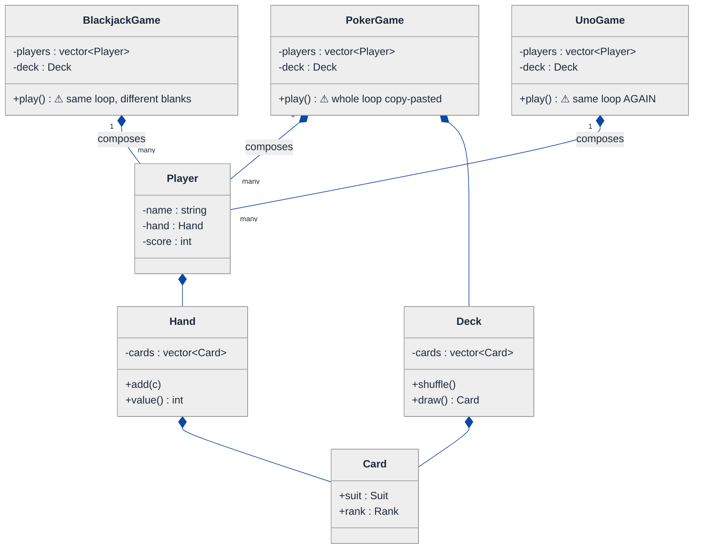
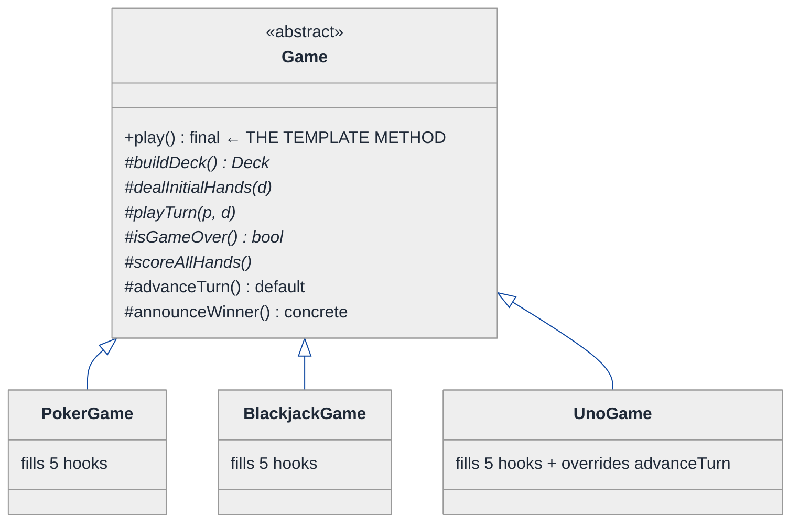
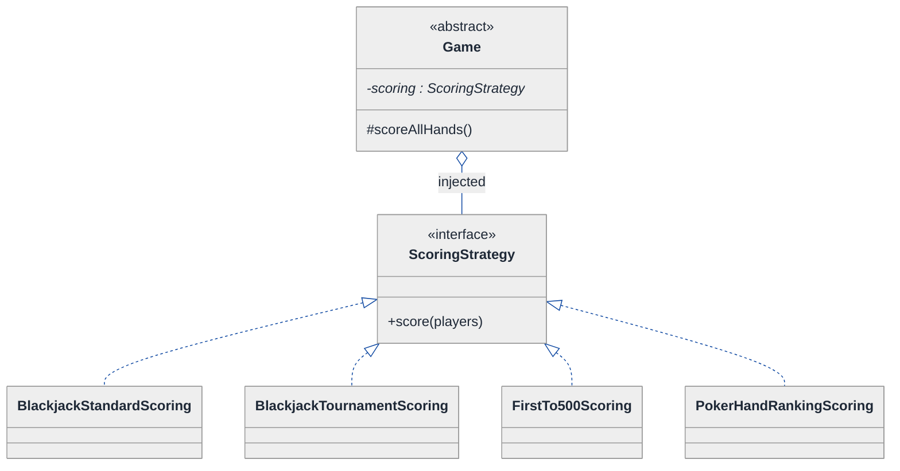
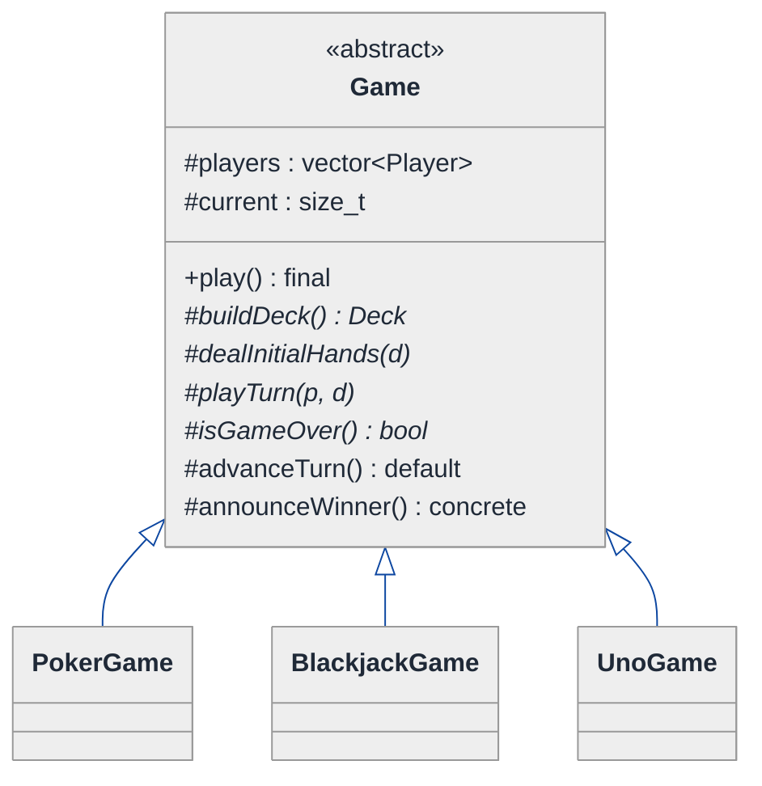
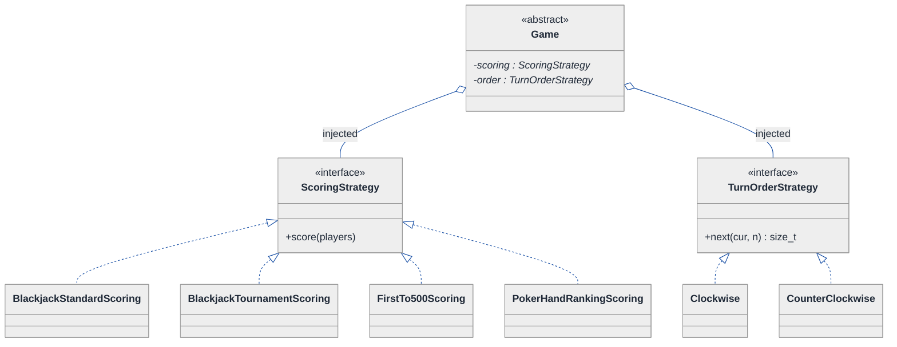
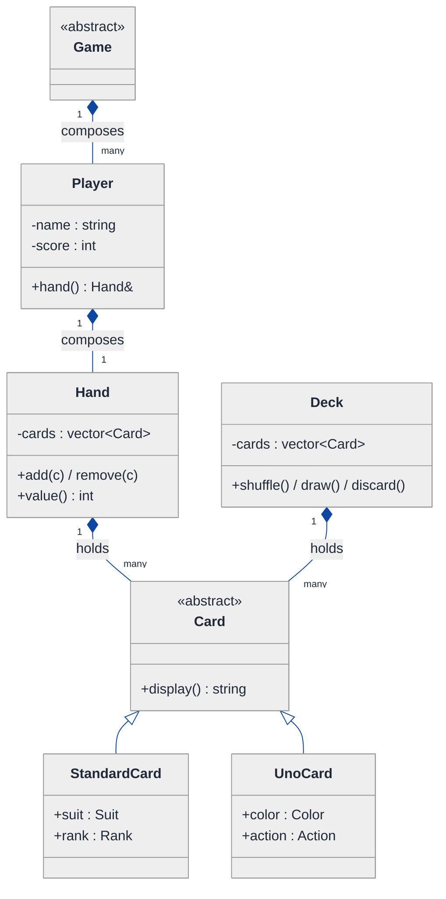
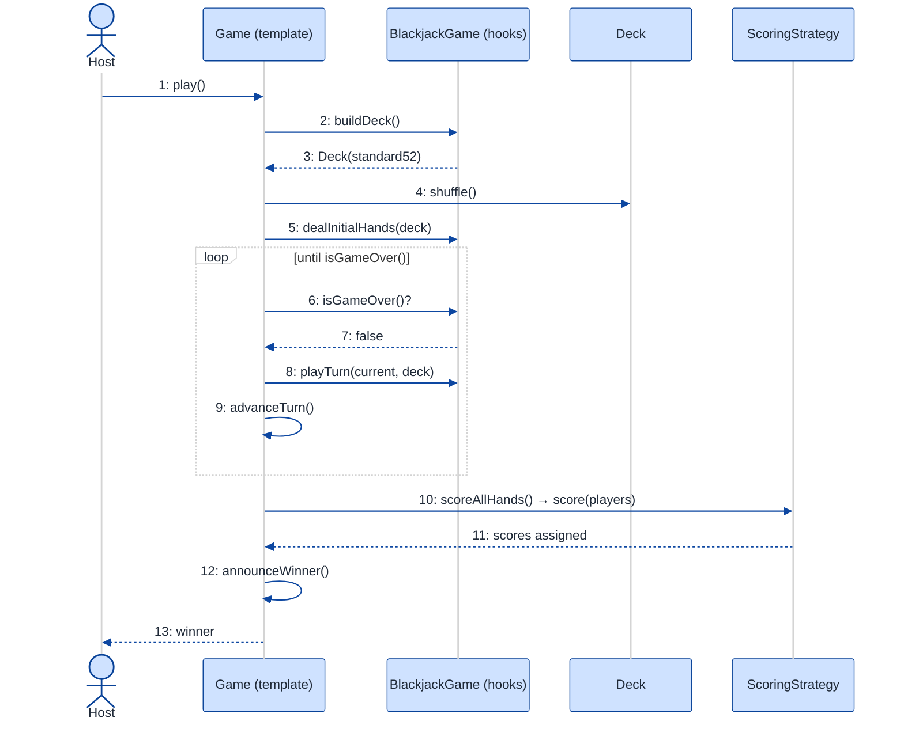

# Multiplayer Card Game Framework — LLD Walkthrough

> **Difficulty:** Medium · **Time:** ~30 min · **Pattern focus:** Template Method (game flow skeleton) + Strategy (scoring / dealing rules)
>
> **Problem source(s):** GID **TM1**, bucket `Template_Method`. Representative of "design a framework that hosts several variants of the same activity" questions.
>
> **Diagrams:** inline mermaid (renders natively in GitHub / VS Code). Canonical theme block per repo convention.

---

## How to use this file

Paced for a candidate seeing "design a card game framework" for the first time. Reading time: ~30 minutes if you sketch each iteration by hand. **The lesson: a *framework* hosting Poker / Blackjack / UNO is not three programs — it is ONE flow with a few holes punched in it. Don't reach for a pattern up front. Build the naive design first, watch it duplicate the same turn-loop three times, and reach for Template Method to fix the skeleton and Strategy to fix the policies that vary within it.**

**Map of this file (15 sections):**

1. Problem statement + clarifying questions
2. Plain-English restatement
3. Why this matters
4. Mental model
5. Try it yourself first
6. Entity & verb extraction
7. **Iteration 1: the naive design** — three games, copy-pasted loops
8. **Where the naive design hurts** — three future requirements, one painful diff each
9. **Pivot 1: Template Method for the game flow** — the most painful axis first
10. **Pivot 2: Strategy for the policies inside the flow** — scoring, dealing
11. **Pivot 3: remaining variability** — turn order, win condition
12. Final UML class diagram
13. Skeleton code (C++)
14. Key flow — sequence diagram
15. Extensibility re-check + anti-patterns + how to think aloud + self-check

---

## 1. Problem statement + clarifying questions

**Prompt (typical phrasing):** "Design a multiplayer card game framework that supports creating different card games (Poker, Blackjack, UNO). Support turn management, hand management, deck operations, scoring rules, and game-over detection. Use the Template Method pattern."

**Clarifying questions to ask BEFORE drawing anything:**

1. **Which games are first-class?** Poker, Blackjack, UNO are named — do they share a standard 52-card deck (Poker/Blackjack) or does UNO need a different deck entirely (108 colored/action cards)? This decides whether `Card` and `Deck` are one type or polymorphic.
2. **What is genuinely SHARED across all three?** Every game seems to: build a deck, shuffle, deal, then loop "next player takes a turn" until some end condition, then score and announce a winner. Is that skeleton identical, or does any game break the order?
3. **What VARIES per game?** How many cards are dealt, what a "turn" means, how a hand is scored, and when the game is over. Are these the only axes, or also turn DIRECTION (UNO reverses), and number of players?
4. **Is this a library others extend, or a closed app?** "Framework" implies third parties add a new game (e.g., Hearts) WITHOUT editing our core. That pushes us toward extension points, not switch statements.
5. **Single process / single table?** Or networked multiplayer with concurrency? Assume one in-process table for the LLD; note concurrency in §15.
6. **Is the deck shared or per-player?** One central draw pile + discard, or each player holds their own deck?

**Assumptions if the interviewer dodges:** one in-process table; 2-6 players; a shared draw deck + discard pile; UNO needs a different card model than 52-card games; third parties WILL add new games; single-threaded for now.

---

## 2. Plain-English restatement

We are building the engine that runs a card game *table*. The engine knows the universal rhythm of card games — make a deck, shuffle it, deal opening hands, then take turns until the game ends, then decide who won. It does NOT know the rules of any specific game. Poker, Blackjack and UNO each plug their own answers into the holes: "how many cards do I deal?", "what does a turn do?", "how do I score a hand?", "is the game over?". Adding a fourth game must mean writing one new class, not editing the engine.

---

## 3. Why this matters

This is the canonical Template Method interview question, and it probes one specific instinct: when several things share a *fixed sequence of steps* but differ in the *content of some steps*, do you duplicate the sequence (copy-paste the turn loop three times) or do you lift the invariant sequence into one place and leave holes? Getting this wrong produces three near-identical 200-line game classes that drift out of sync. Getting it right is the difference between a framework and three programs. It also forces the Template-Method-vs-Strategy discrimination — the single most-tested distinction in this bucket.

---

## 4. Mental model

A card game is a **fixed script with blanks**, like a Mad Libs sheet. The script — setup, deal, the turn loop, game-over check, scoring, announce — never changes order. The blanks are filled per game.

```
Real-world sketch (NOT a UML diagram yet):

   THE UNIVERSAL CARD-GAME SCRIPT (same for every game)
   ┌─────────────────────────────────────────────────────┐
   │ 1. build deck        ......... [BLANK: which deck?]   │
   │ 2. shuffle           ......... (always the same)      │
   │ 3. deal opening hands ........ [BLANK: how many?]     │
   │ 4. WHILE not game over:                               │
   │       current player takes a turn  [BLANK: a turn?]   │
   │       advance to next player       [BLANK: which?]    │
   │ 5. score every hand   ........ [BLANK: scoring rule?] │
   │ 6. announce winner    ........ (always the same)      │
   └─────────────────────────────────────────────────────┘
            ▲                              ▲
        the SKELETON                  the BLANKS
       (write once)               (each game fills in)
```

The KEY insight: the *order* of steps is the invariant; the *content* of a few steps is the variant. The skeleton wants to live in ONE place. The blanks want to be overridable. That split is exactly what Template Method gives you.

---

## 5. Try it yourself first

> **Predict before reading on:**
>
> 1. List 5 nouns you'd promote to a class. List 3 nouns you'd leave as fields.
> 2. **If I told you Poker, Blackjack, and UNO all run the SAME loop "deal → take turns → score → announce", but differ only in four steps, where would you put the loop so you write it exactly once?**
> 3. UNO has Skip / Reverse / Draw-Two action cards that change whose turn is next. Does that break the universal script, or is "advance to next player" just another blank?

---

## 6. Entity & verb extraction

> **Mini-refresher: noun → class, but not every noun.**
>
> Naive OOD promotes every noun to a class. Senior OOD promotes a noun only if it has both BEHAVIOR and STATE that need to live together. "Suit" stays a field; "Deck" becomes a class because it has behavior (shuffle, draw) over state (the remaining cards).

**Nouns from the prompt:**

| Noun | Decision | Why |
|---|---|---|
| Game | Class (abstract base) | Owns the universal flow; the framework's centerpiece |
| Poker / Blackjack / UNO | Concrete subclasses of Game | Each fills the blanks |
| Player | Class | Has a hand, takes turns, has a score |
| Hand | Class | Holds cards, supports add/remove/value |
| Deck | Class | Build / shuffle / draw / discard |
| Card | Class (maybe polymorphic) | Suit+rank for 52-card; color+action for UNO |
| Turn | NOT a class (a method/step) | It's a verb — `playTurn()` — not a thing with state |
| Score | Field on Player + a Strategy later | Just a number until scoring varies |
| Suit / Rank / Color | Fields / `enum class` on Card | No behavior of their own |

**Verbs (and the class they live on):**

| Verb | Owner class (naive answer — we'll re-examine) |
|---|---|
| play() / run() | Game (the whole match) |
| dealInitialHands() | Game |
| playTurn(player) | Game |
| isGameOver() | Game |
| scoreHand(hand) | Game |
| shuffle() / draw() | Deck |
| addCard() / value() | Hand |

**We have NOT introduced any design patterns yet.** Pure nouns + verbs. Notice `Game` is collecting a LOT of verbs — that's a hint the flow lives there, and a warning we'll need structure.

---

## 7. <a id="iter-1"></a>Iteration 1: the naive design

The simplest thing that could possibly work: one class per game, each with its own `play()` that does the whole match start to finish. No patterns.



**Reader's tour (read top to bottom; ~60 seconds).**

1. **Three independent game classes at the top.** `PokerGame`, `BlackjackGame`, `UnoGame`. There is NO shared base. Each one owns its own `players`, its own `deck`, and — the trouble — its own complete `play()` method.

2. **The composition spine (bottom).** Filled diamonds (`◆`) mark composition: a Game composes Players; a Player composes a Hand; a Hand composes Cards; a Deck composes Cards. Same lifetime — kill the game, everything dies with it. This part is fine.

3. **The three `play()` methods are the smell.** Look at the ⚠ markers. Each `play()` contains the SAME sequence — build, shuffle, deal, turn-loop, score, announce — just with different numbers and rules baked inline. The skeleton is duplicated three times.

4. **`Card` is a single concrete class** with `suit` + `rank`. That already mis-models UNO (which has colors and action cards, not suits/ranks) — a crack we'll widen in §8.

**What's deliberately missing.** No abstract `Game`. No `ScoringStrategy`. No `TurnOrder`. The naive design does not even acknowledge that the three `play()` methods are 80% identical — it just copies the loop. That is exactly what we'll expose and fix.

Skeleton code for the naive design (C++):

```cpp
#include <memory>
#include <string>
#include <vector>
#include <algorithm>

enum class Suit { HEARTS, SPADES, DIAMONDS, CLUBS };
enum class Rank { TWO, THREE, /* ... */ KING, ACE };

struct Card { Suit suit; Rank rank; };

class Hand {
public:
    void add(const Card& c) { cards_.push_back(c); }
    int  value() const { /* sum ranks */ return 0; }
    const std::vector<Card>& cards() const { return cards_; }
private:
    std::vector<Card> cards_;
};

class Player {
public:
    explicit Player(std::string name) : name_(std::move(name)) {}
    Hand& hand() { return hand_; }
    int   score = 0;
private:
    std::string name_;
    Hand        hand_;
};

class Deck {
public:
    void shuffle() { /* std::shuffle */ }
    Card draw()    { Card c = cards_.back(); cards_.pop_back(); return c; }
private:
    std::vector<Card> cards_;
};

class BlackjackGame {
public:
    void play() {
        deck_.shuffle();                              // step: shuffle  (SHARED)
        for (auto& p : players_)                      // step: deal     (blank: 2 cards)
            for (int i = 0; i < 2; ++i) p.hand().add(deck_.draw());
        bool over = false;
        while (!over) {                               // step: turn loop (SHARED shape)
            for (auto& p : players_) {
                // blank: a Blackjack turn — hit until >= 17
                while (p.hand().value() < 17) p.hand().add(deck_.draw());
            }
            over = true;                              // blank: game-over rule
        }
        for (auto& p : players_)                      // blank: scoring rule
            p.score = (p.hand().value() <= 21) ? p.hand().value() : 0;
        announceWinner();                             // step: announce (SHARED)
    }
private:
    void announceWinner() { /* highest score */ }
    std::vector<Player> players_;
    Deck                deck_;
};

class PokerGame {
public:
    void play() {
        deck_.shuffle();                              // SHARED — copy #2
        for (auto& p : players_)                      // blank: deal 5 cards
            for (int i = 0; i < 5; ++i) p.hand().add(deck_.draw());
        // ... betting rounds (a Poker "turn") ...
        // ... poker hand ranking (scoring) ...
        announceWinner();                             // SHARED — copy #2
    }
private:
    void announceWinner() { /* duplicate of Blackjack's */ }
    std::vector<Player> players_;
    Deck                deck_;
};
// UnoGame::play() — SHARED skeleton copied a THIRD time. Elided.
```

**This works.** It has zero design patterns. We can run all three games. So what's wrong with it?

---

## 8. <a id="naive-pain"></a>Where the naive design hurts

The interviewer slides three new requirements across the desk: "Here's what's coming. Walk me through what changes."

### Change A: "Fix a bug in the turn loop — a player who busts must be skipped, in EVERY game"

In the naive design:
- The turn loop is copy-pasted into `PokerGame::play()`, `BlackjackGame::play()`, AND `UnoGame::play()`.
- You must apply the skip-on-bust fix in **three places**, and keep them in sync forever.
- Miss one, and Poker silently behaves differently from Blackjack. **Duplicated skeleton = triplicated bugs.**

### Change B: "Add a fourth game, Hearts — and we ship as a library others extend"

In the naive design:
- A third party writes `HeartsGame` from scratch — including re-deriving the entire build/shuffle/deal/loop/announce sequence.
- Nothing FORCES them to keep the canonical order. One vendor shuffles after dealing; chaos.
- **The framework has no skeleton to inherit — every new game reinvents the rhythm.**

### Change C: "Blackjack now needs a tournament scoring variant; UNO needs both standard and 'first-to-500' scoring"

In the naive design:
- Scoring is hardcoded inline at the bottom of each `play()`.
- A second scoring rule for one game means an `if (tournamentMode)` branch tangled INSIDE `play()`, right next to the turn loop it has nothing to do with.
- **Next scoring rule → another branch inside the already-monstrous `play()`.** Scoring can't be swapped or tested in isolation.

### The pattern of pain

| Change | Files / sites touched | Smell |
|---|---|---|
| A. Skip-on-bust | `play()` in all 3 games | "The invariant sequence is duplicated; one fix, three edits." |
| B. Add Hearts (library) | A whole new hand-rolled `play()` | "No shared skeleton; the canonical step order isn't enforced." |
| C. Scoring variants | `if`-branches inside each `play()` | "A varying policy is baked into the flow that calls it." |

**Two axes of pain dominate.** One is the *flow skeleton itself* — duplicated, unenforced, the same shape every time (Changes A + B). The other is *policies that vary WITHIN a step* — scoring most obviously, also "how many to deal" and "is it over" (Change C).

> **Pivot question:** "What pattern lets you write a fixed sequence of steps ONCE in a base class while letting subclasses fill in only the steps that vary? And for the steps whose rule must be swapped or combined independently of the game, what pattern swaps an algorithm behind an interface?"
>
> The answers are **Template Method** (for the skeleton) and **Strategy** (for the swappable policies). Start with the most painful axis: the duplicated skeleton.

---

## 9. <a id="pivot-1"></a>Pivot 1: Template Method for the game flow

> **Mini-refresher: Template Method pattern.**
>
> Define the SKELETON of an algorithm in a base-class method (the *template method*) that calls a fixed sequence of steps. Some steps are concrete (shared, written once); others are abstract *hooks* the subclasses MUST fill. Subclasses cannot reorder the steps — they only fill the holes. It is the inheritance-based cousin of Strategy.
>
> Quick example: a `ReportGenerator::generate()` calls `openFile()`, `writeHeader()`, `writeBody()`, `close()`. `writeBody()` is abstract; `PdfReport` and `CsvReport` override only that.

**Why Template Method fits the game flow.** From §4, the *order* of steps (build → shuffle → deal → turn-loop → game-over → score → announce) is invariant across Poker / Blackjack / UNO. Only a few step BODIES vary. That is the textbook trigger for Template Method: one `play()` in an abstract `Game` base, made `final` so no subclass can reorder it, calling abstract hooks for the parts that differ.

**The refactor (just the skeleton):**

```cpp
class Game {
public:
    virtual ~Game() = default;

    // THE TEMPLATE METHOD — written ONCE, cannot be overridden.
    void play() final {
        Deck deck = buildDeck();          // hook: which deck?
        deck.shuffle();                   // concrete, shared
        dealInitialHands(deck);           // hook: how many cards?
        while (!isGameOver()) {           // hook: end condition
            Player& current = currentPlayer();
            playTurn(current, deck);      // hook: what is a turn?
            advanceTurn();                // hook (default supplied): who is next?
        }
        scoreAllHands();                  // hook: scoring rule
        announceWinner();                 // concrete, shared
    }

protected:
    // ── abstract hooks: each game MUST fill these ──
    virtual Deck buildDeck() = 0;
    virtual void dealInitialHands(Deck& deck) = 0;
    virtual void playTurn(Player& p, Deck& deck) = 0;
    virtual bool isGameOver() = 0;
    virtual void scoreAllHands() = 0;

    // ── hook with a default the subclass MAY override ──
    virtual void advanceTurn() { current_ = (current_ + 1) % players_.size(); }
    virtual Player& currentPlayer() { return players_[current_]; }

    // ── concrete shared steps — written ONCE ──
    void announceWinner() { /* highest score wins; shared by all games */ }

    std::vector<Player> players_;
    std::size_t         current_ = 0;
};

class BlackjackGame : public Game {
protected:
    Deck buildDeck() override { return Deck::standard52(); }
    void dealInitialHands(Deck& d) override {
        for (auto& p : players_) for (int i = 0; i < 2; ++i) p.hand().add(d.draw());
    }
    void playTurn(Player& p, Deck& d) override {
        while (p.hand().value() < 17) p.hand().add(d.draw());   // hit until 17
    }
    bool isGameOver() override { return roundsPlayed_++ >= 1; }
    void scoreAllHands() override {
        for (auto& p : players_) p.score = (p.hand().value() <= 21) ? p.hand().value() : 0;
    }
private:
    int roundsPlayed_ = 0;
};
// PokerGame, UnoGame fill the SAME five hooks — elided.
```

**What changed — visualized.** Just the flow slice:



**Tour of the after-state.**

1. **One abstract `Game` at the top.** It owns `play()` — the *template method* — marked `final` so NO subclass can reorder the steps. The canonical rhythm now exists in exactly ONE place.

2. **Three kinds of step inside `Game`.** Read the member list:
   - `play()` itself: concrete + final (the skeleton).
   - The five `*`-marked methods (`buildDeck`, `dealInitialHands`, `playTurn`, `isGameOver`, `scoreAllHands`): abstract hooks — every game MUST fill them.
   - `advanceTurn()` and `announceWinner()`: concrete with a sensible default; a game MAY override (UNO will, for Reverse).

3. **The three games now INHERIT the skeleton.** `PokerGame`, `BlackjackGame`, `UnoGame` extend `Game` and supply only the holes. The hollow-triangle arrows (`<|--`) mark inheritance — a genuine "is-a": Blackjack IS a Game.

4. **Change A from §8 evaporates.** The skip-on-bust fix to the turn loop now lives in `Game::play()` — fix it ONCE, all three games inherit it. **Change B too:** a third party writes `HeartsGame : Game`, fills five hooks, and gets the enforced canonical order for free. This is the **open/closed principle** in action.

> **Mini-refresher: open/closed principle.** Software entities should be OPEN for extension but CLOSED for modification — you add new behavior by writing new code (a new subclass/hook), not by editing existing, already-tested code.

**Pattern-discrimination cheatsheet — Template Method vs Strategy.**
- *Template Method:* the varying steps are chosen by SUBCLASSING; the skeleton lives in a base class and calls overridable hooks. Inheritance.
- *Strategy:* the varying algorithm is an injected OBJECT swapped at runtime; the context holds it as a field. Composition.
- *Rule of thumb:* if the variation is "fill in a step of a fixed sequence, picked at compile time by which subclass you instantiate" → Template Method. If it's "swap a whole algorithm at runtime, possibly combine several" → Strategy.

We chose Template Method for the *flow* because the step ORDER is the invariant we want to enforce, and a game is a stable identity (you instantiate one `BlackjackGame`). But note: one of the hooks — `scoreAllHands` — is itself a policy that the SAME game may need to swap (Change C). That's the seam where Strategy enters. On to Pivot 2.

---

## 10. <a id="pivot-2"></a>Pivot 2: Strategy for the policies inside the flow

Change C from §8 is still painful. Template Method gave every game ONE `scoreAllHands()` hook — but Blackjack now needs *two* scoring rules (standard + tournament) and UNO needs *two* (standard + first-to-500). If scoring is an overridden method, two rules for one game means either a second subclass (`TournamentBlackjackGame` — subclass explosion) or an `if` branch back inside the hook (the smell we just removed).

> **Mini-refresher: Strategy pattern.**
>
> Encapsulates an algorithm behind an interface so it can be swapped at runtime. The CALLER (here, the Game) holds a pointer to the strategy and delegates to it; the strategy doesn't know about its peers. Composition, not inheritance.
>
> Quick example: a `Sorter` takes a `CompareStrategy*`; pass `AscendingCompare` or `DescendingCompare` and the sorter doesn't care which.

**Why Strategy fits scoring (and dealing).** Scoring is an algorithm: `given the players' hands, assign scores`. It varies *within* a single game (standard vs tournament Blackjack), and the choice is made externally (by table config), not by which game subclass you are. That is Strategy, not another subclass. The Template-Method hook `scoreAllHands()` becomes a *thin delegation* to an injected `ScoringStrategy`.

**The refactor (just the scoring slice):**

```cpp
class ScoringStrategy {
public:
    virtual ~ScoringStrategy() = default;
    virtual void score(std::vector<Player>& players) const = 0;
};

class BlackjackStandardScoring : public ScoringStrategy {
public:
    void score(std::vector<Player>& players) const override {
        for (auto& p : players)
            p.score = (p.hand().value() <= 21) ? p.hand().value() : 0;
    }
};

class FirstTo500Scoring : public ScoringStrategy {   // a UNO variant
public:
    void score(std::vector<Player>& players) const override {
        for (auto& p : players) p.score += sumOpponents(players, p);  // round-based total
    }
private:
    static int sumOpponents(const std::vector<Player>&, const Player&) { /* elided */ return 0; }
};
// PokerHandRankingScoring, BlackjackTournamentScoring — elided.

class Game {
public:
    // Inject the policy at construction (dependency injection).
    explicit Game(std::unique_ptr<ScoringStrategy> scoring)
        : scoring_(std::move(scoring)) {}
    void play() final { /* ... unchanged skeleton ... */ }
protected:
    // The Template-Method hook now DELEGATES to the injected Strategy:
    void scoreAllHands() { scoring_->score(players_); }   // no longer abstract
    // ... other hooks unchanged ...
    std::unique_ptr<ScoringStrategy> scoring_;
    std::vector<Player>              players_;
};
```

**What changed — visualized.** Just the scoring slice:



**Tour of the after-state.**

1. **`Game` gained an injected field.** `scoring : ScoringStrategy*` (a `unique_ptr`). The OPEN diamond (`◇`) marks aggregation — the Game holds a strategy it was handed; it doesn't hardcode one.

2. **`scoreAllHands()` is no longer abstract.** It became a one-liner that delegates: `scoring_->score(players_)`. The Template Method skeleton is untouched — it still calls `scoreAllHands()` at the same point. We just changed what that hook DOES: delegate instead of override.

3. **Four concrete strategies hang off the interface.** Crucially, TWO of them (`BlackjackStandardScoring`, `BlackjackTournamentScoring`) serve the SAME game. That's the win: the same `BlackjackGame` instance can be constructed with either scoring rule — **no subclass explosion**, no `if (tournament)` branch.

4. **Change C from §8 now lands cleanly.** "UNO needs first-to-500" → new `FirstTo500Scoring` class, inject it. "Blackjack tournament mode" → new `BlackjackTournamentScoring`, inject it. Each is one new class, swappable at runtime, testable in isolation.

**The two patterns now cooperate.** Template Method owns the *order* (the skeleton in `Game::play()`); Strategy owns the *content of a step that varies independently of the game*. The hook is the seam between them — `scoreAllHands()` is a Template-Method hole that DELEGATES to a Strategy. This is the canonical "Template Method calls Strategy" composition.

---

## 11. <a id="pivot-3"></a>Pivot 3: remaining variability — turn order and dealing

Changes A, B, C are solved. Two smaller axes remain, and recognizing the patterns again makes them cheap.

**The remaining axes:**

| Axis | Pattern | One sentence why |
|---|---|---|
| Turn order / direction (UNO Reverse, Skip) | Template Method hook OR Strategy | If only UNO needs it → override the `advanceTurn()` hook. If direction itself must swap at runtime → a `TurnOrderStrategy`. |
| Deal count / deck type | Template Method hook | `buildDeck()` and `dealInitialHands()` differ per game but never vary WITHIN a game — keep them as plain hooks. |

The judgment call worth voicing in an interview: **not every varying step needs Strategy.** Use the cheapest tool that fits.

- `buildDeck()` and `dealInitialHands()` vary per *game* and are stable within a game → leave them as Template-Method hooks (subclass picks). Promoting them to Strategies would be premature genericism.
- `advanceTurn()` is a *default hook* — base class supplies "next clockwise"; UNO overrides it to honor Reverse/Skip. If the SAME game had to flip direction at runtime mid-match (which UNO does — a Reverse card), the cleanest model is a small mutable bit (`direction_`) the override reads, OR a `TurnOrderStrategy` the game swaps when a Reverse is played. Sketch:

```cpp
class TurnOrderStrategy {
public:
    virtual ~TurnOrderStrategy() = default;
    virtual std::size_t next(std::size_t current, std::size_t n) const = 0;
};
class Clockwise        : public TurnOrderStrategy { /* (current+1)%n */ };
class CounterClockwise : public TurnOrderStrategy { /* (current+n-1)%n */ };

// UnoGame swaps the strategy when a Reverse card is played:
//   void onReverse() { order_ = std::make_unique<CounterClockwise>(); }
//   void advanceTurn() override { current_ = order_->next(current_, players_.size()); }
```

> **Mini-refresher: hook method vs abstract hook (within Template Method).**
>
> An *abstract hook* (`= 0`) MUST be filled — the base class has no sensible default (`playTurn` differs in every game). A *hook with a default* (a plain `virtual` with a body) MAY be overridden — the base offers a reasonable default (`advanceTurn` = clockwise) and most games accept it. Choosing which kind a step is, is a design decision: make it abstract only if there's no universal default.

**The lesson.** Once "fixed sequence, varying steps" was recognized as Template Method in Pivot 1, and "swappable policy" as Strategy in Pivot 2, the remaining axes resolve by asking ONE question each: *does this vary per-game-and-stable (hook) or per-config-and-swappable (Strategy)?* Pattern recognition makes later design cheap.

---

## 12. <a id="fig-class-diagram"></a>Final class diagram

Showing everything in one diagram becomes a wall of boxes. Here are **three focused sub-views**; the structural insight at the end ties them together.

### 12.1 The flow skeleton — what `Game` enforces (Template Method)



**Tour of 12.1.** One abstract base, three concrete games via inheritance (`<|--`). `play()` is `final` — the skeleton. The `*` methods are abstract hooks every game fills; `advanceTurn`/`announceWinner` are defaulted hooks. This is the Template Method core: order enforced once, blanks delegated to subclasses.

### 12.2 The injected policies — what `Game` USES (Strategy)



**Tour of 12.2.** `Game` aggregates (open diamond `◇`) two injected strategy interfaces. `ScoringStrategy` has a family of four — note two serve the *same* game (Blackjack standard vs tournament), which is exactly why scoring is a Strategy, not a Template-Method hook. `TurnOrderStrategy` lets UNO swap Clockwise ↔ CounterClockwise at runtime when a Reverse card is played. These are the axes that vary INDEPENDENTLY of which game subclass you instantiated.

### 12.3 The domain model — Players, Hands, Deck, Cards (composition)



**Tour of 12.3.** The inventory spine via composition (filled diamonds): a Game owns Players; a Player owns a Hand; Hands and Deck hold Cards. `Card` became *abstract* with two concrete subtypes — `StandardCard` (suit+rank, for Poker/Blackjack) and `UnoCard` (color+action) — fixing the crack from §7 where one `Card` couldn't model UNO. This is the only place we added inheritance to the domain, and it's a genuine "is-a".

### Structural insight (ties 12.1 + 12.2 + 12.3 together)

| Concern | Pattern used | Why |
|---|---|---|
| **Game flow / step order** | Template Method on `Game` | The sequence is invariant; only step bodies vary, picked by subclass |
| **Scoring / turn-order policy** | Strategy, INJECTED into `Game` | Varies WITHIN a game; must be swappable/combinable at runtime |
| **Per-game deck & deal** | Template Method hooks | Vary per game, stable within it — cheapest tool |
| **Domain (Player/Hand/Deck/Card)** | Plain composition + one Card hierarchy | Genuine ownership; `Card` is real "is-a" polymorphism |

The big lesson: **inheritance models the game IDENTITY and the card-type identity; composition + Strategy model the policies that vary independently of identity.** Template Method and Strategy are not rivals here — Template Method owns the *order*, Strategy fills the *holes that themselves vary*, and the hook (`scoreAllHands`) is the seam between them.

---

## 13. Skeleton code (C++)

> Show the SHAPES, not the full impl. ~130 lines.

```cpp
#include <memory>
#include <string>
#include <vector>
#include <algorithm>

// ── Card hierarchy (abstract — Standard vs UNO) ─────────────────────
enum class Suit   { HEARTS, SPADES, DIAMONDS, CLUBS };
enum class Rank   { TWO, /* ... */ KING, ACE };
enum class Color  { RED, GREEN, BLUE, YELLOW, WILD };
enum class Action { NONE, SKIP, REVERSE, DRAW_TWO, WILD_DRAW_FOUR };

class Card {
public:
    virtual ~Card() = default;
    virtual std::string display() const = 0;
};
class StandardCard : public Card {
public:
    StandardCard(Suit s, Rank r) : suit_(s), rank_(r) {}
    std::string display() const override { /* "AS", "10H" */ return ""; }
private:
    Suit suit_; Rank rank_;
};
class UnoCard : public Card {
public:
    UnoCard(Color c, Action a) : color_(c), action_(a) {}
    std::string display() const override { return ""; }
private:
    Color color_; Action action_;
};

// ── Hand, Player, Deck (domain, plain composition) ──────────────────
class Hand {
public:
    void add(std::unique_ptr<Card> c) { cards_.push_back(std::move(c)); }
    int  value() const { /* sum per rules */ return 0; }
    std::size_t size() const { return cards_.size(); }
private:
    std::vector<std::unique_ptr<Card>> cards_;
};

class Player {
public:
    explicit Player(std::string name) : name_(std::move(name)) {}
    Hand&  hand()       { return hand_; }
    int    score = 0;
    const std::string& name() const { return name_; }
private:
    std::string name_;
    Hand        hand_;
};

class Deck {
public:
    static Deck standard52();          // factory: 52 StandardCards
    static Deck uno108();              // factory: 108 UnoCards
    void shuffle() { /* std::shuffle */ }
    std::unique_ptr<Card> draw() { auto c = std::move(cards_.back()); cards_.pop_back(); return c; }
private:
    std::vector<std::unique_ptr<Card>> cards_;
};

// ── Strategy interfaces (policies that vary within a game) ──────────
class ScoringStrategy {
public:
    virtual ~ScoringStrategy() = default;
    virtual void score(std::vector<Player>& players) const = 0;
};
class TurnOrderStrategy {
public:
    virtual ~TurnOrderStrategy() = default;
    virtual std::size_t next(std::size_t current, std::size_t n) const = 0;
};
// Concrete strategies (BlackjackStandardScoring, FirstTo500Scoring,
// Clockwise, CounterClockwise, ...) elided — see §10/§11.

// ── Game: the Template Method base ──────────────────────────────────
class Game {
public:
    Game(std::vector<Player> players,
         std::unique_ptr<ScoringStrategy>   scoring,
         std::unique_ptr<TurnOrderStrategy> order)
        : players_(std::move(players))
        , scoring_(std::move(scoring))
        , order_(std::move(order)) {}
    virtual ~Game() = default;

    // THE TEMPLATE METHOD — written once, cannot be reordered.
    void play() {                       // (mark `final` in a leaf-safe codebase)
        Deck deck = buildDeck();        // abstract hook
        deck.shuffle();                 // concrete, shared
        dealInitialHands(deck);         // abstract hook
        while (!isGameOver()) {         // abstract hook
            playTurn(players_[current_], deck);  // abstract hook
            advanceTurn();              // defaulted hook → delegates to Strategy
        }
        scoreAllHands();                // defaulted hook → delegates to Strategy
        announceWinner();               // concrete, shared
    }

protected:
    // abstract hooks — every game MUST fill these:
    virtual Deck buildDeck()                   = 0;
    virtual void dealInitialHands(Deck& deck)  = 0;
    virtual void playTurn(Player& p, Deck& d)  = 0;
    virtual bool isGameOver()                  = 0;

    // defaulted hooks — delegate to injected Strategy (overridable):
    virtual void advanceTurn() { current_ = order_->next(current_, players_.size()); }
    virtual void scoreAllHands() { scoring_->score(players_); }

    // concrete shared step — written once:
    void announceWinner() { /* highest score wins */ }

    std::vector<Player>                players_;
    std::size_t                        current_ = 0;
    std::unique_ptr<ScoringStrategy>   scoring_;
    std::unique_ptr<TurnOrderStrategy> order_;
};

// ── One concrete game fills the hooks ───────────────────────────────
class BlackjackGame : public Game {
public:
    using Game::Game;
protected:
    Deck buildDeck() override { return Deck::standard52(); }
    void dealInitialHands(Deck& d) override {
        for (auto& p : players_) for (int i = 0; i < 2; ++i) p.hand().add(d.draw());
    }
    void playTurn(Player& p, Deck& d) override {
        while (p.hand().value() < 17) p.hand().add(d.draw());   // hit until 17
    }
    bool isGameOver() override { return done_ ? true : (done_ = true); }
private:
    bool done_ = false;
};
// PokerGame, UnoGame fill the same hooks; UnoGame also overrides advanceTurn() for Reverse. Elided.
```

---

## 14. <a id="fig-sequence"></a>Key flow — sequence diagram

This is the moment of truth — watch how the Template Method skeleton drives the flow and delegates into the Strategy at exactly one step.



**Tour of the flow. Read slowly — this is where Template Method and Strategy meet.**

1. **Host calls `play()` ONCE.** Everything below is driven by the single template method in the base `Game`. The host never sees the individual steps.

2. **Steps 2-3 — `buildDeck()` is a hook callback.** This is the Template Method signature move: the BASE class's `play()` calls DOWN into the SUBCLASS's overridden `buildDeck()`. `BlackjackGame` answers "standard52". The base controls WHEN; the subclass controls WHAT.

3. **Step 4 — shuffle is concrete and shared.** No callback into the subclass; the base does it directly. Every game shuffles identically, so it lives in the base. This is the "write once" half of Template Method.

4. **Steps 5-9 — deal then the turn loop.** `dealInitialHands` and `playTurn` are subclass hooks (the base says when, Blackjack says how). `isGameOver()` is the loop guard — also a hook. `advanceTurn()` is a defaulted hook delegating to the injected `TurnOrderStrategy`.

5. **Steps 10-11 — the Strategy moment.** `scoreAllHands()` does NOT contain scoring logic. It delegates to the injected `ScoringStrategy::score(players)`. **This single arrow is where Template Method hands off to Strategy.** Swap the strategy at construction and this step behaves differently with zero change to `play()`.

6. **Step 12 — announce, concrete and shared again; step 13 — winner back to the host.**

### The orchestration that's NOT shown — and why it matters

You don't see the host calling `shuffle()`, `deal()`, `playTurn()`, `score()` in sequence. **The host calls `play()` and nothing else.** That's the point of Template Method: the *order* of operations is locked inside the base class and cannot be gotten wrong by a caller or a subclass author. A new game vendor physically CANNOT shuffle after dealing — the skeleton forbids it. The only freedom they have is the content of the holes.

---

## 15. Extensibility re-check + anti-patterns + how to think aloud + self-check

### Extensibility re-check

Revisit the three changes from [§8](#naive-pain). For each, name the SINGLE place that changes.

| Change | Naive design impact | Final design impact |
|---|---|---|
| A. Skip-on-bust fix | Edit `play()` in all 3 games | Edit `Game::play()` once; all inherit. Done. |
| B. Add Hearts (library) | Hand-roll a whole new `play()` | New `HeartsGame : Game` fills 4-5 hooks; skeleton inherited. Done. |
| C. Scoring variants | `if (tournament)` inside each `play()` | New `*Scoring : ScoringStrategy` class; inject it. Done. |

Every change is one new class or one base-class edit. That's the open/closed principle in practice.

If a future requirement makes you edit `Game::play()` AND a subclass hook AND a strategy all at once — go back to §6; you've mixed an axis of variation into the skeleton.

### Common confusion + traps

1. **"Why not make `play()` virtual so games can customize it?"** That defeats the whole pattern. The invariant we're protecting IS the order. Mark `play()` `final`; expose customization only through hooks.
2. **"Why is scoring a Strategy but dealing a hook?"** Dealing varies per *game* and is stable within it → hook. Scoring varies *within* a game (standard vs tournament Blackjack) and must swap at runtime → Strategy. The discriminator is "does it vary independently of the subclass?"
3. **"Why not Strategy for the WHOLE game flow too?"** You could (a `GameFlowStrategy`), but the flow's value is its *fixed order* — Template Method enforces order via a `final` method; a Strategy object wouldn't enforce that subclasses keep the steps in sequence.
4. **"Should `Card` be one class with a type enum?"** No — UNO cards and standard cards have disjoint fields (color/action vs suit/rank). A `type` enum + nullable fields is the anemic-bag smell. Use the `Card` hierarchy.

### Anti-patterns

- **"God `play()` method copy-pasted per game"** — the naive design's core smell. Lift to a Template Method.
- **"Subclass explosion for policy combos"** — `TournamentBlackjackGame`, `FirstTo500UnoGame`. Each policy that varies independently should be a Strategy, not a subclass. N policies × M games = N×M subclasses; with Strategy it's N+M classes.
- **"Overriding the template method itself"** — making `play()` virtual and letting a game reorder steps. Defeats the enforced-order guarantee.
- **"Premature genericism"** — unifying `ScoringStrategy` and `TurnOrderStrategy` under one `Strategy<T>` template. They share nothing at the type level. Strategy is a role, not a type.
- **"Anemic Card with a type tag"** — `Card { CardType type; Suit suit; Color color; }` with half the fields unused. Use the polymorphic hierarchy.

### How to think aloud

> "Card game framework — let me clarify scope. [Asks 4-6 questions from §1.] Got it: shared deck, UNO needs a different card model, third parties add games.
>
> Nouns: Game, Player, Hand, Deck, Card; Poker/Blackjack/UNO are kinds of Game. Verbs cluster on Game: play, deal, playTurn, isGameOver, score.
>
> Naive design first: one class per game, each with its own `play()` that does build → shuffle → deal → turn-loop → score → announce. It works, zero patterns.
>
> Stress test. Change A: a turn-loop bug fix touches all three `play()` methods. Change B: a new game re-derives the whole loop with no enforced order. Change C: scoring variants force `if` branches inside `play()`.
>
> Two axes: the FLOW SKELETON is duplicated (A, B), and POLICIES WITHIN it vary (C). The skeleton is a fixed sequence with overridable steps → Template Method. The swappable policy → Strategy.
>
> Pivot 1: abstract `Game` with a `final play()` calling abstract hooks — buildDeck, dealInitialHands, playTurn, isGameOver — plus defaulted hooks advanceTurn/announceWinner. Each game fills the holes. Bug fix is now one edit; new game is one subclass.
>
> Pivot 2: scoring varies within a game, so `scoreAllHands()` delegates to an injected `ScoringStrategy`. Blackjack standard vs tournament are two strategies, same game — no subclass explosion.
>
> Pivot 3: deck/deal stay as hooks (vary per game, stable within); turn order becomes a Strategy because UNO Reverse swaps direction at runtime.
>
> Final: Template Method owns the order, Strategy fills the holes that themselves vary, the `scoreAllHands` hook is the seam. New game or new scoring rule = one class each. Open/closed."

### Self-check

> **Self-check — the question to ask next time.**
>
> When you see "design a framework that hosts several variants of the same activity," before duplicating the flow, ask:
>
> > **"Is the variation a STEP in a fixed sequence (Template Method hook) or a swappable ALGORITHM picked at runtime (Strategy)?"**
>
> Fixed-order steps that differ per subtype → Template Method. A policy that varies independently of the subtype and may swap/combine at runtime → Strategy. When the flow is fixed but a step's content itself varies, use BOTH — a Template Method hook that delegates to a Strategy.

---

## Cross-references

- **Parent topic manifest:** [`./EXTRACTED_QUESTIONS.md`](./EXTRACTED_QUESTIONS.md)
- **Vertical overview:** [`../../LEARNING.md`](../../LEARNING.md)
- **Template:** [`../../TEMPLATE-v2.md`](../../TEMPLATE-v2.md)
- **Canonical exemplar:** [`../Object_Oriented_Design/Parking_Lot.md`](../Object_Oriented_Design/Parking_Lot.md)
- **Related v2 walkthroughs:**
  - Strategy Pattern deep-dive (in [`../Strategy_Pattern/`](../Strategy_Pattern/)) — the swappable-algorithm sibling of Template Method
  - State Pattern deep-dive (in [`../State_Pattern/`](../State_Pattern/)) — for objects whose lifecycle drives behavior
- **External reading:**
  - <a href="https://refactoring.guru/design-patterns/template-method" target="_blank" rel="noopener noreferrer">Template Method (refactoring.guru)</a>
  - <a href="https://refactoring.guru/design-patterns/strategy" target="_blank" rel="noopener noreferrer">Strategy (refactoring.guru)</a>
